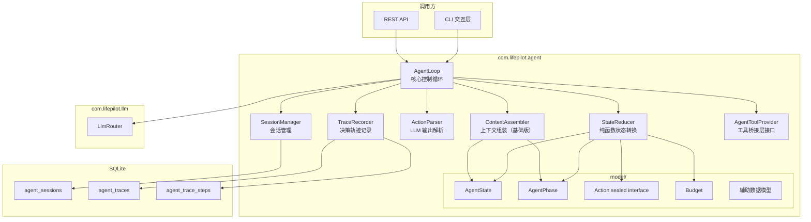
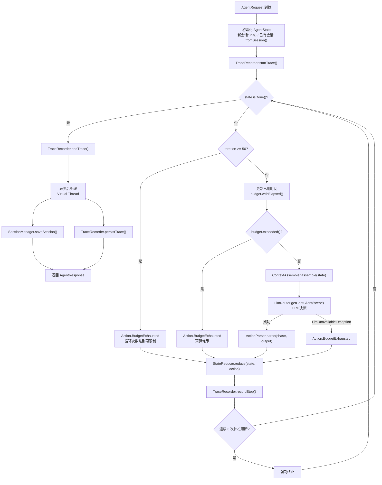
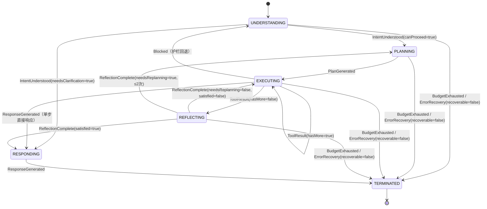
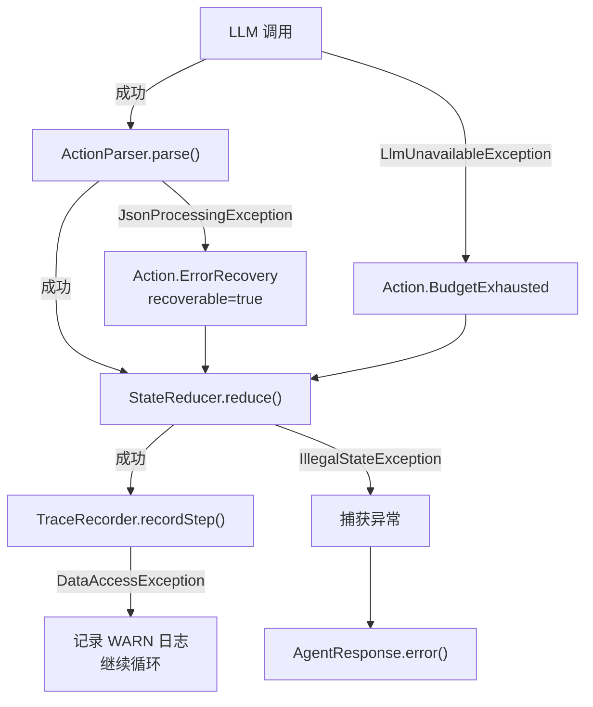

# Design Document — Agent Core

## Overview

本设计文档描述 Agent 引擎核心模块（Phase 1 第 2 项）的实现方案。Agent 引擎核心是 LifePilot 的状态化控制循环引擎，依赖已完成的 LLM Router 模块（`com.lifepilot.llm`），向上为工具系统和 MCP 协议支持提供 Agent 执行基础设施。

核心设计命题：**概率决策（LLM）与确定性状态（StateReducer）严格分离**。LLM 输出被解析为结构化 Action，由确定性的 StateReducer 执行状态转换，确保状态转换的可预测性、可测试性和可回放性。

参考文档：
- 架构设计：docs/architecture/agent-engine.md
- 特性设计：docs/features/agent-engine.md
- 编码规范：.kiro/steering/coding-standards.md
- 需求文档：.kiro/specs/agent-core/requirements.md

### 设计范围

本 spec 实现的组件：
- AgentState 不可变状态快照（record + @Builder）
- AgentPhase 执行阶段枚举（6 阶段 + 合法转换图）
- Action 密封接口（sealed interface + 9 个 record 实现）
- 辅助数据模型（TaskComplexity、AgentErrorType、RiskLevel、PlanStep、StepRecord、AgentRequest、AgentResponse、ExecutionPlan）
- StateReducer 纯函数状态转换器
- Budget 三维预算 record
- TraceRecorder 决策轨迹记录器
- ContextAssembler 基础版上下文组装器（不含记忆检索）
- TokenBudget 预算分配记录
- AssembledContext 上下文快照
- ActionParser LLM 输出解析器
- SessionManager 会话管理器
- AgentLoop 核心控制循环
- AgentToolProvider 工具桥接层接口 + NoOpAgentToolProvider
- SQLite 迁移脚本（V3、V4）
- Spring Boot 自动配置（AgentAutoConfiguration + AgentConfigProperties）

### 不包含

- 工具系统（ToolContract、DynamicToolRegistry、GuardrailEngine）— Phase 1 第 3 项
- MCP 协议支持 — Phase 1 第 4 项
- 记忆检索（ContextAssembler 完整版）— Phase 2
- 主动推理引擎（ProactiveReasoner）— Phase 3

### 依赖关系

- `com.lifepilot.llm.LlmRouter` — getChatClient(scene)、call()、callEntity()
- `com.lifepilot.llm.LlmUnavailableException` — LLM 不可用异常
- `com.lifepilot.llm.LlmScene` — 场景常量（本 spec 新增 agent-reasoning、agent-tool-calling、agent-generation 场景）
- Spring AI — ChatClient
- Spring Boot — JdbcTemplate、@ConfigurationProperties
- Jackson — ObjectMapper（JSON 序列化/反序列化）
- Lombok — @Builder(toBuilder=true)

---

## Architecture

### 组件关系图



### 核心控制循环流程



### AgentPhase 状态转换图



---

## Components and Interfaces

### 包结构

```
com.lifepilot.agent
├── model/
│   ├── AgentState.java              // 不可变状态快照 record
│   ├── AgentPhase.java              // 执行阶段枚举
│   ├── Action.java                  // 密封接口 + 9 个 record
│   ├── Budget.java                  // 三维预算 record
│   ├── StepRecord.java              // 已执行步骤记录 record
│   ├── PlanStep.java                // 计划步骤 record
│   ├── ExecutionPlan.java           // 执行计划 record
│   ├── TaskComplexity.java          // 任务复杂度枚举
│   ├── AgentErrorType.java          // 错误类型枚举
│   ├── RiskLevel.java               // 风险等级枚举
│   ├── AgentRequest.java            // 请求 record
│   └── AgentResponse.java           // 响应 record
├── context/
│   ├── ContextAssembler.java        // 上下文组装器（基础版）
│   ├── AssembledContext.java         // 上下文快照 record
│   └── TokenBudget.java             // Token 预算分配 record
├── trace/
│   ├── TraceRecorder.java           // 决策轨迹记录器
│   └── TraceStep.java               // 单步轨迹 record
├── session/
│   ├── SessionManager.java          // 会话管理器
│   ├── SessionSnapshot.java         // 会话快照 record
│   └── ConversationTurn.java        // 对话轮次 record
├── config/
│   ├── AgentAutoConfiguration.java  // Spring Boot 自动配置
│   └── AgentConfigProperties.java   // 配置属性绑定
├── AgentLoop.java                   // 核心控制循环
├── StateReducer.java                // 纯函数状态转换器
├── ActionParser.java                // LLM 输出解析器
└── AgentToolProvider.java           // 工具桥接层接口 + NoOpAgentToolProvider
```


### 关键接口设计

#### AgentState — 不可变状态快照

```java
/**
 * Agent 不可变状态快照。
 *
 * <p>每次状态转换生成新实例，旧实例保持不变。
 * 使用 {@code toBuilder()} 模式实现部分字段更新。</p>
 *
 * @author zsg
 * @since 2026-07-20
 */
@Builder(toBuilder = true)
public record AgentState(
    String traceId,
    String sessionId,
    String goal,
    AgentPhase phase,
    String channel,
    List<StepRecord> steps,
    int stepCount,
    @Nullable ExecutionPlan plan,
    int planStepIndex,
    List<String> shortTermMemory,
    List<String> mentionedEntities,
    Budget budget,
    @Nullable String parentTraceId,
    int depth,
    boolean done,
    @Nullable String finalOutput,
    @Nullable String terminationReason
) {
    /** 紧凑构造器 — 防御性拷贝。 */
    public AgentState {
        steps = List.copyOf(steps);
        shortTermMemory = List.copyOf(shortTermMemory);
        mentionedEntities = List.copyOf(mentionedEntities);
    }

    /** 创建初始状态。 */
    public static AgentState init(AgentRequest request) {
        return AgentState.builder()
            .traceId(UUID.randomUUID().toString())
            .sessionId(request.sessionId())
            .goal(request.message())
            .phase(AgentPhase.UNDERSTANDING)
            .channel(request.channel())
            .steps(List.of())
            .stepCount(0)
            .plan(null)
            .planStepIndex(0)
            .shortTermMemory(List.of())
            .mentionedEntities(List.of())
            .budget(Budget.defaultBudget())
            .parentTraceId(null)
            .depth(0)
            .done(false)
            .finalOutput(null)
            .terminationReason(null)
            .build();
    }

    /** 从会话快照恢复上下文。 */
    public static AgentState fromSession(SessionSnapshot session, AgentRequest request) {
        return AgentState.builder()
            .traceId(UUID.randomUUID().toString())
            .sessionId(session.sessionId())
            .goal(request.message())
            .phase(AgentPhase.UNDERSTANDING)
            .channel(session.channelId())
            .steps(List.of())
            .stepCount(0)
            .plan(null)
            .planStepIndex(0)
            .shortTermMemory(List.of())
            .mentionedEntities(session.mentionedEntities())
            .budget(Budget.defaultBudget())
            .parentTraceId(null)
            .depth(0)
            .done(false)
            .finalOutput(null)
            .terminationReason(null)
            .build();
    }

    /** 创建 SubAgent 子状态。 */
    public static AgentState forSubAgent(AgentState parentState, String subGoal, Budget subBudget) {
        return AgentState.builder()
            .traceId(UUID.randomUUID().toString())
            .sessionId(parentState.sessionId())
            .goal(subGoal)
            .phase(AgentPhase.UNDERSTANDING)
            .channel(parentState.channel())
            .steps(List.of())
            .stepCount(0)
            .plan(null)
            .planStepIndex(0)
            .shortTermMemory(List.of())
            .mentionedEntities(List.of())
            .budget(subBudget)
            .parentTraceId(parentState.traceId())
            .depth(parentState.depth() + 1)
            .done(false)
            .finalOutput(null)
            .terminationReason(null)
            .build();
    }

    /** 检查是否已完成。 */
    public boolean isDone() { return done; }

    /** 将最终状态转换为 AgentResponse。 */
    public AgentResponse toResponse() {
        return new AgentResponse(
            traceId, sessionId,
            finalOutput != null ? finalOutput : "",
            budget.tokensUsed(), stepCount, terminationReason
        );
    }
}
```

#### AgentPhase — 执行阶段枚举

```java
/**
 * Agent 执行阶段枚举。
 *
 * @author zsg
 * @since 2026-07-20
 */
public enum AgentPhase {
    UNDERSTANDING("意图理解"),
    PLANNING("任务规划"),
    EXECUTING("工具执行"),
    REFLECTING("反思评估"),
    RESPONDING("生成响应"),
    TERMINATED("终止");

    private final String description;

    AgentPhase(String description) { this.description = description; }

    public String description() { return description; }

    /** 判断是否允许转换到目标阶段。 */
    public boolean canTransitionTo(AgentPhase target) {
        return switch (this) {
            case UNDERSTANDING -> target == PLANNING
                               || target == RESPONDING
                               || target == TERMINATED;
            case PLANNING      -> target == EXECUTING
                               || target == TERMINATED;
            case EXECUTING     -> target == EXECUTING
                               || target == REFLECTING
                               || target == RESPONDING
                               || target == UNDERSTANDING
                               || target == TERMINATED;
            case REFLECTING    -> target == EXECUTING
                               || target == PLANNING
                               || target == RESPONDING
                               || target == TERMINATED;
            case RESPONDING    -> target == TERMINATED;
            case TERMINATED    -> false;
        };
    }

    /** 是否为终态。 */
    public boolean isTerminal() { return this == TERMINATED; }

    /** 是否为活跃阶段。 */
    public boolean isActive() { return this != TERMINATED; }
}
```

#### Action — 密封接口

```java
/**
 * Agent 动作密封接口。
 *
 * <p>定义 LLM 产生和系统产生的所有动作类型，
 * 是概率域与确定性域之间的桥梁。</p>
 *
 * @author zsg
 * @since 2026-07-20
 */
public sealed interface Action permits
    Action.IntentUnderstood,
    Action.PlanGenerated,
    Action.ToolResult,
    Action.ReflectionComplete,
    Action.ResponseGenerated,
    Action.BudgetExhausted,
    Action.Blocked,
    Action.ErrorRecovery,
    Action.SubAgentResult {

    record IntentUnderstood(
        String summary,
        boolean needsClarification,
        @Nullable String clarificationQuestion,
        boolean canProceed,
        List<String> entities,
        TaskComplexity complexity
    ) implements Action {
        public IntentUnderstood {
            entities = List.copyOf(entities);
        }
    }

    record PlanGenerated(
        List<PlanStep> steps,
        int estimatedTokens,
        String rationale
    ) implements Action {
        public PlanGenerated {
            steps = List.copyOf(steps);
        }
    }

    record ToolResult(
        String toolId,
        boolean success,
        String output,
        int tokensUsed,
        long latencyMs,
        boolean hasMore
    ) implements Action {}

    record ReflectionComplete(
        boolean satisfied,
        @Nullable String adjustmentPlan,
        String summary,
        boolean needsReplanning
    ) implements Action {}

    record ResponseGenerated(
        String content,
        List<String> suggestions
    ) implements Action {
        public ResponseGenerated {
            suggestions = List.copyOf(suggestions);
        }
    }

    record BudgetExhausted(String reason) implements Action {}

    record Blocked(
        String reason,
        @Nullable RiskLevel riskLevel,
        @Nullable String toolId
    ) implements Action {
        /** 简化构造器，仅接受 reason。 */
        public Blocked(String reason) {
            this(reason, null, null);
        }
    }

    record ErrorRecovery(
        AgentErrorType errorType,
        String errorMessage,
        boolean recoverable,
        @Nullable String recoveryStrategy
    ) implements Action {}

    record SubAgentResult(
        String subTraceId,
        String skillId,
        boolean success,
        String output,
        int tokensUsed
    ) implements Action {}
}
```

#### 辅助数据模型

```java
/** 任务复杂度枚举。 */
public enum TaskComplexity {
    SIMPLE,    // 单步或无需工具
    MODERATE,  // 2-5 步
    COMPLEX    // 5+ 步或需要 SubAgent
}

/** Agent 错误类型枚举。 */
public enum AgentErrorType {
    LLM_UNAVAILABLE,
    LLM_PARSE_FAILURE,
    TOOL_EXECUTION_FAILURE,
    TOOL_TIMEOUT,
    GUARDRAIL_VIOLATION,
    INTERNAL_ERROR
}

/** 风险等级枚举。 */
public enum RiskLevel {
    LOW, MEDIUM, HIGH, CRITICAL
}

/**
 * 计划步骤 record。
 *
 * @author zsg
 * @since 2026-07-20
 */
public record PlanStep(
    int index,
    String toolId,
    Map<String, Object> params,
    List<Integer> dependsOn,
    String description
) {
    public PlanStep {
        params = Map.copyOf(params);
        dependsOn = List.copyOf(dependsOn);
    }
}

/**
 * 执行计划 record。
 *
 * @author zsg
 * @since 2026-07-20
 */
public record ExecutionPlan(
    List<PlanStep> steps,
    int estimatedTokens,
    String rationale
) {
    public ExecutionPlan {
        steps = List.copyOf(steps);
    }
}

/**
 * 已执行步骤记录 record。
 *
 * @author zsg
 * @since 2026-07-20
 */
public record StepRecord(
    @Nullable String toolId,
    boolean success,
    String output,
    boolean blocked,
    int tokensUsed,
    long latencyMs
) {}

/**
 * Agent 请求 record。
 *
 * @author zsg
 * @since 2026-07-20
 */
public record AgentRequest(
    String message,
    String sessionId,
    String channel
) {}

/**
 * Agent 响应 record。
 *
 * @author zsg
 * @since 2026-07-20
 */
public record AgentResponse(
    String traceId,
    String sessionId,
    String content,
    int tokensUsed,
    int stepCount,
    @Nullable String terminationReason
) {
    /** 错误响应工厂方法。 */
    public static AgentResponse error(AgentState state, Exception exception) {
        return new AgentResponse(
            state.traceId(),
            state.sessionId(),
            "处理请求时发生错误: " + exception.getMessage(),
            state.budget().tokensUsed(),
            state.stepCount(),
            "异常终止: " + exception.getClass().getSimpleName()
        );
    }
}
```


#### Budget — 三维预算

```java
/**
 * 三维预算 record（Token / 步骤 / 时间）。
 *
 * <p>任一维度超限即触发终止，支持 SubAgent 预算分配。</p>
 *
 * @author zsg
 * @since 2026-07-20
 */
@Builder(toBuilder = true)
public record Budget(
    int maxTokens,
    int tokensUsed,
    int tokensReserved,
    int maxSteps,
    Duration maxDuration,
    Duration elapsed
) {
    /** 默认预算：32000 Token、20 步、120 秒。 */
    public static Budget defaultBudget() {
        return Budget.builder()
            .maxTokens(32000).tokensUsed(0).tokensReserved(0)
            .maxSteps(20)
            .maxDuration(Duration.ofSeconds(120))
            .elapsed(Duration.ZERO)
            .build();
    }

    /** 任一维度超限返回 true。 */
    public boolean exceeded() {
        return tokensUsed >= maxTokens
            || elapsed.compareTo(maxDuration) >= 0;
    }

    /** 返回具体超限原因。 */
    public String exceedReason() {
        if (tokensUsed >= maxTokens) return "Token 预算耗尽: " + tokensUsed + "/" + maxTokens;
        if (elapsed.compareTo(maxDuration) >= 0) return "时间预算耗尽: " + elapsed + "/" + maxDuration;
        return "预算未超限";
    }

    /** 剩余可用 Token。 */
    public int tokensRemaining() {
        return Math.max(0, maxTokens - tokensUsed - tokensReserved);
    }

    /** 扣减 Token，返回新实例。 */
    public Budget deductTokens(int tokens) {
        return this.toBuilder().tokensUsed(this.tokensUsed + tokens).build();
    }

    /** 更新已用时间，返回新实例。 */
    public Budget withElapsed(Duration elapsed) {
        return this.toBuilder().elapsed(elapsed).build();
    }

    /** 为 SubAgent 分配预算。 */
    public Budget allocateForSubAgent(double ratio) {
        int subTokens = (int) (tokensRemaining() * ratio);
        int subSteps = (int) (maxSteps * ratio);
        Duration subDuration = maxDuration.multipliedBy((long) (ratio * 100)).dividedBy(100);
        return Budget.builder()
            .maxTokens(subTokens).tokensUsed(0).tokensReserved(0)
            .maxSteps(subSteps)
            .maxDuration(subDuration)
            .elapsed(Duration.ZERO)
            .build();
    }

    /** 归还 SubAgent 未使用的 Token。 */
    public Budget returnFromSubAgent(Budget subBudget) {
        int unused = subBudget.tokensRemaining();
        return this.toBuilder()
            .tokensReserved(Math.max(0, this.tokensReserved - unused))
            .build();
    }

    /** Token 使用率（0.0 ~ 1.0）。 */
    public double tokenUtilization() {
        return maxTokens == 0 ? 0.0 : (double) tokensUsed / maxTokens;
    }

    /** 时间使用率（0.0 ~ 1.0）。 */
    public double timeUtilization() {
        return maxDuration.isZero() ? 0.0
            : (double) elapsed.toMillis() / maxDuration.toMillis();
    }
}
```


#### StateReducer — 纯函数状态转换器

```java
/**
 * 纯函数状态转换器。
 *
 * <p>核心契约：reduce(state, action) → newState。
 * 相同输入永远产生相同输出，无副作用。</p>
 *
 * @author zsg
 * @since 2026-07-20
 */
@Service
public class StateReducer {

    private static final Logger log = LoggerFactory.getLogger(StateReducer.class);

    /** 反思→规划回退最大次数。 */
    private static final int MAX_REVISION_CYCLES = 2;

    /**
     * 核心状态转换方法。
     *
     * @param state  当前不可变状态
     * @param action 待处理的动作
     * @return 新的不可变状态
     * @throws IllegalStateException 阶段转换不合法时
     */
    public AgentState reduce(AgentState state, Action action) {
        // 吸收态：TERMINATED 后忽略所有动作
        if (state.phase().isTerminal()) {
            return state;
        }

        return switch (action) {
            case Action.IntentUnderstood a -> reduceIntentUnderstood(state, a);
            case Action.PlanGenerated a    -> reducePlanGenerated(state, a);
            case Action.ToolResult a       -> reduceToolResult(state, a);
            case Action.ReflectionComplete a -> reduceReflectionComplete(state, a);
            case Action.ResponseGenerated a -> reduceResponseGenerated(state, a);
            case Action.BudgetExhausted a  -> reduceBudgetExhausted(state, a);
            case Action.Blocked a          -> reduceBlocked(state, a);
            case Action.ErrorRecovery a    -> reduceErrorRecovery(state, a);
            case Action.SubAgentResult a   -> reduceSubAgentResult(state, a);
        };
    }

    // 每个 reduce 子方法负责：
    // 1. 验证阶段转换合法性
    // 2. 构建新的 StepRecord 追加到 steps
    // 3. 递增 stepCount
    // 4. 返回新的 AgentState

    private AgentState reduceIntentUnderstood(AgentState state, Action.IntentUnderstood a) { ... }
    private AgentState reducePlanGenerated(AgentState state, Action.PlanGenerated a) { ... }
    private AgentState reduceToolResult(AgentState state, Action.ToolResult a) { ... }
    private AgentState reduceReflectionComplete(AgentState state, Action.ReflectionComplete a) { ... }
    private AgentState reduceResponseGenerated(AgentState state, Action.ResponseGenerated a) { ... }
    private AgentState reduceBudgetExhausted(AgentState state, Action.BudgetExhausted a) { ... }
    private AgentState reduceBlocked(AgentState state, Action.Blocked a) { ... }
    private AgentState reduceErrorRecovery(AgentState state, Action.ErrorRecovery a) { ... }
    private AgentState reduceSubAgentResult(AgentState state, Action.SubAgentResult a) { ... }

    /** 验证阶段转换合法性。 */
    private void validateTransition(AgentPhase from, AgentPhase to) {
        if (!from.canTransitionTo(to)) {
            throw new IllegalStateException(
                "非法阶段转换: " + from + " → " + to);
        }
    }
}
```

关键转换逻辑摘要：

| Action | 条件 | 目标 Phase | 附加操作 |
|--------|------|-----------|---------|
| IntentUnderstood | needsClarification=true | RESPONDING | 设置 finalOutput 为澄清问题 |
| IntentUnderstood | canProceed=true | PLANNING | 更新 mentionedEntities |
| PlanGenerated | — | EXECUTING | 存储 plan、重置 planStepIndex |
| ToolResult | hasMore=true | EXECUTING | 追加 StepRecord |
| ToolResult | hasMore=false | REFLECTING | 追加 StepRecord |
| ReflectionComplete | satisfied=true | RESPONDING | — |
| ReflectionComplete | needsReplanning=true, ≤2次 | PLANNING | 递增修正计数 |
| ReflectionComplete | needsReplanning=true, >2次 | RESPONDING | 强制进入响应 |
| ResponseGenerated | — | TERMINATED | done=true, 存储 finalOutput |
| BudgetExhausted | — | TERMINATED | done=true, 记录终止原因 |
| Blocked | riskLevel=CRITICAL | TERMINATED | done=true |
| Blocked | riskLevel=HIGH | UNDERSTANDING | 护栏回退 |
| Blocked | riskLevel=LOW/MEDIUM/null | 保持当前 | — |
| ErrorRecovery | recoverable=false | TERMINATED | done=true |
| ErrorRecovery | recoverable=true | 保持当前 | 允许重试 |
| SubAgentResult | — | REFLECTING | 追加 StepRecord |


#### TraceRecorder — 决策轨迹记录器

```java
/**
 * 决策轨迹记录器。
 *
 * <p>记录每步的输入/输出/状态变化/Token 消耗，支持完整回放。
 * 内存中使用 ConcurrentHashMap 缓存轨迹，persistTrace() 时写入 SQLite。</p>
 *
 * @author zsg
 * @since 2026-07-20
 */
@Service
public class TraceRecorder {

    private final JdbcTemplate jdbcTemplate;
    private final ObjectMapper objectMapper;
    // ConcurrentHashMap<String, TraceContext> 内存缓存
    // TraceContext 包含 traceId, sessionId, userMessage, List<TraceStep>, startTime

    /** 创建新的轨迹记录上下文。 */
    public TraceContext startTrace(String traceId, String sessionId, String userMessage);

    /** 记录单步轨迹信息。 */
    public void recordStep(TraceContext context, TraceStep step);

    /** 完成轨迹记录。 */
    public void endTrace(TraceContext context, @Nullable String finalOutput,
                         boolean success, @Nullable String errorMessage,
                         @Nullable String terminationReason);

    /** 将内存中的轨迹数据持久化到 SQLite。 */
    public void persistTrace(String traceId);

    /** 从数据库加载完整轨迹记录。 */
    public Optional<TraceRecord> findTrace(String traceId);

    /** 查询指定会话的所有轨迹。 */
    public List<TraceRecord> findTracesBySession(String sessionId);
}
```

#### TraceStep — 单步轨迹 record

```java
/**
 * 单步轨迹记录。
 *
 * @author zsg
 * @since 2026-07-20
 */
@Builder(toBuilder = true)
public record TraceStep(
    String traceId,
    int stepIndex,
    AgentPhase phaseBefore,
    AgentPhase phaseAfter,
    Action action,
    @Nullable String toolId,
    @Nullable String toolInput,
    @Nullable String toolOutput,
    boolean blocked,
    @Nullable String blockReason,
    int tokensUsed,
    long latencyMs,
    Instant timestamp
) {}
```


#### ContextAssembler — 基础版上下文组装器

```java
/**
 * 基础版上下文组装器。
 *
 * <p>根据 AgentPhase 分配 Token 预算到六个槽位，
 * 组装 System Prompt 和 User Prompt。
 * 基础版不含记忆检索，记忆检索槽位返回空列表。</p>
 *
 * @author zsg
 * @since 2026-07-20
 */
@Service
public class ContextAssembler {

    private final AgentConfigProperties config;

    /** 根据当前状态组装上下文。 */
    public AssembledContext assemble(AgentState state);

    /** 构建阶段专用 System Prompt。 */
    String buildSystemPrompt(AgentPhase phase);

    /** 构建结构化 User Prompt。 */
    String buildUserPrompt(AgentState state);
}
```

Token 预算分配比例（六个槽位：System Prompt / 对话历史 / 记忆检索 / 工具 Schema / 工具结果 / 保留缓冲）：

| AgentPhase | System | History | Memory | Tool Schema | Tool Result | Reserved |
|------------|--------|---------|--------|-------------|-------------|----------|
| UNDERSTANDING | 15% | 30% | 35% | 10% | 0% | 10% |
| PLANNING | 15% | 20% | 15% | 35% | 5% | 10% |
| EXECUTING | 10% | 10% | 5% | 40% | 25% | 10% |
| REFLECTING | 10% | 15% | 10% | 5% | 50% | 10% |
| RESPONDING | 15% | 25% | 20% | 0% | 30% | 10% |

#### TokenBudget — 预算分配记录

```java
/**
 * Token 预算分配与消耗记录。
 *
 * @author zsg
 * @since 2026-07-20
 */
public record TokenBudget(
    int systemPromptBudget, int historyBudget, int memoryBudget,
    int toolSchemaBudget, int toolResultBudget, int reservedBuffer,
    int systemPromptUsed, int historyUsed, int memoryUsed,
    int toolSchemaUsed, int toolResultUsed
) {
    /** 根据阶段和总 Token 数按比例创建预算分配。 */
    public static TokenBudget allocate(AgentPhase phase, int totalTokens);

    /** 所有槽位预算之和。 */
    public int totalBudget();

    /** 所有槽位实际消耗之和。 */
    public int totalConsumed();

    /** 当 totalConsumed 超过 totalBudget - reservedBuffer 时返回 true。 */
    public boolean isOverBudget();
}
```

#### AssembledContext — 上下文快照

```java
/**
 * 组装完成的上下文快照。
 *
 * @author zsg
 * @since 2026-07-20
 */
public record AssembledContext(
    String systemPrompt,
    String userPrompt,
    List<String> retrievedMemories,
    TokenBudget tokenBudget
) {
    public AssembledContext {
        retrievedMemories = List.copyOf(retrievedMemories);
    }

    /** 返回 tokenBudget.totalConsumed()。 */
    public int totalTokens() { return tokenBudget.totalConsumed(); }
}
```


#### ActionParser — LLM 输出解析器

```java
/**
 * LLM 输出解析器。
 *
 * <p>将 LLM 的 JSON 输出解析为对应的 Action 类型。
 * 使用 Jackson ObjectMapper 进行 JSON 反序列化。</p>
 *
 * @author zsg
 * @since 2026-07-20
 */
@Service
public class ActionParser {

    private final ObjectMapper objectMapper;

    /**
     * 根据当前阶段将 LLM 输出解析为 Action。
     *
     * @param phase     当前 AgentPhase
     * @param llmOutput LLM 的 JSON 输出
     * @return 解析后的 Action
     */
    public Action parse(AgentPhase phase, String llmOutput);

    /**
     * 将 Action 序列化为 JSON。
     *
     * @param action Action 实例
     * @return JSON 字符串
     */
    public String serialize(Action action);
}
```

阶段到 Action 类型的映射：

| AgentPhase | 解析目标 Action |
|------------|----------------|
| UNDERSTANDING | Action.IntentUnderstood |
| PLANNING | Action.PlanGenerated |
| REFLECTING | Action.ReflectionComplete |
| RESPONDING | Action.ResponseGenerated |
| EXECUTING | 不通过 ActionParser 解析（工具调用由 Spring AI 处理） |

解析失败时返回 `Action.ErrorRecovery(LLM_PARSE_FAILURE, errorMessage, true, null)`。

#### SessionManager — 会话管理器

```java
/**
 * 会话管理器。
 *
 * <p>支持多轮对话的会话持久化（SQLite）和恢复。
 * 使用 JdbcTemplate 操作 agent_sessions 表，
 * JSON 序列化使用 Jackson ObjectMapper。</p>
 *
 * @author zsg
 * @since 2026-07-20
 */
@Service
public class SessionManager {

    private final JdbcTemplate jdbcTemplate;
    private final ObjectMapper objectMapper;
    private final AgentConfigProperties config;

    /** 查找会话。 */
    public Optional<SessionSnapshot> findSession(String sessionId);

    /** 保存会话（仅保留最近 N 轮对话）。 */
    public void saveSession(AgentState state);

    /** 删除会话。 */
    public void deleteSession(String sessionId);

    /** 定时清理过期会话（@Scheduled）。 */
    public void cleanupExpiredSessions();
}
```

#### SessionSnapshot — 会话快照

```java
/**
 * 会话快照 record。
 *
 * @author zsg
 * @since 2026-07-20
 */
public record SessionSnapshot(
    String sessionId,
    String channelId,
    List<ConversationTurn> recentTurns,
    List<String> mentionedEntities,
    Instant lastActiveAt,
    int totalTurns,
    int totalTokensUsed
) {
    public SessionSnapshot {
        recentTurns = List.copyOf(recentTurns);
        mentionedEntities = List.copyOf(mentionedEntities);
    }

    /** 当距 lastActiveAt 超过 timeout 时返回 true。 */
    public boolean isExpired(Duration timeout) {
        return Duration.between(lastActiveAt, Instant.now()).compareTo(timeout) > 0;
    }
}
```

#### ConversationTurn — 对话轮次

```java
/**
 * 对话轮次 record。
 *
 * @author zsg
 * @since 2026-07-20
 */
public record ConversationTurn(
    String userMessage,
    String agentResponse,
    List<String> toolsUsed,
    Instant timestamp
) {
    public ConversationTurn {
        toolsUsed = List.copyOf(toolsUsed);
    }
}
```


#### AgentLoop — 核心控制循环

```java
/**
 * Agent 核心控制循环。
 *
 * <p>协调 LLM 调用、状态转换、预算检查、轨迹记录，
 * 循环执行直到终止条件满足。</p>
 *
 * @author zsg
 * @since 2026-07-20
 */
@Service
public class AgentLoop {

    private static final int MAX_LOOP_ITERATIONS = 50;
    private static final int MAX_CONSECUTIVE_BLOCKS = 3;

    private final StateReducer stateReducer;
    private final ContextAssembler contextAssembler;
    private final LlmRouter llmRouter;
    private final TraceRecorder traceRecorder;
    private final SessionManager sessionManager;
    private final ActionParser actionParser;
    private final AgentToolProvider agentToolProvider;
    private final AgentConfigProperties config;

    /**
     * 执行 Agent 循环。
     *
     * @param request 用户请求
     * @return Agent 响应
     */
    public AgentResponse run(AgentRequest request);
}
```

AgentLoop.run() 核心流程：

1. 初始化 AgentState（新会话 → `init()`，已有会话 → `fromSession()`）
2. `traceRecorder.startTrace()`
3. while 循环：
   - 检查 `iteration >= MAX_LOOP_ITERATIONS` → `BudgetExhausted`
   - 更新已用时间 → `budget.withElapsed()`
   - 检查 `budget.exceeded()` → `BudgetExhausted`
   - `contextAssembler.assemble(state)` 组装上下文
   - `llmRouter.getChatClient(scene)` 获取 ChatClient，根据 phase 映射场景
   - LLM 调用，捕获 `LlmUnavailableException` → `BudgetExhausted`
   - `actionParser.parse(phase, output)` 解析 Action
   - `stateReducer.reduce(state, action)` 状态转换
   - `traceRecorder.recordStep()` 记录轨迹
   - 检查连续 3 次护栏阻断 → 强制终止
4. `traceRecorder.endTrace()`
5. 异步后处理（Virtual Thread）：`sessionManager.saveSession()` + `traceRecorder.persistTrace()`
6. 返回 `state.toResponse()`
7. 异常捕获 → `AgentResponse.error()`

场景映射（可通过 `config.loop.sceneMapping` 配置覆盖）：

| AgentPhase | LLM Scene |
|------------|-----------|
| UNDERSTANDING | agent-reasoning |
| PLANNING | agent-reasoning |
| EXECUTING | agent-tool-calling |
| REFLECTING | agent-reasoning |
| RESPONDING | agent-generation |

#### AgentToolProvider — 工具桥接层接口

```java
/**
 * 工具桥接层接口。
 *
 * <p>AgentLoop 通过此接口获取工具回调。
 * 本 spec 仅提供空实现，具体实现在工具系统 spec 中完成。</p>
 *
 * @author zsg
 * @since 2026-07-20
 */
public interface AgentToolProvider {

    /**
     * 获取工具回调列表。
     *
     * @param state 当前 Agent 状态
     * @return 工具回调列表（Spring AI ToolCallback）
     */
    List<ToolCallback> getToolCallbacks(AgentState state);
}

/**
 * 空实现，返回空列表。
 *
 * @author zsg
 * @since 2026-07-20
 */
@Service
public class NoOpAgentToolProvider implements AgentToolProvider {
    @Override
    public List<ToolCallback> getToolCallbacks(AgentState state) {
        return List.of();
    }
}
```


#### AgentAutoConfiguration — Spring Boot 自动配置

```java
/**
 * Agent 引擎 Spring Boot 自动配置。
 *
 * @author zsg
 * @since 2026-07-20
 */
@AutoConfiguration
@EnableConfigurationProperties(AgentConfigProperties.class)
@ConditionalOnProperty(prefix = "lifepilot.agent", name = "enabled",
    havingValue = "true", matchIfMissing = true)
public class AgentAutoConfiguration {

    @Bean @ConditionalOnMissingBean
    public StateReducer stateReducer();

    @Bean @ConditionalOnMissingBean
    public ContextAssembler contextAssembler(AgentConfigProperties config);

    @Bean @ConditionalOnMissingBean
    public TraceRecorder traceRecorder(JdbcTemplate jdbcTemplate, ObjectMapper objectMapper);

    @Bean @ConditionalOnMissingBean
    public SessionManager sessionManager(JdbcTemplate jdbcTemplate,
                                          ObjectMapper objectMapper,
                                          AgentConfigProperties config);

    @Bean @ConditionalOnMissingBean
    public ActionParser actionParser(ObjectMapper objectMapper);

    @Bean @ConditionalOnMissingBean
    public AgentToolProvider agentToolProvider();  // 返回 NoOpAgentToolProvider

    @Bean @ConditionalOnMissingBean
    public AgentLoop agentLoop(StateReducer stateReducer,
                                ContextAssembler contextAssembler,
                                LlmRouter llmRouter,
                                TraceRecorder traceRecorder,
                                SessionManager sessionManager,
                                ActionParser actionParser,
                                AgentToolProvider agentToolProvider,
                                AgentConfigProperties config);
}
```

#### AgentConfigProperties — 配置属性绑定

```java
/**
 * Agent 引擎配置属性。
 *
 * @author zsg
 * @since 2026-07-20
 */
@ConfigurationProperties(prefix = "lifepilot.agent")
public class AgentConfigProperties {

    private boolean enabled = true;
    private LoopConfig loop = new LoopConfig();
    private BudgetConfig budget = new BudgetConfig();
    private ContextConfig context = new ContextConfig();
    private SessionConfig session = new SessionConfig();

    public static class LoopConfig {
        private int maxIterations = 50;
        private Map<String, String> sceneMapping = Map.of(
            "understanding", "agent-reasoning",
            "planning", "agent-reasoning",
            "executing", "agent-tool-calling",
            "reflecting", "agent-reasoning",
            "responding", "agent-generation"
        );
        // getter / setter
    }

    public static class BudgetConfig {
        private int defaultMaxTokens = 32000;
        private int defaultMaxSteps = 20;
        private int defaultMaxDurationSeconds = 120;
        private double subAgentBudgetRatio = 0.3;
        // getter / setter
    }

    public static class ContextConfig {
        private int maxContextTokens = 32000;
        private int outputReservedTokens = 4000;
        // getter / setter
    }

    public static class SessionConfig {
        private int timeoutMinutes = 30;
        private int maxRecentTurns = 10;
        private long cleanupIntervalMs = 300000;
        // getter / setter
    }

    // getter / setter
}
```

### 关键设计决策

| 决策 | 选择 | 理由 |
|------|------|------|
| AgentState 使用 record + @Builder | Lombok @Builder(toBuilder=true) | record 保证不可变性，@Builder 提供便捷的部分更新 |
| Action 使用 sealed interface | 9 个 record 实现 | 编译器保证 switch 穷举匹配，新增 Action 类型时编译错误提醒 |
| StateReducer 是 @Service Bean | 纯函数，无状态 | 便于 Spring 管理和测试注入，reduce() 本身是纯函数 |
| TraceRecorder 内存缓存 + 异步持久化 | ConcurrentHashMap + Virtual Thread | 不阻塞 Agent 循环，持久化失败不影响响应 |
| SessionManager 使用 JdbcTemplate | 直接 SQL 操作 | 简单直接，无需 ORM 开销 |
| ActionParser 使用 Jackson ObjectMapper | JSON 序列化/反序列化 | Spring Boot 默认集成，支持 sealed interface 多态 |
| AgentToolProvider 定义为接口 | NoOp 空实现 | 解耦 Agent 核心与工具系统，工具系统 spec 提供具体实现 |
| 异步后处理使用 Virtual Thread | Executors.newVirtualThreadPerTaskExecutor | Java 22 原生支持，I/O 密集型任务最佳选择 |
| ContextAssembler 基础版不含记忆检索 | 记忆检索槽位返回空列表 | 记忆系统在 Phase 2，基础版先占位 |
| AgentConfigProperties 使用 JavaBean 风格 | 嵌套 static class + getter/setter | Spring Boot @ConfigurationProperties 绑定要求 |

---

## Data Models

### 数据库 Schema

#### V3__create_agent_sessions.sql

```sql
-- Agent 会话表
CREATE TABLE IF NOT EXISTS agent_sessions (
    id                      TEXT PRIMARY KEY,
    channel_id              TEXT NOT NULL,
    recent_turns_json       TEXT NOT NULL DEFAULT '[]',
    mentioned_entities_json TEXT NOT NULL DEFAULT '[]',
    active_task_context     TEXT,
    last_active_at          TEXT NOT NULL,
    total_turns             INTEGER NOT NULL DEFAULT 0,
    total_tokens_used       INTEGER NOT NULL DEFAULT 0,
    archived                INTEGER NOT NULL DEFAULT 0,
    created_at              TEXT NOT NULL,
    updated_at              TEXT NOT NULL
);

CREATE INDEX IF NOT EXISTS idx_agent_sessions_channel
    ON agent_sessions(channel_id, last_active_at);
CREATE INDEX IF NOT EXISTS idx_agent_sessions_active
    ON agent_sessions(archived, last_active_at);
```

#### V4__create_agent_traces.sql

```sql
-- Agent 轨迹表
CREATE TABLE IF NOT EXISTS agent_traces (
    id                TEXT PRIMARY KEY,
    session_id        TEXT NOT NULL,
    user_message      TEXT NOT NULL,
    final_output      TEXT,
    success           INTEGER NOT NULL DEFAULT 1,
    error_message     TEXT,
    termination_reason TEXT,
    total_steps       INTEGER NOT NULL DEFAULT 0,
    total_tokens      INTEGER NOT NULL DEFAULT 0,
    duration_ms       INTEGER NOT NULL DEFAULT 0,
    model_id          TEXT,
    parent_trace_id   TEXT,
    depth             INTEGER NOT NULL DEFAULT 0,
    created_at        TEXT NOT NULL,
    FOREIGN KEY (session_id) REFERENCES agent_sessions(id)
);

CREATE INDEX IF NOT EXISTS idx_agent_traces_session
    ON agent_traces(session_id, created_at);
CREATE INDEX IF NOT EXISTS idx_agent_traces_time
    ON agent_traces(created_at);

-- Agent 轨迹步骤表
CREATE TABLE IF NOT EXISTS agent_trace_steps (
    id              TEXT PRIMARY KEY,
    trace_id        TEXT NOT NULL,
    step_index      INTEGER NOT NULL,
    phase_before    TEXT NOT NULL,
    phase_after     TEXT NOT NULL,
    action_type     TEXT NOT NULL,
    action_json     TEXT NOT NULL,
    tool_id         TEXT,
    tool_input_json TEXT,
    tool_output     TEXT,
    success         INTEGER NOT NULL DEFAULT 1,
    blocked         INTEGER NOT NULL DEFAULT 0,
    block_reason    TEXT,
    tokens_used     INTEGER NOT NULL DEFAULT 0,
    latency_ms      INTEGER NOT NULL DEFAULT 0,
    created_at      TEXT NOT NULL,
    FOREIGN KEY (trace_id) REFERENCES agent_traces(id)
);

CREATE INDEX IF NOT EXISTS idx_trace_steps_trace
    ON agent_trace_steps(trace_id, step_index);
```


### application.yml 配置

```yaml
lifepilot:
  agent:
    enabled: true
    loop:
      max-iterations: 50
      scene-mapping:
        understanding: agent-reasoning
        planning: agent-reasoning
        executing: agent-tool-calling
        reflecting: agent-reasoning
        responding: agent-generation
    budget:
      default-max-tokens: 32000
      default-max-steps: 20
      default-max-duration-seconds: 120
      sub-agent-budget-ratio: 0.3
    context:
      max-context-tokens: 32000
      output-reserved-tokens: 4000
    session:
      timeout-minutes: 30
      max-recent-turns: 10
      cleanup-interval-ms: 300000
```

测试配置 `application-test.yml` 中添加：

```yaml
lifepilot:
  agent:
    enabled: false
```

---

## Correctness Properties

*A property is a characteristic or behavior that should hold true across all valid executions of a system — essentially, a formal statement about what the system should do. Properties serve as the bridge between human-readable specifications and machine-verifiable correctness guarantees.*

### Property 1: Record 集合字段防御性拷贝不变量

*For any* AgentState、Action（IntentUnderstood / PlanGenerated / ResponseGenerated）、PlanStep、AssembledContext、SessionSnapshot、ConversationTurn 实例，构造时传入可变 List 或 Map 后，修改原始集合不应影响 record 内部存储的值。

**Validates: Requirements 1.3, 3.11, 11.2**

### Property 2: AgentState.init() 初始状态不变量

*For any* AgentRequest，调用 AgentState.init(request) 返回的状态应满足：phase == UNDERSTANDING、stepCount == 0、depth == 0、done == false、steps 为空列表、goal 等于 request.message()、sessionId 等于 request.sessionId()。

**Validates: Requirements 1.4**

### Property 3: AgentState.fromSession() 会话恢复不变量

*For any* SessionSnapshot 和 AgentRequest，调用 AgentState.fromSession(session, request) 返回的状态应满足：phase == UNDERSTANDING、stepCount == 0、done == false、sessionId 等于 session.sessionId()、goal 等于 request.message()、traceId 不等于任何已有 traceId（新生成）、mentionedEntities 等于 session.mentionedEntities()。

**Validates: Requirements 1.5**

### Property 4: AgentState.forSubAgent() 子状态不变量

*For any* AgentState 和 subGoal、subBudget，调用 forSubAgent() 返回的子状态应满足：sessionId 等于父状态的 sessionId、depth 等于父状态 depth + 1、parentTraceId 等于父状态 traceId、traceId 不等于父状态 traceId、phase == UNDERSTANDING、budget 等于 subBudget。

**Validates: Requirements 1.6**

### Property 5: AgentState.toResponse() 字段映射正确性

*For any* AgentState，toResponse() 返回的 AgentResponse 应满足：traceId 等于 state.traceId()、sessionId 等于 state.sessionId()、tokensUsed 等于 state.budget().tokensUsed()、stepCount 等于 state.stepCount()。

**Validates: Requirements 1.8**

### Property 6: AgentPhase 合法转换图完整性

*For any* AgentPhase 对 (source, target)，canTransitionTo(target) 的返回值应与预定义的合法转换集合一致。具体地：UNDERSTANDING 可转换到 {PLANNING, RESPONDING, TERMINATED}；PLANNING 可转换到 {EXECUTING, TERMINATED}；EXECUTING 可转换到 {EXECUTING, REFLECTING, RESPONDING, UNDERSTANDING, TERMINATED}；REFLECTING 可转换到 {EXECUTING, PLANNING, RESPONDING, TERMINATED}；RESPONDING 可转换到 {TERMINATED}；TERMINATED 不可转换到任何阶段。

**Validates: Requirements 2.2, 2.3, 2.4, 2.5, 2.6, 2.7, 2.8**

### Property 7: AgentPhase isTerminal/isActive 互补性

*For any* AgentPhase 值，isTerminal() 仅在 TERMINATED 时返回 true，且 isActive() == !isTerminal() 恒成立。

**Validates: Requirements 2.9, 2.10**

### Property 8: AgentResponse.error() 工厂方法正确性

*For any* AgentState 和 Exception，AgentResponse.error(state, exception) 返回的响应应包含 state.traceId()、state.sessionId()、exception.getMessage() 信息，且 terminationReason 非空。

**Validates: Requirements 4.7**

### Property 9: StateReducer stepCount 单调递增不变量

*For any* 合法的 (AgentState, Action) 组合（state.phase() 非 TERMINATED），reduce(state, action).stepCount() >= state.stepCount()。

**Validates: Requirements 6.1, 5.15**

### Property 10: StateReducer TERMINATED 吸收态不变量

*For any* Action 类型，当 AgentState.phase() == TERMINATED 时，reduce(state, action) 应返回与输入 state 完全相同的实例（引用相等或值相等）。

**Validates: Requirements 6.2, 5.14**

### Property 11: StateReducer steps 列表只增不减不变量

*For any* 合法的 (AgentState, Action) 组合，reduce(state, action).steps() 应包含 state.steps() 的所有元素（前缀保持不变）。

**Validates: Requirements 6.3**

### Property 12: StateReducer 阶段转换合法性不变量

*For any* 合法的 (AgentState, Action) 组合，若 reduce 产生阶段变化（newState.phase() != state.phase()），则 state.phase().canTransitionTo(newState.phase()) 必须返回 true。

**Validates: Requirements 6.4**

### Property 13: StateReducer 纯函数不变量

*For any* (AgentState, Action) 组合，调用 reduce(state, action) 两次应产生值相等的结果。

**Validates: Requirements 6.5**

### Property 14: StateReducer 阶段转换正确性

*For any* AgentState（phase=UNDERSTANDING）和 Action.IntentUnderstood，当 needsClarification=true 时 reduce 后 phase 应为 RESPONDING；当 canProceed=true 时 reduce 后 phase 应为 PLANNING。*For any* AgentState（phase=PLANNING）和 Action.PlanGenerated，reduce 后 phase 应为 EXECUTING。*For any* AgentState（phase=EXECUTING）和 Action.ToolResult，当 hasMore=true 时 phase 保持 EXECUTING，当 hasMore=false 时 phase 转为 REFLECTING。*For any* AgentState（phase=REFLECTING）和 Action.ReflectionComplete，当 satisfied=true 时 phase 转为 RESPONDING，当 needsReplanning=true 时 phase 转为 PLANNING。*For any* AgentState（phase=RESPONDING）和 Action.ResponseGenerated，reduce 后 phase 应为 TERMINATED 且 done=true。

**Validates: Requirements 5.3, 5.4, 5.5, 5.6, 5.7, 5.8, 5.9, 5.10**

### Property 15: StateReducer 终止动作正确性

*For any* 非 TERMINATED 的 AgentState 和 Action.BudgetExhausted，reduce 后 phase 应为 TERMINATED 且 done=true。*For any* 非 TERMINATED 的 AgentState 和 Action.ErrorRecovery(recoverable=false)，reduce 后 phase 应为 TERMINATED 且 done=true。*For any* 非 TERMINATED 的 AgentState 和 Action.Blocked(riskLevel=CRITICAL)，reduce 后 phase 应为 TERMINATED 且 done=true。

**Validates: Requirements 5.11, 5.12, 5.13**

### Property 16: Budget exceeded() OR 逻辑与 exceedReason() 一致性

*For any* Budget 实例，exceeded() 应在 tokensUsed >= maxTokens 或 elapsed >= maxDuration 时返回 true，否则返回 false。当 exceeded() 返回 true 时，exceedReason() 应返回非空的具体原因描述。

**Validates: Requirements 7.4, 7.5**

### Property 17: Budget tokensRemaining 与 deductTokens 一致性

*For any* Budget 和非负整数 n，tokensRemaining() 应等于 max(0, maxTokens - tokensUsed - tokensReserved)。deductTokens(n) 后新 Budget 的 tokensUsed 应等于原 tokensUsed + n，且新 Budget 的 tokensRemaining() 应等于原 tokensRemaining() - n（下限为 0）。

**Validates: Requirements 7.6, 7.7**

### Property 18: Budget withElapsed 不可变更新

*For any* Budget 和 Duration elapsed，withElapsed(elapsed) 返回的新 Budget 的 elapsed 应等于传入值，且其他字段不变。

**Validates: Requirements 7.8**

### Property 19: Budget SubAgent 预算分配与归还

*For any* Budget 和 ratio ∈ (0, 1)，allocateForSubAgent(ratio) 返回的子预算 maxTokens 应约等于 parent.tokensRemaining() × ratio。returnFromSubAgent(subBudget) 后父预算的 tokensReserved 应减少（归还未使用部分）。

**Validates: Requirements 7.9, 7.10**

### Property 20: Budget utilization 范围不变量

*For any* Budget（maxTokens > 0 且 tokensUsed ∈ [0, maxTokens]），tokenUtilization() 应在 [0.0, 1.0] 范围内。*For any* Budget（maxDuration > 0 且 elapsed ∈ [0, maxDuration]），timeUtilization() 应在 [0.0, 1.0] 范围内。

**Validates: Requirements 7.11**

### Property 21: Trace 持久化往返

*For any* 完整的轨迹记录（startTrace → recordStep × N → endTrace → persistTrace），调用 findTrace(traceId) 应返回包含所有步骤的轨迹记录，且 traceId、sessionId、userMessage、finalOutput、success、totalSteps 与原始数据一致。

**Validates: Requirements 8.5, 8.6, 8.7**

### Property 22: Trace 按会话查询过滤

*For any* sessionId，findTracesBySession(sessionId) 返回的所有轨迹记录的 sessionId 应等于查询参数。

**Validates: Requirements 8.8**

### Property 23: TokenBudget 阶段分配比例正确性

*For any* AgentPhase（非 TERMINATED）和正整数 totalTokens，TokenBudget.allocate(phase, totalTokens) 返回的六个槽位预算之和应等于 totalTokens，且各槽位比例应与预定义的阶段分配表一致（误差 ≤ 1，因整数截断）。

**Validates: Requirements 9.2, 9.3, 9.4, 9.5, 9.6, 9.7, 10.2**

### Property 24: ContextAssembler 基础版记忆检索为空

*For any* AgentState，ContextAssembler.assemble(state) 返回的 AssembledContext.retrievedMemories() 应为空列表。

**Validates: Requirements 9.8**

### Property 25: ContextAssembler 上下文包含必要信息

*For any* AgentState，assemble(state) 返回的 AssembledContext 应满足：systemPrompt 非空且包含阶段相关指令、userPrompt 非空且包含 state.goal() 和预算剩余信息。

**Validates: Requirements 9.9, 9.10**

### Property 26: TokenBudget 算术一致性

*For any* TokenBudget 实例，totalBudget() 应等于六个槽位预算之和，totalConsumed() 应等于五个槽位消耗之和，isOverBudget() 应在 totalConsumed() > totalBudget() - reservedBuffer 时返回 true。AssembledContext.totalTokens() 应等于其 tokenBudget.totalConsumed()。

**Validates: Requirements 10.3, 10.4, 10.5, 11.3**

### Property 27: ActionParser 序列化/反序列化往返

*For any* Action 实例（所有九种类型），serialize(action) 后对应阶段的 parse(phase, json) 应返回与原始 Action 值相等的实例。

**Validates: Requirements 12.1, 12.7**

### Property 28: ActionParser 无效输入返回 ErrorRecovery

*For any* 非法 JSON 字符串（空字符串、非 JSON 文本、结构不匹配的 JSON），parse(phase, invalidInput) 应返回 Action.ErrorRecovery，且 errorType == LLM_PARSE_FAILURE、recoverable == true。

**Validates: Requirements 12.6**

### Property 29: Session 持久化往返

*For any* AgentState，saveSession(state) 后 findSession(state.sessionId()) 应返回非空的 SessionSnapshot，且 sessionId、channelId 与原始数据一致。deleteSession(sessionId) 后 findSession(sessionId) 应返回 empty。

**Validates: Requirements 13.2, 13.3**

### Property 30: SessionSnapshot.isExpired() 正确性

*For any* SessionSnapshot 和 Duration timeout，当 Duration.between(lastActiveAt, now) > timeout 时 isExpired(timeout) 应返回 true，否则返回 false。

**Validates: Requirements 13.5**

### Property 31: Session 保存截断最近 N 轮

*For any* AgentState 包含超过 maxRecentTurns 轮对话，saveSession() 后 findSession() 返回的 SessionSnapshot.recentTurns() 长度应等于 maxRecentTurns，且保留的是最近的 N 轮。

**Validates: Requirements 13.7**

### Property 32: AgentPhase 到 LLM 场景映射完整性

*For any* 活跃的 AgentPhase（非 TERMINATED），场景映射应返回非空的 LLM 场景字符串，且 UNDERSTANDING/PLANNING/REFLECTING 映射到 agent-reasoning，EXECUTING 映射到 agent-tool-calling，RESPONDING 映射到 agent-generation。

**Validates: Requirements 14.4**

### Property 33: NoOpAgentToolProvider 返回空列表

*For any* AgentState，NoOpAgentToolProvider.getToolCallbacks(state) 应返回空列表。

**Validates: Requirements 15.2**


---

## Error Handling

### 异常层次

| 异常 | 触发条件 | 处理策略 |
|------|---------|---------|
| `LlmUnavailableException` | LLM 调用失败（来自 LlmRouter） | AgentLoop 生成 `Action.BudgetExhausted` 终止循环 |
| `IllegalStateException` | StateReducer 检测到非法阶段转换 | AgentLoop 捕获，返回 `AgentResponse.error()` |
| `JsonProcessingException` | ActionParser 解析 LLM 输出失败 | 返回 `Action.ErrorRecovery(LLM_PARSE_FAILURE, recoverable=true)` |
| `DataAccessException` | TraceRecorder/SessionManager 数据库操作失败 | 记录 WARN 日志，不影响 Agent 响应返回 |

### AgentLoop 错误处理流程



### 降级策略

| 场景 | 当前阶段 | 降级行为 |
|------|---------|---------|
| Budget 耗尽 | UNDERSTANDING | 提示用户简化请求 |
| Budget 耗尽 | EXECUTING | 返回已完成的部分结果 |
| Budget 耗尽 | REFLECTING | 返回执行结果摘要 |
| LLM 不可用 | 任意 | 生成 BudgetExhausted 终止 |
| ActionParser 解析失败 | 任意 | ErrorRecovery(recoverable=true)，允许重试一次 |
| 连续 3 次护栏阻断 | 任意 | 强制终止循环 |
| Trace 持久化失败 | 后处理 | WARN 日志，不影响响应 |
| Session 持久化失败 | 后处理 | WARN 日志，不影响响应 |

### 异步后处理容错

AgentLoop 循环完成后的后处理（Session 持久化 + Trace 持久化）使用 Virtual Thread 异步执行，不阻塞响应返回。每个后处理任务独立 try-catch，失败仅记录 WARN 日志：

```java
// 异步后处理（不阻塞响应返回）
var executor = Executors.newVirtualThreadPerTaskExecutor();
var finalState = state;
executor.submit(() -> {
    try {
        sessionManager.saveSession(finalState);
    } catch (Exception e) {
        log.warn("会话持久化失败: sessionId={}, error={}",
            finalState.sessionId(), e.getMessage());
    }
});
executor.submit(() -> {
    try {
        traceRecorder.persistTrace(finalState.traceId());
    } catch (Exception e) {
        log.warn("轨迹持久化失败: traceId={}, error={}",
            finalState.traceId(), e.getMessage());
    }
});
```

---

## Testing Strategy

### 测试框架

- **JUnit 5**：单元测试 + 属性测试 + 集成测试
- **不使用 jqwik**：属性测试通过 JUnit 5 参数化测试 + 随机数据生成器实现
- 测试方法名使用中文（编码规范要求）

### 属性测试配置

- 每个属性测试最少运行 100 次迭代
- 每个属性测试必须以注释引用设计文档中的 Property 编号
- 注释格式：`// Feature: agent-core, Property {number}: {property_text}`
- 使用自定义的随机数据生成器（Arbitrary）生成 AgentState、Action、Budget 等测试数据
- 每个 Correctness Property 由一个属性测试方法实现

### 测试分层

#### 单元测试（JUnit 5）

| 测试类 | 覆盖范围 |
|--------|---------|
| `AgentStateTest` | init()、fromSession()、forSubAgent()、toResponse()、防御性拷贝 |
| `AgentPhaseTest` | canTransitionTo() 完整转换图、isTerminal()、isActive() |
| `ActionTest` | 各 Action record 的防御性拷贝、简化构造器 |
| `BudgetTest` | defaultBudget()、exceeded()、tokensRemaining()、deductTokens()、withElapsed()、allocateForSubAgent()、returnFromSubAgent()、utilization |
| `StateReducerTest` | 所有 9 种 Action 的 reduce 逻辑、吸收态、非法转换 |
| `ActionParserTest` | 各阶段的 parse/serialize round-trip、无效输入处理 |
| `TokenBudgetTest` | allocate() 各阶段比例、totalBudget()、totalConsumed()、isOverBudget() |
| `AssembledContextTest` | 防御性拷贝、totalTokens() |
| `SessionSnapshotTest` | isExpired() |
| `AgentResponseTest` | error() 工厂方法 |

#### 属性测试（JUnit 5 参数化 + 随机生成器）

| 测试类 | 覆盖 Property |
|--------|-------------|
| `AgentStatePropertyTest` | Property 1（防御性拷贝）、Property 2（init 不变量）、Property 3（fromSession 不变量）、Property 4（forSubAgent 不变量）、Property 5（toResponse 映射） |
| `AgentPhasePropertyTest` | Property 6（转换图）、Property 7（isTerminal/isActive） |
| `StateReducerPropertyTest` | Property 9（stepCount 单调递增）、Property 10（吸收态）、Property 11（steps 只增不减）、Property 12（转换合法性）、Property 13（纯函数）、Property 14（阶段转换正确性）、Property 15（终止动作） |
| `BudgetPropertyTest` | Property 16（exceeded/exceedReason）、Property 17（tokensRemaining/deductTokens）、Property 18（withElapsed）、Property 19（SubAgent 分配归还）、Property 20（utilization 范围） |
| `ActionParserPropertyTest` | Property 27（round-trip）、Property 28（无效输入） |
| `TokenBudgetPropertyTest` | Property 23（阶段分配比例）、Property 26（算术一致性） |
| `ContextAssemblerPropertyTest` | Property 24（记忆为空）、Property 25（包含必要信息） |
| `SessionPropertyTest` | Property 29（持久化往返）、Property 30（isExpired）、Property 31（截断 N 轮） |
| `AgentPhaseSceneMappingPropertyTest` | Property 32（场景映射） |

#### 集成测试（@SpringBootTest）

| 测试类 | 覆盖范围 |
|--------|---------|
| `AgentAutoConfigurationTest` | 自动配置加载、Bean 注册、@ConditionalOnMissingBean 覆盖、enabled=false 禁用 |
| `AgentConfigPropertiesTest` | YAML 配置绑定、默认值验证 |
| `TraceRecorderIntegrationTest` | Property 21（Trace 持久化往返）、Property 22（按会话查询） |
| `SessionManagerIntegrationTest` | Property 29（Session 持久化往返）、Property 31（截断 N 轮）、过期清理 |
| `AgentLoopIntegrationTest` | 完整循环（Mock LLM）、Budget 耗尽终止、硬限制终止、LLM 不可用降级、连续护栏阻断终止 |
| `FlywayMigrationTest` | V3、V4 迁移脚本执行成功、表结构验证 |

### 随机数据生成器

为属性测试提供自定义的随机数据生成器：

```java
/**
 * Agent 核心模块测试数据生成器。
 *
 * @author zsg
 * @since 2026-07-20
 */
public final class AgentTestGenerators {

    private static final Random RANDOM = new Random();

    /** 生成随机 AgentRequest。 */
    public static AgentRequest randomRequest();

    /** 生成随机 AgentState（指定 phase）。 */
    public static AgentState randomState(AgentPhase phase);

    /** 生成随机 AgentState（随机 phase）。 */
    public static AgentState randomState();

    /** 生成与指定 phase 兼容的随机 Action。 */
    public static Action randomActionForPhase(AgentPhase phase);

    /** 生成随机 Action（任意类型）。 */
    public static Action randomAction();

    /** 生成随机 Budget。 */
    public static Budget randomBudget();

    /** 生成随机 SessionSnapshot。 */
    public static SessionSnapshot randomSessionSnapshot();

    /** 生成随机 TokenBudget。 */
    public static TokenBudget randomTokenBudget();
}
```

### Mock 策略

| 组件 | Mock 方式 |
|------|----------|
| LlmRouter | Mock getChatClient() 返回预设 ChatClient，Mock call() 返回预设响应 |
| ChatClient | Mock prompt().system().user().call().content() 链式调用 |
| JdbcTemplate | 集成测试使用内存 SQLite，单元测试使用 Mock |
| ObjectMapper | 使用真实 ObjectMapper（Jackson 默认配置） |
| AgentToolProvider | 使用 NoOpAgentToolProvider（返回空列表） |
