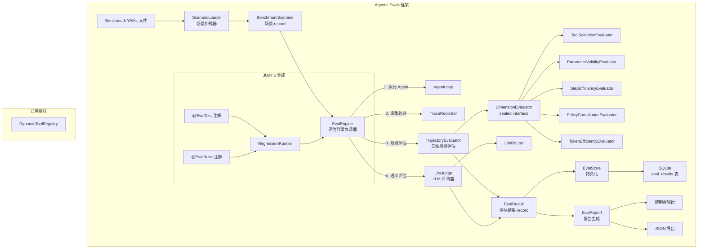

# Design Document: Agentic Evals

## Overview

本设计文档描述 LifePilot Agentic Evals 框架的实现方案。该框架为开发期提供系统性的 Agent 质量评估能力，支持声明式 Benchmark 场景定义、基于轨迹的五维规则评估、LLM-as-a-Judge 语义评估、JUnit 5 回归测试集成、评估结果持久化与退化告警。

新模块包名：`com.lifepilot.eval`

参考文档：
- 架构设计：#[[file:docs/architecture/observability.md]]（§6 轨迹评估引擎）
- 需求文档：#[[file:.kiro/specs/agentic-evals/requirements.md]]
- 编码规范：#[[file:.kiro/steering/coding-standards.md]]

### 依赖接口验证

| 接口 | 源码位置 | 验证状态 |
|------|---------|---------|
| `TraceRecorder.startTrace(String, String, String)` | `com.lifepilot.agent.trace.TraceRecorder` | ✅ 已核对 |
| `TraceRecorder.recordStep(TraceContext, TraceStep)` | `com.lifepilot.agent.trace.TraceRecorder` | ✅ 已核对 |
| `TraceRecorder.endTrace(TraceContext, String, boolean, String, String)` | `com.lifepilot.agent.trace.TraceRecorder` | ✅ 已核对 |
| `TraceRecorder.findTrace(String)` → `Optional<TraceRecord>` | `com.lifepilot.agent.trace.TraceRecorder` | ✅ 已核对 |
| `TraceStep` record（traceId, stepIndex, phaseBefore, phaseAfter, action, toolId, toolInput, toolOutput, blocked, blockReason, tokensUsed, latencyMs, timestamp） | `com.lifepilot.agent.trace.TraceStep` | ✅ 已核对 |
| `LlmRouter.call(String scene, String prompt, @Nullable String outputSchema)` → `LlmResponse` | `com.lifepilot.llm.LlmRouter` | ✅ 已核对 |
| `LlmRouter.callEntity(String scene, String prompt, Class<T> responseType)` → `T` | `com.lifepilot.llm.LlmRouter` | ✅ 已核对 |
| `DynamicToolRegistry.resolve(String toolId)` → `Optional<ToolContract>` | `com.lifepilot.tool.registry.DynamicToolRegistry` | ✅ 已核对 |
| `ToolContract.inputSchema()` → `JsonSchema` | `com.lifepilot.tool.ToolContract` | ✅ 已核对 |
| `AgentLoop.run(AgentRequest)` → `AgentResponse` | `com.lifepilot.agent.AgentLoop` | ✅ 已核对 |
| `Action` sealed interface（9 permits） | `com.lifepilot.agent.model.Action` | ✅ 已核对 |
| `AgentPhase` enum（6 值） | `com.lifepilot.agent.model.AgentPhase` | ✅ 已核对 |
| `GuardrailPolicy.checkToolCall(ToolContract, ToolInput)` → `GuardrailResult` | `com.lifepilot.guardrail.GuardrailPolicy` | ✅ 已核对 |


## Architecture

### 系统架构图



### 核心流程

1. `ScenarioLoader` 从 YAML 目录加载 `BenchmarkScenario` 列表
2. `EvalEngine` 协调评估流程：为每个场景执行 Agent → 采集轨迹 → 运行评估器
3. `TrajectoryEvaluator` 通过 5 个 `DimensionEvaluator` 计算规则维度评分
4. `LlmJudge`（可选）通过 LLM 评估语义维度
5. `EvalResult` 聚合所有维度评分，`EvalStore` 异步持久化到 SQLite
6. `EvalReport` 生成汇总报告，检测退化告警
7. `RegressionRunner` 将上述流程集成到 JUnit 5，支持 `@EvalTest` / `@EvalSuite` 注解


## Components and Interfaces

### 1. BenchmarkScenario — 场景数据模型

```java
package com.lifepilot.eval.scenario;

/**
 * Benchmark 场景 — 声明式评估用例。
 *
 * @param id                  场景唯一 ID
 * @param name                场景名称
 * @param userInput           用户输入消息
 * @param expectedToolCalls   期望工具调用序列（toolId 列表）
 * @param expectedOutputPattern 期望最终输出的正则模式
 * @param dimensionWeights    评估维度权重（5 维，和为 1.0）
 * @param timeoutSeconds      超时时间（秒）
 * @param mockToolResponses   Mock 工具响应（toolId → 响应 JSON）
 * @param initialContext      初始上下文设置
 * @param tags                标签（用于过滤）
 * @param llmJudgeCriteria    LLM 评判标准（可选）
 * @param expectedTokenBudget 期望 Token 预算上限
 * @param expectedStepCount   期望步骤数
 *
 * @author zsg
 * @since 2026-08-01
 */
@Builder(toBuilder = true)
public record BenchmarkScenario(
    String id,
    String name,
    String userInput,
    List<String> expectedToolCalls,
    @Nullable String expectedOutputPattern,
    Map<String, Double> dimensionWeights,
    int timeoutSeconds,
    @Nullable Map<String, String> mockToolResponses,
    @Nullable Map<String, String> initialContext,
    List<String> tags,
    @Nullable String llmJudgeCriteria,
    int expectedTokenBudget,
    int expectedStepCount
) {
    public BenchmarkScenario {
        Objects.requireNonNull(id, "场景 ID 不能为空");
        Objects.requireNonNull(name, "场景名称不能为空");
        Objects.requireNonNull(userInput, "用户输入不能为空");
        expectedToolCalls = expectedToolCalls != null ? List.copyOf(expectedToolCalls) : List.of();
        dimensionWeights = dimensionWeights != null ? Map.copyOf(dimensionWeights) : Map.of();
        tags = tags != null ? List.copyOf(tags) : List.of();
        mockToolResponses = mockToolResponses != null ? Map.copyOf(mockToolResponses) : null;
        initialContext = initialContext != null ? Map.copyOf(initialContext) : null;
    }
}
```

### 2. ScenarioLoader — 场景加载器

```java
package com.lifepilot.eval.scenario;

/**
 * 场景加载器 — 从 YAML 文件解析 BenchmarkScenario。
 *
 * @author zsg
 * @since 2026-08-01
 */
public class ScenarioLoader {

    private final ObjectMapper yamlMapper; // YAML ObjectMapper
    private final EvalConfigProperties config;

    /**
     * 从配置目录加载所有场景。
     *
     * @return 场景列表
     * @throws ScenarioLoadException 加载失败
     */
    public List<BenchmarkScenario> loadAll();

    /**
     * 按 ID 加载单个场景。
     *
     * @param scenarioId 场景 ID
     * @return 场景
     * @throws ScenarioLoadException 场景不存在或解析失败
     */
    public BenchmarkScenario loadById(String scenarioId);

    /**
     * 按标签过滤加载场景。
     *
     * @param tags 标签列表
     * @return 匹配的场景列表
     */
    public List<BenchmarkScenario> loadByTags(List<String> tags);

    /**
     * 校验场景有效性（维度权重和为 1.0、ID 唯一等）。
     */
    void validateScenarios(List<BenchmarkScenario> scenarios);
}
```

### 3. ScenarioSerializer — 场景序列化器

```java
package com.lifepilot.eval.scenario;

/**
 * 场景序列化器 — 将 BenchmarkScenario 序列化为 YAML 字符串。
 *
 * @author zsg
 * @since 2026-08-01
 */
public class ScenarioSerializer {

    /**
     * 序列化场景为 YAML 字符串。
     *
     * @param scenario 场景
     * @return YAML 字符串
     */
    public String serialize(BenchmarkScenario scenario);
}
```

### 4. DimensionEvaluator — 维度评估器 sealed interface

```java
package com.lifepilot.eval.evaluator;

/**
 * 维度评估器 sealed interface — 每个评估维度一个 permit。
 *
 * @author zsg
 * @since 2026-08-01
 */
public sealed interface DimensionEvaluator permits
        ToolSelectionEvaluator,
        ParameterValidityEvaluator,
        StepEfficiencyEvaluator,
        PolicyComplianceEvaluator,
        TokenEfficiencyEvaluator {

    /** 维度名称。 */
    String dimensionName();

    /**
     * 评估单个维度。
     *
     * @param steps    轨迹步骤列表
     * @param scenario Benchmark 场景
     * @return 维度评估结果
     */
    DimensionScore evaluate(List<TraceStep> steps, BenchmarkScenario scenario);
}
```

```java
package com.lifepilot.eval.evaluator;

/**
 * 维度评分结果。
 *
 * @param dimensionName 维度名称
 * @param score         评分（0.0 ~ 1.0）
 * @param violations    违规项
 * @param suggestions   改进建议
 */
public record DimensionScore(
    String dimensionName,
    double score,
    List<String> violations,
    List<String> suggestions
) {
    public DimensionScore {
        violations = violations != null ? List.copyOf(violations) : List.of();
        suggestions = suggestions != null ? List.copyOf(suggestions) : List.of();
    }
}
```

### 5. 五个维度评估器实现

| 评估器 | 维度 | 评估逻辑 |
|--------|------|---------|
| `ToolSelectionEvaluator` | 工具选择正确性 | 比较实际工具调用序列与期望序列，计算 LCS 相似度 |
| `ParameterValidityEvaluator` | 参数合法性 | 对每个工具调用的 toolInput 进行 JSON Schema 校验 |
| `StepEfficiencyEvaluator` | 步骤效率 | `min(expectedStepCount / actualStepCount, 1.0)` |
| `PolicyComplianceEvaluator` | 策略合规性 | 检查 `blocked == true` 的步骤占比 |
| `TokenEfficiencyEvaluator` | Token 效率 | `min(expectedTokenBudget / actualTokens, 1.0)` |

### 6. TrajectoryEvaluator — 轨迹评估器

```java
package com.lifepilot.eval.evaluator;

/**
 * 轨迹评估器 — 协调五个维度评估器，计算加权综合评分。
 *
 * @author zsg
 * @since 2026-08-01
 */
public class TrajectoryEvaluator {

    private final List<DimensionEvaluator> evaluators;
    private final DynamicToolRegistry toolRegistry;

    /**
     * 评估轨迹。
     *
     * @param steps    轨迹步骤
     * @param scenario Benchmark 场景
     * @return 评估结果
     */
    public EvalResult evaluate(List<TraceStep> steps, BenchmarkScenario scenario);
}
```

### 7. LlmJudge — LLM 评判器

```java
package com.lifepilot.eval.judge;

/**
 * LLM 评判器 — 使用 LLM 评估语义维度。
 *
 * @author zsg
 * @since 2026-08-01
 */
public class LlmJudge {

    private final LlmRouter llmRouter;
    private final EvalConfigProperties config;

    /**
     * LLM 语义评估。
     *
     * @param actualOutput   Agent 实际输出
     * @param expectedPattern 期望输出模式
     * @param criteria       评估标准
     * @return 评判结果（评分 + 理由）
     */
    public JudgeResult judge(String actualOutput, String expectedPattern, String criteria);
}
```

```java
package com.lifepilot.eval.judge;

/**
 * LLM 评判结果。
 *
 * @param score         评分（0.0 ~ 1.0）
 * @param justification 评判理由
 * @param tokensUsed    评估消耗的 Token 数
 * @param fallback      是否为降级结果
 */
public record JudgeResult(
    double score,
    String justification,
    int tokensUsed,
    boolean fallback
) {}
```

### 8. EvalResult — 评估结果

```java
package com.lifepilot.eval.model;

/**
 * 评估结果 record。
 *
 * @param evalId              评估 ID（UUID）
 * @param traceId             轨迹 ID
 * @param scenarioId          场景 ID
 * @param dimensionScores     各维度评分
 * @param overallScore        综合评分（加权平均）
 * @param violations          所有违规项
 * @param suggestions         所有改进建议
 * @param llmJudgeScore       LLM 评判评分（可选）
 * @param llmJudgeJustification LLM 评判理由（可选）
 * @param llmJudgeTokensUsed  LLM 评判消耗 Token（可选）
 * @param evaluatedAt         评估时间
 * @param gitCommitHash       Git commit hash
 * @param gitBranch           Git 分支名
 * @param evalRunId           评估运行 ID
 *
 * @author zsg
 * @since 2026-08-01
 */
@Builder(toBuilder = true)
public record EvalResult(
    String evalId,
    String traceId,
    String scenarioId,
    Map<String, Double> dimensionScores,
    double overallScore,
    List<String> violations,
    List<String> suggestions,
    @Nullable Double llmJudgeScore,
    @Nullable String llmJudgeJustification,
    int llmJudgeTokensUsed,
    Instant evaluatedAt,
    @Nullable String gitCommitHash,
    @Nullable String gitBranch,
    String evalRunId
) {
    public EvalResult {
        dimensionScores = dimensionScores != null ? Map.copyOf(dimensionScores) : Map.of();
        violations = violations != null ? List.copyOf(violations) : List.of();
        suggestions = suggestions != null ? List.copyOf(suggestions) : List.of();
    }

    /** 是否通过评估。 */
    public boolean passed(double threshold) {
        return overallScore >= threshold;
    }
}
```

### 9. EvalStore — 评估结果持久化

```java
package com.lifepilot.eval.store;

/**
 * 评估结果持久化存储。
 *
 * @author zsg
 * @since 2026-08-01
 */
public class EvalStore {

    private final JdbcTemplate jdbcTemplate;
    private final ObjectMapper objectMapper;

    /** 异步持久化评估结果（Virtual Thread）。 */
    public void persistAsync(EvalResult result);

    /** 同步持久化评估结果。 */
    public void persist(EvalResult result);

    /** 查询历史评估结果。 */
    public List<EvalResult> findByScenarioId(String scenarioId, int limit);

    /** 查询指定运行的所有评估结果。 */
    public List<EvalResult> findByRunId(String evalRunId);
}
```

### 10. EvalReport — 评估报告

```java
package com.lifepilot.eval.report;

/**
 * 评估报告生成器。
 *
 * @author zsg
 * @since 2026-08-01
 */
public class EvalReport {

    private final EvalStore evalStore;
    private final EvalConfigProperties config;

    /** 生成汇总报告。 */
    public ReportSummary generateSummary(List<EvalResult> results, String evalRunId);

    /** 输出到控制台。 */
    public void printToConsole(ReportSummary summary);

    /** 导出为 JSON。 */
    public String exportJson(ReportSummary summary);
}
```

```java
package com.lifepilot.eval.report;

/**
 * 报告汇总。
 *
 * @param evalRunId           评估运行 ID
 * @param totalScenarios      总场景数
 * @param passCount           通过数
 * @param failCount           失败数
 * @param averageOverallScore 平均综合评分
 * @param dimensionAverages   各维度平均评分
 * @param degraded            是否退化
 * @param regressedScenarios  退化场景列表
 * @param newRegressions      新增退化场景列表
 * @param evaluatedAt         评估时间
 */
@Builder(toBuilder = true)
public record ReportSummary(
    String evalRunId,
    int totalScenarios,
    int passCount,
    int failCount,
    double averageOverallScore,
    Map<String, Double> dimensionAverages,
    boolean degraded,
    List<String> regressedScenarios,
    List<String> newRegressions,
    Instant evaluatedAt
) {
    public ReportSummary {
        dimensionAverages = dimensionAverages != null ? Map.copyOf(dimensionAverages) : Map.of();
        regressedScenarios = regressedScenarios != null ? List.copyOf(regressedScenarios) : List.of();
        newRegressions = newRegressions != null ? List.copyOf(newRegressions) : List.of();
    }
}
```

### 11. EvalEngine — 评估引擎协调器

```java
package com.lifepilot.eval.engine;

/**
 * 评估引擎 — 协调场景加载、Agent 执行、轨迹采集、评估、报告。
 *
 * @author zsg
 * @since 2026-08-01
 */
public class EvalEngine {

    private final ScenarioLoader scenarioLoader;
    private final AgentLoop agentLoop;
    private final TraceRecorder traceRecorder;
    private final TrajectoryEvaluator trajectoryEvaluator;
    private final LlmJudge llmJudge;
    private final EvalStore evalStore;
    private final EvalReport evalReport;
    private final EvalConfigProperties config;

    /**
     * 执行单个场景评估。
     *
     * @param scenario Benchmark 场景
     * @return 评估结果
     */
    public EvalResult evaluateScenario(BenchmarkScenario scenario);

    /**
     * 执行批量场景评估。
     *
     * @param scenarios 场景列表
     * @return 报告汇总
     */
    public ReportSummary evaluateBatch(List<BenchmarkScenario> scenarios);
}
```

### 12. JUnit 5 集成 — 注解与 Runner

```java
package com.lifepilot.eval.junit;

/**
 * 评估测试注解 — 标记单个场景评估测试。
 */
@Target(ElementType.METHOD)
@Retention(RetentionPolicy.RUNTIME)
@ExtendWith(EvalTestExtension.class)
public @interface EvalTest {
    /** 场景 ID。 */
    String scenarioId();
    /** 通过阈值（默认 0.7）。 */
    double passThreshold() default 0.7;
}
```

```java
package com.lifepilot.eval.junit;

/**
 * 评估套件注解 — 标记按标签运行的评估套件。
 */
@Target(ElementType.TYPE)
@Retention(RetentionPolicy.RUNTIME)
@ExtendWith(EvalSuiteExtension.class)
public @interface EvalSuite {
    /** 标签过滤。 */
    String[] tags();
    /** 通过阈值（默认 0.7）。 */
    double passThreshold() default 0.7;
}
```

```java
package com.lifepilot.eval.junit;

/**
 * JUnit 5 Extension — 驱动 @EvalTest 注解的评估执行。
 *
 * @author zsg
 * @since 2026-08-01
 */
public class EvalTestExtension implements BeforeEachCallback, AfterEachCallback {
    // 从 Spring ApplicationContext 获取 EvalEngine
    // 加载场景 → 执行评估 → 断言评分 ≥ 阈值
    // 失败时输出详细的维度评分和违规项
}
```

### 13. EvalConfigProperties — 配置外部化

```java
package com.lifepilot.eval.config;

/**
 * 评估框架配置属性。
 *
 * @author zsg
 * @since 2026-08-01
 */
@ConfigurationProperties(prefix = "lifepilot.eval")
public class EvalConfigProperties {

    /** 是否启用评估框架。 */
    private boolean enabled = true;

    /** Benchmark 场景 YAML 目录。 */
    private String scenarioDirectory = "${user.home}/.lifepilot/eval/scenarios";

    /** 默认通过阈值。 */
    private double defaultPassThreshold = 0.7;

    /** 退化检测阈值（与上次运行的平均分差值）。 */
    private double degradationThreshold = 0.1;

    /** LLM Judge 配置。 */
    private LlmJudge llmJudge = new LlmJudge();

    /** 持久化配置。 */
    private Store store = new Store();

    public static class LlmJudge {
        /** LLM Judge 场景名称。 */
        private String scene = "eval-judge";
        /** LLM 调用超时（秒）。 */
        private int timeoutSeconds = 30;
        /** 降级默认评分。 */
        private double fallbackScore = 0.5;
        /** 最大重试次数。 */
        private int maxRetries = 1;
        // getters/setters
    }

    public static class Store {
        /** 历史查询默认限制。 */
        private int defaultQueryLimit = 50;
        // getters/setters
    }

    // getters/setters
}
```


## Data Models

### Benchmark Scenario YAML 格式

```yaml
# 示例：查询天气场景
id: "weather-query-001"
name: "查询明天天气"
userInput: "帮我查一下明天的天气"
expectedToolCalls:
  - "weather.query"
expectedOutputPattern: ".*天气.*"
dimensionWeights:
  toolSelection: 0.30
  parameterValidity: 0.20
  stepEfficiency: 0.20
  policyCompliance: 0.20
  tokenEfficiency: 0.10
timeoutSeconds: 60
expectedTokenBudget: 1000
expectedStepCount: 3
mockToolResponses:
  "weather.query": '{"temperature": 25, "condition": "晴"}'
tags:
  - "core"
  - "tool-calling"
llmJudgeCriteria: "回答应包含温度和天气状况信息"
```

### eval_results 表 — Flyway V14

```sql
-- V14__create_eval_results.sql
CREATE TABLE IF NOT EXISTS eval_results (
    eval_id          TEXT PRIMARY KEY,
    trace_id         TEXT,
    scenario_id      TEXT NOT NULL,
    dimension_scores_json TEXT NOT NULL,  -- JSON: {"toolSelection": 0.9, ...}
    overall_score    REAL NOT NULL,
    violations_json  TEXT NOT NULL,       -- JSON: ["违规项1", ...]
    suggestions_json TEXT NOT NULL,       -- JSON: ["建议1", ...]
    llm_judge_score  REAL,
    llm_judge_justification TEXT,
    llm_judge_tokens_used INTEGER DEFAULT 0,
    git_commit_hash  TEXT,
    git_branch       TEXT,
    eval_run_id      TEXT NOT NULL,
    evaluated_at     TEXT NOT NULL,       -- ISO 8601
    created_at       TEXT NOT NULL        -- ISO 8601
);

CREATE INDEX idx_eval_results_scenario_id ON eval_results(scenario_id);
CREATE INDEX idx_eval_results_eval_run_id ON eval_results(eval_run_id);
CREATE INDEX idx_eval_results_evaluated_at ON eval_results(evaluated_at);
```

### 配置 application.yml 新增段

```yaml
lifepilot:
  eval:
    enabled: true
    scenario-directory: "${user.home}/.lifepilot/eval/scenarios"
    default-pass-threshold: 0.7
    degradation-threshold: 0.1
    llm-judge:
      scene: "eval-judge"
      timeout-seconds: 30
      fallback-score: 0.5
      max-retries: 1
    store:
      default-query-limit: 50
```

### 包结构

```
com.lifepilot.eval
├── config
│   ├── EvalConfigProperties.java
│   └── EvalAutoConfiguration.java
├── scenario
│   ├── BenchmarkScenario.java
│   ├── ScenarioLoader.java
│   ├── ScenarioSerializer.java
│   └── ScenarioLoadException.java
├── evaluator
│   ├── DimensionEvaluator.java          (sealed interface)
│   ├── DimensionScore.java
│   ├── ToolSelectionEvaluator.java
│   ├── ParameterValidityEvaluator.java
│   ├── StepEfficiencyEvaluator.java
│   ├── PolicyComplianceEvaluator.java
│   ├── TokenEfficiencyEvaluator.java
│   └── TrajectoryEvaluator.java
├── judge
│   ├── LlmJudge.java
│   └── JudgeResult.java
├── model
│   └── EvalResult.java
├── store
│   └── EvalStore.java
├── report
│   ├── EvalReport.java
│   └── ReportSummary.java
├── engine
│   └── EvalEngine.java
└── junit
    ├── EvalTest.java                    (annotation)
    ├── EvalSuite.java                   (annotation)
    ├── EvalTestExtension.java
    └── EvalSuiteExtension.java
```


## Correctness Properties

*A property is a characteristic or behavior that should hold true across all valid executions of a system — essentially, a formal statement about what the system should do. Properties serve as the bridge between human-readable specifications and machine-verifiable correctness guarantees.*

### Property 1: BenchmarkScenario YAML 往返一致性

*For any* valid `BenchmarkScenario` instance, serializing it to YAML via `ScenarioSerializer` then parsing it back via `ScenarioLoader` shall produce an equivalent `BenchmarkScenario` object（所有字段值相等）.

**Validates: Requirements 1.1, 7.1, 7.2, 7.3**

### Property 2: BenchmarkScenario 构造有效性

*For any* set of field values, constructing a `BenchmarkScenario` with null required fields（id, name, userInput）shall throw `NullPointerException`，while constructing with null optional fields（mockToolResponses, initialContext, llmJudgeCriteria）shall succeed without error.

**Validates: Requirements 1.3, 1.4**

### Property 3: 维度权重和校验

*For any* `Map<String, Double>` of dimension weights, `ScenarioLoader.validateScenarios` shall accept the scenario if and only if the weights sum to 1.0 within a tolerance of 0.001.

**Validates: Requirements 1.6**

### Property 4: 场景 ID 唯一性校验

*For any* list of `BenchmarkScenario` instances containing duplicate IDs, `ScenarioLoader.validateScenarios` shall reject the list with an error indicating the duplicate ID.

**Validates: Requirements 1.7**

### Property 5: 所有维度评分范围

*For any* list of `TraceStep` and any valid `BenchmarkScenario`, each of the five `DimensionEvaluator` implementations shall return a `DimensionScore` with `score` in the range [0.0, 1.0].

**Validates: Requirements 2.1, 2.2, 2.3, 2.5, 2.6**

### Property 6: 步骤效率公式正确性

*For any* positive expected step count `e` and positive actual step count `a`, `StepEfficiencyEvaluator` shall compute a score equal to `min(e / a, 1.0)`.

**Validates: Requirements 2.4**

### Property 7: 加权综合评分正确性

*For any* set of five dimension scores and corresponding weights（summing to 1.0），`TrajectoryEvaluator` shall compute an overall score equal to the weighted average of the dimension scores.

**Validates: Requirements 2.7**

### Property 8: LLM Judge 评分解析范围

*For any* well-formed LLM response string containing a numeric score, `LlmJudge` shall parse it into a `JudgeResult` with `score` in the range [0.0, 1.0].

**Validates: Requirements 3.2**

### Property 9: EvalResult 持久化往返一致性

*For any* valid `EvalResult` instance（including all metadata fields: gitCommitHash, gitBranch, evalRunId），persisting it via `EvalStore.persist` then querying it back via `EvalStore.findByScenarioId` shall return an equivalent `EvalResult` with all fields preserved.

**Validates: Requirements 5.1, 5.2**

### Property 10: 历史查询时间降序

*For any* set of `EvalResult` instances with distinct `evaluatedAt` timestamps persisted for the same `scenarioId`, `EvalStore.findByScenarioId` shall return them ordered by `evaluatedAt` descending.

**Validates: Requirements 5.4**

### Property 11: 报告聚合数学正确性

*For any* list of `EvalResult` instances, `EvalReport.generateSummary` shall produce a `ReportSummary` where `totalScenarios == results.size()`, `passCount + failCount == totalScenarios`, and `averageOverallScore` equals the arithmetic mean of all `overallScore` values.

**Validates: Requirements 6.1**

### Property 12: 退化检测正确性

*For any* current run average score `c` and previous run average score `p`, if `p - c > degradationThreshold` then the `ReportSummary.degraded` flag shall be `true`, otherwise `false`.

**Validates: Requirements 6.2**

### Property 13: ReportSummary JSON 导出往返一致性

*For any* valid `ReportSummary` instance, exporting to JSON via `EvalReport.exportJson` then parsing back shall produce an equivalent `ReportSummary` object.

**Validates: Requirements 6.4**

### Property 14: 新增退化场景检测

*For any* pair of evaluation runs where a scenario's score was `>= passThreshold` in the previous run and `< passThreshold` in the current run, `EvalReport.generateSummary` shall include that scenario in `newRegressions`.

**Validates: Requirements 6.5**

### Property 15: 未知 YAML 字段容忍性

*For any* valid BenchmarkScenario YAML with additional unknown fields appended, `ScenarioLoader` shall successfully parse it and produce a `BenchmarkScenario` equivalent to parsing the same YAML without the unknown fields.

**Validates: Requirements 7.4**


## Error Handling

### ScenarioLoader 错误处理

| 错误场景 | 处理方式 |
|---------|---------|
| YAML 语法错误 | 抛出 `ScenarioLoadException`，包含文件路径、行号、错误描述 |
| 必填字段缺失 | 抛出 `ScenarioLoadException`，指明缺失字段名 |
| 维度权重和不为 1.0 | 抛出 `ScenarioLoadException`，显示实际权重和与期望值 |
| 场景 ID 重复 | 抛出 `ScenarioLoadException`，列出重复的 ID 和对应文件 |
| 目录不存在 | 抛出 `ScenarioLoadException`，提示配置的目录路径 |
| 场景文件为空 | 跳过该文件，记录 WARN 日志 |

### LlmJudge 错误处理

| 错误场景 | 处理方式 |
|---------|---------|
| LLM 调用超时 | 返回降级 `JudgeResult(score=0.5, fallback=true)` |
| LLM 调用异常 | 返回降级 `JudgeResult(score=0.5, fallback=true)` |
| LLM 响应无法解析为评分 | 使用简化 Prompt 重试一次，仍失败则返回降级结果 |
| LLM 返回评分超出 [0.0, 1.0] | 裁剪到 [0.0, 1.0] 范围 |

### EvalStore 错误处理

| 错误场景 | 处理方式 |
|---------|---------|
| SQLite 写入失败 | 记录 ERROR 日志，不阻断评估流程 |
| 异步写入异常 | Virtual Thread 内捕获异常，记录 ERROR 日志 |
| 查询结果为空 | 返回空列表 `List.of()` |

### EvalEngine 错误处理

| 错误场景 | 处理方式 |
|---------|---------|
| Agent 执行超时 | 记录超时，该场景评分为 0.0，继续评估下一个场景 |
| Agent 执行异常 | 捕获异常，该场景评分为 0.0，记录异常信息到 violations |
| 轨迹采集失败 | 该场景评分为 0.0，记录错误到 violations |

## Testing Strategy

### 属性测试（Property-Based Testing）

属性测试库：**jqwik**（Java 属性测试框架，JUnit 5 原生集成）

每个属性测试最少运行 100 次迭代。每个测试方法通过注释引用对应的 design property。

| Property | 测试类 | 测试方法 |
|----------|--------|---------|
| Property 1: YAML 往返 | `ScenarioRoundTripPropertyTest` | `yaml往返一致性()` |
| Property 2: 构造有效性 | `BenchmarkScenarioPropertyTest` | `必填字段为null抛异常_可选字段为null成功()` |
| Property 3: 权重和校验 | `ScenarioValidationPropertyTest` | `维度权重和必须为1()` |
| Property 4: ID 唯一性 | `ScenarioValidationPropertyTest` | `重复ID被拒绝()` |
| Property 5: 评分范围 | `DimensionEvaluatorPropertyTest` | `所有维度评分在0到1之间()` |
| Property 6: 步骤效率公式 | `StepEfficiencyPropertyTest` | `步骤效率等于min_expected除actual_1()` |
| Property 7: 加权综合评分 | `TrajectoryEvaluatorPropertyTest` | `综合评分等于加权平均()` |
| Property 8: Judge 评分范围 | `LlmJudgePropertyTest` | `解析评分在0到1之间()` |
| Property 9: 持久化往返 | `EvalStorePropertyTest` | `持久化往返一致性()` |
| Property 10: 时间降序 | `EvalStorePropertyTest` | `历史查询按时间降序()` |
| Property 11: 聚合正确性 | `EvalReportPropertyTest` | `报告聚合数学正确()` |
| Property 12: 退化检测 | `EvalReportPropertyTest` | `退化检测正确()` |
| Property 13: JSON 往返 | `ReportSummaryPropertyTest` | `json导出往返一致性()` |
| Property 14: 新增退化 | `EvalReportPropertyTest` | `新增退化场景检测正确()` |
| Property 15: 未知字段容忍 | `ScenarioLoaderPropertyTest` | `未知yaml字段被忽略()` |

属性测试标签格式示例：
```java
// Feature: agentic-evals, Property 1: BenchmarkScenario YAML 往返一致性
@Property(tries = 100)
void yaml往返一致性(@ForAll("validScenarios") BenchmarkScenario scenario) { ... }
```

### 单元测试

| 测试类 | 覆盖范围 |
|--------|---------|
| `ScenarioLoaderTest` | YAML 解析错误示例、缺失字段示例、空文件处理 |
| `LlmJudgeTest` | LLM 超时降级、不可解析响应重试、评分裁剪 |
| `EvalEngineTest` | Mock Agent 执行 + 评估流程端到端 |
| `EvalReportTest` | 控制台输出格式、JSON 导出格式 |
| `EvalTestExtensionTest` | @EvalTest 注解驱动的断言消息格式 |

### 集成测试

| 测试类 | 覆盖范围 |
|--------|---------|
| `EvalStore_SQLite_集成测试` | 内存 SQLite 持久化 + 查询 + 排序 |
| `EvalEngine_AgentLoop_集成测试` | Spring Context 加载 + 完整评估流程 |

### 测试配置

- jqwik 属性测试：每个 property 最少 100 次迭代
- 单元测试：Mock LlmRouter、AgentLoop、TraceRecorder
- 集成测试：`@SpringBootTest` + 内存 SQLite（`jdbc:sqlite::memory:`）
- 每个属性测试必须通过注释引用 design property 编号和标题
- 每个 correctness property 由单个属性测试实现

