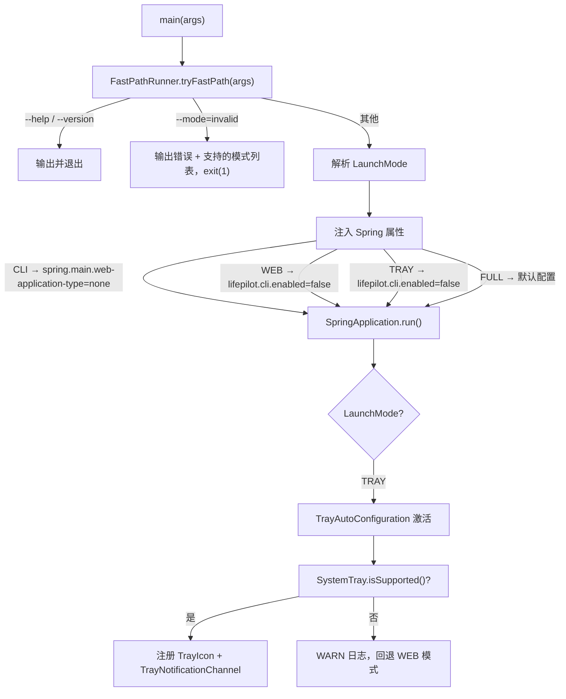

# Design Document: 应用启动模式

## Overview

LifePilot 当前启动时同时激活 Tomcat Web 服务器和 CLI 交互式 Shell，无法按需选择运行方式。本设计引入 `LaunchMode` 枚举和启动模式解析机制，通过命令行参数 `--mode=cli|web|tray|full` 或配置文件 `lifepilot.app.launch-mode` 控制应用行为：

- **CLI 模式**：禁用 Web 服务器，仅启动 CLI Shell
- **WEB 模式**：禁用 CLI Shell，仅启动 Tomcat
- **TRAY 模式**：启动 Tomcat + 系统托盘图标，禁用 CLI Shell
- **FULL 模式**（默认）：同时启动 Tomcat + CLI Shell，与当前行为一致

同时，本设计扩展通知系统：将 `NotificationDispatcher` 从单通道改为多通道分发，新增 `TrayNotificationChannel` 通过 `java.awt.SystemTray` API 推送操作系统原生通知。

参考文档：
- 需求文档：#[[file:.kiro/specs/app-launch-modes/requirements.md]]
- 特性设计：#[[file:docs/features/gateway-channels.md]]
- 架构设计：#[[file:docs/architecture/cli-interaction.md]]
- 编码规范：#[[file:.kiro/steering/coding-standards.md]]

## Architecture

### 启动流程改造



### 模式与组件激活矩阵

| 组件 | CLI | WEB | TRAY | FULL |
|------|-----|-----|------|------|
| Tomcat Web 服务器 | ❌ | ✅ | ✅ | ✅ |
| CliAutoConfiguration | ✅ | ❌ | ❌ | ✅ |
| GatewayAutoConfiguration | ✅ | ✅ | ✅ | ✅ |
| TrayAutoConfiguration | ❌ | ❌ | ✅ | ❌ |
| TrayNotificationChannel | ❌ | ❌ | ✅ | ❌ |

### 关键设计决策

**决策 1：在 FastPathRunner 中解析 `--mode` 而非 Spring Boot 启动后**

理由：CLI 模式需要在 Spring 启动前设置 `spring.main.web-application-type=none`，否则 Tomcat 已经启动。FastPathRunner 已有在 `main()` 中拦截参数的先例（`--help`、`--version`），扩展它是最自然的方式。

**决策 2：通过 Spring 属性注入控制组件激活，而非自定义条件注解**

理由：`CliAutoConfiguration` 已通过 `@ConditionalOnProperty(name = "lifepilot.cli.enabled")` 控制，只需在启动前设置该属性即可。无需引入新的条件注解，复用现有机制。

**决策 3：TrayAutoConfiguration 独立于 GatewayAutoConfiguration**

理由：系统托盘是桌面特有功能，与 Gateway 中间件管道无关。独立配置类便于按需激活，且 `java.awt.SystemTray` 依赖桌面环境，不应影响无头服务器部署。

**决策 4：NotificationDispatcher 改为接受 `List<NotificationChannel>` 而非单个 LogNotificationChannel**

理由：当前 `NotificationDispatcher` 硬编码依赖 `LogNotificationChannel`，无法扩展。改为注入通道列表后，Spring 自动收集所有 `NotificationChannel` Bean，新增通道（如 TrayNotificationChannel）只需注册 Bean 即可，符合开闭原则。

## Components and Interfaces

### 1. LaunchMode 枚举

```java
package com.lifepilot.app;

/**
 * 应用启动模式。
 */
public enum LaunchMode {
    CLI,   // 仅 CLI Shell，禁用 Web 服务器
    WEB,   // 仅 Web 服务器，禁用 CLI Shell
    TRAY,  // 系统托盘 + Web 服务器，禁用 CLI Shell
    FULL;  // CLI + Web（默认）

    /** 从字符串解析，忽略大小写，无效值返回 empty。 */
    public static Optional<LaunchMode> fromString(String value);
}
```

### 2. FastPathRunner 扩展

在现有 `FastPathRunner.tryFastPath()` 中新增 `--mode` 参数解析逻辑：

```java
// 新增方法
public static LaunchMode resolveMode(String[] args);

// 扩展 printHelp() 输出
// 选项:
//   --mode=<mode>     启动模式: cli, web, tray, full（默认: full）
```

`resolveMode()` 返回解析后的 `LaunchMode`，由 `LifePilotApplication.main()` 调用，在 `SpringApplication.run()` 之前根据模式设置 Spring 属性。

### 3. LifePilotApplication.main() 改造

```java
public static void main(String[] args) {
    // ... 编码设置 ...
    if (FastPathRunner.tryFastPath(args)) {
        System.exit(0);
    }

    LaunchMode mode = FastPathRunner.resolveMode(args);

    SpringApplication app = new SpringApplication(LifePilotApplication.class);
    Map<String, Object> props = new HashMap<>();

    switch (mode) {
        case CLI -> {
            props.put("spring.main.web-application-type", "none");
        }
        case WEB -> {
            props.put("lifepilot.cli.enabled", false);
        }
        case TRAY -> {
            props.put("lifepilot.cli.enabled", false);
            props.put("lifepilot.tray.enabled", true);
        }
        case FULL -> { /* 默认配置 */ }
    }

    props.put("lifepilot.app.launch-mode", mode.name().toLowerCase());
    app.setDefaultProperties(props);
    app.run(args);
}
```

### 4. AppConfigProperties

```java
package com.lifepilot.app;

@ConfigurationProperties(prefix = "lifepilot.app")
public class AppConfigProperties {
    /** 默认启动模式，可被 --mode 命令行参数覆盖。 */
    private String launchMode = "full";

    // getter / setter
}
```

### 5. TrayAutoConfiguration

```java
package com.lifepilot.interaction.tray.config;

@AutoConfiguration
@ConditionalOnProperty(name = "lifepilot.tray.enabled", havingValue = "true")
@EnableConfigurationProperties(TrayConfigProperties.class)
public class TrayAutoConfiguration {

    @Bean
    public TrayManager trayManager(TrayConfigProperties config,
                                    ConfigurableApplicationContext context);

    @Bean
    public TrayNotificationChannel trayNotificationChannel(TrayManager trayManager);
}
```

### 6. TrayManager

```java
package com.lifepilot.interaction.tray;

/**
 * 系统托盘管理器 — 封装 java.awt.SystemTray 操作。
 */
public class TrayManager {

    /** 初始化系统托盘图标和菜单。 */
    public void initialize();

    /** 显示原生通知。 */
    public void displayNotification(String title, String message, TrayIcon.MessageType type);

    /** 移除托盘图标并清理资源。 */
    public void shutdown();

    /** 通知是否暂停。 */
    public boolean isNotificationPaused();

    /** 暂停通知显示。 */
    public void pauseNotifications();

    /** 恢复通知显示。 */
    public void resumeNotifications();
}
```

`TrayManager` 内部创建 `PopupMenu`，包含以下菜单项：
- 查看最近提醒 → `Desktop.browse(webUiUrl + "/notifications")`
- 打开 Web UI → `Desktop.browse(webUiUrl)`
- 暂停通知 / 恢复通知 → 切换 `notificationPaused` 标志
- 退出 → `applicationContext.close()`

### 7. TrayNotificationChannel

```java
package com.lifepilot.interaction.tray;

/**
 * 系统托盘通知通道 — 通过操作系统原生通知推送提醒。
 */
public class TrayNotificationChannel implements NotificationChannel {

    @Override
    public String id() { return "tray"; }

    @Override
    public void send(ProactiveNotification notification);
}
```

`send()` 实现逻辑：
1. 检查 `trayManager.isNotificationPaused()`，暂停时直接返回
2. 根据 `notification.urgency()` 映射 `TrayIcon.MessageType`：
   - `HIGH` → `MessageType.WARNING`
   - `MEDIUM` → `MessageType.INFO`
   - `LOW` → 不通过托盘显示（由 PassiveNotificationQueue 处理）
3. 调用 `trayManager.displayNotification()`

### 8. NotificationDispatcher 重构

```java
// 改造前
public NotificationDispatcher(NotificationChannel logChannel,
                               PassiveNotificationQueue passiveQueue,
                               JdbcTemplate jdbcTemplate)

// 改造后
public NotificationDispatcher(List<NotificationChannel> channels,
                               PassiveNotificationQueue passiveQueue,
                               JdbcTemplate jdbcTemplate)
```

`dispatch()` 逻辑变更：
- `LOW` 紧急度 → 仅入队 `PassiveNotificationQueue`
- `HIGH` / `MEDIUM` → 遍历所有 `channels`，逐个调用 `send()`，单个通道失败记录 WARN 日志不中断

### 9. ProactiveAutoConfiguration 调整

```java
// 改造前
@Bean
public NotificationDispatcher notificationDispatcher(LogNotificationChannel logChannel, ...)

// 改造后
@Bean
public NotificationDispatcher notificationDispatcher(List<NotificationChannel> channels, ...)
```

Spring 自动收集所有 `NotificationChannel` Bean（LogNotificationChannel + TrayNotificationChannel 等）。

### 依赖接口验证

| 接口 | 源码位置 | 验证状态 |
|------|---------|---------|
| FastPathRunner.tryFastPath() | com.lifepilot.interaction.cli.FastPathRunner | ✅ 已核对 |
| CliAutoConfiguration @ConditionalOnProperty | com.lifepilot.interaction.cli.config.CliAutoConfiguration | ✅ 已核对 |
| GatewayAutoConfiguration @ConditionalOnProperty | com.lifepilot.interaction.config.GatewayAutoConfiguration | ✅ 已核对 |
| NotificationChannel.id() / send() | com.lifepilot.agent.proactive.channel.NotificationChannel | ✅ 已核对 |
| NotificationDispatcher 构造函数 | com.lifepilot.agent.proactive.NotificationDispatcher | ✅ 已核对 |
| ProactiveAutoConfiguration.notificationDispatcher() | com.lifepilot.agent.proactive.config.ProactiveAutoConfiguration | ✅ 已核对 |
| ProactiveNotification record | com.lifepilot.agent.proactive.model.ProactiveNotification | ✅ 已核对 |
| Urgency enum (HIGH/MEDIUM/LOW) | com.lifepilot.agent.proactive.model.Urgency | ✅ 已核对 |
| CliShell implements CommandLineRunner | com.lifepilot.interaction.cli.CliShell | ✅ 已核对 |

### 跨模块接口变更

| 变更接口 | 所属模块 | 变更内容 | 影响模块 | 兼容性 |
|---------|---------|---------|---------|--------|
| NotificationDispatcher 构造函数 | agent/proactive | 参数从 `NotificationChannel logChannel` 改为 `List<NotificationChannel> channels` | ProactiveAutoConfiguration | 需同步修改 |
| ProactiveAutoConfiguration.notificationDispatcher() | agent/proactive | Bean 方法参数从 `LogNotificationChannel` 改为 `List<NotificationChannel>` | 无外部影响 | 内部调整 |
| FastPathRunner | interaction/cli | 新增 `resolveMode()` 静态方法 + 扩展 `printHelp()` | LifePilotApplication | 向后兼容（新增） |

## Data Models

### LaunchMode 枚举

```java
public enum LaunchMode {
    CLI, WEB, TRAY, FULL
}
```

### TrayConfigProperties

```java
@ConfigurationProperties(prefix = "lifepilot.tray")
public class TrayConfigProperties {
    /** 托盘功能开关。 */
    private boolean enabled = false;

    /** 托盘图标工具提示文本。 */
    private String tooltip = "LifePilot - AI 生活助手";

    /** Web UI 地址，用于「打开 Web UI」菜单项。 */
    private String webUiUrl = "http://localhost:8080";
}
```

### AppConfigProperties

```java
@ConfigurationProperties(prefix = "lifepilot.app")
public class AppConfigProperties {
    /** 默认启动模式。 */
    private String launchMode = "full";
}
```

### application.yml 新增配置

```yaml
lifepilot:
  app:
    launch-mode: full          # 默认启动模式: cli / web / tray / full
  tray:
    enabled: false             # 系统托盘开关（由 --mode=tray 自动设置）
    tooltip: "LifePilot - AI 生活助手"
    web-ui-url: "http://localhost:${server.port:8080}"
```


## Correctness Properties

*A property is a characteristic or behavior that should hold true across all valid executions of a system — essentially, a formal statement about what the system should do. Properties serve as the bridge between human-readable specifications and machine-verifiable correctness guarantees.*

### Property 1: LaunchMode 解析往返

*For any* valid LaunchMode 枚举值，将其转为小写字符串后调用 `LaunchMode.fromString()` 应返回对应的枚举值（即 `LaunchMode.fromString(mode.name().toLowerCase()) == Optional.of(mode)`）。

**Validates: Requirements 1.1, 1.2, 1.3**

### Property 2: 无效模式字符串拒绝

*For any* 不属于 `{"cli", "web", "tray", "full"}` 的字符串（忽略大小写），`LaunchMode.fromString()` 应返回 `Optional.empty()`。

**Validates: Requirements 1.5**

### Property 3: 启动模式到配置映射正确性

*For any* `LaunchMode` 枚举值，生成的 Spring 属性映射应满足以下不变量：
- CLI → `spring.main.web-application-type=none`，`lifepilot.cli.enabled` 未设为 false
- WEB → `lifepilot.cli.enabled=false`，无 `web-application-type=none`
- TRAY → `lifepilot.cli.enabled=false`，`lifepilot.tray.enabled=true`
- FULL → 不设置任何覆盖属性

**Validates: Requirements 2.1, 3.2, 4.2, 4.3, 5.1**

### Property 4: Urgency 到 MessageType 映射

*For any* `Urgency` 枚举值，`TrayNotificationChannel` 的映射函数应满足：`HIGH` → `WARNING`，`MEDIUM` → `INFO`。`LOW` 不通过托盘通道发送。

**Validates: Requirements 7.3**

### Property 5: 暂停/恢复通知往返

*For any* `TrayManager` 实例，执行 `pauseNotifications()` 后 `isNotificationPaused()` 应返回 true，再执行 `resumeNotifications()` 后 `isNotificationPaused()` 应返回 false，恢复到初始状态。

**Validates: Requirements 7.4, 7.5**

### Property 6: 多通道分发覆盖所有通道

*For any* 非空 `NotificationChannel` 列表和任意 `HIGH` 或 `MEDIUM` 紧急度的 `ProactiveNotification`，`NotificationDispatcher.dispatch()` 应对列表中每个通道调用 `send()`。

**Validates: Requirements 8.2**

### Property 7: 单通道失败不阻断其余通道

*For any* 包含 N 个通道的列表，其中 K 个通道的 `send()` 抛出异常（0 ≤ K < N），`NotificationDispatcher.dispatch()` 仍应成功调用剩余 N-K 个通道的 `send()`。

**Validates: Requirements 8.3**

### Property 8: 命令行参数覆盖配置文件

*For any* 有效的 `--mode` 命令行参数值和任意 `lifepilot.app.launch-mode` 配置值，解析后的 `LaunchMode` 应始终等于命令行参数指定的值。

**Validates: Requirements 9.2**

## Error Handling

| 场景 | 处理策略 | 日志级别 |
|------|---------|---------|
| `--mode` 值无效 | 输出支持的模式列表到 stderr，`System.exit(1)` | 无（FastPath 阶段无日志框架） |
| `SystemTray.isSupported()` 返回 false | 回退到 WEB 模式行为（不注册 TrayIcon），输出警告 | WARN |
| `TrayIcon` 创建失败（如无图标资源） | 回退到 WEB 模式行为，输出警告 | WARN |
| `TrayNotificationChannel.send()` 异常 | NotificationDispatcher 捕获异常，记录日志，继续分发到其余通道 | WARN |
| `Desktop.browse()` 打开浏览器失败 | 在托盘通知中显示 URL，提示用户手动打开 | WARN |
| 托盘图标资源文件缺失 | 使用 AWT 默认图标或纯色占位图标 | WARN |

### 降级策略

- TRAY 模式在无桌面环境时自动降级为 WEB 模式（无 CLI、无托盘，仅 Web 服务器）
- 通知通道失败不影响通知持久化（持久化在 dispatch 中独立执行）
- 单个 NotificationChannel 失败不影响其他通道

## Testing Strategy

### 属性测试（Property-Based Testing）

使用 **jqwik**（JUnit 5 原生集成的 Java 属性测试库）实现所有 Correctness Properties。

每个属性测试配置：
- 最少 100 次迭代
- 测试方法注释标注对应的 design property
- 标注格式：`// Feature: app-launch-modes, Property {N}: {title}`

| Property | 测试类 | 生成器 |
|----------|--------|--------|
| P1: LaunchMode 解析往返 | `LaunchModePropertyTest` | `@ForAll LaunchMode` 枚举值 |
| P2: 无效模式字符串拒绝 | `LaunchModePropertyTest` | `@ForAll String` 过滤掉有效值 |
| P3: 模式到配置映射 | `LaunchModeConfigPropertyTest` | `@ForAll LaunchMode` 枚举值 |
| P4: Urgency→MessageType 映射 | `TrayNotificationChannelPropertyTest` | `@ForAll Urgency` 枚举值 |
| P5: 暂停/恢复往返 | `TrayManagerPropertyTest` | `@ForAll` 随机暂停/恢复操作序列 |
| P6: 多通道分发 | `NotificationDispatcherPropertyTest` | `@ForAll List<MockChannel>` + `@ForAll ProactiveNotification` |
| P7: 单通道失败隔离 | `NotificationDispatcherPropertyTest` | `@ForAll List<MockChannel>` 含随机失败通道 |
| P8: 命令行覆盖配置 | `LaunchModeConfigPropertyTest` | `@ForAll LaunchMode` × `@ForAll LaunchMode` 组合 |

### 单元测试

| 测试类 | 覆盖范围 |
|--------|---------|
| `FastPathRunnerTest` | `--mode=cli/web/tray/full` 解析、无 `--mode` 默认 FULL、无效值错误输出、`--help` 包含 `--mode` 说明 |
| `TrayManagerTest` | 菜单项创建、通知暂停/恢复状态切换、shutdown 清理 |
| `TrayNotificationChannelTest` | send() 在暂停时不调用 displayMessage、urgency 映射、LOW 不发送 |
| `NotificationDispatcherTest` | 多通道分发、单通道异常隔离、LOW 入队 PassiveQueue、持久化调用 |

### 集成测试

| 测试类 | 验证内容 |
|--------|---------|
| `LaunchMode_SpringContext_集成测试` | 各模式下 Spring Context 正确加载，Bean 按预期激活/禁用 |
| `NotificationDispatcher_MultiChannel_集成测试` | LogNotificationChannel + Mock TrayNotificationChannel 同时注册，dispatch 分发到两个通道 |
