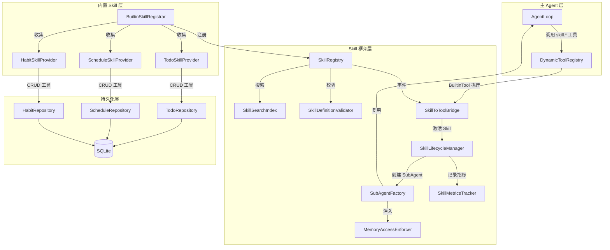
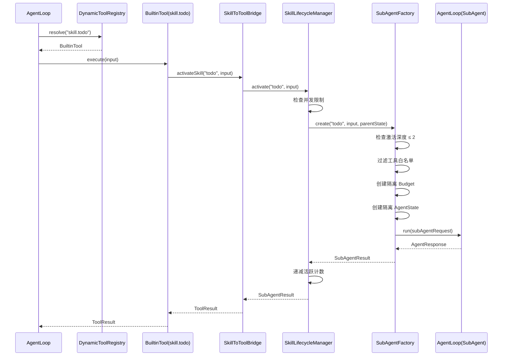

# Design Document: builtin-skills

## 参考文档

- 需求文档：#[[file:.kiro/specs/builtin-skills/requirements.md]]
- 架构设计：#[[file:docs/architecture/skill-system.md]]
- 特性设计：#[[file:docs/features/skill-system.md]]
- 特性设计：#[[file:docs/features/builtin-skills.md]]
- 编码规范：#[[file:.kiro/steering/coding-standards.md]]

## Overview

本设计文档描述 LifePilot 技能系统核心框架和三个内置 Skill（Todo、Schedule、Habit）的实现方案。

技能系统的核心思想是 **Sub-Agent-as-Tools**：每个 Skill 定义一个 Agent 能力单元的蓝图，激活时创建隔离的 SubAgent 实例，通过 SkillToToolBridge 将 Skill 暴露为 DynamicToolRegistry 中的普通工具，使主 AgentLoop 可以像调用工具一样调用 Skill。

本模块依赖以下已完成模块：
- **LLM Router**（Phase 1）：LlmRouter 提供 LLM 调用能力
- **Agent 引擎**（Phase 1）：AgentLoop、StateReducer、AgentState、Budget、Action.SubAgentResult
- **工具系统**（Phase 1）：ToolContract（sealed，permits BuiltinTool）、DynamicToolRegistry、BuiltinTool、ToolExecutor
- **记忆系统**（Phase 2）：WorkingMemory、EpisodicMemory、SemanticMemory、HybridRetriever

### 设计决策

1. **SkillToolAdapter 使用 BuiltinTool 而非新增 ToolContract permit**：ToolContract 是 sealed interface，permits BuiltinTool/YamlTool/McpTool。为避免修改已稳定的 sealed 层次，SkillToolAdapter 通过构建 BuiltinTool 实例（注入自定义 ToolExecutor lambda）来桥接 Skill 到工具系统。
2. **SubAgent 复用 AgentLoop**：SubAgent 不是独立的循环实现，而是通过 `AgentState.forSubAgent()` 创建隔离状态后，复用同一个 AgentLoop 实例执行。
3. **内置 Skill 的工具注册为 BuiltinTool**：每个内置 Skill 声明的 allowedTools（如 `builtin.todo.create`）作为 BuiltinTool 注册到 DynamicToolRegistry，执行逻辑委托给对应的 Repository。
4. **记忆访问控制在 ContextAssembler 层拦截**：MemoryAccessEnforcer 作为装饰器包装记忆检索接口，在 SubAgent 的 ContextAssembler 中注入，运行时拦截未授权访问。

## Architecture

### 包结构

```
com.lifepilot.skill
├── model/                          # 数据模型
│   ├── SkillDefinition.java        # Skill 定义 record
│   ├── SkillSource.java            # 来源 sealed interface
│   ├── ExecutionStrategy.java      # 执行策略 record
│   ├── SkillBudget.java            # 预算约束 record
│   ├── MemoryAccessPolicy.java     # 记忆访问策略 record
│   ├── MemoryReadPermission.java   # 读权限 record
│   ├── MemoryWritePermission.java  # 写权限 record
│   └── SubAgentResult.java         # SubAgent 执行结果 record
├── registry/                       # 注册中心
│   ├── SkillRegistry.java          # Skill 注册中心
│   ├── SkillSearchIndex.java       # 语义搜索索引
│   └── SkillDefinitionValidator.java # 定义校验器
├── event/                          # 事件
│   ├── SkillRegistryEvent.java     # 注册中心事件 sealed interface
│   └── SkillLifecycleEvent.java    # 生命周期事件 sealed interface
├── activation/                     # 激活与执行
│   ├── SubAgentFactory.java        # SubAgent 工厂
│   ├── SkillLifecycleManager.java  # 生命周期管理器
│   └── SkillMetricsTracker.java    # 指标追踪器
├── bridge/                         # 桥接
│   └── SkillToToolBridge.java      # Skill → Tool 桥接
├── memory/                         # 记忆访问控制
│   ├── MemoryAccessEnforcer.java   # 访问强制执行器
│   └── MemoryAccessViolationException.java # 访问违规异常
├── config/                         # 配置
│   ├── SkillAutoConfiguration.java # Spring 自动配置
│   └── SkillConfigProperties.java  # 配置属性
└── builtin/                        # 内置 Skill
    ├── BuiltinSkillProvider.java   # 内置 Skill 提供者接口
    ├── BuiltinSkill.java           # @BuiltinSkill 注解
    ├── BuiltinSkillRegistrar.java  # 内置 Skill 注册器
    ├── todo/                       # 待办管理
    │   ├── TodoSkillProvider.java
    │   ├── TodoRepository.java
    │   └── TodoItem.java           # 待办 record
    ├── schedule/                   # 日程管理
    │   ├── ScheduleSkillProvider.java
    │   ├── ScheduleRepository.java
    │   └── ScheduleItem.java       # 日程 record
    └── habit/                      # 习惯养成
        ├── HabitSkillProvider.java
        ├── HabitRepository.java
        ├── HabitItem.java          # 习惯 record
        └── HabitLog.java           # 打卡记录 record
```

### 组件关系图



### 激活流程时序图



## Components and Interfaces

### 1. SkillDefinition（Skill 定义 record）

```java
/**
 * Skill 定义 — Agent 能力单元的完整蓝图。
 *
 * @author zsg
 * @since 2026-07-28
 */
@Builder(toBuilder = true)
public record SkillDefinition(
        String id,
        String name,
        String description,
        String version,
        SkillSource source,
        String systemPrompt,
        List<String> allowedTools,
        ExecutionStrategy execution,
        MemoryAccessPolicy memoryAccess,
        SkillBudget budget,
        Map<String, String> metadata,
        @Nullable String preferredProviderId
) {
    /** 紧凑构造器 — 校验 + 防御性拷贝。 */
    public SkillDefinition {
        if (id == null || id.isBlank()) throw new IllegalArgumentException("Skill ID 不能为空");
        if (name == null || name.isBlank()) throw new IllegalArgumentException("Skill 名称不能为空");
        if (systemPrompt == null || systemPrompt.isBlank()) throw new IllegalArgumentException("System Prompt 不能为空");
        allowedTools = List.copyOf(allowedTools);
        metadata = Map.copyOf(metadata);
    }

    /** 返回仅包含 id 和 description 的摘要字符串，用于渐进式发现。 */
    public String toDiscoverySummary() {
        return id + ": " + description;
    }
}
```

### 2. SkillSource（来源 sealed interface）

```java
/**
 * Skill 来源类型 — 穷举三种来源。
 *
 * @author zsg
 * @since 2026-07-28
 */
public sealed interface SkillSource permits SkillSource.Builtin, SkillSource.UserDefined, SkillSource.AutoGenerated {

    /** 来源优先级：Builtin(3) > UserDefined(2) > AutoGenerated(1)。 */
    default int priority() {
        return switch (this) {
            case Builtin _ -> 3;
            case UserDefined _ -> 2;
            case AutoGenerated _ -> 1;
        };
    }

    record Builtin() implements SkillSource {}
    record UserDefined(String filePath) implements SkillSource {}
    record AutoGenerated(String generatorTraceId) implements SkillSource {}
}
```

### 3. ExecutionStrategy（执行策略 record）

```java
/**
 * Skill 执行策略。
 *
 * @author zsg
 * @since 2026-07-28
 */
public record ExecutionStrategy(
        int maxSteps,
        int timeoutSeconds,
        boolean requireConfirmation,
        RetryPolicy retryPolicy,
        ConfirmationMode confirmationMode
) {
    public static final ExecutionStrategy DEFAULT = new ExecutionStrategy(
            10, 120, false, RetryPolicy.DEFAULT, ConfirmationMode.NONE);

    /** 紧凑构造器 — 值范围校验。 */
    public ExecutionStrategy {
        if (maxSteps < 1 || maxSteps > 50) throw new IllegalArgumentException("maxSteps 必须在 1-50 之间");
        if (timeoutSeconds < 1 || timeoutSeconds > 600) throw new IllegalArgumentException("timeoutSeconds 必须在 1-600 之间");
    }

    public enum RetryPolicy { NONE, DEFAULT }
    public enum ConfirmationMode { NONE, FIRST_RUN, ALWAYS }
}
```

### 4. SkillBudget（预算约束 record）

```java
/**
 * Skill 独立预算约束。
 *
 * @author zsg
 * @since 2026-07-28
 */
public record SkillBudget(int maxTokens, int maxSteps, int timeoutSeconds, int maxCostCents) {

    public static final SkillBudget DEFAULT = new SkillBudget(8000, 10, 120, 50);
    public static final SkillBudget LIGHTWEIGHT = new SkillBudget(2000, 5, 30, 10);
    public static final SkillBudget HEAVYWEIGHT = new SkillBudget(20000, 20, 300, 200);

    /** 转换为 Agent 引擎的 Budget 对象。 */
    public Budget toAgentBudget() {
        return Budget.builder()
                .maxTokens(maxTokens).tokensUsed(0).tokensReserved(0)
                .maxSteps(maxSteps)
                .maxDuration(Duration.ofSeconds(timeoutSeconds))
                .elapsed(Duration.ZERO)
                .build();
    }
}
```

### 5. MemoryAccessPolicy（记忆访问策略）

```java
/**
 * 声明式记忆访问策略 — 默认全部拒绝。
 *
 * @author zsg
 * @since 2026-07-28
 */
public record MemoryAccessPolicy(
        List<MemoryReadPermission> read,
        List<MemoryWritePermission> write
) {
    public MemoryAccessPolicy {
        read = List.copyOf(read);
        write = List.copyOf(write);
    }

    /** 无任何记忆访问权限。 */
    public static MemoryAccessPolicy none() {
        return new MemoryAccessPolicy(List.of(), List.of());
    }

    /** 判断是否可读指定记忆层的指定实体类型。 */
    public boolean canRead(String layer, String entityType) {
        return read.stream().anyMatch(p ->
                p.layer().equals(layer) && (p.entityTypes().contains("*") || p.entityTypes().contains(entityType)));
    }

    /** 判断是否可写指定记忆层的指定实体类型。 */
    public boolean canWrite(String layer, String entityType) {
        return write.stream().anyMatch(p ->
                p.layer().equals(layer) && (p.entityTypes().contains("*") || p.entityTypes().contains(entityType)));
    }
}

public record MemoryReadPermission(String layer, List<String> entityTypes, @Nullable String timeRange) {
    public MemoryReadPermission { entityTypes = List.copyOf(entityTypes); }
}

public record MemoryWritePermission(String layer, List<String> entityTypes, boolean requireApproval) {
    public MemoryWritePermission { entityTypes = List.copyOf(entityTypes); }
}
```

### 6. MemoryAccessEnforcer（记忆访问强制执行器）

```java
/**
 * 记忆访问强制执行器 — 运行时拦截未授权的记忆访问。
 *
 * @author zsg
 * @since 2026-07-28
 */
public class MemoryAccessEnforcer {

    /** 检查读权限，违规时抛出 MemoryAccessViolationException。 */
    public void checkRead(MemoryAccessPolicy policy, String layer, String entityType) { ... }

    /** 检查写权限，违规时抛出 MemoryAccessViolationException。 */
    public void checkWrite(MemoryAccessPolicy policy, String layer, String entityType) { ... }

    /** 检查写操作是否需要用户确认。 */
    public boolean requiresApproval(MemoryAccessPolicy policy, String layer, String entityType) { ... }

    /** 检查时间范围约束。 */
    public void checkTimeRange(MemoryAccessPolicy policy, String layer, Instant queryTime) { ... }
}
```

### 7. SkillRegistry（Skill 注册中心）

```java
/**
 * Skill 注册中心 — 线程安全，支持运行时并发注册和注销。
 *
 * @author zsg
 * @since 2026-07-28
 */
public class SkillRegistry {

    private final ConcurrentHashMap<String, SkillDefinition> skills = new ConcurrentHashMap<>();
    private final SkillDefinitionValidator validator;
    private final SkillSearchIndex searchIndex;
    private final ApplicationEventPublisher eventPublisher;

    /** 注册 Skill，校验失败或覆盖 BUILTIN 时拒绝。 */
    public boolean register(SkillDefinition definition) { ... }

    /** 注销 Skill。 */
    public boolean unregister(String skillId) { ... }

    /** 按 ID 查找。 */
    public Optional<SkillDefinition> find(String skillId) { ... }

    /** 语义搜索。 */
    public List<SkillDefinition> search(String query) { ... }

    /** 返回所有 Skill 的 Discovery 摘要。 */
    public List<String> listSummaries() { ... }

    /** 按来源类型批量注销。 */
    public int unregisterBySource(Class<? extends SkillSource> sourceType) { ... }
}
```

### 8. SkillDefinitionValidator（定义校验器）

```java
/**
 * Skill 定义校验器。
 *
 * @author zsg
 * @since 2026-07-28
 */
public class SkillDefinitionValidator {

    private final DynamicToolRegistry toolRegistry;

    /** 校验 Skill 定义的合法性。 */
    public ValidationResult validate(SkillDefinition definition) { ... }

    public record ValidationResult(boolean valid, List<String> errors) {
        public ValidationResult { errors = List.copyOf(errors); }
    }
}
```

校验规则：
- ID 格式：`^[a-z0-9-]{1,64}$`
- 名称长度 ≤ 128
- System Prompt 长度 ≤ 10000
- 工具列表非空，且每个工具 ID 在 DynamicToolRegistry 中存在
- AUTO_GENERATED 来源额外限制：maxTokens ≤ 10000、maxSteps ≤ 15、timeoutSeconds ≤ 180

### 9. SubAgentFactory（SubAgent 工厂）

```java
/**
 * SubAgent 工厂 — 从 Skill 定义创建隔离的 SubAgent 实例。
 *
 * @author zsg
 * @since 2026-07-28
 */
public class SubAgentFactory {

    private static final int MAX_ACTIVATION_DEPTH = 2;

    private final SkillRegistry skillRegistry;
    private final AgentLoop agentLoop;
    private final DynamicToolRegistry toolRegistry;
    private final MemoryAccessEnforcer memoryAccessEnforcer;

    /**
     * 激活 Skill 并执行。
     *
     * @param skillId     Skill ID
     * @param input       用户输入
     * @param parentState 父 Agent 状态
     * @return SubAgent 执行结果
     */
    public SubAgentResult activate(String skillId, String input, AgentState parentState) {
        // 1. 查找 SkillDefinition，找不到抛 SkillActivationException
        // 2. 检查 parentState.depth() + 1 <= MAX_ACTIVATION_DEPTH
        // 3. 从 SkillBudget 创建独立 Budget
        // 4. 创建隔离 AgentState（traceId = parentTraceId/sub-skillId-randomSuffix）
        // 5. 过滤工具白名单
        // 6. 执行 agentLoop.run()
        // 7. 捕获异常，返回 SubAgentResult
    }
}
```

### 10. SkillToToolBridge（Skill → Tool 桥接）

```java
/**
 * Skill 工具桥接 — 监听 SkillRegistryEvent，将 Skill 包装为 BuiltinTool 注册到 DynamicToolRegistry。
 *
 * @author zsg
 * @since 2026-07-28
 */
public class SkillToToolBridge {

    private final DynamicToolRegistry toolRegistry;
    private final SkillLifecycleManager lifecycleManager;

    /** 监听 SkillRegistered 事件，创建 BuiltinTool 并注册。 */
    @EventListener
    public void onSkillRegistered(SkillRegistryEvent.SkillRegistered event) {
        // 工具 ID 格式：skill.{skillId}
        // 使用 BuiltinTool.builder() 构建，executor lambda 委托给 lifecycleManager
    }

    /** 监听 SkillUnregistered 事件，注销对应工具。 */
    @EventListener
    public void onSkillUnregistered(SkillRegistryEvent.SkillUnregistered event) { ... }

    /** 监听 SkillUpdated 事件，先注销再注册。 */
    @EventListener
    public void onSkillUpdated(SkillRegistryEvent.SkillUpdated event) { ... }
}
```

桥接策略：SkillToToolBridge 将 SkillDefinition 包装为 `BuiltinTool`，其 `ToolExecutor` lambda 内部调用 `SkillLifecycleManager.activate()`，将 SubAgentResult 转换为 ToolResult 返回。

### 11. SkillLifecycleManager（生命周期管理器）

```java
/**
 * Skill 生命周期管理器 — 协调并发控制、激活、停用和指标追踪。
 *
 * @author zsg
 * @since 2026-07-28
 */
public class SkillLifecycleManager {

    private final AtomicInteger activeCount = new AtomicInteger(0);
    private final int maxConcurrentActivations;
    private final SubAgentFactory subAgentFactory;
    private final SkillMetricsTracker metricsTracker;
    private final ApplicationEventPublisher eventPublisher;

    /** 激活 Skill，检查并发限制后委托给 SubAgentFactory。 */
    public SubAgentResult activate(String skillId, String input, AgentState parentState) { ... }
}
```

### 12. SkillMetricsTracker（指标追踪器）

```java
/**
 * Skill 激活指标追踪器。
 *
 * @author zsg
 * @since 2026-07-28
 */
public class SkillMetricsTracker {

    private final ConcurrentHashMap<String, SkillMetrics> metricsMap = new ConcurrentHashMap<>();

    /** 记录一次激活结果。 */
    public void record(String skillId, SubAgentResult result) { ... }

    /** 获取成功率（0.0-1.0）。 */
    public double getSuccessRate(String skillId) { ... }

    /** 获取指定 Skill 的完整指标。 */
    public Optional<SkillMetrics> getMetrics(String skillId) { ... }

    public record SkillMetrics(
            long totalActivations, long successCount, long failureCount,
            long totalTokensUsed, long totalDurationMs
    ) {}
}
```

### 13. SkillSearchIndex（语义搜索索引）

```java
/**
 * Skill 语义搜索索引 — 基于 Embedding 向量的语义匹配。
 *
 * @author zsg
 * @since 2026-07-28
 */
public class SkillSearchIndex {

    private final ConcurrentHashMap<String, float[]> embeddings = new ConcurrentHashMap<>();
    private final LlmRouter llmRouter;

    /** 为 Skill 生成 Embedding 并缓存。 */
    public void index(SkillDefinition definition) { ... }

    /** 移除 Embedding 缓存。 */
    public void remove(String skillId) { ... }

    /** 语义搜索，返回相似度 > 0.5 的 Top-K 结果。 */
    public List<SearchResult> search(String query, int topK) { ... }

    public record SearchResult(String skillId, double similarity) {}
}
```

### 14. 内置 Skill 基础设施

```java
/** 内置 Skill 提供者接口。 */
public interface BuiltinSkillProvider {
    SkillDefinition provide();
}

/** 内置 Skill 注解。 */
@Retention(RetentionPolicy.RUNTIME)
@Target(ElementType.TYPE)
public @interface BuiltinSkill {
    String id();
    int order() default 0;
}

/**
 * 内置 Skill 注册器 — ApplicationReadyEvent 时按 order 注册。
 *
 * @author zsg
 * @since 2026-07-28
 */
public class BuiltinSkillRegistrar {

    /** 收集所有 BuiltinSkillProvider Bean，按 order 排序后注册。 */
    @EventListener(ApplicationReadyEvent.class)
    public void registerAll() { ... }
}
```

### 15. 内置 Skill 持久化层

每个内置 Skill 的 Repository 使用 JdbcTemplate 操作 SQLite，遵循以下模式：

```java
/**
 * 待办事项仓储。
 *
 * @author zsg
 * @since 2026-07-28
 */
public class TodoRepository {
    private final JdbcTemplate jdbcTemplate;

    public String create(TodoItem item) { ... }
    public List<TodoItem> list(@Nullable String status, @Nullable String priority) { ... }
    public Optional<TodoItem> findById(String id) { ... }
    public boolean update(String id, TodoItem updated) { ... }
    public boolean delete(String id) { ... }
    public boolean complete(String id) { ... }
}
```

ScheduleRepository 额外提供冲突检测：

```java
/** 查询与指定时间段重叠的日程。 */
public List<ScheduleItem> findConflicts(String startTime, String endTime) {
    // SQL: WHERE start_time < ? AND end_time > ?
}
```

HabitRepository 额外提供统计：

```java
/** 计算连续打卡天数。 */
public int calculateStreak(String habitId) { ... }

/** 计算指定时间范围内的完成率。 */
public double calculateCompletionRate(String habitId, Instant from, Instant to) { ... }
```

## Data Models

### 数据库表结构（Flyway V9）

迁移脚本：`V9__create_skill_tables.sql`

```sql
-- 待办事项表
CREATE TABLE IF NOT EXISTS todos (
    id          TEXT PRIMARY KEY,
    title       TEXT NOT NULL,
    description TEXT,
    priority    TEXT NOT NULL DEFAULT 'MEDIUM',  -- HIGH / MEDIUM / LOW
    status      TEXT NOT NULL DEFAULT 'PENDING', -- PENDING / IN_PROGRESS / COMPLETED
    due_date    TEXT,                             -- ISO 8601
    tags_json   TEXT,                             -- JSON 数组
    created_at  TEXT NOT NULL,                    -- ISO 8601
    updated_at  TEXT NOT NULL                     -- ISO 8601
);

-- 日程表
CREATE TABLE IF NOT EXISTS schedules (
    id          TEXT PRIMARY KEY,
    title       TEXT NOT NULL,
    start_time  TEXT NOT NULL,                    -- ISO 8601
    end_time    TEXT NOT NULL,                    -- ISO 8601
    location    TEXT,
    notes       TEXT,
    created_at  TEXT NOT NULL,
    updated_at  TEXT NOT NULL
);

-- 日程时间索引（冲突检测优化）
CREATE INDEX IF NOT EXISTS idx_schedules_time ON schedules(start_time, end_time);

-- 习惯表
CREATE TABLE IF NOT EXISTS habits (
    id              TEXT PRIMARY KEY,
    name            TEXT NOT NULL,
    frequency       TEXT NOT NULL,                -- DAILY / WEEKLY
    target_time     TEXT,                          -- HH:mm 格式
    current_streak  INTEGER NOT NULL DEFAULT 0,
    created_at      TEXT NOT NULL,
    updated_at      TEXT NOT NULL
);

-- 打卡记录表
CREATE TABLE IF NOT EXISTS habit_logs (
    id          TEXT PRIMARY KEY,
    habit_id    TEXT NOT NULL REFERENCES habits(id),
    checked_at  TEXT NOT NULL,                    -- ISO 8601
    created_at  TEXT NOT NULL
);

-- 打卡查询优化索引
CREATE INDEX IF NOT EXISTS idx_habit_logs_habit_checked ON habit_logs(habit_id, checked_at);
```

### Java Record 数据模型

```java
/** 待办事项。 */
public record TodoItem(
        String id, String title, @Nullable String description,
        Priority priority, Status status,
        @Nullable String dueDate, @Nullable List<String> tags,
        String createdAt, String updatedAt
) {
    public enum Priority { HIGH, MEDIUM, LOW }
    public enum Status { PENDING, IN_PROGRESS, COMPLETED }

    /** 校验状态转换合法性：PENDING → IN_PROGRESS → COMPLETED。 */
    public boolean canTransitionTo(Status target) {
        return switch (this.status) {
            case PENDING -> target == Status.IN_PROGRESS || target == Status.COMPLETED;
            case IN_PROGRESS -> target == Status.COMPLETED;
            case COMPLETED -> false;
        };
    }
}

/** 日程。 */
public record ScheduleItem(
        String id, String title, String startTime, String endTime,
        @Nullable String location, @Nullable String notes,
        String createdAt, String updatedAt
) {}

/** 习惯。 */
public record HabitItem(
        String id, String name, Frequency frequency,
        @Nullable String targetTime, int currentStreak,
        String createdAt, String updatedAt
) {
    public enum Frequency { DAILY, WEEKLY }
}

/** 打卡记录。 */
public record HabitLog(String id, String habitId, String checkedAt, String createdAt) {}

/** SubAgent 执行结果。 */
@Builder(toBuilder = true)
public record SubAgentResult(
        String skillId, boolean success, String output,
        @Nullable String terminationReason,
        int tokensUsed, int stepsExecuted,
        long durationMs, String traceId
) {}
```

### 事件模型

```java
/** Skill 注册中心事件。 */
public sealed interface SkillRegistryEvent permits
        SkillRegistryEvent.SkillRegistered,
        SkillRegistryEvent.SkillUnregistered,
        SkillRegistryEvent.SkillUpdated {

    record SkillRegistered(SkillDefinition definition) implements SkillRegistryEvent {}
    record SkillUnregistered(String skillId) implements SkillRegistryEvent {}
    record SkillUpdated(SkillDefinition oldDefinition, SkillDefinition newDefinition) implements SkillRegistryEvent {}
}

/** Skill 生命周期事件。 */
public sealed interface SkillLifecycleEvent permits
        SkillLifecycleEvent.Activated,
        SkillLifecycleEvent.Deactivated {

    record Activated(String skillId, String traceId) implements SkillLifecycleEvent {}
    record Deactivated(String skillId, String traceId, SubAgentResult result) implements SkillLifecycleEvent {}
}
```

## Correctness Properties

*A property is a characteristic or behavior that should hold true across all valid executions of a system — essentially, a formal statement about what the system should do. Properties serve as the bridge between human-readable specifications and machine-verifiable correctness guarantees.*

### Property 1: SkillDefinition allowedTools 防御性拷贝

*For any* SkillDefinition 和任意可变 List 作为 allowedTools 参数传入构造器，构造完成后修改原始 List 不应影响 SkillDefinition 中存储的 allowedTools。

**Validates: Requirements 1.2**

### Property 2: SkillDefinition 空白字段拒绝

*For any* 由纯空白字符组成的字符串作为 id、name 或 systemPrompt，构造 SkillDefinition 时应抛出 IllegalArgumentException。

**Validates: Requirements 1.3**

### Property 3: SkillDefinition Discovery 摘要包含 id 和 description

*For any* 合法的 SkillDefinition，toDiscoverySummary() 返回的字符串应同时包含该 Skill 的 id 和 description。

**Validates: Requirements 1.4**

### Property 4: ExecutionStrategy 值范围校验

*For any* maxSteps 不在 [1, 50] 范围内或 timeoutSeconds 不在 [1, 600] 范围内的参数，构造 ExecutionStrategy 时应抛出 IllegalArgumentException。

**Validates: Requirements 1.7**

### Property 5: SkillBudget 到 AgentBudget 转换保值

*For any* SkillBudget，调用 toAgentBudget() 返回的 Budget 应满足：maxTokens 相等、maxSteps 相等、maxDuration 等于 Duration.ofSeconds(timeoutSeconds)、tokensUsed 为 0、elapsed 为 ZERO。

**Validates: Requirements 1.9**

### Property 6: MemoryAccessPolicy 防御性拷贝

*For any* MemoryAccessPolicy 和任意可变 List 作为 read/write 参数传入构造器，构造完成后修改原始 List 不应影响 MemoryAccessPolicy 中存储的权限列表。

**Validates: Requirements 2.1**

### Property 7: MemoryAccessPolicy canRead/canWrite 正确性

*For any* MemoryAccessPolicy 和任意 (layer, entityType) 对，canRead 返回 true 当且仅当存在一个 MemoryReadPermission 其 layer 匹配且 entityTypes 包含该 entityType 或包含通配符 "*"；canWrite 同理。

**Validates: Requirements 2.3, 2.4**

### Property 8: MemoryAccessEnforcer 拒绝未授权访问

*For any* MemoryAccessPolicy 和任意不在权限列表中的 (layer, entityType) 对，MemoryAccessEnforcer 的 checkRead/checkWrite 应抛出 MemoryAccessViolationException。

**Validates: Requirements 2.5, 2.6**

### Property 9: MemoryAccessEnforcer requireApproval 正确性

*For any* MemoryAccessPolicy 中 requireApproval=true 的写权限条目，当查询匹配的 (layer, entityType) 时，requiresApproval() 应返回 true。

**Validates: Requirements 2.7**

### Property 10: MemoryAccessEnforcer 时间范围约束

*For any* MemoryAccessPolicy 中声明了 timeRange 的读权限，当查询时间点超出该 timeRange 时，checkTimeRange 应抛出 MemoryAccessViolationException。

**Validates: Requirements 2.8**

### Property 11: SkillRegistry 拒绝无效定义

*For any* 未通过 SkillDefinitionValidator 校验的 SkillDefinition，SkillRegistry.register() 应返回 false 且该 Skill 不应出现在注册中心中。

**Validates: Requirements 3.2**

### Property 12: SkillRegistry 保护 BUILTIN Skill 不被覆盖

*For any* 已注册的 BUILTIN 来源 Skill，尝试用相同 ID 注册新 Skill 时，register() 应返回 false 且原始定义保持不变。

**Validates: Requirements 3.3**

### Property 13: SkillRegistry 注册/查找 round-trip

*For any* 合法的 SkillDefinition，注册后调用 find(id) 应返回 Optional 包含该定义。

**Validates: Requirements 3.5**

### Property 14: SkillRegistry listSummaries 完整性

*For any* 已注册的 N 个 Skill，listSummaries() 返回的列表长度应等于 N，且每个摘要对应一个已注册 Skill。

**Validates: Requirements 3.7**

### Property 15: SkillRegistry unregisterBySource 正确性

*For any* 已注册的 Skill 集合，unregisterBySource(sourceType) 应仅移除匹配来源类型的 Skill，其他来源的 Skill 保持不变。

**Validates: Requirements 3.8**

### Property 16: SkillDefinitionValidator 综合校验

*For any* SkillDefinition，校验通过当且仅当：ID 匹配 `^[a-z0-9-]{1,64}$`、名称长度 ≤ 128、System Prompt 长度 ≤ 10000、工具列表非空且所有工具 ID 已注册；若来源为 AUTO_GENERATED 则额外要求 maxTokens ≤ 10000、maxSteps ≤ 15、timeoutSeconds ≤ 180。

**Validates: Requirements 4.1, 4.2, 4.3, 4.4, 4.5**

### Property 17: SubAgentFactory 拒绝不存在的 Skill

*For any* 未在 SkillRegistry 中注册的 skillId，SubAgentFactory.activate() 应抛出 SkillActivationException。

**Validates: Requirements 5.1**

### Property 18: SubAgentFactory 强制深度限制

*For any* parentState 其 depth >= MAX_ACTIVATION_DEPTH(2)，SubAgentFactory.activate() 应抛出 SkillActivationException。

**Validates: Requirements 5.2**

### Property 19: SubAgentFactory 异常捕获

*For any* Skill 激活过程中 AgentLoop 抛出的异常，SubAgentFactory 应捕获并返回 success=false 的 SubAgentResult，不向上传播异常。

**Validates: Requirements 5.7**

### Property 20: SkillToToolBridge 注册/注销 round-trip

*For any* SkillDefinition，注册到 SkillRegistry 后 DynamicToolRegistry 中应存在 ID 为 "skill.{skillId}" 的工具；注销后该工具应不存在。

**Validates: Requirements 6.1, 6.2**

### Property 21: BuiltinSkillRegistrar 容错性

*For any* 内置 Skill 提供者集合中某个 provide() 抛出异常，其余提供者的 Skill 仍应成功注册到 SkillRegistry。

**Validates: Requirements 7.4**

### Property 22: TodoRepository CRUD round-trip

*For any* 合法的 TodoItem，create 后调用 list 或 findById 应返回包含该待办的结果，且所有字段值一致。

**Validates: Requirements 8.8**

### Property 23: TodoItem 状态转换校验

*For any* TodoItem 和任意目标状态，canTransitionTo 返回 true 当且仅当转换路径合法（PENDING→IN_PROGRESS、PENDING→COMPLETED、IN_PROGRESS→COMPLETED），COMPLETED 状态不可转换。

**Validates: Requirements 8.6**

### Property 24: Todo 列表排序

*For any* 待办集合，list() 返回的列表应按优先级降序（HIGH > MEDIUM > LOW）、截止日期升序排列。

**Validates: Requirements 8.5**

### Property 25: ScheduleRepository CRUD round-trip

*For any* 合法的 ScheduleItem，create 后调用 list 或 findById 应返回包含该日程的结果，且所有字段值一致。

**Validates: Requirements 9.8**

### Property 26: Schedule 冲突检测完整性

*For any* 日程集合和查询时间段 [start, end]，findConflicts 应返回所有满足 schedule.startTime < end AND schedule.endTime > start 的日程，不遗漏不多余。

**Validates: Requirements 9.5, 9.7**

### Property 27: HabitRepository CRUD round-trip

*For any* 合法的 HabitItem，create 后调用 list 或 findById 应返回包含该习惯的结果，且所有字段值一致。

**Validates: Requirements 10.9**

### Property 28: Habit streak 计算准确性

*For any* 习惯和一组连续 N 天的打卡记录（无间断），calculateStreak 应返回 N；若中间有一天缺失，streak 应从缺失后重新计数。

**Validates: Requirements 10.5, 10.8**

### Property 29: SkillLifecycleManager 并发限制

*For any* 超过 MAX_CONCURRENT_ACTIVATIONS(5) 的并发激活请求，超出部分应返回 success=false 的 SubAgentResult。

**Validates: Requirements 11.1**

### Property 30: SkillLifecycleManager 事件发布与计数

*For any* Skill 激活/停用周期，应发布 Activated 和 Deactivated 事件，且停用后活跃计数应恢复到激活前的值。

**Validates: Requirements 11.2, 11.3**

### Property 31: SkillMetricsTracker 准确性

*For any* 一组 SubAgentResult 记录序列，SkillMetricsTracker 的 totalActivations 应等于序列长度，successCount 应等于 success=true 的数量，getSuccessRate 应等于 successCount/totalActivations。

**Validates: Requirements 11.4, 11.5**

### Property 32: SkillSearchIndex 注册/移除 round-trip

*For any* SkillDefinition，index() 后 search 应能匹配到该 Skill（使用其 name 作为查询）；remove() 后 search 不应返回该 Skill。

**Validates: Requirements 14.1, 14.2**

### Property 33: SkillSearchIndex 相似度阈值

*For any* 语义搜索结果，所有返回的 SearchResult 的 similarity 值应大于 0.5。

**Validates: Requirements 14.3**

## Error Handling

### 异常层次

```java
/** Skill 系统基础异常。 */
public class SkillException extends RuntimeException { ... }

/** Skill 激活异常（找不到 Skill、深度超限、并发超限）。 */
public class SkillActivationException extends SkillException { ... }

/** 记忆访问违规异常。 */
public class MemoryAccessViolationException extends SkillException { ... }

/** Skill 定义校验异常（可选，当需要在注册外抛出校验错误时使用）。 */
public class SkillValidationException extends SkillException { ... }
```

### 分层错误处理策略

| 层次 | 错误场景 | 处理策略 | 日志级别 |
|------|---------|---------|---------|
| **SubAgentFactory** | AgentLoop 执行异常 | 捕获所有异常，返回 success=false 的 SubAgentResult | WARN |
| **SubAgentFactory** | Skill 不存在 | 抛出 SkillActivationException | WARN |
| **SubAgentFactory** | 激活深度超限 | 抛出 SkillActivationException | WARN |
| **SkillLifecycleManager** | 并发激活超限 | 返回 success=false 的 SubAgentResult，不抛异常 | WARN |
| **SkillToToolBridge** | SubAgentResult 转 ToolResult 失败 | 返回 ToolResult.error() | ERROR |
| **SkillRegistry** | 校验失败 | 拒绝注册，返回 false | WARN |
| **SkillRegistry** | BUILTIN 覆盖尝试 | 拒绝覆盖，返回 false | WARN |
| **MemoryAccessEnforcer** | 未授权读/写 | 抛出 MemoryAccessViolationException | WARN |
| **MemoryAccessEnforcer** | 时间范围越界 | 抛出 MemoryAccessViolationException | WARN |
| **BuiltinSkillRegistrar** | 单个 Skill 注册失败 | 记录错误，继续注册其他 Skill | ERROR |
| **SkillSearchIndex** | Embedding 生成失败（LLM 不可用） | 降级跳过索引，Skill 仍可通过 ID 精确查找 | WARN |
| **Repository** | SQLite 操作失败 | 包装为 ToolResult.error() 返回给 SubAgent | ERROR |

### 关键设计原则

1. **SubAgent 异常不传播**：SubAgentFactory 捕获所有异常，转换为 SubAgentResult，确保主 AgentLoop 不受影响
2. **注册失败不中断启动**：BuiltinSkillRegistrar 对单个 Skill 注册失败采用 continue 策略
3. **记忆访问 fail-fast**：MemoryAccessEnforcer 在访问前检查，违规立即抛异常
4. **搜索索引降级**：LLM 不可用时跳过 Embedding 生成，不影响 Skill 注册和精确查找

## Testing Strategy

### 属性测试库

使用 **jqwik**（Java 属性测试库），Maven 依赖：

```xml
<dependency>
    <groupId>net.jqwik</groupId>
    <artifactId>jqwik</artifactId>
    <version>1.9.2</version>
    <scope>test</scope>
</dependency>
```

### 属性测试配置

- 每个属性测试最少运行 **100 次迭代**（`@Property(tries = 100)`）
- 每个属性测试必须用注释标注对应的设计属性
- 标注格式：`// Feature: builtin-skills, Property {number}: {property_text}`
- 每个 Correctness Property 对应一个 `@Property` 测试方法

### 测试分层

#### 单元测试（JUnit 5）

| 测试类 | 覆盖范围 | 重点 |
|--------|---------|------|
| `SkillDefinitionTest` | Req 1 数据模型 | 构造器校验、防御性拷贝、toDiscoverySummary |
| `SkillSourceTest` | Req 1.5-1.6 | sealed 类型、priority 值 |
| `ExecutionStrategyTest` | Req 1.7 | 值范围校验边界 |
| `SkillBudgetTest` | Req 1.8-1.9 | 预定义常量、toAgentBudget 转换 |
| `MemoryAccessPolicyTest` | Req 2 | none()、canRead/canWrite、通配符 |
| `MemoryAccessEnforcerTest` | Req 2.5-2.8 | 违规检测、时间范围、requireApproval |
| `SkillRegistryTest` | Req 3 | 注册/注销/查找/搜索/事件发布 |
| `SkillDefinitionValidatorTest` | Req 4 | ID 格式、长度限制、工具存在性、AUTO_GENERATED 限制 |
| `SubAgentFactoryTest` | Req 5 | 深度限制、工具过滤、预算隔离、异常捕获 |
| `SkillToToolBridgeTest` | Req 6 | 事件监听、BuiltinTool 创建、注销 |
| `BuiltinSkillRegistrarTest` | Req 7 | 排序注册、容错 |
| `TodoRepositoryTest` | Req 8, 12 | CRUD、排序、状态转换 |
| `ScheduleRepositoryTest` | Req 9, 12 | CRUD、冲突检测 |
| `HabitRepositoryTest` | Req 10, 12 | CRUD、打卡、streak 计算、完成率 |
| `SkillLifecycleManagerTest` | Req 11 | 并发限制、事件发布 |
| `SkillMetricsTrackerTest` | Req 11.4-11.5 | 指标记录、成功率计算 |
| `SkillSearchIndexTest` | Req 14 | 索引/移除、相似度阈值 |

#### 属性测试（jqwik）

| 测试类 | 对应属性 | 生成器 |
|--------|---------|--------|
| `SkillDefinitionPropertyTest` | P1, P2, P3, P4, P5 | 随机字符串、随机 List、随机 SkillBudget |
| `MemoryAccessPolicyPropertyTest` | P6, P7 | 随机权限列表、随机 layer/entityType 对 |
| `MemoryAccessEnforcerPropertyTest` | P8, P9, P10 | 随机策略 + 随机查询对 |
| `SkillRegistryPropertyTest` | P11, P12, P13, P14, P15 | 随机 SkillDefinition 集合 |
| `SkillDefinitionValidatorPropertyTest` | P16 | 随机 ID/名称/Prompt 字符串 |
| `SubAgentFactoryPropertyTest` | P17, P18, P19 | 随机 skillId、随机 depth |
| `SkillToToolBridgePropertyTest` | P20 | 随机 SkillDefinition |
| `TodoRepositoryPropertyTest` | P22, P23, P24 | 随机 TodoItem、随机状态对 |
| `ScheduleRepositoryPropertyTest` | P25, P26 | 随机 ScheduleItem、随机时间段 |
| `HabitRepositoryPropertyTest` | P27, P28 | 随机 HabitItem、随机打卡日期序列 |
| `SkillLifecycleManagerPropertyTest` | P29, P30 | 随机并发数 |
| `SkillMetricsTrackerPropertyTest` | P31 | 随机 SubAgentResult 序列 |
| `SkillSearchIndexPropertyTest` | P32, P33 | 随机 SkillDefinition（Mock LlmRouter） |

#### 集成测试（@SpringBootTest + 内存 SQLite）

| 测试类 | 覆盖范围 |
|--------|---------|
| `SkillAutoConfigurationTest` | Req 13：Bean 注册、条件装配 |
| `FlywaySkillMigrationTest` | Req 12：V9 迁移脚本、表结构验证 |
| `BuiltinSkillIntegrationTest` | Req 7-10：内置 Skill 端到端注册 + CRUD |

### 属性测试示例

```java
class TodoRepositoryPropertyTest {

    // Feature: builtin-skills, Property 22: TodoRepository CRUD round-trip
    @Property(tries = 100)
    void 创建后查询应返回相同待办(@ForAll("validTodoItems") TodoItem item) {
        String id = repository.create(item);
        Optional<TodoItem> found = repository.findById(id);
        assertThat(found).isPresent();
        assertThat(found.get().title()).isEqualTo(item.title());
        assertThat(found.get().priority()).isEqualTo(item.priority());
    }

    // Feature: builtin-skills, Property 23: TodoItem 状态转换校验
    @Property(tries = 100)
    void 状态转换合法性(@ForAll("allStatusPairs") Tuple2<TodoItem.Status, TodoItem.Status> pair) {
        TodoItem item = createTodoWithStatus(pair.get1());
        boolean allowed = item.canTransitionTo(pair.get2());
        boolean expected = isLegalTransition(pair.get1(), pair.get2());
        assertThat(allowed).isEqualTo(expected);
    }
}
```

```java
class ScheduleRepositoryPropertyTest {

    // Feature: builtin-skills, Property 26: Schedule 冲突检测完整性
    @Property(tries = 100)
    void 冲突检测应返回所有重叠日程(@ForAll("scheduleSetAndQuery") Tuple2<List<ScheduleItem>, TimeRange> input) {
        List<ScheduleItem> schedules = input.get1();
        TimeRange query = input.get2();
        schedules.forEach(repository::create);

        List<ScheduleItem> conflicts = repository.findConflicts(query.start(), query.end());

        // 验证：返回的每个日程都与查询时间段重叠
        conflicts.forEach(s -> assertThat(overlaps(s, query)).isTrue());
        // 验证：所有重叠的日程都被返回
        long expectedCount = schedules.stream().filter(s -> overlaps(s, query)).count();
        assertThat(conflicts).hasSize((int) expectedCount);
    }
}
```

```java
class HabitRepositoryPropertyTest {

    // Feature: builtin-skills, Property 28: Habit streak 计算准确性
    @Property(tries = 100)
    void 连续打卡天数应等于实际连续天数(@ForAll("consecutiveCheckinDays") List<LocalDate> days) {
        String habitId = createHabit();
        days.forEach(day -> repository.checkin(habitId, day.atStartOfDay().toInstant(ZoneOffset.UTC)));

        int streak = repository.calculateStreak(habitId);
        int expectedStreak = calculateExpectedStreak(days);
        assertThat(streak).isEqualTo(expectedStreak);
    }
}
```
