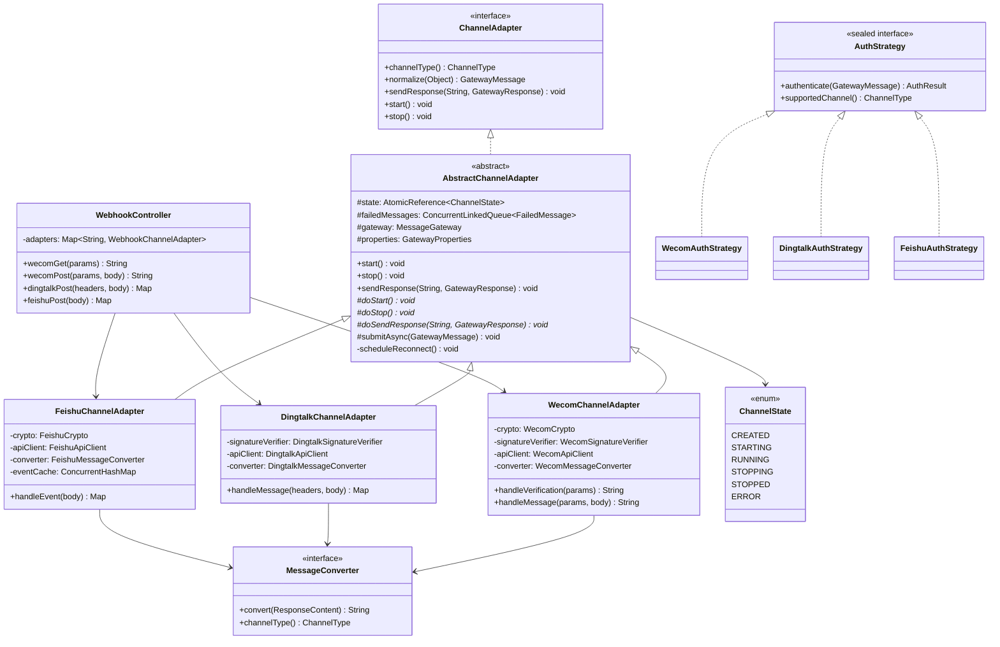
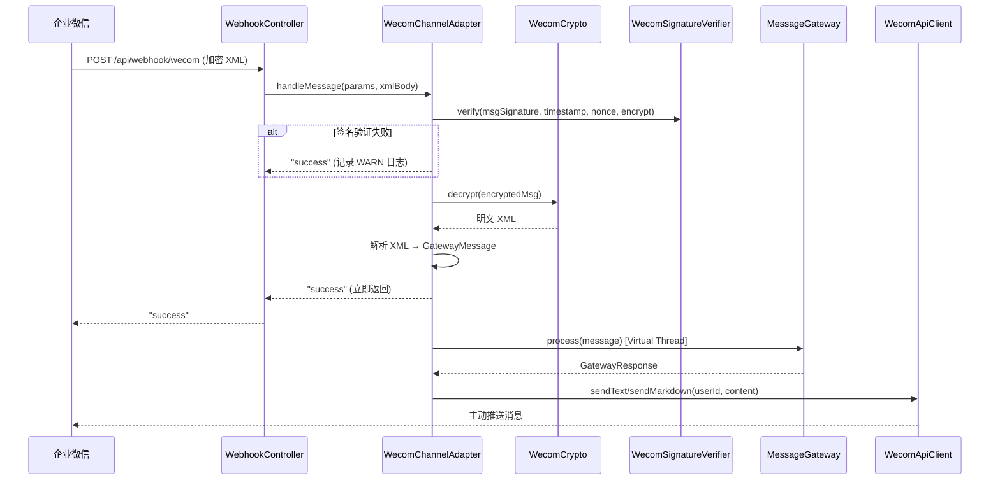
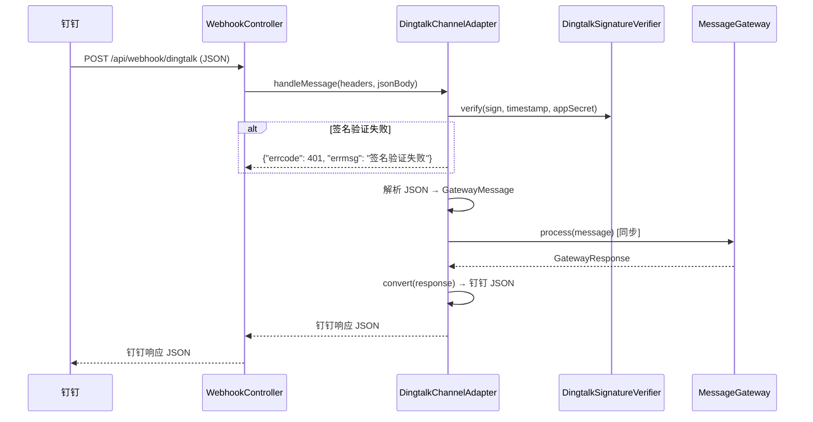
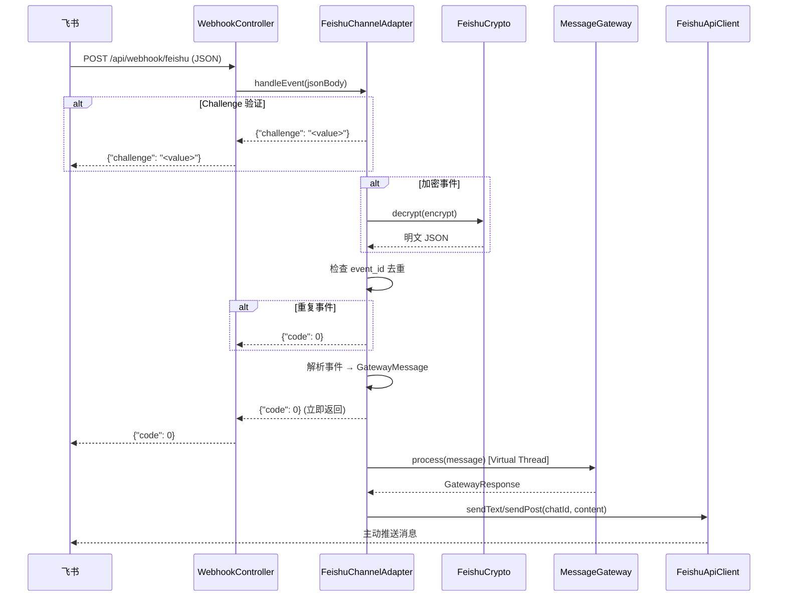

# 设计文档：Channel Adapters（企微 / 钉钉 / 飞书通道适配器）

## 概述

本设计文档定义企业微信、钉钉、飞书三个通道适配器的实现方案。在已完成的 Gateway 框架层（`MessageGateway`、`MiddlewarePipeline`、6 层中间件）基础上，实现真正的企业 IM 通道对接。

核心设计思路：
- 统一 `WebhookController` 接收所有 Webhook 回调，按 `{channel}` 路径变量分发到对应适配器
- 引入 `AbstractChannelAdapter` 基类，封装状态机、重连、失败消息队列等通用逻辑
- 各通道的加解密、签名验证封装为独立工具类（`WecomCrypto`、`DingtalkSignatureVerifier`、`FeishuCrypto`）
- 各通道的响应格式转换封装为 `MessageConverter` 接口的实现
- 扩展 `AuthStrategy` sealed interface，新增三个企业 IM 认证策略
- 扩展 `GatewayProperties.ChannelsProperties`，新增各通道的连接凭据配置

参考文档：
- 架构设计：#[[file:docs/architecture/gateway-middleware.md]]
- 特性设计：#[[file:docs/features/gateway-channels.md]]
- 编码规范：#[[file:.kiro/steering/coding-standards.md]]

## 依赖接口验证

| 接口 | 源码位置 | 验证状态 |
|------|---------|---------|
| `ChannelAdapter` (channelType/normalize/sendResponse/start/stop) | `com.lifepilot.interaction.channel.ChannelAdapter` | ✅ 已核对 |
| `AuthStrategy` sealed interface (permits CliAuthStrategy) | `com.lifepilot.interaction.middleware.auth.AuthStrategy` | ✅ 已核对 |
| `AuthResult.success(userId, trustLevel)` / `AuthResult.failure(reason)` | `com.lifepilot.interaction.middleware.auth.AuthResult` | ✅ 已核对 |
| `TrustLevel` enum (TRUSTED / VERIFIED / ANONYMOUS) | `com.lifepilot.interaction.middleware.auth.TrustLevel` | ✅ 已核对 |
| `ChannelMetadata` sealed interface (permits Cli/Web/Wecom/Dingtalk/Feishu) | `com.lifepilot.interaction.model.ChannelMetadata` | ✅ 已核对 |
| `ChannelType` enum (CLI/WEB/WECOM/DINGTALK/FEISHU) | `com.lifepilot.interaction.model.ChannelType` | ✅ 已核对 |
| `GatewayMessage` record (messageId/channelType/userId/sessionId/content/attachments/channelMetadata/timestamp/traceHeaders) | `com.lifepilot.interaction.model.GatewayMessage` | ✅ 已核对 |
| `GatewayResponse` record (responseId/channelType/content/attachments/metadata/latency/tokenUsage/statusCode/errorMessage) | `com.lifepilot.interaction.model.GatewayResponse` | ✅ 已核对 |
| `MessageContent` sealed interface (TextMessage/CommandMessage/FileMessage/CardMessage/EventMessage) | `com.lifepilot.interaction.model.MessageContent` | ✅ 已核对 |
| `ResponseContent` sealed interface (TextContent/MarkdownContent/CardContent/StreamingContent) | `com.lifepilot.interaction.model.ResponseContent` | ✅ 已核对 |
| `MessageGateway.process(GatewayMessage)` → `GatewayResponse` | `com.lifepilot.interaction.gateway.MessageGateway` | ✅ 已核对 |
| `MessageGateway.registerChannel(ChannelAdapter)` | `com.lifepilot.interaction.gateway.MessageGateway` | ✅ 已核对 |
| `MessageGateway.getChannel(ChannelType)` → `Optional<ChannelAdapter>` | `com.lifepilot.interaction.gateway.MessageGateway` | ✅ 已核对 |
| `GatewayProperties` record (channels.wecom/dingtalk/feishu.enabled) | `com.lifepilot.interaction.config.GatewayProperties` | ✅ 已核对 |
| `GatewayProperties.ReconnectProperties` (maxAttempts/initialDelayMs/maxDelayMs/multiplier) | `com.lifepilot.interaction.config.GatewayProperties` | ✅ 已核对 |
| `GatewayAutoConfiguration` (注册 MiddlewarePipeline + MessageGateway) | `com.lifepilot.interaction.config.GatewayAutoConfiguration` | ✅ 已核对 |
| `GatewayMiddlewareAutoConfiguration` (注册中间件 + CliChannelAdapter) | `com.lifepilot.interaction.config.GatewayMiddlewareAutoConfiguration` | ✅ 已核对 |

### 跨模块接口变更

| 变更接口 | 所属模块 | 变更内容 | 影响模块 | 说明 |
|---------|---------|---------|---------|------|
| `AuthStrategy` sealed interface | interaction.middleware.auth | 新增 `WecomAuthStrategy`、`DingtalkAuthStrategy`、`FeishuAuthStrategy` permits | interaction | 新增 permit，需更新 switch 穷举 |
| `GatewayProperties.ChannelsProperties` | interaction.config | 扩展 `WecomChannelProperties`、`DingtalkChannelProperties`、`FeishuChannelProperties` 字段 | interaction | 新增配置字段，不影响已有字段 |
| `GatewayProperties` | interaction.config | 新增 `WebhookProperties` 嵌套 record | interaction | 新增配置项 |


## 架构

### 整体架构

```
Webhook 回调（企微/钉钉/飞书）
        │
        ▼
┌─────────────────────────────────────────────────────┐
│  WebhookController (/api/webhook/{channel})          │
│  ├─ GET  /api/webhook/wecom   → URL 验证            │
│  ├─ POST /api/webhook/wecom   → 消息接收            │
│  ├─ POST /api/webhook/dingtalk → 消息接收           │
│  └─ POST /api/webhook/feishu  → 事件接收            │
└──────────────────────┬──────────────────────────────┘
                       │ 按 channel 路径变量分发
                       ▼
┌─────────────────────────────────────────────────────┐
│  ChannelAdapter 层                                   │
│  ├─ WecomChannelAdapter                              │
│  │   ├─ WecomCrypto (AES-256-CBC 加解密)            │
│  │   ├─ WecomSignatureVerifier (SHA1 签名验证)       │
│  │   ├─ WecomApiClient (主动推送 API)               │
│  │   └─ WecomMessageConverter (响应格式转换)         │
│  ├─ DingtalkChannelAdapter                           │
│  │   ├─ DingtalkSignatureVerifier (HmacSHA256)      │
│  │   ├─ DingtalkApiClient (主动推送 API)            │
│  │   └─ DingtalkMessageConverter (响应格式转换)      │
│  └─ FeishuChannelAdapter                             │
│      ├─ FeishuCrypto (AES-256-CBC 解密)             │
│      ├─ FeishuApiClient (主动推送 API)              │
│      └─ FeishuMessageConverter (响应格式转换)        │
└──────────────────────┬──────────────────────────────┘
                       │ normalize() → GatewayMessage
                       ▼
┌─────────────────────────────────────────────────────┐
│  MessageGateway.process(GatewayMessage)              │
│  → MiddlewarePipeline                                │
│  → Auth → RateLimit → Security → Router → Exec → Audit │
└──────────────────────┬──────────────────────────────┘
                       │ GatewayResponse
                       ▼
┌─────────────────────────────────────────────────────┐
│  ChannelAdapter.sendResponse()                       │
│  → MessageConverter.convert(ResponseContent)         │
│  → XxxApiClient 主动推送                             │
└─────────────────────────────────────────────────────┘
```

### 异步 vs 同步处理模型

| 通道 | Webhook 超时 | 处理模型 | 响应方式 |
|------|-------------|---------|---------|
| 企微 | 5 秒 | 异步（Virtual Thread） | 立即返回 "success"，通过 API 主动推送 |
| 钉钉 | 20 秒 | 同步优先 | 在 Webhook 回调中直接返回 JSON 响应 |
| 飞书 | 5 秒 | 异步（Virtual Thread） | 立即返回 `{"code": 0}`，通过 API 主动推送 |

钉钉同步超时时，降级为异步推送。

### 类图



## 组件与接口

### 1. ChannelState 枚举

通道适配器生命周期状态机。

```java
package com.lifepilot.interaction.channel;

public enum ChannelState {
    CREATED, STARTING, RUNNING, STOPPING, STOPPED, ERROR
}
```

状态转换：`CREATED → STARTING → RUNNING → STOPPING → STOPPED`，`RUNNING/STARTING → ERROR → STARTING`（自动重连）。

### 2. AbstractChannelAdapter 基类

封装通用的生命周期管理、指数退避重连、失败消息队列。

```java
package com.lifepilot.interaction.channel;

public abstract class AbstractChannelAdapter implements ChannelAdapter {

    protected final AtomicReference<ChannelState> state;
    protected final ConcurrentLinkedQueue<FailedMessage> failedMessages;
    protected MessageGateway gateway;
    protected GatewayProperties properties;

    // 模板方法：start() 管理状态转换，调用 doStart()
    public final void start() { ... }
    public final void stop() { ... }
    public final void sendResponse(String userId, GatewayResponse response) { ... }

    // 子类实现
    protected abstract void doStart();
    protected abstract void doStop();
    protected abstract void doSendResponse(String userId, GatewayResponse response);

    // 异步提交消息到 Gateway（企微/飞书使用）
    protected void submitAsync(GatewayMessage message) {
        Thread.ofVirtual().name("channel-async-" + channelType().value())
              .start(() -> {
                  var response = gateway.process(message);
                  sendResponse(message.userId(), response);
              });
    }

    // 同步提交消息到 Gateway（钉钉使用）
    protected GatewayResponse submitSync(GatewayMessage message) {
        return gateway.process(message);
    }

    // 指数退避重连
    private void scheduleReconnect() { ... }

    // 失败消息记录
    protected record FailedMessage(String userId, GatewayResponse response, int retryCount) {}
}
```

重连参数从 `GatewayProperties.reconnect()` 读取（`maxAttempts=10`、`initialDelayMs=1000`、`maxDelayMs=60000`、`multiplier=2.0`）。

### 3. WebhookController

统一 Webhook 端点控制器，按通道类型分发请求。

```java
package com.lifepilot.interaction.channel.webhook;

@RestController
@RequestMapping("/api/webhook")
public class WebhookController {

    private final Map<String, Object> adapters; // channelType.value() → adapter

    // 企微 URL 验证
    @GetMapping("/wecom")
    public String wecomVerify(@RequestParam Map<String, String> params) { ... }

    // 企微消息接收
    @PostMapping("/wecom")
    public String wecomMessage(@RequestParam Map<String, String> params,
                               @RequestBody String xmlBody) { ... }

    // 钉钉消息接收
    @PostMapping("/dingtalk")
    public Map<String, Object> dingtalkMessage(
            @RequestHeader Map<String, String> headers,
            @RequestBody String jsonBody) { ... }

    // 飞书事件接收
    @PostMapping("/feishu")
    public Map<String, Object> feishuEvent(@RequestBody String jsonBody) { ... }
}
```

异常处理策略：所有端点方法内部 try-catch，异常时返回平台要求的成功响应（企微 `"success"`、钉钉 `{}`、飞书 `{"code": 0}`），避免平台重试风暴。

### 4. MessageConverter 接口

统一响应格式转换接口。

```java
package com.lifepilot.interaction.channel.converter;

public interface MessageConverter {
    ChannelType channelType();
    String convert(ResponseContent content);
}
```

三个实现：
- `WecomMessageConverter`：TextContent → 纯文本，MarkdownContent → 企微 Markdown，CardContent → 企微 Markdown 卡片
- `DingtalkMessageConverter`：TextContent → text 类型 JSON，MarkdownContent → markdown 类型 JSON，CardContent → ActionCard JSON
- `FeishuMessageConverter`：TextContent → text 类型 JSON，MarkdownContent → post 富文本 JSON，CardContent → post 富文本 JSON

### 5. 加解密与签名验证工具

#### WecomCrypto

```java
package com.lifepilot.interaction.channel.wecom;

public class WecomCrypto {
    // AES-256-CBC 加解密，密钥从 EncodingAESKey Base64 解码
    public String decrypt(String encryptedText) { ... }
    public String encrypt(String plainText) { ... }
}
```

#### WecomSignatureVerifier

```java
package com.lifepilot.interaction.channel.wecom;

public class WecomSignatureVerifier {
    // SHA1(sort(token, timestamp, nonce, encrypt))
    public boolean verify(String msgSignature, String timestamp, String nonce, String encrypt) { ... }
    public String compute(String token, String timestamp, String nonce, String encrypt) { ... }
}
```

#### DingtalkSignatureVerifier

```java
package com.lifepilot.interaction.channel.dingtalk;

public class DingtalkSignatureVerifier {
    // HmacSHA256(timestamp + "\n" + appSecret)
    public boolean verify(String sign, long timestamp, String appSecret) { ... }
}
```

#### FeishuCrypto

```java
package com.lifepilot.interaction.channel.feishu;

public class FeishuCrypto {
    // AES-256-CBC 解密，密钥从 encryptKey SHA256 派生
    public String decrypt(String encryptedText) { ... }
}
```

### 6. API Client（各通道主动推送）

#### WecomApiClient

```java
package com.lifepilot.interaction.channel.wecom;

public class WecomApiClient {
    // 获取 access_token（缓存 + 自动刷新）
    // POST /cgi-bin/message/send 发送应用消息
    public void sendText(String userId, String text) { ... }
    public void sendMarkdown(String userId, String markdown) { ... }
}
```

#### DingtalkApiClient

```java
package com.lifepilot.interaction.channel.dingtalk;

public class DingtalkApiClient {
    // 获取 access_token（缓存 + 自动刷新）
    // POST /v1.0/robot/oToMessages/batchSend 发送单聊消息
    public void sendText(String userId, String text) { ... }
    public void sendActionCard(String userId, String title, String text) { ... }
}
```

#### FeishuApiClient

```java
package com.lifepilot.interaction.channel.feishu;

public class FeishuApiClient {
    // 获取 tenant_access_token（缓存 + 自动刷新）
    // POST /open-apis/im/v1/messages 发送消息
    public void sendText(String chatId, String text) { ... }
    public void sendPost(String chatId, String richText) { ... }
}
```

所有 API Client 使用 Spring 的 `RestClient` 发起 HTTP 请求，access_token 缓存在内存中，过期前自动刷新。

### 7. AuthStrategy 扩展

扩展 `AuthStrategy` sealed interface，新增三个 permit：

```java
// 修改 AuthStrategy.java
public sealed interface AuthStrategy
    permits CliAuthStrategy, WecomAuthStrategy, DingtalkAuthStrategy, FeishuAuthStrategy { ... }
```

- `WecomAuthStrategy`：从 `WecomMetadata` 提取签名参数，调用 `WecomSignatureVerifier` 验证，通过后返回 `AuthResult.success(userId, TrustLevel.VERIFIED)`
- `DingtalkAuthStrategy`：从 `DingtalkMetadata` 提取 sign/timestamp，调用 `DingtalkSignatureVerifier` 验证
- `FeishuAuthStrategy`：从 `FeishuMetadata` 提取 eventId，验证 verification token

### 8. ChannelAdapterAutoConfiguration

独立的自动配置类，根据 `GatewayProperties.channels.xxx.enabled` 条件注册各通道 Bean。

```java
@AutoConfiguration(after = GatewayMiddlewareAutoConfiguration.class)
@ConditionalOnProperty(name = "lifepilot.gateway.enabled", matchIfMissing = true)
public class ChannelAdapterAutoConfiguration {

    @Bean
    @ConditionalOnProperty(name = "lifepilot.gateway.channels.wecom.enabled", havingValue = "true")
    public WecomChannelAdapter wecomChannelAdapter(GatewayProperties props, MessageGateway gateway) { ... }

    @Bean
    @ConditionalOnProperty(name = "lifepilot.gateway.channels.dingtalk.enabled", havingValue = "true")
    public DingtalkChannelAdapter dingtalkChannelAdapter(GatewayProperties props, MessageGateway gateway) { ... }

    @Bean
    @ConditionalOnProperty(name = "lifepilot.gateway.channels.feishu.enabled", havingValue = "true")
    public FeishuChannelAdapter feishuChannelAdapter(GatewayProperties props, MessageGateway gateway) { ... }

    // 对应的 AuthStrategy Bean
    @Bean
    @ConditionalOnBean(WecomChannelAdapter.class)
    public WecomAuthStrategy wecomAuthStrategy(GatewayProperties props) { ... }

    // 对应的 MessageConverter Bean
    @Bean
    @ConditionalOnBean(WecomChannelAdapter.class)
    public WecomMessageConverter wecomMessageConverter() { ... }

    // WebhookController 仅在至少一个 Webhook 通道启用时注册
    @Bean
    @ConditionalOnBean(AbstractChannelAdapter.class)
    public WebhookController webhookController(List<AbstractChannelAdapter> adapters) { ... }
}
```

### 9. FailedMessageRetryScheduler

定期扫描各通道的失败消息队列，对健康通道的失败消息进行重试。

```java
@Component
@ConditionalOnBean(AbstractChannelAdapter.class)
public class FailedMessageRetryScheduler {

    // @Scheduled 定期执行
    // 遍历所有 AbstractChannelAdapter 的 failedMessages 队列
    // 对 state == RUNNING 的通道重试发送
    // 超过最大重试次数的消息持久化到 failed_messages 表
}
```

## 数据模型

### GatewayProperties 配置扩展

现有 `ChannelsProperties` 中的 `WecomChannelProperties`、`DingtalkChannelProperties`、`FeishuChannelProperties` 仅有 `enabled` 字段，需要扩展为包含连接凭据的完整配置：

```java
// 企微通道配置
public record WecomChannelProperties(
    @DefaultValue("false") boolean enabled,
    @Nullable String corpId,
    @Nullable String agentId,
    @Nullable String secret,
    @Nullable String token,
    @Nullable String encodingAesKey
) {}

// 钉钉通道配置
public record DingtalkChannelProperties(
    @DefaultValue("false") boolean enabled,
    @Nullable String appKey,
    @Nullable String appSecret,
    @Nullable String robotCode
) {}

// 飞书通道配置
public record FeishuChannelProperties(
    @DefaultValue("false") boolean enabled,
    @Nullable String appId,
    @Nullable String appSecret,
    @Nullable String verificationToken,
    @Nullable String encryptKey,
    @DefaultValue("10000") int eventCacheMaxSize
) {}
```

新增 `WebhookProperties` 嵌套 record：

```java
// 在 GatewayProperties 中新增
@DefaultValue WebhookProperties webhook

public record WebhookProperties(
    @DefaultValue("300") int timestampToleranceSeconds,
    @DefaultValue("3") int maxRetryCount,
    @DefaultValue("60") int retryIntervalSeconds
) {}
```

### failed_messages 数据库表

用于持久化超过重试上限的失败消息。

```sql
CREATE TABLE IF NOT EXISTS failed_messages (
    id          TEXT PRIMARY KEY,
    channel     TEXT NOT NULL,
    user_id     TEXT NOT NULL,
    response_id TEXT NOT NULL,
    content     TEXT NOT NULL,
    retry_count INTEGER NOT NULL DEFAULT 0,
    error       TEXT,
    created_at  TEXT NOT NULL DEFAULT (strftime('%Y-%m-%dT%H:%M:%fZ', 'now')),
    updated_at  TEXT NOT NULL DEFAULT (strftime('%Y-%m-%dT%H:%M:%fZ', 'now'))
);

CREATE INDEX idx_failed_messages_channel ON failed_messages(channel);
CREATE INDEX idx_failed_messages_created_at ON failed_messages(created_at);
```

### 各通道消息处理数据流

#### 企微消息处理流程



#### 钉钉消息处理流程



#### 飞书消息处理流程




## 正确性属性

*属性（Property）是在系统所有合法执行路径上都应成立的特征或行为——本质上是对系统行为的形式化陈述。属性是人类可读规格说明与机器可验证正确性保证之间的桥梁。*

### Property 1: WecomCrypto AES-256-CBC 加解密 round-trip

*For any* 合法的明文字符串（非空、UTF-8 编码），使用 `WecomCrypto` 先加密再解密，应得到与原始明文完全相同的字符串。

**Validates: Requirements 2.4, 5.3**

### Property 2: FeishuCrypto AES-256-CBC 加解密 round-trip

*For any* 合法的明文字符串（非空、UTF-8 编码），使用 `FeishuCrypto` 先加密再解密，应得到与原始明文完全相同的字符串。

**Validates: Requirements 4.2, 5.4**

### Property 3: WecomSignatureVerifier SHA1 签名验证正确性

*For any* 合法的 (token, timestamp, nonce, encrypt) 四元组，`WecomSignatureVerifier.compute()` 计算的签名应等于 `SHA1(sort(token, timestamp, nonce, encrypt))`，且 `verify()` 使用该签名应返回 true；使用任何不同的签名应返回 false。

**Validates: Requirements 2.2, 5.1, 7.2**

### Property 4: DingtalkSignatureVerifier HmacSHA256 签名验证正确性

*For any* 合法的 (timestamp, appSecret) 二元组，`DingtalkSignatureVerifier` 计算的签名应等于 `HmacSHA256(timestamp + "\n" + appSecret)` 的 Base64 编码，且 `verify()` 使用该签名应返回 true；使用任何不同的签名应返回 false。

**Validates: Requirements 3.1, 3.2, 5.2, 7.3**

### Property 5: 时间戳容忍窗口拒绝过期请求

*For any* 时间戳，当该时间戳与当前服务器时间的差值超过配置的 `timestampToleranceSeconds` 时，签名验证应拒绝该请求；当差值在容忍窗口内时，签名验证不应因时间戳原因拒绝。

**Validates: Requirements 5.5**

### Property 6: 消息内容分类正确性

*For any* 非空字符串，如果以 `/` 开头，则 `normalize()` 应将其转换为 `CommandMessage`；否则应转换为 `TextMessage`。转换后的 `toPlainText()` 应包含原始文本内容。

**Validates: Requirements 2.5**

### Property 7: 钉钉 @ 前缀去除

*For any* 包含 `@机器人` 前缀的消息文本，`DingtalkChannelAdapter` 的消息解析应去除 `@` 提及部分，提取的实际文本内容不应包含 `@` 前缀。

**Validates: Requirements 3.5**

### Property 8: 通道 normalize 字段映射正确性

*For any* 合法的通道原始消息（企微 XML / 钉钉 JSON / 飞书 JSON），`normalize()` 产生的 `GatewayMessage` 应满足：`channelType` 与适配器类型一致、`userId` 非空、`sessionId` 非空且包含通道前缀、`channelMetadata` 类型与通道匹配。

**Validates: Requirements 2.6, 3.6, 4.5**

### Property 9: MessageConverter 内容保留性

*For any* `ResponseContent` 实例（TextContent / MarkdownContent / CardContent）和任意 `MessageConverter` 实现，`convert()` 的返回值应为非空字符串，且包含原始 `toPlainText()` 中的核心文本内容。

**Validates: Requirements 8.2, 8.3, 8.4, 8.5**

### Property 10: 飞书事件去重幂等性

*For any* 事件 ID，第一次处理应正常执行并返回结果；使用相同 event_id 的后续请求应直接返回 `{"code": 0}` 而不重复处理。即 `f(f(x)) == f(x)` 的幂等性。

**Validates: Requirements 4.6**

### Property 11: AbstractChannelAdapter 状态机转换正确性

*For any* `AbstractChannelAdapter` 实例和任意合法的操作序列（start / stop），状态转换应遵循定义的状态机：`CREATED → STARTING → RUNNING → STOPPING → STOPPED`，`RUNNING/STARTING → ERROR → STARTING`。不允许出现非法状态转换。

**Validates: Requirements 9.1**

### Property 12: 指数退避延迟计算正确性

*For any* 重连尝试次数 n（1 ≤ n ≤ maxAttempts），计算的延迟应等于 `min(initialDelayMs * multiplier^(n-1), maxDelayMs)`。延迟应单调递增直到达到上限。

**Validates: Requirements 9.2**

### Property 13: 通道条件注册正确性

*For any* 通道 enabled 配置组合（wecom/dingtalk/feishu 各自 true/false），Spring 容器中注册的 `ChannelAdapter` Bean 数量应等于 enabled 为 true 的通道数量。

**Validates: Requirements 6.4, 10.1, 10.2, 10.3**

## 错误处理

### 分层错误处理策略

| 层级 | 错误类型 | 处理方式 |
|------|---------|---------|
| WebhookController | 未知通道 | 返回 HTTP 404 |
| WebhookController | 未捕获异常 | 返回平台要求的成功响应（防重试风暴） |
| 签名验证 | 签名不匹配 | 记录 WARN 日志，返回平台成功响应 |
| 签名验证 | 时间戳过期 | 记录 WARN 日志，拒绝请求 |
| 消息解密 | 解密失败 | 记录 ERROR 日志，返回平台成功响应 |
| 消息解析 | XML/JSON 格式错误 | 记录 ERROR 日志，返回平台成功响应 |
| Gateway 处理 | 中间件管道异常 | 由 DefaultMessageGateway 捕获，返回 500 |
| 响应发送 | API 调用失败 | 加入失败消息重试队列 |
| 响应发送 | 重试超限 | 持久化到 failed_messages 表 |
| 通道启动 | 初始化失败 | 进入 ERROR 状态，触发指数退避重连 |
| 通道运行 | 运行时异常 | 进入 ERROR 状态，触发指数退避重连 |

### 平台特定的错误响应

- 企微：所有异常情况返回字符串 `"success"`，避免企微重试
- 钉钉：签名验证失败返回 `{"errcode": 401, "errmsg": "签名验证失败"}`，其他异常返回 `{}`
- 飞书：所有异常情况返回 `{"code": 0}`，避免飞书重试

### 敏感数据脱敏

日志中涉及以下字段时必须脱敏：
- 消息签名（`msgSignature`、`sign`）：仅显示前 8 位
- 加密密钥（`encodingAesKey`、`encryptKey`）：完全隐藏
- 加密消息体（`encryptedMsg`、`encrypt`）：仅显示前 20 位
- access_token：仅显示前 8 位

## 测试策略

### 属性测试（Property-Based Testing）

使用 **jqwik** 作为属性测试库（已在项目中使用）。

每个属性测试至少运行 100 次迭代。每个测试方法注释引用对应的设计属性。

```
// 标签格式示例
// Feature: channel-adapters, Property 1: WecomCrypto AES-256-CBC 加解密 round-trip
```

属性测试重点覆盖：
- P1/P2: 加解密 round-trip（生成随机 UTF-8 字符串）
- P3/P4: 签名验证正确性（生成随机 token/timestamp/nonce/secret）
- P5: 时间戳容忍窗口（生成随机时间偏移量）
- P6: 消息内容分类（生成随机字符串，含/不含 `/` 前缀）
- P7: @ 前缀去除（生成随机 @ 提及文本）
- P8: normalize 字段映射（生成随机通道消息字段）
- P9: MessageConverter 内容保留（生成随机 ResponseContent）
- P10: 事件去重幂等性（生成随机 event_id 序列）
- P11: 状态机转换（生成随机操作序列）
- P12: 指数退避计算（生成随机尝试次数）

### 单元测试

单元测试聚焦于具体示例和边界情况：

| 测试类 | 覆盖范围 |
|-------|---------|
| `WecomCryptoTest` | 已知测试向量加解密、空字符串、超长文本 |
| `WecomSignatureVerifierTest` | 已知签名比对、空参数、特殊字符 |
| `DingtalkSignatureVerifierTest` | 已知签名比对、时间戳边界 |
| `FeishuCryptoTest` | 已知测试向量解密、Challenge 验证 |
| `WecomChannelAdapterTest` | URL 验证流程、消息处理流程、签名失败场景 |
| `DingtalkChannelAdapterTest` | 消息处理流程、@ 去除、同步/异步切换 |
| `FeishuChannelAdapterTest` | Challenge 验证、事件去重、加密事件处理 |
| `WebhookControllerTest` | 路由分发、未知通道 404、异常处理 |
| `MessageConverterTest` | 各通道各类型 ResponseContent 转换 |
| `AbstractChannelAdapterTest` | 状态机转换、重连逻辑、失败消息队列 |

### 集成测试

| 测试类 | 覆盖范围 |
|-------|---------|
| `ChannelAdapter_Gateway_集成测试` | 通道适配器 → Gateway → 中间件管道端到端流程 |
| `ChannelAdapterAutoConfiguration_集成测试` | 条件 Bean 注册、配置驱动的通道启用/禁用 |
| `WebhookController_集成测试` | Spring MVC 端点注册、HTTP 请求/响应 |

集成测试使用 `@SpringBootTest` + Mock 外部 API（企微/钉钉/飞书 API），不依赖真实的企业 IM 平台。
