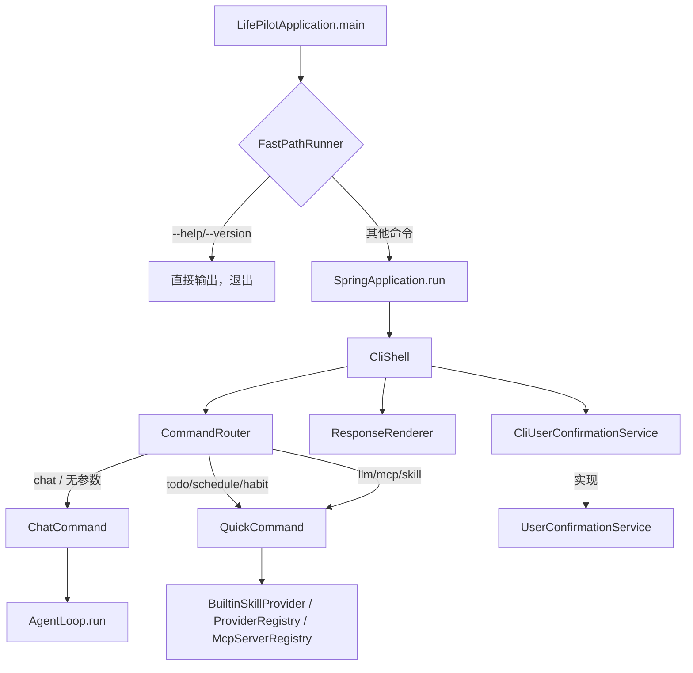

# 设计文档：CLI 交互层

## 概述

CLI 交互层是 LifePilot 的终端用户界面，基于 JLine 3 实现交互式对话和快捷命令。本模块位于 `com.lifepilot.interaction.cli` 包下，依赖 Agent 引擎（AgentLoop）、Skill 系统（BuiltinSkillProvider）、LLM Router（ProviderRegistry）和 MCP（McpServerRegistry）等已完成模块。

核心设计目标：
- 通过 JLine 3 提供流畅的终端交互体验（补全、历史、高亮）
- 快捷命令直接调用 BuiltinSkillProvider 的工具，绕过 Agent 循环
- 实现 `UserConfirmationService` 接口，在终端中处理高风险工具确认
- CLI 快速路径在 `main()` 中拦截 `--help`/`--version`，跳过 Spring 初始化

参考文档：
- 需求文档：#[[file:.kiro/specs/cli-interaction/requirements.md]]
- 架构设计：#[[file:docs/ARCHITECTURE.md]]
- 特性设计：#[[file:docs/FEATURES.md]]
- 编码规范：#[[file:.kiro/steering/coding-standards.md]]

## 架构

### 模块定位

CLI 交互层位于架构的最上层（交互层），向下依赖 Agent 引擎和 Skill 系统，不被其他模块依赖。



### 启动流程

1. `LifePilotApplication.main(args)` 首先调用 `FastPathRunner.tryFastPath(args)`
2. 若匹配 `--help`/`--version`，直接输出并 `System.exit(0)`
3. 否则执行 `SpringApplication.run()`，Spring 容器初始化完成后
4. `CliShell`（实现 `CommandLineRunner`）自动启动，进入命令循环

### 线程模型

- JLine 3 的 `LineReader` 在主线程阻塞读取用户输入
- AgentLoop.run() 同步执行（内部使用 Virtual Thread 做异步后处理）
- LlmRouter.stream() 返回 `Flux<String>`，在主线程订阅并逐 token 输出
- CliUserConfirmationService 在主线程阻塞等待用户输入 y/n

## 组件与接口

### 组件总览

| 组件 | 职责 | 包路径 |
|------|------|--------|
| `CliShell` | JLine 3 交互式 Shell 主循环，实现 `CommandLineRunner` | `interaction.cli` |
| `CommandRouter` | 根据首个参数分发到 ChatCommand 或 QuickCommand | `interaction.cli` |
| `ChatCommand` | 交互式对话命令，调用 AgentLoop | `interaction.cli` |
| `QuickCommand` | 快捷命令分发器，直接调用各模块 API | `interaction.cli` |
| `ResponseRenderer` | 格式化输出（成功/失败/列表/流式） | `interaction.cli` |
| `CliUserConfirmationService` | 终端用户确认服务，实现 `UserConfirmationService` | `interaction.cli` |
| `FastPathRunner` | 快速路径检测，`--help`/`--version` 跳过 Spring | `interaction.cli` |
| `CliConfigProperties` | CLI 配置属性类 | `interaction.cli` |
| `CliAutoConfiguration` | Spring Boot 自动配置 | `interaction.cli.config` |


### 关键接口定义

#### CliShell

```java
/**
 * CLI 交互式 Shell — 基于 JLine 3 的终端主循环。
 *
 * <p>实现 CommandLineRunner，Spring 容器启动后自动进入交互循环。
 * 支持 Tab 补全、命令历史持久化、语法高亮。</p>
 */
public class CliShell implements CommandLineRunner {

    private final CommandRouter commandRouter;
    private final CliConfigProperties config;
    private LineReader lineReader;

    @Override
    public void run(String... args) {
        // 1. 初始化 JLine Terminal + LineReader
        // 2. 配置 Completer、Highlighter、History
        // 3. 根据 args 决定进入对话模式或执行单次命令
        // 4. 进入主循环：读取输入 → CommandRouter 分发 → 输出结果
    }
}
```

#### CommandRouter

```java
/**
 * 命令路由器 — 根据首个参数分发到对应处理器。
 */
public class CommandRouter {

    private final ChatCommand chatCommand;
    private final QuickCommand quickCommand;

    /**
     * 路由命令。
     *
     * @param args 命令行参数（已按空格分割）
     * @param lineReader JLine LineReader（对话模式需要）
     * @param renderer 响应渲染器
     */
    public void route(String[] args, LineReader lineReader, ResponseRenderer renderer);
}
```

#### ChatCommand

```java
/**
 * 交互式对话命令 — 维持多轮对话会话。
 */
public class ChatCommand {

    private final AgentLoop agentLoop;

    /**
     * 启动对话会话。
     *
     * @param lineReader JLine LineReader
     * @param renderer 响应渲染器
     */
    public void startSession(LineReader lineReader, ResponseRenderer renderer);
}
```

#### QuickCommand

```java
/**
 * 快捷命令分发器 — 直接调用各模块 API。
 */
public class QuickCommand {

    private final List<BuiltinSkillProvider> skillProviders;
    private final ProviderRegistry providerRegistry;
    private final McpServerRegistry mcpServerRegistry;
    private final SkillRegistry skillRegistry;
    private final DynamicToolRegistry toolRegistry;

    /**
     * 执行快捷命令。
     *
     * @param command 命令名（todo/schedule/habit/llm/mcp/skill）
     * @param subArgs 子命令和参数
     * @param renderer 响应渲染器
     */
    public void execute(String command, String[] subArgs, ResponseRenderer renderer);
}
```

#### ResponseRenderer

```java
/**
 * 响应渲染器 — 格式化输出到终端。
 */
public class ResponseRenderer {

    private final Terminal terminal;

    /** 输出成功信息（✅ 前缀）。 */
    public void success(String message);

    /** 输出错误信息（❌ 前缀）。 */
    public void error(String message);

    /** 输出表格数据。 */
    public void table(List<String> headers, List<List<String>> rows);

    /** 流式输出（逐 token）。 */
    public void streamToken(String token);

    /** 流式输出结束（换行）。 */
    public void streamEnd();

    /** 输出普通信息。 */
    public void info(String message);
}
```

#### CliUserConfirmationService

```java
/**
 * CLI 用户确认服务 — 在终端中请求用户确认高风险工具执行。
 *
 * <p>实现 UserConfirmationService 接口，替换 NoOpUserConfirmationService。</p>
 */
public class CliUserConfirmationService implements UserConfirmationService {

    private final Terminal terminal;
    private final CliConfigProperties config;

    @Override
    public boolean requestConfirmation(ToolContract tool, ToolInput input, String message) {
        // 1. 显示工具名称、风险级别、确认消息
        // 2. 等待用户输入 y/n（超时返回 false）
        // 3. Ctrl+C 返回 false
    }
}
```

#### FastPathRunner

```java
/**
 * CLI 快速路径 — 简单命令跳过 Spring 初始化。
 */
public final class FastPathRunner {

    /**
     * 尝试快速路径执行。
     *
     * @param args 命令行参数
     * @return true 表示已处理（调用方应退出），false 表示需要完整启动
     */
    public static boolean tryFastPath(String[] args);
}
```

### 快捷命令与模块 API 映射

| 快捷命令 | 调用的模块 API | 说明 |
|---------|---------------|------|
| `todo list` | `DynamicToolRegistry.resolve("builtin.todo.list")` → `ToolContract.execute()` | 通过工具注册中心调用 |
| `todo add <内容>` | `DynamicToolRegistry.resolve("builtin.todo.create")` → `ToolContract.execute()` | 构造 ToolInput 传入 |
| `schedule list` | `DynamicToolRegistry.resolve("builtin.schedule.list")` → `ToolContract.execute()` | 同上 |
| `habit list` | `DynamicToolRegistry.resolve("builtin.habit.list")` → `ToolContract.execute()` | 同上 |
| `llm list` | `ProviderRegistry.registeredIds()` + `ProviderRegistry.getConfig()` | 遍历所有 Provider |
| `llm test <id>` | `ProviderRegistry.healthCheckAll()` 或单个 `getAdapter().healthCheck()` | 健康检查 |
| `mcp list` | `McpServerRegistry.listServers()` | 返回 `List<McpServerEntry>` |
| `skill list` | `SkillRegistry.listSummaries()` | 返回摘要字符串列表 |
| `skill info <id>` | `SkillRegistry.find(skillId)` | 返回 `Optional<SkillDefinition>` |

> 设计决策：快捷命令通过 `DynamicToolRegistry.resolve()` 调用内置工具，而非直接依赖 `BuiltinSkillProvider`。这样保持了工具调用的统一入口，且工具执行经过标准的 ToolContract 接口。


### 依赖接口验证

| 接口 | 源码位置 | 验证状态 |
|------|---------|---------|
| `AgentLoop.run(AgentRequest): AgentResponse` | `com.lifepilot.agent.AgentLoop` | ✅ 已核对 |
| `AgentRequest(message, sessionId, channel)` | `com.lifepilot.agent.model.AgentRequest` | ✅ 已核对 |
| `AgentResponse(traceId, sessionId, content, tokensUsed, stepCount, terminationReason)` | `com.lifepilot.agent.model.AgentResponse` | ✅ 已核对 |
| `SessionManager.findSession(sessionId): Optional<SessionSnapshot>` | `com.lifepilot.agent.session.SessionManager` | ✅ 已核对 |
| `SessionManager.deleteSession(sessionId): void` | `com.lifepilot.agent.session.SessionManager` | ✅ 已核对 |
| `UserConfirmationService.requestConfirmation(ToolContract, ToolInput, String): boolean` | `com.lifepilot.interaction.UserConfirmationService` | ✅ 已核对 |
| `NoOpUserConfirmationService implements UserConfirmationService` | `com.lifepilot.interaction.NoOpUserConfirmationService` | ✅ 已核对 |
| `ProviderRegistry.registeredIds(): Set<String>` | `com.lifepilot.llm.registry.ProviderRegistry` | ✅ 已核对 |
| `ProviderRegistry.getConfig(providerId): Optional<ProviderConfig>` | `com.lifepilot.llm.registry.ProviderRegistry` | ✅ 已核对 |
| `ProviderRegistry.healthCheckAll(): Map<String, Boolean>` | `com.lifepilot.llm.registry.ProviderRegistry` | ✅ 已核对 |
| `ProviderRegistry.getAdapter(providerId): ProviderAdapter` | `com.lifepilot.llm.registry.ProviderRegistry` | ✅ 已核对 |
| `ProviderConfig(id, type, apiUrl, apiKey, modelName, ..., enabled, supportsStreaming)` | `com.lifepilot.llm.config.ProviderConfig` | ✅ 已核对 |
| `McpServerRegistry.listServers(): List<McpServerEntry>` | `com.lifepilot.mcp.registry.McpServerRegistry` | ✅ 已核对 |
| `McpServerEntry(config, client, state, serverInfo, ...)` | `com.lifepilot.mcp.registry.McpServerEntry` | ✅ 已核对 |
| `McpServerState.isAvailable(): boolean` | `com.lifepilot.mcp.registry.McpServerState` | ✅ 已核对 |
| `SkillRegistry.listSummaries(): List<String>` | `com.lifepilot.skill.registry.SkillRegistry` | ✅ 已核对 |
| `SkillRegistry.find(skillId): Optional<SkillDefinition>` | `com.lifepilot.skill.registry.SkillRegistry` | ✅ 已核对 |
| `SkillDefinition(id, name, description, version, source, ...)` | `com.lifepilot.skill.model.SkillDefinition` | ✅ 已核对 |
| `DynamicToolRegistry.resolve(toolId): Optional<ToolContract>` | `com.lifepilot.tool.registry.DynamicToolRegistry` | ✅ 已核对 |
| `ToolContract.execute(ToolInput): ToolResult` | `com.lifepilot.tool.ToolContract` | ✅ 已核对 |
| `ToolContract.id(), name(), riskLevel()` | `com.lifepilot.tool.ToolContract` | ✅ 已核对 |
| `RiskLevel.requiresConfirmation(): boolean` | `com.lifepilot.tool.model.RiskLevel` | ✅ 已核对 |
| `LlmRouter.stream(scene, prompt): Flux<String>` | `com.lifepilot.llm.LlmRouter` | ✅ 已核对 |
| `AgentLoop Bean 注册（AgentAutoConfiguration）` | `com.lifepilot.agent.config.AgentAutoConfiguration` | ✅ 已核对 |
| `SessionManager Bean 注册（AgentAutoConfiguration）` | `com.lifepilot.agent.config.AgentAutoConfiguration` | ✅ 已核对 |

### 跨模块接口变更

| 变更接口 | 所属模块 | 变更内容 | 影响模块 | 兼容性 |
|---------|---------|---------|---------|--------|
| `LifePilotApplication.main()` | 启动类 | 在 `SpringApplication.run()` 前插入 `FastPathRunner.tryFastPath()` 调用 | 无 | 向后兼容（新增逻辑） |
| `NoOpUserConfirmationService` | interaction | CLI 模式下被 `CliUserConfirmationService` 替换（通过 `@ConditionalOnMissingBean` + `@Primary`） | guardrail | 向后兼容（条件注册） |

## 数据模型

本模块不引入新的数据库表。CLI 交互层是纯交互组件，所有持久化数据（会话、待办、日程等）由已有模块管理。

### 本地文件

| 文件 | 路径 | 用途 |
|------|------|------|
| 命令历史 | `~/.lifepilot/cli-history` | JLine 3 `FileHistory` 持久化 |

### 配置模型

```java
@ConfigurationProperties(prefix = "lifepilot.cli")
public class CliConfigProperties {

    /** 命令历史文件路径。 */
    private String historyFile = "${user.home}/.lifepilot/cli-history";

    /** 历史记录最大条数。 */
    private int maxHistorySize = 1000;

    /** 对话模式提示符。 */
    private String chatPrompt = "lifepilot> ";

    /** 普通模式提示符。 */
    private String defaultPrompt = "$ ";

    /** 流式输出刷新间隔（毫秒）。 */
    private long streamFlushIntervalMs = 50;

    /** 用户确认超时时间（秒）。 */
    private int confirmationTimeoutSeconds = 30;

    // getter/setter 省略
}
```

对应 `application.yml` 配置：

```yaml
lifepilot:
  cli:
    history-file: "${user.home}/.lifepilot/cli-history"
    max-history-size: 1000
    chat-prompt: "lifepilot> "
    default-prompt: "$ "
    stream-flush-interval-ms: 50
    confirmation-timeout-seconds: 30
```


## 正确性属性

*属性（Property）是系统在所有合法执行路径上都应保持为真的特征或行为——本质上是对系统行为的形式化陈述。属性是人类可读规格说明与机器可验证正确性保证之间的桥梁。*

### Property 1: AgentRequest 构造正确性

*For any* 用户输入消息字符串，ChatCommand 构造的 AgentRequest 的 `message` 字段应等于原始输入，`channel` 字段应为 `"cli"`，`sessionId` 字段应为当前会话的 UUID。

**Validates: Requirements 1.2**

### Property 2: 会话 ID 不变量

*For any* 对话会话中的多轮交互序列（不包含 `/new` 命令），所有 AgentRequest 的 `sessionId` 应保持相同。

**Validates: Requirements 1.3**

### Property 3: 异常不传播

*For any* AgentLoop 抛出的异常类型，ChatCommand 应捕获该异常并通过 ResponseRenderer 输出错误信息，而不是将异常传播到调用方。

**Validates: Requirements 1.7**

### Property 4: 非法快捷命令输出 usage

*For any* 已知命令名（todo/schedule/habit/llm/mcp/skill）配合不合法的子命令或缺少必要参数，QuickCommand 应输出包含 "用法" 或 "usage" 关键字的帮助信息。

**Validates: Requirements 2.10**

### Property 5: Tab 补全覆盖所有命令

*For any* 已注册的顶层命令名前缀，JLine Completer 返回的补全候选列表应包含该命令。

**Validates: Requirements 3.1**

### Property 6: 命令历史 round-trip

*For any* 命令字符串，写入 JLine FileHistory 后再读取，应能找到该命令。

**Validates: Requirements 3.2**

### Property 7: 多行输入拼接

*For any* 以 `\` 结尾的多行输入序列，解析后的完整消息应等于各行去掉尾部 `\` 后的拼接结果。

**Validates: Requirements 3.4**

### Property 8: 确认输入解析

*For any* 用户确认输入字符串，若 trim 后（忽略大小写）为 "y" 或 "yes" 则返回 true，否则（包括 "n"、"no"、空字符串、任意其他字符串）返回 false。

**Validates: Requirements 4.2, 4.3**

### Property 9: 快速路径检测

*For any* 命令行参数数组，`FastPathRunner.tryFastPath()` 当且仅当首个参数为 `--help`、`-h`、`--version` 或 `-v` 时返回 true，其他所有情况返回 false。

**Validates: Requirements 5.1, 5.2, 5.3**

### Property 10: 命令路由正确性

*For any* 已知命令名（chat/todo/schedule/habit/llm/mcp/skill），CommandRouter 应将其分发到对应的处理器；对于空参数应分发到 ChatCommand。

**Validates: Requirements 6.1, 6.5**

### Property 11: 输出前缀格式化

*For any* 消息字符串，`ResponseRenderer.success()` 的输出应以 "✅" 开头，`ResponseRenderer.error()` 的输出应以 "❌" 开头。

**Validates: Requirements 6.2, 6.3**

### Property 12: 表格输出完整性

*For any* 表头列表和数据行列表，`ResponseRenderer.table()` 的输出应包含所有表头文本和所有数据单元格文本。

**Validates: Requirements 6.4**

### Property 13: 未知命令输出帮助

*For any* 不在已知命令集合中的字符串，CommandRouter 应输出包含可用命令列表的帮助信息。

**Validates: Requirements 6.6**

## 错误处理

### 错误分层策略

| 层次 | 错误类型 | 处理方式 |
|------|---------|---------|
| AgentLoop 调用 | `LlmUnavailableException`、其他运行时异常 | 捕获异常，通过 `ResponseRenderer.error()` 输出友好消息，保持会话可继续 |
| 快捷命令执行 | 工具不存在、参数错误、执行失败 | 捕获异常，输出 ❌ 错误信息和 usage 提示 |
| JLine 终端 | `UserInterruptException`（Ctrl+C） | 对话模式下提示 "输入 /exit 退出"，确认模式下返回 false |
| JLine 终端 | `EndOfFileException`（Ctrl+D） | 优雅退出当前会话 |
| 配置错误 | 历史文件路径不可写 | 降级为内存历史，记录 WARN 日志 |
| 用户确认超时 | 超过 `confirmationTimeoutSeconds` | 返回 false（拒绝执行） |

### 异常消息规范

所有面向用户的错误消息使用中文，格式统一：

```
❌ 命令执行失败: {具体原因}
```

内部日志使用参数化格式：

```java
log.warn("快捷命令执行失败: command={}, error={}", command, e.getMessage());
```

## 测试策略

### 属性测试

使用 **jqwik**（JUnit 5 属性测试库）实现正确性属性验证。

每个属性测试配置：
- 最少 100 次迭代
- 测试方法名使用中文
- 每个测试标注对应的设计属性

标注格式：`// Feature: cli-interaction, Property {number}: {property_text}`

属性测试重点：
- Property 8（确认输入解析）：生成随机字符串，验证解析逻辑
- Property 9（快速路径检测）：生成随机命令行参数，验证检测逻辑
- Property 11（输出前缀格式化）：生成随机消息，验证前缀
- Property 12（表格输出完整性）：生成随机表头和数据，验证输出包含所有内容
- Property 13（未知命令输出帮助）：生成随机非命令字符串，验证帮助输出

### 单元测试

单元测试覆盖具体示例和边界情况：

| 测试类 | 覆盖范围 |
|--------|---------|
| `CommandRouterTest` | 各命令路由分发、空参数默认行为、未知命令处理 |
| `ChatCommandTest` | 对话启动、/exit 退出、/new 新建会话、异常处理 |
| `QuickCommandTest` | todo/schedule/habit/llm/mcp/skill 各子命令 |
| `ResponseRendererTest` | 成功/失败/表格/流式输出格式 |
| `CliUserConfirmationServiceTest` | y/n/yes/no/空/超时/Ctrl+C 各场景 |
| `FastPathRunnerTest` | --help/-h/--version/-v/其他参数 |
| `CliConfigPropertiesTest` | 默认值验证、自定义值加载 |

### 集成测试

```java
class CliShell_AgentLoop_集成测试 {
    @Test
    void 对话模式_用户消息正确传递到AgentLoop() { ... }

    @Test
    void 快捷命令_todo_list_正确调用工具() { ... }
}
```

集成测试使用 `@SpringBootTest` + Mock AgentLoop（避免真实 LLM 调用），验证：
- Spring Context 加载成功，所有 Bean 注入正确
- CliUserConfirmationService 替换 NoOpUserConfirmationService
- 快捷命令通过 DynamicToolRegistry 正确调用工具
