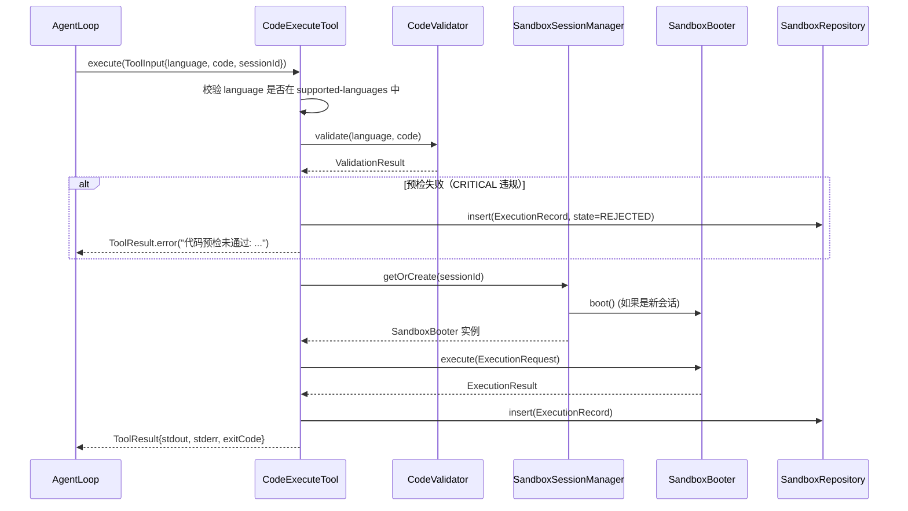

# Design Document: 代码执行沙箱

## Overview

代码执行沙箱为 LifePilot Agent 提供安全的代码执行能力。Agent 通过调用 `code.execute` 工具，经过三层安全防护（CodeValidator 静态预检 → GuardrailPolicy CRITICAL 审批 → SandboxBooter 隔离执行）在沙箱中运行用户代码并返回结果。

核心设计决策：
1. **SandboxBooter sealed interface** — 统一抽象两种隔离策略（ProcessBooter / DockerBooter），编译期穷举匹配
2. **纵深防御** — 三层安全屏障：CodeValidator 正则预检 → GuardrailPolicy CRITICAL 审批 → SandboxBooter 运行时隔离
3. **会话级实例复用** — 同一 Agent 会话内复用沙箱实例，TTL 自动续期，避免冷启动开销
4. **工具系统原生集成** — 作为 BuiltinTool 注册到 DynamicToolRegistry，风险等级 CRITICAL，自动触发护栏审批
5. **全链路审计** — 每次执行写入 SQLite 审计日志（Flyway V16），代码内容仅存 SHA-256 哈希

参考文档：
- 架构设计：#[[file:docs/architecture/sandbox.md]]
- 需求文档：#[[file:.kiro/specs/code-sandbox/requirements.md]]
- 编码规范：#[[file:.kiro/steering/coding-standards.md]]

## Architecture

### 分层架构

```
┌─────────────────────────────────────────────────────────────────┐
│                  SandboxAutoConfiguration                        │
│         （Spring Bean 注册 + 依赖注入 + 条件装配）                 │
├─────────────────────────────────────────────────────────────────┤
│                                                                 │
│  ┌─────────────────┐  ┌─────────────────────────────────────┐  │
│  │ CodeExecuteTool │  │ SandboxSessionManager               │  │
│  │ BuiltinTool     │  │ 会话级实例管理 + TTL 续期 + 定时清理  │  │
│  │ CRITICAL 风险   │  │ ConcurrentHashMap<sessionId, Entry> │  │
│  └────────┬────────┘  └──────────┬──────────────────────────┘  │
│           │                      │                              │
│  ┌────────┴────────┐  ┌─────────┴──────────────────────────┐  │
│  │ CodeValidator   │  │ SandboxBooter (sealed interface)   │  │
│  │ 正则模式匹配     │  │ ├─ ProcessBooter (默认)            │  │
│  │ 三级严重程度     │  │ └─ DockerBooter  (可选)            │  │
│  └─────────────────┘  └────────────────────────────────────┘  │
│                                                                 │
│  ┌─────────────────────────────────────────────────────────┐   │
│  │ SandboxRepository (SQLite 审计持久化, Flyway V16)       │   │
│  └─────────────────────────────────────────────────────────┘   │
│                                                                 │
├─────────────────────────────────────────────────────────────────┤
│              外部依赖（已完成模块）                                │
│  DynamicToolRegistry / ToolExecutionPipeline / GuardrailPolicy  │
│  RiskLevel.CRITICAL / JdbcTemplate                              │
└─────────────────────────────────────────────────────────────────┘
```

### 包结构

```
com.lifepilot.sandbox
├── config/
│   ├── SandboxConfigProperties.java     // @ConfigurationProperties("lifepilot.sandbox")
│   └── SandboxAutoConfiguration.java    // Spring AutoConfiguration
├── model/
│   ├── ExecutionRequest.java            // 执行请求 record
│   ├── ExecutionResult.java             // 执行结果 record
│   ├── ExecutionRecord.java             // 审计记录 record
│   ├── ExecutionState.java              // 执行状态枚举
│   ├── SandboxState.java               // 沙箱实例状态枚举
│   ├── Language.java                    // 支持的语言枚举
│   ├── ValidationResult.java           // 预检结果 record
│   └── Violation.java                  // 违规项 record
├── validator/
│   └── CodeValidator.java               // 代码预检器
├── session/
│   └── SandboxSessionManager.java       // 会话级实例管理
├── booter/
│   ├── SandboxBooter.java               // sealed interface
│   ├── ProcessBooter.java               // ProcessBuilder 轻量沙箱
│   └── DockerBooter.java                // Docker 容器强隔离沙箱
├── tool/
│   └── CodeExecuteTool.java             // BuiltinTool 注册 + 执行编排
└── repository/
    └── SandboxRepository.java           // SQLite 审计持久化
```

### 执行流程



> **注意**：GuardrailPolicy CRITICAL 审批由 ToolExecutionPipeline 在调用 CodeExecuteTool 之前自动执行，CodeExecuteTool 本身不需要显式调用 GuardrailPolicy。


## Components and Interfaces

### 依赖接口验证

| 接口 | 源码位置 | 实际签名 | 验证状态 |
|------|---------|---------|---------|
| DynamicToolRegistry.registerBuiltinTool() | com.lifepilot.tool.registry.DynamicToolRegistry | `void registerBuiltinTool(ToolContract tool)` | ✅ 已核对 |
| BuiltinTool.builder() | com.lifepilot.tool.BuiltinTool | `static Builder builder()` — Builder 方法: id(), name(), description(), inputSchema(), outputSchema(), riskLevel(), idempotent(), budget(), tags(), exportable(), executor() | ✅ 已核对 |
| ToolContract.execute() | com.lifepilot.tool.ToolContract | `ToolResult execute(ToolInput input)` | ✅ 已核对 |
| ToolInput.getParam() | com.lifepilot.tool.model.ToolInput | `<T> T getParam(String name, Class<T> type)` | ✅ 已核对 |
| ToolResult.success() | com.lifepilot.tool.model.ToolResult | `static ToolResult success(Map<String,Object> data)` | ✅ 已核对 |
| ToolResult.error() | com.lifepilot.tool.model.ToolResult | `static ToolResult error(String message)` | ✅ 已核对 |
| RiskLevel.CRITICAL | com.lifepilot.tool.model.RiskLevel | 枚举值，requiresConfirmation()=true, requiresSecondaryVerification()=true | ✅ 已核对 |
| JsonSchema.of() | com.lifepilot.tool.schema.JsonSchema | `static JsonSchema of(Map<String,Object> schema)` | ✅ 已核对 |
| ToolExecutor | com.lifepilot.tool.ToolExecutor | `@FunctionalInterface ToolResult execute(ToolInput input)` | ✅ 已核对 |
| JdbcTemplate | org.springframework.jdbc.core.JdbcTemplate | Spring 标准 API | ✅ |

### SandboxBooter (sealed interface)

沙箱启动器抽象，定义统一的沙箱生命周期和执行接口。

```java
/**
 * 沙箱启动器抽象。
 *
 * <p>sealed interface 确保编译期穷举匹配两种隔离策略。</p>
 *
 * @author zsg
 * @since 2026-03-01
 */
public sealed interface SandboxBooter permits ProcessBooter, DockerBooter {

    /** 启动沙箱实例。 */
    CompletableFuture<Void> boot(Path workingDirectory);

    /** 检查沙箱运行时是否可用。 */
    boolean available();

    /** 在沙箱中执行代码。 */
    ExecutionResult execute(ExecutionRequest request);

    /** 关闭沙箱实例，释放资源。 */
    void shutdown();

    /** 获取沙箱类型标识（"process" 或 "docker"）。 */
    String type();
}
```

### ProcessBooter

基于 Java ProcessBuilder 的轻量级进程沙箱，零外部依赖，默认方案。

```java
/**
 * 基于 ProcessBuilder 的轻量级进程沙箱。
 *
 * @author zsg
 * @since 2026-03-01
 */
public final class ProcessBooter implements SandboxBooter {

    ProcessBooter(SandboxConfigProperties config);

    @Override
    public CompletableFuture<Void> boot(Path workingDirectory);
    // 创建临时目录，状态置为 READY

    @Override
    public boolean available();
    // 始终返回 true（ProcessBuilder 在 JVM 中始终可用）

    @Override
    public ExecutionResult execute(ExecutionRequest request);
    // 1. 将代码写入临时脚本文件（.py / .js / .sh）
    // 2. 构建 ProcessBuilder：command + directory + 清洗环境变量
    // 3. 启动进程，Virtual Thread 异步读取 stdout / stderr
    // 4. waitFor(timeout) → 正常退出 / 超时 destroyForcibly()
    // 5. 截断输出到 max-output-bytes
    // 6. 构建 ExecutionResult

    @Override
    public void shutdown();
    // 清理临时目录

    @Override
    public String type();
    // 返回 "process"
}
```

**关键实现细节**：
- 环境变量清洗：`ProcessBuilder.environment().clear()`，仅保留 PATH 和语言运行时变量
- 输出读取：使用 Virtual Thread 分别读取 stdout 和 stderr，避免阻塞
- 超时处理：`Process.waitFor(timeout, SECONDS)`，超时调用 `destroyForcibly()`
- 临时目录：`Files.createTempDirectory("lifepilot-sandbox-")`，执行后删除

### DockerBooter

基于 Docker Engine CLI 的容器级强隔离沙箱。

```java
/**
 * 基于 Docker 容器的强隔离沙箱。
 *
 * @author zsg
 * @since 2026-03-01
 */
public final class DockerBooter implements SandboxBooter {

    DockerBooter(SandboxConfigProperties config);

    @Override
    public CompletableFuture<Void> boot(Path workingDirectory);
    // 检查 Docker 可用性，准备工作目录

    @Override
    public boolean available();
    // 执行 "docker info"，成功返回 true

    @Override
    public ExecutionResult execute(ExecutionRequest request);
    // 1. 将代码写入工作目录
    // 2. 构建 docker run 命令：
    //    --rm --network none --read-only --user 1000:1000
    //    --memory {limit}m --cpus {limit}
    //    -v {workDir}:/workspace:rw
    //    {image-prefix}{language} {runtime} /workspace/script.{ext}
    // 3. 通过 ProcessBuilder 执行 docker run
    // 4. 捕获 stdout / stderr，超时 docker kill
    // 5. 构建 ExecutionResult

    @Override
    public void shutdown();
    // 清理工作目录

    @Override
    public String type();
    // 返回 "docker"
}
```

**Docker 容器配置**：
- `--rm`：容器退出后自动删除
- `--network none`：默认禁用网络（可配置开启）
- `--read-only`：只读根文件系统
- `--user 1000:1000`：非 root 用户运行
- `--memory` / `--cpus`：资源限制
- `-v {workDir}:/workspace:rw`：仅工作目录可写

### CodeValidator

代码预检器，通过正则模式匹配检测已知危险操作。

```java
/**
 * 代码预检器 — 静态模式匹配检测危险操作。
 *
 * @author zsg
 * @since 2026-03-01
 */
public class CodeValidator {

    CodeValidator(SandboxConfigProperties config);

    /**
     * 校验代码是否包含危险模式。
     *
     * @param language 编程语言
     * @param code 待校验的代码
     * @return 校验结果，包含通过状态和违规列表
     */
    ValidationResult validate(Language language, String code);
}
```

**检测规则按语言和严重程度组织**：

| 语言 | CRITICAL | HIGH | MEDIUM |
|------|----------|------|--------|
| Python | os.system, subprocess.call, os.exec*, eval(), exec(), compile(), \_\_import\_\_() | os.remove, shutil.rmtree, open('/etc/') | urllib.request, requests.get, socket.connect |
| JavaScript | child_process.exec, child_process.spawn, require('child_process') | fs.unlinkSync, fs.rmdirSync, fs.writeFileSync('/') | http.request, fetch(), net.connect |
| Shell | rm -rf /, dd if=, mkfs, fork bomb, sudo, su, chmod 777, chown root | — | curl, wget, nc, ssh |

**判定逻辑**：
- `validator.enabled=false` → 直接返回 `ValidationResult(true, [])`
- `validator.reject-critical=true`（默认）且存在 CRITICAL 违规 → `ValidationResult(false, violations)`
- 其他情况 → `ValidationResult(true, violations)`（记录但不阻止）

### SandboxSessionManager

会话级沙箱实例管理器。

```java
/**
 * 会话级沙箱实例管理器。
 *
 * @author zsg
 * @since 2026-03-01
 */
public class SandboxSessionManager {

    SandboxSessionManager(SandboxConfigProperties config,
                          SandboxBooter booterTemplate);

    /**
     * 获取或创建会话沙箱实例。
     *
     * @param sessionId 会话 ID
     * @return 沙箱启动器实例
     * @throws IllegalStateException 活跃会话数达到上限
     */
    SandboxBooter getOrCreate(String sessionId);

    /** 销毁指定会话的沙箱实例。 */
    void destroy(String sessionId);

    /** 清理所有过期会话（由定时任务调用）。 */
    void cleanupExpired();

    /** 获取当前活跃会话数。 */
    int activeCount();

    /** 关闭所有会话（应用关闭时调用）。 */
    void shutdownAll();
}
```

**内部存储**：

```java
record SandboxEntry(
    SandboxBooter booter,
    Instant lastAccessTime,
    Path workingDirectory
) {}

// 会话 → 沙箱实例映射
ConcurrentHashMap<String, SandboxEntry> sessions;
```

**TTL 机制**：
- `ScheduledExecutorService` 定时扫描（默认 60 秒间隔）
- 每次 `getOrCreate()` 更新 `lastAccessTime`（TTL 续期）
- 超过 TTL（默认 600 秒）的会话自动销毁
- 最大活跃会话数限制（默认 5），超出时拒绝创建

### CodeExecuteTool

代码执行工具，编排预检、会话管理、执行和审计的完整流程。

```java
/**
 * 代码执行工具 — 作为 BuiltinTool 注册到 DynamicToolRegistry。
 *
 * @author zsg
 * @since 2026-03-01
 */
public class CodeExecuteTool {

    CodeExecuteTool(CodeValidator validator,
                    SandboxSessionManager sessionManager,
                    SandboxRepository repository,
                    SandboxConfigProperties config);

    /**
     * 构建 BuiltinTool 实例用于注册。
     *
     * @return BuiltinTool 实例，id="code.execute", riskLevel=CRITICAL
     */
    BuiltinTool buildTool();

    /**
     * 工具执行逻辑（作为 ToolExecutor 注入 BuiltinTool）。
     *
     * @param input 工具输入，包含 language、code、sessionId 参数
     * @return 执行结果
     */
    ToolResult execute(ToolInput input);
}
```

**buildTool() 构建的 BuiltinTool**：

```java
BuiltinTool.builder()
    .id("code.execute")
    .name("代码执行")
    .description("在安全沙箱中执行代码（Python/JavaScript/Shell）")
    .inputSchema(JsonSchema.of(Map.of(
        "type", "object",
        "required", List.of("language", "code", "sessionId"),
        "properties", Map.of(
            "language", Map.of("type", "string", "enum", List.of("python", "javascript", "shell")),
            "code", Map.of("type", "string"),
            "sessionId", Map.of("type", "string")
        )
    )))
    .riskLevel(RiskLevel.CRITICAL)
    .idempotent(false)
    .executor(this::execute)
    .build()
```

### SandboxRepository

审计持久化仓储。

```java
/**
 * 沙箱执行审计持久化仓储。
 *
 * @author zsg
 * @since 2026-03-01
 */
public class SandboxRepository {

    SandboxRepository(JdbcTemplate jdbcTemplate);

    /** 插入执行记录。 */
    void insert(ExecutionRecord record);

    /** 按会话 ID 查询执行记录。 */
    List<ExecutionRecord> findBySessionId(String sessionId);

    /** 按状态查询执行记录。 */
    List<ExecutionRecord> findByState(String state);

    /** 按时间范围查询执行记录。 */
    List<ExecutionRecord> findByTimeRange(Instant from, Instant to);
}
```

### SandboxAutoConfiguration

```java
/**
 * 沙箱模块 Spring AutoConfiguration。
 *
 * @author zsg
 * @since 2026-03-01
 */
@AutoConfiguration
@ConditionalOnProperty(name = "lifepilot.sandbox.enabled", havingValue = "true", matchIfMissing = true)
@EnableConfigurationProperties(SandboxConfigProperties.class)
public class SandboxAutoConfiguration {

    @Bean
    SandboxBooter sandboxBooter(SandboxConfigProperties config);
    // 根据 config.getBooter() 选择 ProcessBooter 或 DockerBooter
    // booter=docker 时检查 Docker 可用性，不可用则启动失败

    @Bean
    CodeValidator codeValidator(SandboxConfigProperties config);

    @Bean
    SandboxSessionManager sandboxSessionManager(
            SandboxConfigProperties config, SandboxBooter booter);

    @Bean
    SandboxRepository sandboxRepository(JdbcTemplate jdbcTemplate);

    @Bean
    CodeExecuteTool codeExecuteTool(
            CodeValidator validator,
            SandboxSessionManager sessionManager,
            SandboxRepository repository,
            SandboxConfigProperties config,
            DynamicToolRegistry toolRegistry);
    // 构建 CodeExecuteTool 并调用 toolRegistry.registerBuiltinTool(tool.buildTool())
}
```


## Data Models

### Language 枚举

```java
/**
 * 沙箱支持的编程语言。
 *
 * @author zsg
 * @since 2026-03-01
 */
public enum Language {

    PYTHON("python3", ".py"),
    JAVASCRIPT("node", ".js"),
    SHELL("bash", ".sh");

    private final String runtimeCommand;
    private final String fileExtension;

    Language(String runtimeCommand, String fileExtension) {
        this.runtimeCommand = runtimeCommand;
        this.fileExtension = fileExtension;
    }

    public String runtimeCommand() { return runtimeCommand; }
    public String fileExtension() { return fileExtension; }

    /**
     * 从字符串解析语言枚举。
     *
     * @param name 语言名称（不区分大小写）
     * @return 对应的 Language 枚举值
     */
    public static Optional<Language> fromString(String name) {
        try {
            return Optional.of(valueOf(name.toUpperCase()));
        } catch (IllegalArgumentException e) {
            return Optional.empty();
        }
    }
}
```

> **注意**：`runtimeCommand` 是默认值，实际运行时从 `SandboxConfigProperties.runtimePaths` 读取配置覆盖。

### ExecutionState 枚举

```java
/**
 * 代码执行状态。
 *
 * @author zsg
 * @since 2026-03-01
 */
public enum ExecutionState {
    COMPLETED, TIMEOUT, FAILED
}
```

### SandboxState 枚举

```java
/**
 * 沙箱实例状态。
 *
 * @author zsg
 * @since 2026-03-01
 */
public enum SandboxState {
    READY, RUNNING, SHUTDOWN
}
```

### ExecutionRequest

```java
/**
 * 代码执行请求。
 *
 * @param language 编程语言
 * @param code 待执行的代码
 * @param timeoutSeconds 超时时间（秒）
 * @param workingDirectory 工作目录
 * @author zsg
 * @since 2026-03-01
 */
public record ExecutionRequest(
    Language language,
    String code,
    int timeoutSeconds,
    Path workingDirectory
) {}
```

### ExecutionResult

```java
/**
 * 代码执行结果。
 *
 * @param stdout 标准输出
 * @param stderr 标准错误
 * @param exitCode 退出码
 * @param durationMs 执行耗时（毫秒）
 * @param state 执行状态
 * @author zsg
 * @since 2026-03-01
 */
public record ExecutionResult(
    String stdout,
    String stderr,
    int exitCode,
    long durationMs,
    ExecutionState state
) {}
```

### ValidationResult / Violation

```java
/**
 * 代码预检结果。
 *
 * @param passed 是否通过预检
 * @param violations 违规项列表
 * @author zsg
 * @since 2026-03-01
 */
public record ValidationResult(
    boolean passed,
    List<Violation> violations
) {
    /** 创建通过结果。 */
    public static ValidationResult ok() {
        return new ValidationResult(true, List.of());
    }

    /** 创建失败结果。 */
    public static ValidationResult rejected(List<Violation> violations) {
        return new ValidationResult(false, List.copyOf(violations));
    }
}

/**
 * 代码预检违规项。
 *
 * @param pattern 匹配的危险模式
 * @param description 违规描述
 * @param severity 严重程度（CRITICAL / HIGH / MEDIUM）
 * @param lineNumber 违规所在行号
 * @author zsg
 * @since 2026-03-01
 */
public record Violation(
    String pattern,
    String description,
    String severity,
    int lineNumber
) {}
```

### ExecutionRecord

```java
/**
 * 执行审计记录。
 *
 * @author zsg
 * @since 2026-03-01
 */
public record ExecutionRecord(
    String id,
    String sessionId,
    Language language,
    String codeHash,
    int codeLength,
    String booterType,
    boolean validationPassed,
    int violationCount,
    @Nullable Integer exitCode,
    @Nullable Integer stdoutLength,
    @Nullable Integer stderrLength,
    @Nullable Long durationMs,
    String state,
    @Nullable String errorMessage,
    Instant createdAt,
    Instant updatedAt
) {}
```

### SandboxConfigProperties

```java
/**
 * 沙箱配置属性。
 *
 * @author zsg
 * @since 2026-03-01
 */
@ConfigurationProperties(prefix = "lifepilot.sandbox")
public class SandboxConfigProperties {

    /** 是否启用沙箱。 */
    private boolean enabled = true;

    /** 沙箱类型：process / docker。 */
    private String booter = "process";

    /** 支持的语言列表。 */
    private List<String> supportedLanguages = List.of("python", "javascript", "shell");

    /** 执行超时（秒）。 */
    private int executionTimeoutSeconds = 30;

    /** 输出最大字节数。 */
    private int maxOutputBytes = 65536;

    /** 语言运行时路径。 */
    private Map<String, String> runtimePaths = Map.of(
        "python", "python3",
        "javascript", "node",
        "shell", "bash"
    );

    /** 会话配置。 */
    private Session session = new Session();

    /** 预检配置。 */
    private Validator validator = new Validator();

    /** Docker 配置。 */
    private Docker docker = new Docker();

    // getter / setter 省略

    public static class Session {
        private int ttlSeconds = 600;
        private int maxActiveSessions = 5;
        private int cleanupIntervalSeconds = 60;
        // getter / setter 省略
    }

    public static class Validator {
        private boolean enabled = true;
        private boolean rejectCritical = true;
        // getter / setter 省略
    }

    public static class Docker {
        private int memoryLimitMb = 256;
        private double cpuLimit = 1.0;
        private int diskLimitMb = 512;
        private boolean networkEnabled = false;
        private String imagePrefix = "lifepilot/sandbox-";
        // getter / setter 省略
    }
}
```

### 数据库 Schema (Flyway V16)

```sql
-- V16__create_sandbox_executions.sql

CREATE TABLE IF NOT EXISTS sandbox_executions (
    id                TEXT PRIMARY KEY,
    session_id        TEXT NOT NULL,
    language          TEXT NOT NULL,
    code_hash         TEXT NOT NULL,
    code_length       INTEGER NOT NULL,
    booter_type       TEXT NOT NULL,
    validation_passed INTEGER NOT NULL,
    violation_count   INTEGER NOT NULL DEFAULT 0,
    exit_code         INTEGER,
    stdout_length     INTEGER,
    stderr_length     INTEGER,
    duration_ms       INTEGER,
    state             TEXT NOT NULL,
    error_message     TEXT,
    created_at        TEXT NOT NULL,
    updated_at        TEXT NOT NULL
);

CREATE INDEX idx_sandbox_executions_session ON sandbox_executions(session_id);
CREATE INDEX idx_sandbox_executions_state ON sandbox_executions(state);
CREATE INDEX idx_sandbox_executions_created ON sandbox_executions(created_at);
```

### application.yml 配置声明

```yaml
lifepilot:
  sandbox:
    enabled: true
    booter: process
    supported-languages:
      - python
      - javascript
      - shell
    execution-timeout-seconds: 30
    max-output-bytes: 65536
    runtime-paths:
      python: "python3"
      javascript: "node"
      shell: "bash"
    session:
      ttl-seconds: 600
      max-active-sessions: 5
      cleanup-interval-seconds: 60
    validator:
      enabled: true
      reject-critical: true
    docker:
      memory-limit-mb: 256
      cpu-limit: 1.0
      disk-limit-mb: 512
      network-enabled: false
      image-prefix: "lifepilot/sandbox-"
```


## Correctness Properties

*A property is a characteristic or behavior that should hold true across all valid executions of a system — essentially, a formal statement about what the system should do. Properties serve as the bridge between human-readable specifications and machine-verifiable correctness guarantees.*

### Property 1: CodeValidator 检测已知危险模式

*For any* language (Python, JavaScript, Shell) and *for any* code string that contains a known dangerous pattern for that language, the CodeValidator should return a ValidationResult containing at least one Violation whose pattern matches the dangerous pattern and whose severity matches the expected level (CRITICAL, HIGH, or MEDIUM).

**Validates: Requirements 4.1, 4.2, 4.3, 4.4, 4.5, 4.6, 4.7, 4.8**

### Property 2: CodeValidator 配置行为一致性

*For any* code string: (a) when `validator.enabled=false`, the CodeValidator should return `ValidationResult(passed=true, violations=[])` regardless of code content; (b) when `validator.enabled=true` and `reject-critical=true` and the code contains a CRITICAL pattern, the CodeValidator should return `passed=false`; (c) when `validator.enabled=true` and `reject-critical=true` and the code contains only HIGH/MEDIUM patterns, the CodeValidator should return `passed=true` with non-empty violations.

**Validates: Requirements 4.10, 4.11**

### Property 3: 超时执行返回 TIMEOUT 状态

*For any* SandboxBooter implementation (ProcessBooter or DockerBooter) and *for any* code that runs longer than the configured timeout, the execute() method should return an ExecutionResult with `state=TIMEOUT` and the process/container should be terminated.

**Validates: Requirements 2.5, 3.6**

### Property 4: 输出截断不超过最大字节数

*For any* code execution that produces output, the captured stdout and stderr in the ExecutionResult should each have byte length less than or equal to `maxOutputBytes`. Specifically, *for any* output size N > maxOutputBytes, the captured output should be exactly maxOutputBytes bytes.

**Validates: Requirements 2.6**

### Property 5: 环境变量清洗

*For any* code execution via ProcessBooter, the executing process should not have access to sensitive environment variables (HOME, USER, or any variable containing "KEY", "SECRET", "TOKEN", "PASSWORD"). Only PATH and language-specific runtime variables should be present.

**Validates: Requirements 2.3**

### Property 6: 会话管理 activeCount 一致性

*For any* sequence of getOrCreate(sessionId) and destroy(sessionId) operations on SandboxSessionManager, the activeCount() should always equal the number of distinct sessions that have been created but not yet destroyed. Additionally, calling getOrCreate with the same sessionId multiple times should return the same SandboxBooter instance and not increase activeCount.

**Validates: Requirements 5.2, 5.3, 5.7**

### Property 7: 会话最大数量限制

*For any* configured maxActiveSessions value N, after successfully creating N distinct sessions, the next getOrCreate() call with a new sessionId should throw an exception or return an error. Existing sessions should remain accessible.

**Validates: Requirements 5.4**

### Property 8: 会话 TTL 过期清理

*For any* session that has not been accessed for longer than the configured TTL, calling cleanupExpired() should destroy that session (shutdown booter, remove entry, decrease activeCount). Sessions accessed within the TTL window should not be affected.

**Validates: Requirements 5.5, 5.6**

### Property 9: 审计记录完整性

*For any* code execution (regardless of outcome), the persisted ExecutionRecord should satisfy: (a) codeHash equals SHA-256 of the original code, (b) stdoutLength equals the byte length of the actual stdout, (c) stderrLength equals the byte length of the actual stderr, (d) state is one of COMPLETED/TIMEOUT/FAILED/REJECTED matching the actual execution outcome.

**Validates: Requirements 7.3, 7.4, 7.5**

### Property 10: 工具输入验证拒绝无效请求

*For any* language string not in the configured supported-languages list, the CodeExecuteTool should return a ToolResult with `ok=false`. *For any* code that fails CodeValidator validation (passed=false), the CodeExecuteTool should return a ToolResult with `ok=false` containing violation details, and persist an ExecutionRecord with state=REJECTED.

**Validates: Requirements 6.3, 6.4**

### Property 11: 每次执行产生审计记录

*For any* invocation of CodeExecuteTool.execute() (whether successful, timed out, failed, or rejected), exactly one ExecutionRecord should be persisted to SandboxRepository.

**Validates: Requirements 6.6, 6.7**

### Property 12: Language.fromString round-trip

*For any* Language enum value, calling `Language.fromString(language.name().toLowerCase())` should return `Optional.of(language)`. *For any* string that is not a valid language name, `Language.fromString()` should return `Optional.empty()`.

**Validates: Requirements 10.4**

### Property 13: 执行后临时目录清理

*For any* code execution via any SandboxBooter implementation, after execute() returns (whether success, timeout, or failure), the temporary script file created for that execution should be deleted.

**Validates: Requirements 2.7, 3.7**

## Error Handling

### 分层错误处理策略

| 层次 | 错误类型 | 处理方式 |
|------|---------|---------|
| CodeValidator | 代码包含危险模式 | 返回 `ValidationResult(false, violations)`，不抛异常 |
| CodeExecuteTool | 不支持的语言 | 返回 `ToolResult.error("不支持的语言: ...")` |
| CodeExecuteTool | 预检失败 | 返回 `ToolResult.error("代码预检未通过: ...")`，持久化 REJECTED 记录 |
| CodeExecuteTool | 会话数达上限 | 返回 `ToolResult.error("活跃会话数已达上限")` |
| SandboxBooter | 执行超时 | 强制终止进程/容器，返回 `ExecutionResult(state=TIMEOUT)` |
| SandboxBooter | 运行时异常 | 返回 `ExecutionResult(state=FAILED)`，stderr 包含错误信息 |
| CodeExecuteTool | 未预期异常 | 捕获异常，返回 `ToolResult.error(exception.getMessage())`，持久化 FAILED 记录 |
| SandboxSessionManager | TTL 过期 | 静默销毁会话，INFO 日志 |
| SandboxAutoConfiguration | Docker 不可用（booter=docker） | 启动失败，ERROR 日志 |
| SandboxRepository | SQLite 写入失败 | ERROR 日志，不影响工具返回结果（审计降级） |

### 异常处理原则

1. **CodeValidator 和 CodeExecuteTool 不抛异常** — 所有错误通过 ValidationResult / ToolResult 返回
2. **SandboxBooter 执行异常转为 ExecutionResult** — 捕获所有异常，转为 FAILED 状态
3. **审计写入失败不影响主流程** — SandboxRepository 异常仅记录日志，不传播
4. **资源清理在 finally 块中执行** — 临时目录、进程、容器的清理不受异常影响

## Testing Strategy

### 属性测试库

使用 **jqwik**（JUnit 5 原生集成的 Java 属性测试库），每个属性测试最少 100 次迭代。

### 属性测试

每个 Correctness Property 对应一个属性测试：

| Property | 测试类 | 标签 |
|----------|--------|------|
| Property 1: 危险模式检测 | CodeValidatorPropertyTest | Feature: code-sandbox, Property 1: dangerous pattern detection |
| Property 2: 配置行为一致性 | CodeValidatorPropertyTest | Feature: code-sandbox, Property 2: configuration behavior consistency |
| Property 3: 超时返回 TIMEOUT | SandboxBooterPropertyTest | Feature: code-sandbox, Property 3: timeout produces TIMEOUT state |
| Property 4: 输出截断 | SandboxBooterPropertyTest | Feature: code-sandbox, Property 4: output truncation invariant |
| Property 5: 环境变量清洗 | ProcessBooterPropertyTest | Feature: code-sandbox, Property 5: environment variable cleaning |
| Property 6: activeCount 一致性 | SandboxSessionManagerPropertyTest | Feature: code-sandbox, Property 6: session activeCount consistency |
| Property 7: 最大会话限制 | SandboxSessionManagerPropertyTest | Feature: code-sandbox, Property 7: max session limit enforcement |
| Property 8: TTL 过期清理 | SandboxSessionManagerPropertyTest | Feature: code-sandbox, Property 8: session TTL expiry cleanup |
| Property 9: 审计记录完整性 | SandboxRepositoryPropertyTest | Feature: code-sandbox, Property 9: audit record integrity |
| Property 10: 输入验证拒绝 | CodeExecuteToolPropertyTest | Feature: code-sandbox, Property 10: input validation rejection |
| Property 11: 执行产生审计记录 | CodeExecuteToolPropertyTest | Feature: code-sandbox, Property 11: execution produces audit record |
| Property 12: Language round-trip | LanguagePropertyTest | Feature: code-sandbox, Property 12: Language.fromString round-trip |
| Property 13: 临时目录清理 | SandboxBooterPropertyTest | Feature: code-sandbox, Property 13: temp directory cleanup after execution |

### 单元测试

单元测试聚焦于具体示例和边界情况：

- **CodeValidatorTest** — 各语言各严重程度的具体危险模式示例、安全代码不触发误报、多行代码中的行号定位、空代码输入
- **ProcessBooterTest** — Python/JS/Shell 各语言的简单代码执行示例、退出码验证、空输出处理
- **DockerBooterTest** — Docker 不可用时 available() 返回 false、Docker 命令构建验证（Mock ProcessBuilder）
- **SandboxSessionManagerTest** — 创建/销毁/过期的具体场景、并发访问安全性
- **CodeExecuteToolTest** — 完整执行流程示例（Mock SandboxBooter）、各种错误场景
- **SandboxRepositoryTest** — CRUD 操作具体示例（内存 SQLite）、SHA-256 哈希验证
- **LanguageTest** — 各枚举值的 runtimeCommand 和 fileExtension 验证、fromString 边界情况（null、空字符串、大小写）

### 集成测试

- **CodeExecuteTool_DynamicToolRegistry_集成测试** — 验证 CodeExecuteTool 作为 BuiltinTool 正确注册到 DynamicToolRegistry，风险等级为 CRITICAL
- **SandboxAutoConfiguration_集成测试** — 验证 Spring Context 加载、所有 Bean 正确注入、条件装配（enabled=false 时不注册 Bean）
- **SandboxRepository_Flyway_集成测试** — 验证 V16 迁移脚本正确创建表和索引，CRUD 操作端到端验证
