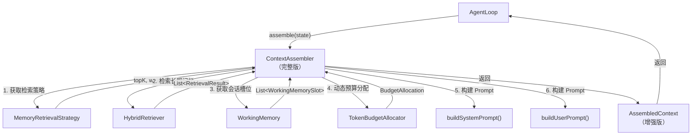
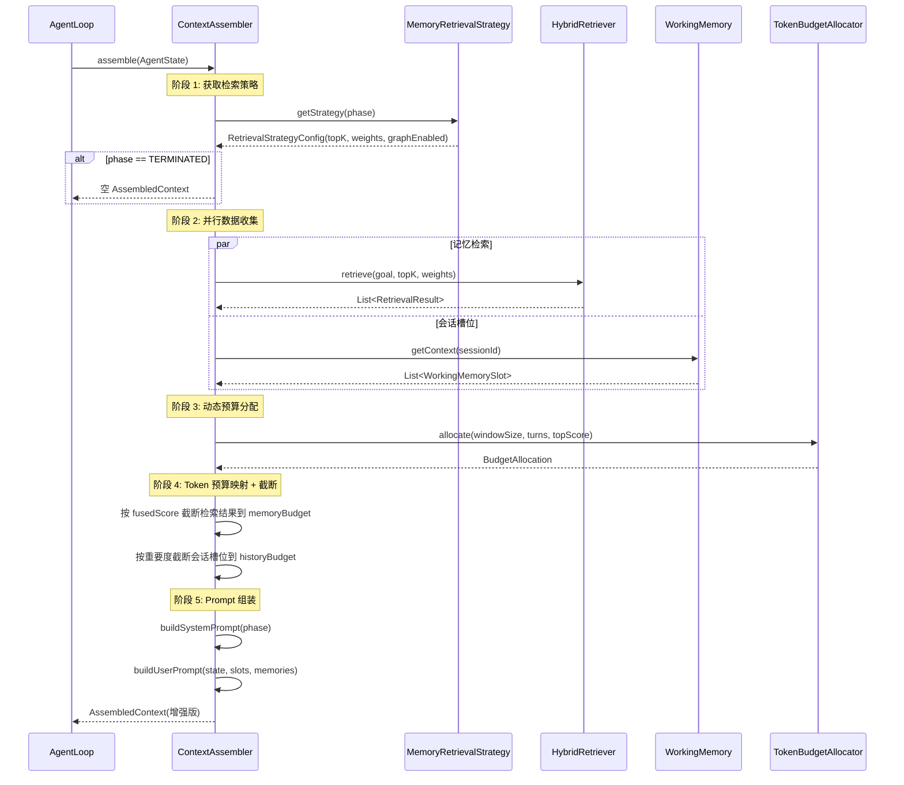
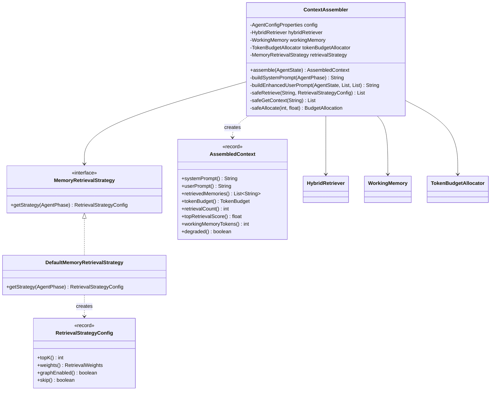

# 设计文档：ContextAssembler 完整版

## 概述

将基础版 `ContextAssembler` 升级为完整版，集成 Phase 2 已完成的记忆系统组件。核心变更：

1. 引入 `MemoryRetrievalStrategy` 接口，按 `AgentPhase` 差异化检索参数
2. 通过 `HybridRetriever` 执行三路混合检索，将语义相关的长期记忆注入 LLM 上下文
3. 从 `WorkingMemory` 获取会话槽位，按类型分区拼接到 User Prompt
4. 使用 `TokenBudgetAllocator` 动态分配 Token 预算，替代静态比例分配
5. 增强 `AssembledContext` 携带检索元数据
6. 结构化 User Prompt（用户请求 → 记忆 → 对话历史 → 步骤 → 预算）
7. Spring 自动配置条件化注册完整版/基础版
8. 全链路降级容错 + 可观测性日志

参考文档：
- 架构设计：docs/architecture/agent-engine.md §4 ContextAssembler
- 记忆系统架构：docs/architecture/memory-system.md
- 编码规范：.kiro/steering/coding-standards.md

## 架构

### 组件交互图



### 数据流




## 组件与接口

### 1. MemoryRetrievalStrategy — 记忆检索策略

新增接口，根据 `AgentPhase` 返回差异化的检索参数。

```java
package com.lifepilot.agent.context;

import com.lifepilot.agent.model.AgentPhase;
import com.lifepilot.memory.retrieval.RetrievalWeights;

/**
 * 记忆检索策略 — 根据 AgentPhase 决定检索行为。
 *
 * @author zsg
 * @since 2026-08-01
 */
public interface MemoryRetrievalStrategy {

    /**
     * 获取指定阶段的检索配置。
     *
     * @param phase 当前 AgentPhase
     * @return 检索配置，TERMINATED 阶段返回 SKIP 配置
     */
    RetrievalStrategyConfig getStrategy(AgentPhase phase);
}
```

```java
package com.lifepilot.agent.context;

import com.lifepilot.memory.retrieval.RetrievalWeights;

/**
 * 检索策略配置 — 单个阶段的检索参数。
 *
 * @param topK           返回前 K 个结果
 * @param weights        三路检索权重
 * @param graphEnabled   是否启用图遍历
 * @param skip           是否跳过检索（TERMINATED 阶段）
 *
 * @author zsg
 * @since 2026-08-01
 */
public record RetrievalStrategyConfig(
        int topK,
        RetrievalWeights weights,
        boolean graphEnabled,
        boolean skip
) {
    /** TERMINATED 阶段使用的跳过配置。 */
    public static final RetrievalStrategyConfig SKIP =
            new RetrievalStrategyConfig(0, RetrievalWeights.DEFAULT, false, true);
}
```

### 2. DefaultMemoryRetrievalStrategy — 默认实现

```java
package com.lifepilot.agent.context;

import com.lifepilot.agent.model.AgentPhase;
import com.lifepilot.memory.retrieval.RetrievalWeights;

/**
 * 默认记忆检索策略 — 按 AgentPhase 差异化配置。
 *
 * <p>各阶段策略：
 * <ul>
 *   <li>UNDERSTANDING: topK=10, 高向量权重(0.50), 广泛语义检索</li>
 *   <li>PLANNING: topK=5, 高图遍历权重(0.40), 获取实体关系</li>
 *   <li>EXECUTING: topK=3, 低检索预算, 更多空间给工具 Schema</li>
 *   <li>REFLECTING: topK=8, 高 FTS 权重(0.45), 检索历史执行经验</li>
 *   <li>RESPONDING: topK=5, 平衡三路权重, 生成连贯回复</li>
 *   <li>TERMINATED: 跳过检索</li>
 * </ul></p>
 *
 * @author zsg
 * @since 2026-08-01
 */
public class DefaultMemoryRetrievalStrategy implements MemoryRetrievalStrategy {

    @Override
    public RetrievalStrategyConfig getStrategy(AgentPhase phase) {
        return switch (phase) {
            case UNDERSTANDING -> new RetrievalStrategyConfig(
                    10,
                    new RetrievalWeights(0.50f, 0.30f, 0.20f, 0.05f, 0.1f, 60),
                    true, false);
            case PLANNING -> new RetrievalStrategyConfig(
                    5,
                    new RetrievalWeights(0.30f, 0.30f, 0.40f, 0.05f, 0.1f, 60),
                    true, false);
            case EXECUTING -> new RetrievalStrategyConfig(
                    3,
                    new RetrievalWeights(0.45f, 0.30f, 0.25f, 0.05f, 0.1f, 60),
                    false, false);
            case REFLECTING -> new RetrievalStrategyConfig(
                    8,
                    new RetrievalWeights(0.25f, 0.45f, 0.30f, 0.05f, 0.1f, 60),
                    true, false);
            case RESPONDING -> new RetrievalStrategyConfig(
                    5,
                    new RetrievalWeights(0.35f, 0.35f, 0.30f, 0.05f, 0.1f, 60),
                    true, false);
            case TERMINATED -> RetrievalStrategyConfig.SKIP;
        };
    }
}
```

### 3. ContextAssembler（完整版）— 核心组装逻辑

完整版 `ContextAssembler` 继承基础版的 System Prompt 构建逻辑，新增记忆检索、会话槽位集成、动态预算分配。

```java
package com.lifepilot.agent.context;

import com.lifepilot.agent.config.AgentConfigProperties;
import com.lifepilot.agent.model.AgentPhase;
import com.lifepilot.agent.model.AgentState;
import com.lifepilot.agent.model.StepRecord;
import com.lifepilot.memory.retrieval.HybridRetriever;
import com.lifepilot.memory.retrieval.RetrievalResult;
import com.lifepilot.memory.working.*;
import org.slf4j.Logger;
import org.slf4j.LoggerFactory;

import java.time.Duration;
import java.time.Instant;
import java.util.ArrayList;
import java.util.Comparator;
import java.util.List;

/**
 * 完整版上下文组装器 — 集成记忆检索、会话上下文、动态预算分配。
 *
 * <p>组装流程：
 * <ol>
 *   <li>根据 AgentPhase 获取检索策略</li>
 *   <li>通过 HybridRetriever 执行三路混合检索</li>
 *   <li>从 WorkingMemory 获取会话槽位</li>
 *   <li>通过 TokenBudgetAllocator 动态分配预算</li>
 *   <li>按预算截断检索结果和会话槽位</li>
 *   <li>构建结构化 User Prompt</li>
 * </ol></p>
 *
 * <p>降级策略：任何记忆组件异常时优雅降级为空结果，保证 assemble() 不抛出异常。</p>
 *
 * @author zsg
 * @since 2026-08-01
 */
public class ContextAssembler {

    private static final Logger log = LoggerFactory.getLogger(ContextAssembler.class);

    private final AgentConfigProperties config;
    private final HybridRetriever hybridRetriever;
    private final WorkingMemory workingMemory;
    private final TokenBudgetAllocator tokenBudgetAllocator;
    private final MemoryRetrievalStrategy retrievalStrategy;

    // 基础版构造器（向后兼容）
    public ContextAssembler(AgentConfigProperties config) { ... }

    // 完整版构造器
    public ContextAssembler(
            AgentConfigProperties config,
            HybridRetriever hybridRetriever,
            WorkingMemory workingMemory,
            TokenBudgetAllocator tokenBudgetAllocator,
            MemoryRetrievalStrategy retrievalStrategy) { ... }

    /**
     * 组装上下文 — 主入口。
     *
     * @param state 当前 Agent 状态
     * @return 增强版 AssembledContext
     */
    public AssembledContext assemble(AgentState state) {
        var startTime = Instant.now();
        
        try {
            // 1. 获取检索策略
            var strategyConfig = retrievalStrategy.getStrategy(state.phase());
            
            if (strategyConfig.skip()) {
                return buildMinimalContext(state);
            }
            
            // 2. 执行记忆检索（降级容错）
            var retrievalResults = safeRetrieve(state.goal(), strategyConfig);
            int retrievalCount = retrievalResults.size();
            float topScore = retrievalResults.isEmpty() ? 0.0f
                    : retrievalResults.getFirst().fusedScore();
            
            // 3. 获取会话槽位（降级容错）
            var slots = safeGetContext(state.sessionId());
            
            // 4. 动态预算分配（降级容错）
            int conversationTurns = countConversationTurns(slots);
            var budgetAllocation = safeAllocate(conversationTurns, topScore);
            
            // 5. 按预算截断
            var truncatedMemories = truncateByBudget(
                    retrievalResults, budgetAllocation.retrievalBudget());
            var truncatedSlots = truncateSlotsByBudget(
                    slots, budgetAllocation.workingMemoryBudget());
            
            // 6. 格式化检索结果
            var formattedMemories = formatRetrievalResults(truncatedMemories);
            int workingMemoryTokens = truncatedSlots.stream()
                    .mapToInt(WorkingMemorySlot::tokenCount).sum();
            
            // 7. 构建 TokenBudget
            var tokenBudget = buildTokenBudget(state.phase(), budgetAllocation,
                    formattedMemories, truncatedSlots);
            
            // 8. 构建 Prompt
            String systemPrompt = buildSystemPrompt(state.phase());
            String userPrompt = buildEnhancedUserPrompt(
                    state, formattedMemories, truncatedSlots);
            
            var context = new AssembledContext(
                    systemPrompt, userPrompt, formattedMemories,
                    tokenBudget, retrievalCount, topScore,
                    workingMemoryTokens, false);
            
            // 9. 日志
            logAssemblyMetrics(state, context, startTime);
            
            return context;
            
        } catch (Exception e) {
            log.warn("上下文组装异常，降级为基础版: sessionId={}, error={}",
                    state.sessionId(), e.getMessage());
            return buildFallbackContext(state, true);
        }
    }
}
```

关键内部方法签名：

```java
/** 安全执行记忆检索，异常时返回空列表。 */
private List<RetrievalResult> safeRetrieve(
        String query, RetrievalStrategyConfig config) { ... }

/** 安全获取会话槽位，异常时返回空列表。 */
private List<WorkingMemorySlot> safeGetContext(String sessionId) { ... }

/** 安全执行预算分配，异常时使用静态分配降级。 */
private BudgetAllocation safeAllocate(
        int conversationTurns, float topScore) { ... }

/** 按 fusedScore 降序截断检索结果到 Token 预算内。 */
private List<RetrievalResult> truncateByBudget(
        List<RetrievalResult> results, int tokenBudget) { ... }

/** 按重要度降序截断会话槽位到 Token 预算内。 */
private List<WorkingMemorySlot> truncateSlotsByBudget(
        List<WorkingMemorySlot> slots, int tokenBudget) { ... }

/** 将 RetrievalResult 格式化为字符串列表。 */
private List<String> formatRetrievalResults(
        List<RetrievalResult> results) { ... }

/** 统计 ConversationSlot 数量作为对话轮次。 */
private int countConversationTurns(List<WorkingMemorySlot> slots) { ... }

/** 构建增强版 User Prompt（结构化内容区域）。 */
private String buildEnhancedUserPrompt(
        AgentState state,
        List<String> memories,
        List<WorkingMemorySlot> slots) { ... }

/** 估算文本 Token 数（中英文混合约 2 字符/Token）。 */
private int estimateTokens(String text) { ... }
```

### 4. AssembledContext（增强版）

```java
package com.lifepilot.agent.context;

import java.util.List;

/**
 * 增强版上下文快照 — 携带检索元数据。
 *
 * @param systemPrompt         System Prompt 文本
 * @param userPrompt           User Prompt 文本
 * @param retrievedMemories    格式化后的记忆检索结果
 * @param tokenBudget          Token 预算分配与消耗
 * @param retrievalCount       检索返回的结果总数（截断前）
 * @param topRetrievalScore    最高 fusedScore
 * @param workingMemoryTokens  WorkingMemory 注入的 Token 总数
 * @param degraded             是否发生降级
 *
 * @author zsg
 * @since 2026-08-01
 */
public record AssembledContext(
        String systemPrompt,
        String userPrompt,
        List<String> retrievedMemories,
        TokenBudget tokenBudget,
        int retrievalCount,
        float topRetrievalScore,
        int workingMemoryTokens,
        boolean degraded
) {
    /** 紧凑构造器 — 防御性拷贝。 */
    public AssembledContext {
        retrievedMemories = List.copyOf(retrievedMemories);
    }

    /** 返回 tokenBudget.totalConsumed()。 */
    public int totalTokens() {
        return tokenBudget.totalConsumed();
    }
}
```

### 5. AgentAutoConfiguration 更新

```java
// 完整版 ContextAssembler — 记忆系统可用时注册
@Bean
@ConditionalOnBean({HybridRetriever.class, WorkingMemory.class})
@ConditionalOnMissingBean(ContextAssembler.class)
public ContextAssembler fullContextAssembler(
        AgentConfigProperties config,
        HybridRetriever hybridRetriever,
        WorkingMemory workingMemory,
        TokenBudgetAllocator tokenBudgetAllocator) {
    log.info("Agent 引擎: 注册完整版 ContextAssembler（记忆系统已就绪）");
    var strategy = new DefaultMemoryRetrievalStrategy();
    return new ContextAssembler(config, hybridRetriever,
            workingMemory, tokenBudgetAllocator, strategy);
}

// 基础版 ContextAssembler — 记忆系统不可用时降级注册
@Bean
@ConditionalOnMissingBean(ContextAssembler.class)
public ContextAssembler basicContextAssembler(AgentConfigProperties config) {
    log.info("Agent 引擎: 注册基础版 ContextAssembler（记忆系统不可用）");
    return new ContextAssembler(config);
}
```

关键设计决策：
- 完整版 Bean 使用 `@ConditionalOnBean({HybridRetriever.class, WorkingMemory.class})` 确保两个依赖都存在
- 基础版 Bean 使用 `@ConditionalOnMissingBean(ContextAssembler.class)` 作为兜底
- Spring Boot 的 Bean 注册顺序保证：有条件的 Bean 优先于无条件的 Bean 评估
- 用户可通过自定义 `ContextAssembler` Bean 覆盖两者

### 6. User Prompt 结构化布局

```
┌─────────────────────────────────────────────┐
│ 用户请求: {state.goal()}                      │  ← 最重要，放在开头
├─────────────────────────────────────────────┤
│ 相关记忆:                                     │  ← 次重要，紧跟用户请求
│   - [PERSON] 张总: 产品部门负责人 (0.92)       │
│   - [PROJECT] Alpha项目: 进行中 (0.85)        │
├─────────────────────────────────────────────┤
│ 对话历史:                                     │  ← 按时间顺序
│   [user] 上次说的那个方案...                   │
│   [assistant] 好的，我来查一下...              │
├─────────────────────────────────────────────┤
│ 工具结果:                                     │  ← 如有
│   calendar.query → 成功: 明天14:00有会议       │
├─────────────────────────────────────────────┤
│ 推理上下文:                                   │  ← 如有
│   检索上下文: ...                             │
├─────────────────────────────────────────────┤
│ 已执行步骤:                                   │  ← 如有
│   1. calendar.query - 成功: ...               │
├─────────────────────────────────────────────┤
│ 预算剩余: Token=28000, 已用步骤=2             │  ← 放在末尾
└─────────────────────────────────────────────┘
```

设计理由：利用 LLM 注意力 U 型曲线，将最重要的信息（用户请求 + 记忆检索）放在开头，预算信息放在末尾。


## 数据模型

### 新增类型

| 类型 | 包 | 说明 |
|------|---|------|
| `MemoryRetrievalStrategy` | `com.lifepilot.agent.context` | 接口，按 AgentPhase 返回检索配置 |
| `DefaultMemoryRetrievalStrategy` | `com.lifepilot.agent.context` | 默认实现，硬编码六阶段策略 |
| `RetrievalStrategyConfig` | `com.lifepilot.agent.context` | record，单阶段检索参数（topK, weights, graphEnabled, skip） |

### 修改类型

| 类型 | 变更 |
|------|------|
| `AssembledContext` | 新增字段：`retrievalCount`(int)、`topRetrievalScore`(float)、`workingMemoryTokens`(int)、`degraded`(boolean) |
| `ContextAssembler` | 新增完整版构造器（注入 HybridRetriever、WorkingMemory、TokenBudgetAllocator、MemoryRetrievalStrategy）；重写 `assemble()` 方法 |
| `AgentAutoConfiguration` | 新增完整版 ContextAssembler Bean（条件化注册）；原基础版 Bean 改为兜底 |

### 类型关系



### 预算映射关系

`BudgetAllocation`（TokenBudgetAllocator 输出）到 `TokenBudget`（ContextAssembler 内部使用）的映射：

| BudgetAllocation 字段 | TokenBudget 字段 | 说明 |
|----------------------|-----------------|------|
| `systemPromptBudget` | `systemPromptBudget` | 直接映射 |
| `workingMemoryBudget` | `historyBudget` | 工作记忆预算 → 对话历史预算 |
| `retrievalBudget` | `memoryBudget` | 检索上下文预算 → 记忆预算 |
| `userMessageBudget` | — | 用于 User Prompt 总体截断 |
| — | `toolSchemaBudget` | 保留原 TokenBudget 静态分配 |
| — | `toolResultBudget` | 保留原 TokenBudget 静态分配 |
| — | `reservedBuffer` | 保留原 TokenBudget 静态分配 |

### 检索结果格式化

每条 `RetrievalResult` 格式化为：
```
[{entityType}] {name}: {description} (score={fusedScore})
```

示例：
```
[PERSON] 张总: 产品部门负责人，负责 Alpha 项目 (score=0.92)
[PROJECT] Alpha项目: Q3 重点项目，进度 60% (score=0.85)
```


## 正确性属性

*属性（Property）是系统在所有合法执行中都应保持为真的特征或行为——本质上是对系统行为的形式化陈述。属性是人类可读规格说明与机器可验证正确性保证之间的桥梁。*

### Property 1: 检索策略对所有活跃阶段返回有效配置

*For any* 非 TERMINATED 的 AgentPhase，`MemoryRetrievalStrategy.getStrategy(phase)` 返回的 `RetrievalStrategyConfig` 应满足：`topK > 0`、`weights` 三权重之和 ≈ 1.0、`skip == false`。对于 TERMINATED 阶段，应返回 `skip == true`。

**Validates: Requirements 1.1, 1.7**

### Property 2: 会话槽位按类型路由到正确的 User Prompt 区域

*For any* 包含 ConversationSlot、ToolResultSlot、ReasoningSlot 的会话槽位列表，组装后的 User Prompt 应满足：ConversationSlot 内容出现在"对话历史"区域且按 `createdAt` 时间顺序排列，ToolResultSlot 内容出现在"工具结果"区域，ReasoningSlot 内容出现在"推理上下文"区域。

**Validates: Requirements 2.2, 2.3, 2.4**

### Property 3: 会话槽位超预算时按重要度截断

*For any* 总 Token 数超过 `historyBudget` 的会话槽位列表，截断后保留的槽位应满足：(a) 保留槽位的总 Token 数 ≤ `historyBudget`，(b) 被截断的槽位的 `importance` 不高于任何保留槽位的 `importance`。

**Validates: Requirements 2.5**

### Property 4: 检索结果格式化包含实体名称、类型和描述

*For any* `RetrievalResult`，格式化后的字符串应包含 `entityType`、`name`，以及当 `description` 非 null 时包含 `description`。

**Validates: Requirements 3.4**

### Property 5: 检索结果超预算时按 fusedScore 截断

*For any* 总 Token 估算超过 `memoryBudget` 的检索结果列表，截断后保留的结果应满足：(a) 保留结果的总 Token 估算 ≤ `memoryBudget`，(b) 被截断的结果的 `fusedScore` 不高于任何保留结果的 `fusedScore`。

**Validates: Requirements 3.5**

### Property 6: Token 预算不变量

*For any* 由 `ContextAssembler.assemble()` 产生的 `AssembledContext`，`tokenBudget.totalConsumed()` 应不超过 `tokenBudget.totalBudget()`。

**Validates: Requirements 5.6, 4.6**

### Property 7: AssembledContext 防御性拷贝不可变性

*For any* 传入 `AssembledContext` 构造器的可变 `List<String>`，构造完成后修改原始列表不应影响 `AssembledContext.retrievedMemories()` 的内容。

**Validates: Requirements 5.5**

### Property 8: User Prompt 内容区域顺序正确

*For any* 包含记忆检索结果和会话槽位的组装上下文，User Prompt 中各区域的出现顺序应为：用户请求 → 相关记忆 → 对话历史 → 已执行步骤 → 预算剩余。即每个区域标题在 User Prompt 中的索引位置单调递增。

**Validates: Requirements 6.1, 6.4**

### Property 9: 条件性区域仅在数据存在时出现

*For any* 组装上下文，当 `retrievedMemories` 非空时 User Prompt 应包含"相关记忆"区域；当 `retrievedMemories` 为空时不应包含该区域。同理，当存在 `ConversationSlot` 时应包含"对话历史"区域，否则不应包含。

**Validates: Requirements 6.2, 6.3**

### Property 10: User Prompt 超预算时优先截断对话历史

*For any* User Prompt 总 Token 超过 `userMessageBudget` 的场景，截断后的 User Prompt 应保留用户请求和记忆检索结果的完整内容，对话历史区域被优先截断。

**Validates: Requirements 6.5**

### Property 11: BudgetAllocation 到 TokenBudget 映射正确

*For any* `BudgetAllocation`，映射到 `TokenBudget` 后应满足：`TokenBudget.systemPromptBudget == BudgetAllocation.systemPromptBudget`，`TokenBudget.historyBudget == BudgetAllocation.workingMemoryBudget`，`TokenBudget.memoryBudget == BudgetAllocation.retrievalBudget`。

**Validates: Requirements 4.5**

### Property 12: assemble() 方法永不抛出异常

*For any* `AgentState` 输入（包括 null goal、空 sessionId、TERMINATED 阶段等边界情况），以及任何记忆组件异常（HybridRetriever 抛异常、WorkingMemory 抛异常、TokenBudgetAllocator 抛异常），`ContextAssembler.assemble()` 应始终返回有效的 `AssembledContext`，不抛出未检查异常。

**Validates: Requirements 8.5, 2.6, 3.6, 8.1, 8.2, 8.3**

### Property 13: 降级时 degraded 标志为 true

*For any* 记忆组件异常导致降级的场景，返回的 `AssembledContext.degraded()` 应为 `true`；正常组装时应为 `false`。

**Validates: Requirements 8.4**


## 错误处理

### 降级策略矩阵

| 异常组件 | 异常类型 | 降级行为 | 日志级别 | degraded 标志 |
|---------|---------|---------|---------|--------------|
| `HybridRetriever.retrieve()` | 任意异常 | 使用空 `retrievedMemories`，`retrievalCount=0`，`topRetrievalScore=0.0` | WARN | true |
| `WorkingMemory.getContext()` | 任意异常 | 使用空槽位列表，`workingMemoryTokens=0` | WARN | true |
| `TokenBudgetAllocator.allocate()` | 任意异常 | 回退到 `TokenBudget.allocate(phase, totalTokens)` 静态分配 | WARN | true |
| `ContextAssembler.assemble()` 整体 | 未预期异常 | 构建最小化 AssembledContext（仅 System Prompt + 基础 User Prompt） | WARN | true |

### 降级实现伪代码

```java
private List<RetrievalResult> safeRetrieve(String query, RetrievalStrategyConfig config) {
    try {
        return hybridRetriever.retrieve(query, config.topK(), config.weights());
    } catch (Exception e) {
        log.warn("记忆检索降级: query={}, error={}", truncate(query, 50), e.getMessage());
        return List.of();
    }
}

private List<WorkingMemorySlot> safeGetContext(String sessionId) {
    try {
        return workingMemory.getContext(sessionId);
    } catch (Exception e) {
        log.warn("工作记忆降级: sessionId={}, error={}", sessionId, e.getMessage());
        return List.of();
    }
}

private BudgetAllocation safeAllocate(int conversationTurns, float topScore) {
    try {
        int windowSize = config.getContext().getMaxContextTokens();
        return tokenBudgetAllocator.allocate(windowSize, conversationTurns, topScore);
    } catch (Exception e) {
        log.warn("预算分配降级: error={}", e.getMessage());
        // 回退到静态分配
        int total = config.getContext().getMaxContextTokens();
        return new BudgetAllocation(
                (int)(total * 0.10), (int)(total * 0.50),
                (int)(total * 0.25), (int)(total * 0.15), total);
    }
}
```

### 关键约束

- `assemble()` 方法的 catch 块捕获 `Exception`（不捕获 `Error`），确保 JVM 级错误仍然传播
- 降级日志使用参数化格式 `log.warn("消息: key={}", value)`，不使用字符串拼接
- 每个降级点独立处理，不使用全局 try-catch 包裹整个流程（除最外层兜底）

## 测试策略

### 双轨测试方法

本特性采用单元测试 + 属性测试双轨并行的测试策略：

- **单元测试**：验证具体示例、边界条件、集成点
- **属性测试**：验证所有输入上的通用属性（使用 jqwik 库）

### 属性测试配置

- 库：**jqwik**（Java 属性测试框架）
- 每个属性测试最少运行 **100 次迭代**
- 每个属性测试必须通过注释引用设计文档中的属性编号
- 注释格式：`// Feature: context-assembler-full, Property {number}: {property_text}`

### 属性测试清单

| 属性编号 | 测试方法名 | 生成器 |
|---------|-----------|--------|
| Property 1 | `检索策略_所有活跃阶段返回有效配置()` | `@ForAll AgentPhase`（排除 TERMINATED） |
| Property 2 | `会话槽位_按类型路由到正确区域()` | 随机生成 ConversationSlot/ToolResultSlot/ReasoningSlot 列表 |
| Property 3 | `会话槽位_超预算按重要度截断()` | 随机生成超预算的槽位列表 + 随机 historyBudget |
| Property 4 | `检索结果_格式化包含必要字段()` | 随机生成 RetrievalResult |
| Property 5 | `检索结果_超预算按分数截断()` | 随机生成超预算的 RetrievalResult 列表 + 随机 memoryBudget |
| Property 6 | `Token预算_消耗不超过总预算()` | 随机生成 AgentState |
| Property 7 | `AssembledContext_防御性拷贝不可变()` | 随机生成 List<String> |
| Property 8 | `UserPrompt_内容区域顺序正确()` | 随机生成包含记忆和槽位的 AgentState |
| Property 9 | `UserPrompt_条件性区域正确出现()` | 随机生成空/非空的记忆和槽位组合 |
| Property 10 | `UserPrompt_超预算优先截断历史()` | 随机生成大量 ConversationSlot 使 User Prompt 超预算 |
| Property 11 | `BudgetAllocation_映射到TokenBudget正确()` | 随机生成 BudgetAllocation |
| Property 12 | `assemble_永不抛出异常()` | 随机生成 AgentState + 随机注入组件异常 |
| Property 13 | `降级时_degraded标志为true()` | 随机注入组件异常 |

### 单元测试清单

| 测试类 | 测试方法 | 验证内容 |
|--------|---------|---------|
| `DefaultMemoryRetrievalStrategyTest` | `UNDERSTANDING阶段_topK为10_向量权重最高()` | 需求 1.2 |
| `DefaultMemoryRetrievalStrategyTest` | `PLANNING阶段_topK为5_图遍历权重最高()` | 需求 1.3 |
| `DefaultMemoryRetrievalStrategyTest` | `EXECUTING阶段_topK为3()` | 需求 1.4 |
| `DefaultMemoryRetrievalStrategyTest` | `REFLECTING阶段_topK为8_FTS权重最高()` | 需求 1.5 |
| `DefaultMemoryRetrievalStrategyTest` | `RESPONDING阶段_topK为5_权重平衡()` | 需求 1.6 |
| `DefaultMemoryRetrievalStrategyTest` | `TERMINATED阶段_跳过检索()` | 需求 1.7 |
| `ContextAssemblerTest` | `使用goal作为检索查询文本()` | 需求 3.2 |
| `ContextAssemblerTest` | `使用maxContextTokens作为窗口大小()` | 需求 4.2 |
| `ContextAssemblerTest` | `conversationTurns等于ConversationSlot数量()` | 需求 4.3 |
| `ContextAssemblerTest` | `topRetrievalScore等于最高fusedScore()` | 需求 4.4 |
| `ContextAssemblerTest` | `不存在的sessionId使用空上下文()` | 需求 2.6 |
| `ContextAssemblerTest` | `HybridRetriever异常时降级为空记忆()` | 需求 8.1 |
| `ContextAssemblerTest` | `WorkingMemory异常时降级为空槽位()` | 需求 8.2 |
| `ContextAssemblerTest` | `TokenBudgetAllocator异常时使用静态分配()` | 需求 8.3 |
| `AgentAutoConfigurationTest` | `记忆系统可用时注册完整版()` | 需求 7.1 |
| `AgentAutoConfigurationTest` | `记忆系统不可用时注册基础版()` | 需求 7.2 |
| `AgentAutoConfigurationTest` | `自定义Bean覆盖默认实现()` | 需求 7.4 |

### 测试依赖

- Mock 框架：Mockito（Mock HybridRetriever、WorkingMemory、TokenBudgetAllocator）
- 属性测试：jqwik 1.9+
- Spring 测试：`@SpringBootTest` + `@TestConfiguration`（仅 AutoConfiguration 集成测试）

