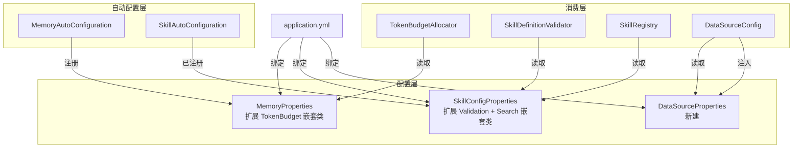

# Design Document: eliminate-hardcoding

## Overview

本设计文档描述如何将 LifePilot 中已识别的硬编码常量提取到 Spring Boot `@ConfigurationProperties` 配置类 + `application.yml`，并更新编码规范防止后续引入新的硬编码。

### 设计目标

1. 将 `TokenBudgetAllocator`、`SkillDefinitionValidator`、`DataSourceConfig`、`SkillRegistry` 中的硬编码值外部化
2. 复用已有的 `MemoryProperties` 和 `SkillConfigProperties`，新建 `DataSourceProperties`
3. 所有默认值等于原硬编码值，确保行为不变
4. 更新 `coding-standards.md` 新增"配置外部化"章节

### 关键设计决策

**决策 1：复用 `SkillConfigProperties` 而非新建 `SkillProperties`**

需求文档提到新建 `SkillProperties`（前缀 `lifepilot.skill`），但项目中已存在 `SkillConfigProperties`（前缀 `lifepilot.skills`）。为避免两个配置类绑定相似前缀造成混淆，设计选择扩展已有的 `SkillConfigProperties`，在其中新增校验限制和搜索限制的嵌套配置。这样保持单一配置入口，前缀统一为 `lifepilot.skills`。

**决策 2：使用嵌套内部类组织配置**

`MemoryProperties` 新增 `TokenBudget` 嵌套类，`SkillConfigProperties` 新增 `Validation` 和 `Search` 嵌套类。嵌套结构使 YAML 层次清晰，避免扁平化导致的命名冲突。

**决策 3：`DataSourceProperties` 独立新建**

数据源配置属于基础设施层，与业务模块无关，使用独立的 `DataSourceProperties`（前缀 `lifepilot.datasource`）。

## Architecture

### 变更范围



### 变更文件清单

| 文件 | 变更类型 | 说明 |
|------|---------|------|
| `MemoryProperties.java` | 修改 | 新增 `TokenBudget` 嵌套类 |
| `TokenBudgetAllocator.java` | 修改 | 从 `MemoryProperties` 读取配置，移除硬编码常量 |
| `SkillConfigProperties.java` | 修改 | 新增 `Validation` 和 `Search` 嵌套类 |
| `SkillDefinitionValidator.java` | 修改 | 从 `SkillConfigProperties` 读取配置，移除硬编码常量 |
| `SkillRegistry.java` | 修改 | 从 `SkillConfigProperties` 读取配置，移除硬编码常量 |
| `SkillAutoConfiguration.java` | 修改 | 注入 `SkillConfigProperties` 到 `SkillDefinitionValidator` 和 `SkillRegistry` |
| `DataSourceProperties.java` | 新建 | 绑定 `lifepilot.datasource` 前缀 |
| `DataSourceConfig.java` | 修改 | 从 `DataSourceProperties` 读取 `busy-timeout`，移除硬编码 |
| `application.yml` | 修改 | 新增配置项声明 |
| `coding-standards.md` | 修改 | 新增"配置外部化"章节 |

## Components and Interfaces

### 1. MemoryProperties 扩展

在 `MemoryProperties` 中新增 `TokenBudget` 嵌套类：

```java
@ConfigurationProperties(prefix = "lifepilot.memory")
public class MemoryProperties {
    // ... 已有字段 ...

    /** Token 预算分配配置。 */
    private TokenBudget tokenBudget = new TokenBudget();

    public TokenBudget getTokenBudget() { return tokenBudget; }
    public void setTokenBudget(TokenBudget tokenBudget) { this.tokenBudget = tokenBudget; }

    public static class TokenBudget {
        /** 系统提示词区固定比例，默认 0.10。 */
        private float systemPromptRatio = 0.10f;
        /** 用户消息区固定比例，默认 0.15。 */
        private float userMessageRatio = 0.15f;
        /** 高相关度场景的工作记忆比例（占 75% 中的份额），默认 40。 */
        private float highRelevanceWorkingMemory = 40.0f;
        /** 高相关度场景的检索比例，默认 35。 */
        private float highRelevanceRetrieval = 35.0f;
        /** 长对话场景的工作记忆比例，默认 60。 */
        private float longConversationWorkingMemory = 60.0f;
        /** 长对话场景的检索比例，默认 15。 */
        private float longConversationRetrieval = 15.0f;
        /** 默认场景的工作记忆比例，默认 50。 */
        private float defaultWorkingMemory = 50.0f;
        /** 默认场景的检索比例，默认 25。 */
        private float defaultRetrieval = 25.0f;
        /** 高相关度判断阈值，默认 0.9。 */
        private float highRelevanceThreshold = 0.9f;
        /** 长对话轮次判断阈值，默认 10。 */
        private int longConversationTurnsThreshold = 10;
        // getter/setter 省略
    }
}
```

### 2. TokenBudgetAllocator 改造

移除 `SYSTEM_PROMPT_RATIO` 和 `USER_MESSAGE_RATIO` 硬编码常量，改为从 `MemoryProperties.getTokenBudget()` 读取：

```java
public class TokenBudgetAllocator {
    private final MemoryProperties properties;

    public BudgetAllocation allocate(int contextWindowSize, int conversationTurns, float topRetrievalScore) {
        var budget = properties.getTokenBudget();
        int systemPromptBudget = Math.round(contextWindowSize * budget.getSystemPromptRatio());
        int userMessageBudget = Math.round(contextWindowSize * budget.getUserMessageRatio());
        int remaining = contextWindowSize - systemPromptBudget - userMessageBudget;

        float workingMemoryRatio;
        float retrievalRatio;
        float base = budget.getSystemPromptRatio() + budget.getUserMessageRatio();
        float remainingBase = (1.0f - base) * 100.0f; // 归一化基数

        if (topRetrievalScore > budget.getHighRelevanceThreshold()) {
            workingMemoryRatio = budget.getHighRelevanceWorkingMemory() / (remainingBase);
            retrievalRatio = budget.getHighRelevanceRetrieval() / (remainingBase);
        } else if (conversationTurns > budget.getLongConversationTurnsThreshold()) {
            workingMemoryRatio = budget.getLongConversationWorkingMemory() / (remainingBase);
            retrievalRatio = budget.getLongConversationRetrieval() / (remainingBase);
        } else {
            workingMemoryRatio = budget.getDefaultWorkingMemory() / (remainingBase);
            retrievalRatio = budget.getDefaultRetrieval() / (remainingBase);
        }
        // ... 计算并返回 BudgetAllocation
    }
}
```

### 3. SkillConfigProperties 扩展

在 `SkillConfigProperties` 中新增 `Validation` 和 `Search` 嵌套类：

```java
@ConfigurationProperties(prefix = "lifepilot.skills")
public class SkillConfigProperties {
    // ... 已有字段 ...

    /** 校验限制配置。 */
    private Validation validation = new Validation();
    /** 搜索配置。 */
    private Search search = new Search();

    // getter/setter ...

    public static class Validation {
        /** 名称最大长度，默认 128。 */
        private int maxNameLength = 128;
        /** System Prompt 最大长度，默认 10000。 */
        private int maxSystemPromptLength = 10000;
        /** AUTO_GENERATED 来源的 maxTokens 上限，默认 10000。 */
        private int autoGeneratedMaxTokens = 10000;
        /** AUTO_GENERATED 来源的 maxSteps 上限，默认 15。 */
        private int autoGeneratedMaxSteps = 15;
        /** AUTO_GENERATED 来源的 timeoutSeconds 上限，默认 180。 */
        private int autoGeneratedMaxTimeout = 180;
        // getter/setter 省略
    }

    public static class Search {
        /** 默认搜索返回数量，默认 10。 */
        private int defaultTopK = 10;
        // getter/setter 省略
    }
}
```

### 4. SkillDefinitionValidator 改造

移除所有 `MAX_*` 和 `AUTO_GENERATED_*` 硬编码常量，构造函数新增 `SkillConfigProperties` 参数：

```java
public class SkillDefinitionValidator {
    private final DynamicToolRegistry toolRegistry;
    private final SkillConfigProperties.Validation validationConfig;

    public SkillDefinitionValidator(DynamicToolRegistry toolRegistry,
                                    SkillConfigProperties skillConfig) {
        this.toolRegistry = toolRegistry;
        this.validationConfig = skillConfig.getValidation();
    }
    // validate() 方法中使用 validationConfig.getMaxNameLength() 等替代硬编码
}
```

### 5. SkillRegistry 改造

移除 `DEFAULT_SEARCH_TOP_K` 硬编码常量，构造函数新增 `SkillConfigProperties` 参数：

```java
public class SkillRegistry {
    private final int defaultSearchTopK;

    public SkillRegistry(SkillDefinitionValidator validator,
                         SkillSearchIndex searchIndex,
                         ApplicationEventPublisher eventPublisher,
                         SkillConfigProperties skillConfig) {
        // ...
        this.defaultSearchTopK = skillConfig.getSearch().getDefaultTopK();
    }

    public List<SkillDefinition> search(String query) {
        var searchResults = searchIndex.search(query, defaultSearchTopK);
        // ...
    }
}
```

### 6. DataSourceProperties 新建

```java
@ConfigurationProperties(prefix = "lifepilot.datasource")
public class DataSourceProperties {
    /** SQLite busy_timeout（毫秒），默认 5000。 */
    private int busyTimeout = 5000;

    public int getBusyTimeout() { return busyTimeout; }
    public void setBusyTimeout(int busyTimeout) { this.busyTimeout = busyTimeout; }
}
```

### 7. DataSourceConfig 改造

使用 `@EnableConfigurationProperties(DataSourceProperties.class)` 注册，注入 `DataSourceProperties`：

```java
@Configuration
@EnableConfigurationProperties(DataSourceProperties.class)
public class DataSourceConfig {
    @Bean
    public DataSource dataSource(@Value("${spring.datasource.url}") String url,
                                 DataSourceProperties dsProperties) {
        var config = new SQLiteConfig();
        config.setBusyTimeout(dsProperties.getBusyTimeout());
        // ...
    }
}
```

## Data Models

本次重构不涉及数据库 schema 变更，仅涉及配置数据模型。

### 配置项完整清单

| 配置键 | 类型 | 默认值 | 来源 |
|--------|------|--------|------|
| `lifepilot.memory.token-budget.system-prompt-ratio` | float | 0.10 | TokenBudgetAllocator |
| `lifepilot.memory.token-budget.user-message-ratio` | float | 0.15 | TokenBudgetAllocator |
| `lifepilot.memory.token-budget.high-relevance-working-memory` | float | 40.0 | TokenBudgetAllocator |
| `lifepilot.memory.token-budget.high-relevance-retrieval` | float | 35.0 | TokenBudgetAllocator |
| `lifepilot.memory.token-budget.long-conversation-working-memory` | float | 60.0 | TokenBudgetAllocator |
| `lifepilot.memory.token-budget.long-conversation-retrieval` | float | 15.0 | TokenBudgetAllocator |
| `lifepilot.memory.token-budget.default-working-memory` | float | 50.0 | TokenBudgetAllocator |
| `lifepilot.memory.token-budget.default-retrieval` | float | 25.0 | TokenBudgetAllocator |
| `lifepilot.memory.token-budget.high-relevance-threshold` | float | 0.9 | TokenBudgetAllocator |
| `lifepilot.memory.token-budget.long-conversation-turns-threshold` | int | 10 | TokenBudgetAllocator |
| `lifepilot.skills.validation.max-name-length` | int | 128 | SkillDefinitionValidator |
| `lifepilot.skills.validation.max-system-prompt-length` | int | 10000 | SkillDefinitionValidator |
| `lifepilot.skills.validation.auto-generated-max-tokens` | int | 10000 | SkillDefinitionValidator |
| `lifepilot.skills.validation.auto-generated-max-steps` | int | 15 | SkillDefinitionValidator |
| `lifepilot.skills.validation.auto-generated-max-timeout` | int | 180 | SkillDefinitionValidator |
| `lifepilot.skills.search.default-top-k` | int | 10 | SkillRegistry |
| `lifepilot.datasource.busy-timeout` | int | 5000 | DataSourceConfig |

### application.yml 新增配置

```yaml
lifepilot:
  memory:
    # ... 已有配置 ...
    token-budget:
      system-prompt-ratio: 0.10
      user-message-ratio: 0.15
      high-relevance-working-memory: 40
      high-relevance-retrieval: 35
      long-conversation-working-memory: 60
      long-conversation-retrieval: 15
      default-working-memory: 50
      default-retrieval: 25
      high-relevance-threshold: 0.9
      long-conversation-turns-threshold: 10
  # ... 已有配置 ...
  skills:
    # ... 已有配置 ...
    validation:
      max-name-length: 128
      max-system-prompt-length: 10000
      auto-generated-max-tokens: 10000
      auto-generated-max-steps: 15
      auto-generated-max-timeout: 180
    search:
      default-top-k: 10
  datasource:
    busy-timeout: 5000
```


## Correctness Properties

*A property is a characteristic or behavior that should hold true across all valid executions of a system — essentially, a formal statement about what the system should do. Properties serve as the bridge between human-readable specifications and machine-verifiable correctness guarantees.*

### Property 1: TokenBudgetAllocator 预算分配遵循配置比例

*For any* valid `TokenBudget` configuration（系统提示词比例 + 用户消息比例 ∈ (0, 1)）和任意合法输入（contextWindowSize > 0, conversationTurns ≥ 0, topRetrievalScore ∈ [0, 1]），`TokenBudgetAllocator.allocate()` 返回的 `BudgetAllocation` 中：
- `systemPromptBudget` 等于 `round(contextWindowSize × systemPromptRatio)`
- `userMessageBudget` 等于 `round(contextWindowSize × userMessageRatio)`
- 四区域预算之和不超过 `contextWindowSize`
- 当 `topRetrievalScore > highRelevanceThreshold` 时，使用高相关度场景的工作记忆/检索比例
- 当 `conversationTurns > longConversationTurnsThreshold` 时，使用长对话场景的比例
- 否则使用默认场景的比例

**Validates: Requirements 1.4, 6.2**

### Property 2: SkillDefinitionValidator 校验限制遵循配置

*For any* `Validation` 配置（maxNameLength, maxSystemPromptLength, autoGeneratedMaxTokens, autoGeneratedMaxSteps, autoGeneratedMaxTimeout 均 > 0）和任意 `SkillDefinition`：
- 名称长度超过 `maxNameLength` 时，校验结果包含名称长度错误
- System Prompt 长度超过 `maxSystemPromptLength` 时，校验结果包含 System Prompt 长度错误
- AUTO_GENERATED 来源的 budget 字段超过对应上限时，校验结果包含对应错误
- 所有字段均在限制内时，不产生上述错误

**Validates: Requirements 2.2, 6.2**

### Property 3: SkillRegistry 搜索数量遵循配置

*For any* 配置的 `defaultTopK` 值（> 0）和任意搜索查询，`SkillRegistry.search()` 委托给 `SkillSearchIndex.search()` 时传递的 `topK` 参数等于配置的 `defaultTopK` 值。

**Validates: Requirements 4.2, 6.2**

## Error Handling

本次重构不引入新的错误场景。配置绑定由 Spring Boot 框架处理：

- **配置类型不匹配**：Spring Boot 在启动时自动校验类型，绑定失败会抛出 `BindException` 阻止启动
- **配置值越界**：当前不添加 `@Validated` + JSR-303 校验注解，因为原硬编码也没有运行时校验。后续可按需添加 `@Min`/`@Max` 约束
- **配置缺失**：所有配置项都有默认值，不会出现缺失情况

## Testing Strategy

### 属性测试（Property-Based Testing）

使用 **jqwik**（JUnit 5 原生集成的 PBT 库）实现属性测试，每个属性测试运行至少 100 次迭代。

| 属性 | 测试类 | 说明 |
|------|--------|------|
| Property 1 | `TokenBudgetAllocatorPropertyTest` | 生成随机配置和输入，验证分配结果遵循配置比例 |
| Property 2 | `SkillDefinitionValidatorPropertyTest` | 生成随机校验限制和 SkillDefinition，验证校验结果遵循配置限制 |
| Property 3 | `SkillRegistryPropertyTest` | 生成随机 topK 值，验证搜索委托传递正确的 topK |

每个属性测试必须包含注释标签：
```java
// Feature: eliminate-hardcoding, Property 1: TokenBudgetAllocator 预算分配遵循配置比例
```

### 单元测试

现有单元测试在不修改断言的前提下全部通过（验证行为不变性）。新增以下单元测试：

| 测试类 | 测试内容 |
|--------|---------|
| `MemoryPropertiesTest` | 验证 TokenBudget 嵌套类默认值等于原硬编码值 |
| `SkillConfigPropertiesTest` | 验证 Validation 和 Search 嵌套类默认值等于原硬编码值 |
| `DataSourcePropertiesTest` | 验证 busyTimeout 默认值等于 5000 |

### 集成测试

- 验证 Spring Boot 上下文加载成功，所有新增配置项正确绑定
- 验证 `application.yml` 中声明的默认值与 Java 默认值一致
