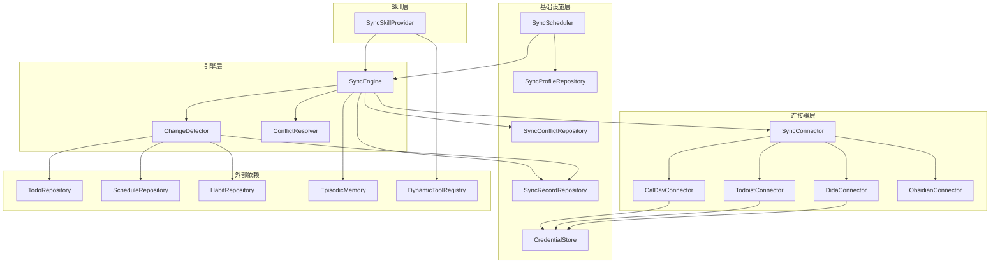
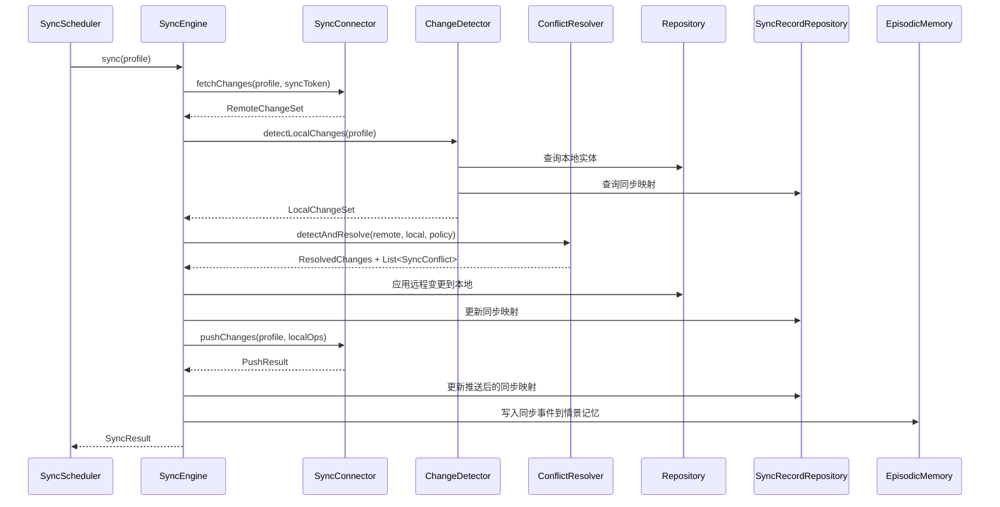
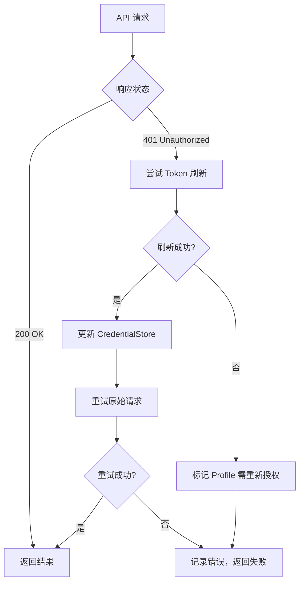

# Design Document: 外部数据源同步

## Overview

外部数据源同步模块（`com.lifepilot.sync`）实现 LifePilot 内部数据（TodoItem / ScheduleItem / HabitItem）与外部服务（CalDAV / Todoist / 滴答清单 / Obsidian Vault）的双向增量同步。

本设计文档聚焦实现方案，架构决策和核心概念详见 #[[file:docs/architecture/external-data-sync.md]]。

参考文档：
- 架构设计：#[[file:docs/architecture/external-data-sync.md]]
- 特性说明：#[[file:docs/features/external-data-sync.md]]
- 需求文档：#[[file:.kiro/specs/external-data-sync/requirements.md]]
- 编码规范：#[[file:.kiro/steering/coding-standards.md]]

## Architecture

### 包结构

```
com.lifepilot.sync
├── config/
│   ├── SyncProperties.java              // @ConfigurationProperties
│   └── SyncAutoConfiguration.java       // Spring 自动配置
├── connector/
│   ├── SyncConnector.java               // sealed interface
│   ├── caldav/
│   │   ├── CalDavConnector.java
│   │   ├── CalDavFieldMapping.java
│   │   └── ICalendarParser.java         // iCalendar 解析/格式化
│   ├── todoist/
│   │   ├── TodoistConnector.java
│   │   └── TodoistFieldMapping.java
│   ├── dida/
│   │   ├── DidaConnector.java
│   │   └── DidaFieldMapping.java
│   └── obsidian/
│       ├── ObsidianConnector.java
│       ├── ObsidianFieldMapping.java
│       └── YamlFrontmatterParser.java   // YAML frontmatter 解析/格式化
├── engine/
│   ├── SyncEngine.java                  // 同步引擎
│   ├── ChangeDetector.java              // 本地变更检测
│   └── ConflictResolver.java            // 冲突解决
├── model/
│   ├── SyncProfile.java                 // 同步配置 record
│   ├── SyncRecord.java                  // 同步映射 record
│   ├── SyncState.java                   // 同步状态 record
│   ├── SyncConflict.java                // 冲突记录 record
│   ├── SyncResult.java                  // 同步结果 record
│   ├── SyncOperation.java              // 同步操作 sealed interface
│   ├── RemoteChangeSet.java             // 远程变更集 record
│   ├── LocalChangeSet.java              // 本地变更集 record
│   ├── ConnectionTestResult.java        // 连接测试结果 record
│   ├── PushResult.java                  // 推送结果 record
│   ├── ConflictPolicy.java              // 冲突策略 enum
│   ├── SyncDirection.java               // 同步方向 enum
│   └── SyncStatus.java                  // 同步状态 enum
├── mapping/
│   └── FieldMapping.java                // 字段映射接口
├── credential/
│   └── CredentialStore.java             // 凭证加密存储
├── repository/
│   ├── SyncProfileRepository.java
│   ├── SyncRecordRepository.java
│   ├── SyncStateRepository.java
│   └── SyncConflictRepository.java
├── scheduler/
│   └── SyncScheduler.java              // 同步调度器
└── skill/
    └── SyncSkillProvider.java           // Agent 集成
```

### 分层架构图



### 同步流程时序图




## Components and Interfaces

### 核心接口

#### SyncConnector — 连接器 sealed interface

```java
public sealed interface SyncConnector
        permits CalDavConnector, TodoistConnector, DidaConnector, ObsidianConnector {

    /** 连接器类型标识（如 "caldav"、"todoist"、"dida"、"obsidian"）。 */
    String type();

    /** 测试连接是否可用。 */
    ConnectionTestResult testConnection(SyncProfile profile);

    /** 拉取远程变更。syncToken 为 null 时执行全量同步。 */
    RemoteChangeSet fetchChanges(SyncProfile profile, @Nullable String syncToken);

    /** 推送本地变更到远程。 */
    PushResult pushChanges(SyncProfile profile, List<SyncOperation> operations);
}
```

#### FieldMapping — 字段映射泛型接口

```java
public interface FieldMapping<L, R> {
    /** 本地实体 → 远程格式。 */
    R toRemote(L local);

    /** 远程格式 → 本地实体。 */
    L toLocal(R remote);

    /** 提取冲突比较字段。 */
    Map<String, FieldDiff> extractConflictFields(L local, R remote);
}
```

其中 `FieldDiff` 为简单 record：

```java
public record FieldDiff(String fieldName, Object localValue, Object remoteValue) {}
```

#### SyncOperation — 同步操作 sealed interface

```java
public sealed interface SyncOperation {
    record Create(String localEntityType, String localEntityId, Object remotePayload) implements SyncOperation {}
    record Update(String localEntityType, String localEntityId, String remoteEntityId, Object remotePayload) implements SyncOperation {}
    record Delete(String localEntityType, String localEntityId, String remoteEntityId) implements SyncOperation {}
}
```

### 连接器实现

#### CalDavConnector

- 使用 Java `HttpClient` 发送 CalDAV REPORT / PUT / DELETE 请求
- `fetchChanges`：发送 `sync-collection` REPORT（RFC 6578），解析 multistatus XML 响应
- `pushChanges`：使用 ETag 条件 PUT（`If-Match` header）防止覆盖并发修改
- 认证：根据 SyncProfile 的 `connectionParams` 选择 Basic Auth 或 OAuth2 Bearer Token
- 字段映射：`CalDavFieldMapping` 实现 `FieldMapping<TodoItem, String>`（iCalendar 文本）和 `FieldMapping<ScheduleItem, String>`
- iCalendar 解析：`ICalendarParser` 负责 RFC 5545 格式的解析和生成

**CalDav 字段映射表：**

| LifePilot 字段 | VEVENT 属性 | VTODO 属性 |
|---------------|------------|-----------|
| title | SUMMARY | SUMMARY |
| description / notes | DESCRIPTION | DESCRIPTION |
| startTime | DTSTART | — |
| endTime | DTEND | — |
| location | LOCATION | — |
| dueDate | — | DUE |
| priority | — | PRIORITY (HIGH→1, MEDIUM→5, LOW→9) |
| status | — | STATUS (PENDING→NEEDS-ACTION, IN_PROGRESS→IN-PROCESS, COMPLETED→COMPLETED) |

#### TodoistConnector

- 使用 Java `HttpClient` 调用 Todoist API v1 Sync endpoint
- `fetchChanges`：POST `/sync/v1/sync` 带 `sync_token` 和 `resource_types=["items"]`
- `pushChanges`：POST `/sync/v1/sync` 带 `commands` 数组（item_add / item_update / item_delete / item_complete）
- 认证：OAuth2 Bearer Token（从 CredentialStore 获取）
- Token 刷新：401 响应时自动调用 Todoist OAuth2 token endpoint 刷新

**Todoist 优先级映射（值反转）：**

| TodoItem.Priority | Todoist priority |
|-------------------|-----------------|
| HIGH | 4 |
| MEDIUM | 3 |
| LOW | 2 |
| （默认） | 1 |

#### DidaConnector

- 使用 Java `HttpClient` 调用滴答清单 Open API
- `fetchChanges`：GET `/open/v1/task` + GET `/open/v1/habit`，基于 `updated` 时间戳过滤增量
- `pushChanges`：POST/PUT/DELETE `/open/v1/task`（任务双向），习惯仅拉取
- 认证：OAuth2 Authorization Code flow
- 习惯同步限制：HabitItem 仅支持 PULL_ONLY 方向

#### ObsidianConnector

- 直接操作本地文件系统（Java NIO），不依赖 Obsidian 应用运行
- `fetchChanges`：遍历 Vault 目录，比较文件修改时间与上次同步时间
- `pushChanges`：写入 Markdown 文件（YAML frontmatter + body）
- 文件格式约定：

```yaml
---
type: todo          # todo / schedule / habit
title: 买牛奶
priority: HIGH
status: PENDING
dueDate: "2026-03-01"
tags: [购物, 日常]
lifepilot_id: "uuid-xxx"
---
任务描述正文...
```

- `YamlFrontmatterParser`：解析 `---` 分隔的 YAML frontmatter，提取键值对
- 跳过无 `type` 字段或 `type` 不在 `[todo, schedule, habit]` 中的文件

### SyncEngine 同步引擎

```java
public class SyncEngine {
    private final Map<String, SyncConnector> connectors;  // type → connector
    private final ChangeDetector changeDetector;
    private final ConflictResolver conflictResolver;
    private final SyncRecordRepository syncRecordRepository;
    private final SyncStateRepository syncStateRepository;
    private final SyncConflictRepository syncConflictRepository;
    private final TodoRepository todoRepository;
    private final ScheduleRepository scheduleRepository;
    private final HabitRepository habitRepository;
    private final EpisodicMemory episodicMemory;
    private final SyncProperties properties;

    /**
     * 执行一次完整同步。
     * 流程：fetchRemote → detectLocal → resolveConflicts → applyRemote → pushLocal → updateState
     */
    public SyncResult sync(SyncProfile profile) { ... }
}
```

同步流程按 SyncDirection 分支：
- `BIDIRECTIONAL`：完整双向流程
- `PULL_ONLY`：跳过 pushLocal 阶段
- `PUSH_ONLY`：跳过 fetchRemote 阶段

错误处理：
- fetch 阶段失败 → 中止同步，保留上次同步状态不变
- push 阶段失败 → 记录错误，已应用的本地变更保留，标记为部分完成

### ChangeDetector 变更检测

```java
public class ChangeDetector {
    private final TodoRepository todoRepository;
    private final ScheduleRepository scheduleRepository;
    private final HabitRepository habitRepository;
    private final SyncRecordRepository syncRecordRepository;

    /**
     * 检测本地变更。
     * - 新增：本地实体无对应 SyncRecord
     * - 修改：实体 updatedAt > SyncRecord.lastSyncAt
     * - 删除：SyncRecord 存在但本地实体已不存在
     */
    public LocalChangeSet detectLocalChanges(SyncProfile profile) { ... }
}
```

检测范围由 `SyncProfile.dataTypeFilter` 控制，仅检测配置中启用的数据类型。

### ConflictResolver 冲突解决

```java
public class ConflictResolver {

    /**
     * 检测并解决冲突。
     * 冲突条件：同一实体同时出现在 RemoteChangeSet.updated 和 LocalChangeSet.updated 中。
     */
    public ConflictResolution detectAndResolve(
            RemoteChangeSet remote,
            LocalChangeSet local,
            ConflictPolicy policy,
            String profileId) { ... }
}
```

`ConflictResolution` record 包含：
- `resolvedRemoteChanges`：经冲突解决后需要应用到本地的远程变更
- `resolvedLocalChanges`：经冲突解决后需要推送到远程的本地变更
- `unresolvedConflicts`：USER_CONFIRM 策略下未解决的冲突列表

无论采用哪种策略，所有冲突都会保存双方版本快照到 `sync_conflicts` 表。

### CredentialStore 凭证存储

```java
public class CredentialStore {
    private final JdbcTemplate jdbcTemplate;
    private final SyncProperties properties;

    /** 加密存储凭证。使用 AES-GCM + 随机 IV。 */
    public void store(String profileId, String credentialType, String plaintext) { ... }

    /** 解密读取凭证。 */
    public Optional<String> retrieve(String profileId, String credentialType) { ... }

    /** 删除指定 profile 的所有凭证。 */
    public void deleteByProfileId(String profileId) { ... }
}
```

加密流程：
1. 从配置的 key source 获取主密钥材料
2. PBKDF2（SHA-256, 65536 iterations, 256-bit）派生 AES 密钥
3. 生成 12 字节随机 IV
4. AES-GCM 加密，输出 ciphertext + 128-bit auth tag
5. 存储 Base64(ciphertext) + Base64(iv) 到数据库

### SyncScheduler 同步调度

```java
public class SyncScheduler {
    private final SyncEngine syncEngine;
    private final SyncProfileRepository profileRepository;
    private final SyncProperties properties;
    private final ScheduledExecutorService scheduler;
    private final ConcurrentHashMap<String, Instant> lastEventSyncTime;
    private final ConcurrentHashMap<String, Boolean> runningProfiles;

    /** 启动定时同步任务。 */
    public void start() { ... }

    /** 事件触发同步（带最小间隔防抖）。 */
    public void triggerEventSync(String dataType) { ... }

    /** 动态更新 profile 的调度配置。 */
    public void refreshSchedule(String profileId) { ... }
}
```

- 使用 `ScheduledExecutorService` + Virtual Thread 执行同步任务
- 事件触发同步通过 Spring `@EventListener` 监听本地数据变更事件
- 防抖：同一 profile 的事件触发同步间隔不小于 `event-sync-min-interval`（默认 60s）
- 重叠检测：使用 `ConcurrentHashMap<String, Boolean>` 标记正在运行的 profile，重叠时跳过

### SyncSkillProvider Agent 集成

```java
@BuiltinSkill(id = "sync", order = 5)
public class SyncSkillProvider implements BuiltinSkillProvider {

    @Override
    public SkillDefinition provide() {
        return SkillDefinition.builder()
                .id("sync")
                .name("数据同步")
                .description("管理外部数据源同步：触发同步、查看状态、管理配置、解决冲突")
                .version("1.0.0")
                .source(new SkillSource.Builtin())
                .systemPrompt("你是数据同步助手...")
                .allowedTools(List.of("sync-trigger", "sync-status", "sync-config", "sync-conflicts"))
                .execution(ExecutionStrategy.DEFAULT)
                .memoryAccess(MemoryAccessPolicy.none())
                .budget(SkillBudget.DEFAULT)
                .metadata(Map.of())
                .build();
    }

    @Override
    public void registerTools(DynamicToolRegistry toolRegistry) {
        toolRegistry.registerBuiltinTool(syncTriggerTool());
        toolRegistry.registerBuiltinTool(syncStatusTool());
        toolRegistry.registerBuiltinTool(syncConfigTool());
        toolRegistry.registerBuiltinTool(syncConflictsTool());
    }
}
```

注册 4 个工具：
- `sync-trigger`：触发指定 profile 的即时同步，返回 SyncResult
- `sync-status`：查询所有启用 profile 的同步状态
- `sync-config`：CRUD 操作（list / create / update / delete / test）
- `sync-conflicts`：查看未解决冲突 / 手动解决冲突

### SyncAutoConfiguration 自动配置

```java
@AutoConfiguration
@ConditionalOnProperty(name = "lifepilot.sync.enabled", havingValue = "true", matchIfMissing = true)
@EnableConfigurationProperties(SyncProperties.class)
public class SyncAutoConfiguration {
    // 注册所有 sync 模块的 Bean：
    // SyncConnector 实例（按 connector 配置条件注册）
    // SyncEngine, ChangeDetector, ConflictResolver
    // CredentialStore, SyncScheduler
    // Repository 实例
    // SyncSkillProvider
}
```

当 `lifepilot.sync.enabled=false` 时，不注册任何 sync 相关 Bean。


## Data Models

### SyncProfile — 同步配置

```java
@Builder(toBuilder = true)
public record SyncProfile(
        String id,
        String name,
        String connectorType,          // "caldav" / "todoist" / "dida" / "obsidian"
        String connectionParamsJson,   // JSON 格式的连接参数
        SyncDirection syncDirection,
        ConflictPolicy conflictPolicy,
        String cronExpression,
        boolean enabled,
        String dataTypeFilterJson,     // JSON 数组：["TodoItem", "ScheduleItem"]
        String createdAt,
        String updatedAt
) {}
```

### SyncRecord — 同步映射

```java
public record SyncRecord(
        String id,
        String profileId,
        String localEntityType,   // "TodoItem" / "ScheduleItem" / "HabitItem"
        String localEntityId,
        String remoteEntityId,
        @Nullable String etag,
        @Nullable String remoteUpdatedAt,
        String lastSyncAt,
        String createdAt,
        String updatedAt
) {}
```

### SyncState — 同步状态

```java
public record SyncState(
        String id,
        String profileId,
        @Nullable String syncToken,
        @Nullable String lastSyncAt,
        SyncStatus lastSyncStatus,    // SUCCESS / PARTIAL / FAILED
        @Nullable String lastErrorMessage,
        String createdAt,
        String updatedAt
) {}
```

### SyncConflict — 冲突记录

```java
public record SyncConflict(
        String id,
        String profileId,
        String localEntityType,
        String localEntityId,
        String localSnapshotJson,
        String remoteSnapshotJson,
        ConflictStatus status,        // UNRESOLVED / RESOLVED
        @Nullable String resolvedAt,
        String createdAt
) {
    public enum ConflictStatus { UNRESOLVED, RESOLVED }
}
```

### SyncResult — 同步结果

```java
public record SyncResult(
        String profileId,
        int pulledCount,
        int pushedCount,
        int conflictsDetected,
        int conflictsResolved,
        SyncStatus status,
        @Nullable String errorMessage,
        String syncedAt
) {}
```

### RemoteChangeSet — 远程变更集

```java
public record RemoteChangeSet(
        List<RemoteEntity> created,
        List<RemoteEntity> updated,
        List<String> deletedRemoteIds,
        @Nullable String newSyncToken
) {
    public record RemoteEntity(
            String remoteId,
            String entityType,
            Map<String, Object> fields,
            @Nullable String etag,
            @Nullable String updatedAt
    ) {}
}
```

### LocalChangeSet — 本地变更集

```java
public record LocalChangeSet(
        List<LocalEntity> created,
        List<LocalEntity> updated,
        List<LocalEntity> deleted
) {
    public record LocalEntity(
            String localId,
            String entityType,
            Object entity    // TodoItem / ScheduleItem / HabitItem
    ) {}
}
```

### ConnectionTestResult — 连接测试结果

```java
public record ConnectionTestResult(
        boolean success,
        long responseTimeMs,
        @Nullable String errorMessage
) {}
```

### PushResult — 推送结果

```java
public record PushResult(
        int successCount,
        int failureCount,
        List<PushError> errors
) {
    public record PushError(String localEntityId, String errorMessage) {}
}
```

### 枚举类型

```java
public enum ConflictPolicy { LAST_WRITE_WINS, REMOTE_WINS, LOCAL_WINS, USER_CONFIRM }
public enum SyncDirection { BIDIRECTIONAL, PULL_ONLY, PUSH_ONLY }
public enum SyncStatus { SUCCESS, PARTIAL, FAILED }
```

### 数据库 Schema（Flyway V17）

```sql
-- V17__create_sync_tables.sql

-- 1. 同步配置表
CREATE TABLE IF NOT EXISTS sync_profiles (
    id                      TEXT PRIMARY KEY,
    name                    TEXT NOT NULL,
    connector_type          TEXT NOT NULL,
    connection_params_json  TEXT NOT NULL,
    sync_direction          TEXT NOT NULL DEFAULT 'BIDIRECTIONAL',
    conflict_policy         TEXT NOT NULL DEFAULT 'LAST_WRITE_WINS',
    cron_expression         TEXT NOT NULL DEFAULT '0 */15 * * * *',
    enabled                 INTEGER NOT NULL DEFAULT 1,
    data_type_filter_json   TEXT,
    created_at              TEXT NOT NULL,
    updated_at              TEXT NOT NULL
);

-- 2. 同步映射表
CREATE TABLE IF NOT EXISTS sync_records (
    id                  TEXT PRIMARY KEY,
    profile_id          TEXT NOT NULL REFERENCES sync_profiles(id) ON DELETE CASCADE,
    local_entity_type   TEXT NOT NULL,
    local_entity_id     TEXT NOT NULL,
    remote_entity_id    TEXT NOT NULL,
    etag                TEXT,
    remote_updated_at   TEXT,
    last_sync_at        TEXT NOT NULL,
    created_at          TEXT NOT NULL,
    updated_at          TEXT NOT NULL
);
CREATE INDEX idx_sync_records_profile ON sync_records(profile_id);
CREATE UNIQUE INDEX idx_sync_records_mapping ON sync_records(profile_id, local_entity_type, local_entity_id);

-- 3. 凭证表
CREATE TABLE IF NOT EXISTS sync_credentials (
    id              TEXT PRIMARY KEY,
    profile_id      TEXT NOT NULL REFERENCES sync_profiles(id) ON DELETE CASCADE,
    credential_type TEXT NOT NULL,
    encrypted_value TEXT NOT NULL,
    iv              TEXT NOT NULL,
    created_at      TEXT NOT NULL,
    updated_at      TEXT NOT NULL
);
CREATE INDEX idx_sync_credentials_profile ON sync_credentials(profile_id);

-- 4. 冲突表
CREATE TABLE IF NOT EXISTS sync_conflicts (
    id                      TEXT PRIMARY KEY,
    profile_id              TEXT NOT NULL REFERENCES sync_profiles(id) ON DELETE CASCADE,
    local_entity_type       TEXT NOT NULL,
    local_entity_id         TEXT NOT NULL,
    local_snapshot_json     TEXT NOT NULL,
    remote_snapshot_json    TEXT NOT NULL,
    status                  TEXT NOT NULL DEFAULT 'UNRESOLVED',
    resolved_at             TEXT,
    created_at              TEXT NOT NULL
);
CREATE INDEX idx_sync_conflicts_profile ON sync_conflicts(profile_id);
CREATE INDEX idx_sync_conflicts_status ON sync_conflicts(status);

-- 5. 同步状态表
CREATE TABLE IF NOT EXISTS sync_state (
    id                  TEXT PRIMARY KEY,
    profile_id          TEXT NOT NULL REFERENCES sync_profiles(id) ON DELETE CASCADE,
    sync_token          TEXT,
    last_sync_at        TEXT,
    last_sync_status    TEXT,
    last_error_message  TEXT,
    created_at          TEXT NOT NULL,
    updated_at          TEXT NOT NULL
);
CREATE UNIQUE INDEX idx_sync_state_profile ON sync_state(profile_id);
```

### 依赖接口验证

| 接口 | 源码位置 | 验证状态 |
|------|---------|---------|
| BuiltinSkillProvider.provide() → SkillDefinition | com.lifepilot.skill.builtin.BuiltinSkillProvider | ✅ 已核对：返回 SkillDefinition |
| BuiltinSkillProvider.registerTools(DynamicToolRegistry) | com.lifepilot.skill.builtin.BuiltinSkillProvider | ✅ 已核对：参数为 DynamicToolRegistry |
| @BuiltinSkill(id, order) | com.lifepilot.skill.builtin.BuiltinSkill | ✅ 已核对：注解含 id() 和 order() |
| DynamicToolRegistry.registerBuiltinTool(ToolContract) | com.lifepilot.tool.registry.DynamicToolRegistry | ✅ 已核对：参数为 ToolContract |
| TodoItem(id, title, description, priority, status, dueDate, tags, createdAt, updatedAt) | com.lifepilot.skill.builtin.todo.TodoItem | ✅ 已核对：record 字段完全匹配 |
| TodoItem.Priority { HIGH, MEDIUM, LOW } | com.lifepilot.skill.builtin.todo.TodoItem | ✅ 已核对 |
| TodoItem.Status { PENDING, IN_PROGRESS, COMPLETED } | com.lifepilot.skill.builtin.todo.TodoItem | ✅ 已核对 |
| TodoRepository.create/findById/list/update/delete | com.lifepilot.skill.builtin.todo.TodoRepository | ✅ 已核对：CRUD 方法签名匹配 |
| ScheduleItem(id, title, startTime, endTime, location, notes, createdAt, updatedAt) | com.lifepilot.skill.builtin.schedule.ScheduleItem | ✅ 已核对：record 字段完全匹配 |
| ScheduleRepository.create/findById/list/update/delete | com.lifepilot.skill.builtin.schedule.ScheduleRepository | ✅ 已核对 |
| HabitItem(id, name, frequency, targetTime, currentStreak, createdAt, updatedAt) | com.lifepilot.skill.builtin.habit.HabitItem | ✅ 已核对：record 字段完全匹配 |
| HabitItem.Frequency { DAILY, WEEKLY } | com.lifepilot.skill.builtin.habit.HabitItem | ✅ 已核对 |
| HabitRepository.create/findById/list/update | com.lifepilot.skill.builtin.habit.HabitRepository | ✅ 已核对 |
| EpisodicMemory.save(ConversationRecord) | com.lifepilot.memory.episodic.EpisodicMemory | ✅ 已核对：参数为 ConversationRecord |
| SkillDefinition.builder() | com.lifepilot.skill.model.SkillDefinition | ✅ 已核对：@Builder(toBuilder=true) |
| SkillSource.Builtin() | com.lifepilot.skill.model.SkillSource | ✅ 已核对：sealed interface permits Builtin |
| ExecutionStrategy.DEFAULT | com.lifepilot.skill.model.ExecutionStrategy | ✅ 已核对：static final 常量 |
| MemoryAccessPolicy.none() | com.lifepilot.skill.model.MemoryAccessPolicy | ✅ 已核对：静态工厂方法 |
| SkillBudget.DEFAULT | com.lifepilot.skill.model.SkillBudget | ✅ 已核对：static final 常量 |


## Correctness Properties

*A property is a characteristic or behavior that should hold true across all valid executions of a system — essentially, a formal statement about what the system should do. Properties serve as the bridge between human-readable specifications and machine-verifiable correctness guarantees.*

### Property 1: CalDAV iCalendar 往返转换

*For any* valid ScheduleItem 实例，通过 CalDavFieldMapping 转换为 iCalendar VEVENT 文本后再解析回 ScheduleItem，应产生与原始实例等价的对象。*For any* valid TodoItem 实例，通过 CalDavFieldMapping 转换为 iCalendar VTODO 文本后再解析回 TodoItem，应产生与原始实例等价的对象。

**Validates: Requirements 2.9**

### Property 2: Todoist 字段映射往返转换

*For any* valid TodoItem 实例，通过 TodoistFieldMapping 转换为 Todoist JSON 格式后再转换回 TodoItem，关键字段（title、description、priority、dueDate、tags）应保持不变。特别地，priority 映射（HIGH→4, MEDIUM→3, LOW→2）的反向映射应恢复原始 Priority 值。

**Validates: Requirements 3.5, 3.6**

### Property 3: 滴答清单任务字段映射往返转换

*For any* valid TodoItem 实例，通过 DidaFieldMapping 转换为滴答清单 task JSON 格式后再转换回 TodoItem，关键字段应保持不变。

**Validates: Requirements 4.4**

### Property 4: 滴答清单习惯字段映射往返转换

*For any* valid HabitItem 实例，通过 DidaFieldMapping 转换为滴答清单 habit JSON 格式后再转换回 HabitItem，关键字段（name、frequency、targetTime）应保持不变。

**Validates: Requirements 4.5**

### Property 5: Obsidian YAML Frontmatter 往返转换

*For any* valid TodoItem、ScheduleItem 或 HabitItem 实例，通过 ObsidianFieldMapping 转换为 Markdown + YAML frontmatter 文本后再解析回对应类型的实例，应产生与原始实例等价的对象。

**Validates: Requirements 5.6**

### Property 6: 凭证加密解密往返

*For any* 非空字符串作为凭证值，通过 CredentialStore 加密存储后再解密读取，应返回与原始值完全相同的字符串。

**Validates: Requirements 10.5**

### Property 7: SyncProfile CRUD 往返

*For any* valid SyncProfile 实例，通过 SyncProfileRepository 创建后再按 ID 查询，应返回与原始实例字段完全匹配的记录。

**Validates: Requirements 9.2**

### Property 8: ChangeDetector 变更分类正确性

*For any* 本地实体集合和 SyncRecord 映射集合的组合：
- 无对应 SyncRecord 的本地实体应出现在 LocalChangeSet.created 中
- updatedAt 晚于 SyncRecord.lastSyncAt 的实体应出现在 LocalChangeSet.updated 中
- 有 SyncRecord 但本地实体已不存在的应出现在 LocalChangeSet.deleted 中
- 三个列表应互不相交，且并集覆盖所有变更实体

**Validates: Requirements 7.1, 7.2, 7.3**

### Property 9: ChangeDetector 数据类型过滤

*For any* SyncProfile 及其 dataTypeFilter 配置，ChangeDetector 返回的 LocalChangeSet 中所有实体的类型应仅包含 dataTypeFilter 中指定的类型。

**Validates: Requirements 7.5**

### Property 10: 冲突检测正确性

*For any* RemoteChangeSet 和 LocalChangeSet 的组合，当且仅当同一实体（通过 SyncRecord 映射匹配）同时出现在 RemoteChangeSet.updated 和 LocalChangeSet.updated 中时，ConflictResolver 应将其识别为冲突。

**Validates: Requirements 8.1**

### Property 11: 冲突策略决定解决结果

*For any* 冲突实体对（本地版本 + 远程版本）和冲突策略：
- LAST_WRITE_WINS：updatedAt 较晚的版本应被选为胜出方
- REMOTE_WINS：远程版本应始终被选为胜出方
- LOCAL_WINS：本地版本应始终被选为胜出方
- USER_CONFIRM：冲突应被标记为 UNRESOLVED

**Validates: Requirements 8.2, 8.3, 8.4, 8.5**

### Property 12: 冲突快照完整保留

*For any* 检测到的冲突，无论采用何种 ConflictPolicy，生成的 SyncConflict 记录应同时包含本地版本快照（localSnapshotJson）和远程版本快照（remoteSnapshotJson），且两者均非空。

**Validates: Requirements 8.6**

### Property 13: 同步方向控制阶段执行

*For any* SyncProfile，当 syncDirection 为 PULL_ONLY 时，SyncEngine 不应调用 SyncConnector.pushChanges；当 syncDirection 为 PUSH_ONLY 时，SyncEngine 不应调用 SyncConnector.fetchChanges。

**Validates: Requirements 6.3, 6.4**

### Property 14: Fetch 错误保留同步状态

*For any* SyncProfile，当 SyncConnector.fetchChanges 抛出异常时，SyncEngine 应中止同步，且 SyncState 和 SyncRecord 表中的数据应与同步前完全一致。

**Validates: Requirements 6.5**

### Property 15: SyncResult 计数一致性

*For any* 完成的同步操作，SyncResult 中的 pulledCount 应等于实际应用到本地的远程变更数，pushedCount 应等于实际推送成功的本地变更数，conflictsDetected 应等于检测到的冲突总数。

**Validates: Requirements 6.2**

### Property 16: 成功同步更新 SyncRecord

*For any* 成功同步的实体，SyncRecordRepository 中应存在对应的 SyncRecord，且其 lastSyncAt 应不早于同步开始时间，remoteEntityId 应与远程实体 ID 匹配。

**Validates: Requirements 6.7**

### Property 17: 凭证 IV 唯一性

*For any* 两个不同的凭证存储操作（即使存储相同的明文值），生成的 IV 应不相同。

**Validates: Requirements 10.3**

### Property 18: 事件触发同步最小间隔

*For any* 同一 SyncProfile 的连续事件触发同步请求，如果两次请求的时间间隔小于配置的 event-sync-min-interval，第二次请求应被跳过（不执行同步）。

**Validates: Requirements 12.3**

### Property 19: 重叠同步跳过

*For any* SyncProfile，当该 profile 已有一个同步任务正在执行时，新的同步请求应被跳过而非排队等待。

**Validates: Requirements 12.5**

### Property 20: 同步事件与同步结果匹配

*For any* 完成的同步操作：
- 同步成功时应发布包含 profile 名称和计数的完成事件
- 同步失败时应发布包含 profile 名称和错误信息的失败事件
- 存在未解决冲突时应发布包含 profile 名称和冲突数的冲突事件

**Validates: Requirements 17.1, 17.2, 17.3**

### Property 21: 禁用 Profile 跳过调度

*For any* enabled=false 的 SyncProfile，SyncScheduler 不应为其执行定时同步任务。

**Validates: Requirements 9.4**


## Error Handling

### 分层错误处理策略

| 层次 | 错误类型 | 处理方式 |
|------|---------|---------|
| 连接器层 | 网络超时 / HTTP 错误 | 指数退避重试（初始 500ms，倍数 2.0，上限 5s），最多 2 次 |
| 连接器层 | 401 Unauthorized | 尝试 Token 刷新，刷新失败则标记 profile 需重新授权 |
| 连接器层 | 409 Conflict / ETag 不匹配 | 记录冲突，不重试，交由 ConflictResolver 处理 |
| 连接器层 | 429 Rate Limited | 读取 Retry-After header，延迟后重试 |
| 引擎层 | Fetch 阶段失败 | 中止同步，保留上次同步状态，记录错误到 SyncState |
| 引擎层 | Push 阶段部分失败 | 保留已成功的变更，标记为 PARTIAL，记录失败项 |
| 引擎层 | 冲突解决失败 | 标记为 UNRESOLVED，不阻塞其他实体的同步 |
| 调度层 | 同步任务异常 | 捕获异常，记录日志，不影响其他 profile 的调度 |
| 凭证层 | 解密失败（密钥错误） | 检测 AES-GCM auth tag 失败，返回描述性错误 |
| 凭证层 | 凭证不存在 | 返回 Optional.empty()，上层决定是否中止 |

### 自定义异常层次

```java
public sealed class SyncException extends RuntimeException {
    /** 连接失败（网络、认证）。 */
    public static final class ConnectionException extends SyncException { ... }
    /** 远程 API 错误（非 2xx 响应）。 */
    public static final class RemoteApiException extends SyncException { ... }
    /** 数据映射错误（字段转换失败）。 */
    public static final class MappingException extends SyncException { ... }
    /** 凭证错误（加密/解密失败）。 */
    public static final class CredentialException extends SyncException { ... }
    /** 同步状态错误（状态不一致）。 */
    public static final class SyncStateException extends SyncException { ... }
}
```

### OAuth Token 刷新流程



## Testing Strategy

### 测试框架

- 单元测试：JUnit 5
- 属性测试：jqwik（Java 属性测试库）
- Mock：Mockito（Mock 外部服务交互）
- 集成测试：@SpringBootTest + 内存 SQLite

### 属性测试配置

- 每个属性测试最少 100 次迭代
- 使用 jqwik 的 `@Property(tries = 100)` 配置
- 每个属性测试必须通过注释引用 design 文档中的 Property 编号
- 注释格式：`// Feature: external-data-sync, Property {N}: {property_text}`

### 测试分层

#### 属性测试（Property-Based Tests）

| Property | 测试类 | 生成器 |
|----------|-------|--------|
| P1: CalDAV iCalendar 往返 | CalDavFieldMappingPropertyTest | 随机 ScheduleItem / TodoItem 生成器 |
| P2: Todoist 字段映射往返 | TodoistFieldMappingPropertyTest | 随机 TodoItem 生成器（含 Priority 枚举） |
| P3: 滴答清单任务映射往返 | DidaFieldMappingPropertyTest | 随机 TodoItem 生成器 |
| P4: 滴答清单习惯映射往返 | DidaFieldMappingPropertyTest | 随机 HabitItem 生成器 |
| P5: Obsidian YAML 往返 | ObsidianFieldMappingPropertyTest | 随机 TodoItem / ScheduleItem / HabitItem 生成器 |
| P6: 凭证加密解密往返 | CredentialStorePropertyTest | 随机非空字符串生成器 |
| P7: SyncProfile CRUD 往返 | SyncProfileRepositoryPropertyTest | 随机 SyncProfile 生成器 |
| P8: ChangeDetector 变更分类 | ChangeDetectorPropertyTest | 随机实体集合 + SyncRecord 集合生成器 |
| P9: ChangeDetector 类型过滤 | ChangeDetectorPropertyTest | 随机 dataTypeFilter + 混合类型实体生成器 |
| P10: 冲突检测正确性 | ConflictResolverPropertyTest | 随机 RemoteChangeSet + LocalChangeSet 生成器 |
| P11: 冲突策略决定结果 | ConflictResolverPropertyTest | 随机冲突对 + ConflictPolicy 枚举生成器 |
| P12: 冲突快照完整保留 | ConflictResolverPropertyTest | 随机冲突对 + 全部 ConflictPolicy 生成器 |
| P13: 同步方向控制阶段 | SyncEnginePropertyTest | 随机 SyncDirection + Mock Connector |
| P14: Fetch 错误保留状态 | SyncEnginePropertyTest | 随机 SyncProfile + 异常注入 |
| P15: SyncResult 计数一致 | SyncEnginePropertyTest | 随机变更集 + Mock Connector |
| P16: 成功同步更新 SyncRecord | SyncEnginePropertyTest | 随机实体 + Mock Connector |
| P17: 凭证 IV 唯一性 | CredentialStorePropertyTest | 随机凭证值对生成器 |
| P18: 事件触发最小间隔 | SyncSchedulerPropertyTest | 随机时间间隔序列生成器 |
| P19: 重叠同步跳过 | SyncSchedulerPropertyTest | 并发同步请求生成器 |
| P20: 同步事件匹配结果 | SyncEnginePropertyTest | 随机同步场景生成器 |
| P21: 禁用 Profile 跳过调度 | SyncSchedulerPropertyTest | 随机 enabled 状态生成器 |

#### 单元测试（Example-Based Tests）

| 测试类 | 覆盖场景 |
|-------|---------|
| CalDavConnectorTest | sync-token 过期回退全量同步、ETag 条件 PUT、Basic Auth / OAuth2 认证 |
| TodoistConnectorTest | sync_token="*" 全量同步、batch commands 格式、401 Token 刷新 |
| DidaConnectorTest | 习惯 PULL_ONLY 限制、OAuth2 Authorization Code flow |
| ObsidianConnectorTest | 无 type 字段文件跳过、文件修改时间检测 |
| SyncEngineTest | 完整双向同步流程、PULL_ONLY/PUSH_ONLY 模式、push 阶段部分失败 |
| ConflictResolverTest | USER_CONFIRM 手动解决、LWW 时间戳相等边界 |
| CredentialStoreTest | 错误密钥解密失败、凭证删除、空值处理 |
| SyncSchedulerTest | Cron 调度触发、事件触发防抖、重叠跳过日志 |
| SyncSkillProviderTest | 4 个工具注册验证、各 action 参数解析 |
| ICalendarParserTest | RFC 5545 格式解析边界（多行折叠、特殊字符转义、时区处理） |
| YamlFrontmatterParserTest | frontmatter 分隔符解析、缺失字段处理、特殊字符 |

#### 集成测试

| 测试类 | 覆盖场景 |
|-------|---------|
| SyncModule_BuiltinSkill_集成测试 | SyncSkillProvider 注册到 SkillRegistry + DynamicToolRegistry |
| SyncEngine_Repository_集成测试 | 完整同步流程 + SQLite 持久化验证 |
| SyncAutoConfiguration_集成测试 | enabled=true/false 条件 Bean 注册 |
| Flyway_V17_集成测试 | 迁移脚本执行 + 表结构验证 |

### 数据生成器设计

```java
// TodoItem 生成器示例
@Provide
Arbitrary<TodoItem> validTodoItems() {
    return Combinators.combine(
        Arbitraries.strings().alpha().ofMinLength(1).ofMaxLength(100),  // title
        Arbitraries.strings().alpha().ofMaxLength(500).injectNull(0.3), // description
        Arbitraries.of(TodoItem.Priority.values()),                     // priority
        Arbitraries.of(TodoItem.Status.values()),                       // status
        Arbitraries.strings().withCharRange('0', '9').ofLength(10)      // dueDate (简化)
            .map(s -> "2026-%s-%s".formatted(s.substring(0, 2), s.substring(2, 4)))
            .injectNull(0.3),
        Arbitraries.strings().alpha().ofMinLength(1).ofMaxLength(20)
            .list().ofMaxSize(5).injectNull(0.3)                        // tags
    ).as((title, desc, priority, status, due, tags) ->
        new TodoItem(UUID.randomUUID().toString(), title, desc, priority, status, due, tags,
            Instant.now().toString(), Instant.now().toString()));
}
```
