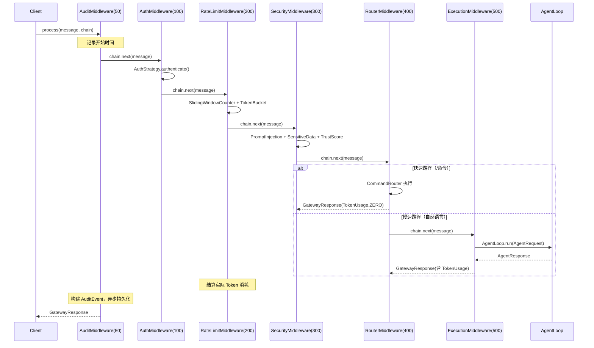

# Design Document: Gateway 中间件实现

## Overview

本 spec 实现 LifePilot Gateway 的 6 个具体中间件（Auth / RateLimit / Security / Router / Execution / Audit）、审计事件持久化、中间件自动配置和 CLI 通道适配器桥接。

Gateway 框架层（GatewayMiddleware 接口、MiddlewarePipeline、MiddlewareChain、MiddlewareContext、ChannelAdapter 接口、MessageGateway、DefaultMessageGateway、GatewayProperties、Flyway V12）已在 gateway-middleware spec 中完成。本 spec 聚焦于填充框架中缺失的具体实现。

参考文档：
- 架构设计：docs/architecture/gateway-middleware.md
- 特性设计：docs/features/gateway-channels.md
- 编码规范：.kiro/steering/coding-standards.md
- 已完成框架：.kiro/specs/gateway-middleware/design.md

### 设计原则

- 每个中间件是独立的 `GatewayMiddleware` 实现，通过 `@Bean` 注册
- 中间件通过 `MiddlewareContext` 传递数据，无直接依赖
- 所有业务可调参数从 `GatewayProperties` 读取
- DataRedactor 尚未实现，本 spec 提供轻量级内联实现用于审计脱敏
- TokenBucket 和 SlidingWindowCounter 为纯内存线程安全数据结构

### 关键设计决策

| 决策 | 选择 | 理由 |
|------|------|------|
| AuditMiddleware order | 50（非需求中的 600） | 审计需要包裹整个管道（调用 chain.next() 记录请求/响应），必须最先执行 |
| DataRedactor | 本 spec 内联轻量实现 | observability 模块尚未实现，审计脱敏不能等待 |
| TokenBucket/SlidingWindowCounter | 纯内存 + AtomicLong | 单机部署，无需分布式限流；线程安全通过 CAS 操作保证 |
| AuthStrategy 注册 | Map<ChannelType, AuthStrategy> | 策略模式，按通道类型分发，支持扩展 |
| CommandRouter 桥接 | RouterMiddleware 直接调用 | CommandRouter 已有完整的命令解析和执行逻辑 |
| 属性测试库 | jqwik | 项目已在 gateway-middleware spec 中选定 |


## Architecture

### 中间件执行顺序

```
AuditMiddleware(50) → AuthMiddleware(100) → RateLimitMiddleware(200) → SecurityMiddleware(300) → RouterMiddleware(400) → ExecutionMiddleware(500)
```

AuditMiddleware 的 order 从需求中的 600 调整为 50，因为审计需要包裹整个管道（在 `chain.next()` 前后记录请求/响应）。如果 order=600 则它是最后一个中间件，`chain.next()` 会导致链耗尽返回 500。

### 消息处理时序



### 包结构

```
com.lifepilot.interaction
├── middleware/
│   ├── GatewayMiddleware.java          # [已有] 接口
│   ├── MiddlewareChain.java            # [已有] 索引式责任链
│   ├── MiddlewareContext.java          # [已有] 共享上下文
│   ├── MiddlewarePipeline.java         # [已有] 管道组装
│   ├── auth/                           # [新增] 认证中间件
│   │   ├── AuthMiddleware.java
│   │   ├── AuthStrategy.java           # sealed interface
│   │   ├── AuthResult.java             # record
│   │   ├── TrustLevel.java             # enum
│   │   └── CliAuthStrategy.java
│   ├── ratelimit/                      # [新增] 限流中间件
│   │   ├── RateLimitMiddleware.java
│   │   ├── TokenBucket.java
│   │   └── SlidingWindowCounter.java
│   ├── security/                       # [新增] 安全中间件
│   │   ├── SecurityMiddleware.java
│   │   ├── PromptInjectionDetector.java
│   │   ├── SensitiveDataDetector.java
│   │   ├── TrustScoreCalculator.java
│   │   ├── SecurityCheckResult.java    # record
│   │   └── SecurityViolation.java      # record
│   ├── router/                         # [新增] 路由中间件
│   │   ├── RouterMiddleware.java
│   │   └── RouteDecision.java          # sealed interface
│   ├── execution/                      # [新增] 执行中间件
│   │   └── ExecutionMiddleware.java
│   └── audit/                          # [新增] 审计中间件
│       ├── AuditMiddleware.java
│       ├── AuditEvent.java             # record
│       ├── AuditEventRepository.java
│       └── DataRedactor.java           # 轻量级脱敏（临时）
├── channel/
│   ├── ChannelAdapter.java             # [已有] 接口
│   └── CliChannelAdapter.java          # [新增]
└── config/
    ├── GatewayAutoConfiguration.java   # [已有] 框架配置
    ├── GatewayMiddlewareAutoConfiguration.java  # [新增] 中间件配置
    └── GatewayProperties.java          # [已有] 配置属性
```


## Components and Interfaces

### 1. AuthMiddleware（认证鉴权中间件）

#### AuthStrategy sealed interface

```java
public sealed interface AuthStrategy
        permits CliAuthStrategy, WebAuthStrategy {
    AuthResult authenticate(GatewayMessage message);
    ChannelType supportedChannel();
}
```

本 spec 仅实现 `CliAuthStrategy`，`WebAuthStrategy` 留待 Web 通道 spec。

#### AuthResult record

```java
public record AuthResult(boolean authenticated, String userId, TrustLevel trustLevel,
                         @Nullable String failureReason) {
    public static AuthResult success(String userId, TrustLevel trustLevel) { ... }
    public static AuthResult failure(String reason) { ... }
}
```

#### TrustLevel enum

```java
public enum TrustLevel {
    TRUSTED,    // CLI 本地用户，完全信任
    VERIFIED,   // 已验证身份（Web JWT / 企业通道签名）
    ANONYMOUS   // 未验证
}
```

#### CliAuthStrategy

CLI 通道无需额外验证，直接返回 `AuthResult.success(userId, TrustLevel.TRUSTED)`。

#### AuthMiddleware 逻辑

1. 从 `Map<ChannelType, AuthStrategy>` 中查找匹配的策略
2. 无匹配策略 → 返回 400
3. 策略返回 `authenticated=false` → 返回 401
4. 策略返回 `authenticated=true` → 将 `AuthResult` 和 `TrustLevel` 放入 `MiddlewareContext`，调用 `chain.next()`

```java
public class AuthMiddleware implements GatewayMiddleware {
    private final Map<ChannelType, AuthStrategy> strategies;
    private final GatewayProperties properties;

    @Override
    public GatewayResponse process(GatewayMessage message, MiddlewareChain chain) {
        var strategy = strategies.get(message.channelType());
        if (strategy == null) {
            return GatewayResponse.error(message.channelType(), "不支持的通道类型", 400);
        }
        var result = strategy.authenticate(message);
        if (!result.authenticated()) {
            return GatewayResponse.error(message.channelType(), "认证失败: " + result.failureReason(), 401);
        }
        chain.context().set(MiddlewareContext.KEY_AUTH_RESULT, result);
        chain.context().set(MiddlewareContext.KEY_TRUST_LEVEL, result.trustLevel());
        return chain.next(message);
    }

    @Override public int order() { return properties.middleware().auth().order(); }
    @Override public String name() { return "auth"; }
    @Override public boolean enabled() { return properties.middleware().auth().enabled(); }
}
```

### 2. RateLimitMiddleware（限流控制中间件）

#### TokenBucket

令牌桶以 LLM Token 为单位，线性补充。使用 `AtomicLong` + CAS 保证线程安全。

```java
public class TokenBucket {
    private final long capacity;           // 桶容量（maxTokensPerHour）
    private final double refillRatePerMs;  // 每毫秒补充速率
    private final AtomicLong availableTokens;
    private final AtomicLong lastRefillTimestamp;

    public boolean tryConsume(long tokens) {
        refill();
        // CAS 循环：尝试扣减，不足则返回 false（不部分消费）
    }

    public void refund(long tokens) {
        // CAS 循环：增加 tokens，不超过 capacity
    }

    private void refill() {
        // 基于 elapsed time 线性补充
    }
}
```

关键不变量：
- `tryConsume(n)` 返回 false 时，availableTokens 不变（无部分消费）
- `refund(n)` 后 availableTokens 不超过 capacity
- 总消费量 ≤ capacity + 时间内补充量

#### SlidingWindowCounter

滑动窗口计数器，按请求数限流。使用 `ConcurrentLinkedDeque<Long>` 存储请求时间戳。

```java
public class SlidingWindowCounter {
    private final int maxRequests;         // 窗口内最大请求数
    private final long windowSizeMs;       // 窗口大小（毫秒）
    private final ConcurrentLinkedDeque<Long> timestamps;

    public boolean tryAcquire() {
        long now = System.currentTimeMillis();
        evictExpired(now);
        if (timestamps.size() >= maxRequests) return false;
        timestamps.addLast(now);
        return true;
    }

    private void evictExpired(long now) {
        while (!timestamps.isEmpty() && timestamps.peekFirst() <= now - windowSizeMs) {
            timestamps.pollFirst();
        }
    }
}
```

#### RateLimitMiddleware 逻辑

1. `SlidingWindowCounter.tryAcquire()` → 失败返回 429
2. `TokenBucket.tryConsume(estimatedTokens)` → 失败返回 429
3. 两项通过 → 调用 `chain.next(message)`
4. 响应返回后：
   - 有 `TokenUsage` → 结算差额（refund 多预留的或不操作）
   - 无 `TokenUsage`（快速路径）→ 全额 refund

```java
public class RateLimitMiddleware implements GatewayMiddleware {
    private final ConcurrentHashMap<String, TokenBucket> tokenBuckets;
    private final ConcurrentHashMap<String, SlidingWindowCounter> windowCounters;
    private final GatewayProperties properties;

    @Override
    public GatewayResponse process(GatewayMessage message, MiddlewareChain chain) {
        String userId = message.userId();
        var counter = windowCounters.computeIfAbsent(userId, k -> newCounter());
        if (!counter.tryAcquire()) {
            return GatewayResponse.error(message.channelType(), "请求频率超限", 429);
        }
        var bucket = tokenBuckets.computeIfAbsent(userId, k -> newBucket());
        int estimated = properties.rateLimit().estimatedTokensPerRequest();
        if (!bucket.tryConsume(estimated)) {
            return GatewayResponse.error(message.channelType(), "Token 配额不足", 429);
        }
        var response = chain.next(message);
        settleTokenUsage(bucket, estimated, response);
        return response;
    }

    private void settleTokenUsage(TokenBucket bucket, int estimated, GatewayResponse response) {
        if (response.tokenUsage() == null || response.tokenUsage().equals(TokenUsage.ZERO)) {
            bucket.refund(estimated);
        } else {
            int actual = response.tokenUsage().totalTokens();
            if (actual < estimated) {
                bucket.refund(estimated - actual);
            }
            // actual >= estimated 时不额外扣减（已预留足够）
        }
    }
}
```


### 3. SecurityMiddleware（安全检查中间件）

#### SecurityViolation record

```java
public record SecurityViolation(String type, String severity, String description,
                                @Nullable String matchedPattern) {
    // severity: CRITICAL / HIGH / MEDIUM / LOW
}
```

#### SecurityCheckResult record

```java
public record SecurityCheckResult(List<SecurityViolation> violations, boolean blocked,
                                  @Nullable String redactedContent, double trustScore) {
    public boolean hasViolations() { return !violations.isEmpty(); }
}
```

#### PromptInjectionDetector

基于正则模式匹配检测 Prompt 注入。内置两类模式：
- 直接注入模式（CRITICAL）：`ignore previous instructions`、`system prompt`、`you are now` 等
- 越狱尝试模式（HIGH）：`DAN mode`、`jailbreak`、`bypass` 等

```java
public class PromptInjectionDetector {
    private static final List<InjectionPattern> PATTERNS = List.of(
        new InjectionPattern("ignore.*(?:previous|above|all).*instructions", "CRITICAL", "直接注入"),
        new InjectionPattern("(?:system|initial)\\s*prompt", "CRITICAL", "系统提示词探测"),
        new InjectionPattern("you\\s+are\\s+now", "HIGH", "角色覆盖"),
        new InjectionPattern("(?:DAN|jailbreak|bypass)\\s*mode", "HIGH", "越狱尝试"),
        // ... 更多模式
    );

    public List<SecurityViolation> detect(String content) { ... }

    private record InjectionPattern(String regex, String severity, String description) {}
}
```

#### SensitiveDataDetector

检测手机号、身份证号、银行卡号、邮箱，并生成脱敏版本。

```java
public class SensitiveDataDetector {
    // 手机号：1[3-9]\d{9}
    // 身份证：18 位 + 校验位验证
    // 银行卡：16-19 位 + Luhn 校验
    // 邮箱：标准邮箱正则

    public SensitiveDataResult detect(String content) { ... }

    public record SensitiveDataResult(List<SecurityViolation> violations, String redactedContent) {}
}
```

身份证校验：使用 18 位身份证号的加权求和校验算法（权重因子 7-9-10-5-8-4-2-1-6-3-7-9-10-5-8-4-2，校验码 1-0-X-9-8-7-6-5-4-3-2）。

银行卡校验：Luhn 算法（从右向左，奇数位不变，偶数位乘 2 后大于 9 则减 9，求和 mod 10 == 0）。

#### TrustScoreCalculator

基于用户历史行为计算信任分数。查询 `user_behavior` 表获取交互次数、安全事件次数、账户年龄、最近事件时间。

```java
public class TrustScoreCalculator {
    private final JdbcTemplate jdbcTemplate;

    public double calculate(String userId) {
        // 查询 user_behavior 表
        // 基础分 = 0.5
        // + 交互次数贡献（min(totalInteractions / 100, 0.2)）
        // - 安全事件惩罚（min(securityIncidents * 0.1, 0.3)）
        // + 账户年龄贡献（min(accountAgeDays / 365, 0.1)）
        // - 最近事件衰减（如果 lastIncident < 7天，额外 -0.1）
        // 结果 clamp 到 [0.0, 1.0]
    }
}
```

#### SecurityMiddleware 逻辑

1. `PromptInjectionDetector.detect(content)` → CRITICAL/HIGH 违规则返回 403
2. `SensitiveDataDetector.detect(content)` → 记录违规，生成脱敏内容
3. 如果 TrustLevel 低于 TRUSTED，`TrustScoreCalculator.calculate(userId)` → 计算信任分
4. 构建 `SecurityCheckResult` 放入 `MiddlewareContext`
5. 调用 `chain.next(message)`

### 4. RouterMiddleware（意图路由中间件）

#### RouteDecision sealed interface

```java
public sealed interface RouteDecision
        permits RouteDecision.FastRoute, RouteDecision.AgentRoute, RouteDecision.ErrorRoute {

    record FastRoute(String command, List<String> args, String responseText) implements RouteDecision {}
    record AgentRoute(String content) implements RouteDecision {}
    record ErrorRoute(String message, int statusCode) implements RouteDecision {}
}
```

#### RouterMiddleware 逻辑

1. 判断消息类型：
   - `CommandMessage` 或 `TextMessage` 以 `/` 开头 → 快速路径
   - 其他 `TextMessage` → 慢速路径（AgentRoute）
2. 快速路径：
   - 解析命令名和参数
   - 查找 `GatewayProperties.router().fastPathCommands()` 中是否包含该命令
   - 匹配 → 执行命令，返回 `GatewayResponse` with `TokenUsage.ZERO`
   - 不匹配 → 返回可用命令列表
3. 慢速路径：
   - 创建 `AgentRoute` 放入 `MiddlewareContext`
   - 调用 `chain.next(message)` 传递给 ExecutionMiddleware

**CommandRouter 桥接设计**：现有 `CommandRouter.route()` 方法签名为 `route(String[] args, LineReader lineReader, ResponseRenderer renderer)`，依赖 JLine 的 `LineReader` 和 `ResponseRenderer`。在 Gateway 管道中无法直接使用。

RouterMiddleware 将实现自己的命令匹配逻辑：检查命令名是否在 `fastPathCommands` 列表中，匹配则构造一个简单的文本响应（"命令已通过快速路径执行: {command}"），不匹配则列出可用命令。完整的命令执行逻辑由 CliChannelAdapter 在 Gateway 管道之外处理（CLI 快速路径）。

**修正**：RouterMiddleware 不直接执行命令，而是将命令识别为快速路径后，通过 `MiddlewareContext` 传递 `FastRoute` 决策。CliChannelAdapter 在收到 `FastRoute` 响应后，使用现有的 `CommandRouter` 执行实际命令。对于非 CLI 通道，快速路径命令返回文本提示。

**最终方案**：RouterMiddleware 对快速路径命令直接返回 `GatewayResponse`，内容为命令执行结果的文本表示。具体执行逻辑：
- 已知命令（todo/schedule/habit/llm/mcp/skill）→ 返回 "请使用 CLI 执行此命令" 的提示（非 CLI 通道），或由 CliChannelAdapter 在 normalize 阶段拦截命令直接走 CommandRouter（CLI 通道）
- 未知命令 → 返回可用命令列表

```java
public class RouterMiddleware implements GatewayMiddleware {
    private final GatewayProperties properties;

    @Override
    public GatewayResponse process(GatewayMessage message, MiddlewareChain chain) {
        if (isCommandMessage(message)) {
            return handleFastPath(message);
        }
        // 慢速路径
        var decision = new RouteDecision.AgentRoute(message.contentAsText());
        chain.context().set(MiddlewareContext.KEY_ROUTE_DECISION, decision);
        return chain.next(message);
    }

    private boolean isCommandMessage(GatewayMessage message) {
        return message.content() instanceof MessageContent.CommandMessage
            || (message.content() instanceof MessageContent.TextMessage t
                && t.text().startsWith("/"));
    }

    private GatewayResponse handleFastPath(GatewayMessage message) {
        String command = extractCommand(message);
        var fastPathCommands = properties.router().fastPathCommands();
        if (fastPathCommands.contains(command)) {
            var decision = new RouteDecision.FastRoute(command, extractArgs(message), "快速路径命令: " + command);
            // FastRoute 不调用 chain.next()，直接返回
            return GatewayResponse.success(message.channelType(),
                new ResponseContent.TextContent("快速路径命令: /" + command))
                .toBuilder().tokenUsage(TokenUsage.ZERO).build();
        }
        // 未知命令
        String available = String.join(", ", fastPathCommands.stream().map(c -> "/" + c).toList());
        return GatewayResponse.error(message.channelType(),
            "未知命令: /" + command + "。可用命令: " + available, 400);
    }
}
```


### 5. ExecutionMiddleware（Agent 执行中间件）

将 `GatewayMessage` 转换为 `AgentRequest`，调用 `AgentLoop.run()`，将 `AgentResponse` 转换为 `GatewayResponse`。

```java
public class ExecutionMiddleware implements GatewayMiddleware {
    private final AgentLoop agentLoop;
    private final GatewayProperties properties;

    @Override
    public GatewayResponse process(GatewayMessage message, MiddlewareChain chain) {
        // 1. GatewayMessage → AgentRequest
        var agentRequest = new AgentRequest(
            message.contentAsText(),
            message.sessionId(),
            message.channelType().value()
        );

        // 2. 带超时调用 AgentLoop.run()
        try {
            var future = CompletableFuture.supplyAsync(() -> agentLoop.run(agentRequest));
            int timeout = properties.execution().timeoutSeconds();
            var agentResponse = future.get(timeout, TimeUnit.SECONDS);

            // 3. AgentResponse → GatewayResponse
            var tokenUsage = new TokenUsage(0, 0, agentResponse.tokensUsed(), "agent");
            chain.context().set(MiddlewareContext.KEY_AGENT_RESPONSE, agentResponse);
            chain.context().set(MiddlewareContext.KEY_TOKEN_USAGE, tokenUsage);

            return GatewayResponse.success(message.channelType(),
                    new ResponseContent.TextContent(agentResponse.content()))
                .toBuilder().tokenUsage(tokenUsage).build();

        } catch (TimeoutException e) {
            return GatewayResponse.error(message.channelType(), "请求处理超时", 504);
        } catch (ExecutionException e) {
            log.error("Agent 执行异常: messageId={}", message.messageId(), e.getCause());
            return GatewayResponse.error(message.channelType(), "处理请求时发生内部错误", 500);
        } catch (InterruptedException e) {
            Thread.currentThread().interrupt();
            return GatewayResponse.error(message.channelType(), "请求被中断", 500);
        }
    }

    @Override public int order() { return properties.middleware().execution().order(); }
    @Override public String name() { return "execution"; }
    @Override public boolean enabled() { return properties.middleware().execution().enabled(); }
}
```

注意：`AgentRequest` 的字段为 `(String message, String sessionId, String channel)`，与 `GatewayMessage` 的映射关系：
- `message` ← `GatewayMessage.contentAsText()`
- `sessionId` ← `GatewayMessage.sessionId()`
- `channel` ← `GatewayMessage.channelType().value()`

`AgentResponse` 的 `tokensUsed` 字段映射到 `TokenUsage.totalTokens`。`AgentResponse` 不区分 promptTokens/completionTokens，因此 `TokenUsage` 中这两个字段设为 0。

### 6. AuditMiddleware（审计日志中间件）

AuditMiddleware 包裹整个管道，记录请求/响应审计事件。

```java
public class AuditMiddleware implements GatewayMiddleware {
    private static final int ORDER = 50; // 必须最先执行
    private final AuditEventRepository repository;
    private final DataRedactor redactor;
    private final GatewayProperties properties;

    @Override
    public GatewayResponse process(GatewayMessage message, MiddlewareChain chain) {
        Instant start = Instant.now();

        // 执行后续管道
        GatewayResponse response = chain.next(message);

        // 构建审计事件
        Duration latency = Duration.between(start, Instant.now());
        var event = buildAuditEvent(message, response, latency, chain.context());

        // 异步持久化
        CompletableFuture.runAsync(() -> {
            try {
                repository.save(event);
            } catch (Exception e) {
                log.error("审计事件持久化失败: auditId={}", event.auditId(), e);
            }
        });

        return response;
    }

    private AuditEvent buildAuditEvent(GatewayMessage message, GatewayResponse response,
                                        Duration latency, MiddlewareContext context) {
        int maxReqLen = properties.audit().requestSummaryMaxLength();
        int maxRespLen = properties.audit().responseSummaryMaxLength();

        String requestSummary = truncate(redactor.redact(message.contentAsText()), maxReqLen);
        String responseSummary = truncate(redactor.redact(response.content().toPlainText()), maxRespLen);
        String contentHash = sha256(message.contentAsText());
        String routeType = resolveRouteType(context);
        TokenUsage tokenUsage = response.tokenUsage();

        return new AuditEvent(
            UUID.randomUUID().toString(),
            message.messageId(),
            message.sessionId(),
            message.channelType().value(),
            message.userId(),
            contentHash,
            requestSummary,
            response.statusCode(),
            responseSummary,
            routeType,
            latency.toMillis(),
            tokenUsage,
            serializeMiddlewareResults(context),
            Instant.now()
        );
    }

    @Override public int order() { return ORDER; }
    @Override public String name() { return "audit"; }
    @Override public boolean enabled() { return properties.audit().enabled(); }
}
```

#### AuditEvent record

```java
@Builder(toBuilder = true)
public record AuditEvent(
    String auditId,
    String messageId,
    @Nullable String sessionId,
    String channelType,
    String userId,
    @Nullable String requestContentHash,
    @Nullable String requestSummary,
    int responseStatusCode,
    @Nullable String responseSummary,
    @Nullable String routeType,
    long latencyMs,
    @Nullable TokenUsage tokenUsage,
    @Nullable String middlewareResultsJson,
    Instant createdAt
) {}
```

#### DataRedactor（轻量级临时实现）

```java
public class DataRedactor {
    // 手机号脱敏：138****1234
    // 身份证脱敏：110***********1234
    // 银行卡脱敏：6222****1234
    // 邮箱脱敏：u***@example.com

    public String redact(String content) {
        if (content == null) return "";
        String result = content;
        result = PHONE_PATTERN.matcher(result).replaceAll(m -> maskPhone(m.group()));
        result = ID_CARD_PATTERN.matcher(result).replaceAll(m -> maskIdCard(m.group()));
        result = BANK_CARD_PATTERN.matcher(result).replaceAll(m -> maskBankCard(m.group()));
        result = EMAIL_PATTERN.matcher(result).replaceAll(m -> maskEmail(m.group()));
        return result;
    }
}
```

### 7. AuditEventRepository

使用 `JdbcTemplate` 操作 `gateway_audit_log` 表。

```java
public class AuditEventRepository {
    private final JdbcTemplate jdbcTemplate;
    private final ObjectMapper objectMapper;

    public void save(AuditEvent event) {
        jdbcTemplate.update("""
            INSERT INTO gateway_audit_log
            (audit_id, message_id, session_id, channel_type, user_id,
             request_content_hash, request_summary, response_status_code,
             response_summary, route_type, latency_ms,
             prompt_tokens, completion_tokens, total_tokens, model_id,
             middleware_results_json, created_at)
            VALUES (?, ?, ?, ?, ?, ?, ?, ?, ?, ?, ?, ?, ?, ?, ?, ?, ?)
            """,
            event.auditId(), event.messageId(), event.sessionId(),
            event.channelType(), event.userId(),
            event.requestContentHash(), event.requestSummary(),
            event.responseStatusCode(), event.responseSummary(),
            event.routeType(), event.latencyMs(),
            tokenPrompt(event), tokenCompletion(event), tokenTotal(event), tokenModel(event),
            event.middlewareResultsJson(),
            event.createdAt().toString()
        );
    }

    public List<AuditEvent> findByFilters(@Nullable String userId, @Nullable String channelType,
                                           @Nullable String routeType,
                                           @Nullable Instant from, @Nullable Instant to) {
        // 动态构建 WHERE 子句
    }
}
```

### 8. GatewayMiddlewareAutoConfiguration

```java
@AutoConfiguration(after = GatewayAutoConfiguration.class)
@ConditionalOnProperty(name = "lifepilot.gateway.enabled", matchIfMissing = true)
public class GatewayMiddlewareAutoConfiguration {

    // ── 认证相关 ──
    @Bean
    public CliAuthStrategy cliAuthStrategy() { return new CliAuthStrategy(); }

    @Bean
    public AuthMiddleware authMiddleware(List<AuthStrategy> strategies, GatewayProperties props) {
        var strategyMap = strategies.stream()
            .collect(Collectors.toMap(AuthStrategy::supportedChannel, Function.identity()));
        return new AuthMiddleware(strategyMap, props);
    }

    // ── 限流相关 ──
    @Bean
    public RateLimitMiddleware rateLimitMiddleware(GatewayProperties props) {
        return new RateLimitMiddleware(props);
    }

    // ── 安全相关 ──
    @Bean
    public PromptInjectionDetector promptInjectionDetector() { ... }

    @Bean
    public SensitiveDataDetector sensitiveDataDetector() { ... }

    @Bean
    public TrustScoreCalculator trustScoreCalculator(JdbcTemplate jdbcTemplate) { ... }

    @Bean
    public SecurityMiddleware securityMiddleware(PromptInjectionDetector injectionDetector,
            SensitiveDataDetector sensitiveDataDetector, TrustScoreCalculator trustScoreCalculator,
            DataRedactor redactor, GatewayProperties props) { ... }

    // ── 路由相关 ──
    @Bean
    public RouterMiddleware routerMiddleware(GatewayProperties props) { ... }

    // ── 执行相关 ──
    @Bean
    public ExecutionMiddleware executionMiddleware(AgentLoop agentLoop, GatewayProperties props) { ... }

    // ── 审计相关 ──
    @Bean
    public DataRedactor dataRedactor() { return new DataRedactor(); }

    @Bean
    public AuditEventRepository auditEventRepository(JdbcTemplate jdbcTemplate, ObjectMapper objectMapper) { ... }

    @Bean
    public AuditMiddleware auditMiddleware(AuditEventRepository repository,
            DataRedactor redactor, GatewayProperties props) { ... }

    // ── CLI 通道适配器 ──
    @Bean
    @ConditionalOnProperty(name = "lifepilot.gateway.channels.cli.enabled", matchIfMissing = true)
    public CliChannelAdapter cliChannelAdapter(MessageGateway gateway, ResponseRenderer renderer,
            Terminal terminal) { ... }
}
```

### 9. CliChannelAdapter

桥接 CliShell 到 Gateway 管道。

```java
public class CliChannelAdapter implements ChannelAdapter {
    private final MessageGateway gateway;
    private final ResponseRenderer renderer;
    private final Terminal terminal;

    @Override
    public ChannelType channelType() { return ChannelType.CLI; }

    @Override
    public GatewayMessage normalize(Object rawMessage) {
        // rawMessage 为 String（用户输入文本）
        String input = (String) rawMessage;
        MessageContent content;
        if (input.startsWith("/")) {
            content = MessageContent.CommandMessage.parse(input);
        } else {
            content = new MessageContent.TextMessage(input);
        }
        return GatewayMessage.builder()
            .channelType(ChannelType.CLI)
            .userId("cli-user")
            .sessionId("cli-session")
            .content(content)
            .channelMetadata(new ChannelMetadata.CliMetadata(
                System.getProperty("os.name"),
                terminal.getWidth(),
                terminal.getType() != null))
            .build();
    }

    @Override
    public void sendResponse(String userId, GatewayResponse response) {
        if (response.isSuccess()) {
            renderer.info(response.content().toPlainText());
        } else {
            renderer.error(response.errorMessage() != null
                ? response.errorMessage() : response.content().toPlainText());
        }
    }

    /**
     * 处理用户输入：normalize → gateway.process() → sendResponse()。
     */
    public void handleInput(String userInput) {
        var message = normalize(userInput);
        var response = gateway.process(message);
        sendResponse(message.userId(), response);
    }

    @Override public void start() { log.info("CLI 通道适配器已启动"); }
    @Override public void stop() { log.info("CLI 通道适配器已停止"); }
}
```


### 依赖接口验证

| 接口 | 源码位置 | 验证状态 |
|------|---------|---------|
| GatewayMiddleware | com.lifepilot.interaction.middleware.GatewayMiddleware | ✅ 已核对 — `process(GatewayMessage, MiddlewareChain)`, `order()`, `name()`, `enabled()` |
| MiddlewareChain | com.lifepilot.interaction.middleware.MiddlewareChain | ✅ 已核对 — `next(GatewayMessage)`, `context()` |
| MiddlewareContext | com.lifepilot.interaction.middleware.MiddlewareContext | ✅ 已核对 — `set(String, Object)`, `get(String, Class<T>)`, `require(String, Class<T>)`, 预定义键常量 |
| MiddlewarePipeline | com.lifepilot.interaction.middleware.MiddlewarePipeline | ✅ 已核对 — `execute(GatewayMessage)`, `register()`, `unregister()` |
| ChannelAdapter | com.lifepilot.interaction.channel.ChannelAdapter | ✅ 已核对 — `channelType()`, `normalize(Object)`, `sendResponse(String, GatewayResponse)`, `start()`, `stop()` |
| MessageGateway | com.lifepilot.interaction.gateway.MessageGateway | ✅ 已核对 — `process(GatewayMessage)`, `registerChannel()`, `start()`, `stop()` |
| GatewayProperties | com.lifepilot.interaction.config.GatewayProperties | ✅ 已核对 — `middleware()`, `rateLimit()`, `security()`, `auth()`, `router()`, `execution()`, `audit()`, `channels()` |
| GatewayAutoConfiguration | com.lifepilot.interaction.config.GatewayAutoConfiguration | ✅ 已核对 — `@ConditionalOnProperty("lifepilot.gateway.enabled")`, 注册 Pipeline + Gateway |
| GatewayMessage | com.lifepilot.interaction.model.GatewayMessage | ✅ 已核对 — `record(messageId, channelType, userId, sessionId, content, attachments, channelMetadata, timestamp, traceHeaders)`, `contentAsText()`, `isCommand()` |
| GatewayResponse | com.lifepilot.interaction.model.GatewayResponse | ✅ 已核对 — `record(responseId, channelType, content, attachments, metadata, latency, tokenUsage, statusCode, errorMessage)`, `success()`, `error()`, `toBuilder()` |
| MessageContent | com.lifepilot.interaction.model.MessageContent | ✅ 已核对 — sealed interface permits TextMessage, CommandMessage, FileMessage, CardMessage, EventMessage |
| ResponseContent | com.lifepilot.interaction.model.ResponseContent | ✅ 已核对 — sealed interface permits TextContent, MarkdownContent, CardContent, StreamingContent |
| TokenUsage | com.lifepilot.interaction.model.TokenUsage | ✅ 已核对 — `record(promptTokens, completionTokens, totalTokens, modelId)`, `ZERO` 常量 |
| ChannelType | com.lifepilot.interaction.model.ChannelType | ✅ 已核对 — enum CLI/WEB/WECOM/DINGTALK/FEISHU, `value()`, `fromValue()` |
| ChannelMetadata.CliMetadata | com.lifepilot.interaction.model.ChannelMetadata | ✅ 已核对 — `record(terminalType, terminalWidth, colorSupported)` |
| AgentLoop.run() | com.lifepilot.agent.AgentLoop | ✅ 已核对 — `public AgentResponse run(AgentRequest request)` |
| AgentRequest | com.lifepilot.agent.model.AgentRequest | ✅ 已核对 — `record(String message, String sessionId, String channel)` |
| AgentResponse | com.lifepilot.agent.model.AgentResponse | ✅ 已核对 — `record(String traceId, String sessionId, String content, int tokensUsed, int stepCount, @Nullable String terminationReason)` |
| CommandRouter | com.lifepilot.interaction.cli.CommandRouter | ✅ 已核对 — `route(String[] args, LineReader lineReader, ResponseRenderer renderer)`，依赖 JLine，Gateway 管道内不直接调用 |
| ResponseRenderer | com.lifepilot.interaction.cli.ResponseRenderer | ✅ 已核对 — `success()`, `error()`, `info()`, `table()`, `streamToken()`, `streamEnd()` |
| DataRedactor | com.lifepilot.observability | ⚠️ 尚未实现 — 本 spec 提供轻量级临时实现 |
| gateway_audit_log 表 | Flyway V12 | ✅ 已核对 — 列：audit_id, message_id, session_id, channel_type, user_id, request_content_hash, request_summary, response_status_code, response_summary, route_type, latency_ms, prompt_tokens, completion_tokens, total_tokens, model_id, middleware_results_json, created_at |
| user_behavior 表 | Flyway V12 | ✅ 已核对 — 列：user_id, total_interactions, security_incidents, last_incident_at, first_seen_at, created_at, updated_at |


## Data Models

### 新增 Record / Enum / Sealed Interface

```mermaid
classDiagram
    class TrustLevel {
        <<enum>>
        TRUSTED
        VERIFIED
        ANONYMOUS
    }

    class AuthStrategy {
        <<sealed interface>>
        +authenticate(GatewayMessage) AuthResult
        +supportedChannel() ChannelType
    }

    class CliAuthStrategy {
        +authenticate(GatewayMessage) AuthResult
        +supportedChannel() ChannelType
    }

    AuthStrategy <|.. CliAuthStrategy

    class AuthResult {
        <<record>>
        +authenticated : boolean
        +userId : String
        +trustLevel : TrustLevel
        +failureReason : String?
        +success(String, TrustLevel) AuthResult
        +failure(String) AuthResult
    }

    class RouteDecision {
        <<sealed interface>>
    }
    class FastRoute {
        <<record>>
        +command : String
        +args : List~String~
        +responseText : String
    }
    class AgentRoute {
        <<record>>
        +content : String
    }
    class ErrorRoute {
        <<record>>
        +message : String
        +statusCode : int
    }
    RouteDecision <|.. FastRoute
    RouteDecision <|.. AgentRoute
    RouteDecision <|.. ErrorRoute

    class SecurityViolation {
        <<record>>
        +type : String
        +severity : String
        +description : String
        +matchedPattern : String?
    }

    class SecurityCheckResult {
        <<record>>
        +violations : List~SecurityViolation~
        +blocked : boolean
        +redactedContent : String?
        +trustScore : double
    }

    class AuditEvent {
        <<record>>
        +auditId : String
        +messageId : String
        +sessionId : String?
        +channelType : String
        +userId : String
        +requestContentHash : String?
        +requestSummary : String?
        +responseStatusCode : int
        +responseSummary : String?
        +routeType : String?
        +latencyMs : long
        +tokenUsage : TokenUsage?
        +middlewareResultsJson : String?
        +createdAt : Instant
    }

    class TokenBucket {
        -capacity : long
        -refillRatePerMs : double
        -availableTokens : AtomicLong
        -lastRefillTimestamp : AtomicLong
        +tryConsume(long) boolean
        +refund(long) void
        +availableTokens() long
    }

    class SlidingWindowCounter {
        -maxRequests : int
        -windowSizeMs : long
        -timestamps : ConcurrentLinkedDeque~Long~
        +tryAcquire() boolean
        +currentCount() int
    }
```



### AuditEvent 与 gateway_audit_log 表映射

| AuditEvent 字段 | 数据库列 | 类型 | 说明 |
|-----------------|---------|------|------|
| auditId | audit_id | TEXT PK | UUID |
| messageId | message_id | TEXT | 消息 ID |
| sessionId | session_id | TEXT | 会话 ID |
| channelType | channel_type | TEXT | 通道类型 |
| userId | user_id | TEXT | 用户 ID |
| requestContentHash | request_content_hash | TEXT | SHA-256 哈希 |
| requestSummary | request_summary | TEXT | 脱敏后截断的请求摘要 |
| responseStatusCode | response_status_code | INTEGER | HTTP 风格状态码 |
| responseSummary | response_summary | TEXT | 脱敏后截断的响应摘要 |
| routeType | route_type | TEXT | fast_path / agent / error |
| latencyMs | latency_ms | INTEGER | 处理延迟（毫秒） |
| tokenUsage.promptTokens | prompt_tokens | INTEGER | 提示词 Token |
| tokenUsage.completionTokens | completion_tokens | INTEGER | 补全 Token |
| tokenUsage.totalTokens | total_tokens | INTEGER | 总 Token |
| tokenUsage.modelId | model_id | TEXT | 模型标识 |
| middlewareResultsJson | middleware_results_json | TEXT | 中间件结果 JSON |
| createdAt | created_at | TEXT | ISO 8601 时间戳 |


## Correctness Properties

*A property is a characteristic or behavior that should hold true across all valid executions of a system — essentially, a formal statement about what the system should do. Properties serve as the bridge between human-readable specifications and machine-verifiable correctness guarantees.*

### Property 1: TokenBucket 消费不变量

*For any* TokenBucket with capacity C and any sequence of `tryConsume(n)` calls, the total successfully consumed tokens shall never exceed C plus the tokens refilled over elapsed time. Equivalently, `availableTokens()` shall always be in the range `[0, C]`.

**Validates: Requirements 10.1**

### Property 2: SlidingWindowCounter 窗口不变量

*For any* SlidingWindowCounter with maxRequests M and windowSize W, the count of successful `tryAcquire()` calls within any contiguous window of duration W shall never exceed M.

**Validates: Requirements 10.2**

### Property 3: TokenBucket 消费原子性

*For any* TokenBucket state where `availableTokens() < n`, calling `tryConsume(n)` shall return false and `availableTokens()` shall remain unchanged (no partial consumption).

**Validates: Requirements 10.3**

### Property 4: TokenBucket refund 上界

*For any* TokenBucket with capacity C and any refund amount n, after `refund(n)` the `availableTokens()` shall increase by at most n and shall never exceed C.

**Validates: Requirements 10.4**

### Property 5: AuthMiddleware 认证成功传播

*For any* GatewayMessage whose channelType has a registered AuthStrategy that returns `authenticated=true`, the AuthMiddleware shall place the AuthResult and TrustLevel into the MiddlewareContext and invoke `chain.next()`.

**Validates: Requirements 1.1, 1.2**

### Property 6: AuthMiddleware 认证失败短路

*For any* GatewayMessage whose channelType has a registered AuthStrategy that returns `authenticated=false`, the AuthMiddleware shall return a GatewayResponse with statusCode 401 without invoking `chain.next()`.

**Validates: Requirements 1.3**

### Property 7: CliAuthStrategy 始终信任

*For any* GatewayMessage on the CLI channel, `CliAuthStrategy.authenticate()` shall return `AuthResult` with `authenticated=true` and `trustLevel=TrustLevel.TRUSTED`.

**Validates: Requirements 1.5**

### Property 8: RateLimitMiddleware 频率超限拒绝

*For any* user who has already made maxRequestsPerMinute successful requests within the current sliding window, the next request from that user shall receive a 429 GatewayResponse.

**Validates: Requirements 2.2**

### Property 9: RateLimitMiddleware Token 配额不足拒绝

*For any* user whose TokenBucket has fewer available tokens than the estimated consumption, the request shall receive a 429 GatewayResponse.

**Validates: Requirements 2.4**

### Property 10: RateLimitMiddleware Token 结算

*For any* request that passes rate limiting with estimated tokens E, if the response contains TokenUsage with actual tokens A < E, then `E - A` tokens shall be refunded to the user's TokenBucket. If the response has no TokenUsage, the full E tokens shall be refunded.

**Validates: Requirements 2.5, 2.6**

### Property 11: TokenBucket 线性补充

*For any* TokenBucket with capacity C and refill rate R tokens/hour, after elapsed time T milliseconds, the available tokens shall increase by approximately `R * T / 3_600_000`, capped at C.

**Validates: Requirements 2.7**

### Property 12: PromptInjectionDetector 检测与阻断

*For any* message content containing a CRITICAL or HIGH severity prompt injection pattern (e.g., "ignore previous instructions", "you are now"), the SecurityMiddleware shall return a 403 GatewayResponse.

**Validates: Requirements 3.1, 3.2**

### Property 13: SensitiveDataDetector 检测与脱敏

*For any* string containing valid sensitive data (phone numbers matching `1[3-9]\d{9}`, ID card numbers passing 18-digit checksum, bank card numbers passing Luhn algorithm, or email addresses), the SensitiveDataDetector shall detect all instances and produce a redacted version where the sensitive data is masked.

**Validates: Requirements 3.3, 3.4**

### Property 14: TrustScoreCalculator 分数范围

*For any* combination of interaction count, security incident count, account age, and last incident recency, the computed trust score shall be in the range `[0.0, 1.0]`.

**Validates: Requirements 3.5**

### Property 15: RouterMiddleware 命令识别

*For any* GatewayMessage whose content is a CommandMessage or a TextMessage starting with `/`, the RouterMiddleware shall treat it as a fast path and return a GatewayResponse with `TokenUsage.ZERO` (for known commands) or a 400 error (for unknown commands), without invoking `chain.next()`.

**Validates: Requirements 4.1, 4.2, 4.3**

### Property 16: RouterMiddleware 自然语言路由

*For any* GatewayMessage whose content is a TextMessage not starting with `/`, the RouterMiddleware shall create an `AgentRoute` decision, place it in the MiddlewareContext, and invoke `chain.next()`.

**Validates: Requirements 4.4, 4.5**

### Property 17: ExecutionMiddleware 消息转换

*For any* GatewayMessage, the ExecutionMiddleware shall convert it to an AgentRequest where `message = contentAsText()`, `sessionId = message.sessionId()`, and `channel = message.channelType().value()`.

**Validates: Requirements 5.1**

### Property 18: ExecutionMiddleware 响应转换

*For any* AgentResponse returned by AgentLoop.run(), the ExecutionMiddleware shall produce a GatewayResponse where `content.toPlainText()` equals `agentResponse.content()` and `tokenUsage.totalTokens()` equals `agentResponse.tokensUsed()`.

**Validates: Requirements 5.3, 5.6**

### Property 19: AuditEvent 完整性与脱敏

*For any* request/response pair processed through the AuditMiddleware, the resulting AuditEvent shall contain all required fields (messageId, sessionId, channelType, userId, requestContentHash, responseStatusCode, routeType, latencyMs, tokenUsage), with request and response summaries redacted via DataRedactor and truncated to the configured maximum length.

**Validates: Requirements 6.2, 6.3, 6.6**

### Property 20: 中间件 enabled 标志

*For any* middleware whose corresponding `GatewayProperties.middleware().{name}().enabled()` returns false, the middleware's `enabled()` method shall return false.

**Validates: Requirements 8.2**

### Property 21: CliChannelAdapter normalize

*For any* non-blank user input string, `CliChannelAdapter.normalize()` shall produce a GatewayMessage with `channelType=CLI`, `content` matching the input (CommandMessage for `/`-prefixed, TextMessage otherwise), and `channelMetadata` of type `CliMetadata`.

**Validates: Requirements 9.2**


## Error Handling

### 中间件层错误处理

| 中间件 | 错误场景 | 处理方式 |
|--------|---------|---------|
| AuthMiddleware | 无匹配 AuthStrategy | 返回 400 GatewayResponse |
| AuthMiddleware | 认证失败 | 返回 401 GatewayResponse |
| RateLimitMiddleware | 请求频率超限 | 返回 429 GatewayResponse |
| RateLimitMiddleware | Token 配额不足 | 返回 429 GatewayResponse |
| SecurityMiddleware | CRITICAL/HIGH 注入检测 | 返回 403 GatewayResponse |
| SecurityMiddleware | TrustScoreCalculator 查询失败 | 降级跳过信任分计算，记录 WARN 日志 |
| RouterMiddleware | 未知命令 | 返回 400 GatewayResponse，列出可用命令 |
| ExecutionMiddleware | AgentLoop 抛出异常 | 返回 500 GatewayResponse |
| ExecutionMiddleware | AgentLoop 超时 | 返回 504 GatewayResponse |
| ExecutionMiddleware | 线程中断 | 恢复中断标志，返回 500 GatewayResponse |
| AuditMiddleware | 审计持久化失败 | 记录 ERROR 日志，不影响响应 |

### 数据结构层错误处理

| 组件 | 错误场景 | 处理方式 |
|------|---------|---------|
| TokenBucket | tryConsume 参数 ≤ 0 | 抛出 IllegalArgumentException |
| TokenBucket | refund 参数 ≤ 0 | 抛出 IllegalArgumentException |
| SlidingWindowCounter | 构造参数 maxRequests ≤ 0 | 抛出 IllegalArgumentException |
| AuditEventRepository | SQL 执行失败 | 抛出 DataAccessException（由调用方处理） |
| DataRedactor | null 输入 | 返回空字符串 |
| SensitiveDataDetector | null 输入 | 返回空结果 |

### 设计原则

- 中间件层使用 fail-safe 策略：异常不向上传播，返回错误 GatewayResponse
- 数据结构层使用 fail-fast 策略：非法参数立即抛异常
- 审计失败不影响业务：异步持久化 + 异常捕获
- 安全组件降级：TrustScoreCalculator 查询失败时跳过，不阻断请求

## Testing Strategy

### 单元测试

| 测试类 | 覆盖范围 |
|--------|---------|
| `AuthMiddlewareTest` | 策略选择、认证成功/失败、无策略 400、context 传播 |
| `CliAuthStrategyTest` | 始终返回 TRUSTED |
| `TokenBucketTest` | 消费、refund、容量上界、参数校验 |
| `SlidingWindowCounterTest` | 窗口内计数、过期清理、参数校验 |
| `RateLimitMiddlewareTest` | 频率超限 429、Token 不足 429、结算逻辑 |
| `PromptInjectionDetectorTest` | 各注入模式检测、无注入通过 |
| `SensitiveDataDetectorTest` | 手机号/身份证/银行卡/邮箱检测、校验算法、脱敏 |
| `TrustScoreCalculatorTest` | 分数计算公式、边界值、分数范围 |
| `SecurityMiddlewareTest` | 注入阻断 403、敏感数据脱敏、context 传播 |
| `RouterMiddlewareTest` | 命令识别、快速路径、未知命令、自然语言路由 |
| `ExecutionMiddlewareTest` | 消息转换、响应转换、异常 500、超时 504 |
| `AuditMiddlewareTest` | 事件构建、脱敏、截断、异步持久化、持久化失败 |
| `AuditEventRepositoryTest` | CRUD、过滤查询（集成测试） |
| `DataRedactorTest` | 各类敏感数据脱敏、null 处理 |
| `CliChannelAdapterTest` | normalize、sendResponse、命令/文本识别 |

### 属性测试

使用 jqwik 框架（已在 gateway-middleware spec 中引入）。每个属性测试至少运行 100 次迭代。

每个属性测试必须以注释标注对应的设计属性：
```java
// Feature: gateway-implementation, Property 1: TokenBucket 消费不变量
```

| 属性测试类 | 覆盖属性 |
|-----------|---------|
| `TokenBucketPropertyTest` | Property 1, 3, 4, 11 |
| `SlidingWindowCounterPropertyTest` | Property 2 |
| `AuthMiddlewarePropertyTest` | Property 5, 6, 7 |
| `RateLimitMiddlewarePropertyTest` | Property 8, 9, 10 |
| `SecurityMiddlewarePropertyTest` | Property 12, 13, 14 |
| `RouterMiddlewarePropertyTest` | Property 15, 16 |
| `ExecutionMiddlewarePropertyTest` | Property 17, 18 |
| `AuditMiddlewarePropertyTest` | Property 19 |
| `MiddlewareEnabledPropertyTest` | Property 20 |
| `CliChannelAdapterPropertyTest` | Property 21 |

### 集成测试

| 测试类 | 覆盖范围 |
|--------|---------|
| `GatewayMiddlewareAutoConfiguration_集成测试` | 所有中间件 Bean 注册、条件激活、依赖注入 |
| `AuditEventRepository_集成测试` | SQLite 持久化、过滤查询、Flyway V12 表结构 |
| `MiddlewarePipeline_端到端_集成测试` | 完整管道执行：Auth → RateLimit → Security → Router → Execution → Audit |
| `CliChannelAdapter_Gateway_集成测试` | CLI 输入 → normalize → Gateway.process() → sendResponse |

### PBT 库配置

jqwik 已在 gateway-middleware spec 中添加到 `pom.xml`。配置文件 `src/test/resources/jqwik.properties`：
```properties
jqwik.tries.default=100
```

### 测试平衡原则

- 属性测试覆盖通用规则（TokenBucket 不变量、路由决策、消息转换等）
- 单元测试覆盖具体示例和边界条件（特定注入模式、特定身份证号校验等）
- 集成测试覆盖 Spring Context 加载、数据库交互、端到端流程
- 每个正确性属性由一个属性测试实现，避免重复

