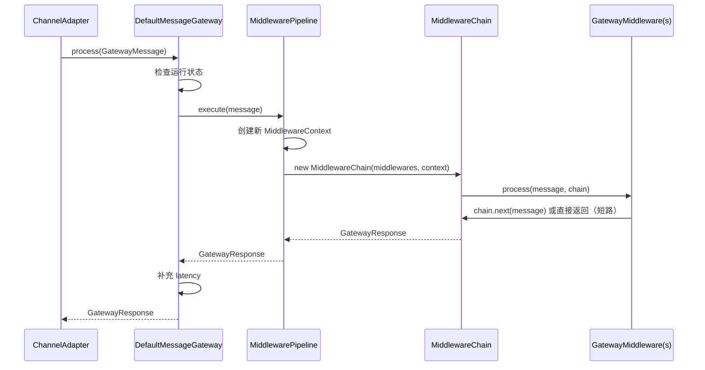
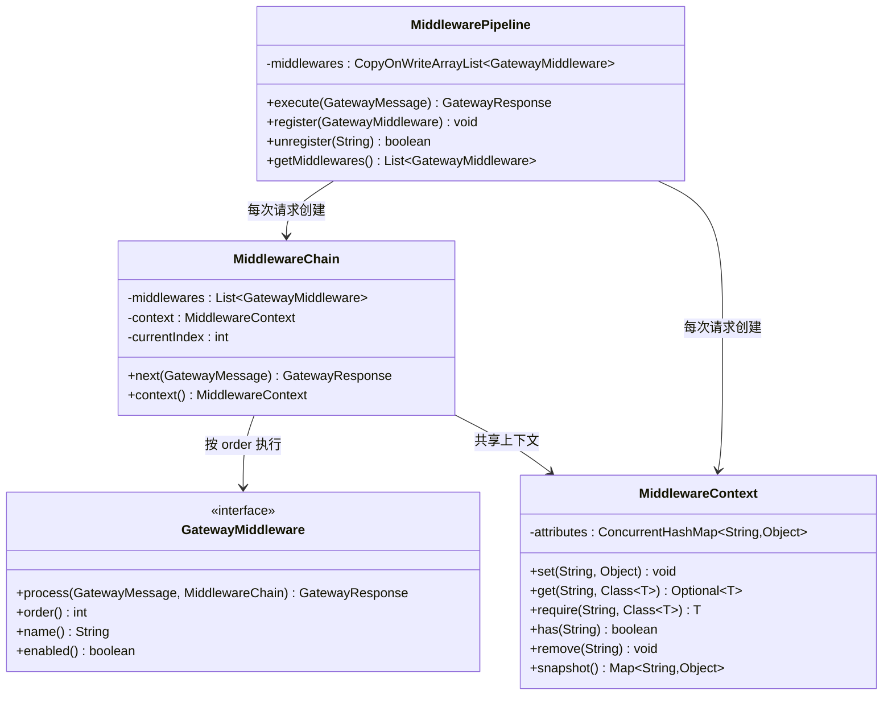
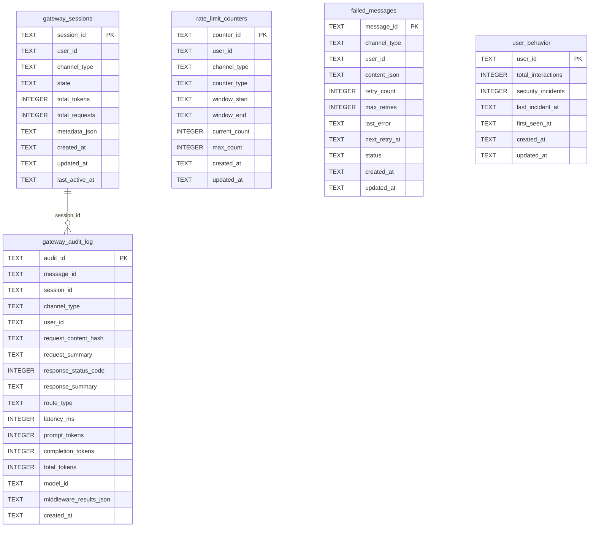

# Design Document: Gateway 核心框架

## Overview

本 spec 实现 LifePilot Gateway 核心框架，包括统一消息模型、中间件管道引擎、消息网关、通道适配器接口、配置属性、数据库迁移和 Spring 自动配置。

Gateway 是所有交互通道（CLI / Web / 企微 / 钉钉 / 飞书）的统一消息入口。核心设计理念：
- 通道差异在 `ChannelAdapter` 层完全消化，中间件和 Agent 业务逻辑与通道无关
- 中间件管道采用索引式责任链模式，支持短路、动态注册/注销、按 order 排序
- 所有消息模型使用 `record` + `sealed interface` 确保不可变性和类型安全

本 spec 只定义接口和框架，不实现具体中间件（Auth / RateLimit / Security / Router / Execution / Audit）和通道适配器实现。

参考文档：
- 架构设计：docs/architecture/gateway-middleware.md
- 特性设计：docs/features/gateway-channels.md
- 编码规范：.kiro/steering/coding-standards.md

## Architecture

### 分层架构

```
通道适配层（ChannelAdapter）
  CLI / Web / 企微 / 钉钉 / 飞书
       │
       ▼ normalize() → GatewayMessage
消息网关层（MessageGateway）
  DefaultMessageGateway — 通道注册表 + 生命周期管理
       │
       ▼ pipeline.execute(message)
中间件管道层（MiddlewarePipeline）
  MiddlewareChain — 索引式责任链
  MiddlewareContext — 跨中间件共享上下文
       │
       ▼ GatewayResponse
通道适配层（ChannelAdapter）
  sendResponse() → 通道特定格式
```

### 消息流转时序



### 包结构

```
com.lifepilot.interaction
├── model/                          # 统一消息模型
│   ├── ChannelType.java            # 通道类型枚举
│   ├── MessageContent.java         # sealed interface + 5 permits
│   ├── ChannelMetadata.java        # sealed interface + 5 permits
│   ├── GatewayMessage.java         # 统一网关消息 record
│   ├── GatewayResponse.java        # 统一网关响应 record
│   ├── ResponseContent.java        # sealed interface + 4 permits
│   └── TokenUsage.java             # Token 消耗统计 record
├── gateway/                        # 消息网关
│   ├── MessageGateway.java         # 接口
│   └── DefaultMessageGateway.java  # 实现
├── channel/                        # 通道适配器
│   └── ChannelAdapter.java         # 接口（仅定义）
├── middleware/                     # 中间件管道
│   ├── GatewayMiddleware.java      # 接口
│   ├── MiddlewareChain.java        # 索引式责任链
│   ├── MiddlewareContext.java      # 共享上下文
│   └── MiddlewarePipeline.java     # 管道组装与执行
└── config/                         # 配置
    ├── GatewayAutoConfiguration.java
    └── GatewayProperties.java
```

## Components and Interfaces

### 1. ChannelType 枚举

五个枚举值：`CLI`、`WEB`、`WECOM`、`DINGTALK`、`FEISHU`。每个枚举值持有 `value`（字符串标识）和 `requiresWebhook`（是否需要 Webhook）。提供 `fromValue(String)` 静态方法解析字符串值，未知值抛出 `IllegalArgumentException`。

### 2. MessageContent sealed interface

```java
public sealed interface MessageContent
    permits TextMessage, CommandMessage, FileMessage, CardMessage, EventMessage {
    String toPlainText();
}
```

- `TextMessage(String text)` — 紧凑构造器验证非空非 blank
- `CommandMessage(String command, List<String> args, String rawText)` — `List.copyOf(args)`，提供 `parse(String)` 静态方法
- `FileMessage(String fileName, String mimeType, byte[] data, @Nullable String caption)`
- `CardMessage(String title, String description, List<CardAction> actions)` — `List.copyOf(actions)`，内嵌 `CardAction` record
- `EventMessage(String eventType, Map<String, Object> payload)` — `Map.copyOf(payload)`

### 3. ChannelMetadata sealed interface

```java
public sealed interface ChannelMetadata
    permits CliMetadata, WebMetadata, WecomMetadata, DingtalkMetadata, FeishuMetadata {
    ChannelType channelType();
}
```

每个 permit 返回对应的 `ChannelType` 枚举值。字段定义遵循需求文档 Requirement 3。

### 4. GatewayMessage record

```java
@Builder(toBuilder = true)
public record GatewayMessage(
    String messageId, ChannelType channelType, String userId, String sessionId,
    MessageContent content, List<Attachment> attachments,
    ChannelMetadata channelMetadata, Instant timestamp,
    Map<String, String> traceHeaders
) {
    // 紧凑构造器：messageId 默认 UUID，timestamp 默认 now，集合 copyOf
    // 便捷方法：contentAsText(), isCommand(), isEvent()
    // 内嵌 record：Attachment(attachmentId, fileName, mimeType, data, size)
}
```

### 5. GatewayResponse record

```java
@Builder(toBuilder = true)
public record GatewayResponse(
    String responseId, ChannelType channelType, ResponseContent content,
    List<GatewayMessage.Attachment> attachments, Map<String, Object> metadata,
    Duration latency, @Nullable TokenUsage tokenUsage,
    int statusCode, @Nullable String errorMessage
) {
    // 紧凑构造器：responseId 默认 UUID，集合 copyOf
    // 工厂方法：success(), error(), rateLimited(), unauthorized()
    // 便捷方法：isSuccess() — statusCode 200-299
}
```

### 6. ResponseContent sealed interface + TokenUsage record

```java
public sealed interface ResponseContent
    permits TextContent, MarkdownContent, CardContent, StreamingContent {
    String toPlainText();
}
```

- `TextContent(String text)`
- `MarkdownContent(String markdown)`
- `CardContent(String title, String body, List<CardAction> actions)` — `List.copyOf(actions)`，内嵌 `CardAction(String label, String url)`
- `StreamingContent(String streamId)`

`TokenUsage(int promptTokens, int completionTokens, int totalTokens, String modelId)` — 提供 `ZERO` 静态常量。

### 7. GatewayMiddleware 接口

```java
public interface GatewayMiddleware {
    GatewayResponse process(GatewayMessage message, MiddlewareChain chain);
    int order();
    String name();
    default boolean enabled() { return true; }
}
```

### 8. MiddlewareChain

持有有序中间件列表和 `MiddlewareContext`。`next(GatewayMessage)` 方法使用索引推进，跳过 `enabled() == false` 的中间件。所有中间件执行完毕后返回 500 错误响应。

### 9. MiddlewareContext

基于 `ConcurrentHashMap` 的类型安全属性包。提供 `get(key, type)` 返回 `Optional<T>`、`require(key, type)` 抛异常、`set/has/remove/snapshot` 方法。预定义键常量：`KEY_AUTH_RESULT`、`KEY_TRUST_LEVEL`、`KEY_RATE_LIMIT_REMAINING`、`KEY_SECURITY_CHECK_RESULT`、`KEY_ROUTE_DECISION`、`KEY_AGENT_RESPONSE`、`KEY_TOKEN_USAGE`。

### 10. MiddlewarePipeline

构造时收集所有 `GatewayMiddleware` Bean 并按 `order()` 排序。`execute(GatewayMessage)` 每次创建新的 `MiddlewareChain` + `MiddlewareContext`。使用 `CopyOnWriteArrayList` 支持动态 `register/unregister`。

### 11. MessageGateway 接口 + DefaultMessageGateway

```java
public interface MessageGateway {
    GatewayResponse process(GatewayMessage message);
    void registerChannel(ChannelAdapter adapter);
    void unregisterChannel(ChannelType channelType);
    Optional<ChannelAdapter> getChannel(ChannelType channelType);
    List<ChannelAdapter> getAllChannels();
    void start();
    void stop();
    boolean isRunning();
}
```

`DefaultMessageGateway`：
- `ConcurrentHashMap<ChannelType, ChannelAdapter>` 通道注册表
- `AtomicBoolean` 运行状态
- 未运行时返回 503，异常时返回 500
- 注册已存在通道抛 `IllegalStateException`
- 网关运行中注册新通道立即启动
- 单通道启动/停止失败不影响其他通道

### 12. ChannelAdapter 接口

```java
public interface ChannelAdapter {
    ChannelType channelType();
    GatewayMessage normalize(Object rawMessage);
    void sendResponse(String userId, GatewayResponse response);
    void start();
    void stop();
}
```

### 13. GatewayProperties

使用 `@ConfigurationProperties(prefix = "lifepilot.gateway")` 绑定。顶层 `enabled` 属性默认 `true`。嵌套 record 组织子配置：`MiddlewareProperties`、`RateLimitProperties`、`SecurityProperties`、`AuthProperties`、`RouterProperties`、`ExecutionProperties`、`AuditProperties`、`ChannelsProperties`、`ReconnectProperties`、`SessionProperties`。

设计决策：Spring Boot 3.5.x 支持 record 绑定（包括嵌套 record），但需要确保所有字段有默认值。使用 `@DefaultValue` 注解为 record 构造器参数提供默认值。

### 14. GatewayAutoConfiguration

- `@Configuration` + `@ConditionalOnProperty(name = "lifepilot.gateway.enabled", matchIfMissing = true)`
- 注册 `GatewayProperties`、`MiddlewarePipeline`、`MessageGateway` Bean
- `MessageGateway` Bean 自动注册所有 `ChannelAdapter` Bean
- `@EventListener(ApplicationReadyEvent.class)` 启动网关
- 注册到 `META-INF/spring/org.springframework.boot.autoconfigure.AutoConfiguration.imports`

### 15. Flyway V12

迁移脚本 `V12__create_gateway_tables.sql` 创建 5 张表：
- `gateway_sessions` — 网关会话
- `gateway_audit_log` — 审计日志
- `rate_limit_counters` — 限流计数器
- `failed_messages` — 失败消息队列
- `user_behavior` — 用户行为（信任分数）

所有表遵循 LifePilot 数据库规范，包含必要索引和 `updated_at` 自动更新触发器。

### 依赖接口验证

| 接口 | 源码位置 | 验证状态 |
|------|---------|---------|
| AgentLoop.run(AgentRequest) | com.lifepilot.agent.AgentLoop | ✅ 已核对 — `public AgentResponse run(AgentRequest request)` |
| AgentRequest | com.lifepilot.agent.model.AgentRequest | ✅ 已核对 — `record AgentRequest(String message, String sessionId, String channel)` |
| AgentResponse | com.lifepilot.agent.model.AgentResponse | ✅ 已核对 — `record AgentResponse(String traceId, String sessionId, String content, int tokensUsed, int stepCount, @Nullable String terminationReason)` |
| GuardrailPolicy | com.lifepilot.guardrail.GuardrailPolicy | ✅ 已核对 — `checkToolCall(ToolContract, ToolInput)` 返回 `GuardrailResult` |
| DataRedactor | com.lifepilot.observability（package-info 引用） | ⚠️ 尚未实现 — 仅在 package-info.java 中提及，后续 AuditMiddleware spec 需要时实现 |

注意：本 spec 不实现具体中间件，因此 AgentLoop、GuardrailPolicy、DataRedactor 的依赖仅在后续中间件实现 spec 中使用。本 spec 只需确认这些接口存在且签名正确。

### 设计决策记录

| 决策 | 选择 | 理由 |
|------|------|------|
| DefaultMessageGateway 注册方式 | `@Bean` 在 AutoConfiguration 中注册 | 遵循项目规范，不使用 `@Service` |
| MiddlewarePipeline 注册方式 | `@Bean` 在 AutoConfiguration 中注册 | 同上，不使用 `@Component` |
| GatewayProperties 类型 | record + `@DefaultValue` | Spring Boot 3.5.x 支持 record 绑定 |
| Flyway 版本号 | V12 | V11 已被 proactive-reasoning 占用 |
| sealed interface 文件组织 | 每个 sealed interface 及其 permits 放在同一文件 | permits 较简单，同文件更紧凑 |
| ChannelAdapter.normalize 参数 | `Object rawMessage` | 各通道原始消息类型不同，使用 Object 保持通用性 |
| 属性测试库 | jqwik | 项目尚无 PBT 库，jqwik 是 Java 生态最成熟的 PBT 框架，与 JUnit 5 无缝集成 |


## Data Models

### 统一消息模型类图

```mermaid
classDiagram
    class ChannelType {
        <<enum>>
        CLI("cli", false)
        WEB("web", false)
        WECOM("wecom", true)
        DINGTALK("dingtalk", true)
        FEISHU("feishu", true)
        +value() String
        +requiresWebhook() boolean
        +fromValue(String) ChannelType
    }

    class MessageContent {
        <<sealed interface>>
        +toPlainText() String
    }

    class TextMessage {
        <<record>>
        +text : String
    }
    class CommandMessage {
        <<record>>
        +command : String
        +args : List~String~
        +rawText : String
        +parse(String) CommandMessage
    }
    class FileMessage {
        <<record>>
        +fileName : String
        +mimeType : String
        +data : byte[]
        +caption : String?
    }
    class CardMessage {
        <<record>>
        +title : String
        +description : String
        +actions : List~CardAction~
    }
    class EventMessage {
        <<record>>
        +eventType : String
        +payload : Map~String,Object~
    }

    MessageContent <|.. TextMessage
    MessageContent <|.. CommandMessage
    MessageContent <|.. FileMessage
    MessageContent <|.. CardMessage
    MessageContent <|.. EventMessage

    class ChannelMetadata {
        <<sealed interface>>
        +channelType() ChannelType
    }
    class CliMetadata {
        <<record>>
        +terminalType : String
        +terminalWidth : int
        +colorSupported : boolean
    }
    class WebMetadata {
        <<record>>
        +userAgent : String
        +remoteAddr : String
        +sessionToken : String?
        +acceptsSse : boolean
    }
    class WecomMetadata {
        <<record>>
        +corpId : String
        +agentId : String
        +msgSignature : String
        +timestamp : String
        +nonce : String
        +encryptedMsg : String?
    }
    class DingtalkMetadata {
        <<record>>
        +chatbotUserId : String
        +conversationId : String
        +conversationType : String
        +senderNick : String
        +sign : String
        +timestamp : long
        +isAtAll : boolean
    }
    class FeishuMetadata {
        <<record>>
        +appId : String
        +tenantKey : String
        +messageId : String
        +chatId : String?
        +chatType : String
        +eventId : String
        +eventType : String
    }

    ChannelMetadata <|.. CliMetadata
    ChannelMetadata <|.. WebMetadata
    ChannelMetadata <|.. WecomMetadata
    ChannelMetadata <|.. DingtalkMetadata
    ChannelMetadata <|.. FeishuMetadata

    class GatewayMessage {
        <<record>>
        +messageId : String
        +channelType : ChannelType
        +userId : String
        +sessionId : String
        +content : MessageContent
        +attachments : List~Attachment~
        +channelMetadata : ChannelMetadata
        +timestamp : Instant
        +traceHeaders : Map~String,String~
        +contentAsText() String
        +isCommand() boolean
        +isEvent() boolean
    }

    class Attachment {
        <<record>>
        +attachmentId : String
        +fileName : String
        +mimeType : String
        +data : byte[]
        +size : long
    }

    GatewayMessage --> ChannelType
    GatewayMessage --> MessageContent
    GatewayMessage --> ChannelMetadata
    GatewayMessage *-- Attachment

    class ResponseContent {
        <<sealed interface>>
        +toPlainText() String
    }
    class TextContent {
        <<record>>
        +text : String
    }
    class MarkdownContent {
        <<record>>
        +markdown : String
    }
    class CardContent {
        <<record>>
        +title : String
        +body : String
        +actions : List~CardAction~
    }
    class StreamingContent {
        <<record>>
        +streamId : String
    }

    ResponseContent <|.. TextContent
    ResponseContent <|.. MarkdownContent
    ResponseContent <|.. CardContent
    ResponseContent <|.. StreamingContent

    class TokenUsage {
        <<record>>
        +promptTokens : int
        +completionTokens : int
        +totalTokens : int
        +modelId : String
        +ZERO : TokenUsage
    }

    class GatewayResponse {
        <<record>>
        +responseId : String
        +channelType : ChannelType
        +content : ResponseContent
        +attachments : List~Attachment~
        +metadata : Map~String,Object~
        +latency : Duration
        +tokenUsage : TokenUsage?
        +statusCode : int
        +errorMessage : String?
        +success() GatewayResponse
        +error() GatewayResponse
        +rateLimited() GatewayResponse
        +unauthorized() GatewayResponse
        +isSuccess() boolean
    }

    GatewayResponse --> ChannelType
    GatewayResponse --> ResponseContent
    GatewayResponse --> TokenUsage
```



### 中间件管道类图



### 数据库 ER 图



### GatewayProperties 配置结构

```
lifepilot.gateway
├── enabled : boolean = true
├── middleware
│   ├── auth     { enabled, order }
│   ├── rate-limit { enabled, order }
│   ├── security { enabled, order }
│   ├── router   { enabled, order }
│   ├── execution { enabled, order }
│   └── audit    { enabled, order }
├── rate-limit
│   ├── max-tokens-per-hour : int = 100000
│   ├── max-tokens-per-day : int = 500000
│   ├── estimated-tokens-per-request : int = 2000
│   ├── max-requests-per-minute : int = 30
│   └── overrides : Map<String, Override>
├── security
│   ├── prompt-injection { enabled, custom-patterns }
│   ├── sensitive-data { enabled, detect-phone, detect-id-card, ... }
│   └── trust-score { enabled, cache-ttl-minutes, thresholds }
├── auth
│   └── web { jwt { enabled, secret, expiration-hours }, session { enabled, timeout-minutes } }
├── router
│   └── fast-path-commands : List<String>
├── execution
│   ├── timeout-seconds : int = 120
│   └── streaming-enabled : boolean = true
├── audit
│   ├── enabled : boolean = true
│   ├── request-summary-max-length : int = 200
│   ├── response-summary-max-length : int = 200
│   └── retention-days : int = 90
├── channels
│   ├── cli { enabled, history-file, prompt-format, streaming-delay-ms }
│   ├── web { enabled, sse-timeout-ms, cors, max-upload-size-mb }
│   ├── wecom { enabled, corp-id, agent-id, secret, token, encoding-aes-key }
│   ├── dingtalk { enabled, app-key, app-secret, robot-code }
│   └── feishu { enabled, app-id, app-secret, verification-token, encrypt-key }
├── reconnect
│   ├── max-attempts : int = 10
│   ├── initial-delay-ms : long = 1000
│   ├── max-delay-ms : long = 60000
│   └── multiplier : double = 2.0
└── session
    ├── idle-timeout-minutes : int = 30
    ├── expire-timeout-hours : int = 24
    └── cleanup-interval-minutes : int = 15
```


## Correctness Properties

*A property is a characteristic or behavior that should hold true across all valid executions of a system — essentially, a formal statement about what the system should do. Properties serve as the bridge between human-readable specifications and machine-verifiable correctness guarantees.*

### Property 1: ChannelType fromValue 往返一致

*For any* `ChannelType` 枚举值 `t`，`ChannelType.fromValue(t.value())` 应返回 `t` 本身。

**Validates: Requirements 1.2, 1.3**

### Property 2: ChannelType fromValue 拒绝无效值

*For any* 不在 `{"cli", "web", "wecom", "dingtalk", "feishu"}` 中的字符串 `s`，`ChannelType.fromValue(s)` 应抛出 `IllegalArgumentException`。

**Validates: Requirements 1.4**

### Property 3: MessageContent 和 ResponseContent 的 toPlainText 非空

*For any* `MessageContent` 或 `ResponseContent` 实例，`toPlainText()` 应返回非 null 的字符串。

**Validates: Requirements 2.2, 6.2**

### Property 4: TextMessage 拒绝空白文本

*For any* null 或仅由空白字符组成的字符串 `s`，构造 `TextMessage(s)` 应抛出 `IllegalArgumentException`。

**Validates: Requirements 2.3**

### Property 5: CommandMessage.parse 往返一致

*For any* 以 `/` 开头且包含非空命令名的字符串 `raw`，`CommandMessage.parse(raw).rawText()` 应等于 `raw`。

**Validates: Requirements 2.4**

### Property 6: CommandMessage.parse 拒绝非命令文本

*For any* 不以 `/` 开头的字符串 `s`，`CommandMessage.parse(s)` 应抛出 `IllegalArgumentException`。

**Validates: Requirements 2.5**

### Property 7: Record 集合字段防御性拷贝

*For any* 包含集合字段的 record（`CommandMessage.args`、`CardMessage.actions`、`EventMessage.payload`、`GatewayMessage.attachments`/`traceHeaders`、`GatewayResponse.attachments`/`metadata`、`CardContent.actions`），修改传入构造器的原始集合不应影响 record 中存储的集合。

**Validates: Requirements 2.6, 2.7, 2.8, 4.3, 5.2, 6.3**

### Property 8: ChannelMetadata 与 ChannelType 一致

*For any* `ChannelMetadata` 实例 `m`，`m.channelType()` 应返回与其具体类型对应的 `ChannelType` 枚举值（如 `CliMetadata` → `CLI`）。

**Validates: Requirements 3.2**

### Property 9: GatewayMessage 和 GatewayResponse 默认值填充

*For any* 以 `null` messageId/timestamp 构造的 `GatewayMessage`，以及以 `null` responseId 构造的 `GatewayResponse`，结果 record 中对应字段应为非 null 值。

**Validates: Requirements 4.2, 5.2**

### Property 10: GatewayMessage 便捷方法与内容类型一致

*For any* `GatewayMessage` 实例 `msg`：
- `msg.contentAsText()` 应等于 `msg.content().toPlainText()`
- `msg.isCommand()` 应等于 `msg.content() instanceof CommandMessage`
- `msg.isEvent()` 应等于 `msg.content() instanceof EventMessage`

**Validates: Requirements 4.4, 4.5**

### Property 11: GatewayMessage 和 GatewayResponse 的 toBuilder 往返一致

*For any* `GatewayMessage` 实例 `msg`，`msg.toBuilder().build()` 应产生与 `msg` 等价的实例。`GatewayResponse` 同理。

**Validates: Requirements 4.6, 5.8**

### Property 12: GatewayResponse.error 工厂方法保持状态码

*For any* `ChannelType` `ct`、字符串 `message` 和整数 `code`，`GatewayResponse.error(ct, message, code).statusCode()` 应等于 `code`，且 `errorMessage()` 应等于 `message`。

**Validates: Requirements 5.4**

### Property 13: GatewayResponse.isSuccess 与状态码范围一致

*For any* 整数 `statusCode`，`isSuccess()` 应返回 `true` 当且仅当 `statusCode >= 200 && statusCode < 300`。

**Validates: Requirements 5.7**

### Property 14: MiddlewareChain 按 order 执行启用的中间件并跳过禁用的

*For any* 中间件列表（包含启用和禁用的中间件），`MiddlewareChain.next()` 应按 order 顺序仅执行 `enabled() == true` 的中间件，跳过 `enabled() == false` 的中间件。

**Validates: Requirements 8.2, 8.3**

### Property 15: MiddlewareChain 耗尽后返回 500

*For any* 中间件列表，当所有中间件都调用 `chain.next()` 传递消息（无短路），最终应返回 `statusCode == 500` 的响应。

**Validates: Requirements 8.4**

### Property 16: MiddlewareContext 类型安全存取

*For any* 键 `key`、值 `value` 和类型 `T`：
- `set(key, value)` 后 `get(key, T)` 应返回 `Optional.of(value)`（当 `T` 匹配时）
- `get(key, WrongType)` 应返回 `Optional.empty()`
- `require(key, T)` 在属性不存在时应抛出 `IllegalStateException`

**Validates: Requirements 9.2, 9.3**

### Property 17: MiddlewareContext set/has/remove 往返一致

*For any* 键 `key` 和值 `value`：
- `set(key, value)` 后 `has(key)` 应返回 `true`
- `remove(key)` 后 `has(key)` 应返回 `false`

**Validates: Requirements 9.4**

### Property 18: MiddlewareContext snapshot 不可变性

*For any* `MiddlewareContext` 实例，`snapshot()` 返回的 Map 应包含所有已设置的属性，且修改 snapshot 不应影响原始 context。

**Validates: Requirements 9.5**

### Property 19: MiddlewarePipeline 排序不变量

*For any* 中间件列表，`MiddlewarePipeline` 构造后 `getMiddlewares()` 应按 `order()` 值从小到大排序。动态 `register()` 后排序仍应保持。

**Validates: Requirements 10.1, 10.3**

### Property 20: MiddlewarePipeline 请求隔离

*For any* 两次连续的 `execute()` 调用，第一次调用中对 `MiddlewareContext` 的修改不应影响第二次调用的 context。

**Validates: Requirements 10.2**

### Property 21: MiddlewarePipeline 动态注销

*For any* 已注册名为 `name` 的中间件，`unregister(name)` 后 `getMiddlewares()` 不应包含该中间件。

**Validates: Requirements 10.4**

### Property 22: DefaultMessageGateway 未运行时返回 503

*For any* 未启动（或已停止）的 `DefaultMessageGateway` 和任意 `GatewayMessage`，`process()` 应返回 `statusCode == 503` 的响应。

**Validates: Requirements 12.2**

### Property 23: DefaultMessageGateway 处理后补充延迟

*For any* 已启动的 `DefaultMessageGateway` 和任意 `GatewayMessage`，`process()` 返回的 `GatewayResponse.latency()` 应为非 null 且非负。

**Validates: Requirements 12.3**

### Property 24: DefaultMessageGateway 管道异常返回 500

*For any* 已启动的 `DefaultMessageGateway`，当 `MiddlewarePipeline.execute()` 抛出异常时，`process()` 应返回 `statusCode == 500` 的响应（不抛出异常）。

**Validates: Requirements 12.4**

### Property 25: DefaultMessageGateway 重复注册抛异常

*For any* `DefaultMessageGateway` 和已注册的 `ChannelType`，再次注册同类型的 `ChannelAdapter` 应抛出 `IllegalStateException`。

**Validates: Requirements 12.5**

### Property 26: DefaultMessageGateway 通道故障隔离

*For any* `DefaultMessageGateway` 和 N 个通道适配器，其中部分适配器的 `start()` 或 `stop()` 抛出异常，其他适配器的 `start()` 或 `stop()` 仍应被调用。

**Validates: Requirements 12.7, 12.8**

## Error Handling

### 消息模型层

| 错误场景 | 处理方式 |
|---------|---------|
| `TextMessage` 构造时文本为 null 或 blank | 紧凑构造器抛出 `IllegalArgumentException` |
| `CommandMessage.parse()` 文本不以 `/` 开头 | 抛出 `IllegalArgumentException` |
| `ChannelType.fromValue()` 未知字符串 | 抛出 `IllegalArgumentException` |
| `MiddlewareContext.require()` 属性不存在或类型不匹配 | 抛出 `IllegalStateException` |

### 网关层

| 错误场景 | 处理方式 |
|---------|---------|
| 网关未运行时收到消息 | 返回 `GatewayResponse` statusCode=503 |
| 中间件管道抛出未捕获异常 | 捕获异常，返回 statusCode=500，记录 ERROR 日志 |
| 注册已存在类型的通道适配器 | 抛出 `IllegalStateException` |
| 单个通道适配器启动失败 | 捕获异常，记录 ERROR 日志，不影响其他通道 |
| 单个通道适配器停止失败 | 捕获异常，记录 ERROR 日志，继续停止其他通道 |

### 中间件管道层

| 错误场景 | 处理方式 |
|---------|---------|
| 所有中间件执行完毕仍无响应 | `MiddlewareChain` 返回 statusCode=500 默认响应 |
| 中间件内部异常 | 由各中间件自行处理（本 spec 不实现具体中间件） |

### 设计原则

- 消息模型层使用 fail-fast 策略：非法输入立即抛异常
- 网关层使用 fail-safe 策略：异常不向上传播，返回错误响应
- 通道故障隔离：单个通道的异常不影响其他通道和网关整体运行

## Testing Strategy

### 单元测试

单元测试覆盖具体示例、边界条件和错误场景：

| 测试类 | 覆盖范围 |
|--------|---------|
| `ChannelTypeTest` | 枚举值验证、fromValue 正常/异常路径 |
| `MessageContentTest` | 各 permit 的构造、toPlainText、CommandMessage.parse |
| `ChannelMetadataTest` | 各 permit 的 channelType() 返回值 |
| `GatewayMessageTest` | 默认值填充、便捷方法、Builder 往返 |
| `GatewayResponseTest` | 工厂方法、isSuccess、Builder 往返 |
| `ResponseContentTest` | 各 permit 的 toPlainText |
| `TokenUsageTest` | ZERO 常量验证 |
| `MiddlewareChainTest` | 链式执行、跳过禁用、耗尽返回 500 |
| `MiddlewareContextTest` | 类型安全存取、require 异常、snapshot 不可变 |
| `MiddlewarePipelineTest` | 排序、动态注册/注销、请求隔离 |
| `DefaultMessageGatewayTest` | 未运行 503、异常 500、通道注册/注销、故障隔离 |

### 属性测试

使用 jqwik 框架（Java 生态最成熟的 PBT 库，与 JUnit 5 无缝集成）。每个属性测试至少运行 100 次迭代。

每个属性测试必须以注释标注对应的设计属性：
```java
// Feature: gateway-middleware, Property 1: ChannelType fromValue 往返一致
```

| 属性测试类 | 覆盖属性 |
|-----------|---------|
| `ChannelTypePropertyTest` | Property 1, 2 |
| `MessageContentPropertyTest` | Property 3, 4, 5, 6, 7 |
| `ChannelMetadataPropertyTest` | Property 8 |
| `GatewayMessagePropertyTest` | Property 9, 10, 11 |
| `GatewayResponsePropertyTest` | Property 12, 13, 11 |
| `MiddlewareChainPropertyTest` | Property 14, 15 |
| `MiddlewareContextPropertyTest` | Property 16, 17, 18 |
| `MiddlewarePipelinePropertyTest` | Property 19, 20, 21 |
| `DefaultMessageGatewayPropertyTest` | Property 22, 23, 24, 25, 26 |

### 集成测试

| 测试类 | 覆盖范围 |
|--------|---------|
| `GatewayAutoConfiguration_集成测试` | Spring Context 加载、Bean 注册、ApplicationReadyEvent 启动 |
| `FlywayV12_集成测试` | 迁移脚本执行、表结构验证、索引验证、触发器验证 |
| `MiddlewarePipeline_Gateway_集成测试` | Pipeline + Gateway 协作、端到端消息处理 |

### PBT 库配置

项目尚无 PBT 依赖，需在 `pom.xml` 中添加 jqwik：

```xml
<dependency>
    <groupId>net.jqwik</groupId>
    <artifactId>jqwik</artifactId>
    <version>1.9.2</version>
    <scope>test</scope>
</dependency>
```

jqwik 配置（`src/test/resources/jqwik.properties`）：
```properties
jqwik.tries.default=100
```
