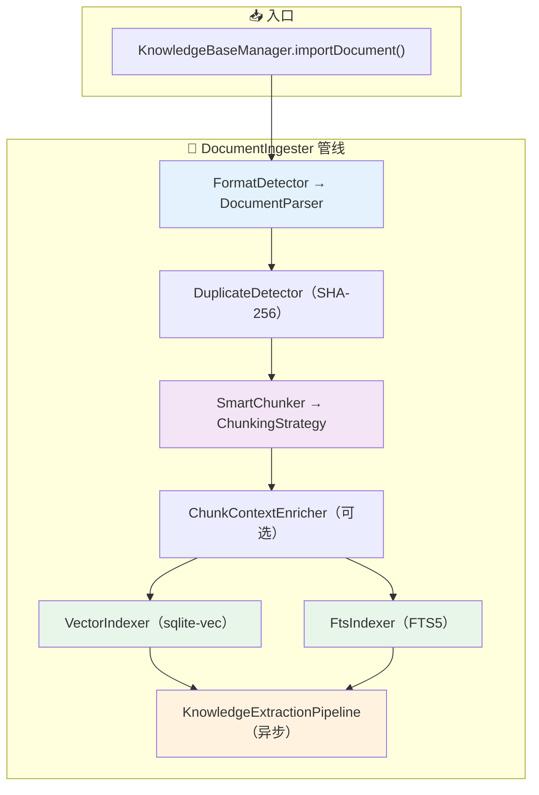
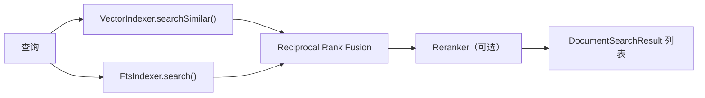

# Design Document: knowledge-base-completion

## Overview

本设计文档描述知识库管理模块（模块 8）的补全实现方案。在已有基础层（数据模型、Repository、MarkdownParser、PlainTextParser、FixedSizeChunker、KnowledgeBaseManager CRUD、Flyway V8）之上，补全以下核心组件：

1. **高级解析器**：PdfParser（Apache PDFBox）、WordParser（Apache POI）
2. **高级分块策略**：RecursiveChunker、HeadingChunker、SmartChunker
3. **分块上下文增强**：ChunkContextEnricher（Anthropic Contextual Retrieval 思路）
4. **双索引服务**：VectorIndexer（sqlite-vec）、FtsIndexer（FTS5）
5. **文档导入管线**：DocumentIngester（编排解析→分块→索引→提取）
6. **重复检测**：DuplicateDetector（SHA-256 内容哈希）
7. **文档混合检索**：DocumentRetriever（向量 + FTS5 + RRF 融合）
8. **可选 Reranker**：LlmReranker / ApiReranker（精排）
9. **知识提取管线**：KnowledgeExtractionPipeline（实体/关系提取 → L3 语义记忆）
10. **配置外部化**：KnowledgeBaseProperties 扩展 + application.yml
11. **Flyway V13**：FTS5 虚拟表 + sqlite-vec 向量表

参考文档：
- 架构设计：`docs/architecture/knowledge-base.md`
- 编码规范：`.kiro/steering/coding-standards.md`
- 集成检查：`.kiro/steering/integration-checklist.md`

## Architecture

### 文档导入管线架构



### 检索架构



### 模块依赖关系

本 spec 新增组件与已有模块的依赖：

| 新增组件 | 依赖的已有模块 | 依赖方式 |
|---------|--------------|---------|
| PdfParser / WordParser | — | 无外部模块依赖，仅依赖 Apache PDFBox / POI |
| RecursiveChunker / HeadingChunker / SmartChunker | FixedSizeChunker | 内部委托 |
| ChunkContextEnricher | LlmRouter | 构造函数注入 |
| VectorIndexer | LlmRouter, JdbcTemplate | 构造函数注入 |
| FtsIndexer | JdbcTemplate | 构造函数注入 |
| DocumentIngester | FormatDetector, SmartChunker, VectorIndexer, FtsIndexer, ChunkContextEnricher, DuplicateDetector, DocumentRepository, DocumentChunkRepository | 构造函数注入 |
| DocumentRetriever | VectorIndexer, FtsIndexer, Reranker(Optional) | 构造函数注入 |
| KnowledgeExtractionPipeline | LlmRouter, SemanticMemory | 构造函数注入 |


### 依赖接口验证

| 接口 | 源码位置 | 验证状态 |
|------|---------|---------|
| DocumentParser (sealed interface: permits MarkdownParser, PlainTextParser) | `com.lifepilot.knowledge.parser.DocumentParser` | ✅ 已核对 — 需扩展 permits 添加 PdfParser, WordParser |
| ChunkingStrategy (sealed interface: permits FixedSizeChunker) | `com.lifepilot.knowledge.chunking.ChunkingStrategy` | ✅ 已核对 — 需扩展 permits 添加 RecursiveChunker, HeadingChunker, SmartChunker |
| DocumentChunk (record: id, documentId, knowledgeBaseId, content, contextPrefix, chunkIndex, startOffset, endOffset, tokenCount, contentHash, headingHierarchy, pageNumber, metadata) | `com.lifepilot.knowledge.chunking.DocumentChunk` | ✅ 已核对 |
| ChunkingConfig (record: maxChunkSize, minChunkSize, overlapSize, maxChunkTokens, respectSentences, respectParagraphs, enableContextPrefix) | `com.lifepilot.knowledge.chunking.ChunkingConfig` | ✅ 已核对 |
| ParseResult (record: text, elements, metadata, warnings) | `com.lifepilot.knowledge.parser.ParseResult` | ✅ 已核对 |
| DocumentMetadata (record: title, author, createdAt, modifiedAt, pageCount, wordCount, language, extraProperties) | `com.lifepilot.knowledge.parser.DocumentMetadata` | ✅ 已核对 |
| DocumentElement (sealed interface: permits Heading, Paragraph, Table, CodeBlock, ListBlock, Image) | `com.lifepilot.knowledge.parser.DocumentElement` | ✅ 已核对 |
| Document (record: id, knowledgeBaseId, fileName, filePath, fileSize, mimeType, contentHash, status, chunkCount, entityCount, errorMessage, lastProcessedStage, metadata, createdAt, updatedAt) | `com.lifepilot.knowledge.model.Document` | ✅ 已核对 |
| DocumentStatus (enum: UPLOADING, PARSING, CHUNKING, INDEXING, EXTRACTING, READY, UPDATING, DELETING, ERROR) | `com.lifepilot.knowledge.model.DocumentStatus` | ✅ 已核对 |
| KnowledgeBase (record: id, name, description, embeddingModel, rerankerModel, chunkingStrategy, chunkingConfig, documentCount, totalChunks, createdAt, updatedAt) | `com.lifepilot.knowledge.model.KnowledgeBase` | ✅ 已核对 |
| FormatDetector (class: detect(Path) → Optional\<DocumentParser\>, 构造函数接受 List\<DocumentParser\>) | `com.lifepilot.knowledge.parser.FormatDetector` | ✅ 已核对 — 需更新 Bean 注册传入新解析器 |
| KnowledgeBaseManager (class: createKnowledgeBase, listKnowledgeBases, updateKnowledgeBase, deleteKnowledgeBase, listDocuments, removeDocument) | `com.lifepilot.knowledge.KnowledgeBaseManager` | ✅ 已核对 |
| DocumentRepository (class: save, findById, findByKnowledgeBaseId, deleteById, updateStatus, updateContentHash, updateChunkCount, updateLastProcessedStage) | `com.lifepilot.knowledge.repository.DocumentRepository` | ✅ 已核对 |
| DocumentChunkRepository (class: saveAll, findByDocumentId, deleteByDocumentId, countByDocumentId) | `com.lifepilot.knowledge.repository.DocumentChunkRepository` | ✅ 已核对 |
| KnowledgeAutoConfiguration (已注册: MarkdownParser, PlainTextParser, FormatDetector, ChunkingConfig, FixedSizeChunker, 三个 Repository, KnowledgeBaseManager) | `com.lifepilot.knowledge.config.KnowledgeAutoConfiguration` | ✅ 已核对 — 需扩展注册新 Bean |
| KnowledgeBaseProperties (record: dataDir, maxFileSize, enabled, chunking{defaultStrategy, fixedSize}) | `com.lifepilot.knowledge.config.KnowledgeBaseProperties` | ✅ 已核对 — 需扩展添加新配置段 |
| LlmRouter.embed(String) → float[] | `com.lifepilot.llm.LlmRouter` | ✅ 已核对 |
| LlmRouter.call(String scene, String prompt, @Nullable String outputSchema) → LlmResponse | `com.lifepilot.llm.LlmRouter` | ✅ 已核对 |
| LlmRouter.callEntity(String scene, String prompt, Class\<T\>) → T | `com.lifepilot.llm.LlmRouter` | ✅ 已核对 |
| SemanticMemory.upsertWithConflictDetection(TemporalEntity, String conversationId) → TemporalEntity | `com.lifepilot.memory.semantic.SemanticMemory` | ✅ 已核对 |
| SemanticMemory.addRelation(TemporalRelation) → void | `com.lifepilot.memory.semantic.SemanticMemory` | ✅ 已核对 |
| TemporalEntity (record: id, type, name, description, properties, version, isCurrent, validFrom, validTo, sourceConversationId, extractionConfidence, importanceScore, accessCount, lastAccessedAt, createdAt, updatedAt) | `com.lifepilot.memory.semantic.TemporalEntity` | ✅ 已核对 |
| TemporalRelation (record: id, sourceEntityId, targetEntityId, relationType, strength, propertiesJson, validFrom, validTo, sourceConversationId, createdAt) | `com.lifepilot.memory.semantic.TemporalRelation` | ✅ 已核对 |

### 跨模块接口变更

| 变更接口 | 所属模块 | 变更内容 | 影响模块 |
|---------|---------|---------|---------|
| DocumentParser | knowledge.parser | 扩展 permits 添加 PdfParser, WordParser | knowledge（内部） |
| ChunkingStrategy | knowledge.chunking | 扩展 permits 添加 RecursiveChunker, HeadingChunker, SmartChunker | knowledge（内部） |
| FormatDetector Bean | knowledge.config | 构造参数从 2 个解析器扩展为 4 个 | knowledge（内部） |
| KnowledgeBaseProperties | knowledge.config | 新增 recursive, heading, smartChunker, vectorIndexer, ftsIndexer, retrieval, reranker, contextEnricher, extraction 配置段 | knowledge（内部） |

## Components and Interfaces

### 1. PdfParser

```java
/**
 * PDF 文档解析器 — 基于 Apache PDFBox 3.x。
 * 逐页提取文本，支持部分解析（单页失败跳过），提取元数据。
 */
public final class PdfParser implements DocumentParser {
    List<String> supportedExtensions();          // → ["pdf"]
    ParseResult parse(Path filePath);            // 全文 + 结构元素 + 元数据
    DocumentMetadata extractMetadata(Path filePath); // 仅元数据
}
```

设计决策：
- 使用 PDFBox 3.x（`Loader.loadPDF()` API），不使用已废弃的 `PDDocument.load()`
- 逐页提取，单页失败记录 warning 继续处理
- 加密 PDF 抛出 `DocumentParseException(Phase.FORMAT_DECODE)`
- 启发式标题检测：编号模式（`1.2 标题`）+ 短行全大写

### 2. WordParser

```java
/**
 * Word/DOCX 文档解析器 — 基于 Apache POI。
 * 按段落提取文本，通过样式识别标题层级，完整提取表格结构。
 */
public final class WordParser implements DocumentParser {
    List<String> supportedExtensions();          // → ["docx"]
    ParseResult parse(Path filePath);
    DocumentMetadata extractMetadata(Path filePath);
}
```

设计决策：
- 仅支持 DOCX（Office 2007+），不支持旧版 .doc
- 通过 `XWPFParagraph.getStyle()` 精确识别 Heading1-6
- 表格提取为 `DocumentElement.Table`（第一行为表头）
- 不支持的格式抛出 `DocumentParseException(Phase.FORMAT_DECODE)`

### 3. RecursiveChunker

```java
/**
 * 递归语义分块器 — 在自然边界处递归切分。
 * 分隔符优先级：段落（\n\n）→ 句子（。！？.!?）→ 词（空格/中文字符边界）
 */
public non-sealed class RecursiveChunker implements ChunkingStrategy {
    RecursiveChunker(ChunkingConfig config, KnowledgeBaseProperties.Recursive recursiveConfig);
    List<DocumentChunk> chunk(String text, Map<String, String> metadata);
    int estimateChunkCount(int textLength);
    String strategyName();  // → "recursive"
}
```

设计决策：
- 分隔符列表从 `KnowledgeBaseProperties.Recursive.separators` 读取，默认 `["\n\n", "\n", "。", "！", "？", ".", "!", "?", " "]`
- 递归逻辑：尝试当前分隔符切分 → 子块超过 maxChunkSize 则用下一级分隔符继续切分
- 重叠通过回溯前一个分块的尾部 `overlapSize` 字符实现

### 4. HeadingChunker

```java
/**
 * 标题层级分块器 — 按文档标题结构切分。
 * 每个标题节作为一个分块，超长节委托 RecursiveChunker 二次切分。
 */
public non-sealed class HeadingChunker implements ChunkingStrategy {
    HeadingChunker(ChunkingConfig config, RecursiveChunker fallbackChunker,
                   KnowledgeBaseProperties.Heading headingConfig);
    List<DocumentChunk> chunk(String text, Map<String, String> metadata);
    int estimateChunkCount(int textLength);
    String strategyName();  // → "heading"
}
```

设计决策：
- 通过正则 `^#{1,N}\s+(.+)$` 识别 ATX 标题（N = maxHeadingLevel，默认 3）
- 每个分块的 `headingHierarchy` 填充祖先标题路径
- 无标题文档整体委托 RecursiveChunker
- 超长节（> maxChunkSize）委托 RecursiveChunker 二次切分

### 5. SmartChunker

```java
/**
 * 智能策略选择器 — 分析文档特征自动选择最佳分块策略。
 */
public non-sealed class SmartChunker implements ChunkingStrategy {
    SmartChunker(FixedSizeChunker fixedSizeChunker, RecursiveChunker recursiveChunker,
                 HeadingChunker headingChunker, KnowledgeBaseProperties.SmartChunker smartConfig);
    ChunkingStrategy selectStrategy(String text, Map<String, String> metadata);
    List<DocumentChunk> chunk(String text, Map<String, String> metadata);
    int estimateChunkCount(int textLength);
    String strategyName();  // → "smart"
}
```

选择逻辑：
1. 计算标题密度 = 标题数 / 总段落数
2. 标题密度 > `headingDensityThreshold`（默认 0.1）→ HeadingChunker
3. 文本长度 > `shortDocumentThreshold`（默认 2000 字符）→ RecursiveChunker
4. 否则 → FixedSizeChunker

### 6. ChunkContextEnricher

```java
/**
 * 分块上下文增强器 — 为每个分块生成文档级上下文前缀。
 * 基于 Anthropic Contextual Retrieval 思路，提升检索召回率。
 */
public class ChunkContextEnricher {
    ChunkContextEnricher(LlmRouter llmRouter, KnowledgeBaseProperties.ContextEnricher config);
    List<DocumentChunk> enrich(List<DocumentChunk> chunks, String documentSummary);
}
```

设计决策：
- 通过 `LlmRouter.call("knowledge_extraction", prompt, null)` 生成上下文前缀
- 前缀长度限制在 `maxPrefixTokens`（默认 100）Token
- LLM 不可用时跳过增强，返回原始分块（graceful degradation）
- 批量处理：每次 LLM 调用处理一个分块（避免上下文窗口溢出）

### 7. VectorIndexer

```java
/**
 * 向量索引服务 — 批量向量化分块并存入 sqlite-vec。
 */
public class VectorIndexer {
    VectorIndexer(LlmRouter llmRouter, JdbcTemplate jdbcTemplate,
                  KnowledgeBaseProperties.VectorIndexer config);
    IndexingResult indexChunks(List<DocumentChunk> chunks);
    void removeChunkEmbeddings(List<String> chunkIds);
    void removeByDocumentId(String documentId);
    List<DocumentSearchResult> searchSimilar(String query, List<String> kbIds, int topK);
}
```

设计决策：
- 批量处理：每批 `batchSize`（默认 32）个分块调用 `LlmRouter.embed()`
- 使用 `DocumentChunk.embeddingText()` 作为 Embedding 输入（含 contextPrefix）
- 失败重试：指数退避，最多 `maxRetries`（默认 2）次
- sqlite-vec 表 `chunk_embeddings` 通过 Flyway V13 创建

### 8. FtsIndexer

```java
/**
 * FTS5 全文索引服务 — 构建和维护 SQLite FTS5 全文索引。
 */
public class FtsIndexer {
    FtsIndexer(JdbcTemplate jdbcTemplate);
    void indexChunks(List<DocumentChunk> chunks);
    void removeByDocumentId(String documentId);
    List<DocumentSearchResult> search(String query, List<String> kbIds, int topK);
}
```

设计决策：
- FTS5 虚拟表 `document_chunks_fts` 通过 Flyway V13 创建
- 使用 `content=document_chunks, content_rowid=rowid` 外部内容表模式
- 搜索使用 BM25 排序：`SELECT ... FROM document_chunks_fts WHERE document_chunks_fts MATCH ? ORDER BY rank`

### 9. DocumentIngester

```java
/**
 * 文档导入管线编排器 — 协调解析→分块→索引→提取的完整流程。
 */
public class DocumentIngester {
    DocumentIngester(FormatDetector formatDetector, SmartChunker smartChunker,
                     ChunkContextEnricher contextEnricher, VectorIndexer vectorIndexer,
                     FtsIndexer ftsIndexer, DuplicateDetector duplicateDetector,
                     KnowledgeExtractionPipeline extractionPipeline,
                     DocumentRepository docRepository, DocumentChunkRepository chunkRepository,
                     KnowledgeBaseProperties props);
    CompletableFuture<Document> ingest(String kbId, Path filePath);
    CompletableFuture<Document> resume(String documentId);
}
```

管线阶段：
1. **PARSING**：FormatDetector → DocumentParser.parse()
2. **重复检测**：DuplicateDetector.check()
3. **CHUNKING**：SmartChunker.chunk() → ChunkContextEnricher.enrich()（可选）
4. **INDEXING**：VectorIndexer.indexChunks() ‖ FtsIndexer.indexChunks()（并行）
5. **EXTRACTING**：KnowledgeExtractionPipeline.extract()（异步，可降级跳过）

设计决策：
- 使用 `CompletableFuture.supplyAsync(..., Executors.newVirtualThreadPerTaskExecutor())` 异步执行
- 每个阶段转换前更新 `Document.status` 和 `Document.lastProcessedStage`
- 失败时设置 `Document.status = ERROR`，记录 `errorMessage` 和 `lastProcessedStage`
- `resume()` 从 `lastProcessedStage` 恢复执行
- 发布 `IngestionProgress` 事件（通过 `ApplicationEventPublisher`）

### 10. DuplicateDetector

```java
/**
 * 重复文档检测器 — 基于 SHA-256 内容哈希。
 */
public class DuplicateDetector {
    DuplicateDetector(DocumentRepository docRepository);
    DuplicateCheckResult check(String kbId, Path filePath);
}
```

```java
public record DuplicateCheckResult(
    boolean isDuplicate,
    String contentHash,
    Optional<String> existingDocumentId
) {}
```

### 11. DocumentRetriever

```java
/**
 * 文档混合检索服务 — 向量 + FTS5 + RRF 融合 + 可选 Reranker。
 */
public class DocumentRetriever {
    DocumentRetriever(VectorIndexer vectorIndexer, FtsIndexer ftsIndexer,
                      Optional<Reranker> reranker, KnowledgeBaseProperties.Retrieval config);
    List<DocumentSearchResult> retrieve(String query, List<String> kbIds, int topK);
}
```

RRF 融合算法：
```
score(d) = Σ 1 / (k + rank_i(d))
```
其中 `k` = 60（标准 RRF 常数），`rank_i(d)` 为文档 d 在第 i 个检索路径中的排名。

### 12. Reranker

```java
/**
 * 精排接口 — 对初步检索结果进行二次排序。
 */
public sealed interface Reranker permits LlmReranker, ApiReranker {
    List<DocumentSearchResult> rerank(String query, List<DocumentSearchResult> candidates, int topK);
}

public final class LlmReranker implements Reranker { ... }
public final class ApiReranker implements Reranker { ... }
```

### 13. KnowledgeExtractionPipeline

```java
/**
 * 知识提取管线 — 从分块中提取实体和关系写入 L3 语义记忆。
 */
public class KnowledgeExtractionPipeline {
    KnowledgeExtractionPipeline(LlmRouter llmRouter, SemanticMemory semanticMemory,
                                 KnowledgeBaseProperties.Extraction config);
    ExtractionResult extract(List<DocumentChunk> chunks, String documentId);
}
```

```java
public record ExtractionResult(int entityCount, int relationCount, List<String> warnings) {}
```

设计决策：
- 使用 `LlmRouter.callEntity("knowledge_extraction", prompt, ExtractionResponse.class)` 结构化输出
- 提取的实体通过 `SemanticMemory.upsertWithConflictDetection()` 写入，自动处理冲突
- 提取的关系通过 `SemanticMemory.addRelation()` 写入
- LLM 不可用时返回 `ExtractionResult(0, 0, ["LLM 不可用，跳过知识提取"])`

### 14. 新增 record 类型

```java
/** 索引结果。 */
public record IndexingResult(int vectorCount, int ftsCount, long durationMs) {}

/** 文档检索结果。 */
public record DocumentSearchResult(
    String chunkId,
    String documentId,
    String knowledgeBaseId,
    String content,
    Optional<String> contextPrefix,
    List<String> headingHierarchy,
    double score,
    String sourcePath,    // "vector" | "fts" | "fused"
    Map<String, String> metadata
) {}

/** 导入进度事件。 */
public record IngestionProgress(
    String documentId,
    String knowledgeBaseId,
    DocumentStatus stage,
    int progressPercent,
    Optional<String> message
) {}
```

## Data Models

### 已有数据模型（无变更）

以下 record 和 enum 已在 V8 基础层实现，本 spec 直接复用，不做修改：

- `Document` — 文档记录（id, knowledgeBaseId, fileName, filePath, fileSize, mimeType, contentHash, status, chunkCount, entityCount, errorMessage, lastProcessedStage, metadata, createdAt, updatedAt）
- `DocumentStatus` — 文档状态枚举（UPLOADING → PARSING → CHUNKING → INDEXING → EXTRACTING → READY / ERROR / UPDATING / DELETING）
- `KnowledgeBase` — 知识库记录
- `DocumentChunk` — 文档分块记录（含 contextPrefix、headingHierarchy、embeddingText() 方法）
- `ChunkingConfig` — 分块配置
- `ParseResult` — 解析结果
- `DocumentMetadata` — 文档元数据
- `DocumentElement` — 文档结构元素 sealed interface

### Flyway V13 迁移 — 新增表

```sql
-- V13__create_knowledge_search_tables.sql

-- FTS5 全文索引虚拟表（外部内容表模式，关联 document_chunks）
CREATE VIRTUAL TABLE IF NOT EXISTS document_chunks_fts USING fts5(
    content,
    knowledge_base_id UNINDEXED,
    document_id UNINDEXED,
    chunk_id UNINDEXED,
    content=document_chunks,
    content_rowid=rowid
);

-- 触发器：document_chunks 插入时同步 FTS5
CREATE TRIGGER IF NOT EXISTS document_chunks_ai AFTER INSERT ON document_chunks BEGIN
    INSERT INTO document_chunks_fts(rowid, content, knowledge_base_id, document_id, chunk_id)
    VALUES (new.rowid, new.content, new.knowledge_base_id, new.document_id, new.id);
END;

-- 触发器：document_chunks 删除时同步 FTS5
CREATE TRIGGER IF NOT EXISTS document_chunks_ad AFTER DELETE ON document_chunks BEGIN
    INSERT INTO document_chunks_fts(document_chunks_fts, rowid, content, knowledge_base_id, document_id, chunk_id)
    VALUES ('delete', old.rowid, old.content, old.knowledge_base_id, old.document_id, old.id);
END;

-- sqlite-vec 向量索引虚拟表
-- 注意：维度需与 Embedding 模型匹配，默认 1536（OpenAI text-embedding-3-small）
-- 实际维度在运行时通过配置确定，此处使用占位维度
CREATE VIRTUAL TABLE IF NOT EXISTS chunk_embeddings USING vec0(
    chunk_id TEXT PRIMARY KEY,
    embedding float[1536]
);
```

说明：
- FTS5 使用外部内容表模式（`content=document_chunks`），避免数据重复存储
- 通过触发器自动同步 FTS5 索引与 document_chunks 表
- `chunk_embeddings` 使用 sqlite-vec 的 `vec0` 虚拟表，向量维度默认 1536
- 迁移脚本版本号 V13，紧接已有 V12（gateway 表）

### KnowledgeBaseProperties 扩展

```java
@ConfigurationProperties(prefix = "lifepilot.knowledge")
public record KnowledgeBaseProperties(
    String dataDir,
    long maxFileSize,
    boolean enabled,
    Chunking chunking,
    VectorIndexer vectorIndexer,
    Retrieval retrieval,
    ContextEnricher contextEnricher,
    Extraction extraction,
    Reranker reranker
) {
    // 分块配置（扩展已有）
    public record Chunking(
        String defaultStrategy,
        FixedSize fixedSize,
        Recursive recursive,
        Heading heading,
        SmartChunker smartChunker
    ) {
        public record FixedSize(int chunkSize, int minChunkSize, int overlapSize,
                                int maxChunkTokens, boolean respectSentences) { ... }
        public record Recursive(List<String> separators, int maxChunkSize,
                                int minChunkSize, int overlapSize) { ... }
        public record Heading(int maxHeadingLevel, int maxChunkSize) { ... }
        public record SmartChunker(double headingDensityThreshold,
                                   int shortDocumentThreshold) { ... }
    }

    // 向量索引配置
    public record VectorIndexer(int batchSize, int maxRetries, int embeddingDimension) { ... }

    // 检索配置
    public record Retrieval(int defaultTopK, double vectorWeight, double ftsWeight,
                            int rrfK) { ... }

    // 上下文增强配置
    public record ContextEnricher(boolean enabled, int maxPrefixTokens) { ... }

    // 知识提取配置
    public record Extraction(boolean enabled, int batchSize) { ... }

    // Reranker 配置
    public record Reranker(boolean enabled, String type, String model, int topK) { ... }
}
```

### application.yml 新增配置

```yaml
lifepilot:
  knowledge:
    # ... 已有配置保持不变 ...
    chunking:
      # ... 已有 fixed-size 配置 ...
      recursive:
        separators: ["\n\n", "\n", "。", "！", "？", ".", "!", "?", " "]
        max-chunk-size: 1024
        min-chunk-size: 100
        overlap-size: 128
      heading:
        max-heading-level: 3
        max-chunk-size: 2048
      smart-chunker:
        heading-density-threshold: 0.1
        short-document-threshold: 2000
    vector-indexer:
      batch-size: 32
      max-retries: 2
      embedding-dimension: 1536
    retrieval:
      default-top-k: 10
      vector-weight: 0.6
      fts-weight: 0.4
      rrf-k: 60
    context-enricher:
      enabled: true
      max-prefix-tokens: 100
    extraction:
      enabled: true
      batch-size: 5
    reranker:
      enabled: false
      type: llm
      model: ""
      top-k: 5
```

## Correctness Properties

*A property is a characteristic or behavior that should hold true across all valid executions of a system — essentially, a formal statement about what the system should do. Properties serve as the bridge between human-readable specifications and machine-verifiable correctness guarantees.*

### Property 1: 分块大小不变量

*For any* valid text input and any valid ChunkingConfig, every chunk produced by RecursiveChunker shall have content length between `minChunkSize` and `maxChunkSize` characters (with the possible exception of the last chunk if the remaining text is shorter than minChunkSize).

**Validates: Requirements 3.2**

### Property 2: 分块覆盖性

*For any* valid text input, the chunks produced by RecursiveChunker, when concatenated (accounting for overlaps), shall cover the entire original text — no content is lost during chunking.

**Validates: Requirements 3.6**

### Property 3: 连续分块重叠

*For any* valid text input producing more than one chunk, consecutive chunks from RecursiveChunker shall share exactly `overlapSize` characters at their boundary (the tail of chunk N overlaps with the head of chunk N+1).

**Validates: Requirements 3.4**

### Property 4: 标题边界分块

*For any* text containing Markdown headings (levels 1 through maxHeadingLevel), HeadingChunker shall produce chunks where each chunk boundary aligns with a heading position — no chunk shall contain a heading in its interior (except when the heading section exceeds maxChunkSize and is further split).

**Validates: Requirements 4.1**

### Property 5: 标题层级面包屑

*For any* chunk produced by HeadingChunker from text with headings, the chunk's `headingHierarchy` list shall contain the ancestor heading path from the root to the current section, ordered from outermost to innermost heading level.

**Validates: Requirements 4.2**

### Property 6: 智能策略选择

*For any* document text and metadata, SmartChunker.selectStrategy() shall return HeadingChunker when heading density exceeds `headingDensityThreshold`, RecursiveChunker when heading density is below threshold and text length exceeds `shortDocumentThreshold`, and FixedSizeChunker otherwise.

**Validates: Requirements 5.2, 5.3, 5.4**

### Property 7: 上下文前缀设置

*For any* list of DocumentChunks, when `enableContextPrefix` is true and LlmRouter is available, ChunkContextEnricher shall produce chunks where every chunk has a non-empty `contextPrefix`.

**Validates: Requirements 6.1**

### Property 8: embeddingText 拼接

*For any* DocumentChunk, `embeddingText()` shall return `contextPrefix + "\n\n" + content` when contextPrefix is present, and `content` when contextPrefix is empty.

**Validates: Requirements 6.5**

### Property 9: 向量索引完整性

*For any* list of N DocumentChunks, after VectorIndexer.indexChunks() completes successfully, the chunk_embeddings table shall contain exactly N new entries (one per chunk), and LlmRouter.embed() shall have been called `ceil(N / batchSize)` times.

**Validates: Requirements 7.1, 7.2**

### Property 10: 索引删除完整性

*For any* document with associated chunks, after calling VectorIndexer.removeByDocumentId() and FtsIndexer.removeByDocumentId(), no embeddings or FTS entries for that document's chunks shall remain in the database.

**Validates: Requirements 7.3, 8.2**

### Property 11: FTS 索引往返

*For any* list of DocumentChunks indexed via FtsIndexer.indexChunks(), a full-text search for a unique substring present in one of the chunks shall return that chunk in the results.

**Validates: Requirements 8.1**

### Property 12: 文档状态生命周期

*For any* document ingestion, the document shall reach status READY on successful completion, or status ERROR with a non-empty `lastProcessedStage` and `errorMessage` on failure at any pipeline stage.

**Validates: Requirements 9.3, 9.4**

### Property 13: 导入进度事件

*For any* successful document ingestion, the DocumentIngester shall publish IngestionProgress events for each stage transition (PARSING, CHUNKING, INDEXING, EXTRACTING, READY), totaling at least 5 events.

**Validates: Requirements 9.10**

### Property 14: SHA-256 哈希确定性

*For any* file, DuplicateDetector.check() shall compute a SHA-256 content hash that is deterministic — calling check() twice on the same file content produces the same hash.

**Validates: Requirements 10.1**

### Property 15: 重复检测作用域

*For any* two files with identical content, DuplicateDetector shall report duplicate when both are in the same knowledge base, and shall allow ingestion when they are in different knowledge bases.

**Validates: Requirements 10.2, 10.3**

### Property 16: RRF 融合正确性

*For any* two ranked result lists (from vector search and FTS search), DocumentRetriever's RRF fusion shall produce scores following the formula `score(d) = Σ 1/(k + rank_i(d))` where k is the configured RRF constant, and the final list shall be sorted by descending fused score.

**Validates: Requirements 11.2**

## Error Handling

### 分层错误处理策略

| 层级 | 组件 | 错误类型 | 处理策略 |
|------|------|---------|---------|
| 解析层 | PdfParser, WordParser | 文件读取失败 | 抛出 `DocumentParseException(Phase.FILE_READ)` |
| 解析层 | PdfParser | 加密/损坏 PDF | 抛出 `DocumentParseException(Phase.FORMAT_DECODE)` |
| 解析层 | PdfParser | 单页解析失败 | 跳过该页，记录 warning，继续处理 |
| 解析层 | WordParser | 旧版 .doc 格式 | 抛出 `DocumentParseException(Phase.FORMAT_DECODE)` |
| 分块层 | RecursiveChunker | 空文本输入 | 返回空列表 `List.of()` |
| 增强层 | ChunkContextEnricher | LLM 不可用 | 跳过增强，返回原始分块（graceful degradation） |
| 索引层 | VectorIndexer | Embedding API 失败 | 指数退避重试（500ms → 1s → 2s），最多 2 次，然后传播异常 |
| 索引层 | FtsIndexer | SQL 执行失败 | 直接传播异常，由 DocumentIngester 捕获 |
| 管线层 | DocumentIngester | 任意阶段失败 | 设置 `Document.status = ERROR`，记录 `lastProcessedStage` 和 `errorMessage` |
| 管线层 | DocumentIngester | 重复文档 | 设置 `Document.status = ERROR`，`errorMessage = "重复文档"` |
| 提取层 | KnowledgeExtractionPipeline | LLM 不可用 | 跳过提取，文档仍标记为 READY（entityCount = 0） |
| 检索层 | DocumentRetriever | Reranker 不可用 | 跳过精排，返回 RRF 融合结果（graceful degradation） |

### 关键降级路径

```
LLM 不可用时的降级链：
1. ChunkContextEnricher → 跳过上下文前缀，使用原始内容 Embedding
2. VectorIndexer → 重试 2 次后失败，管线中断，文档状态 ERROR
3. KnowledgeExtractionPipeline → 跳过知识提取，文档仍可检索
4. Reranker → 跳过精排，返回 RRF 融合结果
```

### 异常类型

| 异常 | 包路径 | 用途 |
|------|--------|------|
| `DocumentParseException` | `knowledge.parser` | 已有，文档解析失败 |
| `DuplicateDocumentException` | `knowledge.exception` | 新增，重复文档检测 |
| `IndexingException` | `knowledge.exception` | 新增，索引构建失败 |
| `ExtractionException` | `knowledge.exception` | 新增，知识提取失败 |

## Testing Strategy

### 属性测试库

使用 **jqwik**（Java 属性测试框架）实现属性测试，每个属性测试最少运行 100 次迭代。

Maven 依赖：
```xml
<dependency>
    <groupId>net.jqwik</groupId>
    <artifactId>jqwik</artifactId>
    <version>1.9.2</version>
    <scope>test</scope>
</dependency>
```

### 属性测试计划

每个 Correctness Property 对应一个 jqwik `@Property` 测试方法，标注对应的设计属性编号：

| 属性 | 测试类 | 测试方法 | 生成器 |
|------|--------|---------|--------|
| Property 1: 分块大小不变量 | `RecursiveChunker属性测试` | `分块大小在配置范围内()` | 随机文本（100-10000 字符）+ 随机 ChunkingConfig |
| Property 2: 分块覆盖性 | `RecursiveChunker属性测试` | `分块覆盖原始文本()` | 随机文本 + 固定 ChunkingConfig |
| Property 3: 连续分块重叠 | `RecursiveChunker属性测试` | `连续分块共享重叠区域()` | 随机文本（需产生多个分块） |
| Property 4: 标题边界分块 | `HeadingChunker属性测试` | `分块边界对齐标题位置()` | 随机 Markdown 文本（含随机标题） |
| Property 5: 标题层级面包屑 | `HeadingChunker属性测试` | `分块携带正确标题层级()` | 随机嵌套标题结构 |
| Property 6: 智能策略选择 | `SmartChunker属性测试` | `策略选择匹配文档特征()` | 随机文本 + 随机标题密度 |
| Property 7: 上下文前缀设置 | `ChunkContextEnricher属性测试` | `启用时所有分块获得前缀()` | 随机 DocumentChunk 列表 + Mock LlmRouter |
| Property 8: embeddingText 拼接 | `DocumentChunk属性测试` | `embeddingText正确拼接()` | 随机 content + 随机 contextPrefix |
| Property 9: 向量索引完整性 | `VectorIndexer属性测试` | `索引后嵌入数量匹配分块数()` | 随机 DocumentChunk 列表 + Mock LlmRouter |
| Property 10: 索引删除完整性 | `索引删除属性测试` | `删除后无残留索引条目()` | 随机文档 ID + 预插入的索引数据 |
| Property 11: FTS 索引往返 | `FtsIndexer属性测试` | `索引后可通过全文搜索找回()` | 随机 DocumentChunk + 唯一子串 |
| Property 12: 文档状态生命周期 | `DocumentIngester属性测试` | `成功时READY失败时ERROR()` | Mock 各阶段组件（随机成功/失败） |
| Property 13: 导入进度事件 | `DocumentIngester属性测试` | `每个阶段发布进度事件()` | Mock 组件 + 事件监听器 |
| Property 14: SHA-256 哈希确定性 | `DuplicateDetector属性测试` | `相同内容产生相同哈希()` | 随机字节数组 |
| Property 15: 重复检测作用域 | `DuplicateDetector属性测试` | `同KB重复跨KB允许()` | 随机内容 + 随机 KB ID |
| Property 16: RRF 融合正确性 | `DocumentRetriever属性测试` | `RRF分数遵循公式()` | 随机排名列表对 |

每个属性测试方法必须包含注释标注：
```java
// Feature: knowledge-base-completion, Property 1: 分块大小不变量
@Property(tries = 100)
void 分块大小在配置范围内(@ForAll("randomText") String text, @ForAll("validConfig") ChunkingConfig config) { ... }
```

### 单元测试计划

单元测试覆盖具体示例、边缘情况和集成点：

| 测试类 | 覆盖内容 |
|--------|---------|
| `PdfParser单元测试` | 正常 PDF 解析、加密 PDF 异常、损坏 PDF 异常、空白 PDF 警告、元数据提取、supportedExtensions |
| `WordParser单元测试` | 正常 DOCX 解析、表格提取、标题识别、旧版 .doc 异常、元数据提取、supportedExtensions |
| `RecursiveChunker单元测试` | 空文本、短文本（< minChunkSize）、纯中文文本、纯英文文本、混合语言 |
| `HeadingChunker单元测试` | 无标题文本委托、超长节二次切分、嵌套标题层级 |
| `SmartChunker单元测试` | 各阈值边界值测试 |
| `ChunkContextEnricher单元测试` | LLM 不可用降级、正常增强 |
| `VectorIndexer单元测试` | 批量索引、删除、重试逻辑 |
| `FtsIndexer单元测试` | 索引、删除、BM25 搜索 |
| `DocumentIngester单元测试` | 完整管线成功、各阶段失败、resume 恢复 |
| `DuplicateDetector单元测试` | 同 KB 重复、跨 KB 允许、空文件 |
| `DocumentRetriever单元测试` | RRF 融合计算、Reranker 降级、跨 KB 搜索 |
| `KnowledgeExtractionPipeline单元测试` | 实体提取、关系提取、LLM 不可用降级 |

### 集成测试计划

| 测试类 | 覆盖内容 |
|--------|---------|
| `Knowledge_AutoConfiguration_集成测试` | Spring Context 加载、所有 Bean 注入成功 |
| `DocumentIngester_Pipeline_集成测试` | Markdown 文件端到端导入（解析→分块→FTS 索引→检索） |
| `Flyway_V13_集成测试` | 迁移脚本执行、FTS5 表创建、sqlite-vec 表创建 |

### 测试配置

- 属性测试：jqwik，每个 `@Property` 最少 `tries = 100`
- 单元测试：JUnit 5，Mock LlmRouter / SemanticMemory
- 集成测试：`@SpringBootTest` + 内存 SQLite
- 测试方法名使用中文
- 测试文件（PDF/DOCX）放在 `src/test/resources/knowledge/` 目录
