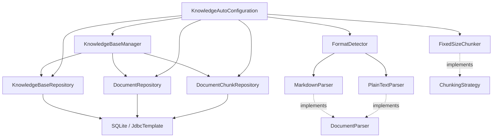

# Design Document — 知识库管理基础层

## Overview

本 spec 实现知识库管理系统的基础层，为后续高级功能（PDF/Word 解析、智能分块、向量索引、知识提取管线等）奠定数据模型、持久化和基础解析能力。

实现范围：
- 数据模型：KnowledgeBase、Document、DocumentChunk record，DocumentStatus 枚举
- 数据库：Flyway V8 迁移脚本（knowledge_bases / documents / document_chunks 三张表 + 索引）
- Repository 层：KnowledgeBaseRepository、DocumentRepository、DocumentChunkRepository（JdbcTemplate + upsert）
- 解析器框架：DocumentParser sealed interface、ParseResult、DocumentMetadata、DocumentElement sealed interface、DocumentParseException
- 解析器实现：MarkdownParser（正则解析标题/代码块/表格/YAML Front Matter）、PlainTextParser（编码检测 + 段落识别）
- 格式检测：FormatDetector（扩展名路由）
- 分块策略：ChunkingStrategy sealed interface、ChunkingConfig record、FixedSizeChunker（固定大小 + 重叠 + 句子边界对齐）
- 管理服务：KnowledgeBaseManager（知识库和文档 CRUD）
- 异常类型：KnowledgeBaseNotFoundException、DocumentNotFoundException、DocumentParseException
- 配置：KnowledgeBaseProperties、KnowledgeAutoConfiguration

不在范围内：PdfParser、WordParser、RecursiveChunker、HeadingChunker、SmartChunker、VectorIndexer、FtsIndexer、KnowledgeExtractionPipeline、DocumentIngester、DocumentRetriever、ChunkContextEnricher、REST API。

参考文档：
- 架构设计：docs/architecture/knowledge-base.md
- 特性设计：docs/features/knowledge-base.md
- 编码规范：.kiro/steering/coding-standards.md

## Architecture

### 包结构

本 spec 涉及的包和类（精简版，仅基础层）：

```
com.lifepilot.knowledge
├── model/                              # 数据模型
│   ├── KnowledgeBase.java                  # 知识库 record
│   ├── Document.java                       # 文档 record
│   ├── DocumentStatus.java                 # 文档状态枚举
│   └── DocumentSource.java                 # 文档来源 sealed interface（预留）
│
├── parser/                             # 文档解析器
│   ├── DocumentParser.java                 # sealed interface（permit MarkdownParser, PlainTextParser）
│   ├── MarkdownParser.java                 # Markdown 解析器
│   ├── PlainTextParser.java                # 纯文本解析器
│   ├── FormatDetector.java                 # 格式检测 + 解析器路由
│   ├── ParseResult.java                    # 解析结果 record
│   ├── DocumentMetadata.java               # 文档元数据 record
│   ├── DocumentElement.java                # 文档结构元素 sealed interface
│   └── DocumentParseException.java         # 解析异常
│
├── chunking/                           # 分块策略
│   ├── ChunkingStrategy.java               # sealed interface（permit FixedSizeChunker）
│   ├── FixedSizeChunker.java               # 固定大小分块器
│   ├── DocumentChunk.java                  # 文档分块 record
│   └── ChunkingConfig.java                 # 分块配置 record
│
├── repository/                         # 数据访问
│   ├── KnowledgeBaseRepository.java        # 知识库 DAO
│   ├── DocumentRepository.java             # 文档 DAO
│   └── DocumentChunkRepository.java        # 分块 DAO
│
├── exception/                          # 异常
│   ├── KnowledgeBaseNotFoundException.java
│   └── DocumentNotFoundException.java
│
├── config/                             # 配置
│   ├── KnowledgeBaseProperties.java        # Spring Boot 配置属性
│   └── KnowledgeAutoConfiguration.java     # 自动配置
│
└── KnowledgeBaseManager.java           # 知识库管理服务
```

### 模块依赖关系



### 设计决策

| 决策 | 选择 | 理由 |
|------|------|------|
| DocumentParser sealed interface 仅 permit 两个实现 | MarkdownParser + PlainTextParser | 本 spec 聚焦基础层，PDF/Word 解析器留给后续 spec 扩展 permits 列表 |
| ChunkingStrategy sealed interface 仅 permit FixedSizeChunker | 最简单的分块策略先行 | RecursiveChunker、HeadingChunker、SmartChunker 依赖更复杂的逻辑，后续 spec 实现 |
| Repository 使用 JdbcTemplate 而非 Spring Data | 与项目其他模块一致 | LifePilot 全局使用 JdbcTemplate + 手写 SQL，保持风格统一 |
| 所有服务通过 @Bean 注册 | 不使用 @Service/@Component | 遵循 LifePilot 自动配置规范，集中在 KnowledgeAutoConfiguration 管理 |
| JSON 序列化使用 Jackson ObjectMapper | Spring Boot 默认集成 | 用于 Map ↔ JSON TEXT 列的转换 |


## Components and Interfaces

### 1. 数据模型（com.lifepilot.knowledge.model）

#### KnowledgeBase record

```java
/**
 * 知识库 — 文档的逻辑分组容器。
 */
public record KnowledgeBase(
        String id,                          // UUID
        String name,
        String description,
        String embeddingModel,
        Optional<String> rerankerModel,
        String chunkingStrategy,            // 默认 "smart"
        Map<String, Object> chunkingConfig, // JSON 序列化存储
        int documentCount,
        int totalChunks,
        Instant createdAt,
        Instant updatedAt
) {
    /** 创建新知识库的工厂方法。 */
    public static KnowledgeBase create(String name, String description,
                                       String embeddingModel) {
        Instant now = Instant.now();
        return new KnowledgeBase(
                UUID.randomUUID().toString(),
                name, description, embeddingModel,
                Optional.empty(), "smart", Map.of(),
                0, 0, now, now);
    }
}
```

#### Document record

```java
/**
 * 文档 — 知识库中的单个文档记录。
 */
public record Document(
        String id,                              // UUID
        String knowledgeBaseId,
        String fileName,
        String filePath,
        long fileSize,
        String mimeType,
        String contentHash,                     // SHA-256
        DocumentStatus status,
        int chunkCount,
        int entityCount,
        Optional<String> errorMessage,
        Optional<String> lastProcessedStage,
        Map<String, String> metadata,           // JSON 序列化存储
        Instant createdAt,
        Instant updatedAt
) {}
```

#### DocumentStatus 枚举

```java
public enum DocumentStatus {
    UPLOADING("上传中"),
    PARSING("解析中"),
    CHUNKING("分块中"),
    INDEXING("索引中"),
    EXTRACTING("提取中"),
    READY("就绪"),
    UPDATING("更新中"),
    DELETING("删除中"),
    ERROR("错误");

    private final String displayName;

    public String displayName() { return displayName; }
    public boolean isTerminal() { return this == READY || this == ERROR; }
    public boolean isRetryable() { return this == ERROR; }
}
```

### 2. 文档解析器框架（com.lifepilot.knowledge.parser）

#### DocumentParser sealed interface

```java
public sealed interface DocumentParser
        permits MarkdownParser, PlainTextParser {

    List<String> supportedExtensions();
    ParseResult parse(Path filePath) throws DocumentParseException;
    DocumentMetadata extractMetadata(Path filePath);

    default boolean canParse(Path filePath) {
        String fileName = filePath.getFileName().toString().toLowerCase();
        return supportedExtensions().stream()
                .anyMatch(ext -> fileName.endsWith("." + ext));
    }
}
```

注意：架构文档中 permits 列表包含 PdfParser 和 WordParser，但本 spec 仅实现 MarkdownParser 和 PlainTextParser。后续 spec 扩展时需修改 permits 列表。

#### DocumentElement sealed interface

```java
public sealed interface DocumentElement
        permits DocumentElement.Heading, DocumentElement.Paragraph,
                DocumentElement.Table, DocumentElement.CodeBlock,
                DocumentElement.ListBlock, DocumentElement.Image {

    int startOffset();
    int endOffset();

    record Heading(int level, String text, int startOffset, int endOffset)
            implements DocumentElement {}
    record Paragraph(String text, int startOffset, int endOffset)
            implements DocumentElement {}
    record Table(List<String> headers, List<List<String>> rows,
                 int startOffset, int endOffset) implements DocumentElement {}
    record CodeBlock(Optional<String> language, String code,
                     int startOffset, int endOffset) implements DocumentElement {}
    record ListBlock(boolean ordered, List<String> items,
                     int startOffset, int endOffset) implements DocumentElement {}
    record Image(Optional<String> altText, Optional<String> caption,
                 int startOffset, int endOffset) implements DocumentElement {}
}
```

#### ParseResult record

```java
public record ParseResult(
        String text,
        List<DocumentElement> elements,
        DocumentMetadata metadata,
        List<String> warnings
) {
    public boolean isEmpty() { return text == null || text.isBlank(); }

    /** 估算 Token 数量：中文按字符数，英文按空格分词。 */
    public int estimateTokenCount() {
        if (isEmpty()) return 0;
        long chineseChars = text.chars()
                .filter(c -> Character.UnicodeScript.of(c) == Character.UnicodeScript.HAN)
                .count();
        long englishWords = text.split("\\s+").length - chineseChars;
        return (int) (chineseChars + Math.max(0, englishWords));
    }
}
```

#### DocumentMetadata record

```java
public record DocumentMetadata(
        Optional<String> title,
        Optional<String> author,
        Optional<Instant> createdAt,
        Optional<Instant> modifiedAt,
        int pageCount,
        long wordCount,
        Optional<String> language,
        Map<String, String> extraProperties
) {
    public static DocumentMetadata empty() { /* 全空默认值 */ }
    public static DocumentMetadata fromFile(Path filePath, long wordCount) { /* 文件名作标题 */ }
}
```

#### DocumentParseException

```java
public class DocumentParseException extends RuntimeException {
    public enum Phase { FILE_READ, FORMAT_DECODE, TEXT_EXTRACTION, METADATA_EXTRACTION }

    private final Phase phase;
    private final String filePath;

    // 两个构造器：(message, phase, filePath) 和 (message, phase, filePath, cause)
    public Phase getPhase() { return phase; }
    public String getFilePath() { return filePath; }
}
```

### 3. MarkdownParser 实现要点

- 支持扩展名：md, markdown, mkd
- 使用 `Files.readString(filePath, UTF_8)` 读取
- 正则模式：
  - ATX 标题：`^(#{1,6})\s+(.+)$` (MULTILINE)
  - 围栏代码块：`` ```(\w*)\n([\s\S]*?)``` `` (MULTILINE)
  - GFM 表格：`(\|.+\|\n)(\|[-: ]+\|\n)((?:\|.+\|\n)*)` (MULTILINE)
  - YAML Front Matter：`^---\n([\s\S]*?)\n---\n` (MULTILINE)
- YAML Front Matter 解析：简单 key: value 逐行解析（不引入 YAML 库）
- 元数据优先级：Front Matter title > 第一个标题
- 所有 DocumentElement 按 startOffset 升序排列
- 文件读取失败抛出 `DocumentParseException(Phase.FILE_READ)`

### 4. PlainTextParser 实现要点

- 支持扩展名：txt, text, log, csv, tsv
- 编码检测顺序：UTF-8 BOM → UTF-8（无替换字符 \uFFFD）→ GBK → ISO-8859-1 兜底
- 行尾规范化：`\r\n` 和 `\r` 统一为 `\n`
- 段落识别：按 `\n\s*\n`（空行）分隔
- 元数据：文件名作标题，估算字数
- 文件读取失败抛出 `DocumentParseException(Phase.FILE_READ)`
- 返回的 ParseResult.warnings 为空列表

### 5. FormatDetector

```java
public class FormatDetector {
    private final List<DocumentParser> parsers;

    public FormatDetector(List<DocumentParser> parsers) {
        this.parsers = List.copyOf(parsers);
    }

    /** 根据文件扩展名查找匹配的解析器。 */
    public Optional<DocumentParser> detect(Path filePath) {
        return parsers.stream()
                .filter(p -> p.canParse(filePath))
                .findFirst();
    }

    /** 返回所有支持的扩展名。 */
    public List<String> supportedExtensions() {
        return parsers.stream()
                .flatMap(p -> p.supportedExtensions().stream())
                .toList();
    }
}
```

### 6. 分块策略（com.lifepilot.knowledge.chunking）

#### ChunkingStrategy sealed interface

```java
public sealed interface ChunkingStrategy
        permits FixedSizeChunker {

    List<DocumentChunk> chunk(String text, Map<String, String> metadata);
    int estimateChunkCount(int textLength);
    String strategyName();
}
```

注意：后续 spec 扩展 permits 列表添加 RecursiveChunker、HeadingChunker、SmartChunker。

#### ChunkingConfig record

```java
public record ChunkingConfig(
        int maxChunkSize,
        int minChunkSize,
        int overlapSize,
        int maxChunkTokens,
        boolean respectSentences,
        boolean respectParagraphs,
        boolean enableContextPrefix
) {
    public static final ChunkingConfig DEFAULT = new ChunkingConfig(1024, 100, 128, 512, true, true, true);
    public static final ChunkingConfig SMALL = new ChunkingConfig(512, 50, 64, 256, true, true, true);
    public static final ChunkingConfig LARGE = new ChunkingConfig(2048, 200, 256, 1024, true, true, true);

    public ChunkingConfig {
        if (maxChunkSize <= 0) throw new IllegalArgumentException("最大分块大小必须为正数: " + maxChunkSize);
        if (minChunkSize < 0 || minChunkSize >= maxChunkSize)
            throw new IllegalArgumentException("最小分块大小必须在 [0, maxChunkSize) 范围内");
        if (overlapSize < 0 || overlapSize >= maxChunkSize)
            throw new IllegalArgumentException("重叠大小必须在 [0, maxChunkSize) 范围内");
    }
}
```

#### DocumentChunk record

```java
public record DocumentChunk(
        String id,                          // UUID
        String documentId,
        String knowledgeBaseId,
        String content,
        Optional<String> contextPrefix,
        int chunkIndex,
        int startOffset,
        int endOffset,
        int tokenCount,
        String contentHash,                 // SHA-256
        List<String> headingHierarchy,
        int pageNumber,
        Map<String, String> metadata
) {
    public String embeddingText() {
        return contextPrefix.map(prefix -> prefix + "\n\n" + content).orElse(content);
    }
    public String breadcrumb() { return String.join(" > ", headingHierarchy); }
    public int contentLength() { return content.length(); }
}
```

#### FixedSizeChunker 算法伪代码

```
function chunk(text, metadata):
    if text is null or blank: return []
    
    chunks = []
    position = 0
    chunkIndex = 0
    
    while position < text.length:
        end = min(position + maxChunkSize, text.length)
        
        // 句子边界对齐
        if end < text.length AND respectSentences:
            sentenceEnd = findNearestSentenceEnd(text, position, end)
            if sentenceEnd > position + minChunkSize:
                end = sentenceEnd
        
        chunkContent = text.substring(position, end).trim()
        
        if chunkContent is not empty:
            // 最后一个分块太小则与前一个合并
            if chunkContent.length < minChunkSize AND chunks is not empty AND 到达文本末尾:
                lastChunk = chunks.removeLast()
                chunkContent = lastChunk.content + "\n" + chunkContent
                position = lastChunk.startOffset
                chunkIndex--
            
            chunk = DocumentChunk(
                id = UUID.randomUUID(),
                content = chunkContent,
                chunkIndex = chunkIndex,
                startOffset = position,
                endOffset = end,
                tokenCount = estimateTokens(chunkContent),
                contentHash = SHA256(chunkContent),
                ...
            )
            chunks.add(chunk)
            chunkIndex++
        
        // 下一个分块起始位置（考虑重叠）
        position = end - overlapSize
        if position <= (end - maxChunkSize):
            position = end  // 防止无限循环
    
    return chunks

function findNearestSentenceEnd(text, start, end):
    // 从 end 向前搜索句子结束标点：。！？；.!?\n
    for i from (end-1) downto (start + minChunkSize):
        if text[i] in "。！？；.!?\n":
            return i + 1
    return end  // 未找到，使用原始位置

function estimateTokens(text):
    chineseChars = count(c in text where UnicodeScript == HAN)
    otherChars = text.length - chineseChars
    return chineseChars + otherChars / 4
```

### 7. Repository 层（com.lifepilot.knowledge.repository）

三个 Repository 均使用构造器注入 JdbcTemplate，不使用 @Repository 注解（通过 @Bean 注册）。

#### KnowledgeBaseRepository 方法签名

| 方法 | SQL 语义 |
|------|---------|
| `save(KnowledgeBase)` | INSERT ... ON CONFLICT(id) DO UPDATE |
| `findById(String id)` → `Optional<KnowledgeBase>` | SELECT * WHERE id = ? |
| `findAll()` → `List<KnowledgeBase>` | SELECT * ORDER BY created_at DESC |
| `deleteById(String id)` | DELETE WHERE id = ? |
| `updateDocumentCount(String id, int docCount, int totalChunks)` | UPDATE SET document_count, total_chunks, updated_at |

RowMapper 将 TEXT 列映射为 Instant.parse()，JSON TEXT 列通过 Jackson ObjectMapper 反序列化为 Map。

#### DocumentRepository 方法签名

| 方法 | SQL 语义 |
|------|---------|
| `save(Document)` | INSERT ... ON CONFLICT(id) DO UPDATE |
| `findById(String id)` → `Optional<Document>` | SELECT * WHERE id = ? |
| `findByKnowledgeBaseId(String kbId)` → `List<Document>` | SELECT * WHERE knowledge_base_id = ? |
| `deleteById(String id)` | DELETE WHERE id = ? |
| `updateStatus(String id, DocumentStatus, Optional<String> errorMessage)` | UPDATE SET status, error_message, updated_at |
| `updateContentHash(String id, String contentHash)` | UPDATE SET content_hash, updated_at |
| `updateChunkCount(String id, int chunkCount)` | UPDATE SET chunk_count, updated_at |
| `updateLastProcessedStage(String id, String stage)` | UPDATE SET last_processed_stage, updated_at |

RowMapper 将 status TEXT 列通过 `DocumentStatus.valueOf()` 转换。

#### DocumentChunkRepository 方法签名

| 方法 | SQL 语义 |
|------|---------|
| `saveAll(List<DocumentChunk>)` | 批量 INSERT（使用 JdbcTemplate.batchUpdate） |
| `findByDocumentId(String docId)` → `List<DocumentChunk>` | SELECT * WHERE document_id = ? ORDER BY chunk_index |
| `deleteByDocumentId(String docId)` | DELETE WHERE document_id = ? |
| `countByDocumentId(String docId)` → `int` | SELECT COUNT(*) WHERE document_id = ? |

RowMapper 将 heading_hierarchy_json TEXT 列通过 Jackson 反序列化为 `List<String>`。

### 8. KnowledgeBaseManager 服务

```java
public class KnowledgeBaseManager {
    private final KnowledgeBaseRepository kbRepository;
    private final DocumentRepository docRepository;
    private final DocumentChunkRepository chunkRepository;

    // 知识库 CRUD
    @Transactional createKnowledgeBase(name, description, embeddingModel) → KnowledgeBase
    getKnowledgeBase(id) → Optional<KnowledgeBase>
    listKnowledgeBases() → List<KnowledgeBase>
    @Transactional updateKnowledgeBase(id, name, description) → KnowledgeBase  // null 参数表示不更新
    @Transactional deleteKnowledgeBase(id)  // 级联删除文档和分块

    // 文档管理
    listDocuments(knowledgeBaseId) → List<Document>
    @Transactional removeDocument(documentId)  // 删除文档 + 关联分块
}
```

注意：本 spec 的 KnowledgeBaseManager 不包含 importDocument / retryDocument 等异步导入方法（依赖 DocumentIngester，不在本 spec 范围内）。仅提供基础 CRUD。

updateKnowledgeBase 对不存在的 id 抛出 KnowledgeBaseNotFoundException。
removeDocument 对不存在的 documentId 抛出 DocumentNotFoundException。

### 9. 异常类型（com.lifepilot.knowledge.exception）

```java
public class KnowledgeBaseNotFoundException extends RuntimeException {
    public KnowledgeBaseNotFoundException(String message) { super(message); }
}

public class DocumentNotFoundException extends RuntimeException {
    public DocumentNotFoundException(String message) { super(message); }
}
```

DocumentParseException 定义在 parser 包中（见上文）。

### 10. 配置（com.lifepilot.knowledge.config）

#### KnowledgeBaseProperties

```java
@ConfigurationProperties(prefix = "lifepilot.knowledge")
public record KnowledgeBaseProperties(
        String dataDir,         // 默认 "${user.home}/.lifepilot/data"
        long maxFileSize,       // 默认 104857600 (100MB)
        boolean enabled,        // 默认 true
        Chunking chunking
) {
    public record Chunking(
            String defaultStrategy,     // 默认 "smart"
            FixedSize fixedSize
    ) {
        public record FixedSize(
                int chunkSize,          // 默认 1024
                int minChunkSize,       // 默认 100
                int overlapSize,        // 默认 128
                int maxChunkTokens,     // 默认 512
                boolean respectSentences // 默认 true
        ) {}
    }
}
```

#### KnowledgeAutoConfiguration

```java
@Configuration
@EnableConfigurationProperties(KnowledgeBaseProperties.class)
@ConditionalOnProperty(prefix = "lifepilot.knowledge", name = "enabled",
                       havingValue = "true", matchIfMissing = true)
public class KnowledgeAutoConfiguration {

    @Bean MarkdownParser markdownParser()
    @Bean PlainTextParser plainTextParser()
    @Bean FormatDetector formatDetector(MarkdownParser, PlainTextParser)
    @Bean ChunkingConfig chunkingConfig(KnowledgeBaseProperties props)  // 从配置构建
    @Bean FixedSizeChunker fixedSizeChunker(ChunkingConfig)
    @Bean KnowledgeBaseRepository knowledgeBaseRepository(JdbcTemplate)
    @Bean DocumentRepository documentRepository(JdbcTemplate)
    @Bean DocumentChunkRepository documentChunkRepository(JdbcTemplate)
    @Bean KnowledgeBaseManager knowledgeBaseManager(
            KnowledgeBaseRepository, DocumentRepository, DocumentChunkRepository)
}
```

## Data Models

### 数据库表设计

Flyway 迁移脚本：`V8__create_knowledge_base_tables.sql`

#### knowledge_bases 表

```sql
CREATE TABLE IF NOT EXISTS knowledge_bases (
    id                  TEXT PRIMARY KEY,
    name                TEXT NOT NULL,
    description         TEXT NOT NULL DEFAULT '',
    embedding_model     TEXT NOT NULL,
    reranker_model      TEXT,
    chunking_strategy   TEXT NOT NULL DEFAULT 'smart',
    chunking_config_json TEXT NOT NULL DEFAULT '{}',
    document_count      INTEGER NOT NULL DEFAULT 0,
    total_chunks        INTEGER NOT NULL DEFAULT 0,
    created_at          TEXT NOT NULL,
    updated_at          TEXT NOT NULL
);

CREATE INDEX IF NOT EXISTS idx_knowledge_bases_name ON knowledge_bases(name);
```

#### documents 表

```sql
CREATE TABLE IF NOT EXISTS documents (
    id                   TEXT PRIMARY KEY,
    knowledge_base_id    TEXT NOT NULL,
    file_name            TEXT NOT NULL,
    file_path            TEXT NOT NULL,
    file_size            INTEGER NOT NULL DEFAULT 0,
    mime_type            TEXT NOT NULL DEFAULT '',
    content_hash         TEXT NOT NULL DEFAULT '',
    status               TEXT NOT NULL DEFAULT 'UPLOADING',
    chunk_count          INTEGER NOT NULL DEFAULT 0,
    entity_count         INTEGER NOT NULL DEFAULT 0,
    error_message        TEXT,
    last_processed_stage TEXT,
    metadata_json        TEXT NOT NULL DEFAULT '{}',
    created_at           TEXT NOT NULL,
    updated_at           TEXT NOT NULL,
    FOREIGN KEY (knowledge_base_id) REFERENCES knowledge_bases(id) ON DELETE CASCADE
);

CREATE INDEX IF NOT EXISTS idx_documents_kb_id ON documents(knowledge_base_id);
CREATE INDEX IF NOT EXISTS idx_documents_status ON documents(status);
CREATE INDEX IF NOT EXISTS idx_documents_content_hash ON documents(knowledge_base_id, content_hash);
```

#### document_chunks 表

```sql
CREATE TABLE IF NOT EXISTS document_chunks (
    id                    TEXT PRIMARY KEY,
    document_id           TEXT NOT NULL,
    knowledge_base_id     TEXT NOT NULL,
    content               TEXT NOT NULL,
    context_prefix        TEXT,
    chunk_index           INTEGER NOT NULL DEFAULT 0,
    start_offset          INTEGER NOT NULL DEFAULT 0,
    end_offset            INTEGER NOT NULL DEFAULT 0,
    token_count           INTEGER NOT NULL DEFAULT 0,
    content_hash          TEXT NOT NULL DEFAULT '',
    heading_hierarchy_json TEXT NOT NULL DEFAULT '[]',
    page_number           INTEGER NOT NULL DEFAULT 0,
    metadata_json         TEXT NOT NULL DEFAULT '{}',
    created_at            TEXT NOT NULL,
    FOREIGN KEY (document_id) REFERENCES documents(id) ON DELETE CASCADE,
    FOREIGN KEY (knowledge_base_id) REFERENCES knowledge_bases(id) ON DELETE CASCADE
);

CREATE INDEX IF NOT EXISTS idx_document_chunks_doc_id ON document_chunks(document_id);
CREATE INDEX IF NOT EXISTS idx_document_chunks_kb_id ON document_chunks(knowledge_base_id);
CREATE INDEX IF NOT EXISTS idx_document_chunks_hash ON document_chunks(content_hash);
```

### 数据库规范遵循

- 主键：TEXT 存 UUID
- 时间：TEXT 存 ISO 8601（如 `2025-07-15T10:30:00Z`）
- JSON 列：TEXT + `_json` 后缀（chunking_config_json、metadata_json、heading_hierarchy_json）
- 所有表有 `created_at`，可变表有 `updated_at`（document_chunks 为不可变表，仅 created_at）
- 外键 ON DELETE CASCADE 确保级联删除

### Repository SQL 设计

#### KnowledgeBaseRepository.save() — Upsert

```sql
INSERT INTO knowledge_bases (
    id, name, description, embedding_model, reranker_model,
    chunking_strategy, chunking_config_json,
    document_count, total_chunks, created_at, updated_at
) VALUES (?, ?, ?, ?, ?, ?, ?, ?, ?, ?, ?)
ON CONFLICT(id) DO UPDATE SET
    name = excluded.name,
    description = excluded.description,
    embedding_model = excluded.embedding_model,
    reranker_model = excluded.reranker_model,
    chunking_strategy = excluded.chunking_strategy,
    chunking_config_json = excluded.chunking_config_json,
    document_count = excluded.document_count,
    total_chunks = excluded.total_chunks,
    updated_at = excluded.updated_at
```

#### DocumentRepository.updateStatus()

```sql
UPDATE documents SET status = ?, error_message = ?, updated_at = ? WHERE id = ?
```

#### DocumentChunkRepository.saveAll() — 批量插入

使用 `JdbcTemplate.batchUpdate()` 批量插入，单次事务内完成：

```sql
INSERT INTO document_chunks (
    id, document_id, knowledge_base_id, content, context_prefix,
    chunk_index, start_offset, end_offset, token_count, content_hash,
    heading_hierarchy_json, page_number, metadata_json, created_at
) VALUES (?, ?, ?, ?, ?, ?, ?, ?, ?, ?, ?, ?, ?, ?)
```

### JSON 序列化约定

Repository 层使用 Jackson ObjectMapper 进行 Map ↔ JSON 转换：
- `Map<String, Object>` → `ObjectMapper.writeValueAsString()` → TEXT 列
- TEXT 列 → `ObjectMapper.readValue(json, Map.class)` → `Map<String, Object>`
- 空 Map 序列化为 `"{}"`，null/blank JSON 反序列化为 `Map.of()`
- `List<String>` → `ObjectMapper.writeValueAsString()` → TEXT 列（heading_hierarchy_json）

## Correctness Properties

*A property is a characteristic or behavior that should hold true across all valid executions of a system — essentially, a formal statement about what the system should do. Properties serve as the bridge between human-readable specifications and machine-verifiable correctness guarantees.*

### Property 1: KnowledgeBase.create() 工厂方法默认值

*For any* valid name, description, and embeddingModel strings, calling `KnowledgeBase.create(name, description, embeddingModel)` should produce a KnowledgeBase where: id is a non-null non-empty UUID string, chunkingStrategy equals "smart", documentCount equals 0, totalChunks equals 0, rerankerModel is empty, chunkingConfig is an empty map, and createdAt equals updatedAt.

**Validates: Requirements 1.6**

### Property 2: DocumentChunk 访问器方法正确性

*For any* DocumentChunk with arbitrary content, contextPrefix (present or absent), and headingHierarchy list:
- `embeddingText()` should return `contextPrefix + "\n\n" + content` when contextPrefix is present, or just `content` when absent
- `breadcrumb()` should return headingHierarchy elements joined with " > "
- `contentLength()` should equal `content.length()`

**Validates: Requirements 1.7, 1.8, 1.9**

### Property 3: DocumentStatus 终态和可重试判定

*For any* DocumentStatus enum value, `isTerminal()` should return true if and only if the status is READY or ERROR, and `isRetryable()` should return true if and only if the status is ERROR.

**Validates: Requirements 1.5**

### Property 4: KnowledgeBase Repository 保存/查找 round-trip

*For any* valid KnowledgeBase record, saving it via `save()` and then retrieving it via `findById()` should return an equivalent KnowledgeBase with all fields preserved. Saving the same KnowledgeBase twice (upsert) should not create duplicates — `findAll()` should contain exactly one entry with that id. After `deleteById()`, `findById()` should return empty.

**Validates: Requirements 3.1, 3.2, 3.4**

### Property 5: KnowledgeBase findAll 按 created_at 降序排列

*For any* set of saved KnowledgeBases with distinct createdAt timestamps, `findAll()` should return them in descending order of createdAt.

**Validates: Requirements 3.3**

### Property 6: Document Repository 保存/查找 round-trip

*For any* valid Document record (with an existing knowledgeBaseId), saving it via `save()` and then retrieving it via `findById()` should return an equivalent Document with all fields preserved. After `deleteById()`, `findById()` should return empty.

**Validates: Requirements 3.6, 3.7, 3.9**

### Property 7: Document 字段更新 round-trip

*For any* saved Document, calling `updateStatus()`, `updateContentHash()`, `updateChunkCount()`, or `updateLastProcessedStage()` and then `findById()` should reflect the updated values, and `updated_at` should be updated to a time >= the original updated_at.

**Validates: Requirements 3.10, 3.11, 3.12, 3.13**

### Property 8: DocumentChunk 批量保存/查找 round-trip 及排序

*For any* list of DocumentChunks with the same documentId and distinct chunkIndex values, `saveAll()` followed by `findByDocumentId()` should return all chunks ordered by chunk_index ascending. `countByDocumentId()` should equal the number of saved chunks. After `deleteByDocumentId()`, `findByDocumentId()` should return an empty list and `countByDocumentId()` should return 0.

**Validates: Requirements 3.14, 3.15, 3.16, 3.17**

### Property 9: DocumentParser.canParse 扩展名匹配

*For any* DocumentParser implementation and any file path, `canParse(filePath)` should return true if and only if the file's extension (case-insensitive) is contained in `supportedExtensions()`.

**Validates: Requirements 4.2**

### Property 10: ParseResult.isEmpty 判定

*For any* ParseResult, `isEmpty()` should return true if and only if the text field is null or consists entirely of whitespace characters.

**Validates: Requirements 4.5**

### Property 11: MarkdownParser 文本 round-trip

*For any* valid Markdown file (without YAML Front Matter), parsing the file should produce a ParseResult whose text field equals the original file content.

**Validates: Requirements 5.2, 5.10**

### Property 12: MarkdownParser 结构元素提取

*For any* Markdown file containing ATX headings (# to ######), fenced code blocks, and GFM tables, the MarkdownParser should extract corresponding DocumentElement.Heading (with correct level 1-6 and text), DocumentElement.CodeBlock (with optional language), and DocumentElement.Table (with correct headers and rows) elements.

**Validates: Requirements 5.3, 5.4, 5.5**

### Property 13: MarkdownParser 元素按偏移量排序

*For any* parsed Markdown file, the returned elements list should be sorted in ascending order of startOffset — i.e., for any two consecutive elements e1 and e2, `e1.startOffset() <= e2.startOffset()`.

**Validates: Requirements 5.7**

### Property 14: MarkdownParser 元数据提取

*For any* Markdown file with YAML Front Matter containing title/author/date/lang keys, the parsed DocumentMetadata should contain the corresponding values. *For any* Markdown file without Front Matter title but with at least one heading, the metadata title should equal the first heading's text.

**Validates: Requirements 5.6, 5.8**

### Property 15: PlainTextParser 行尾规范化

*For any* text file content containing `\r\n` or `\r` line endings, the parsed text should only contain `\n` line endings — no `\r` characters should remain.

**Validates: Requirements 6.3**

### Property 16: PlainTextParser 段落识别和元数据

*For any* readable text file with paragraphs separated by blank lines, the parser should extract DocumentElement.Paragraph elements for each non-empty paragraph, populate metadata with the file name as title and a positive word count, and return an empty warnings list.

**Validates: Requirements 6.4, 6.5, 6.7**

### Property 17: FormatDetector 扩展名路由

*For any* file path, the FormatDetector should return MarkdownParser for extensions {md, markdown, mkd}, PlainTextParser for extensions {txt, text, log, csv, tsv}, and Optional.empty() for any other extension.

**Validates: Requirements 7.1, 7.2, 7.3**

### Property 18: ChunkingConfig 验证拒绝非法参数

*For any* ChunkingConfig construction with maxChunkSize <= 0, or minChunkSize < 0 or minChunkSize >= maxChunkSize, or overlapSize < 0 or overlapSize >= maxChunkSize, the compact constructor should throw IllegalArgumentException.

**Validates: Requirements 8.2**

### Property 19: FixedSizeChunker 分块大小边界

*For any* non-empty text and valid ChunkingConfig, every chunk produced by FixedSizeChunker should have content length <= maxChunkSize. Additionally, no chunk (except when it is the only chunk in the list) should have content length < minChunkSize.

**Validates: Requirements 8.4, 8.7**

### Property 20: FixedSizeChunker 分块内容是原文子串

*For any* non-empty text, every chunk produced by FixedSizeChunker should have content that is a substring of the original text (trimmed). No content fabrication.

**Validates: Requirements 8.11**

### Property 21: FixedSizeChunker 非空文本至少产生一个分块

*For any* non-empty, non-blank text, FixedSizeChunker should produce at least one chunk.

**Validates: Requirements 8.10**

### Property 22: FixedSizeChunker 重叠

*For any* text producing at least two chunks with overlapSize > 0, consecutive chunks should have overlapping content — the tail of chunk[i] should share characters with the head of chunk[i+1].

**Validates: Requirements 8.6**

### Property 23: FixedSizeChunker 分块元数据完整性

*For any* chunk produced by FixedSizeChunker, the chunk should have: a non-null non-empty UUID id, a non-empty SHA-256 contentHash (64 hex characters), and a non-negative tokenCount.

**Validates: Requirements 8.8**

### Property 24: KnowledgeBaseManager 创建/获取 round-trip

*For any* valid name, description, and embeddingModel, `createKnowledgeBase()` should return a KnowledgeBase that can be retrieved by `getKnowledgeBase()` with matching fields, and should appear in `listKnowledgeBases()`.

**Validates: Requirements 9.1, 9.2, 9.3**

### Property 25: KnowledgeBaseManager 级联删除

*For any* KnowledgeBase with associated Documents and DocumentChunks, `deleteKnowledgeBase()` should remove the knowledge base, all its documents, and all associated chunks.

**Validates: Requirements 9.6**

### Property 26: KnowledgeBaseManager removeDocument 删除文档和分块

*For any* existing Document with associated DocumentChunks, `removeDocument()` should remove the document record and all its chunks.

**Validates: Requirements 9.8**

## Error Handling

### 异常层次

| 异常类 | 包 | 触发场景 | 处理策略 |
|--------|---|---------|---------|
| `KnowledgeBaseNotFoundException` | exception | getKnowledgeBase/updateKnowledgeBase/deleteKnowledgeBase 传入不存在的 id | 调用方捕获，返回 404 或提示用户 |
| `DocumentNotFoundException` | exception | removeDocument 传入不存在的 documentId | 调用方捕获，返回 404 或提示用户 |
| `DocumentParseException` | parser | 文件读取失败、格式解码失败、文本提取失败、元数据提取失败 | 记录错误日志，更新文档状态为 ERROR |
| `IllegalArgumentException` | JDK | ChunkingConfig 参数非法 | 启动时快速失败，配置错误应在启动阶段暴露 |

### 解析器错误处理

- MarkdownParser：文件不存在或不可读 → `DocumentParseException(Phase.FILE_READ)`
- PlainTextParser：文件不存在或不可读 → `DocumentParseException(Phase.FILE_READ)`
- FormatDetector：不支持的扩展名 → 返回 `Optional.empty()`（不抛异常）

### Repository 错误处理

- JSON 反序列化失败（chunking_config_json / metadata_json / heading_hierarchy_json）→ 返回空 Map/List，记录 WARN 日志
- Instant.parse 失败（created_at / updated_at 格式异常）→ 抛出 DateTimeParseException（不应发生，属于数据损坏）

### 日志规范

遵循 LifePilot 日志规范：
- INFO：知识库创建/删除、文档解析完成、分块完成
- WARN：JSON 反序列化失败、元数据提取失败降级
- ERROR：不可恢复的解析错误
- DEBUG：分块算法细节、SQL 执行

## Testing Strategy

### 测试框架

- 单元测试：JUnit 5
- 属性测试：jqwik（Java 属性测试库）
- 集成测试：@SpringBootTest + 内存 SQLite
- 测试方法名使用中文

### 单元测试覆盖

| 测试类 | 覆盖范围 |
|--------|---------|
| `KnowledgeBaseTest` | KnowledgeBase.create() 工厂方法、record 字段 |
| `DocumentStatusTest` | isTerminal()、isRetryable()、displayName() |
| `DocumentChunkTest` | embeddingText()、breadcrumb()、contentLength() |
| `ChunkingConfigTest` | 参数验证、DEFAULT/SMALL/LARGE 常量 |
| `MarkdownParserTest` | 标题/代码块/表格/Front Matter 解析、文件不存在异常 |
| `PlainTextParserTest` | 编码检测、行尾规范化、段落识别、文件不存在异常 |
| `FormatDetectorTest` | 扩展名路由、不支持的扩展名 |
| `FixedSizeChunkerTest` | 分块大小、重叠、句子边界、空输入、最小分块合并 |
| `ParseResultTest` | isEmpty()、estimateTokenCount() |
| `DocumentParseExceptionTest` | 构造器、Phase 枚举、cause 链 |

### 属性测试覆盖

每个属性测试最少运行 100 次迭代，使用 jqwik 的 `@Property` 注解。

| 属性测试 | 对应 Property | 生成器 |
|---------|--------------|--------|
| `KnowledgeBase_create工厂方法默认值` | Property 1 | 随机字符串 name/description/embeddingModel |
| `DocumentChunk_访问器方法正确性` | Property 2 | 随机 content、Optional contextPrefix、List headingHierarchy |
| `DocumentStatus_终态和可重试判定` | Property 3 | 所有 DocumentStatus 枚举值 |
| `ChunkingConfig_验证拒绝非法参数` | Property 18 | 随机非法参数组合 |
| `FixedSizeChunker_分块大小边界` | Property 19 | 随机文本 + 随机有效 ChunkingConfig |
| `FixedSizeChunker_分块内容是原文子串` | Property 20 | 随机文本 + 随机有效 ChunkingConfig |
| `FixedSizeChunker_非空文本至少一个分块` | Property 21 | 随机非空文本 |
| `FixedSizeChunker_重叠` | Property 22 | 随机长文本 + overlapSize > 0 的 ChunkingConfig |
| `FixedSizeChunker_分块元数据完整性` | Property 23 | 随机文本 |
| `ParseResult_isEmpty判定` | Property 10 | 随机字符串（含 null、空、纯空白） |
| `FormatDetector_扩展名路由` | Property 17 | 随机文件扩展名 |
| `PlainTextParser_行尾规范化` | Property 15 | 随机文本含混合行尾 |

### 集成测试覆盖

| 测试类 | 覆盖范围 |
|--------|---------|
| `KnowledgeBaseRepositoryTest` | Property 4, 5：save/findById/findAll/deleteById round-trip |
| `DocumentRepositoryTest` | Property 6, 7：save/findById/updateStatus/updateContentHash round-trip |
| `DocumentChunkRepositoryTest` | Property 8：saveAll/findByDocumentId/countByDocumentId/deleteByDocumentId |
| `KnowledgeBaseManagerTest` | Property 24, 25, 26：CRUD round-trip、级联删除 |
| `KnowledgeAutoConfigurationTest` | 验证所有 Bean 注册、@ConditionalOnProperty 禁用 |
| `FlywayMigrationTest` | 验证 V8 迁移脚本执行成功、表和索引存在 |

### 属性测试标签格式

每个属性测试必须包含注释引用设计文档中的 Property：

```java
// Feature: knowledge-base, Property 19: FixedSizeChunker 分块大小边界
@Property(tries = 100)
void fixedSizeChunker_分块大小不超过maxChunkSize(@ForAll @StringLength(min = 1, max = 10000) String text) {
    // ...
}
```

### 测试数据策略

- 单元测试：使用固定的测试 Markdown/TXT 文件（放在 `src/test/resources/knowledge/`）
- 属性测试：使用 jqwik 生成器生成随机文本、随机配置参数
- 集成测试：使用内存 SQLite，每个测试方法前清空表数据
- 不依赖外部服务（无 LLM、无网络）
