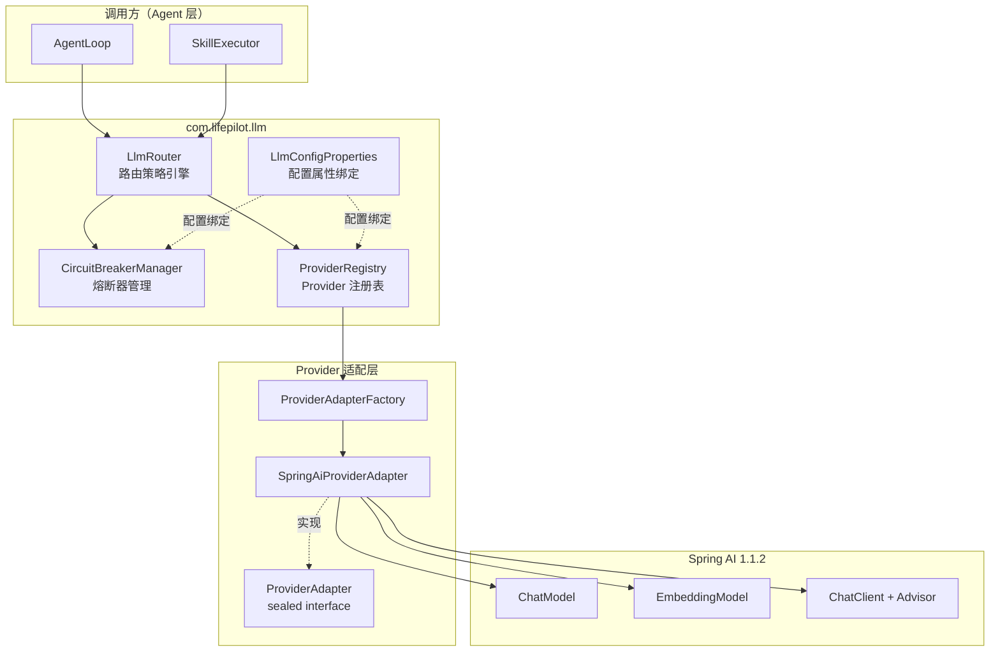
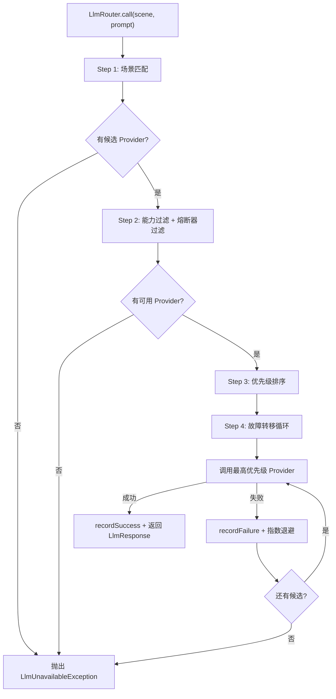

# Design Document — LLM Router

## Overview

本设计文档描述 LLM Router 模块（Phase 1a）的实现方案。LLM Router 是 LifePilot 的多模型路由层，向上为 Agent 层提供统一的 LLM 调用接口，向下通过 Spring AI 1.1.2 适配多种 LLM Provider。

本 spec 聚焦核心路由引擎，不包含语义缓存、Token 预算管理和使用追踪（后续 llm-router-advanced spec）。

参考文档：
- 架构设计：docs/architecture/llm-router.md
- 特性设计：docs/features/llm-router.md
- 编码规范：.kiro/steering/coding-standards.md
- 需求文档：.kiro/specs/llm-router/requirements.md

### 设计范围

本 spec 实现的组件：
- Provider 配置数据模型（ProviderConfig、ProviderType、ProviderCapability）
- 场景常量（LlmScene）
- Provider 注册表（ProviderRegistry）+ 健康检查（ProviderHealthChecker）
- Provider 适配器层（ProviderAdapter sealed interface、SpringAiProviderAdapter、ProviderAdapterFactory）
- 熔断器（CircuitState、CircuitBreaker、CircuitBreakerManager）
- 路由策略引擎（LlmRouter）— 简化版，不含缓存和预算检查
- 统一响应模型（LlmResponse）、异常模型（LlmUnavailableException）
- 指数退避（ExponentialBackoff）
- 配置属性绑定（LlmConfigProperties）、自动配置（LlmAutoConfiguration）
- Flyway 迁移脚本（V2__llm_circuit_breaker_states.sql）
- Maven 依赖配置

### 不包含（留给 llm-router-advanced）

- SemanticCache 语义缓存
- TokenBudgetManager / BudgetDecision 预算管理
- LlmUsageTracker / LlmUsageStat 使用追踪
- LlmOutputParser 输出解析器
- WenxinChatModel 文心一言适配器

---

## Architecture

### 简化后的组件关系

本 spec 实现的核心路由引擎不含缓存和预算层，路由决策流程简化为：

```
场景匹配 → 能力过滤 → 熔断器过滤 → 优先级排序 → 故障转移循环
```



### 路由决策流程（简化版）



---

## Components and Interfaces

### 包结构与文件清单

```
com.lifepilot.llm
├── LlmRouter.java                    // 路由策略引擎（核心入口）
├── LlmScene.java                     // 场景常量
├── LlmResponse.java                  // 统一响应 record
├── LlmUnavailableException.java      // 路由失败异常
├── ExponentialBackoff.java            // 指数退避 record
│
├── config/
│   ├── LlmConfigProperties.java      // @ConfigurationProperties("lifepilot.llm")
│   ├── LlmAutoConfiguration.java     // @AutoConfiguration
│   ├── ProviderConfig.java           // Provider 配置 record
│   ├── ProviderType.java             // Provider 类型枚举
│   └── ProviderCapability.java       // Provider 能力枚举
│
├── registry/
│   ├── ProviderRegistry.java         // Provider 注册表
│   └── ProviderHealthChecker.java    // 健康检查器
│
├── adapter/
│   ├── ProviderAdapter.java          // 适配器 sealed interface
│   ├── ProviderAdapterFactory.java   // 适配器工厂
│   └── SpringAiProviderAdapter.java  // Spring AI 统一适配器
│
└── circuit/
    ├── CircuitBreakerManager.java    // 熔断器管理器
    ├── CircuitBreaker.java           // 熔断器实现
    └── CircuitState.java             // 熔断器状态 sealed interface
```


### 关键接口设计

#### ProviderConfig — Provider 配置 record

```java
/**
 * LLM Provider 配置。
 *
 * @author zsg
 * @since 2025-07-18
 */
public record ProviderConfig(
    String id,
    ProviderType type,
    String apiUrl,
    @Nullable String apiKey,
    String modelName,
    int timeoutSeconds,
    int priority,
    List<String> scenes,
    Set<ProviderCapability> capabilities,
    boolean enabled,
    int costPerInputToken,
    int costPerOutputToken,
    int maxContextWindow,
    @Nullable Integer embeddingDimension,
    boolean supportsStreaming
) {
    /** 紧凑构造器 — 参数校验 + 防御性拷贝。 */
    public ProviderConfig {
        Objects.requireNonNull(id, "Provider ID 不能为空");
        Objects.requireNonNull(type, "Provider 类型不能为空");
        Objects.requireNonNull(apiUrl, "API URL 不能为空");
        Objects.requireNonNull(modelName, "模型名称不能为空");
        if (timeoutSeconds <= 0) timeoutSeconds = 30;
        if (priority < 0) priority = 0;
        scenes = List.copyOf(scenes != null ? scenes : List.of());
        capabilities = capabilities != null
            ? Set.copyOf(capabilities) : Set.of(ProviderCapability.CHAT);
    }

    public boolean isLocal() { return type == ProviderType.OLLAMA; }
    public boolean hasCapability(ProviderCapability cap) { return capabilities.contains(cap); }
    public boolean supportsScene(String scene) { return scenes.contains(scene); }

    /** 估算请求成本（分）。本地模型返回 0。 */
    public int estimateCost(int inputTokens, int outputTokens) {
        if (isLocal()) return 0;
        return (int) ((long) inputTokens * costPerInputToken / 1_000_000
                     + (long) outputTokens * costPerOutputToken / 1_000_000);
    }
}
```

#### ProviderType — Provider 类型枚举

```java
public enum ProviderType {
    OLLAMA("ollama"),
    DEEPSEEK("deepseek"),
    WENXIN("wenxin"),
    QWEN("qwen"),
    GLM("glm"),
    OPENAI_COMPATIBLE("openai-compatible");

    private final String configKey;
    ProviderType(String configKey) { this.configKey = configKey; }
    public String configKey() { return configKey; }

    /** 是否使用 OpenAI 兼容 API。 */
    public boolean isOpenAiCompatible() {
        return switch (this) {
            case DEEPSEEK, QWEN, GLM, OPENAI_COMPATIBLE -> true;
            case OLLAMA, WENXIN -> false;
        };
    }
}
```

#### ProviderCapability — Provider 能力枚举

```java
public enum ProviderCapability {
    CHAT, EMBEDDING, STRUCTURED_OUTPUT, FUNCTION_CALLING, STREAMING, VISION
}
```

#### LlmScene — 场景常量

```java
public final class LlmScene {
    public static final String INTENT_UNDERSTANDING = "intent_understanding";
    public static final String TASK_PLANNING = "task_planning";
    public static final String CHAT = "chat";
    public static final String CODE_GENERATION = "code_generation";
    public static final String KNOWLEDGE_EXTRACTION = "knowledge_extraction";
    public static final String MEMORY_COMPRESSION = "memory_compression";
    public static final String DOCUMENT_SUMMARY = "document_summary";
    public static final String EMBEDDING = "embedding";
    public static final String PROACTIVE_REASONING = "proactive_reasoning";

    private LlmScene() {}

    public static List<String> all() {
        return List.of(INTENT_UNDERSTANDING, TASK_PLANNING, CHAT, CODE_GENERATION,
            KNOWLEDGE_EXTRACTION, MEMORY_COMPRESSION, DOCUMENT_SUMMARY,
            EMBEDDING, PROACTIVE_REASONING);
    }
}
```

#### ProviderAdapter — 适配器 sealed interface

```java
public sealed interface ProviderAdapter permits SpringAiProviderAdapter {
    LlmResponse call(String prompt, @Nullable String outputSchema, Duration timeout);
    <T> T callEntity(String prompt, Class<T> responseType);
    float[] embed(String text);
    Flux<String> stream(String prompt);
    Optional<ChatClient> chatClient();
    boolean healthCheck();
}
```

#### LlmResponse — 统一响应 record

```java
public record LlmResponse(
    String content, int inputTokens, int outputTokens,
    String providerId, String modelName, long latencyMs, boolean cached
) {
    public int totalTokens() { return inputTokens + outputTokens; }

    public static LlmResponse cached(String content, String providerId, String modelName) {
        return new LlmResponse(content, 0, 0, providerId, modelName, 0, true);
    }
}
```

#### LlmUnavailableException — 路由失败异常

```java
public class LlmUnavailableException extends RuntimeException {
    private final String scene;
    private final List<String> attemptedProviders;

    public LlmUnavailableException(String message, String scene,
                                    List<String> attemptedProviders) { ... }
    public LlmUnavailableException(String message, String scene,
                                    List<String> attemptedProviders,
                                    @Nullable Throwable cause) { ... }

    public String scene() { return scene; }
    public List<String> attemptedProviders() { return attemptedProviders; } // List.copyOf
}
```

#### ExponentialBackoff — 指数退避 record

```java
public record ExponentialBackoff(
    long initialDelayMs, double multiplier, long maxDelayMs, int maxRetries
) {
    public static ExponentialBackoff defaults() {
        return new ExponentialBackoff(500, 2.0, 5000, 2);
    }

    public long delayForAttempt(int attempt) {
        if (attempt <= 0) return initialDelayMs;
        return Math.min((long)(initialDelayMs * Math.pow(multiplier, attempt)), maxDelayMs);
    }
}
```

#### CircuitState — 熔断器状态 sealed interface

```java
public sealed interface CircuitState
    permits CircuitState.Closed, CircuitState.Open, CircuitState.HalfOpen {

    record Closed(int consecutiveFailures) implements CircuitState {
        public static Closed initial() { return new Closed(0); }
    }
    record Open(Instant openedAt, int failureCount) implements CircuitState {}
    record HalfOpen(Instant transitionedAt) implements CircuitState {}

    default String stateName() {
        return switch (this) {
            case Closed c -> "CLOSED";
            case Open o -> "OPEN";
            case HalfOpen h -> "HALF_OPEN";
        };
    }
}
```

#### CircuitBreaker — 核心方法签名

```java
public class CircuitBreaker {
    // AtomicReference<CircuitState> 存储状态
    public CircuitBreaker(String key, int failureThreshold,
                          Duration resetTimeout, int halfOpenMaxAttempts);
    public CircuitBreaker(String key, int failureThreshold,
                          Duration resetTimeout, int halfOpenMaxAttempts,
                          CircuitState initialState); // 从持久化恢复

    public boolean isCallPermitted();  // CLOSED→true, OPEN→检查resetTimeout, HALF_OPEN→限制探测次数
    public void recordSuccess();       // CLOSED→重置失败计数, HALF_OPEN→恢复CLOSED
    public void recordFailure();       // CLOSED→累加失败/触发OPEN, HALF_OPEN→重新OPEN
    public CircuitState getState();
    public void reset();               // 强制重置为 CLOSED
    public String key();
}
```

#### CircuitBreakerManager — 核心方法签名

```java
@Service
public class CircuitBreakerManager {
    // ConcurrentHashMap<String, CircuitBreaker> 以 providerId:capabilityType 为键
    public CircuitBreakerManager(LlmConfigProperties.CircuitBreakerConfig config,
                                 JdbcTemplate jdbcTemplate);

    public boolean isCallPermitted(String providerId, String capabilityType);
    public void recordSuccess(String providerId, String capabilityType);
    public void recordFailure(String providerId, String capabilityType);
    public CircuitState getState(String providerId, String capabilityType);
    public Map<String, CircuitState> getAllStates();
    public void reset(String providerId, String capabilityType);
}
```

#### ProviderRegistry — 核心方法签名

```java
@Service
public class ProviderRegistry {
    public ProviderRegistry(ProviderAdapterFactory adapterFactory,
                            ProviderHealthChecker healthChecker,
                            LlmConfigProperties config);

    public void register(ProviderConfig config);          // 重复 ID 抛 IllegalArgumentException
    public void deregister(String providerId);
    public List<ProviderConfig> findByScene(String scene); // 按 priority 升序
    public List<ProviderConfig> findByCapability(ProviderCapability capability);
    public ProviderAdapter getAdapter(String providerId);
    public Optional<ProviderConfig> getConfig(String providerId);
    public Map<String, Boolean> healthCheckAll();          // 委托 ProviderHealthChecker
    public Set<String> registeredIds();
}
```

#### LlmRouter — 核心方法签名（简化版，不含缓存和预算）

```java
@Service
public class LlmRouter {
    public LlmRouter(ProviderRegistry providerRegistry,
                     CircuitBreakerManager circuitBreakerManager);

    public LlmResponse call(String scene, String prompt, @Nullable String outputSchema);
    public <T> T callEntity(String scene, String prompt, Class<T> responseType);
    public ChatClient getChatClient(String scene);
    public float[] embed(String text);
    public Flux<String> stream(String scene, String prompt);
}
```

#### LlmConfigProperties — 配置属性绑定

```java
@ConfigurationProperties(prefix = "lifepilot.llm")
public class LlmConfigProperties {
    private Map<String, ProviderConfig> providers = new LinkedHashMap<>();
    private CircuitBreakerConfig circuitBreaker = new CircuitBreakerConfig(3, 60, 1, 500, 2.0, 5000);

    public record CircuitBreakerConfig(
        int failureThreshold, int resetTimeoutSeconds, int halfOpenMaxAttempts,
        int retryInitialDelayMs, double retryMultiplier, int retryMaxDelayMs
    ) {}
    // getter / setter
}
```

#### LlmAutoConfiguration — 自动配置

```java
@AutoConfiguration
@EnableConfigurationProperties(LlmConfigProperties.class)
@ConditionalOnProperty(prefix = "lifepilot.llm", name = "enabled",
    havingValue = "true", matchIfMissing = true)
public class LlmAutoConfiguration {
    @Bean @ConditionalOnMissingBean ProviderAdapterFactory providerAdapterFactory();
    @Bean @ConditionalOnMissingBean ProviderHealthChecker providerHealthChecker();
    @Bean @ConditionalOnMissingBean ProviderRegistry providerRegistry(...);
    @Bean @ConditionalOnMissingBean CircuitBreakerManager circuitBreakerManager(...);
    @Bean @ConditionalOnMissingBean LlmRouter llmRouter(...);
}
```

### 关键设计决策

| 决策 | 选择 | 理由 |
|------|------|------|
| ProviderAdapter 使用 sealed interface | 仅允许 SpringAiProviderAdapter 实现 | 编译期穷举匹配，未来扩展时显式添加 permits |
| 不使用 Spring AI 默认自动配置 | 手动创建 ChatModel/EmbeddingModel | 需要同时管理多个 Provider 的多个模型实例 |
| 熔断器以 providerId:capabilityType 隔离 | 复合键 | Chat 故障不影响 Embedding，细粒度隔离 |
| CircuitBreaker 使用 AtomicReference + CAS | 无锁并发 | 比 synchronized 性能更好，适合高频读低频写 |
| LlmConfigProperties 使用 JavaBean 风格 | getter/setter | Spring Boot @ConfigurationProperties 绑定要求 |
| CircuitBreakerConfig 使用 record | 嵌套在 LlmConfigProperties 内 | 不可变配置，record 语义更清晰 |
| Ollama 适配器排除 DataRedactorAdvisor | 本地模型不需要脱敏 | 数据不出本机，脱敏是多余开销 |


---

## Data Models

### 数据库 Schema

#### circuit_breaker_states 表

Flyway 迁移脚本 `V2__llm_circuit_breaker_states.sql`：

```sql
-- 熔断器状态持久化表
CREATE TABLE IF NOT EXISTS circuit_breaker_states (
    provider_capability TEXT PRIMARY KEY,   -- 复合键 "providerId:capabilityType"
    state               TEXT NOT NULL DEFAULT 'CLOSED'
                         CHECK (state IN ('CLOSED', 'OPEN', 'HALF_OPEN')),
    failure_count       INTEGER NOT NULL DEFAULT 0,
    last_failure_at     TEXT,               -- 最后失败时间 ISO 8601
    state_changed_at    TEXT NOT NULL,       -- 状态变更时间 ISO 8601
    updated_at          TEXT NOT NULL        -- 最后更新时间 ISO 8601
);
```

字段说明：
- `provider_capability`：复合键，格式 `providerId:capabilityType`（如 `deepseek-chat:chat`）
- `state`：熔断器状态，CHECK 约束限制为三种合法值
- `failure_count`：CLOSED 状态下的连续失败次数，OPEN 状态下的触发失败次数
- `last_failure_at`：最后一次失败的时间戳，用于诊断
- `state_changed_at`：状态变更时间，OPEN 状态下用于计算 resetTimeout
- `updated_at`：最后更新时间

持久化策略：
- 仅在状态变更时写入（CLOSED→OPEN、OPEN→HALF_OPEN、HALF_OPEN→CLOSED/OPEN）
- 使用 `INSERT ... ON CONFLICT DO UPDATE` 实现 upsert
- 异步写入，不阻塞路由调用

### YAML 配置模型

```yaml
lifepilot:
  llm:
    enabled: true  # 总开关，默认 true
    providers:
      ollama-qwen2.5:
        type: ollama
        api-url: http://localhost:11434
        model-name: qwen2.5:7b
        timeout-seconds: 60
        priority: 0
        scenes:
          - intent_understanding
          - task_planning
          - knowledge_extraction
          - chat
          - memory_compression
          - proactive_reasoning
          - code_generation
        capabilities: [CHAT, STRUCTURED_OUTPUT, FUNCTION_CALLING, STREAMING]
        enabled: true
        cost-per-input-token: 0
        cost-per-output-token: 0
        max-context-window: 32768
        supports-streaming: true

      ollama-nomic-embed:
        type: ollama
        api-url: http://localhost:11434
        model-name: nomic-embed-text:v1.5
        priority: 0
        scenes: [embedding]
        capabilities: [EMBEDDING]
        enabled: true
        cost-per-input-token: 0
        cost-per-output-token: 0
        max-context-window: 8192
        embedding-dimension: 768

      deepseek-chat:
        type: deepseek
        api-url: https://api.deepseek.com
        api-key: ${DEEPSEEK_API_KEY:}
        model-name: deepseek-chat
        priority: 10
        scenes:
          - intent_understanding
          - task_planning
          - knowledge_extraction
          - chat
          - code_generation
          - document_summary
        capabilities: [CHAT, STRUCTURED_OUTPUT, FUNCTION_CALLING, STREAMING]
        enabled: true
        cost-per-input-token: 100
        cost-per-output-token: 200
        max-context-window: 65536

      qwen-plus:
        type: qwen
        api-url: https://dashscope.aliyuncs.com/compatible-mode
        api-key: ${QWEN_API_KEY:}
        model-name: qwen-plus
        priority: 20
        scenes: [chat, task_planning, document_summary]
        capabilities: [CHAT, STRUCTURED_OUTPUT, FUNCTION_CALLING, STREAMING, VISION]
        enabled: true
        cost-per-input-token: 80
        cost-per-output-token: 200
        max-context-window: 131072

    circuit-breaker:
      failure-threshold: 3
      reset-timeout-seconds: 60
      half-open-max-attempts: 1
      retry-initial-delay-ms: 500
      retry-multiplier: 2.0
      retry-max-delay-ms: 5000
```

### Maven 依赖配置

在 pom.xml 中添加 Spring AI 依赖（不使用 starter）：

```xml
<!-- Spring AI 核心 -->
<dependency>
    <groupId>org.springframework.ai</groupId>
    <artifactId>spring-ai-core</artifactId>
</dependency>

<!-- Ollama 模型支持 -->
<dependency>
    <groupId>org.springframework.ai</groupId>
    <artifactId>spring-ai-ollama</artifactId>
</dependency>

<!-- OpenAI 兼容模型支持（DeepSeek / Qwen / GLM） -->
<dependency>
    <groupId>org.springframework.ai</groupId>
    <artifactId>spring-ai-openai</artifactId>
</dependency>
```

版本由 Spring AI BOM 1.1.2 管理。同时排除 Spring AI 默认自动配置：

```java
@SpringBootApplication(exclude = {
    OllamaAutoConfiguration.class,
    OpenAiAutoConfiguration.class
})
public class LifePilotApplication { ... }
```


---

## Correctness Properties

*A property is a characteristic or behavior that should hold true across all valid executions of a system — essentially, a formal statement about what the system should do. Properties serve as the bridge between human-readable specifications and machine-verifiable correctness guarantees.*

### Property 1: ProviderConfig 防御性拷贝不变量

*For any* ProviderConfig 实例，构造后修改原始 scenes 列表或 capabilities 集合不应影响 ProviderConfig 内部存储的值；且 id、type、apiUrl、modelName 为 null 时构造器必须抛出 NullPointerException。

**Validates: Requirements 1.2**

### Property 2: ProviderConfig 本地模型成本不变量

*For any* ProviderConfig，若 type 为 OLLAMA 则 isLocal() 返回 true 且 estimateCost(inputTokens, outputTokens) 对任意非负 token 数返回 0；若 type 非 OLLAMA 则 isLocal() 返回 false 且 estimateCost 按公式 `inputTokens * costPerInputToken / 1_000_000 + outputTokens * costPerOutputToken / 1_000_000` 计算。

**Validates: Requirements 1.6, 1.7**

### Property 3: Provider 注册表查询结果过滤与排序

*For any* 已注册的 Provider 集合和任意查询条件（场景或能力），findByScene(scene) 返回的列表仅包含 enabled 且 supportsScene(scene) 的 Provider，findByCapability(capability) 返回的列表仅包含 enabled 且 hasCapability(capability) 的 Provider，且两者均按 priority 升序排序。

**Validates: Requirements 3.5, 3.6**

### Property 4: Provider 注册表重复注册拒绝

*For any* ProviderConfig，在 ProviderRegistry 中注册后再次注册相同 id 的配置必须抛出 IllegalArgumentException。

**Validates: Requirements 3.4**

### Property 5: Provider 注册与注销一致性

*For any* 已注册的 Provider，deregister 后该 Provider 不应出现在 findByScene 或 findByCapability 的结果中，且 getAdapter 应抛出异常。

**Validates: Requirements 3.7**

### Property 6: 不支持的能力调用抛出异常

*For any* SpringAiProviderAdapter，若其 ProviderConfig 不包含 EMBEDDING 能力则调用 embed() 必须抛出 UnsupportedOperationException；若 supportsStreaming 为 false 则调用 stream() 必须抛出 UnsupportedOperationException。

**Validates: Requirements 5.5, 5.6**

### Property 7: 熔断器状态机转换正确性

*For any* 操作序列（success/failure），CircuitBreaker 的状态转换必须遵循以下规则：(1) CLOSED 状态下连续失败达到 failureThreshold 时转换为 OPEN；(2) 未达到阈值时保持 CLOSED 且 consecutiveFailures 等于实际连续失败次数；(3) CLOSED 状态下 success 将 consecutiveFailures 重置为 0；(4) OPEN 状态下超过 resetTimeout 后 isCallPermitted 触发转换为 HALF_OPEN；(5) HALF_OPEN 下 success 转换为 CLOSED(0)；(6) HALF_OPEN 下 failure 转换回 OPEN。不存在 CLOSED→HALF_OPEN 或 OPEN→CLOSED 的直接跳转。

**Validates: Requirements 8.2, 8.3, 8.4, 8.5, 8.6, 8.7, 8.8**

### Property 8: 熔断器强制重置

*For any* CircuitBreaker 处于任意状态（CLOSED/OPEN/HALF_OPEN），调用 reset() 后状态必须为 Closed(0)。

**Validates: Requirements 8.9**

### Property 9: 熔断器能力级别隔离

*For any* Provider 和任意两种不同的 capabilityType，对其中一种 capability 记录失败直至触发熔断，不应影响另一种 capability 的 isCallPermitted 结果。

**Validates: Requirements 9.1, 10.7**

### Property 10: 熔断器状态持久化往返

*For any* 熔断器状态变更，持久化到 circuit_breaker_states 表后，新建 CircuitBreakerManager 从表中恢复的状态应与持久化前的状态一致（stateName 和 failureCount 匹配）。

**Validates: Requirements 9.3, 9.4, 16.3**

### Property 11: 路由故障转移循环

*For any* 场景和一组候选 Provider（部分成功、部分失败），LlmRouter 应按优先级顺序依次尝试，对成功的 Provider 调用 recordSuccess 并返回其响应，对失败的 Provider 调用 recordFailure 并继续尝试下一个；若所有候选均失败则抛出 LlmUnavailableException 且 attemptedProviders 包含所有已尝试的 Provider ID。

**Validates: Requirements 10.1, 10.2, 10.3, 10.4**

### Property 12: 空场景路由立即失败

*For any* 场景，若 ProviderRegistry 中无任何匹配该场景的 Provider，LlmRouter.call() 必须抛出 LlmUnavailableException。

**Validates: Requirements 10.9**

### Property 13: 指数退避公式正确性

*For any* ExponentialBackoff 配置和任意 attempt 值，delayForAttempt(attempt) 的返回值必须等于 min(initialDelayMs × multiplier^attempt, maxDelayMs)，且结果始终 ≤ maxDelayMs。

**Validates: Requirements 11.2**

### Property 14: LlmResponse totalTokens 一致性

*For any* LlmResponse，totalTokens() 必须等于 inputTokens + outputTokens。

**Validates: Requirements 12.2**

### Property 15: LlmUnavailableException 防御性拷贝

*For any* 可变 List 传入 LlmUnavailableException 构造器，构造后修改原始列表不应影响 attemptedProviders() 的返回值。

**Validates: Requirements 13.3**

---

## Error Handling

### 异常层次

| 异常 | 触发条件 | 处理策略 |
|------|---------|---------|
| `LlmUnavailableException` | 所有候选 Provider 调用失败或无候选 | 上层 Agent 降级处理 |
| `IllegalArgumentException` | Provider ID 重复注册、未注册的 Provider ID | 调用方编程错误，快速失败 |
| `UnsupportedOperationException` | 调用 Provider 不支持的能力（embed/stream） | 调用方应先检查能力 |
| `NullPointerException` | ProviderConfig 必填字段为 null | 配置错误，启动时快速失败 |

### 熔断器错误处理

- CLOSED 状态下调用失败：累加 consecutiveFailures，达到阈值触发 OPEN
- OPEN 状态下调用被拒绝：isCallPermitted 返回 false，路由层跳过该 Provider
- HALF_OPEN 探测失败：重新进入 OPEN，重新计时 resetTimeout
- 状态恢复异常（首次启动表不存在）：记录 WARN 日志，以 CLOSED 初始状态继续

### 路由层错误处理

- 故障转移循环中每次失败后按指数退避等待（500ms → 1s → 2s → 5s 上限）
- 最后一个 Provider 失败后不等待，直接抛出 LlmUnavailableException
- LlmUnavailableException 携带 scene 和 attemptedProviders，便于上层诊断
- 健康检查超时（10s）视为不健康，不阻塞其他 Provider 的检查

---

## Testing Strategy

### 属性测试框架

使用 **jqwik**（JUnit 5 平台上的属性测试库）实现属性测试。

Maven 依赖：
```xml
<dependency>
    <groupId>net.jqwik</groupId>
    <artifactId>jqwik</artifactId>
    <version>1.9.2</version>
    <scope>test</scope>
</dependency>
```

### 属性测试配置

- 每个属性测试最少运行 100 次迭代
- 每个属性测试必须以注释引用设计文档中的 Property 编号
- 注释格式：`// Feature: llm-router, Property {number}: {property_text}`

### 测试分层

#### 单元测试（JUnit 5）

| 测试类 | 覆盖范围 |
|--------|---------|
| `ProviderConfigTest` | 构造器校验、isLocal()、estimateCost()、防御性拷贝 |
| `ProviderTypeTest` | isOpenAiCompatible() 枚举映射 |
| `LlmSceneTest` | all() 返回值、private 构造器 |
| `LlmResponseTest` | totalTokens()、cached() 工厂方法 |
| `LlmUnavailableExceptionTest` | 构造器、防御性拷贝、异常链 |
| `ExponentialBackoffTest` | defaults()、delayForAttempt() 边界值 |
| `CircuitStateTest` | stateName() 映射、Closed.initial() |
| `ProviderAdapterFactoryTest` | 各 ProviderType 的适配器创建（Mock ChatModel） |
| `SpringAiProviderAdapterTest` | call/embed/stream 的能力检查和异常抛出 |

#### 属性测试（jqwik）

| 测试类 | 覆盖 Property |
|--------|-------------|
| `ProviderConfigPropertyTest` | Property 1（防御性拷贝）、Property 2（本地模型成本） |
| `ProviderRegistryPropertyTest` | Property 3（查询过滤排序）、Property 4（重复注册）、Property 5（注销一致性） |
| `CircuitBreakerPropertyTest` | Property 7（状态机转换）、Property 8（强制重置） |
| `CircuitBreakerManagerPropertyTest` | Property 9（能力隔离）、Property 10（持久化往返） |
| `LlmRouterPropertyTest` | Property 11（故障转移循环）、Property 12（空场景失败） |
| `ExponentialBackoffPropertyTest` | Property 13（退避公式） |
| `LlmResponsePropertyTest` | Property 14（totalTokens 一致性） |
| `LlmUnavailableExceptionPropertyTest` | Property 15（防御性拷贝） |

#### 集成测试（@SpringBootTest）

| 测试类 | 覆盖范围 |
|--------|---------|
| `LlmAutoConfigurationTest` | 自动配置加载、Bean 注册、@ConditionalOnMissingBean 覆盖 |
| `LlmConfigPropertiesTest` | YAML 配置绑定、默认值验证 |
| `CircuitBreakerPersistenceTest` | Flyway 迁移、状态持久化往返（内存 SQLite） |

### 测试中的 Mock 策略

- ChatModel / EmbeddingModel：使用 Mock 实现，不依赖真实 LLM 服务
- ProviderAdapterFactory：测试时使用无参构造器 + Mock Advisor
- JdbcTemplate：集成测试使用内存 SQLite，单元测试使用 Mock
- ProviderHealthChecker：单元测试 Mock healthCheck() 返回值

