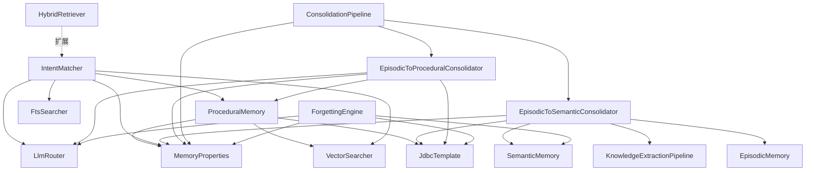

# 设计文档：记忆系统进阶 (memory-advanced)

参考文档：
- 架构设计：#[[file:docs/architecture/memory-advanced.md]]
- 特性设计：#[[file:docs/features/memory-advanced.md]]
- 基础记忆架构：#[[file:docs/architecture/memory-system.md]]
- 需求文档：#[[file:.kiro/specs/memory-advanced/requirements.md]]
- 编码规范：#[[file:.kiro/steering/coding-standards.md]]

---

## 概述

本模块（模块 23）在 Phase 2 已完成的 L1-L3 记忆存储与检索基础上，实现记忆的完整生命周期管理。核心包含三个子系统：

1. **L4 程序记忆**：数据模型（`ProcedureTemplate`、`TemplateStep`、`PreferenceRule`、`StrategyPattern`）、`ProceduralMemory` 服务 CRUD + 成功率追踪、`IntentMatcher` 双路意图匹配、`HybridRetriever` L4 检索路径扩展
2. **记忆巩固管线**：`EpisodicToSemanticConsolidator`（情景→语义）、`EpisodicToProceduralConsolidator`（情景→程序）、`ConsolidationPipeline` 编排调度
3. **MaRS 遗忘引擎**：`ForgettingPolicy` sealed interface（6 种策略）、`ForgettingEngine` 四阶段 Hybrid 遗忘 + 安全保障

详细的架构设计、前沿研究基础和设计决策已在 `docs/architecture/memory-advanced.md` 中完整定义。本设计文档聚焦于**实现方案**，不重复架构文档已有内容。

### 技术约束

- Java 22（record、sealed interface、pattern matching、virtual thread）
- Spring Boot 3.5.x + Spring AI 1.1.2
- SQLite + sqlite-vec，单 JAR 部署
- 中文注释/文档，英文代码标识符
- 所有业务可调参数通过 `@ConfigurationProperties` 外部化

---

## 架构

### 包结构

```
com.lifepilot.memory
├── procedural/                    # L4 程序记忆（新增）
│   ├── ProcedureTemplate.java         # 操作模板 record
│   ├── TemplateStep.java              # 模板步骤 record
│   ├── PreferenceRule.java            # 偏好规则 record
│   ├── StrategyPattern.java           # 策略模式 record
│   ├── ProceduralMemory.java          # 程序记忆服务（CRUD + 成功率追踪）
│   └── IntentMatcher.java             # 意图匹配器（双路匹配）
├── consolidation/                 # 巩固管线（新增）
│   ├── EpisodicToSemanticConsolidator.java
│   ├── EpisodicToProceduralConsolidator.java
│   ├── ConsolidationPipeline.java     # 编排服务
│   └── ConsolidationStats.java        # 巩固统计 record
├── forgetting/                    # 遗忘引擎（新增）
│   ├── ForgettingPolicy.java          # sealed interface
│   ├── ForgettingEngine.java          # 遗忘引擎服务
│   └── ForgettingPriority.java        # 优先级计算器
├── config/
│   ├── MemoryProperties.java          # 扩展：新增 Procedural / Consolidation / Forgetting 嵌套类
│   └── MemoryAutoConfiguration.java   # 扩展：注册新 Bean
└── retrieval/
    └── HybridRetriever.java           # 扩展：新增 L4 检索路径
```


### 模块间依赖关系



### 依赖接口验证

| 接口 | 源码位置 | 验证状态 |
|------|---------|---------|
| `LlmRouter.call(scene, prompt, outputSchema)` | `com.lifepilot.llm.LlmRouter` | ✅ 已核对：返回 `LlmResponse` |
| `LlmRouter.callEntity(scene, prompt, responseType)` | `com.lifepilot.llm.LlmRouter` | ✅ 已核对：泛型结构化输出 |
| `LlmRouter.embed(text)` | `com.lifepilot.llm.LlmRouter` | ✅ 已核对：返回 `float[]` |
| `EpisodicMemory.getRecent(limit)` | `com.lifepilot.memory.episodic.EpisodicMemory` | ✅ 已核对：返回 `List<ConversationRecord>` |
| `EpisodicMemory.getById(conversationId)` | `com.lifepilot.memory.episodic.EpisodicMemory` | ✅ 已核对：返回 `Optional<ConversationRecord>` |
| `SemanticMemory.findAllCurrent()` | `com.lifepilot.memory.semantic.SemanticMemory` | ✅ 已核对：返回 `List<TemporalEntity>`，按 importance_score ASC |
| `SemanticMemory.archive(entity)` | `com.lifepilot.memory.semantic.SemanticMemory` | ✅ 已核对：设置 is_current=0, valid_to=now |
| `SemanticMemory.upsertWithConflictDetection(incoming, conversationId)` | `com.lifepilot.memory.semantic.SemanticMemory` | ✅ 已核对：返回 `TemporalEntity` |
| `SemanticMemory.incrementAccessCount(entityId)` | `com.lifepilot.memory.semantic.SemanticMemory` | ✅ 已核对：更新 access_count + last_accessed_at |
| `VectorSearcher.searchEntities(queryText, topK, threshold)` | `com.lifepilot.memory.retrieval.VectorSearcher` | ✅ 已核对：返回 `List<VectorSearchResult>` |
| `VectorSearcher.upsertEntityVector(entityId, text)` | `com.lifepilot.memory.retrieval.VectorSearcher` | ✅ 已核对：文本→Embedding→vec0 表 |
| `HybridRetriever.retrieve(query, topK, weights)` | `com.lifepilot.memory.retrieval.HybridRetriever` | ✅ 已核对：三路并行 + RRF 融合 |
| `KnowledgeExtractionPipeline.extract(chunks, documentId)` | `com.lifepilot.knowledge.extract.KnowledgeExtractionPipeline` | ✅ 已核对：返回 `ExtractionResult` |
| `TemporalEntity` record 字段 | `com.lifepilot.memory.semantic.TemporalEntity` | ✅ 已核对：16 字段，含 importanceScore、accessCount、lastAccessedAt |
| `EntityType` 枚举 | `com.lifepilot.memory.semantic.EntityType` | ✅ 已核对：含 PREFERENCE、HABIT、GOAL |
| `ConversationRecord` record 字段 | `com.lifepilot.memory.episodic.ConversationRecord` | ✅ 已核对：含 id、goal、messages、createdAt |
| `MessageRecord.toolCallJson()` | `com.lifepilot.memory.episodic.MessageRecord` | ✅ 已核对：工具调用 JSON |
| `ReasoningSlot.retrievalContext(context, tokenCount)` | `com.lifepilot.memory.working.ReasoningSlot` | ✅ 已核对：静态工厂方法 |
| `MemoryProperties` | `com.lifepilot.memory.config.MemoryProperties` | ✅ 已核对：JavaBean 风格，嵌套 TokenBudget 类 |
| `MemoryAutoConfiguration` | `com.lifepilot.memory.config.MemoryAutoConfiguration` | ✅ 已核对：@AutoConfiguration + @EnableConfigurationProperties |

---

## 组件与接口


### 1. L4 程序记忆数据模型

数据模型严格遵循 `memory-system.md` §6.2 的定义，此处仅列出关键接口签名。

#### ProcedureTemplate record

```java
public record ProcedureTemplate(
        String templateId,
        String name,
        String description,
        String triggerIntent,
        List<TemplateStep> steps,
        Map<String, String> variables,
        float successRate,
        int useCount,
        Instant lastUsedAt,
        List<String> sourceTraceIds,
        Instant createdAt,
        Instant updatedAt
) {
    /** 可靠性判断：successRate ≥ 配置阈值 且 useCount ≥ 配置最低次数。 */
    public boolean isReliable(float minReliability, int minUseCount) {
        return successRate >= minReliability && useCount >= minUseCount;
    }

    /** 过时判断：lastUsedAt 超过配置天数。 */
    public boolean isStale(int staleDays) {
        return lastUsedAt != null
                && lastUsedAt.isBefore(Instant.now().minus(Duration.ofDays(staleDays)));
    }
}
```

> **设计决策**：`isReliable()` 和 `isStale()` 的阈值参数化（从 `MemoryProperties.Procedural` 读取），而非硬编码在 record 中。这符合编码规范 §12 配置外部化要求。

#### TemplateStep record

```java
public record TemplateStep(
        int stepOrder,
        String toolId,
        String action,
        Map<String, String> parameterTemplate,
        String description,
        boolean isOptional
) {
    /** 用实际变量值替换 ${variable} 占位符。 */
    public Map<String, String> resolveParameters(Map<String, String> variables) { ... }
}
```

#### PreferenceRule record

```java
public record PreferenceRule(
        String ruleId,
        String category,
        String key,
        String value,
        float confidence,
        String learnedFrom,
        int observationCount,
        Instant createdAt,
        Instant updatedAt
) {
    public boolean isHighConfidence() { return confidence >= 0.7f; }
}
```

#### StrategyPattern record

```java
public record StrategyPattern(
        String patternId,
        String situation,
        String recommendedAction,
        float successRate,
        int applicationCount,
        Instant createdAt
) {}
```

### 2. ProceduralMemory 服务

```java
public class ProceduralMemory {
    // 构造函数注入
    public ProceduralMemory(JdbcTemplate jdbcTemplate,
                            VectorSearcher vectorSearcher,
                            MemoryProperties properties) { ... }

    // --- CRUD ---
    public void save(ProcedureTemplate template) { ... }
    public Optional<ProcedureTemplate> findById(String templateId) { ... }
    public void update(ProcedureTemplate template) { ... }
    public void delete(String templateId) { ... }

    // --- 成功率追踪 ---
    /** 加权平均更新 successRate：newRate = (old * count + result) / (count + 1) */
    public void recordExecution(String templateId, boolean success) { ... }

    // --- 偏好规则 ---
    public void savePreference(PreferenceRule rule) { ... }
    public Optional<PreferenceRule> findPreference(String category, String key) { ... }
    public List<PreferenceRule> getPreferences(String category) { ... }
    /** 递增 observationCount，提升 confidence。 */
    public void reinforcePreference(String ruleId) { ... }

    // --- 策略模式 ---
    public void saveStrategy(StrategyPattern pattern) { ... }
    public List<StrategyPattern> findStrategiesBySituation(String situationText, int topK) { ... }
}
```

### 3. IntentMatcher 意图匹配器

```java
public class IntentMatcher {
    public IntentMatcher(ProceduralMemory proceduralMemory,
                         VectorSearcher vectorSearcher,
                         FtsSearcher ftsSearcher,
                         LlmRouter llmRouter,
                         MemoryProperties properties) { ... }

    /**
     * 双路并行匹配：sqlite-vec 向量语义（权重 0.7）+ FTS5 关键词（权重 0.3）。
     * 仅返回 isReliable() 为 true 的模板。
     * @return 融合评分最高且 ≥ 配置阈值的模板，无匹配返回 Optional.empty()
     */
    public Optional<TemplateMatch> match(String intentText) { ... }

    public record TemplateMatch(ProcedureTemplate template, float score) {}
}
```

**匹配流程**：
1. `LlmRouter.embed(intentText)` 获取意图向量
2. 并行执行：sqlite-vec 向量搜索 `procedure_intent_vec` + FTS5 搜索 `procedure_templates_fts`
3. 加权融合：`score = 0.7 × semanticScore + 0.3 × keywordScore`
4. 过滤 `isReliable(minReliability, minUseCount)` 为 true 的候选
5. 返回最高分且 ≥ `matchThreshold` 的模板

### 4. HybridRetriever L4 扩展

当前 `HybridRetriever` 构造函数接受 `VectorSearcher`、`FtsSearcher`、`GraphTraverser`、`SemanticMemory` 四个参数。扩展方案：

**方案**：新增可选的 `IntentMatcher` 依赖，通过 `@Nullable` 注入。

```java
public class HybridRetriever {
    // 扩展构造函数，新增 @Nullable IntentMatcher
    public HybridRetriever(VectorSearcher vectorSearcher,
                           FtsSearcher ftsSearcher,
                           GraphTraverser graphTraverser,
                           SemanticMemory semanticMemory,
                           @Nullable IntentMatcher intentMatcher) { ... }

    public List<RetrievalResult> retrieve(String query, int topK, RetrievalWeights weights) {
        // 原有三路并行检索不变
        // 新增：如果 intentMatcher != null，并行执行 L4 匹配
        // IntentMatcher 结果不参与 RRF 融合，而是作为独立的 ReasoningSlot 注入
    }
}
```

> **设计决策**：L4 匹配结果不参与 RRF 融合排序（因为操作模板和知识图谱实体是不同维度的信息），而是作为独立的执行建议注入 `ReasoningSlot`。这保持了现有三路检索的稳定性。

### 5. EpisodicToSemanticConsolidator

```java
public class EpisodicToSemanticConsolidator {
    public EpisodicToSemanticConsolidator(
            EpisodicMemory episodicMemory,
            SemanticMemory semanticMemory,
            @Nullable KnowledgeExtractionPipeline extractionPipeline,
            JdbcTemplate jdbcTemplate,
            MemoryProperties properties) { ... }

    /**
     * 执行情景→语义巩固。
     * 1. 获取最近 N 天对话（增量窗口，跳过已巩固的）
     * 2. 统计已有 L3 实体在对话文本中的提及频率
     * 3. 高频实体（≥ 阈值）提升 importanceScore（步长可配置，上限 1.0）
     * 4. 长对话（> 200 字符）且未被知识提取覆盖 → 触发 KnowledgeExtractionPipeline
     * 5. 记录巩固日志到 memory_consolidation_log
     * @return 巩固统计
     */
    public ConsolidationStats consolidate() { ... }
}
```

**增量窗口策略**：通过 `memory_consolidation_log` 表记录上次巩固的最新对话时间戳，下次只处理该时间戳之后的新对话。

### 6. EpisodicToProceduralConsolidator

```java
public class EpisodicToProceduralConsolidator {
    public EpisodicToProceduralConsolidator(
            JdbcTemplate jdbcTemplate,
            ProceduralMemory proceduralMemory,
            LlmRouter llmRouter,
            MemoryProperties properties) { ... }

    /**
     * 执行情景→程序巩固。
     * 1. 获取最近 N 天包含工具调用的成功执行轨迹（步数 ≥ 配置阈值）
     * 2. 向量化工具调用序列，余弦相似度聚类（阈值 ≥ 配置值）
     * 3. 聚类大小 ≥ 配置最小样本数 → LLM 提炼操作模板
     * 4. 与已有模板去重（triggerIntent 向量相似度 ≥ 0.9）
     * 5. 每次最多提炼配置数量个新模板
     * 6. 记录巩固日志
     * @return 巩固统计
     */
    public ConsolidationStats consolidate() { ... }
}
```

**执行轨迹来源**：从 `agent_traces` + `agent_trace_steps` 表查询，条件：
- `agent_traces.success = 1`（成功执行）
- `agent_traces.created_at` 在回溯窗口内
- 关联的 `agent_trace_steps` 中 `tool_id IS NOT NULL` 的步骤数 ≥ `minExecutionSteps`

### 7. ConsolidationPipeline 编排

```java
public class ConsolidationPipeline {
    public ConsolidationPipeline(
            EpisodicToSemanticConsolidator semanticConsolidator,
            EpisodicToProceduralConsolidator proceduralConsolidator,
            MemoryProperties properties) { ... }

    /** 定时执行入口。 */
    @Scheduled(cron = "${lifepilot.memory.consolidation.cron}")
    public void scheduledConsolidate() { consolidate(); }

    /**
     * 可被外部调用的巩固方法（为 Idle-Driven 预留）。
     * 顺序执行：语义巩固 → 程序巩固。
     * 单个巩固器失败不阻塞另一个。
     */
    public void consolidate() { ... }
}
```

### 8. ForgettingPolicy sealed interface

```java
public sealed interface ForgettingPolicy
        permits FifoPolicy, LruPolicy, PriorityDecayPolicy,
                ReflectionSummaryPolicy, RandomDropPolicy, HybridPolicy {

    /** 从候选实体中选择应被遗忘的实体。 */
    List<TemporalEntity> selectForForgetting(List<TemporalEntity> candidates, int budget);

    /** 策略名称。 */
    String name();
}
```

6 种策略实现严格遵循 `memory-system.md` §10.3 的定义。

### 9. ForgettingEngine 遗忘引擎

```java
public class ForgettingEngine {
    public ForgettingEngine(SemanticMemory semanticMemory,
                            @Nullable LlmRouter llmRouter,
                            JdbcTemplate jdbcTemplate,
                            MemoryProperties properties) { ... }

    @Scheduled(cron = "${lifepilot.memory.forgetting.cron}")
    public void scheduledForget() { forget(); }

    /**
     * 执行 Hybrid 四阶段遗忘。
     * 安全保障：
     * - 保护 PREFERENCE/HABIT/GOAL 类型实体
     * - 保护 importanceScore ≥ 配置阈值的实体
     * - 每次最大遗忘数量限制
     * - PII 实体优先清理
     * - LLM 不可用时跳过 Reflection-Summary 阶段
     */
    public void forget() { ... }
}
```

### 10. ConsolidationStats record

```java
public record ConsolidationStats(
        String consolidationType,
        int conversationsAnalyzed,
        int entitiesFound,
        int entitiesBoosted,
        int extractionsTriggered,
        int templatesCreated,
        int templatesUpdated,
        long elapsedMs
) {}
```


---

## 数据模型

### Flyway V20 迁移脚本

文件：`src/main/resources/db/migration/V20__create_memory_advanced_tables.sql`

```sql
-- V20: 创建记忆系统进阶表 — L4 程序记忆 + 巩固日志 + 遗忘日志

-- ============================================================
-- L4 程序记忆表
-- ============================================================

-- 操作模板表
CREATE TABLE IF NOT EXISTS procedure_templates (
    template_id         TEXT PRIMARY KEY,
    name                TEXT NOT NULL,
    description         TEXT NOT NULL,
    trigger_intent      TEXT NOT NULL,
    steps_json          TEXT NOT NULL,
    variables_json      TEXT NOT NULL DEFAULT '{}',
    success_rate        REAL NOT NULL DEFAULT 0.0,
    use_count           INTEGER NOT NULL DEFAULT 0,
    last_used_at        TEXT,
    source_trace_ids_json TEXT NOT NULL DEFAULT '[]',
    created_at          TEXT NOT NULL DEFAULT (datetime('now')),
    updated_at          TEXT NOT NULL DEFAULT (datetime('now'))
);

CREATE INDEX IF NOT EXISTS idx_procedure_templates_name
    ON procedure_templates(name);
CREATE INDEX IF NOT EXISTS idx_procedure_templates_success
    ON procedure_templates(success_rate, use_count);

-- 操作模板 FTS5 全文索引
CREATE VIRTUAL TABLE IF NOT EXISTS procedure_templates_fts USING fts5(
    name,
    description,
    trigger_intent,
    content='procedure_templates',
    content_rowid='rowid',
    tokenize='unicode61'
);

-- FTS5 同步触发器
CREATE TRIGGER IF NOT EXISTS procedure_templates_fts_ai
    AFTER INSERT ON procedure_templates BEGIN
    INSERT INTO procedure_templates_fts(rowid, name, description, trigger_intent)
        VALUES (new.rowid, new.name, new.description, new.trigger_intent);
END;

CREATE TRIGGER IF NOT EXISTS procedure_templates_fts_ad
    AFTER DELETE ON procedure_templates BEGIN
    INSERT INTO procedure_templates_fts(procedure_templates_fts, rowid, name, description, trigger_intent)
        VALUES ('delete', old.rowid, old.name, old.description, old.trigger_intent);
END;

CREATE TRIGGER IF NOT EXISTS procedure_templates_fts_au
    AFTER UPDATE ON procedure_templates BEGIN
    INSERT INTO procedure_templates_fts(procedure_templates_fts, rowid, name, description, trigger_intent)
        VALUES ('delete', old.rowid, old.name, old.description, old.trigger_intent);
    INSERT INTO procedure_templates_fts(rowid, name, description, trigger_intent)
        VALUES (new.rowid, new.name, new.description, new.trigger_intent);
END;

-- 偏好规则表
CREATE TABLE IF NOT EXISTS preference_rules (
    rule_id             TEXT PRIMARY KEY,
    category            TEXT NOT NULL,
    key                 TEXT NOT NULL,
    value               TEXT NOT NULL,
    confidence          REAL NOT NULL DEFAULT 0.3,
    learned_from_json   TEXT NOT NULL DEFAULT '[]',
    observation_count   INTEGER NOT NULL DEFAULT 1,
    created_at          TEXT NOT NULL DEFAULT (datetime('now')),
    updated_at          TEXT NOT NULL DEFAULT (datetime('now')),
    UNIQUE(category, key)
);

-- 策略模式表
CREATE TABLE IF NOT EXISTS strategy_patterns (
    pattern_id          TEXT PRIMARY KEY,
    situation           TEXT NOT NULL,
    recommended_action  TEXT NOT NULL,
    success_rate        REAL NOT NULL DEFAULT 0.0,
    application_count   INTEGER NOT NULL DEFAULT 0,
    created_at          TEXT NOT NULL DEFAULT (datetime('now'))
);

-- ============================================================
-- 巩固与遗忘日志表
-- ============================================================

-- 巩固执行日志
CREATE TABLE IF NOT EXISTS memory_consolidation_log (
    id                      TEXT PRIMARY KEY,
    consolidation_type      TEXT NOT NULL,
    conversations_analyzed  INTEGER NOT NULL DEFAULT 0,
    entities_found          INTEGER NOT NULL DEFAULT 0,
    entities_boosted        INTEGER NOT NULL DEFAULT 0,
    extractions_triggered   INTEGER NOT NULL DEFAULT 0,
    templates_created       INTEGER NOT NULL DEFAULT 0,
    templates_updated       INTEGER NOT NULL DEFAULT 0,
    elapsed_ms              INTEGER NOT NULL DEFAULT 0,
    created_at              TEXT NOT NULL DEFAULT (datetime('now'))
);

CREATE INDEX IF NOT EXISTS idx_consolidation_log_type_time
    ON memory_consolidation_log(consolidation_type, created_at);

-- 遗忘操作日志
CREATE TABLE IF NOT EXISTS forgetting_log (
    id                  TEXT PRIMARY KEY,
    entity_id           TEXT NOT NULL,
    entity_name         TEXT NOT NULL,
    strategy            TEXT NOT NULL,
    action_taken        TEXT NOT NULL,
    forgetting_priority REAL NOT NULL,
    reason              TEXT,
    created_at          TEXT NOT NULL DEFAULT (datetime('now'))
);

CREATE INDEX IF NOT EXISTS idx_forgetting_log_entity
    ON forgetting_log(entity_id);
CREATE INDEX IF NOT EXISTS idx_forgetting_log_time
    ON forgetting_log(created_at);
```

> **注意**：sqlite-vec 向量索引虚拟表（`procedure_intent_vec`、`strategy_situation_vec`）通过程序化创建（与现有 `entity_embeddings` 保持一致），不在 Flyway 脚本中创建。在 `VectorSearcher` 或 `ProceduralMemory` 初始化时执行 `CREATE VIRTUAL TABLE IF NOT EXISTS ... USING vec0(...)` 语句。

### MemoryProperties 配置扩展

在现有 `MemoryProperties` 类中新增三个嵌套静态内部类：

```java
@ConfigurationProperties(prefix = "lifepilot.memory")
public class MemoryProperties {
    // ... 现有字段保持不变 ...

    private Procedural procedural = new Procedural();
    private Consolidation consolidation = new Consolidation();
    private Forgetting forgetting = new Forgetting();

    // getter/setter ...

    /** L4 程序记忆配置。 */
    public static class Procedural {
        private int maxTemplates = 200;
        private float minReliability = 0.7f;
        private int minUseCount = 2;
        private int staleDays = 90;
        private float matchThreshold = 0.6f;
        private float defaultImportance = 0.5f;
        // getter/setter ...
    }

    /** 巩固管线配置。 */
    public static class Consolidation {
        private String cron = "0 0 3 * * *";
        private String triggerMode = "CRON";
        private int lookbackDays = 7;
        private int highFrequencyThreshold = 3;
        private float importanceBoostStep = 0.1f;
        private float importanceBoostMax = 0.3f;
        private float clusterSimilarityThreshold = 0.85f;
        private int minClusterSize = 2;
        private int maxTemplatesPerRun = 10;
        private int minExecutionSteps = 2;
        // getter/setter ...
    }

    /** 遗忘引擎配置。 */
    public static class Forgetting {
        private String cron = "0 0 4 * * SUN";
        private int maxRetentionDays = 365;
        private int lruThresholdDays = 90;
        private float priorityDecayRate = 0.02f;
        private float priorityDecayThreshold = 0.2f;
        private float reflectionSummaryMinImportance = 0.3f;
        private float reflectionSummaryMaxImportance = 0.8f;
        private int maxForgetPerRun = 100;
        private float privacyAwareBoost = 0.3f;
        // getter/setter ...
    }
}
```

### application.yml 配置声明

```yaml
lifepilot:
  memory:
    # ... 现有配置保持不变 ...

    # L4 程序记忆
    procedural:
      max-templates: 200
      min-reliability: 0.7
      min-use-count: 2
      stale-days: 90
      match-threshold: 0.6
      default-importance: 0.5

    # 巩固管线
    consolidation:
      cron: "0 0 3 * * *"
      trigger-mode: CRON
      lookback-days: 7
      high-frequency-threshold: 3
      importance-boost-step: 0.1
      importance-boost-max: 0.3
      cluster-similarity-threshold: 0.85
      min-cluster-size: 2
      max-templates-per-run: 10
      min-execution-steps: 2

    # 遗忘引擎
    forgetting:
      cron: "0 0 4 * * SUN"
      max-retention-days: 365
      lru-threshold-days: 90
      priority-decay-rate: 0.02
      priority-decay-threshold: 0.2
      reflection-summary-min-importance: 0.3
      reflection-summary-max-importance: 0.8
      max-forget-per-run: 100
      privacy-aware-boost: 0.3
```

### Spring AutoConfiguration 扩展

在 `MemoryAutoConfiguration` 中新增以下 Bean 注册：

```java
// --- L4 程序记忆 ---

@Bean
@ConditionalOnMissingBean
@ConditionalOnBean(VectorSearcher.class)
public ProceduralMemory proceduralMemory(
        JdbcTemplate jdbcTemplate,
        VectorSearcher vectorSearcher,
        MemoryProperties properties) {
    return new ProceduralMemory(jdbcTemplate, vectorSearcher, properties);
}

@Bean
@ConditionalOnMissingBean
@ConditionalOnBean({ProceduralMemory.class, VectorSearcher.class, FtsSearcher.class, LlmRouter.class})
public IntentMatcher intentMatcher(
        ProceduralMemory proceduralMemory,
        VectorSearcher vectorSearcher,
        FtsSearcher ftsSearcher,
        LlmRouter llmRouter,
        MemoryProperties properties) {
    return new IntentMatcher(proceduralMemory, vectorSearcher, ftsSearcher, llmRouter, properties);
}

// --- 巩固管线 ---

@Bean
@ConditionalOnMissingBean
public EpisodicToSemanticConsolidator episodicToSemanticConsolidator(
        EpisodicMemory episodicMemory,
        SemanticMemory semanticMemory,
        @Nullable KnowledgeExtractionPipeline extractionPipeline,
        JdbcTemplate jdbcTemplate,
        MemoryProperties properties) {
    return new EpisodicToSemanticConsolidator(
            episodicMemory, semanticMemory, extractionPipeline, jdbcTemplate, properties);
}

@Bean
@ConditionalOnMissingBean
public EpisodicToProceduralConsolidator episodicToProceduralConsolidator(
        JdbcTemplate jdbcTemplate,
        ProceduralMemory proceduralMemory,
        LlmRouter llmRouter,
        MemoryProperties properties) {
    return new EpisodicToProceduralConsolidator(
            jdbcTemplate, proceduralMemory, llmRouter, properties);
}

@Bean
@ConditionalOnMissingBean
public ConsolidationPipeline consolidationPipeline(
        EpisodicToSemanticConsolidator semanticConsolidator,
        EpisodicToProceduralConsolidator proceduralConsolidator,
        MemoryProperties properties) {
    return new ConsolidationPipeline(semanticConsolidator, proceduralConsolidator, properties);
}

// --- 遗忘引擎 ---

@Bean
@ConditionalOnMissingBean
@ConditionalOnBean(SemanticMemory.class)
public ForgettingEngine forgettingEngine(
        SemanticMemory semanticMemory,
        @Nullable LlmRouter llmRouter,
        JdbcTemplate jdbcTemplate,
        MemoryProperties properties) {
    return new ForgettingEngine(semanticMemory, llmRouter, jdbcTemplate, properties);
}
```

> **注意**：`HybridRetriever` 的 Bean 注册需要修改，新增 `@Nullable IntentMatcher` 参数。

### ForgettingPriority 计算公式

```java
public class ForgettingPriority {
    /**
     * 综合评分公式：
     * priority = (timeFactor × 0.3 + accessFactor × 0.3 + importanceFactor × 0.2) × privacyFactor
     *
     * timeFactor = daysSinceLastAccess / maxRetentionDays
     * accessFactor = 1.0 / (1 + accessCount)
     * importanceFactor = 1.0 - importanceScore
     * privacyFactor = containsPII ? 配置倍数(默认 1.3) : 1.0
     */
    public float calculate(TemporalEntity entity, MemoryProperties.Forgetting config) { ... }
}
```


---

## 正确性属性

*属性（Property）是在系统所有合法执行中都应成立的特征或行为——本质上是对系统应做什么的形式化陈述。属性是人类可读规格说明与机器可验证正确性保证之间的桥梁。*

基于需求文档中 14 个需求的验收标准，经过逐条分析和冗余消除，提炼出以下正确性属性。每个属性都包含显式的全称量化（"For all" / "For any"），可直接映射为属性测试。

### Property 1: 模板 CRUD 往返一致性

*For any* 合法的 `ProcedureTemplate`（所有字段非空且类型正确），保存到数据库后按 `templateId` 查询，返回的模板应与原始模板在所有字段上等价（templateId、name、description、triggerIntent、steps、variables、successRate、useCount、sourceTraceIds 完全一致）。

**Validates: Requirements 2.1**

### Property 2: 成功率加权平均公式正确性

*For any* `ProcedureTemplate`（初始 successRate ∈ [0.0, 1.0]，useCount ≥ 0）和任意布尔值 `success`，调用 `recordExecution(templateId, success)` 后，新的 `successRate` 应等于 `(oldRate × oldCount + (success ? 1.0 : 0.0)) / (oldCount + 1)`，且 `useCount` 应等于 `oldCount + 1`。

**Validates: Requirements 2.2, 2.3**

### Property 3: isReliable 阈值判断正确性

*For any* `successRate` ∈ [0.0, 1.0]、`useCount` ≥ 0、`minReliability` ∈ [0.0, 1.0]、`minUseCount` ≥ 0，`isReliable(minReliability, minUseCount)` 返回 `true` 当且仅当 `successRate >= minReliability && useCount >= minUseCount`。

**Validates: Requirements 2.4**

### Property 4: isStale 时间判断正确性

*For any* `lastUsedAt`（过去某个时间点）和 `staleDays` > 0，`isStale(staleDays)` 返回 `true` 当且仅当 `lastUsedAt` 距今超过 `staleDays` 天。

**Validates: Requirements 2.5**

### Property 5: 偏好规则唯一性约束

*For any* 两个 `PreferenceRule`，若 `category` 和 `key` 相同，保存第二个后查询该 `(category, key)` 组合应只返回一条记录（第二个覆盖第一个），数据库中不存在重复。

**Validates: Requirements 2.6**

### Property 6: 偏好规则强化单调递增

*For any* `PreferenceRule`，调用 `reinforcePreference(ruleId)` 后，`observationCount` 应严格递增 1，`confidence` 应不低于强化前的值。

**Validates: Requirements 2.7**

### Property 7: IntentMatcher 仅返回可靠且超阈值的模板

*For any* 模板集合（包含可靠和不可靠模板）和任意意图文本，`IntentMatcher.match()` 返回的模板（如果有）必须满足：(a) `isReliable()` 为 true，(b) 融合评分 ≥ 配置的 `matchThreshold`。

**Validates: Requirements 3.2, 3.3**

### Property 8: TemplateStep 变量替换正确性

*For any* `TemplateStep`（parameterTemplate 中包含 `${var}` 占位符）和任意变量映射 `variables`，`resolveParameters(variables)` 的结果中不应包含 `variables` 中已定义的 `${var}` 占位符（所有已定义变量都被替换）。

**Validates: Requirements 1.2**

### Property 9: importanceScore 提升有界且不超上限

*For any* `TemporalEntity`（importanceScore ∈ [0.0, 1.0]）和任意提及频率 ≥ 阈值，巩固后的 `importanceScore` 应满足：(a) 单次提升量 ≤ `importanceBoostMax`，(b) 最终值 ≤ 1.0。

**Validates: Requirements 5.3**

### Property 10: 执行轨迹按最小步数过滤

*For any* 执行轨迹集合，`EpisodicToProceduralConsolidator` 仅处理工具调用步数 ≥ `minExecutionSteps` 的轨迹。步数不足的轨迹不参与聚类和模板提炼。

**Validates: Requirements 6.2**

### Property 11: 单次巩固最大模板数限制

*For any* 聚类结果（无论聚类数量多少），`EpisodicToProceduralConsolidator` 每次执行创建的新模板数量不超过 `maxTemplatesPerRun`。

**Validates: Requirements 6.6**

### Property 12: 巩固管线故障隔离

*For any* 巩固执行，若 `EpisodicToSemanticConsolidator` 抛出异常，`EpisodicToProceduralConsolidator` 仍应正常执行（不被阻塞）。

**Validates: Requirements 7.3**

### Property 13: 遗忘安全性 — 受保护实体永不被选中

*For any* 随机生成的实体列表和预算值，`ForgettingEngine` 选择的遗忘候选中不包含以下受保护实体：(a) `EntityType` 为 `PREFERENCE`、`HABIT`、`GOAL` 的用户认知类实体，(b) `importanceScore` ≥ 配置保护阈值的高重要度实体。

**Validates: Requirements 9.2, 9.3, 9.4, 13.1, 13.2**

### Property 14: 遗忘数量不超过预算

*For any* 随机生成的实体列表和预算值，`ForgettingPolicy` 的所有 6 种实现返回的遗忘候选数量均不超过预算值。

**Validates: Requirements 9.5, 13.3**

### Property 15: PII 实体遗忘优先级更高

*For any* 两个除 PII 标记外完全相同的实体（相同 importanceScore、accessCount、lastAccessedAt），包含 PII 标记的实体的 `forgettingPriority` 应严格高于不包含 PII 标记的实体。

**Validates: Requirements 9.6**

### Property 16: ForgettingPriority 公式正确性

*For any* `TemporalEntity`（importanceScore ∈ [0.0, 1.0]，accessCount ≥ 0，daysSinceLastAccess ≥ 0），计算的 `forgettingPriority` 应等于 `(timeFactor × 0.3 + accessFactor × 0.3 + importanceFactor × 0.2) × privacyFactor`，其中各因子按需求 9.8 定义的公式计算。

**Validates: Requirements 9.8**

### Property 17: Priority Decay 指数衰减公式正确性

*For any* `TemporalEntity`（importanceScore ∈ [0.0, 1.0]）和 daysSinceLastAccess ≥ 0，`effectivePriority` 应等于 `importanceScore × exp(-λ × daysSinceLastAccess)`，且结果 ≥ 0。

**Validates: Requirements 8.3**

### Property 18: ReflectionSummary 仅选择指定重要度范围的实体

*For any* 实体列表，`ReflectionSummaryPolicy` 选择的实体的 `importanceScore` 均在 `[reflectionSummaryMinImportance, reflectionSummaryMaxImportance)` 范围内。

**Validates: Requirements 8.4**

### Property 19: Hybrid 每阶段预算限制

*For any* 实体列表和总预算 B，`HybridPolicy` 的每个阶段（FIFO、LRU、PriorityDecay、ReflectionSummary）处理的实体数量均不超过 `⌊B/4⌋`。

**Validates: Requirements 8.5**

### Property 20: 遗忘提升平均重要度

*For any* 随机生成的实体列表（至少包含一个可遗忘实体），`HybridPolicy` 执行遗忘后，剩余实体的平均 `importanceScore` 不低于遗忘前全部实体的平均 `importanceScore`。

**Validates: Requirements 13.4**

### Property 21: LLM 降级 — 非 LLM 依赖操作正常完成

*For any* 数据集，当 LLM 不可用时：(a) `EpisodicToSemanticConsolidator` 的实体频率统计和 importanceScore 提升正常执行，(b) `EpisodicToProceduralConsolidator` 返回 0 个新模板，(c) `ForgettingEngine` 的 FIFO/LRU/PriorityDecay 三阶段正常执行，仅跳过 ReflectionSummary。

**Validates: Requirements 9.9, 12.1, 12.2, 12.3**

### Property 22: 语义巩固幂等性

*For any* 随机生成的对话记录和实体集合，`EpisodicToSemanticConsolidator` 对同一数据集执行两次巩固，产生的结果与执行一次完全相同（importanceScore 不会无限增长，已提取的对话不重复提取）。

**Validates: Requirements 14.1**

### Property 23: 程序巩固幂等性

*For any* 随机生成的执行轨迹集合，`EpisodicToProceduralConsolidator` 对同一数据集执行两次巩固，不产生重复的操作模板（去重机制生效）。

**Validates: Requirements 14.2**

### Property 24: 遗忘幂等性

*For any* 随机生成的实体列表，`ForgettingEngine` 对同一数据集执行两次遗忘，产生的结果与执行一次完全相同（已归档的实体不重复处理）。

**Validates: Requirements 14.3**
