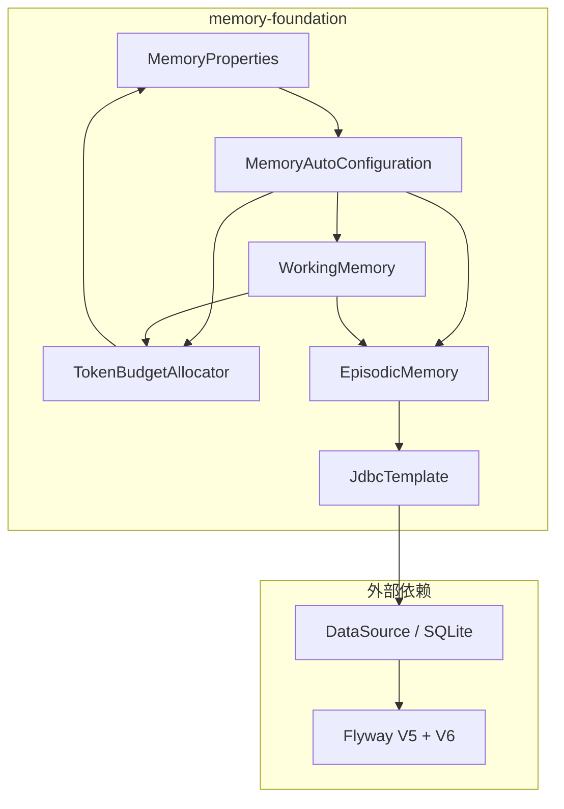

# 记忆系统基础层设计文档

参考文档：
- 架构设计：#[[file:docs/architecture/memory-system.md]]
- 数据模型：#[[file:docs/architecture/data-model.md]]
- 编码规范：#[[file:.kiro/steering/coding-standards.md]]
- 需求文档：#[[file:.kiro/specs/memory-foundation/requirements.md]]

---

## 概述

本设计文档描述记忆系统基础层（memory-foundation）的实现方案，覆盖 L1 工作记忆和 L2 情景记忆的核心数据结构与服务。

本 spec 的范围：
- **配置层**：MemoryProperties（JavaBean 风格）+ MemoryAutoConfiguration（@ConditionalOnProperty）
- **数据库层**：Flyway V5（conversations + messages 表）+ V6（FTS5 虚拟表 + 触发器）
- **L1 工作记忆**：WorkingMemorySlot sealed interface 类型体系、TokenBudgetAllocator、WorkingMemory 服务
- **L2 情景记忆**：CompressionLevel 枚举、MessageRecord、ConversationRecord、EpisodicMemory 服务

不在本 spec 范围内：L3 语义记忆、L4 程序记忆、HybridRetriever、KnowledgeExtractionPipeline、ConsolidationPipeline、ForgettingEngine、CompressionService（LLM 驱动压缩）、sqlite-vec 向量存储。

---

## 架构

### 模块依赖关系



### 层间数据流

```
L1 WorkingMemory ──flush()──▶ L2 EpisodicMemory ──save()──▶ SQLite (conversations + messages)
```

WorkingMemory 在会话结束时将 ConversationSlot 列表转换为 ConversationRecord + MessageRecord 列表，通过 EpisodicMemory.save() 持久化。EpisodicMemory 不依赖 WorkingMemory，保持单向依赖。

---

## 组件与接口

### 包结构

```
com.lifepilot.memory
├── config/
│   ├── MemoryProperties.java          # @ConfigurationProperties JavaBean 风格
│   └── MemoryAutoConfiguration.java   # @AutoConfiguration + @ConditionalOnProperty
├── working/
│   ├── WorkingMemorySlot.java         # sealed interface
│   ├── ConversationSlot.java          # record implements WorkingMemorySlot
│   ├── ToolResultSlot.java            # record implements WorkingMemorySlot
│   ├── ReasoningSlot.java             # record implements WorkingMemorySlot
│   ├── BudgetAllocation.java          # record（预算分配结果）
│   ├── TokenBudgetAllocator.java      # 预算分配服务
│   └── WorkingMemory.java             # L1 工作记忆服务
├── episodic/
│   ├── CompressionLevel.java          # 压缩层级枚举
│   ├── MessageRecord.java             # 消息记录 record
│   ├── ConversationRecord.java        # 对话记录 record
│   └── EpisodicMemory.java            # L2 情景记忆服务
└── package-info.java
```

### 组件详细设计

#### 1. MemoryProperties

遵循 McpConfigProperties / LlmConfigProperties 的 JavaBean 风格模式：

```java
@ConfigurationProperties(prefix = "lifepilot.memory")
public class MemoryProperties {
    private boolean enabled = true;
    private int workingMemoryTokenBudget = 8000;
    private int idleSessionTimeoutMinutes = 30;
    private int compressionThresholdTokens = 4000;
    private int consolidationLookbackDays = 7;
    private double forgettingThreshold = 0.7;
    private int maxRetentionDays = 180;
    // getters + setters
}
```

#### 2. MemoryAutoConfiguration

遵循 McpAutoConfiguration 模式，使用 @Bean 注册服务（不在服务类上标注 @Service/@Component）：

```java
@AutoConfiguration
@EnableConfigurationProperties(MemoryProperties.class)
@ConditionalOnProperty(prefix = "lifepilot.memory", name = "enabled",
        havingValue = "true", matchIfMissing = true)
public class MemoryAutoConfiguration {

    @Bean @ConditionalOnMissingBean
    public TokenBudgetAllocator tokenBudgetAllocator(MemoryProperties properties) { ... }

    @Bean @ConditionalOnMissingBean
    public EpisodicMemory episodicMemory(JdbcTemplate jdbcTemplate) { ... }

    @Bean @ConditionalOnMissingBean
    public WorkingMemory workingMemory(
            MemoryProperties properties,
            TokenBudgetAllocator allocator,
            EpisodicMemory episodicMemory) { ... }
}
```

#### 3. WorkingMemorySlot 类型体系

```java
public sealed interface WorkingMemorySlot
        permits ConversationSlot, ToolResultSlot, ReasoningSlot {
    int tokenCount();
    Instant createdAt();
    float importance();
}
```

三种实现均为 record：

| 类型 | 字段 | 静态工厂方法 | 默认 importance |
|------|------|-------------|----------------|
| ConversationSlot | role, content, tokenCount, importance, isPinned, toolCallJson, createdAt | userMessage(0.8f), assistantMessage(0.6f), systemMessage(0.9f, pinned) | 0.6-0.9 |
| ToolResultSlot | toolId, toolAction, result, tokenCount, importance, createdAt | 无 | 由调用方指定 |
| ReasoningSlot | thought, source, tokenCount, importance, createdAt | retrievalContext(0.3f), chainOfThought(0.4f) | 0.3-0.4 |

#### 4. TokenBudgetAllocator

分配策略：
- 系统提示词区：固定 10%
- 用户消息区：固定 15%
- 剩余 75% 在工作记忆区和检索上下文区之间动态分配：
  - 默认：工作记忆 50%、检索 25%（归一化到 75%）
  - topRetrievalScore > 0.9：检索扩展到 35%、工作记忆压缩到 40%
  - conversationTurns > 10：工作记忆扩展到 60%、检索压缩到 20%

```java
public BudgetAllocation allocate(int contextWindowSize, int conversationTurns, float topRetrievalScore)
```

#### 5. WorkingMemory

核心数据结构：
- `ConcurrentHashMap<String, List<WorkingMemorySlot>> sessions` — 会话槽位列表
- `ConcurrentHashMap<String, Integer> tokenUsage` — 会话 Token 使用量
- `ConcurrentHashMap<String, Instant> lastActivity` — 会话最后活动时间

关键方法：

| 方法 | 行为 |
|------|------|
| `append(sessionId, slot)` | 追加槽位，超预算时执行淘汰 |
| `getContext(sessionId)` | 返回不可变槽位列表副本 |
| `getTokenCount(sessionId)` | 返回会话 Token 总和 |
| `flush(sessionId)` | ConversationSlot → MessageRecord，创建 ConversationRecord，调用 EpisodicMemory.save()，清除会话 |
| `clearSession(sessionId)` | 移除会话所有槽位 |
| `activeSessions()` | 返回活跃会话 ID 不可变集合 |

淘汰策略（重要度加权）：
1. 按类型优先级排序：ReasoningSlot(优先淘汰) → ToolResultSlot → ConversationSlot
2. 同类型内按 importance 升序排序
3. 跳过 isPinned=true 的 ConversationSlot
4. 逐个淘汰直到 Token 总量 ≤ workingMemoryTokenBudget

#### 6. EpisodicMemory

使用 JdbcTemplate 执行所有数据库操作：

| 方法 | SQL 操作 | 说明 |
|------|---------|------|
| `save(ConversationRecord)` | INSERT conversations + INSERT messages（@Transactional） | 事务内写入 |
| `getRecent(int limit)` | SELECT conversations ORDER BY created_at DESC LIMIT ? | 最近对话 |
| `search(String query)` | SELECT via messages_fts MATCH + BM25 ranking | FTS5 全文搜索 |
| `getByIntent(String goal)` | SELECT conversations WHERE goal LIKE ? | 模糊匹配 |
| `getById(String conversationId)` | SELECT conversation + messages | 返回 Optional |
| `compress(String conversationId, CompressionLevel level)` | UPDATE messages SET compression_level, compressed_content WHERE is_pinned=0 | 跳过 pinned |

---

## 数据模型

### Flyway V5: conversations + messages 表

```sql
-- V5__create_memory_tables.sql

CREATE TABLE conversations (
    id         TEXT PRIMARY KEY,
    session_id TEXT NOT NULL,
    goal       TEXT NOT NULL,
    summary    TEXT,
    created_at TEXT NOT NULL,
    updated_at TEXT NOT NULL
);

CREATE INDEX idx_conversations_session ON conversations(session_id);

CREATE TABLE messages (
    id                TEXT PRIMARY KEY,
    conversation_id   TEXT NOT NULL REFERENCES conversations(id),
    role              TEXT NOT NULL,
    content           TEXT NOT NULL,
    compressed_content TEXT,
    compression_level INTEGER NOT NULL DEFAULT 0,
    is_pinned         INTEGER NOT NULL DEFAULT 0,
    tool_call_json    TEXT,
    token_count       INTEGER DEFAULT 0,
    created_at        TEXT NOT NULL
);

CREATE INDEX idx_messages_conversation ON messages(conversation_id, created_at);
CREATE INDEX idx_messages_pinned ON messages(conversation_id) WHERE is_pinned = 1;
```

### Flyway V6: FTS5 全文索引

```sql
-- V6__create_messages_fts.sql

CREATE VIRTUAL TABLE messages_fts USING fts5(
    content,
    content='messages',
    content_rowid='rowid',
    tokenize='unicode61 remove_diacritics 2'
);

-- AFTER INSERT 触发器
CREATE TRIGGER messages_fts_ai AFTER INSERT ON messages BEGIN
    INSERT INTO messages_fts(rowid, content) VALUES (new.rowid, new.content);
END;

-- AFTER DELETE 触发器
CREATE TRIGGER messages_fts_ad AFTER DELETE ON messages BEGIN
    INSERT INTO messages_fts(messages_fts, rowid, content) VALUES('delete', old.rowid, old.content);
END;

-- AFTER UPDATE 触发器
CREATE TRIGGER messages_fts_au AFTER UPDATE ON messages BEGIN
    INSERT INTO messages_fts(messages_fts, rowid, content) VALUES('delete', old.rowid, old.content);
    INSERT INTO messages_fts(rowid, content) VALUES (new.rowid, new.content);
END;
```

### Java Record 数据模型

#### CompressionLevel

```java
public enum CompressionLevel {
    ORIGINAL(0), SUMMARY(1), KEYPOINTS(2), ARCHIVED(3);

    private final int level;
    CompressionLevel(int level) { this.level = level; }
    public int level() { return level; }

    public static CompressionLevel fromLevel(int level) {
        for (var cl : values()) {
            if (cl.level == level) return cl;
        }
        throw new IllegalArgumentException("无效压缩层级: " + level);
    }
}
```

#### MessageRecord

```java
public record MessageRecord(
    String id,
    String conversationId,
    String role,
    String content,
    @Nullable String compressedContent,
    CompressionLevel compressionLevel,
    boolean isPinned,
    @Nullable String toolCallJson,
    int tokenCount,
    Instant createdAt
) {
    public String effectiveContent() {
        return compressedContent != null ? compressedContent : content;
    }

    public int effectiveTokenCount() {
        return switch (compressionLevel) {
            case ORIGINAL -> tokenCount;
            case SUMMARY -> Math.round(tokenCount * 0.4f);
            case KEYPOINTS -> Math.round(tokenCount * 0.2f);
            case ARCHIVED -> 0;
        };
    }

    public boolean isCompressed() {
        return compressionLevel != CompressionLevel.ORIGINAL;
    }
}
```

#### ConversationRecord

```java
public record ConversationRecord(
    String id,
    String sessionId,
    String goal,
    @Nullable String summary,
    List<MessageRecord> messages,
    Instant createdAt,
    Instant updatedAt
) {
    public ConversationRecord {
        messages = List.copyOf(messages);
    }

    public int totalTokenCount() {
        return messages.stream().mapToInt(MessageRecord::effectiveTokenCount).sum();
    }

    public int messageCount() {
        return messages.size();
    }
}
```

#### BudgetAllocation

```java
public record BudgetAllocation(
    int systemPromptBudget,
    int workingMemoryBudget,
    int retrievalBudget,
    int userMessageBudget,
    int totalBudget
) {
    public BudgetAllocation {
        int sum = systemPromptBudget + workingMemoryBudget + retrievalBudget + userMessageBudget;
        if (sum > totalBudget) {
            throw new IllegalArgumentException(
                "预算分配总和 %d 超过总预算 %d".formatted(sum, totalBudget));
        }
    }
}
```

### YAML 配置结构

在 `application.yml` 中新增：

```yaml
lifepilot:
  memory:
    enabled: true
    working-memory-token-budget: 8000
    idle-session-timeout-minutes: 30
    compression-threshold-tokens: 4000
    consolidation-lookback-days: 7
    forgetting-threshold: 0.7
    max-retention-days: 180
```


---

## 正确性属性

*正确性属性是一种在系统所有有效执行中都应成立的特征或行为——本质上是关于系统应该做什么的形式化陈述。属性是人类可读规范与机器可验证正确性保证之间的桥梁。*

### Property 1: BudgetAllocation 预算约束不变量

*For all* BudgetAllocation 实例，systemPromptBudget + workingMemoryBudget + retrievalBudget + userMessageBudget 之和不超过 totalBudget。任何违反此约束的构造都应抛出 IllegalArgumentException。

**Validates: Requirements 5.2**

### Property 2: TokenBudgetAllocator 固定比例不变量

*For all* 正整数 contextWindowSize，TokenBudgetAllocator.allocate() 返回的 BudgetAllocation 中，systemPromptBudget 应约等于 contextWindowSize × 10%，userMessageBudget 应约等于 contextWindowSize × 15%（允许整数舍入误差 ±1）。

**Validates: Requirements 5.4, 5.5**

### Property 3: TokenBudgetAllocator 动态分配条件正确性

*For all* 合法的 (contextWindowSize, conversationTurns, topRetrievalScore) 输入组合：
- 当 topRetrievalScore > 0.9 时，retrievalBudget > workingMemoryBudget
- 当 conversationTurns > 10 且 topRetrievalScore ≤ 0.9 时，workingMemoryBudget > retrievalBudget
- 当 conversationTurns ≤ 10 且 topRetrievalScore ≤ 0.9 时，workingMemoryBudget > retrievalBudget（默认 50% vs 25%）

**Validates: Requirements 5.6, 5.7, 5.8**

### Property 4: WorkingMemory Token 预算不变量

*For any* 会话和任意槽位序列，每次 append() 操作完成后，该会话的 getTokenCount() 不超过 workingMemoryTokenBudget。

**Validates: Requirements 6.3**

### Property 5: WorkingMemory 淘汰保护 pinned 消息

*For any* 包含 isPinned=true 的 ConversationSlot 的会话，无论执行多少次 append() 触发淘汰，pinned 槽位始终存在于 getContext() 返回的列表中。

**Validates: Requirements 6.4**

### Property 6: WorkingMemory getTokenCount 一致性

*For any* 会话 sessionId，getTokenCount(sessionId) 的返回值等于 getContext(sessionId) 中所有槽位的 tokenCount() 之和。

**Validates: Requirements 6.6**

### Property 7: WorkingMemory flush 清空属性

*For any* 活跃会话 sessionId，flush(sessionId) 完成后，getContext(sessionId) 返回空列表，且 activeSessions() 不包含该 sessionId。

**Validates: Requirements 6.7, 6.8, 6.9**

### Property 8: CompressionLevel 往返属性

*For all* CompressionLevel 枚举值 cl，CompressionLevel.fromLevel(cl.level()) 应返回 cl 本身。

**Validates: Requirements 7.3**

### Property 9: MessageRecord 计算字段与 compressionLevel 一致性

*For all* MessageRecord 实例：
- effectiveContent() 在 compressedContent 非 null 时返回 compressedContent，否则返回 content
- isCompressed() 等价于 compressionLevel != ORIGINAL
- effectiveTokenCount() 在 ORIGINAL 时返回 tokenCount，SUMMARY 时返回 tokenCount × 0.4（取整），KEYPOINTS 时返回 tokenCount × 0.2（取整），ARCHIVED 时返回 0

**Validates: Requirements 8.2, 8.3, 8.4**

### Property 10: ConversationRecord 消息列表不可变性

*For all* ConversationRecord 实例，messages() 返回的列表为不可变列表，对其执行 add/remove 操作应抛出 UnsupportedOperationException。

**Validates: Requirements 9.2**

### Property 11: ConversationRecord 派生方法一致性

*For all* ConversationRecord 实例，totalTokenCount() 等于所有 messages 的 effectiveTokenCount() 之和，messageCount() 等于 messages.size()。

**Validates: Requirements 9.3, 9.4**

### Property 12: EpisodicMemory save-getById 往返属性

*For all* 有效的 ConversationRecord，save(record) 后 getById(record.id()) 应返回 Optional 包含等价数据的 ConversationRecord（id、sessionId、goal、消息数量和内容一致）。

**Validates: Requirements 10.1, 10.7**

### Property 13: EpisodicMemory getRecent 排序不变量

*For all* 已保存的对话记录集合，getRecent(limit) 返回的列表按 createdAt 降序排列，且列表长度不超过 limit。

**Validates: Requirements 10.2**

### Property 14: EpisodicMemory search 包含性

*For any* 已保存的包含关键词 K 的消息的对话，search(K) 的结果应包含该对话。

**Validates: Requirements 10.3**

### Property 15: EpisodicMemory compress 保护 pinned 消息

*For any* 对话中 isPinned=true 的消息，compress(conversationId, level) 操作后，该消息的 compressionLevel 仍为 ORIGINAL，compressedContent 仍为 null。

**Validates: Requirements 10.5, 10.6**

---

## 错误处理

| 场景 | 处理策略 | 异常类型 |
|------|---------|---------|
| BudgetAllocation 预算总和超限 | compact constructor 中抛出异常 | IllegalArgumentException |
| CompressionLevel.fromLevel() 无效值 | 抛出异常 | IllegalArgumentException |
| EpisodicMemory.save() 数据库写入失败 | @Transactional 回滚，抛出异常 | DataAccessException（Spring） |
| EpisodicMemory.getById() 对话不存在 | 返回 Optional.empty() | 无异常 |
| WorkingMemory.getContext() 会话不存在 | 返回空列表 | 无异常 |
| WorkingMemory.getTokenCount() 会话不存在 | 返回 0 | 无异常 |
| WorkingMemory.flush() 会话不存在 | 静默忽略（无操作） | 无异常 |
| FTS5 搜索语法错误 | 捕获异常，记录日志，返回空列表 | 内部捕获 DataAccessException |
| Flyway 迁移失败 | Spring Boot 启动失败，日志输出迁移错误 | FlywayException |

---

## 测试策略

### 测试框架

- **单元测试**：JUnit 5，测试方法名使用中文
- **集成测试**：@SpringBootTest + SQLite（application-test.yml 配置临时文件数据库）
- 不使用 jqwik，所有正确性属性通过 JUnit 5 参数化测试或多场景覆盖验证

### 单元测试覆盖

| 测试类 | 覆盖内容 |
|--------|---------|
| CompressionLevelTest | 枚举值、level()、fromLevel()、无效值异常 |
| MessageRecordTest | effectiveContent()、effectiveTokenCount()、isCompressed() |
| ConversationRecordTest | 不可变性、totalTokenCount()、messageCount() |
| BudgetAllocationTest | 构造验证、预算超限异常 |
| ConversationSlotTest | 静态工厂方法默认值 |
| ReasoningSlotTest | 静态工厂方法默认值 |
| TokenBudgetAllocatorTest | 固定比例、动态调整条件 |
| WorkingMemoryTest | append、eviction、flush、clearSession、activeSessions |

### 集成测试覆盖

| 测试类 | 覆盖内容 |
|--------|---------|
| EpisodicMemoryIntegrationTest | save-getById 往返（Property 12）、getRecent 排序（Property 13）、FTS5 search（Property 14）、compress 保护 pinned（Property 15）、getByIntent 模糊匹配 |
| FlywayMigrationTest | V5 表结构验证、V6 FTS5 虚拟表和触发器验证 |
| MemoryAutoConfigurationTest | enabled=true 时 Bean 创建、enabled=false 时无 Bean |

### 正确性属性验证方式

正确性属性通过 JUnit 5 单元测试和集成测试中的多场景覆盖验证，不使用 jqwik。每个测试方法注释引用设计属性：`// Property N: title`
