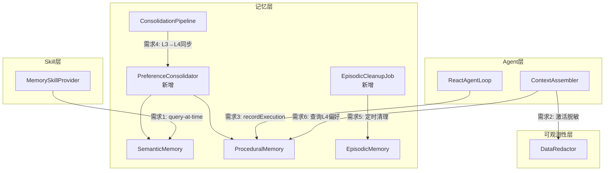

# 设计文档：记忆系统增强

## 概述

本设计覆盖记忆系统审计中发现的 6 项增强需求，涉及 4 个核心模块的变更：

1. **MemorySkillProvider** — 新增 `query-at-time` 工具，接入 `SemanticMemory.queryAtTime()`
2. **ContextAssembler** — 激活 `DataRedactor` 脱敏、移除死代码、整合 L4 偏好规则
3. **ReactAgentLoop** — 工具执行后记录 L4 操作模板执行结果
4. **ConsolidationPipeline** — 新增 `PreferenceConsolidator` 执行 L3→L4 偏好同步
5. **EpisodicCleanupJob** — 新增定时清理过期 L2 对话记录
6. **MemoryProperties** — 新增清理策略配置项

变更范围控制在记忆系统内部，不涉及 LLM 路由、前端 UI 或数据库 schema 变更（仅新增配置项）。

> **代码基线说明**：本设计基于 agentic-memory-tool 合并后的 develop 分支。
> agentic-memory-tool 对以下组件做了大幅重构：
> - **MemorySkillProvider**：从旧的 5 工具结构重构为 7 工具（search/recall/search-docs/create/update/delete/tag），query-at-time 作为第 8 个工具加入
> - **ContextAssembler**：构造器从旧的 16+ 参数简化为 2 参数（基础版）+ 8 参数（完整版，Agentic 模式），移除了完整检索管线，仅保留 L1 会话 + 用户画像 + 通知 + 系统提示词
> - **AgentAutoConfiguration**：contextAssembler bean 已适配新的 8 参数构造器
> - `buildMinimalContext` 和 `safeAllocate` 四参数重载在 agentic-memory-tool 中未被清理，仍需本 spec 处理

## 架构

### 变更影响范围



### 设计决策

| 决策 | 选项 | 选择 | 理由 |
|------|------|------|------|
| queryAtTime 接入方式 | A) 新增独立工具 B) 扩展 search 工具参数 | A | 语义清晰，避免 search 工具参数膨胀 |
| DataRedactor 脱敏时机 | A) 组装 userPrompt 前 B) 组装后整体脱敏 | A | 精确控制脱敏范围，避免误脱敏系统提示词 |
| L4 反馈闭环触发点 | A) executeToolCall 内部 B) coreLoop 外部 | A | 在工具执行结果已知的最近位置记录，减少状态传递 |
| PreferenceConsolidator 执行位置 | A) ConsolidationPipeline 内 B) 独立定时任务 | A | 与现有巩固管线编排一致，共享触发机制 |
| EpisodicCleanupJob 调度方式 | A) @Scheduled Cron B) MemoryAutoConfiguration 内定时 | A | 与现有巩固管线调度方式一致 |

## 组件与接口

### 需求 1：MemorySkillProvider 新增 query-at-time 工具

在 `MemorySkillProvider.registerTools()` 中新增 `builtin.memory.query-at-time` 工具：

```java
// 工具 ID: builtin.memory.query-at-time
// 输入参数:
//   - timestamp: String (ISO 8601 格式，必填)
//   - entityType: String (可选，过滤实体类型)
// 执行逻辑:
//   1. 解析 timestamp 为 Instant
//   2. 调用 semanticMemory.queryAtTime(instant)
//   3. 可选按 entityType 过滤
//   4. 格式化为可读文本返回
```

同时在 `provide()` 方法的 tools 列表中添加 `"builtin.memory.query-at-time"`。

### 需求 2：ContextAssembler 变更

**2a. 激活 DataRedactor**

在 `buildEnhancedUserPrompt()` 调用链中，对以下内容调用 `dataRedactor.redact()`：
- `formatUserProfileSection()` 的输出
- `formatConversationHistorySection()` 的输出

当 `dataRedactor == null`（基础版构造器）时跳过脱敏。

**2b. 移除死代码**

源码核对确认以下两个方法均为死代码，可安全删除：

- 删除 `buildMinimalContext(ReactAgentState)` 私有方法（Line 178）— 返回空字符串的最小上下文，`assembleBasic` 和 `buildFallbackContext` 已覆盖所有降级场景
- 删除 `safeAllocate(TokenBudgetAllocator allocator, int conversationTurns, float topScore, boolean hasMemoryData)` 四参数重载（Line 387）— 仅调用五参数版本并传 `sessionMaxTokens=0`，所有调用点已直接使用五参数版本

> 注：设计文档此前将四参数重载误标为"三参数重载"。实际签名为 `safeAllocate(TokenBudgetAllocator, int, float, boolean)`，共四个参数；五参数版本为 `safeAllocate(TokenBudgetAllocator, int, float, boolean, int)`。

### 需求 3：ReactAgentLoop L4 反馈闭环

在 `executeToolCall()` 方法中，工具执行成功后：

```java
// 伪代码：
if (success && proceduralMemory != null && intentMatcher != null) {
    try {
        var match = intentMatcher.match(toolId + " " + inputJson);
        match.ifPresent(m -> proceduralMemory.recordExecution(
            m.template().templateId(), success));
    } catch (Exception e) {
        log.warn("L4 执行结果记录失败: toolId={}, error={}", toolId, e.getMessage());
    }
}
```

ReactAgentLoop 需要新增两个可选依赖字段和构造器参数：
- `@Nullable ProceduralMemory proceduralMemory`
- `@Nullable IntentMatcher intentMatcher`

**构造器变更细节**：当前 ReactAgentLoop 构造器有 23 个参数（8 个必需 + 15 个可选）。新增的两个 `@Nullable` 参数追加到构造器末尾（`eventPublisher` 之后），使总参数数达到 25 个：

```java
public ReactAgentLoop(
        // ... 前 23 个参数不变 ...
        @Nullable org.springframework.context.ApplicationEventPublisher eventPublisher,
        @Nullable ProceduralMemory proceduralMemory,      // 新增
        @Nullable IntentMatcher intentMatcher) {           // 新增
```

同时需要在 `AgentAutoConfiguration`（或对应的 Agent Bean 注册处）同步修改构造调用点，注入 `ProceduralMemory` 和 `IntentMatcher` Bean（均为 `@Nullable`，记忆系统未启用时为 null）。

### 需求 4：PreferenceConsolidator

新增 `PreferenceConsolidator` 类，位于 `com.lifepilot.memory.consolidation` 包：

```java
/**
 * L3→L4 偏好同步器 — 将 L3 语义记忆中的 PREFERENCE 实体同步为 L4 偏好规则。
 *
 * @author zsg
 * @since 2026-03-13
 */
public class PreferenceConsolidator {
    private final SemanticMemory semanticMemory;
    private final ProceduralMemory proceduralMemory;

    /**
     * 执行偏好同步，返回同步统计。
     */
    public PreferenceSyncStats consolidate() {
        // 1. 查询 L3 当前有效 PREFERENCE 实体:
        //    semanticMemory.findCurrentByType(EntityType.PREFERENCE)
        // 2. 查询 L4 已有偏好规则:
        //    proceduralMemory.getPreferences("user-preference")
        // 3. 对比同步（基于 entity.name() 与 preferenceRule.key() 匹配）：
        //    - L3 有 + L4 无 → proceduralMemory.savePreference(新规则)
        //      category="user-preference", key=entity.name(), value=entity.description()
        //    - L3 有 + L4 有 → proceduralMemory.reinforcePreference(ruleId)
        //    - L3 归档(is_current=0) + L4 有 → proceduralMemory.deletePreference(ruleId)
        // 4. 返回 PreferenceSyncStats
    }
}
```

**返回值类型定义**：

```java
/**
 * 偏好同步统计。
 */
public record PreferenceSyncStats(int created, int reinforced, int deleted) {}
```

**ConsolidationPipeline 变更**：

构造器新增 `@Nullable PreferenceConsolidator preferenceConsolidator` 参数，追加到现有三个参数之后：

```java
public ConsolidationPipeline(EpisodicToSemanticConsolidator semanticConsolidator,
                              EpisodicToProceduralConsolidator proceduralConsolidator,
                              MemoryProperties properties,
                              @Nullable PreferenceConsolidator preferenceConsolidator) {
```

在 `consolidate()` 方法中，在语义巩固和程序巩固之后追加第三步：

```java
// 3. 偏好同步（L3→L4）— preferenceConsolidator 为 null 时跳过
if (preferenceConsolidator != null) {
    try {
        var syncStats = preferenceConsolidator.consolidate();
        log.info("巩固管线: 偏好同步完成, created={}, reinforced={}, deleted={}",
                syncStats.created(), syncStats.reinforced(), syncStats.deleted());
    } catch (Exception e) {
        log.warn("巩固管线: 偏好同步失败, error={}", e.getMessage(), e);
    }
}
```

### 需求 5：EpisodicCleanupJob

新增 `EpisodicCleanupJob` 类，位于 `com.lifepilot.memory.episodic` 包：

```java
/**
 * L2 情景记忆定时清理任务 — 删除过期对话记录，保留 pinned 对话。
 *
 * @author zsg
 * @since 2026-03-13
 */
public class EpisodicCleanupJob {
    private final EpisodicMemory episodicMemory;
    private final JdbcTemplate jdbcTemplate;
    private final MemoryProperties properties;

    @Scheduled(cron = "${lifepilot.memory.episodic-cleanup.cron}")
    public void cleanup() {
        // 清理逻辑：
        // 1. 用 JdbcTemplate 查询过期对话 ID（EpisodicMemory 无按时间范围批量删除方法）：
        //    SELECT c.id FROM conversations c
        //    WHERE c.created_at < ?  -- now - retentionDays
        //    AND c.id NOT IN (
        //        SELECT DISTINCT conversation_id FROM messages WHERE is_pinned = 1
        //    )
        //    LIMIT ?  -- maxCleanupPerRun
        // 2. 逐个调用 episodicMemory.delete(conversationId) 删除
        //    （delete 方法内部是 @Transactional，先删 messages 再删 conversations）
        // 3. 记录 INFO 日志：已清理对话数量和耗时
        // 4. 异常时记录 WARN 日志并终止本次清理
    }
}
```

> 设计说明：JdbcTemplate 仅用于查询过期对话 ID + 排除 pinned 对话，实际删除操作使用 `EpisodicMemory.delete(conversationId)` 以复用其 `@Transactional` 事务逻辑（先删 messages 再删 conversations）。

**MemoryAutoConfiguration Bean 注册**：

```java
// --- PreferenceConsolidator ---
@Bean
@ConditionalOnMissingBean
@ConditionalOnBean({SemanticMemory.class, ProceduralMemory.class})
public PreferenceConsolidator preferenceConsolidator(
        SemanticMemory semanticMemory,
        ProceduralMemory proceduralMemory) {
    log.info("记忆系统: 注册 PreferenceConsolidator");
    return new PreferenceConsolidator(semanticMemory, proceduralMemory);
}

// --- EpisodicCleanupJob ---
@Bean
@ConditionalOnMissingBean
@ConditionalOnBean(EpisodicMemory.class)
public EpisodicCleanupJob episodicCleanupJob(
        EpisodicMemory episodicMemory,
        JdbcTemplate jdbcTemplate,
        MemoryProperties properties) {
    log.info("记忆系统: 注册 EpisodicCleanupJob, cron={}, retentionDays={}",
            properties.getEpisodicCleanup().getCron(),
            properties.getEpisodicCleanup().getRetentionDays());
    return new EpisodicCleanupJob(episodicMemory, jdbcTemplate, properties);
}

// --- ConsolidationPipeline 变更 ---
// 构造器新增 @Nullable PreferenceConsolidator 参数：
@Bean
@ConditionalOnMissingBean
@ConditionalOnBean({EpisodicToSemanticConsolidator.class, EpisodicToProceduralConsolidator.class})
public ConsolidationPipeline consolidationPipeline(
        EpisodicToSemanticConsolidator semanticConsolidator,
        EpisodicToProceduralConsolidator proceduralConsolidator,
        MemoryProperties properties,
        @Nullable PreferenceConsolidator preferenceConsolidator) {
    log.info("记忆系统: 注册 ConsolidationPipeline, preferenceSync={}",
            preferenceConsolidator != null ? "启用" : "禁用");
    return new ConsolidationPipeline(semanticConsolidator, proceduralConsolidator,
            properties, preferenceConsolidator);
}
```

> 注：`MemoryAutoConfiguration` 已标注 `@EnableScheduling`，`EpisodicCleanupJob` 的 `@Scheduled` 注解可被正常触发。

### 需求 6：ContextAssembler 整合 L4 偏好规则

修改 `safeGetUserProfile()` 方法，在现有 L3 实体查询流程中插入 L4 偏好规则查询。

**现有流程**（源码 Line 320+）：
1. 遍历 PREFERENCE/HABIT/GOAL 三种 EntityType 调用 `semanticMemory.findCurrentByType()`
2. 关键词匹配过滤
3. 按 `importanceScore` 排序截断
4. 调用 `formatUserProfile()` 格式化

**新增逻辑**（在步骤 3 之后、步骤 4 之前插入）：

```java
// 步骤 3.5：查询 L4 高置信度偏好规则并合并
if (proceduralMemory != null) {
    var preferenceRules = proceduralMemory.getPreferences("user-preference").stream()
            .filter(PreferenceRule::isHighConfidence)  // confidence >= 0.7
            .toList();

    // 去重：基于 entity.name() 与 preferenceRule.key() 匹配
    // L4 规则优先 — 从 selected 中移除与 L4 规则同名的 L3 实体
    var l4Keys = preferenceRules.stream()
            .map(PreferenceRule::key)
            .collect(Collectors.toSet());
    selected = selected.stream()
            .filter(e -> !(e.type() == EntityType.PREFERENCE && l4Keys.contains(e.name())))
            .toList();

    // 将 L4 规则格式化并追加到画像文本
    // 格式: "[偏好规则] {key}: {value}（置信度: {confidence}）"
}
```

**ContextAssembler 构造器变更**：

当前完整版构造器（agentic-memory-tool 后）有 8 个参数。新增 `@Nullable ProceduralMemory proceduralMemory` 参数，追加到 `memoryProperties` 之后、`promptRegistry` 之前，使总参数数达到 9 个：

```java
/** 完整版构造器（注入记忆系统依赖）。 */
public ContextAssembler(AgentConfigProperties config,
                        WorkingMemory workingMemory,
                        TokenBudgetAllocator tokenBudgetAllocator,
                        @Nullable DataRedactor dataRedactor,
                        @Nullable SemanticMemory semanticMemory,
                        @Nullable PassiveNotificationQueue passiveNotificationQueue,
                        @Nullable com.lifepilot.memory.config.MemoryProperties memoryProperties,
                        @Nullable ProceduralMemory proceduralMemory,  // 新增（第 8 位）
                        PromptRegistry promptRegistry) {              // 原第 8 位→第 9 位
```

基础版构造器（2 参数）中 `proceduralMemory` 字段设为 `null`。

同时需要在 `AgentAutoConfiguration.contextAssembler()` bean 方法中新增 `@Autowired(required = false) ProceduralMemory proceduralMemory` 参数并传入构造器。

## 依赖接口验证

| 接口 | 源码位置 | 验证状态 |
|------|---------|---------|
| `SemanticMemory.queryAtTime(Instant)` | `com.lifepilot.memory.semantic.SemanticMemory` | ✅ 已核对 — 返回 `List<TemporalEntity>` |
| `SemanticMemory.findCurrentByType(EntityType)` | `com.lifepilot.memory.semantic.SemanticMemory` | ✅ 已核对 — 返回 `List<TemporalEntity>`，按 importanceScore DESC |
| `ProceduralMemory.recordExecution(String, boolean)` | `com.lifepilot.memory.procedural.ProceduralMemory` | ✅ 已核对 — 加权平均更新 successRate + 递增 useCount |
| `ProceduralMemory.savePreference(PreferenceRule)` | `com.lifepilot.memory.procedural.ProceduralMemory` | ✅ 已核对 — INSERT OR REPLACE |
| `ProceduralMemory.reinforcePreference(String)` | `com.lifepilot.memory.procedural.ProceduralMemory` | ✅ 已核对 — observationCount+1, confidence+0.05, 上限 1.0 |
| `ProceduralMemory.deletePreference(String)` | `com.lifepilot.memory.procedural.ProceduralMemory` | ✅ 已核对 — 返回 boolean |
| `ProceduralMemory.getPreferences(String)` | `com.lifepilot.memory.procedural.ProceduralMemory` | ✅ 已核对 — 按 category 查询 |
| `ProceduralMemory.findPreference(String, String)` | `com.lifepilot.memory.procedural.ProceduralMemory` | ✅ 已核对 — 按 category+key 查询 |
| `IntentMatcher.match(String)` | `com.lifepilot.memory.procedural.IntentMatcher` | ✅ 已核对 — 返回 `Optional<TemplateMatch>` |
| `DataRedactor.redact(String)` | `com.lifepilot.observability.redactor.DataRedactor` | ✅ 已核对 — null 输入返回空字符串 |
| `PreferenceRule.isHighConfidence()` | `com.lifepilot.memory.procedural.PreferenceRule` | ✅ 已核对 — confidence >= 0.7f |
| `EpisodicMemory.delete(String)` | `com.lifepilot.memory.episodic.EpisodicMemory` | ✅ 已核对 — @Transactional，先删 messages 再删 conversations |
| `MessageRecord.isPinned()` | `com.lifepilot.memory.episodic.MessageRecord` | ✅ 已核对 — boolean 字段 |
| `ConsolidationPipeline.consolidate()` | `com.lifepilot.memory.consolidation.ConsolidationPipeline` | ✅ 已核对 — 顺序执行语义+程序巩固 |
| `MemoryAutoConfiguration` | `com.lifepilot.memory.config.MemoryAutoConfiguration` | ✅ 已核对 — 已标注 `@EnableScheduling`，ConsolidationPipeline Bean 依赖两个巩固器 |

### 跨模块接口变更

| 变更接口 | 所属模块 | 变更内容 | 影响模块 |
|---------|---------|---------|---------|
| `ContextAssembler` 完整版构造器 | agent | 新增 `@Nullable ProceduralMemory` 参数（`memoryProperties` 之后、`promptRegistry` 之前） | AgentAutoConfiguration 构造调用点 |
| `ReactAgentLoop` 构造器 | agent | 末尾追加 `@Nullable ProceduralMemory` + `@Nullable IntentMatcher` 参数（23→25 个） | AgentAutoConfiguration 构造调用点 |
| `ConsolidationPipeline` 构造器 | memory | 新增 `@Nullable PreferenceConsolidator` 参数（末尾追加） | MemoryAutoConfiguration Bean 注册 |
| `MemorySkillProvider.provide()` | skill | tools 列表新增 `builtin.memory.query-at-time` | 无外部影响 |

## 数据模型

### 现有数据模型（无变更）

本次增强不涉及数据库 schema 变更，所有操作基于现有表结构：

- `temporal_entities` — L3 时序实体表（queryAtTime 查询、PREFERENCE 类型同步）
- `preference_rules` — L4 偏好规则表（PreferenceConsolidator 读写）
- `procedure_templates` — L4 操作模板表（recordExecution 更新）
- `conversations` + `messages` — L2 对话记录表（EpisodicCleanupJob 清理）

### 新增配置项

在 `MemoryProperties` 中新增 `EpisodicCleanup` 嵌套配置类：

```java
/** L2 情景记忆自动清理配置。 */
public static class EpisodicCleanup {
    /** 清理 Cron 表达式，默认每日凌晨 5:00。 */
    private String cron = "0 0 5 * * *";
    /** 保留天数，默认 90。 */
    private int retentionDays = 90;
    /** 单次最大清理数量，默认 500。 */
    private int maxCleanupPerRun = 500;
}
```

对应配置键：
- `lifepilot.memory.episodic-cleanup.cron`
- `lifepilot.memory.episodic-cleanup.retention-days`
- `lifepilot.memory.episodic-cleanup.max-cleanup-per-run`

### 新增 record 类型

```java
/** 偏好同步统计。 */
public record PreferenceSyncStats(int created, int reinforced, int deleted) {}
```

### application.yml 变更

按编码规范 §12，新增配置项必须在 `application.yml` 中显式声明默认值。在 `lifepilot.memory` 节点下追加：

```yaml
lifepilot:
  memory:
    # ... 现有配置不变 ...
    # L2 情景记忆自动清理
    episodic-cleanup:
      cron: "0 0 5 * * *"
      retention-days: 90
      max-cleanup-per-run: 500
```

## 正确性属性

*正确性属性是系统在所有有效执行中都应保持为真的特征或行为——本质上是对系统应做什么的形式化陈述。属性是人类可读规格说明与机器可验证正确性保证之间的桥梁。*

### Property 1: queryAtTime 返回的实体在指定时间点有效

*For any* 时间点 `t` 和 L3 时序实体集合，调用 `queryAtTime(t)` 返回的每个 `TemporalEntity` 都应满足 `createdAt <= t` 且（`archivedAt == null` 或 `archivedAt > t`）。

**Validates: Requirements 1.1**

### Property 2: queryAtTime 结果格式化包含所有实体信息

*For any* 非空的 `List<TemporalEntity>` 返回结果，格式化后的文本应包含每个实体的 `name` 和 `type` 信息。

**Validates: Requirements 1.2**

### Property 3: DataRedactor 脱敏一致性

*For any* ContextAssembler 实例，当 `dataRedactor != null` 时，组装后的 User Prompt 中用户画像区域和对话历史区域的内容应等于对原始内容调用 `dataRedactor.redact()` 的结果；当 `dataRedactor == null` 时，应等于原始内容。

**Validates: Requirements 2.1, 2.2**

### Property 4: recordExecution 更新 successRate 的加权平均不变量

*For any* 操作模板，初始 `successRate = r`、`useCount = n`，调用 `recordExecution(templateId, success)` 后，新的 `successRate` 应等于 `(r * n + (success ? 1 : 0)) / (n + 1)`，且 `useCount` 应等于 `n + 1`。

**Validates: Requirements 3.2**

### Property 5: L4 反馈闭环异常不阻塞 Agent 主循环

*For any* 工具调用，即使 `intentMatcher.match()` 或 `proceduralMemory.recordExecution()` 抛出异常，`executeToolCall()` 方法应正常返回更新后的 `ReactAgentState`，不传播异常。

**Validates: Requirements 3.3, 3.4**

### Property 6: 偏好同步后 L4 规则与 L3 当前有效 PREFERENCE 实体一致

*For any* L3 当前有效 PREFERENCE 实体集合和 L4 已有偏好规则集合，执行 `PreferenceConsolidator.consolidate()` 后：
- L3 中每个当前有效 PREFERENCE 实体在 L4 中都应有对应的 PreferenceRule（key = entity.name()）
- L4 中不应存在 L3 中已归档的 PREFERENCE 实体对应的 PreferenceRule
- 返回的 `PreferenceSyncStats` 中 `created + reinforced + deleted` 应等于实际执行的操作总数

**Validates: Requirements 4.2, 4.3, 4.4, 4.5**

### Property 7: 清理任务保留 pinned 对话且删除过期非 pinned 对话

*For any* 对话记录集合，执行清理后：
- `created_at` 早于 `now - retentionDays` 且不包含 pinned 消息的对话应被删除
- 包含至少一条 `isPinned=true` 消息的对话应被保留，无论其 `created_at` 时间
- `created_at` 晚于 `now - retentionDays` 的对话应被保留

**Validates: Requirements 5.2, 5.3**

### Property 8: 用户画像 L4 优先去重

*For any* L3 PREFERENCE 实体集合和 L4 高置信度偏好规则集合，当存在 `entity.name() == preferenceRule.key()` 的同名条目时，最终用户画像文本中应包含 L4 规则的格式化文本（`[偏好规则] {key}: {value}（置信度: {confidence}）`），不应包含同名 L3 实体的格式化文本。

**Validates: Requirements 6.1, 6.2, 6.3**

### Property 9: L4 偏好规则格式化一致性

*For any* `PreferenceRule`，其格式化输出应匹配模式 `[偏好规则] {key}: {value}（置信度: {confidence}）`，其中 `{confidence}` 保留合理精度。

**Validates: Requirements 6.3**

## 错误处理

### 分层降级策略

| 组件 | 异常场景 | 处理方式 |
|------|---------|---------|
| MemorySkillProvider (query-at-time) | timestamp 格式无效 | 返回错误提示文本，不抛异常 |
| MemorySkillProvider (query-at-time) | SemanticMemory 查询异常 | 捕获异常，返回 "查询失败" 提示 |
| ContextAssembler (DataRedactor) | `dataRedactor.redact()` 抛异常 | 捕获异常，降级使用原始文本，记录 WARN 日志 |
| ContextAssembler (L4 偏好查询) | `proceduralMemory.getPreferences()` 抛异常 | 捕获异常，降级为仅使用 L3 实体，记录 WARN 日志 |
| ContextAssembler (L4 偏好查询) | `proceduralMemory == null` | 跳过 L4 查询，仅使用 L3 实体（正常降级路径） |
| ReactAgentLoop (L4 反馈) | `intentMatcher.match()` 抛异常 | 捕获异常，记录 WARN 日志，继续 Agent 主循环 |
| ReactAgentLoop (L4 反馈) | `proceduralMemory.recordExecution()` 抛异常 | 捕获异常，记录 WARN 日志，继续 Agent 主循环 |
| ReactAgentLoop (L4 反馈) | `proceduralMemory == null` 或 `intentMatcher == null` | 跳过反馈记录（正常降级路径） |
| PreferenceConsolidator | 单条偏好同步失败 | 捕获异常，跳过该条，继续处理剩余条目，记录 WARN 日志 |
| ConsolidationPipeline | PreferenceConsolidator 整体失败 | 捕获异常，记录 WARN 日志，不影响语义巩固和程序巩固的结果 |
| EpisodicCleanupJob | 单条对话删除失败 | 捕获异常，跳过该条，继续处理剩余对话，记录 WARN 日志 |
| EpisodicCleanupJob | 查询过期对话 ID 失败 | 捕获异常，记录 WARN 日志，终止本次清理，不影响下次调度 |

### 核心原则

1. **记忆增强功能不阻塞核心流程**：所有新增的记忆相关操作（L4 反馈、偏好同步、脱敏）失败时，核心功能（Agent 对话、上下文组装）继续正常工作
2. **巩固管线故障隔离**：三个巩固步骤（语义、程序、偏好同步）相互独立，单个失败不影响其他
3. **清理任务幂等安全**：`EpisodicMemory.delete()` 是幂等的（对话不存在时返回 false），重复执行不会产生副作用

## 测试策略

### 属性测试（Property-Based Testing）

使用 **jqwik** 作为属性测试框架（项目已引入），每个属性测试最少运行 100 次迭代。

每个属性测试必须以注释标注对应的设计属性：

```java
// Feature: memory-system-enhancement, Property 4: recordExecution 更新 successRate 的加权平均不变量
@Property(tries = 100)
void recordExecution_加权平均更新(@ForAll @IntRange(min = 1, max = 1000) int useCount,
                                  @ForAll @FloatRange(min = 0, max = 1) float successRate,
                                  @ForAll boolean success) {
    // ...
}
```

属性测试覆盖：

| 属性 | 测试类 | 说明 |
|------|--------|------|
| Property 1 | `MemorySkillProvider_queryAtTime_属性测试` | 生成随机时间点和实体集合，验证返回实体的时间有效性 |
| Property 3 | `ContextAssembler_脱敏_属性测试` | 生成随机画像文本，验证脱敏/非脱敏路径的输出一致性 |
| Property 4 | `ProceduralMemory_recordExecution_属性测试` | 生成随机 successRate/useCount/success，验证加权平均公式 |
| Property 6 | `PreferenceConsolidator_同步_属性测试` | 生成随机 L3 实体集合和 L4 规则集合，验证同步后一致性 |
| Property 7 | `EpisodicCleanupJob_清理_属性测试` | 生成随机对话集合（含/不含 pinned），验证清理后保留策略 |
| Property 8 | `ContextAssembler_L4偏好去重_属性测试` | 生成随机同名/不同名的 L3 实体和 L4 规则，验证去重优先级 |

### 单元测试

单元测试聚焦于具体示例、边界条件和错误处理：

| 测试类 | 覆盖内容 |
|--------|---------|
| `MemorySkillProvider_queryAtTime_测试` | 正常查询、空结果、无效时间格式、entityType 过滤 |
| `ContextAssembler_脱敏_测试` | DataRedactor 为 null 时跳过、redact 抛异常时降级 |
| `ContextAssembler_死代码移除_测试` | 反射验证 buildMinimalContext 和 safeAllocate 四参数重载不存在 |
| `ReactAgentLoop_L4反馈_测试` | 匹配成功记录、无匹配跳过、异常不阻塞 |
| `PreferenceConsolidator_测试` | 新建/强化/删除三种场景、空集合、单条失败不影响整体 |
| `EpisodicCleanupJob_测试` | 正常清理、pinned 保留、maxCleanupPerRun 限制、异常处理 |
| `ContextAssembler_L4偏好_测试` | ProceduralMemory 为 null 降级、同名去重、格式化验证 |

### 集成测试

| 测试类 | 覆盖内容 |
|--------|---------|
| `ConsolidationPipeline_偏好同步_集成测试` | 验证巩固管线三步骤顺序执行，PreferenceConsolidator 为 null 时跳过 |
| `EpisodicCleanupJob_集成测试` | 使用内存 SQLite 验证端到端清理流程（写入→过期→清理→验证） |
| `MemoryAutoConfiguration_新Bean_集成测试` | 验证 PreferenceConsolidator 和 EpisodicCleanupJob Bean 正确注册 |
