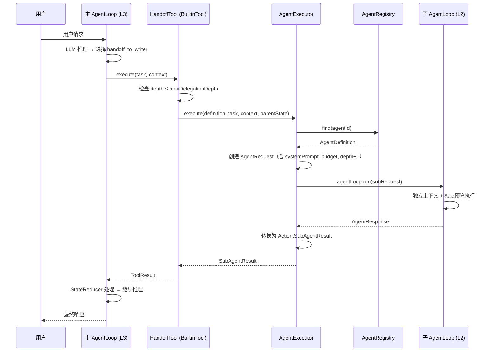

# Design Document — 多 Agent 协作（模块 21）

## 概述

本设计文档聚焦多 Agent 协作模块的实现方案。架构决策和理论基础详见 `docs/architecture/multi-agent-v2.md`，本文档不重复。

核心实现目标：
1. 创建 Agent 层（L2）数据模型和注册中心
2. 实现 HandoffTool 委托机制（复用 BuiltinTool + DynamicToolRegistry）
3. 实现 AgentExecutor 隔离执行（复用 AgentLoop.run()）
4. 实现 Markdown Agent 定义加载与热加载
5. 注册三个预设专家 Agent（writer / life-coach / planner）
6. 清理 Skill 系统中的 SubAgent 激活路径
7. 实现 ToolDiscoveryService 工具发现能力

参考文档：
- 架构设计：`docs/architecture/multi-agent-v2.md`
- 特性设计：`docs/features/multi-agent-v2.md`
- 需求文档：`.kiro/specs/multi-agent/requirements.md`

---

## 依赖接口验证

| 接口 | 源码位置 | 验证状态 | 备注 |
|------|---------|---------|------|
| `AgentLoop.run(AgentRequest)` | `com.lifepilot.agent.AgentLoop` | ✅ 已核对 | 参数为 AgentRequest，返回 AgentResponse |
| `AgentState.forSubAgent(parentState, subGoal, subBudget)` | `com.lifepilot.agent.model.AgentState` | ✅ 已核对 | 静态方法，depth = parent.depth + 1 |
| `Action.SubAgentResult(subTraceId, skillId, success, output, tokensUsed)` | `com.lifepilot.agent.model.Action` | ✅ 已核对 | 字段名 skillId 沿用，语义扩展为 agentId |
| `Budget(maxTokens, tokensUsed, tokensReserved, maxSteps, maxDuration, elapsed)` | `com.lifepilot.agent.model.Budget` | ✅ 已核对 | @Builder(toBuilder=true)，有 defaultBudget() 静态方法 |
| `DynamicToolRegistry.registerBuiltinTool(tool)` | `com.lifepilot.tool.registry.DynamicToolRegistry` | ✅ 已核对 | 无 unregisterBuiltinTool 方法，需新增 |
| `DynamicToolRegistry.resolve(toolId)` | `com.lifepilot.tool.registry.DynamicToolRegistry` | ✅ 已核对 | 返回 Optional<ToolContract> |
| `DynamicToolRegistry.getAllTools()` | `com.lifepilot.tool.registry.DynamicToolRegistry` | ✅ 已核对 | 返回 List<ToolContract> 不可变列表 |
| `ToolContract` | `com.lifepilot.tool.ToolContract` | ✅ 已核对 | sealed interface permits BuiltinTool, YamlTool, McpTool |
| `BuiltinTool` | `com.lifepilot.tool.BuiltinTool` | ✅ 已核对 | record + Builder 模式，executor lambda |
| `LlmRouter.call(scene, prompt, outputSchema)` | `com.lifepilot.llm.LlmRouter` | ✅ 已核对 | 场景路由，无直接 providerId 选择 |
| `TraceRecorder.startTrace/recordStep/endTrace` | `com.lifepilot.observability.trace.TraceRecorder` | ✅ 已核对 | 接口，支持元数据 |
| `SkillDefinition.preferredProviderId` | `com.lifepilot.skill.model.SkillDefinition` | ✅ 已核对 | @Nullable String，需移除 |
| `SubAgentFactory.activate(skillId, input, parentState)` | `com.lifepilot.skill.activation.SubAgentFactory` | ✅ 已核对 | 需标记 @Deprecated |
| `SkillToToolBridge` | `com.lifepilot.skill.bridge.SkillToToolBridge` | ✅ 已核对 | 委托 SkillLifecycleManager.activate()，需移除 SubAgent 路径 |
| `SkillLifecycleManager.activate(skillId, input, parentState)` | `com.lifepilot.skill.activation.SkillLifecycleManager` | ✅ 已核对 | 委托 SubAgentFactory.activate()，需移除 |
| `AgentAutoConfiguration` | `com.lifepilot.agent.config.AgentAutoConfiguration` | ✅ 已核对 | @ConditionalOnProperty prefix="lifepilot.agent" |
| `SkillAutoConfiguration` | `com.lifepilot.skill.config.SkillAutoConfiguration` | ✅ 已核对 | @ConditionalOnProperty prefix="lifepilot.skills" |
| `AgentToolProvider` | `com.lifepilot.agent.AgentToolProvider` | ✅ 已核对 | 接口，getToolCallbacks(AgentState) |

---

## 跨模块接口变更

| 变更接口 | 所属模块 | 变更内容 | 影响模块 | 说明 |
|---------|---------|---------|---------|------|
| `ToolContract` | tool | permits 列表不变，HandoffTool 通过 BuiltinTool 包装 | 无影响 | 不修改 sealed interface |
| `DynamicToolRegistry` | tool | 新增 `unregisterBuiltinTool(String toolId)` 方法 | multi-agent | AgentToToolBridge 注销 HandoffTool 需要 |
| `SkillDefinition` | skill | 移除 `preferredProviderId` 字段 | skill 模块内部 | Skill 不使用 LLM |
| `SubAgentFactory` | skill | 直接删除 | skill 模块内部 | 职责迁移到 AgentExecutor |
| `SkillToToolBridge` | skill | 移除 SubAgent 激活路径 | skill 模块内部 | Skill 回归 L1 |
| `SkillLifecycleManager` | skill | 移除 SubAgent 委托逻辑 | skill 模块内部 | Skill 回归 L1 |

---

## 架构

### 包结构

```
com.lifepilot.multiagent
├── model/
│   ├── AgentDefinition.java          // Agent 蓝图 record
│   ├── AgentBudget.java              // Agent 独立预算 record
│   ├── AgentSource.java              // 来源 sealed interface
│   └── AgentRegistryEvent.java       // 注册/注销事件
├── registry/
│   └── AgentRegistry.java            // Agent 注册中心
├── execution/
│   ├── AgentExecutor.java            // Agent 执行器
│   └── HandoffToolFactory.java       // HandoffTool 工厂（创建 BuiltinTool 实例）
├── bridge/
│   └── AgentToToolBridge.java        // Agent→Tool 桥接（EventListener）
├── loader/
│   ├── AgentMarkdownLoader.java      // Markdown 加载器
│   └── AgentMarkdownParser.java      // YAML Frontmatter + Markdown 解析
├── discovery/
│   └── ToolDiscoveryService.java     // 工具发现服务
├── config/
│   ├── MultiAgentProperties.java     // @ConfigurationProperties
│   └── MultiAgentAutoConfiguration.java // Spring AutoConfiguration
└── preset/                           // classpath 资源目录
    ├── writer.md
    ├── life-coach.md
    └── planner.md
```

### 关键设计决策

**1. HandoffTool 不直接实现 ToolContract**

源码验证发现 `ToolContract` 是 sealed interface（permits BuiltinTool, YamlTool, McpTool）。HandoffTool 无法新增为 permits 子类型（会影响所有 switch 穷举）。

方案：复用 `BuiltinTool` record + executor lambda 模式（与 SkillToToolBridge 一致）。`HandoffToolFactory` 负责为每个 AgentDefinition 创建对应的 BuiltinTool 实例。

**2. DynamicToolRegistry 需新增 unregisterBuiltinTool 方法**

源码验证发现 DynamicToolRegistry 缺少单个 BuiltinTool 注销方法（SkillToToolBridge 也遇到了同样问题，当前只记录 WARN 日志）。AgentToToolBridge 需要在 Agent 注销时同步注销 HandoffTool。

方案：新增 `unregisterBuiltinTool(String toolId)` 方法，从 tools/toolLayers ConcurrentHashMap 中移除，发布 ToolsUnregistered 事件。

**3. AgentExecutor 不直接调用 AgentLoop.run()**

源码验证发现 `AgentLoop.run()` 接受 `AgentRequest` 参数，内部自行创建 `AgentState`（通过 `AgentState.init()` 或 `AgentState.fromSession()`）。这意味着 AgentExecutor 无法直接传入自定义的 AgentState（含独立 Budget、depth+1）。

方案：AgentExecutor 需要一种方式将 Agent 的 System Prompt、Budget、depth 等信息传递给 AgentLoop。两种选择：
- **方案 A**：扩展 AgentRequest，新增可选字段（systemPrompt、budget、parentTraceId、depth）
- **方案 B**：新增 AgentLoop.runSubAgent() 方法，直接接受 AgentState

选择方案 A：扩展 AgentRequest 更轻量，不修改 AgentLoop 核心逻辑。AgentRequest 新增可选字段后，AgentLoop.run() 内部判断是否为 SubAgent 请求，使用对应的初始化路径。

**4. preferredProvider 映射到 LlmRouter 场景**

源码验证发现 LlmRouter 基于场景（scene）路由，不支持直接指定 providerId。

方案：AgentExecutor 在调用 AgentLoop 前，通过 AgentRequest 传递 preferredProvider。AgentLoop 内部将 preferredProvider 作为场景名传递给 LlmRouter（LlmRouter 的 ProviderRegistry 支持按 scene 查找 Provider）。如果 preferredProvider 为 null，使用默认场景。

---

## 组件与接口

### AgentDefinition — Agent 蓝图

```java
@Builder(toBuilder = true)
public record AgentDefinition(
    String id,                          // kebab-case 唯一标识
    String name,                        // 显示名称
    String description,                 // 能力描述（用于 HandoffTool 描述）
    String systemPrompt,                // Markdown 正文作为 System Prompt
    List<String> allowedTools,          // 工具白名单（toolId 列表）
    boolean canDelegate,                // 是否允许嵌套委托
    AgentBudget budget,                 // 独立预算
    @Nullable String preferredProvider, // 偏好 LLM Provider ID
    AgentSource source,                 // 来源类型
    Map<String, String> metadata        // 扩展元数据
) {
    /** 紧凑构造器 — 防御性拷贝 + 校验。 */
    public AgentDefinition {
        if (id == null || id.isBlank()) throw new IllegalArgumentException("Agent ID 不能为空");
        if (name == null || name.isBlank()) throw new IllegalArgumentException("Agent 名称不能为空");
        if (systemPrompt == null || systemPrompt.isBlank()) throw new IllegalArgumentException("System Prompt 不能为空");
        allowedTools = List.copyOf(allowedTools);
        metadata = Map.copyOf(metadata);
    }
}
```

### AgentBudget — 独立预算

```java
public record AgentBudget(int maxTokens, int maxSteps, int timeoutSeconds) {
    public static final AgentBudget DEFAULT = new AgentBudget(16000, 15, 180);
    public static final AgentBudget LIGHTWEIGHT = new AgentBudget(4000, 8, 60);
    public static final AgentBudget HEAVYWEIGHT = new AgentBudget(32000, 25, 300);

    /** 转换为 AgentLoop 使用的 Budget record。 */
    public Budget toAgentBudget() {
        return Budget.builder()
                .maxTokens(maxTokens).tokensUsed(0).tokensReserved(0)
                .maxSteps(maxSteps)
                .maxDuration(Duration.ofSeconds(timeoutSeconds))
                .elapsed(Duration.ZERO)
                .build();
    }
}
```

### AgentSource — 来源密封接口

```java
public sealed interface AgentSource permits AgentSource.Builtin, AgentSource.MarkdownDefined {
    record Builtin() implements AgentSource {}
    record MarkdownDefined(String filePath, @Nullable Instant lastModified) implements AgentSource {}
}
```

### AgentRegistryEvent — 注册/注销事件

```java
public sealed interface AgentRegistryEvent permits
        AgentRegistryEvent.AgentRegistered,
        AgentRegistryEvent.AgentUnregistered {
    record AgentRegistered(AgentDefinition definition) implements AgentRegistryEvent {}
    record AgentUnregistered(String agentId) implements AgentRegistryEvent {}
}
```

### AgentRegistry — 注册中心

```java
public class AgentRegistry {
    private final ConcurrentHashMap<String, AgentDefinition> agents = new ConcurrentHashMap<>();
    private final ApplicationEventPublisher eventPublisher;

    /** 注册 Agent，返回是否成功。Builtin 不允许被 Builtin 覆盖，MarkdownDefined 可覆盖 Builtin。 */
    public boolean register(AgentDefinition definition);

    /** 注销 Agent，返回是否成功。 */
    public boolean unregister(String agentId);

    /** 按 ID 查找。 */
    public Optional<AgentDefinition> find(String agentId);

    /** 列出所有已注册 Agent。 */
    public List<AgentDefinition> listAll();

    /** 批量注销指定来源类型的 Agent，返回注销数量。 */
    public int unregisterBySource(Class<? extends AgentSource> sourceType);
}
```

### AgentExecutor — 执行器

```java
public class AgentExecutor {
    private final AgentLoop agentLoop;
    private final DynamicToolRegistry toolRegistry;
    private final MultiAgentProperties config;

    /**
     * 执行 Agent 委托任务。
     *
     * 流程：
     * 1. 检查 parentState.depth + 1 ≤ maxDelegationDepth
     * 2. 创建独立 Budget（AgentBudget.toAgentBudget()）
     * 3. 构建 AgentRequest（含 systemPrompt、budget、parentTraceId、depth）
     * 4. 调用 agentLoop.run(subRequest)
     * 5. 将 AgentResponse 转换为 Action.SubAgentResult
     * 6. 异常捕获 → success=false 的 SubAgentResult
     */
    public Action.SubAgentResult execute(
            AgentDefinition definition,
            String task,
            @Nullable String context,
            AgentState parentState);
}
```

### HandoffToolFactory — HandoffTool 工厂

```java
public class HandoffToolFactory {
    private final AgentRegistry agentRegistry;
    private final AgentExecutor agentExecutor;

    /**
     * 为指定 AgentDefinition 创建 BuiltinTool 实例。
     * 工具 ID 格式：handoff_to_{agentId}
     * executor lambda 内部调用 AgentExecutor.execute()
     */
    public BuiltinTool createHandoffTool(AgentDefinition definition);
}
```

### AgentToToolBridge — 事件驱动桥接

```java
public class AgentToToolBridge {
    private final DynamicToolRegistry toolRegistry;
    private final HandoffToolFactory handoffToolFactory;
    private final MultiAgentProperties config;

    @EventListener
    public void onAgentRegistered(AgentRegistryEvent.AgentRegistered event);

    @EventListener
    public void onAgentUnregistered(AgentRegistryEvent.AgentUnregistered event);
}
```

### AgentMarkdownLoader — Markdown 加载与热加载

```java
public class AgentMarkdownLoader {
    private final AgentRegistry agentRegistry;
    private final AgentMarkdownParser parser;
    private final MultiAgentProperties config;

    /** 从目录加载所有 .md 文件。 */
    public List<AgentDefinition> loadFromDirectory(Path directory);

    /** 解析单个 .md 文件。 */
    public Optional<AgentDefinition> loadFromFile(Path file);

    /** 启动热加载定时扫描（ScheduledExecutorService）。 */
    public void startHotReload();

    /** 停止热加载。 */
    public void stopHotReload();
}
```

### AgentMarkdownParser — YAML Frontmatter 解析

```java
public class AgentMarkdownParser {
    /**
     * 解析 Markdown 文件内容为 AgentDefinition。
     * 分离 YAML Frontmatter（--- 分隔符）和 Markdown 正文。
     * Frontmatter → 结构化字段，正文 → systemPrompt。
     */
    public Optional<AgentDefinition> parse(String content, Path filePath);
}
```

### ToolDiscoveryService — 工具发现

```java
public class ToolDiscoveryService {
    private final DynamicToolRegistry toolRegistry;

    /** 工具摘要 record。 */
    public record ToolSummary(String toolId, String name, String description, String sourceType) {}

    /** 列出所有可用工具（排除 HandoffTool）。 */
    public List<ToolSummary> listAvailableTools();
}
```

### AgentRequest 扩展

```java
// 现有 AgentRequest 直接扩展字段以支持 SubAgent 执行（无需兼容旧构造器）
public record AgentRequest(
    String message,
    String sessionId,
    String channel,
    @Nullable String systemPrompt,       // Agent 专属 System Prompt
    @Nullable Budget budget,             // 独立预算（覆盖默认）
    @Nullable String parentTraceId,      // 父 traceId
    int depth,                           // 委托深度（默认 0）
    @Nullable String preferredProvider,  // 偏好 LLM Provider
    @Nullable List<String> allowedToolIds // 工具白名单
) {
}
```

---

## 数据模型

### MultiAgentProperties — 配置类

```java
@ConfigurationProperties(prefix = "lifepilot.agent.multi-agent")
public class MultiAgentProperties {
    private boolean enabled = true;
    private int maxDelegationDepth = 2;
    private String agentDefinitionsPath = "~/.lifepilot/agents/";
    private boolean registerHandoffTools = true;
    private HotReload hotReload = new HotReload();
    private BudgetDefaults budget = new BudgetDefaults();

    public static class HotReload {
        private boolean enabled = true;
        private int scanIntervalSeconds = 5;
        // getters/setters
    }

    public static class BudgetDefaults {
        private int defaultMaxTokens = 16000;
        private int defaultMaxSteps = 15;
        private int defaultTimeoutSeconds = 180;
        // getters/setters
    }
    // getters/setters
}
```

### Markdown Agent 定义文件格式

```markdown
---
id: writer
name: 写作专家
description: 擅长撰写周报、邮件、文案、总结等文字内容
allowed-tools:
  - memory-search
  - knowledge-search
can-delegate: false
budget:
  max-tokens: 16000
  max-steps: 15
  timeout-seconds: 180
preferred-provider: deepseek-chat
metadata:
  category: creation
  icon: ✍️
---

（Markdown 正文作为 System Prompt）
```

YAML Frontmatter 字段映射到 AgentDefinition record 字段：

| YAML 字段 | AgentDefinition 字段 | 必填 | 默认值 |
|-----------|---------------------|------|--------|
| `id` | id | 是 | — |
| `name` | name | 是 | — |
| `description` | description | 是 | — |
| _(Markdown 正文)_ | systemPrompt | 是 | — |
| `allowed-tools` | allowedTools | 否 | `[]` |
| `can-delegate` | canDelegate | 否 | `false` |
| `budget.max-tokens` | budget.maxTokens | 否 | 从 BudgetDefaults 读取 |
| `budget.max-steps` | budget.maxSteps | 否 | 从 BudgetDefaults 读取 |
| `budget.timeout-seconds` | budget.timeoutSeconds | 否 | 从 BudgetDefaults 读取 |
| `preferred-provider` | preferredProvider | 否 | `null` |
| `metadata` | metadata | 否 | `{}` |

### AgentRequest 扩展字段

现有 `AgentRequest` record 新增以下可选字段，支持 SubAgent 执行场景：

| 字段 | 类型 | 默认值 | 用途 |
|------|------|--------|------|
| `systemPrompt` | `@Nullable String` | `null` | Agent 专属 System Prompt |
| `budget` | `@Nullable Budget` | `null` | 独立预算（覆盖默认） |
| `parentTraceId` | `@Nullable String` | `null` | 父 traceId（轨迹关联） |
| `depth` | `int` | `0` | 委托深度 |
| `preferredProvider` | `@Nullable String` | `null` | 偏好 LLM Provider |
| `allowedToolIds` | `@Nullable List<String>` | `null` | 工具白名单 |

AgentLoop.run() 内部判断逻辑：
- 如果 `request.budget() != null`，使用指定 Budget 而非 `Budget.defaultBudget()`
- 如果 `request.systemPrompt() != null`，在 ContextAssembler 中注入 Agent System Prompt
- 如果 `request.parentTraceId() != null`，设置 `AgentState.parentTraceId` 和 `depth`
- 如果 `request.preferredProvider() != null`，LlmRouter 调用时使用该 Provider 作为场景

### 委托执行序列图



---

## 正确性属性（Correctness Properties）

*属性（Property）是在系统所有合法执行中都应成立的特征或行为——本质上是对系统应做什么的形式化陈述。属性是人类可读规格说明与机器可验证正确性保证之间的桥梁。*

### Property 1: AgentDefinition toBuilder 字段保持不变

*For any* 合法的 AgentDefinition 实例，调用 `toBuilder().name("新名称").build()` 后，新实例的 name 应为 "新名称"，其余所有字段（id、description、systemPrompt、allowedTools、canDelegate、budget、preferredProvider、source、metadata）应与原实例完全相同。

**Validates: Requirements 1.1, 1.2**

### Property 2: AgentDefinition 防御性拷贝

*For any* AgentDefinition 实例，构造后修改传入的原始 allowedTools 列表或 metadata Map，不应影响 AgentDefinition 实例中对应字段的值。即 `AgentDefinition.allowedTools()` 和 `AgentDefinition.metadata()` 始终返回构造时的快照。

**Validates: Requirements 1.3**

### Property 3: AgentBudget 到 Budget 转换

*For any* 合法的 AgentBudget（maxTokens > 0, maxSteps > 0, timeoutSeconds > 0），调用 `toAgentBudget()` 应返回一个 Budget，其 `maxTokens` 等于 AgentBudget.maxTokens，`maxSteps` 等于 AgentBudget.maxSteps，`maxDuration` 等于 `Duration.ofSeconds(timeoutSeconds)`，且 `tokensUsed=0`、`tokensReserved=0`、`elapsed=Duration.ZERO`。

**Validates: Requirements 1.5, 5.2**

### Property 4: AgentRegistry 注册优先级

*For any* 两个 AgentDefinition（相同 ID），如果先注册 Builtin 来源再注册 Builtin 来源，第二次注册应返回 false 且 Registry 中保留第一个。如果先注册 Builtin 来源再注册 MarkdownDefined 来源，第二次注册应返回 true 且 Registry 中保留 MarkdownDefined 版本。

**Validates: Requirements 2.3, 2.4**

### Property 5: AgentRegistry CRUD 一致性

*For any* 一组不重复 ID 的 AgentDefinition 列表，依次注册后：(a) `find(id)` 应返回对应的 AgentDefinition；(b) `listAll().size()` 应等于注册数量；(c) 注销某个 ID 后，`find(id)` 应返回 empty，`listAll().size()` 应减少 1。

**Validates: Requirements 2.6, 2.7, 2.8**

### Property 6: AgentRegistry 按来源批量注销

*For any* 混合 Builtin 和 MarkdownDefined 来源的 AgentDefinition 集合，调用 `unregisterBySource(MarkdownDefined.class)` 后，所有 MarkdownDefined 来源的 Agent 应被移除，所有 Builtin 来源的 Agent 应保留，返回值应等于被移除的 MarkdownDefined Agent 数量。

**Validates: Requirements 2.9**

### Property 7: HandoffTool 创建正确性

*For any* AgentDefinition，通过 HandoffToolFactory 创建的 BuiltinTool 应满足：(a) 工具 ID 等于 `"handoff_to_" + agentId`；(b) 工具 description 包含 Agent 的 name；(c) 工具 description 包含 Agent 的 description。

**Validates: Requirements 4.1, 4.3**

### Property 8: 委托深度限制

*For any* parentState 的 depth 值，当 `depth + 1 > maxDelegationDepth` 时，AgentExecutor.execute() 应返回 `success=false` 的 SubAgentResult。当 `depth + 1 ≤ maxDelegationDepth` 时，执行应正常进行（不因深度被拒绝）。

**Validates: Requirements 4.5, 5.1**

### Property 9: 子 Agent 工具过滤

*For any* AgentDefinition，AgentExecutor 构建的 sub-request 的 allowedToolIds 应精确等于 AgentDefinition.allowedTools()。如果 AgentDefinition.canDelegate() 为 false，则 allowedToolIds 中不应包含任何以 `handoff_to_` 开头的工具 ID。

**Validates: Requirements 4.6, 5.4**

### Property 10: AgentExecutor 异常捕获

*For any* AgentLoop.run() 抛出的异常，AgentExecutor.execute() 应捕获该异常并返回 `success=false` 的 SubAgentResult，其 output 应包含异常信息，不应向调用方传播异常。

**Validates: Requirements 5.6**

### Property 11: Markdown Agent 定义解析往返

*For any* 合法的 AgentDefinition（含非空 id、name、description、systemPrompt），将其序列化为 Markdown + YAML Frontmatter 格式后，再通过 AgentMarkdownParser 解析，应得到与原始 AgentDefinition 等价的实例（id、name、description、systemPrompt、allowedTools、canDelegate、budget 字段一致）。

**Validates: Requirements 6.2**

### Property 12: 工具发现完整性

*For any* 在 DynamicToolRegistry 中注册的非 HandoffTool 工具集合，ToolDiscoveryService.listAvailableTools() 返回的工具 ID 集合应与注册的工具 ID 集合完全一致。

**Validates: Requirements 11.1, 11.2**

### Property 13: 工具发现排除 HandoffTool

*For any* 在 DynamicToolRegistry 中注册的工具集合（包含若干 HandoffTool），ToolDiscoveryService.listAvailableTools() 返回的结果中不应包含任何 ID 以 `handoff_to_` 开头的工具。

**Validates: Requirements 11.3**

---

## 错误处理

### 分层错误处理策略

| 层次 | 错误场景 | 处理方式 |
|------|---------|---------|
| AgentDefinition 构造 | id/name/systemPrompt 为空 | 抛出 IllegalArgumentException（快速失败） |
| AgentRegistry.register() | ID 为空或 Builtin 重复注册 | 返回 false + WARN 日志，不抛异常 |
| AgentMarkdownParser.parse() | YAML 格式错误、缺少必填字段、正文为空 | 返回 Optional.empty() + WARN 日志，跳过该文件 |
| AgentMarkdownLoader.loadFromDirectory() | 目录不存在 | 自动创建目录 + INFO 日志 |
| AgentMarkdownLoader.loadFromFile() | 文件读取 IOException | 返回 Optional.empty() + WARN 日志 |
| HandoffTool.execute() | depth 超限 | 返回 ToolResult.error()，不抛异常 |
| AgentExecutor.execute() | AgentLoop.run() 抛出任何异常 | 捕获异常，返回 success=false 的 SubAgentResult |
| AgentExecutor.execute() | AgentRegistry.find() 返回 empty | 返回 success=false 的 SubAgentResult |
| AgentExecutor.execute() | allowedTools 中的工具 ID 在 DynamicToolRegistry 中不存在 | 跳过不存在的工具 + WARN 日志，继续执行 |
| AgentToToolBridge | DynamicToolRegistry 注册/注销失败 | WARN 日志，不影响 AgentRegistry 状态 |
| 热加载扫描 | 文件系统异常 | WARN 日志，跳过本次扫描，下次重试 |

### 核心原则

1. **子 Agent 异常不传播**：AgentExecutor 捕获所有异常，返回 success=false 的 SubAgentResult，确保主 AgentLoop 不受影响
2. **加载失败不阻塞启动**：Markdown 文件解析失败只记录警告，不阻止其他 Agent 加载和应用启动
3. **注册失败不抛异常**：AgentRegistry.register() 返回 boolean，调用方根据返回值决定后续行为
4. **热加载容错**：单次扫描失败不停止热加载调度，下次扫描自动重试

---

## 测试策略

### 属性测试（Property-Based Testing）

使用 **jqwik** 作为属性测试库（Java 生态最成熟的 PBT 框架，与 JUnit 5 无缝集成）。

每个属性测试配置：
- 最少 100 次迭代（`@Property(tries = 100)`）
- 每个测试方法注释引用 design 文档中的属性编号
- 标签格式：`Feature: multi-agent, Property {number}: {property_text}`

属性测试覆盖范围：

| 属性编号 | 测试类 | 测试内容 |
|---------|--------|---------|
| Property 1 | `AgentDefinitionPropertyTest` | toBuilder 字段保持不变 |
| Property 2 | `AgentDefinitionPropertyTest` | 防御性拷贝不可变性 |
| Property 3 | `AgentBudgetPropertyTest` | AgentBudget → Budget 转换 |
| Property 4 | `AgentRegistryPropertyTest` | 注册优先级（Builtin vs MarkdownDefined） |
| Property 5 | `AgentRegistryPropertyTest` | CRUD 一致性 |
| Property 6 | `AgentRegistryPropertyTest` | 按来源批量注销 |
| Property 7 | `HandoffToolFactoryPropertyTest` | HandoffTool 创建正确性 |
| Property 8 | `AgentExecutorPropertyTest` | 委托深度限制 |
| Property 9 | `AgentExecutorPropertyTest` | 子 Agent 工具过滤 |
| Property 10 | `AgentExecutorPropertyTest` | 异常捕获 |
| Property 11 | `AgentMarkdownParserPropertyTest` | Markdown 解析往返 |
| Property 12 | `ToolDiscoveryServicePropertyTest` | 工具发现完整性 |
| Property 13 | `ToolDiscoveryServicePropertyTest` | HandoffTool 排除 |

### 单元测试

单元测试聚焦具体示例、边界条件和集成点：

| 测试类 | 覆盖内容 |
|--------|---------|
| `AgentDefinitionTest` | 构造校验（空 ID/name/systemPrompt 抛异常）、预设常量值验证 |
| `AgentBudgetTest` | DEFAULT/LIGHTWEIGHT/HEAVYWEIGHT 预设值验证 |
| `AgentRegistryTest` | 空 ID 注册返回 false、事件发布验证、并发注册安全性 |
| `AgentMarkdownParserTest` | 缺少必填字段跳过、空正文跳过、特殊字符处理 |
| `AgentMarkdownLoaderTest` | 目录不存在自动创建、热加载文件变更检测 |
| `HandoffToolFactoryTest` | 工具 ID 格式验证、inputSchema 包含 task/context 参数 |
| `AgentExecutorTest` | preferredProvider 传递、AgentLoop 异常捕获 |
| `AgentToToolBridgeTest` | 事件监听注册/注销、registerHandoffTools=false 时不注册 |
| `ToolDiscoveryServiceTest` | 空注册表返回空列表、按来源分组 |
| `MultiAgentPropertiesTest` | 默认值验证、配置绑定 |

### 集成测试

| 测试类 | 覆盖内容 |
|--------|---------|
| `MultiAgent_AgentLoop_集成测试` | Agent 注册 → HandoffTool 创建 → AgentExecutor 执行完整链路 |
| `MultiAgent_SkillCleanup_集成测试` | SkillDefinition 移除 preferredProviderId 后编译通过、SkillToToolBridge 不再委托 SubAgent |
| `MultiAgentAutoConfiguration_集成测试` | Spring Context 加载、Bean 注入、预设 Agent 注册、enabled=false 时无 Bean |

### 测试依赖

```xml
<!-- jqwik 属性测试 -->
<dependency>
    <groupId>net.jqwik</groupId>
    <artifactId>jqwik</artifactId>
    <version>1.9.2</version>
    <scope>test</scope>
</dependency>
```