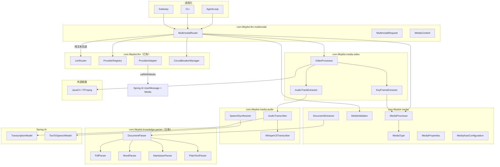
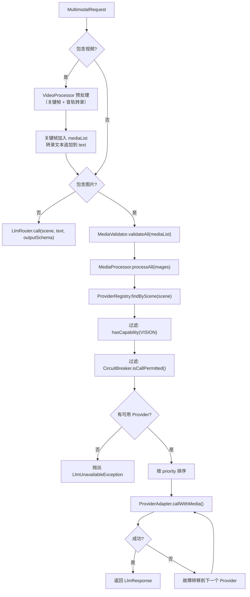

# 设计文档 — 多模态能力

## 概述

本模块扩展 LifePilot 的 LLM 路由层，使其支持图片理解、视频理解、文档内容提取、语音转文字（STT）和文字转语音（TTS）。核心思路是**渐进增强**：不修改现有 `LlmRouter` 的方法签名，而是新增 `MultimodalRouter` 作为多模态调用入口，内部组合 `ProviderRegistry`、`CircuitBreakerManager` 和新增的 `MediaProcessor` 完成媒体预处理与 VISION 能力路由。视频理解采用"分治"策略（借鉴 OmAgent）：`VideoProcessor` 将视频拆分为关键帧序列 + 音轨，关键帧复用 `MediaProcessor` 图片预处理管线，音轨复用 `AudioTranscriber` STT 管线，最终合并为结构化上下文传给 LLM。音频处理（STT/TTS）独立于多模态路由，作为消息管线的前置/后置处理器。

关键设计决策：
- `ProviderAdapter` sealed interface 新增 `callWithMedia` 方法，`SpringAiProviderAdapter` 实现时利用 Spring AI 的 `UserMessage.builder().text(...).media(...)` API
- 媒体处理层（`com.lifepilot.media`）独立于 LLM 路由层，提供图片预处理、MIME 检测、媒体校验、文档提取和音频处理
- 视频处理层（`com.lifepilot.media.video`）基于 JavaCV（FFmpeg Java 绑定），将视频拆分为关键帧 + 音轨，复用图片和 STT 管线
- 文档提取复用知识库模块已有的 `DocumentParser` 实现，但因 `DocumentParser.parse(Path)` 接受文件路径而非 `byte[]`，`DocumentExtractor` 需将 `byte[]` 写入临时文件后委托解析器处理
- 音频处理采用"转录前置"模式（借鉴 OpenClaw）：语音消息在进入 AgentLoop 前由 `AudioTranscriber` 转为文本，Agent 引擎无需感知音频模态
- TTS 作为可选的输出后处理，基于 Spring AI `TextToSpeechModel` 接口
- `ProviderCapability` 枚举新增 `TTS` 和 `STT` 值
- 所有业务可调参数通过 `MediaProperties`（`@ConfigurationProperties("lifepilot.media")`）外部化

参考文档：
- 架构设计：#[[file:docs/architecture/multimodal.md]]
- 特性设计：#[[file:docs/features/multimodal.md]]
- 需求文档：#[[file:.kiro/specs/multimodal/requirements.md]]
- LLM Router 架构：#[[file:docs/architecture/llm-router.md]]

## 架构

### 整体架构

多模态能力分为四个子系统：

- `com.lifepilot.llm.multimodal` — 多模态路由入口和请求模型
- `com.lifepilot.media` — 媒体处理（图片预处理、MIME 检测、校验、文档提取）和配置
- `com.lifepilot.media.audio` — 音频处理（STT 转录、TTS 合成）
- `com.lifepilot.media.video` — 视频处理（关键帧提取、音轨分离）



### 与现有 LlmRouter 的关系

`MultimodalRouter` 不继承 `LlmRouter`，而是独立的路由入口。当请求不包含图片时，委托给 `LlmRouter.call()` 处理。当请求包含图片时，`MultimodalRouter` 自行执行 VISION 能力过滤、熔断器过滤、优先级排序和故障转移。

### 音频处理在消息管线中的位置

音频处理不在 `MultimodalRouter` 内部，而是作为消息管线的前置/后置处理器：

```
语音消息 → AudioTranscriber（STT 前置）→ 文本消息 → AgentLoop → 文本回复
                                                                    ↓
用户 ← Channel ← 音频流 ← SpeechSynthesizer（TTS 后置，可选）← 文本回复
```

### 路由决策流程




## 组件与接口

### ProviderAdapter 扩展

在现有 `ProviderAdapter` sealed interface 上新增 `callWithMedia` 方法：

```java
public sealed interface ProviderAdapter permits SpringAiProviderAdapter {
    // 现有方法保持不变
    LlmResponse call(String prompt, @Nullable String outputSchema, Duration timeout);
    <T> T callEntity(String prompt, Class<T> responseType);
    float[] embed(String text);
    Flux<String> stream(String prompt);
    Optional<ChatClient> chatClient();
    boolean healthCheck();

    // 新增：多模态调用
    LlmResponse callWithMedia(String prompt, List<MediaContent> mediaContents, Duration timeout);

    // 新增：多模态流式调用
    Flux<String> streamWithMedia(String prompt, List<MediaContent> mediaContents);
}
```

`SpringAiProviderAdapter.callWithMedia()` 实现要点：
1. 检查 `config.hasCapability(ProviderCapability.VISION)`，不支持则抛出 `UnsupportedOperationException`
2. 将 `MediaContent` 列表转换为 Spring AI `Media` 对象列表
3. 通过 `UserMessage.builder().text(prompt).media(mediaList).build()` 构建多模态消息
4. 调用 `chatModel.call(new Prompt(userMessage))` 获取响应

### ProviderCapability 扩展

```java
public enum ProviderCapability {
    CHAT, EMBEDDING, STRUCTURED_OUTPUT, FUNCTION_CALLING, STREAMING,
    VISION,  // 已有
    TTS,     // 新增：文字转语音
    STT,     // 新增：语音转文字
}
```

### MultimodalRouter

多模态路由入口，处理包含图片或视频的 LLM 调用请求。

```java
public class MultimodalRouter {
    private final ProviderRegistry providerRegistry;
    private final CircuitBreakerManager circuitBreakerManager;
    private final MediaProcessor mediaProcessor;
    private final MediaValidator mediaValidator;
    private final @Nullable VideoProcessor videoProcessor;
    private final LlmRouter llmRouter;
    private final ExponentialBackoff backoff;

    public LlmResponse call(MultimodalRequest request);
    public Flux<String> stream(MultimodalRequest request);
}
```

`call()` 处理流程：
1. 若 `request.hasVideos()` → `videoProcessor.process(videoData, mimeType)` → 关键帧加入 mediaList，转录文本追加到 text
2. 若无图片 → 委托 `llmRouter.call(scene, text, outputSchema)`
3. 有图片 → `mediaValidator.validateAll()` → `mediaProcessor.processAll()` → VISION 能力过滤 → 故障转移循环

### MediaProcessor — 图片预处理器

```java
public class MediaProcessor {
    private final MediaProperties properties;
    private final MediaType mediaType;

    public MediaContent process(MediaContent image);
    public List<MediaContent> processAll(List<MediaContent> images);
}
```

### MediaValidator — 媒体校验器

```java
public class MediaValidator {
    private final MediaProperties properties;

    public void validate(MediaContent media);
    public void validateAll(List<MediaContent> mediaList);
}
```

### MediaType — MIME 类型检测

```java
public class MediaType {
    public String detect(byte[] data, @Nullable String fileName);
    public boolean isImage(String mimeType);
    public boolean isDocument(String mimeType);
    public boolean isAudio(String mimeType);
    public boolean isVideo(String mimeType);
}
```

### DocumentExtractor — 文档内容提取器

```java
public class DocumentExtractor {
    private final List<DocumentParser> parsers;

    /**
     * 从文档中提取纯文本。
     * 将 byte[] 写入临时文件，委托匹配的 DocumentParser 解析，返回 ParseResult.text()。
     */
    public String extract(byte[] data, String mimeType, @Nullable String fileName);
}
```

### AudioTranscriber — 语音转文字

```java
/**
 * 语音转文字转录器。
 * 采用"本地优先"级联策略（借鉴 OpenClaw 音频处理架构）：
 * 优先使用本地 Whisper CLI，不可用时回退到云端 STT Provider。
 */
public class AudioTranscriber {
    private final @Nullable WhisperCliTranscriber whisperCli;
    private final @Nullable TranscriptionModel transcriptionModel;
    private final MediaProperties properties;

    /**
     * 将音频转录为文本。
     *
     * @param audioData 音频二进制数据
     * @param mimeType  音频 MIME 类型
     * @return 转录文本
     * @throws AudioTranscriptionException 所有转录方式均失败
     */
    public String transcribe(byte[] audioData, String mimeType);
}
```

级联策略：
1. 检查 `whisperCli != null && whisperCli.isAvailable()` → 调用本地 Whisper CLI
2. 本地失败或不可用 → 检查 `transcriptionModel != null` → 调用 Spring AI TranscriptionModel
3. 全部不可用 → 抛出 `AudioTranscriptionException`

### WhisperCliTranscriber — 本地 Whisper CLI 适配

```java
/**
 * 本地 Whisper CLI 适配器。
 * 通过 ProcessBuilder 调用 whisper.cpp CLI 执行语音转录。
 */
public class WhisperCliTranscriber {
    private final String cliPath;
    private final String model;

    /** 检测 Whisper CLI 是否可用。 */
    public boolean isAvailable();

    /** 执行转录。将音频写入临时文件，调用 CLI，解析输出。 */
    public String transcribe(byte[] audioData, String mimeType);
}
```

实现要点：
- 启动时通过 `which whisper-cli` 或 `which whisper` 检测 CLI 是否在 PATH 中
- 将音频 `byte[]` 写入临时 WAV 文件（如果不是 WAV 格式，需要说明仅支持 WAV 或依赖 CLI 自身的格式支持）
- 通过 `ProcessBuilder` 执行 `whisper-cli --model {model} --output-txt {tempFile}`
- 解析 CLI 输出的文本文件获取转录结果
- try-finally 确保临时文件删除
- 超时控制：默认 60 秒，超时则 `process.destroyForcibly()`

### SpeechSynthesizer — 文字转语音

```java
/**
 * 文字转语音合成器。
 * 基于 Spring AI TextToSpeechModel 接口。
 */
public class SpeechSynthesizer {
    private final TextToSpeechModel textToSpeechModel;
    private final MediaProperties properties;

    /** 同步合成。 */
    public byte[] synthesize(String text);

    /** 流式合成。 */
    public Flux<byte[]> stream(String text);
}
```

实现要点：
- 文本长度超过 `maxTextLength` 时截断并添加"…（内容已截断）"
- 通过 `TextToSpeechPrompt` 传递语音风格、语速等配置
- TTS Provider 不可用时抛出异常，调用方决定是否回退为纯文本

### VideoProcessor — 视频预处理器

```java
/**
 * 视频预处理器。
 * 将视频拆分为关键帧序列和音轨，分别交给图片处理和音频转录管线。
 * 借鉴 OmAgent 的分治策略。
 *
 * @author zsg
 * @since 2026-07-01
 */
public class VideoProcessor {
    private final KeyFrameExtractor keyFrameExtractor;
    private final AudioTrackExtractor audioTrackExtractor;
    private final AudioTranscriber audioTranscriber;
    private final MediaProperties properties;

    /**
     * 处理视频，提取关键帧和音轨转录文本。
     *
     * @param videoData 视频二进制数据
     * @param mimeType  视频 MIME 类型
     * @return 视频处理结果（关键帧列表 + 音轨转录文本）
     * @throws VideoProcessException 视频解码或处理失败
     */
    public VideoProcessResult process(byte[] videoData, String mimeType);
}
```

处理流程：
1. 将 `byte[]` 写入临时文件
2. `KeyFrameExtractor.extract(tempFile)` → 关键帧 `List<MediaContent>`
3. `AudioTrackExtractor.extract(tempFile)` → `Optional<byte[]>` 音轨数据
4. 若有音轨 → `AudioTranscriber.transcribe(audioData, "audio/wav")` → 转录文本
5. 组装 `VideoProcessResult(keyFrames, transcript, durationSeconds, frameCount)`
6. try-finally 确保临时文件删除

### KeyFrameExtractor — 关键帧提取

```java
/**
 * 关键帧提取器。
 * 基于 JavaCV（FFmpegFrameGrabber）按均匀采样策略从视频中提取代表性帧。
 *
 * @author zsg
 * @since 2026-07-01
 */
public class KeyFrameExtractor {
    private final MediaProcessor mediaProcessor;
    private final MediaProperties properties;

    /**
     * 从视频文件中提取关键帧。
     *
     * @param videoFile 视频临时文件路径
     * @return 预处理后的关键帧 MediaContent 列表
     */
    public List<MediaContent> extract(Path videoFile);

    /** 获取视频时长（秒）。 */
    public int getDurationSeconds(Path videoFile);
}
```

采样策略（根据视频时长自适应）：
- ≤ 30 秒：每 2 秒 1 帧，最多 15 帧
- 30 秒 ~ 5 分钟：每 5 秒 1 帧，最多 60 帧
- 5 ~ 30 分钟：每 15 秒 1 帧，最多 120 帧
- \> 30 分钟：每 30 秒 1 帧，最多 120 帧

### AudioTrackExtractor — 音轨分离

```java
/**
 * 音轨分离器。
 * 基于 JavaCV 从视频中分离音频轨道。
 *
 * @author zsg
 * @since 2026-07-01
 */
public class AudioTrackExtractor {

    /**
     * 从视频文件中分离音频轨道。
     *
     * @param videoFile 视频临时文件路径
     * @return 音频 byte[] 数据，无音轨时返回空 Optional
     */
    public Optional<byte[]> extract(Path videoFile);
}
```

### MediaAutoConfiguration — 自动配置

```java
@AutoConfiguration
@EnableConfigurationProperties(MediaProperties.class)
public class MediaAutoConfiguration {

    @Bean @ConditionalOnMissingBean
    public MediaType mediaType();

    @Bean @ConditionalOnMissingBean
    public MediaValidator mediaValidator(MediaProperties properties);

    @Bean @ConditionalOnMissingBean
    public MediaProcessor mediaProcessor(MediaProperties properties, MediaType mediaType);

    @Bean @ConditionalOnMissingBean
    public DocumentExtractor documentExtractor(List<DocumentParser> parsers);

    @Bean @ConditionalOnMissingBean
    public KeyFrameExtractor keyFrameExtractor(MediaProcessor mediaProcessor, MediaProperties properties);

    @Bean @ConditionalOnMissingBean
    public AudioTrackExtractor audioTrackExtractor();

    @Bean @ConditionalOnMissingBean
    public VideoProcessor videoProcessor(
        KeyFrameExtractor keyFrameExtractor,
        AudioTrackExtractor audioTrackExtractor,
        AudioTranscriber audioTranscriber,
        MediaProperties properties);

    @Bean @ConditionalOnMissingBean
    public MultimodalRouter multimodalRouter(
        ProviderRegistry providerRegistry,
        CircuitBreakerManager circuitBreakerManager,
        MediaProcessor mediaProcessor,
        MediaValidator mediaValidator,
        @Nullable VideoProcessor videoProcessor,
        LlmRouter llmRouter);

    @Bean @ConditionalOnMissingBean
    public WhisperCliTranscriber whisperCliTranscriber(MediaProperties properties);

    @Bean @ConditionalOnMissingBean
    public AudioTranscriber audioTranscriber(
        @Nullable WhisperCliTranscriber whisperCli,
        @Nullable TranscriptionModel transcriptionModel,
        MediaProperties properties);

    @Bean @ConditionalOnMissingBean
    @ConditionalOnBean(TextToSpeechModel.class)
    public SpeechSynthesizer speechSynthesizer(
        TextToSpeechModel textToSpeechModel,
        MediaProperties properties);
}
```

### 依赖接口验证

| 接口 | 源码位置 | 验证状态 |
|------|---------|---------|
| `ProviderAdapter` sealed interface（6 个方法） | `com.lifepilot.llm.adapter.ProviderAdapter` | ✅ 已核对 |
| `SpringAiProviderAdapter` 构造函数 | `com.lifepilot.llm.adapter.SpringAiProviderAdapter` | ✅ 已核对：`(ProviderConfig, ChatModel, @Nullable EmbeddingModel)` |
| `SpringAiProviderAdapter.config()` | 同上 | ✅ 已核对：返回 `ProviderConfig` |
| `SpringAiProviderAdapter.chatModel()` | 同上 | ✅ 已核对：返回 `ChatModel` |
| `ProviderRegistry.findByScene(String)` | `com.lifepilot.llm.registry.ProviderRegistry` | ✅ 已核对：返回 `List<ProviderConfig>` |
| `ProviderRegistry.findByCapability(ProviderCapability)` | 同上 | ✅ 已核对：返回 `List<ProviderConfig>` |
| `ProviderRegistry.getAdapter(String)` | 同上 | ✅ 已核对：返回 `ProviderAdapter` |
| `CircuitBreakerManager.isCallPermitted(String, String)` | `com.lifepilot.llm.circuit.CircuitBreakerManager` | ✅ 已核对 |
| `CircuitBreakerManager.recordSuccess(String, String)` | 同上 | ✅ 已核对 |
| `CircuitBreakerManager.recordFailure(String, String)` | 同上 | ✅ 已核对 |
| `LlmRouter` 构造函数 | `com.lifepilot.llm.LlmRouter` | ✅ 已核对：`(ProviderRegistry, CircuitBreakerManager)` |
| `LlmRouter.call(String, String, @Nullable String)` | 同上 | ✅ 已核对 |
| `LlmRouter.stream(String, String)` | 同上 | ✅ 已核对 |
| `ProviderConfig.hasCapability(ProviderCapability)` | `com.lifepilot.llm.config.ProviderConfig` | ✅ 已核对 |
| `ProviderCapability.VISION` | `com.lifepilot.llm.config.ProviderCapability` | ✅ 已核对 |
| `LlmResponse` record 字段 | `com.lifepilot.llm.LlmResponse` | ✅ 已核对 |
| `LlmUnavailableException` 构造函数 | `com.lifepilot.llm.LlmUnavailableException` | ✅ 已核对 |
| `ExponentialBackoff.defaults()` | `com.lifepilot.llm.ExponentialBackoff` | ✅ 已核对 |
| `DocumentParser` sealed interface | `com.lifepilot.knowledge.parser.DocumentParser` | ✅ 已核对：permits `MarkdownParser, PlainTextParser, PdfParser, WordParser` |
| `DocumentParser.parse(Path)` | 同上 | ✅ 已核对：返回 `ParseResult` |
| `ParseResult.text()` | `com.lifepilot.knowledge.parser.ParseResult` | ✅ 已核对 |
| `DocumentParseException` | `com.lifepilot.knowledge.parser.DocumentParseException` | ✅ 已核对 |


## 数据模型

### MediaContent — 媒体内容载体

```java
/**
 * 媒体内容载体。
 * 封装图片、文档或音频的二进制数据及元信息。
 *
 * @author zsg
 * @since 2026-07-01
 */
public record MediaContent(
    String id,
    String mimeType,
    byte[] data,
    @Nullable String fileName,
    long sizeBytes,
    Map<String, String> metadata
) {
    public MediaContent {
        Objects.requireNonNull(id, "媒体 ID 不能为空");
        Objects.requireNonNull(mimeType, "MIME 类型不能为空");
        Objects.requireNonNull(data, "媒体数据不能为空");
        metadata = metadata != null ? Map.copyOf(metadata) : Map.of();
    }
}
```

### MultimodalRequest — 多模态请求

```java
/**
 * 多模态请求模型。
 *
 * @author zsg
 * @since 2026-07-01
 */
public record MultimodalRequest(
    String scene,
    String text,
    List<MediaContent> mediaList,
    @Nullable String outputSchema
) {
    public MultimodalRequest {
        Objects.requireNonNull(scene, "场景不能为空");
        Objects.requireNonNull(text, "文本提示词不能为空");
        mediaList = mediaList != null ? List.copyOf(mediaList) : List.of();
    }

    public boolean hasImages() {
        return mediaList.stream().anyMatch(mc -> mc.mimeType().startsWith("image/"));
    }

    public boolean hasVideos() {
        return mediaList.stream().anyMatch(mc -> mc.mimeType().startsWith("video/"));
    }
}
```

### MediaProperties — 配置属性

```java
/**
 * 媒体处理配置属性。
 *
 * @author zsg
 * @since 2026-07-01
 */
@ConfigurationProperties(prefix = "lifepilot.media")
public class MediaProperties {

    private Image image = new Image();
    private Document document = new Document();
    private Audio audio = new Audio();
    private Video video = new Video();
    private Tts tts = new Tts();

    public static class Image {
        private long maxSizeBytes = 10_485_760L;       // 10MB
        private int maxDimension = 2048;
        private float jpegQuality = 0.85f;
        private int maxPerRequest = 5;
        private List<String> supportedFormats = List.of("png", "jpeg", "gif", "webp", "bmp");
    }

    public static class Document {
        private long maxSizeBytes = 52_428_800L;        // 50MB
        private List<String> supportedFormats = List.of("pdf", "docx", "doc", "md", "txt");
    }

    public static class Audio {
        private long maxSizeBytes = 26_214_400L;        // 25MB
        private int maxDurationSeconds = 300;            // 5 分钟
        private List<String> supportedFormats = List.of("wav", "mp3", "ogg", "m4a", "flac", "webm");
        private String whisperCliPath = "auto";          // auto = 自动检测 PATH
        private String whisperModel = "base";            // tiny/base/small/medium/large
    }

    public static class Video {
        private long maxSizeBytes = 524_288_000L;       // 500MB
        private int maxDurationSeconds = 1800;           // 30 分钟
        private int maxKeyFrames = 120;                  // 最大关键帧数量
        private List<String> supportedFormats = List.of("mp4", "avi", "mov", "mkv", "webm", "flv");
    }

    public static class Tts {
        private String voice = "alloy";
        private double speed = 1.0;
        private String outputFormat = "mp3";
        private int maxTextLength = 4096;
    }
}
```

### 异常类

```java
/** 媒体校验异常。 */
public class MediaValidationException extends RuntimeException {
    private final String reason;
    // ...
}

/** 文档内容提取异常。 */
public class DocumentExtractionException extends RuntimeException { /* ... */ }

/** 音频转录异常。 */
public class AudioTranscriptionException extends RuntimeException { /* ... */ }

/** 视频处理异常。 */
public class VideoProcessException extends RuntimeException { /* ... */ }
```

### VideoProcessResult — 视频处理结果

```java
/**
 * 视频处理结果。
 *
 * @param keyFrames       关键帧列表（已预处理的 MediaContent）
 * @param transcript      音轨转录文本（可能为 null，如静音视频）
 * @param durationSeconds 视频时长（秒）
 * @param frameCount      提取的关键帧数量
 *
 * @author zsg
 * @since 2026-07-01
 */
public record VideoProcessResult(
    List<MediaContent> keyFrames,
    @Nullable String transcript,
    int durationSeconds,
    int frameCount
) {
    public VideoProcessResult {
        keyFrames = List.copyOf(keyFrames);
    }
}
```

### YAML 配置

```yaml
lifepilot:
  media:
    image:
      max-size-bytes: 10485760
      max-dimension: 2048
      jpeg-quality: 0.85
      max-per-request: 5
      supported-formats: png,jpeg,gif,webp,bmp
    document:
      max-size-bytes: 52428800
      supported-formats: pdf,docx,doc,md,txt
    audio:
      max-size-bytes: 26214400
      max-duration-seconds: 300
      supported-formats: wav,mp3,ogg,m4a,flac,webm
      whisper-cli-path: auto
      whisper-model: base
    video:
      max-size-bytes: 524288000
      max-duration-seconds: 1800
      max-key-frames: 120
      supported-formats: mp4,avi,mov,mkv,webm,flv
    tts:
      voice: alloy
      speed: 1.0
      output-format: mp3
      max-text-length: 4096
```

### 包结构

```
com.lifepilot.llm.multimodal/
├── MultimodalRouter.java
├── MultimodalRequest.java
└── MediaContent.java

com.lifepilot.media/
├── MediaProcessor.java
├── MediaValidator.java
├── MediaValidationException.java
├── MediaType.java
├── DocumentExtractor.java
├── DocumentExtractionException.java
├── audio/
│   ├── AudioTranscriber.java
│   ├── WhisperCliTranscriber.java
│   ├── SpeechSynthesizer.java
│   └── AudioTranscriptionException.java
├── video/
│   ├── VideoProcessor.java
│   ├── VideoProcessResult.java
│   ├── KeyFrameExtractor.java
│   ├── AudioTrackExtractor.java
│   └── VideoProcessException.java
└── config/
    ├── MediaProperties.java
    └── MediaAutoConfiguration.java
```

## 正确性属性

### Property 1: MediaContent 构造不变量

*For any* `id`、`mimeType`、`data`（均非 null）和任意 `metadata` Map 构造的 `MediaContent`，其 `metadata()` 返回的 Map 应为不可变的，且修改原始 `metadata` Map 不影响 record 内部的值。*For any* null 的 `id`、`mimeType` 或 `data`，构造应抛出 `NullPointerException`。

**Validates: Requirements 2.2, 2.3**

### Property 2: MultimodalRequest 构造不变量

*For any* 非 null 的 `scene`、`text` 和任意 `mediaList`（包括 null）构造的 `MultimodalRequest`，其 `mediaList()` 应为不可变列表，且当传入 null 时应初始化为空列表。*For any* null 的 `scene` 或 `text`，构造应抛出 `NullPointerException`。

**Validates: Requirements 3.2, 3.3**

### Property 3: MediaValidator 单项校验

*For any* `MediaContent`，若其 `sizeBytes` 超过配置的最大限制（图片/文档/音频各自的限制），或其 `mimeType` 不在配置的支持列表中，则 `validate()` 应抛出 `MediaValidationException`。反之，若大小在限制内且 MIME 类型受支持且 `data` 非空，则 `validate()` 应正常通过。

**Validates: Requirements 4.1, 4.2**

### Property 4: MediaValidator 图片数量限制

*For any* `MediaContent` 列表，若其中 MIME 类型以 `image/` 开头的元素数量超过 `image.maxPerRequest`，则 `validateAll()` 应抛出 `MediaValidationException`。

**Validates: Requirements 4.3**

### Property 5: MIME 类型分类正确性

*For any* MIME 类型字符串，`isImage()` 当且仅当以 `image/` 开头时返回 `true`。`isDocument()` 当且仅当属于文档 MIME 类型集合时返回 `true`。`isAudio()` 当且仅当以 `audio/` 开头时返回 `true`。`isVideo()` 当且仅当以 `video/` 开头时返回 `true`。四者不应同时为 `true`。

**Validates: Requirements 5.4, 5.5, 5.6, 5.7**

### Property 6: MediaProcessor 尺寸不变量与元数据保留

*For any* 图片 `MediaContent`，经 `process()` 处理后，输出的最长边应 ≤ `maxDimension`。输出的 `fileName` 和 `metadata` 应与输入一致。若输入图片的最长边已 ≤ `maxDimension` 且大小在限制内，则输出的 `data` 应与输入相同。

**Validates: Requirements 6.1, 6.5, 6.6**

### Property 7: MediaProcessor 格式转换

*For any* MIME 类型为 `image/bmp` 或 `image/webp` 的 `MediaContent`，经 `process()` 处理后，输出的 `mimeType` 应为 `image/png` 或 `image/jpeg`。

**Validates: Requirements 6.3**

### Property 8: DocumentExtractor MIME 路由

*For any* 受支持的文档 MIME 类型，`extract()` 应委托给对应的 `DocumentParser` 实现。*For any* 不受支持的 MIME 类型，`extract()` 应抛出 `DocumentExtractionException`。

**Validates: Requirements 7.2, 7.3**

### Property 9: MultimodalRouter VISION 候选选择

*For any* 包含图片的 `MultimodalRequest` 和任意 Provider 集合，`MultimodalRouter` 应仅尝试调用具备 `VISION` 能力且熔断器状态非 OPEN 的 Provider，且按 `priority` 升序尝试。

**Validates: Requirements 8.1, 8.2**

### Property 10: MultimodalRouter 故障转移与穷尽

*For any* 包含图片的 `MultimodalRequest`，若第一个 VISION Provider 调用失败，`MultimodalRouter` 应自动尝试下一个可用的 VISION Provider。若所有 VISION Provider 均失败，应抛出 `LlmUnavailableException`。

**Validates: Requirements 8.3, 8.4**

### Property 11: MultimodalRouter 纯文本委托

*For any* 不包含图片的 `MultimodalRequest`，`MultimodalRouter.call()` 应委托给 `LlmRouter.call(scene, text, outputSchema)`，不执行 VISION 能力过滤。

**Validates: Requirements 8.5**

### Property 12: 非 VISION Provider 拒绝多模态调用

*For any* `ProviderConfig` 不包含 `VISION` 能力的 `SpringAiProviderAdapter`，调用 `callWithMedia()` 应抛出 `UnsupportedOperationException`。

**Validates: Requirements 1.3**

### Property 13: AudioTranscriber 级联降级

*For any* 音频数据，当本地 Whisper CLI 可用时，`AudioTranscriber` 应优先使用本地 CLI 转录。当本地 CLI 不可用或转录失败时，应回退到云端 TranscriptionModel。当两者均不可用时，应抛出 `AudioTranscriptionException`。

**Validates: Requirements 9.2, 9.5**

### Property 14: SpeechSynthesizer 文本截断

*For any* 文本长度超过 `maxTextLength` 的输入，`SpeechSynthesizer` 应截断文本至 `maxTextLength` 字符。*For any* 文本长度 ≤ `maxTextLength` 的输入，应完整合成。

**Validates: Requirements 10.4**

### Property 15: VideoProcessResult 构造不变量

*For any* 非 null 的 `keyFrames` 列表构造的 `VideoProcessResult`，其 `keyFrames()` 应为不可变列表，且 `frameCount` 应等于 `keyFrames` 列表的大小。

**Validates: Requirements 15.2, 15.3**

### Property 16: VideoProcessor 关键帧数量限制

*For any* 视频输入，`VideoProcessor.process()` 返回的 `VideoProcessResult.frameCount()` 应 ≤ `video.maxKeyFrames` 配置值。

**Validates: Requirements 14.2, 16.3**

### Property 17: MultimodalRouter 视频预处理集成

*For any* 包含视频附件的 `MultimodalRequest`，`MultimodalRouter` 应先通过 `VideoProcessor` 处理视频，将关键帧作为图片附件加入请求，将转录文本追加到提示词中，然后按图片理解流程处理。

**Validates: Requirements 8.8**

## 错误处理

### 异常层次

| 异常 | 抛出场景 | 处理方式 |
|------|---------|---------|
| `MediaValidationException` | 媒体校验失败 | 调用方捕获，向用户返回具体失败原因 |
| `DocumentExtractionException` | 文档解析失败 | 调用方捕获，向用户提示文档处理失败 |
| `AudioTranscriptionException` | 音频转录失败（所有 Provider 不可用） | 调用方捕获，向用户提示"当前无可用语音转录服务" |
| `VideoProcessException` | 视频解码/帧提取/音轨分离失败 | 调用方捕获，向用户提示"视频处理失败" |
| `UnsupportedOperationException` | Provider 不支持 VISION 能力时调用 `callWithMedia` | `MultimodalRouter` 内部捕获，跳过该 Provider |
| `LlmUnavailableException` | 所有 VISION Provider 均不可用 | 调用方捕获，向用户提示"当前无可用视觉模型" |

### 降级策略

- 多模态请求中所有 VISION Provider 不可用时，**不静默降级为纯文本**，明确抛出异常
- STT 所有 Provider 不可用时，明确抛出异常
- TTS 不可用时，调用方可选择**静默降级为纯文本回复**（TTS 是可选增强，不影响核心功能）

## 测试策略

### 属性测试

使用 jqwik，每个属性测试配置最少 100 次迭代。

| Property | 测试类 | 测试方法 |
|----------|--------|---------|
| 1 | `MediaContent属性测试` | `构造不变量_metadata不可变且防御性拷贝` |
| 2 | `MultimodalRequest属性测试` | `构造不变量_mediaList不可变且null安全` |
| 3 | `MediaValidator属性测试` | `单项校验_大小和MIME类型` |
| 4 | `MediaValidator属性测试` | `图片数量限制` |
| 5 | `MediaType属性测试` | `MIME类型分类正确性` |
| 6 | `MediaProcessor属性测试` | `尺寸不变量与元数据保留` |
| 7 | `MediaProcessor属性测试` | `BMP和WebP格式转换` |
| 8 | `DocumentExtractor属性测试` | `MIME路由正确性` |
| 9 | `MultimodalRouter属性测试` | `VISION候选选择` |
| 10 | `MultimodalRouter属性测试` | `故障转移与穷尽` |
| 11 | `MultimodalRouter属性测试` | `纯文本委托` |
| 12 | `SpringAiProviderAdapter属性测试` | `非VISION_Provider拒绝多模态调用` |
| 13 | `AudioTranscriber属性测试` | `级联降级策略` |
| 14 | `SpeechSynthesizer属性测试` | `文本截断` |
| 15 | `VideoProcessResult属性测试` | `构造不变量_keyFrames不可变且frameCount一致` |
| 16 | `VideoProcessor属性测试` | `关键帧数量限制` |
| 17 | `MultimodalRouter属性测试` | `视频预处理集成` |

### 单元测试

| 测试类 | 覆盖范围 |
|--------|---------|
| `MediaContent单元测试` | record 构造、字段访问、null 参数边界 |
| `MultimodalRequest单元测试` | record 构造、`hasImages()`、null mediaList |
| `MediaValidator单元测试` | 各校验规则、边界值 |
| `MediaType单元测试` | Tika MIME 检测、魔数字节、扩展名伪造 |
| `MediaProcessor单元测试` | 图片预处理流程 |
| `DocumentExtractor单元测试` | 文档提取、不支持格式异常 |
| `MultimodalRouter单元测试` | 路由逻辑、故障转移 |
| `SpringAiProviderAdapter单元测试` | `callWithMedia` |
| `AudioTranscriber单元测试` | 级联降级、本地 CLI 不可用场景 |
| `WhisperCliTranscriber单元测试` | CLI 检测、进程调用、超时处理 |
| `SpeechSynthesizer单元测试` | 同步/流式合成、文本截断 |
| `VideoProcessor单元测试` | 视频处理流程、静音视频、大小/时长校验 |
| `KeyFrameExtractor单元测试` | 采样策略、帧数限制、时长获取 |
| `AudioTrackExtractor单元测试` | 音轨分离、无音轨视频 |
| `VideoProcessResult单元测试` | record 构造、防御性拷贝 |

### 集成测试

| 测试类 | 覆盖范围 |
|--------|---------|
| `MediaAutoConfiguration集成测试` | Spring Context 加载，所有 Bean 注册成功（含视频处理 Bean） |
| `MultimodalRouter_LlmRouter_集成测试` | 多模态路由与现有 LLM 路由的协作 |
