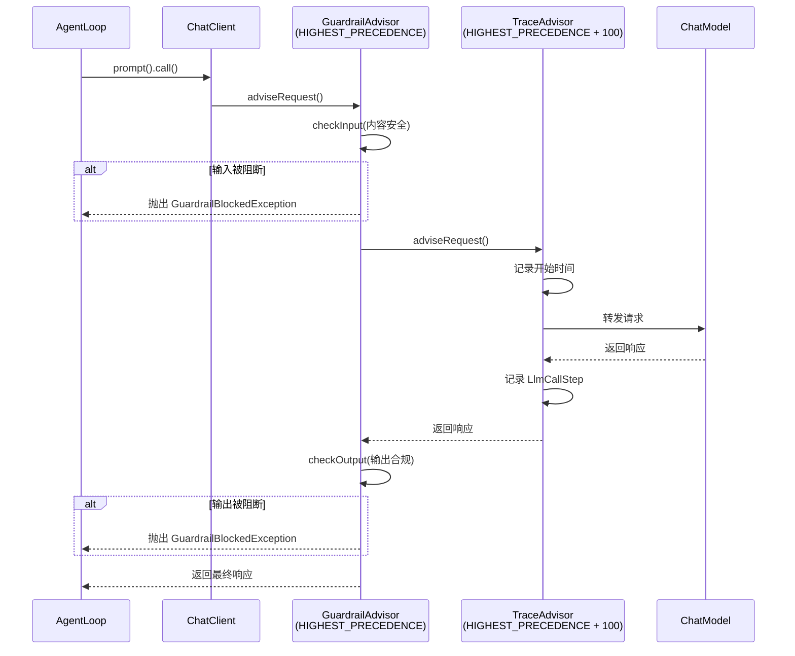

# 设计文档：可观测性与护栏引擎完善

参考文档：
- 架构设计：#[[file:docs/architecture/observability.md]]
- 特性设计：#[[file:docs/features/observability.md]]
- 需求文档：#[[file:.kiro/specs/observability/requirements.md]]
- 编码规范：#[[file:.kiro/steering/coding-standards.md]]

## 概述

本模块（模块 20）将 LifePilot 现有的基础可观测性实现升级为架构文档中定义的完整系统。核心变更包括：

1. **Trace 系统重构**：将 `com.lifepilot.agent.trace.TraceRecorder`（具体类）重构为 `com.lifepilot.observability.trace.TraceRecorder`（接口），引入 `TraceStep` sealed interface 类型层次，支持 ScopedValue 上下文传播和异步持久化
2. **护栏引擎重构**：将 `com.lifepilot.guardrail.GuardrailPolicy`（具体类）重构为 sealed interface 类型层次，新增 `GuardrailEngine` 策略执行引擎
3. **Spring AI Advisor 集成**：通过 `TraceAdvisor` 和 `GuardrailAdvisor` 实现零侵入的横切注入
4. **DataRedactor 增强**：从临时实现升级为基于 `RedactionRule` 的可扩展规则系统
5. **轨迹评估引擎**：五维规则评估（与已完成的模块 20.5 Agentic Evals 互补，本模块聚焦生产环境在线/离线评估）
6. **指标收集与 Actuator**：`MetricsCollector` 收集 Agent/LLM/Tool 维度运行指标

### 范围控制

为控制在 1-2 周内完成，以下功能标记为核心（必须实现）和可选（时间允许时实现）：

| 功能 | 优先级 | 说明 |
|------|--------|------|
| TraceStep sealed interface + TraceRecord | 核心 | 数据模型基础 |
| TraceRecorder 接口 + TraceRecorderImpl | 核心 | 追踪记录核心 |
| TraceStepSerializer | 核心 | 序列化/反序列化 |
| TraceContextPropagator | 核心 | 上下文传播 |
| TraceQuery | 核心 | 轨迹查询与回放 |
| TraceAdvisor | 核心 | Spring AI Advisor 集成 |
| GuardrailPolicy sealed interface | 核心 | 护栏策略类型层次 |
| GuardrailResult sealed interface | 核心 | 护栏结果类型层次 |
| GuardrailEngine | 核心 | 策略执行引擎 |
| GuardrailAdvisor | 核心 | Spring AI Advisor 护栏 |
| DataRedactor 增强 | 核心 | 可扩展脱敏规则 |
| RiskLevel 统一 | 核心 | 消除重复枚举 |
| Flyway V19 迁移 | 核心 | 数据库 Schema |
| ObservabilityProperties | 核心 | 配置外部化 |
| ObservabilityAutoConfiguration | 核心 | Spring 自动配置 |
| TrajectoryEvaluator | 核心 | 五维轨迹评估 |
| MetricsCollector | 可选 | 指标收集 |
| ObservabilityEndpoint | 可选 | Actuator 端点 |

## 架构

### 模块层次与依赖关系

```mermaid
graph TD
    subgraph "com.lifepilot.observability"
        subgraph "trace"
            TS[TraceStep sealed interface]
            TR[TraceRecord]
            TRI[TraceRecorder interface]
            IMPL[TraceRecorderImpl]
            SER[TraceStepSerializer]
            CTX[TraceContext]
            PROP[TraceContextPropagator]
            TQ[TraceQuery]
            TA[TraceAdvisor]
        end

        subgraph "guardrail"
            GP[GuardrailPolicy sealed interface]
            GR[GuardrailResult sealed interface]
            GE[GuardrailEngine]
            GA[GuardrailAdvisor]
            RL[RiskLevel]
            AM[ApprovalMode]
        end

        subgraph "redactor"
            RR[RedactionRule]
            DR[DataRedactor]
        end

        subgraph "evaluation"
            TE[TrajectoryEvaluator]
            ER[EvaluationResult]
        end

        subgraph "metrics"
            MC[MetricsCollector]
            MS[MetricsSnapshot]
            OE[ObservabilityEndpoint]
        end

        subgraph "config"
            OP[ObservabilityProperties]
            OAC[ObservabilityAutoConfiguration]
        end
    end

    IMPL --> DR
    IMPL --> SER
    IMPL --> PROP
    TA --> TRI
    GA --> GE
    GE --> GP
    GE --> TRI
    TE --> TQ
    MC --> TRI

    subgraph "外部依赖"
        AL[AgentLoop]
        TC[ToolContract]
        LR[LlmRouter]
        SAI[Spring AI ChatClient/Advisor]
    end

    TA --> SAI
    GA --> SAI
    AL -.-> TRI
    GE -.-> TC

```



### 迁移策略

现有代码的迁移分三步：

1. **新建**：在 `com.lifepilot.observability` 包下创建所有新类型
2. **适配**：修改 `AgentLoop` 使用新的 `TraceRecorder` 接口，修改 `GuardrailPolicy` 引用
3. **清理**：标记旧类 `@Deprecated`，后续 spec 中移除

关键迁移点：
- `AgentLoop` 当前直接依赖 `com.lifepilot.agent.trace.TraceRecorder`（具体类），需改为依赖 `com.lifepilot.observability.trace.TraceRecorder`（接口）
- `AgentLoop.reduceAndRecord()` 当前构建 `com.lifepilot.agent.trace.TraceStep`（简单 record），需改为构建 `StateTransitionStep`
- `GuardrailPolicy` 当前被 `AgentLoop` 间接使用（通过工具执行管线），需替换为新的 sealed interface
- `DataRedactor` 当前在 `com.lifepilot.interaction.middleware.audit` 包，需迁移到 `com.lifepilot.observability.redactor`
- `RiskLevel` 存在两个副本（`com.lifepilot.tool.model.RiskLevel` 和 `com.lifepilot.agent.model.RiskLevel`），统一到 `com.lifepilot.observability.guardrail.RiskLevel`

### Spring AI Advisor 链路



## 组件与接口

### 依赖接口验证

| 接口 | 源码位置 | 验证状态 |
|------|---------|---------|
| TraceRecorder.startTrace(String, String, String) | com.lifepilot.agent.trace.TraceRecorder | ✅ 已核对 — 具体类，需重构为接口 |
| TraceRecorder.recordStep(TraceContext, TraceStep) | com.lifepilot.agent.trace.TraceRecorder | ✅ 已核对 — TraceStep 是简单 record |
| TraceRecorder.endTrace(TraceContext, ...) | com.lifepilot.agent.trace.TraceRecorder | ✅ 已核对 — 返回 void |
| TraceRecorder.persistTrace(String) | com.lifepilot.agent.trace.TraceRecorder | ✅ 已核对 — 同步持久化 |
| GuardrailPolicy.checkToolCall(ToolContract, ToolInput) | com.lifepilot.guardrail.GuardrailPolicy | ✅ 已核对 — 具体类 |
| GuardrailResult.allowed/blocked/requiresConfirmation | com.lifepilot.guardrail.GuardrailResult | ✅ 已核对 — 简单 record |
| ToolContract.riskLevel() → RiskLevel | com.lifepilot.tool.ToolContract | ✅ 已核对 — 返回 com.lifepilot.tool.model.RiskLevel |
| DataRedactor.redact(String) | com.lifepilot.interaction.middleware.audit.DataRedactor | ✅ 已核对 — 临时实现 |
| RiskLevel (tool) | com.lifepilot.tool.model.RiskLevel | ✅ 已核对 — LOW/MEDIUM/HIGH/CRITICAL |
| RiskLevel (agent) | com.lifepilot.agent.model.RiskLevel | ✅ 已核对 — LOW/MEDIUM/HIGH/CRITICAL（无方法） |
| AgentLoop 使用 TraceRecorder | com.lifepilot.agent.AgentLoop | ✅ 已核对 — 构造函数注入，调用 startTrace/recordStep/endTrace/persistTrace |
| TraceQueryService | com.lifepilot.interaction.web.service.TraceQueryService | ✅ 已核对 — 读取 agent_traces 表 |
| ChatClient (Spring AI) | org.springframework.ai.chat.client.ChatClient | ✅ 已核对 — pom.xml 有 spring-ai-client-chat 依赖 |
| LlmRouter.getChatClient(String) | com.lifepilot.llm.LlmRouter | ✅ 已核对 — 返回 ChatClient |

### 跨模块接口变更

| 变更接口 | 所属模块 | 变更内容 | 影响模块 | 处理方式 |
|---------|---------|---------|---------|---------|
| TraceRecorder | agent | 从具体类变为 observability 包下的接口 | agent (AgentLoop) | 修改 AgentLoop 导入和用法 |
| TraceStep | agent | 从简单 record 变为 sealed interface | agent (AgentLoop) | 修改 reduceAndRecord() 构建 StateTransitionStep |
| TraceContext | agent | 从 TraceRecorder 内部类变为独立类 | agent (AgentLoop) | 修改导入 |
| GuardrailPolicy | guardrail | 从具体类变为 sealed interface | tool (间接) | 新建 GuardrailEngine 封装策略执行 |
| GuardrailResult | guardrail | 从简单 record 变为 sealed interface | guardrail, agent | 修改所有引用点 |
| RiskLevel | tool, agent | 统一到 observability.guardrail 包 | tool, agent, skill | 修改所有导入 |
| DataRedactor | interaction | 从临时实现迁移到 observability.redactor | interaction (middleware) | 旧类标记 @Deprecated |

### 核心接口定义

#### TraceRecorder 接口

```java
package com.lifepilot.observability.trace;

/**
 * 追踪记录器接口 — 定义 Trace 的生命周期管理。
 */
public interface TraceRecorder {
    TraceContext startTrace(String traceId, String sessionId, String goal);
    TraceContext startTrace(String traceId, String sessionId, String goal, TraceMetadata metadata);
    void recordStep(TraceContext context, TraceStep step);
    TraceRecord endTrace(TraceContext context, @Nullable String finalOutput,
                         boolean success, @Nullable String errorMessage,
                         @Nullable String terminationReason);
    void onStep(Consumer<TraceStep> listener);
    Optional<TraceContext> currentContext();
}
```

#### TraceStep sealed interface

```java
package com.lifepilot.observability.trace;

public sealed interface TraceStep
    permits LlmCallStep, ToolCallStep, GuardrailStep,
            StateTransitionStep, EvaluationStep {
    int stepIndex();
    Instant timestamp();
    Duration duration();
    String typeName();
}
```

五种 record 实现：
- `LlmCallStep` — providerId, modelId, scene, inputTokens, outputTokens, latency, cacheHit, temperature, finishReason
- `ToolCallStep` — toolId, toolAction, inputJson, outputJson, duration, success, errorMessage, riskLevel
- `GuardrailStep` — policyId, checkType, passed, reason, riskLevel, approvalMode
- `StateTransitionStep` — phaseBefore, phaseAfter, actionType, actionSummary
- `EvaluationStep` — 五维评分 + overallScore + violations + suggestions

#### GuardrailPolicy sealed interface

```java
package com.lifepilot.observability.guardrail;

public sealed interface GuardrailPolicy
    permits ToolRiskPolicy, BudgetLimitPolicy, ContentSafetyPolicy,
            RateLimitPolicy, DataRedactionPolicy {
    String policyId();
    boolean enabled();
    int priority();
}
```

#### GuardrailResult sealed interface

```java
package com.lifepilot.observability.guardrail;

public sealed interface GuardrailResult
    permits GuardrailResult.Passed, GuardrailResult.Blocked,
            GuardrailResult.NeedsConfirmation {
    record Passed(String policyId) implements GuardrailResult {}
    record Blocked(String policyId, String reason, RiskLevel riskLevel) implements GuardrailResult {}
    record NeedsConfirmation(String policyId, String message,
                             ApprovalMode approvalMode) implements GuardrailResult {}
}
```

#### GuardrailEngine

```java
package com.lifepilot.observability.guardrail;

public class GuardrailEngine {
    GuardrailResult checkToolCall(ToolContract tool, ToolInput input);
    GuardrailResult checkInput(String content);
    GuardrailResult checkOutput(String content);
    void registerPolicy(GuardrailPolicy policy);
    void unregisterPolicy(String policyId);
    void addAllowedTools(List<String> toolIds);
    void removeAllowedTools(List<String> toolIds);
}
```

#### DataRedactor

```java
package com.lifepilot.observability.redactor;

public class DataRedactor {
    String redact(String text);
    RedactionAudit redactWithAudit(String text);
    boolean containsSensitiveData(String text);
    List<String> detectSensitiveTypes(String text);
    void registerRule(RedactionRule rule);
    void unregisterRule(String ruleName);
}
```

#### TrajectoryEvaluator

```java
package com.lifepilot.observability.evaluation;

public class TrajectoryEvaluator {
    EvaluationResult evaluateOnline(TraceRecord record);
    EvaluationResult evaluateOffline(TraceRecord record);
}
```

#### MetricsCollector（可选）

```java
package com.lifepilot.observability.metrics;

public class MetricsCollector {
    void recordAgentExecution(TraceRecord record);
    void recordLlmCall(LlmCallStep step);
    void recordToolCall(ToolCallStep step);
    MetricsSnapshot snapshot();
}
```

## 数据模型

### SQLite Schema（Flyway V19）

新建表（不修改已有的 `agent_traces` / `agent_trace_steps` 表）：

#### traces 表

```sql
CREATE TABLE traces (
    trace_id        TEXT PRIMARY KEY,
    session_id      TEXT NOT NULL,
    goal            TEXT NOT NULL,
    start_time      TEXT NOT NULL,
    end_time        TEXT,
    total_duration_ms INTEGER,
    total_steps     INTEGER NOT NULL DEFAULT 0,
    total_tokens    INTEGER NOT NULL DEFAULT 0,
    input_tokens    INTEGER NOT NULL DEFAULT 0,
    output_tokens   INTEGER NOT NULL DEFAULT 0,
    success         INTEGER NOT NULL DEFAULT 0,
    termination_reason TEXT,
    final_output    TEXT,
    error_message   TEXT,
    metadata_json   TEXT,
    created_at      TEXT NOT NULL
);

CREATE INDEX idx_traces_session_id ON traces(session_id);
CREATE INDEX idx_traces_start_time ON traces(start_time);
CREATE INDEX idx_traces_success ON traces(success);
CREATE INDEX idx_traces_created_at ON traces(created_at);
```

#### trace_steps 表

```sql
CREATE TABLE trace_steps (
    id              INTEGER PRIMARY KEY AUTOINCREMENT,
    trace_id        TEXT NOT NULL REFERENCES traces(trace_id),
    step_index      INTEGER NOT NULL,
    step_type       TEXT NOT NULL,
    timestamp       TEXT NOT NULL,
    duration_ms     INTEGER NOT NULL DEFAULT 0,
    detail_json     TEXT NOT NULL,
    created_at      TEXT NOT NULL
);

CREATE INDEX idx_trace_steps_trace_id ON trace_steps(trace_id);
CREATE INDEX idx_trace_steps_step_type ON trace_steps(step_type);
```

#### guardrail_logs 表

```sql
CREATE TABLE guardrail_logs (
    id              INTEGER PRIMARY KEY AUTOINCREMENT,
    trace_id        TEXT,
    tool_id         TEXT,
    policy_id       TEXT NOT NULL,
    result_type     TEXT NOT NULL,
    reason          TEXT,
    risk_level      TEXT,
    approval_mode   TEXT,
    user_decision   TEXT,
    created_at      TEXT NOT NULL
);

CREATE INDEX idx_guardrail_logs_trace_id ON guardrail_logs(trace_id);
CREATE INDEX idx_guardrail_logs_policy_id ON guardrail_logs(policy_id);
CREATE INDEX idx_guardrail_logs_created_at ON guardrail_logs(created_at);
```

#### redaction_logs 表

```sql
CREATE TABLE redaction_logs (
    id              INTEGER PRIMARY KEY AUTOINCREMENT,
    trace_id        TEXT,
    context         TEXT,
    applied_rules_json TEXT,
    created_at      TEXT NOT NULL
);

CREATE INDEX idx_redaction_logs_trace_id ON redaction_logs(trace_id);
```

#### evaluation_results 表

```sql
CREATE TABLE evaluation_results (
    trace_id                TEXT PRIMARY KEY,
    evaluated_at            TEXT NOT NULL,
    tool_selection_score    REAL NOT NULL,
    parameter_validity_score REAL NOT NULL,
    step_efficiency_score   REAL NOT NULL,
    policy_compliance_score REAL NOT NULL,
    token_efficiency_score  REAL NOT NULL,
    overall_score           REAL NOT NULL,
    actual_steps            INTEGER NOT NULL,
    actual_tokens           INTEGER NOT NULL,
    violations_json         TEXT,
    suggestions_json        TEXT,
    created_at              TEXT NOT NULL
);

CREATE INDEX idx_evaluation_results_overall_score ON evaluation_results(overall_score);
CREATE INDEX idx_evaluation_results_created_at ON evaluation_results(created_at);
```

#### metrics_snapshots 表（可选）

```sql
CREATE TABLE metrics_snapshots (
    id                      INTEGER PRIMARY KEY AUTOINCREMENT,
    snapshot_time           TEXT NOT NULL,
    agent_total_executions  INTEGER NOT NULL DEFAULT 0,
    agent_success_count     INTEGER NOT NULL DEFAULT 0,
    agent_failure_count     INTEGER NOT NULL DEFAULT 0,
    agent_avg_steps         REAL NOT NULL DEFAULT 0,
    agent_avg_duration_ms   REAL NOT NULL DEFAULT 0,
    llm_total_calls         INTEGER NOT NULL DEFAULT 0,
    llm_input_tokens        INTEGER NOT NULL DEFAULT 0,
    llm_output_tokens       INTEGER NOT NULL DEFAULT 0,
    llm_cache_hit_count     INTEGER NOT NULL DEFAULT 0,
    llm_error_count         INTEGER NOT NULL DEFAULT 0,
    llm_estimated_cost_usd  REAL NOT NULL DEFAULT 0,
    llm_latency_p50_ms      REAL NOT NULL DEFAULT 0,
    llm_latency_p99_ms      REAL NOT NULL DEFAULT 0,
    tool_total_calls        INTEGER NOT NULL DEFAULT 0,
    tool_success_count      INTEGER NOT NULL DEFAULT 0,
    tool_failure_count      INTEGER NOT NULL DEFAULT 0,
    tool_guardrail_blocks   INTEGER NOT NULL DEFAULT 0,
    tool_high_risk_count    INTEGER NOT NULL DEFAULT 0,
    tokens_by_provider_json TEXT,
    calls_by_tool_json      TEXT,
    created_at              TEXT NOT NULL
);

CREATE INDEX idx_metrics_snapshots_snapshot_time ON metrics_snapshots(snapshot_time);
```

#### traces_fts FTS5 虚拟表

```sql
CREATE VIRTUAL TABLE traces_fts USING fts5(
    trace_id,
    goal,
    final_output,
    content='traces',
    content_rowid='rowid'
);

-- 插入触发器
CREATE TRIGGER traces_ai AFTER INSERT ON traces BEGIN
    INSERT INTO traces_fts(rowid, trace_id, goal, final_output)
    VALUES (new.rowid, new.trace_id, new.goal, new.final_output);
END;

-- 删除触发器
CREATE TRIGGER traces_ad AFTER DELETE ON traces BEGIN
    INSERT INTO traces_fts(traces_fts, rowid, trace_id, goal, final_output)
    VALUES ('delete', old.rowid, old.trace_id, old.goal, old.final_output);
END;

-- 更新触发器
CREATE TRIGGER traces_au AFTER UPDATE ON traces BEGIN
    INSERT INTO traces_fts(traces_fts, rowid, trace_id, goal, final_output)
    VALUES ('delete', old.rowid, old.trace_id, old.goal, old.final_output);
    INSERT INTO traces_fts(rowid, trace_id, goal, final_output)
    VALUES (new.rowid, new.trace_id, new.goal, new.final_output);
END;
```

### Java Record 数据模型

核心 record 类型已在「组件与接口」章节定义。补充辅助 record：

```java
// 轨迹查询参数
@Builder(toBuilder = true)
public record TraceQueryParams(
    @Nullable Instant startTime, @Nullable Instant endTime,
    @Nullable String sessionId, @Nullable Boolean successOnly,
    int minSteps, int minTokens, int limit, int offset
) {}

// 轨迹摘要（列表展示）
public record TraceSummary(
    String traceId, String sessionId, String goal,
    Instant startTime, @Nullable Instant endTime,
    long totalDurationMs, int totalSteps, int totalTokens,
    int inputTokens, int outputTokens, boolean success,
    @Nullable String terminationReason, @Nullable String errorMessage
) {}

// 轨迹详情（含步骤）
public record TraceDetail(
    String traceId, String sessionId, String goal,
    Instant startTime, @Nullable Instant endTime,
    long totalDurationMs, int totalSteps, int totalTokens,
    int inputTokens, int outputTokens, boolean success,
    @Nullable String terminationReason, @Nullable String finalOutput,
    @Nullable String errorMessage, @Nullable String metadataJson,
    List<TraceStep> steps
) {}

// 回放步骤
public record ReplayStep(
    int index, String typeName, Instant timestamp,
    Duration duration, String summary, TraceStep originalStep
) {}

// Token 消耗统计
public record TokenConsumptionStats(
    int traceCount, long totalTokens, long totalInputTokens,
    long totalOutputTokens, double avgTokensPerTrace,
    int maxTokens, int successCount, double avgDurationMs
) {}

// 脱敏规则
public record RedactionRule(
    String name, String description, Pattern pattern,
    String replacement, int priority, boolean enabled
) {}

// 脱敏审计结果
public record RedactionAudit(
    String redactedText, List<String> appliedRules
) {}

// 评估结果
@Builder(toBuilder = true)
public record EvaluationResult(
    String traceId, Instant evaluatedAt,
    double toolSelectionScore, double parameterValidityScore,
    double stepEfficiencyScore, double policyComplianceScore,
    double tokenEfficiencyScore, double overallScore,
    int actualSteps, int actualTokens,
    List<String> violations, List<String> suggestions
) {}

// 指标快照（可选）
public record MetricsSnapshot(
    Instant snapshotTime,
    int agentTotalExecutions, int agentSuccessCount, int agentFailureCount,
    double agentAvgSteps, double agentAvgDurationMs,
    int llmTotalCalls, int llmInputTokens, int llmOutputTokens,
    int llmCacheHitCount, int llmErrorCount, double llmEstimatedCostUsd,
    double llmLatencyP50Ms, double llmLatencyP99Ms,
    int toolTotalCalls, int toolSuccessCount, int toolFailureCount,
    int toolGuardrailBlocks, int toolHighRiskCount,
    Map<String, Integer> tokensByProvider, Map<String, Integer> callsByTool
) {}

// 追踪元数据
public record TraceMetadata(
    @Nullable String channelType, @Nullable String userId,
    @Nullable String clientVersion, Map<String, String> tags
) {}
```

### 配置模型（ObservabilityProperties）

```java
@ConfigurationProperties(prefix = "lifepilot.observability")
public class ObservabilityProperties {

    // 嵌套配置类
    public static class Trace {
        boolean enabled = true;
        boolean recordPrompts = false;  // 是否记录完整 prompt（调试模式）
        int retentionDays = 30;
        boolean useScopedValue = true;
    }

    public static class Guardrail {
        boolean enabled = true;
        ToolRisk toolRisk = new ToolRisk();
        ContentSafety contentSafety = new ContentSafety();
        BudgetLimit budgetLimit = new BudgetLimit();
        RateLimit rateLimit = new RateLimit();

        public static class ToolRisk {
            String defaultRiskLevel = "LOW";
            Map<String, String> toolRiskMapping = Map.of(); // toolId → riskLevel
        }
        public static class ContentSafety {
            List<String> blockedPatterns = List.of();
            List<String> sensitiveTopics = List.of();
        }
        public static class BudgetLimit {
            int maxTokensPerRequest = 10000;
            int maxStepsPerRequest = 20;
            int maxDurationSeconds = 120;
            int dailyTokenLimit = 1000000;
        }
        public static class RateLimit {
            int maxCallsPerMinute = 60;
            int maxCallsPerHour = 1000;
        }
    }

    public static class Redaction {
        boolean enabled = true;
        boolean redactBeforeLlm = true;
        boolean redactInTrace = true;
        boolean redactInLog = true;
    }

    public static class Evaluation {
        boolean enabled = true;
        boolean onlineEvaluation = true;
        double toolSelectionWeight = 0.30;
        double parameterValidityWeight = 0.20;
        double stepEfficiencyWeight = 0.20;
        double policyComplianceWeight = 0.20;
        double tokenEfficiencyWeight = 0.10;
        double passThreshold = 0.7;
        double attentionThreshold = 0.5;
    }

    public static class Metrics {
        boolean enabled = true;
        int snapshotIntervalSeconds = 300;
        int maxLatencySamples = 1000;
    }
}
```

对应 `application.yml` 配置：

```yaml
lifepilot:
  observability:
    trace:
      enabled: true
      record-prompts: false
      retention-days: 30
      use-scoped-value: true
    guardrail:
      enabled: true
      tool-risk:
        default-risk-level: LOW
        tool-risk-mapping: {}
      content-safety:
        blocked-patterns: []
        sensitive-topics: []
      budget-limit:
        max-tokens-per-request: 10000
        max-steps-per-request: 20
        max-duration-seconds: 120
        daily-token-limit: 1000000
      rate-limit:
        max-calls-per-minute: 60
        max-calls-per-hour: 1000
    redaction:
      enabled: true
      redact-before-llm: true
      redact-in-trace: true
      redact-in-log: true
    evaluation:
      enabled: true
      online-evaluation: true
      tool-selection-weight: 0.30
      parameter-validity-weight: 0.20
      step-efficiency-weight: 0.20
      policy-compliance-weight: 0.20
      token-efficiency-weight: 0.10
      pass-threshold: 0.7
      attention-threshold: 0.5
    metrics:
      enabled: true
      snapshot-interval-seconds: 300
      max-latency-samples: 1000
```

## 正确性属性

*属性（Property）是在系统所有合法执行中都应成立的特征或行为——本质上是对系统应做什么的形式化陈述。属性是人类可读规格说明与机器可验证正确性保证之间的桥梁。*

### Property 1: TraceRecord 和 TraceStep 集合字段不可变性

*For any* TraceRecord 或 TraceStep 实例，构造时传入的 List 或 Map 在构造后被外部修改，不应影响实例内部的集合字段值（防御性拷贝保证不可变性）。

**Validates: Requirements 1.9**

### Property 2: TraceStep 序列化 round-trip

*For any* 合法的 TraceStep 实例（LlmCallStep、ToolCallStep、GuardrailStep、StateTransitionStep、EvaluationStep），通过 TraceStepSerializer 序列化为 JSON 后再反序列化，应产生与原始实例等价的对象。

**Validates: Requirements 2.8, 2.9**

### Property 3: recordStep 自动脱敏

*For any* 包含敏感数据（手机号、身份证号等）的 TraceStep，经过 TraceRecorderImpl.recordStep() 后存储到 TraceContext 中的步骤不应包含原始敏感数据。

**Validates: Requirements 2.3**

### Property 4: onStep 回调触发

*For any* 通过 onStep 注册的回调函数和任意 recordStep 调用，回调函数应被调用且接收到的 TraceStep 与记录的步骤一致。

**Validates: Requirements 2.7**

### Property 5: TraceQuery 多维度过滤与分页

*For any* 查询参数组合（时间范围、会话 ID、成功状态、最小步骤数、最小 Token 数、limit、offset），返回的所有 TraceSummary 应满足所有指定的过滤条件，且结果数量不超过 limit。

**Validates: Requirements 4.1, 4.3**

### Property 6: TraceQuery FTS5 全文搜索

*For any* 已持久化的 Trace，如果其 goal 或 finalOutput 包含某个关键词，则使用该关键词进行 FTS5 搜索应返回包含该 Trace 的结果集。

**Validates: Requirements 4.2**

### Property 7: TraceQuery getDetail 持久化 round-trip

*For any* 通过 TraceRecorderImpl 持久化的 TraceRecord，通过 TraceQuery.getDetail() 查询应返回包含相同步骤列表的 TraceDetail，且步骤数量和类型与原始记录一致。

**Validates: Requirements 4.4**

### Property 8: TraceQuery replay 步骤完整性

*For any* 包含 N 个步骤的已持久化 Trace，TraceQuery.replay() 应返回恰好 N 个 ReplayStep，每个 ReplayStep 的 summary 非空且 typeName 与原始步骤类型一致。

**Validates: Requirements 4.5**

### Property 9: TraceQuery exportAsJson 可解析性

*For any* 已持久化的 Trace，TraceQuery.exportAsJson() 产生的字符串应是合法的 JSON，且可被 Jackson ObjectMapper 解析为包含 traceId、steps 等字段的 JsonNode。

**Validates: Requirements 4.6**

### Property 10: TraceQuery Token 统计聚合正确性

*For any* 时间范围内的 Trace 集合，getTokenStats() 返回的 totalTokens 应等于所有 Trace 的 totalTokens 之和，successCount 应等于 success=true 的 Trace 数量。

**Validates: Requirements 4.7**

### Property 11: ToolRiskPolicy 风险等级到审批模式映射

*For any* 工具 ID 和风险等级映射配置，ToolRiskPolicy 对该工具的检查结果应返回与配置的风险等级对应的审批模式（LOW→AUTO, MEDIUM→AUTO_WITH_AUDIT, HIGH→USER_CONFIRM, CRITICAL→USER_CONFIRM_WITH_VERIFICATION）。

**Validates: Requirements 5.2**

### Property 12: BudgetLimitPolicy 阈值检查

*For any* 每日 Token 上限配置和当前已消耗 Token 数，当已消耗数超过上限时 BudgetLimitPolicy 应返回 Blocked，未超过时应返回 Passed。

**Validates: Requirements 5.3**

### Property 13: ContentSafetyPolicy 模式匹配

*For any* 阻断正则模式列表和输入内容，当内容匹配任一模式时 ContentSafetyPolicy 应返回 Blocked，不匹配任何模式时应返回 Passed。

**Validates: Requirements 5.4**

### Property 14: RateLimitPolicy 速率检查

*For any* 每分钟/每小时调用上限配置和当前调用计数，当计数超过上限时 RateLimitPolicy 应返回 Blocked，未超过时应返回 Passed。

**Validates: Requirements 5.5**

### Property 15: GuardrailEngine 动态注册表一致性

*For any* 策略注册/注销操作序列和工具白名单添加/移除操作序列，GuardrailEngine 的活跃策略集和白名单应准确反映所有操作的最终状态。

**Validates: Requirements 6.1, 6.6**

### Property 16: GuardrailEngine 短路求值

*For any* 策略集合中存在一个返回 Blocked 的策略，GuardrailEngine.checkToolCall() 应返回 Blocked，且不应调用该策略之后的策略（按优先级排序）。

**Validates: Requirements 6.2**

### Property 17: GuardrailEngine 审计日志记录

*For any* checkToolCall/checkInput/checkOutput 返回 Blocked 或 NeedsConfirmation 的结果，guardrail_logs 表中应新增一条对应的审计记录。

**Validates: Requirements 6.5**

### Property 18: GuardrailAdvisor 异常映射

*For any* 被 GuardrailEngine 判定为 Blocked 的内容，GuardrailAdvisor 应抛出 GuardrailBlockedException；对于 NeedsConfirmation 的结果，应抛出 GuardrailConfirmationRequiredException。

**Validates: Requirements 7.5, 7.6**

### Property 19: DataRedactor 规则优先级排序

*For any* 多条脱敏规则同时匹配同一文本片段时，DataRedactor 应按 priority 从高到低的顺序应用规则（高优先级规则先执行）。

**Validates: Requirements 8.3**

### Property 20: DataRedactor redactWithAudit 一致性

*For any* 文本输入，redactWithAudit() 返回的 redactedText 应与 redact() 的返回值相同，且 appliedRules 列表应包含所有实际匹配的规则名称。

**Validates: Requirements 8.4**

### Property 21: DataRedactor containsSensitiveData 元变换属性

*For any* 文本输入，containsSensitiveData(text) 返回 true 当且仅当 redact(text) 与 text 不相等。

**Validates: Requirements 8.5**

### Property 22: DataRedactor 动态规则注册

*For any* 自定义 RedactionRule 注册后，包含该规则匹配模式的文本应被脱敏；注销后，相同文本不再被该规则脱敏。

**Validates: Requirements 8.7**

### Property 23: DataRedactor 敏感数据移除

*For any* 包含敏感数据的文本，redact() 的返回值不应包含原始敏感数据子串（如完整手机号、完整身份证号等）。

**Validates: Requirements 8.9**

### Property 24: TrajectoryEvaluator 缺陷惩罚

*For any* TraceRecord，如果包含失败的工具调用则 toolSelectionScore < 1.0，如果包含无效参数则 parameterValidityScore < 1.0，如果包含护栏拦截则 policyComplianceScore < 1.0。

**Validates: Requirements 9.4, 9.5, 9.6**

### Property 25: TrajectoryEvaluator 评分范围不变量

*For any* TraceRecord 输入，TrajectoryEvaluator 产生的 EvaluationResult 的所有五维评分和综合评分应在 [0.0, 1.0] 范围内。

**Validates: Requirements 9.8**

### Property 26: TrajectoryEvaluator 确定性

*For any* TraceRecord 输入，对同一 TraceRecord 调用两次评估应产生完全相同的 EvaluationResult（所有评分和列表字段相等）。

**Validates: Requirements 9.9**

### Property 27: MetricsSnapshot 计算字段不变量（可选）

*For any* MetricsSnapshot，successRate() 应等于 agentSuccessCount / agentTotalExecutions（totalExecutions > 0 时），totalTokens 应等于 llmInputTokens + llmOutputTokens。

**Validates: Requirements 10.8**

### Property 28: MetricsCollector Provider 分组统计（可选）

*For any* 一系列 LlmCallStep 记录操作，MetricsCollector.snapshot() 返回的 tokensByProvider 中每个 Provider 的 Token 总量应等于该 Provider 所有 LlmCallStep 的 Token 之和。

**Validates: Requirements 10.4**

## 错误处理

### 分层错误处理策略

| 层次 | 错误类型 | 处理策略 |
|------|---------|---------|
| TraceRecorderImpl | SQLite 写入失败 | 记录 WARN 日志，不阻塞 Agent 主循环（异步写入失败不影响业务） |
| TraceRecorderImpl | 序列化失败 | 记录 ERROR 日志，写入空 JSON `{}`，不丢失 Trace 主记录 |
| TraceStepSerializer | 反序列化失败 | 抛出 TraceDeserializationException，由调用方决定降级策略 |
| TraceQuery | 查询无结果 | 返回空列表或 Optional.empty()，不抛异常 |
| TraceQuery | Trace 不存在 | 抛出 TraceNotFoundException（replay/exportAsJson 场景） |
| GuardrailEngine | 策略执行异常 | 记录 ERROR 日志，视为 Passed（fail-open），避免策略 bug 阻断所有操作 |
| GuardrailAdvisor | 输入/输出被阻断 | 抛出 GuardrailBlockedException，包含 policyId 和 reason |
| GuardrailAdvisor | 需要用户确认 | 抛出 GuardrailConfirmationRequiredException，包含确认详情 |
| DataRedactor | 正则匹配异常 | 记录 WARN 日志，跳过该规则，继续应用其他规则 |
| TrajectoryEvaluator | 评估异常 | 记录 ERROR 日志，返回默认评分（所有维度 0.5），不阻塞 Agent |
| MetricsCollector | 快照持久化失败 | 记录 WARN 日志，下次快照时重试 |

### 自定义异常类型

```java
// Trace 相关
public class TraceDeserializationException extends RuntimeException { ... }
public class TraceNotFoundException extends RuntimeException { ... }
public class TraceExportException extends RuntimeException { ... }

// 护栏相关
public class GuardrailBlockedException extends RuntimeException {
    private final String policyId;
    private final String reason;
    private final RiskLevel riskLevel;
}
public class GuardrailConfirmationRequiredException extends RuntimeException {
    private final String policyId;
    private final String message;
    private final ApprovalMode approvalMode;
}
```

### 降级原则

- Trace 写入失败不影响 Agent 执行（可观测性是辅助功能，不是核心功能）
- 护栏策略执行异常时 fail-open（避免策略 bug 导致系统不可用），但记录 ERROR 日志
- 评估失败不影响 Trace 记录和 Agent 执行
- 指标收集失败不影响任何其他功能

## 测试策略

### 属性测试库

使用 **jqwik**（Java 属性测试库），Maven 依赖：

```xml
<dependency>
    <groupId>net.jqwik</groupId>
    <artifactId>jqwik</artifactId>
    <version>1.9.2</version>
    <scope>test</scope>
</dependency>
```

### 属性测试配置

- 每个属性测试最少运行 100 次迭代
- 每个属性测试必须用注释标注对应的设计属性
- 标注格式：`// Feature: observability, Property {number}: {property_text}`
- 每个正确性属性由一个属性测试实现

### 属性测试与单元测试分工

| 测试类型 | 覆盖范围 | 示例 |
|---------|---------|------|
| 属性测试 | Property 1-28 的通用属性验证 | TraceStep 序列化 round-trip、DataRedactor 幂等性 |
| 单元测试 | 具体示例、边界条件、错误路径 | TraceAdvisor 优先级值、特定手机号脱敏格式 |
| 集成测试 | 跨模块协作、数据库交互 | TraceRecorderImpl → SQLite 写入读取、Spring Context 加载 |

### 属性测试生成器

需要为以下类型编写 jqwik Arbitrary 生成器：

```java
// TraceStep 生成器 — 随机生成五种步骤类型
@Provide
Arbitrary<TraceStep> traceSteps() {
    return Arbitraries.oneOf(
        llmCallSteps(), toolCallSteps(), guardrailSteps(),
        stateTransitionSteps(), evaluationSteps()
    );
}

// TraceRecord 生成器 — 随机生成包含随机步骤的完整 Trace
@Provide
Arbitrary<TraceRecord> traceRecords() { ... }

// RedactionRule 生成器
@Provide
Arbitrary<RedactionRule> redactionRules() { ... }

// 包含敏感数据的文本生成器
@Provide
Arbitrary<String> textsWithSensitiveData() { ... }

// 不包含敏感数据的文本生成器
@Provide
Arbitrary<String> textsWithoutSensitiveData() { ... }

// GuardrailPolicy 生成器
@Provide
Arbitrary<GuardrailPolicy> guardrailPolicies() { ... }

// TraceQueryParams 生成器
@Provide
Arbitrary<TraceQueryParams> queryParams() { ... }
```

### 单元测试重点

- TraceAdvisor 优先级值 = HIGHEST_PRECEDENCE + 100
- GuardrailAdvisor 优先级值 = HIGHEST_PRECEDENCE
- DataRedactor 内置规则的具体脱敏格式（138****5678、110***********1234 等）
- TraceStepSerializer 对每种步骤类型的 JSON 格式
- GuardrailEngine 策略优先级排序
- EvaluationResult 评分等级判定（>= 0.7 通过、< 0.5 需关注）

### 集成测试重点

- TraceRecorderImpl 写入 SQLite + TraceQuery 读取验证（端到端 round-trip）
- GuardrailEngine 检查结果写入 guardrail_logs 表
- DataRedactor.redactWithAudit 写入 redaction_logs 表
- ObservabilityAutoConfiguration 条件 Bean 注册（enabled=true/false）
- Flyway V19 迁移脚本在干净数据库上执行成功
- Spring Context 加载测试（所有 Bean 注入成功）

### 测试文件组织

```
src/test/java/com/lifepilot/observability/
├── trace/
│   ├── TraceStepSerializer属性测试.java      // Property 2
│   ├── TraceRecorderImpl属性测试.java         // Property 3, 4
│   ├── TraceQuery属性测试.java                // Property 5-10
│   ├── TraceRecord不可变性属性测试.java        // Property 1
│   └── TraceAdvisor单元测试.java
├── guardrail/
│   ├── GuardrailPolicy属性测试.java           // Property 11-14
│   ├── GuardrailEngine属性测试.java           // Property 15-17
│   ├── GuardrailAdvisor属性测试.java          // Property 18
│   └── GuardrailEngine单元测试.java
├── redactor/
│   ├── DataRedactor属性测试.java              // Property 19-23
│   └── DataRedactor单元测试.java
├── evaluation/
│   ├── TrajectoryEvaluator属性测试.java       // Property 24-26
│   └── TrajectoryEvaluator单元测试.java
├── metrics/
│   ├── MetricsCollector属性测试.java          // Property 27-28（可选）
│   └── MetricsSnapshot单元测试.java
└── integration/
    ├── Observability_Agent_集成测试.java
    └── ObservabilityAutoConfiguration集成测试.java
```
