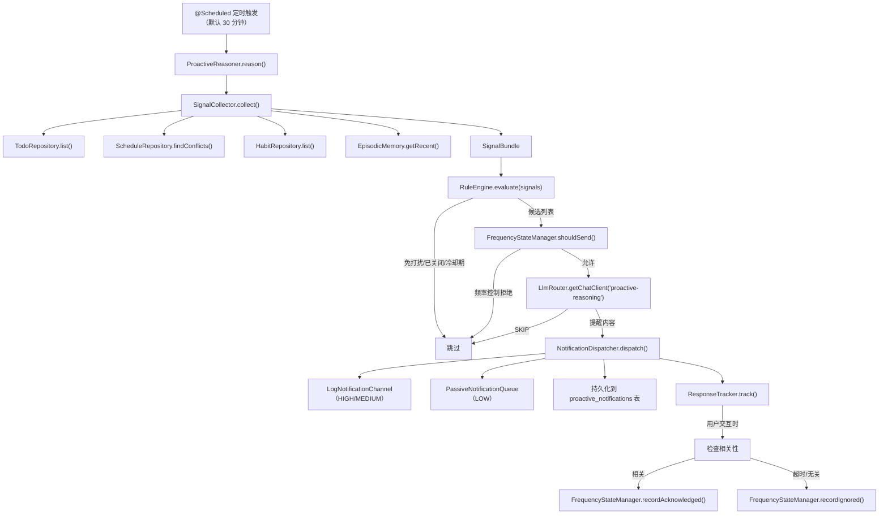

# Design Document: proactive-reasoning

## 参考文档

- 需求文档：#[[file:.kiro/specs/proactive-reasoning/requirements.md]]
- 架构设计：#[[file:docs/architecture/agent-engine.md]] §5
- 特性设计：#[[file:docs/features/proactive-reasoning.md]]
- 编码规范：#[[file:.kiro/steering/coding-standards.md]]
- 集成检查：#[[file:.kiro/steering/integration-checklist.md]]

## Overview

主动推理引擎（ProactiveReasoner）是 LifePilot 区别于传统被动式 AI 助手的核心差异化能力。本模块实现两阶段推理管线：

1. **Stage 1（RuleEngine，< 10ms）**：确定性规则过滤，快速排除免打扰时段、已关闭类型、冷却期内的候选，同时根据信号生成带紧急程度的 ProactiveCandidate
2. **Stage 2（LLM 评估，~500ms）**：通过 LlmRouter 调用 LLM 精细判断候选是否值得发送，生成个性化提醒内容

配合 FrequencyStateMachine 智能降频（NORMAL → REDUCED → MUTED）和 ResponseTracker 用户响应追踪，形成完整的反馈闭环。

### 设计决策

1. **简化 SignalCollector，不引入 SignalSource 抽象层**：架构文档中 SignalCollector 依赖 TaskSignalSource / HabitSignalSource / BehaviorSignalSource 等抽象。本实现直接注入 TodoRepository、ScheduleRepository、HabitRepository、EpisodicMemory，减少不必要的间接层。信号源抽象可在后续需要插件化信号源时再引入。
2. **NotificationDispatcher 使用占位通道**：真实通知通道（系统托盘、Web UI、企微/钉钉/飞书）依赖 Gateway 模块（Phase 3 模块 13）。当前 HIGH/MEDIUM 通过日志输出，LOW 入队被动通知队列。定义 NotificationChannel 接口为未来扩展预留。
3. **FrequencyState 作为枚举而非 sealed interface**：三态状态机（NORMAL/REDUCED/MUTED）是固定的有限状态集，枚举比 sealed interface 更简洁，状态转换逻辑内聚在枚举方法中。
4. **ResponseTracker 使用关键词匹配判断相关性**：简化实现，不依赖 LLM 判断用户消息与通知的相关性。每个 NotificationType 关联一组中文关键词，通过 contains 匹配。后续可升级为语义相似度匹配。
5. **@Scheduled 使用 fixedDelay 而非 cron**：简单的固定间隔触发满足当前需求，cron 表达式支持留给 Workflow 模块（Phase 4 模块 15）。
6. **所有 Bean 通过 ProactiveAutoConfiguration 的 @Bean 方法注册**：遵循项目规范，不使用 @Service/@Component 注解。

### 范围限制

- 通知通道为占位实现（日志 + 被动队列），真实通道随 Gateway 模块实现
- 不包含工作流/自动化集成（模块 15）
- FrequencyState 持久化使用 JdbcTemplate 直接操作，不引入 ORM
- 定时触发使用 fixedDelay，不支持 cron 表达式

## Architecture

### 包结构

```
com.lifepilot.agent.proactive
├── ProactiveReasoner.java          # 主动推理引擎（两阶段管线编排）
├── SignalCollector.java            # 信号收集器
├── RuleEngine.java                 # Stage 1 规则引擎
├── FrequencyStateManager.java      # 频率状态管理器
├── NotificationDispatcher.java     # 通知分发器
├── ResponseTracker.java            # 用户响应追踪器
├── model/                          # 数据模型
│   ├── SignalBundle.java           # 信号包 record
│   ├── ProactiveCandidate.java     # 候选提醒 record
│   ├── ProactiveNotification.java  # 通知 record
│   ├── FrequencyStateEntry.java    # 频率状态条目 record
│   ├── TrackingEntry.java          # 追踪条目 record
│   ├── NotificationType.java       # 提醒类型枚举
│   ├── Urgency.java                # 紧急程度枚举
│   └── FrequencyState.java         # 频率状态枚举
├── channel/                        # 通知通道
│   ├── NotificationChannel.java    # 通道接口（扩展点）
│   ├── LogNotificationChannel.java # 日志通道（占位）
│   └── PassiveNotificationQueue.java # 被动通知队列
├── config/                         # 配置
│   ├── ProactiveAutoConfiguration.java  # Spring 自动配置
│   └── ProactiveConfigProperties.java   # 配置属性
└── migration/                      # 数据库迁移（逻辑归属，物理位置在 resources/db/migration/）
```

### 组件交互流程



## Components and Interfaces

### 依赖接口验证

| 接口 | 源码位置 | 验证状态 |
|------|---------|---------|
| LlmRouter.getChatClient(String scene) → ChatClient | com.lifepilot.llm.LlmRouter | ✅ 已核对 |
| TodoRepository.list(@Nullable String status, @Nullable String priority) → List\<TodoItem\> | com.lifepilot.skill.builtin.todo.TodoRepository | ✅ 已核对 |
| ScheduleRepository.list() → List\<ScheduleItem\> | com.lifepilot.skill.builtin.schedule.ScheduleRepository | ✅ 已核对 |
| ScheduleRepository.findConflicts(String start, String end) → List\<ScheduleItem\> | com.lifepilot.skill.builtin.schedule.ScheduleRepository | ✅ 已核对 |
| HabitRepository.list() → List\<HabitItem\> | com.lifepilot.skill.builtin.habit.HabitRepository | ✅ 已核对 |
| HabitRepository.calculateStreak(String habitId) → int | com.lifepilot.skill.builtin.habit.HabitRepository | ✅ 已核对 |
| EpisodicMemory.getRecent(int limit) → List\<ConversationRecord\> | com.lifepilot.memory.episodic.EpisodicMemory | ✅ 已核对 |
| JdbcTemplate（Spring 提供） | org.springframework.jdbc.core.JdbcTemplate | ✅ 框架内置 |


### 核心组件接口

#### ProactiveReasoner

主动推理引擎，编排两阶段管线。

```java
package com.lifepilot.agent.proactive;

/**
 * 主动推理引擎 — 两阶段推理管线编排。
 *
 * @author zsg
 * @since 2026-03-15
 */
public class ProactiveReasoner {

    /**
     * 定时触发主动推理。使用 Virtual Thread 执行。
     * fixedDelay 从配置读取，默认 1800000ms（30 分钟）。
     */
    @Scheduled(fixedDelayString = "${lifepilot.agent.proactive.interval-ms:1800000}")
    public void reason();
}
```

#### SignalCollector

从各数据源收集信号，返回不可变 SignalBundle。

```java
package com.lifepilot.agent.proactive;

/**
 * 信号收集器 — 从任务、日程、习惯、行为数据源收集信号。
 *
 * @author zsg
 * @since 2026-03-15
 */
public class SignalCollector {

    public SignalCollector(
        TodoRepository todoRepository,
        ScheduleRepository scheduleRepository,
        HabitRepository habitRepository,
        EpisodicMemory episodicMemory,
        ProactiveConfigProperties config);

    /** 收集所有信号，返回不可变 SignalBundle。 */
    public SignalBundle collect();
}
```

#### RuleEngine

Stage 1 确定性过滤器，纯规则逻辑，不依赖 LLM。

```java
package com.lifepilot.agent.proactive;

/**
 * 规则引擎 — Stage 1 确定性过滤，< 10ms。
 *
 * @author zsg
 * @since 2026-03-15
 */
public class RuleEngine {

    public RuleEngine(
        FrequencyStateManager frequencyStateManager,
        ProactiveConfigProperties config);

    /**
     * 评估信号包，生成候选提醒列表。
     * 过滤规则：免打扰时段 → 类型开关 → 冷却期 → 信号阈值。
     *
     * @param signals 信号包
     * @return 不可变候选列表
     */
    public List<ProactiveCandidate> evaluate(SignalBundle signals);
}
```

#### FrequencyStateManager

管理所有 NotificationType 的频率状态，ConcurrentHashMap 运行时缓存 + SQLite 持久化。

```java
package com.lifepilot.agent.proactive;

/**
 * 频率状态管理器 — 管理所有提醒类型的 FrequencyStateMachine 实例。
 *
 * @author zsg
 * @since 2026-03-15
 */
public class FrequencyStateManager {

    public FrequencyStateManager(JdbcTemplate jdbcTemplate, ProactiveConfigProperties config);

    /** 获取指定类型的频率状态。 */
    public FrequencyState getState(NotificationType type);

    /** 判断指定类型在当前状态下是否允许发送指定紧急度的通知。 */
    public boolean shouldSend(NotificationType type, Urgency urgency);

    /** 判断指定类型是否在冷却期内。 */
    public boolean isInCooldown(NotificationType type);

    /** 记录用户忽略。 */
    public void recordIgnored(NotificationType type);

    /** 记录用户确认 — 即时恢复到 NORMAL。 */
    public void recordAcknowledged(NotificationType type);

    /** 启动时从 SQLite 加载持久化状态。 */
    public void loadPersistedStates();
}
```

#### NotificationDispatcher

根据紧急程度选择通道并分发通知。

```java
package com.lifepilot.agent.proactive;

/**
 * 通知分发器 — 根据紧急程度选择通道并发送。
 *
 * @author zsg
 * @since 2026-03-15
 */
public class NotificationDispatcher {

    public NotificationDispatcher(
        NotificationChannel logChannel,
        PassiveNotificationQueue passiveQueue,
        JdbcTemplate jdbcTemplate);

    /**
     * 分发通知。HIGH/MEDIUM → 日志通道，LOW → 被动队列。
     * 同时持久化到 proactive_notifications 表。
     */
    public void dispatch(ProactiveNotification notification);
}
```

#### ResponseTracker

追踪用户对通知的响应行为，驱动频率状态转换。

```java
package com.lifepilot.agent.proactive;

/**
 * 用户响应追踪器 — 追踪通知响应并反馈给 FrequencyStateManager。
 *
 * @author zsg
 * @since 2026-03-15
 */
public class ResponseTracker {

    public ResponseTracker(
        FrequencyStateManager frequencyStateManager,
        ProactiveConfigProperties config);

    /** 开始追踪一个已发送通知。 */
    public void track(NotificationType type);

    /** 用户交互时调用 — 检查待追踪通知是否被响应。 */
    public void onUserInteraction(String userMessage);

    /** 清理过期追踪条目（超过响应窗口的标记为忽略）。 */
    public void cleanupExpired();
}
```

#### NotificationChannel 接口

```java
package com.lifepilot.agent.proactive.channel;

/**
 * 通知通道接口 — 扩展点，未来 Gateway 模块实现真实通道。
 *
 * @author zsg
 * @since 2026-03-15
 */
public interface NotificationChannel {

    /** 通道标识。 */
    String id();

    /** 发送通知。 */
    void send(ProactiveNotification notification);
}
```


## Data Models

### 枚举类型

```java
/** 提醒类型。 */
public enum NotificationType {
    DEADLINE_REMINDER,   // 待办截止提醒
    SCHEDULE_REMINDER,   // 日程开始提醒
    HABIT_REMINDER,      // 习惯打卡提醒
    STREAK_AT_RISK,      // 连续打卡风险提醒
    DAILY_SUMMARY,       // 每日总结
    WEEKLY_REVIEW        // 每周回顾
}

/** 紧急程度。 */
public enum Urgency { HIGH, MEDIUM, LOW }

/** 频率状态 — 三态状态机。 */
public enum FrequencyState {
    NORMAL,   // 正常：所有紧急度均发送
    REDUCED,  // 降频：仅 HIGH/MEDIUM，冷却期 ×3
    MUTED;    // 静默：仅 HIGH

    /** 用户忽略时的状态转换。 */
    public FrequencyState onIgnored(int consecutiveIgnoreCount, int threshold);

    /** 用户确认时即时恢复。 */
    public FrequencyState onAcknowledged();

    /** 判断当前状态是否允许发送指定紧急度。 */
    public boolean shouldSend(Urgency urgency);

    /** 获取冷却期倍数。 */
    public int intervalMultiplier(int reducedMultiplier);
}
```

### Record 数据载体

```java
/**
 * 信号包 — SignalCollector 的输出，不可变数据载体。
 */
@Builder(toBuilder = true)
public record SignalBundle(
    // 时间信号
    LocalDateTime currentTime,
    DayOfWeek dayOfWeek,
    Duration timeSinceLastInteraction,

    // 任务信号：24 小时内到期的 PENDING/IN_PROGRESS 待办
    List<TodoItem> upcomingDeadlines,

    // 日程信号：2 小时内开始的日程
    List<ScheduleItem> upcomingSchedules,

    // 习惯信号：今天未打卡的习惯
    List<HabitItem> pendingHabits,

    // 连续打卡风险：current_streak > 0 且今天未打卡
    List<HabitItem> streaksAtRisk,

    // 行为信号：最近 24 小时对话数量
    int recentConversationCount
) {}

/**
 * 候选提醒 — 通过 RuleEngine 过滤后的提醒候选。
 */
public record ProactiveCandidate(
    NotificationType type,
    Urgency urgency,
    String reason
) {}

/**
 * 主动通知 — 最终发送给用户的通知。
 */
public record ProactiveNotification(
    String id,
    NotificationType type,
    Urgency urgency,
    String content,
    String channel,
    String responseStatus,  // PENDING / ACKNOWLEDGED / IGNORED
    Instant sentAt
) {}

/**
 * 频率状态条目 — FrequencyStateManager 的运行时缓存和持久化单元。
 */
public record FrequencyStateEntry(
    FrequencyState state,
    int consecutiveIgnoreCount,
    Instant lastNotifiedAt
) {
    public static FrequencyStateEntry initial() {
        return new FrequencyStateEntry(FrequencyState.NORMAL, 0, Instant.EPOCH);
    }
}

/**
 * 追踪条目 — ResponseTracker 的待追踪通知。
 */
public record TrackingEntry(
    NotificationType type,
    Instant sentAt
) {}
```

### 数据库 Schema（Flyway V11）

```sql
-- V11__create_proactive_reasoning_tables.sql

-- 频率状态表
CREATE TABLE IF NOT EXISTS frequency_states (
    notification_type   TEXT PRIMARY KEY,
    state               TEXT NOT NULL DEFAULT 'NORMAL',
    consecutive_ignore_count INTEGER NOT NULL DEFAULT 0,
    last_notified_at    TEXT,
    created_at          TEXT NOT NULL DEFAULT (datetime('now')),
    updated_at          TEXT NOT NULL DEFAULT (datetime('now'))
);

-- 主动通知记录表
CREATE TABLE IF NOT EXISTS proactive_notifications (
    id                  TEXT PRIMARY KEY,
    notification_type   TEXT NOT NULL,
    urgency             TEXT NOT NULL,
    content             TEXT NOT NULL,
    channel             TEXT NOT NULL,
    response_status     TEXT NOT NULL DEFAULT 'PENDING',
    sent_at             TEXT NOT NULL,
    responded_at        TEXT,
    created_at          TEXT NOT NULL DEFAULT (datetime('now'))
);

CREATE INDEX idx_proactive_notifications_type ON proactive_notifications(notification_type);
CREATE INDEX idx_proactive_notifications_sent ON proactive_notifications(sent_at);
```

### 配置属性

```java
/**
 * 主动推理配置属性。
 * 前缀：lifepilot.agent.proactive
 */
@ConfigurationProperties(prefix = "lifepilot.agent.proactive")
public class ProactiveConfigProperties {
    /** 是否启用主动推理。 */
    private boolean enabled = true;

    /** 推理间隔（毫秒），默认 30 分钟。 */
    private long intervalMs = 1_800_000;

    /** 免打扰开始小时（0-23），默认 22。 */
    private int quietHoursStart = 22;

    /** 免打扰结束小时（0-23），默认 8。 */
    private int quietHoursEnd = 8;

    /** 同类型通知冷却时间（分钟），默认 120。 */
    private int cooldownMinutes = 120;

    /** 用户响应窗口（分钟），默认 30。 */
    private int responseWindowMinutes = 30;

    /** 连续忽略阈值（触发降频），默认 3。 */
    private int ignoreThreshold = 3;

    /** REDUCED 状态冷却期倍数，默认 3。 */
    private int reducedMultiplier = 3;

    /** LLM 生成通知内容最大字符数，默认 100。 */
    private int maxContentLength = 100;

    /** 各 NotificationType 的启用状态，默认全部启用。 */
    private Map<NotificationType, Boolean> typeEnabled = new EnumMap<>(NotificationType.class);

    // getter/setter 省略
}
```

对应 `application.yml` 配置：

```yaml
lifepilot:
  agent:
    proactive:
      enabled: true
      interval-ms: 1800000
      quiet-hours-start: 22
      quiet-hours-end: 8
      cooldown-minutes: 120
      response-window-minutes: 30
      ignore-threshold: 3
      reduced-multiplier: 3
      max-content-length: 100
```


## Correctness Properties

*A property is a characteristic or behavior that should hold true across all valid executions of a system — essentially, a formal statement about what the system should do. Properties serve as the bridge between human-readable specifications and machine-verifiable correctness guarantees.*

### Property 1: SignalCollector 正确过滤待办信号

*For any* set of TodoItem records with various statuses (PENDING/IN_PROGRESS/COMPLETED) and due dates, SignalCollector.collect() SHALL return a SignalBundle whose upcomingDeadlines contains exactly those TodoItems with status PENDING or IN_PROGRESS and due_date within the next 24 hours, and no others.

**Validates: Requirements 1.2**

### Property 2: SignalCollector 正确过滤日程信号

*For any* set of ScheduleItem records with various start times, SignalCollector.collect() SHALL return a SignalBundle whose upcomingSchedules contains exactly those ScheduleItems with start_time within the next 2 hours, and no others.

**Validates: Requirements 1.3**

### Property 3: SignalCollector 正确过滤习惯和连续打卡风险信号

*For any* set of HabitItem records with various check-in states and streak counts, SignalCollector.collect() SHALL return a SignalBundle where: (a) pendingHabits contains exactly those habits not checked in today, and (b) streaksAtRisk contains exactly those habits with current_streak > 0 and not checked in today.

**Validates: Requirements 1.4, 1.5**

### Property 4: RuleEngine 免打扰时段全局过滤

*For any* SignalBundle where currentTime falls within quiet hours (default 22:00-08:00), RuleEngine.evaluate() SHALL return an empty list regardless of the signal content.

**Validates: Requirements 2.1**

### Property 5: RuleEngine 排除已禁用类型和冷却期内类型

*For any* SignalBundle and configuration where certain NotificationTypes are disabled or within their cooldown period, RuleEngine.evaluate() SHALL never return a ProactiveCandidate whose type is disabled or in cooldown.

**Validates: Requirements 2.2, 2.3**

### Property 6: RuleEngine 待办紧急程度映射

*For any* TodoItem with due_date within 24 hours appearing in a SignalBundle (outside quiet hours, type enabled, not in cooldown), RuleEngine.evaluate() SHALL produce a ProactiveCandidate with urgency determined by time-to-due: ≤ 2 hours → HIGH, 2-12 hours → MEDIUM, 12-24 hours → LOW.

**Validates: Requirements 2.4, 2.5, 2.6**

### Property 7: RuleEngine 日程紧急程度映射

*For any* ScheduleItem with start_time within 30 minutes appearing in a SignalBundle (outside quiet hours, type enabled, not in cooldown), RuleEngine.evaluate() SHALL produce a ProactiveCandidate with urgency HIGH.

**Validates: Requirements 2.7**

### Property 8: RuleEngine 习惯紧急程度映射

*For any* HabitItem appearing in a SignalBundle (outside quiet hours, type enabled, not in cooldown): (a) a pending habit check-in SHALL produce a ProactiveCandidate with urgency LOW, and (b) a streak-at-risk habit SHALL produce a ProactiveCandidate with urgency MEDIUM.

**Validates: Requirements 2.8, 2.9**

### Property 9: FrequencyState 忽略降频转换

*For any* FrequencyState (NORMAL or REDUCED) and consecutive ignore count reaching the configured threshold, calling onIgnored() SHALL transition the state down by one level: NORMAL → REDUCED, REDUCED → MUTED. MUTED remains MUTED regardless of ignore count.

**Validates: Requirements 4.2, 4.3**

### Property 10: FrequencyState 确认即时恢复

*For any* FrequencyState (NORMAL, REDUCED, or MUTED), calling onAcknowledged() SHALL always return NORMAL and reset the consecutive ignore count to 0.

**Validates: Requirements 4.4**

### Property 11: FrequencyState 紧急程度过滤

*For any* FrequencyState and Urgency combination, shouldSend() SHALL return true if and only if: NORMAL → all urgencies allowed; REDUCED → only HIGH and MEDIUM allowed; MUTED → only HIGH allowed.

**Validates: Requirements 4.5, 4.6, 4.7**

### Property 12: 通知通道路由

*For any* ProactiveNotification, NotificationDispatcher SHALL route it to the log channel if urgency is HIGH or MEDIUM, and to the passive notification queue if urgency is LOW.

**Validates: Requirements 5.1, 5.2, 5.3**

### Property 13: 频率状态持久化往返

*For any* valid FrequencyStateEntry (state, consecutiveIgnoreCount, lastNotifiedAt), persisting it to the frequency_states table and then loading it back SHALL produce an equivalent FrequencyStateEntry.

**Validates: Requirements 4.9, 9.3, 9.4**

### Property 14: 通知记录持久化往返

*For any* valid ProactiveNotification, persisting it to the proactive_notifications table and then querying by id SHALL return a record with matching type, urgency, content, channel, and sentAt.

**Validates: Requirements 9.5**

### Property 15: LLM 通知内容截断

*For any* LLM-generated string, the notification content stored in ProactiveNotification SHALL have length ≤ the configured maxContentLength (default 100 characters).

**Validates: Requirements 3.2**

### Property 16: ResponseTracker 关键词相关性判断

*For any* NotificationType and user message string, the relatedness check SHALL return true if and only if the message contains at least one keyword from the type's keyword set (e.g., "待办"/"截止" for DEADLINE_REMINDER, "日程"/"会议" for SCHEDULE_REMINDER, etc.).

**Validates: Requirements 6.4**

### Property 17: ResponseTracker 响应结果判定

*For any* tracked notification and subsequent user interaction: (a) if the interaction occurs within the response window and is related, the notification SHALL be reported as acknowledged; (b) if the response window expires without a related interaction, the notification SHALL be reported as ignored. In both cases, the tracking entry SHALL be removed from the pending map.

**Validates: Requirements 6.2, 6.3, 6.6**


## Error Handling

### LLM 调用失败

- **场景**：LlmRouter.getChatClient("proactive-reasoning") 抛出 LlmUnavailableException
- **处理**：WARN 级别日志记录，跳过当前候选，继续处理其他候选
- **原则**：LLM 不可用不影响 Stage 1 规则引擎的正常运行，也不影响其他候选的评估

### 数据源查询失败

- **场景**：TodoRepository / ScheduleRepository / HabitRepository / EpisodicMemory 查询抛出异常
- **处理**：SignalCollector 对每个数据源独立 try-catch，失败的数据源返回空列表，其他数据源正常收集
- **原则**：单个数据源故障不阻塞整个信号收集流程

### 推理周期异常

- **场景**：reason() 方法内任何未预期异常
- **处理**：WARN 级别日志记录，不抛出异常（避免 @Scheduled 任务终止）
- **原则**：单次推理失败不影响后续周期的调度

### 频率状态持久化失败

- **场景**：SQLite 写入 frequency_states 表失败
- **处理**：WARN 级别日志记录，内存中的 ConcurrentHashMap 状态仍然有效
- **原则**：持久化失败降级为内存模式，下次成功写入时恢复

### 通知持久化失败

- **场景**：SQLite 写入 proactive_notifications 表失败
- **处理**：WARN 级别日志记录，通知仍然通过通道发送（发送和持久化解耦）
- **原则**：持久化是审计需求，不阻塞通知发送

## Testing Strategy

### 属性测试（Property-Based Testing）

使用 **jqwik** 作为属性测试库（已在项目中使用），每个属性测试最少运行 100 次迭代。

每个属性测试必须以注释标注对应的设计属性：
```java
// Feature: proactive-reasoning, Property {number}: {property_text}
```

属性测试覆盖的核心属性：

| 属性编号 | 属性名称 | 测试类 |
|---------|---------|--------|
| P1 | SignalCollector 待办过滤 | SignalCollectorPropertyTest |
| P2 | SignalCollector 日程过滤 | SignalCollectorPropertyTest |
| P3 | SignalCollector 习惯过滤 | SignalCollectorPropertyTest |
| P4 | RuleEngine 免打扰过滤 | RuleEnginePropertyTest |
| P5 | RuleEngine 禁用/冷却排除 | RuleEnginePropertyTest |
| P6 | RuleEngine 待办紧急程度 | RuleEnginePropertyTest |
| P7 | RuleEngine 日程紧急程度 | RuleEnginePropertyTest |
| P8 | RuleEngine 习惯紧急程度 | RuleEnginePropertyTest |
| P9 | FrequencyState 忽略降频 | FrequencyStatePropertyTest |
| P10 | FrequencyState 确认恢复 | FrequencyStatePropertyTest |
| P11 | FrequencyState 紧急度过滤 | FrequencyStatePropertyTest |
| P12 | 通知通道路由 | NotificationDispatcherPropertyTest |
| P13 | 频率状态持久化往返 | FrequencyStateManagerPropertyTest |
| P14 | 通知持久化往返 | NotificationDispatcherPropertyTest |
| P15 | LLM 内容截断 | ProactiveReasonerPropertyTest |
| P16 | 关键词相关性 | ResponseTrackerPropertyTest |
| P17 | 响应结果判定 | ResponseTrackerPropertyTest |

### 单元测试

单元测试聚焦于具体示例、边界条件和错误处理：

| 测试类 | 覆盖内容 |
|--------|---------|
| RuleEngineTest | 免打扰时段边界（21:59 vs 22:00 vs 08:00 vs 08:01）、空信号包、全部类型禁用 |
| FrequencyStateTest | 阈值边界（连续忽略 2 次 vs 3 次）、MUTED 状态忽略不变 |
| ResponseTrackerTest | 响应窗口边界（29 分 vs 30 分 vs 31 分）、多个待追踪条目同时过期 |
| ProactiveReasonerTest | LLM 不可用时跳过候选、异常不中断调度、enabled=false 不执行 |
| SignalCollectorTest | 单个数据源异常不阻塞其他数据源、空仓储返回空信号 |
| NotificationDispatcherTest | 持久化失败不阻塞发送 |

### 集成测试

| 测试类 | 覆盖内容 |
|--------|---------|
| ProactiveReasoner_集成测试 | 完整两阶段管线端到端：信号收集 → 规则过滤 → LLM 评估（Mock）→ 通知发送 → 响应追踪 |
| FrequencyStateManager_持久化_集成测试 | SQLite 持久化往返：写入 → 重新加载 → 验证一致性 |
| ProactiveAutoConfiguration_集成测试 | Spring Context 加载、所有 Bean 注入成功、@ConditionalOnProperty 条件验证 |

### jqwik 自定义 Arbitrary 提供器

需要为以下类型创建 Arbitrary 提供器：

- `Arbitrary<TodoItem>`：生成随机待办，status 从 PENDING/IN_PROGRESS/COMPLETED 中选择，dueDate 在 ±48 小时范围内随机
- `Arbitrary<ScheduleItem>`：生成随机日程，startTime 在 ±4 小时范围内随机
- `Arbitrary<HabitItem>`：生成随机习惯，currentStreak 在 0-100 范围内随机
- `Arbitrary<SignalBundle>`：组合上述 Arbitrary 生成完整信号包
- `Arbitrary<FrequencyState>`：从三个枚举值中随机选择
- `Arbitrary<Urgency>`：从三个枚举值中随机选择
- `Arbitrary<NotificationType>`：从六个枚举值中随机选择
