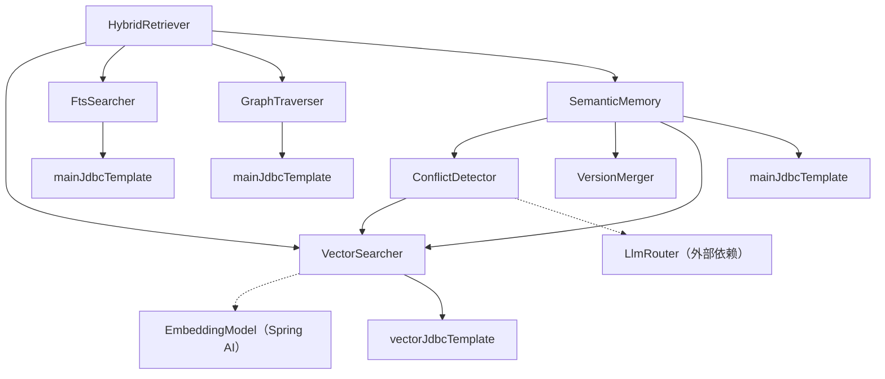

# 语义记忆与混合检索设计文档

参考文档：
- 架构设计：docs/architecture/memory-system.md §5（L3 语义记忆）、§7（混合检索引擎）
- 数据模型：docs/architecture/data-model.md §4.5（时序知识图谱）
- 特性设计：docs/features/memory-system.md §3（时序知识图谱）、§5（混合检索引擎）
- 前置 spec：.kiro/specs/memory-foundation/design.md
- 编码规范：.kiro/steering/coding-standards.md

---

## 概述

本设计覆盖 LifePilot 记忆系统的 L3 语义记忆层和混合检索引擎。语义记忆基于时序知识图谱，为 Agent 提供结构化知识的版本化存储、冲突检测与合并、时间旅行查询和图遍历能力。混合检索引擎通过三路并行检索（向量语义 + FTS5 全文 + 图遍历）和加权 RRF 融合，为 ContextAssembler 提供高质量的记忆召回。

### 设计决策

1. **双库分离**：主数据库（lifepilot.db）存储结构化数据，向量数据库（vectors.db）存储 sqlite-vec 向量索引。分离后 sqlite-vec 加载失败不影响核心功能。
2. **版本化实体**：每次更新创建新版本（旧版本 `is_current=0, valid_to=now`），支持时间旅行查询和变更历史追踪。
3. **三级冲突检测**：精确匹配 → 语义匹配（阈值 0.92）→ LLM 消歧义，平衡准确率和性能。
4. **VectorSearcher 降级策略**：sqlite-vec 不可用时降级为 JVM 暴力搜索，保证功能等价。
5. **entity_embeddings 程序化创建**：vec0 虚拟表需要 sqlite-vec 扩展加载后才能创建，不通过 Flyway 管理。
6. **TemporalRelation 使用 propertiesJson(String)**：关系的附加属性直接存储为 JSON 字符串，不解析为 Map，简化序列化。

---

## 架构

### 包结构

```
com.lifepilot.memory
├── semantic/                          # L3 语义记忆
│   ├── EntityType.java                    # 实体类型枚举（11 值）
│   ├── RelationTypes.java                 # 关系类型常量类
│   ├── TemporalEntity.java                # 时序实体 record（16 字段）
│   ├── TemporalRelation.java              # 时序关系 record（10 字段）
│   ├── SemanticMemory.java                # 语义记忆服务（JdbcTemplate）
│   ├── ConflictDetector.java              # 三级冲突检测器
│   ├── VersionMerger.java                 # 版本合并器
│   ├── MergeResult.java                   # 合并结果 record
│   ├── ConflictDetail.java                # 冲突详情 record
│   └── ConflictResolution.java            # 冲突解决方式枚举
│
├── retrieval/                         # 混合检索引擎
│   ├── VectorSearcher.java                # 向量语义检索（sqlite-vec + JVM 降级）
│   ├── VectorSearchResult.java            # 向量检索结果 record
│   ├── FtsSearcher.java                   # FTS5 + BM25 全文搜索
│   ├── GraphTraverser.java                # 递归 CTE 图遍历
│   ├── RankedItem.java                    # 单路检索排名条目 record
│   ├── HybridRetriever.java               # 三路混合检索引擎
│   ├── RetrievalResult.java               # 检索结果 record（含 ScoreBreakdown 内部 record）
│   └── RetrievalWeights.java              # 检索权重配置 record
│
└── config/
    ├── MemoryProperties.java              # 扩展：新增 embeddingDimensions、semanticMatchThreshold
    └── MemoryAutoConfiguration.java       # 扩展：注册语义记忆和检索相关 Bean
```

### 组件依赖关系



---

## 组件与接口

### EntityType 枚举

```java
package com.lifepilot.memory.semantic;

/**
 * 实体类型枚举 — 定义时序知识图谱中的实体分类。
 * 数据库中以 TEXT 存储枚举名称（name()），新增类型无需 Schema 迁移。
 */
public enum EntityType {
    PERSON, ORGANIZATION, PLACE, EVENT, PROJECT,
    TOPIC, PREFERENCE, HABIT, GOAL, SKILL, CUSTOM
}
```

### RelationTypes 常量类

```java
package com.lifepilot.memory.semantic;

/**
 * 关系类型常量 — 管理已知关系类型字符串。
 * 所有常量为 public static final String，值为 snake_case 格式。
 */
public final class RelationTypes {
    // 社交关系
    public static final String KNOWS = "knows";
    public static final String IS_FRIEND_OF = "is_friend_of";
    public static final String IS_FAMILY_OF = "is_family_of";
    public static final String IS_CLIENT_OF = "is_client_of";
    // 组织关系
    public static final String WORKS_AT = "works_at";
    public static final String BELONGS_TO = "belongs_to";
    public static final String MANAGES = "manages";
    public static final String REPORTS_TO = "reports_to";
    // 项目关系
    public static final String RESPONSIBLE_FOR = "responsible_for";
    public static final String PARTICIPATES_IN = "participates_in";
    public static final String HAS_MILESTONE = "has_milestone";
    public static final String DEPENDS_ON = "depends_on";
    // 因果关系
    public static final String CAUSED_BY = "caused_by";
    public static final String LEADS_TO = "leads_to";
    public static final String RELATED_TO = "related_to";
    // 偏好关系
    public static final String PREFERS = "prefers";
    public static final String DISLIKES = "dislikes";
    public static final String HAS_GOAL = "has_goal";
    public static final String HAS_HABIT = "has_habit";

    private RelationTypes() {}
}
```

### TemporalEntity record

```java
package com.lifepilot.memory.semantic;

import jakarta.annotation.Nullable;
import java.time.Instant;
import java.util.Map;

/**
 * 时序实体 — 知识图谱节点，版本化 + 时间维度 + 来源追踪。
 */
public record TemporalEntity(
        String id,
        EntityType type,
        String name,
        @Nullable String description,
        Map<String, Object> properties,
        int version,
        boolean isCurrent,
        Instant validFrom,
        @Nullable Instant validTo,
        @Nullable String sourceConversationId,
        float extractionConfidence,
        float importanceScore,
        int accessCount,
        @Nullable Instant lastAccessedAt,
        Instant createdAt,
        Instant updatedAt
) {
    /** compact constructor：确保 properties 不可变。 */
    public TemporalEntity {
        properties = properties != null ? Map.copyOf(properties) : Map.of();
    }

    /** 拼接 name + description + properties 关键值为文本，用于向量化。 */
    public String textRepresentation() {
        var sb = new StringBuilder(name);
        if (description != null && !description.isBlank()) {
            sb.append(" ").append(description);
        }
        properties.forEach((k, v) -> sb.append(" ").append(k).append(":").append(v));
        return sb.toString();
    }

    /** 当前有效：isCurrent 为 true 且 validTo 为 null。 */
    public boolean isActive() {
        return isCurrent && validTo == null;
    }
}
```

### TemporalRelation record

```java
package com.lifepilot.memory.semantic;

import jakarta.annotation.Nullable;
import java.time.Instant;

/**
 * 时序关系 — 知识图谱的边，带强度和时间维度。
 */
public record TemporalRelation(
        String id,
        String sourceEntityId,
        String targetEntityId,
        String relationType,
        float strength,
        @Nullable String propertiesJson,
        Instant validFrom,
        @Nullable Instant validTo,
        @Nullable String sourceConversationId,
        Instant createdAt
) {
    /** compact constructor：验证 strength 范围。 */
    public TemporalRelation {
        if (strength < 0.0f || strength > 1.0f) {
            throw new IllegalArgumentException(
                    "关系强度必须在 [0.0, 1.0] 范围内，当前为 %.2f".formatted(strength));
        }
    }

    /** 当前有效：validTo 为 null。 */
    public boolean isActive() {
        return validTo == null;
    }
}
```

### VersionMerger 及相关类型

```java
/** 冲突解决方式枚举。 */
public enum ConflictResolution { KEEP_NEW, KEEP_OLD, KEEP_BOTH }

/** 冲突详情 record。 */
public record ConflictDetail(String fieldName, Object oldValue, Object newValue, ConflictResolution resolution) {}

/** 合并结果 record。 */
public record MergeResult(TemporalEntity mergedEntity, Map<String, ConflictDetail> conflicts, boolean isNewVersion) {}
```

VersionMerger 核心方法签名：

```java
public class VersionMerger {
    /**
     * 合并新实体信息到已有实体。
     * - 新属性直接添加
     * - 冲突属性按 extractionConfidence 决定：高者 KEEP_NEW/KEEP_OLD，相同 KEEP_BOTH
     * - description 取更长者
     * - 无变化时 isNewVersion=false
     * - 新版本 version=existing.version()+1, isCurrent=true, validFrom=now
     * - importanceScore 取两者较高值，继承 accessCount 和 lastAccessedAt
     */
    public MergeResult merge(TemporalEntity existing, TemporalEntity incoming, String conversationId);
}
```

### ConflictDetector

```java
public class ConflictDetector {
    /**
     * 三级冲突检测：
     * 1. 精确匹配：name + type 完全相同 → 返回已有实体
     * 2. 语义匹配：VectorSearcher 搜索，阈值 semanticMatchThreshold（默认 0.92）
     * 3. LLM 消歧义：对 Top-1 候选调用 LLM 判断是否同一实体
     * LLM 调用失败时降级为仅精确匹配，记录 WARN 日志。
     */
    public Optional<TemporalEntity> detectConflict(TemporalEntity newEntity);
}
```

### SemanticMemory 服务

```java
public class SemanticMemory {
    // 依赖：JdbcTemplate, ConflictDetector, VersionMerger, VectorSearcher

    /** 版本感知 upsert：冲突检测 → 合并/新建 → 插入 → 更新向量索引。事务内执行。 */
    @Transactional
    public TemporalEntity upsertWithConflictDetection(TemporalEntity incoming, String conversationId);

    /** 时间旅行查询：返回 valid_from <= point 且 (valid_to IS NULL OR valid_to > point) 的实体。 */
    public List<TemporalEntity> queryAtTime(Instant point);

    /** 变更历史：返回指定 name+type 的所有版本，按 version 升序。 */
    public List<TemporalEntity> getChangeHistory(String name, EntityType type);

    /** 图遍历：递归 CTE 沿当前有效关系边遍历最多 maxDepth 跳，不含起始实体。 */
    public List<TemporalEntity> findRelated(String entityId, int maxDepth);

    /** 查找当前版本实体。 */
    public Optional<TemporalEntity> findCurrentByNameAndType(String name, EntityType type);

    /** 归档：事务内设置 is_current=0, valid_to=now，同时归档所有当前有效关系。 */
    @Transactional
    public void archive(TemporalEntity entity);

    /** 增加访问计数。 */
    public void incrementAccessCount(String entityId);

    /** 添加关系。 */
    public void addRelation(TemporalRelation relation);

    /** 查找所有当前实体，按 importance_score ASC, access_count ASC。 */
    public List<TemporalEntity> findAllCurrent();
}
```

### VectorSearcher

```java
public class VectorSearcher {
    // 依赖：vectorJdbcTemplate, mainJdbcTemplate, EmbeddingModel, boolean vecExtensionLoaded

    /** 向量检索：sqlite-vec KNN 搜索，降级为 JVM 暴力搜索。 */
    public List<VectorSearchResult> searchEntities(String queryText, int topK, float threshold);

    /** 插入/更新实体向量：文本 → Embedding → entity_embeddings 表。sqlite-vec 未加载时跳过。 */
    public void upsertEntityVector(String entityId, String text);

    /** 删除实体向量。 */
    public void deleteEntityVector(String entityId);
}

/** 向量检索结果。 */
public record VectorSearchResult(String entityId, float similarity) {}
```

### FtsSearcher

```java
public class FtsSearcher {
    // 依赖：JdbcTemplate（主数据库）

    /**
     * FTS5 全文搜索。
     * - 对查询文本预处理，转义 FTS5 特殊字符（"*^()等）
     * - 使用 FTS5 MATCH + bm25() 在 messages_fts 中检索
     * - 通过 source_conversation_id 关联到 temporal_entities
     * - 语法错误或查询失败时返回空列表，记录 WARN 日志
     */
    public List<RankedItem> search(String query, int topK);
}
```

### GraphTraverser

```java
public class GraphTraverser {
    // 依赖：JdbcTemplate（主数据库）

    /**
     * 图遍历检索。
     * - 从查询文本中识别起始实体（名称精确匹配 temporal_entities）
     * - 递归 CTE 沿 valid_to IS NULL 的关系边遍历最多 2 跳
     * - depth=1 得分高于 depth=2
     * - 未识别到已知实体时返回空列表
     */
    public List<RankedItem> traverse(String query, int topK);
}
```

### RankedItem record

```java
/**
 * 单路检索的排名条目 — VectorSearcher/FtsSearcher/GraphTraverser 的统一输出格式。
 */
public record RankedItem(
        String entityId,
        String entityType,
        String name,
        @Nullable String description,
        float score,
        @Nullable Instant lastAccessedAt,
        float importanceScore
) {}
```

### RetrievalResult 和 RetrievalWeights

```java
/**
 * 检索结果 — 混合检索引擎返回的单条结果，实现 Comparable 按 fusedScore 降序。
 */
public record RetrievalResult(
        String entityId,
        String entityType,
        String name,
        @Nullable String description,
        float fusedScore,
        ScoreBreakdown scoreBreakdown,
        String sourcePath,
        @Nullable Instant lastAccessedAt,
        float importanceScore
) implements Comparable<RetrievalResult> {

    @Override
    public int compareTo(RetrievalResult other) {
        return Float.compare(other.fusedScore, this.fusedScore);
    }

    /** 分数明细内部 record。 */
    public record ScoreBreakdown(
            float vectorScore, float vectorWeighted,
            float ftsScore, float ftsWeighted,
            float graphScore, float graphWeighted,
            float recencyBoost, float importanceBoost
    ) {}
}

/**
 * 检索权重配置。
 * - DEFAULT: vectorWeight=0.45, ftsWeight=0.30, graphWeight=0.25, recencyDecay=0.05, importanceBoost=0.1, rrfK=60
 * - compact constructor 验证三权重之和 ≈ 1.0（误差 ≤ 0.01）
 * - adaptForLowVectorConfidence(topVectorScore): topVectorScore < 0.5 时降低 vectorWeight 30%
 */
public record RetrievalWeights(
        float vectorWeight, float ftsWeight, float graphWeight,
        float recencyDecay, float importanceBoost, int rrfK
) {
    public static final RetrievalWeights DEFAULT = new RetrievalWeights(
            0.45f, 0.30f, 0.25f, 0.05f, 0.1f, 60);

    public RetrievalWeights {
        float sum = vectorWeight + ftsWeight + graphWeight;
        if (Math.abs(sum - 1.0f) > 0.01f) {
            throw new IllegalArgumentException(
                    "检索权重之和必须为 1.0，当前为 %.2f".formatted(sum));
        }
    }

    public RetrievalWeights adaptForLowVectorConfidence(float topVectorScore) {
        if (topVectorScore >= 0.5f) return this;
        float reduction = vectorWeight * 0.3f;
        return new RetrievalWeights(
                vectorWeight - reduction,
                ftsWeight + reduction * 0.7f,
                graphWeight + reduction * 0.3f,
                recencyDecay, importanceBoost, rrfK);
    }
}
```

### HybridRetriever

```java
public class HybridRetriever {
    // 依赖：VectorSearcher, FtsSearcher, GraphTraverser, SemanticMemory

    /**
     * 三路混合检索。
     * 1. CompletableFuture + Virtual Thread 并行执行三路检索
     * 2. 自适应权重调整（向量 Top-1 < 0.5 时）
     * 3. 加权 RRF 融合：WeightedRRF(d) = Σ w(r) / (k + rank(r, d))
     * 4. 时间衰减：RecencyFactor = exp(-recencyDecay × daysSinceLastAccess)
     * 5. 重要度加成：ImportanceBoost = importanceBoost × importanceScore
     * 6. 按 entity_id 去重，保留 fusedScore 最高的条目
     * 7. 批量更新结果实体的 access_count
     * 任一路检索失败时使用其余路径继续融合，记录 WARN 日志。
     */
    public List<RetrievalResult> retrieve(String query, int topK, RetrievalWeights weights);
}
```

### MemoryAutoConfiguration 扩展

在现有 `MemoryAutoConfiguration` 中新增以下 `@Bean` 方法（均带 `@ConditionalOnMissingBean`）：

| Bean | 依赖 |
|------|------|
| `VersionMerger` | 无 |
| `ConflictDetector` | SemanticMemory, VectorSearcher, LlmRouter（可选） |
| `VectorSearcher` | vectorJdbcTemplate, mainJdbcTemplate, EmbeddingModel |
| `SemanticMemory` | JdbcTemplate, ConflictDetector, VersionMerger, VectorSearcher |
| `FtsSearcher` | JdbcTemplate |
| `GraphTraverser` | JdbcTemplate |
| `HybridRetriever` | VectorSearcher, FtsSearcher, GraphTraverser, SemanticMemory |

在 `MemoryProperties` 中新增：
- `embeddingDimensions`（int，默认 1024）— sqlite-vec 向量维度
- `semanticMatchThreshold`（float，默认 0.92）— 冲突检测语义匹配阈值

---

## 数据模型

### Flyway V7 迁移脚本

文件：`src/main/resources/db/migration/V7__create_semantic_memory_tables.sql`

```sql
-- temporal_entities 表
CREATE TABLE temporal_entities (
    id                      TEXT PRIMARY KEY,
    type                    TEXT NOT NULL,
    name                    TEXT NOT NULL,
    description             TEXT,
    properties_json         TEXT,
    version                 INTEGER NOT NULL DEFAULT 1,
    is_current              INTEGER NOT NULL DEFAULT 1,
    valid_from              TEXT NOT NULL,
    valid_to                TEXT,
    source_conversation_id  TEXT REFERENCES conversations(id),
    extraction_confidence   REAL DEFAULT 0.0,
    importance_score        REAL DEFAULT 0.5,
    access_count            INTEGER DEFAULT 0,
    last_accessed_at        TEXT,
    created_at              TEXT NOT NULL,
    updated_at              TEXT NOT NULL
);

CREATE INDEX idx_entities_name_type ON temporal_entities(name, type);
CREATE INDEX idx_entities_current ON temporal_entities(is_current) WHERE is_current = 1;
CREATE INDEX idx_entities_type_valid ON temporal_entities(type, valid_from, valid_to);
CREATE INDEX idx_entities_importance ON temporal_entities(importance_score, access_count) WHERE is_current = 1;
CREATE INDEX idx_entities_source ON temporal_entities(source_conversation_id) WHERE source_conversation_id IS NOT NULL;

-- temporal_relations 表
CREATE TABLE temporal_relations (
    id                      TEXT PRIMARY KEY,
    source_entity_id        TEXT NOT NULL REFERENCES temporal_entities(id),
    target_entity_id        TEXT NOT NULL REFERENCES temporal_entities(id),
    relation_type           TEXT NOT NULL,
    strength                REAL DEFAULT 0.5,
    properties_json         TEXT,
    valid_from              TEXT NOT NULL,
    valid_to                TEXT,
    source_conversation_id  TEXT REFERENCES conversations(id),
    created_at              TEXT NOT NULL
);

CREATE INDEX idx_relations_source ON temporal_relations(source_entity_id, relation_type);
CREATE INDEX idx_relations_target ON temporal_relations(target_entity_id, relation_type);
CREATE INDEX idx_relations_valid ON temporal_relations(valid_from, valid_to) WHERE valid_to IS NULL;
```

### entity_embeddings 向量表（程序化创建）

由 VectorSearcher 在初始化时程序化创建（非 Flyway 管理），因为 sqlite-vec 扩展需要在连接上加载后才能创建 vec0 虚拟表。

```sql
-- 在 vectors.db 上执行（需 sqlite-vec 扩展已加载）
CREATE VIRTUAL TABLE IF NOT EXISTS entity_embeddings USING vec0(
    entity_id TEXT PRIMARY KEY,
    embedding FLOAT[1024]    -- 维度由 MemoryProperties.embeddingDimensions 配置
);
```

### 数据库字段与 Java 类型映射

| 数据库列 | SQL 类型 | Java 类型 | 说明 |
|---------|---------|----------|------|
| id | TEXT | String | UUID |
| type | TEXT | EntityType | 枚举 name() |
| name | TEXT | String | |
| description | TEXT | @Nullable String | |
| properties_json | TEXT | Map<String, Object> | Jackson 序列化/反序列化 |
| version | INTEGER | int | |
| is_current | INTEGER | boolean | 0/1 ↔ false/true |
| valid_from | TEXT | Instant | ISO 8601 |
| valid_to | TEXT | @Nullable Instant | null = 当前有效 |
| source_conversation_id | TEXT | @Nullable String | FK → conversations(id) |
| extraction_confidence | REAL | float | [0.0, 1.0] |
| importance_score | REAL | float | [0.0, 1.0] |
| access_count | INTEGER | int | |
| last_accessed_at | TEXT | @Nullable Instant | |
| created_at | TEXT | Instant | |
| updated_at | TEXT | Instant | |
| strength | REAL | float | [0.0, 1.0] |
| relation_type | TEXT | String | RelationTypes 常量 |

---

## 正确性属性

*正确性属性是系统在所有有效执行中都应保持为真的特征或行为——本质上是关于系统应该做什么的形式化陈述。属性是人类可读规范与机器可验证正确性保证之间的桥梁。*

### Property 1: TemporalEntity properties 不可变性

*For any* TemporalEntity 实例，对其 `properties()` 返回的 Map 执行 `put`、`remove` 或 `clear` 操作，均应抛出 `UnsupportedOperationException`，且 Map 内容不变。

**Validates: Requirements 4.2**

### Property 2: TemporalRelation strength 范围不变量

*For any* float 值 `s`，当 `s < 0.0` 或 `s > 1.0` 时，构造 TemporalRelation 应抛出 `IllegalArgumentException`；当 `0.0 ≤ s ≤ 1.0` 时，构造应成功且 `strength()` 返回 `s`。

**Validates: Requirements 5.3**

### Property 3: VersionMerger 合并正确性

*For any* 一对 existing 和 incoming TemporalEntity，调用 `merge(existing, incoming, conversationId)` 后：
- incoming 中存在而 existing 中不存在的属性，应出现在 mergedEntity 的 properties 中
- 同名属性值不同时，若 `incoming.extractionConfidence > existing.extractionConfidence` 则 resolution 为 `KEEP_NEW`，反之为 `KEEP_OLD`，相等时为 `KEEP_BOTH`
- 新版本的 `version` 应为 `existing.version() + 1`，`isCurrent` 为 true，`importanceScore` 为两者较高值

**Validates: Requirements 6.5, 6.6, 6.9**

### Property 4: VersionMerger 无变化不创建新版本

*For any* 一对 existing 和 incoming TemporalEntity，当 incoming 的 properties 与 existing 完全相同且 description 未变（或 incoming.description 不比 existing 更长）时，`MergeResult.isNewVersion()` 应为 false。

**Validates: Requirements 6.8**

### Property 5: VersionMerger description 取更长者

*For any* 一对 existing 和 incoming TemporalEntity，当 `incoming.description().length() > existing.description().length()` 时，mergedEntity 的 description 应为 incoming 的 description。

**Validates: Requirements 6.7**

### Property 6: SemanticMemory upsert-findCurrent 往返属性

*For any* 有效的 TemporalEntity，执行 `upsertWithConflictDetection(entity, conversationId)` 后，`findCurrentByNameAndType(entity.name(), entity.type())` 应返回包含等价数据的实体，且 `isCurrent` 为 true。

**Validates: Requirements 8.1, 8.7**

### Property 7: 版本化更新旧版本关闭

*For any* `upsertWithConflictDetection()` 操作，当冲突检测找到已有实体时，旧版本的 `is_current` 应被设置为 0，`valid_to` 应被设置为非 null 值。

**Validates: Requirements 8.2**

### Property 8: 时间旅行查询一致性

*For any* 时间点 t 和实体集合，`queryAtTime(t)` 返回的每个实体 e 都应满足 `e.validFrom() <= t` 且 (`e.validTo() == null` 或 `e.validTo() > t`)；反之，满足此条件的实体都应出现在结果中。

**Validates: Requirements 8.4**

### Property 9: 变更历史版本排序

*For any* 实体名称和类型，`getChangeHistory(name, type)` 返回的列表中，相邻元素的 `version` 应严格递增（`list[i].version() < list[i+1].version()`）。

**Validates: Requirements 8.5**

### Property 10: 图遍历深度约束

*For any* `findRelated(entityId, maxDepth)` 调用，返回的实体集合不应包含起始实体本身，且所有返回实体应在起始实体的 maxDepth 跳关系范围内。

**Validates: Requirements 8.6**

### Property 11: archive 关闭实体和关系

*For any* `archive(entity)` 操作，操作完成后该实体的 `is_current` 应为 0、`valid_to` 应为非 null 值，且该实体的所有原先 `valid_to IS NULL` 的关系的 `valid_to` 也应被设置为非 null 值。

**Validates: Requirements 8.8**

### Property 12: RetrievalWeights 权重之和约束

*For any* 三个 float 值 vectorWeight、ftsWeight、graphWeight，当 `|vectorWeight + ftsWeight + graphWeight - 1.0| > 0.01` 时，构造 RetrievalWeights 应抛出 `IllegalArgumentException`。

**Validates: Requirements 12.6**

### Property 13: adaptForLowVectorConfidence 保持权重之和

*For any* 有效的 RetrievalWeights 和任意 topVectorScore，调用 `adaptForLowVectorConfidence(topVectorScore)` 返回的新权重的 `vectorWeight + ftsWeight + graphWeight` 之和仍应约等于 1.0（误差 ≤ 0.01）。

**Validates: Requirements 12.7**

### Property 14: HybridRetriever 融合排序降序

*For any* `HybridRetriever.retrieve()` 返回的结果列表，相邻元素的 `fusedScore` 应满足非递增顺序（`list[i].fusedScore() >= list[i+1].fusedScore()`），且列表中不存在两个 `RetrievalResult` 具有相同的 `entityId`。

**Validates: Requirements 13.6, 12.2**

### Property 15: FtsSearcher 查询安全性

*For any* 包含 FTS5 特殊字符（`"`, `*`, `^`, `(`, `)`, `NEAR`, `OR`, `AND`, `NOT`）的查询文本，`FtsSearcher.search()` 应正确转义后执行搜索，不抛出语法异常，返回列表（可能为空）。

**Validates: Requirements 10.5**

### Property 16: GraphTraverser 只沿有效关系遍历

*For any* 包含已失效关系（`valid_to IS NOT NULL`）的图结构，`GraphTraverser.traverse()` 不应沿已失效的关系边遍历，返回的实体集合不应包含仅通过已失效关系可达的实体。

**Validates: Requirements 11.5**

### Property 17: TemporalEntity isActive 逻辑

*For any* TemporalEntity，`isActive()` 返回 true 当且仅当 `isCurrent() == true` 且 `validTo() == null`。

**Validates: Requirements 4.4**

### Property 18: TemporalRelation isActive 逻辑

*For any* TemporalRelation，`isActive()` 返回 true 当且仅当 `validTo() == null`。

**Validates: Requirements 5.2**

### Property 19: TemporalEntity textRepresentation 包含名称

*For any* TemporalEntity，`textRepresentation()` 返回的字符串应包含 `name()`；若 `description()` 非 null 且非空白，还应包含 `description()`。

**Validates: Requirements 4.3**

### Property 20: RelationTypes 常量格式

*For any* RelationTypes 类中的 `public static final String` 常量，其值应匹配 snake_case 格式（仅包含小写字母和下划线）。

**Validates: Requirements 3.7**

---

## 错误处理

### 分层降级策略

| 组件 | 错误场景 | 处理方式 | 日志级别 |
|------|---------|---------|---------|
| VectorSearcher | sqlite-vec 扩展未加载 | 降级为 JVM 暴力搜索 | DEBUG |
| VectorSearcher | sqlite-vec 检索异常 | 降级为 JVM 暴力搜索 | WARN |
| VectorSearcher | Embedding 模型调用失败 | 降级为 JVM 暴力搜索 | WARN |
| VectorSearcher | sqlite-vec 未加载时 upsertEntityVector | 跳过向量索引更新 | DEBUG |
| FtsSearcher | FTS5 语法错误 | 返回空列表 | WARN |
| FtsSearcher | 查询执行失败 | 返回空列表 | WARN |
| GraphTraverser | 未识别到起始实体 | 返回空列表 | DEBUG |
| ConflictDetector | LLM 消歧义调用失败 | 仅依赖精确匹配结果 | WARN |
| HybridRetriever | 任一路检索失败 | 使用其余路径继续融合 | WARN |
| SemanticMemory | 向量索引更新失败 | 实体数据已持久化，向量索引后续补偿 | WARN |

### 事务边界

- `SemanticMemory.upsertWithConflictDetection()`：整个操作在 `@Transactional` 事务内执行，包括冲突检测、旧版本关闭、新版本插入。向量索引更新在事务外执行（向量库是独立数据库）。
- `SemanticMemory.archive()`：实体标记和关系归档在同一事务内执行。
- `HybridRetriever.retrieve()`：access_count 批量更新在检索完成后执行，失败不影响检索结果返回。

### 异常类型

本 spec 不引入自定义异常类。所有异常通过标准 Java 异常处理：
- `IllegalArgumentException`：参数校验失败（strength 范围、权重之和）
- `UnsupportedOperationException`：不可变 Map 修改尝试
- `DataAccessException`（Spring）：数据库操作失败，由调用方处理

---

## 测试策略

### 双轨测试方法

本 spec 采用单元测试 + 属性测试互补的双轨策略：

- **单元测试（JUnit 5）**：验证具体示例、边界条件、错误处理、集成点
- **属性测试（jqwik）**：验证跨所有输入的通用属性，每个属性测试最少 100 次迭代

两者互补：单元测试捕获具体 bug，属性测试验证通用正确性。

### 属性测试库

使用 **jqwik**（JUnit 5 平台上的属性测试库）。每个属性测试必须：
- 运行最少 100 次迭代
- 以注释标注对应的设计文档属性编号
- 标签格式：`Feature: semantic-memory, Property {number}: {property_text}`

### 属性测试与设计属性的映射

| 设计属性 | 测试类 | 测试方法 |
|---------|--------|---------|
| Property 1: properties 不可变性 | TemporalEntityPropertyTest | `properties_不可变` |
| Property 2: strength 范围不变量 | TemporalRelationPropertyTest | `strength_范围校验` |
| Property 3: 合并正确性 | VersionMergerPropertyTest | `merge_属性合并正确性` |
| Property 4: 无变化不创建新版本 | VersionMergerPropertyTest | `merge_无变化不创建新版本` |
| Property 5: description 取更长者 | VersionMergerPropertyTest | `merge_description取更长者` |
| Property 6: upsert-findCurrent 往返 | SemanticMemoryIntegrationTest | `upsert后findCurrent返回等价实体` |
| Property 7: 旧版本关闭 | SemanticMemoryIntegrationTest | `upsert冲突时旧版本关闭` |
| Property 8: 时间旅行查询 | SemanticMemoryIntegrationTest | `queryAtTime_返回指定时间点有效实体` |
| Property 9: 变更历史排序 | SemanticMemoryIntegrationTest | `getChangeHistory_版本升序` |
| Property 10: 图遍历深度约束 | SemanticMemoryIntegrationTest | `findRelated_深度约束` |
| Property 11: archive 关闭 | SemanticMemoryIntegrationTest | `archive_关闭实体和关系` |
| Property 12: 权重之和约束 | RetrievalWeightsPropertyTest | `权重之和约束` |
| Property 13: adapt 保持权重之和 | RetrievalWeightsPropertyTest | `adaptForLowVectorConfidence_保持权重之和` |
| Property 14: 融合排序降序+去重 | HybridRetrieverPropertyTest | `retrieve_结果降序且去重` |
| Property 15: FTS 查询安全性 | FtsSearcherPropertyTest | `search_特殊字符不抛异常` |
| Property 16: 只沿有效关系遍历 | GraphTraverserIntegrationTest | `traverse_忽略失效关系` |
| Property 17: isActive 逻辑 | TemporalEntityPropertyTest | `isActive_逻辑正确` |
| Property 18: isActive 逻辑 | TemporalRelationPropertyTest | `isActive_逻辑正确` |
| Property 19: textRepresentation | TemporalEntityPropertyTest | `textRepresentation_包含名称` |
| Property 20: snake_case 格式 | RelationTypesTest | `常量值为snake_case格式` |

### 单元测试覆盖

| 测试类 | 覆盖范围 | 关键测试用例 |
|--------|---------|------------|
| EntityTypeTest | 枚举定义 | 11 个值存在、valueOf 无效字符串抛异常 |
| RelationTypesTest | 常量定义 | 各类常量存在、私有构造函数、snake_case 格式 |
| TemporalEntityTest | record 行为 | 构造、textRepresentation、isActive |
| TemporalRelationTest | record 行为 | 构造、isActive、strength 边界值 |
| VersionMergerTest | 合并逻辑 | 新属性添加、冲突解决、无变化检测、description 选择 |
| ConflictDetectorTest | 冲突检测 | 精确匹配、语义匹配（Mock VectorSearcher）、LLM 降级 |
| SemanticMemoryTest | CRUD 操作 | upsert、queryAtTime、getChangeHistory、findRelated、archive |
| VectorSearcherTest | 向量检索 | 降级行为（Mock sqlite-vec 不可用）、upsert/delete |
| FtsSearcherTest | 全文搜索 | 正常搜索、特殊字符转义、空结果 |
| GraphTraverserTest | 图遍历 | 2 跳遍历、深度得分、无起始实体 |
| RetrievalWeightsTest | 权重配置 | DEFAULT 值、权重校验、自适应调整 |
| RetrievalResultTest | 结果排序 | Comparable 降序 |
| HybridRetrieverTest | 混合检索 | RRF 融合、去重、降级（Mock 单路失败） |

### 集成测试

| 测试类 | 覆盖范围 | 环境 |
|--------|---------|------|
| FlywayV7MigrationTest | V7 迁移脚本 | 内存 SQLite + Flyway |
| SemanticMemoryIntegrationTest | 端到端 CRUD + 时间旅行 + 图遍历 | 内存 SQLite |
| HybridRetrieverIntegrationTest | 三路检索融合 | 内存 SQLite + Mock EmbeddingModel |
| MemoryAutoConfigurationTest | Bean 注册 + 条件装配 | @SpringBootTest |

### 测试数据生成器（jqwik Arbitrary）

为属性测试提供随机数据生成器：

- `TemporalEntityArbitrary`：生成随机 TemporalEntity（随机 EntityType、名称、属性 Map、版本号等）
- `TemporalRelationArbitrary`：生成随机 TemporalRelation（随机关系类型、强度 [0.0, 1.0]）
- `RetrievalWeightsArbitrary`：生成满足权重之和 ≈ 1.0 约束的随机 RetrievalWeights
- `RankedItemListArbitrary`：生成随机排名列表，用于 RRF 融合测试
