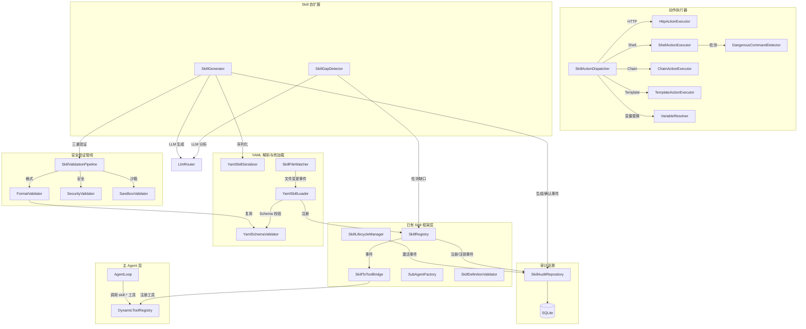
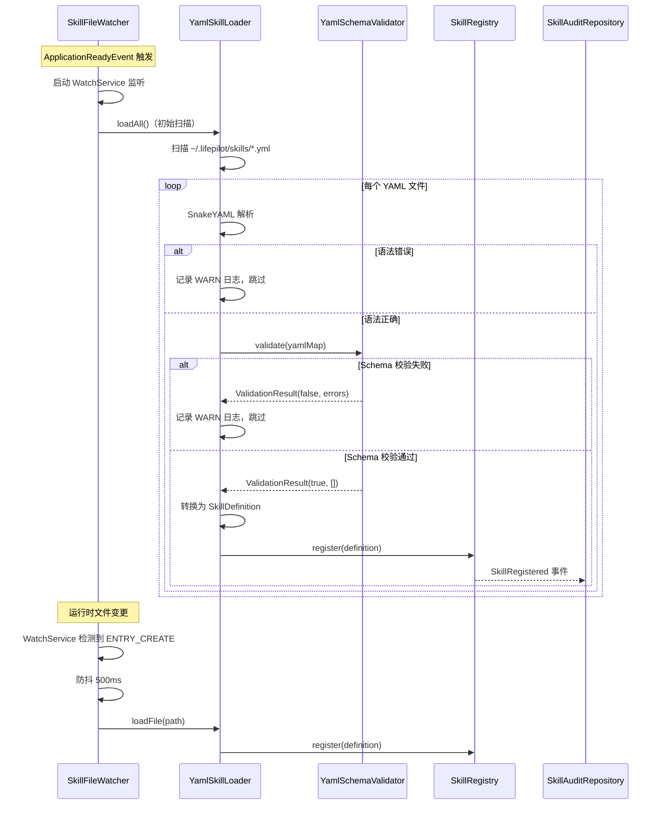
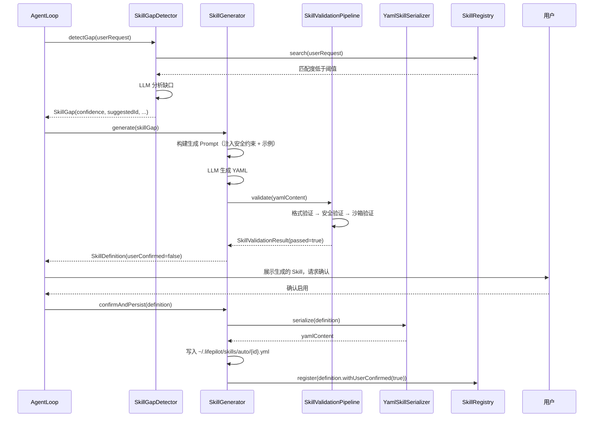

# Design Document: skill-system

## 参考文档

- 需求文档：#[[file:.kiro/specs/skill-system/requirements.md]]
- 架构设计：#[[file:docs/architecture/skill-system.md]]
- 特性设计：#[[file:docs/features/skill-system.md]]
- Skill 开发指南：#[[file:docs/features/skill-development.md]]
- 编码规范：#[[file:.kiro/steering/coding-standards.md]]
- 前置 spec 设计：#[[file:.kiro/specs/builtin-skills/design.md]]

## Overview

本设计文档描述 LifePilot 技能系统的 YAML 声明式 Skill 热加载、动作执行器、安全验证管线、Skill 自扩展能力和审计追溯的实现方案（Phase 3，模块 10）。

builtin-skills spec 已实现 Skill 框架核心（SkillDefinition、SkillRegistry、SubAgentFactory、SkillToToolBridge、SkillLifecycleManager、SkillDefinitionValidator、MemoryAccessEnforcer、SkillMetricsTracker 等）和三个内置 Skill。本 spec 在此基础上扩展，完成以下能力：

1. **YAML Skill 解析与热加载**：YamlSkillLoader 扫描 `~/.lifepilot/skills/` 目录，SnakeYAML 解析为 SkillDefinition，SkillFileWatcher 通过 WatchService 监听文件变更实现热加载
2. **YAML Skill 动作执行器**：SkillAction sealed interface 穷举四种动作类型（HTTP/Shell/Chain/Template），SkillActionDispatcher 统一分发
3. **安全验证管线**：FormatValidator → SecurityValidator → SandboxValidator 三重验证，任一阶段失败即终止
4. **Skill 自扩展**：SkillGapDetector 检测能力缺口，SkillGenerator 使用 LLM 生成 YAML Skill 定义
5. **审计追溯**：SkillAuditRepository 持久化所有 Skill 生命周期事件到 SQLite

### 设计决策

1. **SkillSource.UserDefined 扩展**：现有 `UserDefined(String filePath)` 需扩展为 `UserDefined(String filePath, Instant lastModified)`，用于热加载时检测文件变更。`AutoGenerated` 需扩展为包含 `generatedAt`、`triggerRequest`、`userConfirmed` 字段。
2. **SkillAction 作为独立 sealed interface**：动作类型不嵌入 SkillDefinition，而是在 YAML 解析时单独解析，通过 SkillActionDispatcher 在 Skill 激活时执行。YAML Skill 的执行路径与内置 Skill 不同——内置 Skill 通过 SubAgent + AgentLoop 执行，YAML Skill 的动作通过 SkillActionDispatcher 直接执行。
3. **验证管线与 SkillDefinitionValidator 分离**：SkillValidationPipeline 是针对自生成 YAML 内容的三重验证（格式→安全→沙箱），与已有的 SkillDefinitionValidator（注册前校验）互补。FormatValidator 复用 YamlSchemaValidator 的校验逻辑。
4. **SkillFileWatcher 使用 Virtual Thread**：文件监听循环运行在 Virtual Thread 上，避免占用平台线程。防抖使用 ScheduledExecutorService。
5. **审计事件异步写入**：SkillAuditRepository 通过 Spring Event 异步监听，不阻塞 Skill 注册/激活主流程。

## Architecture

### 新增包结构

```
com.lifepilot.skill
├── yaml/                           # YAML 解析与热加载
│   ├── YamlSkillLoader.java        # YAML Skill 加载器
│   ├── YamlSchemaValidator.java    # YAML Schema 校验器
│   ├── YamlSkillSerializer.java    # SkillDefinition → YAML 序列化
│   └── SkillFileWatcher.java       # 文件监听热加载
├── action/                         # 动作类型与执行器
│   ├── SkillAction.java            # 动作 sealed interface
│   ├── SkillActionDispatcher.java  # 动作分发器
│   ├── HttpActionExecutor.java     # HTTP 动作执行器
│   ├── ShellActionExecutor.java    # Shell 命令执行器
│   ├── ChainActionExecutor.java    # 技能串联执行器
│   ├── TemplateActionExecutor.java # 模板渲染执行器
│   ├── ActionResult.java           # 动作执行结果 record
│   ├── VariableResolver.java       # 变量替换引擎
│   └── DangerousCommandDetector.java # 危险命令检测器
├── validation/                     # 安全验证管线
│   ├── SkillValidationPipeline.java # 三重验证管线编排
│   ├── FormatValidator.java        # 格式验证器
│   ├── SecurityValidator.java      # 安全验证器
│   ├── SandboxValidator.java       # 沙箱验证器
│   └── SkillValidationResult.java  # 验证结果 record
├── generation/                     # Skill 自扩展
│   ├── SkillGapDetector.java       # Skill 缺口检测器
│   ├── SkillGenerator.java         # Skill 生成器
│   └── SkillGap.java               # 缺口描述 record
├── audit/                          # 审计追溯
│   ├── SkillAuditRepository.java   # 审计仓库
│   ├── SkillAuditEvent.java        # 审计事件 record
│   └── SkillAuditEventType.java    # 事件类型枚举
├── model/                          # 扩展已有模型
│   └── SkillSource.java            # 扩展 UserDefined / AutoGenerated 字段
└── config/                         # 配置扩展
    ├── SkillAutoConfiguration.java # 扩展 Bean 注册
    └── SkillConfigProperties.java  # 扩展配置项
```

### 组件关系图



### YAML Skill 加载时序图



### Skill 自扩展时序图



## Components and Interfaces

### 1. SkillSource 扩展

现有 `SkillSource` sealed interface 需要扩展 `UserDefined` 和 `AutoGenerated` 的字段：

```java
public sealed interface SkillSource permits SkillSource.Builtin, SkillSource.UserDefined, SkillSource.AutoGenerated {

    default int priority() {
        return switch (this) {
            case Builtin _ -> 3;
            case UserDefined _ -> 2;
            case AutoGenerated _ -> 1;
        };
    }

    record Builtin() implements SkillSource {}

    /**
     * 用户定义来源 — YAML 声明式。
     *
     * @param filePath     YAML 文件路径
     * @param lastModified 文件最后修改时间，用于热加载变更检测
     */
    record UserDefined(String filePath, @Nullable Instant lastModified) implements SkillSource {
        /** 兼容旧构造器。 */
        public UserDefined(String filePath) {
            this(filePath, null);
        }
    }

    /**
     * 自动生成来源 — Agent 自生成。
     *
     * @param generatorTraceId 生成时的 traceId
     * @param generatedAt      生成时间
     * @param triggerRequest   触发生成的用户请求
     * @param userConfirmed    用户是否已确认启用
     */
    record AutoGenerated(
            String generatorTraceId,
            @Nullable Instant generatedAt,
            @Nullable String triggerRequest,
            boolean userConfirmed
    ) implements SkillSource {
        /** 兼容旧构造器。 */
        public AutoGenerated(String generatorTraceId) {
            this(generatorTraceId, Instant.now(), null, false);
        }
    }
}
```

### 2. SkillAction（动作 sealed interface）

```java
package com.lifepilot.skill.action;

/**
 * YAML Skill 动作类型 — 穷举四种动作。
 *
 * <p>使用 sealed interface + record 实现，支持 switch 表达式穷举匹配。</p>
 *
 * @author zsg
 * @since 2026-08-10
 */
public sealed interface SkillAction permits
        SkillAction.HttpAction,
        SkillAction.ShellAction,
        SkillAction.ChainAction,
        SkillAction.TemplateAction {

    /**
     * HTTP 动作 — 调用外部 HTTP API。
     *
     * @param method  HTTP 方法（GET/POST/PUT/DELETE）
     * @param url     请求 URL，支持 ${params.xxx} 和 ${env.XXX} 变量替换
     * @param headers 请求头 Map
     * @param query   查询参数 Map
     * @param body    请求体（Object，可为 null）
     */
    record HttpAction(
            String method,
            String url,
            Map<String, String> headers,
            Map<String, String> query,
            @Nullable Object body
    ) implements SkillAction {
        public HttpAction {
            headers = headers != null ? Map.copyOf(headers) : Map.of();
            query = query != null ? Map.copyOf(query) : Map.of();
        }
    }

    /**
     * Shell 命令动作 — 在受限环境中执行命令。
     *
     * @param command        Shell 命令，支持 ${params.xxx} 变量替换
     * @param timeoutSeconds 超时时间（秒），默认 10
     */
    record ShellAction(String command, int timeoutSeconds) implements SkillAction {
        public ShellAction {
            if (timeoutSeconds <= 0) timeoutSeconds = 10;
        }
    }

    /**
     * 技能串联动作 — 按顺序激活多个 Skill。
     *
     * @param steps 步骤列表
     */
    record ChainAction(List<ChainStep> steps) implements SkillAction {
        public ChainAction { steps = List.copyOf(steps); }
    }

    /**
     * 模板渲染动作 — 格式化输出。
     *
     * @param template 模板字符串，支持 ${result.xxx} 变量替换
     */
    record TemplateAction(String template) implements SkillAction {}

    /**
     * 串联步骤。
     *
     * @param skill  目标 Skill ID
     * @param params 输入参数 Map，支持 ${前一步output.xxx} 引用
     * @param output 输出变量名
     */
    record ChainStep(String skill, Map<String, String> params, String output) {
        public ChainStep { params = params != null ? Map.copyOf(params) : Map.of(); }
    }
}
```

### 3. ActionResult（动作执行结果）

```java
/**
 * 动作执行结果。
 *
 * @param success 是否成功
 * @param output  输出内容（成功时为结果，失败时为错误信息）
 * @param data    结构化输出数据（可选，用于 Chain 步骤间传递）
 * @author zsg
 * @since 2026-08-10
 */
public record ActionResult(
        boolean success,
        String output,
        @Nullable Map<String, Object> data
) {
    public static ActionResult success(String output) {
        return new ActionResult(true, output, null);
    }

    public static ActionResult success(String output, Map<String, Object> data) {
        return new ActionResult(true, output, data);
    }

    public static ActionResult error(String message) {
        return new ActionResult(false, message, null);
    }
}
```

### 4. YamlSkillLoader（YAML Skill 加载器）

```java
/**
 * YAML Skill 加载器 — 扫描目录并解析 .yml/.yaml 文件为 SkillDefinition。
 *
 * <p>单个文件解析失败不影响其他文件加载，记录 WARN 日志后跳过。</p>
 *
 * @author zsg
 * @since 2026-08-10
 */
public class YamlSkillLoader {

    private final YamlSchemaValidator schemaValidator;
    private final SkillRegistry skillRegistry;
    private final SkillConfigProperties config;
    private final Path skillsDirectory;

    /**
     * 扫描目录下所有 .yml/.yaml 文件并加载。
     *
     * @return 成功加载的 Skill 数量
     */
    public int loadAll() { ... }

    /**
     * 加载单个 YAML 文件。
     *
     * @param filePath YAML 文件路径
     * @return 解析后的 SkillDefinition，失败返回 Optional.empty()
     */
    public Optional<SkillDefinition> loadFile(Path filePath) { ... }

    /**
     * 从 YAML Map 转换为 SkillDefinition。
     *
     * <p>处理字段映射：
     * <ul>
     *   <li>system-prompt → systemPrompt</li>
     *   <li>allowed-tools → allowedTools</li>
     *   <li>memory-access.read[].time-range → Duration 转换</li>
     *   <li>execution/budget 缺省时使用 DEFAULT</li>
     * </ul></p>
     */
    SkillDefinition convertToDefinition(Map<String, Object> yamlMap, Path filePath) { ... }

    /**
     * 解析时间范围字符串为 Duration。
     *
     * <p>支持格式：7d（天）、24h（小时）、30m（分钟）。</p>
     */
    static Duration parseTimeRange(String timeRange) { ... }
}
```

### 5. YamlSchemaValidator（YAML Schema 校验器）

```java
/**
 * YAML Schema 校验器 — 校验 YAML Skill 定义的结构合规性。
 *
 * @author zsg
 * @since 2026-08-10
 */
public class YamlSchemaValidator {

    private static final Pattern ID_PATTERN = Pattern.compile("^[a-z0-9-]{1,64}$");
    private static final Pattern VERSION_PATTERN = Pattern.compile("^\\d+\\.\\d+\\.\\d+$");

    private final SkillConfigProperties config;

    /**
     * 校验 YAML 解析后的 Map 结构。
     *
     * <p>校验规则：
     * <ul>
     *   <li>根节点包含 "skill" 键</li>
     *   <li>必填字段：id、name、description、system-prompt、allowed-tools</li>
     *   <li>id 格式：^[a-z0-9-]{1,64}$</li>
     *   <li>allowed-tools 为非空列表</li>
     *   <li>execution.max-steps ≤ 配置上限（默认 50）</li>
     *   <li>execution.timeout-seconds ≤ 配置上限（默认 600）</li>
     *   <li>version 符合语义化版本格式</li>
     * </ul></p>
     *
     * @param yamlMap YAML 解析后的 Map
     * @return 校验结果
     */
    public ValidationResult validate(Map<String, Object> yamlMap) { ... }

    public record ValidationResult(boolean valid, List<String> errors) {
        public ValidationResult { errors = List.copyOf(errors); }
    }
}
```

### 6. YamlSkillSerializer（SkillDefinition → YAML 序列化）

```java
/**
 * Skill 定义序列化器 — 将 SkillDefinition 序列化为 YAML 字符串。
 *
 * <p>用于自生成 Skill 的持久化。省略与默认值相同的可选字段。</p>
 *
 * @author zsg
 * @since 2026-08-10
 */
public class YamlSkillSerializer {

    /**
     * 将 SkillDefinition 序列化为 YAML 字符串。
     *
     * @param definition Skill 定义
     * @return 符合 YAML Skill Schema 的字符串
     */
    public String serialize(SkillDefinition definition) { ... }
}
```

### 7. SkillFileWatcher（文件监听热加载）

```java
/**
 * Skill 文件监听器 — 使用 WatchService 监听目录变更，触发热加载。
 *
 * <p>运行在 Virtual Thread 上，使用 ScheduledExecutorService 实现防抖。
 * AtomicBoolean 防止并发重载。</p>
 *
 * @author zsg
 * @since 2026-08-10
 */
public class SkillFileWatcher implements DisposableBean {

    private final YamlSkillLoader yamlSkillLoader;
    private final SkillRegistry skillRegistry;
    private final SkillConfigProperties config;
    private final AtomicBoolean reloading = new AtomicBoolean(false);
    private final ScheduledExecutorService debounceExecutor;
    private volatile boolean running = true;

    /**
     * 启动文件监听。在 ApplicationReadyEvent 后由 SkillAutoConfiguration 调用。
     *
     * <p>流程：
     * <ol>
     *   <li>确保 ~/.lifepilot/skills/ 目录存在</li>
     *   <li>触发 YamlSkillLoader.loadAll() 初始加载</li>
     *   <li>在 Virtual Thread 中启动 WatchService 循环</li>
     * </ol></p>
     */
    public void start() { ... }

    /**
     * 处理文件变更事件。
     *
     * <p>防抖逻辑：收到事件后延迟 debounceMs 执行，期间新事件重置计时器。
     * AtomicBoolean 确保同一时刻只有一个重载在进行。</p>
     */
    void handleFileEvent(WatchEvent.Kind<?> kind, Path filePath) { ... }

    @Override
    public void destroy() {
        running = false;
        debounceExecutor.shutdown();
    }
}
```

### 8. SkillActionDispatcher（动作分发器）

```java
/**
 * 动作分发器 — 根据 SkillAction 类型路由到对应执行器。
 *
 * <p>分发前执行统一的变量替换，支持 ${params.xxx}、${env.XXX}、${result.xxx} 三种占位符。</p>
 *
 * @author zsg
 * @since 2026-08-10
 */
public class SkillActionDispatcher {

    private final HttpActionExecutor httpExecutor;
    private final ShellActionExecutor shellExecutor;
    private final ChainActionExecutor chainExecutor;
    private final TemplateActionExecutor templateExecutor;
    private final VariableResolver variableResolver;

    /**
     * 分发并执行动作。
     *
     * @param action 动作定义
     * @param params 输入参数
     * @param previousResult 前序结果（用于 Chain/Template 场景）
     * @return 执行结果
     */
    public ActionResult dispatch(SkillAction action, Map<String, Object> params,
                                  @Nullable Map<String, Object> previousResult) {
        // switch 表达式穷举匹配
        return switch (action) {
            case SkillAction.HttpAction http -> httpExecutor.execute(http, params);
            case SkillAction.ShellAction shell -> shellExecutor.execute(shell, params);
            case SkillAction.ChainAction chain -> chainExecutor.execute(chain, params);
            case SkillAction.TemplateAction template -> templateExecutor.execute(template, previousResult);
        };
    }
}
```

### 9. HttpActionExecutor（HTTP 动作执行器）

```java
/**
 * HTTP 动作执行器 — 使用 Spring WebClient 执行 HTTP 请求。
 *
 * <p>安全特性：
 * <ul>
 *   <li>SSRF 防护：拒绝访问内网地址（localhost、127.0.0.1、10.x、172.16-31.x、192.168.x）</li>
 *   <li>超时限制：从 SkillDefinition.execution.timeoutSeconds 读取</li>
 *   <li>环境变量替换：${env.XXX} 从系统环境变量读取</li>
 * </ul></p>
 *
 * @author zsg
 * @since 2026-08-10
 */
public class HttpActionExecutor {

    private final WebClient webClient;
    private final VariableResolver variableResolver;
    private final SkillConfigProperties config;

    /** SSRF 防护：内网地址正则模式。 */
    private static final List<Pattern> SSRF_PATTERNS = List.of(
        Pattern.compile("^https?://localhost[:/]?.*"),
        Pattern.compile("^https?://127\\..*"),
        Pattern.compile("^https?://10\\..*"),
        Pattern.compile("^https?://172\\.(1[6-9]|2\\d|3[01])\\..*"),
        Pattern.compile("^https?://192\\.168\\..*")
    );

    /**
     * 执行 HTTP 请求。
     *
     * @param action HTTP 动作定义
     * @param params 输入参数（用于变量替换）
     * @return 执行结果
     */
    public ActionResult execute(SkillAction.HttpAction action, Map<String, Object> params) { ... }

    /** 检查 URL 是否为内网地址。 */
    boolean isSsrfTarget(String url) { ... }
}
```

### 10. ShellActionExecutor（Shell 命令执行器）

```java
/**
 * Shell 命令执行器 — 使用 ProcessBuilder 在独立进程中执行命令。
 *
 * <p>安全特性：
 * <ul>
 *   <li>危险命令检测：通过 DangerousCommandDetector 拦截</li>
 *   <li>强制超时：超时后 destroyForcibly()</li>
 *   <li>变量替换后的 Shell 注入检查</li>
 * </ul></p>
 *
 * @author zsg
 * @since 2026-08-10
 */
public class ShellActionExecutor {

    private final DangerousCommandDetector dangerousCommandDetector;
    private final VariableResolver variableResolver;
    private final SkillConfigProperties config;

    /**
     * 执行 Shell 命令。
     *
     * @param action Shell 动作定义
     * @param params 输入参数
     * @return 包含 exitCode、stdout、stderr 的执行结果
     */
    public ActionResult execute(SkillAction.ShellAction action, Map<String, Object> params) { ... }
}
```

### 11. DangerousCommandDetector（危险命令检测器）

```java
/**
 * 危险命令检测器 — 维护 Shell 命令黑名单模式。
 *
 * @author zsg
 * @since 2026-08-10
 */
public class DangerousCommandDetector {

    /** 危险命令模式列表。 */
    private static final List<Pattern> DANGEROUS_PATTERNS = List.of(
        Pattern.compile("\\brm\\s+-rf\\b"),
        Pattern.compile("\\bsudo\\b"),
        Pattern.compile("\\bchmod\\b"),
        Pattern.compile("\\bchown\\b"),
        Pattern.compile("\\bmkfs\\b"),
        Pattern.compile("\\bdd\\b\\s+if="),
        Pattern.compile("\\bshutdown\\b"),
        Pattern.compile("\\breboot\\b"),
        Pattern.compile("\\b:(){ :|:& };:\\b"),  // fork bomb
        Pattern.compile("\\b>\\s*/dev/"),
        Pattern.compile("\\bformat\\b")
    );

    /**
     * 检测命令是否包含危险模式。
     *
     * @param command Shell 命令
     * @return true 表示命令危险，应拒绝执行
     */
    public boolean isDangerous(String command) { ... }

    /**
     * 返回匹配的危险模式描述。
     *
     * @param command Shell 命令
     * @return 匹配的模式描述列表
     */
    public List<String> detectPatterns(String command) { ... }
}
```

### 12. ChainActionExecutor（技能串联执行器）

```java
/**
 * 技能串联执行器 — 按步骤顺序激活多个 Skill。
 *
 * <p>前一步的输出作为后一步的输入参数，通过 ${前一步output.xxx} 引用。
 * 任一步骤失败则终止后续步骤。累计 Token 消耗不超过 Skill 预算。</p>
 *
 * @author zsg
 * @since 2026-08-10
 */
public class ChainActionExecutor {

    private final SubAgentFactory subAgentFactory;
    private final SkillRegistry skillRegistry;
    private final VariableResolver variableResolver;
    private final SkillConfigProperties config;

    /**
     * 执行技能串联。
     *
     * @param action Chain 动作定义
     * @param params 初始输入参数
     * @return 最终执行结果
     */
    public ActionResult execute(SkillAction.ChainAction action, Map<String, Object> params) { ... }
}
```

### 13. VariableResolver（变量替换引擎）

```java
/**
 * 变量替换引擎 — 统一处理三种占位符。
 *
 * <p>支持的占位符：
 * <ul>
 *   <li>${params.xxx} — 输入参数</li>
 *   <li>${env.XXX} — 系统环境变量</li>
 *   <li>${result.xxx} — 前序结果</li>
 * </ul></p>
 *
 * @author zsg
 * @since 2026-08-10
 */
public class VariableResolver {

    private static final Pattern VARIABLE_PATTERN = Pattern.compile("\\$\\{(params|env|result)\\.([^}]+)}");

    /** Shell 注入特殊字符。 */
    private static final Pattern SHELL_INJECTION_PATTERN = Pattern.compile("[;|&`$()]");

    /**
     * 替换字符串中的变量占位符。
     *
     * @param template 包含占位符的模板字符串
     * @param params   输入参数
     * @param result   前序结果（可为 null）
     * @return 替换后的字符串
     */
    public String resolve(String template, Map<String, Object> params,
                          @Nullable Map<String, Object> result) { ... }

    /**
     * 检查字符串是否包含 Shell 注入字符（仅 ShellAction 场景使用）。
     *
     * @param value 待检查的值
     * @return true 表示包含注入字符
     */
    public boolean containsShellInjection(String value) { ... }
}
```

### 14. SkillValidationPipeline（三重验证管线）

```java
/**
 * Skill 验证管线 — 格式验证 → 安全验证 → 沙箱验证，任一阶段失败即终止。
 *
 * @author zsg
 * @since 2026-08-10
 */
public class SkillValidationPipeline {

    private final FormatValidator formatValidator;
    private final SecurityValidator securityValidator;
    private final SandboxValidator sandboxValidator;

    /**
     * 执行三重验证。
     *
     * @param yamlContent YAML 字符串内容
     * @return 验证结果
     */
    public SkillValidationResult validate(String yamlContent) {
        // 1. 格式验证
        var formatResult = formatValidator.validate(yamlContent);
        if (!formatResult.passed()) {
            return SkillValidationResult.failed(ValidationStage.FORMAT, formatResult.errors());
        }
        // 2. 安全验证
        var securityResult = securityValidator.validate(formatResult.parsedMap());
        if (!securityResult.passed()) {
            return SkillValidationResult.failed(ValidationStage.SECURITY, securityResult.errors());
        }
        // 3. 沙箱验证
        var sandboxResult = sandboxValidator.validate(yamlContent);
        if (!sandboxResult.passed()) {
            return SkillValidationResult.failed(ValidationStage.SANDBOX, sandboxResult.errors());
        }
        return SkillValidationResult.passed();
    }
}
```

### 15. SkillValidationResult（验证结果）

```java
/**
 * 三重验证管线结果。
 *
 * @param passed      是否通过
 * @param failedStage 失败阶段（通过时为 null）
 * @param errors      错误信息列表
 * @author zsg
 * @since 2026-08-10
 */
public record SkillValidationResult(
        boolean passed,
        @Nullable ValidationStage failedStage,
        List<String> errors
) {
    public SkillValidationResult { errors = List.copyOf(errors); }

    public static SkillValidationResult passed() {
        return new SkillValidationResult(true, null, List.of());
    }

    public static SkillValidationResult failed(ValidationStage stage, List<String> errors) {
        return new SkillValidationResult(false, stage, errors);
    }

    public enum ValidationStage { FORMAT, SECURITY, SANDBOX }
}
```

### 16. FormatValidator（格式验证器）

```java
/**
 * 格式验证器 — 校验 YAML 语法和 Schema 结构。
 *
 * <p>复用 YamlSchemaValidator 的校验逻辑，额外处理 YAML 语法解析错误。</p>
 *
 * @author zsg
 * @since 2026-08-10
 */
public class FormatValidator {

    private final YamlSchemaValidator schemaValidator;

    /**
     * 校验 YAML 内容。
     *
     * @param yamlContent YAML 字符串
     * @return 校验结果，包含解析后的 Map（成功时）
     */
    public FormatValidationResult validate(String yamlContent) { ... }

    public record FormatValidationResult(
            boolean passed,
            List<String> errors,
            @Nullable Map<String, Object> parsedMap
    ) {
        public FormatValidationResult { errors = List.copyOf(errors); }
    }
}
```

### 17. SecurityValidator（安全验证器）

```java
/**
 * 安全验证器 — 校验自生成 Skill 的安全约束。
 *
 * <p>校验规则：
 * <ul>
 *   <li>allowed-tools 中每个工具 ID 在已注册工具集合中存在</li>
 *   <li>不包含 HIGH 或 CRITICAL 风险等级的工具</li>
 *   <li>记忆写权限必须设置 require-approval 为 true</li>
 *   <li>预算不超过配置上限</li>
 *   <li>system-prompt 不包含 Prompt 注入模式</li>
 * </ul></p>
 *
 * @author zsg
 * @since 2026-08-10
 */
public class SecurityValidator {

    private final DynamicToolRegistry toolRegistry;
    private final GuardrailPolicy guardrailPolicy;
    private final SkillConfigProperties config;

    /** Prompt 注入检测模式。 */
    private static final List<Pattern> INJECTION_PATTERNS = List.of(
        Pattern.compile("(?i)ignore\\s+previous\\s+instructions"),
        Pattern.compile("(?i)you\\s+are\\s+now\\s+a"),
        Pattern.compile("(?i)disregard\\s+your\\s+rules"),
        Pattern.compile("(?i)override\\s+system"),
        Pattern.compile("(?i)jailbreak"),
        Pattern.compile("(?i)DAN\\s+mode")
    );

    /**
     * 校验 YAML 解析后的 Map 的安全性。
     *
     * @param yamlMap YAML 解析后的 Map
     * @return 校验结果
     */
    public SecurityValidationResult validate(Map<String, Object> yamlMap) { ... }

    /** 检测 system-prompt 中的 Prompt 注入。 */
    boolean containsPromptInjection(String systemPrompt) { ... }

    public record SecurityValidationResult(boolean passed, List<String> errors) {
        public SecurityValidationResult { errors = List.copyOf(errors); }
    }
}
```

### 18. SandboxValidator（沙箱验证器）

```java
/**
 * 沙箱验证器 — 在隔离环境中验证 Skill 定义的内部一致性。
 *
 * <p>校验规则：
 * <ul>
 *   <li>YAML 内容可成功解析为 SkillDefinition record</li>
 *   <li>system-prompt 长度不超过 5000 字符</li>
 *   <li>工具列表数量不超过 10 个</li>
 * </ul></p>
 *
 * @author zsg
 * @since 2026-08-10
 */
public class SandboxValidator {

    private static final int MAX_SYSTEM_PROMPT_LENGTH = 5000;
    private static final int MAX_TOOLS_COUNT = 10;

    /**
     * 在沙箱中验证 YAML 内容。
     *
     * @param yamlContent YAML 字符串
     * @return 校验结果
     */
    public SandboxValidationResult validate(String yamlContent) { ... }

    public record SandboxValidationResult(boolean passed, List<String> errors) {
        public SandboxValidationResult { errors = List.copyOf(errors); }
    }
}
```

### 19. SkillGapDetector（Skill 缺口检测器）

```java
/**
 * Skill 缺口检测器 — 分析用户请求是否超出现有 Skill 能力范围。
 *
 * <p>检测流程：
 * <ol>
 *   <li>若 SkillRegistry 为空，直接判定缺口（置信度 0.9）</li>
 *   <li>语义搜索匹配度低于阈值时，使用 LLM 分析缺口内容</li>
 *   <li>LLM 调用失败时降级返回空结果</li>
 * </ol></p>
 *
 * @author zsg
 * @since 2026-08-10
 */
public class SkillGapDetector {

    private final SkillRegistry skillRegistry;
    private final LlmRouter llmRouter;
    private final SkillConfigProperties config;

    /**
     * 检测 Skill 缺口。
     *
     * @param userRequest 用户请求文本
     * @return 缺口描述，无缺口时返回 Optional.empty()
     */
    public Optional<SkillGap> detectGap(String userRequest) { ... }
}
```

### 20. SkillGap（缺口描述 record）

```java
/**
 * Skill 缺口描述。
 *
 * @param confidence     置信度（0.0-1.0）
 * @param suggestedId    建议的 Skill ID
 * @param suggestedName  建议的 Skill 名称
 * @param triggerRequest 触发请求
 * @param suggestedTools 建议的工具列表
 * @param reason         分析原因
 * @author zsg
 * @since 2026-08-10
 */
public record SkillGap(
        double confidence,
        String suggestedId,
        String suggestedName,
        String triggerRequest,
        List<String> suggestedTools,
        String reason
) {
    public SkillGap { suggestedTools = List.copyOf(suggestedTools); }
}
```

### 21. SkillGenerator（Skill 生成器）

```java
/**
 * Skill 生成器 — 使用 LLM 根据缺口描述生成 YAML Skill 定义。
 *
 * <p>生成流程：
 * <ol>
 *   <li>构建 Prompt：注入安全约束 + 已有 Skill 示例（最多 3 个）</li>
 *   <li>LLM 生成 YAML 内容</li>
 *   <li>调用 SkillValidationPipeline 三重验证</li>
 *   <li>验证通过后返回待确认的 SkillDefinition</li>
 * </ol></p>
 *
 * @author zsg
 * @since 2026-08-10
 */
public class SkillGenerator {

    private final LlmRouter llmRouter;
    private final SkillValidationPipeline validationPipeline;
    private final YamlSkillLoader yamlSkillLoader;
    private final YamlSkillSerializer yamlSkillSerializer;
    private final SkillRegistry skillRegistry;
    private final SkillConfigProperties config;
    private final Path autoSkillsDirectory;

    /**
     * 根据缺口描述生成 Skill。
     *
     * @param gap 缺口描述
     * @return 生成结果，包含待确认的 SkillDefinition 或失败原因
     */
    public GenerationResult generate(SkillGap gap) { ... }

    /**
     * 用户确认后持久化并注册。
     *
     * @param definition 待确认的 SkillDefinition
     * @return 注册是否成功
     */
    public boolean confirmAndPersist(SkillDefinition definition) { ... }

    public record GenerationResult(
            boolean success,
            @Nullable SkillDefinition definition,
            @Nullable String yamlContent,
            @Nullable SkillValidationResult validationResult,
            @Nullable String errorMessage
    ) {
        public static GenerationResult success(SkillDefinition def, String yaml) {
            return new GenerationResult(true, def, yaml, null, null);
        }
        public static GenerationResult validationFailed(SkillValidationResult result) {
            return new GenerationResult(false, null, null, result, "三重验证失败");
        }
        public static GenerationResult error(String message) {
            return new GenerationResult(false, null, null, null, message);
        }
    }
}
```

### 22. SkillAuditRepository（审计仓库）

```java
/**
 * Skill 审计仓库 — 持久化 Skill 生命周期事件到 SQLite。
 *
 * <p>通过 Spring Event 异步监听 SkillRegistryEvent 和 SkillLifecycleEvent，
 * 不阻塞主流程。</p>
 *
 * @author zsg
 * @since 2026-08-10
 */
public class SkillAuditRepository {

    private final JdbcTemplate jdbcTemplate;

    /**
     * 记录审计事件。
     *
     * @param event 审计事件
     */
    public void record(SkillAuditEvent event) { ... }

    /**
     * 按 Skill ID 查询审计事件，按 created_at 降序。
     *
     * @param skillId Skill ID
     * @return 审计事件列表
     */
    public List<SkillAuditEvent> findBySkillId(String skillId) { ... }

    /**
     * 按时间范围查询审计事件。
     *
     * @param start 开始时间（ISO 8601）
     * @param end   结束时间（ISO 8601）
     * @return 审计事件列表
     */
    public List<SkillAuditEvent> findByTimeRange(Instant start, Instant end) { ... }

    /** 监听 SkillRegistryEvent，记录 REGISTERED/UNREGISTERED 事件。 */
    @EventListener
    public void onSkillRegistryEvent(SkillRegistryEvent event) { ... }

    /** 监听 SkillLifecycleEvent，记录 ACTIVATED 事件。 */
    @EventListener
    public void onSkillLifecycleEvent(SkillLifecycleEvent event) { ... }
}
```

### 23. SkillAuditEvent（审计事件 record）

```java
/**
 * Skill 审计事件。
 *
 * @param id              事件 ID（UUID）
 * @param skillId         Skill ID
 * @param eventType       事件类型
 * @param eventDetailJson 事件详情 JSON
 * @param sourceType      Skill 来源类型
 * @param operator        操作者（traceId 或 "system"）
 * @param createdAt       创建时间（ISO 8601）
 * @author zsg
 * @since 2026-08-10
 */
public record SkillAuditEvent(
        String id,
        String skillId,
        SkillAuditEventType eventType,
        @Nullable String eventDetailJson,
        String sourceType,
        String operator,
        String createdAt
) {}
```

### 24. SkillAuditEventType（事件类型枚举）

```java
/**
 * Skill 审计事件类型。
 *
 * @author zsg
 * @since 2026-08-10
 */
public enum SkillAuditEventType {
    REGISTERED,
    UNREGISTERED,
    GENERATED,
    CONFIRMED,
    REJECTED,
    ACTIVATED
}
```

### 25. SkillConfigProperties 扩展

在现有 `SkillConfigProperties` 基础上新增配置项：

```java
@ConfigurationProperties(prefix = "lifepilot.skills")
public class SkillConfigProperties {

    // --- 已有字段 ---
    private boolean enabled = true;
    private int maxConcurrentActivations = 5;
    private Validation validation = new Validation();
    private Search search = new Search();

    // --- 新增字段 ---

    /** Skill 文件目录，默认 ~/.lifepilot/skills。 */
    private String directory = System.getProperty("user.home") + "/.lifepilot/skills";

    /** 热加载防抖间隔（毫秒），默认 500。 */
    private long hotReloadDebounceMs = 500;

    /** 自动生成配置。 */
    private AutoGeneration autoGeneration = new AutoGeneration();

    /** Shell 动作配置。 */
    private ShellAction shellAction = new ShellAction();

    /** Chain 动作配置。 */
    private ChainAction chainAction = new ChainAction();

    /** HTTP 动作配置。 */
    private HttpAction httpAction = new HttpAction();

    // getters/setters ...

    public static class AutoGeneration {
        /** 自动生成总开关，默认 true。 */
        private boolean enabled = true;
        /** 缺口检测阈值，默认 0.6。 */
        private double gapThreshold = 0.6;
        /** 自生成 Skill 的 maxCostCents 上限，默认 100。 */
        private int maxCostCents = 100;
        // getters/setters ...
    }

    public static class ShellAction {
        /** Shell 命令最大超时（秒），默认 30。 */
        private int maxTimeoutSeconds = 30;
        // getters/setters ...
    }

    public static class ChainAction {
        /** 串联最大步骤数，默认 5。 */
        private int maxSteps = 5;
        // getters/setters ...
    }

    public static class HttpAction {
        /** SSRF 防护开关，默认 true。 */
        private boolean ssrfProtectionEnabled = true;
        // getters/setters ...
    }
}
```

### 26. SkillAutoConfiguration 扩展

在现有 `SkillAutoConfiguration` 基础上新增 Bean 注册：

```java
@AutoConfiguration
@EnableConfigurationProperties(SkillConfigProperties.class)
@ConditionalOnProperty(prefix = "lifepilot.skills", name = "enabled",
        havingValue = "true", matchIfMissing = true)
public class SkillAutoConfiguration {

    // --- 已有 Bean（保持不变） ---

    // --- 新增：YAML 解析与热加载 ---

    @Bean
    @ConditionalOnMissingBean
    public YamlSchemaValidator yamlSchemaValidator(SkillConfigProperties config) { ... }

    @Bean
    @ConditionalOnMissingBean
    public YamlSkillLoader yamlSkillLoader(YamlSchemaValidator validator,
                                            SkillRegistry registry,
                                            SkillConfigProperties config) { ... }

    @Bean
    @ConditionalOnMissingBean
    public YamlSkillSerializer yamlSkillSerializer() { ... }

    @Bean
    @ConditionalOnMissingBean
    public SkillFileWatcher skillFileWatcher(YamlSkillLoader loader,
                                             SkillRegistry registry,
                                             SkillConfigProperties config) { ... }

    // --- 新增：动作执行器 ---

    @Bean
    @ConditionalOnMissingBean
    public VariableResolver variableResolver() { ... }

    @Bean
    @ConditionalOnMissingBean
    public DangerousCommandDetector dangerousCommandDetector() { ... }

    @Bean
    @ConditionalOnMissingBean
    public HttpActionExecutor httpActionExecutor(WebClient.Builder webClientBuilder,
                                                 VariableResolver resolver,
                                                 SkillConfigProperties config) { ... }

    @Bean
    @ConditionalOnMissingBean
    public ShellActionExecutor shellActionExecutor(DangerousCommandDetector detector,
                                                   VariableResolver resolver,
                                                   SkillConfigProperties config) { ... }

    @Bean
    @ConditionalOnMissingBean
    public ChainActionExecutor chainActionExecutor(SubAgentFactory factory,
                                                    SkillRegistry registry,
                                                    VariableResolver resolver,
                                                    SkillConfigProperties config) { ... }

    @Bean
    @ConditionalOnMissingBean
    public TemplateActionExecutor templateActionExecutor(VariableResolver resolver) { ... }

    @Bean
    @ConditionalOnMissingBean
    public SkillActionDispatcher skillActionDispatcher(HttpActionExecutor http,
                                                       ShellActionExecutor shell,
                                                       ChainActionExecutor chain,
                                                       TemplateActionExecutor template,
                                                       VariableResolver resolver) { ... }

    // --- 新增：安全验证管线 ---

    @Bean
    @ConditionalOnMissingBean
    public FormatValidator formatValidator(YamlSchemaValidator schemaValidator) { ... }

    @Bean
    @ConditionalOnMissingBean
    public SecurityValidator securityValidator(DynamicToolRegistry toolRegistry,
                                               GuardrailPolicy guardrailPolicy,
                                               SkillConfigProperties config) { ... }

    @Bean
    @ConditionalOnMissingBean
    public SandboxValidator sandboxValidator() { ... }

    @Bean
    @ConditionalOnMissingBean
    public SkillValidationPipeline skillValidationPipeline(FormatValidator format,
                                                            SecurityValidator security,
                                                            SandboxValidator sandbox) { ... }

    // --- 新增：Skill 自扩展（条件装配） ---

    @Bean
    @ConditionalOnMissingBean
    @ConditionalOnProperty(prefix = "lifepilot.skills.auto-generation",
            name = "enabled", havingValue = "true", matchIfMissing = true)
    public SkillGapDetector skillGapDetector(SkillRegistry registry,
                                             LlmRouter llmRouter,
                                             SkillConfigProperties config) { ... }

    @Bean
    @ConditionalOnMissingBean
    @ConditionalOnProperty(prefix = "lifepilot.skills.auto-generation",
            name = "enabled", havingValue = "true", matchIfMissing = true)
    public SkillGenerator skillGenerator(LlmRouter llmRouter,
                                          SkillValidationPipeline pipeline,
                                          YamlSkillLoader loader,
                                          YamlSkillSerializer serializer,
                                          SkillRegistry registry,
                                          SkillConfigProperties config) { ... }

    // --- 新增：审计 ---

    @Bean
    @ConditionalOnMissingBean
    public SkillAuditRepository skillAuditRepository(JdbcTemplate jdbcTemplate) { ... }

    // --- 启动后初始化 ---

    @EventListener(ApplicationReadyEvent.class)
    public void onApplicationReady(ApplicationReadyEvent event) {
        // 1. 触发 YamlSkillLoader 初始加载
        // 2. 启动 SkillFileWatcher 监听
    }
}
```

## Data Models

### 数据库表结构（Flyway V10）

迁移脚本：`V10__create_skill_audit_tables.sql`

```sql
-- Skill 审计日志表
CREATE TABLE IF NOT EXISTS skill_audit_logs (
    id                TEXT PRIMARY KEY,           -- UUID
    skill_id          TEXT NOT NULL,              -- Skill ID
    event_type        TEXT NOT NULL,              -- REGISTERED/UNREGISTERED/GENERATED/CONFIRMED/REJECTED/ACTIVATED
    event_detail_json TEXT,                       -- 事件详情 JSON
    source_type       TEXT NOT NULL,              -- BUILTIN/USER_DEFINED/AUTO_GENERATED
    operator          TEXT NOT NULL,              -- 操作者（traceId 或 "system"）
    created_at        TEXT NOT NULL               -- ISO 8601
);

-- 按 Skill ID 查询索引
CREATE INDEX IF NOT EXISTS idx_skill_audit_logs_skill_id ON skill_audit_logs(skill_id);

-- 按时间范围查询索引
CREATE INDEX IF NOT EXISTS idx_skill_audit_logs_created_at ON skill_audit_logs(created_at);
```

### event_detail_json 示例

**REGISTERED 事件：**
```json
{
  "name": "exchange-rate-query",
  "description": "查询实时汇率",
  "version": "1.0.0",
  "allowedToolsCount": 2,
  "source": "USER_DEFINED",
  "filePath": "~/.lifepilot/skills/exchange-rate-query.yml"
}
```

**GENERATED 事件：**
```json
{
  "triggerRequest": "帮我查一下今天人民币对美元的汇率",
  "confidence": 0.85,
  "validationPassed": true,
  "suggestedTools": ["http-request"]
}
```

**ACTIVATED 事件：**
```json
{
  "traceId": "abc123/sub-exchange-rate-query-f7e2a1b3",
  "inputSummary": "查询 USD/CNY 汇率",
  "tokensUsed": 1200,
  "durationMs": 3500,
  "success": true
}
```

**CONFIRMED/REJECTED 事件：**
```json
{
  "generatedAt": "2026-08-10T14:30:00Z",
  "triggerRequest": "帮我查一下今天人民币对美元的汇率"
}
```

### application.yml 配置扩展

```yaml
lifepilot:
  skills:
    enabled: true
    max-concurrent-activations: 5
    directory: ${user.home}/.lifepilot/skills
    hot-reload-debounce-ms: 500
    validation:
      max-name-length: 128
      max-system-prompt-length: 10000
      auto-generated-max-tokens: 10000
      auto-generated-max-steps: 15
      auto-generated-max-timeout: 180
    search:
      default-top-k: 10
    auto-generation:
      enabled: true
      gap-threshold: 0.6
      max-cost-cents: 100
    shell-action:
      max-timeout-seconds: 30
    chain-action:
      max-steps: 5
    http-action:
      ssrf-protection-enabled: true
```

## Correctness Properties

*A property is a characteristic or behavior that should hold true across all valid executions of a system — essentially, a formal statement about what the system should do. Properties serve as the bridge between human-readable specifications and machine-verifiable correctness guarantees.*

### Property 1: YAML 加载 round-trip

*For any* 合法的 YAML Skill 文件，YamlSkillLoader 加载后通过 SkillRegistry.find(skillId) 查询应返回与 YAML 定义语义等价的 SkillDefinition，且 source 为 SkillSource.UserDefined。

**Validates: Requirements 1.5, 1.6, 1.9**

### Property 2: YAML 加载容错性

*For any* 包含 N 个合法文件和 M 个非法文件（语法错误或 Schema 校验失败）的目录，YamlSkillLoader.loadAll() 应成功加载恰好 N 个 Skill，非法文件不影响合法文件的加载。

**Validates: Requirements 1.1, 1.3, 1.4**

### Property 3: YAML Schema 综合校验

*For any* YAML Map，YamlSchemaValidator.validate() 返回 valid=true 当且仅当：根节点包含 "skill" 键、必填字段（id/name/description/system-prompt/allowed-tools）存在且非空、id 匹配 `^[a-z0-9-]{1,64}$`、allowed-tools 为非空列表、execution.max-steps ≤ 配置上限、execution.timeout-seconds ≤ 配置上限、version 符合 MAJOR.MINOR.PATCH 格式。

**Validates: Requirements 2.1, 2.2, 2.3, 2.4, 2.5, 2.6, 9.1, 9.2, 9.3, 9.4, 9.5**

### Property 4: 时间范围解析正确性

*For any* 合法的时间范围字符串（格式为 Nd、Nh 或 Nm，N 为正整数），parseTimeRange 应返回对应的 Duration（N 天、N 小时或 N 分钟）。

**Validates: Requirements 1.8**

### Property 5: SkillAction 类型解析正确性

*For any* YAML 中 action.type 为 "http"/"shell"/"chain"/"template" 的定义，解析后的 SkillAction 应分别为 HttpAction/ShellAction/ChainAction/TemplateAction 子类型。

**Validates: Requirements 4.6**

### Property 6: 变量替换完整性

*For any* 包含 ${params.xxx}、${env.XXX} 或 ${result.xxx} 占位符的模板字符串和对应的参数 Map，VariableResolver.resolve() 应将所有匹配的占位符替换为对应值，未匹配的占位符保持原样。

**Validates: Requirements 5.2, 5.3, 6.3, 8.2**

### Property 7: SSRF 防护正确性

*For any* URL 匹配内网地址模式（localhost、127.x.x.x、10.x.x.x、172.16-31.x.x、192.168.x.x）的 HttpAction，HttpActionExecutor 应拒绝执行并返回错误结果。

**Validates: Requirements 5.6**

### Property 8: 危险命令检测正确性

*For any* 包含危险模式（rm -rf、sudo、chmod、chown、mkfs、dd if=、shutdown、reboot）的 Shell 命令，DangerousCommandDetector.isDangerous() 应返回 true，ShellActionExecutor 应拒绝执行。

**Validates: Requirements 6.4, 6.5**

### Property 9: Shell 执行结果完整性

*For any* Shell 命令执行，ActionResult 应包含 exitCode、stdout 和 stderr 信息；非零退出码时 success 应为 false。

**Validates: Requirements 6.6, 6.7**

### Property 10: Shell 注入检测

*For any* 经变量替换后包含 Shell 注入特殊字符（;、|、&&、`、$()）的参数值，在 ShellAction 场景下 SkillActionDispatcher 应拒绝执行。

**Validates: Requirements 8.4**

### Property 11: 技能串联顺序执行与输出传递

*For any* ChainAction 包含 N 个步骤，ChainActionExecutor 应按顺序依次激活每个 Skill，且第 K 步的输出应可通过 ${前一步output.xxx} 注入为第 K+1 步的输入参数。

**Validates: Requirements 7.1, 7.2**

### Property 12: 技能串联失败终止

*For any* ChainAction 中第 K 步执行失败，第 K+1 到第 N 步不应被执行，最终结果应包含失败步骤索引和错误信息。

**Validates: Requirements 7.3**

### Property 13: 技能串联步骤数限制

*For any* ChainAction 的 steps 数量超过配置上限（默认 5），ChainActionExecutor 应拒绝执行。

**Validates: Requirements 7.4**

### Property 14: 技能串联 Skill 存在性校验

*For any* ChainAction 中引用的 Skill ID 不在 SkillRegistry 中，ChainActionExecutor 应返回错误结果。

**Validates: Requirements 7.6**

### Property 15: SkillActionDispatcher 穷举路由

*For any* SkillAction 子类型（HttpAction/ShellAction/ChainAction/TemplateAction），SkillActionDispatcher 应路由到对应的执行器执行。

**Validates: Requirements 8.1**

### Property 16: 安全验证综合校验

*For any* 自生成 Skill 的 YAML Map，SecurityValidator.validate() 返回 passed=true 当且仅当：所有 allowed-tools 在已注册工具集合中存在、不包含 HIGH/CRITICAL 风险工具、记忆写权限的 require-approval 为 true、预算不超过配置上限（maxTokens ≤ 10000、maxSteps ≤ 15、timeoutSeconds ≤ 180、maxCostCents ≤ 100）、system-prompt 不包含 Prompt 注入模式。

**Validates: Requirements 10.1, 10.2, 10.3, 10.4, 10.5**

### Property 17: 沙箱验证综合校验

*For any* YAML 内容，SandboxValidator.validate() 返回 passed=true 当且仅当：内容可成功解析为 SkillDefinition、system-prompt 长度 ≤ 5000、工具列表数量 ≤ 10。

**Validates: Requirements 11.1, 11.2, 11.3**

### Property 18: 验证管线短路行为

*For any* YAML 内容，若格式验证失败则安全验证和沙箱验证不应执行，若安全验证失败则沙箱验证不应执行。failedStage 应正确标识失败阶段。

**Validates: Requirements 12.1**

### Property 19: 验证通过即可注册

*For any* 通过 SkillValidationPipeline 三重验证的 YAML 内容，解析为 SkillDefinition 后注册到 SkillRegistry 应成功。

**Validates: Requirements 12.5**

### Property 20: Skill 缺口检测正确性

*For any* 用户请求，当所有已注册 Skill 的语义匹配度低于配置阈值时，SkillGapDetector 应返回包含置信度、建议 Skill ID、名称、触发请求、建议工具列表和分析原因的 SkillGap。

**Validates: Requirements 13.1, 13.2**

### Property 21: Skill 缺口检测 LLM 降级

*For any* LLM 调用失败的场景，SkillGapDetector 应返回 Optional.empty()，不抛出异常，不阻塞主流程。

**Validates: Requirements 13.5**

### Property 22: Skill 生成验证集成

*For any* SkillGenerator 生成的 YAML 内容，必须经过 SkillValidationPipeline 三重验证；验证失败时返回包含验证错误的失败结果，LLM 调用失败时返回生成失败结果。

**Validates: Requirements 14.5, 14.6, 14.7**

### Property 23: 自生成 Skill 确认状态管理

*For any* 自生成 Skill，初始 userConfirmed 应为 false；用户确认后 userConfirmed 应更新为 true 并成功注册到 SkillRegistry；userConfirmed=false 的自生成 Skill 不应被 SubAgentFactory 激活。

**Validates: Requirements 15.1, 15.3, 15.6**

### Property 24: 自生成 Skill 持久化

*For any* 用户确认的自生成 Skill，YamlSkillSerializer 序列化后应写入 ~/.lifepilot/skills/auto/{skill-id}.yml，文件内容应为合法的 YAML Skill 定义。

**Validates: Requirements 15.2**

### Property 25: YAML 序列化 round-trip

*For any* 合法的 SkillDefinition，YamlSkillSerializer.serialize() 后再通过 YamlSkillLoader 解析应产生语义等价的 SkillDefinition。

**Validates: Requirements 19.3**

### Property 26: 审计事件 round-trip

*For any* SkillAuditEvent，record() 后通过 findBySkillId() 查询应返回包含该事件的列表，且所有字段值一致。

**Validates: Requirements 16.1, 16.7**

### Property 27: 审计事件完整性

*For any* Skill 注册/注销/生成/确认/拒绝/激活操作，SkillAuditRepository 应记录对应类型的审计事件（REGISTERED/UNREGISTERED/GENERATED/CONFIRMED/REJECTED/ACTIVATED）。

**Validates: Requirements 16.2, 16.3, 16.4, 16.5, 16.6**

### Property 28: 审计事件时间范围查询

*For any* 时间范围 [start, end] 和一组审计事件，findByTimeRange(start, end) 应返回且仅返回 created_at 在该范围内的事件。

**Validates: Requirements 16.8**

### Property 29: 审计事件按时间降序

*For any* Skill ID 对应的审计事件集合，findBySkillId() 返回的列表应按 created_at 降序排列。

**Validates: Requirements 16.7**

## Error Handling

### 异常层次

本 spec 复用 builtin-skills 已定义的异常层次，不新增异常类：

```java
SkillException (RuntimeException)
├── SkillActivationException    // 激活失败（Skill 不存在、深度超限、userConfirmed=false）
├── SkillValidationException    // 校验失败（Schema 校验、安全校验、沙箱校验）
└── MemoryAccessViolationException // 记忆访问违规
```

### 分层错误处理策略

| 层次 | 错误场景 | 处理策略 | 日志级别 |
|------|---------|---------|---------|
| **YamlSkillLoader** | YAML 语法解析错误 | 记录文件名和错误详情，跳过该文件 | WARN |
| **YamlSkillLoader** | Schema 校验失败 | 记录文件名和校验错误列表，跳过该文件 | WARN |
| **YamlSkillLoader** | 目录不存在 | 自动创建目录 | INFO |
| **SkillFileWatcher** | WatchService 异常 | 记录错误，继续监听 | ERROR |
| **SkillFileWatcher** | 热加载单文件异常 | 记录错误，不中断监听服务 | ERROR |
| **HttpActionExecutor** | SSRF 检测到内网地址 | 返回 ActionResult.error()，拒绝执行 | WARN |
| **HttpActionExecutor** | HTTP 4xx/5xx 响应 | 返回包含状态码的 ActionResult.error() | WARN |
| **HttpActionExecutor** | HTTP 请求超时 | 返回超时 ActionResult.error() | WARN |
| **ShellActionExecutor** | 危险命令检测 | 返回 ActionResult.error()，拒绝执行 | WARN |
| **ShellActionExecutor** | 命令执行超时 | destroyForcibly() 终止进程，返回超时错误 | WARN |
| **ShellActionExecutor** | 非零退出码 | 返回包含 exitCode 和 stderr 的 ActionResult.error() | DEBUG |
| **ChainActionExecutor** | 步骤数超限 | 返回 ActionResult.error()，拒绝执行 | WARN |
| **ChainActionExecutor** | 步骤执行失败 | 终止后续步骤，返回包含失败索引的错误 | WARN |
| **ChainActionExecutor** | 引用的 Skill 不存在 | 返回 ActionResult.error() | WARN |
| **SkillActionDispatcher** | Shell 注入检测 | 返回 ActionResult.error()，拒绝执行 | WARN |
| **VariableResolver** | 环境变量不存在 | 使用空字符串替换 | WARN |
| **FormatValidator** | YAML 语法错误 | 返回 FormatValidationResult(false, errors) | DEBUG |
| **SecurityValidator** | 安全规则违反 | 返回 SecurityValidationResult(false, errors) | DEBUG |
| **SandboxValidator** | SkillDefinition 构建失败 | 返回 SandboxValidationResult(false, errors) | DEBUG |
| **SkillValidationPipeline** | 任一阶段失败 | 终止管线，返回 SkillValidationResult(false, stage, errors) | INFO |
| **SkillGapDetector** | LLM 调用失败 | 返回 Optional.empty()，不阻塞主流程 | WARN |
| **SkillGenerator** | LLM 调用失败 | 返回 GenerationResult.error() | ERROR |
| **SkillGenerator** | 三重验证失败 | 返回 GenerationResult.validationFailed() | WARN |
| **SubAgentFactory** | userConfirmed=false 的自生成 Skill | 抛出 SkillActivationException | WARN |
| **SkillAuditRepository** | SQLite 写入失败 | 记录错误，不影响主流程 | ERROR |

### 关键设计原则

1. **YAML 加载 fail-safe**：单个文件错误不影响其他文件加载，不影响应用启动
2. **文件监听 fail-safe**：热加载异常不中断 WatchService 监听循环
3. **动作执行 fail-fast**：安全检查（SSRF、危险命令、Shell 注入）在执行前拦截
4. **验证管线 short-circuit**：任一阶段失败立即终止，不浪费后续验证资源
5. **LLM 降级**：SkillGapDetector 和 SkillGenerator 的 LLM 调用失败不阻塞主流程
6. **审计异步**：审计事件写入失败不影响 Skill 注册/激活主流程

## Testing Strategy

### 属性测试库

使用 **jqwik**（Java 属性测试库），与 builtin-skills spec 保持一致：

```xml
<dependency>
    <groupId>net.jqwik</groupId>
    <artifactId>jqwik</artifactId>
    <version>1.9.2</version>
    <scope>test</scope>
</dependency>
```

### 属性测试配置

- 每个属性测试最少运行 **100 次迭代**（`@Property(tries = 100)`）
- 每个属性测试必须用注释标注对应的设计属性
- 标注格式：`// Feature: skill-system, Property {number}: {property_text}`
- 每个 Correctness Property 对应一个 `@Property` 测试方法

### 测试分层

#### 单元测试（JUnit 5）

| 测试类 | 覆盖范围 | 重点 |
|--------|---------|------|
| `YamlSkillLoaderTest` | Req 1 | 目录扫描、文件解析、默认值填充、时间范围解析 |
| `YamlSchemaValidatorTest` | Req 2 | 必填字段、ID 格式、值范围、版本格式 |
| `YamlSkillSerializerTest` | Req 19 | 序列化输出格式、默认值省略 |
| `SkillFileWatcherTest` | Req 3 | 事件处理、防抖、并发控制 |
| `SkillActionTest` | Req 4 | sealed interface 类型、record 字段、防御性拷贝 |
| `HttpActionExecutorTest` | Req 5 | SSRF 防护、变量替换、超时、错误响应 |
| `ShellActionExecutorTest` | Req 6 | 危险命令检测、超时、stdout/stderr 捕获 |
| `ChainActionExecutorTest` | Req 7 | 顺序执行、输出传递、失败终止、步骤限制 |
| `SkillActionDispatcherTest` | Req 8 | 类型路由、变量替换、Shell 注入检测 |
| `VariableResolverTest` | Req 5, 6, 8 | 三种占位符替换、Shell 注入检测 |
| `DangerousCommandDetectorTest` | Req 6 | 黑名单模式匹配 |
| `FormatValidatorTest` | Req 9 | YAML 语法、Schema 校验委托 |
| `SecurityValidatorTest` | Req 10 | 工具白名单、风险等级、记忆权限、预算、Prompt 注入 |
| `SandboxValidatorTest` | Req 11 | SkillDefinition 构建、长度限制、工具数量限制 |
| `SkillValidationPipelineTest` | Req 12 | 管线编排、短路行为、结果聚合 |
| `SkillGapDetectorTest` | Req 13 | 阈值判定、空 Registry、LLM 降级 |
| `SkillGeneratorTest` | Req 14, 15 | Prompt 构建、验证集成、确认/拒绝、持久化 |
| `SkillAuditRepositoryTest` | Req 16 | CRUD、按 skillId 查询、按时间范围查询、排序 |

#### 属性测试（jqwik）

| 测试类 | 对应属性 | 生成器 |
|--------|---------|--------|
| `YamlSkillLoaderPropertyTest` | P1, P2 | 随机合法 YAML Map、随机混合合法/非法文件集 |
| `YamlSchemaValidatorPropertyTest` | P3 | 随机 YAML Map（含合法/非法字段组合） |
| `TimeRangeParserPropertyTest` | P4 | 随机正整数 + 随机单位（d/h/m） |
| `SkillActionParserPropertyTest` | P5 | 随机 action.type 值 |
| `VariableResolverPropertyTest` | P6 | 随机模板字符串 + 随机参数 Map |
| `HttpActionExecutorPropertyTest` | P7 | 随机内网/外网 URL |
| `DangerousCommandDetectorPropertyTest` | P8 | 随机命令字符串（含/不含危险模式） |
| `ShellActionExecutorPropertyTest` | P9 | 随机命令 + Mock ProcessBuilder |
| `ShellInjectionPropertyTest` | P10 | 随机字符串（含/不含注入字符） |
| `ChainActionExecutorPropertyTest` | P11, P12, P13, P14 | 随机 ChainStep 列表、随机 Skill 存在性 |
| `SkillActionDispatcherPropertyTest` | P15 | 随机 SkillAction 子类型 |
| `SecurityValidatorPropertyTest` | P16 | 随机工具列表、随机风险等级、随机预算值、随机 Prompt |
| `SandboxValidatorPropertyTest` | P17 | 随机 YAML 内容（含/不含超限字段） |
| `SkillValidationPipelinePropertyTest` | P18, P19 | 随机 YAML 内容（各阶段通过/失败组合） |
| `SkillGapDetectorPropertyTest` | P20, P21 | 随机请求 + 随机 Skill 集合 + Mock LLM |
| `SkillGeneratorPropertyTest` | P22, P23 | 随机 SkillGap + Mock LLM + Mock Pipeline |
| `SkillPersistencePropertyTest` | P24, P25 | 随机 SkillDefinition |
| `SkillAuditRepositoryPropertyTest` | P26, P27, P28, P29 | 随机 SkillAuditEvent 集合、随机时间范围 |

#### 集成测试（@SpringBootTest + 内存 SQLite）

| 测试类 | 覆盖范围 |
|--------|---------|
| `SkillAutoConfigurationExtensionTest` | Req 18：新增 Bean 注册、条件装配（auto-generation.enabled=false） |
| `FlywayV10MigrationTest` | Req 17：V10 迁移脚本、表结构和索引验证 |
| `YamlSkillLoadIntegrationTest` | Req 1, 3：端到端 YAML 加载 + 热加载 |
| `SkillValidationPipelineIntegrationTest` | Req 12：三重验证端到端 |
| `SkillGenerationIntegrationTest` | Req 13, 14, 15：缺口检测 → 生成 → 验证 → 确认 → 持久化 |
| `SkillAuditIntegrationTest` | Req 16：审计事件端到端记录和查询 |

### 属性测试示例

```java
class YamlSkillLoaderPropertyTest {

    // Feature: skill-system, Property 1: YAML 加载 round-trip
    @Property(tries = 100)
    void 合法YAML加载后查询应返回等价定义(@ForAll("validYamlMaps") Map<String, Object> yamlMap) {
        Path tempFile = writeYamlToTempFile(yamlMap);
        Optional<SkillDefinition> loaded = loader.loadFile(tempFile);

        assertThat(loaded).isPresent();
        SkillDefinition def = loaded.get();
        assertThat(def.id()).isEqualTo(extractId(yamlMap));
        assertThat(def.name()).isEqualTo(extractName(yamlMap));
        assertThat(def.source()).isInstanceOf(SkillSource.UserDefined.class);

        Optional<SkillDefinition> found = registry.find(def.id());
        assertThat(found).isPresent();
        assertThat(found.get().id()).isEqualTo(def.id());
    }

    // Feature: skill-system, Property 2: YAML 加载容错性
    @Property(tries = 100)
    void 非法文件不影响合法文件加载(@ForAll("mixedFileSets") Tuple2<List<Path>, Integer> input) {
        List<Path> files = input.get1();
        int expectedValidCount = input.get2();

        int loaded = loader.loadAll();
        assertThat(loaded).isEqualTo(expectedValidCount);
    }
}
```

```java
class VariableResolverPropertyTest {

    // Feature: skill-system, Property 6: 变量替换完整性
    @Property(tries = 100)
    void 所有匹配占位符应被替换(@ForAll("templatesWithParams") Tuple2<String, Map<String, Object>> input) {
        String template = input.get1();
        Map<String, Object> params = input.get2();

        String resolved = resolver.resolve(template, params, null);

        // 验证：params 中存在的键对应的占位符应被替换
        for (var entry : params.entrySet()) {
            String placeholder = "${params." + entry.getKey() + "}";
            if (template.contains(placeholder)) {
                assertThat(resolved).doesNotContain(placeholder);
                assertThat(resolved).contains(String.valueOf(entry.getValue()));
            }
        }
    }
}
```

```java
class SecurityValidatorPropertyTest {

    // Feature: skill-system, Property 16: 安全验证综合校验
    @Property(tries = 100)
    void 包含高风险工具应验证失败(@ForAll("yamlMapsWithHighRiskTools") Map<String, Object> yamlMap) {
        var result = securityValidator.validate(yamlMap);
        assertThat(result.passed()).isFalse();
        assertThat(result.errors()).anyMatch(e -> e.contains("HIGH") || e.contains("CRITICAL"));
    }
}
```

```java
class SkillAuditRepositoryPropertyTest {

    // Feature: skill-system, Property 26: 审计事件 round-trip
    @Property(tries = 100)
    void 记录后查询应返回相同事件(@ForAll("validAuditEvents") SkillAuditEvent event) {
        repository.record(event);
        List<SkillAuditEvent> found = repository.findBySkillId(event.skillId());

        assertThat(found).anyMatch(e ->
                e.id().equals(event.id()) &&
                e.eventType() == event.eventType() &&
                e.skillId().equals(event.skillId()));
    }

    // Feature: skill-system, Property 29: 审计事件按时间降序
    @Property(tries = 100)
    void 按skillId查询应按时间降序(@ForAll("auditEventSets") List<SkillAuditEvent> events) {
        String skillId = events.getFirst().skillId();
        events.forEach(repository::record);

        List<SkillAuditEvent> found = repository.findBySkillId(skillId);

        for (int i = 0; i < found.size() - 1; i++) {
            assertThat(found.get(i).createdAt())
                    .isGreaterThanOrEqualTo(found.get(i + 1).createdAt());
        }
    }
}
```

```java
class YamlSkillSerializerPropertyTest {

    // Feature: skill-system, Property 25: YAML 序列化 round-trip
    @Property(tries = 100)
    void 序列化后再解析应产生等价定义(@ForAll("validSkillDefinitions") SkillDefinition original) {
        String yaml = serializer.serialize(original);
        Optional<SkillDefinition> parsed = loader.loadFromString(yaml);

        assertThat(parsed).isPresent();
        SkillDefinition roundTripped = parsed.get();
        assertThat(roundTripped.id()).isEqualTo(original.id());
        assertThat(roundTripped.name()).isEqualTo(original.name());
        assertThat(roundTripped.description()).isEqualTo(original.description());
        assertThat(roundTripped.systemPrompt()).isEqualTo(original.systemPrompt());
        assertThat(roundTripped.allowedTools()).isEqualTo(original.allowedTools());
    }
}
```
