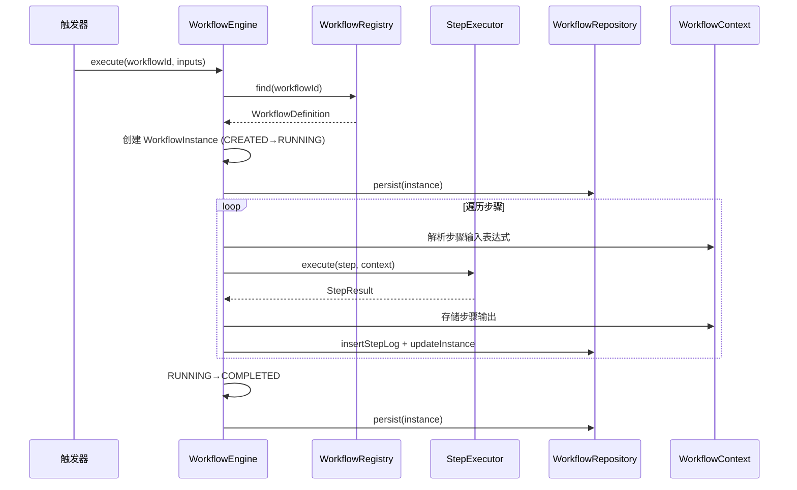

# Design Document: 工作流/自动化编排引擎

## Overview

工作流引擎为 LifePilot 提供 YAML 声明式多步骤自动化编排能力。用户通过 YAML 文件定义工作流（步骤、触发器、输入变量），引擎负责解析、调度、执行、持久化和崩溃恢复。

核心设计决策：
1. **YAML 声明式** — 工作流定义为纯数据（record），通过 SnakeYAML 解析，零代码创建自动化
2. **sealed interface 穷举** — WorkflowStep（9 种）、WorkflowTrigger（3 种）、ErrorStrategy（4 种）均使用 sealed interface + switch 表达式
3. **不可变状态机** — WorkflowInstance 使用 record + toBuilder 模式，每次状态转换生成新实例
4. **Virtual Thread 并行** — ParallelStep 使用 Virtual Thread 并发执行分支，WaitStep 使用 Virtual Thread 避免阻塞
5. **表达式引擎自研** — 轻量级 `${...}` 语法解析器，支持变量插值、嵌套路径访问和条件求值，不引入外部依赖
6. **与现有模块集成** — 通过 SkillRegistry、DynamicToolRegistry、LlmRouter 分别执行 Skill/Tool/LLM 步骤

参考文档：
- 需求文档：#[[file:.kiro/specs/workflow/requirements.md]]
- 编码规范：#[[file:.kiro/steering/coding-standards.md]]

## 行业调研与设计决策依据

### 调研的开源项目与前沿理论

| 项目/理论 | 核心理念 | 与 LifePilot 的关系 |
|-----------|---------|-------------------|
| [Temporal](https://temporal.io) | Durable Execution — 通过 Event Sourcing 持久化工作流状态，代码即工作流，自动重试和故障恢复 | 借鉴其崩溃恢复思路（持久化执行位置 + 上下文），但 LifePilot 是单机嵌入式场景，不需要分布式 Event Sourcing |
| [Restate](https://restate.dev) | 轻量级 Durable Execution 引擎，基于 Journal（执行日志）实现持久化，单二进制部署，支持 Java SDK | 最接近 LifePilot 的定位（轻量、嵌入式、Java 友好），借鉴其 Journal 思路简化崩溃恢复设计 |
| [LittleHorse](https://littlehorse.io) | Java 原生工作流引擎，WfSpec（工作流规范）+ WfRun（运行实例）分离，有向图（Node + Edge）执行模型 | 借鉴其 Definition/Instance 分离模式和有向图概念，但 LifePilot 使用 YAML 声明式而非代码定义 |
| [Flowable](https://flowable.com) | 成熟的 BPMN 2.0 引擎，嵌入式 Java 库，Spring Boot 集成，支持 JUEL 表达式 | 借鉴其嵌入式 Spring 集成模式，但 BPMN XML 对个人用户过于复杂，LifePilot 选择更简洁的 YAML |
| [n8n](https://n8n.io) | 节点式可视化工作流，事件驱动模型（Trigger + Action），422+ 集成，AI Agent 节点 | 借鉴其 Trigger/Action 节点分类和 AI 步骤集成思路 |
| [LangGraph](https://langchain-ai.github.io/langgraph/) | 状态图（StateGraph）驱动的 AI Agent 编排，Checkpointing 持久化，支持 Human-in-the-Loop | 借鉴其 Checkpointing 机制和状态图思想，LifePilot 的 WorkflowContext 类似 LangGraph 的 State |
| [Saga Pattern](https://microservices.io/patterns/data/saga.html) | 分布式事务补偿模式 — 每个步骤配对一个补偿操作，失败时反向执行补偿链 | 直接采纳为 ErrorStrategy.Compensate 策略 |
| DAG 工作流理论 | 有向无环图表示任务依赖，支持并行执行无依赖节点 | LifePilot 当前采用顺序列表 + ParallelStep 显式并行，未来可演进为 DAG |

### 关键设计决策及理由

#### 决策 1：YAML 声明式 vs 代码定义（Code-as-Workflow）

Temporal 和 LittleHorse 主张"代码即工作流"（用 Java/Go/Python 编写工作流逻辑），优势是类型安全和 IDE 支持。但 LifePilot 的目标用户是个人效率管理者而非开发者，YAML 声明式更符合"零代码创建自动化"的设计目标。n8n 和 Flowable 的成功也证明了声明式定义在自动化场景的可行性。

Content was rephrased for compliance with licensing restrictions.

#### 决策 2：顺序步骤列表 vs DAG 有向图

Airflow、Argo Workflows 和 LittleHorse 均使用 DAG 模型表示任务依赖。DAG 的优势是自动并行化无依赖节点。但 LifePilot 的工作流场景以线性流程为主（获取数据 → 处理 → 通知），DAG 引入的复杂度（拓扑排序、依赖解析）对个人自动化场景收益有限。当前设计使用顺序列表 + 显式 ParallelStep，保持 YAML 定义的可读性。未来如需 DAG 支持，可通过在步骤中添加 `dependsOn` 字段演进。

#### 决策 3：自研表达式引擎 vs SpEL / JUEL

Flowable 使用 JUEL（Unified Expression Language），Spring 生态提供 SpEL。调研发现 SpEL 功能强大但攻击面大（可调用任意 Java 方法），JUEL 需要额外依赖。LifePilot 的表达式需求有限（变量插值 + 简单比较 + 逻辑运算），自研轻量级解析器可以：(1) 精确控制安全边界，(2) 零外部依赖，(3) 错误信息更友好。Restate 也采用了类似的轻量级方案。

Content was rephrased for compliance with licensing restrictions.

#### 决策 4：嵌入式持久化 vs Event Sourcing

Temporal 使用 Event Sourcing（追加事件日志 + 重放恢复），Restate 使用 Journal 模式。这些方案在分布式场景下优势明显，但 LifePilot 是单机 SQLite 应用。当前设计采用更简单的"快照持久化"：每次状态转换写入当前快照（state + context_json + current_step_index），崩溃恢复时从最新快照恢复。这比 Event Sourcing 实现简单，且 SQLite WAL 模式已提供足够的写入性能。

#### 决策 5：Compensate 策略借鉴 Saga Pattern

Saga Pattern 是微服务领域处理分布式事务的标准模式。LifePilot 虽非微服务架构，但工作流步骤可能调用外部 API（通过 Skill/Tool），需要补偿机制。当前设计的 `ErrorStrategy.Compensate(compensationStep)` 直接借鉴 Saga 的补偿事务概念，允许用户为关键步骤定义回滚操作。

#### 决策 6：Checkpointing 借鉴 LangGraph

LangGraph 的 Checkpointing 机制在每个"super-step"后保存完整状态快照，支持 Time Travel 调试和 Human-in-the-Loop。LifePilot 借鉴这一思路，在每次步骤执行后持久化 WorkflowContext 和 currentStepIndex，实现类似的断点恢复能力。但不实现 Time Travel（历史快照回溯），因为 SQLite 存储空间有限。

### 未来演进方向（基于调研，当前不实现）

1. **DAG 执行模型** — 参考 Airflow/LittleHorse，为步骤添加 `dependsOn` 字段，引擎自动拓扑排序并并行执行无依赖节点
2. **Event Sourcing** — 参考 Temporal，如果未来需要更强的审计和回放能力，可将快照持久化升级为事件日志
3. **Human-in-the-Loop** — 参考 LangGraph，添加 ApprovalStep 类型，工作流暂停等待用户确认后继续
4. **可视化编辑器** — 参考 n8n，在 Web UI 阶段提供拖拽式工作流编辑器
5. **Durable Execution** — 参考 Restate，如果未来需要跨进程的持久执行保证，可引入 Journal 模式

## Architecture

### 分层架构

```
┌─────────────────────────────────────────────────────┐
│                  WorkflowAutoConfiguration           │
│         （Spring Bean 注册 + 依赖注入 + 生命周期）      │
├─────────────────────────────────────────────────────┤
│  WorkflowEngine          │  WorkflowRegistry         │
│  （状态机驱动 + 崩溃恢复）  │  （定义管理 + 热加载）      │
├─────────────────────────────────────────────────────┤
│  StepExecutor            │  ExpressionEngine         │
│  （步骤分发 + 类型匹配）    │  （变量插值 + 条件求值）    │
├─────────────────────────────────────────────────────┤
│  WorkflowRepository      │  WorkflowYamlParser       │
│  （SQLite 持久化）         │  WorkflowYamlPrinter      │
├─────────────────────────────────────────────────────┤
│           外部依赖：SkillRegistry / DynamicToolRegistry │
│                    LlmRouter / JdbcTemplate           │
└─────────────────────────────────────────────────────┘
```

### 包结构

```
com.lifepilot.workflow
├── config/
│   ├── WorkflowConfigProperties.java    // @ConfigurationProperties
│   └── WorkflowAutoConfiguration.java   // AutoConfiguration
├── model/
│   ├── WorkflowDefinition.java          // 工作流定义 record
│   ├── WorkflowInstance.java            // 工作流实例 record
│   ├── WorkflowStep.java               // sealed interface（9 种步骤）
│   ├── WorkflowTrigger.java            // sealed interface（3 种触发器）
│   ├── WorkflowState.java              // 实例状态枚举
│   ├── StepState.java                  // 步骤状态枚举
│   ├── ErrorStrategy.java              // sealed interface（4 种策略）
│   ├── WorkflowContext.java            // 变量上下文
│   └── StepLog.java                    // 步骤执行日志 record
├── engine/
│   ├── WorkflowEngine.java             // 执行引擎
│   └── StepExecutor.java               // 步骤分发器
├── expression/
│   ├── ExpressionEngine.java           // 表达式引擎
│   ├── ExpressionToken.java            // 词法 token
│   └── ExpressionParser.java           // 条件表达式解析
├── registry/
│   └── WorkflowRegistry.java           // 注册中心
├── parser/
│   ├── WorkflowYamlParser.java         // YAML → WorkflowDefinition
│   └── WorkflowYamlPrinter.java        // WorkflowDefinition → YAML
└── repository/
    └── WorkflowRepository.java          // SQLite 持久化
```

### 执行流程



## Components and Interfaces

### 依赖接口验证

| 接口 | 源码位置 | 实际签名 | 验证状态 |
|------|---------|---------|---------|
| SkillRegistry.find() | com.lifepilot.skill.registry.SkillRegistry | `Optional<SkillDefinition> find(String skillId)` | ✅ 已核对 |
| DynamicToolRegistry.resolve() | com.lifepilot.tool.registry.DynamicToolRegistry | `Optional<ToolContract> resolve(String toolId)` | ✅ 已核对（注意：方法名是 resolve 不是 find） |
| ToolContract.execute() | com.lifepilot.tool.ToolContract | `ToolResult execute(ToolInput input)` | ✅ 已核对 |
| LlmRouter.call() | com.lifepilot.llm.LlmRouter | `LlmResponse call(String scene, String prompt, @Nullable String outputSchema)` | ✅ 已核对 |
| AgentLoop.run() | com.lifepilot.agent.AgentLoop | `AgentResponse run(AgentRequest request)` | ✅ 已核对 |
| SkillActionDispatcher.dispatch() | com.lifepilot.skill.action.SkillActionDispatcher | `ActionResult dispatch(SkillAction action, Map<String,Object> params, @Nullable Map<String,Object> previousResult)` | ✅ 已核对 |
| JdbcTemplate | org.springframework.jdbc.core.JdbcTemplate | Spring 标准 API | ✅ |


> **设计决策：SkillStep 执行方式**
> 
> 需求中 SkillStep 通过 `SkillRegistry.find()` 查找 Skill 定义后执行。实际源码中 Skill 执行通过 `SkillActionDispatcher.dispatch()` 分发到具体执行器（HTTP / Shell / Chain / Template）。工作流引擎的 SkillStep 将直接使用 `SkillActionDispatcher` 执行 Skill 的 action，而非重新实现执行逻辑。

> **设计决策：触发器集成方式**
>
> ProactiveReasoner 使用 `@Scheduled` 定时触发，没有暴露注册自定义触发器的 API。工作流的 CronTrigger 将独立使用 Spring `@Scheduled` / `TaskScheduler` 实现，EventTrigger 使用 Spring `ApplicationEventListener`，不依赖 ProactiveReasoner。

### WorkflowEngine

工作流执行引擎，负责实例创建、状态机驱动、步骤分发和错误处理。

```java
public class WorkflowEngine {
    // 构造注入
    WorkflowEngine(WorkflowRegistry registry,
                   StepExecutor stepExecutor,
                   ExpressionEngine expressionEngine,
                   WorkflowRepository repository,
                   WorkflowConfigProperties config);

    /** 执行工作流（手动触发或触发器调用）。 */
    WorkflowInstance execute(String workflowId, Map<String, Object> inputs);

    /** 恢复中断的工作流实例。 */
    WorkflowInstance resume(String instanceId);

    /** 取消正在执行的工作流实例。 */
    WorkflowInstance cancel(String instanceId);

    /** 崩溃恢复：扫描 RUNNING/WAITING 实例并恢复。 */
    void recoverInterruptedInstances();
}
```

### StepExecutor

步骤分发器，使用 switch 表达式穷举匹配 WorkflowStep 的 9 种子类型。

```java
public class StepExecutor {
    StepExecutor(SkillRegistry skillRegistry,
                 SkillActionDispatcher skillActionDispatcher,
                 DynamicToolRegistry toolRegistry,
                 LlmRouter llmRouter,
                 WorkflowRegistry workflowRegistry,
                 WorkflowConfigProperties config);

    /** 执行单个步骤，返回步骤输出。 */
    Map<String, Object> execute(WorkflowStep step,
                                 WorkflowContext context,
                                 ExpressionEngine expressionEngine);
}
```

### ExpressionEngine

轻量级表达式引擎，支持 `${...}` 变量插值和条件求值。

```java
public class ExpressionEngine {
    /** 解析字符串中的 ${...} 表达式，替换为 WorkflowContext 中的值。 */
    String resolve(String template, WorkflowContext context);

    /** 解析 Map 中所有 String 值的表达式。 */
    Map<String, Object> resolveMap(Map<String, Object> params, WorkflowContext context);

    /** 求值条件表达式，返回布尔结果。 */
    boolean evaluateCondition(String condition, WorkflowContext context);
}
```

表达式语法：
- 变量插值：`${inputs.name}`, `${steps.step1.output.result}`, `${loopVar}`
- 比较运算：`${steps.check.output.count} > 0`
- 逻辑运算：`${steps.a.output.ok} == true && ${steps.b.output.ok} == true`
- 字符串字面量：`'hello'`

### WorkflowRegistry

工作流注册中心，管理 WorkflowDefinition 的注册、查询、启用/禁用。

```java
public class WorkflowRegistry {
    WorkflowRegistry(WorkflowRepository repository,
                     WorkflowYamlParser parser);

    boolean register(WorkflowDefinition definition);
    boolean unregister(String workflowId);
    boolean enable(String workflowId);
    boolean disable(String workflowId);
    Optional<WorkflowDefinition> find(String workflowId);
    List<WorkflowDefinition> listAll();
    List<WorkflowDefinition> listEnabled();

    /** 从目录扫描并注册 YAML 工作流文件。 */
    void scanAndRegister(Path directory);
}
```

### WorkflowYamlParser / WorkflowYamlPrinter

```java
public class WorkflowYamlParser {
    /** 解析 YAML 字符串为 WorkflowDefinition。 */
    Result<WorkflowDefinition, List<String>> parse(String yaml);
}

public class WorkflowYamlPrinter {
    /** 将 WorkflowDefinition 序列化为 YAML 字符串。 */
    String print(WorkflowDefinition definition);
}
```

`Result<T, E>` 使用 sealed interface 表示成功/失败：

```java
public sealed interface Result<T, E> {
    record Ok<T, E>(T value) implements Result<T, E> {}
    record Err<T, E>(E error) implements Result<T, E> {}
}
```

### WorkflowRepository

```java
public class WorkflowRepository {
    WorkflowRepository(JdbcTemplate jdbcTemplate);

    // WorkflowDefinition CRUD
    void saveDefinition(WorkflowDefinition def, String yamlContent);
    Optional<WorkflowDefinition> findDefinition(String id);
    List<WorkflowDefinition> findAllDefinitions();
    void updateDefinitionEnabled(String id, boolean enabled);

    // WorkflowInstance CRUD
    void saveInstance(WorkflowInstance instance);
    void updateInstance(WorkflowInstance instance);
    Optional<WorkflowInstance> findInstance(String id);
    List<WorkflowInstance> findInstancesByState(WorkflowState... states);

    // StepLog
    void insertStepLog(StepLog log);
    List<StepLog> findStepLogs(String instanceId);
}
```

## Data Models

### WorkflowDefinition

```java
@Builder(toBuilder = true)
public record WorkflowDefinition(
    String id,
    String name,
    String description,
    String version,
    boolean enabled,
    List<WorkflowTrigger> triggers,
    Map<String, WorkflowInputParam> inputs,
    List<WorkflowStep> steps,
    Map<String, String> metadata
) {}

public record WorkflowInputParam(
    String name,
    String type,        // string / number / boolean / list / map
    boolean required,
    @Nullable Object defaultValue,
    @Nullable String description
) {}
```

### WorkflowStep (sealed interface)

```java
public sealed interface WorkflowStep {
    String id();
    String name();
    @Nullable ErrorStrategy errorStrategy();

    record SkillStep(String id, String name, String skillId,
                     Map<String, String> params,
                     @Nullable ErrorStrategy errorStrategy) implements WorkflowStep {}

    record ToolStep(String id, String name, String toolId,
                    Map<String, String> params,
                    @Nullable ErrorStrategy errorStrategy) implements WorkflowStep {}

    record LlmStep(String id, String name, String scene, String promptTemplate,
                   @Nullable String outputSchema,
                   @Nullable ErrorStrategy errorStrategy) implements WorkflowStep {}

    record ConditionStep(String id, String name, String condition,
                         List<WorkflowStep> thenSteps,
                         List<WorkflowStep> elseSteps,
                         @Nullable ErrorStrategy errorStrategy) implements WorkflowStep {}

    record LoopStep(String id, String name, String items, String loopVar,
                    List<WorkflowStep> body,
                    @Nullable ErrorStrategy errorStrategy) implements WorkflowStep {}

    record ParallelStep(String id, String name,
                        List<List<WorkflowStep>> branches,
                        @Nullable ErrorStrategy errorStrategy) implements WorkflowStep {}

    record SubWorkflowStep(String id, String name, String workflowId,
                           Map<String, String> params,
                           @Nullable ErrorStrategy errorStrategy) implements WorkflowStep {}

    record NoopStep(String id, String name,
                    @Nullable ErrorStrategy errorStrategy) implements WorkflowStep {}

    record WaitStep(String id, String name, long durationSeconds,
                    @Nullable ErrorStrategy errorStrategy) implements WorkflowStep {}
}
```

### WorkflowTrigger (sealed interface)

```java
public sealed interface WorkflowTrigger {
    record CronTrigger(String cron) implements WorkflowTrigger {}
    record EventTrigger(String eventType) implements WorkflowTrigger {}
    record ManualTrigger() implements WorkflowTrigger {}
}
```

### ErrorStrategy (sealed interface)

```java
public sealed interface ErrorStrategy {
    record Retry(int maxAttempts, long initialDelayMs, long maxDelayMs) implements ErrorStrategy {}
    record Skip(String reason) implements ErrorStrategy {}
    record Fail() implements ErrorStrategy {}
    record Compensate(WorkflowStep compensationStep) implements ErrorStrategy {}
}
```

### WorkflowState / StepState

```java
public enum WorkflowState {
    CREATED, RUNNING, PAUSED, WAITING, COMPLETED, FAILED, CANCELLED
}

public enum StepState {
    PENDING, RUNNING, COMPLETED, FAILED, SKIPPED
}
```

### WorkflowInstance

```java
@Builder(toBuilder = true)
public record WorkflowInstance(
    String id,
    String workflowId,
    WorkflowState state,
    WorkflowContext context,
    int currentStepIndex,
    @Nullable Instant startedAt,
    @Nullable Instant completedAt,
    @Nullable String failureReason,
    Instant createdAt,
    Instant updatedAt
) {}
```

### WorkflowContext

```java
public class WorkflowContext {
    private final Map<String, Object> data;

    /** 获取嵌套路径的值，如 "steps.step1.output.result"。 */
    public Optional<Object> get(String path);

    /** 设置嵌套路径的值。 */
    public void set(String path, Object value);

    /** 序列化为 JSON。 */
    public String toJson();

    /** 从 JSON 反序列化。 */
    public static WorkflowContext fromJson(String json);
}
```

### StepLog

```java
public record StepLog(
    String id,
    String instanceId,
    String stepId,
    String stepType,
    StepState state,
    int attempt,
    @Nullable String inputJson,
    @Nullable String outputJson,
    @Nullable String errorMessage,
    @Nullable Instant startedAt,
    @Nullable Instant completedAt,
    @Nullable Long durationMs,
    Instant createdAt
) {}
```

### YAML 工作流示例

```yaml
id: daily-review
name: 每日回顾
description: 每天晚上自动生成当日任务回顾
version: "1.0"
triggers:
  - type: cron
    cron: "0 21 * * *"
inputs:
  userId:
    type: string
    required: true
steps:
  - id: fetch-tasks
    name: 获取今日任务
    type: skill
    skillId: todo.list
    params:
      filter: "today"
      userId: "${inputs.userId}"

  - id: check-tasks
    name: 检查是否有任务
    type: condition
    condition: "${steps.fetch-tasks.output.count} > 0"
    then:
      - id: generate-review
        name: 生成回顾
        type: llm
        scene: chat
        prompt: "请根据以下任务列表生成简洁的每日回顾：${steps.fetch-tasks.output.tasks}"
    else:
      - id: no-tasks
        name: 无任务
        type: noop

  - id: notify
    name: 发送通知
    type: tool
    toolId: notification.send
    params:
      message: "${steps.generate-review.output.content}"
    errorStrategy:
      type: skip
      reason: "通知发送失败不影响主流程"
```

### 数据库 Schema (Flyway V15)

```sql
-- V15__create_workflow_tables.sql

CREATE TABLE IF NOT EXISTS workflow_definitions (
    id          TEXT PRIMARY KEY,
    name        TEXT NOT NULL,
    description TEXT,
    version     TEXT,
    enabled     INTEGER NOT NULL DEFAULT 1,
    definition_yaml TEXT NOT NULL,
    created_at  TEXT NOT NULL,
    updated_at  TEXT NOT NULL
);

CREATE TABLE IF NOT EXISTS workflow_instances (
    id                TEXT PRIMARY KEY,
    workflow_id       TEXT NOT NULL,
    state             TEXT NOT NULL,
    input_json        TEXT,
    context_json      TEXT,
    current_step_index INTEGER NOT NULL DEFAULT 0,
    started_at        TEXT,
    completed_at      TEXT,
    failure_reason    TEXT,
    created_at        TEXT NOT NULL,
    updated_at        TEXT NOT NULL,
    FOREIGN KEY (workflow_id) REFERENCES workflow_definitions(id)
);

CREATE TABLE IF NOT EXISTS workflow_step_logs (
    id            TEXT PRIMARY KEY,
    instance_id   TEXT NOT NULL,
    step_id       TEXT NOT NULL,
    step_type     TEXT NOT NULL,
    state         TEXT NOT NULL,
    attempt       INTEGER NOT NULL DEFAULT 1,
    input_json    TEXT,
    output_json   TEXT,
    error_message TEXT,
    started_at    TEXT,
    completed_at  TEXT,
    duration_ms   INTEGER,
    created_at    TEXT NOT NULL,
    FOREIGN KEY (instance_id) REFERENCES workflow_instances(id)
);

CREATE INDEX idx_workflow_instances_workflow_id ON workflow_instances(workflow_id);
CREATE INDEX idx_workflow_instances_state ON workflow_instances(state);
CREATE INDEX idx_workflow_step_logs_instance_id ON workflow_step_logs(instance_id);
```


## Correctness Properties

*A property is a characteristic or behavior that should hold true across all valid executions of a system — essentially, a formal statement about what the system should do. Properties serve as the bridge between human-readable specifications and machine-verifiable correctness guarantees.*

### Property 1: YAML 解析/打印 round-trip

*For any* valid WorkflowDefinition record, printing it to YAML via WorkflowYamlPrinter and then parsing the resulting YAML via WorkflowYamlParser should produce a WorkflowDefinition that is equivalent to the original.

**Validates: Requirements 1.1, 1.5, 1.6**

### Property 2: YAML 解析器拒绝无效输入并报告错误

*For any* YAML workflow string that contains an unknown step type, or is missing required fields (id/name/steps), or contains duplicate step IDs, the WorkflowYamlParser should return an Err result containing descriptive error messages that identify the specific problem.

**Validates: Requirements 1.2, 1.3, 1.4**

### Property 3: 表达式引擎变量解析

*For any* WorkflowContext containing a value at a nested path (e.g., `steps.stepId.output.field`, `inputs.paramName`), resolving an expression `${path}` via ExpressionEngine should return the value at that path. Conversely, for any path that does not exist in the context, resolution should return an error.

**Validates: Requirements 3.1, 3.2, 3.3, 3.4**

### Property 4: 表达式引擎条件求值

*For any* two comparable values and any comparison operator (==, !=, >, <, >=, <=), and for any two boolean values and any logical operator (&&, ||, !), the ExpressionEngine.evaluateCondition() should produce a result consistent with the standard semantics of these operators.

**Validates: Requirements 3.5, 3.6, 3.7**

### Property 5: 工作流状态机转换正确性

*For any* WorkflowInstance, the state machine should enforce: (1) initial state is CREATED, (2) valid transitions follow the defined transition graph (CREATED→RUNNING, RUNNING→{COMPLETED,FAILED,CANCELLED,WAITING,PAUSED}, WAITING→RUNNING), (3) invalid transitions (e.g., COMPLETED→RUNNING) are rejected. The final state should be one of {COMPLETED, FAILED, CANCELLED}.

**Validates: Requirements 4.2, 4.3, 4.4, 4.5, 4.6, 4.7, 4.8, 4.9**

### Property 6: 错误策略分发正确性

*For any* WorkflowStep that fails during execution, the error handling behavior should match its ErrorStrategy: Retry should retry up to maxAttempts with exponential backoff then fall back to Fail; Skip should mark the step SKIPPED and continue; Fail should mark the step FAILED and transition the workflow to FAILED; Compensate should execute the compensation step. When no strategy is specified, Fail should be used as default.

**Validates: Requirements 5.2, 5.3, 5.4, 5.5, 5.6, 5.7**

### Property 7: 步骤执行分发正确性

*For any* WorkflowStep, the StepExecutor should dispatch to the correct handler: SkillStep invokes SkillActionDispatcher, ToolStep invokes DynamicToolRegistry.resolve() then ToolContract.execute(), LlmStep invokes LlmRouter.call(), ConditionStep evaluates the condition and executes the correct branch, LoopStep iterates over the collection executing body steps for each item, ParallelStep executes all branches concurrently, SubWorkflowStep looks up and executes the referenced workflow.

**Validates: Requirements 2.2, 2.3, 2.4, 2.5, 2.6, 2.7, 2.8, 2.10**

### Property 8: WorkflowContext 路径访问 round-trip

*For any* key path (dot-separated string) and any serializable value, setting the value at that path in WorkflowContext and then getting it should return the original value. Additionally, serializing the context to JSON and deserializing should produce an equivalent context.

**Validates: Requirements 8.1, 8.2, 8.3, 8.4, 8.5**

### Property 9: WorkflowRegistry 查找一致性

*For any* set of registered WorkflowDefinitions (some enabled, some disabled), find(id) should return the definition if registered (regardless of enabled status), listAll() should return all registered definitions, and listEnabled() should return only those with enabled=true. The result of listEnabled() should always be a subset of listAll().

**Validates: Requirements 7.5, 7.6, 7.7**

### Property 10: 注册中心验证拒绝无效定义

*For any* WorkflowDefinition that is missing required fields or contains invalid step types or malformed expressions, WorkflowRegistry.register() should reject the definition and return false.

**Validates: Requirements 7.2**

### Property 11: 禁用工作流阻止新实例创建

*For any* disabled WorkflowDefinition, attempting to execute it via WorkflowEngine.execute() should be rejected, while already-running instances should be allowed to complete.

**Validates: Requirements 7.4**

### Property 12: Cron 触发器跳过重复执行

*For any* workflow with a CronTrigger, if a previous instance of the same workflow is still in RUNNING state, a new cron trigger should skip execution rather than creating a new instance.

**Validates: Requirements 6.5**

### Property 13: 状态变更持久化

*For any* WorkflowInstance state transition, the WorkflowRepository should persist the updated state, context_json, and current_step_index. For any step execution (including retries), a StepLog record should be inserted.

**Validates: Requirements 4.10, 5.8, 9.7, 9.8**

### Property 14: 崩溃恢复正确性

*For any* WorkflowInstance persisted with state RUNNING or WAITING, crash recovery should: (1) for RUNNING instances, resume execution from the persisted current_step_index using the persisted context, (2) for WAITING instances, check if the wait duration has elapsed and either resume or re-schedule, (3) for corrupted context_json, transition to FAILED with descriptive error.

**Validates: Requirements 10.2, 10.3, 10.4**

### Property 15: LoopStep 变量绑定

*For any* LoopStep iterating over a collection of N items, at iteration i (0-indexed), the WorkflowContext should have the loop variable bound to items[i] and `{loopVar}_index` bound to i.

**Validates: Requirements 2.6, 8.6**

## Error Handling

### 分层错误处理策略

| 层次 | 错误类型 | 处理方式 |
|------|---------|---------|
| YAML 解析层 | 语法错误、缺失字段、未知类型 | 返回 `Result.Err` 包含错误列表，不抛异常 |
| 表达式引擎 | 变量未找到、语法错误、类型不匹配 | 抛出 `ExpressionException`，由 StepExecutor 捕获 |
| 步骤执行层 | Skill/Tool/LLM 调用失败 | 按 ErrorStrategy 处理（Retry/Skip/Fail/Compensate） |
| 状态机层 | 无效状态转换 | 拒绝转换，WARN 日志，返回当前状态不变 |
| 持久化层 | SQLite 写入失败 | ERROR 日志，不影响内存中的执行（最终一致） |
| 崩溃恢复层 | 上下文数据损坏 | 实例标记为 FAILED，ERROR 日志 |

### 异常类型

```java
public sealed interface WorkflowException {
    record ParseException(List<String> errors) implements WorkflowException {}
    record ExpressionException(String expression, String message, int position) implements WorkflowException {}
    record ExecutionException(String stepId, String message, Throwable cause) implements WorkflowException {}
    record StateTransitionException(WorkflowState from, WorkflowState to) implements WorkflowException {}
}
```

> **设计决策**：WorkflowException 使用 sealed interface 而非继承层次，与项目整体风格一致。ParseException 使用 Result 类型返回而非抛出，其余异常在需要中断执行流时抛出。

### 重试策略

步骤级重试使用指数退避：
- 初始延迟：从 `WorkflowConfigProperties.retry.initialDelayMs` 读取（默认 500ms）
- 倍数：2.0（固定）
- 最大延迟：从 `WorkflowConfigProperties.retry.maxDelayMs` 读取（默认 5000ms）
- 最大重试次数：从 `WorkflowConfigProperties.retry.maxAttempts` 读取（默认 3 次）
- 重试耗尽后回退到 Fail 策略

## Testing Strategy

### 属性测试库

使用 **jqwik**（JUnit 5 原生集成的 Java 属性测试库），每个属性测试最少 100 次迭代。

### 属性测试

每个 Correctness Property 对应一个属性测试，使用 jqwik `@Property` 注解：

| Property | 测试类 | 标签 |
|----------|--------|------|
| Property 1: YAML round-trip | WorkflowYamlRoundTripPropertyTest | Feature: workflow, Property 1: YAML round-trip |
| Property 2: 解析器拒绝无效输入 | WorkflowYamlParserPropertyTest | Feature: workflow, Property 2: parser rejects invalid input |
| Property 3: 表达式变量解析 | ExpressionEnginePropertyTest | Feature: workflow, Property 3: variable resolution |
| Property 4: 条件求值 | ExpressionEnginePropertyTest | Feature: workflow, Property 4: condition evaluation |
| Property 5: 状态机转换 | WorkflowStateMachinePropertyTest | Feature: workflow, Property 5: state machine transitions |
| Property 6: 错误策略分发 | ErrorStrategyPropertyTest | Feature: workflow, Property 6: error strategy dispatch |
| Property 7: 步骤执行分发 | StepExecutorPropertyTest | Feature: workflow, Property 7: step execution dispatch |
| Property 8: Context 路径访问 round-trip | WorkflowContextPropertyTest | Feature: workflow, Property 8: context path round-trip |
| Property 9: Registry 查找一致性 | WorkflowRegistryPropertyTest | Feature: workflow, Property 9: registry lookup consistency |
| Property 10: 注册验证 | WorkflowRegistryPropertyTest | Feature: workflow, Property 10: registration validation |
| Property 11: 禁用阻止执行 | WorkflowRegistryPropertyTest | Feature: workflow, Property 11: disabled prevents execution |
| Property 12: Cron 跳过重复 | WorkflowTriggerPropertyTest | Feature: workflow, Property 12: cron skip duplicate |
| Property 13: 状态变更持久化 | WorkflowPersistencePropertyTest | Feature: workflow, Property 13: state change persistence |
| Property 14: 崩溃恢复 | CrashRecoveryPropertyTest | Feature: workflow, Property 14: crash recovery |
| Property 15: LoopStep 变量绑定 | LoopStepPropertyTest | Feature: workflow, Property 15: loop variable binding |

### 单元测试

单元测试聚焦于具体示例和边界情况：

- **WorkflowYamlParserTest** — 解析各种 YAML 示例（9 种步骤类型各一个）、边界情况（空文件、超大文件）
- **ExpressionEngineTest** — 具体表达式求值示例、语法错误示例、字符串字面量
- **StepExecutorTest** — 各步骤类型的具体执行示例（Mock 外部依赖）、NoopStep 行为
- **WorkflowEngineTest** — 完整工作流执行示例、取消流程、WaitStep 暂停/恢复
- **WorkflowRegistryTest** — 注册/注销/启用/禁用具体示例
- **WorkflowContextTest** — 嵌套路径访问具体示例、JSON 序列化边界情况
- **WorkflowRepositoryTest** — CRUD 操作具体示例（内存 SQLite）

### 集成测试

- **WorkflowEngine_SkillRegistry_集成测试** — 验证 SkillStep 通过 SkillActionDispatcher 正确执行
- **WorkflowEngine_ToolRegistry_集成测试** — 验证 ToolStep 通过 DynamicToolRegistry 正确执行
- **WorkflowAutoConfiguration_集成测试** — 验证 Spring Context 加载、Bean 注入、崩溃恢复触发
- **WorkflowRepository_集成测试** — 验证 Flyway V15 迁移、CRUD 操作、外键约束

### 测试配置

```java
// jqwik 属性测试示例
@Property(tries = 100)
// Feature: workflow, Property 1: YAML round-trip
void yamlRoundTrip(@ForAll("validWorkflowDefinitions") WorkflowDefinition def) {
    var yaml = printer.print(def);
    var result = parser.parse(yaml);
    assertThat(result).isInstanceOf(Result.Ok.class);
    assertThat(((Result.Ok<WorkflowDefinition, List<String>>) result).value())
        .isEqualTo(def);
}
```
