# LifePilot 架构设计图

> **文档性质**：架构可视化文档（Developer-Facing）
> **目标读者**：架构师、开发者、技术评审者
> **最后更新**：2026-03
> **关联文档**：[ARCHITECTURE.md](./docs/ARCHITECTURE.md)、[memory-system.md](./docs/architecture/memory-system.md)、[skill-system.md](./docs/architecture/skill-system.md)

---

## 目录

- [1. 系统整体架构图](#1-系统整体架构图)
- [2. 数据流图](#2-数据流图)
- [3. 组件交互图](#3-组件交互图)
- [4. 部署架构图](#4-部署架构图)
- [5. 记忆系统架构图](#5-记忆系统架构图)
- [6. Skill 系统架构图](#6-skill-系统架构图)
- [7. Agent 执行流程时序图](#7-agent-执行流程时序图)
- [8. 主动推理流程时序图](#8-主动推理流程时序图)
- [9. 数据模型关系图](#9-数据模型关系图)
- [10. Gateway 中间件流水线](#10-gateway-中间件流水线)
- [11. LLM 路由与熔断](#11-llm-路由与熔断)
- [12. 可观测性（Trace/Span）视图](#12-可观测性tracespan视图)
- [13. 护栏与权限（Policy-as-Code）视图](#13-护栏与权限policy-as-code视图)
- [14. 故障与恢复（Resilience）视图](#14-故障与恢复resilience视图)

---

## 1. 系统整体架构图

### 1.1 分层架构视图

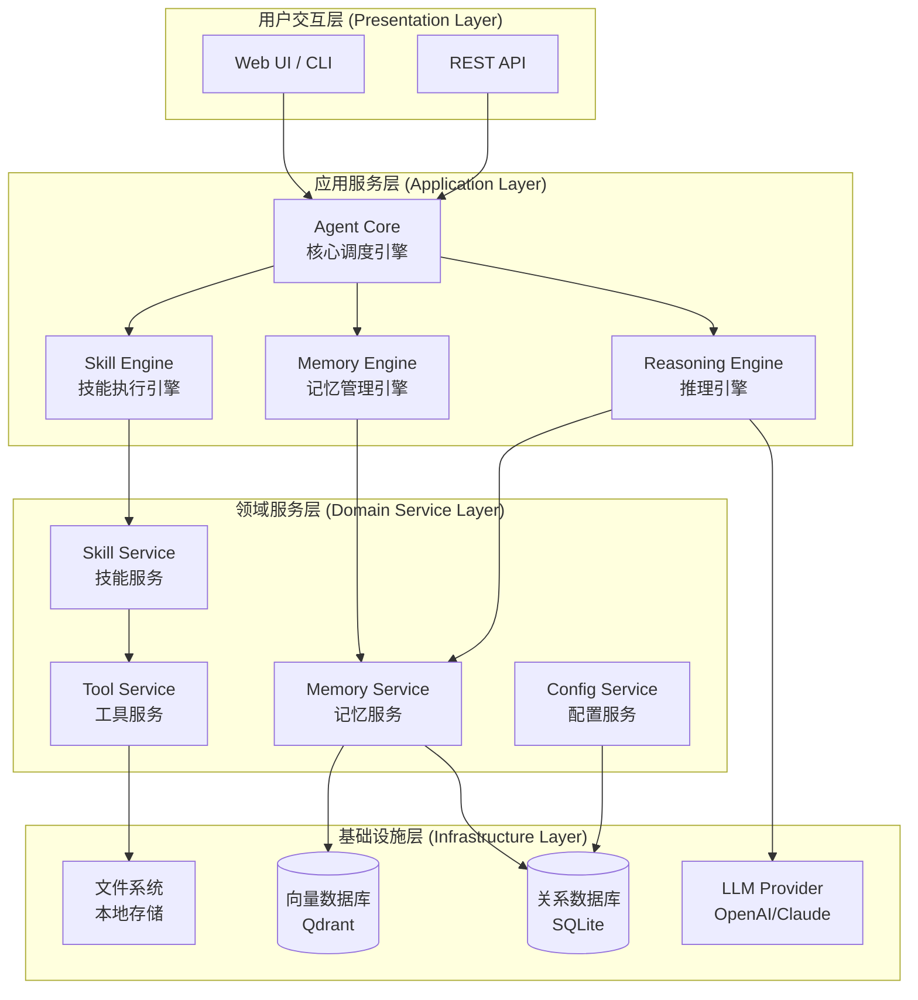
```mermaid
graph TB
    subgraph "用户交互层 (Presentation Layer)"
        UI[Web UI / CLI]
        API[REST API]
    end

    subgraph "应用服务层 (Application Layer)"
        AgentCore[Agent Core<br/>核心调度引擎]
        SkillEngine[Skill Engine<br/>技能执行引擎]
        MemoryEngine[Memory Engine<br/>记忆管理引擎]
        ReasoningEngine[Reasoning Engine<br/>推理引擎]
    end

    subgraph "领域服务层 (Domain Service Layer)"
        MemoryService[Memory Service<br/>记忆服务]
        SkillService[Skill Service<br/>技能服务]
        ToolService[Tool Service<br/>工具服务]
        ConfigService[Config Service<br/>配置服务]
    end

    subgraph "基础设施层 (Infrastructure Layer)"
        VectorDB[(向量数据库<br/>Qdrant)]
        RelationalDB[(关系数据库<br/>SQLite)]
        FileSystem[文件系统<br/>本地存储]
        LLMProvider[LLM Provider<br/>OpenAI/Claude]
    end

    UI --> AgentCore
    API --> AgentCore
    AgentCore --> SkillEngine
    AgentCore --> MemoryEngine
    AgentCore --> ReasoningEngine
    
    SkillEngine --> SkillService
    MemoryEngine --> MemoryService
    ReasoningEngine --> MemoryService
    
    SkillService --> ToolService
    MemoryService --> VectorDB
    MemoryService --> RelationalDB
    ConfigService --> RelationalDB
    
    ReasoningEngine --> LLMProvider
    ToolService --> FileSystem
```

### 1.2 模块依赖关系

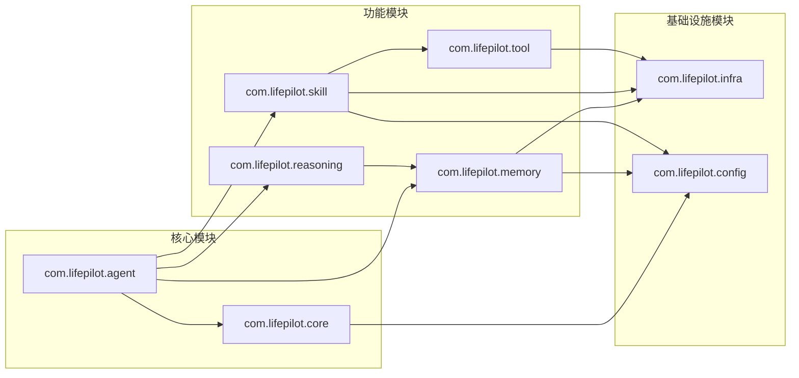
```mermaid
graph LR
    subgraph "核心模块"
        Core[com.lifepilot.core]
        Agent[com.lifepilot.agent]
    end

    subgraph "功能模块"
        Memory[com.lifepilot.memory]
        Skill[com.lifepilot.skill]
        Tool[com.lifepilot.tool]
        Reasoning[com.lifepilot.reasoning]
    end

    subgraph "基础设施模块"
        Infra[com.lifepilot.infra]
        Config[com.lifepilot.config]
    end

    Agent --> Core
    Agent --> Memory
    Agent --> Skill
    Agent --> Reasoning
    
    Skill --> Tool
    Reasoning --> Memory
    Memory --> Infra
    Skill --> Infra
    Tool --> Infra
    
    Core --> Config
    Memory --> Config
    Skill --> Config
```

---

## 2. 数据流图

### 2.1 用户请求处理流程

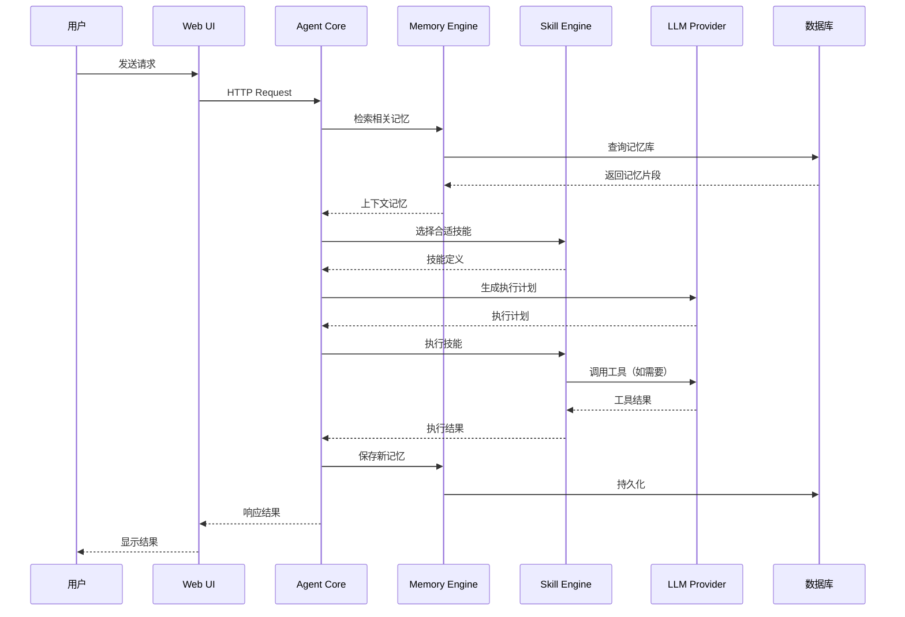
```mermaid
sequenceDiagram
    participant User as 用户
    participant UI as Web UI
    participant Agent as Agent Core
    participant Memory as Memory Engine
    participant Skill as Skill Engine
    participant LLM as LLM Provider
    participant DB as 数据库

    User->>UI: 发送请求
    UI->>Agent: HTTP Request
    Agent->>Memory: 检索相关记忆
    Memory->>DB: 查询记忆库
    DB-->>Memory: 返回记忆片段
    Memory-->>Agent: 上下文记忆
    
    Agent->>Skill: 选择合适技能
    Skill-->>Agent: 技能定义
    
    Agent->>LLM: 生成执行计划
    LLM-->>Agent: 执行计划
    
    Agent->>Skill: 执行技能
    Skill->>LLM: 调用工具（如需要）
    LLM-->>Skill: 工具结果
    Skill-->>Agent: 执行结果
    
    Agent->>Memory: 保存新记忆
    Memory->>DB: 持久化
    
    Agent-->>UI: 响应结果
    UI-->>User: 显示结果
```

### 2.2 记忆形成与检索流程

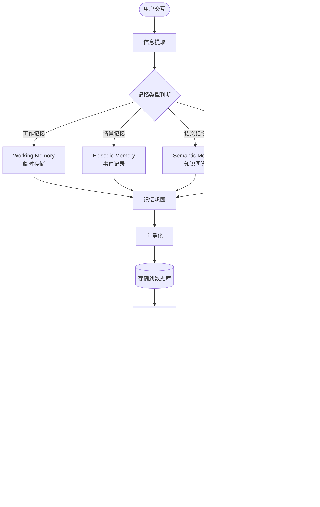
```mermaid
flowchart TD
    Start([用户交互]) --> Extract[信息提取]
    Extract --> Classify{记忆类型判断}
    
    Classify -->|工作记忆| WM[Working Memory<br/>临时存储]
    Classify -->|情景记忆| EM[Episodic Memory<br/>事件记录]
    Classify -->|语义记忆| SM[Semantic Memory<br/>知识图谱]
    Classify -->|程序记忆| PM[Procedural Memory<br/>技能模式]
    
    WM --> Consolidate[记忆巩固]
    EM --> Consolidate
    SM --> Consolidate
    PM --> Consolidate
    
    Consolidate --> Vectorize[向量化]
    Vectorize --> Store[(存储到数据库)]
    
    Store --> Index[构建索引]
    Index --> Ready([记忆就绪])
    
    Ready --> Query[查询请求]
    Query --> Retrieve[检索相关记忆]
    Retrieve --> Rank[相关性排序]
    Rank --> Return[返回Top-K记忆]
```

---

## 3. 组件交互图

### 3.1 Agent Core 与各引擎交互

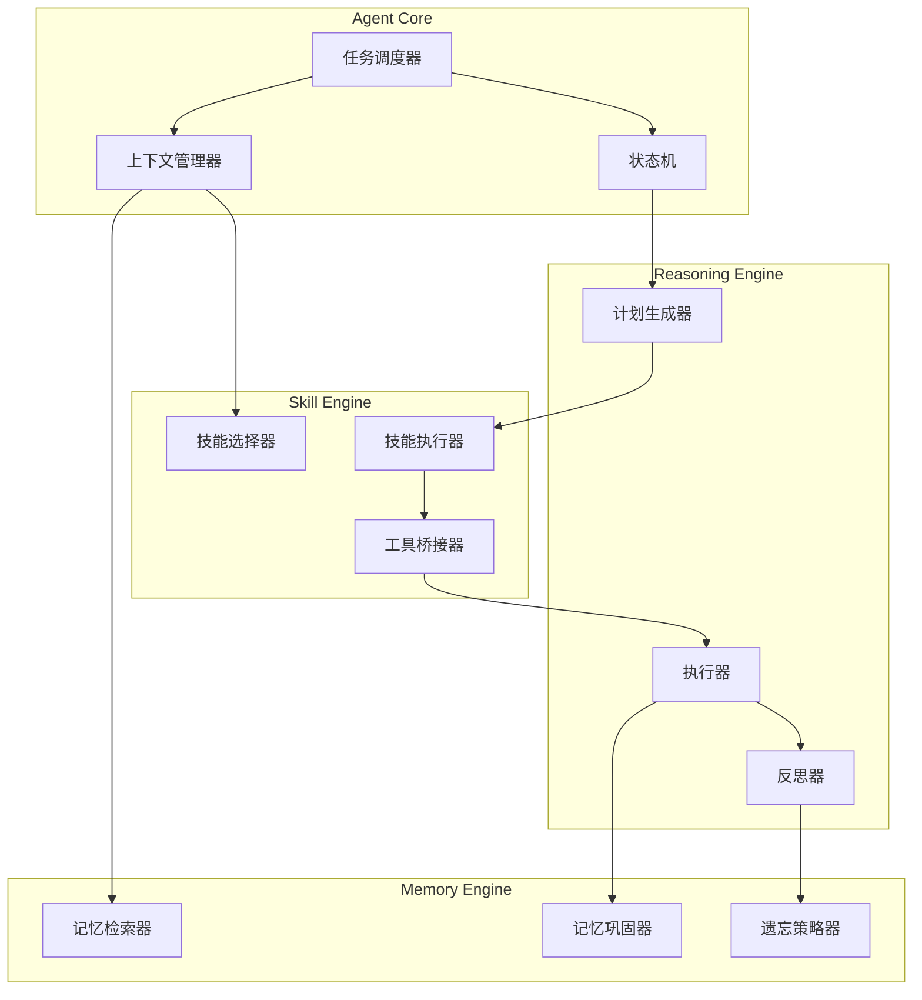
```mermaid
graph TB
    subgraph "Agent Core"
        Scheduler[任务调度器]
        ContextManager[上下文管理器]
        StateMachine[状态机]
    end

    subgraph "Memory Engine"
        MemoryRetriever[记忆检索器]
        MemoryConsolidator[记忆巩固器]
        MemoryForgetter[遗忘策略器]
    end

    subgraph "Skill Engine"
        SkillSelector[技能选择器]
        SkillExecutor[技能执行器]
        ToolBridge[工具桥接器]
    end

    subgraph "Reasoning Engine"
        Planner[计划生成器]
        Executor[执行器]
        Reflector[反思器]
    end

    Scheduler --> ContextManager
    ContextManager --> MemoryRetriever
    ContextManager --> SkillSelector
    
    Scheduler --> StateMachine
    StateMachine --> Planner
    Planner --> SkillExecutor
    
    SkillExecutor --> ToolBridge
    ToolBridge --> Executor
    
    Executor --> MemoryConsolidator
    Executor --> Reflector
    Reflector --> MemoryForgetter
```

### 3.2 Skill 系统内部交互

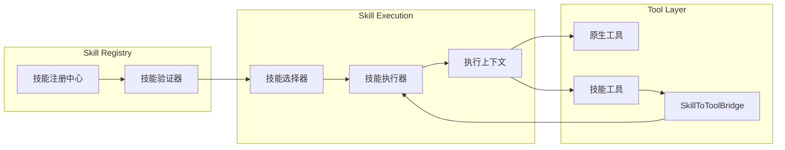
```mermaid
graph LR
    subgraph "Skill Registry"
        Registry[技能注册中心]
        Validator[技能验证器]
    end

    subgraph "Skill Execution"
        Selector[技能选择器]
        Executor[技能执行器]
        Context[执行上下文]
    end

    subgraph "Tool Layer"
        NativeTool[原生工具]
        SkillTool[技能工具]
        Bridge[SkillToToolBridge]
    end

    Registry --> Validator
    Validator --> Selector
    Selector --> Executor
    Executor --> Context
    
    Context --> NativeTool
    Context --> SkillTool
    SkillTool --> Bridge
    Bridge --> Executor
```

---

## 4. 部署架构图

### 4.1 本地部署结构

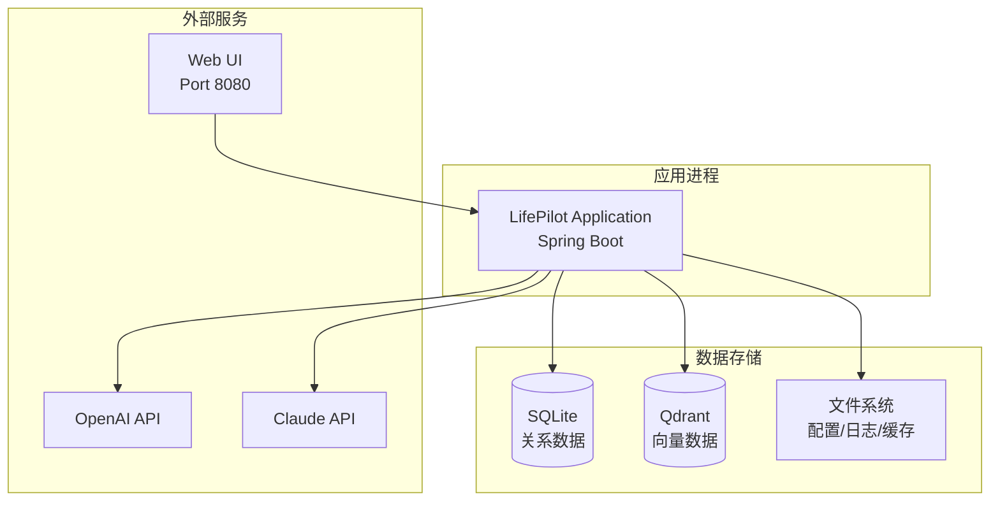
```mermaid
graph TB
    subgraph "应用进程"
        App[LifePilot Application<br/>Spring Boot]
    end

    subgraph "数据存储"
        SQLite[(SQLite<br/>关系数据)]
        Qdrant[(Qdrant<br/>向量数据)]
        FileStore[文件系统<br/>配置/日志/缓存]
    end

    subgraph "外部服务"
        OpenAI[OpenAI API]
        Claude[Claude API]
        Web[Web UI<br/>Port 8080]
    end

    App --> SQLite
    App --> Qdrant
    App --> FileStore
    App --> OpenAI
    App --> Claude
    Web --> App
```

### 4.2 目录结构

```
LifePilot/
├── config/              # 配置文件
│   ├── application.yml
│   └── skills/
├── data/               # 数据目录
│   ├── lifepilot.db   # SQLite 数据库
│   ├── qdrant/        # Qdrant 数据
│   └── cache/         # 缓存文件
├── logs/              # 日志文件
└── skills/            # 用户自定义技能
```

---

## 5. 记忆系统架构图

### 5.1 四层记忆架构

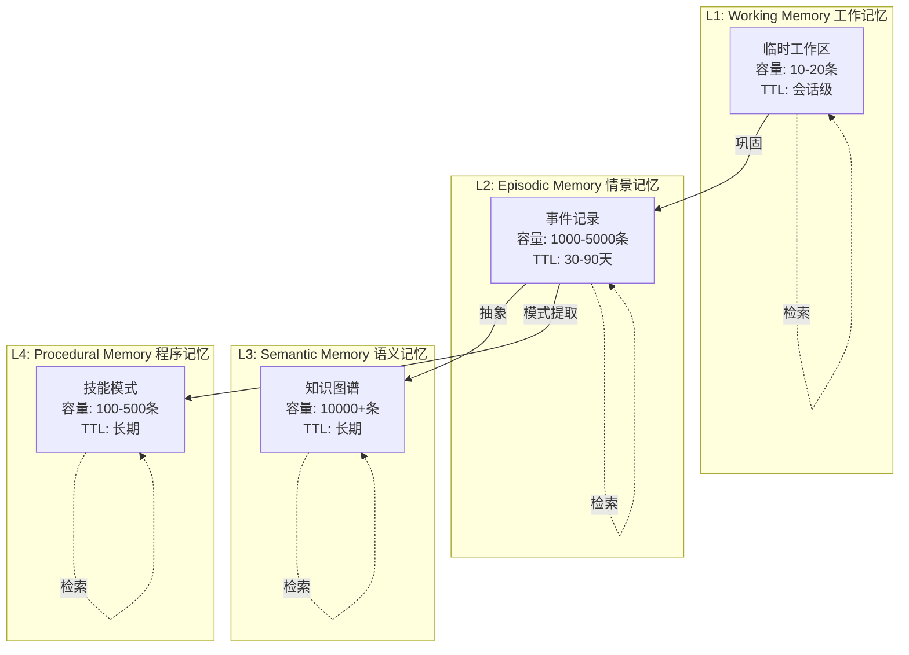
```mermaid
graph TB
    subgraph "L1: Working Memory 工作记忆"
        WM[临时工作区<br/>容量: 10-20条<br/>TTL: 会话级]
    end

    subgraph "L2: Episodic Memory 情景记忆"
        EM[事件记录<br/>容量: 1000-5000条<br/>TTL: 30-90天]
    end

    subgraph "L3: Semantic Memory 语义记忆"
        SM[知识图谱<br/>容量: 10000+条<br/>TTL: 长期]
    end

    subgraph "L4: Procedural Memory 程序记忆"
        PM[技能模式<br/>容量: 100-500条<br/>TTL: 长期]
    end

    WM -->|巩固| EM
    EM -->|抽象| SM
    EM -->|模式提取| PM
    
    WM -.->|检索| WM
    EM -.->|检索| EM
    SM -.->|检索| SM
    PM -.->|检索| PM
```

### 5.2 记忆操作生命周期

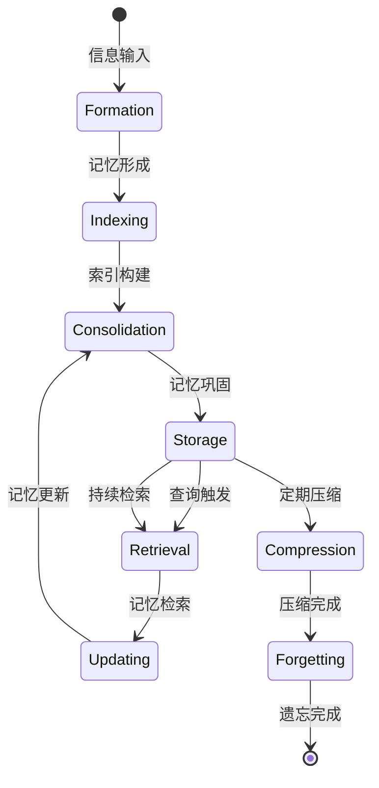
```mermaid
stateDiagram-v2
    [*] --> Formation: 信息输入
    Formation --> Indexing: 记忆形成
    Indexing --> Consolidation: 索引构建
    Consolidation --> Storage: 记忆巩固
    
    Storage --> Retrieval: 查询触发
    Retrieval --> Updating: 记忆检索
    Updating --> Consolidation: 记忆更新
    
    Storage --> Compression: 定期压缩
    Compression --> Forgetting: 压缩完成
    Forgetting --> [*]: 遗忘完成
    
    Storage --> Retrieval: 持续检索
```

### 5.3 记忆检索流程

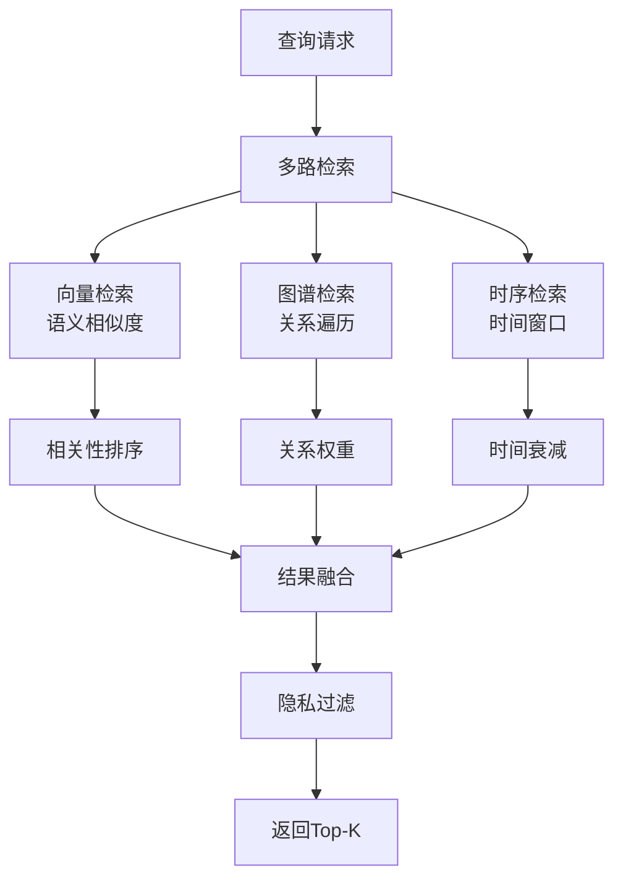
```mermaid
flowchart TD
    Query[查询请求] --> MultiRetrieval[多路检索]
    
    MultiRetrieval --> VectorSearch[向量检索<br/>语义相似度]
    MultiRetrieval --> GraphSearch[图谱检索<br/>关系遍历]
    MultiRetrieval --> TemporalSearch[时序检索<br/>时间窗口]
    
    VectorSearch --> Rank1[相关性排序]
    GraphSearch --> Rank2[关系权重]
    TemporalSearch --> Rank3[时间衰减]
    
    Rank1 --> Fusion[结果融合]
    Rank2 --> Fusion
    Rank3 --> Fusion
    
    Fusion --> Filter[隐私过滤]
    Filter --> Return[返回Top-K]
```

---

## 6. Skill 系统架构图

### 6.1 三层工具生态

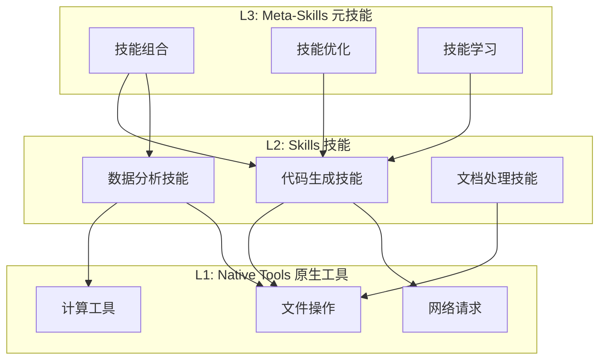
```mermaid
graph TB
    subgraph "L1: Native Tools 原生工具"
        FileTool[文件操作]
        WebTool[网络请求]
        CalcTool[计算工具]
    end

    subgraph "L2: Skills 技能"
        Skill1[代码生成技能]
        Skill2[数据分析技能]
        Skill3[文档处理技能]
    end

    subgraph "L3: Meta-Skills 元技能"
        MetaSkill1[技能组合]
        MetaSkill2[技能优化]
        MetaSkill3[技能学习]
    end

    Skill1 --> FileTool
    Skill1 --> WebTool
    Skill2 --> CalcTool
    Skill2 --> FileTool
    Skill3 --> FileTool
    
    MetaSkill1 --> Skill1
    MetaSkill1 --> Skill2
    MetaSkill2 --> Skill1
    MetaSkill3 --> Skill1
```

### 6.2 Skill 注册与执行流程

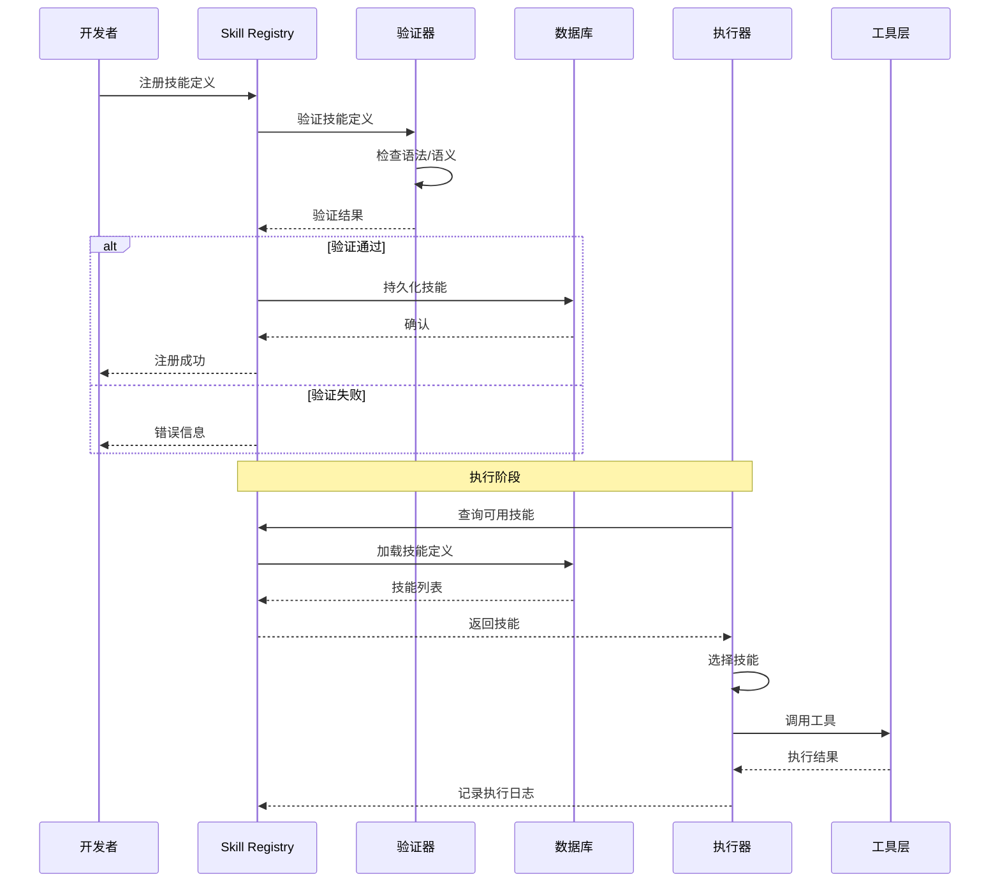
```mermaid
sequenceDiagram
    participant Dev as 开发者
    participant Registry as Skill Registry
    participant Validator as 验证器
    participant DB as 数据库
    participant Executor as 执行器
    participant Tool as 工具层

    Dev->>Registry: 注册技能定义
    Registry->>Validator: 验证技能定义
    Validator->>Validator: 检查语法/语义
    Validator-->>Registry: 验证结果
    
    alt 验证通过
        Registry->>DB: 持久化技能
        DB-->>Registry: 确认
        Registry-->>Dev: 注册成功
    else 验证失败
        Registry-->>Dev: 错误信息
    end
    
    Note over Registry,Executor: 执行阶段
    Executor->>Registry: 查询可用技能
    Registry->>DB: 加载技能定义
    DB-->>Registry: 技能列表
    Registry-->>Executor: 返回技能
    
    Executor->>Executor: 选择技能
    Executor->>Tool: 调用工具
    Tool-->>Executor: 执行结果
    Executor-->>Registry: 记录执行日志
```

### 6.3 Skill 自扩展机制

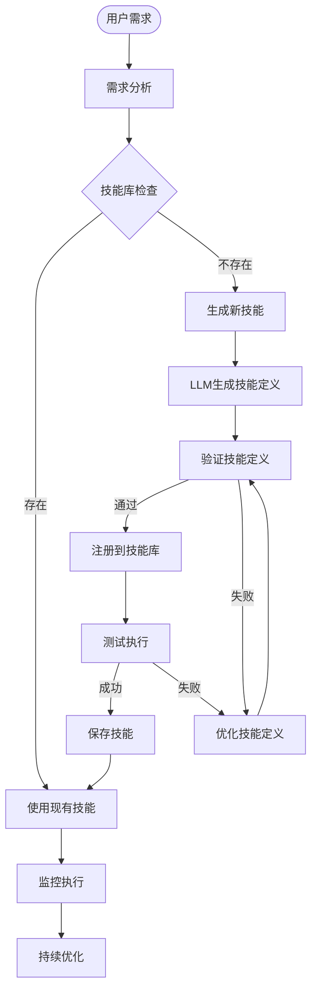
```mermaid
flowchart TD
    Start([用户需求]) --> Analyze[需求分析]
    Analyze --> Check{技能库检查}
    
    Check -->|存在| Use[使用现有技能]
    Check -->|不存在| Generate[生成新技能]
    
    Generate --> LLM[LLM生成技能定义]
    LLM --> Validate[验证技能定义]
    
    Validate -->|通过| Register[注册到技能库]
    Validate -->|失败| Refine[优化技能定义]
    Refine --> Validate
    
    Register --> Test[测试执行]
    Test -->|成功| Save[保存技能]
    Test -->|失败| Refine
    
    Save --> Use
    Use --> Monitor[监控执行]
    Monitor --> Improve[持续优化]
```

---

## 7. Agent 执行流程时序图

### 7.1 完整执行流程

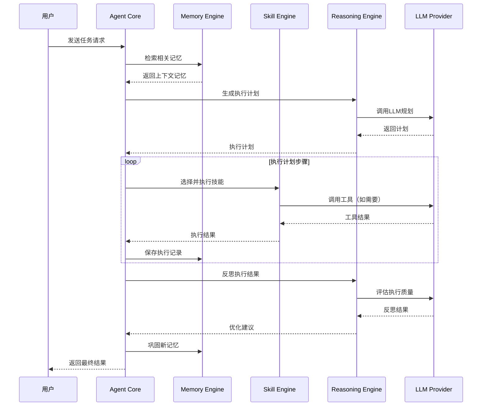
```mermaid
sequenceDiagram
    participant User as 用户
    participant Agent as Agent Core
    participant Memory as Memory Engine
    participant Skill as Skill Engine
    participant Reasoning as Reasoning Engine
    participant LLM as LLM Provider

    User->>Agent: 发送任务请求
    Agent->>Memory: 检索相关记忆
    Memory-->>Agent: 返回上下文记忆
    
    Agent->>Reasoning: 生成执行计划
    Reasoning->>LLM: 调用LLM规划
    LLM-->>Reasoning: 返回计划
    Reasoning-->>Agent: 执行计划
    
    loop 执行计划步骤
        Agent->>Skill: 选择并执行技能
        Skill->>LLM: 调用工具（如需要）
        LLM-->>Skill: 工具结果
        Skill-->>Agent: 执行结果
        
        Agent->>Memory: 保存执行记录
    end
    
    Agent->>Reasoning: 反思执行结果
    Reasoning->>LLM: 评估执行质量
    LLM-->>Reasoning: 反思结果
    Reasoning-->>Agent: 优化建议
    
    Agent->>Memory: 巩固新记忆
    Agent-->>User: 返回最终结果
```

### 7.2 主动推理流程

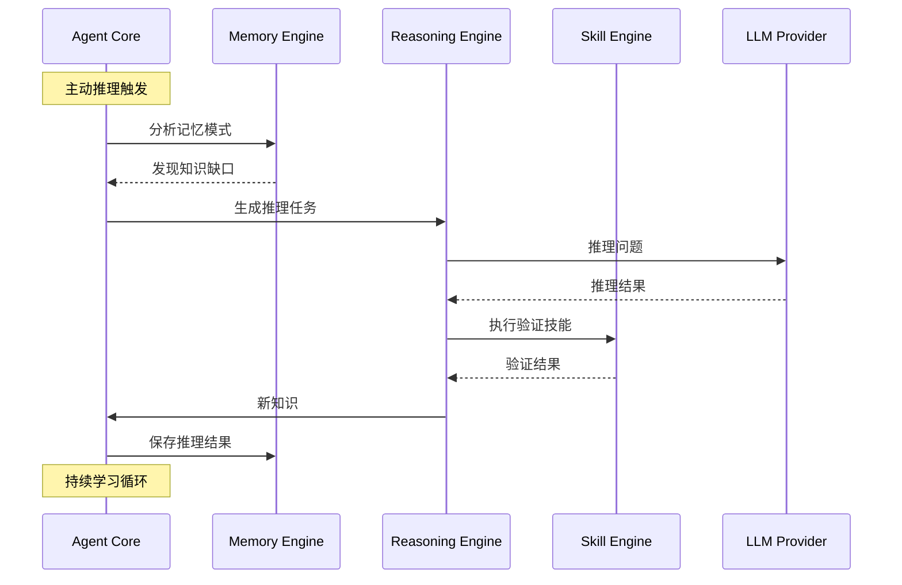
```mermaid
sequenceDiagram
    participant Agent as Agent Core
    participant Memory as Memory Engine
    participant Reasoning as Reasoning Engine
    participant Skill as Skill Engine
    participant LLM as LLM Provider

    Note over Agent: 主动推理触发
    Agent->>Memory: 分析记忆模式
    Memory-->>Agent: 发现知识缺口
    
    Agent->>Reasoning: 生成推理任务
    Reasoning->>LLM: 推理问题
    LLM-->>Reasoning: 推理结果
    
    Reasoning->>Skill: 执行验证技能
    Skill-->>Reasoning: 验证结果
    
    Reasoning->>Agent: 新知识
    Agent->>Memory: 保存推理结果
    
    Note over Agent: 持续学习循环
```

---

## 8. 主动推理流程时序图

### 8.1 主动推理完整流程

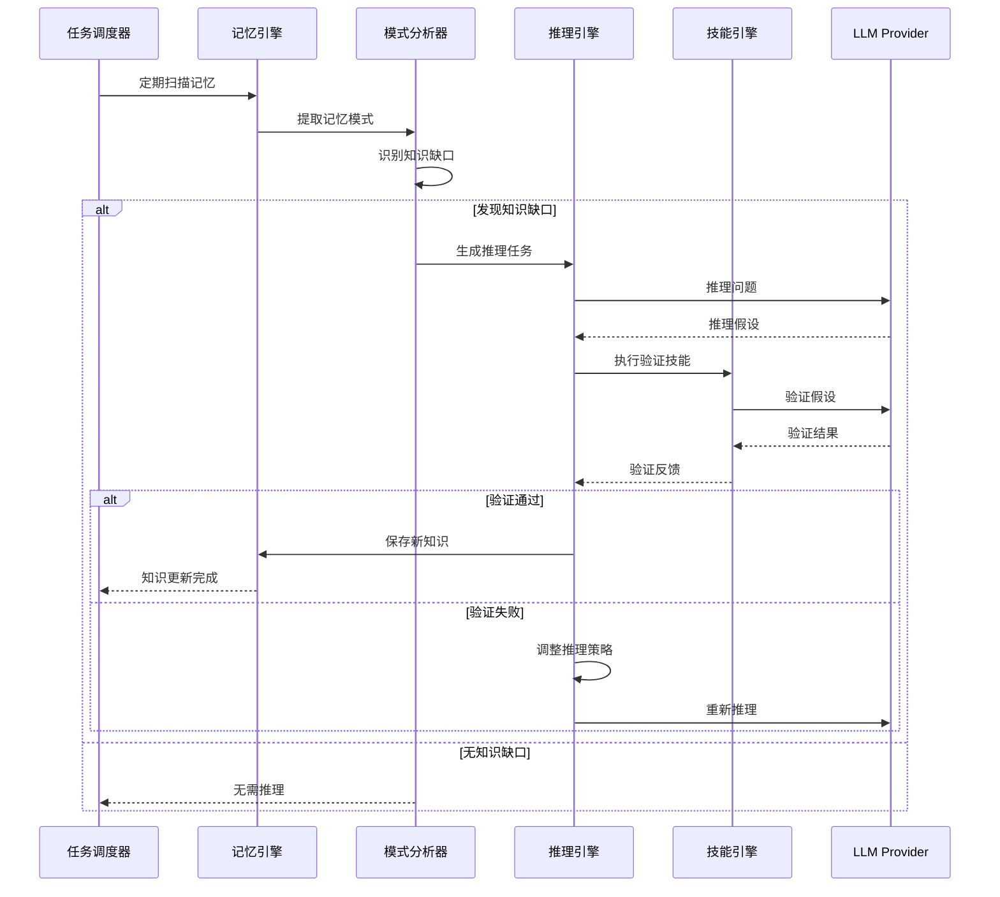
```mermaid
sequenceDiagram
    participant Scheduler as 任务调度器
    participant Memory as 记忆引擎
    participant Analyzer as 模式分析器
    participant Reasoner as 推理引擎
    participant Skill as 技能引擎
    participant LLM as LLM Provider

    Scheduler->>Memory: 定期扫描记忆
    Memory->>Analyzer: 提取记忆模式
    Analyzer->>Analyzer: 识别知识缺口
    
    alt 发现知识缺口
        Analyzer->>Reasoner: 生成推理任务
        Reasoner->>LLM: 推理问题
        LLM-->>Reasoner: 推理假设
        
        Reasoner->>Skill: 执行验证技能
        Skill->>LLM: 验证假设
        LLM-->>Skill: 验证结果
        Skill-->>Reasoner: 验证反馈
        
        alt 验证通过
            Reasoner->>Memory: 保存新知识
            Memory-->>Scheduler: 知识更新完成
        else 验证失败
            Reasoner->>Reasoner: 调整推理策略
            Reasoner->>LLM: 重新推理
        end
    else 无知识缺口
        Analyzer-->>Scheduler: 无需推理
    end
```

### 8.2 推理-验证-学习循环

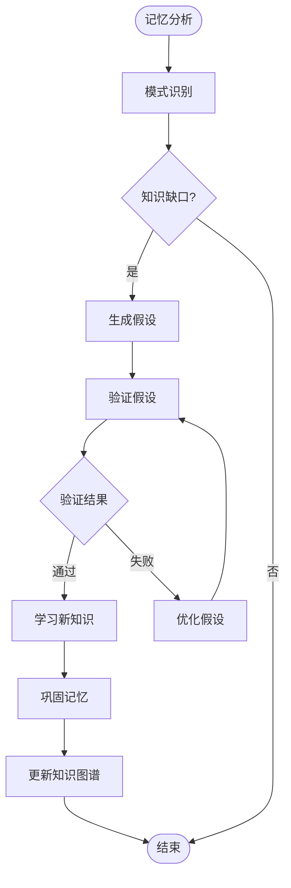
```mermaid
flowchart TD
    Start([记忆分析]) --> Pattern[模式识别]
    Pattern --> Gap{知识缺口?}
    
    Gap -->|是| Hypothesize[生成假设]
    Gap -->|否| End([结束])
    
    Hypothesize --> Verify[验证假设]
    Verify --> Result{验证结果}
    
    Result -->|通过| Learn[学习新知识]
    Result -->|失败| Refine[优化假设]
    
    Refine --> Verify
    Learn --> Consolidate[巩固记忆]
    Consolidate --> Update[更新知识图谱]
    Update --> End
```

---

## 9. 数据模型关系图

### 9.1 核心实体关系

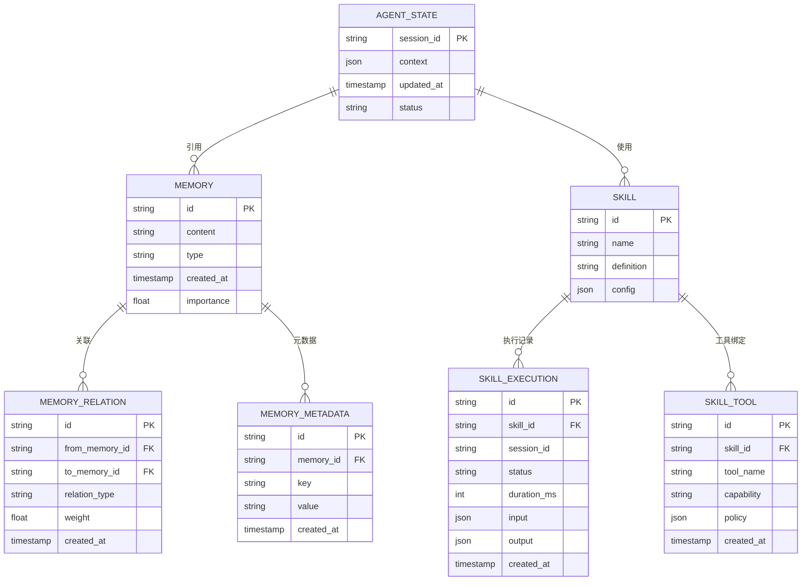
```mermaid
erDiagram
    MEMORY ||--o{ MEMORY_RELATION : "关联"
    MEMORY ||--o{ MEMORY_METADATA : "元数据"
    SKILL ||--o{ SKILL_EXECUTION : "执行记录"
    SKILL ||--o{ SKILL_TOOL : "工具绑定"
    AGENT_STATE ||--o{ MEMORY : "引用"
    AGENT_STATE ||--o{ SKILL : "使用"
    
    MEMORY {
        string id PK
        string content
        string type
        timestamp created_at
        float importance
    }
    
    SKILL {
        string id PK
        string name
        string definition
        json config
    }
    
    AGENT_STATE {
        string session_id PK
        json context
        timestamp updated_at
        string status
    }

    MEMORY_RELATION {
        string id PK
        string from_memory_id FK
        string to_memory_id FK
        string relation_type
        float weight
        timestamp created_at
    }

    MEMORY_METADATA {
        string id PK
        string memory_id FK
        string key
        string value
        timestamp created_at
    }

    SKILL_EXECUTION {
        string id PK
        string skill_id FK
        string session_id
        string status
        int duration_ms
        json input
        json output
        timestamp created_at
    }

    SKILL_TOOL {
        string id PK
        string skill_id FK
        string tool_name
        string capability
        json policy
        timestamp created_at
    }
```

### 9.2 存储与索引（SQLite + FTS5 + sqlite-vec）

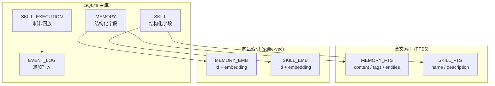
```mermaid
flowchart TB
    subgraph "SQLite 主库"
        T1[MEMORY<br/>结构化字段]
        T2[SKILL<br/>结构化字段]
        T3[SKILL_EXECUTION<br/>审计/回放]
        T4[EVENT_LOG<br/>追加写入]
    end

    subgraph "全文索引 (FTS5)"
        F1[MEMORY_FTS<br/>content / tags / entities]
        F2[SKILL_FTS<br/>name / description]
    end

    subgraph "向量索引 (sqlite-vec)"
        V1[MEMORY_EMB<br/>id + embedding]
        V2[SKILL_EMB<br/>id + embedding]
    end

    T1 --> F1
    T2 --> F2
    T1 --> V1
    T2 --> V2
    T3 --> T4
```

---

## 10. Gateway 中间件流水线

### 10.1 请求在中间件中的流转

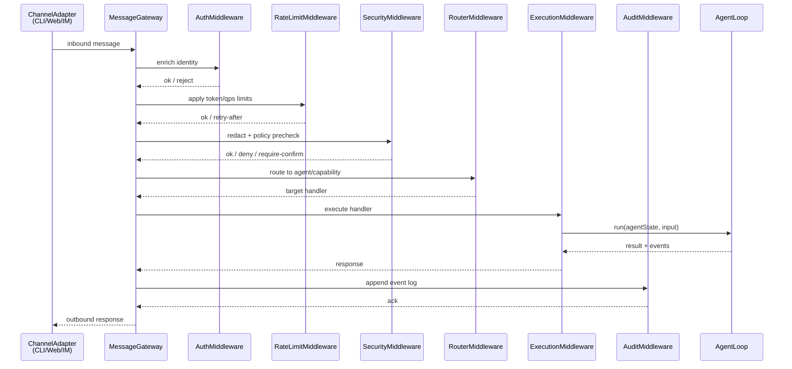
```mermaid
sequenceDiagram
    participant CH as ChannelAdapter<br/>(CLI/Web/IM)
    participant GW as MessageGateway
    participant AUTH as AuthMiddleware
    participant RL as RateLimitMiddleware
    participant SEC as SecurityMiddleware
    participant ROUTER as RouterMiddleware
    participant EXEC as ExecutionMiddleware
    participant AUDIT as AuditMiddleware
    participant AL as AgentLoop

    CH->>GW: inbound message
    GW->>AUTH: enrich identity
    AUTH-->>GW: ok / reject
    GW->>RL: apply token/qps limits
    RL-->>GW: ok / retry-after
    GW->>SEC: redact + policy precheck
    SEC-->>GW: ok / deny / require-confirm
    GW->>ROUTER: route to agent/capability
    ROUTER-->>GW: target handler
    GW->>EXEC: execute handler
    EXEC->>AL: run(agentState, input)
    AL-->>EXEC: result + events
    EXEC-->>GW: response
    GW->>AUDIT: append event log
    AUDIT-->>GW: ack
    GW-->>CH: outbound response
```

### 10.2 中间件“可插拔”拓扑（管道模式）

```mermaid
flowchart LR
    In[Inbound] --> Auth[Auth]
    Auth --> Rate[RateLimit/Budget]
    Rate --> Sec[Security/Redaction]
    Sec --> Route[Router]
    Route --> Exec[Execution]
    Exec --> Audit[Audit/EventLog]
    Audit --> Out[Outbound]
```

---

## 11. LLM 路由与熔断

### 11.1 场景路由（Chat / Embedding / Tool）

```mermaid
flowchart TD
    Req[LLM Request] --> Cap{capabilityType}
    Cap -->|chat| Chat[Chat Router]
    Cap -->|embedding| Emb[Embedding Router]
    Cap -->|tool| Tool[Tool Router]

    Chat --> Policy1[Provider Policy<br/>local-first / cost / latency]
    Emb --> Policy2[Provider Policy<br/>quality / throughput]
    Tool --> Policy3[Provider Policy<br/>determinism / constraints]

    Policy1 --> Pick1[Pick Provider]
    Policy2 --> Pick2[Pick Provider]
    Policy3 --> Pick3[Pick Provider]

    Pick1 --> Call[Call ProviderAdapter]
    Pick2 --> Call
    Pick3 --> Call
    Call --> Resp[Response]
```

### 11.2 熔断器状态机（按 providerId:capabilityType 隔离）

```mermaid
stateDiagram-v2
    [*] --> CLOSED
    CLOSED --> OPEN: failure rate >= threshold
    OPEN --> HALF_OPEN: after coolDown
    HALF_OPEN --> CLOSED: success >= minSuccess
    HALF_OPEN --> OPEN: any failure
```

---

## 12. 可观测性（Trace/Span）视图

### 12.1 一次 AgentLoop 的 Trace 树（示意）

```mermaid
flowchart TD
    T[Trace: requestId] --> S1[Span: gateway.receive]
    S1 --> S2[Span: agent.loop]
    S2 --> S3[Span: context.assemble]
    S3 --> S31[Span: memory.retrieve]
    S2 --> S4[Span: llm.plan]
    S2 --> S5[Span: skill.execute]
    S5 --> S51[Span: tool.invoke]
    S2 --> S6[Span: memory.write]
    S2 --> S7[Span: guardrail.check]
    S1 --> S8[Span: gateway.respond]
```

### 12.2 关键指标与事件

```mermaid
graph LR
    subgraph Metrics
        M1[latency_ms]
        M2[token_in/token_out]
        M3[tool_calls]
        M4[retrieval_k]
        M5[policy_denies]
    end
    subgraph Events
        E1[skill_selected]
        E2[plan_step]
        E3[tool_invoked]
        E4[memory_consolidated]
        E5[circuit_breaker_open]
    end
```

---

## 13. 护栏与权限（Policy-as-Code）视图

### 13.1 护栏决策流（允许 / 拒绝 / 需要确认）

```mermaid
flowchart TD
    Input[Action Request] --> Classify{Operation Class}
    Classify -->|ReadOnly| Allow[ALLOW]
    Classify -->|Sensitive| Check[Policy Check]
    Classify -->|Irreversible| Confirm[Require User Confirm]

    Check --> Redact[DataRedactor]
    Redact --> Decide{Rule Match}
    Decide -->|pass| Allow
    Decide -->|fail| Deny[DENY]
    Confirm --> Allow
```

### 13.2 数据脱敏范围（示意）

```mermaid
flowchart LR
    PII[PII Detector] --> Mask[Mask/Hash]
    Secret[Secret Scanner] --> Mask
    Content[Prompt/ToolArgs] --> PII
    Content --> Secret
    Mask --> Safe[Safe Payload to LLM/Tool]
```

---

## 14. 故障与恢复（Resilience）视图

### 14.1 外部依赖失败时的降级路径

```mermaid
flowchart TD
    Call[Call LLM Provider] --> Ok{Success?}
    Ok -->|Yes| Done[Return]
    Ok -->|No| Retry{Retryable?}
    Retry -->|Yes| Backoff[Exponential Backoff]
    Backoff --> Call
    Retry -->|No| Fallback{Fallback Available?}
    Fallback -->|Yes| Local[Fallback to Local Model/Ollama]
    Fallback -->|No| Cache{Cached Answer?}
    Cache -->|Yes| ReturnCache[Return Cached]
    Cache -->|No| Fail[Return Structured Error]
```

### 14.2 存储故障的处置（WAL + 追加写入）

```mermaid
flowchart LR
    Write[Write Transaction] --> Wal[SQLite WAL]
    Wal --> Commit[Commit]
    Commit --> Event[Append EventLog]
    Event --> Replay[Replay/Recovery]
```

---

> **文档结束**