# ZhiWei 架构设计图

> **文档性质**：架构可视化文档（Developer-Facing）
> **目标读者**：架构师、开发者、技术评审者
> **最后更新**：2026-03-17
> **关联文档**：[ARCHITECTURE.md](./docs/ARCHITECTURE.md)、[memory-system.md](./docs/architecture/memory-system.md)、[skill-system.md](./docs/architecture/skill-system.md)

---

## 目录

- [1. 系统整体架构图](#1-系统整体架构图)
- [2. 数据流图](#2-数据流图)
- [3. 组件交互图](#3-组件交互图)
- [4. 部署架构图](#4-部署架构图)
- [5. 记忆系统架构图](#5-记忆系统架构图)
- [6. Skill 与工具生态架构图](#6-skill-与工具生态架构图)
- [7. Agent 执行流程时序图](#7-agent-执行流程时序图)
- [8. 主动推理流程时序图](#8-主动推理流程时序图)
- [9. 数据模型关系图](#9-数据模型关系图)
- [10. Gateway 中间件流水线](#10-gateway-中间件流水线)
- [11. LLM 路由与熔断](#11-llm-路由与熔断)
- [12. 可观测性（Trace/Span）视图](#12-可观测性tracespan视图)
- [13. 护栏与权限（Policy-as-Code）视图](#13-护栏与权限policy-as-code视图)
- [14. 故障与恢复（Resilience）视图](#14-故障与恢复resilience视图)

---

## 1. 系统整体架构图

### 1.1 分层架构视图

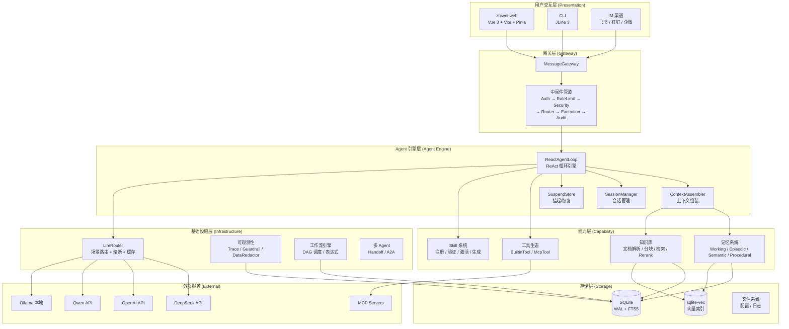

### 1.2 模块依赖关系（22 个后端模块）

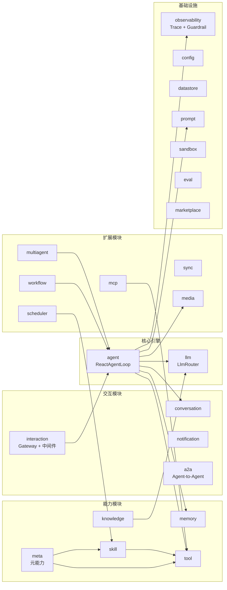

---

## 2. 数据流图

### 2.1 用户请求处理流程（ReAct 循环）

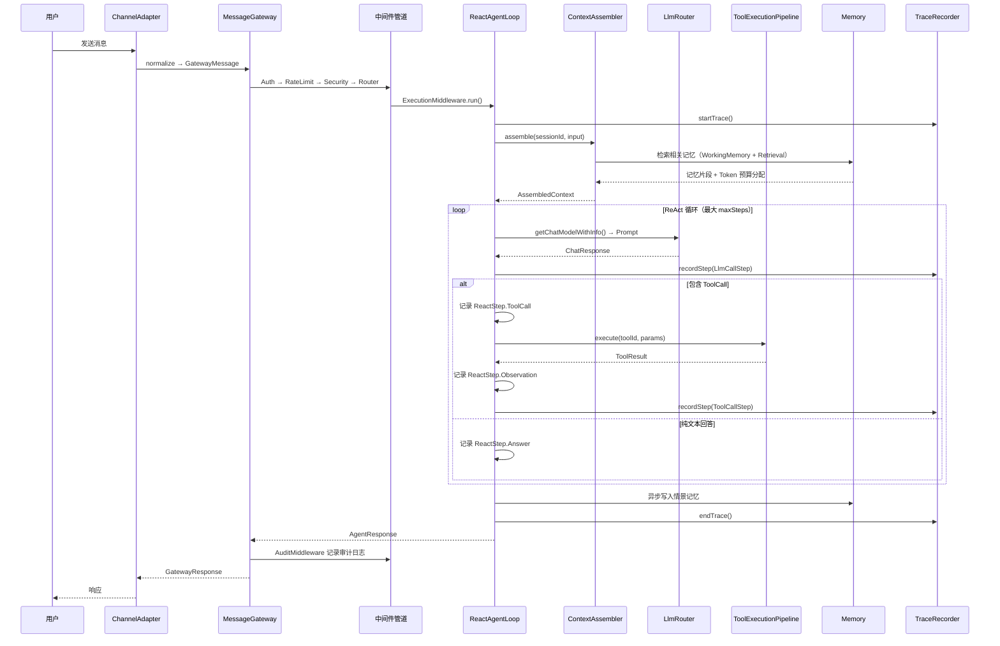

### 2.2 记忆形成与巩固流程

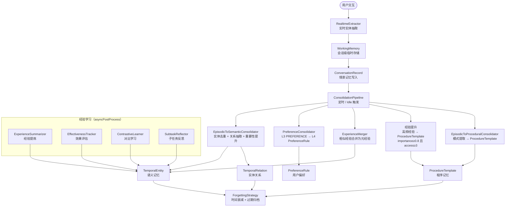

---

## 3. 组件交互图

### 3.1 ReactAgentLoop 核心交互

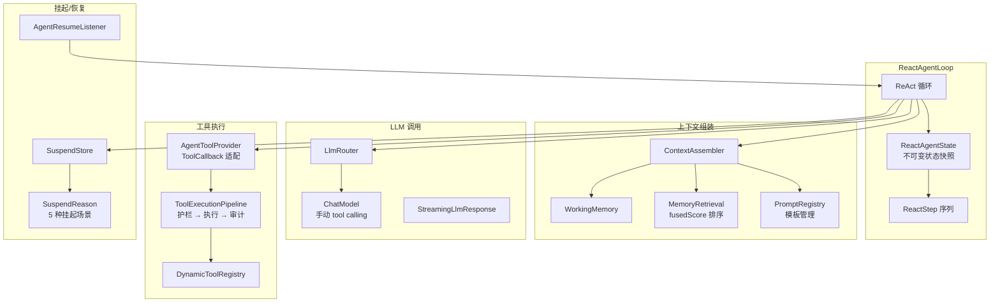

### 3.2 Skill 系统内部交互

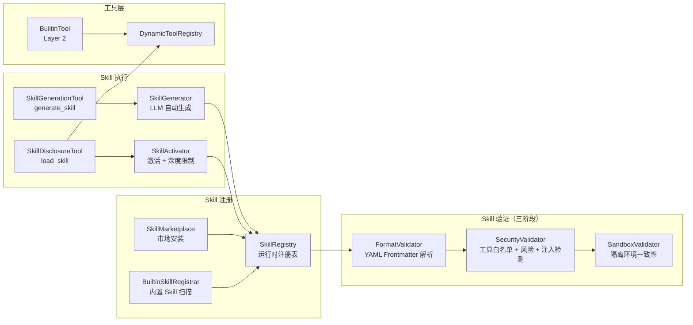

---

## 4. 部署架构图

### 4.1 Docker Compose 部署结构

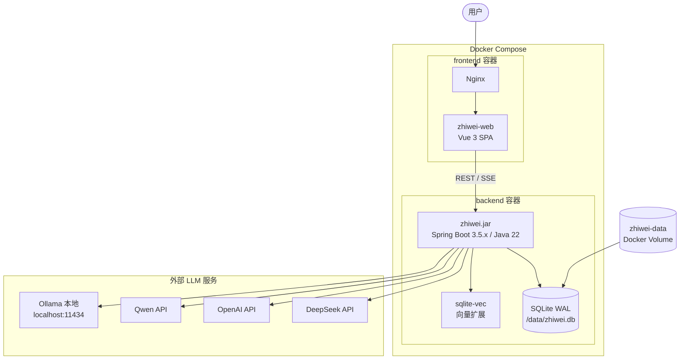

### 4.2 运行时目录结构

```
ZhiWei/
├── src/main/java/com/lifepilot/   # 22 个后端模块
│   ├── agent/                      # ReAct Agent 引擎
│   ├── memory/                     # 四层记忆系统
│   ├── skill/                      # Skill 注册/验证/激活/生成
│   ├── tool/                       # 三层工具生态
│   ├── llm/                        # LLM 路由/熔断/缓存
│   ├── interaction/                # Gateway + 中间件 + Web API
│   ├── knowledge/                  # 知识库管理
│   ├── observability/              # Trace + Guardrail + DataRedactor
│   ├── workflow/                   # DAG 工作流引擎
│   ├── multiagent/                 # 多 Agent 协作
│   ├── mcp/                        # MCP 协议支持
│   ├── meta/                       # 元能力（自省/便捷/基础设施）
│   ├── conversation/               # 对话历史管理
│   ├── notification/               # 通知系统
│   ├── scheduler/                  # 定时任务
│   ├── media/                      # 多模态媒体处理
│   ├── prompt/                     # Prompt 模板管理
│   ├── datastore/                  # 通用数据存储
│   ├── eval/                       # Agent 评估框架
│   ├── sync/                       # 外部数据同步
│   ├── sandbox/                    # 沙箱执行
│   ├── marketplace/                # Skill 市场
│   ├── a2a/                        # Agent-to-Agent 协议
│   └── config/                     # 全局配置
├── zhiwei-web/                     # 前端独立项目（Vue 3）
├── src/main/resources/
│   ├── application.yml             # 主配置
│   ├── db/migration/               # Flyway 迁移脚本
│   ├── builtin-skills/             # 内置 Skill 定义
│   └── mcp/                # 内置 MCP 服务器配置
├── docker-compose.yml
└── Dockerfile                      # 多阶段构建
```

---

## 5. 记忆系统架构图

### 5.1 四层记忆架构

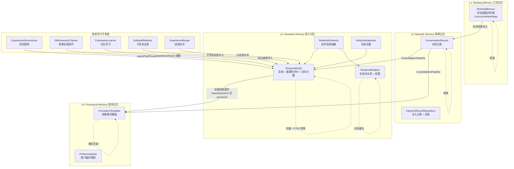

### 5.2 记忆检索流程（MemoryRetrieval）

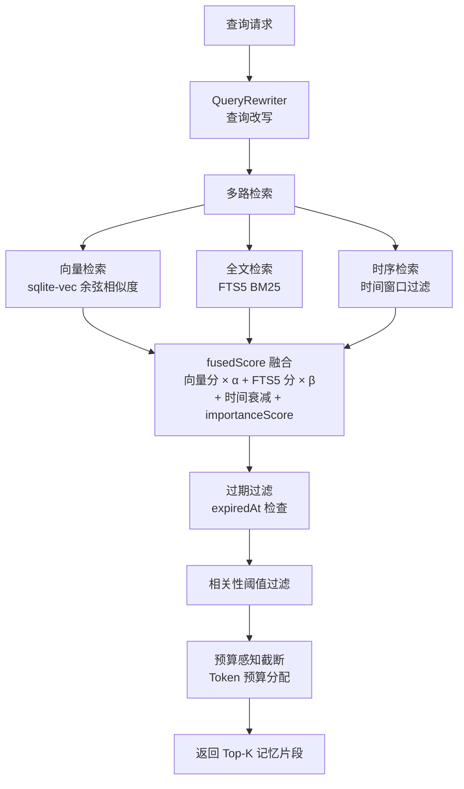

### 5.3 巩固管线（ConsolidationPipeline）

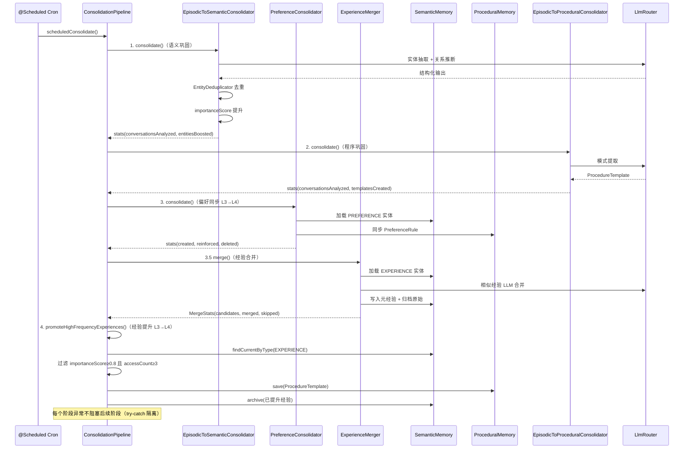

---

## 6. Skill 与工具生态架构图

### 6.1 三层工具架构（ToolContract sealed interface）

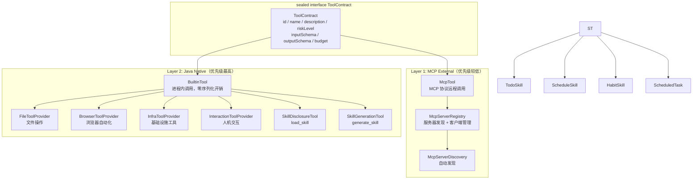

### 6.2 工具元能力分组（ToolCategory）

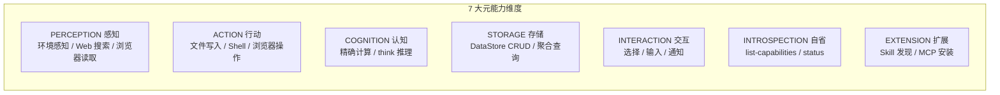

### 6.3 Skill 验证三阶段管线

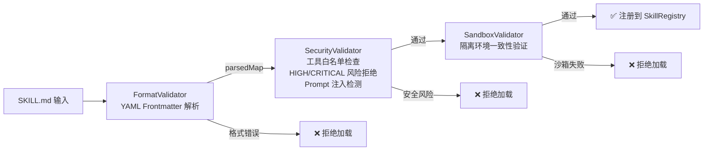

---

## 7. Agent 执行流程时序图

### 7.1 ReAct 循环完整流程

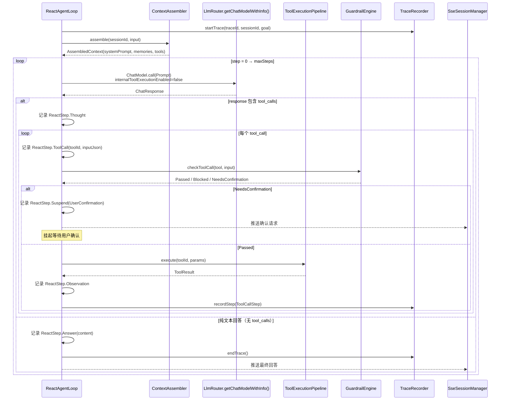

### 7.2 Agent 挂起/恢复流程

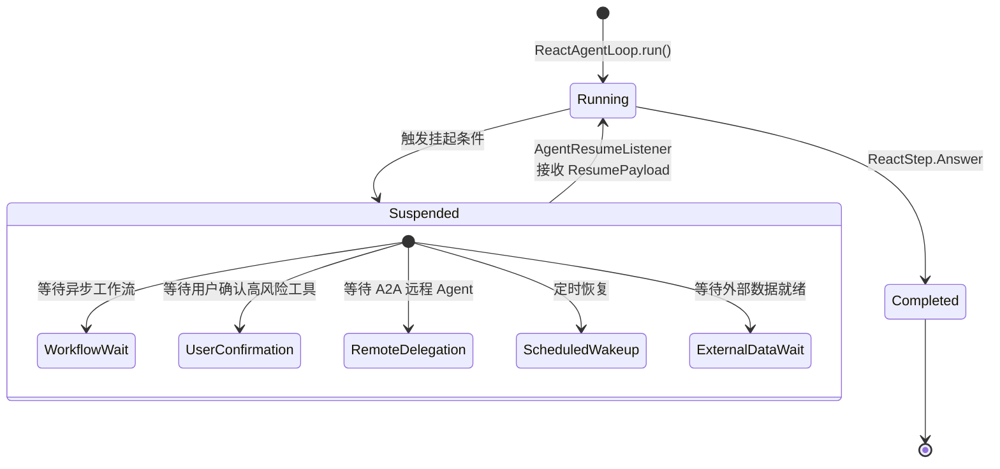

### 7.3 ReactStep 类型层次

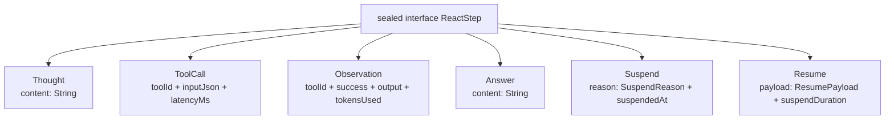

---

## 8. 主动推理流程时序图

### 8.1 主动推理触发与执行

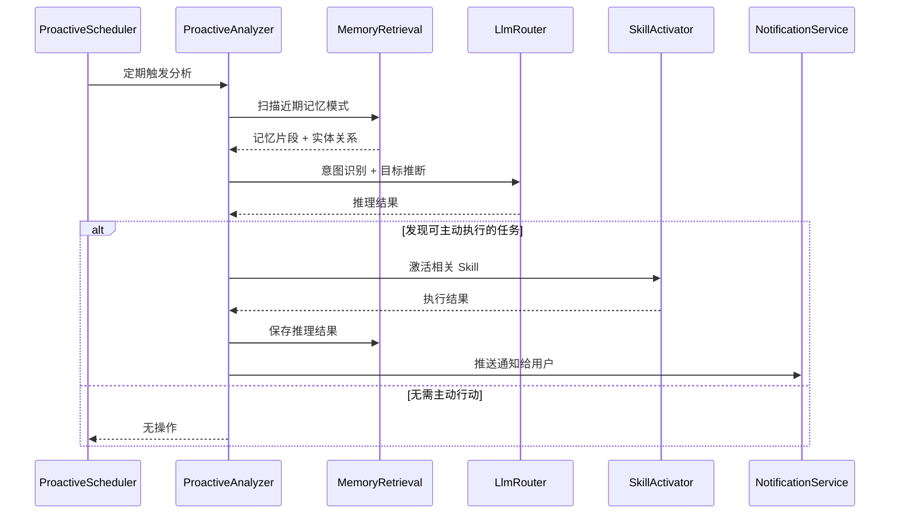

---

## 9. 数据模型关系图

### 9.1 核心实体关系（基于 Flyway V1 Schema）

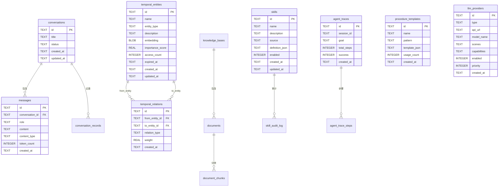

### 9.2 存储与索引架构（SQLite + FTS5 + sqlite-vec）

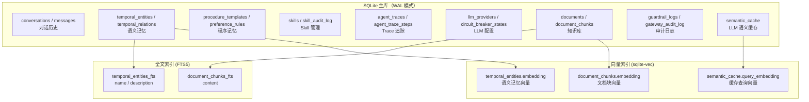

---

## 10. Gateway 中间件流水线

### 10.1 请求在中间件中的流转

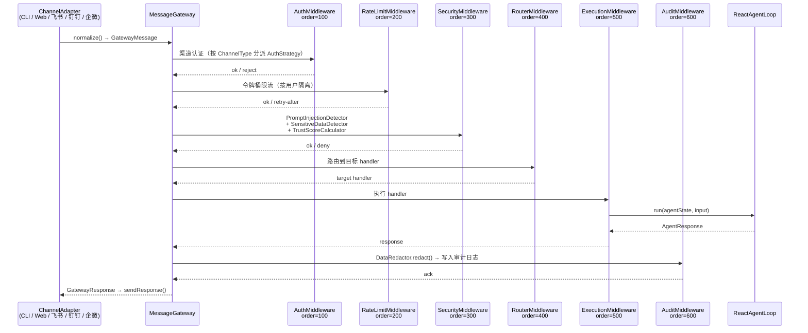

### 10.2 中间件可插拔拓扑（管道模式）

```mermaid
flowchart LR
    In[Inbound<br/>GatewayMessage] --> Auth[Auth<br/>100]
    Auth --> Rate[RateLimit<br/>200]
    Rate --> Sec[Security<br/>300]
    Sec --> Route[Router<br/>400]
    Route --> Exec[Execution<br/>500]
    Exec --> Audit[Audit<br/>600]
    Audit --> Out[Outbound<br/>GatewayResponse]

    style Auth fill:#e8f5e9
    style Rate fill:#e3f2fd
    style Sec fill:#fff3e0
    style Route fill:#f3e5f5
    style Exec fill:#fce4ec
    style Audit fill:#e0f2f1
```

> 所有中间件均可通过 `application.yml` 的 `lifepilot.gateway.middleware.*` 独立启用/禁用和调整 order。

---

## 11. LLM 路由与熔断

### 11.1 路由决策流程

```mermaid
flowchart TD
    Req[LlmRequest] --> ModelName{指定 modelName?}
    
    ModelName -->|是| ByModel[ProviderRegistry.findByModelName<br/>精确匹配 → 包含匹配]
    ModelName -->|否| ByScene[ProviderRegistry.findByScene<br/>场景匹配]
    
    ByModel --> Filter[能力过滤<br/>+ 熔断器过滤]
    ByScene --> Filter
    
    ByScene -->|场景无匹配| Fallback[回退: findByCapability<br/>按能力查找]
    Fallback --> Filter
    
    Filter --> Preferred{有 preferredProviderId?}
    Preferred -->|是| Prioritize[优先排序<br/>preferred 排第一]
    Preferred -->|否| Sort[按 priority 升序]
    
    Prioritize --> Loop
    Sort --> Loop
    
    Loop[故障转移循环] --> Call[调用 ProviderAdapter]
    Call -->|成功| Success[recordSuccess<br/>+ 写入 SemanticCache]
    Call -->|失败| Retry{还有候选?}
    Retry -->|是| Backoff[ExponentialBackoff<br/>500ms × 2^n, 上限 5s]
    Backoff --> Loop
    Retry -->|否| Fail[LlmUnavailableException]
```

### 11.2 熔断器状态机（CircuitState sealed interface）

```mermaid
stateDiagram-v2
    [*] --> Closed: 初始状态
    
    Closed --> Closed: recordSuccess()<br/>重置 consecutiveFailures=0
    Closed --> Open: recordFailure()<br/>consecutiveFailures >= threshold

    Open --> HalfOpen: isCallPermitted()<br/>超过 resetTimeout

    HalfOpen --> Closed: recordSuccess()<br/>探测成功
    HalfOpen --> Open: recordFailure()<br/>探测失败

    note right of Closed: Closed(consecutiveFailures)
    note right of Open: Open(openedAt, failureCount)
    note right of HalfOpen: HalfOpen(transitionedAt)<br/>限制 halfOpenMaxAttempts
```

### 11.3 语义缓存（SemanticCache）

```mermaid
flowchart LR
    Req[LLM 请求] --> Lookup[SemanticCache.lookup<br/>scene + responseFormatKey + prompt]
    Lookup -->|命中| Hit[返回 CacheEntry<br/>LlmResponse.cached()]
    Lookup -->|未命中| Call[调用 Provider]
    Call --> PutAsync[SemanticCache.putAsync<br/>异步写入缓存]
    PutAsync --> Return[返回 LlmResponse]
```

---

## 12. 可观测性（Trace/Span）视图

### 12.1 一次 ReactAgentLoop 的 Trace 树

```mermaid
flowchart TD
    T[TraceRecord<br/>traceId + sessionId + goal] --> S1[LlmCallStep<br/>provider + model + latency + tokens]
    T --> S2[ToolCallStep<br/>toolId + action + input + output + riskLevel]
    T --> S3[GuardrailStep<br/>policyId + checkType + passed + riskLevel + approvalMode]
    T --> S4[LlmCallStep<br/>第二轮 LLM 调用]
    T --> S5[ToolCallStep<br/>第二轮工具调用]
```

### 12.2 TraceStep 类型层次

```mermaid
graph TB
    TS[sealed interface TraceStep<br/>stepIndex + timestamp + duration]
    TS --> LCS[LlmCallStep<br/>provider / model / prompt / response<br/>inputTokens / outputTokens / latencyMs]
    TS --> TCS[ToolCallStep<br/>toolId / action / inputJson / outputJson<br/>success / errorMessage / riskLevel]
    TS --> GS[GuardrailStep<br/>policyId / checkType / passed<br/>reason / riskLevel / approvalMode]
```

### 12.3 关键指标与事件

```mermaid
graph LR
    subgraph "Trace 指标"
        M1[totalSteps]
        M2[totalInputTokens / totalOutputTokens]
        M3[totalDuration]
        M4[toolCallCount]
        M5[guardrailBlockCount]
    end
    subgraph "实时事件（TraceStepEvent）"
        E1[onStep 回调<br/>步骤级实时推送]
        E2[onTraceEnd 回调<br/>Trace 结束通知]
    end
```

---

## 13. 护栏与权限（Policy-as-Code）视图

### 13.1 GuardrailPolicy sealed interface 类型层次

```mermaid
graph TB
    GP[sealed interface GuardrailPolicy<br/>policyId / enabled / priority]
    GP --> TRP[ToolRiskPolicy<br/>toolRiskMapping: Map&lt;String, RiskLevel&gt;<br/>defaultRiskLevel: RiskLevel]
    GP --> BLP[BudgetLimitPolicy<br/>dailyTokenLimit: int]
    GP --> CSP[ContentSafetyPolicy<br/>blockedPatterns: List&lt;String&gt;<br/>sensitiveTopics: List&lt;String&gt;]
    GP --> RLP[RateLimitPolicy<br/>maxCallsPerMinute: int<br/>maxCallsPerHour: int]
    GP --> DRP[DataRedactionPolicy<br/>标记是否对工具 I/O 脱敏]
```

### 13.2 GuardrailResult 决策三态

```mermaid
graph LR
    GR[sealed interface GuardrailResult]
    GR --> Passed[Passed<br/>policyId]
    GR --> Blocked[Blocked<br/>policyId + reason + riskLevel]
    GR --> NC[NeedsConfirmation<br/>policyId + message + approvalMode]
```

### 13.3 GuardrailEngine 决策流程

```mermaid
flowchart TD
    Req[checkToolCall<br/>tool, input] --> WL{tool.id 在白名单?}
    WL -->|是| PassWL[✅ Passed: whitelist]
    WL -->|否| Infra{infrastructure 标签<br/>且 riskLevel == LOW?}
    Infra -->|是| PassInfra[✅ Passed: infrastructure-low-risk]
    Infra -->|否| Loop[遍历 enabledPoliciesSorted<br/>按 priority 升序]

    Loop --> Eval[evaluateToolPolicy<br/>switch policy 类型]

    Eval --> TRP[ToolRiskPolicy<br/>查 toolRiskMapping → RiskLevel<br/>→ toApprovalMode]
    Eval --> BLP[BudgetLimitPolicy<br/>查 daily_token_usage 表]
    Eval --> CSP[ContentSafetyPolicy<br/>正则匹配 blockedPatterns]
    Eval --> RLP[RateLimitPolicy<br/>查 tool_call_log 频率]

    TRP --> Decision{ApprovalMode?}
    BLP --> Decision
    CSP --> Decision
    RLP --> Decision

    Decision -->|AUTO| Continue[继续下一策略]
    Decision -->|AUTO_WITH_AUDIT| AuditPass[✅ Passed + 写审计日志]
    Decision -->|USER_CONFIRM| NeedConfirm[⚠️ NeedsConfirmation<br/>挂起等待用户确认]
    Decision -->|USER_CONFIRM_WITH_VERIFICATION| NeedVerify[⚠️ NeedsConfirmation<br/>确认 + 二次验证]
    Decision -->|阻断| Block[❌ Blocked<br/>reason + riskLevel]

    Continue --> Loop
    Loop -->|所有策略通过| PassAll[✅ Passed: all_policies]

    NeedConfirm --> Audit[writeAuditLog<br/>+ recordGuardrailStep]
    NeedVerify --> Audit
    Block --> Audit
```

> fail-open 策略：单条策略执行异常时视为 Passed，不阻塞后续策略。

### 13.4 RiskLevel → ApprovalMode 映射

```mermaid
graph LR
    LOW[LOW] -->|toApprovalMode| AUTO[AUTO<br/>自动执行]
    MEDIUM[MEDIUM] -->|toApprovalMode| AWA[AUTO_WITH_AUDIT<br/>自动 + 审计]
    HIGH[HIGH] -->|toApprovalMode| UC[USER_CONFIRM<br/>用户确认]
    CRITICAL[CRITICAL] -->|toApprovalMode| UCV[USER_CONFIRM_WITH_VERIFICATION<br/>确认 + 二次验证]

    style LOW fill:#c8e6c9
    style MEDIUM fill:#fff9c4
    style HIGH fill:#ffe0b2
    style CRITICAL fill:#ffcdd2
```

### 13.5 DataRedactor 脱敏管线

```mermaid
flowchart TD
    Input[原始文本] --> Sort[sortedEnabledRules<br/>按 priority 降序排列]
    Sort --> R1[api_key 优先级=110<br/>sk-**** / api_key=****]
    R1 --> R2[phone 优先级=100<br/>138****5678]
    R2 --> R3[id_card 优先级=90<br/>110***********1234]
    R3 --> R4[bank_card 优先级=80<br/>6222****0123]
    R4 --> R5[email 优先级=70<br/>u***@example.com]
    R5 --> R6[ip_address 优先级=60<br/>***.***.***.***]
    R6 --> Custom[自定义规则<br/>registerRule 动态注册]
    Custom --> Output[脱敏后文本]

    subgraph "RedactionRule record"
        RR[name / description / pattern<br/>replacement / priority / enabled]
    end

    subgraph "审计模式"
        Audit[redactWithAudit<br/>→ RedactionAudit<br/>redactedText + appliedRules]
    end
```

> DataRedactor 支持 `redact()`（纯脱敏）和 `redactWithAudit()`（脱敏 + 记录命中规则），Gateway AuditMiddleware 使用后者写入审计日志。

---

## 14. 故障与恢复（Resilience）视图

### 14.1 LLM Provider 故障降级路径

```mermaid
flowchart TD
    Call[LlmRouter.callWithFailover] --> Select[选择候选 Provider 列表<br/>按 priority 排序 + 熔断器过滤]
    Select --> Loop[故障转移循环]

    Loop --> CB{CircuitBreaker<br/>isCallPermitted?}
    CB -->|否（OPEN 且未超时）| Skip[跳过该 Provider]
    CB -->|是| Invoke[调用 ProviderAdapter.call]

    Invoke -->|成功| Success[recordSuccess<br/>→ 重置 consecutiveFailures=0<br/>→ 写入 SemanticCache]
    Invoke -->|异常| Backoff[ExponentialBackoff<br/>初始 500ms × 2^n<br/>上限 5s，最多 2 次]

    Backoff -->|重试成功| Success
    Backoff -->|重试耗尽| RecordFail[recordFailure<br/>consecutiveFailures++]

    RecordFail --> Threshold{达到 failureThreshold?}
    Threshold -->|是| Trip[熔断器跳闸 → OPEN]
    Threshold -->|否| Next

    Trip --> Next[尝试下一个候选 Provider]
    Skip --> Next

    Next -->|还有候选| Loop
    Next -->|候选耗尽| Fail[抛出 LlmUnavailableException]

    style Success fill:#c8e6c9
    style Fail fill:#ffcdd2
    style Trip fill:#ffe0b2
```

### 14.2 熔断器恢复时序

```mermaid
sequenceDiagram
    participant Client as LlmRouter
    participant CB as CircuitBreaker
    participant Provider as ProviderAdapter

    Note over CB: 状态: CLOSED (consecutiveFailures=0)

    Client->>Provider: call() — 失败
    Client->>CB: recordFailure() → consecutiveFailures=1
    Client->>Provider: call() — 失败
    Client->>CB: recordFailure() → consecutiveFailures=2
    Client->>Provider: call() — 失败
    Client->>CB: recordFailure() → consecutiveFailures=3 ≥ threshold

    Note over CB: 状态: OPEN (openedAt=now)

    Client->>CB: isCallPermitted() → false
    Note over Client: 跳过该 Provider，使用其他候选

    Note over CB: 等待 resetTimeout 超时...

    Client->>CB: isCallPermitted() → true (超时，转 HALF_OPEN)
    Note over CB: 状态: HALF_OPEN (限制 halfOpenMaxAttempts)

    Client->>Provider: call() — 探测调用
    alt 探测成功
        Client->>CB: recordSuccess()
        Note over CB: 状态: CLOSED (恢复正常)
    else 探测失败
        Client->>CB: recordFailure()
        Note over CB: 状态: OPEN (重新熔断)
    end
```

### 14.3 SQLite WAL 模式与 Flyway 恢复

```mermaid
flowchart LR
    subgraph "运行时（WAL 模式）"
        Writer[写入线程] -->|WAL 追加| WAL[WAL 文件]
        Reader1[读取线程 1] -->|快照读| DB[(SQLite 主库)]
        Reader2[读取线程 2] -->|快照读| DB
        WAL -->|checkpoint| DB
    end

    subgraph "启动时（Flyway 迁移）"
        Boot[Spring Boot 启动] --> Flyway[Flyway.migrate]
        Flyway -->|V1__init_schema.sql| DB
        Flyway -->|V2__xxx.sql| DB
        Flyway -->|版本号冲突检测| Fail[启动失败 + 日志提示]
    end

    subgraph "PRAGMA 配置"
        P1[journal_mode = WAL]
        P2[synchronous = NORMAL]
        P3[foreign_keys = ON]
        P4[busy_timeout = 5000]
    end
```

> SQLite WAL 模式允许读写并发：写入追加到 WAL 文件，读取使用快照隔离，checkpoint 时合并回主库。Flyway 在启动时自动执行增量迁移，版本号冲突会阻止启动并输出详细日志。

---

> **文档结束**