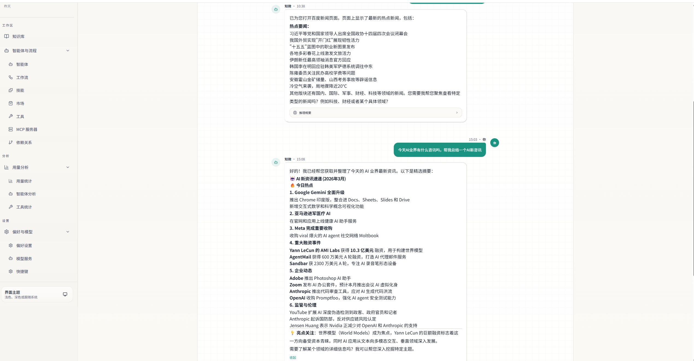
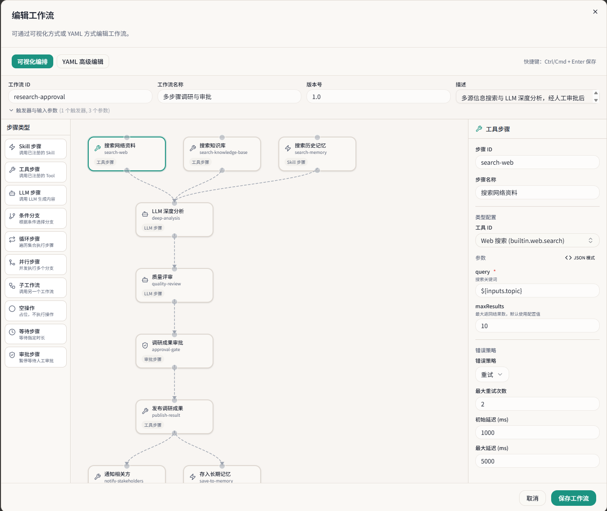
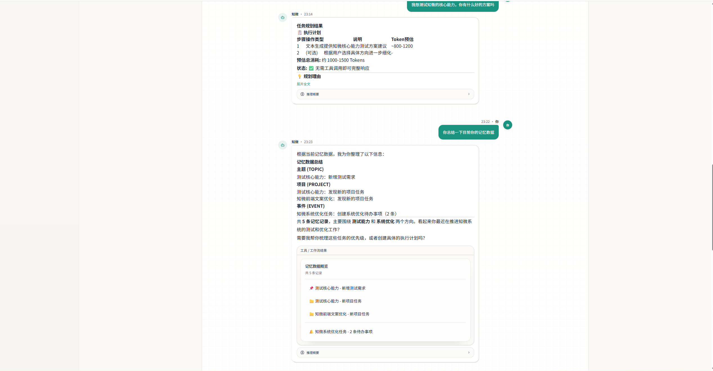

# ZhiWei（知微）

> 见微知著，你的 AI 伙伴

[](https://adoptium.net/)
[](https://spring.io/projects/spring-boot)
[](https://spring.io/projects/spring-ai)
[](LICENSE)

ZhiWei 是一个本地运行的个人 AI Agent 助手。它不只是被动执行用户命令，而是具备主动智能能力——观察用户的行为模式，主动提供建议和帮助。所有数据存储在本地，隐私完全由你掌控。

## ✨ 核心特性

### 🧠 四层认知记忆系统
- L1 工作记忆（当前对话上下文）+ L2 情景记忆（历史对话和事件）
- L3 语义记忆（知识和概念提取）+ L4 程序记忆（学习到的技能和流程）
- 时序知识图谱：实体和关系带时间维度，支持时间旅行查询
- 记忆巩固管线（情景→语义 / 情景→程序）+ MaRS 认知遗忘策略

### 🤖 Agent 引擎
- AgentLoop 控制循环 + StateReducer 纯函数状态转换
- ContextAssembler 上下文组装（记忆检索 + 对话压缩 + Token 预算动态分配）
- 主动推理引擎：两阶段推理（规则快速过滤 + LLM 精细判断）+ 智能降频

### 🔀 多 LLM 智能路由
- 场景路由：根据任务类型自动选择最佳模型
- 熔断器 + 故障转移 + 语义缓存
- 支持 DeepSeek / OpenAI / 通义千问 / Ollama（本地）等多家服务商
- LLM 服务商通过 Web UI 管理，运行时动态配置

### 🎯 Skill 技能系统
- 四源 Skill：Builtin / UserDefined / Marketplace / AutoGenerated + MCP 外部工具
- Skill 自扩展：Agent 运行时自动检测能力缺口，生成 YAML Skill
- YAML Skill 运行时热加载，修改即时生效
- 内置 Skill：待办管理 / 日程管理 / 习惯追踪 / 记忆查询 / 通用数据存储

### 📚 知识库管理
- 多格式文档解析（PDF / Word / Markdown / TXT）
- 多分块策略（固定大小 / 语义 / 标题）
- 混合检索（向量 + FTS5 全文 + 知识图谱遍历）+ 可选 Reranker 精排

### 🔌 MCP 协议支持
- 完整的 MCP Client + Server 实现
- 双向桥接：内置工具可暴露为 MCP Tool
- 接入 filesystem、browser、github 等 MCP Server

### 🤝 多 Agent 协作
- AgentRegistry + AgentDefinition 注册管理
- HandoffTool 委托工具模式，SubAgent 独立预算和上下文
- 预设专家 Agent（写作 / 分析 / 调研）

### 🔄 工作流引擎
- YAML 声明式工作流定义
- 多种触发器：Cron / Event / Condition / Signal
- 工作流状态持久化 + 崩溃恢复

### 🔔 统一通知系统
- 独立 NotificationService 接口，主动推理 / 工作流 / 未来模块统一调用
- Urgency 路由：HIGH/MEDIUM 实时多渠道广播，LOW 入队被动队列定时推送
- 富媒体支持：文本 / Markdown / 交互式卡片 / 图片，各渠道自动适配渲染
- 被动队列 SQLite 持久化，重启不丢失
- 通知管理 API：历史查询、已读标记、用户通知偏好设置

### 🌐 Gateway 中间件
- 6 层中间件管道（Auth → RateLimit → Security → Router → Execution → Audit）
- Channel 适配器：企业微信 / 钉钉 / 飞书 / Telegram

### 🎨 多模态能力
- 图片 / 文档 / 音频 / 视频处理
- MultimodalRouter 自动路由到支持多模态的 LLM

### 🛡️ 代码执行沙箱
- Process / Docker 双模式沙箱
- CodeValidator 危险操作预检 + 护栏集成

### 🔍 可观测性
- Trace 级完整追踪，每个决策可追溯和回放
- 护栏引擎：自动检测和阻止高风险操作
- DataRedactor 敏感信息自动脱敏
- Agentic Evals 评估框架：五维规则评估 + LLM-as-a-Judge

### 🔗 协议支持
- A2A 协议：Agent Card 能力声明 + 跨系统 Agent 互操作
- 插件市场：Skill / Agent / Workflow 发布与安装

### 🔄 外部数据源同步
- CalDAV / Todoist / 滴答清单 / Obsidian 连接器
- 冲突解决策略（Last-Write-Wins / 用户确认）

### 🖥️ Web UI
- Vue 3 SPA，27 个页面视图
- SSE 流式对话 + A2UI Generative UI 渲染

### 📦 通用数据存储
- Schema-Free JSON 文档持久化，三种集合类型（Document / Note / Metric）
- 可选属性定义：声明后获得类型校验 + SQLite Generated Column 索引加速
- 7 个 Agent 工具：集合 CRUD + 文档 CRUD + 时序聚合
- FTS5 全文搜索（Note 类型）+ 时序聚合分析（Metric 类型）

### 🏠 本地优先架构
- 所有数据存储在本地 `~/.zhiwei/`
- SQLite + sqlite-vec，零外部服务依赖
- 单 JAR 部署，开箱即用

## 📸 界面预览

<!-- TODO: 添加实际截图 -->




## 🚀 快速开始

### 方式一：Docker Compose（推荐）

```bash
git clone https://github.com/your-username/zhiwei.git
cd zhiwei

# 配置环境变量（至少填入一个 LLM API Key）
cp .env.example .env
# 编辑 .env，填入 DEEPSEEK_API_KEY 或 OPENAI_API_KEY

# 启动
docker compose up -d

# 访问 http://localhost
```

### 方式二：JAR 包手动启动

前置条件：Java 22+（[下载地址](https://adoptium.net/)）

```bash
git clone https://github.com/your-username/zhiwei.git
cd zhiwei

# 1. 构建后端
mvn clean package -DskipTests

# 2. 启动后端
./start.sh          # Linux / macOS
start.bat           # Windows
# 后端默认监听 8080 端口，可通过 ZHIWEI_PORT 环境变量自定义

# 3. 构建并启动前端
cd zhiwei-web
npm install
npm run dev
# 访问 http://localhost:5173
```

### 首次使用

1. 启动后访问 Web UI
2. 进入「设置 → 模型管理」页面，配置至少一个 LLM 服务商
3. 回到对话页面，开始与 ZhiWei 交互

> LLM 服务商配置已迁移到数据库，通过 Web UI 管理，无需手动编辑 application.yml。
> 环境变量（如 `DEEPSEEK_API_KEY`）仅用于 Docker 部署时的初始化注入。

## 📋 配置说明

### 环境变量

敏感信息通过环境变量注入，不要硬编码在配置文件中：

```bash
# LLM 服务商 API Key（至少配置一个）
export DEEPSEEK_API_KEY=your-key
export OPENAI_API_KEY=your-key
export QWEN_API_KEY=your-key

# 可选
export SEARCH_API_KEY=your-key
export RERANKER_API_KEY=your-key
```

### 自定义端口

```bash
# 后端端口（默认 8080）
export ZHIWEI_PORT=9090

# Docker 部署时前端端口（默认 80）
export ZHIWEI_WEB_PORT=3000
```

### Docker 部署配置

Docker Compose 使用 `.env` 文件管理环境变量，参考 `.env.example` 模板。

后端 JVM 参数可通过 `JAVA_OPTS` 环境变量覆盖（默认 `-Xmx512m -Xms256m -XX:+UseG1GC`）。

## 🛠️ 技术栈

| 层级 | 技术 | 版本 | 说明 |
|------|------|------|------|
| 语言 | Java | 22 | Record / Sealed / Pattern Matching / Virtual Thread |
| 框架 | Spring Boot | 3.5.3 | Web、自动配置、Actuator |
| AI 集成 | Spring AI | 1.1.2 | Advisor 模式、MCP 支持、结构化输出 |
| 构建 | Maven | 3.9.x | 依赖管理 |
| 数据库 | SQLite | 3.49+ | WAL 模式、FTS5 全文索引 |
| 向量存储 | sqlite-vec | 0.1.x | SQLite 原生向量扩展 |
| 数据库迁移 | Flyway | 10.x | 版本化 Schema 管理 |
| 前端 | Vue 3 + Vite | 3.5 / 6.x | TypeScript SPA |
| 状态管理 | Pinia | 3.x | Vue 3 状态管理 |
| UI 组件 | Reka UI + Tailwind CSS | 2.x / 4.x | 无头组件 + 原子化 CSS |
| 图表 | ECharts + vue-echarts | 6.x / 8.x | 数据可视化 |
| 测试 | JUnit 5 + jqwik | 5.11+ / 1.9.x | 单元测试 + 属性测试 |
| 前端测试 | Vitest + fast-check | 3.x / 4.x | 前端单元测试 + 属性测试 |

## 📁 项目结构

```
zhiwei/
├── src/main/java/com/lifepilot/
│   ├── a2a/             # A2A 协议（Agent-to-Agent 互操作）
│   ├── agent/           # Agent 引擎（AgentLoop / StateReducer / ContextAssembler）
│   ├── config/          # 全局配置
│   ├── conversation/    # 对话管理
│   ├── datastore/       # 通用数据存储（Schema-Free JSON 文档 / 全文搜索 / 时序聚合）
│   ├── eval/            # Agentic Evals 评估框架
│   ├── guardrail/       # 护栏引擎（风险检测 / 数据脱敏）
│   ├── interaction/     # 交互层（Web / CLI）
│   ├── knowledge/       # 知识库管理（文档解析 / 分块 / 检索）
│   ├── llm/             # LLM 路由（多服务商 / 熔断 / 故障转移）
│   ├── marketplace/     # 插件市场
│   ├── mcp/             # MCP 协议（Client / Server / 桥接）
│   ├── media/           # 多模态处理
│   ├── memory/          # 四层记忆系统 + 知识图谱
│   ├── meta/            # 元能力（主动推理 / 信号采集）
│   ├── multiagent/      # 多 Agent 协作
│   ├── notification/    # 统一通知系统（Urgency 路由 / 多渠道广播 / 被动队列）
│   ├── observability/   # 可观测性（Trace / 评估）
│   ├── prompt/          # Prompt 管理
│   ├── sandbox/         # 代码执行沙箱
│   ├── skill/           # Skill 系统（注册 / 搜索 / 自扩展）
│   ├── sync/            # 外部数据源同步
│   ├── tool/            # 工具系统（ToolContract / DynamicToolRegistry）
│   └── workflow/        # 工作流引擎
├── src/main/resources/
│   ├── application.yml          # 主配置
│   ├── application-docker.yml   # Docker 环境配置
│   └── db/migration/            # Flyway 迁移脚本
├── zhiwei-web/                  # 前端项目（Vue 3 + Vite + Pinia）
│   ├── src/views/               # 27 个页面视图
│   ├── src/components/          # Vue 组件
│   ├── src/stores/              # Pinia 状态管理
│   └── Dockerfile               # 前端 Docker 构建（Nginx）
├── docker-compose.yml           # Docker Compose 编排
├── Dockerfile                   # 后端 Docker 构建（多阶段）
├── start.sh / start.bat         # 一键启动脚本
├── .env.example                 # 环境变量模板
└── docs/                        # 项目文档
```

## ⚠️ 已知限制

- 需要配置至少一个 LLM 服务商（DeepSeek / OpenAI / Ollama 等）才能使用对话功能
- 单用户设计，不支持多用户账户和权限隔离
- SQLite 存储，适合个人使用场景，不支持集群部署
- 详细限制说明请参阅 [已知限制文档](docs/KNOWN-LIMITATIONS.md)

## 🗺️ 后续计划

### 短期目标
- Web UI 功能页面完善（知识库管理、Skill/MCP 管理、轨迹回放、工作流管理等页面）
- 性能优化：引入缓存机制减少 Token 消耗，缩短首字响应时间

### 中长期目标
- Agentic GraphRAG：用图检索 Skill 替代 SQL CTE 穷举遍历，提升知识图谱查询效率
- Idle-Driven 记忆巩固：空闲事件驱动替代定时触发，更智能的记忆管理
- GraalVM native image：探索原生编译，消除 Java 运行时依赖
- docs 目录下的架构文档和特性文档全面整理更新

## 🧪 开发指南

### 本地开发

```bash
# 克隆项目
git clone https://github.com/your-username/zhiwei.git
cd zhiwei

# 后端（Maven 自动下载依赖）
mvn clean install -DskipTests

# 前端
cd zhiwei-web
npm install

# 启动后端开发服务器
mvn spring-boot:run

# 启动前端开发服务器（新终端）
cd zhiwei-web
npm run dev
```

### 运行测试

```bash
# 后端测试
mvn test

# 前端测试
cd zhiwei-web
npm run test:run
```

### 构建发布

```bash
# 构建后端 JAR（产出 target/zhiwei.jar）
mvn clean package -DskipTests

# 构建前端（产出 zhiwei-web/dist/）
cd zhiwei-web
npm run build
```

## 🤝 贡献指南

1. Fork 本仓库
2. 创建特性分支 (`git checkout -b feature/your-feature`)
3. 提交更改 (`git commit -m 'feat: 添加某功能'`)
4. 推送到分支 (`git push origin feature/your-feature`)
5. 开启 Pull Request

### 代码规范

- Java 22 特性优先：Record、Sealed Class、Pattern Matching、Virtual Thread
- 中文注释、中文日志、中文测试方法名
- 提交消息格式：`<type>(<scope>): <中文描述>`
- 提交前运行 `mvn clean test` 确保测试通过

## 📄 许可证

本项目采用 [MIT License](LICENSE) 许可证。

## 🙏 致谢

- [Spring AI](https://spring.io/projects/spring-ai) — AI 原生集成框架
- [MCP](https://modelcontextprotocol.io/) — Model Context Protocol 标准
- [A2A](https://google.github.io/A2A/) — Agent-to-Agent 协议
- [OpenClaw](https://github.com/openclaw/openclaw) — 参考了部分架构设计
- [AstrBot](https://github.com/astrbot/astrbot) — 参考了部分设计理念

---

ZhiWei（知微）— 见微知著，你的 AI 伙伴

本地运行 · 隐私优先 · 越用越懂你
