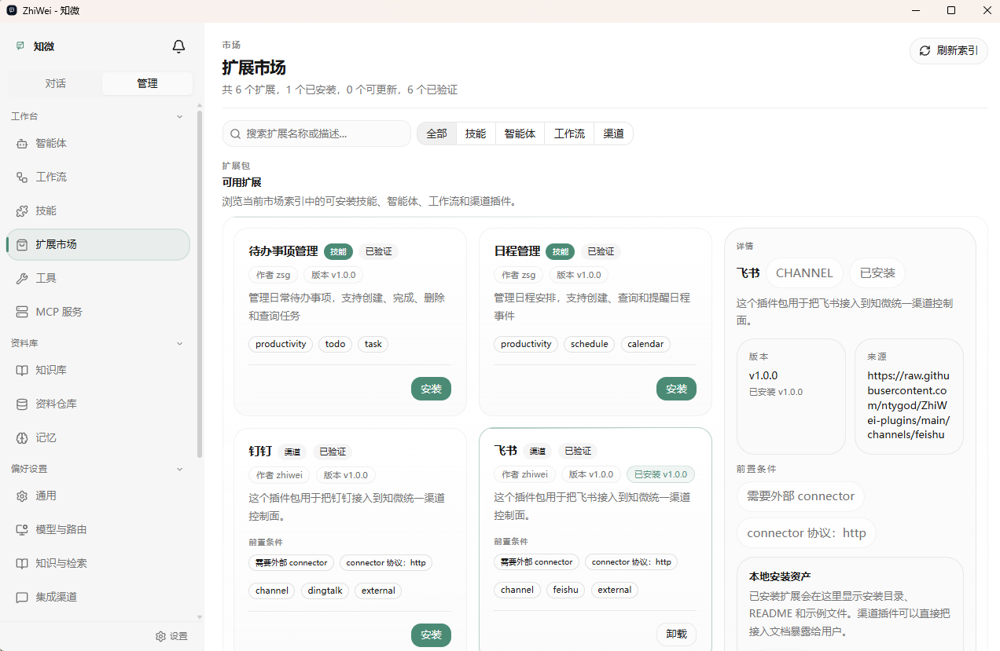
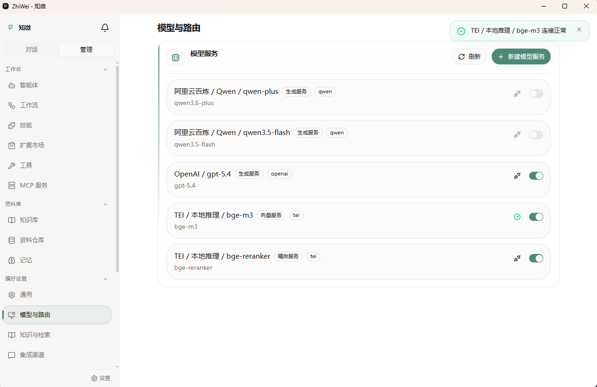
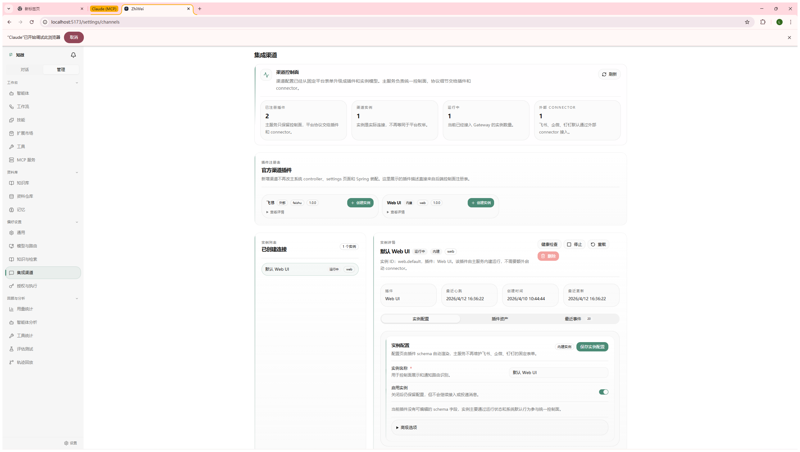

# ZhiWei（知微）

> 见微知著，你的 AI 伙伴

[](https://github.com/ntygod/ZhiWei/releases)
[](https://github.com/ntygod/ZhiWei/releases)
[](https://github.com/ntygod/ZhiWei/releases)
[](#方式二docker-compose)
[](https://github.com/ntygod/ZhiWei/actions/workflows/ci.yml)
[](LICENSE)

ZhiWei 是一个自托管的 AI Agent 系统。它不只是聊天机器人——拥有四层认知记忆、自主任务执行、工作流引擎和插件市场。所有数据存储在本地，隐私完全掌控。

**下载桌面客户端，安装即用** — 无需 Java、Docker 或任何开发环境：

> [**Windows (.msi)**](https://github.com/ntygod/ZhiWei/releases) · [**macOS (.dmg)**](https://github.com/ntygod/ZhiWei/releases) · [**Linux (.AppImage)**](https://github.com/ntygod/ZhiWei/releases)


## ✨ 核心特性

### 越用越懂你 — 四层认知记忆

| 层级 | 名称 | 作用 |
|------|------|------|
| L1 | 工作记忆 | 当前会话的临时上下文 |
| L2 | 情景记忆 | 完整对话记录 + 注入来源 |
| L3 | 语义记忆 | 知识实体 + 关系网络 + 重要性评分 |
| L4 | 程序记忆 | 技能模板 + 用户偏好规则 |

记忆自动巩固：对话中提取的知识经过经验学习、对比分析和遗忘衰减，高频经验自动提升为可复用的技能模板。混合检索（向量 + FTS5 + 时序）确保最相关的记忆被召回。

### 不只是聊天 — Agent 引擎

- **ReAct 循环**：思考 → 工具调用 → 观察 → 回答，完全可追溯
- **33 个内置技能**：记忆管理 / 定时任务 / 浏览器自动化 / 代码沙箱 / 数据分析 / 知识检索
- **挂起与恢复**：等待用户确认、工作流完成、定时唤醒、外部数据就绪时自动挂起，条件满足后恢复
- **Skill 自扩展**：运行时检测能力缺口，自动生成新技能

### 用你想用的模型 — 多 LLM 智能路由

- 生成 / 向量 / 精排 / 多模态四路独立路由
- Web UI 管理模型服务，支持启用切换和连接测试
- 熔断器 + 指数退避故障转移 + 语义缓存

### 扩展你想要的能力

- **知识库**：PDF / Word / Markdown 解析 → 分块 → 混合检索 → 可选 Reranker 精排
- **MCP 协议**：一键接入 MCP 工具生态
- **工作流引擎**：YAML 声明式定义 + cron / event / manual 触发
- **多 Agent 协作**：Markdown 定义 Agent 蓝图，spawn_workers 并行派发
- **扩展市场**：Skill / Agent / 工作流 / 渠道插件一键安装

### 多渠道触达

- **Web UI**：Vue 3 SPA，SSE 流式对话 + 实时通知
- **桌面端**：Tauri 2.x 跨平台客户端（Windows / macOS / Linux），内嵌 JRE
- **企业 IM**：飞书 / 钉钉 / 企微 / QQ 机器人，插件式加载

### 安全与可观测

- **权限**：工具调用分级授权（会话 / 工作区 / 任务 / 长期），高风险操作需确认
- **护栏**：内容安全 + 敏感数据脱敏 + 代码沙箱（Process / Docker 双模式）
- **可观测**：完整轨迹追踪 + 决策回放 + Agentic Evals 评估框架
- **Gateway**：6 层中间件管道（认证 → 限流 → 安全 → 路由 → 执行 → 审计）

### 本地优先，隐私掌控

- 所有数据存储在 `~/.zhiwei/`，不上传云端
- SQLite（WAL 模式）+ sqlite-vec 向量扩展，零外部服务依赖
- 单 JAR 部署，开箱即用

## 📸 界面预览

> 以下截图展示最新版 UI。完整页面清单见[项目结构](#-项目结构)。

<table>
<tr>
<td width="50%">

**对话** — SSE 流式输出 + 思考链展示 + 消息编辑重发


</td>
<td width="50%">

**扩展市场** — 一键安装 Skill / Agent / 工作流 / 渠道插件


</td>
</tr>
<tr>
<td>

**记忆管理** — 实体 / 关系 / 对话 / 模板 / 偏好 / 遗忘日志


</td>
<td>

**模型路由** — 多服务商管理 + 启用切换 + 连接测试


</td>
</tr>
<tr>
<td>

**工作流** — YAML 声明式定义 + DAG 可视化


</td>
<td>

**渠道管理** — 飞书 / 钉钉 / 企微 / QQ 插件式接入


</td>
</tr>
<tr>
<td colspan="2">

**轨迹回放** — 每个 Agent 决策步骤可追溯、可回放


</td>
</tr>
</table>

<!-- 
📌 截图更新指引：
1. 用浏览器 1280×800 窗口大小截图，保持一致比例
2. 替换 docs/images/ 下对应文件名即可
3. 新增截图文件：marketplace.png, model-services.png, channels.png
4. 可选补充：agent-detail.png, knowledge-base.png, mcp-servers.png
-->

## 🚀 快速开始

### 方式一：桌面客户端（推荐）

从 [Releases](https://github.com/ntygod/ZhiWei/releases) 下载对应平台安装包，双击安装即可。

- 内嵌 JRE，**无需安装 Java、Docker 或任何开发环境**
- 首次启动进入设置向导，引导配置 LLM 服务商
- 后端进程自动管理，系统托盘常驻

| 平台 | 安装包 | 说明 |
|------|--------|------|
| Windows | `.msi` | 双击安装，开始菜单启动 |
| macOS | `.dmg` | 拖入 Applications |
| Linux | `.AppImage` / `.deb` | 直接运行或 dpkg 安装 |

### 方式二：Docker Compose

适合服务器部署或已有 Docker 环境的用户：

```bash
git clone https://github.com/ntygod/ZhiWei.git && cd ZhiWei
cp .env.example .env   # 编辑 .env，填入 LLM API Key
docker compose up -d   # 访问 http://localhost
```

### 方式三：源码构建

前置条件：Java 22+、Node.js 18+

```bash
git clone https://github.com/ntygod/ZhiWei.git && cd ZhiWei
mvn clean package -DskipTests    # 构建后端
cd zhiwei-web && npm install     # 安装前端依赖

# 启动（两个终端）
mvn spring-boot:run              # 后端 :8080
npm run dev                      # 前端 :5173
```

### 首次使用

1. 进入「设置 → 模型与路由」，配置至少一个 LLM 服务商（支持 DeepSeek / OpenAI / 通义千问 / Ollama 等）
2. 回到对话页面，开始与 ZhiWei 交互

> 模型配置通过 Web UI 管理，无需手动编辑配置文件。

## 📋 配置说明

### 环境变量

敏感信息通过环境变量注入，不要硬编码在配置文件中：

```bash
# LLM 服务商 API Key（至少配置一个）
export DEEPSEEK_API_KEY=your-key
export OPENAI_API_KEY=your-key
export QWEN_API_KEY=your-key

# 可选
export SEARCH_API_KEY=your-key
export RERANKER_API_KEY=your-key
```

### 自定义端口

```bash
# 后端端口（默认 8080）
export ZHIWEI_PORT=9090

# Docker 部署时前端端口（默认 80）
export ZHIWEI_WEB_PORT=3000
```

### Docker 部署配置

Docker Compose 使用 `.env` 文件管理环境变量，参考 `.env.example` 模板。

后端 JVM 参数可通过 `JAVA_OPTS` 环境变量覆盖（默认 `-Xmx512m -Xms256m -XX:+UseG1GC`）。

## 🛠️ 技术栈

| 层级 | 技术 | 版本 | 说明 |
|------|------|------|------|
| 语言 | Java | 22 | Record / Sealed / Pattern Matching / Virtual Thread |
| 框架 | Spring Boot | 3.5.12 | Web、自动配置、Actuator |
| AI 集成 | Spring AI | 1.1.3 | Advisor 模式、MCP 支持、结构化输出 |
| 构建 | Maven | 3.9.x | 依赖管理 |
| 数据库 | SQLite (xerial) | 3.49+ | WAL 模式、FTS5 全文索引 |
| 向量存储 | sqlite-vec | 0.1.x | SQLite 原生向量扩展 |
| 数据库迁移 | Flyway | 10.x | 版本化 Schema 管理 |
| 前端 | Vue 3 + Vite | 3.5 / 6.x | TypeScript SPA |
| 状态管理 | Pinia | 3.x | Vue 3 状态管理 |
| UI 组件 | Reka UI + Tailwind CSS | 2.x / 4.x | 无头组件 + 原子化 CSS |
| 图表 | ECharts + vue-echarts | 6.x / 8.x | 数据可视化 |
| 浏览器自动化 | Playwright | 1.58 | 可选依赖，运行时检测 |
| 多媒体 | JavaCV + FFmpeg | 1.5.13 / 6.1.1 | 视频帧提取 / 音轨分离 |
| 文档与内容解析 | PDFBox + POI + Tika + Jsoup | 3.0.7 / 5.3.0 / 3.3.0 / 1.22.1 | PDF / Word / MIME / HTML 解析 |
| 测试 | JUnit 5 + jqwik | 5.11+ / 1.9.2 | 单元测试 + 属性测试 |
| 桌面端 | Tauri | 2.x | Rust 驱动的跨平台桌面壳，内嵌 JRE 管理 |
| 前端测试 | Vitest + fast-check | 3.x / 4.x | 前端单元测试 + 属性测试 |

## 📁 项目结构

```
ZhiWei/
├── .github/                         # GitHub Actions（CI / 桌面端构建）、Issue/PR 模板、Dependabot
├── src/main/java/com/lifepilot/     # 按领域拆分的后端模块
│   ├── a2a/             # A2A 协议（Agent-to-Agent 互操作）
│   ├── agent/           # Agent 引擎（ReactAgentLoop / ContextAssembler / 挂起恢复）
│   ├── config/          # 全局配置
│   ├── conversation/    # 对话管理
│   ├── datastore/       # 通用数据存储（Schema-Free JSON / 全文搜索 / 时序聚合）
│   ├── eval/            # Agentic Evals 评估框架
│   ├── interaction/     # 交互层（Web API / CLI / Gateway 中间件）
│   ├── knowledge/       # 知识库管理（文档解析 / 分块 / 检索 / Reranker）
│   ├── llm/             # LLM 基础设施（CircuitBreaker / SemanticCache / Provider 适配）
│   ├── generation/      # 生成路由（GenerationRouter）
│   ├── embedding/       # 向量嵌入路由（EmbeddingRouter）
│   ├── rerank/          # 重排序路由（RerankRouter）
│   ├── modelservice/    # 模型服务注册（ModelServiceRegistry）
│   ├── marketplace/     # 扩展市场（Extension Marketplace）
│   ├── mcp/             # MCP 协议（McpServerRegistry / McpServerDiscovery）
│   ├── media/           # 多模态处理（图片 / 音频 / 视频）
│   ├── memory/          # 四层记忆系统（Working / Episodic / Semantic / Procedural / 经验学习）
│   ├── meta/            # 元能力（文件工具 / 浏览器工具 / 基础设施工具 / 交互工具）
│   ├── multiagent/      # 多 Agent 协作（spawn_workers / AgentExecutor）
│   ├── notification/    # 统一通知系统（直接投递 / 历史 / SSE）
│   ├── observability/   # 可观测性（TraceRecorder / GuardrailEngine / DataRedactor）
│   ├── permission/      # 工具授权（作用域匹配 / 预授权 / 授权记录）
│   ├── prompt/          # Prompt 模板管理
│   ├── sandbox/         # 代码执行沙箱（Process / Docker 双模式）
│   ├── scheduler/       # 定时任务（ScheduledTaskService / TaskScheduler）
│   ├── skill/           # Skill 系统（注册 / 验证 / 激活 / 生成 / SkillToToolBridge）
│   ├── tool/            # 工具系统（ToolContract / DynamicToolRegistry / ToolBridge）
│   └── workflow/        # 工作流引擎（DAG 调度 / 表达式）
├── src/main/resources/
│   ├── application.yml          # 主配置
│   ├── application-docker.yml   # Docker 环境配置
│   ├── db/migration/            # Flyway 迁移脚本
│   ├── builtin-workflows/       # 内置工作流
│   ├── prompts/                 # Prompt 模板
│   ├── skills/                  # 内置 Skill 定义
│   └── eval-scenarios/          # 评估场景定义
├── zhiwei-web/                  # 前端项目（Vue 3 + Vite + Pinia）
│   ├── src/views/               # 30+ 页面视图
│   ├── src/components/          # Vue 组件
│   ├── src/stores/              # Pinia 状态管理
│   ├── src/composables/         # 组合式函数
│   ├── src/api/                 # 前端 API 客户端
│   └── src-tauri/               # Tauri 2.x 桌面端（Rust）
│       ├── src/                 # Rust 源码（JavaManager / HealthCheck / Tray / Commands）
│       ├── capabilities/        # Tauri 权限声明
│       ├── icons/               # 各平台应用图标
│       └── tauri.conf.json      # Tauri 配置
├── docker-compose.yml           # Docker Compose 编排
├── Dockerfile                   # 后端 Docker 构建（多阶段）
├── scripts/                     # 构建脚本（桌面端打包 / jlink 模块列表）
├── start.sh / start.bat         # 一键启动脚本
├── .env.example                 # 环境变量模板
├── CONTRIBUTING.md              # 贡献指南
├── CODE_OF_CONDUCT.md           # 社区行为准则
├── SUPPORT.md                   # 提问与支持说明
├── SECURITY.md                  # 安全策略
├── ARCHITECTURE-DIAGRAMS.md     # 架构可视化（14 节 Mermaid 图）
└── docs/                        # 项目文档
    ├── ARCHITECTURE.md          # 架构总览
    ├── FEATURES.md              # 特性总览
    ├── README.md                # 文档目录说明
    ├── API_ENDPOINTS.md         # API 端点文档
    ├── API_STANDARD.md          # API 设计规范
    ├── architecture/            # 各模块架构设计文档
    ├── features/                # 各模块特性设计文档
    └── guides/                  # 使用指南
```

## ⚠️ 已知限制

- 需要配置至少一个 LLM 服务商（DeepSeek / OpenAI / Anthropic / Ollama 等）才能使用对话功能
- 单用户设计，不支持多用户账户和权限隔离
- SQLite 存储，适合个人使用场景，不支持集群部署
- Playwright 浏览器自动化为可选依赖，需用户自行安装 driver-bundle
- 详细限制说明请参阅 [已知限制文档](docs/KNOWN-LIMITATIONS.md)

## 🗺️ 后续计划

### 短期目标

- [ ] 性能优化：缓存机制优化，缩短首字响应时间（TTFT）
- [ ] 移动端适配
- [x] ~~桌面客户端：Tauri 2.x 跨平台桌面端（已完成）~~

### 中期目标

- [ ] Agentic GraphRAG：用图检索 Skill 替代 SQL CTE 穷举遍历
- [ ] Idle-Driven 记忆巩固：空闲事件驱动替代定时触发
- [ ] 多语言支持

### 长期目标

- [ ] GraalVM native image：探索原生编译，消除 Java 运行时依赖
- [ ] 插件市场完善：支持社区共享
- [ ] 语音交互：TTS / STT 集成

## 🧪 开发指南

### 本地开发

```bash
# 克隆项目
git clone https://github.com/ntygod/ZhiWei.git
cd ZhiWei

# 后端（Maven 自动下载依赖）
mvn clean install -DskipTests

# 前端
cd zhiwei-web
npm install

# 启动后端开发服务器
mvn spring-boot:run

# 启动前端开发服务器（新终端）
cd zhiwei-web
npm run dev
```

### 运行测试

```bash
# 后端测试
mvn test

# 前端测试
cd zhiwei-web
npm run test:run
```

### 构建发布

```bash
# 构建后端 JAR（产出 target/zhiwei.jar）
mvn clean package -DskipTests

# 构建前端（产出 zhiwei-web/dist/）
cd zhiwei-web
npm run build

# 构建桌面安装包（需要 Rust 工具链）
scripts/build-desktop.sh     # Linux / macOS
scripts\build-desktop.bat    # Windows
```

### 编码规范

- Java 22 特性优先：Record、Sealed Interface、Pattern Matching、Virtual Thread
- 中文注释、中文日志、中文测试方法名
- 提交消息格式：`<type>(<scope>): <中文描述>`
- 数据载体优先使用 `record`，类型层次使用 `sealed interface`
- 业务可调参数通过 `@ConfigurationProperties` 外部化，禁止硬编码
- 提交前运行 `mvn clean test` 确保测试通过

## 🌱 开源协作

- 贡献流程请看 [CONTRIBUTING.md](CONTRIBUTING.md)
- 行为准则请看 [CODE_OF_CONDUCT.md](CODE_OF_CONDUCT.md)
- 使用问题与反馈入口请看 [SUPPORT.md](SUPPORT.md)
- 安全问题请通过 [SECURITY.md](SECURITY.md) 指定方式反馈
- 第一次维护开源仓库可参考 [GitHub 仓库维护指南](docs/guides/github-maintainer-guide.md)
- 日常 `git` / `gh` 命令与 PR 流程可参考 [Git 与 GitHub CLI 速查表](docs/guides/git-gh-guide.md)
- 日常版本发布可参考 [Release 发布指南](docs/guides/release-guide.md)
- 仓库已补齐 GitHub Actions、Issue/PR 模板和 Dependabot，适合作为个人开源项目的基础骨架继续维护

## 🤝 贡献指南

1. Fork 本仓库
2. 创建分支（推荐 `feature/{name}` 或 `bugfix/{name}`）
3. 提交更改（提交格式：`<type>(<scope>): 中文描述`）
4. 推送分支并发起 Pull Request
5. 按模板补齐验证步骤、截图和影响说明

## ❓ FAQ

### ZhiWei 是什么？

ZhiWei（知微）是一个本地运行的 AI Agent 助手，具备自主任务执行能力，可以帮助你管理知识、提供自动化工作流能力。

### 需要付费吗？

ZhiWei 本身免费开源，但需要自备 LLM API Key（如 DeepSeek、OpenAI 等）。也可以使用 Ollama 运行本地模型，完全免费。

### 数据存储在哪里？

所有数据存储在本地 SQLite 数据库（`~/.zhiwei/`），不上传云端，保护隐私。

### 支持哪些 LLM？

支持 DeepSeek、OpenAI、Anthropic Claude、通义千问、Ollama（本地）等多种 LLM Provider。通过 ModelServiceRegistry 数据库管理，Web UI 可视化配置。

### 如何自定义 Skill？

在 `~/.zhiwei/skills/` 目录下创建 Markdown 文件即可定义自定义 Skill，支持热加载。Skill 定义使用 YAML Frontmatter + Markdown 格式。

## 🔧 故障排查

### 启动失败，提示数据库错误

1. 检查 `~/.zhiwei/` 目录是否有读写权限
2. 删除数据库文件重新启动：`rm -rf ~/.zhiwei/*.db`

### LLM 调用失败

1. 检查 API Key 是否正确配置
2. 确认网络可以访问 LLM 服务商
3. 查看日志中的具体错误信息
4. 检查 CircuitBreaker 是否已熔断（日志中搜索「熔断器触发」）

### 工具调用超时

1. 检查 `application.yml` 中的超时配置
2. 对于复杂工具调用，可适当增加超时时间

### 前端页面空白

1. 检查前端是否正确构建：`cd zhiwei-web && npm run build`
2. 检查浏览器控制台是否有 JavaScript 错误
3. 确认后端服务正常运行在 8080 端口

## 📄 许可证

本项目采用 [MIT License](LICENSE) 许可证。

## 🙏 致谢

- [Spring AI](https://spring.io/projects/spring-ai) — AI 原生集成框架
- [MCP](https://modelcontextprotocol.io/) — Model Context Protocol 标准
- [A2A](https://google.github.io/A2A/) — Agent-to-Agent 协议

---

ZhiWei（知微）— 见微知著，你的 AI 伙伴

本地运行 · 隐私优先 · 越用越懂你
