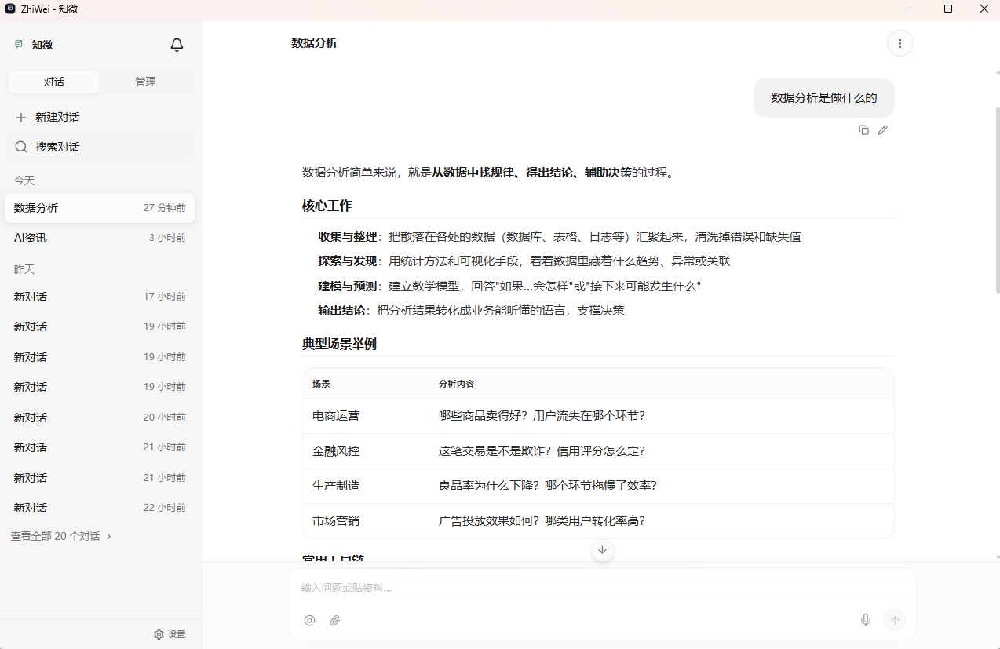
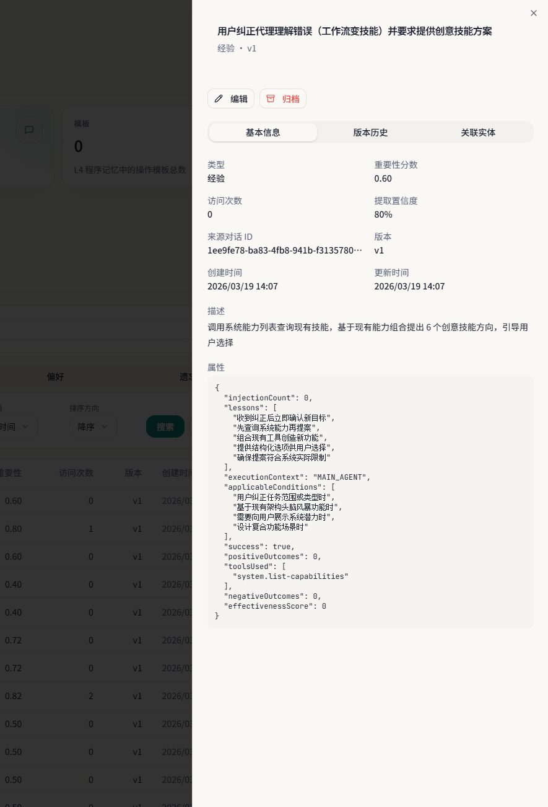
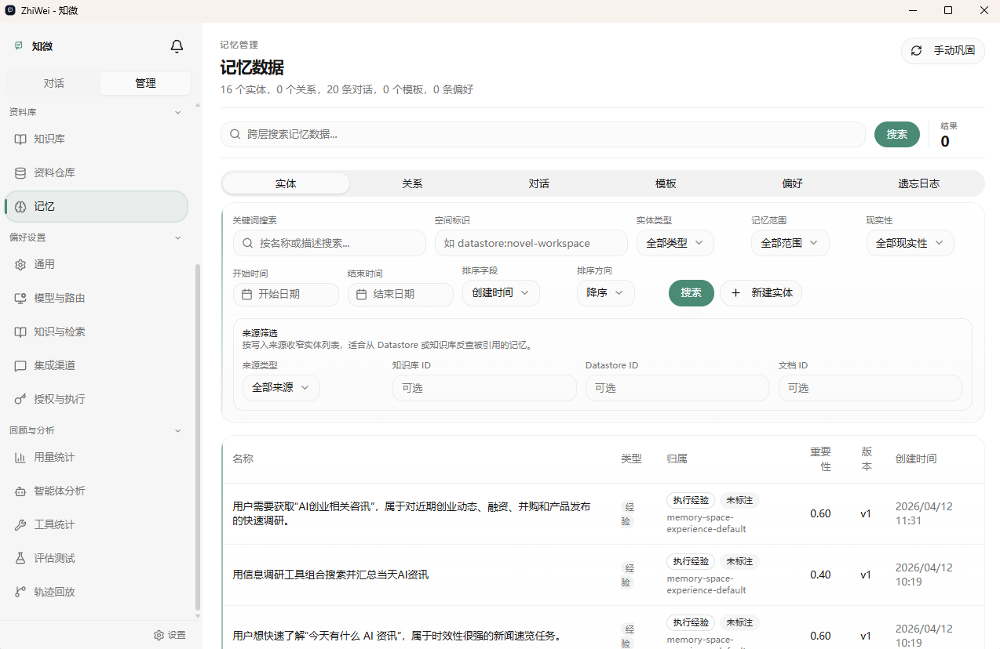
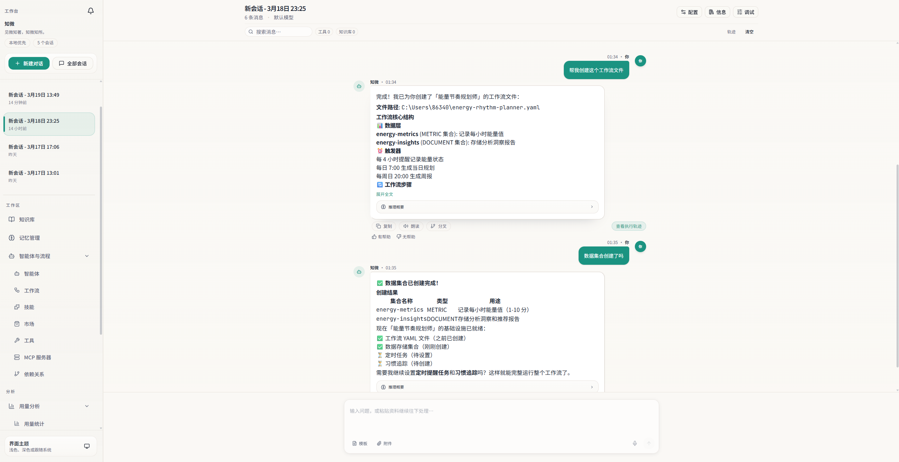
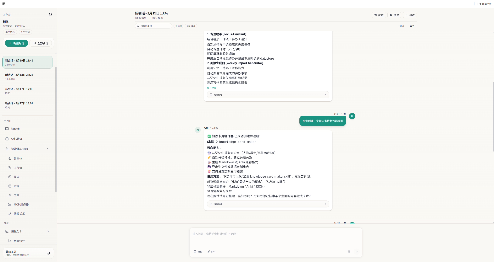
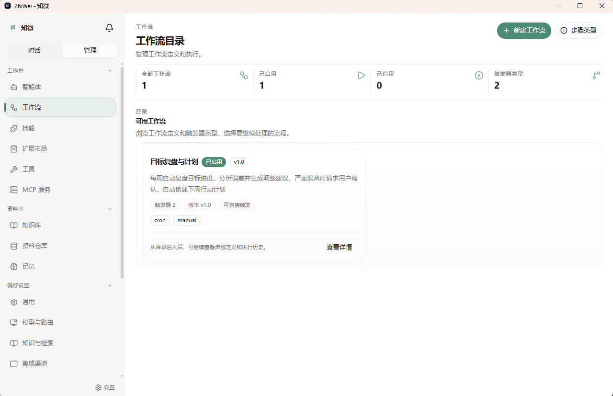
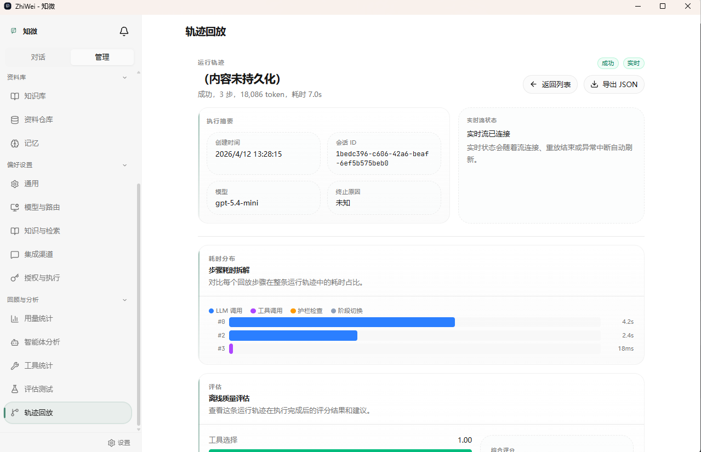
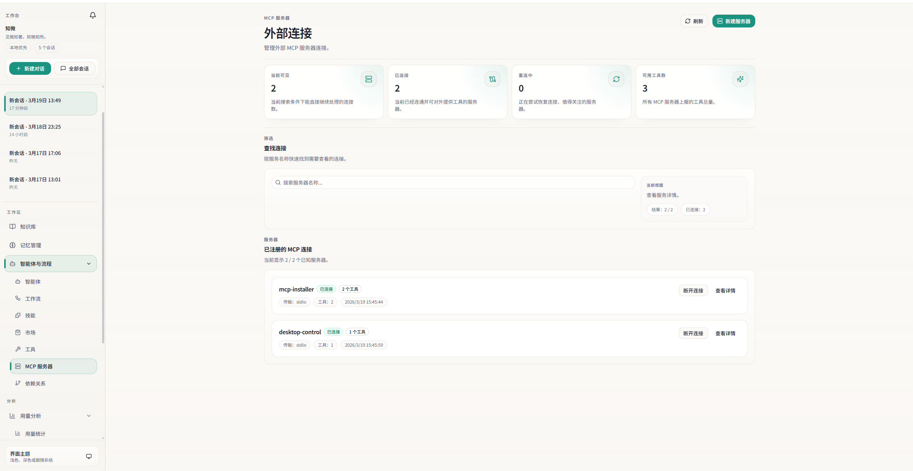

# ZhiWei（知微）

> 见微知著，你的 AI 伙伴

[](https://adoptium.net/)
[](https://spring.io/projects/spring-boot)
[](https://spring.io/projects/spring-ai)
[](https://github.com/ntygod/ZhiWei/actions/workflows/ci.yml)
[](LICENSE)

ZhiWei 是一个本地运行的个人 AI Agent 助手。它不只是被动执行用户命令，而是具备自主任务执行能力——支持 cron 定时和条件触发的自主任务。所有数据存储在本地，隐私完全由你掌控。

## 目录

- [核心特性](#-核心特性)
- [界面预览](#-界面预览)
- [快速开始](#-快速开始)
- [配置说明](#-配置说明)
- [技术栈](#-技术栈)
- [项目结构](#-项目结构)
- [已知限制](#-已知限制)
- [后续计划](#-后续计划)
- [开发指南](#-开发指南)
- [开源协作](#-开源协作)
- [贡献指南](#-贡献指南)
- [FAQ](#-faq)
- [故障排查](#-故障排查)

## ✨ 核心特性

### 🧠 四层认知记忆系统
- L1 工作记忆（会话级临时存储）+ L2 情景记忆（对话记录 + 注入记录）
- L3 语义记忆（TemporalEntity 实体 + TemporalRelation 关系 + 重要性评分 + 访问计数）
- L4 程序记忆（ProcedureTemplate 技能模式 + PreferenceRule 用户偏好）
- 记忆巩固管线（ConsolidationPipeline：语义巩固 → 偏好同步 → 经验合并 → 经验提升 → 程序巩固，定时 + Idle 触发）
- 经验学习子系统：ExperienceSummarizer 经验提炼 + EffectivenessTracker 效果反馈闭环 + ContrastiveLearner 对比学习 + SubtaskReflector 子任务反思 + ExperienceMerger 经验合并 + search-experience 主动检索
- L3→L4 经验提升：高频经验（importanceScore ≥ 0.8 且 accessCount ≥ 3）自动提升为 ProcedureTemplate
- 混合检索（向量 + FTS5 + 时序）+ fusedScore 融合排序 + 预算感知截断
- 时间衰减遗忘 + 过期归档 + accessCount 动态调整

### 🤖 Agent 引擎
- ReactAgentLoop：ReAct 循环架构（Thought → ToolCall → Observation → Answer）
- 手动 tool calling（internalToolExecutionEnabled=false），完全控制工具执行流程
- ContextAssembler 上下文组装（记忆检索 + Token 预算动态分配）
- 5 种挂起/恢复场景（WorkflowWait / UserConfirmation / RemoteDelegation / ScheduledWakeup / ExternalDataWait）
- ReactStep sealed interface 6 种步骤类型 + 不可变状态快照

### 🔀 多 LLM 智能路由
- LlmRouter 场景路由：按 scene / modelName / capability 三级匹配
- ProviderRegistry 运行时动态管理，Web UI 可视化配置
- CircuitBreaker 熔断器（Closed → Open → HalfOpen 三态）+ ExponentialBackoff 故障转移
- SemanticCache 语义缓存（scene + responseFormatKey + prompt 三维匹配）
- 支持 DeepSeek / OpenAI / Anthropic Claude / 通义千问 / Ollama（本地）等多家服务商

### 🎯 Skill 技能系统
- 两层工具架构（ToolContract sealed interface）：BuiltinTool（Java Native）→ McpTool（External）
- 7 大元能力维度（ToolCategory）：感知 / 行动 / 认知 / 存储 / 交互 / 自省 / 扩展
- Skill 验证三阶段管线：FormatValidator → SecurityValidator → SandboxValidator
- Skill 自扩展：SkillGenerator 运行时自动检测能力缺口，生成 YAML Skill
- 内置 Skill：通用数据存储 / 定时任务 / 记忆管理
- DynamicToolRegistry 运行时工具注册表，支持热加载

### 📚 知识库管理
- 多格式文档解析（PDF / Word / Markdown / TXT）
- 多分块策略（固定大小 / 语义 / 标题）
- 混合检索（向量 + FTS5 全文 + 知识图谱遍历）+ 可选 LLM Reranker 精排

### 🔌 MCP 协议支持
- McpServerRegistry 服务器发现 + 客户端管理
- McpServerDiscovery 自动发现
- McpTool 作为 ToolContract 最低优先级层接入工具生态

### 🤝 多 Agent 协作
- AgentRegistry + AgentDefinition 注册管理
- HandoffTool 委托工具模式，SubAgent 独立预算和上下文
- 预设专家 Agent（写作 / 分析 / 调研）

### 🔄 工作流引擎
- YAML 声明式工作流定义
- 多种触发器：manual / cron / event
- 工作流状态持久化 + 崩溃恢复

### 🔐 权限与自动执行
- `PermissionRequestFactory + PermissionEvaluator + ExecutionGrant` 统一工具授权链路
- 授权范围支持：本会话 / 当前工作区 / 当前任务 / 长期
- 高风险交互执行走 Web 授权，自主执行只认预授权
- Cron / Heartbeat / 自主工作流支持任务级高风险预授权

### 🔔 统一通知系统
- NotificationService 统一接口，工作流 / 各模块统一调用
- 无结果静默，有结果直接通知
- 富媒体支持：文本 / Markdown / 交互式卡片 / 图片，各渠道自动适配
- 通知历史管理：分页查询、未读统计、已读标记
- Web SSE 实时推送，通知中心直接消费同一条数据流

### 🌐 Gateway 中间件
- 6 层可插拔中间件管道（Auth=100 → RateLimit=200 → Security=300 → Router=400 → Execution=500 → Audit=600）
- ChannelAdapter 适配器：Web / CLI / 企业微信 / 钉钉 / 飞书
- SecurityMiddleware：PromptInjectionDetector + SensitiveDataDetector + TrustScoreCalculator
- AuditMiddleware：DataRedactor 自动脱敏 + 审计日志

### 🎨 多模态能力
- 图片 / 文档 / 音频 / 视频处理
- MultimodalRouter 自动路由到支持多模态的 LLM

### 🛡️ 护栏与安全
- GuardrailEngine 护栏引擎：5 种策略类型（ToolRiskPolicy / BudgetLimitPolicy / ContentSafetyPolicy / RateLimitPolicy / DataRedactionPolicy）
- GuardrailResult 三态决策：Passed / Blocked / NeedsConfirmation
- RiskLevel 四级风险分级（LOW → MEDIUM → HIGH → CRITICAL）
- 高风险工具改为作用域授权模型，Web 聊天可授权，Cron / Heartbeat / 自主工作流只认预授权
- DataRedactor 敏感信息脱敏：6 条内置规则（API 密钥 / 手机号 / 身份证 / 银行卡 / 邮箱 / IP）+ 自定义规则扩展
- 代码执行沙箱：Process / Docker 双模式 + CodeValidator 危险操作预检

### 🔍 可观测性
- TraceRecorder 完整追踪：LlmCallStep / ToolCallStep / GuardrailStep 三种步骤类型
- 每个决策可追溯和回放
- Agentic Evals 评估框架：五维规则评估 + LLM-as-a-Judge

### 🔗 协议支持
- A2A 协议：Agent Card 能力声明 + 跨系统 Agent 互操作
- 插件市场：Skill / Agent / Workflow 发布与安装

### 🔄 外部数据源同步
- CalDAV / Todoist / 滴答清单 / Obsidian 连接器
- 冲突解决策略（Last-Write-Wins / 用户确认）

### 🖥️ Web UI
- Vue 3 SPA，30+ 页面视图
- SSE 流式对话 + 实时通知推送
- 记忆管理（实体 / 关系 / 对话 / 模板 / 偏好 / 遗忘日志）
- 评估管理（场景 / 运行历史 / 评分趋势）

### 📦 通用数据存储
- Schema-Free JSON 文档持久化，三种集合类型（Document / Note / Metric）
- 可选属性定义：声明后获得类型校验 + SQLite Generated Column 索引加速
- 7 个 Agent 工具：集合 CRUD + 文档 CRUD + 时序聚合
- FTS5 全文搜索（Note 类型）+ 时序聚合分析（Metric 类型）

### 🏠 本地优先架构
- 所有数据存储在本地 `~/.zhiwei/`
- SQLite（WAL 模式）+ sqlite-vec 向量扩展，零外部服务依赖
- 单 JAR 部署，开箱即用

## 📸 界面预览

### 对话交互

SSE 流式对话，支持 A2UI 自适应渲染（表格、卡片等富媒体形式）：




### 记忆系统

四层认知记忆 + 自我学习，越用越懂你：





### Agent 自主能力

Agent 运行时自动检测能力缺口，按需创建工作流和 Skill：





### 工作流引擎

YAML 声明式工作流，支持 cron / event / manual 触发：



### 可观测性

每个决策步骤可追溯、可回放：



### MCP 协议

MCP 服务器发现与管理，一键接入外部工具生态：



## 🚀 快速开始

### 方式一：Docker Compose（推荐）

```bash
git clone https://github.com/ntygod/ZhiWei.git
cd ZhiWei

# 配置环境变量（至少填入一个 LLM API Key）
cp .env.example .env
# 编辑 .env，填入 DEEPSEEK_API_KEY 或 OPENAI_API_KEY

# 启动
docker compose up -d

# 访问 http://localhost
```

### 方式二：JAR 包手动启动

前置条件：Java 22+（[下载地址](https://adoptium.net/)）

```bash
git clone https://github.com/ntygod/ZhiWei.git
cd ZhiWei

# 1. 构建后端
mvn clean package -DskipTests

# 2. 启动后端
./start.sh          # Linux / macOS
start.bat           # Windows
# 后端默认监听 8080 端口，可通过 ZHIWEI_PORT 环境变量自定义

# 3. 构建并启动前端
cd zhiwei-web
npm install
npm run dev
# 访问 http://localhost:5173
```

### 首次使用

1. 启动后访问 Web UI
2. 进入「设置 → 模型管理」页面，配置至少一个 LLM 服务商
3. 回到对话页面，开始与 ZhiWei 交互

> LLM 服务商配置已迁移到数据库，通过 Web UI 管理，无需手动编辑 application.yml。
> 环境变量（如 `DEEPSEEK_API_KEY`）仅用于 Docker 部署时的初始化注入。

## 📋 配置说明

### 环境变量

敏感信息通过环境变量注入，不要硬编码在配置文件中：

```bash
# LLM 服务商 API Key（至少配置一个）
export DEEPSEEK_API_KEY=your-key
export OPENAI_API_KEY=your-key
export QWEN_API_KEY=your-key

# 可选
export SEARCH_API_KEY=your-key
export RERANKER_API_KEY=your-key
```

### 自定义端口

```bash
# 后端端口（默认 8080）
export ZHIWEI_PORT=9090

# Docker 部署时前端端口（默认 80）
export ZHIWEI_WEB_PORT=3000
```

### Docker 部署配置

Docker Compose 使用 `.env` 文件管理环境变量，参考 `.env.example` 模板。

后端 JVM 参数可通过 `JAVA_OPTS` 环境变量覆盖（默认 `-Xmx512m -Xms256m -XX:+UseG1GC`）。

## 🛠️ 技术栈

| 层级 | 技术 | 版本 | 说明 |
|------|------|------|------|
| 语言 | Java | 22 | Record / Sealed / Pattern Matching / Virtual Thread |
| 框架 | Spring Boot | 3.5.3 | Web、自动配置、Actuator |
| AI 集成 | Spring AI | 1.1.2 | Advisor 模式、MCP 支持、结构化输出 |
| 构建 | Maven | 3.9.x | 依赖管理 |
| 数据库 | SQLite (xerial) | 3.49+ | WAL 模式、FTS5 全文索引 |
| 向量存储 | sqlite-vec | 0.1.x | SQLite 原生向量扩展 |
| 数据库迁移 | Flyway | 10.x | 版本化 Schema 管理 |
| 前端 | Vue 3 + Vite | 3.5 / 6.x | TypeScript SPA |
| 状态管理 | Pinia | 3.x | Vue 3 状态管理 |
| UI 组件 | Reka UI + Tailwind CSS | 2.x / 4.x | 无头组件 + 原子化 CSS |
| 图表 | ECharts + vue-echarts | 6.x / 8.x | 数据可视化 |
| 浏览器自动化 | Playwright | 1.58 | 可选依赖，运行时检测 |
| 多媒体 | JavaCV + FFmpeg | 1.5.13 / 6.1.1 | 视频帧提取 / 音轨分离 |
| 文档与内容解析 | PDFBox + POI + Tika + Jsoup | 3.0.7 / 5.3.0 / 3.3.0 / 1.22.1 | PDF / Word / MIME / HTML 解析 |
| 测试 | JUnit 5 + jqwik | 5.11+ / 1.9.2 | 单元测试 + 属性测试 |
| 前端测试 | Vitest + fast-check | 3.x / 4.x | 前端单元测试 + 属性测试 |

## 📁 项目结构

```
ZhiWei/
├── .github/                         # GitHub Actions、Issue/PR 模板、Dependabot
├── src/main/java/com/lifepilot/     # 按领域拆分的后端模块
│   ├── a2a/             # A2A 协议（Agent-to-Agent 互操作）
│   ├── agent/           # Agent 引擎（ReactAgentLoop / ContextAssembler / 挂起恢复）
│   ├── config/          # 全局配置
│   ├── conversation/    # 对话管理
│   ├── datastore/       # 通用数据存储（Schema-Free JSON / 全文搜索 / 时序聚合）
│   ├── eval/            # Agentic Evals 评估框架
│   ├── interaction/     # 交互层（Web API / CLI / Gateway 中间件）
│   ├── knowledge/       # 知识库管理（文档解析 / 分块 / 检索 / Reranker）
│   ├── llm/             # LLM 路由（ProviderRegistry / CircuitBreaker / SemanticCache）
│   ├── marketplace/     # 插件市场
│   ├── mcp/             # MCP 协议（McpServerRegistry / McpServerDiscovery）
│   ├── media/           # 多模态处理（图片 / 音频 / 视频）
│   ├── memory/          # 四层记忆系统（Working / Episodic / Semantic / Procedural / 经验学习）
│   ├── meta/            # 元能力（文件工具 / 浏览器工具 / 基础设施工具 / 交互工具）
│   ├── multiagent/      # 多 Agent 协作（Handoff / SubAgent）
│   ├── notification/    # 统一通知系统（直接投递 / 历史 / SSE）
│   ├── observability/   # 可观测性（TraceRecorder / GuardrailEngine / DataRedactor）
│   ├── permission/      # 工具授权（作用域匹配 / 预授权 / 授权记录）
│   ├── prompt/          # Prompt 模板管理
│   ├── sandbox/         # 代码执行沙箱（Process / Docker 双模式）
│   ├── scheduler/       # 定时任务（ScheduledTaskService / TaskScheduler）
│   ├── skill/           # Skill 系统（注册 / 验证 / 激活 / 生成 / SkillToToolBridge）
│   ├── tool/            # 工具系统（ToolContract / DynamicToolRegistry / ToolBridge）
│   └── workflow/        # 工作流引擎（DAG 调度 / 表达式）
├── src/main/resources/
│   ├── application.yml          # 主配置
│   ├── application-docker.yml   # Docker 环境配置
│   ├── db/migration/            # Flyway 迁移脚本
│   ├── builtin-workflows/       # 内置工作流
│   ├── prompts/                 # Prompt 模板
│   ├── skills/                  # 内置 Skill 定义
│   └── eval-scenarios/          # 评估场景定义
├── zhiwei-web/                  # 前端项目（Vue 3 + Vite + Pinia）
│   ├── src/views/               # 30+ 页面视图
│   ├── src/components/          # Vue 组件
│   ├── src/stores/              # Pinia 状态管理
│   ├── src/composables/         # 组合式函数
│   └── src/api/                 # 前端 API 客户端
├── docker-compose.yml           # Docker Compose 编排
├── Dockerfile                   # 后端 Docker 构建（多阶段）
├── start.sh / start.bat         # 一键启动脚本
├── .env.example                 # 环境变量模板
├── CONTRIBUTING.md              # 贡献指南
├── CODE_OF_CONDUCT.md           # 社区行为准则
├── SUPPORT.md                   # 提问与支持说明
├── SECURITY.md                  # 安全策略
├── ARCHITECTURE-DIAGRAMS.md     # 架构可视化（14 节 Mermaid 图）
└── docs/                        # 项目文档
    ├── ARCHITECTURE.md          # 架构总览
    ├── FEATURES.md              # 特性总览
    ├── README.md                # 文档目录说明
    ├── API_ENDPOINTS.md         # API 端点文档
    ├── API_STANDARD.md          # API 设计规范
    ├── architecture/            # 各模块架构设计文档
    ├── features/                # 各模块特性设计文档
    └── guides/                  # 使用指南
```

## ⚠️ 已知限制

- 需要配置至少一个 LLM 服务商（DeepSeek / OpenAI / Anthropic / Ollama 等）才能使用对话功能
- 单用户设计，不支持多用户账户和权限隔离
- SQLite 存储，适合个人使用场景，不支持集群部署
- Playwright 浏览器自动化为可选依赖，需用户自行安装 driver-bundle
- 详细限制说明请参阅 [已知限制文档](docs/KNOWN-LIMITATIONS.md)

## 🗺️ 后续计划

### 短期目标

- [ ] 性能优化：缓存机制优化，缩短首字响应时间（TTFT）
- [ ] 移动端适配
- [ ] 系统设置管理（Web UI 可视化配置，替代手动编辑 application.yml）

### 中期目标

- [ ] Agentic GraphRAG：用图检索 Skill 替代 SQL CTE 穷举遍历
- [ ] Idle-Driven 记忆巩固：空闲事件驱动替代定时触发
- [ ] 多语言支持

### 长期目标

- [ ] GraalVM native image：探索原生编译，消除 Java 运行时依赖
- [ ] 插件市场完善：支持社区共享
- [ ] 语音交互：TTS / STT 集成

## 🧪 开发指南

### 本地开发

```bash
# 克隆项目
git clone https://github.com/ntygod/ZhiWei.git
cd ZhiWei

# 后端（Maven 自动下载依赖）
mvn clean install -DskipTests

# 前端
cd zhiwei-web
npm install

# 启动后端开发服务器
mvn spring-boot:run

# 启动前端开发服务器（新终端）
cd zhiwei-web
npm run dev
```

### 运行测试

```bash
# 后端测试
mvn test

# 前端测试
cd zhiwei-web
npm run test:run
```

### 构建发布

```bash
# 构建后端 JAR（产出 target/zhiwei.jar）
mvn clean package -DskipTests

# 构建前端（产出 zhiwei-web/dist/）
cd zhiwei-web
npm run build
```

### 编码规范

- Java 22 特性优先：Record、Sealed Interface、Pattern Matching、Virtual Thread
- 中文注释、中文日志、中文测试方法名
- 提交消息格式：`<type>(<scope>): <中文描述>`
- 数据载体优先使用 `record`，类型层次使用 `sealed interface`
- 业务可调参数通过 `@ConfigurationProperties` 外部化，禁止硬编码
- 提交前运行 `mvn clean test` 确保测试通过

## 🌱 开源协作

- 贡献流程请看 [CONTRIBUTING.md](CONTRIBUTING.md)
- 行为准则请看 [CODE_OF_CONDUCT.md](CODE_OF_CONDUCT.md)
- 使用问题与反馈入口请看 [SUPPORT.md](SUPPORT.md)
- 安全问题请通过 [SECURITY.md](SECURITY.md) 指定方式反馈
- 第一次维护开源仓库可参考 [GitHub 仓库维护指南](docs/guides/github-maintainer-guide.md)
- 日常 `git` / `gh` 命令与 PR 流程可参考 [Git 与 GitHub CLI 速查表](docs/guides/git-gh-guide.md)
- 日常版本发布可参考 [Release 发布指南](docs/guides/release-guide.md)
- 仓库已补齐 GitHub Actions、Issue/PR 模板和 Dependabot，适合作为个人开源项目的基础骨架继续维护

## 🤝 贡献指南

1. Fork 本仓库
2. 创建分支（推荐 `feature/{name}` 或 `bugfix/{name}`）
3. 提交更改（提交格式：`<type>(<scope>): 中文描述`）
4. 推送分支并发起 Pull Request
5. 按模板补齐验证步骤、截图和影响说明

## ❓ FAQ

### ZhiWei 是什么？

ZhiWei（知微）是一个本地运行的 AI Agent 助手，具备自主任务执行能力，可以帮助你管理知识、提供自动化工作流能力。

### 需要付费吗？

ZhiWei 本身免费开源，但需要自备 LLM API Key（如 DeepSeek、OpenAI 等）。也可以使用 Ollama 运行本地模型，完全免费。

### 数据存储在哪里？

所有数据存储在本地 SQLite 数据库（`~/.zhiwei/`），不上传云端，保护隐私。

### 支持哪些 LLM？

支持 DeepSeek、OpenAI、Anthropic Claude、通义千问、Ollama（本地）等多种 LLM Provider。通过 ProviderRegistry 运行时动态管理，Web UI 可视化配置。

### 如何自定义 Skill？

在 `~/.zhiwei/skills/` 目录下创建 Markdown 文件即可定义自定义 Skill，支持热加载。Skill 定义使用 YAML Frontmatter + Markdown 格式。

## 🔧 故障排查

### 启动失败，提示数据库错误

1. 检查 `~/.zhiwei/` 目录是否有读写权限
2. 删除数据库文件重新启动：`rm -rf ~/.zhiwei/*.db`

### LLM 调用失败

1. 检查 API Key 是否正确配置
2. 确认网络可以访问 LLM 服务商
3. 查看日志中的具体错误信息
4. 检查 CircuitBreaker 是否已熔断（日志中搜索「熔断器触发」）

### 工具调用超时

1. 检查 `application.yml` 中的超时配置
2. 对于复杂工具调用，可适当增加超时时间

### 前端页面空白

1. 检查前端是否正确构建：`cd zhiwei-web && npm run build`
2. 检查浏览器控制台是否有 JavaScript 错误
3. 确认后端服务正常运行在 8080 端口

## 📄 许可证

本项目采用 [MIT License](LICENSE) 许可证。

## 🙏 致谢

- [Spring AI](https://spring.io/projects/spring-ai) — AI 原生集成框架
- [MCP](https://modelcontextprotocol.io/) — Model Context Protocol 标准
- [A2A](https://google.github.io/A2A/) — Agent-to-Agent 协议

---

ZhiWei（知微）— 见微知著，你的 AI 伙伴

本地运行 · 隐私优先 · 越用越懂你
