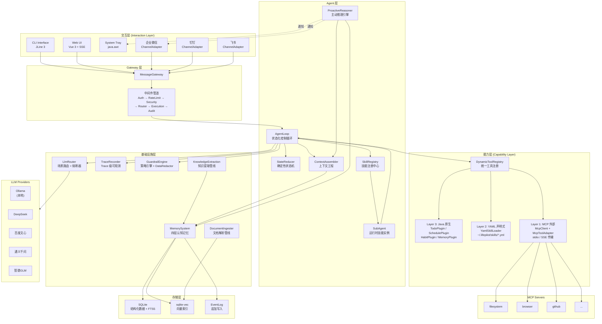
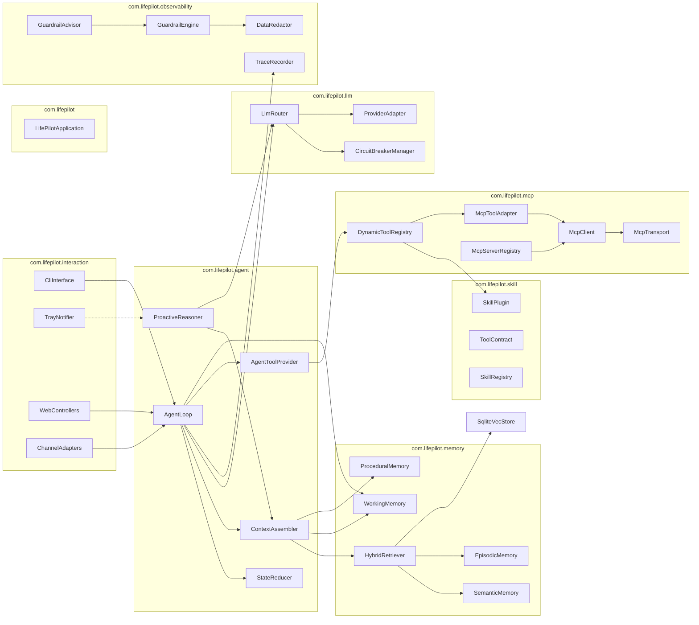

# LifePilot 架构设计文档

> **文档性质**：开发者面向（Developer-Facing）架构设计文档
> **目标读者**：核心开发者、架构评审者、技术面试官
> **最后更新**：2026-03

---

## 1. 项目概述

### 1.1 产品定位与核心差异

LifePilot 是一个**本地运行的个人 AI Agent 助手**，核心定位为"了解你生活全貌的 AI 伙伴"。

与 OpenClaw 等通用 AI Agent 框架不同，LifePilot 不只是被动执行用户命令，而是具备**主动智能能力**——它观察用户的生活模式，主动提供建议和帮助。与 AstrBot 等 IM 聊天机器人基础设施不同，LifePilot 聚焦于**个人生活管理**场景，以认知记忆和主动推理为核心差异化。

| 维度 | 传统 AI 助手 | OpenClaw | AstrBot | LifePilot |
|------|-------------|----------|---------|-----------|
| 交互模式 | 问答式 | 被动执行 | 事件驱动 | **主动智能 + 被动响应** |
| 记忆能力 | 无/对话级 | Markdown 文件 | 基础对话历史 | **四层认知记忆 + 时序知识图谱** |
| 触发方式 | 用户发起 | 用户发起 | 事件总线 | **用户发起 + 系统主动推理** |
| 数据存储 | 云端 | 本地 | 偏云端 | **本地优先** |
| Agent 模式 | 单轮 FC | Tool Use 循环 | Pipeline 管线 | **状态化控制循环 + 确定性状态机** |
| 可观测性 | 无 | 基础日志 | 基础日志 | **Trace 级行为可观测 + 护栏引擎** |
| 检索能力 | 单一 | 单一 | 向量 + BM25 | **向量 + FTS5 + 图遍历 三路混合** |
| 记忆演化 | 无 | 无 | 无 | **记忆巩固 + MaRS 遗忘策略** |

### 1.2 技术栈总览

| 层级 | 技术选型 | 版本 | 选型理由 |
|------|---------|------|---------|
| 语言 | Java | 22 | Record/Sealed/Pattern Matching/Virtual Thread |
| 框架 | Spring Boot | 3.5.x | Web 框架、自动配置、Actuator |
| AI 集成 | Spring AI | 1.1.2 | AI 原生集成、Advisor 模式、MCP 支持、结构化输出 |
| 构建 | Maven | 3.9.x | 标准化依赖管理、社区生态成熟 |
| 结构化存储 | SQLite (xerial sqlite-jdbc) | 3.51+ | 零运维、WAL 模式、本地优先、native library 内嵌于 JAR |
| 向量存储 | sqlite-vec | 0.1.x | SQLite 原生扩展、无额外进程 |
| CLI | JLine 3 | 3.28+ | 补全、高亮、历史记录 |
| 测试 | JUnit 5 + jqwik | 5.11+ / 1.9.x | 属性测试、确定性状态机验证 |
| 可观测性 | OpenTelemetry 语义约定 | — | Agent 行为追踪行业标准 |
| 工具协议 | MCP (Model Context Protocol) | 2024-11 | Anthropic/OpenAI/Google/Microsoft 共同支持 |
| LLM 集成 | Ollama / DeepSeek / 文心 / 通义 / GLM | — | 多服务商路由 + 本地模型优先 |
| 前端 | Vue 3 + Vite + Pinia | 3.5 / 6.x / 3.x | 轻量 SPA、响应式、状态管理 |
| 数据库迁移 | Flyway | 10.x | 社区版支持 SQLite，版本化 Schema 管理 |

### 1.3 2026 前沿技术对标

本项目的架构设计参考了 2025-2026 年 AI Agent 领域的前沿实践：

| 领域 | 业界前沿 | LifePilot 实现 | 参考来源 |
|------|----------|---------------|---------|
| Agent 架构 | 状态化控制循环 + 确定性 Reducer | AgentLoop + StateReducer 分离概率决策与确定性状态转换 | [Redis 2026 Agent Architecture](https://redis.io/blog/ai-agent-architecture/) |
| 记忆系统 | 四层认知记忆：Working/Episodic/Semantic/Procedural | 四层记忆架构 + 记忆巩固/遗忘管线 | [Oracle 2026 Agent Memory](https://blogs.oracle.com/developers/agent-memory-why-your-ai-has-amnesia-and-how-to-fix-it) |
| 知识图谱 | 时序知识图谱 Temporal KG + GraphRAG 混合检索 | 时序 KG + 混合检索（向量 + 图遍历 + FTS5） | [Zep GraphRAG](https://graphrag.com/appendices/research/2501.13956) |
| 向量存储 | SQLite + sqlite-vec 成为本地 Agent 标准方案 | sqlite-vec 快速路径 + JVM 暴力降级 | OpenClaw 18.5 万星验证 |
| 遗忘策略 | MaRS 认知遗忘框架 | Hybrid 遗忘策略 + 隐私感知保留 | [arXiv 2512.12856](https://arxiv.org/html/2512.12856v1) |
| 工具协议 | MCP 成为事实标准 | MCP Client + SkillToMcpBridge 双向桥接 | Anthropic MCP Specification |
| 可观测性 | Trace 级行为可观测 | 全链路 Trace + 轨迹评估 + 回放 | [OpenTelemetry Agent 语义约定](https://opentelemetry.io/) |
| 评估体系 | 轨迹评估 Trajectory Evaluation | 工具选择正确性 + 参数合法性 + 步骤效率 + 策略合规性 | [Braintrust 2026](https://www.braintrust.dev/articles/ai-agent-evaluation-framework) |
| 护栏 | Policy-as-Code + 不可逆操作审批 | GuardrailEngine + DataRedactor + 操作分级审批 | [Furmanets 2026](https://www.andriifurmanets.com/blogs/ai-agents-2026-practical-architecture-tools-memory-evals-guardrails) |

> 参考来源均为 2025-2026 年发表的技术文章和论文，内容已重新组织表述以符合许可要求。

---

## 2. 系统架构

### 2.1 分层架构总览

```
┌─────────────────────────────────────────────────────────────────────────┐
│                            交互层 (Interaction Layer)                     │
│  CLI (JLine 3) │ Web UI (Vue 3) │ System Tray │ 企业微信 │ 钉钉 │ 飞书  │
├─────────────────────────────────────────────────────────────────────────┤
│                          Gateway 层 (Gateway Layer)                      │
│  MessageGateway │ AuthMiddleware │ RateLimitMiddleware │ SecurityMW     │
│  RouterMiddleware │ ExecutionMiddleware │ AuditMiddleware               │
├─────────────────────────────────────────────────────────────────────────┤
│                           Agent 层 (Agent Layer)                         │
│  AgentLoop (状态化控制循环)    │ StateReducer (确定性状态机)              │
│  ContextAssembler (上下文工程) │ ProactiveReasoner (主动推理)            │
│  SkillRegistry (技能注册中心)  │ SubAgent (运行时技能实例)               │
├─────────────────────────────────────────────────────────────────────────┤
│                           能力层 (Capability Layer)                      │
│  DynamicToolRegistry (统一工具注册)                                      │
│  ┌──────────────┬──────────────────┬──────────────────┐                 │
│  │ Layer 3      │ Layer 2          │ Layer 1          │                 │
│  │ Java 原生    │ YAML 声明式 Skill │ MCP 外部工具     │                 │
│  │ (SkillPlugin)│ (YamlSkillLoader)│ (McpToolAdapter) │                 │
│  └──────────────┴──────────────────┴──────────────────┘                 │
├─────────────────────────────────────────────────────────────────────────┤
│                        基础设施层 (Infrastructure Layer)                  │
│  MemorySystem (四层认知记忆)   │ LlmRouter (多模型路由 + 熔断器)         │
│  ObservabilityEngine (Trace)  │ GuardrailEngine (策略引擎 + 护栏)       │
│  DocumentIngester (文档管线)   │ KnowledgeExtractionPipeline            │
├─────────────────────────────────────────────────────────────────────────┤
│                          存储层 (Storage Layer)                          │
│  SQLite (结构化 + FTS5 全文索引)                                         │
│  sqlite-vec (向量索引)                                                   │
│  EventLog (追加写入审计日志)                                              │
│  ~/.lifepilot/ (本地数据目录)                                            │
└─────────────────────────────────────────────────────────────────────────┘
```

**分层原则**：
- **交互层**只负责协议适配和消息格式转换，不包含业务逻辑
- **Gateway 层**统一所有通道的入口，中间件管道按顺序处理请求
- **Agent 层**是核心决策层，LLM 决策（概率性）与状态转换（确定性）严格分离
- **能力层**统一管理三种来源的工具，对 Agent 层完全透明
- **基础设施层**提供记忆、LLM、可观测性等横切关注点
- **存储层**全部本地化，零外部依赖

### 2.2 架构图



### 2.3 模块依赖关系



**依赖规则**：
- 上层模块可以依赖下层模块，反之不可
- `agent` 层通过接口依赖 `skill`、`memory`、`llm`，不直接依赖具体实现
- `mcp` 模块通过 `ToolContract` 接口与 `skill` 模块解耦
- `observability` 模块通过 Spring AI Advisor 模式横切注入，不被业务模块直接依赖


---

## 3-13. 模块详细设计

> 以下各模块的详细设计已拆分为独立文档，便于增量阅读和 Spec 规划。

| # | 模块 | 架构设计 | 功能说明 |
|---|------|---------|---------|
| 3 | Agent 引擎 | [agent-engine.md](architecture/agent-engine.md) | [agent-engine.md](features/agent-engine.md) |
| 4 | Skill 技能系统 | [skill-system.md](architecture/skill-system.md) | [skill-system.md](features/skill-system.md) |
| 5 | 记忆系统 | [memory-system.md](architecture/memory-system.md) | [memory-system.md](features/memory-system.md) |
| 6 | 混合工具生态 | [tool-ecosystem.md](architecture/tool-ecosystem.md) | [tool-ecosystem.md](features/tool-ecosystem.md) |
| 7 | LLM 路由 | [llm-router.md](architecture/llm-router.md) | [llm-router.md](features/llm-router.md) |
| 8 | 知识库管理 | [knowledge-base.md](architecture/knowledge-base.md) | [knowledge-base.md](features/knowledge-base.md) |
| 9 | Gateway + 中间件 | [gateway-middleware.md](architecture/gateway-middleware.md) | [gateway-channels.md](features/gateway-channels.md) |
| 10-11 | 可观测性 + 护栏 | [observability.md](architecture/observability.md) | [observability.md](features/observability.md) |
| 12 | 数据模型 | [data-model.md](architecture/data-model.md) | — |
| 13 | 错误处理 | [error-handling.md](architecture/error-handling.md) | — |
| — | 内置 Skills | — | [builtin-skills.md](features/builtin-skills.md) |
| — | MCP 协议 | — | [mcp-support.md](features/mcp-support.md) |
| — | 主动推理 + 工作流 | — | [proactive-reasoning.md](features/proactive-reasoning.md) |
| — | 部署体验 | — | [deployment.md](features/deployment.md) |
| — | Skill 开发指南 | — | [skill-development.md](features/skill-development.md) |

---

## 14. 关键设计决策

| # | 决策 | 备选方案 | 选择理由 | 权衡 |
|---|------|---------|---------|------|
| 1 | **SQLite** 作为主存储 | PostgreSQL, MySQL | 零运维、本地优先、WAL 模式足够应对单用户并发；sqlite-vec 扩展提供向量能力 | 写入并发有限（单写者），大规模数据需迁移 |
| 2 | **StateReducer** 确定性状态机 | ReAct 模式, 直接状态修改 | 可测试（纯函数）、可回放（事件溯源）、可调试（显式状态）；jqwik 属性测试天然适配 | 实现复杂度略高，需要定义完整的 Action 类型 |
| 3 | **YAML Skill** 声明式定义 | 纯代码插件, JSON 配置 | 人类可读、零代码开发、运行时热加载；YAML 比 JSON 更适合配置文件 | 表达能力有限，复杂逻辑仍需 Java 原生插件 |
| 4 | **本地优先** 架构 | 云端优先, 混合架构 | 隐私保护是核心卖点；SQLite + sqlite-vec 证明本地方案可行 | 多设备同步困难，需要额外方案 |
| 5 | **Spring AI** 集成 | 直接调用 API, LangChain4j | Advisor 模式天然适配护栏和轨迹；ChatClient 统一多 Provider；结构化输出 entity() API | Spring AI 仍在快速迭代，API 可能变化 |
| 6 | **sqlite-vec** 向量存储 | Chroma, Milvus, Qdrant | 零额外进程、与 SQLite 同库、OpenClaw 18.5 万星验证 | 性能不如专用向量数据库，大规模数据需降级 |
| 7 | **MCP 协议** 工具标准 | 自定义协议, OpenAPI | 行业事实标准（Anthropic/OpenAI/Google/Microsoft 支持）；生态丰富 | 协议仍在演进，需要适配层隔离变化 |
| 8 | **Maven** 构建工具 | Gradle | 标准化依赖管理、社区生态成熟、Spring Boot 官方推荐 | 增量编译不如 Gradle 快 |
| 9 | **四层认知记忆** | 简单 RAG, 两层记忆 | 认知科学启发，层间自动流转；差异化竞争力 | 实现复杂度高，需要维护多个存储和管线 |
| 10 | **单 Agent + Skill 激活** | 多 Agent 对等协作 | 简化架构，Skill = Class / SubAgent = Object 类比清晰；深度限制 2 层防止复杂度爆炸 | 不支持 Agent 间对等通信 |

---

## 15. 技术风险与应对策略

| # | 风险 | 影响 | 概率 | 应对策略 |
|---|------|------|------|---------|
| 1 | **SQLite 写入并发瓶颈** | 高并发写入时性能下降 | 低（单用户场景） | WAL 模式 + 写操作队列化；预留 PostgreSQL 迁移路径（Spring Data JDBC 抽象层） |
| 2 | **LLM API 成本失控** | 知识提取、向量化、主动推理消耗大量 Token | 中 | Budget 机制严格控制；本地模型（Ollama）优先策略；缓存减少重复调用 |
| 3 | **MCP 协议快速演进** | API 变化导致兼容性问题 | 中 | `McpTransport` 抽象层隔离协议变化；优先使用 Spring AI MCP 集成 |
| 4 | **本地资源消耗** | 多 MCP Server 进程 + 向量化 + 定时任务消耗系统资源 | 中 | MCP Server 按需启动/停止；向量化任务限制并发；资源监控 + 自适应调度 |
| 5 | **数据库 Schema 迁移** | 版本升级时 Schema 变更需平滑迁移 | 高 | Flyway 管理数据库版本迁移；每次 Schema 变更提供迁移脚本 |
| 6 | **sqlite-vec 扩展兼容性** | 不同平台的 native library 加载问题 | 中 | JVM 暴力搜索降级方案；预编译多平台 native library |
| 7 | **Spring AI API 变化** | Spring AI 1.1.2 已 GA 稳定，但后续版本仍可能调整 | 中 | `ProviderAdapter` 接口隔离；锁定 1.1.2 稳定版本 |
| 8 | **知识提取质量** | LLM 提取的实体/关系不准确 | 中 | 置信度阈值过滤；冲突检测 + 版本化合并；用户可手动修正 |
| 9 | **对话压缩信息丢失** | 渐进压缩可能丢失重要信息 | 低 | 分层压缩保留关键决策；用户标记的重要信息永不压缩 |
| 10 | **MCP Server 进程管理** | 僵尸进程、崩溃恢复 | 中 | 进程健康检查 + 自动重启；`ProcessBuilder` 超时控制 |

---

## 16. 技术亮点总结

以下是 LifePilot 的核心技术创新点，每个点都可以展开为 30 分钟以上的深度技术讨论：

| # | 技术亮点 | 深度指标 | 核心要点 |
|---|---------|---------|---------|
| 1 | **StateReducer 确定性状态机** | ⭐⭐⭐⭐⭐ | 概率决策与确定性状态分离；sealed interface + switch expression + pattern matching；jqwik 属性测试验证状态机不变量；事件溯源风格支持完整回放 |
| 2 | **四层认知记忆 + 层间自动流转** | ⭐⭐⭐⭐⭐ | Working → Episodic → Semantic → Procedural 四层架构；记忆巩固管线（情景→语义提炼、情景→程序提炼）；MaRS 认知遗忘框架（FIFO/LRU/Priority Decay/Reflection-Summary/Hybrid） |
| 3 | **时序知识图谱 + 三路混合检索** | ⭐⭐⭐⭐⭐ | 版本化实体/关系支持时间旅行查询；向量语义 + FTS5 全文 + 图遍历三路并行检索；加权融合排序（5 维权重） |
| 4 | **ProactiveReasoner 两阶段推理** | ⭐⭐⭐⭐ | 规则引擎快速过滤（< 10ms）+ LLM 精细判断（~500ms）；FrequencyStateMachine 智能降频（NORMAL→REDUCED→MUTED）；降频渐进、恢复即时，避免沉默螺旋 |
| 5 | **Skill = Class, SubAgent = Object** | ⭐⭐⭐⭐ | 统一三种来源（BUILTIN/USER_DEFINED/AUTO_GENERATED）；声明式记忆访问权限 + 预算隔离 + 深度限制；Skill 自扩展：需求检测→YAML 生成→三重验证→用户确认 |
| 6 | **Spring AI Advisor 模式横切注入** | ⭐⭐⭐⭐ | GuardrailAdvisor（护栏）+ TraceAdvisor（轨迹）自动注入 ChatClient 调用链；业务代码零侵入，关注点完全分离；优先级排序保证执行顺序 |
| 7 | **三层混合工具生态 + MCP 双向桥接** | ⭐⭐⭐⭐ | Java 原生 > YAML 声明式 > MCP 外部，优先级解析；DynamicToolRegistry 运行时动态注册/注销；SkillToMcpBridge 反向暴露内置工具为 MCP Tool |
| 8 | **熔断器能力类型隔离** | ⭐⭐⭐ | providerId:capabilityType 复合键；Chat 熔断不影响 Embedding；CLOSED→OPEN→HALF_OPEN 标准状态机 |
| 9 | **渐进式对话压缩** | ⭐⭐⭐ | Layer 0 原文 → Layer 1 摘要 → Layer 2 要点；按 Token 预算动态触发压缩；典型压缩率 60%/80% |
| 10 | **本地优先隐私设计** | ⭐⭐⭐ | 全部数据存储在 ~/.lifepilot/；DataRedactor 自动脱敏；云端 LLM 调用前明确告知用户；隐私感知遗忘策略 |

---

> **文档结束**
>
> 本文档描述了 LifePilot 的理想架构设计。实际实现可能根据开发进度和技术约束有所调整，
> 但核心设计原则（概率/确定性分离、四层认知记忆、本地优先、Trace 级可观测）应始终贯穿。
