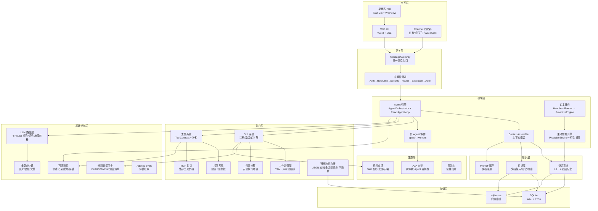
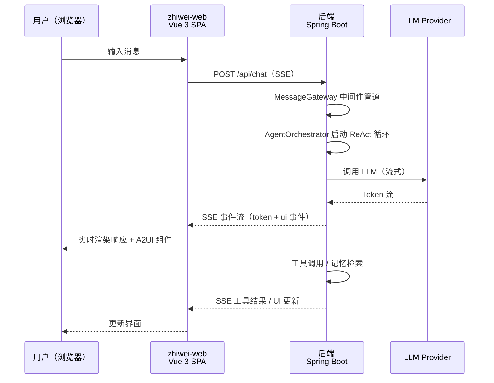
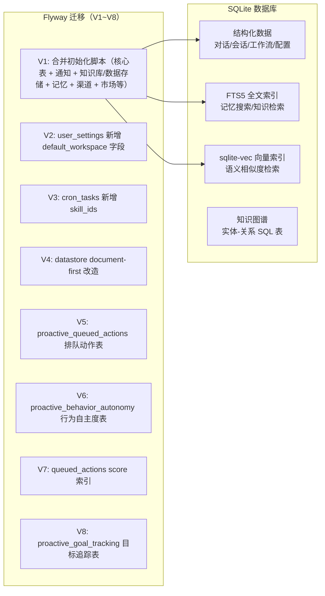
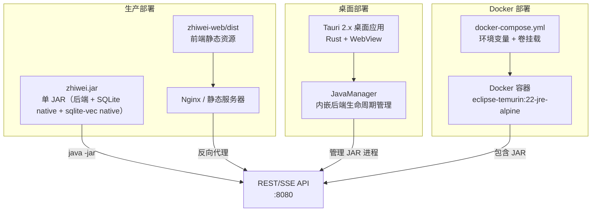

# 知微（ZhiWei）— 系统架构总览

> **文档性质**：架构总览文档
> **最后更新**：2026-04-15

## 1. 项目概述

知微（ZhiWei，取"见微知著"之意）是一个 AI 驱动的个人生活助手，采用 Agent 架构实现自然语言交互、任务管理、知识管理、自主任务执行等能力。系统以单 JAR 部署为核心设计约束，面向个人用户提供本地优先、隐私友好的智能助手体验。

核心差异化：
- **多层记忆系统**：L1 工作记忆 → L2 情景记忆 → L3 语义记忆 + 时序知识图谱 → L4 程序记忆，模拟人类认知记忆层次
- **自主任务执行**：支持 cron 定时和自主工作流，任务定义持久化在 SQLite 中
- **权限与自动执行**：高风险工具改为作用域授权模型，自主任务支持任务级预授权
- **Skill 自扩展**：Agent 可检测能力缺口并自动生成新 Skill（Markdown SKILL.md 声明式）
- **单 JAR 部署**：后端 + SQLite + sqlite-vec 打包为单个可执行 JAR，零外部依赖

## 2. 技术栈总览

| 技术 | 版本 | 用途 |
|------|------|------|
| Java | 22 | Record / Sealed Interface / Pattern Matching / Virtual Thread |
| Spring Boot | 3.5.x | Web 框架、自动配置、Actuator |
| Spring AI | 1.1.3 | LLM 集成、Advisor 模式、MCP 支持、结构化输出 |
| Maven | 3.9.x | 构建与依赖管理 |
| SQLite + sqlite-vec | 3.51+ / 0.1.x | 结构化存储 + FTS5 全文索引 + 向量检索 |
| Flyway | 10.x | 数据库迁移 |
| Vue 3 + Vite + Pinia | 3.5 / 6.x / 3.x | 前端 SPA（独立项目 zhiwei-web） |
| Tauri | 2.x | 桌面客户端（Rust + WebView，位于 zhiwei-web/src-tauri） |
| Apache Tika | — | 文档格式检测与解析 |

## 3. 系统分层架构

## 4. 模块职责总览

系统后端按 `com.lifepilot.*` 领域包拆分，按职责分为以下层次：

| 模块包 | 职责 | 详细文档 |
|--------|------|---------|
| `llm` | LLM 基础设施（Provider 适配、熔断器、语义缓存、多模态路由） | [架构](architecture/llm-router.md) · [特性](features/llm-router.md) |
| `generation` | 文本生成路由（GenerationRouter）、客户端工厂、结构化输出解析 | [架构](architecture/llm-router.md) · [特性](features/llm-router.md) |
| `embedding` | 向量化路由（EmbeddingRouter）、客户端工厂 | [架构](architecture/llm-router.md) · [特性](features/llm-router.md) |
| `rerank` | 精排路由（RerankRouter）、原生/LLM Pointwise/Listwise 策略 | [架构](architecture/llm-router.md) · [特性](features/llm-router.md) |
| `modelservice` | DB 驱动模型服务注册表（ModelServiceRegistry）、厂商模板管理 | [架构](architecture/llm-router.md) · [特性](features/llm-router.md) |
| `agent` | Agent ReAct 循环、不可变状态管理、上下文组装、挂起恢复、自主任务执行 | [架构](architecture/agent-engine.md) · [特性](features/agent-engine.md) |
| `agent.task.proactive` | 主动智能引擎（三级检测管线、行为插件、四级投递、信任阶梯） | [架构](architecture/proactive-reminder-engine.md) |
| `tool` | 工具契约、动态注册、执行管道、YAML 工具 | [架构](architecture/tool-ecosystem.md) · [特性](features/tool-ecosystem.md) |
| `permission` | 工具授权、作用域匹配、任务级预授权、授权记录管理 | [架构](architecture/permission.md) · [特性](features/permission.md) |
| `observability.guardrail` | 安全护栏（内容安全 / 速率限制 / 数据脱敏策略引擎，不再独立为顶层包） | [架构](architecture/guardrail.md) · [特性](features/guardrail.md) |
| `mcp` | Model Context Protocol 客户端、懒连接生命周期、工具缓存、自动发现、传输层 | [架构](architecture/mcp-support.md) · [特性](features/mcp-support.md) |
| `memory` | 四层记忆（工作/情景/语义/程序）、向量检索、知识图谱、遗忘策略 | [架构](architecture/memory-system.md) · [特性](features/memory-system.md) |
| `knowledge` | 文档摄入、多格式解析、分块策略、多知识库管理、Reranker | [架构](architecture/knowledge-base.md) · [特性](features/knowledge-base.md) |
| `skill` | Skill 注册/激活/热加载、自扩展（Gap 检测 + Markdown SKILL.md 生成）、SkillHub 远程市场 | [架构](architecture/skill-system.md) · [特性](features/skill-system.md) |
| `interaction` | MessageGateway、中间件管道、Channel 适配器（插件架构）、Web 端点 | [架构](architecture/gateway-middleware.md) · [架构](architecture/channel-plugin-architecture.md) · [特性](features/gateway-channels.md) |
| `conversation` | 对话历史存储、基于 transcript 条目读模型的最近轮次与时间线读取 | [架构](architecture/conversation.md) · [特性](features/conversation.md) |
| `datastore` | 通用数据存储（Schema-Free JSON 文档、全文搜索、时序聚合、7 个 Agent 工具） | [架构](architecture/generic-data-store.md) · [特性](features/generic-data-store.md) |
| `workflow` | YAML 声明式工作流、触发器（manual / cron / event）、状态持久化 | [架构](architecture/workflow.md) · [特性](features/workflow.md) |
| `sandbox` | 代码执行沙箱（Process/Docker）、会话复用、危险操作预检 | [架构](architecture/sandbox.md) · [特性](features/sandbox.md) |
| `media` | 多模态处理（图片预处理、音频、文档格式检测） | [架构](architecture/multimodal.md) · [特性](features/multimodal.md) |
| `sync` | 外部数据源同步（CalDAV/Todoist/滴答清单/Obsidian）、冲突解决（规划中，尚未实现） | [规划](planned/external-data-sync-arch.md) |
| `eval` | Agentic Evals 评估框架、YAML 场景、五维规则评估、LLM-as-a-Judge | [架构](architecture/agentic-evals.md) · [特性](features/agentic-evals.md) |
| `multiagent` | 多 Agent 协作、AgentRegistry、spawn_workers 并行 Worker 执行 | [架构](architecture/multi-agent.md) · [特性](features/multi-agent.md) |
| `a2a` | Agent-to-Agent 协议、Client/Server 实现、Agent Card | [架构](architecture/a2a-protocol.md) · [特性](features/a2a-protocol.md) |
| `marketplace` | 插件市场、Skill 发布/发现/安装、安全审核 | [架构](architecture/skill-marketplace.md) · [特性](features/skill-marketplace.md) |
| `meta` | 元能力（便捷指令、基础设施工具） | [架构](architecture/meta-capabilities.md) · [特性](features/meta-capabilities.md) |
| `prompt` | Prompt 模板注册与管理 | [架构](architecture/prompt-management.md) · [特性](features/prompt-management.md) |
| `notification` | 统一通知服务、直接投递、多渠道广播、通知历史与 SSE 推送 API | [架构](architecture/notification.md) · [特性](features/notification.md) |
| `observability` | 轨迹记录/查询、GuardrailAdvisor、数据脱敏、轨迹评估 | [架构](architecture/observability.md) · [特性](features/observability.md) |
| `config` | 全局数据源配置、Flyway 迁移、统一工作目录解析（`WorkspaceResolver`）（纯基础设施，不单独出模块文档） | — |

## 5. 前后端交互架构

## 6. 数据存储架构

系统使用 SQLite 作为唯一存储引擎，通过不同机制满足多种数据需求：

关键 PRAGMA 配置：`journal_mode=WAL`、`synchronous=NORMAL`、`foreign_keys=ON`、`busy_timeout=5000`

## 7. 部署架构

部署方式：
- **本地运行**：`start.sh` / `start.bat` 一键启动
- **Docker**：`docker-compose up -d`
- **桌面客户端**：Tauri 2.x 桌面应用（内嵌 Java 后端管理 + WebView），支持 Windows/macOS/Linux
- **前端**：独立构建部署，通过 REST/SSE API 与后端通信

## 8. 跨模块主题文档

| 主题 | 文档 |
|------|------|
| 记忆进阶（巩固/遗忘/混合检索） | [架构](architecture/memory-advanced.md) · [特性](features/memory-advanced.md) |
| 预置 Skill 与元能力工具（Memory 等） | [架构](architecture/builtin-skills.md) · [特性](features/builtin-skills.md) |
| 工具权限与自动执行 | [架构](architecture/permission.md) · [特性](features/permission.md) |
| 自主任务执行 | 见 [架构](architecture/agent-engine.md) 与 [工作流指南](guides/workflow-guide.md) |
| 通知系统 | [架构](architecture/notification.md) · [特性](features/notification.md) |
| 部署与运维 | [架构](architecture/deployment.md) · [特性](features/deployment.md) |
| 性能优化 | [规划](planned/performance-optimization-arch.md) |
| Web UI | [架构](architecture/web-ui.md) · [特性](features/web-ui.md) |
| API 端点清单 | [API_ENDPOINTS.md](API_ENDPOINTS.md) |
| API 规范标准 | [API_STANDARD.md](API_STANDARD.md) |
| 工作流使用指南 | [guides/workflow-guide.md](guides/workflow-guide.md) |
| 飞书接入指南 | [guides/feishu-integration-guide.md](guides/feishu-integration-guide.md) |
| 已知限制 | [KNOWN-LIMITATIONS.md](KNOWN-LIMITATIONS.md) |
