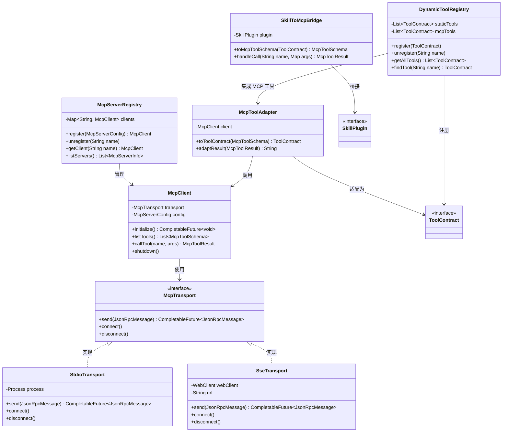
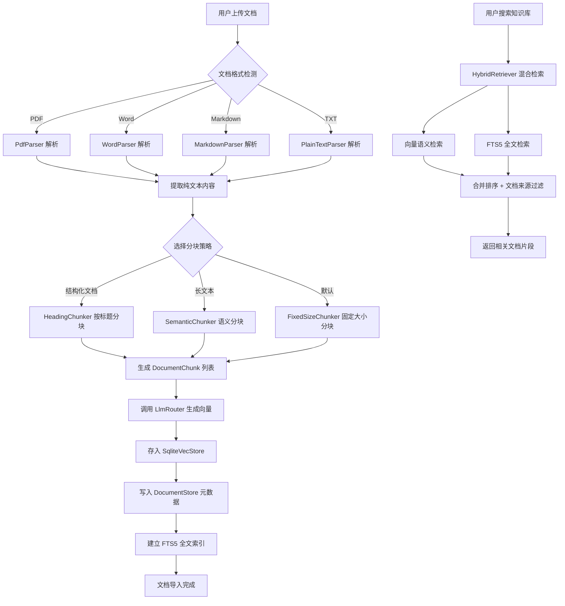
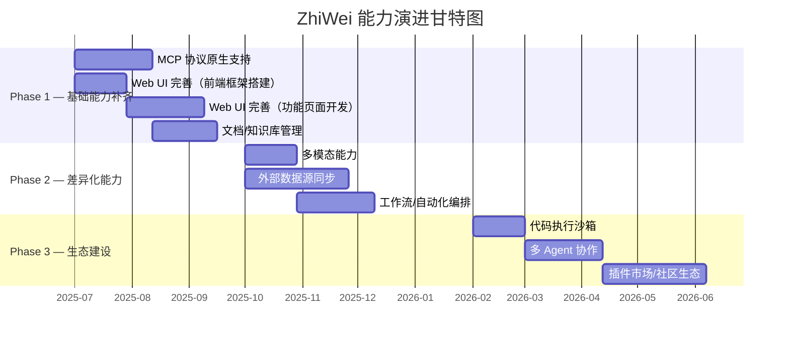

# ZhiWei 能力演进路线图

> 本文档基于 ZhiWei 项目现状，分析当前能力差距，规划未来架构演进方向。
> 后续各能力模块可直接参照本文档创建对应的 spec 进行开发。

---

## 1. 现状评估

### 1.1 已实现能力矩阵

> 最后审计时间：2026-02-26，基于 git 提交记录和实际源码验证。Phase 0~3（模块 1~13）全部完成。

| 模块 | 能力项 | 状态 | 说明 | 对应 Spec |
|------|--------|------|------|-----------|
| **项目骨架** | Maven + Spring Boot + SQLite + Flyway | ✅ 已实现 | pom.xml、LifePilotApplication、DataSourceConfig、V1 迁移 | project-skeleton |
| **LLM 路由** | 多模型路由（LlmRouter） | ✅ 已实现 | 场景路由 + 优先级故障转移 + 指数退避重试 | llm-router |
| | 熔断器（CircuitBreakerManager） | ✅ 已实现 | CAS 并发安全 + SQLite 持久化 + V2 迁移 | llm-router |
| | Spring AI 适配器 | ✅ 已实现 | SpringAiProviderAdapter + ProviderAdapterFactory | llm-router |
| | Provider 注册表 | ✅ 已实现 | ProviderRegistry + ProviderHealthChecker（Virtual Thread） | llm-router |
| | 多模态支持 | ❌ 未实现 | 仅支持纯文本交互 | — |
| **Agent 引擎** | 控制循环（AgentLoop） | ✅ 已实现 | while 循环 + 预算检查 + 护栏 + 硬限制 50 次 | agent-core |
| | 状态机（StateReducer） | ✅ 已实现 | 确定性状态转换，switch 穷举 9 种 Action | agent-core |
| | 上下文工程（ContextAssembler） | ✅ 完整版 | 记忆检索槽位填充 + Token 预算动态分配 + 降级容错 | context-assembler-full |
| | 输出解析（ActionParser） | ✅ 已实现 | JSON → Action 解析，解析失败返回 ErrorRecovery | agent-core |
| | 轨迹记录（TraceRecorder） | ✅ 已实现 | 内存缓存 + SQLite 持久化（agent_traces + agent_trace_steps） | agent-core |
| | 会话管理（SessionManager） | ✅ 已实现 | SQLite 持久化 + 定时清理过期会话 | agent-core |
| | 主动推理（ProactiveReasoner） | ✅ 已实现 | 两阶段推理 + 智能降频 + 信号采集 + 通知分发 | proactive-reasoning |
| | 对话压缩（DialogCompressor） | ❌ 未实现 | 路线图规划中 | — |
| | 多 Agent 协作 | ❌ 未实现 | 路线图规划中（Phase 6） | — |
| **工具系统** | ToolContract sealed interface | ✅ 已实现 | BuiltinTool / YamlTool / McpTool 三层工具 | tool-system |
| | DynamicToolRegistry | ✅ 已实现 | 运行时注册/注销 + 优先级冲突解析 + 快照缓存 | tool-system |
| | ToolExecutionPipeline | ✅ 已实现 | 参数校验 → 护栏 → 幂等 → 执行 → 重试 → 轨迹 | tool-system |
| | GuardrailPolicy | ✅ 已实现 | 白名单/黑名单/风险审批 | tool-system |
| | ToolBridgeAgentToolProvider | ✅ 已实现 | ToolContract → Spring AI ToolCallback 桥接 | tool-system |
| **MCP 协议** | McpClient | ✅ 已实现 | 初始化握手 + listTools + callTool + shutdown | mcp-support |
| | McpTransport | ✅ 已实现 | StdioTransport + StreamableHttpTransport + SseTransport（骨架） | mcp-support |
| | McpToolAdapter | ✅ 已实现 | MCP Tool → ToolContract 适配 + 风险等级推断 | mcp-support |
| | McpServerRegistry | ✅ 已实现 | 连接管理 + 健康检查 + 指数退避自动重连 | mcp-support |
| | SkillToMcpBridge | ✅ 已实现 | 反向桥接 ToolContract → MCP Tool Schema | mcp-support |
| **记忆系统** | L1 工作记忆（WorkingMemory） | ✅ 已实现 | ConcurrentHashMap + 重要度加权淘汰 + Token 预算 | memory-foundation |
| | L2 情景记忆（EpisodicMemory） | ✅ 已实现 | conversations + messages 表 + FTS5 全文检索 | memory-foundation |
| | L3 语义记忆（SemanticMemory） | ✅ 已实现 | 时序实体/关系 + 版本化更新 + 冲突检测 + 时间旅行查询 | semantic-memory |
| | 知识图谱 | ✅ 已实现 | TemporalEntity + TemporalRelation + 递归 CTE 图遍历 | semantic-memory |
| | 混合检索（HybridRetriever） | ✅ 已实现 | 向量 + FTS5 + 图遍历，加权 RRF 融合 + 时间衰减 | semantic-memory |
| | 向量检索（VectorSearcher） | ✅ 已实现 | sqlite-vec KNN + JVM 暴力降级 | semantic-memory |
| | 冲突检测（ConflictDetector） | ✅ 已实现 | 精确匹配 → 语义匹配 → LLM 消歧义（三级） | semantic-memory |
| | L4 程序记忆（Procedural） | ❌ 未实现 | 路线图规划中 | — |
| | 记忆巩固管线 | ❌ 未实现 | 路线图规划中 | — |
| | 遗忘策略 | ❌ 未实现 | 路线图规划中 | — |
| | 文档/知识库管理 | ✅ 已实现 | 基础 CRUD + Markdown/TXT 解析 + 固定大小分块 | knowledge-base |
| **技能插件** | 内置技能（Todo/Schedule/Habit/Memory） | ✅ 已实现 | 四个核心 Skill 已实现 | builtin-skills |
| | Skill 系统（YAML 声明式 + 热加载 + 自扩展） | ✅ 已实现 | SkillRegistry + SkillActivator + 三重验证 + Gap 检测 | skill-system |
| **交互层** | CLI 交互（JLine 3 REPL + 快捷命令 + 快速路径） | ✅ 已实现 | CliShell + CommandRouter + FastPathRunner + ResponseRenderer | cli-interaction |
| | Gateway + 中间件管道 | ✅ 已实现 | 6 层中间件（Auth→RateLimit→Security→Router→Execution→Audit） | gateway-implementation, gateway-middleware |
| | Channel 适配器（企微/钉钉/飞书/Webhook） | ✅ 已实现 | AbstractChannelAdapter + 4 个通道实现 + 指数退避重连 | channel-adapters |
| | Web UI | ❌ 未实现 | 路线图规划中（Phase 5） | — |
| | 系统托盘通知 | ❌ 未实现 | 路线图规划中（Phase 5） | — |
| **可观测性** | TraceRecorder | ✅ 已实现 | 内存缓存 + SQLite 持久化（agent_traces + agent_trace_steps） | agent-core |
| | GuardrailPolicy | ✅ 已实现 | 白名单/黑名单/风险审批 | tool-system |
| | DataRedactor / GuardrailAdvisor / TraceQuery | ❌ 未实现 | 高级可观测性，路线图规划中（Phase 5） | — |

### 1.2 Spec 完成进度

> 基于 git 合并记录（`git log --oneline --all --graph`）验证。

| Phase | Spec | 状态 | 合并提交 | 说明 |
|-------|------|------|---------|------|
| Phase 0 | project-skeleton | ✅ 已完成 | `505395f` | Maven 骨架 + Spring Boot + SQLite + Flyway V1 |
| Phase 1 | llm-router | ✅ 已完成 | `3328112` | LlmRouter + CircuitBreaker + ProviderAdapter + Flyway V2 |
| Phase 1 | agent-core | ✅ 已完成 | `9458699` | AgentLoop + StateReducer + ContextAssembler + Flyway V3~V4 |
| Phase 1 | tool-system | ✅ 已完成 | `fae2226` | ToolContract + DynamicToolRegistry + GuardrailPolicy + Pipeline |
| Phase 1 | mcp-support | ✅ 已完成 | `2594755` | McpClient + Transport + Adapter + Registry + Bridge |
| Phase 2 | memory-foundation | ✅ 已完成 | `451c7ef` | WorkingMemory + EpisodicMemory + Flyway V5~V6 |
| Phase 2 | semantic-memory | ✅ 已完成 | `8146bdd` | SemanticMemory + HybridRetriever + 知识图谱 + Flyway V7 |
| Phase 2 | ContextAssembler 完整版 | ✅ 已完成 | — | 记忆检索 + Token 预算动态分配 + 降级容错 |
| Phase 2 | 文档/知识库管理 | ✅ 已完成 | — | 基础 CRUD + Markdown/TXT 解析 + 固定大小分块 |
| Phase 3 | builtin-skills | ✅ 已完成 | — | Todo / Schedule / Habit / Memory 四个核心 Skill |
| Phase 3 | skill-system | ✅ 已完成 | — | YAML 声明式 Skill + 热加载 + 三重验证 + 自扩展 |
| Phase 3 | cli-interaction | ✅ 已完成 | — | JLine 3 REPL + 快捷命令 + 快速路径 + CJK 渲染 |
| Phase 3 | proactive-reasoning | ✅ 已完成 | — | 两阶段推理 + 智能降频 + 信号采集 + 通知分发 |
| Phase 3 | gateway-implementation | ✅ 已完成 | — | MessageGateway + 6 层中间件管道 |
| Phase 3 | gateway-middleware | ✅ 已完成 | — | Auth + RateLimit + Security + Router + Execution + Audit |
| Phase 3 | channel-adapters | ✅ 已完成 | — | 企微/钉钉/飞书/Webhook 适配器 + 指数退避重连 |
| — | eliminate-hardcoding | ✅ 已完成 | — | 硬编码常量外部化到 ConfigurationProperties |

### 1.3 与 OpenClaw 的差距分析

| 能力维度 | OpenClaw | ZhiWei 现状 | 差距评估 |
|----------|----------|----------------|----------|
| **工具协议** | MCP 协议原生支持，可连接任意 MCP Server | ✅ MCP Client + Transport + Adapter + Registry | 🟢 已持平 |
| **多模型路由** | 支持多 LLM Provider 切换 | ✅ 已实现场景路由 + 优先级故障转移 | 🟢 已持平 |
| **上下文管理** | 对话历史 + 文件上下文 | ✅ 三层认知记忆 + 知识图谱 + 混合检索 | 🟢 已超越 |
| **知识库管理** | 支持文档上传与检索 | ✅ 基础 CRUD + 解析器 + 分块 | 🟡 部分实现 — 缺少 DocumentIngester + 高级分块 + 检索集成 |
| **Web 界面** | 完整的 Web UI（对话、设置、工具管理） | ❌ 未实现 | 🟡 中等差距 — Phase 5 规划中 |
| **多模态** | 支持图片理解 | 纯文本交互 | 🟡 中等差距 — Phase 4 规划中 |
| **代码执行** | 沙箱代码执行 | 无代码执行能力 | 🟡 中等差距 — Phase 4 规划中 |
| **工作流编排** | 基于 Agent 循环的任务编排 | ✅ ProactiveReasoner 两阶段推理 + 智能降频 | 🟡 部分实现 — 缺少通用工作流引擎（Phase 4） |
| **多 Agent** | 单 Agent + 工具委托 | 单 Agent + SubAgent 激活模式 | 🟢 基本持平 |
| **本地优先** | 云端为主 | ✅ 完全本地运行，隐私优先 | 🟢 差异化优势 |
| **记忆系统** | 基础对话历史 | ✅ 三层认知记忆 + 知识图谱 + 混合检索 | 🟢 显著优势 |
| **主动推理** | 被动响应为主 | ✅ 两阶段推理 + 三态降频 + 信号采集 | 🟢 差异化优势 |
| **CLI 交互** | ❌ 无 CLI | ✅ JLine 3 REPL + 快捷命令 + 快速路径 | 🟢 差异化优势 |
| **多渠道接入** | Web UI only | ✅ CLI + 企微 + 钉钉 + 飞书 + Webhook | 🟢 显著优势 |
| **可观测性** | 基础日志 | ✅ TraceRecorder + GuardrailPolicy | 🟢 显著优势 |
| **记忆系统** | 基础对话历史 | ✅ 四层认知记忆 + 遗忘策略 + 记忆巩固 | 🟢 显著优势 |
| **主动推理** | 被动响应为主 | ✅ 主动推理 + 智能降频 | 🟢 差异化优势 |
| **可观测性** | 基础日志 | ✅ Trace + 护栏 + 数据脱敏 | 🟢 显著优势 |

---

## 2. 缺失能力清单

### 2.1 P0 — 核心竞争力

#### 1. MCP 协议原生支持

- **描述**：实现 MCP（Model Context Protocol）客户端，支持连接外部 MCP Server，同时将现有插件桥接为 MCP Tool
- **为什么需要**：MCP 已成为 AI Agent 工具调用的事实标准。不支持 MCP 意味着无法接入日益丰富的 MCP 工具生态（文件系统、数据库、浏览器、各类 SaaS API），严重限制了 ZhiWei 的扩展能力
- **优先级理由**：这是 Agent 能力的基础设施，后续的文档管理、外部同步、代码执行等能力都可以通过 MCP Server 的形式接入，投入产出比最高

#### 2. 文档/知识库管理

- **描述**：用户可主动上传文档（PDF / Word / Markdown / TXT），系统自动分块、向量化、建立索引，支持基于知识库的问答
- **为什么需要**：当前记忆系统仅从对话中被动提取知识，用户无法将已有的文档资料导入系统。个人知识库是 AI 助手的核心使用场景之一
- **优先级理由**：直接提升用户日常使用价值，且可复用现有的 VectorStore 和 HybridRetriever 基础设施，实现成本相对可控

#### 3. Web UI 完善

- **描述**：将现有基础聊天界面升级为完整的管理界面，包含对话、知识库管理、插件/MCP 管理、设置、轨迹查看等功能
- **为什么需要**：CLI 界面的使用门槛较高，完善的 Web UI 是产品可用性的基本要求。当前 Web UI 仅有基础聊天和 LLM 服务商管理功能
- **优先级理由**：直接影响用户体验和产品完整度，是其他功能（知识库管理、MCP 管理等）的展示载体

### 2.2 P1 — 重要差异化

#### 4. 多模态能力

- **描述**：支持图片理解（截图分析、照片识别）和文档解析（PDF 表格提取、扫描件 OCR）
- **为什么需要**：纯文本交互限制了使用场景。用户经常需要 AI 帮助理解图片内容、解析文档中的表格和图表
- **优先级理由**：Spring AI 已提供多模态 API 支持，实现成本较低；能显著扩展使用场景

#### 5. 外部数据源同步

- **描述**：支持与主流日历（Google Calendar / Outlook）、待办（Todoist / 滴答清单）、笔记（Obsidian）应用的双向同步
- **为什么需要**：用户的待办和日程数据分散在多个应用中，ZhiWei 作为个人助手需要获取完整的用户数据才能提供有价值的建议
- **优先级理由**：直接提升"个人助手"的核心价值，但涉及大量第三方 API 对接，工作量较大

#### 6. 工作流/自动化编排

- **描述**：用户可自定义触发-条件-动作链，例如"每天早上 8 点总结昨日待办完成情况"、"收到日程提醒时自动准备会议资料"
- **为什么需要**：当前 ProactiveReasoner 仅支持系统预设的提醒场景，用户无法自定义自动化规则。自动化是个人助手的重要差异化能力
- **优先级理由**：能充分发挥现有 Agent 引擎和技能插件的组合能力，但需要设计工作流 DSL 和执行引擎

#### 7. 代码执行沙箱

- **描述**：安全执行用户提供的代码片段（Python / JavaScript / Shell），支持数据处理、计算、脚本自动化等场景
- **为什么需要**：代码执行是 AI Agent 的重要能力之一，能处理数据分析、文件批处理、API 调用等复杂任务
- **优先级理由**：显著扩展 Agent 的能力边界，但安全隔离方案需要仔细设计

### 2.3 P2 — 锦上添花

#### 8. 多 Agent 协作

- **描述**：支持专家 Agent 委托和协作，主 Agent 可将特定任务委托给专家 Agent（如写作助手、数据分析师、代码审查员）
- **为什么需要**：单 Agent 架构在处理复杂多步骤任务时效率有限，专家 Agent 可以提供更专业的处理能力
- **优先级理由**：架构复杂度较高，且当前单 Agent + 多工具的模式已能覆盖大部分场景

#### 9. 插件市场/社区生态

- **描述**：建立插件发布、发现、安装的市场机制，支持社区贡献插件
- **为什么需要**：生态系统是产品长期竞争力的关键，但需要先完成 MCP 协议支持作为插件标准
- **优先级理由**：依赖 MCP 协议支持和足够的用户基数，属于中长期目标

#### 10. 移动端适配

- **描述**：提供移动端访问能力（PWA 或响应式 Web UI），支持手机端查看和简单交互
- **为什么需要**：移动场景下的快速查看和简单操作需求
- **优先级理由**：可通过 Web UI 的响应式设计部分满足，无需独立开发原生应用

---

## 3. 架构设计方案

### 3.1 MCP 协议原生支持

**现状**：自定义 `SkillPlugin` 接口 + `ToolContract` 工具契约，工具集在编译期固定。

**目标**：实现 MCP Client，能连接外部 MCP Server；现有插件可通过桥接层暴露为 MCP Tool；支持运行时动态注册/注销工具。

**架构方案**：

新增 `com.lifepilot.mcp` 包，核心类设计如下：

- `McpClient`：MCP 客户端核心，基于 stdio / SSE 两种传输协议与 MCP Server 通信，管理 Server 进程生命周期（启动、心跳、重启、关闭）
- `McpTransport`：传输层抽象接口
  - `StdioTransport`：基于标准输入输出的本地进程通信
  - `SseTransport`：基于 Server-Sent Events 的远程通信
- `McpToolAdapter`：将 MCP Server 暴露的 Tool 适配为现有 `ToolContract` 接口，使 Agent 引擎无需感知工具来源
- `McpServerRegistry`：MCP Server 注册中心，管理所有已配置的 MCP Server 元数据和连接状态
- `McpServerConfig`：MCP Server 配置模型，对应 `application.yml` 中的声明
- `SkillToMcpBridge`：将现有 `SkillPlugin` 桥接为 MCP Tool Schema，支持反向暴露
- `DynamicToolRegistry`：动态工具注册表，替代现有静态工具发现机制，支持运行时注册/注销

**配置方式**（`application.yml`）：

```yaml
lifepilot:
  mcp:
    servers:
      - name: filesystem
        command: npx
        args: ["-y", "@modelcontextprotocol/server-filesystem", "/home/user/documents"]
        transport: stdio
      - name: browser
        url: http://localhost:3001/sse
        transport: sse
```

**类图**：



**影响范围**：
- `com.lifepilot.skill`：`ToolContract` 接口保持不变，新增 MCP 工具来源
- `com.lifepilot.agent`：`AgentToolProvider` 需要切换到 `DynamicToolRegistry`，支持动态工具发现
- `com.lifepilot.interaction.web`：新增 MCP Server 管理页面的 REST API

### 3.2 文档/知识库管理

**现状**：记忆系统仅从对话中通过 `KnowledgeExtractionPipeline` 提取知识，不支持用户主动上传文档。

**目标**：用户可主动上传文档（PDF / Word / Markdown / TXT），系统自动分块、向量化、建立索引，支持基于知识库的语义检索和问答。

**架构方案**：

新增 `com.lifepilot.knowledge` 包，核心类设计如下：

- `DocumentIngester`：文档导入入口，协调解析、分块、向量化的完整流程
- `DocumentParser`：文档解析抽象接口
  - `PdfParser`：PDF 解析（基于 Apache PDFBox）
  - `WordParser`：Word 解析（基于 Apache POI）
  - `MarkdownParser`：Markdown 解析
  - `PlainTextParser`：纯文本解析
- `ChunkingStrategy`：分块策略接口
  - `FixedSizeChunker`：固定大小分块（按 token 数）
  - `SemanticChunker`：语义分块（基于段落和语义边界）
  - `HeadingChunker`：按标题层级分块（适用于结构化文档）
- `DocumentStore`：文档元数据存储（SQLite），记录文档名称、来源、上传时间、分块数量等
- `DocumentChunk`：文档分块模型，包含原文、向量 ID、文档 ID、位置信息
- `KnowledgePlugin`：知识库技能插件，提供"上传文档"、"搜索知识库"、"列出文档"、"删除文档"等工具
- 复用现有 `SqliteVecStore` 进行向量存储，新增 `source_type` 字段区分对话知识和文档知识
- 复用现有 `HybridRetriever` 进行检索，新增文档来源过滤条件

**流程图**：



**影响范围**：
- `com.lifepilot.memory`：`SqliteVecStore` 需要新增 `source_type` 和 `document_id` 字段；`HybridRetriever` 需要支持按文档来源过滤
- `com.lifepilot.skill`：新增 `KnowledgePlugin` 技能插件
- `com.lifepilot.interaction.web`：新增知识库管理页面的 REST API

### 3.3 Web UI 完善

**现状**：基础聊天界面 + 命令执行 + LLM 服务商管理，前端为单个 `index.html` 静态页面。

**目标**：完整的单页应用管理界面，包含对话、知识库管理、插件/MCP 管理、设置、轨迹查看等功能模块。

**架构方案**：

前端技术选型：Vue 3 + Vite + Pinia + Vue Router，打包后作为 Spring Boot 静态资源部署。

后端扩展 `com.lifepilot.interaction.web` 包，新增 REST Controller：

- `WebKnowledgeController`：知识库管理 API（上传文档、列出文档、删除文档、搜索）
- `WebMcpController`：MCP Server 管理 API（列出 Server、添加/删除 Server、查看工具列表、测试连接）
- `WebTraceController`：轨迹查看 API（查询轨迹列表、轨迹详情、轨迹回放数据）
- `WebSettingsController`：设置管理 API（读取/更新各模块配置）
- `WebPluginController`：插件管理 API（列出插件、启用/禁用、查看工具列表）

页面规划：

| 页面 | 路由 | 功能 |
|------|------|------|
| 对话页 | `/chat` | 对话交互、历史记录、对话管理 |
| 知识库页 | `/knowledge` | 文档上传、文档列表、知识搜索 |
| 插件管理页 | `/plugins` | 内置插件管理、MCP Server 配置 |
| 设置页 | `/settings` | LLM 服务商、系统参数、通知配置 |
| 轨迹回放页 | `/traces` | Agent 执行轨迹查看、步骤回放 |

**影响范围**：
- `com.lifepilot.interaction.web`：新增多个 REST Controller
- 前端：从单文件 HTML 迁移到 Vue 3 SPA 项目（`src/main/frontend/`）
- 构建：`pom.xml` 新增 `frontend-maven-plugin` 集成前端构建

### 3.4 多模态能力

**现状**：纯文本交互，`LlmRouter` 仅处理文本消息。

**目标**：支持图片理解（截图分析、照片识别）和文档解析（PDF 表格提取），利用 Spring AI 的多模态 API。

**架构方案**：

- `LlmRouter` 扩展：
  - 新增 `routeMultimodal(MultimodalRequest)` 方法，支持包含图片和文本的混合消息
  - 利用 Spring AI 的 `Media` 类型封装多模态内容
  - 路由策略新增模态维度：多模态请求优先路由到支持视觉的模型（如 GPT-4o、Qwen-VL）
- `MultimodalRequest`：多模态请求模型，包含文本内容和媒体附件列表
- `MediaProcessor`：媒体预处理器，负责图片压缩、格式转换、大小校验
- `DocumentExtractor`：文档内容提取器，集成 Apache Tika 进行格式检测和文本提取
- `FilePlugin`：新增文件处理技能插件，提供"分析图片"、"解析文档"等工具
- `ProviderCapability`：服务商能力声明，标记各 Provider 是否支持多模态

**影响范围**：
- `com.lifepilot.llm`：`LlmRouter` 新增多模态路由；`SpringAiProviderAdapter` 需要支持 `Media` 类型消息
- `com.lifepilot.skill`：新增 `FilePlugin`
- `pom.xml`：新增 Apache Tika 依赖

### 3.5 外部数据源同步

**现状**：数据完全本地存储，待办、日程等数据无法与外部应用同步。

**目标**：支持与主流日历、待办、笔记应用的双向同步，实现数据统一管理。

**架构方案**：

新增 `com.lifepilot.sync` 包，核心类设计如下：

- `SyncEngine`：同步引擎核心，管理同步任务调度、状态追踪、错误重试
- `SyncTask`：同步任务模型，记录同步方向、状态、最后同步时间、增量标记
- `SyncConnector`：同步连接器抽象接口
  - `CalDavConnector`：CalDAV 协议连接器（Google Calendar / Outlook / iCloud）
  - `TodoistConnector`：Todoist REST API 连接器
  - `TickTickConnector`：滴答清单 API 连接器
  - `ObsidianConnector`：Obsidian Vault 文件夹监听（基于 WatchService）
- `ConflictResolver`：冲突解决策略
  - `LastWriteWinsResolver`：最后写入优先（默认策略）
  - `UserConfirmResolver`：冲突时请求用户确认
- `ExternalIdMapping`：外部 ID 映射表（SQLite），维护本地实体与外部系统的 ID 对应关系
- `SyncScheduler`：同步调度器，支持定时同步（Cron 表达式）和 Webhook 实时触发
- `OAuthTokenStore`：OAuth Token 安全存储，管理第三方 API 的认证凭据

**影响范围**：
- `com.lifepilot.skill`：`TodoPlugin` 和 `SchedulePlugin` 需要支持外部 ID 映射，CRUD 操作需要触发同步
- `com.lifepilot.interaction.web`：新增同步配置管理页面
- `application.yml`：新增同步相关配置项

### 3.6 工作流/自动化编排

**现状**：`ProactiveReasoner` 仅支持系统预设的提醒场景（30 分钟定时评估），用户无法自定义自动化规则。

**目标**：用户可自定义触发-条件-动作链，支持复杂的多步骤自动化工作流。

**架构方案**：

新增 `com.lifepilot.workflow` 包，核心类设计如下：

- `WorkflowEngine`：工作流执行引擎，负责工作流实例的创建、执行、暂停、恢复
- `WorkflowDefinition`：工作流定义模型，支持 YAML/JSON 格式的声明式定义
- `WorkflowInstance`：工作流运行实例，记录执行状态和上下文变量
- `TriggerRegistry`：触发器注册中心
  - `CronTrigger`：时间触发（基于 Cron 表达式）
  - `EventTrigger`：事件触发（监听系统事件，如待办到期、日程开始）
  - `ConditionTrigger`：条件触发（基于数据条件，如"未完成待办数 > 5"）
  - `SignalTrigger`：信号触发（与 `SignalCollector` 集成）
- `ActionExecutor`：动作执行器，将工作流动作映射到技能插件调用
- `WorkflowStore`：工作流持久化（SQLite），存储工作流定义和执行历史
- `WorkflowPlugin`：工作流技能插件，提供"创建工作流"、"列出工作流"、"启用/禁用工作流"等工具

**工作流定义示例**（YAML）：

```yaml
name: 每日早报
trigger:
  type: cron
  expression: "0 0 8 * * ?"
conditions:
  - type: weekday  # 仅工作日执行
steps:
  - action: todo.list
    params: { status: PENDING }
    output: pending_todos
  - action: schedule.today
    output: today_schedule
  - action: agent.summarize
    params:
      template: "今日待办 {{pending_todos.count}} 项，日程 {{today_schedule.count}} 个。{{summary}}"
    output: morning_brief
  - action: notify.send
    params:
      channel: default
      message: "{{morning_brief}}"
```

**影响范围**：
- `com.lifepilot.agent`：`ProactiveReasoner` 需要支持自定义信号源；`SignalCollector` 新增工作流事件信号
- `com.lifepilot.skill`：新增 `WorkflowPlugin`
- `com.lifepilot.interaction.web`：新增工作流管理页面（可视化编辑器为远期目标）

### 3.7 代码执行沙箱

**现状**：无代码执行能力，Agent 无法运行用户提供的代码片段。

**目标**：安全执行用户提供的代码片段（Python / JavaScript / Shell），支持数据处理、计算、脚本自动化等场景。

**架构方案**：

在 `com.lifepilot.skill` 包中新增代码执行插件：

- `CodeExecutionPlugin`：代码执行技能插件，提供"执行代码"、"安装依赖"等工具
- `SandboxExecutor`：沙箱执行器抽象接口
  - `ProcessSandbox`：基于 `ProcessBuilder` 的轻量级沙箱（默认方案）
    - 超时限制（默认 30 秒）
    - 内存限制（通过 JVM 参数或 cgroup）
    - 文件系统隔离（临时目录 + 只读挂载）
    - 网络隔离（可选）
  - `DockerSandbox`：基于 Docker 容器的强隔离沙箱（可选方案）
    - 预构建的语言运行时镜像
    - 完整的资源限制（CPU、内存、磁盘、网络）
    - 执行完毕自动销毁容器
- `CodeValidator`：代码预检查器，检测危险操作（文件删除、网络请求、系统命令）
- `ExecutionResult`：执行结果模型，包含标准输出、标准错误、退出码、执行时间

**护栏集成**：
- 代码执行操作在 `GuardrailPolicy` 中标记为 `CRITICAL` 风险级别
- 执行前需要用户确认（通过 `GuardrailAdvisor` 拦截）
- 所有执行记录写入 `TraceRecorder` 审计日志

**影响范围**：
- `com.lifepilot.skill`：新增 `CodeExecutionPlugin`
- `com.lifepilot.observability`：`GuardrailPolicy` 新增代码执行相关策略规则
- `application.yml`：新增沙箱配置（超时、内存限制、是否启用 Docker）

### 3.8 多 Agent 协作

**现状**：单 Agent 架构，所有任务由同一个 `AgentLoop` 处理。

**目标**：支持专家 Agent 委托和协作，主 Agent 可将特定任务委托给具有专业能力的子 Agent。

**架构方案**：

扩展 `com.lifepilot.agent` 包，核心类设计如下：

- `AgentRegistry`：Agent 注册中心，管理所有可用 Agent 的元数据和能力声明
- `AgentDefinition`：Agent 定义模型，包含名称、描述、System Prompt、可用工具集、适用场景
- `AgentDelegation`：Agent 间委托协议
  - `DelegateRequest`：委托请求，包含任务描述、上下文、约束条件
  - `DelegateResponse`：委托响应，包含执行结果、状态、耗费资源
- `DelegateToolContract`：委托工具契约，作为主 Agent 的一个工具暴露，调用时创建子 Agent 执行
- `AgentFactory`：Agent 工厂，根据 `AgentDefinition` 创建 Agent 实例（复用 `AgentLoop` 核心逻辑）
- 预设专家 Agent：
  - `WritingAgent`：写作助手（长文撰写、润色、翻译）
  - `AnalysisAgent`：数据分析师（数据处理、图表生成）
  - `ResearchAgent`：调研助手（信息搜集、总结归纳）

**影响范围**：
- `com.lifepilot.agent`：`AgentLoop` 需要支持子 Agent 模式（独立预算、独立上下文）；新增委托工具
- `com.lifepilot.llm`：子 Agent 可能使用不同的模型路由策略
- `application.yml`：新增 Agent 定义配置

---

## 4. 实施路线图

### 实施原则

1. **渐进式交付**：每个 Phase 交付可独立使用的完整功能
2. **复用优先**：优先复用现有基础设施（VectorStore、HybridRetriever、GuardrailEngine 等）
3. **向后兼容**：新能力不破坏现有功能，通过适配器和桥接层实现平滑过渡
4. **可选依赖**：外部依赖（Docker、第三方 API）作为可选增强，不影响核心功能

### 阶段规划



### Phase 1 — 基础能力补齐（预计 2025 Q3）

| 能力 | 预估工期 | 前置依赖 | 交付物 |
|------|----------|----------|--------|
| MCP 协议原生支持 | 6 周 | 无 | `com.lifepilot.mcp` 包、MCP Server 配置管理、现有插件桥接 |
| Web UI 完善 | 10 周 | 无 | Vue 3 SPA 项目、对话页、设置页、插件管理页 |
| 文档/知识库管理 | 5 周 | MCP 协议支持（可选） | `com.lifepilot.knowledge` 包、文档上传/检索、知识库管理页 |

### Phase 2 — 差异化能力（预计 2025 Q4 ~ 2026 Q1）

| 能力 | 预估工期 | 前置依赖 | 交付物 |
|------|----------|----------|--------|
| 多模态能力 | 4 周 | 无 | LlmRouter 多模态扩展、FilePlugin、文档解析 |
| 外部数据源同步 | 8 周 | 无 | `com.lifepilot.sync` 包、CalDAV/Todoist/Obsidian 连接器 |
| 工作流/自动化编排 | 6 周 | 无 | `com.lifepilot.workflow` 包、工作流引擎、YAML 定义 |

### Phase 3 — 生态建设（预计 2026 Q1 ~ Q2）

| 能力 | 预估工期 | 前置依赖 | 交付物 |
|------|----------|----------|--------|
| 代码执行沙箱 | 4 周 | 无 | CodeExecutionPlugin、ProcessSandbox |
| 多 Agent 协作 | 6 周 | MCP 协议支持 | AgentRegistry、委托协议、预设专家 Agent |
| 插件市场/社区生态 | 8 周 | MCP 协议支持 | 插件发布/发现/安装机制 |

---

## 5. 技术风险与依赖

| 能力 | 技术风险 | 外部依赖 | 缓解措施 |
|------|----------|----------|----------|
| **MCP 协议支持** | MCP 协议仍在快速演进，API 可能发生变化；stdio 进程管理的稳定性（僵尸进程、崩溃恢复） | MCP SDK（Java 版本成熟度待验证）；Node.js 运行时（部分 MCP Server 基于 Node） | 封装 Transport 抽象层隔离协议变化；实现进程健康检查和自动重启；优先使用 Spring AI 的 MCP 集成（如果可用） |
| **文档/知识库管理** | 大文档分块质量影响检索效果；向量化大量文档的性能和成本；PDF 解析的格式兼容性 | Apache PDFBox（PDF 解析）；Apache POI（Word 解析）；Embedding 模型 API 调用量 | 提供多种分块策略供用户选择；实现批量向量化和异步处理；分块结果支持人工校正 |
| **Web UI 完善** | 前端技术栈引入增加构建复杂度；WebSocket 长连接的稳定性；前后端接口一致性维护 | Vue 3 + Vite 工具链；frontend-maven-plugin | 使用 OpenAPI 规范生成前后端接口契约；WebSocket 断线自动重连；前端构建集成到 Maven 生命周期 |
| **多模态能力** | 多模态模型的可用性和成本；图片传输的带宽消耗；本地模型（Ollama）的多模态支持有限 | 支持视觉的 LLM Provider（GPT-4o、Qwen-VL 等）；Apache Tika（文档格式检测） | 路由策略自动降级：多模态请求优先路由到支持视觉的模型，不可用时提示用户；图片压缩预处理减少带宽 |
| **外部数据源同步** | 第三方 API 的稳定性和限流；OAuth 认证流程的复杂性；双向同步的冲突解决；数据一致性保证 | Google Calendar API / Microsoft Graph API / Todoist API / 滴答清单 API；OAuth 2.0 认证 | 实现指数退避重试；OAuth Token 自动刷新；冲突解决策略可配置（默认 Last-Write-Wins）；同步操作幂等设计 |
| **工作流/自动化编排** | 工作流 DSL 的表达能力与复杂度平衡；长时间运行工作流的状态恢复；工作流间的资源竞争 | 无重大外部依赖 | 从简单的线性工作流开始，逐步支持条件分支和并行；工作流状态持久化到 SQLite 支持崩溃恢复；工作流执行队列限制并发数 |
| **代码执行沙箱** | 安全隔离的完备性（逃逸风险）；ProcessBuilder 方案的隔离能力有限；Docker 依赖增加部署复杂度 | Python / Node.js 运行时（用户自行安装）；Docker（可选） | ProcessBuilder 方案作为默认轻量方案，配合文件系统隔离和超时限制；Docker 方案作为可选强隔离方案；所有执行需要用户确认 + 护栏拦截 |
| **多 Agent 协作** | 子 Agent 的上下文隔离与共享平衡；Agent 间通信的延迟；总 Token 消耗的控制 | 无重大外部依赖 | 子 Agent 使用独立的上下文窗口和 Token 预算；委托结果摘要后返回主 Agent（减少 Token 传递）；限制委托深度（最多 2 层） |
| **插件市场/社区生态** | 插件安全审核机制；版本兼容性管理；社区运营成本 | 插件托管平台（可选 GitHub Releases） | 插件沙箱隔离执行；语义化版本管理；从 MCP Server 目录（如 mcp.so）引导初期生态 |

### 通用技术风险

| 风险类别 | 描述 | 缓解措施 |
|----------|------|----------|
| **SQLite 并发性能** | 随着功能增加，SQLite 的写入并发可能成为瓶颈 | 使用 WAL 模式；写操作队列化；监控数据库大小和查询性能；预留迁移到 PostgreSQL 的可能性 |
| **本地资源消耗** | 多个 MCP Server 进程 + 向量化 + 同步任务可能消耗大量系统资源 | 实现资源监控和自适应调度；MCP Server 按需启动/停止；向量化任务限制并发 |
| **LLM API 成本** | 知识提取、向量化、多模态等功能增加 API 调用量 | 本地模型（Ollama）优先策略；缓存机制减少重复调用；用户可配置各功能的模型选择 |
| **数据迁移** | 数据库 Schema 变更需要平滑迁移 | 使用 Flyway 管理数据库版本迁移；每次 Schema 变更提供迁移脚本 |

---

## 6. 竞品分析：AstrBot

> 分析时间：2026-02-23
> 项目地址：[AstrBot](https://github.com/AstrBotDevs/AstrBot)（13k+ Stars，Python 生态，AGPL-v3）

### 6.1 项目概况

AstrBot 定位为"一站式 Agentic IM 聊天机器人基础设施"，核心面向多平台 IM 聊天场景。与 ZhiWei 的"个人 AI Agent 助手 + 主动智能"定位有交集但侧重不同。

| 维度 | AstrBot | ZhiWei |
|------|---------|-----------|
| 定位 | 多平台 IM 聊天机器人基础设施 | 个人 AI Agent 助手（主动智能） |
| 语言 | Python | Java 22 |
| 架构风格 | 事件总线 + 管线架构 | 状态化控制循环 + 确定性状态机 |
| 部署模式 | Docker / uv / Tauri 桌面 / 面板一键部署 | Spring Boot JAR |
| 平台覆盖 | QQ / Telegram / Discord / 企微 / 飞书 / 钉钉 / Slack 等 10+ 平台 | 企微 / 钉钉 / 飞书 + CLI + 系统托盘 |
| 插件生态 | 900+ 社区插件 | SkillPlugin 接口（内置 4 个插件） |
| Stars | 13k+ | — |

### 6.2 AstrBot 的优势与可借鉴点

#### 1. 部署体验

AstrBot 提供了极其丰富的部署方式：Docker Compose、`uv tool install astrbot` 一行命令安装、Tauri 桌面应用、宝塔面板 / 1Panel 一键部署、Windows 安装器、CasaOS 等。不同技术水平的用户都能快速上手。

**借鉴建议**：
- 提供 Docker 镜像 + `docker-compose.yml` 一键启动
- 打包为可执行 JAR 或 GraalVM native image，降低 Java 环境依赖
- 完善 `start.bat` / `start.sh` 脚本，自动检测环境

#### 2. Agent Runner 抽象层

AstrBot 将"Chat Provider"（负责文本补全）和"Agent Runner"（负责思考+执行循环）做了清晰分离。还支持接入 Dify、Coze、阿里云百炼等 LLMOps 平台作为 Agent Runner。

**借鉴建议**：
- ZhiWei 的 AgentLoop 和 LlmRouter 已有类似分离，但可以考虑允许外部 Agent 平台（如 Dify）作为可选执行引擎
- 用户已在 Dify 上搭建的工作流可直接被 ZhiWei 调度，降低迁移成本

#### 3. SubAgent 轻量编排

AstrBot 的 SubAgent 设计：主 Agent 只看到 `transfer_to_<subagent_name>` 委托工具，每个 SubAgent 有独立的 Persona、工具集，甚至可以用不同的模型 Provider（如主 Agent 用 GPT-4o，子 Agent 用 GPT-4o-mini 节省成本）。

**借鉴建议**：
- ZhiWei 路线图中的"多 Agent 协作"（Phase 3）可参考此方案
- 不需要复杂的 Agent 间通信协议，用"委托工具"模式即可
- 每个 SubAgent 独立预算、独立上下文，与 ZhiWei 的 Budget 机制天然兼容

#### 4. Agent Sandbox 沙箱环境

AstrBot 使用 Shipyard 项目做 Docker 容器级沙箱，支持会话级资源复用、数据持久化（`/home/<session_id>` 自动挂载）、实例 TTL 自动续期。

**借鉴建议**：
- ZhiWei 路线图中的"代码执行沙箱"（Phase 3）可参考 Shipyard 的设计
- 沙箱实例 TTL + 操作续期机制比简单的超时限制更灵活
- 多会话共享沙箱实例可节省资源（ZhiWei 当前方案是 ProcessBuilder 轻量沙箱 + 可选 Docker）

#### 5. 插件生态规模

AstrBot 拥有 900+ 社区插件，支持 WebUI 一键安装。这是其最大的护城河。

**借鉴建议**：
- 加速 MCP 协议支持落地（P0），直接复用 MCP 生态工具
- 插件市场可先不做，但至少提供 GitHub 仓库索引 + CLI 安装命令
- 参考 AstrBot 的插件提交流程（直接在主仓库提交）

#### 6. 知识库功能已落地

AstrBot 支持多知识库管理、文件上传（最大 128MB）、Embedding + Reranker 双模型检索。虽然架构深度不如 ZhiWei 的四层认知记忆，但已是可用的产品功能。

**借鉴建议**：
- ZhiWei 的记忆系统架构更先进，但文档/知识库管理仍在路线图上
- 建议优先落地此功能，用户感知最直接
- Reranker 模型可作为可选增强集成到 HybridRetriever 中

#### 7. 平台覆盖广度

AstrBot 支持 QQ、Telegram、Discord、LINE、Satori、Misskey、WhatsApp 等十几个平台。

**借鉴建议**：
- ZhiWei 定位是"个人助手"而非"群聊机器人"，不需要全覆盖
- 可考虑增加 Telegram（海外用户）和微信公众号/微信客服（国内个人用户最常用）

### 6.3 ZhiWei 的差异化优势（无需对标）

| 能力 | ZhiWei | AstrBot |
|------|-----------|---------|
| 四层认知记忆 + 时序知识图谱 | ✅ 已实现 | ❌ 仅基础对话历史 |
| 主动推理 + 智能降频状态机 | ✅ 已实现 | ❌ 被动响应为主 |
| StateReducer 确定性状态机 | ✅ 可测试、可回放 | ❌ 无此设计 |
| Trace 级可观测性 + 护栏引擎 | ✅ 已实现 | ❌ 基础日志 |
| 本地优先隐私设计 | ✅ 核心原则 | ⚠️ 偏云端部署 |
| 混合检索（向量 + FTS5 + 图遍历） | ✅ 已实现 | ❌ 仅向量检索 |
| 记忆巩固 + 遗忘策略 | ✅ 已实现 | ❌ 无此能力 |

### 6.4 行动建议优先级

| 优先级 | 借鉴项 | 对应路线图 | 预估影响 |
|--------|--------|-----------|----------|
| P0 | 部署体验优化（Docker + 一键脚本） | 新增 | 降低用户上手门槛 |
| P0 | 加速 MCP 协议支持 | Phase 1 已规划 | 接入 MCP 生态 |
| P0 | 知识库功能优先落地 | Phase 1 已规划 | 用户感知最直接 |
| P1 | SubAgent 轻量编排模式 | Phase 3 多 Agent 协作 | 简化实现方案 |
| P1 | Reranker 模型集成 | 可融入知识库功能 | 提升检索精度 |
| P2 | Agent Sandbox 参考 Shipyard | Phase 3 代码执行沙箱 | 更成熟的沙箱方案 |
| P2 | 增加 Telegram / 微信公众号平台 | 新增 | 扩大用户覆盖 |


### 6.5 源码级深度分析（代码实现层面）

> 以下分析基于 AstrBot `master` 分支源码的逐文件阅读，聚焦于实现模式和架构决策，为 ZhiWei 提供代码级借鉴。

#### 6.5.1 整体代码结构

```
astrbot/
├── api/                    # 公共 API 层（暴露给插件的接口）
├── builtin_stars/          # 内置插件（Star 是 AstrBot 对插件的称呼）
├── cli/                    # CLI 入口
├── core/                   # 核心引擎
│   ├── agent/              # Agent 抽象层（Agent 模型、Runner、MCP Client、Handoff）
│   │   ├── runners/        # Agent Runner 实现（tool_loop、dify、coze、dashscope）
│   │   ├── agent.py        # Agent 数据模型（泛型 dataclass）
│   │   ├── handoff.py      # SubAgent 委托工具（HandoffTool）
│   │   ├── mcp_client.py   # MCP 客户端（SSE + Stdio + Streamable HTTP）
│   │   └── tool.py         # 工具抽象（FunctionTool + ToolSet + 多 API 格式转换）
│   ├── computer/           # 沙箱执行环境
│   │   ├── booters/        # 沙箱启动器（Shipyard / Boxlite / Local）
│   │   ├── olayer/         # 输出层抽象
│   │   └── tools/          # 沙箱内置工具
│   ├── knowledge_base/     # 知识库系统
│   │   ├── chunking/       # 分块策略（FixedSize / Recursive）
│   │   ├── retrieval/      # 检索系统（Sparse + RankFusion）
│   │   ├── parsers/        # 文档解析器
│   │   └── kb_mgr.py       # 知识库管理器
│   ├── pipeline/           # 消息处理管线（9 个有序 Stage）
│   ├── platform/           # IM 平台适配器
│   ├── provider/           # LLM Provider 管理
│   ├── star/               # 插件系统（Star = Plugin）
│   ├── event_bus.py        # 事件总线
│   ├── core_lifecycle.py   # 核心生命周期管理
│   └── subagent_orchestrator.py  # SubAgent 编排器
├── dashboard/              # WebUI Dashboard
└── utils/                  # 工具类
```

**对比 ZhiWei**：ZhiWei 采用扁平的 `com.lifepilot.{module}` 包结构，AstrBot 则是深层嵌套的 `core/` 目录。ZhiWei 的模块划分更清晰（agent / memory / llm / skill / interaction / observability），AstrBot 的 `core/` 包含了几乎所有逻辑，模块边界相对模糊。

#### 6.5.2 事件总线 + 管线架构（核心消息处理流程）

AstrBot 的消息处理采用 **EventBus → PipelineScheduler → Stage 链** 的三层架构：

1. **EventBus**（`event_bus.py`）：维护一个 `asyncio.Queue`，各平台适配器将消息事件推入队列，EventBus 的 `dispatch()` 无限循环从队列取事件，根据配置路由到对应的 `PipelineScheduler`。每个事件创建独立的 `asyncio.Task` 并发处理。

2. **PipelineScheduler**（`pipeline/scheduler.py`）：管线调度器，按固定顺序执行 9 个 Stage。核心设计是**洋葱模型**——Stage 的 `process()` 方法可以返回 `AsyncGenerator`，通过 `yield` 实现前置处理 → 暂停 → 后续 Stage 执行 → 后置处理的嵌套结构。这与 Koa.js 的中间件模式类似。

3. **Stage 链**（9 个有序阶段）：
   - `WakingCheckStage` → 唤醒词检测
   - `WhitelistCheckStage` → 白名单过滤
   - `SessionStatusCheckStage` → 会话状态检查
   - `RateLimitStage` → 频率限制
   - `ContentSafetyCheckStage` → 内容安全审查
   - `PreProcessStage` → 预处理
   - `ProcessStage` → 核心处理（插件匹配 / LLM 调用）
   - `ResultDecorateStage` → 结果装饰（文转图、语音合成等）
   - `RespondStage` → 消息发送

**借鉴价值**：
- ZhiWei 当前的消息处理是 `CliInterface` / `ChannelAdapter` → `AgentLoop` 的直连模式，缺少中间的管线层
- 可借鉴 AstrBot 的 Stage 链设计，在 `AgentLoop` 前增加预处理管线：频率限制 → 内容安全 → 上下文组装 → Agent 处理 → 结果后处理
- 洋葱模型的 `AsyncGenerator` 实现在 Java 中可用 Spring AOP 或 Interceptor 链替代，ZhiWei 已有的 `TraceAdvisor` / `GuardrailAdvisor` 就是类似模式

#### 6.5.3 Agent Runner 抽象与工具循环

AstrBot 的 Agent 执行分为两层：

**Agent 模型**（`agent/agent.py`）：极简的泛型 dataclass，仅包含 `name`、`instructions`（System Prompt）、`tools`（工具名列表或 FunctionTool 对象）、`run_hooks`、`begin_dialogs`。这种轻量设计使得创建 SubAgent 的成本极低。

**Agent Runner**（`agent/runners/`）：
- `base.py`：抽象基类，定义 Runner 接口
- `tool_loop_agent_runner.py`（36KB，核心文件）：内置的工具循环 Runner，实现 LLM 调用 → 工具执行 → 结果回传 → 再次 LLM 调用的循环
- `dify/`、`coze/`、`dashscope/`：外部 Agent 平台的 Runner 适配器

**工具系统**（`agent/tool.py`）：
- `ToolSchema`：工具元数据（name / description / parameters），使用 JSON Schema 验证参数
- `FunctionTool`：可执行工具，继承 `ToolSchema`，包含 `handler` 回调和 `active` 开关
- `ToolSet`：工具集合，提供 `openai_schema()` / `anthropic_schema()` / `google_schema()` 三种 API 格式转换。这是一个很实用的设计——同一套工具定义可以适配不同 LLM Provider 的 Function Calling 格式

**借鉴价值**：
- ZhiWei 的 `ToolContract` 接口目前只有一种序列化格式（Spring AI 的 `FunctionCallback`），可参考 AstrBot 的 `ToolSet` 设计，增加多格式输出能力，为未来支持非 Spring AI 的 Provider 做准备
- Runner 抽象层的设计值得借鉴：ZhiWei 可以将 `AgentLoop` 重构为 `AgentRunner` 接口，内置实现保持现有逻辑，同时允许接入 Dify / Coze 等外部平台作为可选 Runner
- `FunctionTool` 的 `active` 字段（运行时启用/禁用工具）是一个实用特性，ZhiWei 的 `DynamicToolRegistry` 可以借鉴

#### 6.5.4 SubAgent 委托机制（HandoffTool）

AstrBot 的 SubAgent 实现非常优雅，核心只有两个文件：

**`subagent_orchestrator.py`**（~100 行）：从配置加载 SubAgent 定义，为每个 SubAgent 创建 `HandoffTool` 并注册到主 Agent 的工具集。配置支持：
- `name`：SubAgent 名称
- `persona_id`：关联人格（复用 PersonaManager 的 System Prompt）
- `provider_id`：可选的独立 LLM Provider（实现成本差异化）
- `tools`：SubAgent 可用的工具子集
- `enabled`：启用/禁用开关

**`handoff.py`**（~60 行）：`HandoffTool` 继承 `FunctionTool`，工具名为 `transfer_to_{agent_name}`，参数只有两个：
- `input`：委托任务描述
- `background_task`：是否后台执行（布尔值）

当主 Agent 调用 `transfer_to_xxx` 工具时，`FunctionToolExecutor` 识别到这是 HandoffTool，创建子 Agent 实例执行任务。子 Agent 可以使用不同的 Provider（通过 `provider_id` 指定），实现主 Agent 用强模型决策、子 Agent 用弱模型执行的成本优化。

**借鉴价值**：
- 这个设计可以直接映射到 ZhiWei 的 Java 实现：
  - `SubAgentOrchestrator` → Spring `@Component`，从 `application.yml` 加载配置
  - `HandoffTool` → 实现 `ToolContract` 接口的委托工具
  - `Agent` dataclass → Java record `AgentDefinition(name, instructions, tools, providerId)`
- 关键洞察：SubAgent 不需要独立的执行引擎，复用主 `AgentLoop` 即可，只需切换 System Prompt、工具集和 Provider
- `background_task` 参数的设计很巧妙——允许 Agent 自主判断是否需要异步执行，ZhiWei 可以结合 `CompletableFuture` 实现

#### 6.5.5 MCP 客户端实现

AstrBot 的 MCP 客户端（`agent/mcp_client.py`，~400 行）实现了完整的 MCP 协议支持：

**传输层**：支持三种传输方式：
- **Stdio**：通过 `mcp.StdioServerParameters` 启动本地进程
- **SSE**：通过 `sse_client` 连接远程 SSE 端点
- **Streamable HTTP**：通过 `streamablehttp_client` 连接（较新的 MCP 传输协议）

**连接管理**：
- 连接前先做 `_quick_test_mcp_connection()` 快速连通性测试（HTTP GET/POST）
- 支持自动重连：`_reconnect()` 方法使用 `asyncio.Lock` 保证线程安全
- 工具调用使用 `tenacity` 库的 `@retry` 装饰器，遇到 `ClosedResourceError` 自动重连重试（最多 2 次，指数退避）
- 旧的 `AsyncExitStack` 不立即关闭（避免 cancel scope 问题），而是追加到 `_old_exit_stacks` 列表等待 GC

**MCPTool 适配**：`MCPTool` 继承 `FunctionTool`，将 MCP Server 的 `mcp.Tool` 直接映射为内部工具格式，`call()` 方法委托给 `MCPClient.call_tool_with_reconnect()`。

**借鉴价值**：
- ZhiWei 的 `McpClient` 已实现了类似架构，但可以借鉴以下细节：
  - **连接前快速测试**：在正式建立 MCP 连接前先做 HTTP 连通性检查，快速失败
  - **tenacity 重试机制**：Java 中可用 Resilience4j 的 `Retry` 替代，与现有 `CircuitBreakerManager` 配合
  - **Streamable HTTP 传输**：这是 MCP 协议的新传输方式，ZhiWei 的 `McpTransport` 接口应预留此扩展点
  - **Lock 保护的重连逻辑**：避免并发重连导致的资源竞争，Java 中用 `ReentrantLock` 或 `synchronized` 实现

#### 6.5.6 知识库系统实现

AstrBot 的知识库（`core/knowledge_base/`）是一个完整的 RAG 系统：

**数据模型**（`models.py`）：使用 SQLModel（SQLAlchemy + Pydantic）定义三张表：
- `KnowledgeBase`：知识库元数据（名称、Embedding Provider、Rerank Provider、分块参数、检索参数）
- `KBDocument`：文档元数据（文件名、类型、大小、分块数）
- `KBMedia`：多媒体资源（从文档中提取的图片等）

**分块策略**（`chunking/`）：
- `FixedSizeChunker`：固定字符数分块
- `RecursiveCharacterChunker`：递归字符分块（按分隔符层级递归切分，类似 LangChain 的 `RecursiveCharacterTextSplitter`）

**检索系统**（`retrieval/`）：
- `SparseRetriever`：稀疏检索（BM25 算法，使用 `rank-bm25` 库 + 中文停用词表）
- `RankFusion`：排名融合（Reciprocal Rank Fusion 算法，合并稠密检索和稀疏检索结果）
- `RetrievalManager`：检索管理器，协调稠密检索（Embedding 向量）+ 稀疏检索（BM25）+ 可选 Reranker

**知识库管理器**（`kb_mgr.py`）：
- 支持多知识库实例，每个知识库独立的 Embedding Provider 和 Rerank Provider
- 支持从 URL 上传文档（`upload_from_url`）
- 检索时支持跨知识库查询，结果包含来源信息（知识库名 / 文档名 / 相关度分数）

**借鉴价值**：
- ZhiWei 的知识库设计（路线图 3.2）可以直接参考此实现，但有几个改进点：
  - AstrBot 的分块策略较简单（仅 FixedSize 和 Recursive），ZhiWei 路线图中规划的 `HeadingChunker`（按标题层级分块）是更好的选择
  - AstrBot 使用独立的 SQLite 数据库存储知识库元数据，ZhiWei 可以复用现有的 SQLite 实例，通过表前缀区分
  - AstrBot 的 `RankFusion` 使用 RRF 算法，ZhiWei 的 `HybridRetriever` 已有三路合并排序，可以在此基础上增加 Reranker 模型作为可选的精排步骤
  - **多知识库实例**的设计值得借鉴：每个知识库可以配置不同的 Embedding 模型和分块参数，适应不同类型的文档

#### 6.5.7 沙箱执行环境（Computer 模块）

AstrBot 的沙箱系统（`core/computer/`）采用 **Booter 抽象 + 会话级实例管理** 的设计：

**Booter 抽象**（`booters/`）：
- `ComputerBooter`：基类，定义 `boot()` / `available()` / `shell.exec()` / `upload_file()` 接口
- `ShipyardBooter`：基于 Shipyard 的 Docker 容器沙箱（远程 API 调用）
- `BoxliteBooter`：轻量级沙箱（另一种容器方案）
- `LocalBooter`：本地直接执行（无隔离，用于开发调试）

**会话级实例管理**（`computer_client.py`）：
- 全局 `session_booter: dict[str, ComputerBooter]` 维护会话到沙箱实例的映射
- `get_booter()` 函数：检查现有实例是否可用（`available()`），不可用则重建
- 沙箱启动时自动同步技能脚本（`_sync_skills_to_sandbox`）：将本地 skills 目录打包为 zip，上传到沙箱并解压
- 使用 `uuid5(NAMESPACE_DNS, session_id)` 生成确定性的沙箱实例 ID

**借鉴价值**：
- ZhiWei 路线图中的 `SandboxExecutor` 可以借鉴 Booter 抽象模式：
  - `SandboxBooter` 接口 → `ProcessBooter`（本地进程）/ `DockerBooter`（Docker 容器）/ `ShipyardBooter`（远程沙箱）
  - 会话级实例复用比每次创建新进程更高效
  - 技能脚本自动同步到沙箱的设计很实用——ZhiWei 的 `SkillPlugin` 如果需要在沙箱中执行，也需要类似的同步机制
- `available()` 健康检查 + 自动重建的模式，与 ZhiWei 的 `CircuitBreakerManager` 理念一致

#### 6.5.8 Provider 系统与多格式适配

AstrBot 的 Provider 系统（`core/provider/`）有几个值得注意的设计：

**ProviderType 枚举**：明确区分 Provider 的能力类型：
- `CHAT_COMPLETION`：文本补全
- `SPEECH_TO_TEXT`：语音转文字
- `TEXT_TO_SPEECH`：文字转语音
- `EMBEDDING`：向量化
- `RERANK`：重排序

**ProviderRequest**：统一的请求模型，包含 `prompt`、`image_urls`（多模态）、`func_tool`（工具集）、`contexts`（OpenAI 格式上下文）、`system_prompt`、`model`（可选覆盖模型）。`assemble_context()` 方法自动将图片 URL 转为 base64 编码的 OpenAI 多模态格式。

**TokenUsage**：精细的 Token 用量追踪，区分 `input_other`（非缓存输入）、`input_cached`（缓存输入）、`output`（输出），支持加减运算。

**LLMResponse**：统一的响应模型，同时支持 OpenAI / Anthropic / Google GenAI 的原始响应（`raw_completion` 字段），以及统一的工具调用结果格式。

**借鉴价值**：
- ZhiWei 的 `ProviderAdapter` 接口可以借鉴 `ProviderType` 枚举，为未来的 TTS / STT / Rerank 能力预留扩展点
- `TokenUsage` 的缓存 Token 区分设计值得借鉴——随着 Prompt Caching 成为主流（Claude / GPT-4 都已支持），区分缓存和非缓存 Token 对成本分析很有价值
- ZhiWei 的 `LlmRouter` 可以在路由决策中考虑 Provider 的能力类型（`ProviderType`），而不仅仅是场景路由

#### 6.5.9 生命周期管理

AstrBot 的 `AstrBotCoreLifecycle`（`core_lifecycle.py`，~400 行）是整个系统的启动入口，管理所有组件的初始化、启动、停止、重启：

**初始化顺序**：
1. 日志 → 数据库 → HTML 渲染器 → 配置管理器
2. 人格管理器 → Provider 管理器 → 平台管理器 → 对话管理器
3. 知识库管理器 → CronJob 管理器 → SubAgent 编排器
4. 插件上下文 → 插件管理器（扫描、注册、实例化）
5. Provider 初始化 → 知识库初始化 → Pipeline 调度器 → 事件总线
6. 平台适配器初始化 → 启动完成钩子

**任务管理**：所有长期运行的协程（EventBus dispatch、CronJob、临时目录清理、插件注册的协程）统一由 `curr_tasks` 列表管理，通过 `asyncio.gather()` 并发运行，`_task_wrapper()` 统一处理异常。

**优雅停止**：`stop()` 方法按逆序终止各组件，先取消所有任务，再逐个终止插件、Provider、平台、知识库，最后等待所有任务真正结束。

**借鉴价值**：
- ZhiWei 的 `LifePilotApplication`（Spring Boot 启动类）已有 Spring 的 Bean 生命周期管理，但可以借鉴以下点：
  - **启动完成钩子**：AstrBot 在所有组件初始化完成后触发 `OnAstrBotLoadedEvent`，插件可以注册此钩子执行启动后逻辑。ZhiWei 可以通过 Spring 的 `ApplicationReadyEvent` 实现类似功能
  - **统一的任务管理**：ZhiWei 的后台任务（ProactiveReasoner 定时评估、NotificationRouter 重试等）目前分散在各组件中，可以考虑统一的 `TaskManager` 管理所有后台任务的生命周期
  - **优雅停止的逆序终止**：确保依赖关系正确的组件销毁顺序

#### 6.5.10 代码质量与工程实践观察

| 维度 | AstrBot | ZhiWei | 评价 |
|------|---------|-----------|------|
| 类型标注 | Python 3.12+ 类型提示，但不完全 | Java 强类型 | ZhiWei 天然优势 |
| 错误处理 | 大量 try-except + traceback 打印 | Spring 异常体系 + 自定义异常 | ZhiWei 更规范 |
| 测试覆盖 | `tests/` 目录存在但覆盖率未知 | JUnit 5 + jqwik 属性测试 | ZhiWei 更严谨 |
| 配置管理 | JSON 配置 + 运行时热更新 | `application.yml` + Spring 配置体系 | 各有优势 |
| 文档注释 | 中文 docstring，较详细 | 中文 Javadoc（编码规范要求） | 风格一致 |
| 代码规模 | 核心文件普遍较大（30KB+） | 单一职责，文件较小 | ZhiWei 更易维护 |
| 依赖管理 | `pyproject.toml` + `uv` | `pom.xml` + Maven | 各有生态 |

**总体评价**：AstrBot 的代码风格偏向"快速迭代"，单文件代码量大（`astr_main_agent.py` 42KB、`tool_loop_agent_runner.py` 36KB、`star_manager.py` 54KB），模块内聚度不如 ZhiWei。但其架构设计（事件总线 + 管线 + Runner 抽象 + HandoffTool）非常实用，值得在实现层面借鉴。

### 6.6 综合借鉴实施建议

基于源码级分析，更新后的实施建议按实现复杂度排序：

| 序号 | 借鉴项 | 实现复杂度 | 对应 ZhiWei 改动 | 建议时机 |
|------|--------|-----------|---------------------|----------|
| 1 | ToolSet 多格式输出 | 低 | `ToolContract` 增加 `toOpenAiSchema()` / `toAnthropicSchema()` 方法 | 立即可做 |
| 2 | FunctionTool 的 `active` 开关 | 低 | `DynamicToolRegistry` 增加工具启用/禁用能力 | 立即可做 |
| 3 | TokenUsage 缓存 Token 区分 | 低 | `Budget` / `TokenBudget` 增加 `cachedInputTokens` 字段 | 立即可做 |
| 4 | MCP 连接前快速测试 | 低 | `McpClient.connect()` 前增加 HTTP 连通性检查 | MCP 模块优化时 |
| 5 | MCP 自动重连 + 重试 | 中 | `McpClient` 集成 Resilience4j Retry，配合现有 CircuitBreaker | MCP 模块优化时 |
| 6 | ProviderType 能力枚举 | 低 | `ProviderAdapter` 增加 `getCapabilities()` 方法 | LLM Router 优化时 |
| 7 | 消息预处理管线 | 中 | 在 `AgentLoop` 前增加 `MessagePipeline`（频率限制 → 安全检查 → 上下文组装） | Phase 2 |
| 8 | SubAgent HandoffTool 模式 | 中 | 按 6.5.4 描述实现，复用 `AgentLoop` + `Budget` | Phase 3 多 Agent |
| 9 | AgentRunner 抽象层 | 中 | `AgentLoop` 重构为 `AgentRunner` 接口，支持 Dify/Coze Runner | Phase 3 |
| 10 | 知识库 Reranker 集成 | 中 | `HybridRetriever` 增加可选的 Reranker 精排步骤 | Phase 1 知识库 |
| 11 | 沙箱 Booter 抽象 + 会话复用 | 高 | 按 6.5.7 描述实现 `SandboxBooter` 接口体系 | Phase 3 沙箱 |


## 7. 竞品分析：OpenClaw

> 分析时间：2026-02-23
> 项目地址：[OpenClaw](https://github.com/openclaw/openclaw)（180k+ Stars，TypeScript/Node.js 生态，MIT）
> 信息来源：[GitHub 仓库](https://github.com/openclaw/openclaw)、[源码分析 (Moely)](https://www.moely.ai/resources/openclaw-framework-source-code-review)、[架构深度分析 (CHATTERgo)](https://www.chattergo.com/blog/openclaw-deep-dive-architecture-agent-loop)、[安全分析 (LearnDevRel)](https://learndevrel.com/blog/openclaw-ai-agent-phenomenon)

> **勘误说明**：本文档 1.2 节的 OpenClaw 对比表存在两处不准确：
> - "本地优先"行标注 OpenClaw 为"云端为主"——实际上 OpenClaw 是**本地优先**架构，Gateway 运行在用户自己的设备上，数据存储在本地文件系统
> - "主动推理"行标注 OpenClaw 为"被动响应为主"——实际上 OpenClaw 支持 Cron Job 定时任务、Heartbeat 心跳机制和主动通知（如早间简报），具备一定的主动能力

### 7.1 项目概况

OpenClaw（原名 Clawdbot → Moltbot）由奥地利开发者 Peter Steinberger 于 2025 年 11 月创建，2026 年 1 月 25 日公开发布后在 Hacker News 引爆，24 小时内获得 9,000 Stars，三周内突破 186,000 Stars，成为 GitHub 历史上增长最快的开源项目之一。2026 年 2 月 14 日，Steinberger 宣布加入 OpenAI，项目将移交给开源基金会。

OpenClaw 定位为"自托管个人 AI Agent"，核心理念是在用户自己的设备上运行一个持续在线的 AI 助手，通过用户已有的消息平台（WhatsApp / Telegram / Discord / Slack / Signal / iMessage / Google Chat / Teams 等）进行交互，能够执行真实的系统操作（浏览器控制、文件系统读写、Shell 命令执行、屏幕录制等）。

| 维度 | OpenClaw | ZhiWei |
|------|----------|-----------|
| 定位 | 自托管个人 AI Agent（本地 OS 级操作） | 个人 AI Agent 助手（认知记忆 + 主动推理） |
| 语言/框架 | TypeScript / Node.js ≥22 | Java 22 / Spring Boot 3.x |
| GitHub Stars | 180k+（2026 年 2 月） | 个人项目 |
| 架构模式 | Gateway 控制面 → Agent Runtime → Tool/Skill 管道 | AgentLoop + StateReducer + ProactiveReasoner |
| 底层引擎 | 基于 Pi（Mario Zechner 的极简 Coding Agent，4 个核心工具：Read/Write/Edit/Bash） | 自研 Agent 引擎 |
| LLM 支持 | Claude / GPT / Gemini / DeepSeek / Llama / Moonshot / MiniMax / Ollama | Spring AI 多 Provider 路由 + 熔断 |
| 平台覆盖 | WhatsApp / Telegram / Discord / Slack / Signal / iMessage / Teams / Google Chat / Matrix / Zalo 等 10+ | CLI + 系统托盘 + 企微 / 钉钉 / 飞书 |
| 工具/技能 | ClawHub 市场 3,000+ 社区 Skills + Browser Control + Computer Use + 自扩展 | AgentToolProvider + MCP 工具适配 |
| 记忆系统 | Markdown 文件持久化（SOUL.md / MEMORY.md / IDENTITY.md）+ SQLite-vec 向量搜索 | 四层认知记忆（Working / Episodic / Semantic / Procedural） |
| 安全模型 | 8 层工具策略（profile → provider → global → agent → group → sandbox → subagent）+ DM 配对认证 | GuardrailAdvisor + DataRedactor |
| 部署方式 | npm 全局安装 / Docker / Raspberry Pi / Cloudflare Workers | Spring Boot JAR |
| 原生应用 | Swabble（Swift macOS/iOS 原生客户端） | 无 |


### 7.2 OpenClaw 的优势与可借鉴点

#### 7.2.1 Gateway 控制面架构（核心亮点）

OpenClaw 的核心是 Gateway 模式——一个长期运行的 Node.js 进程（默认端口 18789），作为所有消息平台和 Agent Runtime 之间的统一控制面。

源码结构（`src/gateway/`）：
- `gateway.ts`：WebSocket + HTTP 控制面，统一管理客户端连接、节点、工具、事件、健康状态和 Webhook API
- `router.ts`：消息路由，根据会话和上下文将消息分发到对应的 Agent 执行
- 中间件管道：认证 → DM 配对验证 → 速率限制 → 安全检查 → 路由 → 执行

核心流程：
```
[消息平台] → [Channel 适配器] → [Gateway 控制面] → [路由 + 权限] → [Agent Runtime] → [流式响应] → [Channel 输出]
```

**借鉴建议**：ZhiWei 当前的消息处理是 `CliInterface` / `ChannelAdapter` → `AgentLoop` 直连模式，缺少统一的 Gateway 层。可以引入轻量级 Gateway + Middleware 管道，统一 CLI / Web / 企微 / 钉钉等渠道的消息入口，便于添加认证、限流、审计等横切关注点。建议的 Java 设计：

```java
public interface MessageGateway {
    CompletableFuture<AgentResponse> handleMessage(ChannelMessage message);
}

public interface GatewayMiddleware {
    CompletableFuture<Void> process(GatewayContext ctx, Supplier<CompletableFuture<Void>> next);
}
```

#### 7.2.2 Pi 引擎 + 自扩展哲学

OpenClaw 底层基于 Pi（Mario Zechner 的极简 Coding Agent），依赖四个 Pi 包：
- `pi-agent-core`：核心类型（AgentMessage / AgentTool / AgentEvent）
- `pi-ai`：LLM 抽象（Model / complete() / stream() / OAuth 认证轮换）
- `pi-coding-agent`：会话管理（SessionManager / Skill / Extension / Read/Write/Edit/Bash 四个核心工具）
- `pi-tui`：终端 UI

Pi 的核心哲学是：如果你想让 Agent 做新的事情，不是去下载插件，而是让 Agent 自己写代码扩展自己。OpenClaw 在此基础上包装了 Gateway、Channel、额外工具（20+）、记忆系统和 SubAgent 体系。

OpenClaw 对 Pi 的四个核心工具做了生产级包装（`src/agents/pi-tools.ts`）：
- Read → 增加 MIME 检测、图片清理、Claude Code 兼容
- Write → 增加路径沙箱隔离、写入权限检查
- Edit → 增加冲突检测、备份机制
- Bash → 增加超时控制、沙箱策略、输出截断

**借鉴建议**：
- "Agent 自扩展"的理念值得思考——ZhiWei 可以允许 Agent 在运行时通过代码生成创建新的轻量工具（结合未来的代码执行沙箱）
- Pi 的极简核心 + 扩展层的分层设计，与 ZhiWei 的 `AgentLoop`（核心）+ `SkillPlugin`（扩展）架构理念一致

#### 7.2.3 8 层工具策略系统

OpenClaw 的安全设计非常精细，工具调用经过 8 层策略检查：

1. **Profile 策略**：用户级别的工具权限配置
2. **Provider 策略**：LLM Provider 级别的工具限制
3. **Global 策略**：全局默认策略
4. **Agent 策略**：Agent 实例级别的工具白名单
5. **Group 策略**：工具分组策略
6. **Sandbox 策略**：沙箱环境的工具限制（浏览器/容器环境控制）
7. **SubAgent 策略**：子 Agent 的工具权限继承与限制
8. **执行审批**：高风险操作需要用户确认

此外，DM 配对认证机制（`dmPolicy="pairing"`）要求未知发送者提供配对码才能与 Agent 交互，防止未授权访问。

**借鉴建议**：ZhiWei 已有 `GuardrailAdvisor` 和 `DataRedactor`，但缺少工具级分层策略。建议：
1. 为每个工具添加权限声明（`@RequiresPermission`）
2. 实现至少 3 层策略：全局策略 → Agent 策略 → 工具策略
3. 高风险操作增加用户确认流程（可复用 `GuardrailAdvisor` 的拦截机制）


#### 7.2.4 ClawHub 技能市场（3,000+ Skills）

OpenClaw 的 ClawHub 市场已有 3,000+ 社区贡献的 Skills，覆盖编程（133）、营销（145）、沟通（133）、生产力（134）、Git（66）等类别。Skills 是声明式的轻量工具定义，Agent 可以在运行时加载和使用。

与 AstrBot 的 900+ 插件不同，OpenClaw 的 Skill 更轻量——本质上是 Markdown 格式的 Prompt + 工具配置，不需要编写代码。这极大降低了社区贡献门槛。

**借鉴建议**：
- 加速 MCP 协议支持落地（P0），直接复用 MCP 生态工具
- 参考 ClawHub 的声明式 Skill 设计，允许用户通过 YAML/JSON 定义轻量工具（Prompt 模板 + 参数 Schema），无需编写 Java 代码
- 这与 AstrBot 分析中建议的"Skills 声明式工具定义"方向一致

#### 7.2.5 多平台 Channel 覆盖

OpenClaw 支持 10+ 消息平台，每个平台一个 Channel 适配器（`src/channels/` + `src/discord/` / `src/telegram/` / `src/slack/` / `src/web/` 等独立目录）。

关键设计点：
- 每个 Channel 独立目录，职责清晰
- 统一的消息格式转换（平台消息 → 内部 Message 类型）
- Channel 生命周期管理：自动重连、心跳检测、优雅关闭
- 支持多媒体消息：图片、文件、语音、视频的统一抽象
- DM 配对认证：每个 Channel 可独立配置 `dmPolicy`

**借鉴建议**：ZhiWei 已有企微/钉钉/飞书适配器（`ChannelAdapter` 接口），架构方向一致。可以考虑增加 Telegram（海外用户）和微信公众号（国内个人用户最常用）。

#### 7.2.6 Browser Control + Computer Use

OpenClaw 内置了浏览器控制和计算机操作工具，这是其作为"本地 AI Agent"的核心能力：

- **Browser 工具**：导航、点击、输入、截图、内容提取、JS 执行
- **Computer 工具**：文件系统操作、Shell 命令执行（带沙箱）、剪贴板操作、屏幕截图
- **20+ 额外工具**：`web_search`、`image`、`cron`、`sessions_spawn`、`memory` 等

**借鉴建议**：
- Browser 工具（网页信息提取）是高价值能力，可优先实现轻量版 Web Scraper（基于 Jsoup 或 HtmlUnit）
- Computer Use 的完整实现可作为后期目标，与路线图 Phase 3 的代码执行沙箱结合

#### 7.2.7 Markdown 文件持久化记忆

OpenClaw 的记忆系统采用 Markdown 文件持久化，核心文件包括：
- `SOUL.md`：Agent 的人格和身份定义
- `MEMORY.md`：长期记忆存储
- `IDENTITY.md`：用户身份信息
- `USER.md`：用户偏好和习惯
- `TOOLS.md`：工具使用记录
- `HEARTBEAT.md`：心跳和主动任务配置

同时使用 SQLite-vec 进行向量搜索（`src/memory/`），支持 Embedding 模型的语义检索。

**对比 ZhiWei**：ZhiWei 的四层认知记忆系统（Working / Episodic / Semantic / Procedural）+ 时序知识图谱 + 混合检索（向量 + FTS5 + 图遍历）在架构深度上显著领先。OpenClaw 的 Markdown 文件方案简单直观但缺乏结构化查询能力和记忆巩固/遗忘机制。

#### 7.2.8 SubAgent 体系

OpenClaw 支持 SubAgent 委托，主 Agent 可以将任务委托给具有不同 Persona 和工具集的子 Agent。子 Agent 可以使用不同的 LLM Provider（如主 Agent 用 Claude Opus，子 Agent 用 GPT-4o-mini 节省成本）。

**借鉴建议**：与 AstrBot 的 HandoffTool 模式类似，ZhiWei 路线图 Phase 3 的多 Agent 协作可参考此设计。

### 7.3 ZhiWei 的差异化优势

| 维度 | ZhiWei 优势 | OpenClaw 现状 |
|------|---------------|---------------|
| 认知记忆 | 四层记忆系统 + 时序知识图谱 + 混合检索 | Markdown 文件 + SQLite-vec 向量搜索，无分层记忆 |
| 记忆巩固/遗忘 | ConsolidationPipeline + V2 Reflection-Summary 遗忘策略 | 无记忆巩固和遗忘机制 |
| 状态管理 | StateReducer 确定性状态机（可测试、可回放） | 无显式状态机，依赖 LLM 上下文 |
| 可观测性 | TraceAdvisor + GuardrailAdvisor + DataRedactor | 基础日志 + 结构化日志 |
| 熔断机制 | CircuitBreakerManager 多 Provider 熔断 + 自动恢复 | OAuth 认证轮换 + 简单故障转移，无熔断器 |
| 类型安全 | Java 强类型 + Spring 生态 | TypeScript（编译期类型安全，运行时无保证） |
| 知识图谱 | 时序实体 + 时序关系 + 版本化更新 | 无知识图谱 |
| 中国生态 | 企微/钉钉/飞书原生适配 | 无中国平台支持 |


### 7.4 需要更正的认知

基于深入源码分析，1.2 节的对比表需要更正以下两点：

1. **本地优先**：OpenClaw 实际上也是本地优先架构（Gateway 运行在用户设备上，数据存储在本地文件系统），与 ZhiWei 在这一维度上是**持平**而非 ZhiWei 的差异化优势。两者的区别在于：OpenClaw 依赖 Node.js 运行时 + 外部 LLM API，ZhiWei 依赖 JVM + 外部 LLM API（或本地 Ollama）。

2. **主动推理**：OpenClaw 支持 Cron Job 定时任务（如早间简报）和 Heartbeat 心跳机制，具备一定的主动能力。但 ZhiWei 的 ProactiveReasoner（30 分钟定时评估 + 规则过滤 + LLM 评估 + 智能降频状态机）在主动推理的深度和智能程度上仍然领先。OpenClaw 的主动能力更接近"定时任务触发"，ZhiWei 的主动能力是"基于上下文的智能推理"。

### 7.5 源码级深度分析

#### 7.5.1 整体代码结构

OpenClaw 采用 TypeScript monorepo 架构，基于 Pi Coding Agent 构建：

```
openclaw/
├── src/                        # 核心源码
│   ├── index.ts                # 入口，环境检测，CLI 构建
│   ├── cli/                    # CLI 命令注册、参数解析、依赖注入
│   ├── gateway/                # Gateway 控制面（WebSocket + HTTP）
│   ├── agents/                 # Agent 执行层（模型选择、认证轮换、上下文窗口、工具调用、安全策略）
│   │   ├── pi-tools.ts         # Pi 核心工具的生产级包装
│   │   └── sandbox/            # 沙箱策略、浏览器/容器环境控制
│   ├── channels/               # 消息平台适配（统一接口）
│   ├── discord/ telegram/ slack/ web/  # 各平台独立实现
│   ├── plugins/                # 插件注册、扩展工具/Channel/HTTP 路由/CLI 命令
│   ├── config/                 # JSON5 配置解析、ENV 注入、版本迁移、校验
│   ├── sessions/               # 会话管理、路由、运行时策略
│   ├── media/                  # 媒体获取、解析、存储、转码、MIME 检测
│   ├── memory/                 # 向量搜索、Embedding 模型、SQLite-vec
│   └── infra/                  # 端口、环境、设备认证、更新、重启策略、执行审批
├── packages/                   # 独立包
│   ├── sdk/                    # 开发者 SDK
│   ├── cli/                    # CLI 工具
│   └── types/                  # 共享类型定义
├── skills/                     # 声明式技能（ClawHub 市场来源）
├── extensions/                 # 重量级扩展插件
├── apps/                       # 应用入口（server / desktop）
├── ui/                         # Web UI
└── Swabble/                    # Swift 原生客户端（macOS/iOS）
```

代码质量特点：
- 模块边界清晰，每个目录职责单一
- TypeScript 严格模式，类型定义完整
- 接口优先设计，核心模块都有抽象接口
- 错误处理一致：自定义错误类 + 错误分类
- 日志规范：结构化日志 + 上下文传递

#### 7.5.2 数据流与消息处理管道

```
[CLI/Client]   [Channel Inbound]         [Gateway]           [Agent Runtime]
    |                |                      |                       |
    |----command---->|                      |                       |
    |                |----event/message---->|                       |
    |                |                      |---route/session----->|
    |                |                      |<--streaming reply----|
    |                |<---outbound send-----|                       |
```

关键路径：CLI 或 Channel 输入 → Gateway 路由和权限检查 → 触发 Agent 执行 → 流式结果返回 → Channel 输出。

**对比 ZhiWei**：ZhiWei 的消息处理是 `CliInterface` / `ChannelAdapter` → `AgentLoop` 直连，缺少 Gateway 这一中间层。Gateway 层的价值在于：
- 统一的认证和权限检查
- 跨 Channel 的会话管理
- 请求级别的速率限制和安全审计
- 便于添加新的横切关注点（如 A/B 测试、流量控制）


#### 7.5.3 CLI 与依赖注入设计

OpenClaw 的 CLI 设计有几个值得注意的点：

- `src/cli/program/build-program.ts`：创建 Command，注册 help 文本和 pre-action 钩子
- `src/cli/program/command-registry.ts`：命令注册 + 轻量路由（部分命令走快速路径，避免完整加载）
- `src/cli/deps.ts`：依赖注入层，将消息发送能力与 Channel 发送实现分离

"快速路径"设计值得借鉴——对于简单命令（如 `openclaw version`），不需要初始化整个 Gateway 和 Agent Runtime，直接返回结果。这显著提升了 CLI 响应速度。

**借鉴建议**：ZhiWei 的 `CliInterface` 当前每次启动都需要初始化完整的 Spring 上下文。可以考虑为简单命令（如 `settings list`、`version`）提供快速路径，跳过不必要的 Bean 初始化。

#### 7.5.4 配置系统

OpenClaw 使用 JSON5 格式配置（支持注释），配置系统特点：
- 支持 `include` 引用其他配置文件
- 支持 ENV 变量注入
- 内置配置版本迁移（旧版配置自动升级）
- 配置校验 + 默认值填充
- 会话级配置覆盖（`src/config/sessions.ts`）

**对比 ZhiWei**：ZhiWei 使用 Spring Boot 的 `application.yml` 配置体系，已有成熟的配置管理。OpenClaw 的配置版本迁移机制值得借鉴——当配置格式变更时自动迁移旧配置，避免用户手动修改。

### 7.6 行动建议优先级

| 优先级 | 借鉴项 | 实现复杂度 | 预期收益 |
|--------|--------|-----------|----------|
| P0 | Gateway + Middleware 管道 | 中 | 统一多渠道入口，便于扩展横切关注点 |
| P0 | 工具分层策略（至少 3 层） | 低 | 安全性大幅提升 |
| P1 | 声明式 Skill 定义（YAML/JSON） | 低 | 降低工具开发门槛，扩大工具生态 |
| P1 | Browser 工具（网页信息提取） | 中 | 高价值能力补充 |
| P1 | CLI 快速路径（简单命令跳过完整初始化） | 低 | CLI 响应速度提升 |
| P2 | 配置版本迁移机制 | 低 | 升级体验改善 |
| P2 | SubAgent 委托 + 差异化模型选择 | 中 | 成本优化 + 任务专业化 |
| P3 | Computer Use 完整实现 | 高 | 本地 OS 操作能力 |
| P3 | 原生桌面/移动客户端 | 极高 | 用户体验提升 |

### 7.7 综合对比：OpenClaw vs AstrBot vs ZhiWei

| 维度 | OpenClaw | AstrBot | ZhiWei |
|------|----------|---------|-----------|
| 定位 | 自托管个人 AI Agent | 多平台 IM 聊天机器人 | 个人 AI Agent 助手 |
| 语言 | TypeScript | Python | Java 22 |
| Stars | 180k+ | 13k+ | — |
| 架构核心 | Gateway + Pi Agent | EventBus + Pipeline | AgentLoop + StateReducer |
| 记忆深度 | Markdown 文件 + 向量搜索 | 基础对话历史 | 四层认知记忆 + 知识图谱 |
| 工具生态 | ClawHub 3,000+ Skills | 900+ 社区插件 | 内置 4 个 SkillPlugin |
| 安全模型 | 8 层工具策略 | 基础权限 | GuardrailAdvisor + DataRedactor |
| 主动能力 | Cron Job + Heartbeat | 被动响应 | ProactiveReasoner + 智能降频 |
| 可观测性 | 结构化日志 | 基础日志 | Trace + 护栏 + 数据脱敏 |
| 部署体验 | npm 一行安装 + 向导 | Docker / uv / Tauri | Spring Boot JAR |
| 中国生态 | 无 | QQ / 企微 / 钉钉 / 飞书 | 企微 / 钉钉 / 飞书 |

**结论**：三个项目各有侧重。OpenClaw 在用户规模、工具生态和部署体验上遥遥领先；AstrBot 在中国 IM 平台覆盖和插件数量上有优势；ZhiWei 在记忆系统深度、状态管理严谨性、可观测性和主动推理智能度上具有技术差异化优势。ZhiWei 应优先补齐工具生态（MCP + 声明式 Skill）和部署体验短板，同时保持认知记忆和主动推理的技术护城河。