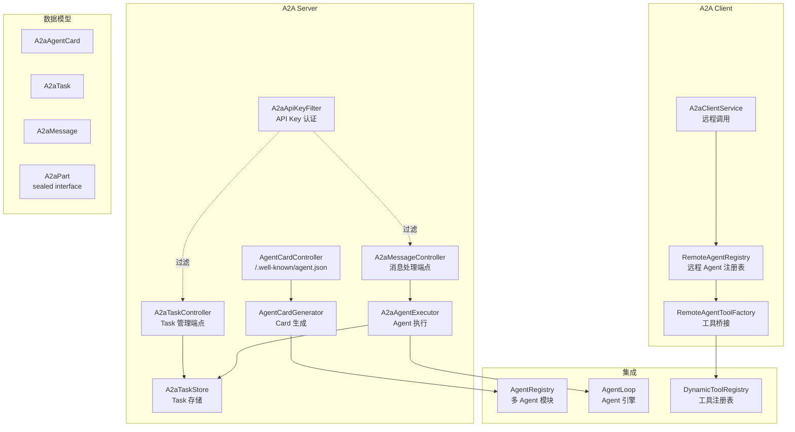
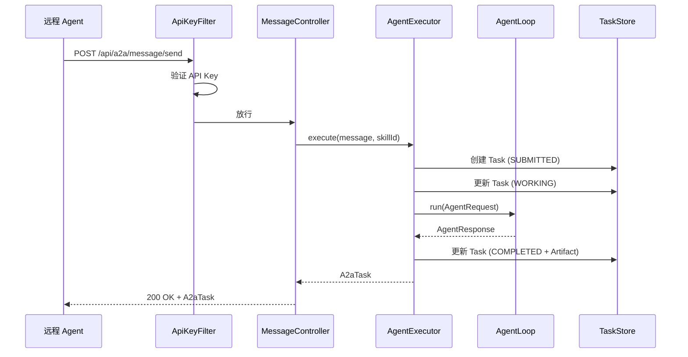
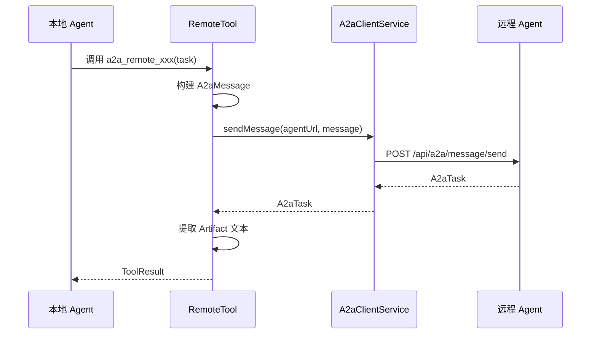

# A2A 协议支持 — 架构设计

> **文档性质**：架构设计文档
> **模块归属**：`com.lifepilot.a2a`
> **最后更新**：2026-03

## 1. 模块概述

A2A（Agent-to-Agent）协议模块实现了 Google A2A 协议规范，使知微能够作为 A2A Server 对外暴露能力，也能作为 A2A Client 调用远程 Agent。模块包含完整的 Client/Server 双向实现：Server 端通过 REST 端点暴露 Agent Card 和消息处理能力（含 SSE 流式），Client 端支持远程 Agent 发现、消息发送和 Task 生命周期管理，并通过工具桥接将远程 Agent 注册为本地可调用工具。

## 2. 架构图

## 3. 核心组件

### 3.1 A2A 数据模型

| 类型 | 说明 |
|------|------|
| `A2aAgentCard` | Agent 能力声明文档，包含 name、skills、capabilities、输入输出模式 |
| `A2aAgentSkill` | Agent 技能声明（id、name、description、输入输出模式） |
| `A2aAgentCapabilities` | Agent 能力标记（streamingEnabled） |
| `A2aMessage` | 消息体，包含 messageId、role、parts 列表 |
| `A2aPart` | 消息内容片段，`sealed interface`，三个 permit：`Text` / `File` / `Data` |
| `A2aTask` | 工作单元，包含 id、contextId、status、history、artifacts |
| `A2aTaskState` | Task 状态枚举：SUBMITTED → WORKING → COMPLETED / FAILED / CANCELED 等 |
| `A2aTaskStatus` | Task 状态快照（state + message + timestamp） |
| `A2aArtifact` | Task 产出物（parts 列表） |
| `A2aRole` | 角色枚举（USER / AGENT） |

### 3.2 Server 端组件

- `AgentCardController`：暴露 `/.well-known/agent.json` 端点，返回 Agent Card
- `AgentCardGenerator`：从 `AgentRegistry` 读取已注册 Agent，映射为 `A2aAgentSkill`，结合配置生成 `A2aAgentCard`
- `A2aMessageController`：消息处理端点，提供同步 `/api/a2a/message/send` 和 SSE 流式 `/api/a2a/message/stream`
- `A2aTaskController`：Task 管理端点，支持查询和取消
- `A2aAgentExecutor`：接收 A2A 消息，调用 `AgentLoop` 执行，构建 A2aTask 响应
- `A2aTaskStore`：内存 Task 存储，管理 Task 生命周期
- `A2aApiKeyFilter`：API Key 认证过滤器

### 3.3 Client 端组件

- `A2aClientService`：基于 Spring `RestClient` 的远程调用服务，支持 Agent 发现、消息发送、Task 查询和取消。所有远程调用失败均降级处理，不抛出异常
- `RemoteAgentRegistry`：远程 Agent 注册表，基于 `ConcurrentHashMap` 缓存 Agent Card，支持 TTL 过期重新获取。启动时自动发现配置的远程 Agent
- `RemoteAgentToolFactory`：为远程 Agent 创建 `BuiltinTool` 实例（ID 格式 `a2a_remote_{name}`），注册到 `DynamicToolRegistry`，执行时调用 `A2aClientService.sendMessage()`

## 4. 核心流程

### 4.1 Server 端消息处理

### 4.2 Client 端远程 Agent 调用

## 5. 设计决策

| 决策 | 选择 | 理由 |
|------|------|------|
| 协议版本 | A2A v0.2.5 | Google A2A 协议最新稳定版本 |
| 消息内容建模 | `sealed interface` A2aPart | 编译时穷举 Text/File/Data 三种类型，配合 Jackson 多态序列化 |
| Task 状态机 | 枚举 + isTerminal() | 简洁的状态管理，终态判断内聚在枚举中 |
| 远程调用降级 | 所有异常捕获返回 FAILED Task | 远程调用不可靠，降级保证本地 Agent 流程不中断 |
| Agent Card 缓存 | TTL 过期刷新 + 旧缓存兜底 | 减少网络请求，刷新失败时仍可使用旧数据 |
| 远程 Agent 工具化 | 注册为 BuiltinTool | 复用现有工具系统，本地 Agent 无需感知远程调用细节 |

## 6. 集成点

| 集成模块 | 方向 | 说明 |
|---------|------|------|
| 多 Agent 协作（`multiagent`） | a2a → multiagent | `AgentCardGenerator` 从 `AgentRegistry` 读取 Agent 列表生成 Card |
| Agent 引擎（`agent`） | a2a → agent | `A2aAgentExecutor` 调用 `AgentLoop.run()` 执行消息 |
| 工具系统（`tool`） | a2a → tool | `RemoteAgentToolFactory` 将远程 Agent 注册为 `BuiltinTool` |
| Gateway（`interaction`） | a2a ← interaction | SSE 事件类型复用 `SseEventType` 常量 |

## 7. 配置参考

| 配置键 | 默认值 | 说明 |
|--------|--------|------|
| `lifepilot.a2a.enabled` | `true` | A2A 模块总开关 |
| `lifepilot.a2a.server.enabled` | `true` | Server 端开关 |
| `lifepilot.a2a.server.api-key` | `""` | Server API Key（空则不启用认证） |
| `lifepilot.a2a.server.agent-name` | `ZhiWei` | Agent Card 名称 |
| `lifepilot.a2a.server.agent-description` | `个人助手` | Agent Card 描述 |
| `lifepilot.a2a.server.agent-version` | `1.0.0` | Agent 版本 |
| `lifepilot.a2a.server.protocol-version` | `0.2.5` | A2A 协议版本 |
| `lifepilot.a2a.server.streaming-enabled` | `true` | SSE 流式端点开关 |
| `lifepilot.a2a.client.enabled` | `true` | Client 端开关 |
| `lifepilot.a2a.client.remote-agents` | `[]` | 远程 Agent URL 列表 |
| `lifepilot.a2a.client.connect-timeout-seconds` | `10` | 连接超时 |
| `lifepilot.a2a.client.read-timeout-seconds` | `60` | 读取超时 |
| `lifepilot.a2a.client.card-cache-ttl-minutes` | `30` | Agent Card 缓存 TTL |
| `lifepilot.a2a.task.ttl-minutes` | `60` | Task 存活时间 |
| `lifepilot.a2a.task.max-history-length` | `50` | Task 历史最大长度 |
