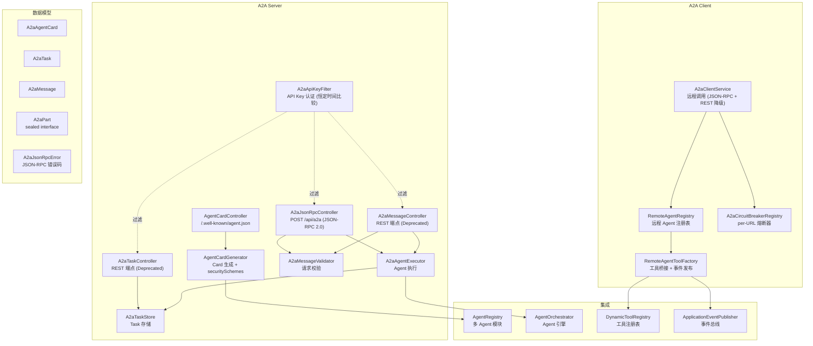
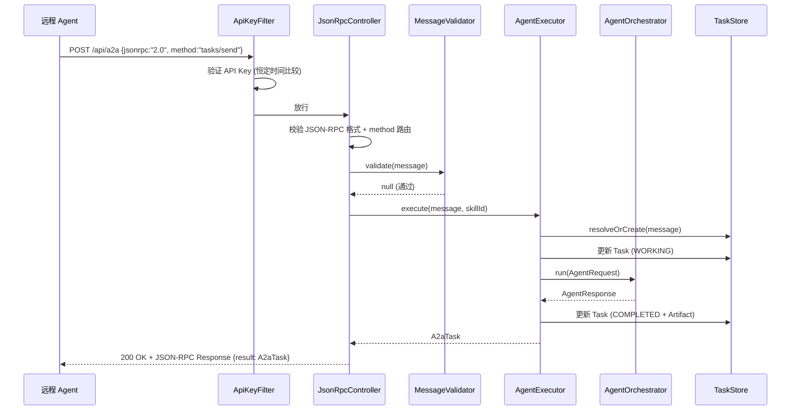
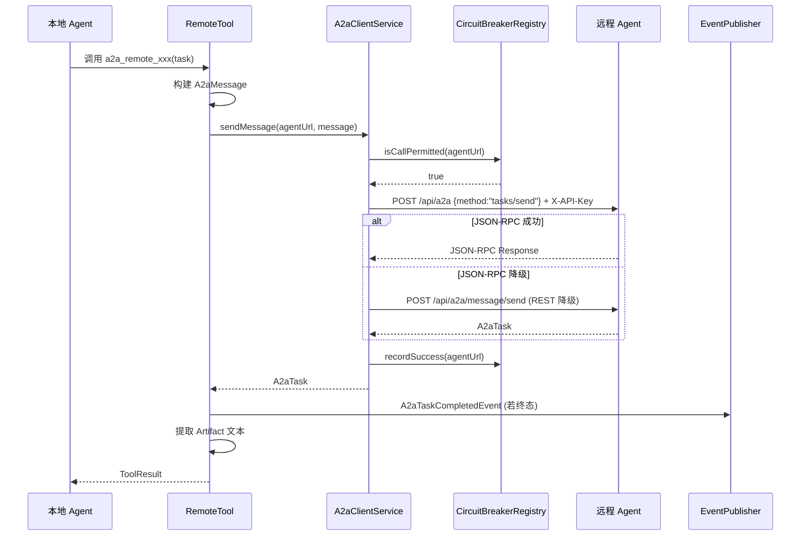

# A2A 协议支持 — 架构设计

> **文档性质**：架构设计文档
> **模块归属**：`com.lifepilot.a2a`
> **最后更新**：2026-04

## 1. 模块概述

A2A（Agent-to-Agent）协议模块实现了 Google A2A 协议规范，使知微能够作为 A2A Server 对外暴露能力，也能作为 A2A Client 调用远程 Agent。模块包含完整的 Client/Server 双向实现：Server 端通过 JSON-RPC 2.0 单一端点（`POST /api/a2a`）暴露 Agent Card 和消息处理能力（含 SSE 流式），旧 REST 端点已标记 `@Deprecated`。Client 端支持远程 Agent 发现、消息发送（优先 JSON-RPC，降级 REST）和 Task 生命周期管理，集成 per-URL 熔断器和 Micrometer 可观测指标，并通过工具桥接将远程 Agent 注册为本地可调用工具。

## 2. 架构图

## 3. 核心组件

### 3.1 A2A 数据模型

| 类型 | 说明 |
|------|------|
| `A2aAgentCard` | Agent 能力声明文档，包含 name、skills、capabilities、输入输出模式 |
| `A2aAgentSkill` | Agent 技能声明（id、name、description、输入输出模式） |
| `A2aAgentCapabilities` | Agent 能力标记（streamingEnabled） |
| `A2aMessage` | 消息体，包含 messageId、role、parts 列表 |
| `A2aPart` | 消息内容片段，`sealed interface`，三个 permit：`Text` / `File` / `Data` |
| `A2aTask` | 工作单元，包含 id、contextId、status、history、artifacts |
| `A2aTaskState` | Task 状态枚举：SUBMITTED → WORKING → COMPLETED / FAILED / CANCELED 等 |
| `A2aTaskStatus` | Task 状态快照（state + message + timestamp） |
| `A2aArtifact` | Task 产出物（parts 列表） |
| `A2aRole` | 角色枚举（USER / AGENT） |
| `A2aJsonRpcError` | JSON-RPC 2.0 错误对象，标准错误码：-32700（解析错误）、-32600（无效请求）、-32601（方法不存在）、-32602（无效参数）、-32603（内部错误） |

### 3.2 Server 端组件

- `A2aJsonRpcController`：**主端点**，`POST /api/a2a`，JSON-RPC 2.0 单一入口。通过 `method` 字段路由到 `tasks/send`、`tasks/sendSubscribe`、`tasks/get`、`tasks/cancel` 四个方法。复用 `com.lifepilot.mcp.protocol.JsonRpcMessage` record
- `A2aMessageValidator`：请求校验工具类，校验入站 `A2aMessage` 的 messageId、role、parts 等必填字段
- `AgentCardController`：暴露 `/.well-known/agent.json`（标准发现路径）和 `/api/a2a/agent-card`（备用路径），`url` 字段从 `HttpServletRequest` 上下文动态填充
- `AgentCardGenerator`：从 `AgentRegistry` 读取已注册 Agent，映射为 `A2aAgentSkill`，结合配置生成 `A2aAgentCard`。配置了 API Key 时自动填充 `securitySchemes`
- `A2aMessageController`（**@Deprecated**）：旧 REST 消息处理端点（`/api/a2a/message/send`、`/api/a2a/message/stream`），保留向后兼容，请使用 JSON-RPC 端点
- `A2aTaskController`（**@Deprecated**）：旧 REST Task 管理端点（`/api/a2a/tasks/{id}`），保留向后兼容
- `A2aAgentExecutor`：接收 A2A 消息，提取 `doExecute()` 共享执行逻辑，`safeNotify()` 保护 SSE 回调安全，`resolveOrCreate()` 委托 TaskStore 处理 Task 复用。集成 Micrometer 指标（`a2a.server.messages.total`、`a2a.server.execution.duration`）
- `A2aTaskStore`：内存 Task 存储，`cancel()` 使用 `computeIfPresent` 原子操作，支持取消 SUBMITTED / WORKING / INPUT_REQUIRED / AUTH_REQUIRED 状态的 Task
- `A2aApiKeyFilter`：API Key 认证过滤器，使用 `MessageDigest.isEqual` 恒定时间比较防止时序攻击

### 3.3 Client 端组件

- `A2aClientService`：基于 Spring `RestClient` 的远程调用服务，支持 Agent 发现、消息发送（优先 JSON-RPC 2.0，降级 REST）、Task 查询和取消。使用 URI 模板（而非字符串拼接）防止路径注入。通过 `remoteAgentKeys` 配置向远程 Agent 发送 `X-API-Key` Header。集成熔断器（调用前检查、成功/失败记录）和 Micrometer 指标（`a2a.client.requests.total`、`a2a.client.circuit_breaker.rejected`、`a2a.client.request.duration`）。所有远程调用失败均降级处理，不抛出异常
- `A2aCircuitBreakerRegistry`：per-URL 熔断器注册表，复用 `com.lifepilot.llm.circuit.CircuitBreaker` 实现，基于 `ConcurrentHashMap` 按 Agent URL 管理熔断器实例。支持配置失败阈值、重置超时、半开探测次数
- `RemoteAgentRegistry`：远程 Agent 注册表，基于 `ConcurrentHashMap` 缓存 Agent Card，支持 TTL 过期重新获取。`getOrRefresh()` 使用 per-URL `ReentrantLock` 防止 thundering herd（多线程同时刷新同一 URL）。启动时 O(n) 复杂度自动发现配置的远程 Agent
- `RemoteAgentToolFactory`：为远程 Agent 创建 `BuiltinTool` 实例（ID 格式 `a2a_remote_{name}`），注册到 `DynamicToolRegistry`，执行时调用 `A2aClientService.sendMessage()`。远程 Task 完成时发布 `A2aTaskCompletedEvent`，用于恢复挂起等待结果的 Agent（suspend/resume 集成）

## 4. 核心流程

### 4.1 Server 端消息处理（JSON-RPC 2.0）

### 4.2 Client 端远程 Agent 调用

## 5. 设计决策

| 决策 | 选择 | 理由 |
|------|------|------|
| 传输协议 | JSON-RPC 2.0 单一端点 | 符合 A2A 规范推荐，旧 REST 端点标记 `@Deprecated` 保持向后兼容 |
| JSON-RPC 消息复用 | `com.lifepilot.mcp.protocol.JsonRpcMessage` | 与 MCP 模块共享 JSON-RPC record，避免重复定义 |
| 协议版本 | A2A v0.2.5 | Google A2A 协议最新稳定版本 |
| 消息内容建模 | `sealed interface` A2aPart | 编译时穷举 Text/File/Data 三种类型，配合 Jackson 多态序列化 |
| Task 状态机 | 枚举 + isTerminal() | 简洁的状态管理，终态判断内聚在枚举中 |
| Task 取消原子性 | `computeIfPresent` 原子操作 | 保证并发安全，支持取消 SUBMITTED / WORKING / INPUT_REQUIRED / AUTH_REQUIRED 状态 |
| API Key 比较 | `MessageDigest.isEqual` 恒定时间比较 | 防止时序攻击泄漏 Key 信息 |
| 远程调用降级 | 所有异常捕获返回 FAILED Task | 远程调用不可靠，降级保证本地 Agent 流程不中断 |
| Client 协议策略 | JSON-RPC 优先 + REST 降级 | 兼容新旧版本远程 Agent |
| 远程调用熔断 | per-URL `CircuitBreaker` | 复用 LLM 模块熔断器实现，隔离单个远程 Agent 故障不影响其他 |
| Agent Card 缓存刷新 | per-URL `ReentrantLock` | 防止 thundering herd，同一 URL 同时只有一个线程刷新 |
| Agent Card 缓存 | TTL 过期刷新 + 旧缓存兜底 | 减少网络请求，刷新失败时仍可使用旧数据 |
| 远程 Agent 工具化 | 注册为 BuiltinTool | 复用现有工具系统，本地 Agent 无需感知远程调用细节 |
| Agent 挂起恢复 | `A2aTaskCompletedEvent` | 远程 Task 完成时发布事件，与 Agent suspend/resume 机制集成 |
| Client 认证 | `X-API-Key` Header per-agent | `remoteAgentKeys` Map 按 URL 配置，支持不同远程 Agent 使用不同 Key |

## 6. 集成点

| 集成模块 | 方向 | 说明 |
|---------|------|------|
| 多 Agent 协作（`multiagent`） | a2a → multiagent | `AgentCardGenerator` 从 `AgentRegistry` 读取 Agent 列表生成 Card |
| Agent 引擎（`agent`） | a2a → agent | `A2aAgentExecutor` 调用 `AgentOrchestrator.run()` 执行消息 |
| Agent 挂起恢复（`agent.suspend`） | a2a → agent | `RemoteAgentToolFactory` 发布 `A2aTaskCompletedEvent` 恢复挂起的 Agent |
| 工具系统（`tool`） | a2a → tool | `RemoteAgentToolFactory` 将远程 Agent 注册为 `BuiltinTool` |
| MCP 协议（`mcp`） | a2a → mcp | `A2aJsonRpcController` 复用 `JsonRpcMessage` record |
| LLM 熔断器（`llm.circuit`） | a2a → llm | `A2aCircuitBreakerRegistry` 复用 `CircuitBreaker` 实现 |
| 可观测性（`Micrometer`） | a2a → micrometer | Server/Client 均注册请求计数和耗时指标 |
| Gateway（`interaction`） | a2a ← interaction | SSE 事件类型复用 `SseEventType` 常量 |

## 7. 配置参考

| 配置键 | 默认值 | 说明 |
|--------|--------|------|
| `lifepilot.a2a.enabled` | `true` | A2A 模块总开关 |
| `lifepilot.a2a.server.enabled` | `true` | Server 端开关 |
| `lifepilot.a2a.server.api-key` | `""` | Server API Key（空则不启用认证） |
| `lifepilot.a2a.server.agent-name` | `ZhiWei` | Agent Card 名称 |
| `lifepilot.a2a.server.agent-description` | `个人助手` | Agent Card 描述 |
| `lifepilot.a2a.server.agent-version` | `1.0.0` | Agent 版本 |
| `lifepilot.a2a.server.protocol-version` | `0.2.5` | A2A 协议版本 |
| `lifepilot.a2a.server.streaming-enabled` | `true` | SSE 流式端点开关 |
| `lifepilot.a2a.server.sse-timeout-seconds` | `120` | SSE 流式连接超时秒数 |
| `lifepilot.a2a.client.enabled` | `true` | Client 端开关 |
| `lifepilot.a2a.client.remote-agents` | `[]` | 远程 Agent URL 列表 |
| `lifepilot.a2a.client.remote-agent-keys` | `{}` | 远程 Agent API Key 映射（URL → Key） |
| `lifepilot.a2a.client.connect-timeout-seconds` | `10` | 连接超时 |
| `lifepilot.a2a.client.read-timeout-seconds` | `60` | 读取超时 |
| `lifepilot.a2a.client.card-cache-ttl-minutes` | `30` | Agent Card 缓存 TTL |
| `lifepilot.a2a.client.circuit-breaker-failure-threshold` | `3` | 熔断器连续失败阈值 |
| `lifepilot.a2a.client.circuit-breaker-reset-timeout-seconds` | `60` | 熔断器重置超时（OPEN → HALF_OPEN） |
| `lifepilot.a2a.client.circuit-breaker-half-open-max-attempts` | `1` | 熔断器半开状态最大探测次数 |
| `lifepilot.a2a.task.ttl-minutes` | `60` | Task 存活时间 |
| `lifepilot.a2a.task.max-history-length` | `50` | Task 历史最大长度 |
