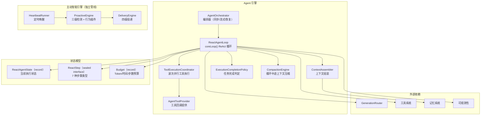
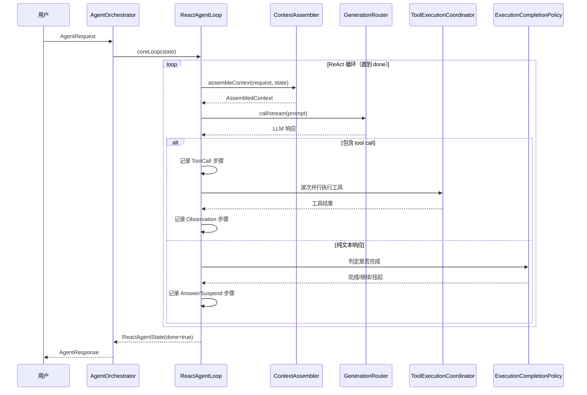

# Agent 引擎 — 架构设计

> **文档性质**：架构设计文档
> **模块归属**：`com.lifepilot.agent`
> **最后更新**：2026-05-04

## 1. 模块概述

Agent 引擎是知微的核心推理控制中枢，负责接收用户请求、驱动 LLM 推理、编排工具调用、管理执行预算，并生成最终响应。采用 ReAct 循环架构（Thought → Action → Observation），手动控制 tool calling，确保每个工具调用都被显式记录到 ReAct 步骤和 Trace 中。

## 2. 架构图

## 3. 核心组件

### 3.1 AgentOrchestrator + ReactAgentLoop

- `AgentOrchestrator`：编排器，提供三个入口方法：
  - `run(AgentRequest)` → `AgentResponse`（同步执行）
  - `runStreaming(request, streamId, sseManager, cancellationToken)`（SSE 流式执行）
  - `resumeFromSuspend(traceId, ResumePayload)`（从挂起点恢复执行）
- `ReactAgentLoop`：ReAct 循环核心，仅暴露 `coreLoop()` 方法，由 AgentOrchestrator 调用
- 关键协作组件：
  - `ToolExecutionCoordinator` — 波次并行工具执行协调器，同一轮多个 tool call 并行执行；L4 程序记忆反馈（IntentMatcher）在工具执行成功后异步触发（虚拟线程），不阻塞主循环
  - `ExecutionCompletionPolicy` — 任务完成判定策略，基于 `<completion_control>` 和 `<await_user_input>` 协议判断循环是否结束
  - `CompactionEngine` — 循环中途上下文压缩，防止长对话超出上下文窗口

### 3.2 状态转换

> 状态转换由 `ReactAgentLoop.coreLoop()` 的 for 循环直接驱动，不再使用独立的 StateReducer。

### 3.3 ContextAssembler

- 职责：组装 LLM 调用上下文，包括系统 Prompt、当前 session 最近完整轮次、L1 临时工作区、L3 用户画像与经验、运行时环境（位置、天气）
- 运行时环境注入：通过 `LocationResolver` 解析用户位置（配置覆盖 > IP 自动检测），通过 `WeatherService`（实现为 `OpenMeteoWeatherService`）注入天气摘要到 `{weather}` 模板变量（仅读缓存，零阻塞）
- 用户画像优先读取 `UserProfileConsolidator` 巩固后的连贯画像（`__consolidated_profile` CUSTOM 实体），降级为 L3 零散实体拼接
- 当前主路径不再依赖旧的 `WorkingMemory` 对话缓存，也不再自动注入跨 session 原始对话
- 跨会话历史检索通过记忆工具显式触发，而不是直接混入主 Prompt

### 3.4 ReactAgentState / ReactStep

- `ReactAgentState`：不可变状态快照（record），包含预算、步骤记录、响应等
  - `boolean done` — 循环是否结束
  - `boolean suspended` — 是否处于挂起状态
  - `Set<String> discoveredToolIds` — 已通过 `tool.search` 发现并注入下一轮工具列表的工具 ID 集合
  - `CompletionMode` — 完成模式（NORMAL / DEGRADED / SUSPENDED）
  - `CompletionReason` — 11 种终止原因
- `ReactStep`：7 种步骤类型（sealed interface）
  - `Progress` — 执行进度提示
  - `Thought` — LLM 推理文本
  - `ToolCall` — 工具调用请求
  - `Observation` — 工具返回结果
  - `Answer` — 最终回答
  - `Suspend` — 挂起点
  - `Resume` — 恢复点

### 3.5 Budget 与渐进式预算降级

- 职责：Token、时间、步数三维预算控制
- 预算耗尽时通过 `DegradedResponseBuilder.terminateWithReason()` 生成降级响应
- 5 级渐进式预算降级策略：
  1. **NORMAL** — 正常执行
  2. **COMPRESS_HISTORY** — 压缩历史上下文
  3. **TRIM_TOOLS** — 裁剪可用工具集
  4. **SKIP_MEMORY** — 跳过记忆检索
  5. **TERMINATE** — 终止执行（预算耗尽时优先调用 LLM 做结构化总结再返回，`DegradedResponseBuilder.terminateWithReason` → `buildGracefulSummary`）

## 4. 核心流程

## 5. 设计决策

| 决策 | 选择 | 理由 |
|------|------|------|
| 状态管理 | 不可变 record（ReactAgentState） | 每次转换生成新实例，天然支持轨迹回放和并发安全；状态转换由 coreLoop() for 循环直接驱动 |
| 步骤类型 | ReactStep sealed interface（7 种） | 编译期穷举检查，新增步骤类型时编译器强制处理所有分支 |
| 完成判定 | ExecutionCompletionPolicy | 基于 `<completion_control>` / `<await_user_input>` 协议，解耦循环控制与业务逻辑 |
| 预算控制 | 三维预算（Token/时间/步数）+ 5 级渐进式降级 | 防止 Agent 无限循环或过度消耗资源，降级策略逐步收缩能力而非直接终止 |
| 流式支持 | IterationCallback 抽象 | 非流式和 SSE 流式共享核心循环逻辑，通过回调差异化输出 |
| 挂起/恢复 | Suspend/Resume ReactStep | 支持需要用户确认的长任务中断和恢复 |

## 6. 集成点

- **LLM Router**（`llm`）：通过 `GenerationRouter.call()` / `stream()` 驱动推理
- **工具系统**（`tool`）：通过 `AgentToolProvider` 获取工具回调，执行计划步骤
- **记忆系统**（`memory`）：通过 `ContextAssembler` 读取最近完整轮次、工作区、画像和经验
- **可观测性**（`observability`）：TraceRecorder 记录每步执行轨迹
- **程序记忆反馈**（`memory.procedural`）：L4 反馈闭环，通过 `ProceduralMemory` + `IntentMatcher` 在工具执行成功后异步记录经验（`Thread.startVirtualThread`），不阻塞主 Agent 循环
- **多 Agent**（`multiagent`）：通过 `spawn_workers` 并行 Worker 执行，结果回传到主循环
- **主动智能引擎**（`agent.task.proactive`）：`HeartbeatRunner` 定时唤醒 `ProactiveEngine`，通过 `ProactiveBehavior` 插件编排主动行为；`ConversationCompletionHook` 在对话完成后触发摘要生成（`ConversationSummaryGenerator`）和画像巩固（`UserProfileConsolidator`）

## 7. 配置参考

| 配置键 | 默认值 | 说明 |
|--------|--------|------|
| `lifepilot.agent.enabled` | `true` | Agent 引擎总开关 |
| `lifepilot.agent.loop.max-iterations` | 25 | 单次循环最大迭代次数 |
| `lifepilot.agent.loop.max-consecutive-failures` | 3 | 连续工具调用失败最大次数 |
| `lifepilot.agent.loop.max-early-stop-rejects` | 2 | 疑似提前结束最大拒绝次数 |
| `lifepilot.agent.loop.max-parallel-tool-calls` | 4 | 单个工具波次最大并发数 |
| `lifepilot.agent.loop.llm-scene` | `agent_react` | LLM 调用场景标识 |
| `lifepilot.agent.loop.default-temperature` | `0.7` | 默认 temperature（会话未配置时使用） |
| `lifepilot.agent.budget.default-max-tokens` | 20000000 | 对话总 Token 预算 |
| `lifepilot.agent.budget.default-max-steps` | 30 | 步数预算上限 |
| `lifepilot.agent.budget.default-max-duration-seconds` | 1800 | 时间预算上限（秒，2026-05 从 300 上调至 1800） |
| `lifepilot.agent.context.max-context-tokens` | 2000000 | 单次 LLM 调用最大上下文 Token 数 |
| `lifepilot.agent.context.output-reserved-tokens` | 8192 | 输出预留 Token 数 |
| `lifepilot.agent.checkpoint.enabled` | `true` | 检查点功能开关 |
| `lifepilot.agent.checkpoint.max-age` | 7d | 检查点最大保留时长 |
| `lifepilot.agent.execution-retry.enabled` | `true` | 主执行链路自动重试开关 |
| `lifepilot.agent.execution-retry.max-attempts` | 2 | 最大尝试次数（含首次） |
| `lifepilot.agent.session.timeout-minutes` | 30 | 会话超时时间（分钟） |
| `lifepilot.agent.debug.log-llm-prompts` | `false` | 是否打印完整提示词（仅限受控环境） |
| `lifepilot.agent.location` | `""` | 手动覆盖用户位置（优先于 IP 自动检测），为空时自动检测 |
| `lifepilot.agent.ip-api-url` | `http://ip-api.com/json/...` | IP 地理定位 API 地址，为空时禁用自动检测 |

> 工具可见性由 `lifepilot.tool.tier1.pinned`（核心 pinned 工具）+ `discoveredToolIds`（`tool.search` 发现）+ `tool.search` 内省工具共同决定，配置详见 [工具系统架构](tool-ecosystem.md)。旧的 `lifepilot.agent.core-tool-ids` 已在 2026-04 工具暴露重构中移除。
