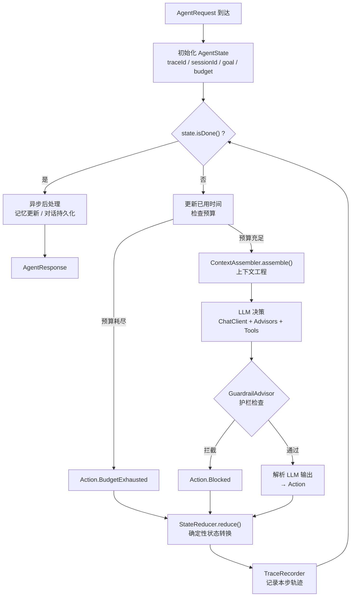
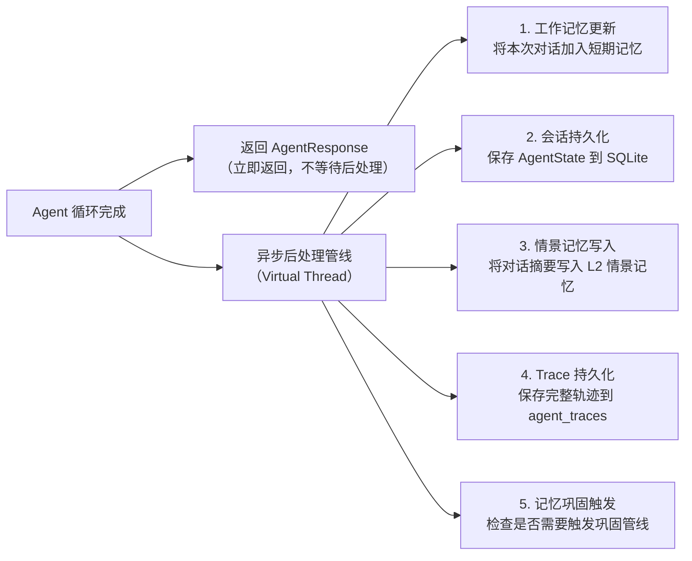
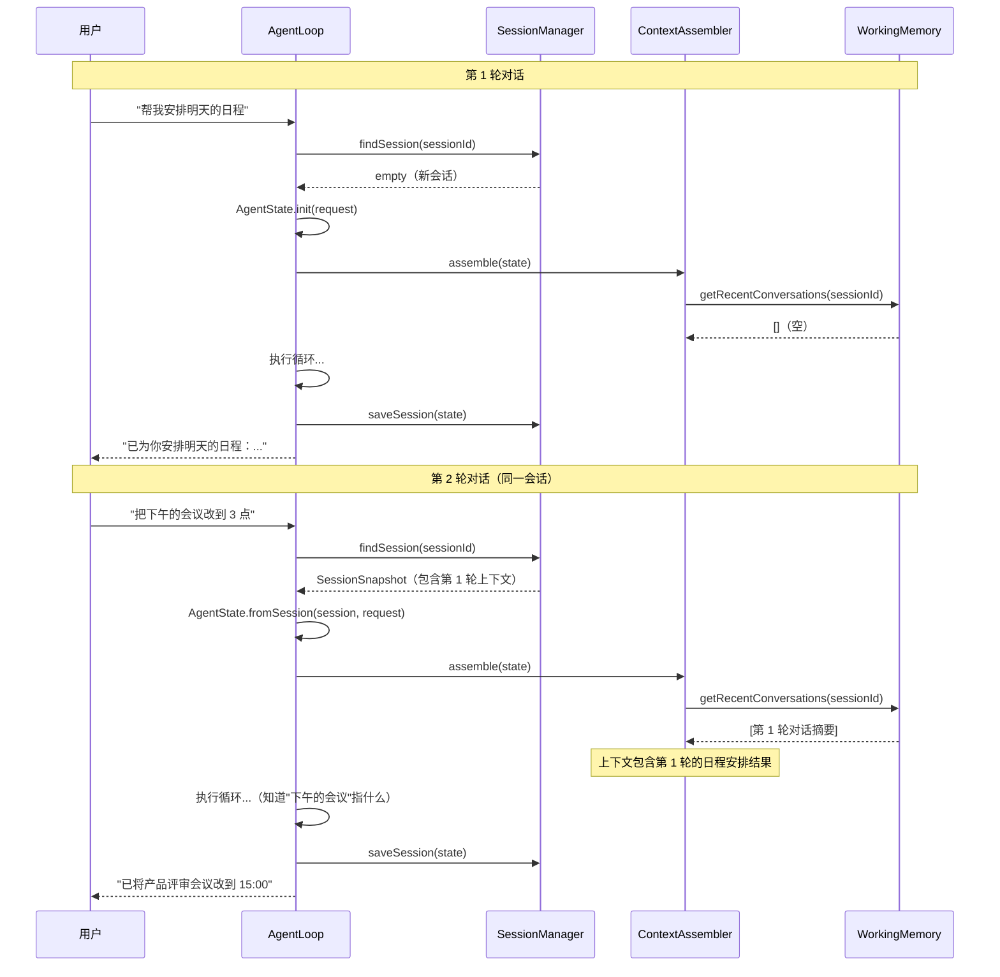
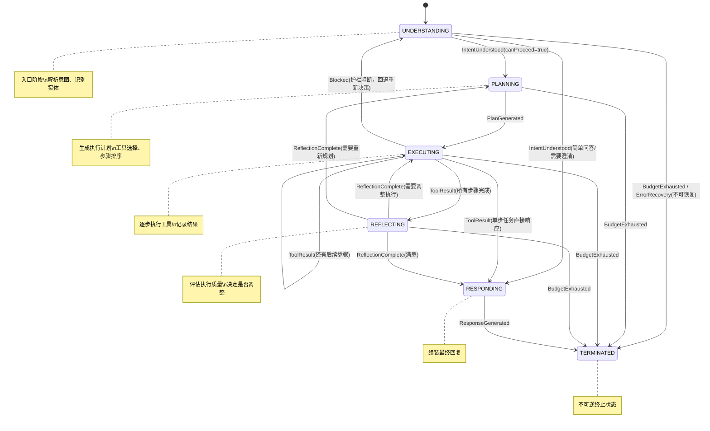
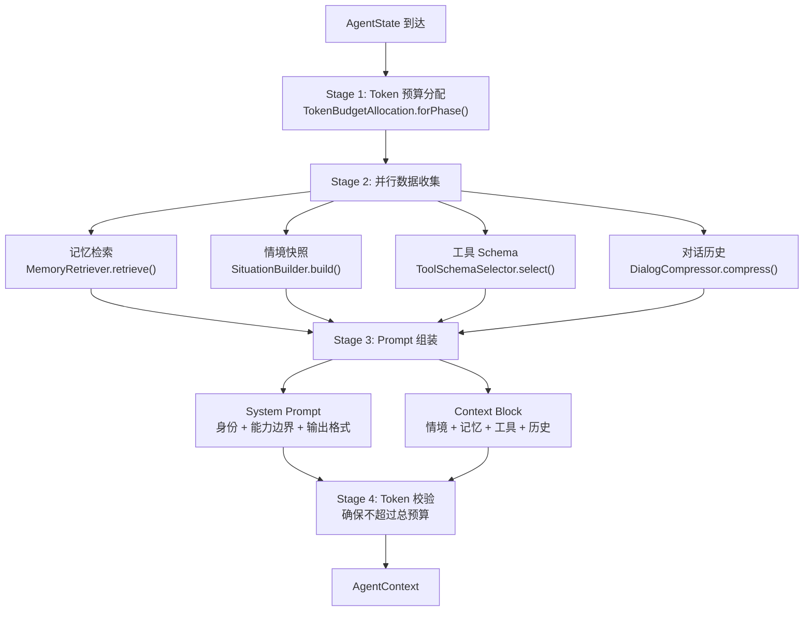
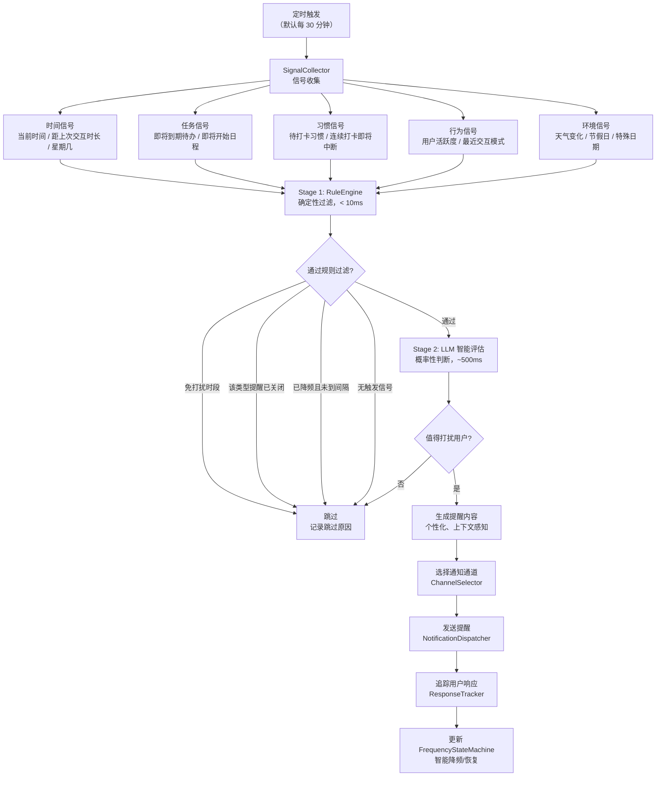
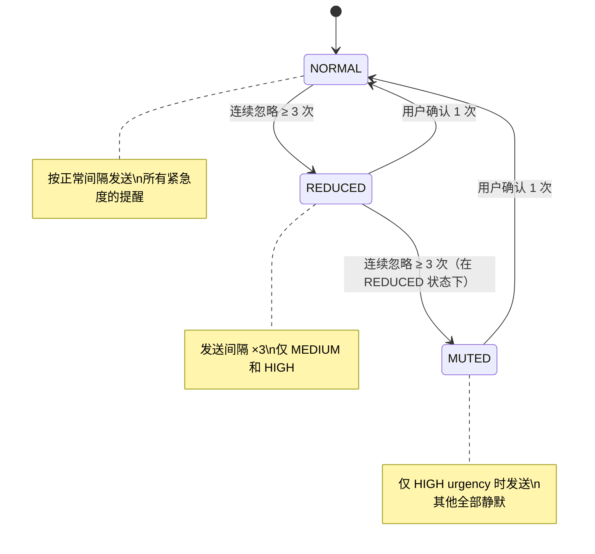
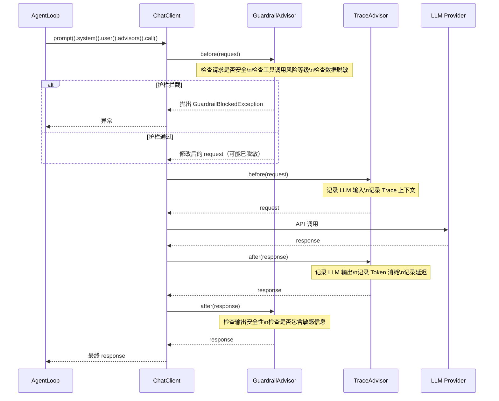

# Agent 引擎架构设计

> **文档性质**：深度架构设计文档（Developer-Facing）
> **目标读者**：核心开发者、架构评审者、技术面试官
> **模块归属**：`com.lifepilot.agent`
> **最后更新**：2026-03
> **从属关系**：本文档从 [ARCHITECTURE.md](../ARCHITECTURE.md) §3 拆分而来，聚焦 Agent 引擎的完整设计。

---

## 目录

- [1. 设计哲学与原则](#1-设计哲学与原则)
- [2. AgentLoop — 状态化控制循环](#2-agentloop--状态化控制循环)
- [3. StateReducer — 确定性状态机](#3-statereducer--确定性状态机)
- [4. ContextAssembler — 上下文工程](#4-contextassembler--上下文工程)
- [5. ProactiveReasoner — 主动推理引擎](#5-proactivereasoner--主动推理引擎)
- [6. Budget — 预算控制系统](#6-budget--预算控制系统)
- [7. AgentToolProvider — 工具桥接层](#7-agenttoolprovider--工具桥接层)
- [8. 会话管理与持久化](#8-会话管理与持久化)
- [9. 错误处理与容错](#9-错误处理与容错)
- [10. Spring AI 集成详解](#10-spring-ai-集成详解)
- [11. SQLite Schema](#11-sqlite-schema)
- [12. 配置参考](#12-配置参考)
- [13. jqwik 属性测试](#13-jqwik-属性测试)
- [14. 性能基准与优化](#14-性能基准与优化)

---

## 1. 设计哲学与原则

### 1.1 核心命题：为什么 Agent 不是"一个聪明的 Prompt"

2025-2026 年的 AI Agent 领域经历了一次深刻的范式转变。早期的 Agent 实现——无论是 LangChain 的 Chain 模式还是 AutoGen 的多 Agent 对话——本质上都是**围绕 Prompt 的编排**。它们的核心假设是：只要 Prompt 写得足够好，LLM 就能可靠地完成任务。

这个假设在生产环境中被反复证伪：

```
传统 Prompt-Centric Agent 的失败模式：

1. 幻觉级联（Hallucination Cascade）
   LLM 在第 3 步产生幻觉 → 第 4 步基于幻觉推理 → 第 5 步执行错误工具
   → 整个任务链崩溃，且无法定位根因

2. 成本黑洞（Cost Black Hole）
   "让我再想想" → 无限循环 → Token 消耗不可预测
   一个简单的日程查询可能消耗 50K Token（正常应 < 2K）

3. 状态不可见（Invisible State）
   "Agent 现在在干什么？" → 不知道
   "为什么选了这个工具？" → 只能猜
   "能回到第 2 步重新执行吗？" → 不可能

4. 测试不可能（Untestable）
   推理过程嵌入在 Prompt 文本中 → 无法单元测试
   每次运行结果不同 → 无法回归测试
   "它上次能用，这次不行了" → 常态

5. 护栏缺失（No Guardrails）
   LLM 决定删除文件 → 直接执行 → 不可逆
   没有独立于 LLM 的安全检查层
```

LifePilot 的核心设计命题是：**Agent 是一个分布式系统，LLM 只是其中的规划器/执行器组件**。可靠性来自架构和护栏，而非模型能力本身。

这个命题直接导出了 LifePilot Agent 引擎的核心架构决策：

```
┌─────────────────────────────────────────────────────────────────┐
│                    LifePilot Agent 引擎架构                      │
│                                                                 │
│  ┌──────────────────┐    ┌──────────────────────────────────┐   │
│  │   概率域 (LLM)    │    │       确定性域 (Code)             │   │
│  │                  │    │                                  │   │
│  │  意图理解        │    │  StateReducer — 状态转换          │   │
│  │  任务规划        │    │  GuardrailEngine — 护栏检查       │   │
│  │  工具选择        │    │  Budget — 预算控制                │   │
│  │  内容生成        │    │  TraceRecorder — 轨迹记录         │   │
│  │                  │    │  ContextAssembler — 上下文组装    │   │
│  └────────┬─────────┘    └──────────────┬───────────────────┘   │
│           │                             │                       │
│           │         Action              │                       │
│           └─────────────────────────────┘                       │
│                                                                 │
│  关键边界：LLM 输出的是 Action（意图），不是状态变更              │
│  状态变更只通过 StateReducer 的确定性逻辑执行                    │
└─────────────────────────────────────────────────────────────────┘
```

### 1.2 前沿研究基础

LifePilot Agent 引擎的设计不是凭空构想，而是建立在 2025-2026 年 AI Agent 领域的前沿研究和工程实践之上。以下是核心参考来源及其对 LifePilot 设计的影响：

#### 1.2.1 Redis Agent Architecture — 状态化控制循环

[Redis 2026 Agent Architecture](https://redis.io/blog/ai-agent-architecture/) 提出了生产级 Agent 的核心模式：**将 Agent 视为状态机，而非对话流**。其关键洞察包括：

- Agent 的每一步都应该产生一个可序列化的状态快照
- 状态转换逻辑必须与 LLM 决策逻辑分离
- 控制循环（Control Loop）比 Chain/Graph 模式更适合生产环境

LifePilot 的映射：`AgentLoop`（控制循环）+ `StateReducer`（确定性状态转换）+ `AgentState`（可序列化状态）直接实现了这一模式。

#### 1.2.2 Anthropic Context Engineering — 上下文即稀缺资源

Anthropic 在 2025 年提出的上下文工程（Context Engineering）理念，将 LLM 的上下文窗口视为**稀缺资源**而非无限容器。核心原则：

- 每个 Token 都有成本，必须精确控制其价值
- 上下文的质量比数量更重要
- 不同任务阶段需要不同的上下文组成

LifePilot 的映射：`ContextAssembler` 实现了基于 `AgentPhase` 的动态 Token 预算分配，不同阶段的上下文组成比例不同。

#### 1.2.3 Weaviate Context Engineering — Write/Select/Compress/Isolate

[Weaviate 的上下文工程博客](https://weaviate.io/blog/context-engineering) 提出了四种上下文管理策略：

| 策略 | 含义 | LifePilot 实现 |
|------|------|---------------|
| **Write** | 主动向上下文写入结构化信息 | `ContextAssembler` 注入情境快照（时间/任务/日程/习惯） |
| **Select** | 从大量候选中精选最相关的内容 | `HybridRetriever` 三路混合检索 + Top-K 截断 |
| **Compress** | 压缩已有上下文释放空间 | `DialogCompressor` 三层渐进式对话压缩 |
| **Isolate** | 将不同关注点隔离到独立上下文 | SubAgent 独立上下文 + 预算隔离 |

#### 1.2.4 Inkeep Context Rot — 对抗上下文腐化

[Inkeep 的 Fighting Context Rot](https://inkeep.com/blog/fighting-context-rot) 揭示了长对话中的一个关键问题：**上下文腐化（Context Rot）**。随着对话轮次增加，早期的上下文信息会被"稀释"，LLM 对早期信息的注意力急剧下降。

LifePilot 的应对策略：
- `DialogCompressor` 的三层压缩确保关键信息始终在"注意力热区"
- `ContextAssembler` 将最重要的信息放在 System Prompt 的开头和 User Message 的末尾（注意力 U 型曲线）
- 每轮循环重新组装上下文，而非简单追加

#### 1.2.5 YLang Labs Context Engineering — Agent 上下文工程实践

[YLang Labs 的 Agent 上下文工程](https://ylanglabs.com/blogs/context-engineering-for-ai-agents) 提供了 Agent 场景下上下文工程的具体实践指南，强调了：

- 工具 Schema 是上下文的重要组成部分，需要动态裁剪
- 记忆检索结果需要按相关度排序后截断
- System Prompt 应该包含明确的能力边界声明

#### 1.2.6 Spring AI Advisors — 横切关注点的优雅注入

[Spring AI Advisor 模式](https://docs.spring.io/spring-ai/reference/api/advisors.html) 提供了一种在 AI 交互链路中注入横切关注点的标准方式。LifePilot 利用这一模式实现了：

- `GuardrailAdvisor`：在 LLM 调用前后自动执行护栏检查
- `TraceAdvisor`：自动记录每次 LLM 交互的完整轨迹
- 业务代码（`AgentLoop`）完全不感知这些横切逻辑

### 1.3 五条核心设计原则

LifePilot Agent 引擎遵循五条核心设计原则。这些原则不是抽象的口号，而是直接映射到具体的代码实现：

#### 原则 1：概率决策与确定性状态分离

这是整个 Agent 引擎最核心的设计原则。

```java
/**
 * 概率域与确定性域的边界示意。
 *
 * <p>LLM 的输出是概率性的——相同的输入可能产生不同的输出。
 * 但状态转换必须是确定性的——相同的 (state, action) 必须产生相同的新状态。</p>
 *
 * <p>这个分离带来三个关键好处：
 * <ol>
 *   <li>可测试性：StateReducer 是纯函数，可以用 jqwik 属性测试验证不变量</li>
 *   <li>可回放性：记录 Action 序列即可重建任何历史状态</li>
 *   <li>可调试性：状态转换有明确边界，不会出现"不知道状态怎么变的"</li>
 * </ol></p>
 */

// 概率域：LLM 决策（可能每次不同）
Action action = llmRouter.getChatClient(scene)
    .prompt()
    .system(context.systemPrompt())
    .user(buildUserPrompt(state, context))
    .call()
    .entity(Action.class);  // 结构化输出

// 确定性域：状态转换（永远一致）
AgentState newState = stateReducer.reduce(state, action);
// 保证：reduce(s, a) 对于相同的 s 和 a，永远返回相同的结果
```

#### 原则 2：工具调用是 API 契约，不是建议

每个工具都有严格的类型化 Input/Output Schema。LLM 不能"随意"调用工具——它必须提供符合 Schema 的参数，工具的返回值也有明确的类型定义。

```java
/**
 * 工具契约接口 — 所有工具的统一抽象。
 *
 * <p>关键约束：
 * <ul>
 *   <li>输入必须通过 JSON Schema 校验</li>
 *   <li>输出有明确的类型定义</li>
 *   <li>每个工具声明自己的幂等性保证</li>
 *   <li>每个工具声明自己的风险等级</li>
 * </ul></p>
 */
public sealed interface ToolContract permits BuiltinTool, YamlTool, McpTool {

    /** 工具唯一标识。 */
    String id();

    /** 工具描述（供 LLM 理解工具用途）。 */
    String description();

    /** 输入参数的 JSON Schema。 */
    JsonSchema inputSchema();

    /** 输出类型的 JSON Schema。 */
    JsonSchema outputSchema();

    /** 风险等级：LOW / MEDIUM / HIGH / CRITICAL。 */
    RiskLevel riskLevel();

    /** 是否幂等（相同输入多次调用结果一致）。 */
    boolean idempotent();

    /** 执行工具。 */
    ToolResult execute(ToolInput input);
}
```

#### 原则 3：Trace 级可观测

不是"日志"，而是完整的决策轨迹。每一轮 Agent 循环都会记录：

- LLM 收到了什么上下文（输入）
- LLM 做出了什么决策（输出）
- 护栏是否拦截了决策
- 工具执行的结果
- 状态如何变化
- Token 消耗了多少

```java
/**
 * 单步轨迹记录。
 *
 * <p>设计目标：任何一次 Agent 执行都可以通过 Trace 完整重建，
 * 包括 LLM 的输入输出、工具调用、状态变化、预算消耗。</p>
 */
@Builder(toBuilder = true)
public record TraceStep(
    String traceId,              // 所属 Trace ID
    int stepIndex,               // 步骤序号（从 0 开始）
    AgentPhase phaseBefore,      // 执行前的阶段
    AgentPhase phaseAfter,       // 执行后的阶段
    String llmInput,             // LLM 收到的完整 Prompt（脱敏后）
    String llmOutput,            // LLM 的原始输出
    Action action,               // 解析出的 Action
    @Nullable String toolId,     // 调用的工具 ID（如果有）
    @Nullable String toolInput,  // 工具输入（如果有）
    @Nullable String toolOutput, // 工具输出（如果有）
    boolean guardrailBlocked,    // 是否被护栏拦截
    @Nullable String blockReason,// 拦截原因
    int tokensUsed,              // 本步消耗的 Token 数
    Duration latency,            // 本步耗时
    Instant timestamp            // 时间戳
) {}
```

#### 原则 4：评估驱动开发

传统软件测试验证的是"输出是否正确"，但 Agent 测试需要验证的是"决策轨迹是否合理"。一个 Agent 可能最终给出了正确答案，但中间调用了不必要的工具、浪费了大量 Token、或者违反了安全策略。

```java
/**
 * 轨迹评估器 — 不只评估最终输出，还评估完整决策轨迹。
 *
 * <p>评估维度：
 * <ul>
 *   <li>工具选择正确性：是否选择了最合适的工具？</li>
 *   <li>参数合法性：工具参数是否符合 Schema？</li>
 *   <li>步骤效率：是否用最少的步骤完成了任务？</li>
 *   <li>策略合规性：是否遵守了安全策略？</li>
 *   <li>预算效率：Token 消耗是否在合理范围内？</li>
 * </ul></p>
 */
@Builder(toBuilder = true)
public record TraceEvaluation(
    String traceId,
    boolean toolSelectionCorrect,    // 工具选择是否正确
    boolean parameterValid,          // 参数是否合法
    int actualSteps,                 // 实际步骤数
    int optimalSteps,                // 最优步骤数
    double stepEfficiency,           // 步骤效率 = optimal / actual
    boolean policyCompliant,         // 是否合规
    int tokensUsed,                  // 实际 Token 消耗
    int tokenBudget,                 // Token 预算
    double tokenEfficiency,          // Token 效率 = budget / used
    List<String> violations,         // 违规项列表
    String overallVerdict            // 总体评价
) {
    /** 计算综合评分（0.0 ~ 1.0）。 */
    public double score() {
        double toolScore = toolSelectionCorrect ? 1.0 : 0.0;
        double paramScore = parameterValid ? 1.0 : 0.0;
        double complianceScore = policyCompliant ? 1.0 : 0.0;
        // 加权平均：工具选择 30%，参数合法 20%，步骤效率 20%，合规 20%，Token 效率 10%
        return toolScore * 0.3 + paramScore * 0.2 + stepEfficiency * 0.2
             + complianceScore * 0.2 + tokenEfficiency * 0.1;
    }
}
```

轨迹评估支持两种模式：

| 模式 | 触发时机 | 评估方式 | 用途 |
|------|---------|---------|------|
| **在线评估** | 每次 Agent 执行完成后 | 规则引擎自动评估 | 实时监控 Agent 质量 |
| **离线回放** | 开发/调试阶段 | 加载历史 Trace，重新评估 | 回归测试、性能分析 |

#### 原则 5：护栏优先于智能

不可逆操作需要审批，策略以代码形式定义，在 LLM 之外强制执行。这意味着即使 LLM 被"越狱"或产生幻觉，护栏仍然能阻止危险操作。

```java
/**
 * 护栏策略 — 以代码定义，在 LLM 之外强制执行。
 *
 * <p>关键设计：护栏不依赖 LLM 的判断。即使 LLM 被越狱或产生幻觉，
 * 护栏仍然能阻止危险操作。这是"护栏优先于智能"原则的核心体现。</p>
 */
public sealed interface GuardrailPolicy {

    /** 工具风险分级策略。 */
    record ToolRiskPolicy(
        Map<RiskLevel, ApprovalMode> approvalModes
    ) implements GuardrailPolicy {
        /** 默认策略：LOW 自动，MEDIUM 自动+审计，HIGH 用户确认，CRITICAL 确认+二次验证。 */
        public static ToolRiskPolicy defaultPolicy() {
            return new ToolRiskPolicy(Map.of(
                RiskLevel.LOW, ApprovalMode.AUTO,
                RiskLevel.MEDIUM, ApprovalMode.AUTO_WITH_AUDIT,
                RiskLevel.HIGH, ApprovalMode.USER_CONFIRM,
                RiskLevel.CRITICAL, ApprovalMode.USER_CONFIRM_WITH_VERIFICATION
            ));
        }
    }

    /** 数据脱敏策略。 */
    record DataRedactionPolicy(
        List<RedactionRule> rules,
        boolean redactBeforeLlmCall
    ) implements GuardrailPolicy {}

    /** 预算限制策略。 */
    record BudgetLimitPolicy(
        int maxTokens,
        int maxSteps,
        Duration maxDuration
    ) implements GuardrailPolicy {}

    /** 内容安全策略。 */
    record ContentSafetyPolicy(
        List<String> blockedPatterns,
        List<String> sensitiveTopics
    ) implements GuardrailPolicy {}
}

/**
 * 审批模式枚举。
 */
public enum ApprovalMode {
    AUTO,                          // 自动执行，无需审批
    AUTO_WITH_AUDIT,               // 自动执行，记录审计日志
    USER_CONFIRM,                  // 需要用户确认
    USER_CONFIRM_WITH_VERIFICATION // 需要用户确认 + 二次验证
}
```

### 1.4 与 ReAct / LangGraph / AutoGen 的对比分析

LifePilot 的控制循环模式并非唯一的 Agent 架构选择。以下是与主流框架的深度对比：

#### 1.4.1 架构模式对比

```
┌─────────────────────────────────────────────────────────────────────────┐
│                        Agent 架构模式演进                                │
│                                                                         │
│  2023: ReAct (Thought → Action → Observation 循环)                      │
│    └─ 问题：状态隐藏在 Prompt 中，不可程序化访问                          │
│                                                                         │
│  2024: LangGraph (有向图 + 条件边)                                       │
│    └─ 改进：显式状态图，但图结构在编译时固定                               │
│                                                                         │
│  2024: AutoGen (多 Agent 对话)                                           │
│    └─ 改进：Agent 间协作，但对话协调开销大                                 │
│                                                                         │
│  2025-2026: 状态化控制循环 (State Machine + Control Loop)                │
│    └─ LifePilot 选择：确定性状态机 + 概率决策分离                         │
│       Redis / Anthropic / 业界共识                                       │
└─────────────────────────────────────────────────────────────────────────┘
```

#### 1.4.2 详细对比表

| 维度 | ReAct | LangGraph | AutoGen | LifePilot |
|------|-------|-----------|---------|-----------|
| **状态管理** | 隐式（在 Prompt 中） | 显式（图节点状态） | 隐式（对话历史） | 显式（`AgentState` record） |
| **状态可序列化** | ❌ | ⚠️ 部分 | ❌ | ✅ 完全可序列化 |
| **状态转换** | 概率性（LLM 决定） | 混合（条件边 + LLM） | 概率性（LLM 对话） | 确定性（`StateReducer` 纯函数） |
| **可测试性** | ❌ 需要 Mock LLM | ⚠️ 图结构可测 | ❌ 需要 Mock 多 Agent | ✅ Reducer 纯函数测试 |
| **属性测试** | ❌ 不适用 | ⚠️ 有限 | ❌ 不适用 | ✅ jqwik 验证不变量 |
| **可回放性** | ❌ | ⚠️ 需要额外实现 | ❌ | ✅ Action 序列回放 |
| **预算控制** | ❌ 无内置 | ⚠️ 需要自定义 | ❌ 无内置 | ✅ 三维预算（Token/步骤/时间） |
| **护栏集成** | ❌ 需要手动 | ⚠️ 需要自定义节点 | ❌ 需要手动 | ✅ Advisor 自动注入 |
| **Trace 支持** | ❌ 基础日志 | ⚠️ 节点级 | ❌ 对话级 | ✅ 步骤级完整轨迹 |
| **多步任务成本** | 高（每步重复上下文） | 中 | 高（多 Agent 对话） | 低（上下文工程优化） |
| **实现语言** | Python | Python | Python/.NET | Java 22 |
| **Spring 生态** | ❌ | ❌ | ❌ | ✅ Spring AI 原生集成 |

#### 1.4.3 为什么不选择 LangGraph？

LangGraph 是最接近 LifePilot 设计理念的框架，但有几个关键差异：

```java
/**
 * LangGraph vs LifePilot 的核心差异。
 *
 * <p>LangGraph 使用有向图（DAG）定义 Agent 的执行流程，
 * 节点是处理步骤，边是条件转换。这在简单场景下很直观，
 * 但在复杂场景下有以下问题：</p>
 *
 * <p>1. 图结构在编译时固定，运行时无法动态调整
 *    LifePilot 的 AgentPhase 转换由 StateReducer 在运行时决定，
 *    可以根据上下文动态选择路径。</p>
 *
 * <p>2. LangGraph 的状态是 Python dict，类型安全性弱
 *    LifePilot 的 AgentState 是 Java record，编译时类型检查。</p>
 *
 * <p>3. LangGraph 没有内置的预算控制和护栏机制
 *    LifePilot 通过 Budget + GuardrailAdvisor 内置支持。</p>
 *
 * <p>4. LangGraph 是 Python 生态，不适合 Spring Boot 项目
 *    LifePilot 基于 Spring AI，与 Spring 生态无缝集成。</p>
 */
```

#### 1.4.4 架构选择的权衡

LifePilot 的控制循环模式也有其权衡：

| 优势 | 权衡 |
|------|------|
| 状态完全可控、可测试 | 需要预先定义完整的 Action 类型和状态转换规则 |
| 确定性状态转换 | 新增 Action 类型需要修改 Reducer（sealed interface 保证编译时检查） |
| 内置预算和护栏 | 实现复杂度高于简单的 ReAct 模式 |
| Spring AI 原生集成 | 绑定 Java/Spring 生态 |
| jqwik 属性测试 | 需要编写自定义 Arbitrary 提供器 |

---

## 2. AgentLoop — 状态化控制循环

Agent 的本质是一个**控制循环（Control Loop）**，而不是一次性的请求-响应。每一轮循环中，LLM 只负责"决定做什么"，`StateReducer` 负责"如何改变状态"。这个分离是整个 Agent 引擎最核心的架构决策。

### 2.1 核心循环完整实现



以下是 `AgentLoop` 的完整实现，包含所有生产级关注点：

```java
package com.lifepilot.agent;

import com.lifepilot.agent.context.AgentContext;
import com.lifepilot.agent.context.ContextAssembler;
import com.lifepilot.agent.model.*;
import com.lifepilot.agent.session.SessionManager;
import com.lifepilot.agent.tool.AgentToolProvider;
import com.lifepilot.agent.trace.TraceRecorder;
import com.lifepilot.llm.LlmRouter;
import com.lifepilot.memory.WorkingMemory;
import org.slf4j.Logger;
import org.slf4j.LoggerFactory;
import org.springframework.ai.chat.client.ChatClient;
import org.springframework.stereotype.Service;

import java.time.Duration;
import java.time.Instant;
import java.util.concurrent.CompletableFuture;

/**
 * Agent 核心控制循环。
 *
 * <p>这是 LifePilot Agent 引擎的心脏。每次用户请求都会启动一个控制循环，
 * 循环在以下条件之一满足时终止：
 * <ol>
 *   <li>Agent 生成了最终响应（正常完成）</li>
 *   <li>预算耗尽（Token / 步骤 / 时间任一超限）</li>
 *   <li>发生不可恢复的异常</li>
 *   <li>护栏阻断且无法恢复</li>
 * </ol></p>
 *
 * <p>关键设计决策：
 * <ul>
 *   <li>LLM 决策（概率性）与状态转换（确定性）严格分离</li>
 *   <li>每轮循环生成新的 AgentState 实例（不可变）</li>
 *   <li>护栏和轨迹通过 Spring AI Advisor 自动注入</li>
 *   <li>异步后处理不阻塞响应返回</li>
 * </ul></p>
 *
 * @see StateReducer 确定性状态转换器
 * @see ContextAssembler 上下文工程
 * @see AgentToolProvider 工具桥接层
 */
@Service
public class AgentLoop {

    private static final Logger log = LoggerFactory.getLogger(AgentLoop.class);

    /** 最大循环次数硬限制，防止无限循环。 */
    private static final int MAX_LOOP_ITERATIONS = 50;

    private final StateReducer stateReducer;
    private final ContextAssembler contextAssembler;
    private final LlmRouter llmRouter;
    private final TraceRecorder traceRecorder;
    private final WorkingMemory workingMemory;
    private final AgentToolProvider agentToolProvider;
    private final SessionManager sessionManager;
    private final ActionParser actionParser;

    public AgentLoop(
            StateReducer stateReducer,
            ContextAssembler contextAssembler,
            LlmRouter llmRouter,
            TraceRecorder traceRecorder,
            WorkingMemory workingMemory,
            AgentToolProvider agentToolProvider,
            SessionManager sessionManager,
            ActionParser actionParser) {
        this.stateReducer = stateReducer;
        this.contextAssembler = contextAssembler;
        this.llmRouter = llmRouter;
        this.traceRecorder = traceRecorder;
        this.workingMemory = workingMemory;
        this.agentToolProvider = agentToolProvider;
        this.sessionManager = sessionManager;
        this.actionParser = actionParser;
    }

    /**
     * 执行 Agent 循环 — 主入口。
     *
     * <p>完整流程：
     * <ol>
     *   <li>初始化不可变状态（AgentState.init）</li>
     *   <li>恢复会话上下文（如果是多轮对话）</li>
     *   <li>进入控制循环</li>
     *   <li>异步后处理（记忆更新、对话持久化）</li>
     *   <li>返回响应</li>
     * </ol></p>
     *
     * @param request 用户请求，包含消息内容、会话 ID、通道信息
     * @return Agent 响应，包含最终输出、Trace ID、Token 消耗统计
     */
    public AgentResponse run(AgentRequest request) {
        log.info("Agent 循环启动: sessionId={}, message={}",
            request.sessionId(),
            truncate(request.message(), 100));

        // 1. 初始化不可变状态
        AgentState state = initState(request);
        Instant startTime = Instant.now();

        // 2. 开始 Trace 记录
        var traceCtx = traceRecorder.startTrace(
            state.traceId(), state.sessionId(), request.message());

        try {
            // 3. 控制循环
            int iteration = 0;
            while (!state.isDone()) {
                // 硬限制：防止无限循环
                if (iteration++ >= MAX_LOOP_ITERATIONS) {
                    log.warn("Agent 循环达到硬限制: traceId={}, iterations={}",
                        state.traceId(), iteration);
                    state = stateReducer.reduce(state,
                        new Action.BudgetExhausted("循环次数达到硬限制: " + MAX_LOOP_ITERATIONS));
                    continue;
                }

                // 3.1 更新已用时间 → 预算检查
                Duration elapsed = Duration.between(startTime, Instant.now());
                state = state.toBuilder()
                    .budget(state.budget().withElapsed(elapsed))
                    .build();

                if (state.budget().exceeded()) {
                    log.info("预算耗尽: traceId={}, reason={}",
                        state.traceId(), state.budget().exceedReason());
                    state = stateReducer.reduce(state,
                        new Action.BudgetExhausted(state.budget().exceedReason()));
                    continue;
                }

                // 3.2 组装上下文（Context Engineering）
                AgentContext context = contextAssembler.assemble(state);
                log.debug("上下文组装完成: traceId={}, phase={}, tokenBudget={}",
                    state.traceId(), state.phase(), context.totalTokens());

                // 3.3 LLM 决策（概率性）
                //     护栏检查由 GuardrailAdvisor 自动执行
                //     轨迹记录由 TraceAdvisor 自动执行
                Action action = decide(state, context);
                log.debug("LLM 决策完成: traceId={}, action={}",
                    state.traceId(), action.getClass().getSimpleName());

                // 3.4 确定性状态转换
                AgentState prevState = state;
                state = stateReducer.reduce(state, action);

                // 3.5 记录步骤轨迹
                traceRecorder.recordStep(traceCtx, TraceStep.builder()
                    .traceId(state.traceId())
                    .stepIndex(iteration - 1)
                    .phaseBefore(prevState.phase())
                    .phaseAfter(state.phase())
                    .action(action)
                    .tokensUsed(estimateTokens(action))
                    .latency(Duration.between(startTime, Instant.now()))
                    .timestamp(Instant.now())
                    .build());
            }

            // 4. 结束 Trace
            traceRecorder.endTrace(traceCtx, state.finalOutput(), true,
                null, state.terminationReason());

            // 5. 异步后处理（不阻塞响应返回）
            postProcess(state);

            log.info("Agent 循环完成: traceId={}, steps={}, tokensUsed={}, reason={}",
                state.traceId(), state.stepCount(),
                state.budget().tokensUsed(), state.terminationReason());

            return state.toResponse();

        } catch (Exception e) {
            log.error("Agent 循环异常: traceId={}, error={}",
                state.traceId(), e.getMessage(), e);
            traceRecorder.endTrace(traceCtx, null, false,
                e.getMessage(), "异常终止");
            return AgentResponse.error(state, e);
        }
    }

    /**
     * 初始化 Agent 状态。
     *
     * <p>如果是已有会话的后续消息，从 SessionManager 恢复上下文；
     * 否则创建全新的状态。</p>
     *
     * @param request 用户请求
     * @return 初始化后的 AgentState
     */
    private AgentState initState(AgentRequest request) {
        // 尝试恢复已有会话
        return sessionManager.findSession(request.sessionId())
            .map(session -> AgentState.fromSession(session, request))
            .orElseGet(() -> AgentState.init(request));
    }

    /**
     * LLM 决策 — 使用 ChatClient + Advisors + @Tool。
     *
     * <p>关键设计点：
     * <ul>
     *   <li>通过 LlmRouter 根据场景选择最合适的模型</li>
     *   <li>GuardrailAdvisor 在调用前自动执行护栏检查</li>
     *   <li>TraceAdvisor 自动记录 LLM 交互轨迹</li>
     *   <li>toolCallbacks 由 AgentToolProvider 动态聚合</li>
     *   <li>使用 Spring AI 的 entity() API 获取结构化输出</li>
     * </ul></p>
     *
     * @param state   当前 Agent 状态
     * @param context 组装好的上下文
     * @return LLM 决策产生的 Action
     */
    private Action decide(AgentState state, AgentContext context) {
        String scene = sceneFor(state.phase());
        ChatClient chatClient = llmRouter.getChatClient(scene);

        try {
            String response = chatClient.prompt()
                .system(context.systemPrompt())
                .user(buildUserPrompt(state, context))
                .advisors(a -> a
                    .param("traceId", state.traceId())
                    .param("stepCount", state.stepCount())
                    .param("phase", state.phase().name())
                    .param("tokensUsed", state.budget().tokensUsed())
                    .param("tokensRemaining", state.budget().tokensRemaining()))
                .toolCallbacks(agentToolProvider.getToolCallbacks(state))
                .call()
                .content();

            return actionParser.parse(state.phase(), response);

        } catch (GuardrailBlockedException e) {
            // 护栏拦截 — 转换为 Blocked Action
            log.warn("护栏拦截: traceId={}, reason={}",
                state.traceId(), e.getMessage());
            return new Action.Blocked(e.getMessage());

        } catch (LlmUnavailableException e) {
            // LLM 不可用 — 熔断器已打开
            log.error("LLM 不可用: traceId={}, provider={}",
                state.traceId(), e.getProviderId());
            return new Action.BudgetExhausted("LLM 服务不可用: " + e.getProviderId());
        }
    }

    /**
     * 根据 Agent 阶段确定 LLM 场景。
     *
     * <p>不同阶段可能使用不同的模型：
     * <ul>
     *   <li>UNDERSTANDING / PLANNING：需要强推理能力，使用高能力模型</li>
     *   <li>EXECUTING：工具调用，使用支持 Function Calling 的模型</li>
     *   <li>REFLECTING：评估质量，使用高能力模型</li>
     *   <li>RESPONDING：生成自然语言，使用通用模型</li>
     * </ul></p>
     */
    private String sceneFor(AgentPhase phase) {
        return switch (phase) {
            case UNDERSTANDING, PLANNING -> "agent-reasoning";
            case EXECUTING              -> "agent-tool-calling";
            case REFLECTING             -> "agent-reasoning";
            case RESPONDING             -> "agent-generation";
            case TERMINATED             -> "agent-generation";
        };
    }

    /**
     * 构建用户 Prompt。
     *
     * <p>将 AgentState 和 AgentContext 中的信息组装成结构化的用户消息。
     * 包含：用户原始消息、当前阶段指令、已执行步骤摘要、可用工具列表。</p>
     */
    private String buildUserPrompt(AgentState state, AgentContext context) {
        var sb = new StringBuilder();

        // 用户原始消息
        sb.append("## 用户消息\n").append(state.goal()).append("\n\n");

        // 当前阶段指令
        sb.append("## 当前阶段\n").append(phaseInstruction(state.phase())).append("\n\n");

        // 情境快照
        if (context.situationSnapshot() != null) {
            sb.append("## 当前情境\n").append(context.situationSnapshot()).append("\n\n");
        }

        // 记忆检索结果
        if (!context.retrievedMemories().isEmpty()) {
            sb.append("## 相关记忆\n");
            context.retrievedMemories().forEach(m ->
                sb.append("- ").append(m.summary()).append("\n"));
            sb.append("\n");
        }

        // 已执行步骤摘要（如果有）
        if (!state.steps().isEmpty()) {
            sb.append("## 已执行步骤\n");
            for (int i = 0; i < state.steps().size(); i++) {
                StepRecord step = state.steps().get(i);
                sb.append(String.format("%d. [%s] %s → %s\n",
                    i + 1, step.success() ? "成功" : "失败",
                    step.toolId(), truncate(step.output(), 200)));
            }
            sb.append("\n");
        }

        // 预算剩余
        sb.append("## 预算剩余\n");
        sb.append(String.format("Token: %d/%d | 步骤: %d/%d | 时间: %s/%s\n",
            state.budget().tokensUsed(), state.budget().maxTokens(),
            state.stepCount(), state.budget().maxSteps(),
            formatDuration(state.budget().elapsed()),
            formatDuration(state.budget().maxDuration())));

        return sb.toString();
    }

    /**
     * 各阶段的 LLM 指令。
     *
     * <p>每个阶段有不同的指令，引导 LLM 产生对应类型的 Action。</p>
     */
    private String phaseInstruction(AgentPhase phase) {
        return switch (phase) {
            case UNDERSTANDING -> """
                你正在理解用户的意图。请分析用户消息，输出：
                1. 意图摘要（一句话）
                2. 是否需要澄清（如果信息不足）
                3. 如果需要澄清，给出具体的澄清问题
                4. 如果意图明确，确认可以继续
                输出格式：JSON，类型为 IntentUnderstood
                """;
            case PLANNING -> """
                你正在制定执行计划。基于已理解的意图，输出：
                1. 需要执行的步骤列表（每步包含工具名和参数）
                2. 步骤之间的依赖关系
                3. 预估的 Token 消耗
                输出格式：JSON，类型为 PlanGenerated
                """;
            case EXECUTING -> """
                你正在执行计划中的下一步。请选择合适的工具并调用。
                如果工具调用成功，返回 ToolResult。
                如果所有步骤完成，进入反思阶段。
                """;
            case REFLECTING -> """
                你正在评估执行结果。请判断：
                1. 执行结果是否满足用户的原始意图？
                2. 是否需要调整计划并重新执行？
                3. 如果满意，生成执行摘要
                输出格式：JSON，类型为 ReflectionComplete
                """;
            case RESPONDING -> """
                请基于执行结果生成最终回复。回复应该：
                1. 直接回答用户的问题
                2. 包含关键的执行结果
                3. 如果有后续建议，简要提及
                输出格式：JSON，类型为 ResponseGenerated
                """;
            case TERMINATED -> "";
        };
    }

    /** 估算 Action 消耗的 Token 数。 */
    private int estimateTokens(Action action) {
        return switch (action) {
            case Action.IntentUnderstood a  -> 500;
            case Action.PlanGenerated a     -> 800;
            case Action.ToolResult a        -> a.tokensUsed();
            case Action.ReflectionComplete a -> 600;
            case Action.ResponseGenerated a -> a.content().length() / 4;
            case Action.BudgetExhausted a   -> 0;
            case Action.Blocked a           -> 0;
            case Action.ErrorRecovery a     -> 200;
            case Action.SubAgentResult a    -> a.tokensUsed();
        };
    }

    /** 截断字符串到指定长度。 */
    private String truncate(String s, int maxLen) {
        if (s == null) return "";
        return s.length() <= maxLen ? s : s.substring(0, maxLen) + "...";
    }

    /** 格式化 Duration 为可读字符串。 */
    private String formatDuration(Duration d) {
        if (d == null) return "N/A";
        long seconds = d.getSeconds();
        if (seconds < 60) return seconds + "s";
        return (seconds / 60) + "m" + (seconds % 60) + "s";
    }
}
```

### 2.2 为什么不用 ReAct

ReAct（Reasoning + Acting）是 2023-2024 年的主流 Agent 模式，但在 2025-2026 年的生产实践中暴露了明显问题。LifePilot 选择控制循环模式而非 ReAct，是基于以下深度分析：

#### 2.2.1 ReAct 的核心问题

| 问题 | ReAct 的表现 | 控制循环的解决方案 |
|------|-------------|------------------|
| **成本不可预测** | 每个推理-观察循环消耗额外 Token，多步任务成本爆炸 | 明确的 Token 预算（`Budget`），超出即终止 |
| **状态不可追踪** | 推理过程隐藏在 Prompt 中，无法审计 | 每步状态变更通过 `StateReducer` 记录，完全可回放 |
| **错误级联** | 一步错误导致后续所有推理偏移 | 每步独立决策，护栏在 LLM 之外强制执行 |
| **调试困难** | "为什么选了这个工具？"只能猜 | Trace 记录完整决策链，可离线回放分析 |
| **不可测试** | 推理过程与状态耦合，无法单元测试 | `StateReducer` 是纯函数，每个 case 可独立测试 |
| **上下文膨胀** | 每轮追加 Thought/Action/Observation，上下文线性增长 | 每轮重新组装上下文，`DialogCompressor` 渐进压缩 |
| **无法中断恢复** | 中断后无法从断点继续 | `AgentState` 可序列化，支持断点续传 |

#### 2.2.2 本质区别

```
ReAct 模式：
  ┌─────────────────────────────────────────────────────────┐
  │ System: You are a helpful assistant...                  │
  │ User: 帮我查一下明天的日程                                │
  │ Assistant: Thought: 我需要查询日程...                     │
  │            Action: query_schedule(date="2026-03-15")    │
  │ User: Observation: [会议: 10:00 产品评审, 14:00 技术分享] │
  │ Assistant: Thought: 用户明天有两个会议...                  │
  │            Action: respond("明天有两个会议...")            │
  │                                                         │
  │ 问题：状态 = Prompt 文本，不可程序化访问                   │
  │       每轮追加内容，上下文线性膨胀                         │
  │       无法对"Thought"进行单元测试                         │
  └─────────────────────────────────────────────────────────┘

控制循环模式（LifePilot）：
  ┌─────────────────────────────────────────────────────────┐
  │ AgentState = {                                          │
  │   traceId: "abc-123",                                   │
  │   goal: "帮我查一下明天的日程",                            │
  │   phase: EXECUTING,                                     │
  │   steps: [                                              │
  │     StepRecord(toolId="query_schedule", success=true,   │
  │                output="[会议: 10:00 产品评审, ...]")     │
  │   ],                                                    │
  │   budget: Budget(tokensUsed=1200, maxTokens=8000),      │
  │   done: false                                           │
  │ }                                                       │
  │                                                         │
  │ 优势：状态 = Java record，可序列化、可快照、可回放         │
  │       每轮重新组装上下文，不会膨胀                         │
  │       StateReducer 是纯函数，可用 jqwik 属性测试          │
  └─────────────────────────────────────────────────────────┘
```

### 2.3 循环终止条件与安全保证

Agent 循环必须保证**终止性**——不能无限运行。LifePilot 通过多层终止保证确保这一点：

```
┌─────────────────────────────────────────────────────────────────┐
│                    循环终止保证（由严到宽）                        │
│                                                                 │
│  Layer 1: 硬限制（不可配置）                                     │
│  ├─ MAX_LOOP_ITERATIONS = 50                                    │
│  └─ 无论任何情况，循环次数不超过 50                               │
│                                                                 │
│  Layer 2: 预算限制（可配置）                                     │
│  ├─ Token 预算：默认 32,000 Token                               │
│  ├─ 步骤预算：默认 20 步                                        │
│  └─ 时间预算：默认 120 秒                                       │
│                                                                 │
│  Layer 3: 正常终止                                               │
│  ├─ Action.ResponseGenerated → phase = TERMINATED               │
│  ├─ Action.IntentUnderstood(needsClarification=true) → 终止     │
│  └─ Action.BudgetExhausted → phase = TERMINATED                 │
│                                                                 │
│  Layer 4: 异常终止                                               │
│  ├─ LLM 不可用（熔断器打开）→ BudgetExhausted                   │
│  ├─ 不可恢复异常 → catch 块处理                                  │
│  └─ 护栏连续阻断 3 次 → 强制终止                                │
│                                                                 │
│  保证：在任何情况下，循环都会在有限时间内终止                      │
└─────────────────────────────────────────────────────────────────┘
```

```java
/**
 * 终止条件检查器。
 *
 * <p>集中管理所有终止条件的检查逻辑，确保循环终止性。</p>
 */
@Service
public class TerminationChecker {

    /** 连续护栏阻断的最大次数。 */
    private static final int MAX_CONSECUTIVE_BLOCKS = 3;

    /**
     * 检查是否应该终止循环。
     *
     * @param state     当前状态
     * @param iteration 当前循环次数
     * @return 终止原因，如果不需要终止则返回 empty
     */
    public Optional<String> shouldTerminate(AgentState state, int iteration) {
        // Layer 1: 硬限制
        if (iteration >= AgentLoop.MAX_LOOP_ITERATIONS) {
            return Optional.of("循环次数达到硬限制: " + AgentLoop.MAX_LOOP_ITERATIONS);
        }

        // Layer 2: 预算限制
        if (state.budget().exceeded()) {
            return Optional.of(state.budget().exceedReason());
        }

        // Layer 3: 正常终止
        if (state.isDone()) {
            return Optional.of(state.terminationReason());
        }

        // Layer 4: 连续护栏阻断
        long consecutiveBlocks = countConsecutiveBlocks(state.steps());
        if (consecutiveBlocks >= MAX_CONSECUTIVE_BLOCKS) {
            return Optional.of("连续护栏阻断 " + consecutiveBlocks + " 次，强制终止");
        }

        return Optional.empty();
    }

    /** 计算末尾连续的护栏阻断次数。 */
    private long countConsecutiveBlocks(List<StepRecord> steps) {
        long count = 0;
        for (int i = steps.size() - 1; i >= 0; i--) {
            if (steps.get(i).blocked()) {
                count++;
            } else {
                break;
            }
        }
        return count;
    }
}
```

### 2.4 异步后处理管线

Agent 循环完成后，有一系列后处理任务需要执行。这些任务不应阻塞响应返回，因此使用 Virtual Thread 异步执行。



```java
    /**
     * 异步后处理 — 不阻塞响应返回。
     *
     * <p>使用 Virtual Thread 执行后处理任务，确保响应延迟不受影响。
     * 每个后处理任务独立执行，一个任务失败不影响其他任务。</p>
     *
     * @param state 最终的 Agent 状态
     */
    private void postProcess(AgentState state) {
        // 使用 Virtual Thread 异步执行后处理
        CompletableFuture.runAsync(() -> {
            try {
                // 1. 更新工作记忆
                workingMemory.addConversation(
                    state.sessionId(),
                    state.goal(),
                    state.finalOutput());
                log.debug("工作记忆更新完成: sessionId={}", state.sessionId());

                // 2. 持久化会话状态
                sessionManager.saveSession(state);
                log.debug("会话持久化完成: sessionId={}", state.sessionId());

                // 3. 写入情景记忆（异步，不阻塞）
                CompletableFuture.runAsync(() ->
                    writeEpisodicMemory(state),
                    virtualThreadExecutor());

                // 4. Trace 持久化
                traceRecorder.persistTrace(state.traceId());
                log.debug("Trace 持久化完成: traceId={}", state.traceId());

                // 5. 检查是否需要触发记忆巩固
                checkConsolidationTrigger(state);

            } catch (Exception e) {
                // 后处理失败不影响已返回的响应
                log.warn("后处理异常（不影响响应）: traceId={}, error={}",
                    state.traceId(), e.getMessage(), e);
            }
        }, virtualThreadExecutor());
    }

    /**
     * 写入情景记忆。
     *
     * <p>将本次对话的摘要写入 L2 情景记忆，供后续检索使用。
     * 包含：用户意图、执行步骤、最终结果、时间戳。</p>
     */
    private void writeEpisodicMemory(AgentState state) {
        var episode = EpisodicMemoryEntry.builder()
            .sessionId(state.sessionId())
            .userIntent(state.goal())
            .agentResponse(state.finalOutput())
            .toolsUsed(state.steps().stream()
                .map(StepRecord::toolId)
                .distinct()
                .toList())
            .stepCount(state.stepCount())
            .tokensUsed(state.budget().tokensUsed())
            .success(state.terminationReason().equals("正常完成"))
            .timestamp(Instant.now())
            .build();

        workingMemory.writeEpisode(episode);
    }

    /**
     * 检查是否需要触发记忆巩固管线。
     *
     * <p>触发条件：
     * <ul>
     *   <li>情景记忆数量超过阈值（默认 50 条未巩固）</li>
     *   <li>距上次巩固超过 24 小时</li>
     *   <li>用户显式请求巩固</li>
     * </ul></p>
     */
    private void checkConsolidationTrigger(AgentState state) {
        // 由 MemoryConsolidationScheduler 统一管理，此处仅做计数器递增
        workingMemory.incrementUnconsolidatedCount(state.sessionId());
    }

    /** 获取 Virtual Thread 执行器。 */
    private java.util.concurrent.Executor virtualThreadExecutor() {
        return java.util.concurrent.Executors.newVirtualThreadPerTaskExecutor();
    }
```

### 2.5 会话管理与多轮对话

Agent 不是无状态的请求-响应服务。用户可能在一个会话中进行多轮对话，每轮对话都需要感知之前的上下文。



```java
/**
 * 会话快照 — 用于跨轮次恢复上下文。
 *
 * <p>每轮对话结束后，将关键上下文信息保存为快照。
 * 下一轮对话开始时，从快照恢复状态。</p>
 *
 * <p>快照不包含完整的 AgentState（太大），
 * 而是只保存恢复上下文所需的最小信息集。</p>
 */
@Builder(toBuilder = true)
public record SessionSnapshot(
    String sessionId,                    // 会话 ID
    String channelId,                    // 通道 ID（CLI / Web / 企微等）
    List<ConversationTurn> recentTurns,  // 最近 N 轮对话
    List<String> mentionedEntities,      // 提到的实体（人名、地点、事件等）
    List<String> userPreferences,        // 本次会话中表达的偏好
    @Nullable String activeTaskContext,  // 当前活跃任务的上下文
    Instant lastActiveAt,                // 最后活跃时间
    int totalTurns,                      // 总对话轮次
    int totalTokensUsed                  // 总 Token 消耗
) {
    /** 会话是否已过期（默认 30 分钟无活动）。 */
    public boolean isExpired(Duration timeout) {
        return Duration.between(lastActiveAt, Instant.now()).compareTo(timeout) > 0;
    }
}

/**
 * 单轮对话记录。
 */
@Builder(toBuilder = true)
public record ConversationTurn(
    String userMessage,          // 用户消息
    String agentResponse,        // Agent 响应
    List<String> toolsUsed,      // 使用的工具
    Instant timestamp            // 时间戳
) {}
```

---

## 3. StateReducer — 确定性状态机

StateReducer 是 LifePilot Agent 引擎中最重要的组件之一。它的核心保证是：**相同的 (state, action) 输入永远产生相同的输出**。这个确定性保证使得状态转换可测试、可回放、可调试。

### 3.1 AgentState 完整数据模型

```java
package com.lifepilot.agent.model;

import jakarta.annotation.Nullable;
import lombok.Builder;

import java.time.Duration;
import java.time.Instant;
import java.util.*;

/**
 * Agent 状态 — 完全不可变、完全可序列化。
 *
 * <p>这是 Agent 引擎的核心数据结构。每一轮循环都会生成一个新的 AgentState 实例，
 * 旧的实例不会被修改。这种不可变设计带来以下好处：
 * <ul>
 *   <li>线程安全：多个线程可以安全地读取同一个状态实例</li>
 *   <li>可快照：任何时刻的状态都可以被保存和恢复</li>
 *   <li>可回放：记录 Action 序列即可重建任何历史状态</li>
 *   <li>可调试：状态转换有明确的边界，每个变更都可追溯</li>
 * </ul></p>
 *
 * <p>使用 {@code @Builder(toBuilder = true)} 实现不可变更新：
 * 每次状态转换通过 {@code state.toBuilder().field(newValue).build()} 生成新实例。</p>
 *
 * @see StateReducer 状态转换器
 * @see AgentLoop 控制循环
 */
@Builder(toBuilder = true)
public record AgentState(

    // ═══════════════════════════════════════════════════════
    // 任务元信息
    // ═══════════════════════════════════════════════════════

    /** 全局追踪 ID — 唯一标识一次 Agent 执行。 */
    String traceId,

    /** 会话 ID — 标识一个多轮对话会话。 */
    String sessionId,

    /** 用户原始目标 — 触发本次 Agent 执行的用户消息。 */
    String goal,

    /** 当前阶段 — Agent 执行的生命周期阶段。 */
    AgentPhase phase,

    /** 请求来源通道 — CLI / Web / 企微 / 钉钉 / 飞书。 */
    String channel,

    // ═══════════════════════════════════════════════════════
    // 执行状态
    // ═══════════════════════════════════════════════════════

    /** 已执行步骤的完整记录 — 不可变列表。 */
    List<StepRecord> steps,

    /** 已执行步骤数 — 单调递增。 */
    int stepCount,

    /** 当前执行计划 — 由 PLANNING 阶段生成。 */
    @Nullable ExecutionPlan plan,

    /** 当前计划中已完成的步骤索引。 */
    int planStepIndex,

    // ═══════════════════════════════════════════════════════
    // 工作记忆
    // ═══════════════════════════════════════════════════════

    /** 本次会话的短期记忆 — 关键信息摘要。 */
    List<String> shortTermMemory,

    /** 本次会话中提到的实体。 */
    List<String> mentionedEntities,

    // ═══════════════════════════════════════════════════════
    // 预算追踪
    // ═══════════════════════════════════════════════════════

    /** Token / 步骤 / 时间预算。 */
    Budget budget,

    // ═══════════════════════════════════════════════════════
    // 策略约束
    // ═══════════════════════════════════════════════════════

    /** 当前生效的策略集合。 */
    Policy policy,

    // ═══════════════════════════════════════════════════════
    // SubAgent 上下文
    // ═══════════════════════════════════════════════════════

    /** 父 Agent 的 Trace ID（如果当前是 SubAgent）。 */
    @Nullable String parentTraceId,

    /** SubAgent 嵌套深度（主 Agent = 0，SubAgent = 1，最大 = 2）。 */
    int depth,

    // ═══════════════════════════════════════════════════════
    // 终止条件
    // ═══════════════════════════════════════════════════════

    /** 是否已完成。 */
    boolean done,

    /** 最终输出内容。 */
    @Nullable String finalOutput,

    /** 终止原因。 */
    @Nullable String terminationReason
) {

    /**
     * 从请求初始化状态。
     *
     * <p>创建一个全新的 AgentState，所有字段设为初始值。
     * 阶段设为 UNDERSTANDING，预算设为默认值。</p>
     *
     * @param request 用户请求
     * @return 初始化后的 AgentState
     */
    public static AgentState init(AgentRequest request) {
        return AgentState.builder()
            .traceId(UUID.randomUUID().toString())
            .sessionId(request.sessionId())
            .goal(request.message())
            .phase(AgentPhase.UNDERSTANDING)
            .channel(request.channel())
            .steps(List.of())
            .stepCount(0)
            .plan(null)
            .planStepIndex(0)
            .shortTermMemory(List.of())
            .mentionedEntities(List.of())
            .budget(Budget.defaultBudget())
            .policy(Policy.defaultPolicy())
            .parentTraceId(null)
            .depth(0)
            .done(false)
            .build();
    }

    /**
     * 从会话快照恢复状态。
     *
     * <p>用于多轮对话场景：从上一轮的会话快照恢复上下文，
     * 同时用新的请求信息更新目标和 Trace ID。</p>
     *
     * @param session 会话快照
     * @param request 新的用户请求
     * @return 恢复后的 AgentState
     */
    public static AgentState fromSession(SessionSnapshot session, AgentRequest request) {
        return AgentState.builder()
            .traceId(UUID.randomUUID().toString())
            .sessionId(session.sessionId())
            .goal(request.message())
            .phase(AgentPhase.UNDERSTANDING)
            .channel(request.channel())
            .steps(List.of())
            .stepCount(0)
            .plan(null)
            .planStepIndex(0)
            .shortTermMemory(List.copyOf(
                session.recentTurns().stream()
                    .map(t -> t.userMessage() + " → " + t.agentResponse())
                    .toList()))
            .mentionedEntities(List.copyOf(session.mentionedEntities()))
            .budget(Budget.defaultBudget())
            .policy(Policy.defaultPolicy())
            .parentTraceId(null)
            .depth(0)
            .done(false)
            .build();
    }

    /**
     * 为 SubAgent 创建子状态。
     *
     * <p>SubAgent 继承父 Agent 的会话 ID 和策略，
     * 但有独立的 Trace ID、预算和步骤记录。
     * 深度 +1，预算按比例分配。</p>
     *
     * @param parentState 父 Agent 状态
     * @param subGoal     SubAgent 的目标
     * @param subBudget   分配给 SubAgent 的预算
     * @return SubAgent 的初始状态
     */
    public static AgentState forSubAgent(
            AgentState parentState, String subGoal, Budget subBudget) {
        return AgentState.builder()
            .traceId(UUID.randomUUID().toString())
            .sessionId(parentState.sessionId())
            .goal(subGoal)
            .phase(AgentPhase.UNDERSTANDING)
            .channel(parentState.channel())
            .steps(List.of())
            .stepCount(0)
            .plan(null)
            .planStepIndex(0)
            .shortTermMemory(List.of())
            .mentionedEntities(List.of())
            .budget(subBudget)
            .policy(parentState.policy())
            .parentTraceId(parentState.traceId())
            .depth(parentState.depth() + 1)
            .done(false)
            .build();
    }

    /** 判断循环是否应该结束。 */
    public boolean isDone() { return done; }

    /** 将最终状态转换为 AgentResponse。 */
    public AgentResponse toResponse() {
        return AgentResponse.builder()
            .traceId(traceId)
            .sessionId(sessionId)
            .content(finalOutput != null ? finalOutput : "")
            .tokensUsed(budget.tokensUsed())
            .stepCount(stepCount)
            .terminationReason(terminationReason)
            .build();
    }
}
```

### 3.2 AgentPhase 状态枚举与转换规则

```java
package com.lifepilot.agent.model;

/**
 * Agent 执行阶段枚举。
 *
 * <p>Agent 的生命周期由 6 个阶段组成，形成一个有向状态图。
 * 状态转换由 {@link StateReducer} 根据 {@link Action} 确定性地执行。</p>
 *
 * <p>阶段流转的核心路径：
 * {@code UNDERSTANDING → PLANNING → EXECUTING → REFLECTING → RESPONDING → TERMINATED}</p>
 *
 * <p>快捷路径（跳过中间阶段）：
 * <ul>
 *   <li>简单问答：{@code UNDERSTANDING → RESPONDING → TERMINATED}</li>
 *   <li>单步任务：{@code UNDERSTANDING → PLANNING → EXECUTING → RESPONDING → TERMINATED}</li>
 *   <li>需要澄清：{@code UNDERSTANDING → RESPONDING → TERMINATED}（输出澄清问题）</li>
 * </ul></p>
 *
 * <p>回退路径（异常恢复）：
 * <ul>
 *   <li>护栏阻断：{@code EXECUTING → UNDERSTANDING}（回退重新决策）</li>
 *   <li>反思不满意：{@code REFLECTING → EXECUTING}（调整后重新执行）</li>
 *   <li>反思需重新规划：{@code REFLECTING → PLANNING}（重新制定计划）</li>
 * </ul></p>
 */
public enum AgentPhase {

    /**
     * 意图理解阶段。
     *
     * <p>解析用户输入，识别意图和关键实体。
     * 如果信息不足，生成澄清问题。
     * 如果是简单问答（不需要工具），直接跳到 RESPONDING。</p>
     */
    UNDERSTANDING,

    /**
     * 任务规划阶段。
     *
     * <p>基于理解的意图，生成多步执行计划。
     * 计划包含：步骤列表、每步使用的工具、步骤间依赖关系。
     * 简单任务可能只有一个步骤。</p>
     */
    PLANNING,

    /**
     * 工具执行阶段。
     *
     * <p>按计划逐步调用工具。每次工具调用的结果会被记录到 steps 中。
     * 如果工具调用失败，根据错误类型决定重试、跳过或终止。
     * 所有步骤完成后进入 REFLECTING 阶段。</p>
     */
    EXECUTING,

    /**
     * 反思评估阶段。
     *
     * <p>评估执行结果是否满足用户的原始意图。
     * 如果满意，进入 RESPONDING 生成最终回复。
     * 如果不满意，可以回到 EXECUTING 调整执行，或回到 PLANNING 重新规划。</p>
     */
    REFLECTING,

    /**
     * 生成响应阶段。
     *
     * <p>基于执行结果组装最终回复。回复应该直接回答用户的问题，
     * 包含关键的执行结果，并在适当时提供后续建议。</p>
     */
    RESPONDING,

    /**
     * 终止阶段。
     *
     * <p>循环结束。一旦进入 TERMINATED，状态不可再变更。
     * 终止原因记录在 {@code terminationReason} 字段中。</p>
     */
    TERMINATED;

    /**
     * 判断当前阶段是否允许转换到目标阶段。
     *
     * <p>用于 StateReducer 的防御性检查，确保不会出现非法的状态转换。</p>
     *
     * @param target 目标阶段
     * @return 是否允许转换
     */
    public boolean canTransitionTo(AgentPhase target) {
        return switch (this) {
            case UNDERSTANDING -> target == PLANNING
                               || target == RESPONDING
                               || target == TERMINATED;
            case PLANNING      -> target == EXECUTING
                               || target == TERMINATED;
            case EXECUTING     -> target == EXECUTING      // 多步执行
                               || target == REFLECTING
                               || target == RESPONDING     // 单步直接响应
                               || target == UNDERSTANDING  // 护栏回退
                               || target == TERMINATED;
            case REFLECTING    -> target == EXECUTING       // 调整后重新执行
                               || target == PLANNING        // 重新规划
                               || target == RESPONDING
                               || target == TERMINATED;
            case RESPONDING    -> target == TERMINATED;
            case TERMINATED    -> false;  // 终止状态不可转换
        };
    }

    /** 判断是否为终止状态。 */
    public boolean isTerminal() {
        return this == TERMINATED;
    }

    /** 判断是否为活跃状态（非终止）。 */
    public boolean isActive() {
        return !isTerminal();
    }
}
```

完整的状态转换图：



### 3.3 Action 密封接口完整定义

```java
package com.lifepilot.agent.model;

import jakarta.annotation.Nullable;

import java.util.List;
import java.util.Map;

/**
 * Agent 动作 — 密封接口，编译器保证穷举匹配。
 *
 * <p>Action 是 Agent 引擎中概率域（LLM）与确定性域（StateReducer）之间的桥梁。
 * LLM 的输出被解析为具体的 Action 类型，然后由 StateReducer 确定性地处理。</p>
 *
 * <p>使用 Java 22 的 sealed interface，编译器保证 switch 表达式覆盖所有 Action 类型。
 * 新增 Action 类型时，编译器会强制要求更新所有 switch 表达式。</p>
 *
 * <p>Action 分为三类：
 * <ul>
 *   <li>LLM 产生的 Action：IntentUnderstood, PlanGenerated, ToolResult,
 *       ReflectionComplete, ResponseGenerated</li>
 *   <li>系统产生的 Action：BudgetExhausted, Blocked, ErrorRecovery</li>
 *   <li>SubAgent 产生的 Action：SubAgentResult</li>
 * </ul></p>
 */
public sealed interface Action {

    // ═══════════════════════════════════════════════════════
    // LLM 产生的 Action
    // ═══════════════════════════════════════════════════════

    /**
     * 意图理解完成。
     *
     * <p>LLM 分析用户消息后产生的结果。包含意图摘要、是否需要澄清、
     * 识别出的实体列表、以及任务复杂度评估。</p>
     *
     * @param summary               意图摘要（一句话描述）
     * @param needsClarification     是否需要用户澄清
     * @param clarificationQuestion  澄清问题（仅当 needsClarification=true）
     * @param canProceed             是否可以继续执行（意图明确且不需要工具时为 false）
     * @param entities               识别出的实体列表（人名、地点、时间等）
     * @param complexity             任务复杂度评估：SIMPLE / MODERATE / COMPLEX
     */
    record IntentUnderstood(
        String summary,
        boolean needsClarification,
        @Nullable String clarificationQuestion,
        boolean canProceed,
        List<String> entities,
        TaskComplexity complexity
    ) implements Action {}

    /**
     * 执行计划生成完成。
     *
     * <p>LLM 基于理解的意图生成的多步执行计划。
     * 每个步骤包含工具 ID、参数、以及对前置步骤的依赖。</p>
     *
     * @param steps          计划步骤列表
     * @param estimatedTokens 预估总 Token 消耗
     * @param rationale       规划理由（为什么选择这些工具和顺序）
     */
    record PlanGenerated(
        List<PlanStep> steps,
        int estimatedTokens,
        String rationale
    ) implements Action {}

    /**
     * 工具执行结果。
     *
     * <p>工具调用完成后产生的结果。包含工具 ID、执行是否成功、
     * 输出内容、Token 消耗、以及执行耗时。</p>
     *
     * @param toolId     工具唯一标识
     * @param success    执行是否成功
     * @param output     工具输出内容
     * @param tokensUsed 本次工具调用消耗的 Token 数
     * @param latencyMs  执行耗时（毫秒）
     * @param hasMore    是否还有后续步骤需要执行
     */
    record ToolResult(
        String toolId,
        boolean success,
        String output,
        int tokensUsed,
        long latencyMs,
        boolean hasMore
    ) implements Action {}

    /**
     * 反思评估完成。
     *
     * <p>LLM 评估执行结果后的判断。决定是否满意、是否需要调整、
     * 以及调整的方向（重新执行 vs 重新规划）。</p>
     *
     * @param satisfied       是否对执行结果满意
     * @param adjustmentPlan  调整计划（仅当 satisfied=false）
     * @param summary         执行摘要
     * @param needsReplanning 是否需要重新规划（而非仅调整执行）
     */
    record ReflectionComplete(
        boolean satisfied,
        @Nullable String adjustmentPlan,
        String summary,
        boolean needsReplanning
    ) implements Action {}

    /**
     * 最终响应生成。
     *
     * @param content      响应内容
     * @param suggestions  后续建议列表（可选）
     */
    record ResponseGenerated(
        String content,
        List<String> suggestions
    ) implements Action {}

    // ═══════════════════════════════════════════════════════
    // 系统产生的 Action
    // ═══════════════════════════════════════════════════════

    /**
     * 预算耗尽。
     *
     * <p>当 Token / 步骤 / 时间任一维度超出预算时，由系统自动产生。
     * 不经过 LLM 决策，直接触发终止。</p>
     *
     * @param reason 耗尽原因描述
     */
    record BudgetExhausted(String reason) implements Action {}

    /**
     * 护栏阻断。
     *
     * <p>当 GuardrailAdvisor 拦截了 LLM 的决策时产生。
     * 通常会导致回退到 UNDERSTANDING 阶段重新决策。</p>
     *
     * @param reason     阻断原因
     * @param riskLevel  触发阻断的风险等级
     * @param toolId     被阻断的工具 ID（如果是工具调用被阻断）
     */
    record Blocked(
        String reason,
        @Nullable RiskLevel riskLevel,
        @Nullable String toolId
    ) implements Action {
        /** 简化构造器 — 仅提供原因。 */
        public Blocked(String reason) {
            this(reason, null, null);
        }
    }

    /**
     * 错误恢复。
     *
     * <p>当工具执行失败或 LLM 输出无法解析时产生。
     * 包含错误信息和建议的恢复策略。</p>
     *
     * @param errorType       错误类型
     * @param errorMessage    错误消息
     * @param recoverable     是否可恢复
     * @param recoveryStrategy 建议的恢复策略
     */
    record ErrorRecovery(
        AgentErrorType errorType,
        String errorMessage,
        boolean recoverable,
        @Nullable String recoveryStrategy
    ) implements Action {}

    // ═══════════════════════════════════════════════════════
    // SubAgent 产生的 Action
    // ═══════════════════════════════════════════════════════

    /**
     * SubAgent 执行结果。
     *
     * <p>当主 Agent 委托 SubAgent 执行子任务后，SubAgent 返回的结果。
     * 包含 SubAgent 的输出、Token 消耗、以及执行是否成功。</p>
     *
     * @param subTraceId SubAgent 的 Trace ID
     * @param skillId    执行的 Skill ID
     * @param success    执行是否成功
     * @param output     SubAgent 的输出
     * @param tokensUsed SubAgent 消耗的 Token 数
     */
    record SubAgentResult(
        String subTraceId,
        String skillId,
        boolean success,
        String output,
        int tokensUsed
    ) implements Action {}
}

/**
 * 任务复杂度枚举。
 */
public enum TaskComplexity {
    SIMPLE,    // 简单任务：单步或无需工具
    MODERATE,  // 中等任务：2-5 步
    COMPLEX    // 复杂任务：5+ 步或需要 SubAgent
}

/**
 * 计划步骤。
 */
@Builder(toBuilder = true)
public record PlanStep(
    int index,                   // 步骤序号
    String toolId,               // 工具 ID
    Map<String, Object> params,  // 工具参数
    List<Integer> dependsOn,     // 依赖的前置步骤序号
    String description           // 步骤描述
) {}
```

### 3.4 Reducer 完整实现

```java
package com.lifepilot.agent;

import com.lifepilot.agent.model.*;
import org.slf4j.Logger;
import org.slf4j.LoggerFactory;
import org.springframework.stereotype.Service;

import java.util.ArrayList;
import java.util.List;

/**
 * 确定性状态转换器 — Agent 引擎的核心。
 *
 * <p>StateReducer 是一个纯函数：相同的 (state, action) 输入永远产生相同的输出。
 * 它不依赖任何外部状态（数据库、网络、时钟），不产生副作用。</p>
 *
 * <p>这个确定性保证使得：
 * <ul>
 *   <li>每个 case 都可以编写确定性单元测试（不需要 Mock LLM）</li>
 *   <li>记录 Action 序列即可完整重建任何历史状态（事件溯源）</li>
 *   <li>可以用 jqwik 属性测试验证状态机的不变量</li>
 * </ul></p>
 *
 * <p>使用 Java 22 的 sealed interface + switch expression + pattern matching，
 * 编译器保证所有 Action 类型都被处理。新增 Action 类型时，
 * 编译器会在此处报错，强制开发者处理新类型。</p>
 *
 * @see Action 密封动作接口
 * @see AgentState 不可变状态
 * @see AgentPhase 阶段枚举
 */
@Service
public class StateReducer {

    private static final Logger log = LoggerFactory.getLogger(StateReducer.class);

    /**
     * 状态归约：根据 Action 生成新的 AgentState。
     *
     * <p>这是整个 Agent 引擎中唯一允许修改状态的地方。
     * 所有状态变更都必须通过此方法，确保状态转换的可追溯性。</p>
     *
     * @param state  当前状态（不可变，不会被修改）
     * @param action 触发的动作
     * @return 新的状态实例
     * @throws IllegalStateException 如果状态转换非法
     */
    public AgentState reduce(AgentState state, Action action) {
        log.debug("状态归约: phase={}, action={}", state.phase(), action.getClass().getSimpleName());

        return switch (action) {

            // ─── 意图理解完成 ───────────────────────────────
            case Action.IntentUnderstood(
                    var summary, var needsClarification,
                    var clarificationQuestion, var canProceed,
                    var entities, var complexity) -> {

                if (needsClarification) {
                    // 需要澄清：直接进入 RESPONDING 阶段
                    yield state.toBuilder()
                        .phase(AgentPhase.RESPONDING)
                        .finalOutput(clarificationQuestion)
                        .done(true)
                        .terminationReason("需要用户澄清")
                        .stepCount(state.stepCount() + 1)
                        .steps(appendStep(state.steps(),
                            StepRecord.understanding(summary)))
                        .build();
                }

                if (!canProceed) {
                    // 简单问答：不需要工具，直接响应
                    yield state.toBuilder()
                        .phase(AgentPhase.RESPONDING)
                        .stepCount(state.stepCount() + 1)
                        .mentionedEntities(mergeEntities(
                            state.mentionedEntities(), entities))
                        .steps(appendStep(state.steps(),
                            StepRecord.understanding(summary)))
                        .build();
                }

                // 意图明确且需要工具：进入 PLANNING 阶段
                yield state.toBuilder()
                    .phase(AgentPhase.PLANNING)
                    .stepCount(state.stepCount() + 1)
                    .mentionedEntities(mergeEntities(
                        state.mentionedEntities(), entities))
                    .steps(appendStep(state.steps(),
                        StepRecord.understanding(summary)))
                    .build();
            }

            // ─── 执行计划生成完成 ─────────────────────────────
            case Action.PlanGenerated(var planSteps, var estimatedTokens, var rationale) ->
                state.toBuilder()
                    .phase(AgentPhase.EXECUTING)
                    .plan(new ExecutionPlan(planSteps, rationale))
                    .planStepIndex(0)
                    .stepCount(state.stepCount() + 1)
                    .steps(appendStep(state.steps(),
                        StepRecord.planning(planSteps.size(), rationale)))
                    .build();

            // ─── 工具执行结果 ─────────────────────────────────
            case Action.ToolResult(var toolId, var success,
                    var output, var tokensUsed, var latencyMs, var hasMore) -> {

                var newBudget = state.budget().deductTokens(tokensUsed);
                var stepRecord = StepRecord.toolExecution(
                    toolId, success, output, tokensUsed, latencyMs);

                AgentPhase nextPhase;
                int nextPlanIndex = state.planStepIndex();

                if (hasMore) {
                    // 还有后续步骤
                    nextPhase = AgentPhase.EXECUTING;
                    nextPlanIndex++;
                } else if (state.plan() != null && state.plan().steps().size() > 1) {
                    // 多步任务完成，进入反思
                    nextPhase = AgentPhase.REFLECTING;
                } else {
                    // 单步任务，直接响应
                    nextPhase = AgentPhase.RESPONDING;
                }

                yield state.toBuilder()
                    .phase(nextPhase)
                    .steps(appendStep(state.steps(), stepRecord))
                    .stepCount(state.stepCount() + 1)
                    .planStepIndex(nextPlanIndex)
                    .budget(newBudget)
                    .build();
            }

            // ─── 反思评估完成 ─────────────────────────────────
            case Action.ReflectionComplete(
                    var satisfied, var adjustmentPlan,
                    var summary, var needsReplanning) -> {

                if (satisfied) {
                    yield state.toBuilder()
                        .phase(AgentPhase.RESPONDING)
                        .steps(appendStep(state.steps(),
                            StepRecord.reflection(summary, true)))
                        .stepCount(state.stepCount() + 1)
                        .build();
                }

                if (needsReplanning) {
                    // 需要重新规划
                    yield state.toBuilder()
                        .phase(AgentPhase.PLANNING)
                        .plan(null)
                        .planStepIndex(0)
                        .steps(appendStep(state.steps(),
                            StepRecord.reflection(summary, false)))
                        .stepCount(state.stepCount() + 1)
                        .build();
                }

                // 不满意但不需要重新规划：回到 EXECUTING 调整
                yield state.toBuilder()
                    .phase(AgentPhase.EXECUTING)
                    .steps(appendStep(state.steps(),
                        StepRecord.reflection(summary, false)))
                    .stepCount(state.stepCount() + 1)
                    .build();
            }

            // ─── 最终响应生成 ─────────────────────────────────
            case Action.ResponseGenerated(var content, var suggestions) ->
                state.toBuilder()
                    .phase(AgentPhase.TERMINATED)
                    .done(true)
                    .finalOutput(content)
                    .terminationReason("正常完成")
                    .steps(appendStep(state.steps(),
                        StepRecord.response(content)))
                    .stepCount(state.stepCount() + 1)
                    .build();

            // ─── 预算耗尽 ────────────────────────────────────
            case Action.BudgetExhausted(var reason) ->
                state.toBuilder()
                    .phase(AgentPhase.TERMINATED)
                    .done(true)
                    .finalOutput("操作已达到资源限制: " + reason)
                    .terminationReason("预算耗尽: " + reason)
                    .build();

            // ─── 护栏阻断 ────────────────────────────────────
            case Action.Blocked(var reason, var riskLevel, var toolId) ->
                state.toBuilder()
                    .phase(AgentPhase.UNDERSTANDING)
                    .steps(appendStep(state.steps(),
                        StepRecord.blocked(reason, toolId)))
                    .stepCount(state.stepCount() + 1)
                    .build();

            // ─── 错误恢复 ────────────────────────────────────
            case Action.ErrorRecovery(var errorType, var errorMessage,
                    var recoverable, var recoveryStrategy) -> {

                if (!recoverable) {
                    yield state.toBuilder()
                        .phase(AgentPhase.TERMINATED)
                        .done(true)
                        .finalOutput("执行过程中遇到不可恢复的错误: " + errorMessage)
                        .terminationReason("不可恢复错误: " + errorType)
                        .build();
                }

                // 可恢复：回到 UNDERSTANDING 重新决策
                yield state.toBuilder()
                    .phase(AgentPhase.UNDERSTANDING)
                    .steps(appendStep(state.steps(),
                        StepRecord.error(errorType, errorMessage)))
                    .stepCount(state.stepCount() + 1)
                    .build();
            }

            // ─── SubAgent 执行结果 ───────────────────────────
            case Action.SubAgentResult(var subTraceId, var skillId,
                    var success, var output, var tokensUsed) -> {

                var newBudget = state.budget().deductTokens(tokensUsed);
                yield state.toBuilder()
                    .phase(success ? AgentPhase.REFLECTING : AgentPhase.UNDERSTANDING)
                    .steps(appendStep(state.steps(),
                        StepRecord.subAgent(subTraceId, skillId, success, output)))
                    .stepCount(state.stepCount() + 1)
                    .budget(newBudget)
                    .build();
            }
        };
    }

    // ═══════════════════════════════════════════════════════
    // 辅助方法
    // ═══════════════════════════════════════════════════════

    /** 不可变列表追加。 */
    private List<StepRecord> appendStep(List<StepRecord> steps, StepRecord step) {
        var result = new ArrayList<>(steps);
        result.add(step);
        return List.copyOf(result);
    }

    /** 合并实体列表（去重）。 */
    private List<String> mergeEntities(List<String> existing, List<String> newEntities) {
        var merged = new java.util.LinkedHashSet<>(existing);
        merged.addAll(newEntities);
        return List.copyOf(merged.stream().toList());
    }
}
```

### 3.5 StepRecord 与执行历史

```java
package com.lifepilot.agent.model;

import jakarta.annotation.Nullable;
import lombok.Builder;

import java.time.Instant;

/**
 * 步骤记录 — Agent 执行历史中的单个条目。
 *
 * <p>每一轮 Agent 循环都会在 steps 列表中追加一条 StepRecord。
 * StepRecord 记录了该步骤的类型、结果、耗时等信息，
 * 用于 Trace 回放、调试分析、以及反思阶段的上下文。</p>
 *
 * <p>StepRecord 有多种类型，通过工厂方法创建：
 * <ul>
 *   <li>{@link #understanding} — 意图理解步骤</li>
 *   <li>{@link #planning} — 任务规划步骤</li>
 *   <li>{@link #toolExecution} — 工具执行步骤</li>
 *   <li>{@link #reflection} — 反思评估步骤</li>
 *   <li>{@link #response} — 响应生成步骤</li>
 *   <li>{@link #blocked} — 护栏阻断步骤</li>
 *   <li>{@link #error} — 错误恢复步骤</li>
 *   <li>{@link #subAgent} — SubAgent 执行步骤</li>
 * </ul></p>
 */
@Builder(toBuilder = true)
public record StepRecord(
    StepType type,               // 步骤类型
    @Nullable String toolId,     // 工具 ID（仅工具执行步骤）
    boolean success,             // 是否成功
    String output,               // 输出内容
    int tokensUsed,              // Token 消耗
    long latencyMs,              // 耗时（毫秒）
    boolean blocked,             // 是否被护栏阻断
    @Nullable String blockReason,// 阻断原因
    Instant timestamp            // 时间戳
) {
    /** 步骤类型枚举。 */
    public enum StepType {
        UNDERSTANDING, PLANNING, TOOL_EXECUTION,
        REFLECTION, RESPONSE, BLOCKED, ERROR, SUB_AGENT
    }

    // ─── 工厂方法 ────────────────────────────────────────

    /** 创建意图理解步骤记录。 */
    public static StepRecord understanding(String summary) {
        return StepRecord.builder()
            .type(StepType.UNDERSTANDING)
            .success(true)
            .output(summary)
            .tokensUsed(0)
            .latencyMs(0)
            .blocked(false)
            .timestamp(Instant.now())
            .build();
    }

    /** 创建任务规划步骤记录。 */
    public static StepRecord planning(int stepCount, String rationale) {
        return StepRecord.builder()
            .type(StepType.PLANNING)
            .success(true)
            .output("生成 " + stepCount + " 步执行计划: " + rationale)
            .tokensUsed(0)
            .latencyMs(0)
            .blocked(false)
            .timestamp(Instant.now())
            .build();
    }

    /** 创建工具执行步骤记录。 */
    public static StepRecord toolExecution(
            String toolId, boolean success, String output,
            int tokensUsed, long latencyMs) {
        return StepRecord.builder()
            .type(StepType.TOOL_EXECUTION)
            .toolId(toolId)
            .success(success)
            .output(output)
            .tokensUsed(tokensUsed)
            .latencyMs(latencyMs)
            .blocked(false)
            .timestamp(Instant.now())
            .build();
    }

    /** 创建反思评估步骤记录。 */
    public static StepRecord reflection(String summary, boolean satisfied) {
        return StepRecord.builder()
            .type(StepType.REFLECTION)
            .success(satisfied)
            .output(summary)
            .tokensUsed(0)
            .latencyMs(0)
            .blocked(false)
            .timestamp(Instant.now())
            .build();
    }

    /** 创建响应生成步骤记录。 */
    public static StepRecord response(String content) {
        return StepRecord.builder()
            .type(StepType.RESPONSE)
            .success(true)
            .output(content)
            .tokensUsed(0)
            .latencyMs(0)
            .blocked(false)
            .timestamp(Instant.now())
            .build();
    }

    /** 创建护栏阻断步骤记录。 */
    public static StepRecord blocked(String reason, @Nullable String toolId) {
        return StepRecord.builder()
            .type(StepType.BLOCKED)
            .toolId(toolId)
            .success(false)
            .output("护栏阻断: " + reason)
            .tokensUsed(0)
            .latencyMs(0)
            .blocked(true)
            .blockReason(reason)
            .timestamp(Instant.now())
            .build();
    }

    /** 创建错误恢复步骤记录。 */
    public static StepRecord error(AgentErrorType errorType, String message) {
        return StepRecord.builder()
            .type(StepType.ERROR)
            .success(false)
            .output(errorType + ": " + message)
            .tokensUsed(0)
            .latencyMs(0)
            .blocked(false)
            .timestamp(Instant.now())
            .build();
    }

    /** 创建 SubAgent 执行步骤记录。 */
    public static StepRecord subAgent(
            String subTraceId, String skillId, boolean success, String output) {
        return StepRecord.builder()
            .type(StepType.SUB_AGENT)
            .toolId(skillId)
            .success(success)
            .output("SubAgent[" + subTraceId + "]: " + output)
            .tokensUsed(0)
            .latencyMs(0)
            .blocked(false)
            .timestamp(Instant.now())
            .build();
    }
}
```

### 3.6 状态快照与回放机制

状态快照与回放是 LifePilot Agent 引擎的核心能力之一。由于 `AgentState` 是完全不可变的，且所有状态变更都通过 `StateReducer` 的确定性逻辑执行，我们可以实现完整的事件溯源（Event Sourcing）。

```
┌─────────────────────────────────────────────────────────────────┐
│                    事件溯源与状态回放                              │
│                                                                 │
│  记录阶段（Agent 执行时）：                                       │
│                                                                 │
│  State₀ ──Action₁──→ State₁ ──Action₂──→ State₂ ──Action₃──→ State₃  │
│    │                    │                    │                    │    │
│    └── 保存 ──────────────────────────────────────────────────────┘    │
│         Action₁, Action₂, Action₃ → agent_trace_steps 表             │
│         State₀ (初始状态) → agent_sessions 表                         │
│                                                                 │
│  回放阶段（调试/评估时）：                                         │
│                                                                 │
│  State₀ ──replay(Action₁)──→ State₁'                            │
│  State₁' ──replay(Action₂)──→ State₂'                           │
│  State₂' ──replay(Action₃)──→ State₃'                           │
│                                                                 │
│  保证：State₃ == State₃'（确定性保证）                             │
│  用途：调试、评估、回归测试、审计                                   │
└─────────────────────────────────────────────────────────────────┘
```

```java
package com.lifepilot.agent.replay;

import com.lifepilot.agent.StateReducer;
import com.lifepilot.agent.model.*;
import org.slf4j.Logger;
import org.slf4j.LoggerFactory;
import org.springframework.stereotype.Service;

import java.util.ArrayList;
import java.util.List;

/**
 * 状态回放器 — 从 Action 序列重建历史状态。
 *
 * <p>利用 StateReducer 的确定性保证，通过重放 Action 序列
 * 可以精确重建 Agent 执行过程中任意时刻的状态。</p>
 *
 * <p>用途：
 * <ul>
 *   <li>调试：重现问题发生时的完整状态</li>
 *   <li>评估：离线评估 Agent 的决策质量</li>
 *   <li>回归测试：验证 StateReducer 变更不影响历史行为</li>
 *   <li>审计：完整重建 Agent 的决策轨迹</li>
 * </ul></p>
 */
@Service
public class StateReplayer {

    private static final Logger log = LoggerFactory.getLogger(StateReplayer.class);

    private final StateReducer stateReducer;

    public StateReplayer(StateReducer stateReducer) {
        this.stateReducer = stateReducer;
    }

    /**
     * 完整回放 — 从初始状态重放所有 Action，返回每一步的状态。
     *
     * @param initialState 初始状态
     * @param actions      Action 序列
     * @return 每一步的状态列表（包含初始状态）
     */
    public List<AgentState> replayAll(AgentState initialState, List<Action> actions) {
        log.info("开始状态回放: traceId={}, actions={}",
            initialState.traceId(), actions.size());

        var states = new ArrayList<AgentState>();
        states.add(initialState);

        AgentState current = initialState;
        for (int i = 0; i < actions.size(); i++) {
            current = stateReducer.reduce(current, actions.get(i));
            states.add(current);
            log.debug("回放步骤 {}: action={}, phase={}",
                i, actions.get(i).getClass().getSimpleName(), current.phase());
        }

        return List.copyOf(states);
    }

    /**
     * 部分回放 — 回放到指定步骤。
     *
     * @param initialState 初始状态
     * @param actions      Action 序列
     * @param targetStep   目标步骤（0-indexed）
     * @return 目标步骤的状态
     */
    public AgentState replayTo(AgentState initialState, List<Action> actions, int targetStep) {
        if (targetStep < 0 || targetStep >= actions.size()) {
            throw new IllegalArgumentException(
                "目标步骤超出范围: targetStep=" + targetStep + ", total=" + actions.size());
        }

        AgentState current = initialState;
        for (int i = 0; i <= targetStep; i++) {
            current = stateReducer.reduce(current, actions.get(i));
        }
        return current;
    }

    /**
     * 差异分析 — 比较两次回放的状态差异。
     *
     * <p>用于回归测试：当 StateReducer 的逻辑变更后，
     * 比较新旧版本对同一 Action 序列的处理结果。</p>
     *
     * @param states1 第一次回放的状态序列
     * @param states2 第二次回放的状态序列
     * @return 差异列表
     */
    public List<StateDiff> diff(List<AgentState> states1, List<AgentState> states2) {
        var diffs = new ArrayList<StateDiff>();
        int maxLen = Math.max(states1.size(), states2.size());

        for (int i = 0; i < maxLen; i++) {
            if (i >= states1.size() || i >= states2.size()) {
                diffs.add(new StateDiff(i, "长度不同",
                    i < states1.size() ? states1.get(i).phase().name() : "N/A",
                    i < states2.size() ? states2.get(i).phase().name() : "N/A"));
                continue;
            }

            AgentState s1 = states1.get(i);
            AgentState s2 = states2.get(i);

            if (s1.phase() != s2.phase()) {
                diffs.add(new StateDiff(i, "阶段不同",
                    s1.phase().name(), s2.phase().name()));
            }
            if (s1.stepCount() != s2.stepCount()) {
                diffs.add(new StateDiff(i, "步骤数不同",
                    String.valueOf(s1.stepCount()),
                    String.valueOf(s2.stepCount())));
            }
            if (s1.done() != s2.done()) {
                diffs.add(new StateDiff(i, "完成状态不同",
                    String.valueOf(s1.done()),
                    String.valueOf(s2.done())));
            }
        }

        return List.copyOf(diffs);
    }
}

/**
 * 状态差异记录。
 */
public record StateDiff(
    int stepIndex,    // 差异发生的步骤
    String field,     // 差异字段
    String value1,    // 第一次回放的值
    String value2     // 第二次回放的值
) {}
```

---

## 4. ContextAssembler — 上下文工程

上下文工程（Context Engineering）是 2025-2026 年 Agent 开发的核心技能。正如 [Anthropic 的上下文工程理念](https://www.anthropic.com/) 所强调的：上下文窗口是稀缺资源，不是"把所有东西塞进 Prompt"，而是**精确控制每个 Token 的价值**。

[Weaviate 的上下文工程博客](https://weaviate.io/blog/context-engineering) 提出了四种策略：Write（主动写入）、Select（精选检索）、Compress（压缩释放）、Isolate（隔离关注点）。LifePilot 的 `ContextAssembler` 完整实现了这四种策略。

### 4.1 Token 预算分配策略

不同 Agent 阶段对上下文的需求不同。`ContextAssembler` 根据当前 `AgentPhase` 动态调整各部分的 Token 预算：

```
总预算计算：
  模型上下文窗口（如 128K）
  - 输出预留（默认 4K）
  - System Prompt 固定开销（约 1K）
  = 可用预算（约 123K）

但实际使用中，我们不会用满整个窗口。原因：
  1. 注意力衰减：上下文越长，LLM 对中间部分的注意力越弱（U 型曲线）
  2. 成本控制：Token 越多，API 调用成本越高
  3. 延迟控制：Token 越多，首 Token 延迟越高

因此，实际预算 = min(可用预算, 配置的最大预算)
默认最大预算 = 32K Token

┌──────────────────────────────────────────────────────────────────┐
│ 阶段            │ 工具 Schema │ 记忆检索 │ 情境快照 │ 对话历史  │
├──────────────────────────────────────────────────────────────────┤
│ UNDERSTANDING   │    15%     │   30%   │   20%   │   35%    │
│ PLANNING        │    30%     │   15%   │   25%   │   30%    │
│ EXECUTING       │    40%     │   10%   │   20%   │   30%    │
│ REFLECTING      │    10%     │   35%   │   15%   │   40%    │
│ RESPONDING      │     5%     │   20%   │   15%   │   60%    │
└──────────────────────────────────────────────────────────────────┘

设计理由：
- UNDERSTANDING：需要更多记忆和对话历史来理解上下文
- PLANNING：需要更多工具 Schema 来制定计划（知道有哪些工具可用）
- EXECUTING：工具 Schema 占比最高（需要精确的参数定义来调用工具）
- REFLECTING：需要更多记忆来评估执行结果是否符合用户期望
- RESPONDING：对话历史占比最高（需要完整上下文来生成连贯的回复）
```

```java
package com.lifepilot.agent.context;

import com.lifepilot.agent.model.AgentPhase;
import lombok.Builder;

/**
 * Token 预算分配配置。
 *
 * <p>根据 AgentPhase 动态调整各部分的 Token 预算比例。
 * 所有比例之和必须等于 1.0。</p>
 */
@Builder(toBuilder = true)
public record TokenBudgetAllocation(
    double toolSchemaRatio,      // 工具 Schema 占比
    double memoryRetrievalRatio, // 记忆检索占比
    double situationRatio,       // 情境快照占比
    double dialogHistoryRatio    // 对话历史占比
) {
    /** 根据 AgentPhase 获取默认的预算分配。 */
    public static TokenBudgetAllocation forPhase(AgentPhase phase) {
        return switch (phase) {
            case UNDERSTANDING -> new TokenBudgetAllocation(0.15, 0.30, 0.20, 0.35);
            case PLANNING      -> new TokenBudgetAllocation(0.30, 0.15, 0.25, 0.30);
            case EXECUTING     -> new TokenBudgetAllocation(0.40, 0.10, 0.20, 0.30);
            case REFLECTING    -> new TokenBudgetAllocation(0.10, 0.35, 0.15, 0.40);
            case RESPONDING    -> new TokenBudgetAllocation(0.05, 0.20, 0.15, 0.60);
            case TERMINATED    -> new TokenBudgetAllocation(0.0, 0.0, 0.0, 0.0);
        };
    }

    /** 校验比例之和是否为 1.0（允许浮点误差）。 */
    public boolean isValid() {
        double sum = toolSchemaRatio + memoryRetrievalRatio
                   + situationRatio + dialogHistoryRatio;
        return Math.abs(sum - 1.0) < 0.001;
    }

    /** 计算各部分的实际 Token 数。 */
    public TokenBudgetBreakdown resolve(int totalBudget) {
        return new TokenBudgetBreakdown(
            (int) (totalBudget * toolSchemaRatio),
            (int) (totalBudget * memoryRetrievalRatio),
            (int) (totalBudget * situationRatio),
            (int) (totalBudget * dialogHistoryRatio)
        );
    }
}

/**
 * Token 预算分解 — 各部分的实际 Token 数。
 */
public record TokenBudgetBreakdown(
    int toolSchemaTokens,
    int memoryRetrievalTokens,
    int situationTokens,
    int dialogHistoryTokens
) {
    public int total() {
        return toolSchemaTokens + memoryRetrievalTokens
             + situationTokens + dialogHistoryTokens;
    }
}
```

### 4.2 Hot Path vs Cold Path 检索

上下文中的记忆检索分为两条路径，针对不同的延迟要求和数据来源：

```
┌──────────────────────────────────────────────────────────────────┐
│                    双路径记忆检索架构                               │
│                                                                  │
│  Hot Path（低延迟，< 5ms）                                        │
│  ┌─────────────────────────────────────────────────────────┐     │
│  │ L1 工作记忆（Working Memory）                            │     │
│  │ ├─ 数据源：AgentState.shortTermMemory（内存）            │     │
│  │ ├─ 内容：当前会话的最近 N 轮对话                          │     │
│  │ ├─ 延迟：< 1ms（直接内存访问）                           │     │
│  │ └─ 策略：FIFO，超过容量时最早的条目被淘汰                 │     │
│  ├─────────────────────────────────────────────────────────┤     │
│  │ L4 程序记忆（Procedural Memory）                         │     │
│  │ ├─ 数据源：SQLite 索引 + 内存缓存                        │     │
│  │ ├─ 内容：匹配当前意图的操作模板                           │     │
│  │ ├─ 延迟：< 5ms（缓存命中）/ < 20ms（缓存未命中）         │     │
│  │ └─ 策略：意图关键词匹配 + 使用频率排序                    │     │
│  └─────────────────────────────────────────────────────────┘     │
│                                                                  │
│  Cold Path（语义检索，< 50ms）                                    │
│  ┌─────────────────────────────────────────────────────────┐     │
│  │ L3 语义记忆（Semantic Memory）                           │     │
│  │ ├─ 数据源：sqlite-vec 向量索引                           │     │
│  │ ├─ 内容：知识实体、用户偏好、长期事实                     │     │
│  │ ├─ 延迟：< 30ms（向量相似度搜索 Top-K）                  │     │
│  │ └─ 策略：余弦相似度 > 阈值（默认 0.7）                   │     │
│  ├─────────────────────────────────────────────────────────┤     │
│  │ L2 情景记忆（Episodic Memory）                           │     │
│  │ ├─ 数据源：SQLite FTS5 全文索引 + 时间范围               │     │
│  │ ├─ 内容：历史对话摘要、过去的决策和结果                   │     │
│  │ ├─ 延迟：< 50ms（FTS5 关键词搜索 + 时间过滤）            │     │
│  │ └─ 策略：关键词匹配 + 时间衰减权重                       │     │
│  └─────────────────────────────────────────────────────────┘     │
│                                                                  │
│  合并策略：                                                       │
│  1. Hot Path 和 Cold Path 并行执行                                │
│  2. 结果合并 + 去重（基于内容哈希）                                │
│  3. 按相关度排序（综合语义相似度 + 时间衰减 + 使用频率）           │
│  4. 截断到 Token 预算                                             │
└──────────────────────────────────────────────────────────────────┘
```

```java
package com.lifepilot.agent.context;

import com.lifepilot.memory.*;
import org.slf4j.Logger;
import org.slf4j.LoggerFactory;
import org.springframework.stereotype.Component;

import java.util.*;
import java.util.concurrent.CompletableFuture;
import java.util.stream.Collectors;

/**
 * 记忆检索器 — 双路径并行检索 + 合并去重。
 *
 * <p>Hot Path（L1 工作记忆 + L4 程序记忆）和 Cold Path（L3 语义记忆 + L2 情景记忆）
 * 并行执行，结果合并后按相关度排序，截断到 Token 预算。</p>
 */
@Component
public class MemoryRetriever {

    private static final Logger log = LoggerFactory.getLogger(MemoryRetriever.class);

    private final WorkingMemory workingMemory;
    private final EpisodicMemory episodicMemory;
    private final SemanticMemory semanticMemory;
    private final ProceduralMemory proceduralMemory;

    public MemoryRetriever(
            WorkingMemory workingMemory,
            EpisodicMemory episodicMemory,
            SemanticMemory semanticMemory,
            ProceduralMemory proceduralMemory) {
        this.workingMemory = workingMemory;
        this.episodicMemory = episodicMemory;
        this.semanticMemory = semanticMemory;
        this.proceduralMemory = proceduralMemory;
    }

    /**
     * 执行双路径记忆检索。
     *
     * @param query       检索查询（通常是用户消息或意图摘要）
     * @param sessionId   当前会话 ID
     * @param tokenBudget 记忆检索的 Token 预算
     * @return 排序后的记忆条目列表
     */
    public List<RetrievedMemory> retrieve(String query, String sessionId, int tokenBudget) {
        long startTime = System.nanoTime();

        // Hot Path 和 Cold Path 并行执行
        var hotPathFuture = CompletableFuture.supplyAsync(() ->
            retrieveHotPath(query, sessionId));
        var coldPathFuture = CompletableFuture.supplyAsync(() ->
            retrieveColdPath(query, sessionId));

        // 等待两条路径完成
        var hotResults = hotPathFuture.join();
        var coldResults = coldPathFuture.join();

        // 合并 + 去重 + 排序
        var merged = mergeAndDeduplicate(hotResults, coldResults);
        var sorted = sortByRelevance(merged);

        // 截断到 Token 预算
        var truncated = truncateToTokenBudget(sorted, tokenBudget);

        long elapsedMs = (System.nanoTime() - startTime) / 1_000_000;
        log.debug("记忆检索完成: query={}, hot={}, cold={}, merged={}, final={}, elapsed={}ms",
            truncate(query, 50), hotResults.size(), coldResults.size(),
            merged.size(), truncated.size(), elapsedMs);

        return truncated;
    }

    /** Hot Path 检索：L1 工作记忆 + L4 程序记忆。 */
    private List<RetrievedMemory> retrieveHotPath(String query, String sessionId) {
        var results = new ArrayList<RetrievedMemory>();

        // L1 工作记忆：当前会话的最近对话
        var workingEntries = workingMemory.getRecentConversations(sessionId, 5);
        workingEntries.forEach(entry ->
            results.add(RetrievedMemory.fromWorking(entry, 0.9)));  // 高基础相关度

        // L4 程序记忆：匹配当前意图的操作模板
        var templates = proceduralMemory.findByIntent(query, 3);
        templates.forEach(template ->
            results.add(RetrievedMemory.fromProcedural(template, 0.8)));

        return results;
    }

    /** Cold Path 检索：L3 语义记忆 + L2 情景记忆。 */
    private List<RetrievedMemory> retrieveColdPath(String query, String sessionId) {
        var results = new ArrayList<RetrievedMemory>();

        // L3 语义记忆：向量相似度搜索
        var semanticEntries = semanticMemory.searchSimilar(query, 10, 0.7);
        semanticEntries.forEach(entry ->
            results.add(RetrievedMemory.fromSemantic(entry, entry.similarity())));

        // L2 情景记忆：FTS5 关键词搜索 + 时间范围
        var episodes = episodicMemory.search(query, 10);
        episodes.forEach(episode ->
            results.add(RetrievedMemory.fromEpisodic(episode, episode.relevanceScore())));

        return results;
    }

    /** 合并两条路径的结果并去重（基于内容哈希）。 */
    private List<RetrievedMemory> mergeAndDeduplicate(
            List<RetrievedMemory> hot, List<RetrievedMemory> cold) {
        var seen = new HashSet<String>();
        var merged = new ArrayList<RetrievedMemory>();

        // Hot Path 优先（相同内容保留 Hot Path 的版本）
        for (var memory : hot) {
            String hash = contentHash(memory.summary());
            if (seen.add(hash)) {
                merged.add(memory);
            }
        }
        for (var memory : cold) {
            String hash = contentHash(memory.summary());
            if (seen.add(hash)) {
                merged.add(memory);
            }
        }

        return merged;
    }

    /** 按综合相关度排序。 */
    private List<RetrievedMemory> sortByRelevance(List<RetrievedMemory> memories) {
        return memories.stream()
            .sorted(Comparator.comparingDouble(RetrievedMemory::relevanceScore).reversed())
            .toList();
    }

    /** 截断到 Token 预算。 */
    private List<RetrievedMemory> truncateToTokenBudget(
            List<RetrievedMemory> memories, int tokenBudget) {
        var result = new ArrayList<RetrievedMemory>();
        int usedTokens = 0;

        for (var memory : memories) {
            int estimatedTokens = estimateTokens(memory.summary());
            if (usedTokens + estimatedTokens > tokenBudget) {
                break;
            }
            result.add(memory);
            usedTokens += estimatedTokens;
        }

        return List.copyOf(result);
    }

    /** 估算文本的 Token 数（粗略：中文约 1.5 字符/Token，英文约 4 字符/Token）。 */
    private int estimateTokens(String text) {
        if (text == null || text.isEmpty()) return 0;
        // 简化估算：混合中英文场景，平均 2 字符/Token
        return text.length() / 2;
    }

    private String contentHash(String content) {
        return Integer.toHexString(content.hashCode());
    }

    private String truncate(String s, int maxLen) {
        return s.length() <= maxLen ? s : s.substring(0, maxLen) + "...";
    }
}

/**
 * 检索到的记忆条目。
 */
@Builder(toBuilder = true)
public record RetrievedMemory(
    MemoryLayer layer,       // 来源层级
    String summary,          // 内容摘要
    double relevanceScore,   // 相关度评分（0.0 ~ 1.0）
    Instant timestamp        // 原始时间戳
) {
    /** 记忆层级枚举。 */
    public enum MemoryLayer { WORKING, EPISODIC, SEMANTIC, PROCEDURAL }

    public static RetrievedMemory fromWorking(WorkingMemoryEntry entry, double score) {
        return new RetrievedMemory(MemoryLayer.WORKING, entry.content(), score, entry.timestamp());
    }
    public static RetrievedMemory fromEpisodic(EpisodicMemoryEntry entry, double score) {
        return new RetrievedMemory(MemoryLayer.EPISODIC, entry.summary(), score, entry.timestamp());
    }
    public static RetrievedMemory fromSemantic(SemanticMemoryEntry entry, double score) {
        return new RetrievedMemory(MemoryLayer.SEMANTIC, entry.content(), score, entry.timestamp());
    }
    public static RetrievedMemory fromProcedural(ProceduralTemplate template, double score) {
        return new RetrievedMemory(MemoryLayer.PROCEDURAL, template.description(), score, template.createdAt());
    }
}
```

### 4.3 上下文组装管线完整实现



```java
package com.lifepilot.agent.context;

import com.lifepilot.agent.model.*;
import com.lifepilot.agent.tool.AgentToolProvider;
import org.slf4j.Logger;
import org.slf4j.LoggerFactory;
import org.springframework.stereotype.Service;

import java.util.List;
import java.util.concurrent.CompletableFuture;

/**
 * 上下文组装器 — Agent 引擎的上下文工程核心。
 *
 * <p>实现 Weaviate 提出的四种上下文管理策略：
 * <ul>
 *   <li>Write：通过 SituationBuilder 主动写入情境信息</li>
 *   <li>Select：通过 MemoryRetriever 精选最相关的记忆</li>
 *   <li>Compress：通过 DialogCompressor 压缩对话历史</li>
 *   <li>Isolate：SubAgent 使用独立的上下文（不在此类处理）</li>
 * </ul></p>
 *
 * <p>组装流程：
 * <ol>
 *   <li>根据 AgentPhase 分配 Token 预算</li>
 *   <li>并行收集四类数据（记忆、情境、工具 Schema、对话历史）</li>
 *   <li>组装 System Prompt 和 Context Block</li>
 *   <li>校验总 Token 不超过预算</li>
 * </ol></p>
 *
 * <p>关键设计：每轮循环都重新组装上下文，而非简单追加。
 * 这避免了 ReAct 模式中的上下文膨胀问题，
 * 也对抗了 Inkeep 所描述的"上下文腐化"现象。</p>
 *
 * @see MemoryRetriever 记忆检索器
 * @see DialogCompressor 对话压缩器
 * @see SituationBuilder 情境快照构建器
 * @see ToolSchemaSelector 工具 Schema 选择器
 */
@Service
public class ContextAssembler {

    private static final Logger log = LoggerFactory.getLogger(ContextAssembler.class);

    /** 默认最大上下文 Token 预算。 */
    private static final int DEFAULT_MAX_CONTEXT_TOKENS = 32_000;

    /** System Prompt 固定开销（约 1K Token）。 */
    private static final int SYSTEM_PROMPT_OVERHEAD = 1_000;

    /** 输出预留 Token。 */
    private static final int OUTPUT_RESERVED_TOKENS = 4_000;

    private final MemoryRetriever memoryRetriever;
    private final DialogCompressor dialogCompressor;
    private final SituationBuilder situationBuilder;
    private final ToolSchemaSelector toolSchemaSelector;
    private final SystemPromptTemplate systemPromptTemplate;

    public ContextAssembler(
            MemoryRetriever memoryRetriever,
            DialogCompressor dialogCompressor,
            SituationBuilder situationBuilder,
            ToolSchemaSelector toolSchemaSelector,
            SystemPromptTemplate systemPromptTemplate) {
        this.memoryRetriever = memoryRetriever;
        this.dialogCompressor = dialogCompressor;
        this.situationBuilder = situationBuilder;
        this.toolSchemaSelector = toolSchemaSelector;
        this.systemPromptTemplate = systemPromptTemplate;
    }

    /**
     * 组装上下文 — 主入口。
     *
     * @param state 当前 Agent 状态
     * @return 组装好的上下文
     */
    public AgentContext assemble(AgentState state) {
        long startTime = System.nanoTime();

        // 1. 计算可用预算
        int availableBudget = DEFAULT_MAX_CONTEXT_TOKENS
            - SYSTEM_PROMPT_OVERHEAD - OUTPUT_RESERVED_TOKENS;

        // 2. 根据阶段分配预算
        var allocation = TokenBudgetAllocation.forPhase(state.phase());
        var breakdown = allocation.resolve(availableBudget);

        // 3. 并行收集四类数据
        var memoryFuture = CompletableFuture.supplyAsync(() ->
            memoryRetriever.retrieve(
                state.goal(), state.sessionId(),
                breakdown.memoryRetrievalTokens()));

        var situationFuture = CompletableFuture.supplyAsync(() ->
            situationBuilder.build(state, breakdown.situationTokens()));

        var toolSchemaFuture = CompletableFuture.supplyAsync(() ->
            toolSchemaSelector.select(
                state.phase(), state.goal(),
                breakdown.toolSchemaTokens()));

        var dialogFuture = CompletableFuture.supplyAsync(() ->
            dialogCompressor.compress(
                state.sessionId(), state.shortTermMemory(),
                breakdown.dialogHistoryTokens()));

        // 4. 等待所有数据收集完成
        var memories = memoryFuture.join();
        var situation = situationFuture.join();
        var toolSchemas = toolSchemaFuture.join();
        var dialogHistory = dialogFuture.join();

        // 5. 组装 System Prompt
        String systemPrompt = systemPromptTemplate.render(state, toolSchemas);

        // 6. 构建 AgentContext
        var context = AgentContext.builder()
            .systemPrompt(systemPrompt)
            .retrievedMemories(memories)
            .situationSnapshot(situation)
            .toolSchemas(toolSchemas)
            .compressedDialog(dialogHistory)
            .totalTokens(estimateTotalTokens(
                systemPrompt, memories, situation, toolSchemas, dialogHistory))
            .build();

        long elapsedMs = (System.nanoTime() - startTime) / 1_000_000;
        log.debug("上下文组装完成: phase={}, tokens={}, elapsed={}ms",
            state.phase(), context.totalTokens(), elapsedMs);

        return context;
    }

    /** 估算总 Token 数。 */
    private int estimateTotalTokens(
            String systemPrompt,
            List<RetrievedMemory> memories,
            String situation,
            List<ToolSchema> toolSchemas,
            String dialogHistory) {
        int total = estimateTokens(systemPrompt);
        total += memories.stream()
            .mapToInt(m -> estimateTokens(m.summary()))
            .sum();
        total += estimateTokens(situation);
        total += toolSchemas.stream()
            .mapToInt(s -> estimateTokens(s.schemaJson()))
            .sum();
        total += estimateTokens(dialogHistory);
        return total;
    }

    private int estimateTokens(String text) {
        if (text == null || text.isEmpty()) return 0;
        return text.length() / 2;
    }
}
```

```java
/**
 * 组装好的 Agent 上下文。
 */
@Builder(toBuilder = true)
public record AgentContext(
    String systemPrompt,                   // System Prompt
    List<RetrievedMemory> retrievedMemories, // 检索到的记忆
    String situationSnapshot,              // 情境快照
    List<ToolSchema> toolSchemas,          // 工具 Schema 列表
    String compressedDialog,               // 压缩后的对话历史
    int totalTokens                        // 总 Token 估算
) {}
```

### 4.4 System Prompt 模板引擎

System Prompt 不是一个静态字符串，而是根据 Agent 状态动态生成的。模板引擎负责将 Agent 的身份、能力边界、输出格式、以及当前可用工具组装成结构化的 System Prompt。

```java
package com.lifepilot.agent.context;

import com.lifepilot.agent.model.*;
import org.springframework.stereotype.Component;

import java.util.List;
import java.util.stream.Collectors;

/**
 * System Prompt 模板引擎。
 *
 * <p>根据 Agent 状态动态生成 System Prompt。
 * 遵循注意力 U 型曲线原则：最重要的信息放在开头和末尾。</p>
 *
 * <p>System Prompt 结构：
 * <ol>
 *   <li>Agent 身份声明（开头 — 高注意力区）</li>
 *   <li>能力边界声明</li>
 *   <li>输出格式要求</li>
 *   <li>安全约束</li>
 *   <li>可用工具列表（末尾 — 高注意力区）</li>
 * </ol></p>
 */
@Component
public class SystemPromptTemplate {

    /** Agent 身份声明模板。 */
    private static final String IDENTITY_TEMPLATE = """
        你是 LifePilot，一个本地运行的个人 AI Agent 助手。
        你了解用户的生活全貌，能够主动提供建议和帮助。

        核心能力：
        - 日程管理：查询、创建、修改日程
        - 待办管理：创建、完成、查询待办事项
        - 习惯追踪：记录习惯打卡、分析习惯数据
        - 知识管理：搜索知识库、提取关键信息
        - 记忆检索：回忆过去的对话和决策

        重要约束：
        - 你只能使用提供的工具，不能编造工具或功能
        - 对于不确定的信息，明确告知用户而非猜测
        - 涉及敏感操作（删除、修改）时，先确认再执行
        - 所有回复使用中文
        """;

    /**
     * 渲染 System Prompt。
     *
     * @param state       当前 Agent 状态
     * @param toolSchemas 当前可用的工具 Schema 列表
     * @return 完整的 System Prompt
     */
    public String render(AgentState state, List<ToolSchema> toolSchemas) {
        var sb = new StringBuilder();

        // 1. Agent 身份（开头 — 高注意力区）
        sb.append(IDENTITY_TEMPLATE).append("\n");

        // 2. 当前时间和情境
        sb.append("当前时间：").append(java.time.LocalDateTime.now()).append("\n\n");

        // 3. 输出格式要求
        sb.append(outputFormatFor(state.phase())).append("\n");

        // 4. 安全约束
        sb.append("""
            安全规则：
            - 不执行风险等级为 HIGH 或 CRITICAL 的操作，除非用户明确确认
            - 不泄露用户的隐私信息到外部服务
            - 不执行超出预算的操作
            """).append("\n");

        // 5. 可用工具列表（末尾 — 高注意力区）
        if (!toolSchemas.isEmpty()) {
            sb.append("可用工具：\n");
            toolSchemas.forEach(tool ->
                sb.append(String.format("- %s: %s\n", tool.id(), tool.description())));
        }

        return sb.toString();
    }

    /** 根据阶段生成输出格式要求。 */
    private String outputFormatFor(AgentPhase phase) {
        return switch (phase) {
            case UNDERSTANDING -> """
                输出格式要求：
                请以 JSON 格式输出意图理解结果，包含以下字段：
                - summary: 意图摘要（一句话）
                - needsClarification: 是否需要澄清（boolean）
                - clarificationQuestion: 澄清问题（如果需要）
                - canProceed: 是否需要工具执行（boolean）
                - entities: 识别出的实体列表
                - complexity: 任务复杂度（SIMPLE/MODERATE/COMPLEX）
                """;
            case PLANNING -> """
                输出格式要求：
                请以 JSON 格式输出执行计划，包含以下字段：
                - steps: 步骤列表，每步包含 toolId, params, description
                - estimatedTokens: 预估 Token 消耗
                - rationale: 规划理由
                """;
            case EXECUTING -> "请选择合适的工具并调用。使用提供的工具函数。\n";
            case REFLECTING -> """
                输出格式要求：
                请以 JSON 格式输出反思结果，包含以下字段：
                - satisfied: 是否满意（boolean）
                - adjustmentPlan: 调整计划（如果不满意）
                - summary: 执行摘要
                - needsReplanning: 是否需要重新规划（boolean）
                """;
            case RESPONDING -> "请直接用自然语言回复用户。回复应简洁、有用、友好。\n";
            case TERMINATED -> "";
        };
    }
}
```

### 4.5 工具 Schema 动态裁剪

不是所有工具都需要在每个阶段出现在上下文中。`ToolSchemaSelector` 根据当前阶段和用户意图，动态选择最相关的工具 Schema，减少不必要的 Token 消耗。

```java
package com.lifepilot.agent.context;

import com.lifepilot.agent.model.AgentPhase;
import com.lifepilot.agent.tool.AgentToolProvider;
import org.springframework.stereotype.Component;

import java.util.*;
import java.util.stream.Collectors;

/**
 * 工具 Schema 动态选择器。
 *
 * <p>根据当前阶段和用户意图，从全量工具中选择最相关的子集。
 * 这是上下文工程的重要组成部分——工具 Schema 通常占据大量 Token，
 * 动态裁剪可以显著减少 Token 消耗。</p>
 *
 * <p>选择策略：
 * <ul>
 *   <li>UNDERSTANDING 阶段：只提供工具概览（名称 + 一句话描述）</li>
 *   <li>PLANNING 阶段：提供完整 Schema（LLM 需要知道参数定义来制定计划）</li>
 *   <li>EXECUTING 阶段：只提供当前步骤需要的工具的完整 Schema</li>
 *   <li>REFLECTING 阶段：只提供工具概览</li>
 *   <li>RESPONDING 阶段：不提供工具 Schema</li>
 * </ul></p>
 */
@Component
public class ToolSchemaSelector {

    private final AgentToolProvider toolProvider;

    public ToolSchemaSelector(AgentToolProvider toolProvider) {
        this.toolProvider = toolProvider;
    }

    /**
     * 选择当前阶段需要的工具 Schema。
     *
     * @param phase       当前阶段
     * @param query       用户意图（用于相关性过滤）
     * @param tokenBudget 工具 Schema 的 Token 预算
     * @return 选择后的工具 Schema 列表
     */
    public List<ToolSchema> select(AgentPhase phase, String query, int tokenBudget) {
        return switch (phase) {
            case UNDERSTANDING, REFLECTING ->
                selectOverview(query, tokenBudget);
            case PLANNING ->
                selectFullSchemas(query, tokenBudget);
            case EXECUTING ->
                selectForExecution(query, tokenBudget);
            case RESPONDING, TERMINATED ->
                List.of();
        };
    }

    /** 工具概览模式：名称 + 一句话描述，Token 消耗极低。 */
    private List<ToolSchema> selectOverview(String query, int tokenBudget) {
        return toolProvider.getAllToolContracts().stream()
            .map(tool -> ToolSchema.overview(tool.id(), tool.description()))
            .limit(calculateMaxTools(tokenBudget, 20))  // 概览约 20 Token/工具
            .toList();
    }

    /** 完整 Schema 模式：包含参数定义，Token 消耗较高。 */
    private List<ToolSchema> selectFullSchemas(String query, int tokenBudget) {
        var allTools = toolProvider.getAllToolContracts();

        // 按与查询的相关度排序
        var ranked = allTools.stream()
            .map(tool -> Map.entry(tool, calculateRelevance(tool, query)))
            .sorted(Map.Entry.<ToolContract, Double>comparingByValue().reversed())
            .toList();

        // 在 Token 预算内选择尽可能多的工具
        var selected = new ArrayList<ToolSchema>();
        int usedTokens = 0;
        for (var entry : ranked) {
            var schema = ToolSchema.full(entry.getKey());
            int schemaTokens = estimateTokens(schema.schemaJson());
            if (usedTokens + schemaTokens > tokenBudget) break;
            selected.add(schema);
            usedTokens += schemaTokens;
        }

        return List.copyOf(selected);
    }

    /** 执行模式：只选择当前步骤需要的工具。 */
    private List<ToolSchema> selectForExecution(String query, int tokenBudget) {
        // 执行阶段通常已经知道需要哪个工具，提供完整 Schema
        return selectFullSchemas(query, tokenBudget);
    }

    /** 计算工具与查询的相关度（简化实现）。 */
    private double calculateRelevance(ToolContract tool, String query) {
        String toolText = tool.id() + " " + tool.description();
        // 简化：基于关键词重叠度
        var queryWords = Set.of(query.toLowerCase().split("\\s+"));
        var toolWords = Set.of(toolText.toLowerCase().split("\\s+"));
        var intersection = new HashSet<>(queryWords);
        intersection.retainAll(toolWords);
        return queryWords.isEmpty() ? 0.0 : (double) intersection.size() / queryWords.size();
    }

    private long calculateMaxTools(int tokenBudget, int tokensPerTool) {
        return Math.max(1, tokenBudget / tokensPerTool);
    }

    private int estimateTokens(String text) {
        return text == null ? 0 : text.length() / 2;
    }
}

/**
 * 工具 Schema 表示。
 */
public record ToolSchema(
    String id,           // 工具 ID
    String description,  // 工具描述
    String schemaJson,   // JSON Schema 字符串（完整模式）或空（概览模式）
    boolean isOverview   // 是否为概览模式
) {
    /** 创建概览模式的 Schema。 */
    public static ToolSchema overview(String id, String description) {
        return new ToolSchema(id, description, "", true);
    }

    /** 创建完整模式的 Schema。 */
    public static ToolSchema full(ToolContract tool) {
        return new ToolSchema(
            tool.id(), tool.description(),
            tool.inputSchema().toJson(), false);
    }
}
```

### 4.6 DialogCompressor — 渐进式对话压缩

对话历史不是简单的"保留最近 N 轮"，而是分层压缩。这是对抗 [Inkeep 所描述的上下文腐化（Context Rot）](https://inkeep.com/blog/fighting-context-rot) 的核心策略。

```
┌─────────────────────────────────────────────────────────────────┐
│                    渐进式对话压缩架构                              │
│                                                                 │
│  Layer 0（原文）：最近 5 轮 → 完整保留                            │
│    保留全部内容，包括用户消息和 Agent 回复的原文                    │
│    Token 消耗：最高                                              │
│                                                                 │
│  Layer 1（摘要）：第 6-15 轮 → LLM 摘要                          │
│    保留：用户决策、提到的实体、表达的偏好、关键结论                 │
│    丢弃：寒暄、重复确认、格式化细节、过渡性对话                    │
│    典型压缩率：~60% Token 减少                                   │
│                                                                 │
│  Layer 2（要点）：第 16+ 轮 → 极简要点                            │
│    仅保留：关键结论、重要决策、用户明确表达的偏好                   │
│    典型压缩率：~80% Token 减少（相对原文）                        │
│                                                                 │
│  压缩触发条件：                                                   │
│    当 Layer 0 的 Token 数超过对话历史预算的 60% 时触发             │
│    最早的 Layer 0 条目 → Layer 1                                  │
│    最早的 Layer 1 条目 → Layer 2                                  │
│                                                                 │
│  永不压缩的内容：                                                 │
│    - 用户标记为"重要"的信息                                      │
│    - 包含明确决策的对话（如"我选择方案 A"）                       │
│    - 包含偏好声明的对话（如"我不喜欢早起"）                       │
└─────────────────────────────────────────────────────────────────┘
```

```java
package com.lifepilot.agent.context;

import com.lifepilot.llm.LlmRouter;
import org.slf4j.Logger;
import org.slf4j.LoggerFactory;
import org.springframework.ai.chat.client.ChatClient;
import org.springframework.stereotype.Component;

import java.util.ArrayList;
import java.util.List;

/**
 * 渐进式对话压缩器。
 *
 * <p>将对话历史分为三层，按需压缩以适应 Token 预算。
 * 压缩方向始终是从最早的内容开始，确保最近的对话保持完整。</p>
 *
 * <p>压缩使用 LLM 进行摘要生成，但使用低成本模型（如本地 Ollama）
 * 以控制压缩本身的成本。如果 LLM 不可用，降级为简单截断。</p>
 */
@Component
public class DialogCompressor {

    private static final Logger log = LoggerFactory.getLogger(DialogCompressor.class);

    /** Layer 0 保留的最近轮次数。 */
    private static final int LAYER_0_TURNS = 5;

    /** Layer 1 保留的轮次范围。 */
    private static final int LAYER_1_MAX_TURNS = 10;

    /** 触发压缩的 Token 占比阈值。 */
    private static final double COMPRESSION_TRIGGER_RATIO = 0.6;

    private final LlmRouter llmRouter;

    public DialogCompressor(LlmRouter llmRouter) {
        this.llmRouter = llmRouter;
    }

    /**
     * 压缩对话历史以适应 Token 预算。
     *
     * @param sessionId    会话 ID
     * @param conversations 完整对话历史（从旧到新）
     * @param tokenBudget  对话历史的 Token 预算
     * @return 压缩后的对话历史文本
     */
    public String compress(String sessionId, List<String> conversations, int tokenBudget) {
        if (conversations.isEmpty()) {
            return "";
        }

        int totalTurns = conversations.size();
        log.debug("对话压缩开始: sessionId={}, turns={}, tokenBudget={}",
            sessionId, totalTurns, tokenBudget);

        // 分层
        var layer0 = extractLayer(conversations, 0, LAYER_0_TURNS);
        var layer1Raw = extractLayer(conversations, LAYER_0_TURNS,
            LAYER_0_TURNS + LAYER_1_MAX_TURNS);
        var layer2Raw = extractLayer(conversations,
            LAYER_0_TURNS + LAYER_1_MAX_TURNS, totalTurns);

        // 估算 Layer 0 的 Token 数
        int layer0Tokens = estimateTokens(String.join("\n", layer0));

        // 检查是否需要压缩
        if (layer0Tokens <= tokenBudget) {
            // 不需要压缩，直接返回
            return formatLayers(layer0, List.of(), List.of());
        }

        // 需要压缩：Layer 1 → 摘要，Layer 2 → 要点
        String layer1Summary = compressToSummary(layer1Raw);
        String layer2Keypoints = compressToKeypoints(layer2Raw);

        // 组装并检查是否在预算内
        String result = formatLayers(layer0,
            layer1Summary.isEmpty() ? List.of() : List.of(layer1Summary),
            layer2Keypoints.isEmpty() ? List.of() : List.of(layer2Keypoints));

        int resultTokens = estimateTokens(result);
        if (resultTokens > tokenBudget) {
            // 仍然超预算：截断 Layer 0
            log.warn("压缩后仍超预算: resultTokens={}, budget={}, 执行截断",
                resultTokens, tokenBudget);
            result = truncateToTokens(result, tokenBudget);
        }

        return result;
    }

    /** 提取指定范围的对话轮次。 */
    private List<String> extractLayer(List<String> conversations, int from, int to) {
        int actualFrom = Math.max(0, conversations.size() - to);
        int actualTo = Math.max(0, conversations.size() - from);
        if (actualFrom >= actualTo) return List.of();
        return conversations.subList(actualFrom, actualTo);
    }

    /** 使用 LLM 将对话压缩为摘要（Layer 1）。 */
    private String compressToSummary(List<String> conversations) {
        if (conversations.isEmpty()) return "";

        try {
            ChatClient client = llmRouter.getChatClient("compression");
            String content = String.join("\n---\n", conversations);

            return client.prompt()
                .system("""
                    你是一个对话摘要助手。请将以下对话压缩为简洁的摘要。
                    保留：用户的决策、提到的实体、表达的偏好、关键结论。
                    丢弃：寒暄、重复确认、格式化细节。
                    输出纯文本摘要，不超过 200 字。
                    """)
                .user(content)
                .call()
                .content();
        } catch (Exception e) {
            log.warn("LLM 摘要压缩失败，降级为简单截断: error={}", e.getMessage());
            return truncateToTokens(String.join("; ", conversations), 200);
        }
    }

    /** 使用 LLM 将对话压缩为要点（Layer 2）。 */
    private String compressToKeypoints(List<String> conversations) {
        if (conversations.isEmpty()) return "";

        try {
            ChatClient client = llmRouter.getChatClient("compression");
            String content = String.join("\n---\n", conversations);

            return client.prompt()
                .system("""
                    你是一个信息提取助手。请从以下对话中提取关键要点。
                    仅保留：关键结论、重要决策、用户明确表达的偏好。
                    输出格式：每个要点一行，以"- "开头。不超过 5 个要点。
                    """)
                .user(content)
                .call()
                .content();
        } catch (Exception e) {
            log.warn("LLM 要点压缩失败，降级为空: error={}", e.getMessage());
            return "";
        }
    }

    /** 格式化三层对话历史。 */
    private String formatLayers(
            List<String> layer0, List<String> layer1, List<String> layer2) {
        var sb = new StringBuilder();

        if (!layer2.isEmpty()) {
            sb.append("[历史要点]\n");
            layer2.forEach(s -> sb.append(s).append("\n"));
            sb.append("\n");
        }
        if (!layer1.isEmpty()) {
            sb.append("[近期摘要]\n");
            layer1.forEach(s -> sb.append(s).append("\n"));
            sb.append("\n");
        }
        if (!layer0.isEmpty()) {
            sb.append("[最近对话]\n");
            layer0.forEach(s -> sb.append(s).append("\n"));
        }

        return sb.toString();
    }

    private int estimateTokens(String text) {
        return text == null ? 0 : text.length() / 2;
    }

    private String truncateToTokens(String text, int maxTokens) {
        int maxChars = maxTokens * 2;
        return text.length() <= maxChars ? text : text.substring(0, maxChars) + "\n[已截断]";
    }
}
```

---

## 5. ProactiveReasoner — 主动推理引擎

主动推理是 LifePilot 区别于传统 AI 助手的核心差异化能力。传统助手是被动的——用户问什么答什么。LifePilot 的 `ProactiveReasoner` 能够**主动观察用户的生活模式，在合适的时机提供有价值的建议和提醒**。

### 5.1 两阶段推理管线

主动推理不是简单的"定时检查"，而是一个精心设计的两阶段管线：**规则引擎快速过滤 + LLM 精细判断**。



**Stage 1 的价值**：绝大多数检查周期（>90%）在规则引擎阶段就被过滤掉，避免不必要的 LLM 调用。按每 30 分钟一次、每天 16 小时活跃计算，每天约 32 次检查，其中 <3 次需要 LLM 评估。

```java
package com.lifepilot.agent.proactive;

import com.lifepilot.agent.context.ContextAssembler;
import com.lifepilot.llm.LlmRouter;
import org.slf4j.Logger;
import org.slf4j.LoggerFactory;
import org.springframework.scheduling.annotation.Scheduled;
import org.springframework.stereotype.Service;

import java.util.List;

/**
 * 主动推理引擎 — LifePilot 的核心差异化能力。
 *
 * <p>两阶段推理管线：
 * <ol>
 *   <li>Stage 1（规则引擎）：确定性过滤，< 10ms，过滤 >90% 的检查</li>
 *   <li>Stage 2（LLM 评估）：概率性判断，~500ms，精细评估是否值得打扰用户</li>
 * </ol></p>
 *
 * <p>设计原则：
 * <ul>
 *   <li>宁可漏提醒，不可烦用户（false negative 优于 false positive）</li>
 *   <li>降频是渐进的，恢复是即时的（避免沉默螺旋）</li>
 *   <li>每种提醒类型独立维护频率状态</li>
 * </ul></p>
 */
@Service
public class ProactiveReasoner {

    private static final Logger log = LoggerFactory.getLogger(ProactiveReasoner.class);

    private final SignalCollector signalCollector;
    private final RuleEngine ruleEngine;
    private final LlmRouter llmRouter;
    private final ContextAssembler contextAssembler;
    private final NotificationDispatcher notificationDispatcher;
    private final FrequencyStateManager frequencyStateManager;
    private final ResponseTracker responseTracker;

    public ProactiveReasoner(
            SignalCollector signalCollector,
            RuleEngine ruleEngine,
            LlmRouter llmRouter,
            ContextAssembler contextAssembler,
            NotificationDispatcher notificationDispatcher,
            FrequencyStateManager frequencyStateManager,
            ResponseTracker responseTracker) {
        this.signalCollector = signalCollector;
        this.ruleEngine = ruleEngine;
        this.llmRouter = llmRouter;
        this.contextAssembler = contextAssembler;
        this.notificationDispatcher = notificationDispatcher;
        this.frequencyStateManager = frequencyStateManager;
        this.responseTracker = responseTracker;
    }

    /**
     * 定时触发主动推理。
     *
     * <p>默认每 30 分钟执行一次。使用 Virtual Thread 执行，
     * 不阻塞主线程。</p>
     */
    @Scheduled(fixedDelayString = "${lifepilot.agent.proactive.interval-ms:1800000}")
    public void reason() {
        log.debug("主动推理触发");

        try {
            // 1. 收集信号
            SignalBundle signals = signalCollector.collect();
            log.debug("信号收集完成: signals={}", signals.summary());

            // 2. Stage 1: 规则引擎过滤
            List<ProactiveCandidate> candidates = ruleEngine.evaluate(signals);
            if (candidates.isEmpty()) {
                log.debug("规则引擎过滤: 无候选提醒");
                return;
            }
            log.debug("规则引擎通过: candidates={}", candidates.size());

            // 3. Stage 2: LLM 精细评估
            for (ProactiveCandidate candidate : candidates) {
                evaluateAndNotify(candidate, signals);
            }

        } catch (Exception e) {
            log.warn("主动推理异常（不影响正常功能）: error={}", e.getMessage());
        }
    }

    /**
     * LLM 评估并发送通知。
     *
     * <p>使用低成本模型评估候选提醒是否值得发送。
     * 如果 LLM 判断值得，生成个性化的提醒内容并发送。</p>
     */
    private void evaluateAndNotify(ProactiveCandidate candidate, SignalBundle signals) {
        try {
            // 检查频率状态
            FrequencyState freqState = frequencyStateManager.getState(candidate.type());
            if (!freqState.shouldSend(candidate.urgency())) {
                log.debug("频率控制跳过: type={}, state={}, urgency={}",
                    candidate.type(), freqState, candidate.urgency());
                return;
            }

            // LLM 评估
            var chatClient = llmRouter.getChatClient("proactive-reasoning");
            String evaluation = chatClient.prompt()
                .system("""
                    你是 LifePilot 的主动推理模块。请评估以下提醒是否值得发送给用户。
                    考虑因素：
                    1. 紧急程度：是否需要立即关注？
                    2. 相关性：与用户当前情境是否相关？
                    3. 可操作性：用户收到后能否采取行动？
                    4. 打扰程度：此时打扰用户是否合适？

                    如果值得发送，请生成简洁、友好的提醒内容（不超过 100 字）。
                    如果不值得发送，回复"SKIP"并说明原因。
                    """)
                .user(formatCandidateForLlm(candidate, signals))
                .call()
                .content();

            if (evaluation.startsWith("SKIP")) {
                log.debug("LLM 评估跳过: type={}, reason={}",
                    candidate.type(), evaluation);
                return;
            }

            // 选择通知通道并发送
            String channel = selectChannel(candidate);
            notificationDispatcher.send(
                new ProactiveNotification(
                    candidate.type(),
                    evaluation,
                    candidate.urgency(),
                    channel));

            log.info("主动提醒已发送: type={}, channel={}, urgency={}",
                candidate.type(), channel, candidate.urgency());

            // 追踪用户响应
            responseTracker.track(candidate.type());

        } catch (Exception e) {
            log.warn("主动提醒发送失败: type={}, error={}",
                candidate.type(), e.getMessage());
        }
    }

    /** 选择最合适的通知通道。 */
    private String selectChannel(ProactiveCandidate candidate) {
        return switch (candidate.urgency()) {
            case HIGH   -> "tray";    // 高紧急度：系统托盘弹窗
            case MEDIUM -> "web";     // 中紧急度：Web UI 通知
            case LOW    -> "passive"; // 低紧急度：下次交互时提及
        };
    }

    /** 格式化候选提醒供 LLM 评估。 */
    private String formatCandidateForLlm(ProactiveCandidate candidate, SignalBundle signals) {
        return String.format("""
            提醒类型：%s
            紧急程度：%s
            触发原因：%s
            当前时间：%s
            距上次交互：%s
            用户活跃度：%s
            """,
            candidate.type(),
            candidate.urgency(),
            candidate.reason(),
            signals.currentTime(),
            signals.timeSinceLastInteraction(),
            signals.userActivityLevel());
    }
}
```

### 5.2 SignalCollector — 信号收集器

```java
package com.lifepilot.agent.proactive;

import com.lifepilot.memory.WorkingMemory;
import org.springframework.stereotype.Component;

import java.time.*;
import java.util.List;

/**
 * 信号收集器 — 从各数据源收集主动推理所需的信号。
 *
 * <p>信号分为五类：
 * <ul>
 *   <li>时间信号：当前时间、星期几、距上次交互时长</li>
 *   <li>任务信号：即将到期的待办、即将开始的日程</li>
 *   <li>习惯信号：待打卡的习惯、连续打卡即将中断</li>
 *   <li>行为信号：用户活跃度、最近交互模式</li>
 *   <li>环境信号：天气变化、节假日、特殊日期</li>
 * </ul></p>
 *
 * <p>所有信号收集操作都是只读的，不会修改任何状态。
 * 信号收集的总耗时应控制在 50ms 以内。</p>
 */
@Component
public class SignalCollector {

    private final WorkingMemory workingMemory;
    private final TaskSignalSource taskSignalSource;
    private final HabitSignalSource habitSignalSource;
    private final BehaviorSignalSource behaviorSignalSource;

    public SignalCollector(
            WorkingMemory workingMemory,
            TaskSignalSource taskSignalSource,
            HabitSignalSource habitSignalSource,
            BehaviorSignalSource behaviorSignalSource) {
        this.workingMemory = workingMemory;
        this.taskSignalSource = taskSignalSource;
        this.habitSignalSource = habitSignalSource;
        this.behaviorSignalSource = behaviorSignalSource;
    }

    /**
     * 收集所有信号。
     *
     * @return 信号包，包含所有类型的信号
     */
    public SignalBundle collect() {
        LocalDateTime now = LocalDateTime.now();

        return SignalBundle.builder()
            // 时间信号
            .currentTime(now)
            .dayOfWeek(now.getDayOfWeek())
            .timeSinceLastInteraction(
                workingMemory.getTimeSinceLastInteraction())
            .isQuietHours(isQuietHours(now))

            // 任务信号
            .upcomingDeadlines(taskSignalSource.getUpcomingDeadlines(
                Duration.ofHours(24)))
            .upcomingSchedules(taskSignalSource.getUpcomingSchedules(
                Duration.ofHours(2)))

            // 习惯信号
            .pendingHabits(habitSignalSource.getPendingHabits())
            .streaksAtRisk(habitSignalSource.getStreaksAtRisk())

            // 行为信号
            .userActivityLevel(behaviorSignalSource.getActivityLevel())
            .recentInteractionPattern(
                behaviorSignalSource.getRecentPattern())

            .build();
    }

    /** 判断当前是否为免打扰时段（默认 22:00 - 08:00）。 */
    private boolean isQuietHours(LocalDateTime now) {
        int hour = now.getHour();
        return hour >= 22 || hour < 8;
    }
}

/**
 * 信号包 — 主动推理的输入数据。
 */
@Builder(toBuilder = true)
public record SignalBundle(
    // 时间信号
    LocalDateTime currentTime,
    DayOfWeek dayOfWeek,
    Duration timeSinceLastInteraction,
    boolean isQuietHours,

    // 任务信号
    List<TaskDeadlineSignal> upcomingDeadlines,
    List<ScheduleSignal> upcomingSchedules,

    // 习惯信号
    List<HabitSignal> pendingHabits,
    List<StreakRiskSignal> streaksAtRisk,

    // 行为信号
    ActivityLevel userActivityLevel,
    InteractionPattern recentInteractionPattern
) {
    /** 生成信号摘要（用于日志）。 */
    public String summary() {
        return String.format(
            "time=%s, quiet=%s, deadlines=%d, schedules=%d, habits=%d, streaks=%d, activity=%s",
            currentTime, isQuietHours,
            upcomingDeadlines.size(), upcomingSchedules.size(),
            pendingHabits.size(), streaksAtRisk.size(),
            userActivityLevel);
    }
}

/** 用户活跃度枚举。 */
public enum ActivityLevel { HIGH, MEDIUM, LOW, INACTIVE }

/** 交互模式枚举。 */
public enum InteractionPattern { FREQUENT, REGULAR, SPORADIC, DORMANT }
```

### 5.3 RuleEngine — 规则引擎

```java
package com.lifepilot.agent.proactive;

import org.slf4j.Logger;
import org.slf4j.LoggerFactory;
import org.springframework.stereotype.Component;

import java.time.Duration;
import java.util.ArrayList;
import java.util.List;

/**
 * 规则引擎 — Stage 1 确定性过滤。
 *
 * <p>规则引擎是主动推理的第一道关卡。它使用纯确定性逻辑
 * （不依赖 LLM）快速过滤掉不需要发送的提醒。</p>
 *
 * <p>过滤规则（按优先级排序）：
 * <ol>
 *   <li>免打扰时段：22:00-08:00 不发送任何提醒</li>
 *   <li>类型开关：用户关闭的提醒类型不发送</li>
 *   <li>频率控制：已降频的类型按降频后的间隔发送</li>
 *   <li>信号阈值：信号强度不足的不发送</li>
 *   <li>冷却期：同类型提醒的最小间隔（默认 2 小时）</li>
 * </ol></p>
 *
 * <p>性能要求：所有规则评估的总耗时 < 10ms。</p>
 */
@Component
public class RuleEngine {

    private static final Logger log = LoggerFactory.getLogger(RuleEngine.class);

    /** 同类型提醒的最小间隔。 */
    private static final Duration MIN_INTERVAL = Duration.ofHours(2);

    private final FrequencyStateManager frequencyStateManager;
    private final UserPreferenceStore preferenceStore;

    public RuleEngine(
            FrequencyStateManager frequencyStateManager,
            UserPreferenceStore preferenceStore) {
        this.frequencyStateManager = frequencyStateManager;
        this.preferenceStore = preferenceStore;
    }

    /**
     * 评估信号，生成候选提醒列表。
     *
     * @param signals 收集到的信号包
     * @return 通过规则过滤的候选提醒列表
     */
    public List<ProactiveCandidate> evaluate(SignalBundle signals) {
        var candidates = new ArrayList<ProactiveCandidate>();

        // 全局过滤：免打扰时段
        if (signals.isQuietHours()) {
            log.debug("规则过滤: 免打扰时段");
            return List.of();
        }

        // 评估各类信号
        evaluateDeadlines(signals, candidates);
        evaluateSchedules(signals, candidates);
        evaluateHabits(signals, candidates);
        evaluateStreaks(signals, candidates);

        // 过滤已关闭的类型
        candidates.removeIf(c ->
            !preferenceStore.isNotificationEnabled(c.type()));

        // 过滤冷却期内的类型
        candidates.removeIf(c ->
            frequencyStateManager.isInCooldown(c.type(), MIN_INTERVAL));

        return List.copyOf(candidates);
    }

    /** 评估待办截止日期信号。 */
    private void evaluateDeadlines(SignalBundle signals, List<ProactiveCandidate> candidates) {
        for (var deadline : signals.upcomingDeadlines()) {
            Urgency urgency = deadline.hoursUntilDue() <= 2
                ? Urgency.HIGH
                : deadline.hoursUntilDue() <= 12 ? Urgency.MEDIUM : Urgency.LOW;

            candidates.add(new ProactiveCandidate(
                NotificationType.DEADLINE_REMINDER,
                urgency,
                String.format("待办「%s」将在 %d 小时后到期",
                    deadline.taskTitle(), deadline.hoursUntilDue())));
        }
    }

    /** 评估日程信号。 */
    private void evaluateSchedules(SignalBundle signals, List<ProactiveCandidate> candidates) {
        for (var schedule : signals.upcomingSchedules()) {
            if (schedule.minutesUntilStart() <= 30) {
                candidates.add(new ProactiveCandidate(
                    NotificationType.SCHEDULE_REMINDER,
                    Urgency.HIGH,
                    String.format("日程「%s」将在 %d 分钟后开始",
                        schedule.title(), schedule.minutesUntilStart())));
            }
        }
    }

    /** 评估习惯打卡信号。 */
    private void evaluateHabits(SignalBundle signals, List<ProactiveCandidate> candidates) {
        for (var habit : signals.pendingHabits()) {
            candidates.add(new ProactiveCandidate(
                NotificationType.HABIT_REMINDER,
                Urgency.LOW,
                String.format("习惯「%s」今天还未打卡", habit.habitName())));
        }
    }

    /** 评估连续打卡风险信号。 */
    private void evaluateStreaks(SignalBundle signals, List<ProactiveCandidate> candidates) {
        for (var streak : signals.streaksAtRisk()) {
            candidates.add(new ProactiveCandidate(
                NotificationType.STREAK_AT_RISK,
                Urgency.MEDIUM,
                String.format("习惯「%s」已连续打卡 %d 天，今天打卡即将中断",
                    streak.habitName(), streak.currentStreak())));
        }
    }
}

/**
 * 候选提醒。
 */
public record ProactiveCandidate(
    NotificationType type,  // 提醒类型
    Urgency urgency,        // 紧急程度
    String reason           // 触发原因
) {}

/** 提醒类型枚举。 */
public enum NotificationType {
    DEADLINE_REMINDER,   // 待办截止提醒
    SCHEDULE_REMINDER,   // 日程开始提醒
    HABIT_REMINDER,      // 习惯打卡提醒
    STREAK_AT_RISK,      // 连续打卡风险提醒
    DAILY_SUMMARY,       // 每日总结
    WEEKLY_REVIEW        // 每周回顾
}

/** 紧急程度枚举。 */
public enum Urgency { HIGH, MEDIUM, LOW }
```

### 5.4 FrequencyStateMachine — 智能降频



```java
package com.lifepilot.agent.proactive;

/**
 * 提醒频率状态机。
 *
 * <p>每个提醒类型（{@link NotificationType}）独立维护一个状态机实例。
 * 状态机根据用户的响应行为自动调整提醒频率。</p>
 *
 * <p>核心设计原则：
 * <ul>
 *   <li>降频是渐进的：NORMAL → REDUCED → MUTED，每次需要连续忽略 3 次</li>
 *   <li>恢复是即时的：用户只要响应一次就恢复到 NORMAL</li>
 *   <li>避免沉默螺旋：即使在 MUTED 状态，HIGH urgency 的提醒仍然发送</li>
 * </ul></p>
 *
 * <p>这个设计确保了：
 * <ul>
 *   <li>不会因为用户暂时忙碌就永久静默重要提醒</li>
 *   <li>用户可以通过一次响应快速恢复所有提醒</li>
 *   <li>真正不需要的提醒会被渐进静默</li>
 * </ul></p>
 */
public enum FrequencyState {

    /** 正常状态：按正常间隔发送所有紧急度的提醒。 */
    NORMAL,

    /** 降频状态：发送间隔 ×3，仅发送 MEDIUM 和 HIGH 紧急度。 */
    REDUCED,

    /** 静默状态：仅在 HIGH urgency 时发送。 */
    MUTED;

    /**
     * 用户忽略提醒时的状态转换。
     *
     * @param consecutiveIgnoreCount 连续忽略次数
     * @return 新的频率状态
     */
    public FrequencyState onIgnored(int consecutiveIgnoreCount) {
        return switch (this) {
            case NORMAL  -> consecutiveIgnoreCount >= 3 ? REDUCED : NORMAL;
            case REDUCED -> consecutiveIgnoreCount >= 3 ? MUTED : REDUCED;
            case MUTED   -> MUTED;  // 已经是最低状态
        };
    }

    /**
     * 用户确认提醒时的状态转换 — 即时恢复。
     *
     * @return 始终返回 NORMAL
     */
    public FrequencyState onAcknowledged() {
        return NORMAL;
    }

    /**
     * 判断在当前状态下是否应该发送指定紧急度的提醒。
     *
     * @param urgency 提醒的紧急程度
     * @return 是否应该发送
     */
    public boolean shouldSend(Urgency urgency) {
        return switch (this) {
            case NORMAL  -> true;  // 所有紧急度都发送
            case REDUCED -> urgency == Urgency.HIGH || urgency == Urgency.MEDIUM;
            case MUTED   -> urgency == Urgency.HIGH;  // 仅高紧急度
        };
    }

    /**
     * 获取当前状态的发送间隔倍数。
     *
     * @return 间隔倍数（NORMAL=1, REDUCED=3, MUTED=不适用）
     */
    public int intervalMultiplier() {
        return switch (this) {
            case NORMAL  -> 1;
            case REDUCED -> 3;
            case MUTED   -> Integer.MAX_VALUE;
        };
    }
}
```

```java
package com.lifepilot.agent.proactive;

import org.springframework.stereotype.Service;

import java.time.Duration;
import java.time.Instant;
import java.util.concurrent.ConcurrentHashMap;

/**
 * 频率状态管理器 — 管理所有提醒类型的频率状态。
 *
 * <p>使用 ConcurrentHashMap 存储运行时状态，
 * 定期持久化到 SQLite 的 frequency_states 表。</p>
 */
@Service
public class FrequencyStateManager {

    /** 运行时频率状态缓存。 */
    private final ConcurrentHashMap<NotificationType, FrequencyStateEntry> states
        = new ConcurrentHashMap<>();

    /**
     * 获取指定类型的频率状态。
     *
     * @param type 提醒类型
     * @return 当前频率状态
     */
    public FrequencyState getState(NotificationType type) {
        return states.computeIfAbsent(type, k -> FrequencyStateEntry.initial())
            .state();
    }

    /**
     * 记录用户忽略提醒。
     *
     * @param type 提醒类型
     */
    public void recordIgnored(NotificationType type) {
        states.compute(type, (k, entry) -> {
            if (entry == null) entry = FrequencyStateEntry.initial();
            int newCount = entry.consecutiveIgnoreCount() + 1;
            FrequencyState newState = entry.state().onIgnored(newCount);
            return new FrequencyStateEntry(newState, newCount, Instant.now());
        });
    }

    /**
     * 记录用户确认提醒。
     *
     * @param type 提醒类型
     */
    public void recordAcknowledged(NotificationType type) {
        states.compute(type, (k, entry) -> {
            if (entry == null) return FrequencyStateEntry.initial();
            return new FrequencyStateEntry(
                entry.state().onAcknowledged(), 0, Instant.now());
        });
    }

    /**
     * 检查指定类型是否在冷却期内。
     *
     * @param type        提醒类型
     * @param minInterval 最小间隔
     * @return 是否在冷却期内
     */
    public boolean isInCooldown(NotificationType type, Duration minInterval) {
        var entry = states.get(type);
        if (entry == null) return false;

        Duration actualInterval = minInterval.multipliedBy(
            entry.state().intervalMultiplier());
        return Duration.between(entry.lastNotifiedAt(), Instant.now())
            .compareTo(actualInterval) < 0;
    }
}

/**
 * 频率状态条目。
 */
public record FrequencyStateEntry(
    FrequencyState state,
    int consecutiveIgnoreCount,
    Instant lastNotifiedAt
) {
    public static FrequencyStateEntry initial() {
        return new FrequencyStateEntry(FrequencyState.NORMAL, 0, Instant.EPOCH);
    }
}
```

### 5.5 通知通道选择策略

```java
package com.lifepilot.agent.proactive;

import org.slf4j.Logger;
import org.slf4j.LoggerFactory;
import org.springframework.stereotype.Component;

/**
 * 通知分发器 — 将提醒发送到合适的通道。
 *
 * <p>通道选择策略：
 * <ul>
 *   <li>HIGH urgency → 系统托盘弹窗（最显眼）</li>
 *   <li>MEDIUM urgency → Web UI 通知栏</li>
 *   <li>LOW urgency → 被动模式（下次用户交互时提及）</li>
 * </ul></p>
 *
 * <p>如果用户配置了企业微信/钉钉/飞书通道，
 * HIGH urgency 的提醒也会同时发送到这些通道。</p>
 */
@Component
public class NotificationDispatcher {

    private static final Logger log = LoggerFactory.getLogger(NotificationDispatcher.class);

    private final TrayNotifier trayNotifier;
    private final WebNotifier webNotifier;
    private final PassiveNotifier passiveNotifier;
    private final ChannelNotifierRegistry channelRegistry;

    public NotificationDispatcher(
            TrayNotifier trayNotifier,
            WebNotifier webNotifier,
            PassiveNotifier passiveNotifier,
            ChannelNotifierRegistry channelRegistry) {
        this.trayNotifier = trayNotifier;
        this.webNotifier = webNotifier;
        this.passiveNotifier = passiveNotifier;
        this.channelRegistry = channelRegistry;
    }

    /**
     * 发送通知。
     *
     * @param notification 主动通知
     */
    public void send(ProactiveNotification notification) {
        switch (notification.channel()) {
            case "tray" -> {
                trayNotifier.notify(notification);
                // HIGH urgency 同时发送到配置的外部通道
                channelRegistry.getEnabledChannels().forEach(ch ->
                    ch.send(notification));
            }
            case "web" -> webNotifier.notify(notification);
            case "passive" -> passiveNotifier.enqueue(notification);
            default -> log.warn("未知通知通道: channel={}", notification.channel());
        }
    }
}

/**
 * 主动通知。
 */
public record ProactiveNotification(
    NotificationType type,   // 提醒类型
    String content,          // 提醒内容
    Urgency urgency,         // 紧急程度
    String channel           // 通知通道
) {}
```

### 5.6 用户响应追踪与反馈循环

```java
package com.lifepilot.agent.proactive;

import org.slf4j.Logger;
import org.slf4j.LoggerFactory;
import org.springframework.stereotype.Component;

import java.time.Duration;
import java.time.Instant;
import java.util.concurrent.ConcurrentHashMap;

/**
 * 用户响应追踪器 — 追踪用户对主动提醒的响应行为。
 *
 * <p>追踪逻辑：
 * <ol>
 *   <li>发送提醒后，记录发送时间和类型</li>
 *   <li>如果用户在 30 分钟内与 Agent 交互且提及相关内容 → 视为"确认"</li>
 *   <li>如果用户在 30 分钟内与 Agent 交互但未提及 → 视为"忽略"</li>
 *   <li>如果用户 30 分钟内未交互 → 视为"忽略"</li>
 * </ol></p>
 *
 * <p>响应结果会反馈给 FrequencyStateManager，驱动频率状态转换。</p>
 */
@Component
public class ResponseTracker {

    private static final Logger log = LoggerFactory.getLogger(ResponseTracker.class);

    /** 响应窗口：发送后 30 分钟内的交互视为响应。 */
    private static final Duration RESPONSE_WINDOW = Duration.ofMinutes(30);

    /** 待追踪的提醒。 */
    private final ConcurrentHashMap<NotificationType, TrackingEntry> pendingTracking
        = new ConcurrentHashMap<>();

    private final FrequencyStateManager frequencyStateManager;

    public ResponseTracker(FrequencyStateManager frequencyStateManager) {
        this.frequencyStateManager = frequencyStateManager;
    }

    /**
     * 开始追踪一个提醒的用户响应。
     *
     * @param type 提醒类型
     */
    public void track(NotificationType type) {
        pendingTracking.put(type, new TrackingEntry(Instant.now(), false));
    }

    /**
     * 用户交互时调用 — 检查是否有待追踪的提醒被响应。
     *
     * @param userMessage 用户消息
     */
    public void onUserInteraction(String userMessage) {
        var expired = new java.util.ArrayList<NotificationType>();

        pendingTracking.forEach((type, entry) -> {
            Duration elapsed = Duration.between(entry.sentAt(), Instant.now());

            if (elapsed.compareTo(RESPONSE_WINDOW) > 0) {
                // 超过响应窗口 → 视为忽略
                frequencyStateManager.recordIgnored(type);
                expired.add(type);
                log.debug("提醒被忽略（超时）: type={}", type);
            } else if (isRelatedToNotification(userMessage, type)) {
                // 在窗口内且相关 → 视为确认
                frequencyStateManager.recordAcknowledged(type);
                expired.add(type);
                log.debug("提醒被确认: type={}", type);
            }
        });

        expired.forEach(pendingTracking::remove);
    }

    /**
     * 定时清理过期的追踪条目。
     */
    public void cleanupExpired() {
        var expired = new java.util.ArrayList<NotificationType>();

        pendingTracking.forEach((type, entry) -> {
            if (Duration.between(entry.sentAt(), Instant.now())
                    .compareTo(RESPONSE_WINDOW) > 0) {
                frequencyStateManager.recordIgnored(type);
                expired.add(type);
            }
        });

        expired.forEach(pendingTracking::remove);
    }

    /** 判断用户消息是否与提醒类型相关（简化实现）。 */
    private boolean isRelatedToNotification(String message, NotificationType type) {
        String lower = message.toLowerCase();
        return switch (type) {
            case DEADLINE_REMINDER -> lower.contains("待办") || lower.contains("截止");
            case SCHEDULE_REMINDER -> lower.contains("日程") || lower.contains("会议");
            case HABIT_REMINDER    -> lower.contains("习惯") || lower.contains("打卡");
            case STREAK_AT_RISK    -> lower.contains("连续") || lower.contains("打卡");
            case DAILY_SUMMARY     -> lower.contains("总结") || lower.contains("今天");
            case WEEKLY_REVIEW     -> lower.contains("回顾") || lower.contains("本周");
        };
    }
}

/** 追踪条目。 */
record TrackingEntry(Instant sentAt, boolean acknowledged) {}
```

---

## 6. Budget — 预算控制系统

预算控制是 Agent 引擎的安全网。没有预算控制的 Agent 就像没有刹车的汽车——在简单场景下可能没问题，但在复杂场景下会失控。

### 6.1 三维预算模型

LifePilot 使用三维预算模型：**Token / 步骤 / 时间**。任一维度超限即触发终止。

```
┌─────────────────────────────────────────────────────────────────┐
│                    三维预算模型                                    │
│                                                                 │
│  维度 1: Token 预算                                              │
│  ├─ 含义：LLM API 调用消耗的 Token 总量                          │
│  ├─ 默认值：32,000 Token                                        │
│  ├─ 计算：累加每次 LLM 调用的 input + output Token               │
│  └─ 超限行为：生成"预算耗尽"响应，终止循环                        │
│                                                                 │
│  维度 2: 步骤预算                                                │
│  ├─ 含义：Agent 循环的最大步骤数                                  │
│  ├─ 默认值：20 步                                                │
│  ├─ 计算：每次 StateReducer.reduce() 调用 +1                     │
│  └─ 超限行为：同上                                               │
│                                                                 │
│  维度 3: 时间预算                                                │
│  ├─ 含义：Agent 执行的最大墙钟时间                                │
│  ├─ 默认值：120 秒                                               │
│  ├─ 计算：Instant.now() - startTime                              │
│  └─ 超限行为：同上                                               │
│                                                                 │
│  三维预算的关系：OR 逻辑，任一维度超限即终止                       │
│  exceeded() = tokensUsed > maxTokens                             │
│            || stepCount > maxSteps                                │
│            || elapsed > maxDuration                               │
└─────────────────────────────────────────────────────────────────┘
```

### 6.2 Budget record 完整实现

```java
package com.lifepilot.agent.model;

import jakarta.annotation.Nullable;
import lombok.Builder;

import java.time.Duration;

/**
 * 三维预算 — Token / 步骤 / 时间。
 *
 * <p>Budget 是不可变的。每次预算变更（如扣减 Token、更新已用时间）
 * 都会生成新的 Budget 实例。</p>
 *
 * <p>预算的三个维度是 OR 关系：任一维度超限即视为预算耗尽。
 * 这确保了 Agent 不会在任何维度上失控。</p>
 *
 * <p>预算分配策略：
 * <ul>
 *   <li>主 Agent：使用完整预算</li>
 *   <li>SubAgent：从主 Agent 预算中分配一部分（默认 30%）</li>
 *   <li>SubAgent 未使用的预算会归还给主 Agent</li>
 * </ul></p>
 */
@Builder(toBuilder = true)
public record Budget(
    // ─── Token 维度 ───
    int maxTokens,       // Token 上限
    int tokensUsed,      // 已使用 Token
    int tokensReserved,  // 已分配给 SubAgent 的 Token（预留）

    // ─── 步骤维度 ───
    int maxSteps,        // 步骤上限
    // stepCount 在 AgentState 中维护

    // ─── 时间维度 ───
    Duration maxDuration, // 时间上限
    Duration elapsed      // 已用时间
) {
    /** 默认预算配置。 */
    public static Budget defaultBudget() {
        return Budget.builder()
            .maxTokens(32_000)
            .tokensUsed(0)
            .tokensReserved(0)
            .maxSteps(20)
            .maxDuration(Duration.ofSeconds(120))
            .elapsed(Duration.ZERO)
            .build();
    }

    /**
     * 为 SubAgent 分配预算。
     *
     * <p>从当前预算中分配指定比例给 SubAgent。
     * 分配的 Token 会被标记为 reserved，防止主 Agent 使用。</p>
     *
     * @param ratio 分配比例（0.0 ~ 1.0）
     * @return 包含主 Agent 更新后的预算和 SubAgent 的预算
     */
    public BudgetAllocationResult allocateForSubAgent(double ratio) {
        int available = tokensRemaining();
        int subTokens = (int) (available * ratio);
        int subSteps = (int) (maxSteps * ratio);
        Duration subDuration = maxDuration.multipliedBy((long) (ratio * 100)).dividedBy(100);

        Budget subBudget = Budget.builder()
            .maxTokens(subTokens)
            .tokensUsed(0)
            .tokensReserved(0)
            .maxSteps(subSteps)
            .maxDuration(subDuration)
            .elapsed(Duration.ZERO)
            .build();

        Budget updatedParent = this.toBuilder()
            .tokensReserved(this.tokensReserved + subTokens)
            .build();

        return new BudgetAllocationResult(updatedParent, subBudget);
    }

    /**
     * SubAgent 完成后归还未使用的预算。
     *
     * @param subBudget SubAgent 的最终预算状态
     * @return 归还后的主 Agent 预算
     */
    public Budget returnFromSubAgent(Budget subBudget) {
        int subUsed = subBudget.tokensUsed();
        int subAllocated = subBudget.maxTokens();
        int returned = subAllocated - subUsed;

        return this.toBuilder()
            .tokensUsed(this.tokensUsed + subUsed)
            .tokensReserved(Math.max(0, this.tokensReserved - subAllocated))
            .build();
    }

    /** 扣减 Token。 */
    public Budget deductTokens(int tokens) {
        return this.toBuilder()
            .tokensUsed(this.tokensUsed + tokens)
            .build();
    }

    /** 更新已用时间。 */
    public Budget withElapsed(Duration elapsed) {
        return this.toBuilder()
            .elapsed(elapsed)
            .build();
    }

    /** 剩余可用 Token。 */
    public int tokensRemaining() {
        return Math.max(0, maxTokens - tokensUsed - tokensReserved);
    }

    /** 判断预算是否已耗尽（任一维度超限）。 */
    public boolean exceeded() {
        return tokensUsed >= maxTokens
            || elapsed.compareTo(maxDuration) >= 0;
        // stepCount 在 AgentLoop 中单独检查
    }

    /** 获取超限原因。 */
    public String exceedReason() {
        if (tokensUsed >= maxTokens) {
            return String.format("Token 超限: %d/%d", tokensUsed, maxTokens);
        }
        if (elapsed.compareTo(maxDuration) >= 0) {
            return String.format("时间超限: %ds/%ds",
                elapsed.getSeconds(), maxDuration.getSeconds());
        }
        return "未超限";
    }

    /** Token 使用率（0.0 ~ 1.0）。 */
    public double tokenUtilization() {
        return maxTokens == 0 ? 0.0 : (double) tokensUsed / maxTokens;
    }

    /** 时间使用率（0.0 ~ 1.0）。 */
    public double timeUtilization() {
        return maxDuration.isZero() ? 0.0
            : (double) elapsed.toMillis() / maxDuration.toMillis();
    }
}

/**
 * 预算分配结果。
 */
public record BudgetAllocationResult(
    Budget parentBudget,  // 更新后的主 Agent 预算
    Budget subBudget      // SubAgent 的预算
) {}
```

### 6.3 预算分配策略

```
┌─────────────────────────────────────────────────────────────────┐
│                    预算分配策略                                    │
│                                                                 │
│  主 Agent 预算（默认 32K Token / 20 步 / 120s）                  │
│  ├─ 自身使用：70%                                                │
│  └─ SubAgent 预留：30%                                           │
│                                                                 │
│  SubAgent 预算分配：                                              │
│  ├─ 从主 Agent 的 30% 预留中分配                                  │
│  ├─ 每个 SubAgent 最多获得预留的 50%                              │
│  ├─ SubAgent 深度限制：最大 2 层                                  │
│  └─ SubAgent 未使用的预算归还给主 Agent                           │
│                                                                 │
│  示例：                                                          │
│  主 Agent: 32K Token                                             │
│  ├─ 自身可用: 22.4K Token                                        │
│  └─ SubAgent 预留: 9.6K Token                                    │
│      ├─ SubAgent A: 4.8K Token（使用 3K，归还 1.8K）              │
│      └─ SubAgent B: 4.8K Token（使用 4K，归还 0.8K）              │
│  最终主 Agent 实际可用: 22.4K + 1.8K + 0.8K = 25K Token          │
└─────────────────────────────────────────────────────────────────┘
```

### 6.4 预算耗尽的优雅降级

当预算耗尽时，Agent 不是简单地报错，而是尽可能生成有用的响应：

```java
/**
 * 预算耗尽时的降级响应生成器。
 *
 * <p>根据 Agent 当前阶段和已完成的工作，生成最有价值的降级响应。</p>
 */
@Component
public class BudgetExhaustionHandler {

    /**
     * 生成降级响应。
     *
     * @param state 预算耗尽时的 Agent 状态
     * @return 降级响应内容
     */
    public String generateGracefulResponse(AgentState state) {
        return switch (state.phase()) {
            case UNDERSTANDING ->
                "抱歉，我在理解你的请求时遇到了资源限制。请尝试用更简洁的方式描述你的需求。";

            case PLANNING ->
                "我已经理解了你的需求，但在制定执行计划时达到了资源限制。" +
                "你可以尝试将任务拆分为更小的步骤。";

            case EXECUTING -> {
                // 已有部分执行结果，尽可能返回
                if (!state.steps().isEmpty()) {
                    var completedSteps = state.steps().stream()
                        .filter(StepRecord::success)
                        .map(s -> "- " + s.output())
                        .collect(java.util.stream.Collectors.joining("\n"));
                    yield "我已完成部分任务，但达到了资源限制。已完成的部分：\n" + completedSteps;
                }
                yield "抱歉，在执行任务时达到了资源限制。请稍后重试。";
            }

            case REFLECTING ->
                "任务已执行完成，但在评估结果时达到了资源限制。" +
                "以下是执行结果：\n" + formatStepResults(state);

            case RESPONDING, TERMINATED ->
                "操作已达到资源限制。";
        };
    }

    private String formatStepResults(AgentState state) {
        return state.steps().stream()
            .filter(s -> s.type() == StepRecord.StepType.TOOL_EXECUTION)
            .map(s -> String.format("- [%s] %s: %s",
                s.success() ? "成功" : "失败", s.toolId(), s.output()))
            .collect(java.util.stream.Collectors.joining("\n"));
    }
}
```

### 6.5 成本追踪与报告

```java
/**
 * 成本追踪器 — 记录和报告 Agent 的资源消耗。
 *
 * <p>追踪维度：
 * <ul>
 *   <li>Token 消耗：按模型、按场景、按会话统计</li>
 *   <li>API 调用次数：按 Provider 统计</li>
 *   <li>执行时间：按阶段统计</li>
 *   <li>工具调用次数：按工具统计</li>
 * </ul></p>
 */
@Service
public class CostTracker {

    private static final Logger log = LoggerFactory.getLogger(CostTracker.class);

    private final CostRepository costRepository;

    public CostTracker(CostRepository costRepository) {
        this.costRepository = costRepository;
    }

    /**
     * 记录一次 Agent 执行的成本。
     *
     * @param state 最终的 Agent 状态
     */
    public void recordExecution(AgentState state) {
        var record = CostRecord.builder()
            .traceId(state.traceId())
            .sessionId(state.sessionId())
            .tokensUsed(state.budget().tokensUsed())
            .stepsExecuted(state.stepCount())
            .durationMs(state.budget().elapsed().toMillis())
            .toolCallCount((int) state.steps().stream()
                .filter(s -> s.type() == StepRecord.StepType.TOOL_EXECUTION)
                .count())
            .terminationReason(state.terminationReason())
            .timestamp(java.time.Instant.now())
            .build();

        costRepository.save(record);
        log.debug("成本记录: traceId={}, tokens={}, steps={}, duration={}ms",
            state.traceId(), record.tokensUsed(),
            record.stepsExecuted(), record.durationMs());
    }

    /**
     * 获取指定时间范围的成本摘要。
     *
     * @param from 开始时间
     * @param to   结束时间
     * @return 成本摘要
     */
    public CostSummary getSummary(java.time.Instant from, java.time.Instant to) {
        var records = costRepository.findByTimeRange(from, to);
        return CostSummary.builder()
            .totalTokens(records.stream().mapToInt(CostRecord::tokensUsed).sum())
            .totalExecutions(records.size())
            .avgTokensPerExecution(records.stream()
                .mapToInt(CostRecord::tokensUsed).average().orElse(0))
            .avgDurationMs(records.stream()
                .mapToLong(CostRecord::durationMs).average().orElse(0))
            .build();
    }
}

@Builder(toBuilder = true)
public record CostRecord(
    String traceId,
    String sessionId,
    int tokensUsed,
    int stepsExecuted,
    long durationMs,
    int toolCallCount,
    String terminationReason,
    java.time.Instant timestamp
) {}

@Builder(toBuilder = true)
public record CostSummary(
    int totalTokens,
    int totalExecutions,
    double avgTokensPerExecution,
    double avgDurationMs
) {}
```

---

## 7. AgentToolProvider — 工具桥接层

AgentToolProvider 是 Agent 引擎与工具生态之间的桥梁。它将三种来源的工具（Java 原生、YAML 声明式、MCP 外部）统一为 Spring AI 的 `ToolCallback` 接口，供 `ChatClient` 使用。

### 7.1 三层工具聚合

```
┌─────────────────────────────────────────────────────────────────┐
│                    三层工具聚合架构                                │
│                                                                 │
│  AgentToolProvider                                              │
│  ├─ 输入：AgentState（用于上下文感知的工具过滤）                   │
│  └─ 输出：ToolCallback[]（供 ChatClient.toolCallbacks() 使用）   │
│                                                                 │
│  聚合来源（按优先级）：                                           │
│                                                                 │
│  Layer 3: Java 原生工具（最高优先级）                             │
│  ├─ 来源：@Tool 注解的 Spring Bean 方法                          │
│  ├─ 示例：TodoPlugin.createTodo(), SchedulePlugin.query()       │
│  ├─ 特点：类型安全、编译时检查、最佳性能                          │
│  └─ 注册：Spring 容器自动扫描                                    │
│                                                                 │
│  Layer 2: YAML 声明式工具                                        │
│  ├─ 来源：~/.lifepilot/skills/*.yml                              │
│  ├─ 示例：weather-query.yml, translation.yml                    │
│  ├─ 特点：零代码开发、运行时热加载                                │
│  └─ 注册：YamlSkillLoader 扫描并注册                             │
│                                                                 │
│  Layer 1: MCP 外部工具（最低优先级）                              │
│  ├─ 来源：MCP Server（filesystem, browser, github 等）           │
│  ├─ 示例：mcp-filesystem.readFile(), mcp-browser.navigate()     │
│  ├─ 特点：生态丰富、跨语言、标准协议                              │
│  └─ 注册：McpToolAdapter 适配后注册                               │
│                                                                 │
│  冲突解决：同名工具按优先级覆盖（Layer 3 > Layer 2 > Layer 1）    │
└─────────────────────────────────────────────────────────────────┘
```

### 7.2 ToolCallback 适配

```java
package com.lifepilot.agent.tool;

import com.lifepilot.agent.model.AgentState;
import com.lifepilot.mcp.DynamicToolRegistry;
import com.lifepilot.skill.ToolContract;
import org.slf4j.Logger;
import org.slf4j.LoggerFactory;
import org.springframework.ai.tool.ToolCallback;
import org.springframework.stereotype.Component;

import java.util.ArrayList;
import java.util.LinkedHashMap;
import java.util.List;
import java.util.Map;

/**
 * Agent 工具提供器 — 将三层工具统一为 Spring AI ToolCallback。
 *
 * <p>核心职责：
 * <ul>
 *   <li>从 DynamicToolRegistry 获取所有已注册的工具</li>
 *   <li>将 ToolContract 适配为 Spring AI 的 ToolCallback</li>
 *   <li>根据 AgentState 过滤不适用的工具</li>
 *   <li>处理同名工具的优先级冲突</li>
 *   <li>注入执行拦截器（Trace 记录、护栏检查）</li>
 * </ul></p>
 */
@Component
public class AgentToolProvider {

    private static final Logger log = LoggerFactory.getLogger(AgentToolProvider.class);

    private final DynamicToolRegistry toolRegistry;
    private final ToolExecutionInterceptor interceptor;

    public AgentToolProvider(
            DynamicToolRegistry toolRegistry,
            ToolExecutionInterceptor interceptor) {
        this.toolRegistry = toolRegistry;
        this.interceptor = interceptor;
    }

    /**
     * 获取当前可用的 ToolCallback 数组。
     *
     * <p>根据 AgentState 过滤工具：
     * <ul>
     *   <li>SubAgent 只能访问其 Skill 声明的工具</li>
     *   <li>预算不足时过滤高成本工具</li>
     *   <li>护栏策略限制的工具不可用</li>
     * </ul></p>
     *
     * @param state 当前 Agent 状态
     * @return ToolCallback 数组
     */
    public ToolCallback[] getToolCallbacks(AgentState state) {
        // 1. 获取所有已注册工具
        var allTools = toolRegistry.getAllTools();

        // 2. 按优先级去重（同名工具保留高优先级版本）
        var deduped = deduplicateByPriority(allTools);

        // 3. 根据 AgentState 过滤
        var filtered = filterByState(deduped, state);

        // 4. 适配为 ToolCallback
        var callbacks = filtered.stream()
            .map(tool -> adaptToCallback(tool, state))
            .toArray(ToolCallback[]::new);

        log.debug("工具回调准备完成: total={}, deduped={}, filtered={}",
            allTools.size(), deduped.size(), callbacks.length);

        return callbacks;
    }

    /**
     * 获取所有工具契约（不过滤）。
     *
     * @return 所有已注册的工具契约列表
     */
    public List<ToolContract> getAllToolContracts() {
        return toolRegistry.getAllTools();
    }

    /** 按优先级去重：同名工具保留高优先级版本。 */
    private List<ToolContract> deduplicateByPriority(List<ToolContract> tools) {
        // LinkedHashMap 保持插入顺序
        Map<String, ToolContract> byId = new LinkedHashMap<>();
        // 工具已按优先级排序（Layer 3 > Layer 2 > Layer 1）
        for (var tool : tools) {
            byId.putIfAbsent(tool.id(), tool);
        }
        return List.copyOf(byId.values());
    }

    /** 根据 AgentState 过滤工具。 */
    private List<ToolContract> filterByState(List<ToolContract> tools, AgentState state) {
        return tools.stream()
            .filter(tool -> isAccessible(tool, state))
            .toList();
    }

    /** 判断工具是否对当前 Agent 可访问。 */
    private boolean isAccessible(ToolContract tool, AgentState state) {
        // SubAgent 深度限制：深度 >= 2 的 SubAgent 不能调用其他 SubAgent
        if (state.depth() >= 2 && tool.id().startsWith("skill:")) {
            return false;
        }
        return true;
    }

    /** 将 ToolContract 适配为 Spring AI ToolCallback。 */
    private ToolCallback adaptToCallback(ToolContract tool, AgentState state) {
        return new ToolContractCallback(tool, interceptor, state);
    }
}
```

### 7.3 工具 Schema 生成与缓存

```java
package com.lifepilot.agent.tool;

import com.lifepilot.skill.ToolContract;
import org.springframework.stereotype.Component;

import java.util.concurrent.ConcurrentHashMap;

/**
 * 工具 Schema 缓存 — 避免重复生成 JSON Schema。
 *
 * <p>工具的 JSON Schema 在注册时生成一次，之后从缓存中读取。
 * 当工具注册/注销时，缓存自动更新。</p>
 *
 * <p>缓存使用 ConcurrentHashMap，支持并发读写。</p>
 */
@Component
public class ToolSchemaCache {

    /** Schema 缓存：toolId → JSON Schema 字符串。 */
    private final ConcurrentHashMap<String, String> cache = new ConcurrentHashMap<>();

    /**
     * 获取工具的 JSON Schema（带缓存）。
     *
     * @param tool 工具契约
     * @return JSON Schema 字符串
     */
    public String getSchema(ToolContract tool) {
        return cache.computeIfAbsent(tool.id(), k -> generateSchema(tool));
    }

    /**
     * 工具注销时清除缓存。
     *
     * @param toolId 工具 ID
     */
    public void evict(String toolId) {
        cache.remove(toolId);
    }

    /** 清除所有缓存。 */
    public void evictAll() {
        cache.clear();
    }

    /** 生成工具的 JSON Schema。 */
    private String generateSchema(ToolContract tool) {
        return """
            {
              "name": "%s",
              "description": "%s",
              "parameters": %s,
              "returns": %s,
              "riskLevel": "%s",
              "idempotent": %s
            }
            """.formatted(
                tool.id(),
                tool.description(),
                tool.inputSchema().toJson(),
                tool.outputSchema().toJson(),
                tool.riskLevel(),
                tool.idempotent());
    }
}
```

### 7.4 工具执行拦截与 Trace 记录

```java
package com.lifepilot.agent.tool;

import com.lifepilot.agent.model.AgentState;
import com.lifepilot.agent.trace.TraceRecorder;
import com.lifepilot.observability.GuardrailEngine;
import com.lifepilot.skill.ToolContract;
import com.lifepilot.skill.ToolInput;
import com.lifepilot.skill.ToolResult;
import org.slf4j.Logger;
import org.slf4j.LoggerFactory;
import org.springframework.stereotype.Component;

import java.time.Duration;
import java.time.Instant;

/**
 * 工具执行拦截器 — 在工具执行前后注入横切逻辑。
 *
 * <p>拦截逻辑（按执行顺序）：
 * <ol>
 *   <li>执行前：护栏检查（风险等级评估 + 审批）</li>
 *   <li>执行前：参数校验（JSON Schema 验证）</li>
 *   <li>执行中：超时控制</li>
 *   <li>执行后：Trace 记录</li>
 *   <li>执行后：结果脱敏（如果需要）</li>
 * </ol></p>
 */
@Component
public class ToolExecutionInterceptor {

    private static final Logger log = LoggerFactory.getLogger(ToolExecutionInterceptor.class);

    /** 工具执行的默认超时时间。 */
    private static final Duration DEFAULT_TIMEOUT = Duration.ofSeconds(30);

    private final GuardrailEngine guardrailEngine;
    private final TraceRecorder traceRecorder;

    public ToolExecutionInterceptor(
            GuardrailEngine guardrailEngine,
            TraceRecorder traceRecorder) {
        this.guardrailEngine = guardrailEngine;
        this.traceRecorder = traceRecorder;
    }

    /**
     * 拦截工具执行。
     *
     * @param tool   工具契约
     * @param input  工具输入
     * @param state  当前 Agent 状态
     * @return 工具执行结果
     * @throws GuardrailBlockedException 如果护栏阻断
     */
    public ToolResult intercept(ToolContract tool, ToolInput input, AgentState state) {
        Instant startTime = Instant.now();

        // 1. 护栏检查
        var guardrailResult = guardrailEngine.checkToolExecution(
            tool.id(), tool.riskLevel(), input);
        if (guardrailResult.blocked()) {
            log.warn("工具执行被护栏阻断: toolId={}, reason={}",
                tool.id(), guardrailResult.reason());
            throw new GuardrailBlockedException(guardrailResult.reason());
        }

        // 2. 参数校验
        var validationResult = tool.inputSchema().validate(input.toJson());
        if (!validationResult.valid()) {
            log.warn("工具参数校验失败: toolId={}, errors={}",
                tool.id(), validationResult.errors());
            return ToolResult.failure(tool.id(),
                "参数校验失败: " + validationResult.errors());
        }

        // 3. 执行工具（带超时控制）
        ToolResult result;
        try {
            result = executeWithTimeout(tool, input, DEFAULT_TIMEOUT);
        } catch (Exception e) {
            log.error("工具执行异常: toolId={}, error={}", tool.id(), e.getMessage());
            result = ToolResult.failure(tool.id(), "执行异常: " + e.getMessage());
        }

        // 4. 记录 Trace
        Duration latency = Duration.between(startTime, Instant.now());
        traceRecorder.recordToolExecution(
            state.traceId(), tool.id(), input, result, latency);

        log.debug("工具执行完成: toolId={}, success={}, latency={}ms",
            tool.id(), result.success(), latency.toMillis());

        return result;
    }

    /** 带超时控制的工具执行。 */
    private ToolResult executeWithTimeout(
            ToolContract tool, ToolInput input, Duration timeout) {
        // 使用 Virtual Thread + CompletableFuture 实现超时控制
        var future = java.util.concurrent.CompletableFuture.supplyAsync(
            () -> tool.execute(input),
            java.util.concurrent.Executors.newVirtualThreadPerTaskExecutor());

        try {
            return future.get(timeout.toMillis(), java.util.concurrent.TimeUnit.MILLISECONDS);
        } catch (java.util.concurrent.TimeoutException e) {
            future.cancel(true);
            return ToolResult.failure(tool.id(),
                "工具执行超时: " + timeout.getSeconds() + "s");
        } catch (Exception e) {
            return ToolResult.failure(tool.id(), "工具执行异常: " + e.getMessage());
        }
    }
}
```

---

## 8. 会话管理与持久化

### 8.1 SessionManager — 会话管理器

```java
package com.lifepilot.agent.session;

import com.lifepilot.agent.model.AgentState;
import org.slf4j.Logger;
import org.slf4j.LoggerFactory;
import org.springframework.stereotype.Service;

import java.time.Duration;
import java.time.Instant;
import java.util.Optional;
import java.util.concurrent.ConcurrentHashMap;

/**
 * 会话管理器 — 管理 Agent 会话的生命周期。
 *
 * <p>会话（Session）是多轮对话的容器。同一个会话中的多轮对话
 * 共享上下文，Agent 能够理解指代关系和上下文依赖。</p>
 *
 * <p>会话生命周期：
 * <ol>
 *   <li>创建：用户首次发送消息时自动创建</li>
 *   <li>活跃：用户持续交互，会话保持活跃</li>
 *   <li>过期：超过 30 分钟无交互，会话过期</li>
 *   <li>归档：过期会话被持久化到 SQLite，从内存中移除</li>
 * </ol></p>
 *
 * <p>存储策略：
 * <ul>
 *   <li>活跃会话：ConcurrentHashMap 内存缓存（快速访问）</li>
 *   <li>过期会话：SQLite agent_sessions 表（持久化）</li>
 *   <li>恢复：从 SQLite 加载到内存（按需）</li>
 * </ul></p>
 */
@Service
public class SessionManager {

    private static final Logger log = LoggerFactory.getLogger(SessionManager.class);

    /** 会话过期时间（默认 30 分钟）。 */
    private static final Duration SESSION_TIMEOUT = Duration.ofMinutes(30);

    /** 活跃会话缓存。 */
    private final ConcurrentHashMap<String, SessionSnapshot> activeSessions
        = new ConcurrentHashMap<>();

    private final SessionRepository sessionRepository;

    public SessionManager(SessionRepository sessionRepository) {
        this.sessionRepository = sessionRepository;
    }

    /**
     * 查找会话。
     *
     * <p>先从内存缓存查找，未命中则从 SQLite 加载。
     * 如果会话已过期，返回 empty。</p>
     *
     * @param sessionId 会话 ID
     * @return 会话快照，如果不存在或已过期则返回 empty
     */
    public Optional<SessionSnapshot> findSession(String sessionId) {
        // 1. 内存缓存查找
        var cached = activeSessions.get(sessionId);
        if (cached != null) {
            if (cached.isExpired(SESSION_TIMEOUT)) {
                log.debug("会话已过期（内存）: sessionId={}", sessionId);
                archiveSession(sessionId, cached);
                return Optional.empty();
            }
            return Optional.of(cached);
        }

        // 2. SQLite 查找
        return sessionRepository.findById(sessionId)
            .filter(s -> !s.isExpired(SESSION_TIMEOUT))
            .map(s -> {
                // 加载到内存缓存
                activeSessions.put(sessionId, s);
                log.debug("会话从 SQLite 恢复: sessionId={}", sessionId);
                return s;
            });
    }

    /**
     * 保存会话状态。
     *
     * <p>将 AgentState 转换为 SessionSnapshot 并保存。
     * 同时更新内存缓存和 SQLite。</p>
     *
     * @param state Agent 最终状态
     */
    public void saveSession(AgentState state) {
        var existing = activeSessions.get(state.sessionId());

        var snapshot = SessionSnapshot.builder()
            .sessionId(state.sessionId())
            .channelId(state.channel())
            .recentTurns(buildRecentTurns(existing, state))
            .mentionedEntities(state.mentionedEntities())
            .userPreferences(extractPreferences(state))
            .activeTaskContext(extractTaskContext(state))
            .lastActiveAt(Instant.now())
            .totalTurns(existing != null ? existing.totalTurns() + 1 : 1)
            .totalTokensUsed(
                (existing != null ? existing.totalTokensUsed() : 0)
                + state.budget().tokensUsed())
            .build();

        // 更新内存缓存
        activeSessions.put(state.sessionId(), snapshot);

        // 异步持久化到 SQLite
        java.util.concurrent.CompletableFuture.runAsync(() -> {
            sessionRepository.save(snapshot);
            log.debug("会话持久化完成: sessionId={}", state.sessionId());
        });
    }

    /**
     * 定时清理过期会话。
     */
    @org.springframework.scheduling.annotation.Scheduled(
        fixedDelayString = "${lifepilot.agent.session.cleanup-interval-ms:300000}")
    public void cleanupExpiredSessions() {
        var expired = new java.util.ArrayList<String>();

        activeSessions.forEach((id, session) -> {
            if (session.isExpired(SESSION_TIMEOUT)) {
                expired.add(id);
            }
        });

        expired.forEach(id -> {
            var session = activeSessions.remove(id);
            if (session != null) {
                archiveSession(id, session);
            }
        });

        if (!expired.isEmpty()) {
            log.info("清理过期会话: count={}", expired.size());
        }
    }

    /** 归档过期会话。 */
    private void archiveSession(String sessionId, SessionSnapshot session) {
        sessionRepository.archive(sessionId, session);
        activeSessions.remove(sessionId);
    }

    /** 构建最近对话轮次列表。 */
    private java.util.List<ConversationTurn> buildRecentTurns(
            SessionSnapshot existing, AgentState state) {
        var turns = new java.util.ArrayList<ConversationTurn>();
        if (existing != null) {
            turns.addAll(existing.recentTurns());
        }
        turns.add(ConversationTurn.builder()
            .userMessage(state.goal())
            .agentResponse(state.finalOutput() != null ? state.finalOutput() : "")
            .toolsUsed(state.steps().stream()
                .filter(s -> s.toolId() != null)
                .map(s -> s.toolId())
                .distinct()
                .toList())
            .timestamp(Instant.now())
            .build());

        // 保留最近 10 轮
        if (turns.size() > 10) {
            turns = new java.util.ArrayList<>(
                turns.subList(turns.size() - 10, turns.size()));
        }
        return java.util.List.copyOf(turns);
    }

    /** 从 Agent 状态中提取用户偏好。 */
    private java.util.List<String> extractPreferences(AgentState state) {
        // 简化实现：从短期记忆中提取偏好关键词
        return state.shortTermMemory().stream()
            .filter(m -> m.contains("偏好") || m.contains("喜欢") || m.contains("不喜欢"))
            .toList();
    }

    /** 从 Agent 状态中提取活跃任务上下文。 */
    private String extractTaskContext(AgentState state) {
        if (state.plan() == null) return null;
        return "执行计划: " + state.plan().rationale();
    }
}
```

### 8.2 会话状态持久化

```java
package com.lifepilot.agent.session;

import org.springframework.jdbc.core.JdbcTemplate;
import org.springframework.stereotype.Repository;

import java.time.Instant;
import java.util.Optional;

/**
 * 会话持久化仓库 — SQLite 实现。
 *
 * <p>会话数据存储在 agent_sessions 表中。
 * 使用 JSON 序列化存储复杂字段（recentTurns, mentionedEntities 等）。</p>
 */
@Repository
public class SessionRepository {

    private final JdbcTemplate jdbcTemplate;
    private final com.fasterxml.jackson.databind.ObjectMapper objectMapper;

    public SessionRepository(
            JdbcTemplate jdbcTemplate,
            com.fasterxml.jackson.databind.ObjectMapper objectMapper) {
        this.jdbcTemplate = jdbcTemplate;
        this.objectMapper = objectMapper;
    }

    /**
     * 保存或更新会话。
     *
     * @param snapshot 会话快照
     */
    public void save(SessionSnapshot snapshot) {
        jdbcTemplate.update("""
            INSERT INTO agent_sessions (
                id, channel_id, recent_turns_json, mentioned_entities_json,
                user_preferences_json, active_task_context,
                last_active_at, total_turns, total_tokens_used,
                created_at, updated_at
            ) VALUES (?, ?, ?, ?, ?, ?, ?, ?, ?, ?, ?)
            ON CONFLICT(id) DO UPDATE SET
                recent_turns_json = excluded.recent_turns_json,
                mentioned_entities_json = excluded.mentioned_entities_json,
                user_preferences_json = excluded.user_preferences_json,
                active_task_context = excluded.active_task_context,
                last_active_at = excluded.last_active_at,
                total_turns = excluded.total_turns,
                total_tokens_used = excluded.total_tokens_used,
                updated_at = excluded.updated_at
            """,
            snapshot.sessionId(),
            snapshot.channelId(),
            toJson(snapshot.recentTurns()),
            toJson(snapshot.mentionedEntities()),
            toJson(snapshot.userPreferences()),
            snapshot.activeTaskContext(),
            snapshot.lastActiveAt().toString(),
            snapshot.totalTurns(),
            snapshot.totalTokensUsed(),
            Instant.now().toString(),
            Instant.now().toString());
    }

    /**
     * 按 ID 查找会话。
     *
     * @param sessionId 会话 ID
     * @return 会话快照
     */
    public Optional<SessionSnapshot> findById(String sessionId) {
        var results = jdbcTemplate.query("""
            SELECT id, channel_id, recent_turns_json, mentioned_entities_json,
                   user_preferences_json, active_task_context,
                   last_active_at, total_turns, total_tokens_used
            FROM agent_sessions WHERE id = ?
            """,
            (rs, rowNum) -> SessionSnapshot.builder()
                .sessionId(rs.getString("id"))
                .channelId(rs.getString("channel_id"))
                .recentTurns(fromJson(rs.getString("recent_turns_json"),
                    new com.fasterxml.jackson.core.type.TypeReference<
                        java.util.List<ConversationTurn>>() {}))
                .mentionedEntities(fromJson(rs.getString("mentioned_entities_json"),
                    new com.fasterxml.jackson.core.type.TypeReference<
                        java.util.List<String>>() {}))
                .userPreferences(fromJson(rs.getString("user_preferences_json"),
                    new com.fasterxml.jackson.core.type.TypeReference<
                        java.util.List<String>>() {}))
                .activeTaskContext(rs.getString("active_task_context"))
                .lastActiveAt(Instant.parse(rs.getString("last_active_at")))
                .totalTurns(rs.getInt("total_turns"))
                .totalTokensUsed(rs.getInt("total_tokens_used"))
                .build(),
            sessionId);

        return results.isEmpty() ? Optional.empty() : Optional.of(results.getFirst());
    }

    /** 归档过期会话（标记为 archived）。 */
    public void archive(String sessionId, SessionSnapshot snapshot) {
        save(snapshot);  // 确保最新状态已保存
        jdbcTemplate.update(
            "UPDATE agent_sessions SET archived = 1, updated_at = ? WHERE id = ?",
            Instant.now().toString(), sessionId);
    }

    private String toJson(Object obj) {
        try {
            return objectMapper.writeValueAsString(obj);
        } catch (Exception e) {
            return "[]";
        }
    }

    private <T> T fromJson(String json, com.fasterxml.jackson.core.type.TypeReference<T> type) {
        try {
            return objectMapper.readValue(json, type);
        } catch (Exception e) {
            return null;
        }
    }
}
```

### 8.3 会话恢复与断点续传

```
┌─────────────────────────────────────────────────────────────────┐
│                    会话恢复与断点续传                              │
│                                                                 │
│  场景 1: 正常多轮对话                                            │
│  ├─ 用户发送消息 → findSession() → 命中内存缓存                  │
│  ├─ 从 SessionSnapshot 恢复上下文                                │
│  └─ Agent 理解指代关系（"把那个会议改到 3 点"）                   │
│                                                                 │
│  场景 2: 会话过期后恢复                                          │
│  ├─ 用户 30 分钟后发送消息 → findSession() → 内存未命中          │
│  ├─ 从 SQLite 加载 SessionSnapshot                               │
│  ├─ 如果未过期：恢复上下文，继续对话                              │
│  └─ 如果已过期：创建新会话，但保留 mentionedEntities              │
│                                                                 │
│  场景 3: 应用重启后恢复                                          │
│  ├─ 应用重启 → 内存缓存清空                                      │
│  ├─ 用户发送消息 → findSession() → 从 SQLite 加载                │
│  └─ 恢复上下文，用户无感知                                       │
│                                                                 │
│  场景 4: Agent 执行中断（异常/超时）                              │
│  ├─ AgentLoop.run() 的 catch 块保存当前状态                      │
│  ├─ 下次用户交互时，从保存的状态恢复                              │
│  └─ 告知用户上次执行中断，询问是否继续                            │
└─────────────────────────────────────────────────────────────────┘
```

### 8.4 多通道会话同步

```java
/**
 * 多通道会话同步策略。
 *
 * <p>用户可能通过不同通道（CLI / Web / 企微）与 LifePilot 交互。
 * 会话同步确保跨通道的上下文一致性。</p>
 *
 * <p>同步规则：
 * <ul>
 *   <li>同一 sessionId 的会话在所有通道间共享</li>
 *   <li>sessionId 由客户端生成，通常基于用户 ID + 时间窗口</li>
 *   <li>不同通道可以有不同的 sessionId（独立会话）</li>
 *   <li>用户可以显式关联不同通道的会话</li>
 * </ul></p>
 *
 * <p>冲突处理：
 * <ul>
 *   <li>同一会话的并发请求：排队处理（同一 sessionId 串行化）</li>
 *   <li>不同会话的并发请求：并行处理</li>
 * </ul></p>
 */
@Component
public class SessionSynchronizer {

    /** 会话级锁：确保同一会话的请求串行化。 */
    private final ConcurrentHashMap<String, java.util.concurrent.locks.ReentrantLock>
        sessionLocks = new ConcurrentHashMap<>();

    /**
     * 获取会话锁。
     *
     * @param sessionId 会话 ID
     * @return 会话锁
     */
    public java.util.concurrent.locks.ReentrantLock getSessionLock(String sessionId) {
        return sessionLocks.computeIfAbsent(sessionId,
            k -> new java.util.concurrent.locks.ReentrantLock());
    }

    /**
     * 在会话锁保护下执行操作。
     *
     * @param sessionId 会话 ID
     * @param action    要执行的操作
     * @param <T>       返回类型
     * @return 操作结果
     */
    public <T> T withSessionLock(String sessionId, java.util.function.Supplier<T> action) {
        var lock = getSessionLock(sessionId);
        lock.lock();
        try {
            return action.get();
        } finally {
            lock.unlock();
        }
    }
}
```

---

## 9. 错误处理与容错

### 9.1 Agent 层错误分类

Agent 引擎中的错误分为四个层级，每个层级有不同的处理策略：

```
┌─────────────────────────────────────────────────────────────────┐
│                    Agent 层错误分类                                │
│                                                                 │
│  Level 1: LLM 层错误                                            │
│  ├─ API 调用失败（网络超时、限流、服务不可用）                     │
│  ├─ 输出解析失败（JSON 格式错误、缺少必要字段）                   │
│  ├─ 输出不合理（幻觉、与上下文矛盾）                             │
│  └─ 处理策略：熔断器 + 故障转移到备用模型                         │
│                                                                 │
│  Level 2: 工具层错误                                             │
│  ├─ 工具执行失败（参数错误、权限不足、外部服务不可用）             │
│  ├─ 工具执行超时                                                 │
│  ├─ 工具返回异常结果                                             │
│  └─ 处理策略：重试（指数退避）+ 错误信息回传 LLM 重新决策         │
│                                                                 │
│  Level 3: 状态层错误                                             │
│  ├─ 非法状态转换（不应该发生，表示代码 Bug）                      │
│  ├─ 状态序列化/反序列化失败                                      │
│  └─ 处理策略：记录错误 + 终止循环 + 返回错误响应                  │
│                                                                 │
│  Level 4: 记忆层错误                                             │
│  ├─ 记忆检索失败（SQLite 错误、sqlite-vec 加载失败）              │
│  ├─ 记忆写入失败                                                 │
│  └─ 处理策略：降级跳过（记忆不可用不影响核心功能）                 │
└─────────────────────────────────────────────────────────────────┘
```

```java
package com.lifepilot.agent.model;

/**
 * Agent 错误类型枚举。
 *
 * <p>每种错误类型对应不同的处理策略和恢复方式。</p>
 */
public enum AgentErrorType {

    // ─── Level 1: LLM 层 ───
    /** LLM API 调用失败。 */
    LLM_API_FAILURE,
    /** LLM 输出解析失败。 */
    LLM_PARSE_FAILURE,
    /** LLM 输出不合理（幻觉）。 */
    LLM_HALLUCINATION,
    /** LLM 服务不可用（熔断器打开）。 */
    LLM_UNAVAILABLE,

    // ─── Level 2: 工具层 ───
    /** 工具执行失败。 */
    TOOL_EXECUTION_FAILURE,
    /** 工具执行超时。 */
    TOOL_TIMEOUT,
    /** 工具参数校验失败。 */
    TOOL_VALIDATION_FAILURE,

    // ─── Level 3: 状态层 ───
    /** 非法状态转换。 */
    ILLEGAL_STATE_TRANSITION,
    /** 状态序列化失败。 */
    STATE_SERIALIZATION_FAILURE,

    // ─── Level 4: 记忆层 ───
    /** 记忆检索失败。 */
    MEMORY_RETRIEVAL_FAILURE,
    /** 记忆写入失败。 */
    MEMORY_WRITE_FAILURE;

    /** 判断错误是否可恢复。 */
    public boolean isRecoverable() {
        return switch (this) {
            case LLM_API_FAILURE, LLM_PARSE_FAILURE,
                 TOOL_EXECUTION_FAILURE, TOOL_TIMEOUT, TOOL_VALIDATION_FAILURE,
                 MEMORY_RETRIEVAL_FAILURE, MEMORY_WRITE_FAILURE -> true;
            case LLM_HALLUCINATION, LLM_UNAVAILABLE,
                 ILLEGAL_STATE_TRANSITION, STATE_SERIALIZATION_FAILURE -> false;
        };
    }

    /** 获取建议的恢复策略。 */
    public String suggestedRecovery() {
        return switch (this) {
            case LLM_API_FAILURE     -> "重试或故障转移到备用模型";
            case LLM_PARSE_FAILURE   -> "重新请求 LLM 并要求严格 JSON 格式";
            case LLM_HALLUCINATION   -> "终止当前决策，回退到上一步";
            case LLM_UNAVAILABLE     -> "等待熔断器恢复或使用本地模型";
            case TOOL_EXECUTION_FAILURE -> "重试或将错误信息回传 LLM";
            case TOOL_TIMEOUT        -> "重试（增加超时时间）或跳过";
            case TOOL_VALIDATION_FAILURE -> "将校验错误回传 LLM 修正参数";
            case ILLEGAL_STATE_TRANSITION -> "终止循环，记录 Bug 报告";
            case STATE_SERIALIZATION_FAILURE -> "终止循环，记录错误";
            case MEMORY_RETRIEVAL_FAILURE -> "降级：跳过记忆检索，继续执行";
            case MEMORY_WRITE_FAILURE -> "降级：跳过记忆写入，不影响响应";
        };
    }
}
```

### 9.2 LLM 决策失败的恢复策略

```java
package com.lifepilot.agent;

import com.lifepilot.agent.model.*;
import com.lifepilot.llm.LlmRouter;
import org.slf4j.Logger;
import org.slf4j.LoggerFactory;
import org.springframework.stereotype.Component;

/**
 * LLM 决策失败恢复器。
 *
 * <p>当 LLM 的输出无法解析为有效的 Action 时，
 * 此组件负责尝试恢复或生成降级 Action。</p>
 *
 * <p>恢复策略（按优先级）：
 * <ol>
 *   <li>重试：使用更严格的 Prompt 重新请求 LLM</li>
 *   <li>故障转移：切换到备用模型重新请求</li>
 *   <li>降级：根据当前阶段生成默认 Action</li>
 * </ol></p>
 */
@Component
public class LlmDecisionRecovery {

    private static final Logger log = LoggerFactory.getLogger(LlmDecisionRecovery.class);

    /** 最大重试次数。 */
    private static final int MAX_RETRIES = 2;

    private final LlmRouter llmRouter;
    private final ActionParser actionParser;

    public LlmDecisionRecovery(LlmRouter llmRouter, ActionParser actionParser) {
        this.llmRouter = llmRouter;
        this.actionParser = actionParser;
    }

    /**
     * 尝试恢复 LLM 决策。
     *
     * @param state        当前 Agent 状态
     * @param originalError 原始错误
     * @return 恢复后的 Action，或 ErrorRecovery Action
     */
    public Action recover(AgentState state, Exception originalError) {
        log.warn("LLM 决策失败，尝试恢复: phase={}, error={}",
            state.phase(), originalError.getMessage());

        // 策略 1: 重试（使用更严格的 Prompt）
        for (int i = 0; i < MAX_RETRIES; i++) {
            try {
                var chatClient = llmRouter.getChatClient("agent-reasoning");
                String response = chatClient.prompt()
                    .system(strictFormatPrompt(state.phase()))
                    .user("请严格按照 JSON 格式输出。上一次输出格式错误: "
                        + originalError.getMessage())
                    .call()
                    .content();

                return actionParser.parse(state.phase(), response);
            } catch (Exception e) {
                log.debug("重试 {} 失败: error={}", i + 1, e.getMessage());
            }
        }

        // 策略 2: 故障转移到备用模型
        try {
            var fallbackClient = llmRouter.getFallbackChatClient("agent-reasoning");
            if (fallbackClient != null) {
                String response = fallbackClient.prompt()
                    .system(strictFormatPrompt(state.phase()))
                    .user(state.goal())
                    .call()
                    .content();
                return actionParser.parse(state.phase(), response);
            }
        } catch (Exception e) {
            log.debug("故障转移失败: error={}", e.getMessage());
        }

        // 策略 3: 降级 — 生成默认 Action
        log.warn("所有恢复策略失败，生成降级 Action: phase={}", state.phase());
        return generateFallbackAction(state);
    }

    /** 生成降级 Action。 */
    private Action generateFallbackAction(AgentState state) {
        return switch (state.phase()) {
            case UNDERSTANDING -> new Action.ErrorRecovery(
                AgentErrorType.LLM_PARSE_FAILURE,
                "无法理解您的请求，请尝试用更简洁的方式描述",
                false, null);
            case PLANNING -> new Action.ErrorRecovery(
                AgentErrorType.LLM_PARSE_FAILURE,
                "无法生成执行计划",
                true, "回退到 UNDERSTANDING 重新理解意图");
            case EXECUTING -> new Action.ErrorRecovery(
                AgentErrorType.LLM_PARSE_FAILURE,
                "工具调用决策失败",
                true, "跳过当前步骤，继续执行");
            case REFLECTING -> new Action.ReflectionComplete(
                true, null, "反思评估失败，默认满意", false);
            case RESPONDING -> new Action.ResponseGenerated(
                "抱歉，我在生成回复时遇到了问题。请稍后重试。",
                java.util.List.of());
            case TERMINATED -> new Action.BudgetExhausted("LLM 决策恢复失败");
        };
    }

    /** 生成严格格式的 Prompt。 */
    private String strictFormatPrompt(AgentPhase phase) {
        return "你必须严格按照 JSON 格式输出。不要输出任何其他内容。\n"
             + "JSON 必须是有效的，不能包含注释或多余的文本。\n";
    }
}
```

### 9.3 工具执行失败的重试与回退

```java
package com.lifepilot.agent.tool;

import com.lifepilot.skill.ToolContract;
import com.lifepilot.skill.ToolInput;
import com.lifepilot.skill.ToolResult;
import org.slf4j.Logger;
import org.slf4j.LoggerFactory;
import org.springframework.stereotype.Component;

import java.time.Duration;

/**
 * 工具执行重试器。
 *
 * <p>当工具执行失败时，根据错误类型决定是否重试。
 * 重试策略：指数退避（初始 500ms，倍数 2.0，上限 5s），最多 2 次。</p>
 *
 * <p>不重试的情况：
 * <ul>
 *   <li>参数校验失败（重试不会改变结果）</li>
 *   <li>权限不足（需要用户授权）</li>
 *   <li>工具不存在（配置错误）</li>
 * </ul></p>
 */
@Component
public class ToolRetryHandler {

    private static final Logger log = LoggerFactory.getLogger(ToolRetryHandler.class);

    /** 最大重试次数。 */
    private static final int MAX_RETRIES = 2;

    /** 初始退避时间。 */
    private static final Duration INITIAL_BACKOFF = Duration.ofMillis(500);

    /** 退避倍数。 */
    private static final double BACKOFF_MULTIPLIER = 2.0;

    /** 最大退避时间。 */
    private static final Duration MAX_BACKOFF = Duration.ofSeconds(5);

    /**
     * 带重试的工具执行。
     *
     * @param tool  工具契约
     * @param input 工具输入
     * @return 工具执行结果
     */
    public ToolResult executeWithRetry(ToolContract tool, ToolInput input) {
        ToolResult lastResult = null;
        Duration backoff = INITIAL_BACKOFF;

        for (int attempt = 0; attempt <= MAX_RETRIES; attempt++) {
            try {
                lastResult = tool.execute(input);
                if (lastResult.success()) {
                    return lastResult;
                }

                // 判断是否值得重试
                if (!isRetryable(lastResult)) {
                    log.debug("工具执行失败（不可重试）: toolId={}, output={}",
                        tool.id(), lastResult.output());
                    return lastResult;
                }

                if (attempt < MAX_RETRIES) {
                    log.debug("工具执行失败，准备重试: toolId={}, attempt={}, backoff={}ms",
                        tool.id(), attempt + 1, backoff.toMillis());
                    Thread.sleep(backoff.toMillis());
                    backoff = Duration.ofMillis(
                        Math.min((long) (backoff.toMillis() * BACKOFF_MULTIPLIER),
                                 MAX_BACKOFF.toMillis()));
                }

            } catch (InterruptedException e) {
                Thread.currentThread().interrupt();
                return ToolResult.failure(tool.id(), "执行被中断");
            } catch (Exception e) {
                log.warn("工具执行异常: toolId={}, attempt={}, error={}",
                    tool.id(), attempt, e.getMessage());
                lastResult = ToolResult.failure(tool.id(), "执行异常: " + e.getMessage());
            }
        }

        return lastResult != null ? lastResult
            : ToolResult.failure(tool.id(), "重试次数耗尽");
    }

    /** 判断失败结果是否值得重试。 */
    private boolean isRetryable(ToolResult result) {
        String output = result.output().toLowerCase();
        // 不重试的情况
        if (output.contains("参数校验失败")) return false;
        if (output.contains("权限不足")) return false;
        if (output.contains("工具不存在")) return false;
        // 其他情况默认重试
        return true;
    }
}
```

### 9.4 状态一致性保证

```java
/**
 * 状态一致性验证器。
 *
 * <p>在每次状态转换后验证状态的一致性不变量。
 * 如果发现不一致，记录错误并尝试修复。</p>
 *
 * <p>核心不变量：
 * <ul>
 *   <li>stepCount 单调递增</li>
 *   <li>TERMINATED 状态不可逆</li>
 *   <li>done=true 时必须有 terminationReason</li>
 *   <li>tokensUsed 单调递增</li>
 *   <li>steps.size() 单调递增</li>
 *   <li>phase 转换必须合法（canTransitionTo）</li>
 * </ul></p>
 */
@Component
public class StateConsistencyValidator {

    private static final Logger log = LoggerFactory.getLogger(StateConsistencyValidator.class);

    /**
     * 验证状态转换的一致性。
     *
     * @param before 转换前的状态
     * @param after  转换后的状态
     * @param action 触发转换的 Action
     * @return 验证结果
     */
    public ValidationResult validate(AgentState before, AgentState after, Action action) {
        var violations = new java.util.ArrayList<String>();

        // 不变量 1: stepCount 单调递增
        if (after.stepCount() < before.stepCount()) {
            violations.add(String.format(
                "stepCount 递减: %d → %d", before.stepCount(), after.stepCount()));
        }

        // 不变量 2: TERMINATED 不可逆
        if (before.phase() == AgentPhase.TERMINATED
                && after.phase() != AgentPhase.TERMINATED) {
            violations.add(String.format(
                "TERMINATED 状态被逆转: → %s", after.phase()));
        }

        // 不变量 3: done=true 时必须有 terminationReason
        if (after.done() && after.terminationReason() == null) {
            violations.add("done=true 但 terminationReason 为 null");
        }

        // 不变量 4: tokensUsed 单调递增
        if (after.budget().tokensUsed() < before.budget().tokensUsed()) {
            violations.add(String.format(
                "tokensUsed 递减: %d → %d",
                before.budget().tokensUsed(), after.budget().tokensUsed()));
        }

        // 不变量 5: steps 列表单调递增
        if (after.steps().size() < before.steps().size()) {
            violations.add(String.format(
                "steps 列表缩小: %d → %d",
                before.steps().size(), after.steps().size()));
        }

        // 不变量 6: phase 转换合法性
        if (!before.phase().canTransitionTo(after.phase())
                && before.phase() != after.phase()) {
            violations.add(String.format(
                "非法状态转换: %s → %s (action=%s)",
                before.phase(), after.phase(), action.getClass().getSimpleName()));
        }

        if (!violations.isEmpty()) {
            log.error("状态一致性违规: traceId={}, violations={}",
                after.traceId(), violations);
        }

        return new ValidationResult(violations.isEmpty(), java.util.List.copyOf(violations));
    }
}

public record ValidationResult(boolean valid, java.util.List<String> violations) {}
```

---

## 10. Spring AI 集成详解

LifePilot 深度集成 [Spring AI 1.1.2](https://docs.spring.io/spring-ai/reference/)，利用其 Advisor 模式、ChatClient API、结构化输出、以及 Tool Calling 能力。

### 10.1 ChatClient 配置与 Advisor 链

```java
package com.lifepilot.agent.config;

import com.lifepilot.observability.GuardrailAdvisor;
import com.lifepilot.observability.TraceAdvisor;
import org.springframework.ai.chat.client.ChatClient;
import org.springframework.ai.chat.client.advisor.api.Advisor;
import org.springframework.context.annotation.Bean;
import org.springframework.context.annotation.Configuration;

import java.util.List;

/**
 * Agent ChatClient 配置。
 *
 * <p>配置 ChatClient 的 Advisor 链，自动注入护栏和轨迹记录。
 * Advisor 按优先级排序执行：数值越小优先级越高。</p>
 *
 * <p>Advisor 执行顺序：
 * <ol>
 *   <li>GuardrailAdvisor（优先级 100）：护栏检查，在 LLM 调用前拦截危险请求</li>
 *   <li>TraceAdvisor（优先级 200）：轨迹记录，记录 LLM 的输入输出</li>
 *   <li>Spring AI 内置 Advisor（如 MessageChatMemoryAdvisor）</li>
 * </ol></p>
 *
 * <p>关键设计：业务代码（AgentLoop）不直接调用 Advisor，
 * 而是通过 ChatClient.prompt().advisors() 自动注入。
 * 这实现了关注点的完全分离。</p>
 */
@Configuration
public class AgentChatClientConfig {

    /**
     * 配置默认的 Advisor 列表。
     *
     * <p>这些 Advisor 会被自动注入到所有 ChatClient 调用中。</p>
     */
    @Bean
    public List<Advisor> defaultAdvisors(
            GuardrailAdvisor guardrailAdvisor,
            TraceAdvisor traceAdvisor) {
        return List.of(guardrailAdvisor, traceAdvisor);
    }
}
```



### 10.2 GuardrailAdvisor 集成

```java
package com.lifepilot.observability;

import org.springframework.ai.chat.client.advisor.api.*;
import org.springframework.core.Ordered;
import org.springframework.stereotype.Component;

/**
 * 护栏 Advisor — 在 LLM 调用前后自动执行安全检查。
 *
 * <p>实现 Spring AI 的 {@link CallAroundAdvisor} 接口，
 * 在 LLM 调用的前后注入护栏逻辑。</p>
 *
 * <p>前置检查（before）：
 * <ul>
 *   <li>数据脱敏：通过 DataRedactor 自动脱敏敏感信息</li>
 *   <li>内容安全：检查用户输入是否包含危险指令</li>
 *   <li>工具风险：检查即将调用的工具的风险等级</li>
 * </ul></p>
 *
 * <p>后置检查（after）：
 * <ul>
 *   <li>输出安全：检查 LLM 输出是否包含敏感信息</li>
 *   <li>工具调用审计：记录高风险工具调用</li>
 * </ul></p>
 */
@Component
public class GuardrailAdvisor implements CallAroundAdvisor {

    private final GuardrailEngine guardrailEngine;
    private final DataRedactor dataRedactor;

    public GuardrailAdvisor(GuardrailEngine guardrailEngine, DataRedactor dataRedactor) {
        this.guardrailEngine = guardrailEngine;
        this.dataRedactor = dataRedactor;
    }

    @Override
    public AdvisedResponse aroundCall(AdvisedRequest request, CallAroundAdvisorChain chain) {
        // 前置检查：数据脱敏
        var redactedRequest = redactRequest(request);

        // 前置检查：内容安全
        guardrailEngine.checkContentSafety(
            redactedRequest.userText());

        // 执行 LLM 调用
        var response = chain.nextAroundCall(redactedRequest);

        // 后置检查：输出安全
        guardrailEngine.checkOutputSafety(
            response.response().getResult().getOutput().getText());

        return response;
    }

    @Override
    public String getName() {
        return "GuardrailAdvisor";
    }

    @Override
    public int getOrder() {
        return 100;  // 最高优先级
    }

    /** 对请求中的敏感信息进行脱敏。 */
    private AdvisedRequest redactRequest(AdvisedRequest request) {
        String redactedUserText = dataRedactor.redact(request.userText());
        return AdvisedRequest.from(request)
            .withUserText(redactedUserText)
            .build();
    }
}
```

### 10.3 TraceAdvisor 集成

```java
package com.lifepilot.observability;

import org.springframework.ai.chat.client.advisor.api.*;
import org.springframework.stereotype.Component;

import java.time.Duration;
import java.time.Instant;

/**
 * 轨迹 Advisor — 自动记录每次 LLM 交互的完整轨迹。
 *
 * <p>记录内容：
 * <ul>
 *   <li>LLM 输入：System Prompt + User Message（脱敏后）</li>
 *   <li>LLM 输出：原始响应文本</li>
 *   <li>Token 消耗：input tokens + output tokens</li>
 *   <li>延迟：首 Token 延迟 + 总延迟</li>
 *   <li>模型信息：Provider + Model ID</li>
 *   <li>Trace 上下文：traceId + stepCount</li>
 * </ul></p>
 */
@Component
public class TraceAdvisor implements CallAroundAdvisor {

    private final TraceRecorder traceRecorder;

    public TraceAdvisor(TraceRecorder traceRecorder) {
        this.traceRecorder = traceRecorder;
    }

    @Override
    public AdvisedResponse aroundCall(AdvisedRequest request, CallAroundAdvisorChain chain) {
        Instant startTime = Instant.now();

        // 提取 Trace 上下文
        String traceId = (String) request.adviseContext().getOrDefault("traceId", "unknown");
        int stepCount = (int) request.adviseContext().getOrDefault("stepCount", 0);

        // 记录输入
        traceRecorder.recordLlmInput(traceId, stepCount,
            request.systemText(), request.userText());

        // 执行 LLM 调用
        var response = chain.nextAroundCall(request);

        // 记录输出
        Duration latency = Duration.between(startTime, Instant.now());
        String outputText = response.response().getResult().getOutput().getText();
        var usage = response.response().getMetadata().getUsage();

        traceRecorder.recordLlmOutput(traceId, stepCount,
            outputText,
            usage != null ? (int) usage.getPromptTokens() : 0,
            usage != null ? (int) usage.getCompletionTokens() : 0,
            latency);

        return response;
    }

    @Override
    public String getName() {
        return "TraceAdvisor";
    }

    @Override
    public int getOrder() {
        return 200;  // GuardrailAdvisor 之后执行
    }
}
```

### 10.4 结构化输出

```java
/**
 * 使用 Spring AI 的 entity() API 获取结构化输出。
 *
 * <p>Spring AI 1.1.2 提供了 entity() API，可以直接将 LLM 输出
 * 解析为 Java 对象。这比手动解析 JSON 更可靠。</p>
 *
 * <p>示例：将 LLM 输出直接解析为 Action.IntentUnderstood record。</p>
 */
public class StructuredOutputExample {

    /**
     * 使用 entity() API 获取结构化的意图理解结果。
     */
    public Action.IntentUnderstood understandIntent(
            ChatClient chatClient, String userMessage) {

        return chatClient.prompt()
            .system("""
                分析用户消息的意图。输出 JSON 格式，包含：
                summary, needsClarification, clarificationQuestion,
                canProceed, entities, complexity
                """)
            .user(userMessage)
            .call()
            .entity(Action.IntentUnderstood.class);
    }

    /**
     * 使用 entity() API 获取结构化的执行计划。
     */
    public Action.PlanGenerated generatePlan(
            ChatClient chatClient, String intent, String availableTools) {

        return chatClient.prompt()
            .system("基于意图生成执行计划。输出 JSON 格式。")
            .user("意图: " + intent + "\n可用工具: " + availableTools)
            .call()
            .entity(Action.PlanGenerated.class);
    }
}
```

### 10.5 Tool Calling 集成

```java
/**
 * Spring AI Tool Calling 集成示例。
 *
 * <p>Spring AI 支持通过 @Tool 注解声明工具，
 * 或通过 toolCallbacks() 动态注册工具。
 * LifePilot 使用后者，因为工具列表是动态的。</p>
 *
 * <p>工具调用流程：
 * <ol>
 *   <li>AgentToolProvider 将 ToolContract 适配为 ToolCallback</li>
 *   <li>ChatClient.toolCallbacks() 注册工具</li>
 *   <li>LLM 决定调用哪个工具（Function Calling）</li>
 *   <li>Spring AI 自动执行工具并将结果返回给 LLM</li>
 *   <li>ToolExecutionInterceptor 在执行前后注入护栏和 Trace</li>
 * </ol></p>
 */
public class ToolCallingIntegration {

    /**
     * ToolContract 到 Spring AI ToolCallback 的适配器。
     */
    public static class ToolContractCallback implements ToolCallback {

        private final ToolContract tool;
        private final ToolExecutionInterceptor interceptor;
        private final AgentState state;

        public ToolContractCallback(
                ToolContract tool,
                ToolExecutionInterceptor interceptor,
                AgentState state) {
            this.tool = tool;
            this.interceptor = interceptor;
            this.state = state;
        }

        @Override
        public String getName() {
            return tool.id();
        }

        @Override
        public String getDescription() {
            return tool.description();
        }

        @Override
        public String getInputTypeSchema() {
            return tool.inputSchema().toJson();
        }

        @Override
        public String call(String functionInput) {
            // 通过拦截器执行（自动注入护栏和 Trace）
            var input = ToolInput.fromJson(functionInput);
            var result = interceptor.intercept(tool, input, state);
            return result.toJson();
        }
    }
}
```

---

## 11. SQLite Schema

Agent 引擎相关的数据表定义。遵循 LifePilot 数据库规范：主键 `TEXT` 存 UUID，时间 `TEXT` 存 ISO 8601，布尔 `INTEGER`(0/1)，JSON 用 `TEXT` + `_json` 后缀。

### 11.1 agent_sessions 表

```sql
-- Agent 会话表
-- 存储多轮对话的会话状态，支持跨轮次上下文恢复
CREATE TABLE IF NOT EXISTS agent_sessions (
    id                      TEXT PRIMARY KEY,           -- 会话 ID (UUID)
    channel_id              TEXT NOT NULL,               -- 通道 ID (cli/web/wecom/dingtalk/feishu)
    recent_turns_json       TEXT NOT NULL DEFAULT '[]',  -- 最近对话轮次 (JSON 数组)
    mentioned_entities_json TEXT NOT NULL DEFAULT '[]',  -- 提到的实体 (JSON 数组)
    user_preferences_json   TEXT NOT NULL DEFAULT '[]',  -- 用户偏好 (JSON 数组)
    active_task_context     TEXT,                        -- 当前活跃任务上下文
    last_active_at          TEXT NOT NULL,               -- 最后活跃时间 (ISO 8601)
    total_turns             INTEGER NOT NULL DEFAULT 0,  -- 总对话轮次
    total_tokens_used       INTEGER NOT NULL DEFAULT 0,  -- 总 Token 消耗
    archived                INTEGER NOT NULL DEFAULT 0,  -- 是否已归档 (0/1)
    created_at              TEXT NOT NULL,               -- 创建时间 (ISO 8601)
    updated_at              TEXT NOT NULL                -- 更新时间 (ISO 8601)
);

-- 索引：按通道和活跃时间查询
CREATE INDEX IF NOT EXISTS idx_agent_sessions_channel
    ON agent_sessions(channel_id, last_active_at);

-- 索引：查询未归档的活跃会话
CREATE INDEX IF NOT EXISTS idx_agent_sessions_active
    ON agent_sessions(archived, last_active_at);
```

### 11.2 agent_traces 表

```sql
-- Agent 执行轨迹表
-- 记录每次 Agent 执行的完整轨迹元信息
CREATE TABLE IF NOT EXISTS agent_traces (
    id              TEXT PRIMARY KEY,           -- Trace ID (UUID)
    session_id      TEXT NOT NULL,               -- 关联的会话 ID
    user_message    TEXT NOT NULL,               -- 用户原始消息
    final_output    TEXT,                        -- 最终输出
    success         INTEGER NOT NULL DEFAULT 1,  -- 是否成功 (0/1)
    error_message   TEXT,                        -- 错误消息（如果失败）
    termination_reason TEXT,                     -- 终止原因
    total_steps     INTEGER NOT NULL DEFAULT 0,  -- 总步骤数
    total_tokens    INTEGER NOT NULL DEFAULT 0,  -- 总 Token 消耗
    duration_ms     INTEGER NOT NULL DEFAULT 0,  -- 总耗时（毫秒）
    model_id        TEXT,                        -- 使用的模型 ID
    parent_trace_id TEXT,                        -- 父 Trace ID（SubAgent 场景）
    depth           INTEGER NOT NULL DEFAULT 0,  -- 嵌套深度
    created_at      TEXT NOT NULL,               -- 创建时间 (ISO 8601)

    FOREIGN KEY (session_id) REFERENCES agent_sessions(id)
);

-- 索引：按会话查询轨迹
CREATE INDEX IF NOT EXISTS idx_agent_traces_session
    ON agent_traces(session_id, created_at);

-- 索引：按时间范围查询
CREATE INDEX IF NOT EXISTS idx_agent_traces_time
    ON agent_traces(created_at);

-- 索引：查询失败的轨迹
CREATE INDEX IF NOT EXISTS idx_agent_traces_failed
    ON agent_traces(success) WHERE success = 0;
```

### 11.3 agent_trace_steps 表

```sql
-- Agent 轨迹步骤表
-- 记录每次 Agent 执行中每一步的详细信息
CREATE TABLE IF NOT EXISTS agent_trace_steps (
    id              TEXT PRIMARY KEY,           -- 步骤 ID (UUID)
    trace_id        TEXT NOT NULL,               -- 关联的 Trace ID
    step_index      INTEGER NOT NULL,            -- 步骤序号（从 0 开始）
    step_type       TEXT NOT NULL,               -- 步骤类型 (UNDERSTANDING/PLANNING/TOOL_EXECUTION/...)
    phase_before    TEXT NOT NULL,               -- 执行前的阶段
    phase_after     TEXT NOT NULL,               -- 执行后的阶段
    action_type     TEXT NOT NULL,               -- Action 类型
    action_json     TEXT NOT NULL,               -- Action 完整 JSON
    tool_id         TEXT,                        -- 工具 ID（如果是工具调用）
    tool_input_json TEXT,                        -- 工具输入 JSON
    tool_output     TEXT,                        -- 工具输出
    success         INTEGER NOT NULL DEFAULT 1,  -- 是否成功 (0/1)
    blocked         INTEGER NOT NULL DEFAULT 0,  -- 是否被护栏阻断 (0/1)
    block_reason    TEXT,                        -- 阻断原因
    tokens_used     INTEGER NOT NULL DEFAULT 0,  -- 本步 Token 消耗
    latency_ms      INTEGER NOT NULL DEFAULT 0,  -- 本步耗时（毫秒）
    llm_input       TEXT,                        -- LLM 输入（脱敏后）
    llm_output      TEXT,                        -- LLM 输出
    created_at      TEXT NOT NULL,               -- 创建时间 (ISO 8601)

    FOREIGN KEY (trace_id) REFERENCES agent_traces(id)
);

-- 索引：按 Trace 查询步骤（按序号排序）
CREATE INDEX IF NOT EXISTS idx_trace_steps_trace
    ON agent_trace_steps(trace_id, step_index);

-- 索引：按工具 ID 查询
CREATE INDEX IF NOT EXISTS idx_trace_steps_tool
    ON agent_trace_steps(tool_id) WHERE tool_id IS NOT NULL;
```

### 11.4 proactive_notifications 表

```sql
-- 主动通知记录表
-- 记录所有发送的主动提醒及用户响应
CREATE TABLE IF NOT EXISTS proactive_notifications (
    id                  TEXT PRIMARY KEY,           -- 通知 ID (UUID)
    notification_type   TEXT NOT NULL,               -- 提醒类型 (DEADLINE_REMINDER/SCHEDULE_REMINDER/...)
    urgency             TEXT NOT NULL,               -- 紧急程度 (HIGH/MEDIUM/LOW)
    content             TEXT NOT NULL,               -- 提醒内容
    channel             TEXT NOT NULL,               -- 发送通道 (tray/web/passive)
    trigger_reason      TEXT NOT NULL,               -- 触发原因
    user_response       TEXT,                        -- 用户响应 (ACKNOWLEDGED/IGNORED/PENDING)
    response_at         TEXT,                        -- 响应时间 (ISO 8601)
    created_at          TEXT NOT NULL,               -- 创建时间 (ISO 8601)

    -- 约束：notification_type 必须是有效值
    CHECK (notification_type IN (
        'DEADLINE_REMINDER', 'SCHEDULE_REMINDER',
        'HABIT_REMINDER', 'STREAK_AT_RISK',
        'DAILY_SUMMARY', 'WEEKLY_REVIEW'))
);

-- 索引：按类型和时间查询
CREATE INDEX IF NOT EXISTS idx_notifications_type_time
    ON proactive_notifications(notification_type, created_at);

-- 索引：查询待响应的通知
CREATE INDEX IF NOT EXISTS idx_notifications_pending
    ON proactive_notifications(user_response) WHERE user_response = 'PENDING';
```

### 11.5 frequency_states 表

```sql
-- 频率状态表
-- 持久化每种提醒类型的频率状态机状态
CREATE TABLE IF NOT EXISTS frequency_states (
    notification_type       TEXT PRIMARY KEY,           -- 提醒类型
    state                   TEXT NOT NULL DEFAULT 'NORMAL', -- 频率状态 (NORMAL/REDUCED/MUTED)
    consecutive_ignore_count INTEGER NOT NULL DEFAULT 0, -- 连续忽略次数
    last_notified_at        TEXT NOT NULL,               -- 最后通知时间 (ISO 8601)
    last_acknowledged_at    TEXT,                        -- 最后确认时间 (ISO 8601)
    created_at              TEXT NOT NULL,               -- 创建时间 (ISO 8601)
    updated_at              TEXT NOT NULL,               -- 更新时间 (ISO 8601)

    CHECK (state IN ('NORMAL', 'REDUCED', 'MUTED'))
);
```

### 11.6 Flyway 迁移脚本

```sql
-- V3001__create_agent_sessions.sql
-- Agent 会话表

CREATE TABLE IF NOT EXISTS agent_sessions (
    id                      TEXT PRIMARY KEY,
    channel_id              TEXT NOT NULL,
    recent_turns_json       TEXT NOT NULL DEFAULT '[]',
    mentioned_entities_json TEXT NOT NULL DEFAULT '[]',
    user_preferences_json   TEXT NOT NULL DEFAULT '[]',
    active_task_context     TEXT,
    last_active_at          TEXT NOT NULL,
    total_turns             INTEGER NOT NULL DEFAULT 0,
    total_tokens_used       INTEGER NOT NULL DEFAULT 0,
    archived                INTEGER NOT NULL DEFAULT 0,
    created_at              TEXT NOT NULL,
    updated_at              TEXT NOT NULL
);

CREATE INDEX IF NOT EXISTS idx_agent_sessions_channel
    ON agent_sessions(channel_id, last_active_at);
CREATE INDEX IF NOT EXISTS idx_agent_sessions_active
    ON agent_sessions(archived, last_active_at);
```

```sql
-- V3002__create_agent_traces.sql
-- Agent 执行轨迹表 + 步骤表

CREATE TABLE IF NOT EXISTS agent_traces (
    id              TEXT PRIMARY KEY,
    session_id      TEXT NOT NULL,
    user_message    TEXT NOT NULL,
    final_output    TEXT,
    success         INTEGER NOT NULL DEFAULT 1,
    error_message   TEXT,
    termination_reason TEXT,
    total_steps     INTEGER NOT NULL DEFAULT 0,
    total_tokens    INTEGER NOT NULL DEFAULT 0,
    duration_ms     INTEGER NOT NULL DEFAULT 0,
    model_id        TEXT,
    parent_trace_id TEXT,
    depth           INTEGER NOT NULL DEFAULT 0,
    created_at      TEXT NOT NULL,
    FOREIGN KEY (session_id) REFERENCES agent_sessions(id)
);

CREATE INDEX IF NOT EXISTS idx_agent_traces_session
    ON agent_traces(session_id, created_at);
CREATE INDEX IF NOT EXISTS idx_agent_traces_time
    ON agent_traces(created_at);

CREATE TABLE IF NOT EXISTS agent_trace_steps (
    id              TEXT PRIMARY KEY,
    trace_id        TEXT NOT NULL,
    step_index      INTEGER NOT NULL,
    step_type       TEXT NOT NULL,
    phase_before    TEXT NOT NULL,
    phase_after     TEXT NOT NULL,
    action_type     TEXT NOT NULL,
    action_json     TEXT NOT NULL,
    tool_id         TEXT,
    tool_input_json TEXT,
    tool_output     TEXT,
    success         INTEGER NOT NULL DEFAULT 1,
    blocked         INTEGER NOT NULL DEFAULT 0,
    block_reason    TEXT,
    tokens_used     INTEGER NOT NULL DEFAULT 0,
    latency_ms      INTEGER NOT NULL DEFAULT 0,
    llm_input       TEXT,
    llm_output      TEXT,
    created_at      TEXT NOT NULL,
    FOREIGN KEY (trace_id) REFERENCES agent_traces(id)
);

CREATE INDEX IF NOT EXISTS idx_trace_steps_trace
    ON agent_trace_steps(trace_id, step_index);
```

```sql
-- V3003__create_proactive_tables.sql
-- 主动推理相关表

CREATE TABLE IF NOT EXISTS proactive_notifications (
    id                  TEXT PRIMARY KEY,
    notification_type   TEXT NOT NULL,
    urgency             TEXT NOT NULL,
    content             TEXT NOT NULL,
    channel             TEXT NOT NULL,
    trigger_reason      TEXT NOT NULL,
    user_response       TEXT,
    response_at         TEXT,
    created_at          TEXT NOT NULL
);

CREATE INDEX IF NOT EXISTS idx_notifications_type_time
    ON proactive_notifications(notification_type, created_at);

CREATE TABLE IF NOT EXISTS frequency_states (
    notification_type       TEXT PRIMARY KEY,
    state                   TEXT NOT NULL DEFAULT 'NORMAL',
    consecutive_ignore_count INTEGER NOT NULL DEFAULT 0,
    last_notified_at        TEXT NOT NULL,
    last_acknowledged_at    TEXT,
    created_at              TEXT NOT NULL,
    updated_at              TEXT NOT NULL
);
```

---

## 12. 配置参考

### 12.1 application.yml Agent 配置

```yaml
lifepilot:
  agent:
    # ─── 核心循环配置 ───
    loop:
      # 最大循环次数硬限制（不可通过 API 覆盖）
      max-iterations: 50
      # 默认 LLM 场景映射
      scene-mapping:
        understanding: agent-reasoning
        planning: agent-reasoning
        executing: agent-tool-calling
        reflecting: agent-reasoning
        responding: agent-generation

    # ─── 预算配置 ───
    budget:
      # Token 预算
      default-max-tokens: 32000
      # 步骤预算
      default-max-steps: 20
      # 时间预算（秒）
      default-max-duration-seconds: 120
      # SubAgent 预算分配比例
      sub-agent-budget-ratio: 0.3

    # ─── 上下文工程配置 ───
    context:
      # 最大上下文 Token 预算
      max-context-tokens: 32000
      # System Prompt 固定开销
      system-prompt-overhead: 1000
      # 输出预留 Token
      output-reserved-tokens: 4000
      # 记忆检索 Top-K
      memory-retrieval-top-k: 10
      # 语义相似度阈值
      semantic-similarity-threshold: 0.7
      # 对话压缩配置
      dialog-compression:
        layer0-turns: 5
        layer1-max-turns: 10
        compression-trigger-ratio: 0.6

    # ─── 会话配置 ───
    session:
      # 会话过期时间（分钟）
      timeout-minutes: 30
      # 最大保留对话轮次
      max-recent-turns: 10
      # 过期会话清理间隔（毫秒）
      cleanup-interval-ms: 300000

    # ─── 主动推理配置 ───
    proactive:
      # 是否启用主动推理
      enabled: true
      # 推理触发间隔（毫秒，默认 30 分钟）
      interval-ms: 1800000
      # 免打扰时段
      quiet-hours:
        start: 22
        end: 8
      # 同类型提醒最小间隔（分钟）
      min-interval-minutes: 120
      # 响应追踪窗口（分钟）
      response-window-minutes: 30
      # 降频阈值（连续忽略次数）
      frequency-reduction-threshold: 3

    # ─── 工具配置 ───
    tool:
      # 工具执行默认超时（秒）
      default-timeout-seconds: 30
      # 工具重试配置
      retry:
        max-retries: 2
        initial-backoff-ms: 500
        backoff-multiplier: 2.0
        max-backoff-ms: 5000

    # ─── Trace 配置 ───
    trace:
      # 是否启用 Trace 记录
      enabled: true
      # 是否记录 LLM 输入输出（生产环境可关闭以节省存储）
      record-llm-io: true
      # Trace 保留天数
      retention-days: 30
```

### 12.2 预算配置详解

```yaml
# 预算配置示例：不同场景的预算策略

# 场景 1: 简单问答（低预算）
lifepilot:
  agent:
    budget:
      default-max-tokens: 8000
      default-max-steps: 5
      default-max-duration-seconds: 30

# 场景 2: 复杂任务（高预算）
lifepilot:
  agent:
    budget:
      default-max-tokens: 64000
      default-max-steps: 30
      default-max-duration-seconds: 300

# 场景 3: 本地模型优先（Token 不敏感，时间敏感）
lifepilot:
  agent:
    budget:
      default-max-tokens: 128000   # 本地模型 Token 成本低
      default-max-steps: 20
      default-max-duration-seconds: 60  # 但延迟较高，限制时间
```

### 12.3 主动推理配置详解

| 配置项 | 默认值 | 说明 | 调优建议 |
|--------|--------|------|---------|
| `enabled` | `true` | 是否启用主动推理 | 资源受限时可关闭 |
| `interval-ms` | `1800000` | 推理触发间隔 | 降低间隔增加及时性，但增加资源消耗 |
| `quiet-hours.start` | `22` | 免打扰开始时间 | 根据用户作息调整 |
| `quiet-hours.end` | `8` | 免打扰结束时间 | 根据用户作息调整 |
| `min-interval-minutes` | `120` | 同类型最小间隔 | 降低可能导致用户疲劳 |
| `response-window-minutes` | `30` | 响应追踪窗口 | 过短可能误判为忽略 |
| `frequency-reduction-threshold` | `3` | 降频阈值 | 降低更快静默，升高更宽容 |

### 12.4 会话配置详解

| 配置项 | 默认值 | 说明 | 调优建议 |
|--------|--------|------|---------|
| `timeout-minutes` | `30` | 会话过期时间 | CLI 场景可延长，Web 场景可缩短 |
| `max-recent-turns` | `10` | 最大保留轮次 | 增加提供更多上下文，但增加 Token 消耗 |
| `cleanup-interval-ms` | `300000` | 清理间隔（5 分钟） | 内存紧张时可缩短 |

---

## 13. jqwik 属性测试

属性测试是验证 Agent 引擎正确性的核心手段。与传统单元测试不同，属性测试不是验证特定输入的特定输出，而是验证**对所有有效输入都成立的不变量**。

### 13.1 StateReducer 不变量测试

```java
package com.lifepilot.agent;

import com.lifepilot.agent.model.*;
import net.jqwik.api.*;
import net.jqwik.api.constraints.*;
import org.assertj.core.api.Assertions;

import java.util.List;

import static org.assertj.core.api.Assertions.assertThat;

/**
 * StateReducer 属性测试。
 *
 * <p>验证状态机的核心不变量。这些不变量对所有有效的 Action 序列都必须成立，
 * 不依赖具体的输入值。</p>
 *
 * <p>使用 jqwik 的属性测试框架，自动生成大量随机 Action 序列，
 * 验证不变量在所有情况下都成立。</p>
 */
class StateReducerPropertyTest {

    private final StateReducer reducer = new StateReducer();

    // ═══════════════════════════════════════════════════════
    // 不变量 1: stepCount 单调递增
    // ═══════════════════════════════════════════════════════

    @Property(tries = 1000)
    void stepCount_单调递增(
            @ForAll("validActionSequence") List<Action> actions) {
        AgentState state = AgentState.init(testRequest());

        int prevStepCount = 0;
        for (Action action : actions) {
            state = reducer.reduce(state, action);
            assertThat(state.stepCount())
                .as("stepCount 必须单调递增")
                .isGreaterThanOrEqualTo(prevStepCount);
            prevStepCount = state.stepCount();
        }
    }

    // ═══════════════════════════════════════════════════════
    // 不变量 2: TERMINATED 状态不可逆
    // ═══════════════════════════════════════════════════════

    @Property(tries = 1000)
    void terminated_状态不可逆(
            @ForAll("validActionSequence") List<Action> actions) {
        AgentState state = AgentState.init(testRequest());

        boolean wasTerminated = false;
        for (Action action : actions) {
            if (wasTerminated) {
                // 一旦进入 TERMINATED，后续 Action 不应改变状态
                // （实际实现中，TERMINATED 后不会再有 Action）
                break;
            }
            state = reducer.reduce(state, action);
            if (state.phase() == AgentPhase.TERMINATED) {
                wasTerminated = true;
                assertThat(state.done())
                    .as("TERMINATED 状态下 done 必须为 true")
                    .isTrue();
            }
        }
    }

    // ═══════════════════════════════════════════════════════
    // 不变量 3: done=true 时必须有 terminationReason
    // ═══════════════════════════════════════════════════════

    @Property(tries = 1000)
    void done_必须有终止原因(
            @ForAll("validActionSequence") List<Action> actions) {
        AgentState state = AgentState.init(testRequest());

        for (Action action : actions) {
            state = reducer.reduce(state, action);
            if (state.done()) {
                assertThat(state.terminationReason())
                    .as("done=true 时 terminationReason 不能为 null")
                    .isNotNull()
                    .isNotEmpty();
            }
        }
    }

    // ═══════════════════════════════════════════════════════
    // 不变量 4: steps 列表单调递增
    // ═══════════════════════════════════════════════════════

    @Property(tries = 1000)
    void steps_列表单调递增(
            @ForAll("validActionSequence") List<Action> actions) {
        AgentState state = AgentState.init(testRequest());

        int prevSize = 0;
        for (Action action : actions) {
            state = reducer.reduce(state, action);
            assertThat(state.steps().size())
                .as("steps 列表大小必须单调递增")
                .isGreaterThanOrEqualTo(prevSize);
            prevSize = state.steps().size();
        }
    }

    // ═══════════════════════════════════════════════════════
    // 不变量 5: tokensUsed 单调递增
    // ═══════════════════════════════════════════════════════

    @Property(tries = 1000)
    void tokensUsed_单调递增(
            @ForAll("validActionSequence") List<Action> actions) {
        AgentState state = AgentState.init(testRequest());

        int prevTokens = 0;
        for (Action action : actions) {
            state = reducer.reduce(state, action);
            assertThat(state.budget().tokensUsed())
                .as("tokensUsed 必须单调递增")
                .isGreaterThanOrEqualTo(prevTokens);
            prevTokens = state.budget().tokensUsed();
        }
    }

    // ═══════════════════════════════════════════════════════
    // 不变量 6: 状态转换合法性
    // ═══════════════════════════════════════════════════════

    @Property(tries = 1000)
    void phase_转换必须合法(
            @ForAll("validActionSequence") List<Action> actions) {
        AgentState state = AgentState.init(testRequest());

        for (Action action : actions) {
            AgentPhase before = state.phase();
            state = reducer.reduce(state, action);
            AgentPhase after = state.phase();

            if (before != after) {
                assertThat(before.canTransitionTo(after))
                    .as("非法状态转换: %s → %s (action=%s)",
                        before, after, action.getClass().getSimpleName())
                    .isTrue();
            }
        }
    }

    // ═══════════════════════════════════════════════════════
    // 不变量 7: Reducer 是纯函数（确定性）
    // ═══════════════════════════════════════════════════════

    @Property(tries = 500)
    void reducer_确定性保证(
            @ForAll("singleAction") Action action) {
        AgentState state = AgentState.init(testRequest());

        // 对同一个 (state, action) 调用两次，结果必须相同
        AgentState result1 = reducer.reduce(state, action);
        AgentState result2 = reducer.reduce(state, action);

        assertThat(result1.phase()).isEqualTo(result2.phase());
        assertThat(result1.stepCount()).isEqualTo(result2.stepCount());
        assertThat(result1.done()).isEqualTo(result2.done());
        assertThat(result1.terminationReason()).isEqualTo(result2.terminationReason());
        assertThat(result1.budget().tokensUsed()).isEqualTo(result2.budget().tokensUsed());
    }

    // ═══════════════════════════════════════════════════════
    // 自定义 Arbitrary 提供器
    // ═══════════════════════════════════════════════════════

    @Provide
    Arbitrary<List<Action>> validActionSequence() {
        return singleAction().list().ofMinSize(1).ofMaxSize(20);
    }

    @Provide
    Arbitrary<Action> singleAction() {
        return Arbitraries.oneOf(
            intentUnderstoodAction(),
            planGeneratedAction(),
            toolResultAction(),
            reflectionCompleteAction(),
            responseGeneratedAction(),
            budgetExhaustedAction(),
            blockedAction()
        );
    }

    private Arbitrary<Action> intentUnderstoodAction() {
        return Combinators.combine(
            Arbitraries.strings().alpha().ofMinLength(5).ofMaxLength(50),
            Arbitraries.of(true, false),
            Arbitraries.strings().alpha().ofMinLength(5).ofMaxLength(50).injectNull(0.5),
            Arbitraries.of(true, false),
            Arbitraries.strings().alpha().ofMinLength(2).ofMaxLength(10)
                .list().ofMaxSize(5),
            Arbitraries.of(TaskComplexity.values())
        ).as(Action.IntentUnderstood::new);
    }

    private Arbitrary<Action> planGeneratedAction() {
        return Combinators.combine(
            planStepArbitrary().list().ofMinSize(1).ofMaxSize(5),
            Arbitraries.integers().between(100, 5000),
            Arbitraries.strings().alpha().ofMinLength(10).ofMaxLength(100)
        ).as(Action.PlanGenerated::new);
    }

    private Arbitrary<Action> toolResultAction() {
        return Combinators.combine(
            Arbitraries.strings().alpha().ofMinLength(3).ofMaxLength(20),
            Arbitraries.of(true, false),
            Arbitraries.strings().alpha().ofMinLength(5).ofMaxLength(200),
            Arbitraries.integers().between(0, 2000),
            Arbitraries.longs().between(10, 5000),
            Arbitraries.of(true, false)
        ).as(Action.ToolResult::new);
    }

    private Arbitrary<Action> reflectionCompleteAction() {
        return Combinators.combine(
            Arbitraries.of(true, false),
            Arbitraries.strings().alpha().ofMinLength(5).ofMaxLength(100).injectNull(0.5),
            Arbitraries.strings().alpha().ofMinLength(5).ofMaxLength(100),
            Arbitraries.of(true, false)
        ).as(Action.ReflectionComplete::new);
    }

    private Arbitrary<Action> responseGeneratedAction() {
        return Combinators.combine(
            Arbitraries.strings().alpha().ofMinLength(10).ofMaxLength(500),
            Arbitraries.strings().alpha().ofMinLength(5).ofMaxLength(50)
                .list().ofMaxSize(3)
        ).as(Action.ResponseGenerated::new);
    }

    private Arbitrary<Action> budgetExhaustedAction() {
        return Arbitraries.strings().alpha().ofMinLength(5).ofMaxLength(50)
            .map(Action.BudgetExhausted::new);
    }

    private Arbitrary<Action> blockedAction() {
        return Arbitraries.strings().alpha().ofMinLength(5).ofMaxLength(50)
            .map(Action.Blocked::new);
    }

    private Arbitrary<PlanStep> planStepArbitrary() {
        return Combinators.combine(
            Arbitraries.integers().between(0, 10),
            Arbitraries.strings().alpha().ofMinLength(3).ofMaxLength(20),
            Arbitraries.just(java.util.Map.<String, Object>of()),
            Arbitraries.just(java.util.List.<Integer>of()),
            Arbitraries.strings().alpha().ofMinLength(5).ofMaxLength(50)
        ).as(PlanStep::new);
    }

    /** 测试用请求。 */
    private AgentRequest testRequest() {
        return new AgentRequest("test-session", "测试消息", "cli");
    }
}
```

### 13.2 Budget 属性测试

```java
package com.lifepilot.agent.model;

import net.jqwik.api.*;
import net.jqwik.api.constraints.*;

import static org.assertj.core.api.Assertions.assertThat;

/**
 * Budget 属性测试。
 *
 * <p>验证预算模型的核心不变量。</p>
 */
class BudgetPropertyTest {

    // ─── 不变量 1: deductTokens 后 tokensUsed 增加 ───

    @Property(tries = 1000)
    void deductTokens_tokensUsed单调递增(
            @ForAll @IntRange(min = 0, max = 10000) int deduction) {
        Budget budget = Budget.defaultBudget();
        int before = budget.tokensUsed();

        Budget after = budget.deductTokens(deduction);

        assertThat(after.tokensUsed())
            .isEqualTo(before + deduction);
    }

    // ─── 不变量 2: tokensRemaining 非负 ───

    @Property(tries = 1000)
    void tokensRemaining_始终非负(
            @ForAll @IntRange(min = 0, max = 100000) int tokensUsed,
            @ForAll @IntRange(min = 0, max = 50000) int tokensReserved) {
        Budget budget = Budget.builder()
            .maxTokens(32000)
            .tokensUsed(tokensUsed)
            .tokensReserved(tokensReserved)
            .maxSteps(20)
            .maxDuration(java.time.Duration.ofSeconds(120))
            .elapsed(java.time.Duration.ZERO)
            .build();

        assertThat(budget.tokensRemaining())
            .as("tokensRemaining 必须非负")
            .isGreaterThanOrEqualTo(0);
    }

    // ─── 不变量 3: SubAgent 预算分配守恒 ───

    @Property(tries = 500)
    void subAgent_预算分配守恒(
            @ForAll @DoubleRange(min = 0.1, max = 0.5) double ratio) {
        Budget parent = Budget.defaultBudget();
        int parentRemaining = parent.tokensRemaining();

        BudgetAllocationResult result = parent.allocateForSubAgent(ratio);

        // SubAgent 预算 + 父 Agent 剩余 ≈ 原始剩余
        int subMax = result.subBudget().maxTokens();
        int parentNewRemaining = result.parentBudget().tokensRemaining();

        assertThat(subMax + parentNewRemaining)
            .as("预算分配必须守恒")
            .isEqualTo(parentRemaining);
    }

    // ─── 不变量 4: exceeded() 与各维度一致 ───

    @Property(tries = 1000)
    void exceeded_与维度一致(
            @ForAll @IntRange(min = 0, max = 64000) int tokensUsed,
            @ForAll @IntRange(min = 0, max = 300) int elapsedSeconds) {
        Budget budget = Budget.builder()
            .maxTokens(32000)
            .tokensUsed(tokensUsed)
            .tokensReserved(0)
            .maxSteps(20)
            .maxDuration(java.time.Duration.ofSeconds(120))
            .elapsed(java.time.Duration.ofSeconds(elapsedSeconds))
            .build();

        boolean tokenExceeded = tokensUsed >= 32000;
        boolean timeExceeded = elapsedSeconds >= 120;

        assertThat(budget.exceeded())
            .isEqualTo(tokenExceeded || timeExceeded);
    }

    // ─── 不变量 5: SubAgent 归还后预算一致 ───

    @Property(tries = 500)
    void subAgent_归还后预算一致(
            @ForAll @DoubleRange(min = 0.1, max = 0.5) double ratio,
            @ForAll @IntRange(min = 0, max = 5000) int subUsed) {
        Budget parent = Budget.defaultBudget();
        BudgetAllocationResult allocation = parent.allocateForSubAgent(ratio);

        // SubAgent 使用了一部分 Token
        int actualSubUsed = Math.min(subUsed, allocation.subBudget().maxTokens());
        Budget subFinal = allocation.subBudget().deductTokens(actualSubUsed);

        // 归还
        Budget parentAfterReturn = allocation.parentBudget()
            .returnFromSubAgent(subFinal);

        // 父 Agent 的 tokensUsed 应该增加了 SubAgent 实际使用的量
        assertThat(parentAfterReturn.tokensUsed())
            .isEqualTo(parent.tokensUsed() + actualSubUsed);
    }
}
```

### 13.3 FrequencyStateMachine 属性测试

```java
package com.lifepilot.agent.proactive;

import net.jqwik.api.*;

import static org.assertj.core.api.Assertions.assertThat;

/**
 * FrequencyStateMachine 属性测试。
 *
 * <p>验证频率状态机的核心不变量。</p>
 */
class FrequencyStateMachinePropertyTest {

    // ─── 不变量 1: onAcknowledged 始终返回 NORMAL ───

    @Property(tries = 100)
    void onAcknowledged_始终返回NORMAL(
            @ForAll("anyFrequencyState") FrequencyState state) {
        assertThat(state.onAcknowledged())
            .as("onAcknowledged 必须返回 NORMAL")
            .isEqualTo(FrequencyState.NORMAL);
    }

    // ─── 不变量 2: 状态只能向更严格的方向转换（或保持不变）───

    @Property(tries = 1000)
    void onIgnored_状态只能更严格或不变(
            @ForAll("anyFrequencyState") FrequencyState state,
            @ForAll @net.jqwik.api.constraints.IntRange(min = 0, max = 10) int ignoreCount) {
        FrequencyState next = state.onIgnored(ignoreCount);

        // NORMAL ≤ REDUCED ≤ MUTED（严格度递增）
        assertThat(severity(next))
            .as("状态只能向更严格方向转换")
            .isGreaterThanOrEqualTo(severity(state));
    }

    // ─── 不变量 3: MUTED 是最严格状态 ───

    @Property(tries = 100)
    void muted_是最严格状态(
            @ForAll @net.jqwik.api.constraints.IntRange(min = 0, max = 100) int ignoreCount) {
        FrequencyState next = FrequencyState.MUTED.onIgnored(ignoreCount);
        assertThat(next)
            .as("MUTED 状态下 onIgnored 不应改变状态")
            .isEqualTo(FrequencyState.MUTED);
    }

    // ─── 不变量 4: shouldSend 随严格度递减 ───

    @Property(tries = 100)
    void shouldSend_HIGH始终发送(
            @ForAll("anyFrequencyState") FrequencyState state) {
        assertThat(state.shouldSend(Urgency.HIGH))
            .as("HIGH urgency 在任何状态下都应该发送")
            .isTrue();
    }

    // ─── 不变量 5: 降频需要连续忽略 ───

    @Property(tries = 500)
    void 降频需要连续忽略达到阈值(
            @ForAll @net.jqwik.api.constraints.IntRange(min = 0, max = 2) int ignoreCount) {
        // 忽略次数 < 3 时，NORMAL 状态不应改变
        FrequencyState next = FrequencyState.NORMAL.onIgnored(ignoreCount);
        assertThat(next)
            .as("忽略次数 < 3 时不应降频")
            .isEqualTo(FrequencyState.NORMAL);
    }

    private int severity(FrequencyState state) {
        return switch (state) {
            case NORMAL  -> 0;
            case REDUCED -> 1;
            case MUTED   -> 2;
        };
    }

    @Provide
    Arbitrary<FrequencyState> anyFrequencyState() {
        return Arbitraries.of(FrequencyState.values());
    }
}
```

### 13.4 ContextAssembler 属性测试

```java
package com.lifepilot.agent.context;

import com.lifepilot.agent.model.AgentPhase;
import net.jqwik.api.*;

import static org.assertj.core.api.Assertions.assertThat;

/**
 * ContextAssembler 属性测试。
 *
 * <p>验证上下文组装的核心不变量。</p>
 */
class ContextAssemblerPropertyTest {

    // ─── 不变量 1: Token 预算分配比例之和为 1.0 ───

    @Property(tries = 100)
    void tokenBudget_分配比例之和为1(
            @ForAll("activePhase") AgentPhase phase) {
        TokenBudgetAllocation allocation = TokenBudgetAllocation.forPhase(phase);

        assertThat(allocation.isValid())
            .as("阶段 %s 的预算分配比例之和必须为 1.0", phase)
            .isTrue();
    }

    // ─── 不变量 2: 各部分 Token 数非负 ───

    @Property(tries = 500)
    void tokenBudget_各部分非负(
            @ForAll("activePhase") AgentPhase phase,
            @ForAll @net.jqwik.api.constraints.IntRange(min = 1000, max = 128000) int totalBudget) {
        TokenBudgetAllocation allocation = TokenBudgetAllocation.forPhase(phase);
        TokenBudgetBreakdown breakdown = allocation.resolve(totalBudget);

        assertThat(breakdown.toolSchemaTokens()).isGreaterThanOrEqualTo(0);
        assertThat(breakdown.memoryRetrievalTokens()).isGreaterThanOrEqualTo(0);
        assertThat(breakdown.situationTokens()).isGreaterThanOrEqualTo(0);
        assertThat(breakdown.dialogHistoryTokens()).isGreaterThanOrEqualTo(0);
    }

    // ─── 不变量 3: 各部分之和不超过总预算 ───

    @Property(tries = 500)
    void tokenBudget_各部分之和不超过总预算(
            @ForAll("activePhase") AgentPhase phase,
            @ForAll @net.jqwik.api.constraints.IntRange(min = 1000, max = 128000) int totalBudget) {
        TokenBudgetAllocation allocation = TokenBudgetAllocation.forPhase(phase);
        TokenBudgetBreakdown breakdown = allocation.resolve(totalBudget);

        assertThat(breakdown.total())
            .as("各部分之和不应超过总预算")
            .isLessThanOrEqualTo(totalBudget);
    }

    // ─── 不变量 4: EXECUTING 阶段工具 Schema 占比最高 ───

    @Property(tries = 100)
    void executing_工具Schema占比最高() {
        var executing = TokenBudgetAllocation.forPhase(AgentPhase.EXECUTING);
        var understanding = TokenBudgetAllocation.forPhase(AgentPhase.UNDERSTANDING);
        var reflecting = TokenBudgetAllocation.forPhase(AgentPhase.REFLECTING);

        assertThat(executing.toolSchemaRatio())
            .as("EXECUTING 阶段工具 Schema 占比应最高")
            .isGreaterThan(understanding.toolSchemaRatio())
            .isGreaterThan(reflecting.toolSchemaRatio());
    }

    @Provide
    Arbitrary<AgentPhase> activePhase() {
        return Arbitraries.of(
            AgentPhase.UNDERSTANDING, AgentPhase.PLANNING,
            AgentPhase.EXECUTING, AgentPhase.REFLECTING,
            AgentPhase.RESPONDING);
    }
}
```

### 13.5 AgentLoop 集成属性测试

```java
package com.lifepilot.agent;

import com.lifepilot.agent.model.*;
import net.jqwik.api.*;

import static org.assertj.core.api.Assertions.assertThat;

/**
 * AgentLoop 集成属性测试。
 *
 * <p>验证 AgentLoop 的端到端不变量。
 * 使用 Mock 的 LLM 和工具，只验证控制循环的行为。</p>
 */
class AgentLoopIntegrationPropertyTest {

    // ─── 不变量 1: 循环必须终止 ───

    @Property(tries = 100)
    void 循环必须终止(
            @ForAll("validActionSequence") java.util.List<Action> actions) {
        // 模拟 AgentLoop 的核心逻辑
        AgentState state = AgentState.init(testRequest());
        StateReducer reducer = new StateReducer();

        int iteration = 0;
        for (Action action : actions) {
            if (state.isDone() || iteration >= 50) break;
            state = reducer.reduce(state, action);
            iteration++;
        }

        // 循环必须在有限步骤内结束
        assertThat(iteration)
            .as("循环必须在 50 步内终止")
            .isLessThanOrEqualTo(50);
    }

    // ─── 不变量 2: 最终状态一致性 ───

    @Property(tries = 100)
    void 最终状态一致性(
            @ForAll("terminatingActionSequence") java.util.List<Action> actions) {
        AgentState state = AgentState.init(testRequest());
        StateReducer reducer = new StateReducer();

        for (Action action : actions) {
            if (state.isDone()) break;
            state = reducer.reduce(state, action);
        }

        if (state.isDone()) {
            // 终止状态的一致性检查
            assertThat(state.phase()).isEqualTo(AgentPhase.TERMINATED);
            assertThat(state.terminationReason()).isNotNull();
        }
    }

    @Provide
    java.util.List<Action> validActionSequence() {
        // 复用 StateReducerPropertyTest 的 Arbitrary
        return null; // 简化示意
    }

    @Provide
    java.util.List<Action> terminatingActionSequence() {
        // 生成保证以 ResponseGenerated 或 BudgetExhausted 结尾的序列
        return null; // 简化示意
    }

    private AgentRequest testRequest() {
        return new AgentRequest("test-session", "测试消息", "cli");
    }
}
```

### 13.6 自定义 Arbitrary 提供器

```java
package com.lifepilot.agent.testing;

import com.lifepilot.agent.model.*;
import net.jqwik.api.*;

import java.time.Duration;
import java.util.List;

/**
 * Agent 引擎测试用的自定义 Arbitrary 提供器。
 *
 * <p>提供各种 Agent 模型对象的随机生成器，
 * 供属性测试使用。</p>
 */
public class AgentArbitraries {

    /** 生成有效的 AgentRequest。 */
    public static Arbitrary<AgentRequest> agentRequests() {
        return Combinators.combine(
            Arbitraries.strings().alpha().ofLength(36),  // sessionId
            Arbitraries.strings().ofMinLength(1).ofMaxLength(500),  // message
            Arbitraries.of("cli", "web", "wecom", "dingtalk", "feishu")  // channel
        ).as(AgentRequest::new);
    }

    /** 生成有效的 Budget。 */
    public static Arbitrary<Budget> budgets() {
        return Combinators.combine(
            Arbitraries.integers().between(1000, 128000),   // maxTokens
            Arbitraries.integers().between(0, 64000),       // tokensUsed
            Arbitraries.integers().between(0, 32000),       // tokensReserved
            Arbitraries.integers().between(5, 50),          // maxSteps
            Arbitraries.integers().between(30, 600),        // maxDurationSeconds
            Arbitraries.integers().between(0, 300)          // elapsedSeconds
        ).as((maxTokens, tokensUsed, tokensReserved, maxSteps, maxDur, elapsed) ->
            Budget.builder()
                .maxTokens(maxTokens)
                .tokensUsed(Math.min(tokensUsed, maxTokens))
                .tokensReserved(Math.min(tokensReserved, maxTokens - tokensUsed))
                .maxSteps(maxSteps)
                .maxDuration(Duration.ofSeconds(maxDur))
                .elapsed(Duration.ofSeconds(Math.min(elapsed, maxDur)))
                .build());
    }

    /** 生成有效的 AgentPhase（非 TERMINATED）。 */
    public static Arbitrary<AgentPhase> activePhases() {
        return Arbitraries.of(
            AgentPhase.UNDERSTANDING, AgentPhase.PLANNING,
            AgentPhase.EXECUTING, AgentPhase.REFLECTING,
            AgentPhase.RESPONDING);
    }

    /** 生成保证终止的 Action 序列。 */
    public static Arbitrary<List<Action>> terminatingActionSequences() {
        return Arbitraries.lazy(() -> {
            var prefix = Arbitraries.oneOf(
                intentUnderstoodActions(),
                planGeneratedActions(),
                toolResultActions()
            ).list().ofMinSize(0).ofMaxSize(10);

            var terminator = Arbitraries.oneOf(
                responseGeneratedActions(),
                budgetExhaustedActions()
            );

            return Combinators.combine(prefix, terminator)
                .as((pre, term) -> {
                    var result = new java.util.ArrayList<>(pre);
                    result.add(term);
                    return List.copyOf(result);
                });
        });
    }

    private static Arbitrary<Action> intentUnderstoodActions() {
        return Combinators.combine(
            Arbitraries.strings().alpha().ofMinLength(5).ofMaxLength(50),
            Arbitraries.of(false),
            Arbitraries.just((String) null),
            Arbitraries.of(true),
            Arbitraries.just(List.<String>of()),
            Arbitraries.of(TaskComplexity.values())
        ).as(Action.IntentUnderstood::new);
    }

    private static Arbitrary<Action> planGeneratedActions() {
        return Combinators.combine(
            Arbitraries.just(List.<PlanStep>of()),
            Arbitraries.integers().between(100, 5000),
            Arbitraries.strings().alpha().ofMinLength(10).ofMaxLength(50)
        ).as(Action.PlanGenerated::new);
    }

    private static Arbitrary<Action> toolResultActions() {
        return Combinators.combine(
            Arbitraries.strings().alpha().ofMinLength(3).ofMaxLength(20),
            Arbitraries.of(true),
            Arbitraries.strings().alpha().ofMinLength(5).ofMaxLength(100),
            Arbitraries.integers().between(0, 2000),
            Arbitraries.longs().between(10, 5000),
            Arbitraries.of(false)
        ).as(Action.ToolResult::new);
    }

    private static Arbitrary<Action> responseGeneratedActions() {
        return Combinators.combine(
            Arbitraries.strings().alpha().ofMinLength(10).ofMaxLength(200),
            Arbitraries.just(List.<String>of())
        ).as(Action.ResponseGenerated::new);
    }

    private static Arbitrary<Action> budgetExhaustedActions() {
        return Arbitraries.strings().alpha().ofMinLength(5).ofMaxLength(50)
            .map(Action.BudgetExhausted::new);
    }
}
```

---

## 14. 性能基准与优化

### 14.1 关键路径延迟分析

```
┌─────────────────────────────────────────────────────────────────┐
│                    Agent 单轮循环延迟分解                          │
│                                                                 │
│  阶段                    │ 典型延迟    │ 优化目标   │ 瓶颈       │
│  ────────────────────────┼────────────┼───────────┼───────────  │
│  上下文组装               │ 20-50ms   │ < 30ms    │ 记忆检索    │
│  ├─ Token 预算分配        │ < 1ms     │           │             │
│  ├─ Hot Path 记忆检索     │ 1-5ms     │           │ 内存访问    │
│  ├─ Cold Path 记忆检索    │ 10-30ms   │           │ sqlite-vec  │
│  ├─ 情境快照构建          │ 5-10ms    │           │ SQLite 查询 │
│  └─ Prompt 组装           │ 1-5ms     │           │             │
│                          │           │           │             │
│  LLM 决策                │ 500-3000ms│ < 1500ms  │ LLM API     │
│  ├─ 本地模型 (Ollama)     │ 1000-3000ms│          │ GPU 推理    │
│  ├─ 云端模型 (DeepSeek)   │ 500-1500ms│          │ 网络延迟    │
│  └─ 云端模型 (通义千问)    │ 500-2000ms│          │ 网络延迟    │
│                          │           │           │             │
│  状态转换                 │ < 1ms     │ < 1ms     │ 无          │
│  Trace 记录               │ 1-5ms     │ < 3ms     │ 内存写入    │
│  护栏检查                 │ 1-10ms    │ < 5ms     │ 规则评估    │
│                          │           │           │             │
│  总计（单轮）             │ 530-3070ms│ < 1550ms  │ LLM API     │
│  总计（典型 3 轮）        │ 1.5-9s    │ < 5s      │             │
└─────────────────────────────────────────────────────────────────┘

关键发现：
1. LLM API 调用占总延迟的 90%+，是唯一的性能瓶颈
2. 上下文组装、状态转换、Trace 记录的延迟可以忽略不计
3. 优化重点应放在减少 LLM 调用次数和选择低延迟模型
```

### 14.2 Token 效率优化

```
┌─────────────────────────────────────────────────────────────────┐
│                    Token 效率优化策略                              │
│                                                                 │
│  策略 1: 上下文裁剪（减少输入 Token）                             │
│  ├─ 工具 Schema 动态裁剪：只提供当前阶段需要的工具                │
│  │   效果：EXECUTING 阶段减少 ~60% 工具 Schema Token              │
│  ├─ 对话压缩：三层渐进式压缩                                     │
│  │   效果：长对话场景减少 ~70% 对话历史 Token                     │
│  └─ 记忆检索 Top-K 截断：只保留最相关的 K 条记忆                  │
│      效果：减少 ~50% 记忆 Token                                  │
│                                                                 │
│  策略 2: 减少 LLM 调用次数                                       │
│  ├─ 简单问答快捷路径：UNDERSTANDING → RESPONDING（跳过 PLANNING） │
│  │   效果：简单问答只需 1 次 LLM 调用（而非 3-5 次）              │
│  ├─ 单步任务快捷路径：EXECUTING → RESPONDING（跳过 REFLECTING）   │
│  │   效果：单步任务减少 1 次 LLM 调用                             │
│  └─ 主动推理规则引擎过滤：>90% 的检查不需要 LLM                  │
│      效果：每天节省 ~29 次 LLM 调用                               │
│                                                                 │
│  策略 3: 模型选择优化                                             │
│  ├─ 不同阶段使用不同模型：                                       │
│  │   UNDERSTANDING/PLANNING → 高能力模型（推理强）                │
│  │   EXECUTING → 支持 FC 的模型（工具调用）                       │
│  │   RESPONDING → 通用模型（生成自然语言）                        │
│  │   对话压缩 → 低成本模型（本地 Ollama）                         │
│  └─ 效果：综合成本降低 ~40%                                      │
│                                                                 │
│  策略 4: 缓存                                                    │
│  ├─ 工具 Schema 缓存：ToolSchemaCache                            │
│  ├─ 程序记忆缓存：L4 ProceduralMemory 内存缓存                   │
│  └─ System Prompt 模板缓存：避免重复渲染                          │
└─────────────────────────────────────────────────────────────────┘
```

### 14.3 Virtual Thread 使用策略

```java
/**
 * Virtual Thread 使用策略。
 *
 * <p>LifePilot 使用 Java 22 的 Virtual Thread 处理 I/O 密集型任务。
 * Virtual Thread 的优势是轻量级（~1KB 栈空间 vs 平台线程的 ~1MB），
 * 可以创建大量并发任务而不会耗尽系统资源。</p>
 *
 * <p>使用场景：
 * <ul>
 *   <li>异步后处理：记忆更新、会话持久化、Trace 持久化</li>
 *   <li>并行记忆检索：Hot Path 和 Cold Path 并行执行</li>
 *   <li>并行上下文收集：记忆、情境、工具 Schema、对话历史并行收集</li>
 *   <li>工具执行超时控制：在 Virtual Thread 中执行工具，主线程等待超时</li>
 *   <li>主动推理定时任务：不阻塞主线程</li>
 * </ul></p>
 *
 * <p>不使用 Virtual Thread 的场景：
 * <ul>
 *   <li>StateReducer.reduce()：纯 CPU 计算，不涉及 I/O</li>
 *   <li>AgentLoop 主循环：需要顺序执行，不适合并行</li>
 *   <li>护栏检查：需要同步结果，不适合异步</li>
 * </ul></p>
 */
@Configuration
public class VirtualThreadConfig {

    /**
     * 配置 Spring Boot 使用 Virtual Thread 处理 Web 请求。
     */
    @Bean
    public org.apache.catalina.connector.Connector tomcatVirtualThreadConnector() {
        // Spring Boot 3.5.x 原生支持 Virtual Thread
        // 通过配置 spring.threads.virtual.enabled=true 启用
        return null; // 由 Spring Boot 自动配置
    }

    /**
     * Virtual Thread 执行器 — 用于异步任务。
     */
    @Bean
    public java.util.concurrent.ExecutorService virtualThreadExecutor() {
        return java.util.concurrent.Executors.newVirtualThreadPerTaskExecutor();
    }
}
```

```yaml
# application.yml — Virtual Thread 配置
spring:
  threads:
    virtual:
      enabled: true  # 启用 Virtual Thread 处理 Web 请求
```

### 14.4 缓存策略

```
┌─────────────────────────────────────────────────────────────────┐
│                    Agent 引擎缓存策略                              │
│                                                                 │
│  缓存层级          │ 存储     │ TTL      │ 失效策略              │
│  ─────────────────┼─────────┼─────────┼──────────────────────  │
│  L1 会话缓存       │ 内存     │ 30 分钟  │ 超时自动清理           │
│  (SessionManager)  │ CHM     │          │ 写入时更新 TTL         │
│                   │         │          │                       │
│  L2 工具 Schema    │ 内存     │ 无限     │ 工具注册/注销时失效     │
│  (ToolSchemaCache) │ CHM     │          │ 手动 evict             │
│                   │         │          │                       │
│  L3 程序记忆       │ 内存     │ 1 小时   │ LRU 淘汰              │
│  (ProceduralCache) │ CHM     │          │ 容量限制 1000 条       │
│                   │         │          │                       │
│  L4 频率状态       │ 内存     │ 无限     │ 定期持久化到 SQLite     │
│  (FrequencyState)  │ CHM     │          │ 应用重启时从 SQLite 加载│
│                   │         │          │                       │
│  L5 System Prompt  │ 内存     │ 无限     │ 配置变更时失效          │
│  (PromptTemplate)  │ 字符串   │          │ 手动刷新               │
│                                                                 │
│  CHM = ConcurrentHashMap                                        │
│                                                                 │
│  缓存命中率目标：                                                 │
│  ├─ L1 会话缓存：> 95%（多轮对话场景）                            │
│  ├─ L2 工具 Schema：> 99%（工具注册后很少变化）                   │
│  ├─ L3 程序记忆：> 80%（常用操作模板）                            │
│  └─ L4 频率状态：100%（全量缓存）                                │
│                                                                 │
│  内存占用估算：                                                   │
│  ├─ L1：~100 会话 × ~10KB/会话 = ~1MB                           │
│  ├─ L2：~50 工具 × ~2KB/Schema = ~100KB                         │
│  ├─ L3：~1000 模板 × ~1KB/模板 = ~1MB                           │
│  ├─ L4：~10 类型 × ~100B/类型 = ~1KB                            │
│  └─ 总计：~2MB（可忽略）                                         │
└─────────────────────────────────────────────────────────────────┘
```

```java
/**
 * 缓存监控 — 定期报告缓存命中率。
 */
@Component
public class CacheMonitor {

    private static final Logger log = LoggerFactory.getLogger(CacheMonitor.class);

    private final SessionManager sessionManager;
    private final ToolSchemaCache toolSchemaCache;

    // 命中率计数器
    private final java.util.concurrent.atomic.AtomicLong sessionHits = new java.util.concurrent.atomic.AtomicLong();
    private final java.util.concurrent.atomic.AtomicLong sessionMisses = new java.util.concurrent.atomic.AtomicLong();

    public CacheMonitor(SessionManager sessionManager, ToolSchemaCache toolSchemaCache) {
        this.sessionManager = sessionManager;
        this.toolSchemaCache = toolSchemaCache;
    }

    /** 记录会话缓存命中。 */
    public void recordSessionHit() { sessionHits.incrementAndGet(); }

    /** 记录会话缓存未命中。 */
    public void recordSessionMiss() { sessionMisses.incrementAndGet(); }

    /**
     * 定期报告缓存统计。
     */
    @org.springframework.scheduling.annotation.Scheduled(fixedDelay = 600000)
    public void reportCacheStats() {
        long hits = sessionHits.get();
        long misses = sessionMisses.get();
        long total = hits + misses;
        double hitRate = total == 0 ? 0.0 : (double) hits / total;

        log.info("缓存统计: sessionHitRate={}, hits={}, misses={}",
            String.format("%.2f%%", hitRate * 100), hits, misses);
    }
}
```

---

> **文档结束**
>
> 本文档描述了 LifePilot Agent 引擎的完整架构设计，涵盖 14 个核心模块。
> 实际实现可能根据开发进度和技术约束有所调整，但以下核心设计原则应始终贯穿：
>
> 1. **概率决策与确定性状态分离** — AgentLoop + StateReducer
> 2. **上下文窗口是稀缺资源** — ContextAssembler + DialogCompressor
> 3. **护栏优先于智能** — GuardrailAdvisor + GuardrailEngine
> 4. **Trace 级可观测** — TraceAdvisor + TraceRecorder
> 5. **预算控制是安全网** — Budget 三维预算模型
>
> 参考来源：
> - [Redis 2026 Agent Architecture](https://redis.io/blog/ai-agent-architecture/)
> - [Weaviate Context Engineering](https://weaviate.io/blog/context-engineering)
> - [Inkeep Fighting Context Rot](https://inkeep.com/blog/fighting-context-rot)
> - [YLang Labs Context Engineering](https://ylanglabs.com/blogs/context-engineering-for-ai-agents)
> - [Spring AI Advisors](https://docs.spring.io/spring-ai/reference/api/advisors.html)
>
> 内容已重新组织表述以符合许可要求。