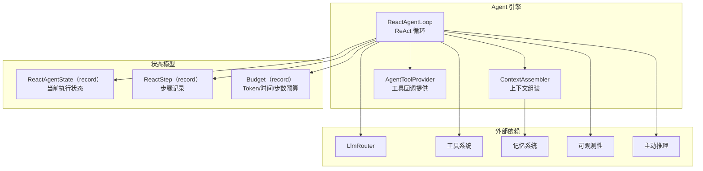
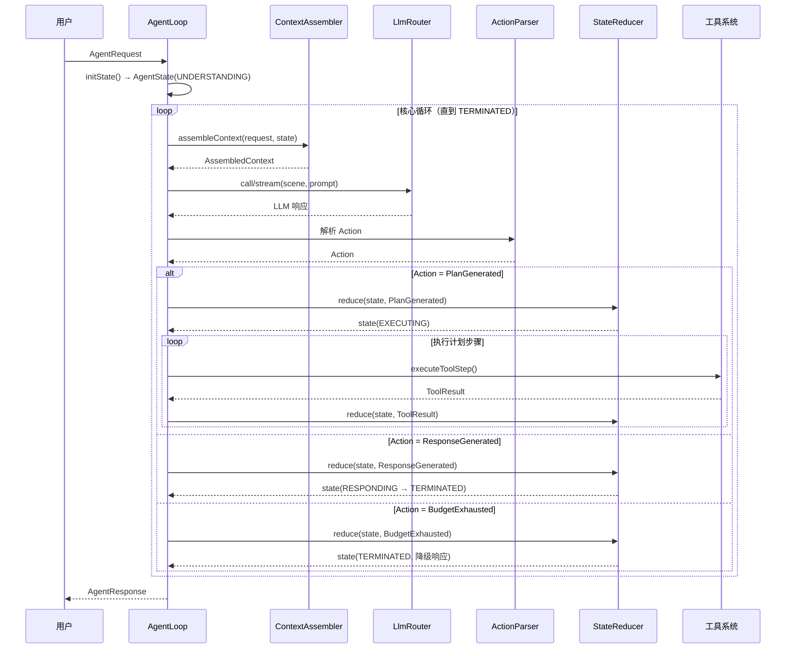

# Agent 引擎 — 架构设计

> **文档性质**：架构设计文档
> **模块归属**：`com.lifepilot.agent`
> **最后更新**：2026-03

## 1. 模块概述

Agent 引擎是知微的核心推理控制中枢，负责接收用户请求、驱动 LLM 推理、编排工具调用、管理执行预算，并生成最终响应。采用 ReAct 循环架构（Thought → Action → Observation），手动控制 tool calling，确保每个工具调用都被显式记录到 ReAct 步骤和 Trace 中。

## 2. 架构图

## 3. 核心组件

### 3.1 AgentLoop

- 职责：Agent 控制循环主体，协调 LLM 调用、动作解析、状态转换、工具执行
- 关键接口：`run(AgentRequest)` → `AgentResponse`、`runStreaming(request, streamId, sseManager, callback)`
- 支持非流式和 SSE 流式两种执行模式

### 3.2 StateReducer

- 职责：纯函数状态转换器，接收当前状态和动作，返回新状态
- 关键接口：`reduce(AgentState, Action)` → `AgentState`
- 处理 9 种动作类型的状态转换，包含阶段转换合法性校验

### 3.3 ContextAssembler

- 职责：组装 LLM 调用上下文，包括系统 Prompt、当前 session 最近完整轮次、L1 临时工作区、L3 用户画像与经验
- 当前主路径不再依赖旧的 `WorkingMemory` 对话缓存，也不再自动注入跨 session 原始对话
- 跨会话历史检索通过记忆工具显式触发，而不是直接混入主 Prompt

### 3.4 AgentState / AgentPhase / Action

- `AgentState`：不可变状态快照（record），包含阶段、预算、步骤记录、响应等
- `AgentPhase`：6 阶段生命周期枚举（Understanding → Planning → Executing → Reflecting → Responding → Terminated）
- `Action`：9 种动作类型的 sealed interface（IntentUnderstood / PlanGenerated / ToolResult / ReflectionComplete / ResponseGenerated / BudgetExhausted / Blocked / ErrorRecovery / SubAgentResult）

### 3.5 Budget

- 职责：Token、时间、步数三维预算控制
- 预算耗尽时触发 `BudgetExhausted` 动作，生成降级响应

## 4. 核心流程

## 5. 设计决策

| 决策 | 选择 | 理由 |
|------|------|------|
| 状态管理 | 不可变 record + 纯函数 StateReducer | 每次转换生成新实例，天然支持轨迹回放和并发安全 |
| 动作类型 | sealed interface + record | 编译期穷举检查，新增动作类型时编译器强制处理所有分支 |
| 阶段转换 | 枚举 + canTransitionTo 白名单 | 防止非法状态转换，状态机行为可预测 |
| 预算控制 | 三维预算（Token/时间/步数） | 防止 Agent 无限循环或过度消耗资源 |
| 流式支持 | IterationCallback 抽象 | 非流式和 SSE 流式共享核心循环逻辑，通过回调差异化输出 |

## 6. 集成点

- **LLM Router**（`llm`）：通过 `LlmRouter.call()` / `stream()` 驱动推理
- **工具系统**（`tool`）：通过 `AgentToolProvider` 获取工具回调，执行计划步骤
- **记忆系统**（`memory`）：通过 `ContextAssembler` 读取最近完整轮次、工作区、画像和经验
- **可观测性**（`observability`）：TraceRecorder 记录每步执行轨迹
- **主动推理**（`agent.proactive`）：ProactiveReasoner 在循环后异步触发
- **多 Agent**（`multiagent`）：SubAgentResult 动作支持子 Agent 委托结果回传

## 7. 配置参考

| 配置键 | 默认值 | 说明 |
|--------|--------|------|
| `lifepilot.agent.max-iterations` | — | 单次循环最大迭代次数 |
| `lifepilot.agent.budget.*` | — | 预算配置（Token 上限、时间上限、步数上限） |
| `lifepilot.agent.context.*` | — | 上下文组装配置（最近轮次与 Prompt 组装策略） |
