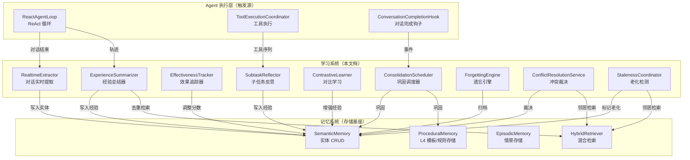
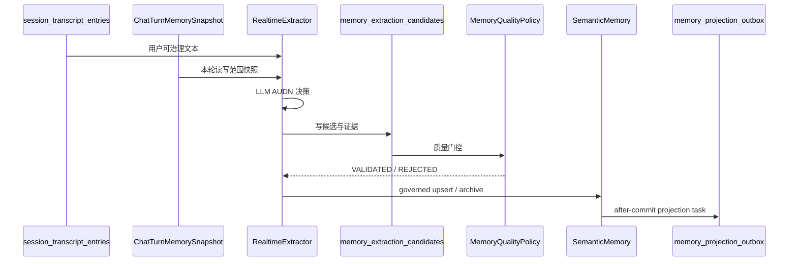

# 学习系统 — 架构设计

> **文档性质**：学习系统整体架构、子系统设计与演进路线
> **模块归属**：`com.lifepilot.agent.learning`
> **最后更新**：2026-06-01（从 memory-system.md / memory-data-flow.md 拆出）
> **配套文档**：[memory-system.md](./memory-system.md)（记忆系统 — 学习的存储与检索基座）
>
> 本文档定义"学习"的边界：从经历中提炼知识、从反馈中优化策略、从重复中形成习惯。学习**使用**记忆（读取经历、写入经验），但学习本身不是记忆的职责。涉及学习写入链路、巩固策略、遗忘策略、经验质量门槛的改动，必须先更新本文档，再改代码。

---

## 0. 一句话模型

学习系统不是一个"自动塞进 Prompt 的大数据库"，而是一组**主动从经历中提炼规律**的子系统：

**RealtimeExtractor 从对话中提取事实，ExperienceSummarizer 从轨迹中提炼经验，ConsolidationPipeline 把碎片巩固为结构化知识，ForgettingEngine 衰减归档低价值记忆，EffectivenessTracker 从反馈中调整经验权重。**

学习与记忆的关系类比：

| 类比 | 学习系统 | 记忆系统 |
|---|---|---|
| 图书馆 | 研究员（读书、做笔记、写论文） | 图书馆（藏书、编目、借阅） |
| 大脑 | 大脑皮层的学习区（提炼、巩固、遗忘） | 海马体/新皮层（编码、存储、检索） |
| 数据 | 主动产出新知识（写） | 被动响应读写请求（CRUD） |

**核心原则**：学习模块依赖记忆模块（读取经历、写入经验），记忆模块不知道学习模块的存在。


---

## 1. 系统边界



### 1.1 学习系统包含的组件

> 位置已于 2026-06 模块拆分后核实更新：学习组件统一迁至 `com.lifepilot.agent.learning.*`。

| 组件 | 当前位置 | 职责 |
|------|---------|------|
| `RealtimeExtractor` | `agent.learning.extraction` | 对话结束后 LLM AUDN 提取事实/偏好/目标 |
| `ExtractionValidator` | `agent.learning.extraction` | 提取结果质量门控 |
| `MemoryExtractionCandidateRepository` | `agent.learning.extraction` | 候选审计持久化 |
| `ExperienceSummarizer` | `agent.learning.experience` | 从 ReAct 轨迹提炼结构化经验 |
| `TrajectoryQualityAssessor` | `agent.learning.experience` | 轨迹质量评估（门控） |
| `EffectivenessTracker` | `agent.learning.experience` | 经验注入后有效性反馈 |
| `SubtaskReflector` | `agent.learning.experience` | 工具序列级细粒度经验 |
| `ContrastiveLearner` | `agent.learning.experience` | 成功/失败轨迹对比学习 |
| `ExperienceMerger` | `agent.learning.consolidation` | 相似经验去重合并 |
| `EpisodicToSemanticConsolidator` | `agent.learning.consolidation` | 情景→语义巩固 |
| `EpisodicToProceduralConsolidator` | `agent.learning.consolidation` | 轨迹→操作模板巩固 |
| `PreferenceConsolidator` | `agent.learning.consolidation` | L3 偏好→L4 规则同步 |
| `UserProfileConsolidator` | `agent.learning.consolidation` | 画像碎片→巩固画像 |
| `EntityDeduplicator` | `agent.learning.consolidation` | 实体去重合并 |
| `ConsolidationPipeline` | `agent.learning.consolidation` | 巩固管线编排（在用，串行 7 阶段）|
| `ConsolidationScheduler` | `agent.learning.consolidation` | 巩固分阶段调度真源（已注册为 Bean 并接线，见 §3.2）|
| `ForgettingEngine` | `agent.learning.forgetting` | MaRS 六策略混合遗忘 |
| `FeedbackProcessor` | `agent.learning.feedback` | 用户反馈处理 |
| `ConflictResolutionService` | `agent.learning.conflict` | 语义冲突 LLM 裁决 |
| `StalenessCoordinator` | `agent.learning.staleness` | 新事实写入后邻居老化检测 |
| `AssociationCandidateGenerator` | `agent.learning.consolidation.association` | REM 式联想候选生成 |
| `AssociationConsolidator` | `agent.learning.consolidation.association` | 联想候选过滤与持久化 |

### 1.2 学习系统不包含的组件（留在记忆）

| 组件 | 留在记忆的原因 |
|------|--------------|
| `SemanticMemory` | 纯 CRUD + 版本管理，不做决策 |
| `ProceduralMemory` | 纯存储（模板/规则的 CRUD），不做学习 |
| `IntentMatcher` | 纯检索（向量+FTS 匹配），不产出新知识 |
| `HybridRetriever` | 纯检索引擎 |
| `HotMemoryDigestService` | 纯消费视图构建 |
| `MemoryAccessPolicy` | 纯治理策略 |
| `LifecycleState` / 监听器 | 纯生命周期管理 |
| `VectorSearcher` / `FtsSearcher` / `GraphTraverser` | 纯检索基础设施 |


---

## 2. 写入链路

学习系统是记忆的主要写入者。以下是所有学习相关的写入源及其治理规则。

### 2.1 自动对话学习（RealtimeExtractor）



**硬规则**：

- 缺 `ChatTurnMemorySnapshot` 直接跳过自动学习（fail-closed）
- `RealtimeExtractor` 的 existing summary 可以读取继承空间，但 UPDATE / DELETE 只能命中可写空间
- `UNKNOWN` 证据不得写主库；低质量候选必须留审计
- `importance_score` 不是质量分；是否可写、可注入、可派生由 `trust_level` / `trust_score` / `evidence_kind` 决定
- AUDN prompt 必须要求 `evidence_kind / evidence_excerpt / temporality / expires_at`；只允许从 `用户:` 内容提取
- `USER_EXPLICIT` 可写；`CHAT_INFERRED` 只有 `trust_score >= 0.60` 且 evidence excerpt 非空才可写；`UNKNOWN` 进入 `REJECTED` 候选，不写主库

**触发时机**：对话结束后，Virtual Thread 异步执行

**源码位置**：`src/main/java/com/lifepilot/agent/learning/extraction/RealtimeExtractor.java`

### 2.2 经验学习（ExperienceSummarizer + SubtaskReflector + ContrastiveLearner）

#### 2.2.1 ExperienceSummarizer — 任务级经验

- 从 ReactAgentState 轨迹中提炼结构化经验
- 只写可迁移经验：必须包含任务目标、工具/步骤摘要、成功/失败结果、适用条件
- 一次偶发失败不能产出高信任经验
- 默认 `LLM_SUMMARIZED_EXPERIENCE / DERIVED`
- 去重：向量相似度 ≥ 配置阈值时合并到已有经验（updateImportanceScore），不创建新实体

**触发时机**：对话结束后，`ReactAgentLoop.asyncPostProcess` 在 Virtual Thread 中调用

**源码位置**：`src/main/java/com/lifepilot/agent/learning/experience/ExperienceSummarizer.java`

#### 2.2.2 SubtaskReflector — 工具级经验

- 只写工具级经验，带 `toolId` 和 `granularity=TOOL_LEVEL`
- 工具级经验不进入通用经验注入；只由 `ToolTipResolver` 在匹配工具时提供提示
- 触发条件：连续工具调用数 ≥ `minToolSequence`（默认 3）

**源码位置**：`src/main/java/com/lifepilot/agent/learning/experience/SubtaskReflector.java`

#### 2.2.3 ContrastiveLearner — 对比学习

- 对比成功/失败轨迹，提取差异化洞察
- 当前实现：产出**独立派生 EXPERIENCE 实体**（`isDerived=true`，`derivationSources=[successExp.id, failureExp.id]`，`properties.insightType=CONTRASTIVE`），任一源经验失效时可经 derivation_sources 级联失活，避免无血缘的陈旧洞察残留（记忆链路 #4 已修；取代早期"原地增强 successExp.properties.lessons"做法）

**源码位置**：`src/main/java/com/lifepilot/agent/learning/experience/ContrastiveLearner.java`

### 2.3 效果追踪（EffectivenessTracker）

- 追踪注入经验的有效性并动态调整 importanceScore
- 在 `asyncPostProcess` 的 Virtual Thread 中调用，零热路径影响
- 判定逻辑：`terminationReason == null` 且 `toolSuccessRatio >= threshold` → 有效
- 有效 → importanceScore + positiveBoost（默认 0.05）
- 无效 → importanceScore - negativeDecay（默认 0.03）
- 低于 evictionThreshold（默认 0.1）→ 归档淘汰

**源码位置**：`src/main/java/com/lifepilot/agent/learning/experience/EffectivenessTracker.java`

### 2.4 冲突裁决（ConflictResolutionService）

- upsert 成功后异步触发 LLM 裁决（REPLACE / COEXIST / TIMELINE）
- 查 top-5 语义相似邻居 → 过滤自己 → 交 LLM 裁决
- 裁决结果可能导致旧实体 SUPERSEDED 或新实体 COEXIST

**源码位置**：`src/main/java/com/lifepilot/agent/learning/conflict/ConflictResolutionService.java`

### 2.5 老化检测（StalenessCoordinator）

- 新事实写入后自动识别语义冲突的老邻居
- 迁入 `STALE_CANDIDATE` 生命周期态
- 召回时降权但不丢弃，Agent 命中时可自然追问确认
- 类型白名单：默认 `PREFERENCE / HABIT / PLACE / GOAL`
- 相似度阈值：默认 0.85

**源码位置**：`src/main/java/com/lifepilot/agent/learning/staleness/StalenessCoordinator.java`


---

## 3. 巩固管线

### 3.1 七阶段概览

`ConsolidationPipeline` 顺序执行七个阶段，各阶段故障隔离：

| # | 阶段 | 组件 | 职责 |
|---|------|------|------|
| 1 | 语义巩固 | `EpisodicToSemanticConsolidator` | 高频提及的已有 L3 实体直接 `UPDATE importanceScore`（不创建新版本） |
| 2 | 程序巩固 | `EpisodicToProceduralConsolidator` | 分析对话轨迹中工具调用序列，相似度超阈值聚类为 `ProcedureTemplate` |
| 3 | 偏好同步 | `PreferenceConsolidator` | L3 `PREFERENCE` 实体同步为 L4 `PreferenceRule`（只允许 `VERIFIED / EXPLICIT` 进入） |
| 4 | 经验合并 | `ExperienceMerger` | 向量相似度检测 + LLM 合并泛化元经验 |
| 5 | 用户画像巩固 | `UserProfileConsolidator` | 读取 L3 碎片 + L4 偏好 + 最近对话摘要，LLM 生成 `__consolidated_profile`；按源签名防抖 |
| 6 | 经验提升 | `promoteHighFrequencyExperiences` | L3 `EXPERIENCE` 中 `importanceScore ≥ 0.8 且 accessCount ≥ 3` 提升为 `ProcedureTemplate`，源经验归档 |
| 7 | REM 联想 | `AssociationCandidateGenerator` + `AssociationConsolidator` | 对 L3 高 importance seed 实体做跨实体联想，LLM 推断潜在语义关系 |

### 3.2 调度解耦（已落地）

历史问题：7 阶段曾全部串行运行在同一个 cron job 中（`ConsolidationPipeline.consolidate()`），无法独立调度。

> **2026-06 更新（consolidation-decoupling spec）**：`ConsolidationScheduler` 已注册为 Bean
> 并接线为巩固调度的**唯一真源**。`ConsolidationPipeline` 删除了 `@Scheduled` 单 cron 入口，
> 改为暴露各阶段方法；`AgentLearningAutoConfiguration` 接入三类触发：
> `ConversationCompletedEvent`（事件）、每日 cron、每分钟轮询（画像防抖 + 空闲 REM）。
> `ExperiencePromoter` 已抽为独立组件承担阶段 6。下表的目标触发策略已基本落地。

各阶段触发策略：

| # | 阶段 | 目标触发方式 | 理由 |
|---|------|------------|------|
| 1 | 语义巩固 | EVENT（ConversationCompleted） | 对话结束后立即巩固，延迟从"最多等 24h"降为秒级 |
| 2 | 程序巩固 | EVENT（ConversationCompleted） | 同上 |
| 3 | 偏好同步 | DAILY_CRON | 低频即可，偏好变化不频繁 |
| 4 | 经验合并 | DAILY_CRON | 低频即可，去重不紧急 |
| 5 | 用户画像 | EVENT + 防抖（30min） | 对话结束后触发但防抖，避免频繁 LLM 调用 |
| 6 | 经验提升 | DAILY_CRON | 低频即可 |
| 7 | REM 联想 | IDLE（空闲 30min 后） | 非紧急，空闲时执行 |

### 3.3 各阶段详细设计

#### 3.3.1 语义巩固（EpisodicToSemanticConsolidator）

- 回溯最近 N 天（默认 7）的对话
- 统计实体被提及次数，超过阈值（默认 3）的实体提升 importanceScore
- 提升步长：默认 0.1，单次巩固最大提升 0.3
- 不创建新版本（避免与 RealtimeExtractor 并发时的唯一约束冲突）

#### 3.3.2 程序巩固（EpisodicToProceduralConsolidator）

- 分析对话轨迹中的工具调用序列
- 相似度超阈值（默认 0.85）的序列聚类
- 聚类大小 ≥ minClusterSize（默认 2）时生成 `ProcedureTemplate`
- 每次巩固最大新模板数：默认 10

#### 3.3.3 偏好同步（PreferenceConsolidator）

- 扫描 L3 `PREFERENCE` 类型实体
- 只允许 `VERIFIED / EXPLICIT` 的实体同步到 L4 `PreferenceRule`
- `INFERRED` 需要多次观察或用户确认后再升级
- 新建规则填 `source_entity_id`

#### 3.3.4 经验合并（ExperienceMerger）

- 向量相似度检测相似经验（阈值默认 0.85）
- LLM 合并为泛化元经验
- 每次巩固最大合并数：默认 10
- 合并后源经验归档

#### 3.3.5 用户画像巩固（UserProfileConsolidator）

- 读取 L3 可消费画像碎片 + L4 偏好 + 最近对话摘要
- 生成源签名，签名未变化时跳过 LLM
- 签名变化后套用最小间隔防抖（≥2h）
- 产出 `__consolidated_profile` CUSTOM 实体（`isDerived=true`）
- 最近对话摘要只作语境辅助，不允许绕过 L3 质量门控沉淀新事实

#### 3.3.6 经验提升（ExperiencePromoter.promote）

- 条件：`importanceScore ≥ 0.8 且 accessCount ≥ 3`
- 提升为 `ProcedureTemplate`：
  - `templateId` 使用独立 UUID，**不复用 `exp.id()`**。模板向量经 `PROCEDURE_TEMPLATE_VECTOR` 投影按 `entityId=templateId` 写 `entity_embeddings`，复用源 EXPERIENCE 的 id 会与源实体向量共用同一 key 互相覆盖串号，故解耦
  - `sourceEntityId` 指向源 L3 EXPERIENCE id（与 `EpisodicToProceduralConsolidator` 一致）
  - `successRate = 1.0`，`useCount = exp.accessCount()`：useCount 由源经验 accessCount 驱动，忠实反映底层经验已被使用的次数。提升前提已要求 `accessCount ≥ minAccessCount`（默认 3），故 `useCount ≥ minUseCount`（默认 2），配合 `successRate=1.0` 使提升模板**立即满足 `IntentMatcher.isReliable` 而可被匹配**（修复早期硬编码 `useCount=0` 导致提升模板永不可靠、永不被命中的缺陷）
- 去重：按 `source_entity_id` 反查现存活跃模板（`ProceduralMemory.findBySourceEntityId`），命中则跳过，保证重复提升幂等
- 源实体保持 ACTIVE（后续失活时由 L4SyncListener 经 `source_entity_id` 反查级联模板失活）

#### 3.3.7 REM 联想（AssociationCandidateGenerator + AssociationConsolidator + AssociationCandidateApplier）

- 对 L3 高 importance seed 实体（默认 `GOAL / TOPIC / PROJECT`）
- 用 HybridRetriever 找邻居
- LLM 推断未被显式记录的潜在语义关系
- 合格候选先落文件审计（`AssociationCandidateStore`），再由 `AssociationCandidateApplier` 应用到 `memory_relations` 主库
  （阈值 `rem.apply-min-confidence` 默认 0.75，独立于生成阈值 0.65；端点存活校验 + `relationExists` 幂等）
- 5 种关系枚举：`RELATED_TO / CAUSES / SIMILAR_TO / SUPPORTS / CONTRADICTS`

#### 3.3.8 对话期关系抽取（RealtimeExtractor 二阶段，memory-graph-deepening）

- 每轮对话 AUDN 实体写入后，`RealtimeExtractor` 追加一次关系抽取（`RelationExtractionStep` + `prompts/semantic/relation-extraction.st`）
- 以本轮已知实体（本轮新增/更新 + 已有 top-N）为端点约束，LLM 抽取实体间关系
- 名称解析为持久化实体 ID 后，经唯一入口 `SemanticMemory.addRelation` 写入 `memory_relations`
- 开关 `extraction.relation-extraction-enabled`（默认 true）；超时/失败静默降级，不影响实体写入与主对话流程
- **意义**：此前对话链路完全不产关系，`memory_relations` 长期为 0，导致 `GraphTraverser` 多跳召回恒空；
  本链路接通后日常对话即可持续丰富关系图谱，支撑联想与多跳推理

#### 3.3.9 记忆注意力（memory-proactive-foundation，消费侧）

> 归属记忆消费层 `com.lifepilot.memory.consumption.attention`，遵循"记忆提供、主动消费"边界：只读派生，不写主库、不触发自主对外行为。

- `MemoryAttentionService.computeAttention(filter, topN)` 聚合多类主动注意力信号，按可配置权重融合排序：
  - **EXPIRING**：`expires_at` 落入窗口的实体（即将被 `ExpirationScanner` 自动遗忘的 EPHEMERAL/SHORT_TERM 记忆，提醒"短期事项即将失效"）
  - **DUE_SOON**：带硬截止日期（`properties.dueAt`）的 GOAL/EVENT/PROJECT 临近截止（含已逾期），权重默认最高（1.2）。dueAt 与 `expires_at` 解耦——见下方"截止日期捕获"
  - **NEGLECTED**：`importance ≥ 阈值` 但长期未访问的高价值实体（"重要但被冷落"）
  - **EVOLVING**：近期持续多版本演进的实体
  - **CONNECTION**：`GraphReasoner` 在关系图上发现的两跳可达但无直接边的连接机会（联想），自动排除 `__` 前缀的系统派生聚合实体（如 `__consolidated_profile`）以降噪
- **可信化质量门（memory-trust-and-cleanup）**：所有注意力项必须通过 `MemoryQualityPolicy.isPromptConsumable`——
  与上下文注入、工具搜索返回等全系统消费路径同一硬门槛，避免基于 UNVERIFIED / 低 trust / 已过期记忆主动浮现：
  - EXPIRING / DUE_SOON / NEGLECTED 候选逐条 `isPromptConsumable` 过滤
  - EVOLVING 额外要求 `lifecycleState == ACTIVE`（已演进但完结的实体不再浮现）
  - CONNECTION 对联想目标实体经 `SemanticMemory.existsConsumableById(toId)` 校验后才产出
- **时间类信号限定 ACTIVE（memory-trust-and-cleanup）**：`findApproachingExpiry / findNeglected / findWithDueDate`
  的生命周期条件由 RECALLABLE 三态（ACTIVE/COMPLETED/REGENERATION_NEEDED）收窄为**仅 `ACTIVE`**——
  COMPLETED（已完成目标）不再触发 DUE_SOON / EXPIRING / NEGLECTED 提醒
- 出口：`ProactiveMemoryBridge.getAttentionItems(topN)`（主动层消费，scope 用 `MemoryReadFilter.userMemory()`，与端点一致）+ `GET /api/memories/attention`（运维/UI）
- 配置见 §8.6
- **截止日期捕获（memory-deadline-awareness）**：硬截止日期存于 `properties.dueAt`（ISO 日期），与 `expires_at`（自动遗忘 TTL）严格区分——
  否则 `ExpirationScanner` 会在截止后误归档目标。由 `DueDateExtractor` 确定性正则从实体名/描述提取绝对日期兜底
  （AUDN LLM 不可靠地输出结构化 dueAt），覆盖两条写入路径：`RealtimeExtractor`（对话 AUDN）与 `MemoryToolProvider`（Agent 显式 `memory.create`）


---

## 4. 遗忘引擎（MaRS 认知遗忘）

基于 MaRS 论文（ACL 2024）的六策略混合遗忘模型。

### 4.1 六策略

通过 sealed interface 定义：`FifoPolicy` / `LruPolicy` / `PriorityDecayPolicy` / `ReflectionSummaryPolicy` / `RandomDropPolicy` / `HybridPolicy`（编排四阶段遗忘流程）。

### 4.2 执行流程

`ForgettingEngine` 定时流程：获取当前实体 → 过滤受保护实体 → HybridPolicy 选择候选 → 执行遗忘动作 → 记录日志

### 4.3 受保护实体机制

满足任一即受保护：

- 类型保护：受保护类型（默认 `PREFERENCE / HABIT / GOAL`）
- 重要度保护：`importanceScore ≥ 0.9`
- 高频访问保护：`accessCount ≥ 10`
- 近期访问保护：最近 7 天内被访问过

### 4.4 遗忘动作

- 中等重要度 + LLM 可用 → LLM 压缩后归档
- 其他 → 直接归档
- LLM 压缩失败降级为直接归档
- 压缩调用走 `generationRouter.call(..., skipCache=true)`：避免不同实体共享首条摘要

### 4.5 归档一致性

- 所有归档走 `SemanticMemory.archive()`
- 事务提交后通过 `afterCommit` 登记 `memory_projection_outbox` DELETE 投影任务
- 所有遗忘操作落 `forgetting_log` 表，支持事后追溯

### 4.6 配置

| 配置键 | 默认 | 说明 |
|--------|------|------|
| `lifepilot.agent.learning.forgetting.cron` | `0 0 4 * * SUN` | 遗忘定时 Cron |
| `lifepilot.agent.learning.forgetting.max-retention-days` | 365 | FIFO 阈值 |
| `lifepilot.agent.learning.forgetting.lru-threshold-days` | 90 | LRU 未访问天数 |
| `lifepilot.agent.learning.forgetting.priority-decay-rate` | 0.02 | 衰减率 λ |
| `lifepilot.agent.learning.forgetting.max-forget-per-run` | 100 | 每次最大遗忘数 |
| `lifepilot.agent.learning.forgetting.protection-threshold` | 0.9 | 受保护重要度阈值 |
| `lifepilot.agent.learning.forgetting.protected-types` | PREFERENCE,HABIT,GOAL | 受保护类型 |
| `lifepilot.agent.learning.forgetting.recent-access-protection-days` | 7 | 近期访问保护天数 |
| `lifepilot.agent.learning.forgetting.high-access-count-protection` | 10 | 高频访问保护阈值 |

---

## 5. 写入源详表

以下是学习系统的所有写入源，精确到 `file:line`。

| # | 源 | 产物类型 | 触发时机 | 经 SemanticMemory? |
|---|---|---|---|---|
| 1 | `RealtimeExtractor` | L3：任意 EntityType | 对话结束，Virtual Thread 异步 | ✅ |
| 2 | `ExperienceSummarizer` | L3：EXPERIENCE（任务级） | 对话结束 + 质量评估通过 | ✅ |
| 3 | `SubtaskReflector` | L3：EXPERIENCE（工具级） | 工具序列结束后即时反思 | ✅ |
| 4 | `ContrastiveLearner` | L3：现有 EXPERIENCE 属性增强 | Summarizer 完成后 | ✅ |
| 5 | `UserProfileConsolidator` | L3：CUSTOM `__consolidated_profile` | 巩固管线触发 | ✅ |
| 7 | `PreferenceConsolidator` | L4：preference_rules | 巩固管线 Cron | 直写 L4 |
| 8 | `ProceduralMemory.save`（经验提升） | L4：procedure_templates | 巩固管线 | 直写 L4 |
| 10 | `ForgettingEngine` | L3：archive | Cron 定时衰减 | ✅ |
| 11 | `EntityDeduplicator` | L3：归档 secondary | 巩固管线 Cron | ✅ |
| 14 | `EffectivenessTracker` | L3：调整 importanceScore / archive | 对话完成后评估 | ✅ |

> 注：编号与 [memory-data-flow.md](./memory-data-flow.md) §2 的 14 写入源详表对齐。#6/#9/#12/#13/#15 属于主动引擎或记忆本身的写入，不在学习系统范围内。

---

## 6. 质量门槛（学习侧）

学习系统写入记忆时必须遵守的质量规则（完整质量字段定义见 [memory-data-flow.md §0.7](./memory-data-flow.md)）：

| 入口 | 质量规则 |
|------|---------|
| `RealtimeExtractor` | `USER_EXPLICIT` 可写；`CHAT_INFERRED` 只有 `trust_score >= 0.60` 且 evidence excerpt 非空才可写；`UNKNOWN` 进入 REJECTED 候选 |
| `ExperienceSummarizer` | 必须包含任务目标、工具/步骤摘要、成功/失败结果、适用条件；默认 `LLM_SUMMARIZED_EXPERIENCE / DERIVED` |
| `SubtaskReflector` | 必须带 `toolId` 和 `granularity=TOOL_LEVEL`；不进通用经验注入 |
| `ContrastiveLearner` | 终态应产出独立派生洞察，带 `derivation_sources` |
| `UserProfileConsolidator` | 写入前必须过滤不可消费碎片；最近对话摘要只作语境辅助 |
| `PreferenceConsolidator` | 只允许 `VERIFIED / EXPLICIT` 的 L3 PREFERENCE 同步到 L4 |
| `ForgettingEngine` | 受保护实体不可遗忘；遗忘操作必须落 `forgetting_log` |

---

## 7. 学习闭环

学习系统的终极目标是形成完整的闭环：

```
对话执行 → 经验提取 → 巩固为模板 → 下次匹配 → 注入上下文 → 更好的执行 → 效果反馈 → 调整权重
```

### 7.1 闭环状态（2026-06 learning-loop-closure spec 打通）

历史断点已基本闭合，闭环"对话执行 → 提炼 → 巩固为模板 → 匹配注入 → 执行"端到端可用：

| 环节 | 历史问题 | 现状 |
|------|------|---------|
| 执行轨迹 → 程序巩固 | `agent_traces`/`agent_trace_steps` 从未被写入 → 巩固恒产 0 模板 | 已修：`AgentTraceWriter` 经 `TraceRecorder.onTraceEnd` 落库（含工具 I/O） |
| 巩固生成模板 → 可被匹配 | 模板初始 successRate=0/useCount=0，`isReliable` 永假 → 永不被匹配（鸡生蛋） | 已修：两条产模板路径均按源证据初始化 successRate=1.0——程序巩固（`EpisodicToProceduralConsolidator`）useCount=源轨迹数；经验提升（`ExperiencePromoter`）useCount=源经验 accessCount（详见 §3.3.6），均 ≥ minUseCount 立即可靠 |
| IntentMatcher → ContextAssembler | 匹配结果未注入 | 已通：`AdaptiveDecisionEngine` 命中模板后产出 experienceHint 注入 `<decision_context>`（实测 score≈0.605 命中） |
| 经验写入 → 向量索引 | 依赖 outbox | `MemoryProjectionService.runAfterCommit` 无事务时即时执行，模板/实体向量写入即时 |

> **待调优（非断点）**：IntentMatcher 融合分（语义0.7+FTS0.3）在 0.6 阈值附近敏感，且模板语义召回与 L3 实体共用 entity_embeddings top-10 受挤压。后续可做模板召回独立通道或阈值/权重调优。

### 7.2 反馈信号

| 信号 | 来源 | 影响 |
|------|------|------|
| 工具成功率 | EffectivenessTracker | importanceScore 调整 |
| 用户点赞/点踩 | FeedbackProcessor | importanceScore 调整 |
| 模板执行成功/失败 | ProceduralMemory.recordExecution | 模板 successRate 更新 |
| 经验被检索命中 | HybridRetriever.incrementAccessCount | accessCount 增加 |

---

## 8. 配置索引

### 8.1 经验学习

| 配置键 | 默认 | 说明 |
|--------|------|------|
| `lifepilot.agent.learning.experience.enabled` | true | 经验总结总开关 |
| `lifepilot.agent.learning.experience.max-input-tokens` | 4000 | LLM 输入截断上限 |
| `lifepilot.agent.learning.experience.dedup-similarity-threshold` | 0.90 | 去重语义相似度阈值 |
| `lifepilot.agent.learning.experience.max-retention-days` | 90 | 经验最大保留天数 |
| `lifepilot.agent.learning.experience.llm-timeout-seconds` | 120 | LLM 调用超时 |
| `lifepilot.agent.learning.experience.min-tool-success-ratio` | 0.3 | 工具调用有效率门控 |

### 8.2 巩固管线

| 配置键 | 默认 | 说明 |
|--------|------|------|
| `lifepilot.agent.learning.consolidation.cron` | `0 0 3 * * *` | 巩固定时 Cron |
| `lifepilot.agent.learning.consolidation.trigger-mode` | CRON | CRON / IDLE / HYBRID |
| `lifepilot.agent.learning.consolidation.lookback-days` | 7 | 回溯天数 |
| `lifepilot.agent.learning.consolidation.high-frequency-threshold` | 3 | 高频提及阈值 |
| `lifepilot.agent.learning.consolidation.cluster-similarity-threshold` | 0.85 | 聚类余弦相似度 |
| `lifepilot.agent.learning.consolidation.max-templates-per-run` | 10 | 每次最大新模板数 |
| `lifepilot.agent.learning.consolidation.experience-promote-min-importance` | 0.8 | 经验提升最低重要度 |
| `lifepilot.agent.learning.consolidation.experience-promote-min-access-count` | 3 | 经验提升最低访问次数 |
| `lifepilot.agent.learning.consolidation.user-profile-llm-timeout-seconds` | 120 | 画像巩固 LLM 超时 |

### 8.3 提取

| 配置键 | 默认 | 说明 |
|--------|------|------|
| `lifepilot.agent.learning.extraction.timeout-seconds` | 60 | AUDN 提取 LLM 超时 |
| `lifepilot.agent.learning.extraction.max-entities-per-extraction` | 10 | 单次最大提取实体数 |
| `lifepilot.agent.learning.extraction.min-extraction-confidence` | 0.3 | 最小提取置信度 |
| `lifepilot.agent.learning.extraction.existing-entity-summary-limit` | 50 | 注入提示词的已有实体摘要上限 |
| `lifepilot.agent.learning.extraction.relation-extraction-enabled` | true | 对话期关系抽取开关（写入 memory_relations） |
| `lifepilot.agent.learning.extraction.relation-timeout-seconds` | 60 | 关系抽取 LLM 独立超时 |

### 8.4 老化检测

| 配置键 | 默认 | 说明 |
|--------|------|------|
| `lifepilot.agent.learning.staleness.enabled` | true | 老化检测开关 |
| `lifepilot.agent.learning.staleness.detection-similarity-threshold` | 0.85 | 邻居识别最低语义相似度 |
| `lifepilot.agent.learning.staleness.max-neighbors-per-detection` | 3 | 单次最多标记邻居数 |
| `lifepilot.agent.learning.staleness.retrieval-penalty` | 0.35 | 召回惩罚比例 |

### 8.5 REM 联想

| 配置键 | 默认 | 说明 |
|--------|------|------|
| `lifepilot.agent.learning.rem.enabled` | true | REM 联想开关 |
| `lifepilot.agent.learning.rem.seed-limit` | 10 | seed 实体数量上限 |
| `lifepilot.agent.learning.rem.neighbor-limit` | 5 | 每个 seed 邻居上限 |
| `lifepilot.agent.learning.rem.min-confidence` | 0.65 | 最小置信度（候选生成入文件） |
| `lifepilot.agent.learning.rem.apply-enabled` | true | REM 候选落库应用器开关 |
| `lifepilot.agent.learning.rem.apply-min-confidence` | 0.75 | 候选落 memory_relations 主库的阈值 |

### 8.6 记忆注意力（memory-proactive-foundation，消费侧 `lifepilot.memory.consumption.attention`）

| 配置键 | 默认 | 说明 |
|--------|------|------|
| `lifepilot.memory.consumption.attention.enabled` | true | 记忆注意力总开关 |
| `lifepilot.memory.consumption.attention.expiring-enabled` | true | 产出 EXPIRING 项 |
| `lifepilot.memory.consumption.attention.expiring-window-days` | 14 | 临近到期窗口（天） |
| `lifepilot.memory.consumption.attention.due-soon-enabled` | true | 产出 DUE_SOON 项（硬截止日期） |
| `lifepilot.memory.consumption.attention.due-soon-window-days` | 14 | 截止临近窗口（天） |
| `lifepilot.memory.consumption.attention.neglected-enabled` | true | 产出 NEGLECTED 项 |
| `lifepilot.memory.consumption.attention.neglect-days` | 30 | 停滞判定未访问天数 |
| `lifepilot.memory.consumption.attention.neglect-min-importance` | 0.6 | 停滞高价值最小重要度 |
| `lifepilot.memory.consumption.attention.evolving-enabled` | true | 产出 EVOLVING 项 |
| `lifepilot.memory.consumption.attention.evolving-window-days` | 7 | 演进活跃窗口（天） |
| `lifepilot.memory.consumption.attention.evolving-min-versions` | 2 | 演进活跃最小版本数 |
| `lifepilot.memory.consumption.attention.connection-enabled` | true | 产出 CONNECTION 项 |
| `lifepilot.memory.consumption.attention.max-depth` | 2 | 图遍历最大跳数 |
| `lifepilot.memory.consumption.attention.max-fanout` | 25 | 单实体扩展 fanout 限流 |
| `lifepilot.memory.consumption.attention.max-per-kind` | 10 | 每类候选上限 |
| `lifepilot.memory.consumption.attention.top-n` | 10 | 最终返回上限 |
| `lifepilot.memory.consumption.attention.weight-*` | 1.0/0.8/0.6/0.7 | EXPIRING/NEGLECTED/EVOLVING/CONNECTION 权重 |
| `lifepilot.memory.consumption.attention.weight-due-soon` | 1.2 | DUE_SOON 权重（硬截止最紧急） |

---

## 9. 模块边界与依赖

| 依赖方向 | 说明 |
|---------|------|
| 学习 → 记忆（存储） | 读取经历（findAllCurrent、findById）、写入经验（upsert、archive、updateImportanceScore） |
| 学习 → 记忆（检索） | 去重检索（VectorSearcher.searchEntities）、邻居检索 |
| 学习 → LLM | 提取、巩固、遗忘压缩、经验总结、对比学习、REM 联想 |
| 学习 → Agent 事件 | 监听 ConversationCompletedEvent 触发巩固 |
| Agent → 学习 | ReactAgentLoop 调用 ExperienceSummarizer / EffectivenessTracker |
| 记忆 → 学习 | **禁止**（记忆不知道学习的存在） |

---

## 10. 演进方向

| 方向 | 说明 |
|------|------|
| 巩固调度解耦 | 已完成：7 阶段按 EVENT / CRON / IDLE 独立调度，ConsolidationScheduler 为真源（consolidation-decoupling spec）|
| 学习闭环打通 | 经验写入即时索引、IntentMatcher 结果注入决策上下文 |
| 学习模块独立包 | 已完成：从 `com.lifepilot.memory.*` 迁移到 `com.lifepilot.agent.learning`，配置前缀 `lifepilot.agent.learning.*` |
| 对比学习产出独立实体 | ContrastiveLearner 产出 `CONTRASTIVE_INSIGHT` 实体，带 derivation_sources |
| REM 候选应用器 | 文件候选 → 审阅 → L3 relations 主库 |
| 经验有效性多维评估 | 不仅看 toolSuccessRatio，还看用户满意度、任务完成度 |

---

## 11. 文档更新约定

学习系统后续改动按以下顺序推进：

1. 先更新本文档的学习策略或写入规则
2. 如涉及记忆存储契约变更，同步更新 [memory-data-flow.md](./memory-data-flow.md)
3. 最后改代码和测试

如果代码与本文档不一致，要么改代码贴合终态，要么更新文档并说明为什么终态变了。
