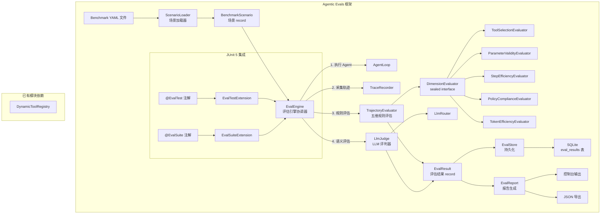

# Agentic Evals 架构设计

> **文档性质**：深度架构设计文档（Developer-Facing）
> **目标读者**：核心开发者、架构评审者
> **模块归属**：`com.lifepilot.eval`
> **最后更新**：2026-02
> **从属关系**：本文档是 [observability.md](observability.md) §6 轨迹评估引擎的独立扩展

---

## 1. 模块定位与职责边界

Agentic Evals 是 ZhiWei 的开发期 Agent 质量评估框架，提供系统性的 Agent 决策质量回归验证能力。它与可观测性模块（TraceRecorder / GuardrailEngine）互补：可观测性关注"记录发生了什么"，Agentic Evals 关注"评判做得好不好"。

### 职责边界

| 属于 Agentic Evals | 不属于 Agentic Evals |
|-------------------|---------------------|
| Benchmark 场景定义与加载 | Trace 数据采集（TraceRecorder 负责） |
| 五维规则评估 | 护栏策略执行（GuardrailEngine 负责） |
| LLM-as-a-Judge 语义评估 | 实时监控告警（Metrics / Actuator 负责） |
| 评估结果持久化与趋势分析 | 数据脱敏（DataRedactor 负责） |
| JUnit 5 回归测试集成 | Agent 执行逻辑（AgentLoop 负责） |
| 退化检测与报告生成 | 轨迹回放 UI（TraceQuery / Web UI 负责） |

---

## 2. 核心概念与术语

| 术语 | 定义 |
|------|------|
| **BenchmarkScenario** | 以 YAML 声明的标准化评估用例，包含固定输入、期望工具调用序列、评估维度权重 |
| **DimensionEvaluator** | 针对单个评估维度的评估逻辑，sealed interface 的 5 个 permit |
| **TrajectoryEvaluator** | 协调五个维度评估器，计算加权综合评分 |
| **LlmJudge** | 使用 LLM 评估无法用规则衡量的语义维度（回答质量、语义正确性） |
| **EvalResult** | 单次场景评估的完整结果 record，包含各维度评分、违规项、改进建议 |
| **EvalEngine** | 评估引擎协调器，串联场景加载→Agent 执行→轨迹采集→评估→报告 |
| **EvalStore** | 评估结果 SQLite 持久化，支持历史趋势查询 |
| **EvalReport** | 报告生成器，聚合多个 EvalResult 生成汇总报告，检测退化告警 |

---

## 3. 架构设计

### 3.1 系统架构图



### 3.2 核心评估流程

```
ScenarioLoader.loadById(scenarioId)
    │
    ▼
EvalEngine.evaluateScenario(scenario)
    │
    ├── 1. AgentLoop.run(AgentRequest) → AgentResponse
    │       └── 从 AgentResponse.steps() 提取 TraceStep 列表
    │
    ├── 2. TrajectoryEvaluator.evaluate(steps, scenario)
    │       ├── ToolSelectionEvaluator     → DimensionScore
    │       ├── ParameterValidityEvaluator → DimensionScore
    │       ├── StepEfficiencyEvaluator    → DimensionScore
    │       ├── PolicyComplianceEvaluator  → DimensionScore
    │       └── TokenEfficiencyEvaluator   → DimensionScore
    │       └── 加权平均 → overallScore
    │
    ├── 3. LlmJudge.judge(actualOutput, expectedPattern, criteria)  [可选]
    │       └── JudgeResult(score, justification, tokensUsed)
    │
    ├── 4. EvalStore.persistAsync(evalResult)
    │
    └── 5. 返回 EvalResult
```

### 3.3 数据流

评估数据从 YAML 场景定义流入，经过 Agent 执行和多维评估，最终持久化到 SQLite 并生成报告：

```
YAML 文件 → BenchmarkScenario → EvalEngine → AgentLoop 执行
                                     │
                                     ├→ TrajectoryEvaluator → DimensionScore × 5
                                     ├→ LlmJudge → JudgeResult（可选）
                                     │
                                     ▼
                                 EvalResult → EvalStore (SQLite)
                                     │
                                     ▼
                                 EvalReport → 控制台 / JSON
```

---

## 4. 关键设计决策

### 4.1 DimensionEvaluator 使用 sealed interface

选择 sealed interface 而非策略模式（Strategy Pattern）或枚举，原因：
- 编译时穷举检查：`switch` 表达式必须处理所有 5 个维度，新增维度时编译器强制提醒
- 类型安全：每个维度评估器可以有不同的依赖（如 `ParameterValidityEvaluator` 依赖 `DynamicToolRegistry`）
- 可测试性：每个 permit 独立测试，不需要 mock 整个评估器链

### 4.2 EvalAutoConfiguration 默认关闭

`@ConditionalOnProperty(prefix = "lifepilot.eval", name = "enabled", havingValue = "true", matchIfMissing = false)`

评估框架默认关闭，需要显式设置 `lifepilot.eval.enabled=true` 才激活。原因：
- 评估框架依赖 AgentLoop、LlmRouter、DynamicToolRegistry 等重量级 Bean
- 在非评估场景（如普通 `@SpringBootTest`）中加载这些依赖会导致上下文加载失败
- 评估是开发期行为，生产环境不需要激活

### 4.3 LlmJudge 降级策略

LLM 评估是可选的、非关键路径。当 LLM 不可用时：
- 超时或异常 → 返回 `JudgeResult(score=0.5, fallback=true)`
- 响应无法解析 → 简化 Prompt 重试一次，仍失败则降级
- 评分超出 [0.0, 1.0] → 裁剪到合法范围

这确保了评估流程不会因为 LLM 不可用而完全中断。

### 4.4 EvalStore 异步持久化

使用 Virtual Thread 异步写入 SQLite，避免阻塞测试执行。写入失败只记录 ERROR 日志，不阻断评估流程。评估结果的持久化是"尽力而为"，不影响评估本身的正确性。

### 4.5 TraceStep 来源：AgentResponse 合成

EvalEngine 不直接调用 TraceRecorder 获取轨迹，而是从 `AgentResponse.steps()` 提取 TraceStep 列表。原因：
- AgentLoop 内部管理 TraceRecorder 的生命周期，外部无法直接访问 TraceContext
- AgentResponse 已经包含了完整的步骤信息，无需重复采集
- 解耦评估框架与 Trace 内部实现

---

## 5. 五维评估模型

### 5.1 评估维度

| 维度 | 评估器 | 评估逻辑 | 典型权重 |
|------|--------|---------|---------|
| 工具选择正确性 | `ToolSelectionEvaluator` | 实际工具调用序列与期望序列的 LCS 相似度 | 0.30 |
| 参数合法性 | `ParameterValidityEvaluator` | 工具调用参数的 JSON Schema 校验通过率 | 0.20 |
| 步骤效率 | `StepEfficiencyEvaluator` | `min(expectedStepCount / actualStepCount, 1.0)` | 0.20 |
| 策略合规性 | `PolicyComplianceEvaluator` | 未被护栏拦截的步骤占比 | 0.20 |
| Token 效率 | `TokenEfficiencyEvaluator` | `min(expectedTokenBudget / actualTokens, 1.0)` | 0.10 |

### 5.2 综合评分

综合评分 = Σ(维度评分 × 维度权重)，权重由 BenchmarkScenario 定义，和必须为 1.0（容差 0.001）。

### 5.3 工具选择评估算法

使用最长公共子序列（LCS）算法比较实际工具调用序列与期望序列：

```
期望序列: [A, B, C]
实际序列: [A, X, B, C]
LCS 长度: 3
评分: LCS / max(期望长度, 实际长度) = 3 / 4 = 0.75
```

---

## 6. 与已有模块的集成点

| 依赖模块 | 接口 | 用途 |
|---------|------|------|
| Agent 引擎 | `AgentLoop.run(AgentRequest)` | 执行 Agent 获取 AgentResponse |
| Agent 引擎 | `TraceRecorder.findTrace(String)` | 查询历史轨迹（备用） |
| LLM Router | `LlmRouter.call(String, String, String)` | LLM-as-a-Judge 语义评估 |
| 工具系统 | `DynamicToolRegistry.resolve(String)` | 获取工具 JSON Schema 用于参数校验 |
| 工具系统 | `ToolContract.inputSchema()` | 工具输入参数 Schema |

---

## 7. 数据库 Schema

### eval_results 表（Flyway V18）

```sql
CREATE TABLE IF NOT EXISTS eval_results (
    eval_id                 TEXT PRIMARY KEY,
    trace_id                TEXT,
    scenario_id             TEXT NOT NULL,
    dimension_scores_json   TEXT NOT NULL,
    overall_score           REAL NOT NULL,
    violations_json         TEXT NOT NULL,
    suggestions_json        TEXT NOT NULL,
    llm_judge_score         REAL,
    llm_judge_justification TEXT,
    llm_judge_tokens_used   INTEGER DEFAULT 0,
    git_commit_hash         TEXT,
    git_branch              TEXT,
    eval_run_id             TEXT NOT NULL,
    evaluated_at            TEXT NOT NULL,
    created_at              TEXT NOT NULL
);
```

索引：`scenario_id`、`eval_run_id`、`evaluated_at`

---

## 8. 配置参考

```yaml
lifepilot:
  eval:
    enabled: false                    # 默认关闭，需显式开启
    scenario-directory: "${user.home}/.lifepilot/eval/scenarios"
    default-pass-threshold: 0.7       # 默认通过阈值
    degradation-threshold: 0.1        # 退化检测阈值
    llm-judge:
      scene: "eval-judge"             # LLM Judge 使用的场景
      timeout-seconds: 30
      fallback-score: 0.5             # 降级默认评分
      max-retries: 1
    store:
      default-query-limit: 50         # 历史查询默认限制
```

---

## 9. 包结构

```
com.lifepilot.eval
├── config/
│   ├── EvalConfigProperties.java     — 配置属性
│   └── EvalAutoConfiguration.java    — Spring Boot 自动配置
├── scenario/
│   ├── BenchmarkScenario.java        — 场景 record
│   ├── ScenarioLoader.java           — YAML 场景加载器
│   ├── ScenarioSerializer.java       — 场景序列化器
│   └── ScenarioLoadException.java    — 加载异常
├── evaluator/
│   ├── DimensionEvaluator.java       — sealed interface（5 permits）
│   ├── DimensionScore.java           — 维度评分 record
│   ├── ToolSelectionEvaluator.java   — 工具选择评估
│   ├── ParameterValidityEvaluator.java — 参数合法性评估
│   ├── StepEfficiencyEvaluator.java  — 步骤效率评估
│   ├── PolicyComplianceEvaluator.java — 策略合规评估
│   ├── TokenEfficiencyEvaluator.java — Token 效率评估
│   └── TrajectoryEvaluator.java      — 轨迹评估协调器
├── judge/
│   ├── LlmJudge.java                — LLM 评判器
│   └── JudgeResult.java             — 评判结果 record
├── model/
│   └── EvalResult.java              — 评估结果 record
├── store/
│   └── EvalStore.java               — SQLite 持久化
├── report/
│   ├── EvalReport.java              — 报告生成器
│   └── ReportSummary.java           — 报告汇总 record
├── engine/
│   └── EvalEngine.java              — 评估引擎协调器
└── junit/
    ├── EvalTest.java                — @EvalTest 注解
    ├── EvalSuite.java               — @EvalSuite 注解
    ├── EvalTestExtension.java       — JUnit 5 Extension
    └── EvalSuiteExtension.java      — JUnit 5 Suite Extension
```

---

## 10. 调研参考

- [Braintrust AI Agent Evaluation Framework](https://www.braintrust.dev/articles/ai-agent-evaluation-framework) — 轨迹评估理念：不只评估最终输出，还要评估完整决策轨迹
- [GetMaxim.ai Evaluating Agentic AI](https://www.getmaxim.ai/) — 在线评估 + 离线回放双模式
- [Furmanets 2026 Practical Architecture](https://www.andriifurmanets.com/blogs/ai-agents-2026-practical-architecture-tools-memory-evals-guardrails) — 评估是 Agent 的"体检报告"
- [OpenTelemetry GenAI Semantic Conventions](https://opentelemetry.io/) — Trace 数据模型对齐标准
- [LLM-as-a-Judge (Zheng et al., 2023)](https://arxiv.org/abs/2306.05685) — 使用 LLM 评估 LLM 输出的方法论
