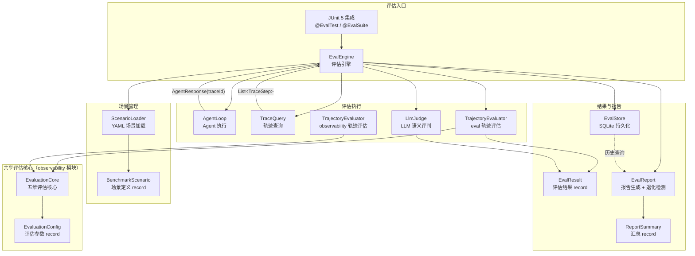
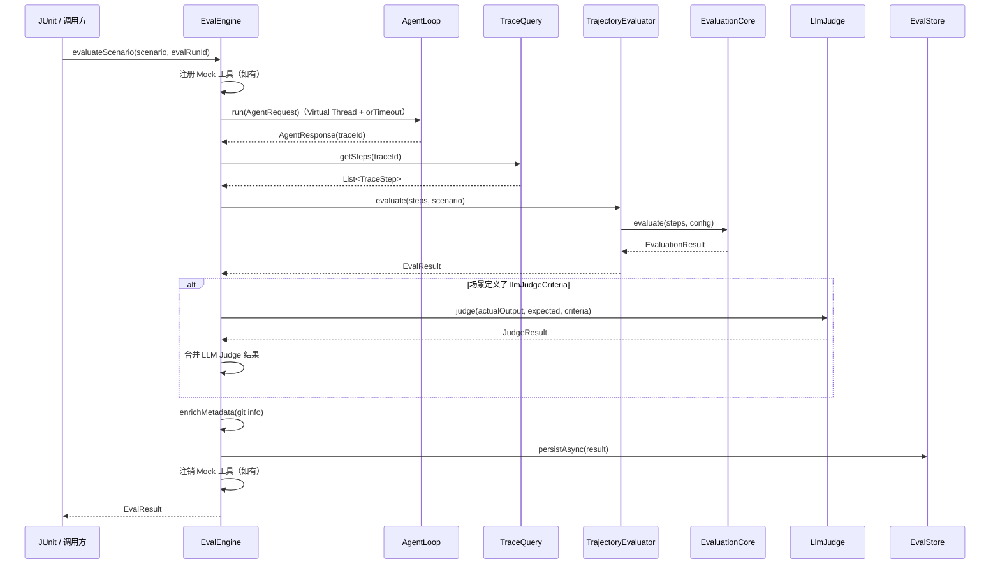
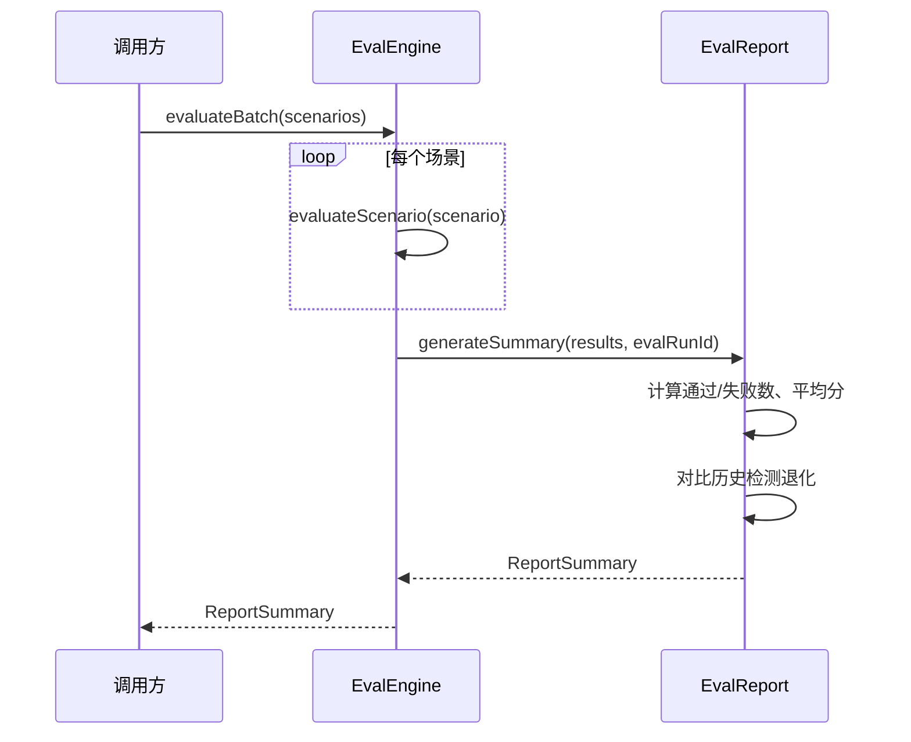

# Agentic Evals 评估框架 — 架构设计

> **文档性质**：架构设计文档
> **模块归属**：`com.lifepilot.eval`
> **最后更新**：2026-03（eval-optimization 重构后更新）

## 1. 模块概述

Agentic Evals 是知微的 Agent 行为评估框架，用于系统性地衡量 Agent 在各种场景下的决策质量。框架采用「YAML 声明式场景 + 五维规则评估 + LLM-as-a-Judge 语义评估」的双轨评估架构，支持单场景评估和批量评估，评估结果持久化到 SQLite 并提供退化检测与趋势对比能力。通过 JUnit 5 注解集成，评估可作为 CI 流水线的一部分自动运行。

## 2. 架构图

## 3. 核心组件

### 3.1 BenchmarkScenario — 场景定义

YAML 声明式评估用例，定义用户输入、期望工具调用序列、维度权重、Mock 工具响应、LLM Judge 标准等。使用 `@Builder(toBuilder = true)` 的 record，集合字段在 compact constructor 中做防御性拷贝。

关键字段：`id`、`name`、`userInput`、`expectedToolCalls`、`dimensionWeights`（五维权重，和为 1.0）、`mockToolResponses`、`llmJudgeCriteria`、`expectedTokenBudget`、`expectedStepCount`、`tags`。

### 3.2 ScenarioLoader — 场景加载器

从配置目录加载 `*.yml` / `*.yaml` 文件，使用 Jackson YAML 反序列化为 `BenchmarkScenario`。支持全量加载、按 ID 加载、按标签过滤。加载后执行校验：场景 ID 唯一性、维度权重和为 1.0（容差 0.001）。场景目录不存在时自动创建并返回空列表，空目录返回空列表并记录 WARN 日志。

### 3.3 EvalEngine — 评估引擎

核心协调器，编排完整评估流程。单场景评估流程：构造 `AgentRequest` → 调用 `AgentLoop.run()`（Virtual Thread + `CompletableFuture.orTimeout` 超时控制）→ 通过 `TraceQuery.getSteps(traceId)` 获取真实轨迹步骤 → `TrajectoryEvaluator` 规则评估 → 可选 `LlmJudge` 语义评估 → 填充 Git 元数据 → 异步持久化。

`evaluateScenario` 接受 `evalRunId` 参数，批量评估时在循环前生成统一 UUID 传入，确保同批次结果共享 evalRunId。支持 Mock 工具响应注入（通过 `DynamicToolRegistry` 临时注册/注销）和 `initialContext` 注入（作为 systemPrompt 前缀）。单场景失败不影响其他场景，失败场景评分为 0.0。

### 3.4 EvaluationCore — 共享五维评估核心（observability 模块）

统一 eval 和 observability 两个模块的五维评估逻辑，放置在 `com.lifepilot.observability.evaluation` 包下避免循环依赖。接受 `List<TraceStep>` 和 `EvaluationConfig`，执行五维评估：

- 工具选择正确性：LCS(expectedToolCalls, actualToolCalls) / max(expected.size, actual.size)
- 参数合法性：基于 ToolCallStep 的 success 状态统计
- 步骤效率：min(expectedStepCount / actualSteps, 1.0)
- 策略合规：1.0 - (blockedGuardrailCount / totalSteps)
- Token 效率：min(expectedTokenBudget / actualTokens, 1.0)

加权求和计算 overallScore，各维度评分限制在 [0.0, 1.0]。空步骤列表返回默认评分（所有维度 0.5）。

`EvaluationConfig` record 包含五维权重、expectedStepCount、expectedTokenBudget、expectedToolCalls，eval 模块从 `BenchmarkScenario` 构建，observability 模块从 `ObservabilityProperties` 构建。

### 3.5 TrajectoryEvaluator — 轨迹评估协调器

eval 和 observability 模块各有一个 `TrajectoryEvaluator`，均委托给 `EvaluationCore` 执行评估。eval 版本从 `BenchmarkScenario` 构建 `EvaluationConfig`，observability 版本从 `ObservabilityProperties` 构建。

### 3.6 LlmJudge — LLM 语义评判

使用 LLM 评估 Agent 输出的语义质量。三级降级策略：
1. 优先使用 `GenerationRouter.callEntity()` 结构化输出解析为 `JudgeResponse`
2. 降级到 `GenerationRouter.call()` + 正则手动解析
3. 再降级到简化 Prompt（仅要求返回数字评分）

评判结果为 `JudgeResult` record（score + justification + tokensUsed + degraded 标记）。

### 3.7 EvalStore — 评估结果持久化

基于 `JdbcTemplate` 将 `EvalResult` 写入 SQLite `eval_results` 表（Flyway V14 迁移）。支持同步/异步写入（异步使用 Virtual Thread），按场景 ID 和运行 ID 查询。写入失败记录 ERROR 日志，不阻断评估流程。JSON 字段（dimensionScores、violations、suggestions）使用 `_json` 后缀列存储。

### 3.8 EvalReport — 报告生成器

聚合多个 `EvalResult` 生成 `ReportSummary`：通过/失败数、平均综合评分、各维度平均评分。对比上次运行检测退化（平均分差值超过阈值）和新增退化场景（上次通过本次失败）。支持控制台表格输出和 JSON 导出。

## 4. 核心流程

### 4.1 单场景评估流程

### 4.2 批量评估与报告流程

## 5. 设计决策

| 决策 | 选择 | 理由 |
|------|------|------|
| 评估逻辑共享 | `EvaluationCore` 放置在 observability 模块 | eval 依赖 observability（TraceStep 等类型定义在 observability），避免循环依赖，eval 和 observability 的 TrajectoryEvaluator 均委托给 EvaluationCore |
| 轨迹获取方式 | 通过 `TraceQuery.getSteps(traceId)` 获取真实轨迹 | 替代原有的 `buildSyntheticSteps()` 合成方式，获取 Agent 内部真实执行步骤，评估结果更准确 |
| 超时控制 | Virtual Thread + `CompletableFuture.orTimeout` | 利用 Java 22 虚拟线程，超时后记录违规并评分为 0.0 |
| evalRunId 生成 | 批量评估前生成 UUID，作为参数传入 `evaluateScenario` | 确保同批次结果共享 evalRunId，持久化时已携带正确的批次 ID |
| Mock 工具注入 | 通过 `DynamicToolRegistry` 临时注册/注销 | 场景可定义 Mock 工具响应，执行完成后在 finally 块中清理 |
| 场景定义格式 | YAML 声明式 | 非开发者也能编写场景，与 Skill YAML 风格一致 |
| LLM Judge 降级策略 | callEntity → 手动解析 → 简化 Prompt | 三级降级确保评估不因 LLM 解析失败而中断 |
| 异步持久化 | Virtual Thread | 评估结果写入不阻塞评估流程，利用 Java 22 虚拟线程 |
| 退化检测 | 平均分差值阈值 | 简单有效，可配置阈值，避免过度复杂的统计方法 |

## 6. 集成点

| 集成模块 | 方向 | 说明 |
|---------|------|------|
| Agent 引擎（`agent`） | eval → agent | `EvalEngine` 调用 `AgentLoop.run()` 执行场景 |
| 可观测性（`observability`） | eval → observability | 通过 `TraceQuery.getSteps(traceId)` 获取真实轨迹步骤；`EvaluationCore` 提供共享五维评估逻辑 |
| LLM Router（`llm`） | eval → llm | `LlmJudge` 通过 `GenerationRouter` 调用 LLM 进行语义评估 |
| 工具系统（`tool`） | eval → tool | `EvalEngine` 通过 `DynamicToolRegistry` 注入/注销 Mock 工具 |
| JUnit 5 | eval ← junit | `@EvalTest` / `@EvalSuite` 注解驱动评估执行 |

## 7. 配置参考

| 配置键 | 默认值 | 说明 |
|--------|--------|------|
| `lifepilot.eval.enabled` | `true` | 评估框架总开关（matchIfMissing=true） |
| `lifepilot.eval.scenario-directory` | `${user.home}/.zhiwei/eval/scenarios` | 场景 YAML 目录 |
| `lifepilot.eval.default-pass-threshold` | `0.7` | 默认通过阈值 |
| `lifepilot.eval.degradation-threshold` | `0.1` | 退化检测阈值（平均分差值） |
| `lifepilot.eval.execution.default-timeout-seconds` | `60` | Agent 执行默认超时（秒） |
| `lifepilot.eval.llm-judge.scene` | `eval-judge` | LLM Judge 场景名称 |
| `lifepilot.eval.llm-judge.timeout-seconds` | `30` | LLM 调用超时 |
| `lifepilot.eval.llm-judge.fallback-score` | `0.5` | 降级默认评分 |
| `lifepilot.eval.llm-judge.max-retries` | `1` | 最大重试次数 |
| `lifepilot.eval.store.default-query-limit` | `50` | 历史查询默认限制 |
