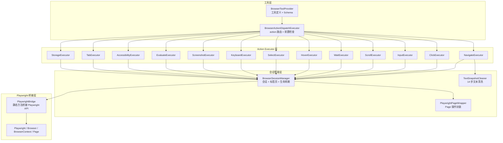

# 浏览器自动化 — 架构设计

> **文档性质**：架构设计文档
> **模块归属**：`com.lifepilot.meta.infra.browser`
> **最后更新**：2026-04

## 1. 模块概述

浏览器自动化模块为 Agent 提供基于 Playwright 的完整 Web 交互能力。通过单一 `browser` 工具暴露 14 种 action（navigate / click / input / scroll / wait / hover / select / keyboard / screenshot / evaluate / accessibility / tab / storage / close），支持三种浏览器获取模式（LAUNCH / CDP / PERSISTENT）、多会话多标签页管理、反检测指纹注入和空闲超时清理。

**核心设计决策**：
- **Playwright 可选依赖**：通过反射检测 Playwright classpath 可用性，缺失时所有工具优雅降级返回安装指引
- **单工具多 action**：14 种操作合并为 1 个 `browser` 工具，通过 `ActionDispatchExecutor` 路由，减少 LLM 工具选择负担
- **Object 类型桥接**：`BrowserSessionManager` 不直接引用 Playwright 类型，通过 `PlaywrightBridge` 静态方法桥接，确保 Playwright 缺失时不触发 ClassNotFoundException

## 2. 架构图



## 3. 浏览器获取模式

`BrowserAcquisitionMode` 枚举决定 Playwright 如何获取浏览器实例：

| 模式 | 启动方式 | BrowserContext 来源 | 登录态 | 适用场景 |
|------|---------|-------------------|--------|---------|
| **LAUNCH** | Playwright 自行启动 Chromium | 每会话独立上下文 | storageState 持久化 | 默认模式，全隔离 |
| **CDP** | 连接用户已运行的 Chrome（`--remote-debugging-port`） | 共享远程 Chrome 的默认上下文 | 复用用户登录态 | 需要利用已登录网站 |
| **PERSISTENT** | Playwright 启动带 userDataDir 的 Chromium | 共享持久上下文（绑定磁盘 profile） | Cookie/IndexedDB/SW 全持久化 | 长期保持登录态 |

### 模式初始化流程

```
createSessionPages(sessionId)
  ├─ LAUNCH     → ensureLaunchBrowser() → createContext(独立) → newPage
  ├─ CDP        → ensureCdpBrowserForSession(override) → 共享上下文 → newPage
  └─ PERSISTENT → ensurePersistentContextForSession(override) → 共享上下文 → newPage
```

**会话级模式覆盖**：LLM 可在首次调用时传入 `acquisitionMode` / `cdpUrl` / `userDataDir` 覆盖全局默认模式。覆盖参数通过 `registerSessionMode()` 注册，`createSessionPages()` 消费后立即删除。

## 4. 核心组件

### 4.1 BrowserSessionManager

| 职责 | 说明 |
|------|------|
| Playwright 检测 | 反射检测 API JAR + driver-bundle，缺一返回降级消息 |
| 懒初始化 | 首次 `getOrCreatePage()` 时创建 Playwright → Browser → Context → Page |
| 多会话管理 | `ConcurrentHashMap<sessionId, SessionPages>` |
| 多标签页 | `SessionPages` 内 `ConcurrentHashMap<tabId, PlaywrightPageWrapper>` + `activeTabId` |
| 空闲清理 | `cleanupIdleSessions()` 按 `idleTimeoutSeconds` 清理全部 page 超时的会话 |
| 资源关闭 | `close()` 按 Pages → Context → Browser → Playwright 顺序销毁（`synchronized`） |

**线程安全设计**：
- `ensureBrowser()` / `ensureCdpBrowserForSession()` / `ensurePersistentContextForSession()` / `close()` 均为 `synchronized`
- `playwrightInstance` / `browserInstance` / `sharedBrowserContext` 为 `volatile`
- `sessions` / `sessionModeOverrides` 为 `ConcurrentHashMap`
- stealth 注入通过 `AtomicBoolean` 保证只执行一次

### 4.2 PlaywrightBridge

Playwright API 隔离层。所有方法为 `static`，参数和返回值均为 `Object` 类型，避免 `BrowserSessionManager` 直接引用 Playwright 类。内部 cast 为强类型调用。

关键功能：
- `launchBrowser()` — 包含 STEALTH_ARGS（12 个反自动化检测启动参数）
- `injectStealthScripts()` — 注入 9 项运行时反检测脚本（webdriver / chrome / languages / permissions / connection / hardware / viewport / WebGL / iframe）
- `connectOverCDP()` — CDP 连接（`browser.close()` 仅断开连接，不杀 Chrome）
- `launchPersistentContext()` — 持久上下文启动

### 4.3 PlaywrightPageWrapper

Page 操作封装，职责：
- 封装 Playwright Page 方法为工具友好的接口（navigate / click / fill / screenshot / scroll / hover / selectOption / evaluate 等）
- `humanDelay()` — 操作前引入随机延迟模拟人工（virtual thread 安全）
- `touch()` — 更新 `lastAccessTime`，供空闲清理判断
- `navigateWithResult()` — 超时不抛异常，标记 `partial=true` 继续返回结果

### 4.4 BrowserActionDispatchExecutor

继承 `ActionDispatchExecutor`，职责：
- **构造时创建所有 14 个 sub-executor** 并注册到 action 路由表
- **`execute()` 统一前置检查**：Playwright 可用性 + `BrowserNotInstalledException` 捕获
- **会话模式覆盖**：分派前从输入提取 `acquisitionMode` 参数并注册

### 4.5 TextSnapshotCleaner

14 步正则管线清洗 navigate 返回的页面文本：

| 步骤 | 清洗内容 |
|------|---------|
| 1-4 | 移除 `<script>` / `<style>` / `<noscript>` / `<svg>` 标签及内容 |
| 5 | 移除 HTML 注释 |
| 6 | 移除 `window.__pinia` 等全局状态注入行 |
| 7 | 移除 CSS 资源 URL 行 |
| 8 | 移除超长 JSON 配置行（>200 字符） |
| 9-12 | 移除 Base64 data URI / data-* 属性 / 内联 style / aria-*/role 属性 |
| 13 | 压缩连续空行 |
| 14 | strip + 截断到 `textSnapshotMaxLength` |

## 5. Action 参考

### 页面导航与内容

| Action | 风险 | 必需参数 | 说明 |
|--------|------|---------|------|
| `navigate` | MEDIUM | `url` | 导航并返回 title + textSnapshot（经 TextSnapshotCleaner 清洗） |
| `screenshot` | LOW | — | 返回 Base64 PNG，`fullPage=true` 截取整页 |
| `accessibility` | LOW | — | 返回 YAML 格式无障碍树（Playwright ariaSnapshot） |

### 页面交互

| Action | 风险 | 必需参数 | 说明 |
|--------|------|---------|------|
| `click` | MEDIUM | `selector` | CSS 选择器点击 |
| `input` | MEDIUM | `selector`, `value` | 表单填充（`page.fill`） |
| `scroll` | MEDIUM | — | 方向滚动（`direction` + `pixels`）或元素定位滚动（`selector`） |
| `wait` | LOW | `selector` | 等待元素状态（visible / hidden / attached） |
| `hover` | MEDIUM | `selector` | 悬停，返回 tagName + textContent |
| `select` | MEDIUM | `selector` + (`value` 或 `label`) | 下拉选择 |
| `keyboard` | MEDIUM | `key` 或 `text` | 按键（`type=key`）或逐字符输入（`type=text`） |
| `evaluate` | HIGH | `expression` | 执行任意 JavaScript |

### 标签页与会话

| Action | 风险 | 必需参数 | 说明 |
|--------|------|---------|------|
| `tab` | MEDIUM | `tabAction` | open / switch / close / list |
| `storage` | MEDIUM | `target`, `storageAction` | cookie 或 localStorage 的 get / set / clear |
| `close` | LOW | — | 关闭当前会话所有标签页 |

## 6. 反检测（Stealth）

启用条件：`meta.infra.browser.stealth-mode=true`（默认开启）

### 启动参数（STEALTH_ARGS）

```
--disable-blink-features=AutomationControlled
--disable-background-networking
--disable-component-update
--disable-extensions
--disable-hang-monitor
--disable-popup-blocking
--metrics-recording-only
--password-store=basic
... (共 12 项)
```

### 运行时脚本注入

通过 `BrowserContext.addInitScript()` 在每个新页面加载前执行：

1. **navigator.webdriver** → undefined
2. **window.chrome** → 伪造运行时对象
3. **navigator.languages** → 从 locale 动态构建
4. **navigator.permissions.query** → 修正 notifications 行为
5. **navigator.connection** → 伪造 4g 网络信息
6. **hardwareConcurrency / deviceMemory** → 8 / 8
7. **outerWidth/outerHeight** → headless 下窗口尺寸修正
8. **WebGL renderer** → 隐藏 SwiftShader 特征
9. **iframe contentWindow** → MutationObserver 同步覆盖子框架

> **注意**：不 mock `navigator.plugins`，Chromium 已有真实值，mock 反而暴露自动化。

## 7. 配置参考

所有配置项在 `meta.infra.browser` 命名空间下：

| 配置项 | 类型 | 默认值 | 说明 |
|--------|------|--------|------|
| `enabled` | boolean | true | 是否启用浏览器工具 |
| `headless` | boolean | true | 无头模式 |
| `acquisition-mode` | enum | LAUNCH | 浏览器获取模式 |
| `cdp-url` | string | — | CDP 模式的远程调试端口 URL |
| `user-data-dir` | string | `${zhiwei.data-dir}/cache/browser/profile` | PERSISTENT 模式的用户数据目录 |
| `stealth-mode` | boolean | true | 启用反检测 |
| `idle-timeout-seconds` | int | 300 | 空闲会话超时（秒） |
| `tool-timeout-seconds` | int | 30 | navigate 导航超时（秒） |
| `wait-timeout-seconds` | int | 10 | wait action 默认超时（秒） |
| `js-execution-timeout-seconds` | int | 10 | evaluate JS 执行超时（秒） |
| `text-snapshot-max-length` | int | 30000 | 文本快照最大字符数 |
| `default-scroll-pixels` | int | 500 | scroll 默认像素数 |
| `accessibility-max-depth` | int | 10 | 无障碍树最大深度 |
| `human-delay-min-ms` | int | 50 | 人工延迟最小毫秒 |
| `human-delay-max-ms` | int | 200 | 人工延迟最大毫秒 |
| `user-agent` | string | — | 自定义 User-Agent |
| `viewport-width` | int | 1280 | 视口宽度 |
| `viewport-height` | int | 720 | 视口高度 |
| `locale` | string | zh-CN | 浏览器语言区域 |
| `timezone-id` | string | Asia/Shanghai | 时区 |
| `extra-launch-args` | list | [] | 额外 Chromium 启动参数 |
| `persist-storage-state` | boolean | false | LAUNCH 模式下关闭会话时保存 storageState |
| `storage-state-dir` | string | `${zhiwei.data-dir}/cache/browser/storage-state` | storageState 持久化目录 |

## 8. 生命周期

```
应用启动
  └─ InfraToolProvider.registerTools()
       └─ BrowserToolProvider.buildBrowserTools()
            └─ BrowserActionDispatchExecutor 构造（注册 14 个 action）
            └─ BuiltinTool 注册到 DynamicToolRegistry

首次调用 browser(action=navigate)
  └─ BrowserActionDispatchExecutor.execute()
       ├─ 可用性检查
       ├─ applySessionModeOverride()
       └─ super.execute() → NavigateExecutor
            └─ BrowserSessionManager.getOrCreatePage("default")
                 └─ 懒初始化 Playwright → Browser → Context → Page

后续调用复用已有会话和 Page

空闲清理（定时任务）
  └─ BrowserSessionManager.cleanupIdleSessions()
       └─ 关闭全部 page 超时的会话

应用关闭
  └─ BrowserSessionManager.close()
       └─ Pages → Context → Browser → Playwright 逐层销毁
```

## 9. 包内文件清单

| 文件 | 职责 |
|------|------|
| `BrowserToolProvider` | 工具定义、Schema、注册 |
| `BrowserActionDispatchExecutor` | action 路由、前置检查、executor 创建 |
| `BrowserSessionManager` | 会话/标签页/生命周期管理 |
| `BrowserAcquisitionMode` | 浏览器获取模式枚举 |
| `PlaywrightBridge` | Playwright API 静态桥接（类型隔离） |
| `PlaywrightPageWrapper` | Page 操作封装 + 人工延迟 + 访问时间跟踪 |
| `TextSnapshotCleaner` | 14 步正则清洗管线 |
| `BrowserNavigateToolExecutor` | navigate action |
| `BrowserClickToolExecutor` | click action |
| `BrowserInputToolExecutor` | input action |
| `BrowserScrollToolExecutor` | scroll action（方向 + 元素定位） |
| `BrowserWaitToolExecutor` | wait action |
| `BrowserHoverToolExecutor` | hover action |
| `BrowserSelectToolExecutor` | select action |
| `BrowserKeyboardToolExecutor` | keyboard action（按键 + 文本） |
| `BrowserScreenshotToolExecutor` | screenshot action（Base64） |
| `BrowserEvaluateToolExecutor` | evaluate action（JS 执行） |
| `BrowserAccessibilityToolExecutor` | accessibility action（ARIA 快照） |
| `BrowserTabToolExecutor` | tab action（open / switch / close / list） |
| `BrowserStorageToolExecutor` | storage action（cookie / localStorage CRUD） |
| `BrowserNotInstalledException` | 浏览器二进制未安装异常 |
| `ScrollResult` | 滚动位置 record |
| `TabInfo` | 标签页信息 record |
