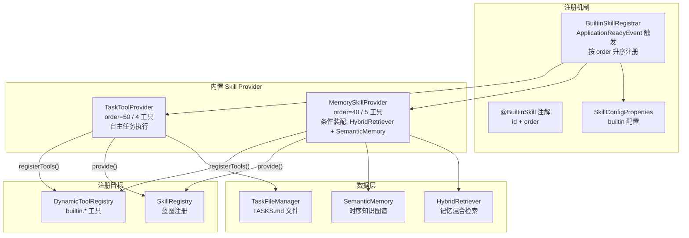

# 内置 Skill 插件 — 架构设计

> **文档性质**：架构设计文档
> **模块归属**：`com.lifepilot.skill.builtin`
> **最后更新**：2026-03

## 1. 模块概述

内置 Skill 插件是知微预装的核心能力单元。每个内置 Skill 通过 `BuiltinSkillProvider` 接口提供 Skill 定义蓝图和工具注册，由 `BuiltinSkillRegistrar` 在应用启动时按 order 顺序统一注册。

> **变更说明**：原有的 Todo、Schedule、Habit 三个内置 Skill 及 `ProactiveSkillProvider` 接口已废弃并删除，其功能由自主任务执行模块（`com.lifepilot.agent.task`）替代。

当前内置 Skill：
- **MemorySkillProvider**（order=40）：记忆管理，5 个工具
- **TaskToolProvider**（order=50）：自主任务执行，4 个工具（位于 `com.lifepilot.agent.task`）

## 2. 架构图

## 3. 核心组件

### 3.1 BuiltinSkillProvider 接口

定义内置 Skill 的两个职责：`provide()` 返回 `SkillDefinition` 蓝图（包含 instructions 和 suggestedTools），`registerTools()` 将具体的 `BuiltinTool` 注册到 `DynamicToolRegistry`。

### 3.2 @BuiltinSkill 注解

标注在 Provider 实现类上，声明 `id`（Skill 唯一标识）和 `order`（注册顺序，值越小越先注册）。

### 3.3 BuiltinSkillRegistrar

监听 `ApplicationReadyEvent`，使用 `@Order(HIGHEST_PRECEDENCE)` 确保在 SkillFileWatcher 之前执行。收集所有 `BuiltinSkillProvider` Bean，按 order 升序排列，注册前检查配置开关。Memory Skill 始终注册，不受配置开关控制。单个注册失败记录 ERROR 日志，不中断启动。

### 3.4 MemorySkillProvider（记忆管理，order=40）

注册 5 个工具：`builtin.memory.{search, create, tag, timeline, relate}`。条件装配（`@ConditionalOnBean`），依赖 `HybridRetriever` 和 `SemanticMemory`。

### 3.5 TaskToolProvider（自主任务执行，order=50）

注册 4 个工具：`builtin.task.{create, list, update, remove}`。基于 `TaskFileManager` 操作 `~/.zhiwei/TASKS.md` 文件，create 触发一次心跳扫描，update/remove 自动取消/重新注册定时器。

## 4. 设计决策

| 决策 | 选择 | 理由 |
|------|------|------|
| Provider 模式 | 蓝图与工具分离 | provide() 返回 Skill 定义，registerTools() 注册工具，职责清晰 |
| 注册顺序 | @BuiltinSkill(order) | 确保依赖记忆系统的 Skill 后注册 |
| Memory 条件装配 | @ConditionalOnBean | 记忆系统未就绪时 MemorySkillProvider 不注册 |
| Builtin 不可覆盖 | SkillRegistry 拒绝覆盖 Builtin 来源 | 防止用户或自生成 Skill 意外替换核心内置功能 |

## 5. 集成点

| 集成模块 | 方向 | 说明 |
|---------|------|------|
| Skill 系统 | Builtin → Skill | 通过 SkillRegistry 注册蓝图，通过 DynamicToolRegistry 注册工具 |
| 记忆系统 | Memory Skill → Memory | MemorySkillProvider 依赖 HybridRetriever 和 SemanticMemory |
| Agent 任务 | Task Skill → Agent | TaskToolProvider 依赖 TaskFileManager 和 HeartbeatScheduler |
| Prompt 管理 | Builtin → Prompt | 每个 Provider 通过 PromptRegistry 加载 Skill 指令模板 |

## 6. 配置参考

| 配置键 | 默认值 | 说明 |
|--------|--------|------|
| `lifepilot.skills.enabled` | `true` | Skill 系统总开关 |
| `lifepilot.agent.task.enabled` | `true` | 自主任务执行总开关 |
