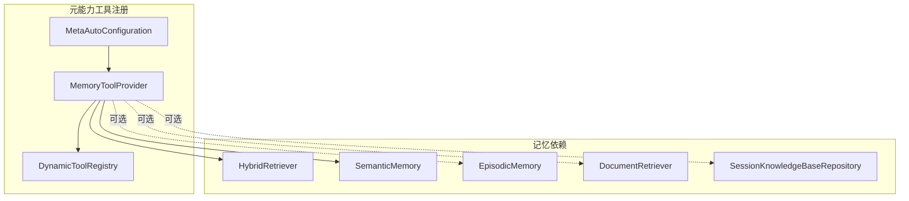

# 预置 Skill 与元能力工具 — 架构设计

> **文档性质**：架构设计文档
> **模块归属**：预置 Skill / 元能力工具
> **最后更新**：2026-04-15

> **说明**：本文只覆盖与记忆模块直接相关的预置能力，不展开其他 Skill 子系统实现。

> **注意**：`src/main/resources/skills/` 目录下共有 **25** 个预置 Skill 定义。完整 Skill ID 列表：`a2ui`、`api-debugger`、`browser-automation`、`code-assistant`、`content-creator`、`cron-scheduler`、`daily-manager`、`data-analyst`、`database-query`、`datastore`、`desktop-automation`、`doc-processor`、`feishu`、`file-organizer`、`find-skills`、`gitee`、`github-workflow`、`healthcheck`、`introspection`、`log-analyzer`、`research-assistant`、`summarizer`、`teaching-assistant`、`web-novel-writer`、`workflow-creator`。本文仅覆盖 Memory Skill 相关能力。

## 1. 模块概述

当前记忆相关的预置能力分成两层：

- **预置 Skill 定义**：Memory Skill 目前无独立 `SKILL.md` 资源文件（`src/main/resources/skills/memory/` 不存在），记忆能力直接由底层工具提供
- **底层记忆工具注册**：`com.lifepilot.meta.infra.memory.MemoryToolProvider`

记忆能力完全由 `MemoryToolProvider` 直接注册到 `DynamicToolRegistry`，无需 Skill 系统的中间层。

## 2. 架构图

## 3. 核心组件

### 3.1 Memory Skill 工具清单

- 记忆能力由 `MemoryToolProvider` 直接注册工具，不依赖 `memory/SKILL.md` 资源文件
- 当前注册的关键工具包括：
  - `memory.search`
  - `memory.recall`
  - `knowledge.search`
  - `memory.create`
  - `memory.update`
  - `memory.delete`
  - `memory.tag`
  - `memory.query-at-time`
  - `memory.search-experience`

### 3.2 MemoryToolProvider

- 位于 `com.lifepilot.meta.infra.memory`
- 当前负责注册 9 个记忆工具
- 工具职责分层如下：
  - `search`：搜索 L3/L4 实体
  - `recall`：跨 session 回忆对话片段
  - `knowledge.search`：搜索资料文档
  - `create / update / delete / tag`：管理语义记忆实体和关系
  - `query-at-time`：查询指定时间点有效的实体
  - `search-experience`：搜索历史执行经验

### 3.3 MetaAutoConfiguration

- 在 `HybridRetriever` 和 `SemanticMemory` 可用时注册 `MemoryToolProvider`
- `EpisodicMemory`、`DocumentRetriever`、`SessionKnowledgeBaseRepository` 为可选依赖
- 应用启动完成后，把记忆工具注册到 `DynamicToolRegistry`

## 4. 设计决策

| 决策 | 选择 | 理由 |
|------|------|------|
| 记忆工具直接注册 | 由 `MemoryToolProvider` 直接注册到 `DynamicToolRegistry` | 记忆是基础能力，不需要 Skill 系统的渐进式发现流程 |
| recall 返回形式 | snippet 而不是单条 message | 更适合模型直接使用 |
| 资料检索入口 | `knowledge.search` 单独拆出 | 区分会话回忆、知识实体检索和资料文档检索 |
| 工具注册位置 | Meta 模块统一注册 | 便于与其他内置元能力工具共用启动流程 |

## 5. 集成点

| 集成模块 | 方向 | 说明 |
|---------|------|------|
| 元能力模块 | Meta → Tool | `MemoryToolProvider` 注册记忆与资料检索工具到 `DynamicToolRegistry` |
| 记忆系统 | Tool → Memory | 工具调用 `HybridRetriever`、`SemanticMemory`、`EpisodicMemory` |
| 知识库 | Tool → Knowledge | `knowledge.search` 走知识库检索链路 |
