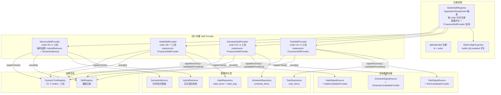
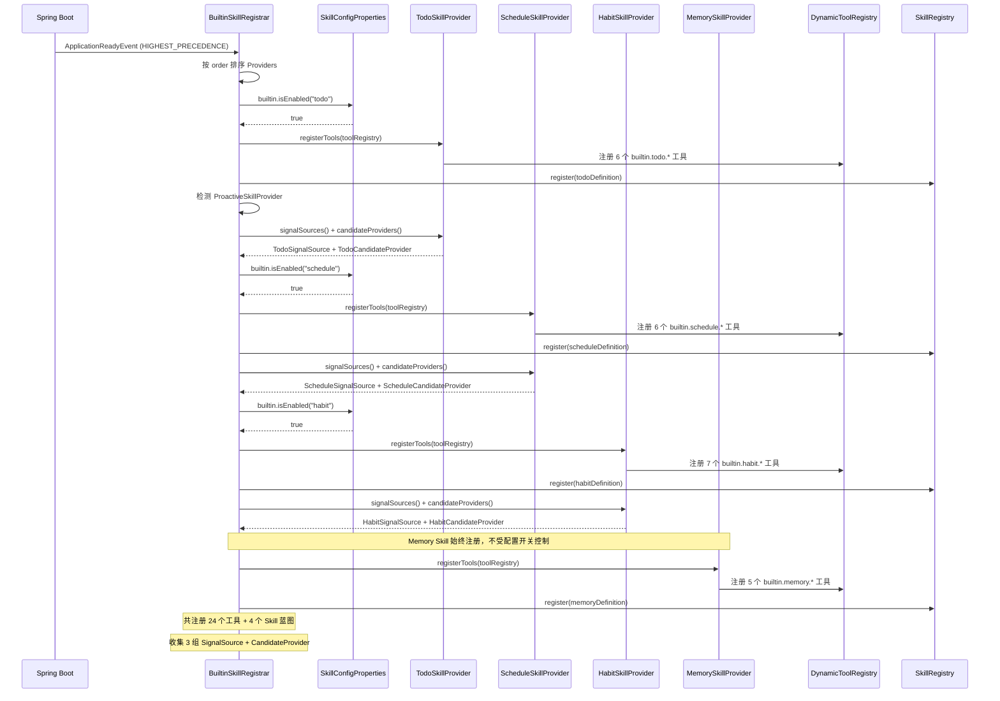
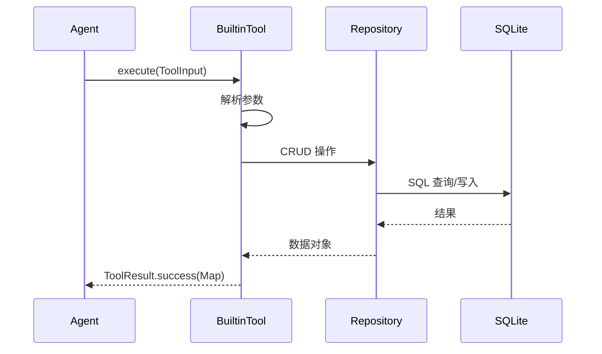

# 内置 Skill 插件 — 架构设计

> **文档性质**：架构设计文档
> **模块归属**：`com.lifepilot.skill.builtin`
> **最后更新**：2026-03

## 1. 模块概述

内置 Skill 插件是知微预装的四个核心能力单元，覆盖个人生产力的核心场景：待办管理（Todo）、日程管理（Schedule）、习惯养成（Habit）和记忆管理（Memory）。每个内置 Skill 通过 `BuiltinSkillProvider` 接口提供 Skill 定义蓝图和工具注册，由 `BuiltinSkillRegistrar` 在应用启动时按 order 顺序统一注册。

其中 Todo、Schedule、Habit 三个 Provider 额外实现 `ProactiveSkillProvider` 接口，自动向主动推理引擎贡献信号源（`SignalSource`）和候选提供者（`CandidateProvider`）。每个内置 Skill 支持独立的启用/禁用配置开关（`lifepilot.skills.builtin.{skill-id}.enabled`），禁用时跳过该 Skill 的全部注册。

## 2. 架构图

## 3. 核心组件

### 3.1 BuiltinSkillProvider 接口与 ProactiveSkillProvider 扩展

`BuiltinSkillProvider` 定义内置 Skill 的两个职责：`provide()` 返回 `SkillDefinition` 蓝图（包含 instructions 和 suggestedTools），`registerTools()` 将具体的 `BuiltinTool` 注册到 `DynamicToolRegistry`。

`ProactiveSkillProvider` 扩展 `BuiltinSkillProvider`，额外定义 `signalSources()` 和 `candidateProviders()` 方法，使内置 Skill 能够向主动推理引擎贡献信号源和候选提供者。Todo、Schedule、Habit 三个 Provider 实现此接口，各自包含内部类实现 `SignalSource` 和 `CandidateProvider`。

### 3.2 @BuiltinSkill 注解

标注在 Provider 实现类上，声明 `id`（Skill 唯一标识）和 `order`（注册顺序，值越小越先注册）。`BuiltinSkillRegistrar` 通过反射读取此注解排序。

### 3.3 BuiltinSkillRegistrar

监听 `ApplicationReadyEvent`，使用 `@Order(HIGHEST_PRECEDENCE)` 确保在 SkillFileWatcher 之前执行。收集所有 `BuiltinSkillProvider` Bean，按 order 升序排列。注入 `SkillConfigProperties`，注册前检查 `builtin.isEnabled(skillId)` 配置开关，禁用时跳过该 Skill 的全部注册（Memory Skill 始终注册，不受配置开关控制）。

若 Provider 实现了 `ProactiveSkillProvider` 接口，额外收集其 `signalSources()` 和 `candidateProviders()` 到内部列表，暴露 `getRegisteredSignalSources()` 和 `getRegisteredCandidateProviders()` 方法供 `ProactiveAutoConfiguration` 使用。单个注册失败记录 ERROR 日志，不中断启动。

### 3.4 TodoSkillProvider（待办管理，order=10，implements ProactiveSkillProvider）

注册 6 个工具：`builtin.todo.{create, list, get, update, delete, complete}`。数据模型 `TodoItem` 包含 `Priority`（HIGH/MEDIUM/LOW）和 `Status`（PENDING/IN_PROGRESS/COMPLETED）枚举，支持状态转换校验（`canTransitionTo`）。`delete` 风险等级为 MEDIUM，其余为 LOW。

通过 `signalSources()` 提供 `TodoSignalSource`（采集临近截止的待办信号），通过 `candidateProviders()` 提供 `TodoCandidateProvider`（评估 `deadline_reminder` 候选）。

### 3.5 ScheduleSkillProvider（日程管理，order=20，implements ProactiveSkillProvider）

注册 6 个工具：`builtin.schedule.{create, list, get, update, delete, conflicts}`。`conflicts` 工具是差异化能力，查找与指定时间段存在时间重叠的日程，Agent 可在创建新日程前主动检测冲突。数据模型 `ScheduleItem` 包含 `startTime`、`endTime`、`location`、`notes`。

通过 `signalSources()` 提供 `ScheduleSignalSource`（采集即将开始的日程信号），通过 `candidateProviders()` 提供 `ScheduleCandidateProvider`（评估 `schedule_reminder` 候选）。

### 3.6 HabitSkillProvider（习惯养成，order=30，implements ProactiveSkillProvider）

注册 7 个工具：`builtin.habit.{create, list, get, update, checkin, streak, completion-rate}`。`checkin` 记录打卡并自动更新连续天数，`streak` 查询当前连续打卡天数，`completion-rate` 计算指定时间范围内的完成率。数据模型 `HabitItem` 包含 `Frequency`（DAILY/WEEKLY）枚举和 `currentStreak` 字段。打卡记录存储在独立的 `habit_logs` 表。

通过 `signalSources()` 提供 `HabitSignalSource`（采集未打卡习惯和连续打卡风险信号），通过 `candidateProviders()` 提供 `HabitCandidateProvider`（评估 `habit_reminder` 和 `streak_at_risk` 候选）。

### 3.7 MemorySkillProvider（记忆管理，order=40）

注册 5 个工具：`builtin.memory.{search, create, tag, timeline, relate}`。条件装配（`@ConditionalOnBean`），依赖 `HybridRetriever` 和 `SemanticMemory`。`search` 调用混合检索（向量+FTS5+图遍历），`create` 创建时序知识图谱实体（支持 11 种 EntityType），`tag` 建立实体间关系，`timeline` 查询指定时间点的记忆快照，`relate` 多跳图遍历查找关联实体。

## 4. 核心流程

### 4.1 内置 Skill 启动注册流程

### 4.2 内置 Skill 工具调用流程

## 5. 设计决策

| 决策 | 选择 | 理由 |
|------|------|------|
| Provider 模式 | 蓝图与工具分离 | provide() 返回 Skill 定义，registerTools() 注册工具，职责清晰 |
| Repository 直连 | 工具直接调用 Repository | 内置 Skill 工具执行是确定性的，不需要 LLM 参与，LLM 只决定调用哪个工具 |
| 注册顺序 | @BuiltinSkill(order) | 确保基础 Skill（Todo）先注册，依赖记忆系统的 Skill（Memory）后注册 |
| Memory 条件装配 | @ConditionalOnBean | 记忆系统未就绪时 MemorySkillProvider 不注册，不影响其他 Skill |
| delete 风险等级 | MEDIUM | 数据删除不可逆，需审计日志记录；其他操作为 LOW |
| Builtin 不可覆盖 | SkillRegistry 拒绝覆盖 Builtin 来源 | 防止用户或自生成 Skill 意外替换核心内置功能 |

## 6. 集成点

| 集成模块 | 方向 | 说明 |
|---------|------|------|
| Skill 系统 (`com.lifepilot.skill`) | Builtin → Skill | 通过 SkillRegistry 注册蓝图，通过 DynamicToolRegistry 注册工具 |
| 工具系统 (`com.lifepilot.tool`) | Builtin → Tool | 24 个 BuiltinTool 注册到 DynamicToolRegistry |
| 记忆系统 (`com.lifepilot.memory`) | Memory Skill → Memory | MemorySkillProvider 依赖 HybridRetriever 和 SemanticMemory |
| Prompt 管理 (`com.lifepilot.prompt`) | Builtin → Prompt | 每个 Provider 通过 PromptRegistry 加载 Skill 指令模板 |
| 可观测性 (`com.lifepilot.observability`) | Builtin → Observability | 工具使用 RiskLevel 枚举声明风险等级 |
| 主动推理 (`com.lifepilot.agent.proactive`) | Builtin → Proactive | Todo/Schedule/Habit 通过 ProactiveSkillProvider 贡献 SignalSource 和 CandidateProvider，由 BuiltinSkillRegistrar 收集后供 ProactiveAutoConfiguration 注入主动推理管线 |

## 7. 配置参考

| 配置键 | 默认值 | 说明 |
|--------|--------|------|
| `lifepilot.skills.enabled` | `true` | Skill 系统总开关，控制所有内置 Skill 的注册 |
| `lifepilot.skills.builtin.todo.enabled` | `true` | Todo Skill 启用开关 |
| `lifepilot.skills.builtin.schedule.enabled` | `true` | Schedule Skill 启用开关 |
| `lifepilot.skills.builtin.habit.enabled` | `true` | Habit Skill 启用开关 |

MemorySkillProvider 始终注册（不受 `builtin.{id}.enabled` 控制），但依赖记忆系统 Bean 的可用性（`@ConditionalOnBean`）。禁用某个 Skill 时，其工具注册、蓝图注册和 ProactiveSkillProvider 贡献均被跳过。
