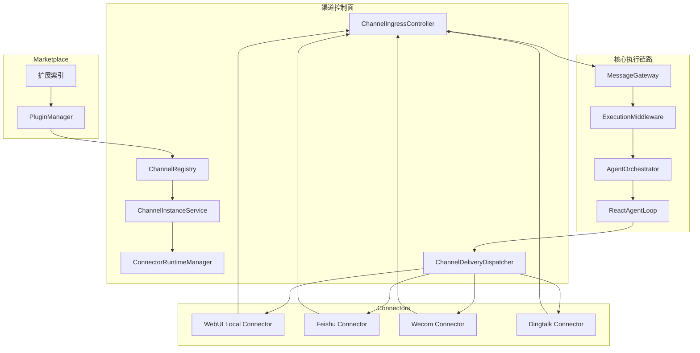

# 渠道插件化重构架构设计

> **文档性质**：架构设计文档  
> **模块归属**：`com.lifepilot.interaction` + `com.lifepilot.marketplace` + `zhiwei-web`  
> **最后更新**：2026-03-29  
> **状态**：执行基线文档

---

## 1. 文档目的

本文档作为知微渠道插件化重构的唯一执行基线，目标是避免实现过程中方向漂移。

后续涉及渠道体系的设计与编码，默认遵守以下规则：

- 如果实现与本文档冲突，以本文档为准
- 如果需要修改方向，应先修改本文档，再进入代码实现
- 不再围绕现有渠道实现做兼容性保留设计
- 不再新增任何“按渠道硬编码”的入口、配置结构和前端页面

---

## 2. 背景与问题

当前知微的渠道能力具备基础抽象，但整体仍属于“内置适配器模式”，不是插件架构。

现状问题：

- 渠道入口按平台硬编码在 [WebhookController.java](/D:/WorkSpace/Project/News/src/main/java/com/lifepilot/interaction/channel/webhook/WebhookController.java)
- 渠道配置按平台手写合并逻辑，集中在 [ChannelConfigProvider.java](/D:/WorkSpace/Project/News/src/main/java/com/lifepilot/interaction/config/ChannelConfigProvider.java)
- 渠道 Bean 注册按平台硬编码，集中在 [ChannelAdapterAutoConfiguration.java](/D:/WorkSpace/Project/News/src/main/java/com/lifepilot/interaction/config/ChannelAdapterAutoConfiguration.java)
- 渠道前端设置页为固定表单，集中在 [SettingsChannelsView.vue](/D:/WorkSpace/Project/News/zhiwei-web/src/views/SettingsChannelsView.vue)
- `ChannelType` 枚举承担了平台识别、入口分发、权限判断、checkpoint 键等多重职责，已经成为扩展阻力

这导致新增一个渠道时，主服务通常需要同时修改：

- Controller
- 配置结构
- 自动装配
- Web UI 设置页
- 运行时启用判断
- 通知、权限、checkpoint 等外围逻辑

这种模式会让渠道越多，主服务越重。

---

## 3. 重构目标

本次重构的目标不是“整理现有渠道代码”，而是把渠道能力升级为产品级插件体系。

### 3.1 核心目标

- 新增渠道时，不修改主服务核心业务链路
- 渠道通过插件安装，而不是通过主服务内置发版提供
- 一个渠道插件可以创建多个连接实例
- 配置表单、接入说明、健康检查能力由插件 schema 驱动
- 主服务只负责统一消息网关、实例管理和运维控制面
- 平台协议差异下沉到 connector，不污染核心执行链路
- 官方插件优先由主服务自动托管 connector，手填 `baseUrl` 退到高级覆盖路径

### 3.2 非目标

- 不保留旧渠道模型的兼容路径
- 不维持旧版 `/api/webhook/{platform}` 结构
- 不允许第三方代码直接以热装方式进入主 JVM 作为默认模式
- 不追求第一版覆盖所有消息平台

---

## 4. 核心设计决策

### 4.1 主执行链路不重写，只改渠道接入契约

`ExecutionMiddleware -> ExecutionRequestFactory -> AgentOrchestrator -> ReactAgentLoop` 这段链路本质上已经是通道无关的。

因此本次重构不重写以下核心：

- `AgentOrchestrator`
- `ReactAgentLoop`
- 工具执行主循环
- LLM 路由与调用
- 主体 transcript / trace / suspend 逻辑

只改它前后的渠道建模与出入站契约。

### 4.2 废弃 `ChannelType` 作为中心模型

当前 `ChannelType` 既代表平台类型，又参与响应分发、权限、checkpoint、上下文展示。这种枚举化模型不适合插件化。

重构后：

- 不再以 `ChannelType` 作为核心域模型
- 平台改为插件描述中的字符串标识 `platform`
- 实际运行单元改为 `channelInstanceId`
- 需要识别来源时，统一使用 `InteractionSource`

### 4.3 平台与实例分离

必须严格区分：

- `ChannelPlugin`：平台能力包，例如飞书、企微、钉钉、Telegram
- `ChannelInstance`：一个真实连接，例如“公司飞书生产机器人”

一个插件允许创建多个实例。

### 4.4 协议实现下沉到 connector

渠道协议适配不再放在主服务内。

主服务只保留：

- 插件安装
- 实例管理
- 消息网关
- 统一配置与运维控制面

connector 负责：

- 长连接或 webhook 接入
- 签名验证
- 解密
- 事件解析
- 平台消息发送
- 平台级健康检查

对于官方插件，主服务额外提供 `ConnectorManager`：

- 优先从已安装插件目录发现官方 connector 运行产物
- 开发态可回退到本地 connector 工作区
- 自动分配本地端口
- 自动拉起和复用 connector 进程
- 自动注入主服务 runtime 回调地址
- 当用户显式填写 `baseUrl` 时，退回手动 connector 模式

### 4.5 Web UI 也是渠道，但属于内建本地渠道

Web UI 不再以 `WebChannelAdapter` 的特例形式存在，而是作为一个内建 `ChannelPlugin`：

- `pluginId = webui`
- `platform = web`
- `instanceId = web.default`
- `connectorMode = local`

Web UI 保留现有产品能力，但接入方式改为统一渠道模型。

### 4.6 `workflow / cron / heartbeat` 不属于渠道插件

这些不是用户通信渠道，而是系统触发源。

因此重构后要把“渠道”和“系统触发源”分开建模：

- `SourceKind.CHANNEL`
- `SourceKind.WORKFLOW`
- `SourceKind.CRON`
- `SourceKind.HEARTBEAT`

不能继续用单一 `channel` 字符串同时表达两类概念。

---

## 5. 术语定义

### 5.1 ChannelPlugin

渠道插件，表示一个平台能力包。

示例：

- `feishu`
- `wecom`
- `dingtalk`
- `telegram`
- `slack`
- `webui`

### 5.2 ChannelInstance

渠道实例，表示一个插件在用户环境中的具体连接。

示例：

- `feishu.prod.bot`
- `wecom.sales.assistant`
- `web.default`

### 5.3 Connector

渠道连接器，负责平台协议适配。

分为两类：

- `local`：主进程内建连接器，仅用于 `webui`
- `external`：外部进程或容器连接器，默认用于所有外部平台

### 5.4 InteractionSource

统一表示一次交互请求来自哪里。

字段建议：

- `sourceKind`
- `sourceId`
- `channelPlatform`
- `channelInstanceId`

### 5.5 DeliveryMode

统一表示本次响应的返回方式。

枚举建议：

- `SYNC`
- `SSE_STREAM`
- `ASYNC_PUSH`

---

## 6. 总体架构



---

## 7. 模块边界

### 7.1 主服务保留

- `PluginManager`
- `ChannelRegistry`
- `ChannelInstanceService`
- `ConnectorRuntimeManager`
- `ChannelIngressController`
- `ChannelDeliveryDispatcher`
- `MessageGateway`
- `ExecutionMiddleware`
- `AgentOrchestrator`

### 7.2 主服务删除或重构掉

- 固定平台 webhook controller
- 固定平台 properties record
- 固定平台 config provider
- 固定平台 settings 页面
- 固定平台自动装配逻辑
- 任何基于 `switch(channelType)` 的平台分支

明确要求：

- [WebhookController.java](/D:/WorkSpace/Project/News/src/main/java/com/lifepilot/interaction/channel/webhook/WebhookController.java) 这一类入口应删除
- [ChannelConfigProvider.java](/D:/WorkSpace/Project/News/src/main/java/com/lifepilot/interaction/config/ChannelConfigProvider.java) 这一类按平台 getter 应删除
- [ChannelAdapterAutoConfiguration.java](/D:/WorkSpace/Project/News/src/main/java/com/lifepilot/interaction/config/ChannelAdapterAutoConfiguration.java) 这一类固定渠道 Bean 装配应删除
- [SettingsChannelsView.vue](/D:/WorkSpace/Project/News/zhiwei-web/src/views/SettingsChannelsView.vue) 这一类固定渠道页面应删除

---

## 8. 新的核心数据模型

### 8.1 ChannelPluginDescriptor

用于描述插件定义。

字段建议：

- `pluginId`
- `name`
- `version`
- `vendor`
- `platform`
- `connectorMode`
- `connectorSpec`
- `capabilities`
- `configSchema`
- `secretFields`
- `setupGuide`
- `defaultRoutingPolicy`

### 8.2 ChannelInstance

用于描述一个运行中的连接实例。

字段建议：

- `instanceId`
- `pluginId`
- `platform`
- `displayName`
- `enabled`
- `status`
- `configJson`
- `secretConfigJson`
- `routingPolicyJson`
- `lastHeartbeatAt`
- `lastError`
- `createdAt`
- `updatedAt`

### 8.3 InteractionSource

替换当前 `AgentRequest.channel` 的单字符串模型。

字段建议：

- `sourceKind`
- `sourceId`
- `channelPlatform`
- `channelInstanceId`

### 8.4 IngressMessage

connector 向主服务上报的统一入站消息。

字段建议：

- `instanceId`
- `eventId`
- `messageId`
- `userId`
- `sessionId`
- `content`
- `attachments`
- `metadata`
- `deliveryHints`
- `occurredAt`

### 8.5 DeliveryRequest

主服务向 connector 下发的统一出站请求。

字段建议：

- `instanceId`
- `responseId`
- `target`
- `content`
- `metadata`
- `deliveryMode`

---

## 9. `AgentRequest` 与主执行链路改造要求

### 9.1 改造原则

主链路不重写，但 `AgentRequest` 必须升级语义。

当前问题：

- `AgentRequest.channel` 同时承担平台识别和来源标识
- `workflow / cron / heartbeat` 与 `web / feishu` 混在一起

### 9.2 建议结构

建议将 `AgentRequest` 中的来源信息改为：

- `sourceKind`
- `sourceId`
- `channelPlatform`
- `channelInstanceId`

如果保留 `channel` 字段，也只能作为派生显示字段，不能再作为核心识别键。

### 9.3 对下游影响

以下子系统应改为面向 `InteractionSource` 解释来源：

- 权限系统
- checkpoint
- suspend / resume
- 上下文提示词
- transcript 归类

其中：

- `ContextAssembler` 不应再通过字符串前缀判断是否为 `cron` 或 `heartbeat`
- `PermissionEvaluator` 不应再把所有来源都视为“渠道”
- `SqliteAgentCheckpointStore` 的键应使用稳定的 `sourceId` 或 `channelInstanceId`

---

## 10. Web UI 渠道设计

### 10.1 总体原则

Web UI 是内建本地渠道，不是特例适配器。

保留以下产品能力：

- REST 会话管理
- SSE 流式输出
- A2UI signal 回传
- 附件上传
- 音频转写
- Turn 管理

但改变它接入核心的方式。

### 10.2 新的 Web UI 接入层

当前：

- `ChatController -> WebChannelAdapter -> MessageGateway`

重构后：

- `ChatController -> BrowserIngressService -> ChannelIngressService -> MessageGateway`

其中：

- `ChatController` 只负责 HTTP/SSE 协议
- `BrowserIngressService` 负责把浏览器请求组装成统一 `IngressMessage`
- `ChannelIngressService` 负责实例解析、来源建模、消息入网关

### 10.3 Web UI 的运行身份

Web UI 在系统中作为固定实例存在：

- `pluginId = webui`
- `platform = web`
- `instanceId = web.default`
- `sourceKind = CHANNEL`
- `channelPlatform = web`

### 10.4 流式返回改造要求

当前流式判断耦合在 `ChannelMetadata.WebMetadata.acceptsSse()`。

重构后要求：

- SSE 是 `DeliveryMode`
- 不再通过 `WebMetadata` 决定是否流式
- `ExecutionMiddleware` 应改为读取统一 delivery hint

### 10.5 `WebChannelAdapter` 的命运

`WebChannelAdapter` 不应继续作为长期核心抽象存在。

其能力拆分如下：

- turn 准备：保留，迁移到 `BrowserIngressService`
- 附件装载：保留，迁移到 `BrowserIngressService`
- 音频转写：保留，迁移到 `BrowserIngressService`
- SSE 相关：保留，迁移到 `ChatController + DeliveryMode`
- `ChannelAdapter` 适配器角色：删除

---

## 11. 插件包格式

新增插件描述文件：`channel-plugin.json`

示例：

```json
{
  "kind": "CHANNEL",
  "id": "feishu",
  "name": "飞书",
  "version": "1.0.0",
  "vendor": "zhiwei-official",
  "platform": "feishu",
  "connectorMode": "external",
  "connectorSpec": {
    "protocol": "http",
    "image": "ghcr.io/zhiwei/connectors/feishu:1.0.0"
  },
  "capabilities": [
    "receive",
    "send",
    "thread-reply",
    "card-update"
  ],
  "configSchema": {
    "type": "object",
    "properties": {
      "appId": {
        "type": "string",
        "title": "App ID"
      },
      "appSecret": {
        "type": "string",
        "title": "App Secret",
        "secret": true
      },
      "connectionMode": {
        "type": "string",
        "enum": ["websocket", "webhook"],
        "default": "websocket"
      }
    },
    "required": ["appId", "appSecret"]
  },
  "secretFields": ["appSecret"],
  "resources": {
    "readmePath": "docs/README.md",
    "iconPath": "assets/icon.svg",
    "examplePaths": ["examples/websocket.json"],
    "assetPaths": ["assets/schema.json"]
  },
  "setupGuide": {
    "title": "飞书接入说明",
    "steps": [
      "创建飞书应用",
      "开启消息事件订阅",
      "填写 App ID 和 App Secret",
      "选择 websocket 或 webhook 模式"
    ]
  }
}
```

说明：

- `resources` 中只能声明插件目录内的相对路径
- Marketplace 安装后会把这些资源下载到插件根目录下
- 控制面通过安装快照读取 `entryPath / installRootPath / assets`

---

## 12. Connector 标准协议

### 12.1 总体原则

默认采用 HTTP 协议，避免第一版引入额外复杂度。

### 12.2 主服务 -> connector

#### `POST /instances/{instanceId}/start`

用于启动实例连接。

#### `POST /instances/{instanceId}/stop`

用于停止实例连接。

#### `POST /instances/{instanceId}/reload`

用于热更新配置。

#### `GET /instances/{instanceId}/health`

用于检查实例状态。

#### `POST /instances/{instanceId}/deliver`

用于发送出站消息。

### 12.3 connector -> 主服务

#### `POST /api/channel-runtime/instances/{instanceId}/events`

connector 将统一入站事件投递给主服务。

事件示例：

```json
{
  "eventId": "evt_123",
  "messageId": "msg_456",
  "userId": "user_1",
  "sessionId": "chat_1",
  "content": {
    "type": "text",
    "text": "你好"
  },
  "attachments": [],
  "metadata": {
    "platform": "feishu",
    "chatId": "oc_xxx"
  },
  "deliveryHints": {
    "deliveryMode": "ASYNC_PUSH"
  },
  "occurredAt": "2026-03-29T10:00:00Z"
}
```

### 12.4 Web UI 特例

Web UI 不走外部 HTTP connector，而是由本地 `BrowserIngressService` 直接组装同等结构的 `IngressMessage`。

它只是 transport 特殊，不是领域模型特殊。

---

## 13. Marketplace 重构要求

现有 marketplace 已有安装骨架，应直接扩展。

### 13.1 扩展点

- `ExtensionType` 新增 `CHANNEL`
- 新增 `ChannelInstallStrategy`
- 安装结果页支持展示 `configSchema` 和接入说明

### 13.2 安装行为

安装插件只做这些事情：

- 下载插件描述和资源
- 安全扫描
- 注册 `ChannelPluginDescriptor`
- 允许用户创建实例

安装插件本身不等于创建实例。

### 13.3 卸载行为

卸载插件前要求：

- 该插件下无存活实例
- 或者显式允许级联删除实例

---

## 14. 前端产品重构要求

### 14.1 页面结构

删除单一“渠道设置页”，改为三类页面：

#### 渠道市场

- 浏览可安装插件
- 安装 / 升级 / 卸载
- 查看能力与风险说明

#### 渠道实例列表

- 展示已创建实例
- 查看状态、最近心跳、最后错误
- 启用 / 停用 / 删除

#### 渠道实例详情页

由插件 schema 驱动生成：

- 配置表单
- 密钥录入
- 接入文档
- webhook 地址
- 测试连接
- 健康检查
- 日志查看

### 14.2 前端禁止事项

- 不再新增固定飞书/企微/钉钉专用表单页面
- 不再在前端硬编码渠道字段集合
- 不再维护平台级常量数组作为长期模型

---

## 15. 安全模型

### 15.1 默认原则

- 外部平台 connector 默认运行在主服务外
- 主服务不默认加载第三方运行时代码
- connector 与主服务通信必须带实例级鉴权

### 15.2 密钥管理

敏感字段与普通配置分离存储：

- 普通配置：`channel_instances.config_json`
- 敏感字段：`channel_instance_secrets.secret_json`

前端获取配置时必须脱敏。

### 15.3 实例鉴权

connector 调用主服务上报事件时，应携带实例级 token。

主服务调用 connector 发送消息时，也应使用实例级或运行时 token。

---

## 16. 数据库建议

### 16.1 `channel_plugins`

记录已安装插件：

- `plugin_id`
- `name`
- `version`
- `platform`
- `descriptor_json`
- `installed_at`
- `updated_at`

### 16.2 `channel_instances`

记录实例基本信息：

- `instance_id`
- `plugin_id`
- `platform`
- `display_name`
- `enabled`
- `status`
- `config_json`
- `routing_policy_json`
- `last_heartbeat_at`
- `last_error`
- `created_at`
- `updated_at`

### 16.3 `channel_instance_secrets`

记录实例密钥：

- `instance_id`
- `secret_json`
- `updated_at`

### 16.4 `channel_instance_events`

记录运行事件：

- `id`
- `instance_id`
- `event_type`
- `message`
- `payload_json`
- `created_at`

---

## 17. 必须删除的旧模型

以下设计不允许继续存在于新架构中：

- `ChannelType` 中心枚举模型
- `ChannelMetadata` 按平台 sealed interface
- 固定 `/api/webhook/{platform}` 路由
- `GatewayProperties.channels.{platform}` 固定配置结构
- 后端 `getFeishuConfig()` / `getWecomConfig()` 这类 getter
- 前端固定飞书/企微/钉钉设置表单

如果实现过程中仍在新增上述结构，视为偏离方案。

---

## 18. 实施顺序

本重构不做兼容，按以下顺序直接推进。

### 阶段 1：领域模型重建

- 引入 `ChannelPluginDescriptor`
- 引入 `ChannelInstance`
- 引入 `InteractionSource`
- 引入 `DeliveryMode`
- 重构 `AgentRequest` 来源字段

### 阶段 2：控制面重建

- 实现 `ChannelRegistry`
- 实现 `ChannelInstanceService`
- 实现 `ConnectorRuntimeManager`
- 实现统一 ingress / delivery

### 阶段 3：Web UI 渠道重构

- 删除 `WebChannelAdapter`
- 改造 `ChatController`
- 落地 `web.default` 内建实例
- 将 SSE 流式切换到统一 `DeliveryMode`

### 阶段 4：官方插件落地

- 飞书插件
- 企微插件
- 钉钉插件

### 阶段 5：Marketplace 打通

- 新增 `CHANNEL` 类型
- 支持安装、升级、卸载渠道插件
- 前端接入渠道市场

---

## 19. 验收标准

满足以下条件，视为方案落地完成：

- 新增一个渠道时，无需修改主服务核心业务链路
- 新增一个渠道时，无需新增固定 controller、固定 properties、固定 settings 页面
- 渠道插件安装后，可通过统一 UI 创建实例
- Web UI 作为内建本地渠道运行在统一模型内
- `AgentOrchestrator` 无需感知具体平台协议
- 权限、checkpoint、上下文不再依赖 `ChannelType` 枚举
- 外部平台通过 connector 接入主服务，不再以内置平台类耦合核心

---

## 20. 执行护栏

后续实现时，必须持续检查以下红线：

- 是否又写回了平台硬编码 controller
- 是否又把平台字段塞回了全局配置
- 是否又在前端写死了一套平台表单
- 是否把 connector 逻辑写回了主服务
- 是否继续把 `workflow / cron / heartbeat` 当成普通渠道
- 是否继续让 `AgentRequest.channel` 承担多重职责

如果出现以上任一情况，说明实现已经偏离本文档，应先停下修正文档或设计，再继续编码。
