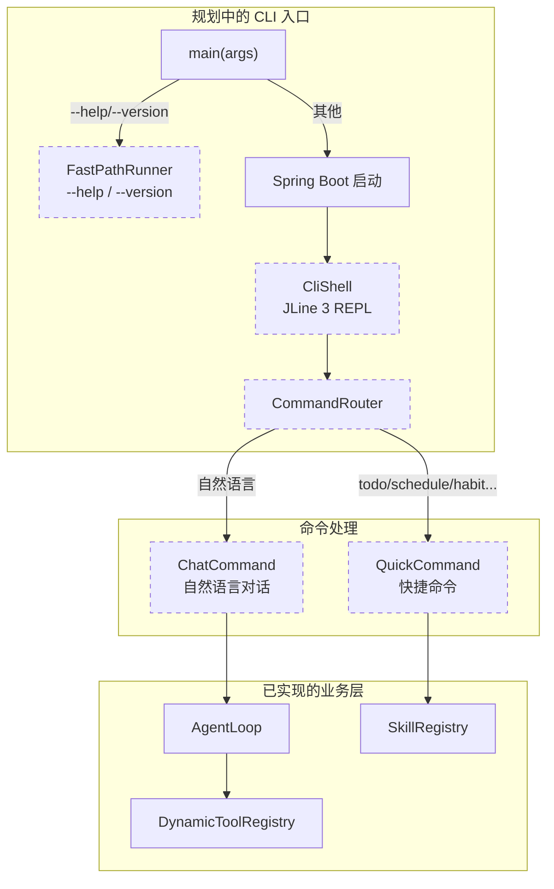
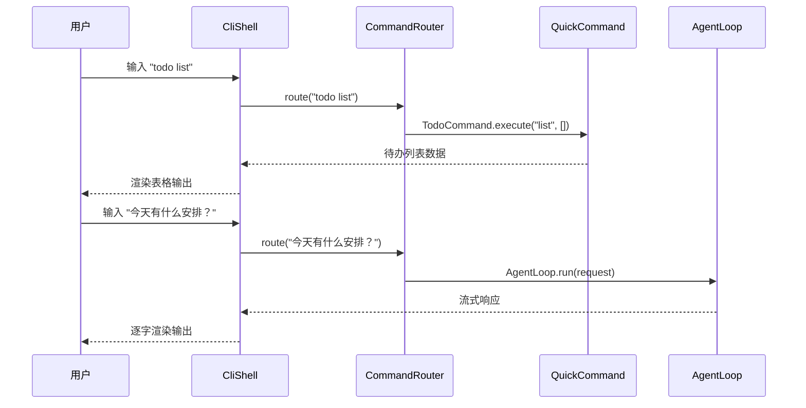

# CLI 交互层 — 架构设计

> **文档性质**：架构设计文档
> **模块归属**：`com.lifepilot.interaction`（规划中，尚未独立实现）
> **最后更新**：2026-03

## 1. 模块概述

CLI 交互层是知微（ZhiWei）规划中的命令行交互入口，基于 JLine 3 提供交互式对话和快捷命令能力。当前版本中，CLI 功能尚未实现——系统以纯 REST/SSE API 服务形式运行（`java -jar zhiwei.jar` 启动 Spring Boot Web 服务），所有用户交互通过 Web UI 或企业 IM 通道完成。

本文档记录 CLI 层的设计规划，供后续实现参考。

## 2. 架构图

> 虚线框表示规划中、尚未实现的组件。

## 3. 核心组件（规划）

### 3.1 FastPathRunner

- 职责：在 `main()` 方法中拦截 `--help`、`--version` 等命令，跳过 Spring 上下文初始化，实现毫秒级响应
- 设计要点：零依赖，不加载任何 Spring Bean

### 3.2 CliShell

- 职责：基于 JLine 3 的 REPL 主循环，实现 `CommandLineRunner`
- 双模式：交互式（无参数进入 REPL）和单次命令（有参数执行后退出）
- 提示符：`ZhiWei> `

### 3.3 CommandRouter

- 职责：将用户输入分发到快捷命令或自然语言对话
- 路由策略：前缀匹配快捷命令（todo/schedule/habit/llm/mcp/skill），其余走 AgentLoop

### 3.4 QuickCommand

- 职责：直接调用 Repository/Service 的快捷命令，不经过 LLM
- 优势：延迟 < 100ms、不消耗 Token、LLM 不可用时仍可工作

### 3.5 ResponseRenderer

- 职责：终端输出渲染，支持 CJK 宽字符对齐、表格格式、流式输出、Emoji 优先级颜色

### 3.6 CliCompleter

- 职责：基于 JLine 3 `AggregateCompleter` 的 Tab 补全，覆盖所有快捷命令和子命令

## 4. 核心流程（规划）

## 5. 设计决策

| 决策 | 选择 | 理由 |
|------|------|------|
| 终端库 | JLine 3 | Java 生态最成熟的终端交互库，支持补全、高亮、历史记录 |
| 快速路径 | main() 拦截 | 最简方案，零依赖，避免 Spring 启动开销 |
| 快捷命令直调 Repository | 不经过 AgentLoop | 延迟低、不消耗 Token、LLM 不可用时仍可工作 |
| CJK 宽字符计算 | 自定义 displayWidth() | 中文字符占 2 个终端宽度，表格对齐必须正确计算 |
| 当前不实现 CLI | 优先 Web UI + IM 通道 | REST/SSE API 层已建立，CLI 可后续通过 HTTP 客户端接入 |

## 6. 集成点

| 依赖模块 | 交互方式 | 说明 |
|---------|---------|------|
| Agent 引擎 | `AgentLoop.run()` | 自然语言对话走 Agent 控制循环 |
| Skill 系统 | `SkillRegistry` | 快捷命令可直接调用 Skill |
| 记忆系统 | 通过 AgentLoop | 对话上下文通过 Agent 引擎访问记忆 |

> CLI 层规划为直接调用 AgentLoop（进程内通信），不经过 MessageGateway 中间件管道。这与 Web/IM 通道不同——后者通过 Gateway 统一入口。未来 CLI 可迁移为 HTTP 客户端模式，通过 REST API 接入 Gateway。

## 7. 配置参考（规划）

| 配置键 | 默认值 | 说明 |
|--------|--------|------|
| `lifepilot.cli.show-banner` | `true` | 欢迎横幅开关 |
| `lifepilot.cli.prompt` | `ZhiWei> ` | 交互式提示符 |
| `lifepilot.cli.history-file` | `~/.zhiwei/cli-history` | 历史记录文件路径 |
| `lifepilot.cli.max-history-size` | `1000` | 最大历史记录条数 |
| `lifepilot.cli.stream-output` | `true` | 流式输出开关 |
