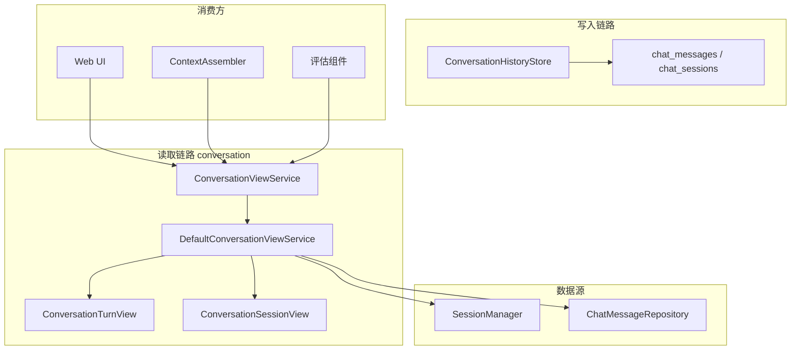
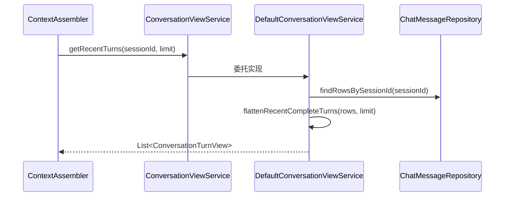
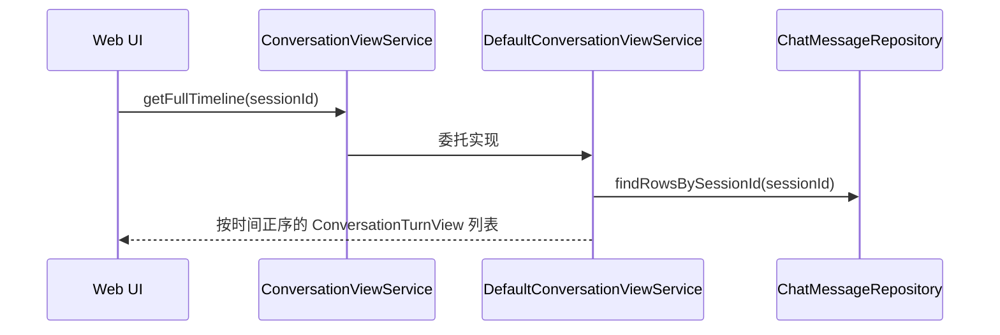

# 对话系统 — 架构设计

> **文档性质**：架构设计文档
> **模块归属**：`com.lifepilot.conversation`
> **最后更新**：2026-03-20

## 1. 模块概述

对话系统模块为上层提供统一的只读会话视图，并明确与记忆分层解耦：

- 原始对话写入由 `ConversationHistoryStore` 抽象负责
- 当前读路径由 `DefaultConversationViewService` 统一提供
- 会话元信息来自 `SessionManager`
- 消息时间线来自 `ChatMessageRepository`

当前实现已经取消“L2 优先、L0 退化”的读策略。原始对话统一直接从会话层读取，不再通过情景记忆回灌当前会话。

## 2. 架构图

## 3. 核心组件

### 3.1 ConversationViewService / DefaultConversationViewService

- 提供统一只读入口：
  - `getSession(sessionId)`
  - `getRecentTurns(sessionId, limit)`
  - `getFullTimeline(sessionId)`
- `getRecentTurns()` 从 `chat_messages` 读取并按完整轮次裁剪
- `getFullTimeline()` 直接返回会话全量时间线
- 不再依赖 `EpisodicMemory` 作为当前会话的主读路径

### 3.2 ConversationHistoryStore

- 提供 user / assistant / system 消息的持久化写入抽象
- 主要负责把原始消息写入会话层
- 该层是记忆系统之外的“对话事实源”

### 3.3 ConversationTurnView

- 统一的消息视图模型
- 字段包括：`sessionId`、`role`、`content`、`createdAt`、`reasoningSummary`
- `ContextAssembler` 会基于它拼接最近完整轮次

### 3.4 ConversationSessionView

- 会话级只读视图
- 字段包括：`sessionId`、`channelId`、`lastActiveAt`、`totalTurns`、`totalTokensUsed`
- 元信息来自 `SessionManager.findSession()`

## 4. 核心流程

### 4.1 读取最近完整轮次

### 4.2 读取完整时间线

## 5. 设计决策

| 决策 | 选择 | 理由 |
|------|------|------|
| 原始对话读路径 | 会话层直读 | 与 L1/L2 解耦，避免多份对话副本 |
| 最近消息裁剪单位 | 完整轮次 | 保证 user/assistant 成对保留 |
| 视图模型 | record 只读模型 | 与底层表结构和记忆实现解耦 |
| 写入与读取分离 | HistoryStore 写、ViewService 读 | 清晰隔离职责，便于替换实现 |

## 6. 集成点

| 集成模块 | 方向 | 说明 |
|---------|------|------|
| Agent 引擎（`com.lifepilot.agent`） | Agent → Conversation | `ContextAssembler` 读取最近完整轮次 |
| Web 层（`com.lifepilot.interaction.web`） | Web → Conversation | 对话页展示完整时间线 |
| 记忆系统（`com.lifepilot.memory`） | Memory → Conversation | L2 recall 的底层消息来源仍然是会话层 |

## 7. 当前限制

- 当前读模型以“会话层正确性”优先，不再做 L2 回退兜底
- 最近轮次裁剪依赖 `ConversationTurnGrouper` 的完整轮次分组规则
- 对话系统本身不负责跨会话 recall，那部分职责已明确交给记忆工具
