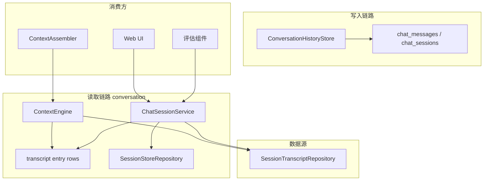
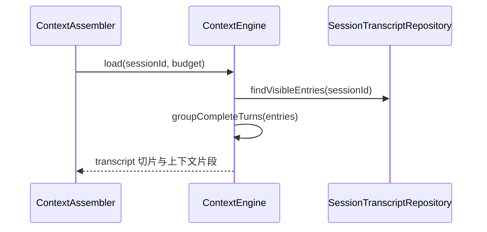
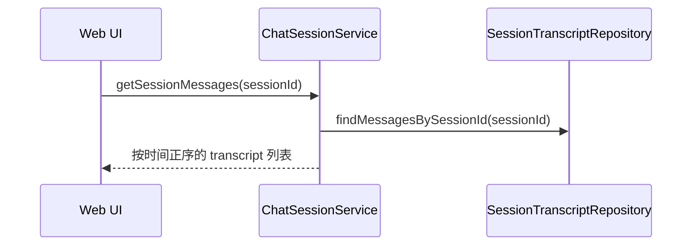

# 对话系统 — 架构设计

> **文档性质**：架构设计文档
> **模块归属**：`com.lifepilot.conversation`
> **最后更新**：2026-04-23

## 1. 模块概述

对话系统模块为上层提供统一的只读会话视图，并明确与记忆分层解耦：

- 原始对话写入由 `ConversationHistoryStore` 抽象负责
- Agent 上下文读取由 `ContextEngine` 负责
- Web 时间线读取由 `ChatSessionService + SessionTranscriptRepository` 负责
- 会话元信息来自 `SessionStoreRepository`

当前实现已经取消“L2 优先、L0 退化”的读策略。原始对话统一直接从会话层读取，不再通过情景记忆回灌当前会话。

## 2. 架构图

## 3. 核心组件

### 3.1 ContextEngine

- 负责 transcript-first 的上下文切片和最近完整轮次选择
- 从 `SessionTranscriptRepository.findVisibleEntries(sessionId)` 读取条目
- 内部按 user/assistant 顺序分组完整轮次
- 为 `ContextAssembler` 返回可直接注入 Prompt 的历史消息片段

### 3.2 ConversationHistoryStore

- 提供 user / assistant / system 消息的持久化写入抽象
- 主要负责把原始消息写入会话层
- 该层是记忆系统之外的“对话事实源”

### 3.3 transcript entry rows

- 当前历史消息读取基于 transcript 条目读模型
- 最近完整轮次由 `ContextEngine / CompactionEngine` 内部按顺序分组
- 不再依赖独立的 `ConversationTurnView` 视图类型

### 3.4 ChatSessionService / SessionStoreRepository

- `ChatSessionService` 为 Web 层组装会话列表、详情和完整时间线
- `SessionStoreRepository` 提供会话级元信息，如 `lastActiveAt`、`totalTokensUsed`
- Web 页面的完整聊天记录直接来自 transcript 读模型
- `session_store.project_id`（V17）标识会话的项目归属：NULL = 主账户对话，非 NULL = 归属具体项目；`SessionStoreRepository` 使用 `ProjectScope` sealed interface 表达两种互斥查询语义（`MainAccount` / `OfProject(projectId)`），并提供 `findIdsByProjectId` 供级联删除使用

## 4. 核心流程

### 4.1 读取最近完整轮次

### 4.2 读取完整时间线

## 5. 设计决策

| 决策 | 选择 | 理由 |
|------|------|------|
| 原始对话读路径 | 会话层直读 | 与 L1/L2 解耦，避免多份对话副本 |
| 最近消息裁剪单位 | 完整轮次 | 保证 user/assistant 成对保留 |
| 视图模型 | transcript 条目读模型 | 统一 Agent 与 Web 的历史事实源 |
| 写入与读取分离 | HistoryStore 写、ContextEngine / ChatSessionService 读 | 清晰隔离职责，便于替换实现 |

## 6. 集成点

| 集成模块 | 方向 | 说明 |
|---------|------|------|
| Agent 引擎（`com.lifepilot.agent`） | Agent → Conversation | `ContextAssembler` 读取最近完整轮次 |
| Web 层（`com.lifepilot.interaction.web`） | Web → Conversation | 对话页展示完整时间线 |
| 记忆系统（`com.lifepilot.memory`） | Memory → Conversation | L2 recall 的底层消息来源仍然是会话层 |
| 项目工作空间（`com.lifepilot.project`） | Project → Conversation | `session_store.project_id` 承载会话的项目归属；`ProjectService.deleteProject` 通过 `SessionStoreRepository.findIdsByProjectId` 找到归属会话并级联删除；fork 会话继承源会话的 `projectId` |

## 7. 当前限制

- 当前读模型以“会话层正确性”优先，不再做 L2 回退兜底
- 最近轮次裁剪依赖 `ContextEngine / CompactionEngine` 内部的完整轮次分组规则
- 对话系统本身不负责跨会话 recall，那部分职责已明确交给记忆工具
