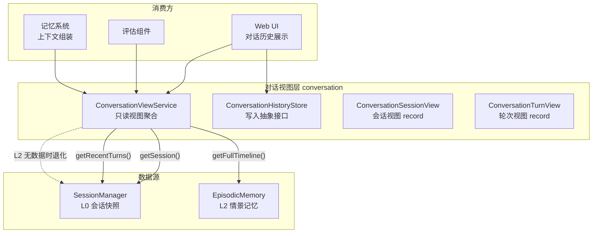
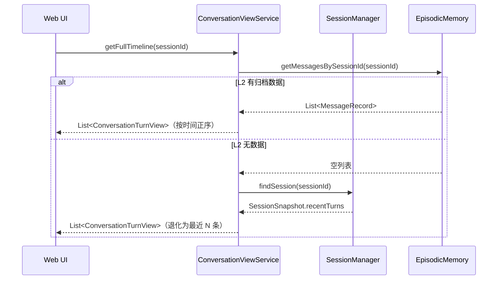

# 对话系统 — 架构设计

> **文档性质**：架构设计文档
> **模块归属**：`com.lifepilot.conversation`
> **最后更新**：2026-03

## 1. 模块概述

对话系统模块提供与底层会话存储和记忆系统解耦的统一对话视图层。它不承担写入职责（写入由 Agent 会话管理和记忆系统各自负责），而是聚合来自 L0 会话快照（`SessionManager`）和 L2 情景记忆（`EpisodicMemory`）的数据，为 Web UI、评估组件等下游模块提供只读的对话历史视图。

核心设计原则：对话历史的"呈现"与"存储"物理分离——存储分散在 Agent 会话层和记忆系统中，呈现通过 `ConversationViewService` 统一聚合。

## 2. 架构图

## 3. 核心组件

### 3.1 ConversationViewService / DefaultConversationViewService

- 职责：只读视图聚合服务，提供会话元信息和对话消息的统一读取入口
- 关键方法：
  - `getSession(sessionId)` → `Optional<ConversationSessionView>`：获取会话元信息
  - `getRecentTurns(sessionId, limit)` → `List<ConversationTurnView>`：获取最近 N 条消息（从 L0 快照）
  - `getFullTimeline(sessionId)` → `List<ConversationTurnView>`：获取完整时间线（优先 L2，退化到 L0）
- 数据源优先级：L2 EpisodicMemory > L0 SessionSnapshot.recentTurns

### 3.2 ConversationHistoryStore

- 职责：对话历史写入抽象接口，与记忆系统物理解耦
- 用途：Web UI 的对话历史"保存/加载"链路，不承载 L1-L4 记忆系统的落盘
- 关键方法：
  - `appendUserMessage(sessionId, userMessage, traceId)` → `String`（返回 messageId）
  - `appendAssistantMessage(sessionId, assistantMessage, reasoningSummary, traceId)` → `String`
  - `appendTurn(sessionId, userMessage, assistantMessage, reasoningSummary, traceId)`：便捷方法，委托给上述两个方法
  - `appendSystemMessage(sessionId, systemMessage, traceId)`：默认 no-op，需要落库的实现可覆盖

### 3.3 ConversationSessionView（record）

- 字段：`sessionId`、`channelId`、`lastActiveAt`、`totalTurns`、`totalTokensUsed`
- 来源：从 `SessionSnapshot` 映射而来

### 3.4 ConversationTurnView（record）

- 字段：`sessionId`、`role`（USER/ASSISTANT）、`content`、`createdAt`、`reasoningSummary`
- 来源：从 `ConversationTurn`（L0）或 `MessageRecord`（L2）映射而来

## 4. 核心流程

## 5. 设计决策

| 决策 | 选择 | 理由 |
|------|------|------|
| 读写分离 | ViewService 只读，HistoryStore 只写 | 避免与会话层和记忆层的持久化策略耦合 |
| 双数据源聚合 | L2 优先，L0 退化 | L2 有完整历史，L0 只有最近 N 轮快照 |
| record 视图模型 | ConversationSessionView / ConversationTurnView | 不可变、与底层存储结构解耦 |
| HistoryStore 默认 no-op | appendSystemMessage 默认空实现 | 向后兼容，不强制所有实现支持系统消息 |

## 6. 集成点

| 依赖方向 | 模块 | 交互方式 |
|---------|------|---------|
| conversation → agent | `com.lifepilot.agent.session` | `SessionManager.findSession()` 读取 L0 会话快照 |
| conversation → memory | `com.lifepilot.memory.episodic` | `EpisodicMemory.getMessagesBySessionId()` 读取 L2 归档 |
| web → conversation | `com.lifepilot.interaction.web` | Web 服务层调用 ViewService 和 HistoryStore |
| eval → conversation | `com.lifepilot.eval` | 评估组件读取对话历史用于轨迹评估 |

## 7. 配置参考

本模块无独立配置项。对话历史的存储容量和保留策略由 Agent 会话管理（`lifepilot.agent.session.*`）和记忆系统（`lifepilot.memory.*`）各自配置。
